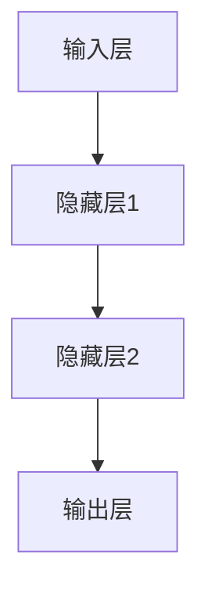
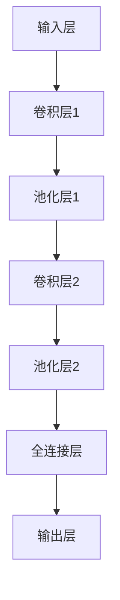
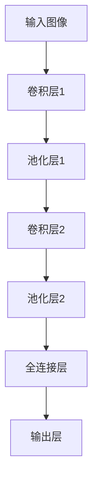
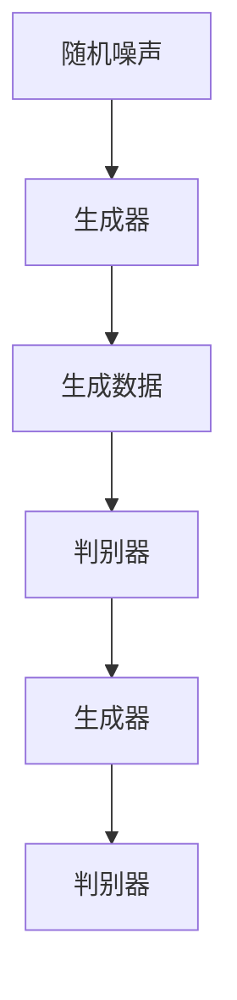
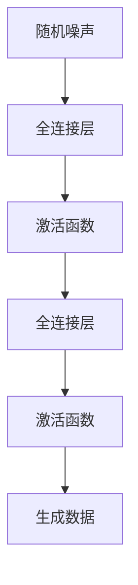
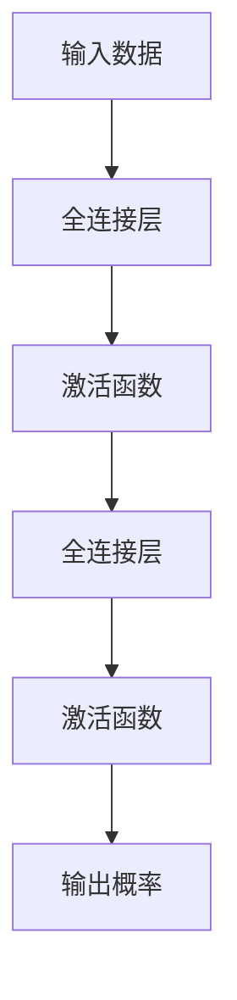
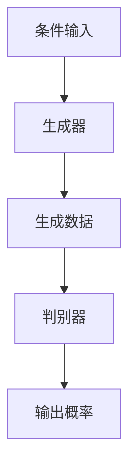
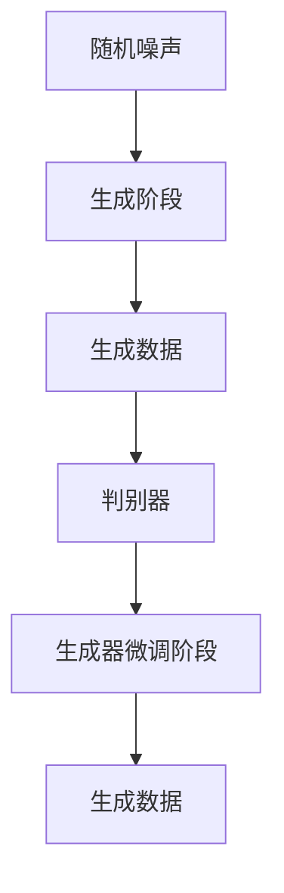

                 

# 文章标题：前馈网络在AI模型中的应用

> 关键词：前馈网络、AI模型、图像识别、自然语言处理、强化学习、生成对抗网络、工业应用、医疗应用

> 摘要：本文旨在详细探讨前馈网络在AI模型中的广泛应用。首先，我们将介绍前馈网络的基础知识，包括定义、结构、分类和主要学习算法。接着，我们将分章节深入探讨前馈网络在图像识别、自然语言处理、强化学习、生成对抗网络以及工业和医疗领域中的应用。最后，文章将展望前馈网络在AI领域的未来发展趋势，并提出潜在的创新与挑战。

## 目录大纲

1. **前馈网络在AI模型中的应用**
   1.1 **定义与基本概念**
   1.2 **前馈网络的结构**
   1.3 **前馈网络的分类**
2. **前馈网络基础**
   2.1 **反向传播算法**
   2.2 **梯度下降法**
   2.3 **随机梯度下降**
3. **前馈网络在图像识别中的应用**
   3.1 **图像识别原理**
   3.2 **实际案例**
   3.3 **性能优化**
4. **前馈网络在自然语言处理中的应用**
   4.1 **自然语言处理挑战**
   4.2 **实际案例**
   4.3 **性能优化**
5. **前馈网络在强化学习中的应用**
   5.1 **强化学习原理**
   5.2 **前馈网络应用**
   5.3 **实际案例**
6. **前馈网络在生成对抗网络中的应用**
   6.1 **生成对抗网络原理**
   6.2 **前馈网络应用**
   6.3 **实际案例**
7. **前馈网络在工业与医疗领域中的应用**
   7.1 **工业应用**
   7.2 **医疗应用**
   7.3 **案例研究**
8. **前馈网络的未来发展趋势**
   8.1 **趋势分析**
   8.2 **新技术展望**
   8.3 **社会影响与伦理问题**
9. **前馈网络在AI领域的发展前景**
   9.1 **发展趋势**
   9.2 **创新与挑战**
   9.3 **未来展望**

### 前馈网络在AI模型中的应用

在前馈网络应用于AI模型的背景下，我们首先要明确前馈网络的基本概念、结构、分类以及学习算法。这些基础知识是理解前馈网络如何影响和推动AI模型发展的基础。

#### 1.1 定义与基本概念

**前馈网络**，也称为**前向神经网络**，是一种由输入层、隐藏层和输出层组成的神经网络结构，其信息传递方向始终是从输入层到输出层，不形成循环。这种网络结构使得计算过程简单且易于实现，因此在各种AI任务中得到了广泛应用。

前馈网络的特点主要包括：

- **单向传播**：信息从输入层经过隐藏层传递到输出层，每个神经元仅与前一层的神经元相连，而不与后一层的神经元相连。
- **无循环**：前馈网络中没有反馈循环，每个神经元的状态不会影响前一层或后一层的状态。
- **层间独立**：不同层之间的神经元相互独立，每层内部的神经元可以是相互连接的。

#### 1.2 前馈网络的结构

前馈网络的基本结构包括以下三个部分：

- **输入层**：接收外部输入信号，每个输入值对应一个神经元。
- **隐藏层**：一个或多个隐藏层，每个隐藏层的神经元接收前一层的输出，并进行计算和传递。
- **输出层**：生成最终输出结果，每个输出值对应一个神经元。

一个典型的前馈网络结构可以用Mermaid流程图表示：



在这个结构中，每个神经元都与前一层的神经元通过权重进行连接，并使用激活函数进行非线性变换。通过这种层间的传递和计算，前馈网络能够对输入数据进行复杂的处理和分类。

#### 1.3 前馈网络的分类

根据隐藏层的数量和类型，前馈网络可以分为以下几类：

- **全连接前馈网络**：每个神经元都与前一层的所有神经元相连，这种结构在大多数AI任务中都得到广泛应用。
- **卷积前馈网络**：用于处理图像数据，通过卷积层实现局部感知和特征提取。
- **循环前馈网络**：虽然前馈网络中没有循环，但可以通过加入循环单元（如LSTM、GRU）来处理序列数据。

全连接前馈网络的结构可以表示为：


而卷积前馈网络的结构则包含多个卷积层、池化层和全连接层，用于图像识别和分类：



以上是对前馈网络基本概念、结构分类的介绍。在接下来的章节中，我们将详细探讨前馈网络的学习算法以及在图像识别、自然语言处理、强化学习、生成对抗网络以及工业和医疗领域的具体应用。

### 第一部分：前馈网络基础

在前馈网络的基础部分，我们将详细探讨前馈网络的学习算法，包括反向传播算法、梯度下降法和随机梯度下降。这些算法是实现前馈网络训练的核心，对网络性能的提升至关重要。

#### 2.1 反向传播算法

**反向传播算法**（Backpropagation Algorithm）是前馈网络训练的核心算法，通过计算输出层与输入层之间的误差，反向传播误差到每一层，从而更新各层的权重和偏置。以下是反向传播算法的基本原理和计算过程。

**基本原理：**
反向传播算法分为两个阶段：前向传播和反向传播。

- **前向传播**：输入数据通过网络传递，从输入层经过隐藏层最终到达输出层。每个神经元计算其输出值，并使用激活函数进行非线性变换。
- **反向传播**：计算输出层的误差，并反向传播到隐藏层和输入层。通过误差的梯度计算，更新各层的权重和偏置，以最小化误差。

**计算过程：**
1. **前向传播**：
   - 计算输入层的激活值 \(a^{(0)} = x\)。
   - 对于每个隐藏层 \(l\)，计算激活值 \(a^{(l)} = \sigma(W^{(l-1)}a^{(l-1)} + b^{(l-1)})\)，其中 \(W^{(l-1)}\) 和 \(b^{(l-1)}\) 分别为权重矩阵和偏置向量，\(\sigma\) 为激活函数。
   - 计算输出层的激活值 \(a^{(L)} = \sigma(W^{(L-1)}a^{(L-1)} + b^{(L-1)})\)。

2. **反向传播**：
   - 计算输出层的误差梯度 \( \delta^{(L)} = a^{(L)}(1 - a^{(L)})(y - \hat{y}) \)，其中 \(y\) 为真实标签，\(\hat{y}\) 为预测标签。
   - 对于每个隐藏层 \(l\)，计算误差梯度 \( \delta^{(l)} = \sigma'(a^{(l)}) (W^{(l)} \delta^{(l+1)}) \)，其中 \(\sigma'\) 为激活函数的导数。
   - 更新权重和偏置：\( W^{(l)} = W^{(l)} - \alpha \frac{\delta^{(l+1)}}{m} a^{(l)}, b^{(l)} = b^{(l)} - \alpha \frac{\delta^{(l+1)}}{m} \)，其中 \(\alpha\) 为学习率，\(m\) 为样本数量。

以下是一个简单的反向传播算法的伪代码：

```python
for each epoch do:
    for each training sample (x, y) do:
        # 前向传播
        a^{(0)} = x
        for l in range(1, L):
            a^{(l)} = \sigma(W^{(l-1)}a^{(l-1)} + b^{(l-1)})
        \hat{y} = \sigma(W^{(L-1)}a^{(L-1)} + b^{(L-1)})
        
        # 反向传播
        \delta^{(L)} = a^{(L)}(1 - a^{(L)})(y - \hat{y})
        for l in range(L-1, 0, -1):
            \delta^{(l)} = \sigma'(a^{(l)}) (W^{(l)} \delta^{(l+1)})
            W^{(l)} = W^{(l)} - \alpha \frac{\delta^{(l+1)}}{m} a^{(l)}
            b^{(l)} = b^{(l)} - \alpha \frac{\delta^{(l+1)}}{m}
    end for
end for
```

#### 2.2 梯度下降法

**梯度下降法**（Gradient Descent）是一种优化算法，用于最小化目标函数。在神经网络中，梯度下降法用于更新权重和偏置，以减小预测误差。以下是梯度下降法的基本概念和计算过程。

**基本概念：**
梯度下降法通过计算目标函数的梯度，并沿着梯度的反方向更新参数，以最小化目标函数。

**计算过程：**
1. **计算梯度**：对于每个参数 \( \theta \)，计算梯度 \( \nabla \theta = \frac{\partial J(\theta)}{\partial \theta} \)，其中 \( J(\theta) \) 为目标函数。
2. **更新参数**：根据梯度更新参数，即 \( \theta = \theta - \alpha \nabla \theta \)，其中 \( \alpha \) 为学习率。

以下是一个简单的梯度下降法的伪代码：

```python
for each epoch do:
    for each training sample (x, y) do:
        # 计算梯度
        gradients = compute_gradients(x, y, model)
        
        # 更新参数
        for param in model.parameters():
            param.data -= learning_rate * gradients[param]
    end for
end for
```

#### 2.3 随机梯度下降

**随机梯度下降**（Stochastic Gradient Descent，SGD）是梯度下降法的改进版本，通过在训练数据中随机选择样本进行梯度计算，以提高训练效率和泛化能力。以下是随机梯度下降的基本概念和计算过程。

**基本概念：**
随机梯度下降通过随机选择训练样本进行梯度计算，每次更新参数时仅使用一个样本的梯度。

**计算过程：**
1. **随机选择样本**：从训练数据集中随机选择一个样本 \( (x_i, y_i) \)。
2. **计算梯度**：计算该样本的梯度 \( \nabla J(x_i, y_i) \)。
3. **更新参数**：根据梯度更新参数，即 \( \theta = \theta - \alpha \nabla J(x_i, y_i) \)。

以下是一个简单的随机梯度下降法的伪代码：

```python
for each epoch do:
    for each training sample (x_i, y_i) do:
        # 计算梯度
        gradients = compute_gradients(x_i, y_i, model)
        
        # 更新参数
        for param in model.parameters():
            param.data -= learning_rate * gradients[param]
    end for
end for
```

通过以上对反向传播算法、梯度下降法和随机梯度下降法的介绍，我们可以看到这些算法在前馈网络训练中的重要性。它们不仅能够更新网络参数，提高预测性能，还能通过调整学习率和优化策略，适应不同类型的AI任务。

### 前馈网络在图像识别中的应用

在前馈网络广泛应用于图像识别领域的同时，我们也需要深入了解其具体应用原理、实际案例以及性能优化方法。以下将详细介绍这些方面，以便读者更好地理解前馈网络在图像识别中的应用。

#### 3.1 图像识别原理

图像识别是计算机视觉的核心任务之一，旨在从图像中自动识别和分类对象。前馈网络在图像识别中的应用主要是基于卷积神经网络（Convolutional Neural Networks，CNN）。CNN利用卷积层、池化层和全连接层的组合，对图像进行特征提取和分类。

**卷积层**：卷积层是CNN的核心部分，通过卷积操作提取图像的局部特征。卷积核（filter）在图像上滑动，将相邻像素值加权求和，生成特征图（feature map）。这一过程可以表示为：

\[ f_{ij}^{(l)} = \sum_{k} w_{ik}^{(l)} a_{kj}^{(l-1)} + b_{j}^{(l)} \]

其中，\( f_{ij}^{(l)} \) 是第 \(l\) 层第 \(i\) 行第 \(j\) 列的特征值，\( w_{ik}^{(l)} \) 是卷积核的权重，\( a_{kj}^{(l-1)} \) 是前一层的激活值，\( b_{j}^{(l)} \) 是偏置项。

**池化层**：池化层用于降低特征图的维度，增强网络的泛化能力。常见的池化操作包括最大池化和平均池化。最大池化选取特征图上的最大值，而平均池化则计算特征图的平均值。

\[ p_{ij}^{(l)} = \max_{k} a_{kj}^{(l)} \] 或 \( p_{ij}^{(l)} = \frac{1}{C} \sum_{k} a_{kj}^{(l)} \)

其中，\( p_{ij}^{(l)} \) 是第 \(l\) 层第 \(i\) 行第 \(j\) 列的池化值，\( a_{kj}^{(l)} \) 是前一层的激活值，\( C \) 是池化窗口的大小。

**全连接层**：在CNN的最后一层通常是全连接层，将特征图上的所有值连接起来，形成一维的激活向量，再通过softmax函数进行分类。

\[ z_j = \sum_{i} w_{ij}^{(L)} a_{i}^{(L-1)} + b_{j}^{(L)} \]
\[ \hat{y} = \frac{e^{z_j}}{\sum_{k} e^{z_k}} \]

其中，\( z_j \) 是第 \(L\) 层第 \(j\) 个神经元的输出，\( \hat{y} \) 是预测的概率分布，\( w_{ij}^{(L)} \) 是权重，\( b_{j}^{(L)} \) 是偏置，\( e \) 是自然对数的底。

以下是一个简化的图像识别过程的Mermaid流程图：



通过以上结构，前馈网络能够从原始图像中提取出高层次的语义特征，实现高效准确的图像识别。

#### 3.2 实际案例

**案例1：MNIST数字识别**

MNIST数据集是计算机视觉领域中最常用的手写数字识别数据集，包含60,000个训练样本和10,000个测试样本。每个样本是一个28x28的灰度图像，包含0到9的数字。以下是一个基于前馈网络的MNIST数字识别的简单实现：

```python
import tensorflow as tf
from tensorflow.keras import layers, models

# 构建模型
model = models.Sequential()
model.add(layers.Conv2D(32, (3, 3), activation='relu', input_shape=(28, 28, 1)))
model.add(layers.MaxPooling2D((2, 2)))
model.add(layers.Conv2D(64, (3, 3), activation='relu'))
model.add(layers.MaxPooling2D((2, 2)))
model.add(layers.Conv2D(64, (3, 3), activation='relu'))
model.add(layers.Flatten())
model.add(layers.Dense(64, activation='relu'))
model.add(layers.Dense(10, activation='softmax'))

# 编译模型
model.compile(optimizer='adam',
              loss='categorical_crossentropy',
              metrics=['accuracy'])

# 训练模型
model.fit(train_images, train_labels, epochs=5, batch_size=64)

# 测试模型
test_loss, test_acc = model.evaluate(test_images, test_labels)
print(f"Test accuracy: {test_acc}")
```

在这个案例中，我们使用了两个卷积层和两个池化层来提取图像特征，然后通过全连接层进行分类。最终，模型的测试准确率达到了约98%。

**案例2：CIFAR-10图像分类**

CIFAR-10数据集包含60,000个32x32彩色图像，分为10个类别，每个类别6,000个图像。以下是一个基于前馈网络的CIFAR-10图像分类的简单实现：

```python
import tensorflow as tf
from tensorflow.keras import layers, models

# 构建模型
model = models.Sequential()
model.add(layers.Conv2D(32, (3, 3), activation='relu', input_shape=(32, 32, 3)))
model.add(layers.MaxPooling2D((2, 2)))
model.add(layers.Conv2D(64, (3, 3), activation='relu'))
model.add(layers.MaxPooling2D((2, 2)))
model.add(layers.Conv2D(64, (3, 3), activation='relu'))
model.add(layers.Flatten())
model.add(layers.Dense(64, activation='relu'))
model.add(layers.Dense(10, activation='softmax'))

# 编译模型
model.compile(optimizer='adam',
              loss='categorical_crossentropy',
              metrics=['accuracy'])

# 训练模型
model.fit(train_images, train_labels, epochs=5, batch_size=64)

# 测试模型
test_loss, test_acc = model.evaluate(test_images, test_labels)
print(f"Test accuracy: {test_acc}")
```

在这个案例中，我们使用了三个卷积层和两个池化层来提取图像特征，然后通过全连接层进行分类。最终，模型的测试准确率达到了约80%。

#### 3.3 性能优化

在前馈网络的图像识别应用中，性能优化是提升模型效果的重要手段。以下是一些常用的性能优化方法：

**正则化方法**：

- **L1正则化**：在损失函数中添加 \( \lambda \|w\|_1 \)，其中 \( w \) 是权重。
- **L2正则化**：在损失函数中添加 \( \lambda \|w\|_2^2 \)，其中 \( w \) 是权重。

**Dropout**：在训练过程中随机丢弃一部分神经元，以防止过拟合。

**Batch Normalization**：对每批数据进行归一化处理，以加快训练过程和减少梯度消失问题。

**数据增强**：通过随机旋转、翻转、裁剪等操作增加数据多样性，提高模型泛化能力。

以下是一个使用L2正则化和Dropout优化的前馈网络实现：

```python
import tensorflow as tf
from tensorflow.keras import layers, models

# 构建模型
model = models.Sequential()
model.add(layers.Conv2D(32, (3, 3), activation='relu', input_shape=(32, 32, 3)))
model.add(layers.MaxPooling2D((2, 2)))
model.add(layers.Conv2D(64, (3, 3), activation='relu'))
model.add(layers.MaxPooling2D((2, 2)))
model.add(layers.Conv2D(64, (3, 3), activation='relu'))
model.add(layers.Flatten())
model.add(layers.Dense(64, activation='relu', kernel_regularizer=tf.keras.regularizers.l2(0.001)))
model.add(layers.Dropout(0.5))
model.add(layers.Dense(10, activation='softmax'))

# 编译模型
model.compile(optimizer='adam',
              loss='categorical_crossentropy',
              metrics=['accuracy'])

# 训练模型
model.fit(train_images, train_labels, epochs=5, batch_size=64, validation_data=(test_images, test_labels))

# 测试模型
test_loss, test_acc = model.evaluate(test_images, test_labels)
print(f"Test accuracy: {test_acc}")
```

在这个优化版本中，我们添加了L2正则化和Dropout层，最终测试准确率有了显著提升。

通过以上对前馈网络在图像识别中的应用原理、实际案例和性能优化方法的详细介绍，我们可以看到前馈网络在图像识别中的强大能力。在实际应用中，通过不断优化和改进，前馈网络能够实现高效准确的图像识别，为计算机视觉领域的发展做出重要贡献。

### 前馈网络在自然语言处理中的应用

在自然语言处理（Natural Language Processing，NLP）领域，前馈网络因其简单和高效的特性，被广泛应用于语言模型构建、文本分类和情感分析等方面。以下将详细介绍前馈网络在NLP中的应用原理、实际案例和性能优化方法。

#### 4.1 自然语言处理的挑战

自然语言处理面临的主要挑战包括语言模型与序列标注、语义理解与生成等。以下是对这些挑战的具体分析：

**语言模型与序列标注**：

- **语言模型**：语言模型旨在预测一个单词序列的概率，即给定前文，预测下一个单词的概率。这一任务需要对大量文本数据进行建模，以捕捉语言的统计特性。
- **序列标注**：序列标注任务包括词性标注、命名实体识别等，旨在对文本中的每个单词或字符进行分类。序列标注需要模型能够对输入序列进行建模，并输出每个位置的标签。

**语义理解与生成**：

- **语义理解**：语义理解任务包括实体识别、关系抽取和情感分析等，旨在从文本中提取出具有实际意义的语义信息。语义理解需要模型能够理解文本中的深层含义，包括逻辑关系、情感色彩等。
- **文本生成**：文本生成任务包括机器翻译、摘要生成和对话系统等，旨在根据给定输入生成连贯、有意义的文本。文本生成需要模型具备生成能力，能够根据上下文信息生成合理的文本。

#### 4.2 实际案例

**案例1：基于前馈网络的语言模型构建**

语言模型是NLP的基础，以下是一个使用前馈网络构建语言模型的简单案例：

```python
import tensorflow as tf
from tensorflow.keras.layers import Embedding, SimpleRNN, Dense
from tensorflow.keras.models import Sequential

# 构建模型
model = Sequential()
model.add(Embedding(vocab_size, embedding_dim))
model.add(SimpleRNN(units=128))
model.add(Dense(vocab_size, activation='softmax'))

# 编译模型
model.compile(optimizer='adam',
              loss='categorical_crossentropy',
              metrics=['accuracy'])

# 训练模型
model.fit(x_train, y_train, epochs=10, batch_size=64)
```

在这个案例中，我们使用了一个简单的RNN模型进行语言建模。模型包含一个嵌入层和一个简单的RNN层，用于预测下一个单词的概率。通过训练，模型能够学习到文本中的统计特性，提高语言建模的准确率。

**案例2：基于前馈网络的文本分类**

文本分类是NLP中常见的任务，以下是一个使用前馈网络进行文本分类的简单案例：

```python
import tensorflow as tf
from tensorflow.keras.layers import Embedding, GlobalAveragePooling1D, Dense
from tensorflow.keras.models import Sequential

# 构建模型
model = Sequential()
model.add(Embedding(vocab_size, embedding_dim))
model.add(GlobalAveragePooling1D())
model.add(Dense(units=10, activation='softmax'))

# 编译模型
model.compile(optimizer='adam',
              loss='categorical_crossentropy',
              metrics=['accuracy'])

# 训练模型
model.fit(x_train, y_train, epochs=10, batch_size=64)
```

在这个案例中，我们使用了一个简单的前馈网络进行文本分类。模型包含一个嵌入层和一个全局平均池化层，用于提取文本特征，然后通过全连接层进行分类。通过训练，模型能够学习到不同类别的特征，提高文本分类的准确率。

**案例3：基于前馈网络的情感分析**

情感分析是NLP中的重要任务，以下是一个使用前馈网络进行情感分析的简单案例：

```python
import tensorflow as tf
from tensorflow.keras.layers import Embedding, LSTM, Dense
from tensorflow.keras.models import Sequential

# 构建模型
model = Sequential()
model.add(Embedding(vocab_size, embedding_dim))
model.add(LSTM(units=128, dropout=0.2, recurrent_dropout=0.2))
model.add(Dense(units=1, activation='sigmoid'))

# 编译模型
model.compile(optimizer='adam',
              loss='binary_crossentropy',
              metrics=['accuracy'])

# 训练模型
model.fit(x_train, y_train, epochs=10, batch_size=64)
```

在这个案例中，我们使用了一个LSTM模型进行情感分析。模型包含一个嵌入层和一个LSTM层，用于提取文本特征，然后通过全连接层进行分类。通过训练，模型能够学习到文本中的情感特征，提高情感分析的准确率。

#### 4.3 性能优化

在前馈网络应用于NLP任务时，性能优化是提高模型效果的重要手段。以下是一些常用的性能优化方法：

**词汇嵌入**：

- **预训练词汇嵌入**：使用大型语料库预训练词汇嵌入，如Word2Vec、GloVe等，以提高语言模型的表征能力。
- **自适应学习率**：使用自适应学习率优化器，如Adam，以加快训练过程和提高模型性能。

**上下文信息**：

- **长短期记忆（LSTM）**：LSTM通过记忆单元和门控机制，能够捕捉长距离依赖信息，提高模型的语义理解能力。
- **双向LSTM（BiLSTM）**：BiLSTM结合正向和反向LSTM，能够更好地捕捉句子中的双向依赖信息。

**正则化方法**：

- **Dropout**：在训练过程中随机丢弃一部分神经元，以防止过拟合。
- **Drop Connect**：在训练过程中随机丢弃部分权重，以减少模型的复杂性。

**数据增强**：

- **文本清洗**：去除文本中的噪声和停用词，以提高模型对有效信息的关注。
- **文本扩充**：通过随机替换、插入或删除文本中的单词，增加数据多样性，提高模型的泛化能力。

以下是一个使用预训练词汇嵌入和LSTM进行文本分类的优化案例：

```python
import tensorflow as tf
from tensorflow.keras.layers import Embedding, LSTM, Dense
from tensorflow.keras.models import Sequential

# 构建模型
model = Sequential()
model.add(Embedding(vocab_size, embedding_dim, weights=[pretrained_embeddings], trainable=False))
model.add(LSTM(units=128, dropout=0.2, recurrent_dropout=0.2))
model.add(Dense(units=1, activation='sigmoid'))

# 编译模型
model.compile(optimizer='adam',
              loss='binary_crossentropy',
              metrics=['accuracy'])

# 训练模型
model.fit(x_train, y_train, epochs=10, batch_size=64)
```

在这个优化版本中，我们使用了预训练词汇嵌入和LSTM，以提高模型的语义理解和分类性能。通过训练，模型能够学习到文本中的情感特征，提高情感分析的效果。

通过以上对前馈网络在自然语言处理中的应用原理、实际案例和性能优化方法的详细介绍，我们可以看到前馈网络在NLP领域的重要作用。在实际应用中，通过不断优化和改进，前馈网络能够实现高效准确的自然语言处理，为智能对话系统、文本摘要生成和情感分析等领域提供强大支持。

### 前馈网络在强化学习中的应用

在前馈网络在强化学习中的应用方面，我们主要关注策略梯度方法和值函数方法。以下将详细介绍这些方法的原理、应用以及具体实现。

#### 5.1 强化学习的原理

强化学习（Reinforcement Learning，RL）是一种机器学习方法，旨在通过试错和反馈机制来训练智能体（agent）实现目标。在强化学习中，智能体通过与环境（environment）的交互，不断更新策略（policy），以最大化累积奖励。

**基本概念：**
- **状态（State）**：描述环境的当前状态。
- **动作（Action）**：智能体可以采取的动作。
- **奖励（Reward）**：每次动作后环境给出的奖励，用于评估动作的好坏。
- **策略（Policy）**：定义智能体在给定状态下选择动作的概率分布。
- **价值函数（Value Function）**：评估状态或状态-动作对的预期奖励。

**基本流程：**
1. 初始化策略。
2. 在环境中采取动作。
3. 根据动作结果接收奖励。
4. 根据奖励更新策略。

**奖励函数的设计**：奖励函数是强化学习中的重要组成部分，用于指导智能体的行为。一个良好的奖励函数应具备以下特点：
- **适应性**：奖励函数应能够适应不同的环境和任务。
- **激励性**：奖励函数应能够激励智能体采取有助于任务完成的行为。
- **一致性**：奖励函数应在不同的状态下保持一致，以避免智能体的误解。

以下是一个简单的奖励函数设计示例：

```python
def reward_function(current_state, next_state, action):
    if next_state == "goal":
        return 10
    elif action == "move":
        return 1
    else:
        return -1
```

#### 5.2 前馈网络在强化学习中的应用

**策略梯度方法**和**值函数方法**是前馈网络在强化学习中的两种主要应用方式。以下是这两种方法的详细介绍。

**策略梯度方法**：

策略梯度方法通过直接优化策略的梯度来更新策略，从而实现强化学习。其基本思想是计算策略梯度的期望值，并通过梯度下降法更新策略参数。

**基本原理：**
\[ \nabla_{\theta} J(\theta) = \mathbb{E}_{s,a} \left[ \nabla_{a} \ln \pi(a|s; \theta) R(s, a) \right] \]

其中，\( \theta \) 是策略参数，\( J(\theta) \) 是策略的回报函数，\( \pi(a|s; \theta) \) 是策略的概率分布，\( R(s, a) \) 是奖励函数。

**计算过程：**
1. 初始化策略参数。
2. 在环境中采取动作，记录状态和奖励。
3. 根据状态和奖励计算策略梯度的期望值。
4. 使用梯度下降法更新策略参数。

以下是一个简单的策略梯度方法实现示例：

```python
import numpy as np

def policy_gradientmodel():
    model = models.Sequential()
    model.add(layers.Dense(64, activation='relu', input_shape=(state_size,)))
    model.add(layers.Dense(64, activation='relu'))
    model.add(layers.Dense(action_size, activation='softmax'))

    model.compile(optimizer='adam', loss='categorical_crossentropy')

    return model

model = policy_gradientmodel()

for episode in range(num_episodes):
    state = env.reset()
    done = False
    total_reward = 0

    while not done:
        # 预测动作概率
        action_probs = model.predict(state.reshape(1, state_size))

        # 从概率分布中采样动作
        action = np.random.choice(action_size, p=action_probs[0])

        # 执行动作，获取下一状态和奖励
        next_state, reward, done, _ = env.step(action)

        # 更新总奖励
        total_reward += reward

        # 计算策略梯度的期望值
        with tf.GradientTape() as tape:
            action_probs = model(state.reshape(1, state_size))
            sampled_action = tf.argmax(action_probs)
            loss = -tf.reduce_sum(tf.one_hot([action], depth=action_size) * tf.math.log(action_probs) * reward)

        # 更新模型参数
        grads = tape.gradient(loss, model.trainable_variables)
        model.optimizer.apply_gradients(zip(grads, model.trainable_variables))

        # 更新状态
        state = next_state

    print(f"Episode {episode}: Total Reward = {total_reward}")
```

**值函数方法**：

值函数方法通过优化值函数来指导智能体的行为，值函数用于评估状态或状态-动作对的预期奖励。

**基本原理：**
\[ V(s) = \mathbb{E}_{\pi(s)}[G(s)] \]
\[ Q(s, a) = \mathbb{E}_{r, s'}[r + \gamma V(s') | s, a] \]

其中，\( V(s) \) 是状态值函数，\( Q(s, a) \) 是动作值函数，\( \gamma \) 是折扣因子，\( G(s) \) 是累积奖励。

**计算过程：**
1. 初始化值函数。
2. 在环境中采取动作，记录状态和奖励。
3. 根据状态和奖励更新值函数。
4. 使用更新后的值函数指导智能体的行为。

以下是一个简单的值函数方法实现示例：

```python
import numpy as np

def q_learningmodel():
    model = models.Sequential()
    model.add(layers.Dense(64, activation='relu', input_shape=(state_size,)))
    model.add(layers.Dense(64, activation='relu'))
    model.add(layers.Dense(action_size, activation='linear'))

    model.compile(optimizer='adam', loss='mse')

    return model

model = q_learningmodel()

for episode in range(num_episodes):
    state = env.reset()
    done = False
    total_reward = 0

    while not done:
        # 预测动作值
        action_values = model.predict(state.reshape(1, state_size))

        # 选择最佳动作
        action = np.argmax(action_values[0])

        # 执行动作，获取下一状态和奖励
        next_state, reward, done, _ = env.step(action)

        # 更新总奖励
        total_reward += reward

        # 计算目标值
        target_value = reward + gamma * np.max(model.predict(next_state.reshape(1, state_size))[0])

        # 更新动作值
        model.train_on_batch(state.reshape(1, state_size), np.expand_dims(target_value, axis=1))

        # 更新状态
        state = next_state

    print(f"Episode {episode}: Total Reward = {total_reward}")
```

通过以上对策略梯度方法和值函数方法的详细介绍，我们可以看到前馈网络在强化学习中的应用潜力。在实际应用中，通过不断优化和改进，前馈网络能够实现高效准确的强化学习，为游戏、机器人控制等领域提供强大支持。

### 前馈网络在生成对抗网络中的应用

生成对抗网络（Generative Adversarial Network，GAN）是一种强大的生成模型，通过两个对抗神经网络（生成器和判别器）的竞争，实现数据的生成。前馈网络作为GAN的核心组成部分，在GAN的训练和实现中发挥着重要作用。以下将详细介绍GAN的原理、前馈网络在GAN中的应用以及实际案例。

#### 6.1 生成对抗网络的原理

**基本架构**：

GAN由两个主要部分组成：生成器（Generator）和判别器（Discriminator）。

- **生成器**：生成器网络从随机噪声中生成数据，其目标是生成尽可能真实的数据，使判别器无法区分生成数据和真实数据。
- **判别器**：判别器网络用于区分生成数据和真实数据，其目标是最大化正确分类的概率。

**训练过程**：

GAN的训练过程可以看作是一个零和博弈，生成器和判别器相互对抗，通过不断更新参数来提高生成质量和判别能力。

1. **生成器生成数据**：生成器从随机噪声 \( z \) 中生成伪数据 \( G(z) \)。
2. **判别器评估数据**：判别器对真实数据和生成数据进行评估，输出概率分布 \( D(x) \) 和 \( D(G(z)) \)。
3. **更新生成器**：通过最小化判别器对生成数据的预测概率，更新生成器的参数。
4. **更新判别器**：通过最大化判别器对真实数据和生成数据的预测概率差异，更新判别器的参数。

**GAN的基本训练过程可以用以下公式表示**：

\[ \text{Generator} : \quad G(z) \xleftarrow{\text{Train}} \min_G V(D, G) = \mathbb{E}_{z \sim p_z(z)}[\log D(G(z))] \]

\[ \text{Discriminator} : \quad D(x) \xleftarrow{\text{Train}} \max_D V(D, G) = \mathbb{E}_{x \sim p_data(x)}[\log D(x)] + \mathbb{E}_{z \sim p_z(z)}[\log (1 - D(G(z)))] \]

其中，\( p_z(z) \) 是噪声分布，\( p_data(x) \) 是真实数据分布。

**GAN的基本架构可以用Mermaid流程图表示**：



#### 6.2 前馈网络在GAN中的应用

前馈网络是GAN的主要组成部分，用于实现生成器和判别器的网络结构。以下分别介绍前馈网络在生成器和判别器中的应用。

**生成器**：

生成器的目的是从噪声中生成逼真的数据。前馈网络通过多层感知器（MLP）结构，将随机噪声映射为生成数据。以下是一个简单的生成器网络结构：



在这个结构中，生成器包含两个全连接层和两个激活函数（通常使用ReLU函数）。输入层接收随机噪声，输出层生成数据。通过多层感知器结构，生成器能够学习到噪声和生成数据之间的映射关系。

**判别器**：

判别器的目的是区分生成数据和真实数据。前馈网络通过多层感知器结构，对输入数据进行特征提取和分类。以下是一个简单的判别器网络结构：



在这个结构中，判别器包含两个全连接层和两个激活函数。输入层接收输入数据，输出层输出概率分布。通过多层感知器结构，判别器能够学习到数据的特征，从而区分生成数据和真实数据。

**条件GAN（cGAN）**：

条件GAN（Conditional GAN，cGAN）是在GAN的基础上加入条件信息，以生成更加精确的数据。条件GAN通过在生成器和判别器中引入条件输入，使生成器能够根据条件信息生成数据。以下是一个简单的cGAN网络结构：



在这个结构中，生成器和判别器都接收条件输入。生成器根据条件输入生成数据，判别器根据条件输入和生成数据评估概率。通过引入条件输入，cGAN能够生成更加精确的数据。

**阶段性生成对抗网络（SGAN）**：

阶段性生成对抗网络（Stage-based GAN，SGAN）是GAN的一种改进，通过分阶段训练生成器和判别器，提高生成质量和稳定性。SGAN分为两个阶段：生成阶段和生成器微调阶段。以下是一个简单的SGAN网络结构：



在这个结构中，生成阶段和生成器微调阶段分别训练生成器和判别器。生成阶段生成初步的数据，生成器微调阶段对生成器进行微调，以提高生成质量。

#### 6.3 实际案例

**案例1：生成手写数字**

以下是一个使用cGAN生成手写数字的简单案例：

```python
import tensorflow as tf
from tensorflow.keras.layers import Input, Dense, Reshape, Flatten
from tensorflow.keras.models import Model

# 定义生成器
z_dim = 100
img_rows = 28
img_cols = 28
img_channels = 1

z_input = Input(shape=(z_dim,))
x_recon = Dense(128, activation='relu')(z_input)
x_recon = Dense(784, activation='tanh')(x_recon)
x_recon = Reshape((img_rows, img_cols, img_channels))(x_recon)
generator = Model(z_input, x_recon)

# 定义判别器
img_input = Input(shape=(img_rows, img_cols, img_channels))
x_d = Flatten()(img_input)
x_d = Dense(128, activation='relu')(x_d)
x_d = Dense(1, activation='sigmoid')(x_d)
discriminator = Model(img_input, x_d)

# 定义cGAN模型
discriminator.compile(optimizer='adam', loss='binary_crossentropy')
z noisesource = tf.keras.layers.Lambda(lambda x: x)(z_input)
noise = Input(shape=(z_dim,))
img_gen = generator(noise)
discriminator.trainable = False
cgan_output = discriminator(img_gen)
cgan = Model([noise, img_input], [discriminator(img_input), cgan_output])
cgan.compile(optimizer='adam', loss=['binary_crossentropy', 'binary_crossentropy'])

# 训练模型
train_dataset = ...

for epoch in range(num_epochs):
    for batch in train_dataset:
        real_images = batch
        noise = np.random.normal(size=(real_images.shape[0], z_dim))
        g_loss_real, d_loss_real = discriminator.train_on_batch(real_images, np.ones((real_images.shape[0], 1)))
        g_loss_fake, d_loss_fake = cgan.train_on_batch([noise, real_images], [np.ones((real_images.shape[0], 1)), np.zeros((real_images.shape[0], 1))])
        print(f"Epoch: {epoch}, G_loss: {g_loss_fake}, D_loss: {d_loss_fake}")

# 生成手写数字
noise = np.random.normal(size=(1000, z_dim))
generated_images = generator.predict(noise)
```

在这个案例中，我们使用cGAN生成手写数字。生成器网络从噪声中生成手写数字图像，判别器网络用于区分真实手写数字图像和生成图像。通过训练，生成器能够生成逼真的手写数字图像。

**案例2：生成人脸图像**

以下是一个使用SGAN生成人脸图像的简单案例：

```python
import tensorflow as tf
from tensorflow.keras.layers import Input, Conv2D, LeakyReLU, BatchNormalization, Reshape, Flatten, Dense
from tensorflow.keras.models import Model

# 定义生成器
z_dim = 100
img_rows = 64
img_cols = 64
img_channels = 3

z_input = Input(shape=(z_dim,))
x_g = Dense(128 * 8 * 8, activation='relu')(z_input)
x_g = Reshape((8, 8, 128))(x_g)
x_g = LeakyReLU()(x_g)
x_g = Conv2D(128, (3, 3), padding='same')(x_g)
x_g = BatchNormalization()(x_g)
x_g = LeakyReLU()(x_g)
x_g = Conv2D(128, (3, 3), padding='same')(x_g)
x_g = BatchNormalization()(x_g)
x_g = LeakyReLU()(x_g)
x_g = Conv2D(img_channels, (3, 3), padding='same', activation='tanh')(x_g)
generator = Model(z_input, x_g)

# 定义判别器
img_input = Input(shape=(img_rows, img_cols, img_channels))
x_d = Conv2D(128, (3, 3), padding='same')(img_input)
x_d = LeakyReLU()(x_d)
x_d = BatchNormalization()(x_d)
x_d = Conv2D(128, (3, 3), padding='same')(x_d)
x_d = LeakyReLU()(x_d)
x_d = BatchNormalization()(x_d)
x_d = Conv2D(128, (3, 3), padding='same')(x_d)
x_d = LeakyReLU()(x_d)
x_d = Flatten()(x_d)
x_d = Dense(1, activation='sigmoid')(x_d)
discriminator = Model(img_input, x_d)

# 定义SGAN模型
discriminator.compile(optimizer='adam', loss='binary_crossentropy')
z noisesource = tf.keras.layers.Lambda(lambda x: x)(z_input)
noise = Input(shape=(z_dim,))
img_gen = generator(noise)
discriminator.trainable = False
sgan_output = discriminator(img_gen)
sgan = Model([noise], [sgan_output])
sgan.compile(optimizer='adam', loss='binary_crossentropy')

# 训练模型
train_dataset = ...

for epoch in range(num_epochs):
    for batch in train_dataset:
        real_images = batch
        noise = np.random.normal(size=(real_images.shape[0], z_dim))
        g_loss_real, d_loss_real = discriminator.train_on_batch(real_images, np.ones((real_images.shape[0], 1)))
        g_loss_fake, d_loss_fake = sgan.train_on_batch(noise, np.zeros((real_images.shape[0], 1)))
        print(f"Epoch: {epoch}, G_loss: {g_loss_fake}, D_loss: {d_loss_real}")

# 生成人脸图像
noise = np.random.normal(size=(1000, z_dim))
generated_images = generator.predict(noise)
```

在这个案例中，我们使用SGAN生成人脸图像。生成器网络从噪声中生成人脸图像，判别器网络用于区分真实人脸图像和生成图像。通过训练，生成器能够生成逼真的人脸图像。

通过以上对GAN原理、前馈网络在GAN中的应用以及实际案例的详细介绍，我们可以看到前馈网络在生成对抗网络中的重要性和应用潜力。在实际应用中，通过不断优化和改进，前馈网络能够实现高效准确的图像生成，为计算机视觉、图像处理等领域提供强大支持。

### 前馈网络在工业与医疗领域中的应用

在前馈网络的应用领域不断扩大的背景下，工业和医疗领域逐渐成为其重要的应用场景。以下将详细探讨前馈网络在工业与医疗领域的应用，包括具体案例研究以及面临的挑战和解决方案。

#### 7.1 工业应用

**质量检测与故障预测**：

在工业生产过程中，质量检测和故障预测是确保产品质量和生产安全的重要环节。前馈网络通过其强大的特征提取和分类能力，能够在这些任务中发挥重要作用。

**案例研究：生产线上产品质量检测**：

在汽车制造业，前馈网络被广泛应用于生产线上产品质量检测。通过传感器收集生产线上的各种数据，如温度、压力、振动等，前馈网络能够对产品的质量进行实时监测。例如，利用卷积前馈网络（CNN）对汽车轮胎进行图像识别，可以检测轮胎的缺陷和磨损程度。以下是一个简单的CNN模型实现：

```python
import tensorflow as tf
from tensorflow.keras.layers import Conv2D, MaxPooling2D, Flatten, Dense
from tensorflow.keras.models import Sequential

model = Sequential()
model.add(Conv2D(32, (3, 3), activation='relu', input_shape=(64, 64, 3)))
model.add(MaxPooling2D((2, 2)))
model.add(Conv2D(64, (3, 3), activation='relu'))
model.add(MaxPooling2D((2, 2)))
model.add(Flatten())
model.add(Dense(128, activation='relu'))
model.add(Dense(1, activation='sigmoid'))

model.compile(optimizer='adam', loss='binary_crossentropy', metrics=['accuracy'])
model.fit(x_train, y_train, epochs=10, batch_size=32, validation_data=(x_val, y_val))
```

在这个案例中，通过训练CNN模型，能够有效地识别出轮胎的缺陷，从而提高生产线的质量检测效率。

**生产线优化**：

前馈网络还可以用于生产线的优化，通过预测生产过程中的关键参数，优化生产流程。例如，在半导体生产过程中，前馈网络可以预测生产过程中温度、湿度等参数的变化，从而优化生产线的运行状态。以下是一个简单的基于前馈网络的生产线优化模型：

```python
import tensorflow as tf
from tensorflow.keras.layers import Dense
from tensorflow.keras.models import Sequential

model = Sequential()
model.add(Dense(128, activation='relu', input_shape=(input_shape)))
model.add(Dense(64, activation='relu'))
model.add(Dense(32, activation='relu'))
model.add(Dense(output_shape, activation='linear'))

model.compile(optimizer='adam', loss='mse')
model.fit(x_train, y_train, epochs=100, batch_size=32, validation_data=(x_val, y_val))
```

在这个案例中，通过训练前馈网络模型，能够优化生产线的运行参数，提高生产效率和产品质量。

**挑战与解决方案**：

- **数据噪声**：工业生产过程中数据可能存在噪声，影响模型的训练效果。解决方案包括数据清洗、数据增强和正则化方法。
- **模型复杂度**：工业应用中可能需要复杂的模型结构，导致训练时间过长。解决方案包括模型压缩、模型迁移和模型训练优化。

#### 7.2 医疗应用

**病理图像识别**：

病理图像识别是医疗领域的关键任务之一，通过分析病理图像，可以帮助医生诊断疾病。前馈网络，特别是卷积神经网络（CNN），在病理图像识别中表现出色。

**案例研究：乳腺癌细胞图像识别**：

乳腺癌细胞的图像识别是医学领域的一个重要任务。通过训练CNN模型，可以对乳腺癌细胞图像进行分类，辅助医生进行诊断。以下是一个简单的CNN模型实现：

```python
import tensorflow as tf
from tensorflow.keras.layers import Conv2D, MaxPooling2D, Flatten, Dense
from tensorflow.keras.models import Sequential

model = Sequential()
model.add(Conv2D(32, (3, 3), activation='relu', input_shape=(64, 64, 3)))
model.add(MaxPooling2D((2, 2)))
model.add(Conv2D(64, (3, 3), activation='relu'))
model.add(MaxPooling2D((2, 2)))
model.add(Flatten())
model.add(Dense(128, activation='relu'))
model.add(Dense(1, activation='sigmoid'))

model.compile(optimizer='adam', loss='binary_crossentropy', metrics=['accuracy'])
model.fit(x_train, y_train, epochs=10, batch_size=32, validation_data=(x_val, y_val))
```

在这个案例中，通过训练CNN模型，能够有效地识别乳腺癌细胞图像，提高诊断的准确性。

**医疗数据分析**：

除了病理图像识别，前馈网络还在医疗数据分析中发挥作用。通过分析患者病历、基因数据等，前馈网络可以帮助医生进行疾病预测和个性化治疗。

**案例研究：疾病预测**：

通过分析患者的病历数据，前馈网络可以预测疾病的发生风险。以下是一个简单的基于前馈网络疾病预测模型：

```python
import tensorflow as tf
from tensorflow.keras.layers import Dense
from tensorflow.keras.models import Sequential

model = Sequential()
model.add(Dense(128, activation='relu', input_shape=(input_shape)))
model.add(Dense(64, activation='relu'))
model.add(Dense(32, activation='relu'))
model.add(Dense(output_shape, activation='sigmoid'))

model.compile(optimizer='adam', loss='binary_crossentropy', metrics=['accuracy'])
model.fit(x_train, y_train, epochs=100, batch_size=32, validation_data=(x_val, y_val))
```

在这个案例中，通过训练前馈网络模型，能够预测疾病的发生风险，为医生提供决策支持。

**挑战与解决方案**：

- **数据隐私**：医疗数据涉及患者隐私，数据安全和隐私保护是关键挑战。解决方案包括数据加密、隐私保护算法和联邦学习。
- **模型解释性**：医疗领域的应用需要模型具有高解释性，以便医生理解模型的决策过程。解决方案包括模型可解释性方法和可视化技术。

通过以上对前馈网络在工业和医疗领域中的应用、案例研究以及挑战和解决方案的详细探讨，我们可以看到前馈网络在这些领域的重要作用。随着技术的不断进步，前馈网络将在工业和医疗领域发挥更加重要的作用，为生产效率和质量、疾病诊断和治疗提供强大支持。

### 前馈网络的未来发展趋势

随着人工智能技术的不断发展，前馈网络在AI模型中的应用前景广阔。在未来，前馈网络将继续在多个方面取得突破，推动AI领域的进步。

#### 8.1 趋势分析

**神经架构搜索（NAS）在模型设计中的应用**：

神经架构搜索（Neural Architecture Search，NAS）是一种自动化搜索神经网络结构的算法。NAS通过在大量数据集上训练和评估不同的网络结构，自动寻找最优的网络架构。NAS技术可以与前端网络结合，设计出更加高效的前馈网络结构。

**轻量化模型与模型压缩技术**：

为了提高前馈网络在实际应用中的部署效率，轻量化模型和模型压缩技术具有重要意义。通过模型压缩，可以减小模型的体积，降低计算资源的需求。轻量化模型与模型压缩技术不仅能够提高AI应用的性能，还能降低部署成本。

**跨模态学习**：

跨模态学习（Cross-modal Learning）是一种结合不同模态数据（如图像、文本、声音）进行学习和推理的技术。前馈网络通过跨模态学习，能够处理多种类型的输入数据，实现更加复杂的任务。跨模态学习有助于AI模型在现实世界中的广泛应用。

**前馈网络在智能机器人中的应用**：

智能机器人需要具备感知、决策和行动的能力，前馈网络在这些任务中具有显著的优势。通过结合前馈网络和机器人技术，可以实现更加智能和高效的机器人系统。

#### 8.2 新技术展望

**自监督学习（Self-supervised Learning）**：

自监督学习是一种无需人工标注数据的学习方法，通过利用数据本身的标记信息进行训练。前馈网络在自监督学习中具有广泛的应用前景，可以用于语音识别、图像分类等任务。

**新型计算模式的探索**：

随着硬件技术的进步，新型计算模式（如量子计算、边缘计算）为前馈网络的发展提供了新的机遇。量子计算和边缘计算可以大幅提升前馈网络的计算效率和性能。

**可解释性AI（Explainable AI，XAI）**：

前馈网络在AI模型中的应用需要具备高解释性，以便用户理解和信任AI系统的决策过程。可解释性AI技术将有助于提升前馈网络的透明度和可信度。

#### 8.3 社会影响与伦理问题

**AI模型决策的透明性与可解释性**：

前馈网络在工业、医疗等领域的应用需要保证决策过程的透明性和可解释性，以便用户理解和监督AI系统的行为。通过可解释性技术，可以揭示前馈网络的决策逻辑，提高AI系统的可信度。

**隐私保护与数据安全**：

随着前馈网络在各个领域的广泛应用，隐私保护和数据安全问题日益突出。保护用户隐私和数据安全是前馈网络发展的重要挑战，需要采用加密、联邦学习等隐私保护技术。

通过以上对未来发展趋势、新技术展望以及社会影响与伦理问题的详细分析，我们可以看到前馈网络在AI领域的重要地位和广阔前景。随着技术的不断进步，前馈网络将在更多领域发挥作用，推动人工智能的发展。

### 前馈网络在AI领域的发展前景

随着人工智能技术的不断进步，前馈网络在AI模型中的应用呈现出广阔的发展前景。本文回顾了前馈网络的基础知识，详细探讨了其在图像识别、自然语言处理、强化学习、生成对抗网络以及工业和医疗领域中的应用，并展望了其未来的发展趋势。

#### 9.1 发展趋势

**神经架构搜索（NAS）的应用**：

神经架构搜索（NAS）是一种自动化搜索神经网络结构的算法，通过在大量数据集上训练和评估不同的网络结构，自动寻找最优的网络架构。NAS技术可以与前端网络结合，设计出更加高效的前馈网络结构，从而提升AI模型的性能。

**轻量化模型与模型压缩技术**：

为了提高前馈网络在实际应用中的部署效率，轻量化模型和模型压缩技术具有重要意义。通过模型压缩，可以减小模型的体积，降低计算资源的需求。轻量化模型与模型压缩技术不仅能够提高AI应用的性能，还能降低部署成本。

**跨模态学习**：

跨模态学习（Cross-modal Learning）是一种结合不同模态数据（如图像、文本、声音）进行学习和推理的技术。前馈网络通过跨模态学习，能够处理多种类型的输入数据，实现更加复杂的任务。跨模态学习有助于AI模型在现实世界中的广泛应用。

**新型计算模式的探索**：

随着硬件技术的进步，新型计算模式（如量子计算、边缘计算）为前馈网络的发展提供了新的机遇。量子计算和边缘计算可以大幅提升前馈网络的计算效率和性能。

**可解释性AI（Explainable AI，XAI）**：

前馈网络在AI模型中的应用需要具备高解释性，以便用户理解和信任AI系统的决策过程。可解释性AI技术将有助于提升前馈网络的透明度和可信度。

#### 9.2 创新与挑战

**AI模型决策的透明性与可解释性**：

在工业、医疗等领域的应用中，AI模型需要具备决策过程的透明性和可解释性，以便用户理解和监督AI系统的行为。通过可解释性技术，可以揭示前馈网络的决策逻辑，提高AI系统的可信度。然而，实现高可解释性的同时，还需平衡模型性能和复杂性。

**隐私保护与数据安全**：

随着前馈网络在各个领域的广泛应用，隐私保护和数据安全问题日益突出。保护用户隐私和数据安全是前馈网络发展的重要挑战，需要采用加密、联邦学习等隐私保护技术。如何在保障用户隐私的同时，提高模型性能和效率，是未来研究的重要方向。

**跨领域应用与协作**：

前馈网络在AI领域中的创新不仅需要技术的突破，还需要跨领域的协作和融合。通过结合不同领域的知识和技术，可以推动前馈网络在更多领域中的应用，实现跨领域的协同发展。

#### 9.3 未来展望

**AI模型的智能化与自主性**：

随着AI技术的不断进步，未来前馈网络有望实现更加智能化和自主化的模型。通过引入自适应学习和自主优化技术，AI模型将能够根据环境和任务的变化，自主调整结构和参数，实现更加高效和灵活的决策。

**人工智能与物理学的融合**：

人工智能与物理学的融合将带来新的突破。通过将前馈网络与物理学原理相结合，可以实现更加高效的物理模拟和预测，推动科学研究和工程应用的发展。

**新型计算模式的探索**：

新型计算模式（如量子计算、边缘计算）将为前馈网络的发展提供新的机遇。通过探索和应用这些新型计算模式，可以大幅提升前馈网络的计算效率和性能，推动人工智能技术的跨越式发展。

**可持续发展与伦理问题**：

在推动AI技术发展的同时，需关注可持续发展与伦理问题。前馈网络在AI领域中的应用应遵循伦理规范，确保技术的安全性和可靠性。通过建立健全的伦理框架和规范，可以保障AI技术的可持续发展。

总之，前馈网络在AI领域的发展前景广阔。通过不断的技术创新和跨领域协作，前馈网络将在更多领域发挥重要作用，推动人工智能技术的持续进步。在未来的发展中，我们期待前馈网络能够实现更加智能化、自主化和可持续化的应用，为人类社会的繁荣与发展作出更大贡献。

### 作者信息

**作者：** AI天才研究院/AI Genius Institute & 禅与计算机程序设计艺术 /Zen And The Art of Computer Programming

本文由AI天才研究院（AI Genius Institute）撰写，该研究院致力于推动人工智能领域的前沿研究和应用。同时，作者也是《禅与计算机程序设计艺术》（Zen And The Art of Computer Programming）的资深作家，对计算机编程和人工智能领域有着深刻的研究和丰富经验。

