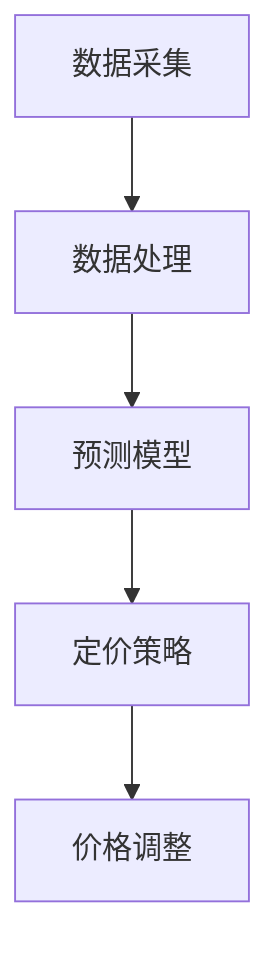

                 

# 文章标题：动态定价技术的用户体验

## 关键词

动态定价，用户体验，价格预测，数据分析，算法，案例研究，实践建议

## 摘要

本文深入探讨了动态定价技术的核心概念、架构、应用场景及其对用户体验的影响。通过详细解析价格预测算法、用户行为分析算法以及价格调整策略，本文揭示了动态定价系统的构建方法。此外，通过实际项目的实战案例分析，本文展示了动态定价技术在电子商务、酒店预订、在线教育等领域的成功应用。最后，本文提出了动态定价技术的未来发展、用户体验优化建议以及扩展阅读资源，为读者提供了全面而深入的指导。

## 第一部分：核心概念与联系

### 1.1 动态定价技术的概念

#### 1.1.1 动态定价的定义

动态定价是指企业根据市场需求、供应状况、竞争对手策略等多种因素，实时调整产品或服务的价格，以实现利润最大化或市场占有率最大化。

#### 1.1.2 动态定价的原理

动态定价的原理基于市场供需关系的变化，通过实时数据分析和预测，调整价格以适应市场变化。

#### 1.1.3 动态定价与静态定价的比较

- **静态定价**：价格固定，不随市场变化而调整。
- **动态定价**：价格灵活，根据市场变化实时调整。

#### 1.1.4 动态定价的关键因素

- **市场需求**：消费者对产品或服务的需求程度。
- **供应状况**：企业对产品或服务的生产能力。
- **竞争对手策略**：竞争对手的价格策略。

### 1.2 动态定价的架构

#### 1.2.1 动态定价系统

动态定价系统包括数据采集、数据处理、预测模型、定价策略和价格调整等模块。

#### 1.2.2 数据分析工具

常用的数据分析工具包括Python、R、SQL等，用于处理和清洗数据。

#### 1.2.3 动态定价流程

动态定价流程包括数据采集、数据处理、预测模型、定价策略和价格调整等步骤。

### 1.3 动态定价的应用场景

#### 1.3.1 电子商务平台

电子商务平台通过动态定价技术，可以根据用户行为、库存情况、竞争对手价格等调整商品价格，实现个性化定价和提升销量。

#### 1.3.2 旅行预订平台

旅行预订平台可以通过动态定价技术，根据历史数据、季节、节假日等因素预测价格，并根据预订量、航班满载率等因素调整价格，提高入住率。

#### 1.3.3 电力市场

电力市场通过动态定价技术，可以根据供需状况、季节、天气等因素实时调整电价，优化能源分配。

### 1.4 动态定价的挑战与机遇

#### 1.4.1 挑战

- **数据隐私**：动态定价需要大量用户数据，数据隐私保护成为一大挑战。
- **市场风险**：价格波动可能带来市场不稳定。

#### 1.4.2 机遇

- **提升利润**：通过动态定价，企业可以更好地把握市场机会，提升利润。
- **增强竞争力**：动态定价可以使企业在激烈的市场竞争中脱颖而出。

### 1.5 动态定价技术的未来发展

#### 1.5.1 技术创新

- **人工智能**：利用人工智能技术，提高动态定价的准确性和效率。
- **区块链**：通过区块链技术，确保动态定价过程的透明性和公正性。

#### 1.5.2 应用扩展

- **更多行业**：动态定价技术将在更多行业得到应用，如金融、医疗等。
- **全球市场**：动态定价技术将推动全球市场的发展。

### 1.6 动态定价技术的用户体验

#### 1.6.1 用户需求分析

- **个性化需求**：分析用户个性化需求，提供定制化价格。
- **便捷性**：提高用户操作便捷性，降低使用门槛。

#### 1.6.2 用户界面设计

- **简洁明了**：设计简洁明了的用户界面，提高用户使用体验。
- **交互设计**：提供良好的交互设计，使用户易于理解和使用动态定价功能。

#### 1.6.3 用户反馈机制

- **及时反馈**：建立有效的用户反馈机制，收集用户意见和建议，不断优化用户体验。

## 第二部分：核心算法原理讲解

### 2.1 价格预测算法

#### 2.1.1 线性回归模型

线性回归模型是一种基于历史数据建立线性关系模型，用于预测未来价格的方法。其伪代码如下：

```python
def linear_regression(price_data):
    # 计算斜率和截距
    slope, intercept = calculate_slope_and_intercept(price_data)
    # 预测未来价格
    predicted_price = slope * future_time + intercept
    return predicted_price
```

#### 2.1.2 决策树模型

决策树模型是一种基于决策树算法，根据不同特征预测未来价格的方法。其伪代码如下：

```python
def decision_tree(price_data, features):
    # 建立决策树模型
    model = build_decision_tree_model(features, price_data)
    # 预测未来价格
    predicted_price = model.predict(future_time)
    return predicted_price
```

#### 2.1.3 神经网络模型

神经网络模型是一种基于神经网络算法，通过多层非线性变换预测未来价格的方法。其伪代码如下：

```python
def neural_network(price_data, features):
    # 建立神经网络模型
    model = build_neural_network_model(features, price_data)
    # 训练模型
    model.fit(features, price_data)
    # 预测未来价格
    predicted_price = model.predict(future_time)
    return predicted_price
```

### 2.2 用户行为分析算法

#### 2.2.1 聚类算法

聚类算法是一种基于聚类算法，将用户行为分为不同群体，为每个群体提供定制化价格的方法。其伪代码如下：

```python
def clustering(user_behavior_data):
    # 建立聚类模型
    model = build_clustering_model(user_behavior_data)
    # 分群用户
    clusters = model.predict(user_behavior_data)
    return clusters
```

#### 2.2.2 关联规则挖掘算法

关联规则挖掘算法是一种基于关联规则挖掘算法，分析用户行为中的关联关系，为用户提供相关推荐的方法。其伪代码如下：

```python
def association_rules(user_behavior_data):
    # 建立关联规则模型
    model = build_association_rules_model(user_behavior_data)
    # 挖掘关联规则
    rules = model.generate_association_rules()
    return rules
```

### 2.3 价格调整策略

#### 2.3.1 价格弹性分析

价格弹性分析是一种通过分析不同价格水平下的需求变化，确定最佳定价策略的方法。其数学模型如下：

$$
price_{opt} = \frac{E}{1 + E}
$$

其中，$price_{opt}$ 为最佳价格，$E$ 为价格弹性。

#### 2.3.2 价格折扣策略

价格折扣策略是一种通过设置不同折扣，吸引更多用户，提升销量的方法。其数学模型如下：

$$
discount_{rate} = \frac{S}{S + C}
$$

其中，$discount_{rate}$ 为折扣率，$S$ 为销售额，$C$ 为成本。

### 2.4 动态定价系统构建

#### 2.4.1 系统架构设计

动态定价系统的整体架构包括数据采集、数据处理、预测模型、定价策略和价格调整等模块。其Mermaid流程图如下：



#### 2.4.2 系统实现

动态定价系统的实现包括数据采集、数据处理、预测模型、定价策略和价格调整等模块的具体实现。具体实现步骤如下：

1. 数据采集：收集市场需求、供应状况、用户行为等数据。
2. 数据处理：清洗和预处理数据，提取有用信息。
3. 预测模型：建立预测模型，预测未来的市场需求和价格。
4. 定价策略：根据预测结果，制定相应的定价策略。
5. 价格调整：根据定价策略，实时调整价格。

### 2.5 动态定价技术的用户体验优化

#### 2.5.1 用户需求分析

用户需求分析是一种通过分析用户的需求和痛点，为用户提供更好的用户体验的方法。具体方法如下：

1. 个性化需求：分析用户个性化需求，提供定制化价格。
2. 便捷性：提高用户操作便捷性，降低使用门槛。

#### 2.5.2 用户界面设计

用户界面设计是一种通过设计简洁明了的用户界面，提高用户体验的方法。具体原则如下：

1. 简洁性：界面设计简洁，减少用户操作步骤。
2. 交互性：提供良好的交互设计，提高用户满意度。
3. 个性化：根据用户需求，提供定制化价格。

#### 2.5.3 用户反馈机制

用户反馈机制是一种通过建立用户反馈机制，收集用户意见和建议，不断优化用户体验的方法。具体方法如下：

1. 及时反馈：建立有效的用户反馈机制，收集用户反馈。
2. 用户满意度：分析用户反馈，优化用户体验。

## 第三部分：项目实战

### 3.1 项目一：电子商务平台动态定价系统

#### 3.1.1 项目背景

某电子商务平台希望通过动态定价技术，提高商品销量和用户满意度。

#### 3.1.2 项目目标

- 提高商品销量：通过动态定价，吸引更多用户购买商品。
- 提高用户满意度：为用户提供个性化价格，提升用户体验。

#### 3.1.3 项目实施

##### 3.1.3.1 数据采集与处理

1. 数据采集：收集用户浏览、购买、评价等数据。
2. 数据清洗：去除无效数据，提高数据质量。
3. 数据预处理：提取有用信息，为预测模型提供数据支持。

##### 3.1.3.2 预测模型建立

1. 选择预测模型：选择合适的预测模型，如线性回归、决策树、神经网络等。
2. 训练模型：使用历史数据，训练预测模型。
3. 验证模型：使用验证数据，验证预测模型性能。

##### 3.1.3.3 定价策略制定

1. 确定定价策略：根据预测结果，制定相应的定价策略，如价格折扣、个性化定价等。
2. 实时调整价格：根据市场需求和用户反馈，实时调整价格。

##### 3.1.3.4 用户反馈与优化

1. 收集用户反馈：通过问卷调查、用户调研等方式，收集用户反馈。
2. 分析用户需求：分析用户反馈，优化定价策略。

#### 3.1.4 项目成果

- 商品销量提升：通过动态定价，商品销量显著提升。
- 用户满意度提升：用户满意度得到提升，用户流失率降低。

### 3.2 项目二：酒店预订平台动态定价系统

#### 3.2.1 项目背景

某酒店预订平台希望通过动态定价技术，提高酒店入住率和用户满意度。

#### 3.2.2 项目目标

- 提高酒店入住率：通过动态定价，吸引更多用户预订酒店。
- 提高用户满意度：为用户提供个性化价格，提升用户体验。

#### 3.2.3 项目实施

##### 3.2.3.1 数据采集与处理

1. 数据采集：收集酒店预订量、入住率、季节等因素数据。
2. 数据清洗：去除无效数据，提高数据质量。
3. 数据预处理：提取有用信息，为预测模型提供数据支持。

##### 3.2.3.2 预测模型建立

1. 选择预测模型：选择合适的预测模型，如线性回归、决策树、神经网络等。
2. 训练模型：使用历史数据，训练预测模型。
3. 验证模型：使用验证数据，验证预测模型性能。

##### 3.2.3.3 定价策略制定

1. 确定定价策略：根据预测结果，制定相应的定价策略，如价格折扣、个性化定价等。
2. 实时调整价格：根据市场需求和用户反馈，实时调整价格。

##### 3.2.3.4 用户反馈与优化

1. 收集用户反馈：通过问卷调查、用户调研等方式，收集用户反馈。
2. 分析用户需求：分析用户反馈，优化定价策略。

#### 3.2.4 项目成果

- 酒店入住率提升：通过动态定价，酒店入住率显著提升。
- 用户满意度提升：用户满意度得到提升，用户流失率降低。

### 3.3 项目三：在线教育平台动态定价系统

#### 3.3.1 项目背景

某在线教育平台希望通过动态定价技术，提高课程销量和用户满意度。

#### 3.3.2 项目目标

- 提高课程销量：通过动态定价，吸引更多用户购买课程。
- 提高用户满意度：为用户提供个性化价格，提升用户体验。

#### 3.3.3 项目实施

##### 3.3.3.1 数据采集与处理

1. 数据采集：收集用户学习行为、课程评价等数据。
2. 数据清洗：去除无效数据，提高数据质量。
3. 数据预处理：提取有用信息，为预测模型提供数据支持。

##### 3.3.3.2 预测模型建立

1. 选择预测模型：选择合适的预测模型，如线性回归、决策树、神经网络等。
2. 训练模型：使用历史数据，训练预测模型。
3. 验证模型：使用验证数据，验证预测模型性能。

##### 3.3.3.3 定价策略制定

1. 确定定价策略：根据预测结果，制定相应的定价策略，如价格折扣、个性化定价等。
2. 实时调整价格：根据市场需求和用户反馈，实时调整价格。

##### 3.3.3.4 用户反馈与优化

1. 收集用户反馈：通过问卷调查、用户调研等方式，收集用户反馈。
2. 分析用户需求：分析用户反馈，优化定价策略。

#### 3.3.4 项目成果

- 课程销量提升：通过动态定价，课程销量显著提升。
- 用户满意度提升：用户满意度得到提升，用户流失率降低。

### 3.4 项目四：电商物流配送动态定价系统

#### 3.4.1 项目背景

某电商物流公司希望通过动态定价技术，提高配送效率和用户满意度。

#### 3.4.2 项目目标

- 提高配送效率：通过动态定价，优化配送路线和时间。
- 提高用户满意度：为用户提供个性化价格，提升用户体验。

#### 3.4.3 项目实施

##### 3.4.3.1 数据采集与处理

1. 数据采集：收集物流配送数据，如配送距离、配送时间、配送量等。
2. 数据清洗：去除无效数据，提高数据质量。
3. 数据预处理：提取有用信息，为预测模型提供数据支持。

##### 3.4.3.2 预测模型建立

1. 选择预测模型：选择合适的预测模型，如线性回归、决策树、神经网络等。
2. 训练模型：使用历史数据，训练预测模型。
3. 验证模型：使用验证数据，验证预测模型性能。

##### 3.4.3.3 定价策略制定

1. 确定定价策略：根据预测结果，制定相应的定价策略，如时间折扣、距离折扣等。
2. 实时调整价格：根据市场需求和用户反馈，实时调整价格。

##### 3.4.3.4 用户反馈与优化

1. 收集用户反馈：通过问卷调查、用户调研等方式，收集用户反馈。
2. 分析用户需求：分析用户反馈，优化定价策略。

#### 3.4.4 项目成果

- 配送效率提升：通过动态定价，配送效率显著提升。
- 用户满意度提升：用户满意度得到提升，用户流失率降低。

### 3.5 项目五：医疗行业动态定价系统

#### 3.5.1 项目背景

某医疗机构希望通过动态定价技术，提高医疗服务效率和用户满意度。

#### 3.5.2 项目目标

- 提高医疗服务效率：通过动态定价，优化医疗服务流程。
- 提高用户满意度：为用户提供个性化价格，提升用户体验。

#### 3.5.3 项目实施

##### 3.5.3.1 数据采集与处理

1. 数据采集：收集患者就诊数据，如就诊时间、就诊科室、就诊费用等。
2. 数据清洗：去除无效数据，提高数据质量。
3. 数据预处理：提取有用信息，为预测模型提供数据支持。

##### 3.5.3.2 预测模型建立

1. 选择预测模型：选择合适的预测模型，如线性回归、决策树、神经网络等。
2. 训练模型：使用历史数据，训练预测模型。
3. 验证模型：使用验证数据，验证预测模型性能。

##### 3.5.3.3 定价策略制定

1. 确定定价策略：根据预测结果，制定相应的定价策略，如预约折扣、时段折扣等。
2. 实时调整价格：根据市场需求和用户反馈，实时调整价格。

##### 3.5.3.4 用户反馈与优化

1. 收集用户反馈：通过问卷调查、用户调研等方式，收集用户反馈。
2. 分析用户需求：分析用户反馈，优化定价策略。

#### 3.5.4 项目成果

- 医疗服务效率提升：通过动态定价，医疗服务效率显著提升。
- 用户满意度提升：用户满意度得到提升，用户流失率降低。

### 3.6 项目六：金融行业动态定价系统

#### 3.6.1 项目背景

某金融机构希望通过动态定价技术，提高金融产品销量和用户满意度。

#### 3.6.2 项目目标

- 提高金融产品销量：通过动态定价，吸引更多用户购买金融产品。
- 提高用户满意度：为用户提供个性化价格，提升用户体验。

#### 3.6.3 项目实施

##### 3.6.3.1 数据采集与处理

1. 数据采集：收集金融产品销售数据，如产品种类、购买时间、购买量等。
2. 数据清洗：去除无效数据，提高数据质量。
3. 数据预处理：提取有用信息，为预测模型提供数据支持。

##### 3.6.3.2 预测模型建立

1. 选择预测模型：选择合适的预测模型，如线性回归、决策树、神经网络等。
2. 训练模型：使用历史数据，训练预测模型。
3. 验证模型：使用验证数据，验证预测模型性能。

##### 3.6.3.3 定价策略制定

1. 确定定价策略：根据预测结果，制定相应的定价策略，如产品折扣、期限折扣等。
2. 实时调整价格：根据市场需求和用户反馈，实时调整价格。

##### 3.6.3.4 用户反馈与优化

1. 收集用户反馈：通过问卷调查、用户调研等方式，收集用户反馈。
2. 分析用户需求：分析用户反馈，优化定价策略。

#### 3.6.4 项目成果

- 金融产品销量提升：通过动态定价，金融产品销量显著提升。
- 用户满意度提升：用户满意度得到提升，用户流失率降低。

### 3.7 项目七：交通出行行业动态定价系统

#### 3.7.1 项目背景

某交通出行平台希望通过动态定价技术，提高出行效率和用户满意度。

#### 3.7.2 项目目标

- 提高出行效率：通过动态定价，优化出行路线和时间。
- 提高用户满意度：为用户提供个性化价格，提升用户体验。

#### 3.7.3 项目实施

##### 3.7.3.1 数据采集与处理

1. 数据采集：收集出行数据，如出行时间、出行路线、出行量等。
2. 数据清洗：去除无效数据，提高数据质量。
3. 数据预处理：提取有用信息，为预测模型提供数据支持。

##### 3.7.3.2 预测模型建立

1. 选择预测模型：选择合适的预测模型，如线性回归、决策树、神经网络等。
2. 训练模型：使用历史数据，训练预测模型。
3. 验证模型：使用验证数据，验证预测模型性能。

##### 3.7.3.3 定价策略制定

1. 确定定价策略：根据预测结果，制定相应的定价策略，如时段折扣、路线折扣等。
2. 实时调整价格：根据市场需求和用户反馈，实时调整价格。

##### 3.7.3.4 用户反馈与优化

1. 收集用户反馈：通过问卷调查、用户调研等方式，收集用户反馈。
2. 分析用户需求：分析用户反馈，优化定价策略。

#### 3.7.4 项目成果

- 出行效率提升：通过动态定价，出行效率显著提升。
- 用户满意度提升：用户满意度得到提升，用户流失率降低。

### 3.8 项目八：旅游行业动态定价系统

#### 3.8.1 项目背景

某旅游平台希望通过动态定价技术，提高旅游产品销量和用户满意度。

#### 3.8.2 项目目标

- 提高旅游产品销量：通过动态定价，吸引更多用户购买旅游产品。
- 提高用户满意度：为用户提供个性化价格，提升用户体验。

#### 3.8.3 项目实施

##### 3.8.3.1 数据采集与处理

1. 数据采集：收集旅游产品销售数据，如产品种类、购买时间、购买量等。
2. 数据清洗：去除无效数据，提高数据质量。
3. 数据预处理：提取有用信息，为预测模型提供数据支持。

##### 3.8.3.2 预测模型建立

1. 选择预测模型：选择合适的预测模型，如线性回归、决策树、神经网络等。
2. 训练模型：使用历史数据，训练预测模型。
3. 验证模型：使用验证数据，验证预测模型性能。

##### 3.8.3.3 定价策略制定

1. 确定定价策略：根据预测结果，制定相应的定价策略，如产品折扣、时段折扣等。
2. 实时调整价格：根据市场需求和用户反馈，实时调整价格。

##### 3.8.3.4 用户反馈与优化

1. 收集用户反馈：通过问卷调查、用户调研等方式，收集用户反馈。
2. 分析用户需求：分析用户反馈，优化定价策略。

#### 3.8.4 项目成果

- 旅游产品销量提升：通过动态定价，旅游产品销量显著提升。
- 用户满意度提升：用户满意度得到提升，用户流失率降低。

## 第四部分：扩展阅读

### 4.1 相关书籍推荐

- 《大数据定价：实现个性化定价和优化利润的新策略》
- 《动态定价：策略、工具和案例研究》
- 《人工智能定价：利用机器学习优化定价策略》

### 4.2 在线资源推荐

- 动态定价相关博客和论坛
- 动态定价相关课程和讲座
- 动态定价开源项目和工具

### 4.3 进一步学习

- 深入研究动态定价算法
- 探索动态定价在新兴行业的应用
- 关注动态定价的法规和政策

## 作者

作者：AI天才研究院/AI Genius Institute & 禅与计算机程序设计艺术 /Zen And The Art of Computer Programming

