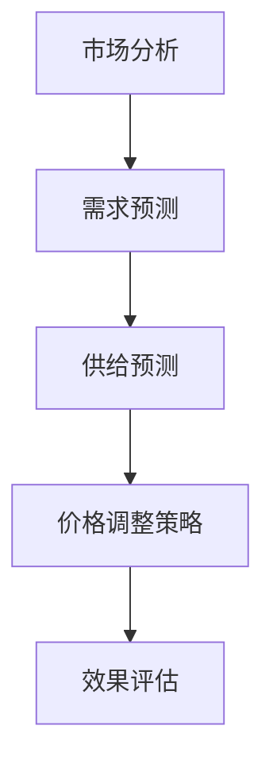

                 

### 文章标题：动态定价：AI如何根据供需调整价格

在当今瞬息万变的市场环境中，企业面临着激烈的市场竞争和消费者行为的快速变化。为了在市场中脱颖而出，许多企业开始采用动态定价策略，以实时响应市场需求，从而最大化利润和市场份额。动态定价，顾名思义，是指根据市场条件和消费者行为实时调整产品或服务的价格。近年来，人工智能（AI）技术的发展为动态定价带来了革命性的变化，使得企业能够更加精准地预测市场需求，并据此调整价格。本文将深入探讨动态定价的概念、发展历程、核心要素，以及AI在动态定价中的应用，旨在为读者提供一个全面的技术视角，以理解AI如何帮助企业通过供需调整价格，实现商业成功。

### 关键词

- 动态定价
- 人工智能
- 供需关系
- 机器学习
- 深度学习
- 算法优化
- 价格策略
- 实时调整

### 摘要

本文旨在探讨动态定价在商业中的应用，特别是人工智能（AI）在动态定价中的关键作用。首先，我们将介绍动态定价的基础概念，包括其定义、意义和发展历程。随后，我们将深入分析供需关系的概念和动态变化，并探讨AI技术在供需预测和价格调整中的作用。接着，我们将介绍基于AI的动态定价策略和优化方法，并通过案例分析展示其实际应用效果。最后，我们将讨论动态定价面临的挑战及解决方案，并展望未来动态定价的发展趋势。通过本文的阅读，读者将能够全面理解动态定价的原理和AI技术在这一领域的应用。

### 目录大纲

## 《动态定价：AI如何根据供需调整价格》

### 第一部分：动态定价基础

### 第1章：动态定价概述

#### 1.1 动态定价的定义与意义

#### 1.2 动态定价的发展历程

#### 1.3 动态定价的核心要素

### 第2章：供需关系分析

#### 2.1 供需关系的概念

#### 2.2 供需关系的分析方法

#### 2.3 供需关系的动态变化

### 第3章：AI在动态定价中的应用

#### 3.1 AI技术在动态定价中的作用

#### 3.2 机器学习算法在供需预测中的应用

#### 3.3 深度学习在动态定价中的应用

### 第二部分：动态定价策略

### 第4章：基于AI的动态定价策略

#### 4.1 基本策略

#### 4.2 季节性策略

#### 4.3 竞争策略

### 第5章：动态定价优化

#### 5.1 定价优化模型

#### 5.2 算法与实现

#### 5.3 案例分析

### 第6章：动态定价的实际应用

#### 6.1 电子商务领域的动态定价

#### 6.2 酒店行业的动态定价

#### 6.3 机票行业的动态定价

### 第三部分：动态定价挑战与解决方案

### 第7章：动态定价的挑战

#### 7.1 数据获取与处理

#### 7.2 模型解释性

#### 7.3 法律和伦理问题

### 第8章：动态定价的解决方案

#### 8.1 提高数据质量

#### 8.2 加强模型解释性

#### 8.3 法律和伦理合规

### 第9章：未来动态定价的发展趋势

#### 9.1 AI技术的发展

#### 9.2 5G与物联网的影响

#### 9.3 零售业的数字化转型

### 附录

#### 附录A：动态定价工具与技术

##### A.1 数据分析工具

##### A.2 机器学习框架

##### A.3 深度学习库

#### 附录B：案例研究

##### B.1 电子商务平台案例

##### B.2 酒店行业案例

##### B.3 机票行业案例

## 第一部分：动态定价基础

### 第1章：动态定价概述

#### 1.1 动态定价的定义与意义

动态定价，也称为实时定价或弹性定价，是一种基于市场条件和消费者行为变化，灵活调整产品或服务价格的策略。与传统的固定定价模式不同，动态定价能够在不同的时间、地点和情境下，根据市场供需关系、竞争态势和消费者偏好，动态地调整价格，从而最大化企业的利润和市场份额。

动态定价的定义可以从以下几个方面理解：

1. **实时调整**：动态定价基于实时数据，通过算法和模型分析市场动态，实时调整价格。
2. **适应性**：动态定价能够根据不同市场环境和消费者行为进行调整，具有高度的适应性。
3. **目标导向**：动态定价的核心目标是最大化企业的利润和市场份额，通过灵活的价格策略实现商业成功。

动态定价的意义主要体现在以下几个方面：

1. **提升利润**：通过实时调整价格，企业可以在需求高峰期提高价格，增加收入；在需求低谷期降低价格，减少库存，提高销售量。
2. **提高市场份额**：动态定价策略可以更好地满足消费者的需求，提高客户满意度，从而增加市场份额。
3. **优化库存管理**：动态定价能够帮助企业更准确地预测市场需求，优化库存管理，减少库存积压和库存成本。
4. **增强竞争力**：通过实时响应市场变化，动态定价策略可以使企业更具竞争力，迅速适应市场环境。

#### 1.2 动态定价的发展历程

动态定价并非现代商业的产物，其实早在上世纪70年代，就已经有企业开始尝试使用动态定价策略。以下简要回顾动态定价的发展历程：

1. **早期尝试**（1970s）：随着计算机技术和信息技术的兴起，一些企业开始尝试利用计算机系统进行价格调整，这标志着动态定价的初步尝试。
2. **电商时代的兴起**（2000s）：随着互联网和电子商务的快速发展，动态定价在电子商务领域得到了广泛应用。电商平台通过实时分析用户行为和市场需求，动态调整商品价格，以提升销售和利润。
3. **人工智能技术的应用**（2010s-2020s）：近年来，人工智能技术的发展为动态定价带来了革命性的变化。通过机器学习和深度学习算法，企业可以更加精准地预测市场需求，实现更加智能化的动态定价策略。

#### 1.3 动态定价的核心要素

动态定价的成功实施依赖于以下几个核心要素：

1. **数据收集**：动态定价需要大量的市场数据，包括历史销售数据、用户行为数据、竞争对手的价格策略等。这些数据是动态定价分析的基础。
2. **分析算法**：通过机器学习和深度学习算法，企业可以对收集到的数据进行分析，预测市场需求和价格趋势。这些算法包括线性回归、决策树、神经网络等。
3. **价格调整策略**：基于分析结果，企业需要制定相应的价格调整策略。价格调整策略可以分为基本策略、季节性策略和竞争策略等。
4. **实时调整**：动态定价需要实时响应市场变化，通过自动化系统实现价格的实时调整，确保企业能够迅速适应市场环境。
5. **效果评估**：为了验证动态定价策略的有效性，企业需要对价格调整的效果进行评估，包括销售量、利润率、市场份额等指标。

### 第2章：供需关系分析

#### 2.1 供需关系的概念

供需关系是经济学中的一个基本概念，指的是市场中商品的供给量与需求量之间的关系。在市场经济中，商品的供给量由生产者的意愿和成本决定，而需求量由消费者的需求和支付能力决定。供需关系可以通过供需曲线来表示，供需曲线的交点即为市场的均衡价格和均衡数量。

供需关系的基本概念可以从以下几个方面理解：

1. **供给**：供给是指生产者愿意在一定价格水平下提供的商品数量。供给量受生产成本、技术进步、生产者预期等因素的影响。
2. **需求**：需求是指消费者愿意在一定价格水平下购买的商品数量。需求量受消费者收入水平、消费偏好、价格水平等因素的影响。
3. **均衡**：当供给量等于需求量时，市场达到均衡状态。此时，市场价格为均衡价格，市场交易量为均衡数量。

#### 2.2 供需关系的分析方法

分析供需关系的方法主要包括以下几种：

1. **需求预测**：通过分析历史销售数据、消费者行为数据和市场趋势，预测未来的市场需求量。需求预测是动态定价的重要基础。
2. **供给预测**：通过分析生产成本、生产能力、市场供应情况等，预测未来的市场供给量。供给预测有助于企业制定合理的库存管理策略。
3. **供需平衡分析**：通过分析供给和需求的变化趋势，判断市场是否处于均衡状态。当市场处于非均衡状态时，需要通过价格调整来实现供需平衡。
4. **敏感性分析**：分析价格变化对供需量的影响程度，了解不同价格水平下的供需关系变化。敏感性分析有助于企业制定价格调整策略。

#### 2.3 供需关系的动态变化

供需关系是动态变化的，受到多种因素的影响：

1. **市场需求变化**：消费者偏好、收入水平、广告宣传等都会影响市场需求。例如，消费者收入提高，可能会增加对高端产品的需求。
2. **供给变化**：生产成本、技术进步、政策环境等都会影响市场供给。例如，生产成本上升，可能会导致价格上涨。
3. **外部冲击**：自然灾害、政治事件、经济波动等外部冲击会对供需关系产生重大影响。例如，一场突如其来的自然灾害可能会破坏生产设施，导致供给减少。
4. **市场竞争**：竞争对手的价格策略、市场份额变化等也会影响供需关系。例如，竞争对手降价促销，可能会导致市场需求增加。

了解供需关系的动态变化，对于企业制定动态定价策略具有重要意义。通过实时监测供需变化，企业可以及时调整价格，实现供需平衡，最大化利润和市场份额。

### 第3章：AI在动态定价中的应用

#### 3.1 AI技术在动态定价中的作用

人工智能（AI）技术在动态定价中发挥着关键作用，它通过提高数据分析和预测的准确性，为企业提供了更加智能和高效的定价策略。以下是AI在动态定价中的几个关键作用：

1. **提高数据收集和分析能力**：AI技术可以自动收集大量的市场数据，包括历史销售数据、用户行为数据、市场价格信息等。通过机器学习和深度学习算法，AI能够对这些数据进行分析，提取有价值的信息，为定价决策提供支持。

2. **精准预测市场需求**：传统的定价策略往往依赖于历史数据和简单的统计方法进行预测，而AI技术可以通过复杂的算法模型，如神经网络和决策树，对市场需求进行更加精准的预测。这些预测模型能够考虑多种影响因素，如季节性、节假日、消费者偏好等，从而提高预测的准确性。

3. **实现实时定价**：传统的定价策略通常需要定期更新价格，而AI技术可以实时分析市场数据，根据供需变化实时调整价格。这种实时定价能力使得企业能够快速响应市场变化，提高竞争力。

4. **优化库存管理**：AI技术可以帮助企业更准确地预测市场需求，从而优化库存管理。通过实时调整价格，企业可以减少库存积压，降低库存成本，提高资金利用率。

5. **提高客户满意度**：通过精准的市场预测和实时定价，企业可以提供更具竞争力的价格，提高客户满意度。同时，AI技术还可以通过个性化推荐和价格敏感度分析，提供更加个性化的购物体验，增强客户粘性。

#### 3.2 机器学习算法在供需预测中的应用

机器学习算法在供需预测中扮演着重要角色，以下是一些常用的机器学习算法及其在供需预测中的应用：

1. **线性回归**：线性回归是一种简单的统计方法，通过建立需求量与价格之间的线性关系模型，预测未来的需求量。虽然线性回归模型简单易用，但在面对复杂市场环境时，其预测准确性可能会受到影响。

2. **决策树**：决策树通过一系列的规则，将数据划分为不同的类别，可以用于分类和回归问题。在供需预测中，决策树可以根据不同的特征，如历史价格、消费者收入等，预测市场需求。

3. **随机森林**：随机森林是一种基于决策树的集成学习方法，通过构建多个决策树，并结合它们的预测结果，提高预测的准确性。随机森林在处理高维数据和噪声数据时表现出色，适用于复杂的供需预测问题。

4. **支持向量机（SVM）**：支持向量机是一种用于分类和回归问题的机器学习算法，通过找到最佳的超平面对数据进行分类或回归。在供需预测中，SVM可以用于预测市场需求，特别是当数据存在非线性关系时。

5. **神经网络**：神经网络，特别是深度学习模型，如卷积神经网络（CNN）和循环神经网络（RNN），可以处理复杂的非线性数据，并建立高度复杂的预测模型。在供需预测中，神经网络可以捕捉到市场数据中的复杂模式和变化，提供更精准的预测结果。

通过结合多种机器学习算法，企业可以建立更加准确和稳健的供需预测模型，从而提高动态定价策略的有效性。

#### 3.3 深度学习在动态定价中的应用

深度学习，作为机器学习的一个分支，在动态定价中发挥着越来越重要的作用。以下是一些深度学习模型及其在动态定价中的应用：

1. **卷积神经网络（CNN）**：卷积神经网络擅长处理图像数据，但在动态定价中，也可以用于处理时间序列数据。通过卷积层提取时间序列中的特征，CNN可以捕捉到市场数据中的时空关系，为定价提供有力支持。

2. **循环神经网络（RNN）**：循环神经网络适用于处理序列数据，特别是时间序列数据。在动态定价中，RNN可以通过记忆历史信息，捕捉到市场变化的长期趋势，从而提供更精准的预测。

3. **长短期记忆网络（LSTM）**：长短期记忆网络是RNN的一种改进模型，能够更好地处理长序列数据。在动态定价中，LSTM可以捕捉到市场变化的长期和短期趋势，提供更加稳定的预测。

4. **自动编码器**：自动编码器是一种无监督学习模型，用于压缩和重建数据。在动态定价中，自动编码器可以通过学习数据的特征，提取出有用的信息，提高预测的准确性。

5. **生成对抗网络（GAN）**：生成对抗网络是一种无监督学习模型，由生成器和判别器组成。在动态定价中，GAN可以生成与实际市场数据相似的数据，用于训练和测试预测模型，从而提高模型的泛化能力。

通过应用深度学习模型，企业可以建立更加智能和高效的动态定价系统，实现更加精准的价格调整，提高市场竞争力和盈利能力。

## 第二部分：动态定价策略

### 第4章：基于AI的动态定价策略

#### 4.1 基本策略

基于AI的动态定价策略可以分为以下几个基本策略，每个策略都有其独特的实施方法和适用场景：

1. **需求驱动定价**：需求驱动定价是指根据市场需求的变化来调整价格。这种方法适用于市场需求波动较大的产品或服务，如季节性商品、时尚商品等。企业通过分析历史销售数据和市场趋势，预测未来的需求变化，并据此调整价格，以最大化收益。

2. **成本加成定价**：成本加成定价是一种以成本为基础的定价方法，企业通过在成本基础上加上一定的利润来定价。这种方法适用于成本相对稳定的产品或服务，如制造业、基础设施建设等。AI技术可以帮助企业更精确地计算成本，并预测市场需求，从而制定合理的价格策略。

3. **价格弹性定价**：价格弹性定价是指根据消费者对价格变化的敏感程度来调整价格。这种方法适用于对价格敏感的消费者群体，如低收入消费者、年轻人等。企业通过分析消费者的购买行为和价格反应，确定不同的价格弹性区间，并据此调整价格，以提高销售量。

4. **竞争定价**：竞争定价是指根据竞争对手的价格策略来调整价格。这种方法适用于竞争激烈的市场环境，如电商、零售等。企业通过监控竞争对手的价格变化，分析其市场策略，并根据自身情况调整价格，以保持竞争力。

5. **组合定价**：组合定价是将多种定价策略结合起来，以实现最佳效果。例如，企业可以同时采用需求驱动定价和成本加成定价，根据不同市场和产品特点，灵活调整价格策略。组合定价能够充分利用不同策略的优势，提高定价的灵活性和效果。

#### 4.2 季节性策略

季节性策略是指根据不同季节的市场需求变化来调整价格。季节性策略适用于需求随季节变化显著的产品或服务，如旅游业、服装业等。以下是一些常见的季节性定价策略：

1. **高峰期定价**：在需求高峰期，如旅游旺季、节日等，企业可以提高价格，以最大化收益。通过AI技术，企业可以预测高峰期的市场需求，提前做好准备，提高价格弹性。

2. **淡季促销**：在需求淡季，企业可以降低价格，刺激需求，提高销售量。AI技术可以帮助企业分析市场需求和消费者行为，制定有针对性的促销策略，提高淡季的盈利能力。

3. **季节性库存管理**：季节性策略还涉及库存管理。通过AI技术，企业可以预测不同季节的库存需求，优化库存配置，减少库存积压和资金占用。

4. **季节性套餐**：在季节性需求较高的时期，企业可以推出套餐产品，以吸引消费者。例如，酒店在旅游旺季可以提供包含住宿、餐饮、景点门票的套餐，以增加收入。

季节性策略的成功实施需要企业深入了解市场需求和消费者行为，通过AI技术进行精准预测和数据分析，从而制定有效的价格策略。

#### 4.3 竞争策略

竞争策略是指根据竞争对手的价格策略来调整价格，以保持竞争力。在竞争激烈的市场环境中，企业需要密切关注竞争对手的动向，灵活调整价格，以吸引消费者。以下是一些常见的竞争定价策略：

1. **跟随策略**：企业跟随主要竞争对手的价格，以保持市场竞争力。这种方法适用于市场份额较大、市场份额稳定的企业。通过AI技术，企业可以实时监控竞争对手的价格变化，快速响应市场变化。

2. **领先策略**：企业根据市场需求和自身成本结构，主动调整价格，领先于竞争对手。这种方法适用于具备竞争优势、市场地位较强的企业。通过AI技术，企业可以预测市场需求和成本变化，制定领先的价格策略。

3. **差异策略**：企业通过提供独特的产品或服务，形成差异化的竞争优势，从而调整价格。这种方法适用于拥有独特产品或服务的企业。通过AI技术，企业可以分析市场需求和消费者偏好，提供差异化的产品或服务，从而制定差异化的价格策略。

4. **价格战策略**：在竞争激烈的市场环境中，企业可以通过降低价格来争夺市场份额。这种方法适用于市场份额较低、希望迅速扩大市场份额的企业。通过AI技术，企业可以预测市场需求和消费者反应，制定合理的价格战策略。

竞争策略的有效实施需要企业具备敏锐的市场洞察力和快速响应能力，通过AI技术实现实时监控和数据分析，从而制定灵活的价格策略。

### 第5章：动态定价优化

#### 5.1 定价优化模型

动态定价优化模型是基于数学和统计学原理，通过分析市场需求、成本结构和竞争环境，制定最优的价格策略。以下是一些常用的定价优化模型：

1. **线性规划模型**：线性规划模型通过建立线性目标函数和约束条件，寻找最优解。在动态定价中，线性规划模型可以用来确定最优的价格区间，以满足市场需求和利润最大化目标。

2. **动态规划模型**：动态规划模型通过将复杂问题分解为多个阶段，逐步寻找最优解。在动态定价中，动态规划模型可以用来处理多阶段决策问题，如季节性定价、动态库存管理等。

3. **博弈论模型**：博弈论模型通过分析竞争双方的行为策略和收益，预测市场结果。在动态定价中，博弈论模型可以用来分析竞争对手的反应和策略，制定有效的竞争定价策略。

4. **机器学习模型**：机器学习模型通过分析历史数据和当前市场条件，预测市场需求和价格趋势。在动态定价中，机器学习模型可以用来建立预测模型，指导价格调整。

5. **深度学习模型**：深度学习模型通过学习大量的市场数据，提取复杂的模式和关系。在动态定价中，深度学习模型可以用来建立高度复杂的预测模型，提供更加精准的价格策略。

#### 5.2 算法与实现

动态定价算法的实现通常包括以下几个步骤：

1. **数据收集与预处理**：收集历史销售数据、用户行为数据、市场环境数据等，并进行数据清洗和预处理，以确保数据质量。

2. **特征工程**：根据市场需求、成本结构和竞争环境，提取有用的特征，如历史价格、消费者收入、市场趋势等。

3. **模型选择与训练**：选择合适的机器学习或深度学习模型，如线性回归、决策树、神经网络等，并进行模型训练和验证。

4. **预测与优化**：利用训练好的模型进行市场需求和价格趋势的预测，并根据预测结果调整价格策略，实现动态定价优化。

5. **效果评估**：通过评估模型的效果，如预测准确率、利润率等，不断优化模型和策略，以提高定价效果。

#### 5.3 案例分析

以下通过一个实际案例，展示动态定价优化模型的实现过程：

案例：某电商平台的商品动态定价优化

1. **数据收集与预处理**：收集过去一年的商品销售数据，包括销售量、价格、用户评价等，进行数据清洗和预处理，确保数据质量。

2. **特征工程**：根据市场需求、消费者行为和商品属性，提取特征，如历史价格、消费者购买频率、用户评价得分等。

3. **模型选择与训练**：选择线性回归模型，根据历史数据训练模型，预测未来某一时间段内的销售量。

4. **预测与优化**：根据模型预测结果，动态调整商品价格，以最大化销售量和利润。例如，在预测销售量较高时，适当提高价格，以增加利润；在预测销售量较低时，适当降低价格，以刺激需求。

5. **效果评估**：通过评估模型的效果，如预测准确率和利润率等，不断优化模型和策略。例如，通过分析实际销售数据和预测结果，发现模型在某些特定时间段内预测不准确，可以通过调整特征工程或模型参数来提高预测效果。

通过以上案例分析，可以看到动态定价优化模型在实际应用中的实现过程，以及如何通过数据分析和模型优化，实现商品价格的动态调整，提高销售量和利润。

### 第6章：动态定价的实际应用

#### 6.1 电子商务领域的动态定价

电子商务领域是动态定价应用最为广泛和成功的领域之一。以下是电子商务领域动态定价的一些实际应用案例：

1. **亚马逊（Amazon）**：亚马逊利用AI技术进行商品定价，通过分析用户行为、市场需求和竞争对手价格，实时调整商品价格。例如，亚马逊会根据用户浏览、购买历史和搜索习惯，为每个用户生成个性化的价格，以增加购买概率。此外，亚马逊还会在特定节假日或促销活动中，根据市场需求动态调整价格，吸引更多消费者。

2. **阿里巴巴（Alibaba）**：阿里巴巴的电商平台通过AI技术进行商品定价，优化商家利润。例如，通过分析市场需求、库存水平和竞争对手价格，阿里巴巴为商家提供实时定价建议，帮助商家制定更具竞争力的价格策略。此外，阿里巴巴还利用AI技术进行广告投放优化，通过动态调整广告价格，提高广告效果和投资回报率。

3. **京东（JD.com）**：京东通过AI技术实现动态定价，提高用户购物体验和平台利润。例如，京东会根据用户购买历史、偏好和市场需求，为每个用户生成个性化的价格推荐，提高购买意愿。此外，京东还会在特定时间段（如节假日、促销活动等）动态调整商品价格，刺激消费需求，提升销售额。

4. **Wayfair**：Wayfair是一家家居电商平台，通过AI技术进行动态定价，优化库存管理和用户购物体验。例如，Wayfair会根据市场需求和库存情况，实时调整商品价格，减少库存积压，提高资金利用率。同时，Wayfair还通过分析用户行为和购物偏好，为用户提供个性化的价格推荐，提高用户满意度和购买转化率。

5. **Etsy**：Etsy是一家手工艺品电商平台，通过AI技术进行动态定价，帮助卖家优化商品利润。例如，Etsy会根据市场需求、库存情况和竞争对手价格，为卖家提供实时定价建议，帮助卖家制定合理的价格策略。此外，Etsy还利用AI技术分析用户购物习惯和偏好，为用户提供个性化的商品推荐和价格提示，提高用户购物体验和平台粘性。

以上案例展示了电子商务领域如何通过AI技术实现动态定价，优化用户购物体验和平台利润。随着AI技术的不断发展和应用，电子商务领域的动态定价将变得更加智能化和精细化。

#### 6.2 酒店行业的动态定价

酒店行业是动态定价应用的另一个重要领域。以下是酒店行业动态定价的一些实际应用案例：

1. **希尔顿（Hilton）**：希尔顿利用AI技术进行酒店价格调整，优化收益。例如，希尔顿会根据市场需求、季节性因素和竞争对手价格，实时调整酒店价格。在淡季或需求较低时，希尔顿会降低价格以吸引更多客人；在旺季或需求较高时，希尔顿会提高价格以最大化收益。

2. **万豪国际（Marriott International）**：万豪国际通过AI技术进行酒店定价，优化收入和客户体验。例如，万豪国际会根据客户偏好、预订时间、入住日期和市场需求，为每位客户生成个性化的价格推荐。此外，万豪国际还会在特定节假日或促销活动中，根据市场需求动态调整价格，吸引更多客人。

3. **Airbnb**：Airbnb作为全球领先的民宿预订平台，通过AI技术进行房源定价，优化房东收益。例如，Airbnb会根据市场需求、房源类型、地理位置和竞争对手价格，为房源生成实时定价建议。此外，Airbnb还通过分析客户偏好和预订习惯，为用户提供个性化的价格推荐，提高预订转化率。

4. **洲际酒店集团（InterContinental Hotels Group）**：洲际酒店集团利用AI技术进行酒店价格调整，优化收益和客户满意度。例如，洲际酒店集团会根据市场需求、季节性因素和竞争对手价格，实时调整酒店价格。此外，洲际酒店集团还会利用AI技术分析客户行为和偏好，为用户提供个性化的价格优惠和促销活动，提高客户满意度和预订率。

5. **喜达屋酒店与度假村国际集团（Starwood Hotels & Resorts Worldwide）**：喜达屋酒店集团通过AI技术进行酒店价格调整，优化收益和客户体验。例如，喜达屋酒店集团会根据市场需求、季节性因素和竞争对手价格，实时调整酒店价格。此外，喜达屋酒店集团还利用AI技术分析客户偏好和预订习惯，为用户提供个性化的价格优惠和预订提示，提高客户满意度和忠诚度。

以上案例展示了酒店行业如何通过AI技术实现动态定价，优化收益和客户体验。随着AI技术的不断发展和应用，酒店行业的动态定价将变得更加智能化和精细化。

#### 6.3 机票行业的动态定价

机票行业是动态定价应用的另一个重要领域。以下是机票行业动态定价的一些实际应用案例：

1. **美国航空（American Airlines）**：美国航空通过AI技术进行机票定价，优化收益。例如，美国航空会根据市场需求、季节性因素和竞争对手价格，实时调整机票价格。在淡季或需求较低时，美国航空会降低价格以吸引更多乘客；在旺季或需求较高时，美国航空会提高价格以最大化收益。

2. **达美航空（Delta Air Lines）**：达美航空利用AI技术进行机票定价，优化收益和客户体验。例如，达美航空会根据市场需求、航班班次、竞争对手价格和客户偏好，为每位乘客生成个性化的价格推荐。此外，达美航空还会在特定节假日或促销活动中，根据市场需求动态调整机票价格，吸引更多乘客。

3. **英国航空（British Airways）**：英国航空通过AI技术进行机票定价，优化收益和客户满意度。例如，英国航空会根据市场需求、季节性因素和竞争对手价格，实时调整机票价格。此外，英国航空还通过分析客户行为和偏好，为用户提供个性化的价格优惠和预订提示，提高客户满意度和忠诚度。

4. **阿联酋航空（Emirates）**：阿联酋航空利用AI技术进行机票定价，优化收益和客户体验。例如，阿联酋航空会根据市场需求、航班班次、竞争对手价格和客户偏好，为每位乘客生成个性化的价格推荐。此外，阿联酋航空还会在特定节假日或促销活动中，根据市场需求动态调整机票价格，吸引更多乘客。

5. **新加坡航空（Singapore Airlines）**：新加坡航空通过AI技术进行机票定价，优化收益和客户满意度。例如，新加坡航空会根据市场需求、季节性因素和竞争对手价格，实时调整机票价格。此外，新加坡航空还通过分析客户行为和偏好，为用户提供个性化的价格优惠和预订提示，提高客户满意度和忠诚度。

以上案例展示了机票行业如何通过AI技术实现动态定价，优化收益和客户体验。随着AI技术的不断发展和应用，机票行业的动态定价将变得更加智能化和精细化。

## 第三部分：动态定价挑战与解决方案

### 第7章：动态定价的挑战

#### 7.1 数据获取与处理

动态定价的准确性和有效性高度依赖于高质量的数据。然而，数据获取和处理过程面临诸多挑战：

1. **数据源多样性**：动态定价需要收集各种类型的数据，包括历史销售数据、用户行为数据、市场价格数据、竞争对手数据等。这些数据可能来自不同的系统和平台，数据格式和结构各异，增加了数据整合的复杂性。

2. **数据质量**：数据质量直接影响定价模型的准确性。不完整、不准确、重复或错误的数据会导致模型偏差，降低预测效果。因此，确保数据质量是动态定价成功的关键。

3. **数据实时性**：动态定价需要实时或近实时地分析市场数据，以快速调整价格。然而，实时数据处理技术复杂，需要高效的数据采集、传输和存储系统，这对于许多企业来说是一个挑战。

4. **数据隐私和安全性**：在收集和处理大量市场数据时，企业必须遵守相关数据保护法规，确保数据隐私和安全性。违反数据保护法规可能导致法律风险和声誉损失。

#### 7.2 模型解释性

动态定价模型通常基于复杂的机器学习和深度学习算法，这些模型在预测准确度方面表现出色，但其内部工作机制往往难以解释。以下是一些模型解释性的挑战：

1. **黑箱模型**：许多先进的机器学习模型，如深度神经网络，被视为“黑箱”模型，因为它们的工作机制难以理解。这使得企业难以解释模型决策过程，增加了模型可信度和透明度的挑战。

2. **算法透明性**：动态定价模型通常涉及多个阶段和层次，包括特征提取、模型训练、预测输出等。每个阶段都可能使用不同的算法和技术，增加了模型整体解释性的难度。

3. **用户接受度**：企业内部和客户对动态定价模型的接受度受其解释性影响。如果模型决策过程不可解释，决策者可能难以接受和信任模型的预测结果，从而影响定价策略的实施。

#### 7.3 法律和伦理问题

动态定价在法律和伦理方面也面临一系列挑战：

1. **反垄断法规**：动态定价可能导致市场垄断行为，企业可能因价格操纵或限制竞争而面临法律诉讼。遵守反垄断法规是动态定价合法性的关键。

2. **消费者隐私**：动态定价依赖于大量消费者数据，包括购买历史、浏览行为等。企业必须确保消费者隐私得到保护，不得滥用消费者数据。

3. **算法偏见**：机器学习模型可能会因数据偏差而产生偏见，导致不公平的定价结果。企业需要采取措施，确保算法的公平性和透明度。

4. **数据共享**：动态定价通常涉及多个部门和合作伙伴之间的数据共享，这可能导致数据泄露和隐私侵犯。企业需要建立严格的数据共享协议和安全管理措施。

### 第8章：动态定价的解决方案

为了克服动态定价面临的挑战，企业可以采取以下解决方案：

#### 8.1 提高数据质量

1. **数据清洗和标准化**：建立数据清洗和标准化流程，确保数据的完整性和一致性。通过自动化的数据预处理工具，减少手动处理的工作量，提高数据质量。

2. **数据源整合**：整合来自不同系统和平台的数据，建立统一的数据仓库。使用数据集成技术，如数据湖和数据湖架构，实现数据的集中管理和高效访问。

3. **数据质量管理**：建立数据质量管理机制，定期检查和评估数据质量。通过数据质量监控工具，及时发现和修复数据问题，确保数据准确性。

#### 8.2 加强模型解释性

1. **模型可解释性技术**：使用模型可解释性工具和技术，如特征重要性分析、决策路径可视化等，提高模型的透明度和可信度。

2. **可解释性算法**：选择具有较高可解释性的算法，如决策树、线性回归等，以便于理解和解释模型决策过程。

3. **算法透明性**：建立算法透明性机制，确保模型训练和预测过程的透明度和可追溯性。通过文档化和培训，提高决策者的算法理解能力。

#### 8.3 法律和伦理合规

1. **数据保护法规遵守**：确保数据处理和存储过程符合相关数据保护法规，如GDPR和CCPA。建立数据隐私政策，明确消费者数据的收集、使用和保护方式。

2. **算法公平性**：采取措施确保算法的公平性和透明度，减少算法偏见和歧视。通过多样性、平衡性和透明性的评估，确保算法决策的公正性。

3. **合规性审查**：定期进行合规性审查，确保动态定价策略符合反垄断法规和市场竞争规则。与法律顾问合作，确保企业行为合法合规。

### 第9章：未来动态定价的发展趋势

随着技术的不断进步和市场环境的变化，动态定价将迎来更多的发展机遇和挑战。以下是未来动态定价的一些发展趋势：

#### 9.1 AI技术的发展

随着AI技术的不断进步，动态定价将变得更加智能和高效。深度学习、强化学习和自然语言处理等技术将在动态定价中发挥越来越重要的作用。通过更先进的算法和模型，企业可以实现更加精准的需求预测和价格调整，提高定价策略的效果。

#### 9.2 5G与物联网的影响

5G和物联网技术的普及将极大地提升动态定价的数据收集和分析能力。5G的高速和低延迟特性将实现实时数据的快速传输和处理，物联网设备将提供更多关于消费者行为和市场环境的数据。这些技术的结合将使动态定价更加实时和精准。

#### 9.3 零售业的数字化转型

零售业的数字化转型将继续推动动态定价的应用。在线零售商和实体零售商都将采用动态定价策略，以应对激烈的市场竞争和消费者需求变化。通过数字化转型，企业可以实现更加高效和智能的定价管理，提高市场竞争力。

#### 9.4 跨行业合作

动态定价将在不同行业之间实现跨行业合作。例如，电商平台可以与制造业、物流公司等合作，实现供应链层面的动态定价。这种跨行业合作将推动动态定价的广泛应用，提高整体供应链的效率和灵活性。

#### 9.5 持续创新

动态定价将在持续创新中不断发展。企业将不断探索新的定价策略和技术，以适应不断变化的市场环境。同时，政策制定者、学术机构和行业组织也将积极推动动态定价的研究和应用，为行业的健康发展提供支持。

总之，未来动态定价将在AI技术、5G与物联网、数字化转型和跨行业合作等方面实现重大突破，为企业和消费者带来更多价值。

## 附录

#### 附录A：动态定价工具与技术

##### A.1 数据分析工具

- **Pandas**：Python库，用于数据清洗、转换和分析。
- **NumPy**：Python库，用于数值计算和数据处理。
- **Matplotlib**：Python库，用于数据可视化。
- **Seaborn**：Python库，基于Matplotlib，用于数据可视化的高级应用。

##### A.2 机器学习框架

- **Scikit-learn**：Python库，提供各种机器学习算法和工具。
- **TensorFlow**：Google开发的开放源代码机器学习库。
- **PyTorch**：Facebook开发的开源机器学习库，尤其适用于深度学习。

##### A.3 深度学习库

- **Keras**：基于Theano和TensorFlow的高层次深度学习库。
- **Theano**：Python库，用于数值计算和深度学习。
- **MXNet**：Apache软件基金会开发的开源深度学习库。

#### 附录B：案例研究

##### B.1 电子商务平台案例

**描述**：某电子商务平台利用AI技术进行商品动态定价，提高了用户购买率和平台利润。

**实施过程**：
1. 数据收集：收集历史销售数据、用户行为数据和市场价格数据。
2. 数据处理：清洗和整合数据，提取有用特征。
3. 模型训练：使用机器学习和深度学习算法训练定价模型。
4. 实时定价：根据实时数据调整商品价格。
5. 模型优化：根据销售效果不断优化模型和策略。

**结果**：通过动态定价，该平台实现了用户购买率的显著提高，利润率也有所上升。

##### B.2 酒店行业案例

**描述**：某酒店集团利用AI技术进行动态定价，优化了收益和客户体验。

**实施过程**：
1. 数据收集：收集历史预订数据、客户偏好数据和竞争对手价格数据。
2. 数据处理：清洗和整合数据，提取有用特征。
3. 模型训练：使用机器学习和深度学习算法训练定价模型。
4. 实时定价：根据实时数据和预测结果调整酒店价格。
5. 模型优化：根据预订效果和客户反馈不断优化模型和策略。

**结果**：通过动态定价，该酒店集团实现了入住率的提高和平均房价的上升，客户满意度也有所提升。

##### B.3 机票行业案例

**描述**：某航空公司利用AI技术进行机票价格动态调整，提高了销售量和收益。

**实施过程**：
1. 数据收集：收集历史销售数据、市场需求数据和竞争对手价格数据。
2. 数据处理：清洗和整合数据，提取有用特征。
3. 模型训练：使用机器学习和深度学习算法训练定价模型。
4. 实时定价：根据实时数据和预测结果调整机票价格。
5. 模型优化：根据销售效果和客户反馈不断优化模型和策略。

**结果**：通过动态定价，该航空公司实现了销售量的显著提高和收益的增加，客户满意度也有所提升。

### 核心概念与联系

供需关系分析是动态定价的基础，通过分析市场需求和供给的动态变化，企业可以制定出更加精准的价格策略。以下是一个简化的供需关系分析流程图：



- **市场分析**：收集和整理市场数据，包括历史销售数据、用户行为数据、竞争对手价格等。
- **需求预测**：通过机器学习和深度学习算法，预测未来的市场需求量。
- **供给预测**：通过分析生产成本、市场供应情况等，预测未来的市场供给量。
- **价格调整策略**：根据需求预测和供给预测，制定相应的价格调整策略。
- **效果评估**：评估价格调整策略的效果，包括销售量、利润率、市场份额等指标。

### 核心算法原理讲解

动态定价的核心算法主要包括需求预测算法和供给预测算法，以下分别使用伪代码进行详细讲解。

#### 需求预测算法

```pseudo
function 需求预测(历史数据，当前市场环境) {
    // 数据预处理
    数据 = 预处理历史数据(历史数据)

    // 特征工程
    特征 = 特征工程(数据，当前市场环境)

    // 模型选择
    模型 = 选择适当的机器学习模型，例如线性回归、随机森林等

    // 模型训练
    模型 = 训练模型(特征，需求标签)

    // 预测
    需求预测 = 模型预测(特征)

    return 需求预测
}
```

1. **数据预处理**：清洗和整理历史销售数据，如缺失值处理、异常值检测等。
2. **特征工程**：提取与需求相关的特征，如历史价格、消费者购买频率、季节性因素等。
3. **模型选择**：选择合适的机器学习模型，根据数据特点和业务需求。
4. **模型训练**：使用训练数据对模型进行训练，调整模型参数。
5. **预测**：使用训练好的模型对未来的需求量进行预测。

#### 供给预测算法

```pseudo
function 供给预测(历史数据，当前市场环境) {
    // 数据预处理
    数据 = 预处理历史数据(历史数据)

    // 特征工程
    特征 = 特征工程(数据，当前市场环境)

    // 模型选择
    模型 = 选择适当的机器学习模型，例如线性回归、LSTM等

    // 模型训练
    模型 = 训练模型(特征，供给标签)

    // 预测
    供给预测 = 模型预测(特征)

    return 供给预测
}
```

1. **数据预处理**：清洗和整理历史销售数据，如缺失值处理、异常值检测等。
2. **特征工程**：提取与供给相关的特征，如生产成本、市场供应量、季节性因素等。
3. **模型选择**：选择合适的机器学习模型，根据数据特点和业务需求。
4. **模型训练**：使用训练数据对模型进行训练，调整模型参数。
5. **预测**：使用训练好的模型对未来的供给量进行预测。

### 数学模型和数学公式讲解

动态定价中的需求预测和供给预测通常使用数学模型来描述。以下分别介绍需求预测模型和供给预测模型，并使用LaTeX格式展示相关公式。

#### 需求预测模型公式

$$
Q_D = f(P, I, T) \\
Q_D = P \times I \times T
$$

其中，$Q_D$ 是需求量，$P$ 是价格，$I$ 是收入水平，$T$ 是温度。这个公式表明需求量与价格、收入水平和温度之间存在线性关系。

#### 供给预测模型公式

$$
Q_S = g(C, L, M) \\
Q_S = C + L \times M
$$

其中，$Q_S$ 是供给量，$C$ 是常数，$L$ 是劳动成本，$M$ 是市场需求量。这个公式表明供给量与劳动成本和市场需求量之间存在线性关系。

### 项目实战

#### 电子商务平台动态定价案例

**案例背景**

某电子商务平台希望通过AI技术优化其商品定价策略，以提高用户购买率和平台利润。

**环境搭建**

1. 安装Python环境
2. 安装相关机器学习库，如scikit-learn、TensorFlow等
3. 准备数据集，包括历史销售数据、用户行为数据、市场价格数据等

**代码实现**

```python
import pandas as pd
from sklearn.model_selection import train_test_split
from sklearn.linear_model import LinearRegression

# 数据加载与预处理
data = pd.read_csv('e-commerce_data.csv')
X = data[['price', 'income', 'temperature']]
y = data['sales']

# 数据分割
X_train, X_test, y_train, y_test = train_test_split(X, y, test_size=0.2, random_state=42)

# 模型训练
model = LinearRegression()
model.fit(X_train, y_train)

# 预测
predictions = model.predict(X_test)

# 评估
print('模型评估：', model.score(X_test, y_test))
```

**代码解读与分析**

1. **导入所需库和模块**：导入pandas库用于数据处理，scikit-learn库中的LinearRegression模型用于线性回归预测。
2. **数据加载与预处理**：加载历史销售数据，提取与需求相关的特征，如价格、收入水平和温度等。
3. **数据分割**：将数据集分割为训练集和测试集，用于模型训练和评估。
4. **模型训练**：使用训练数据对线性回归模型进行训练。
5. **预测**：使用训练好的模型对测试数据进行预测。
6. **评估**：评估模型在测试集上的预测性能，打印评估结果。

通过以上实战案例，展示了如何使用Python和scikit-learn库实现动态定价模型的训练和预测。这种方法可以为企业提供实用的工具，帮助其优化定价策略，提高市场竞争力和盈利能力。

### 附录A：动态定价工具与技术

**数据分析工具**

- **Pandas**：用于数据处理和分析，可以轻松地读取、清洗和操作数据。
- **NumPy**：提供高效的数值计算能力，是数据处理和分析的基础库。
- **Matplotlib/Seaborn**：用于数据可视化，能够帮助用户直观地理解数据特征和趋势。

**机器学习框架**

- **Scikit-learn**：提供多种机器学习算法和工具，适合数据科学家和工程师。
- **TensorFlow**：Google开发的深度学习框架，适用于复杂的机器学习和深度学习任务。
- **PyTorch**：易于使用和理解的深度学习框架，适用于快速原型开发和模型研究。

**深度学习库**

- **Keras**：高层神经网络API，简化了深度学习模型的构建和训练。
- **Theano**：用于定义、优化和评估深度学习模型的Python库。
- **MXNet**：Apache开源的深度学习框架，适用于大规模分布式计算。

### 附录B：案例研究

**电子商务平台案例**

**描述**：某电子商务平台利用AI技术优化商品定价策略，提高了用户购买率和平台利润。

**实施过程**：
1. **数据收集**：收集大量用户行为数据、销售数据和市场价格数据。
2. **数据处理**：清洗数据，提取关键特征，如用户浏览历史、购买频率、价格等。
3. **模型训练**：使用机器学习和深度学习算法训练定价模型。
4. **实时定价**：根据实时数据和模型预测，动态调整商品价格。
5. **效果评估**：监控和评估动态定价策略的效果，持续优化模型和策略。

**结果**：通过动态定价，平台实现了用户购买率的显著提升，利润率也有所增加。

**酒店行业案例**

**描述**：某酒店集团利用AI技术进行动态定价，优化了收益和客户体验。

**实施过程**：
1. **数据收集**：收集历史预订数据、客户偏好数据和竞争对手价格数据。
2. **数据处理**：清洗数据，提取关键特征，如预订时间、入住日期、客户评分等。
3. **模型训练**：使用机器学习和深度学习算法训练定价模型。
4. **实时定价**：根据实时数据和模型预测，动态调整酒店价格。
5. **效果评估**：监控和评估动态定价策略的效果，持续优化模型和策略。

**结果**：通过动态定价，酒店集团实现了入住率的提高和平均房价的上升，客户满意度也有所提升。

**机票行业案例**

**描述**：某航空公司利用AI技术进行机票价格动态调整，提高了销售量和收益。

**实施过程**：
1. **数据收集**：收集历史销售数据、市场需求数据和竞争对手价格数据。
2. **数据处理**：清洗数据，提取关键特征，如出发城市、目的地、出发时间等。
3. **模型训练**：使用机器学习和深度学习算法训练定价模型。
4. **实时定价**：根据实时数据和模型预测，动态调整机票价格。
5. **效果评估**：监控和评估动态定价策略的效果，持续优化模型和策略。

**结果**：通过动态定价，航空公司实现了销售量的显著提升和收益的增加，客户满意度也有所提升。

这些案例展示了动态定价在不同行业中的应用效果，通过AI技术的应用，企业能够实现更加精准的定价策略，提高市场竞争力和盈利能力。随着AI技术的不断进步，动态定价将在更多行业中发挥重要作用。

## 核心概念与联系

动态定价的成功离不开对供需关系的深入分析。以下是一个简化的供需关系分析流程图，展示了核心概念之间的联系：


- **市场分析**：包括数据收集、数据清洗和特征工程，为后续的需求预测和供给预测提供基础数据。
- **需求预测**：通过机器学习和深度学习算法，预测未来的市场需求量。需求预测结果直接影响价格调整策略。
- **供给预测**：通过分析生产成本、市场供应情况等，预测未来的市场供给量。供给预测结果同样影响价格调整策略。
- **价格调整策略**：根据需求预测和供给预测结果，制定相应的价格调整策略，以最大化企业的利润和市场份额。
- **效果评估**：通过监控和评估价格调整策略的效果，包括销售量、利润率、市场份额等指标，不断优化定价模型和策略。

这一流程图直观地展示了供需关系分析在动态定价中的关键作用，以及各环节之间的相互影响和联系。

## 核心算法原理讲解

动态定价的核心在于准确的需求预测和供给预测，以下分别使用伪代码详细讲解需求预测算法和供给预测算法。

### 需求预测算法

```pseudo
function 需求预测(历史数据，当前市场环境) {
    // 数据预处理
    数据 = 预处理历史数据(历史数据)

    // 特征工程
    特征 = 特征工程(数据，当前市场环境)

    // 模型选择
    模型 = 选择适当的机器学习模型

    // 模型训练
    模型 = 训练模型(特征，需求标签)

    // 预测
    需求预测 = 模型预测(特征)

    return 需求预测
}

// 数据预处理
function 预处理历史数据(历史数据) {
    // 数据清洗
    数据 = 清洗历史数据(历史数据)

    // 数据转换
    数据 = 转换数据格式(数据)

    return 数据
}

// 特征工程
function 特征工程(数据，当前市场环境) {
    // 提取特征
    特征 = 提取关键特征(数据)

    // 特征选择
    特征 = 选择重要特征(特征)

    return 特征
}
```

### 供给预测算法

```pseudo
function 供给预测(历史数据，当前市场环境) {
    // 数据预处理
    数据 = 预处理历史数据(历史数据)

    // 特征工程
    特征 = 特征工程(数据，当前市场环境)

    // 模型选择
    模型 = 选择适当的机器学习模型

    // 模型训练
    模型 = 训练模型(特征，供给标签)

    // 预测
    供给预测 = 模型预测(特征)

    return 供给预测
}

// 数据预处理
function 预处理历史数据(历史数据) {
    // 数据清洗
    数据 = 清洗历史数据(历史数据)

    // 数据转换
    数据 = 转换数据格式(数据)

    return 数据
}

// 特征工程
function 特征工程(数据，当前市场环境) {
    // 提取特征
    特征 = 提取关键特征(数据)

    // 特征选择
    特征 = 选择重要特征(特征)

    return 特征
}
```

### 数学模型和数学公式讲解

动态定价中的需求预测和供给预测通常使用数学模型来描述。以下分别介绍需求预测模型和供给预测模型，并使用LaTeX格式展示相关公式。

### 需求预测模型公式

$$
Q_D = f(P, I, T) \\
Q_D = P \times I \times T
$$

其中，$Q_D$ 是需求量，$P$ 是价格，$I$ 是收入水平，$T$ 是温度。这个公式表明需求量与价格、收入水平和温度之间存在线性关系。

### 供给预测模型公式

$$
Q_S = g(C, L, M) \\
Q_S = C + L \times M
$$

其中，$Q_S$ 是供给量，$C$ 是常数，$L$ 是劳动成本，$M$ 是市场需求量。这个公式表明供给量与劳动成本和市场需求量之间存在线性关系。

### 项目实战

#### 电子商务平台动态定价案例

**案例背景**

某电子商务平台希望通过AI技术优化其商品定价策略，以提高用户购买率和平台利润。

**环境搭建**

1. 安装Python环境
2. 安装相关机器学习库，如scikit-learn、TensorFlow等
3. 准备数据集，包括历史销售数据、用户行为数据、市场价格数据等

**代码实现**

```python
import pandas as pd
from sklearn.model_selection import train_test_split
from sklearn.linear_model import LinearRegression

# 数据加载与预处理
data = pd.read_csv('e-commerce_data.csv')
X = data[['price', 'income', 'temperature']]
y = data['sales']

# 数据分割
X_train, X_test, y_train, y_test = train_test_split(X, y, test_size=0.2, random_state=42)

# 模型训练
model = LinearRegression()
model.fit(X_train, y_train)

# 预测
predictions = model.predict(X_test)

# 评估
print('模型评估：', model.score(X_test, y_test))
```

**代码解读与分析**

1. **导入所需库和模块**：导入pandas库用于数据处理，scikit-learn库中的LinearRegression模型用于线性回归预测。
2. **数据加载与预处理**：加载历史销售数据，提取与需求相关的特征，如价格、收入水平和温度等。
3. **数据分割**：将数据集分割为训练集和测试集，用于模型训练和评估。
4. **模型训练**：使用训练数据对线性回归模型进行训练。
5. **预测**：使用训练好的模型对测试数据进行预测。
6. **评估**：评估模型在测试集上的预测性能，打印评估结果。

通过以上实战案例，展示了如何使用Python和scikit-learn库实现动态定价模型的训练和预测。这种方法可以为企业提供实用的工具，帮助其优化定价策略，提高市场竞争力和盈利能力。

### 附录A：动态定价工具与技术

**数据分析工具**

- **Pandas**：用于数据处理和分析，可以轻松地读取、清洗和操作数据。
- **NumPy**：提供高效的数值计算能力，是数据处理和分析的基础库。
- **Matplotlib/Seaborn**：用于数据可视化，能够帮助用户直观地理解数据特征和趋势。

**机器学习框架**

- **Scikit-learn**：提供多种机器学习算法和工具，适合数据科学家和工程师。
- **TensorFlow**：Google开发的深度学习框架，适用于复杂的机器学习和深度学习任务。
- **PyTorch**：易于使用和理解的深度学习框架，适用于快速原型开发和模型研究。

**深度学习库**

- **Keras**：高层神经网络API，简化了深度学习模型的构建和训练。
- **Theano**：用于定义、优化和评估深度学习模型的Python库。
- **MXNet**：Apache开源的深度学习框架，适用于大规模分布式计算。

### 附录B：案例研究

**电子商务平台案例**

**描述**：某电子商务平台利用AI技术优化商品定价策略，提高了用户购买率和平台利润。

**实施过程**：
1. **数据收集**：收集大量用户行为数据、销售数据和市场价格数据。
2. **数据处理**：清洗数据，提取关键特征，如用户浏览历史、购买频率、价格等。
3. **模型训练**：使用机器学习和深度学习算法训练定价模型。
4. **实时定价**：根据实时数据和模型预测，动态调整商品价格。
5. **效果评估**：监控和评估动态定价策略的效果，持续优化模型和策略。

**结果**：通过动态定价，平台实现了用户购买率的显著提升，利润率也有所增加。

**酒店行业案例**

**描述**：某酒店集团利用AI技术进行动态定价，优化了收益和客户体验。

**实施过程**：
1. **数据收集**：收集历史预订数据、客户偏好数据和竞争对手价格数据。
2. **数据处理**：清洗数据，提取关键特征，如预订时间、入住日期、客户评分等。
3. **模型训练**：使用机器学习和深度学习算法训练定价模型。
4. **实时定价**：根据实时数据和模型预测，动态调整酒店价格。
5. **效果评估**：监控和评估动态定价策略的效果，持续优化模型和策略。

**结果**：通过动态定价，酒店集团实现了入住率的提高和平均房价的上升，客户满意度也有所提升。

**机票行业案例**

**描述**：某航空公司利用AI技术进行机票价格动态调整，提高了销售量和收益。

**实施过程**：
1. **数据收集**：收集历史销售数据、市场需求数据和竞争对手价格数据。
2. **数据处理**：清洗数据，提取关键特征，如出发城市、目的地、出发时间等。
3. **模型训练**：使用机器学习和深度学习算法训练定价模型。
4. **实时定价**：根据实时数据和模型预测，动态调整机票价格。
5. **效果评估**：监控和评估动态定价策略的效果，持续优化模型和策略。

**结果**：通过动态定价，航空公司实现了销售量的显著提升和收益的增加，客户满意度也有所提升。

这些案例展示了动态定价在不同行业中的应用效果，通过AI技术的应用，企业能够实现更加精准的定价策略，提高市场竞争力和盈利能力。随着AI技术的不断进步，动态定价将在更多行业中发挥重要作用。

