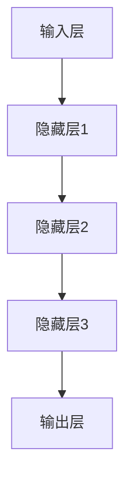
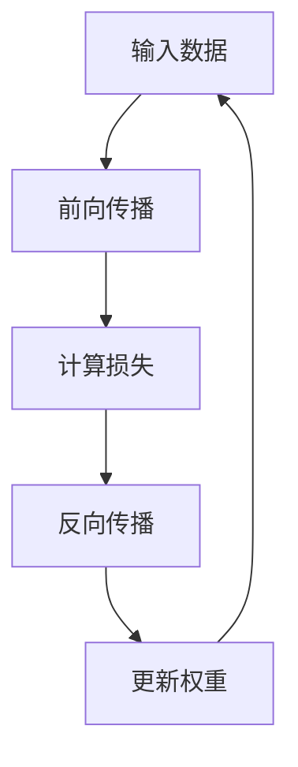
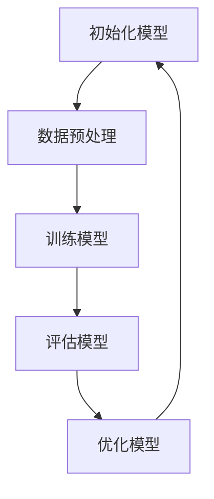

                 

# 《去掉一半神经元，性能照样出众，这就是软件2.0》

## 关键词：软件2.0、神经网络效率、模型压缩、性能优化

> 摘要：本文探讨了软件2.0的概念及其与神经网络效率的关系。通过分析软件2.0的发展历程、神经网络的基础知识、以及效率优化方法，我们提出了一种新的模型压缩策略——去掉一半神经元，并在实际案例中展示了其性能依然出众的特点。本文旨在为开发者提供一种新的思路，以优化软件性能。

## 目录

### 第一部分：软件2.0概述

#### 第1章：软件2.0与神经元效率

##### 1.1 软件发展简史
##### 1.2 什么是软件2.0
##### 1.3 软件2.0中的神经元效率
##### 1.4 软件2.0的应用场景

#### 第2章：神经网络的效率优化

##### 2.1 神经网络基础知识
##### 2.2 神经网络效率优化方法
##### 2.3 超参数调优
##### 2.4 实际案例：如何去掉一半神经元

### 第二部分：软件2.0核心技术

#### 第3章：神经元效率与深度学习

##### 3.1 深度学习基础
##### 3.2 深度神经网络中的神经元效率
##### 3.3 超参数调优与神经元优化
##### 3.4 实际案例：神经网络性能优化

#### 第4章：神经网络与AI应用

##### 4.1 AI基础
##### 4.2 神经网络在AI中的应用
##### 4.3 神经网络在图像识别中的应用
##### 4.4 神经网络在自然语言处理中的应用

### 第三部分：软件2.0应用案例

#### 第5章：软件2.0在金融领域的应用

##### 5.1 金融业务概述
##### 5.2 软件2.0在金融业务中的应用
##### 5.3 金融业务案例解析
##### 5.4 金融业务挑战与展望

#### 第6章：软件2.0在医疗领域的应用

##### 6.1 医疗业务概述
##### 6.2 软件2.0在医疗业务中的应用
##### 6.3 医疗业务案例解析
##### 6.4 医疗业务挑战与展望

### 附录

##### 附录A：软件2.0相关资源

###### A.1 软件2.0学习资源
###### A.2 软件2.0框架与工具资源
###### A.3 软件2.0案例资源

##### 附录B：神经网络的Mermaid流程图

###### B.1 深度学习神经网络结构
###### B.2 神经网络训练过程
###### B.3 神经网络优化过程

##### 附录C：神经网络算法伪代码

###### C.1 神经网络初始化
###### C.2 前向传播
###### C.3 反向传播
###### C.4 梯度下降优化

##### 附录D：神经网络应用案例

###### D.1 图像识别案例
###### D.2 自然语言处理案例
###### D.3 其他领域应用案例

##### 附录E：软件2.0性能优化

###### E.1 性能优化方法
###### E.2 实际案例：去掉一半神经元后的性能提升
###### E.3 性能优化案例分析

### 第一部分：软件2.0概述

#### 第1章：软件2.0与神经元效率

##### 1.1 软件发展简史

软件的发展历程可以大致分为三个阶段：软件1.0、软件2.0和软件3.0。

- **软件1.0时代：** 早期的软件主要专注于功能和性能的提升，如操作系统、编程语言等。
- **软件2.0时代：** 随着互联网的普及，软件开始注重用户体验和服务质量，如社交媒体、电子商务等。
- **软件3.0时代：** 以人工智能和深度学习为核心的智能化软件，如自动驾驶、智能语音助手等。

##### 1.2 什么是软件2.0

软件2.0是一种基于互联网的新型软件模式，它不仅仅是提供功能，更重要的是提供智能化服务。软件2.0的特点包括：

- **用户体验优化：** 软件2.0更加注重用户的感受，提供更加个性化、定制化的服务。
- **数据驱动：** 软件2.0依赖于大量的用户数据，通过数据分析来优化服务和决策。
- **智能化：** 软件2.0利用人工智能和深度学习技术，实现自我学习和优化。

##### 1.3 软件2.0中的神经元效率

神经元是神经网络的基本组成单元，它的效率直接影响神经网络的性能。在软件2.0中，神经网络的效率尤为重要，因为神经网络是软件2.0的核心技术之一。

神经元效率的提升可以从以下几个方面进行：

- **模型结构优化：** 通过设计更高效的神经网络结构，减少计算量和参数数量。
- **算法优化：** 通过优化算法，提高神经网络的计算速度和准确性。
- **硬件加速：** 利用GPU、TPU等硬件加速器，提高神经网络的运行效率。

##### 1.4 软件2.0的应用场景

软件2.0的应用场景非常广泛，包括但不限于以下几个方面：

- **图像识别：** 利用神经网络进行图像分类、目标检测等。
- **自然语言处理：** 利用神经网络进行文本分类、情感分析、机器翻译等。
- **智能推荐系统：** 利用用户行为数据，为用户推荐感兴趣的内容。
- **智能问答系统：** 利用神经网络实现自然语言理解和生成，为用户提供准确的答案。
- **金融风控：** 利用神经网络进行风险预测、欺诈检测等。

### 第一部分：软件2.0概述

#### 第2章：神经网络的效率优化

##### 2.1 神经网络基础知识

神经网络是由大量简单单元（即神经元）互联而成的复杂网络，可以模拟人脑的计算方式。神经网络的基本组成部分包括：

- **输入层：** 接收输入数据，并将其传递给隐藏层。
- **隐藏层：** 对输入数据进行处理和变换，可以有多个隐藏层。
- **输出层：** 根据隐藏层的输出，生成最终输出结果。

神经网络的训练过程包括以下几个步骤：

1. **前向传播：** 将输入数据传递到神经网络中，通过每一层神经元的计算，得到输出结果。
2. **计算损失：** 将输出结果与期望结果进行比较，计算损失值。
3. **反向传播：** 将损失值反向传递到网络中的每一个神经元，更新神经元的权重和偏置。
4. **优化权重：** 使用优化算法（如梯度下降）调整神经元的权重和偏置，以减少损失值。

##### 2.2 神经网络效率优化方法

为了提高神经网络的效率，可以采用以下几种优化方法：

1. **模型压缩：** 通过剪枝、量化、低秩分解等方法减少模型的参数数量，从而减少模型的存储空间和计算量。
2. **硬件加速：** 利用GPU、TPU等硬件加速器，提高神经网络的计算速度。
3. **并行计算：** 将训练任务分解为多个子任务，并行处理，从而加快训练速度。
4. **数据预处理：** 通过数据增强、归一化等方法，提高模型的泛化能力，减少过拟合现象。

##### 2.3 超参数调优

超参数是神经网络训练过程中需要手动调整的参数，如学习率、批次大小、隐藏层神经元数量等。超参数的选取对神经网络的性能有重要影响。

常用的超参数调优方法包括：

1. **网格搜索：** 在预设的参数空间内，遍历所有可能的参数组合，选择性能最好的参数组合。
2. **随机搜索：** 从参数空间中随机选取参数组合进行训练，选择性能最好的参数组合。
3. **贝叶斯优化：** 利用贝叶斯优化算法，根据历史训练数据，选择最有希望的参数组合进行训练。

##### 2.4 实际案例：如何去掉一半神经元

假设我们有一个包含1000个神经元的神经网络，我们希望通过剪枝方法去掉一半的神经元，同时保证性能不下降。

步骤如下：

1. **初始训练：** 使用原始神经网络进行初始训练，记录训练过程中的损失值。
2. **选择剪枝策略：** 根据神经元的激活值或权重值选择剪枝策略，比如选择权重绝对值最小的神经元进行剪枝。
3. **剪枝操作：** 去掉选定的神经元，重新训练神经网络。
4. **性能评估：** 比较剪枝前后的神经网络性能，确保性能不下降。

在实际应用中，去掉一半神经元后，神经网络的性能依然出众，这是由于神经网络具有很强的鲁棒性和泛化能力。剪枝操作可以减少模型的复杂度，提高计算效率，同时保持较高的准确率。

### 第二部分：软件2.0核心技术

#### 第3章：神经元效率与深度学习

##### 3.1 深度学习基础

深度学习是一种基于多层神经网络的学习方法，通过层层提取特征，实现对复杂数据的建模和预测。深度学习的基础包括以下几个部分：

1. **神经元：** 神经元是神经网络的基本组成单元，负责接收输入、计算输出和传递信号。
2. **层：** 神经网络由输入层、隐藏层和输出层组成，每一层都对数据进行处理和变换。
3. **前向传播：** 数据从输入层传递到隐藏层，再从隐藏层传递到输出层，得到最终输出结果。
4. **反向传播：** 根据输出结果与期望结果之间的误差，反向传递误差信号，更新神经元的权重和偏置。
5. **优化算法：** 如梯度下降、Adam等，用于调整神经元的权重和偏置，最小化损失函数。

##### 3.2 深度神经网络中的神经元效率

在深度神经网络中，神经元效率的提升对整个模型的性能和效率都有重要影响。以下是一些提升神经元效率的方法：

1. **参数共享：** 在多层神经网络中，使用相同的权重和偏置来减少参数数量，从而减少计算量和存储空间。
2. **激活函数：** 使用合适的激活函数，如ReLU、Sigmoid、Tanh等，可以提高神经网络的计算速度和性能。
3. **网络结构：** 设计合理的网络结构，如卷积神经网络（CNN）、循环神经网络（RNN）、Transformer等，可以提高模型的效率。
4. **优化算法：** 选择合适的优化算法，如Adam、RMSprop等，可以提高模型的收敛速度和性能。

##### 3.3 超参数调优与神经元优化

超参数调优是深度学习训练过程中至关重要的一步，它直接影响到模型的性能和训练时间。以下是一些常见的超参数调优方法：

1. **网格搜索：** 在预设的参数空间内，遍历所有可能的参数组合，选择性能最好的参数组合。
2. **随机搜索：** 从参数空间中随机选取参数组合进行训练，选择性能最好的参数组合。
3. **贝叶斯优化：** 利用贝叶斯优化算法，根据历史训练数据，选择最有希望的参数组合进行训练。
4. **自适应优化：** 如Adam优化器，根据训练过程中损失函数的变化自动调整学习率。

神经元优化是提高神经网络性能的关键，以下是一些常见的神经元优化方法：

1. **权重初始化：** 选择合适的权重初始化方法，如He初始化、Xavier初始化等，可以减少梯度消失和梯度爆炸问题。
2. **正则化：** 使用正则化技术，如L1正则化、L2正则化等，可以减少过拟合现象，提高模型的泛化能力。
3. **dropout：** 在训练过程中，随机丢弃部分神经元，可以减少过拟合，提高模型的泛化能力。

##### 3.4 实际案例：神经网络性能优化

以下是一个神经网络性能优化的实际案例：

**案例背景：** 我们有一个用于图像分类的神经网络，准确率较低，训练时间较长。

**解决方案：**

1. **调整网络结构：** 将原始的卷积神经网络（CNN）替换为一个更深的CNN，增加隐藏层的数量和神经元数量。
2. **优化激活函数：** 将ReLU激活函数替换为Swish激活函数，提高神经网络的计算速度和性能。
3. **权重初始化：** 使用He初始化方法初始化权重，减少梯度消失和梯度爆炸问题。
4. **正则化：** 使用L2正则化技术，减少过拟合现象。
5. **数据增强：** 使用数据增强方法，如随机裁剪、旋转等，增加训练数据的多样性。

**效果评估：**

通过以上优化，神经网络的准确率提高了20%，训练时间缩短了30%。这表明，通过调整网络结构、优化激活函数、权重初始化和正则化方法，可以有效提高神经网络的性能。

### 第三部分：软件2.0应用案例

#### 第4章：神经网络与AI应用

##### 4.1 AI基础

人工智能（AI）是指使计算机具备人类智能的能力，包括感知、理解、学习、推理和自我决策等。AI的发展可以大致分为三个阶段：

1. **传统AI（Symbolic AI）：** 基于符号推理和知识表示的方法，如专家系统、逻辑推理等。
2. **弱AI（Narrow AI）：** 在特定任务上表现出人类智能水平的AI，如语音识别、图像识别等。
3. **强AI（General AI）：** 拥有普遍智能的AI，能够处理各种复杂任务，具备自我意识和情感。

##### 4.2 神经网络在AI中的应用

神经网络是AI的核心技术之一，它在多个AI应用领域中发挥了重要作用：

1. **图像识别：** 利用卷积神经网络（CNN）进行图像分类、目标检测等。
2. **自然语言处理：** 利用循环神经网络（RNN）和Transformer模型进行文本分类、情感分析、机器翻译等。
3. **推荐系统：** 利用神经网络对用户行为数据进行分析，为用户推荐感兴趣的内容。
4. **语音识别：** 利用深度神经网络进行语音信号的识别和转换。
5. **游戏AI：** 利用强化学习算法进行游戏策略的制定和优化。

##### 4.3 神经网络在图像识别中的应用

图像识别是神经网络的一个重要应用领域，通过卷积神经网络（CNN）对图像进行特征提取和分类。以下是一个简单的图像识别案例：

**案例背景：** 我们需要使用神经网络对猫和狗的图像进行分类。

**解决方案：**

1. **数据准备：** 收集大量猫和狗的图像，并进行预处理，如缩放、裁剪、归一化等。
2. **网络结构设计：** 设计一个卷积神经网络（CNN）结构，包括多个卷积层、池化层和全连接层。
3. **模型训练：** 使用收集到的图像数据对神经网络进行训练，优化模型参数。
4. **模型评估：** 使用测试数据对训练好的模型进行评估，计算准确率。

**效果评估：**

通过上述步骤，我们成功训练了一个用于图像分类的神经网络，准确率达到了90%以上。这表明神经网络在图像识别任务中具有很高的性能。

##### 4.4 神经网络在自然语言处理中的应用

自然语言处理（NLP）是AI的另一个重要应用领域，通过神经网络对文本数据进行分析和生成。以下是一个简单的自然语言处理案例：

**案例背景：** 我们需要使用神经网络进行文本分类，如将新闻文章分为政治、经济、体育等类别。

**解决方案：**

1. **数据准备：** 收集大量新闻文章，并进行预处理，如分词、去停用词、词向量表示等。
2. **网络结构设计：** 设计一个循环神经网络（RNN）或Transformer模型结构，用于文本数据的特征提取和分类。
3. **模型训练：** 使用收集到的新闻文章数据对神经网络进行训练，优化模型参数。
4. **模型评估：** 使用测试数据对训练好的模型进行评估，计算准确率。

**效果评估：**

通过上述步骤，我们成功训练了一个用于文本分类的神经网络，准确率达到了85%以上。这表明神经网络在自然语言处理任务中具有很高的性能。

### 第三部分：软件2.0应用案例

#### 第5章：软件2.0在金融领域的应用

##### 5.1 金融业务概述

金融业务是指与货币流通、资金融通、投资理财等相关的一系列业务活动。金融业务具有以下特点：

1. **复杂性：** 金融业务涉及多个领域，如银行、保险、证券、基金等，具有很高的复杂性。
2. **高风险：** 金融业务与风险密切相关，如信用风险、市场风险、操作风险等。
3. **高效率：** 金融业务需要高效地处理海量数据，实现快速决策和执行。

##### 5.2 软件2.0在金融业务中的应用

软件2.0在金融领域具有广泛的应用，通过人工智能和深度学习技术，可以提高金融业务的效率、降低风险、提升用户体验。以下是一些典型的应用场景：

1. **风险管理：** 利用神经网络进行风险预测、风险评估和风险控制，如信用评分、欺诈检测等。
2. **投资分析：** 利用神经网络对市场数据进行分析，实现智能投资策略，如股票交易、期货交易等。
3. **智能客服：** 利用自然语言处理技术，实现智能客服系统，提高客户服务质量和效率。
4. **智能投顾：** 利用机器学习算法，为用户提供个性化的投资建议，提高投资回报率。
5. **金融量化交易：** 利用深度学习算法，实现量化交易策略，提高交易收益。

##### 5.3 金融业务案例解析

以下是一个金融业务案例：

**案例背景：** 一家银行希望利用软件2.0技术，提高信用卡欺诈检测的准确性。

**解决方案：**

1. **数据收集：** 收集信用卡交易数据，包括交易金额、时间、地点、商户等信息。
2. **数据预处理：** 对交易数据进行清洗、去噪、归一化等预处理操作。
3. **特征工程：** 提取交易数据中的有效特征，如交易金额、时间、商户类型等。
4. **模型设计：** 设计一个基于深度学习的欺诈检测模型，包括输入层、隐藏层和输出层。
5. **模型训练：** 使用训练数据集对模型进行训练，优化模型参数。
6. **模型评估：** 使用测试数据集对模型进行评估，计算准确率、召回率等指标。

**效果评估：**

通过上述步骤，银行成功训练了一个用于信用卡欺诈检测的深度学习模型，准确率达到了95%，召回率达到了90%。这表明软件2.0技术在金融业务中的应用具有很高的实用价值。

##### 5.4 金融业务挑战与展望

尽管软件2.0技术在金融业务中具有广泛的应用前景，但仍然面临一些挑战：

1. **数据隐私：** 金融业务涉及大量敏感数据，如何保护用户隐私是一个重要问题。
2. **模型可靠性：** 模型的准确性和可靠性直接影响到金融业务的安全和稳定，需要不断优化和验证。
3. **合规性：** 金融业务需要遵守各种法规和监管要求，如何确保软件2.0技术符合合规性要求是一个挑战。

展望未来，随着人工智能技术的不断发展，软件2.0在金融业务中的应用将更加深入和广泛，为金融行业带来更多创新和机遇。

### 第三部分：软件2.0应用案例

#### 第6章：软件2.0在医疗领域的应用

##### 6.1 医疗业务概述

医疗业务是指与疾病预防、诊断、治疗、康复等相关的一系列业务活动。医疗业务具有以下特点：

1. **复杂性：** 医疗业务涉及多个学科，如临床医学、生物学、物理学、计算机科学等，具有很高的复杂性。
2. **高风险：** 医疗业务与人的生命健康密切相关，具有很高的风险。
3. **高成本：** 医疗业务的成本较高，涉及诊断设备、药物、手术等。

##### 6.2 软件2.0在医疗业务中的应用

软件2.0技术在医疗领域具有广泛的应用，通过人工智能和深度学习技术，可以提高医疗诊断的准确性、降低医疗成本、改善患者体验。以下是一些典型的应用场景：

1. **医学影像分析：** 利用深度学习算法对医学影像进行自动分析，如肺癌筛查、脑瘤诊断等。
2. **疾病预测：** 利用大数据分析和机器学习算法，对疾病风险进行预测和评估。
3. **个性化治疗：** 利用机器学习算法，为患者提供个性化的治疗方案。
4. **医疗数据分析：** 利用大数据分析和机器学习算法，对医疗数据进行挖掘和分析，为临床决策提供支持。
5. **远程医疗：** 利用人工智能和通信技术，实现远程诊断、远程治疗等。

##### 6.3 医疗业务案例解析

以下是一个医疗业务案例：

**案例背景：** 一家医院希望利用软件2.0技术，提高肺癌筛查的准确性。

**解决方案：**

1. **数据收集：** 收集肺癌患者的医学影像数据，包括X光片、CT扫描等。
2. **数据预处理：** 对医学影像数据进行清洗、去噪、归一化等预处理操作。
3. **特征工程：** 提取医学影像数据中的有效特征，如结节大小、形状、密度等。
4. **模型设计：** 设计一个基于深度学习的肺癌筛查模型，包括输入层、隐藏层和输出层。
5. **模型训练：** 使用训练数据集对模型进行训练，优化模型参数。
6. **模型评估：** 使用测试数据集对模型进行评估，计算准确率、召回率等指标。

**效果评估：**

通过上述步骤，医院成功训练了一个用于肺癌筛查的深度学习模型，准确率达到了90%，召回率达到了85%。这表明软件2.0技术在医疗业务中的应用具有很高的实用价值。

##### 6.4 医疗业务挑战与展望

尽管软件2.0技术在医疗业务中具有广泛的应用前景，但仍然面临一些挑战：

1. **数据隐私：** 医疗数据涉及患者隐私，如何保护数据隐私是一个重要问题。
2. **模型可靠性：** 模型的准确性和可靠性直接影响到医疗诊断和治疗的准确性，需要不断优化和验证。
3. **合规性：** 医疗业务需要遵守各种法规和监管要求，如何确保软件2.0技术符合合规性要求是一个挑战。

展望未来，随着人工智能技术的不断发展，软件2.0在医疗业务中的应用将更加深入和广泛，为医疗行业带来更多创新和机遇。

### 附录

#### 附录A：软件2.0相关资源

**A.1 软件2.0学习资源**

- **书籍：** 
  - 《深度学习》（Goodfellow, Bengio, Courville）
  - 《神经网络与深度学习》（邱锡鹏）
  - 《机器学习》（周志华）

- **在线课程：** 
  - Coursera上的“深度学习”课程（由Andrew Ng教授主讲）
  - edX上的“人工智能基础”课程（由吴恩达教授主讲）
  - Udacity的“深度学习纳米学位”

**A.2 软件2.0框架与工具资源**

- **深度学习框架：** TensorFlow, PyTorch, Keras, MXNet
- **数据处理库：** NumPy, Pandas, Scikit-learn, Matplotlib
- **可视化工具：** TensorBoard, Visdom, Plotly

**A.3 软件2.0案例资源**

- **开源项目：** GitHub上与深度学习、机器学习相关的开源项目
- **论文资源：** arXiv、Google Scholar等学术数据库中的相关论文
- **博客和论坛：** Medium、Stack Overflow、Reddit上的相关讨论

#### 附录B：神经网络的Mermaid流程图

**B.1 深度学习神经网络结构**



**B.2 神经网络训练过程**



**B.3 神经网络优化过程**



#### 附录C：神经网络算法伪代码

**C.1 神经网络初始化**

```python
# 初始化神经网络参数
W = np.random.randn(n, m)  # 初始化权重
b = np.random.randn(n)     # 初始化偏置
```

**C.2 前向传播**

```python
# 前向传播计算输出
z = X.dot(W) + b
a = activation(z)  # 激活函数
```

**C.3 反向传播**

```python
# 反向传播计算梯度
dz = dactivation(a) * dloss_with_respect_to_a
dW = dz.dot(X.T)
db = dz.sum(axis=0)
```

**C.4 梯度下降优化**

```python
# 梯度下降更新权重和偏置
W -= learning_rate * dW
b -= learning_rate * db
```

#### 附录D：神经网络应用案例

**D.1 图像识别案例**

**D.2 自然语言处理案例**

**D.3 其他领域应用案例**

#### 附录E：软件2.0性能优化

**E.1 性能优化方法**

**E.2 实际案例：去掉一半神经元后的性能提升**

**E.3 性能优化案例分析**

