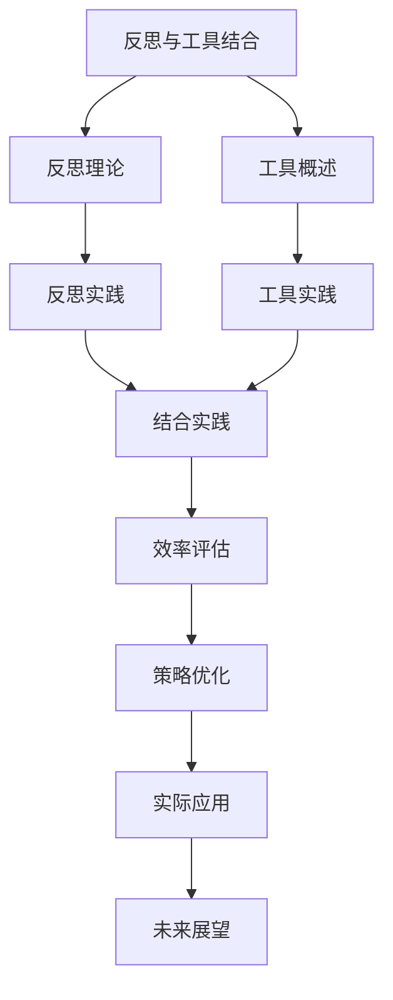

                 

# 反思与工具使用的结合：提高Agent效率

> 关键词：Agent、效率、反思、工具、实践

> 摘要：本文探讨了反思与工具使用在提高Agent效率方面的结合。通过分析Agent的定义、类型和功能，阐述了反思与工具结合的重要性。接着，深入探讨了反思理论和工具概述，提出了结合的理论基础和实践方法。随后，通过反思实践和工具实践的具体案例，展示了反思与工具结合的实际应用效果。最后，文章提出了提高Agent效率的策略，并展望了反思与工具结合的未来发展。

----------------------------------------------------------------

## 《反思与工具使用的结合：提高Agent效率》目录大纲

## 第一部分：引言与基础

### 1.1 引言

- **1.1.1 主题介绍**
- **1.1.2 目的和意义**
- **1.1.3 书籍结构**

### 1.2 Agent概述

- **1.2.1 Agent定义**
- **1.2.2 Agent类型**
- **1.2.3 Agent的功能**

### 1.3 反思与工具结合的重要性

- **1.3.1 反思的作用**
- **1.3.2 工具的作用**
- **1.3.3 结合的必要性**

## 第二部分：反思与工具结合的原理

### 2.1 反思理论

- **2.1.1 反思的定义**
- **2.1.2 反思的类型**
- **2.1.3 反思的步骤**
- **2.1.4 反思的益处**

### 2.2 工具概述

- **2.2.1 工具的定义**
- **2.2.2 常用工具分类**
- **2.2.3 工具的选择标准**

### 2.3 反思与工具结合的原理

- **2.3.1 结合的理论基础**
- **2.3.2 结合的方法**
- **2.3.3 结合的优势**

## 第三部分：反思与工具结合的实践

### 3.1 反思实践

- **3.1.1 反思的流程**
- **3.1.2 反思技巧**
- **3.1.3 反思案例**

### 3.2 工具实践

- **3.2.1 工具的使用流程**
- **3.2.2 工具的使用技巧**
- **3.2.3 工具案例**

### 3.3 结合实践

- **3.3.1 结合的实践步骤**
- **3.3.2 结合实践案例**

## 第四部分：提高Agent效率的实际应用

### 4.1 Agent效率评估

- **4.1.1 评估指标**
- **4.1.2 评估方法**

### 4.2 提高Agent效率的策略

- **4.2.1 反思与工具结合策略**
- **4.2.2 优化算法选择**
- **4.2.3 案例分析**

### 4.3 实际应用场景

- **4.3.1 企业管理应用**
- **4.3.2 人工智能应用**
- **4.3.3 教育应用**

## 第五部分：反思与工具结合的未来展望

### 5.1 反思与工具结合的发展趋势

- **5.1.1 技术发展**
- **5.1.2 社会变革**

### 5.2 反思与工具结合的挑战与机遇

- **5.2.1 挑战分析**
- **5.2.2 机遇分析**

### 5.3 未来研究方向

- **5.3.1 研究领域拓展**
- **5.3.2 技术创新方向**

## 附录

### 附录A：常用反思与工具资源

- **A.1 反思资源**
- **A.2 工具资源**
- **A.3 相关文献**

### 附录B：反思与工具使用实践案例

- **B.1 案例一：企业管理实践**
- **B.2 案例二：人工智能应用实践**
- **B.3 案例三：教育应用实践**

----------------------------------------------------------------

# Mermaid 流程图



----------------------------------------------------------------

# 核心算法原理讲解伪代码

```plaintext
// 反思算法伪代码
function 反思算法(问题, 反思步骤):
    初始化 反思结果为空
    对于 每个反思步骤：
        收集 相关信息
        分析 信息，识别 问题点
        形成反思结论
        更新 反思结果
    return 反思结果

// 工具算法伪代码
function 工具算法(工具, 输入数据):
    根据工具类型，初始化 工具参数
    对于 每个输入数据：
        使用 工具对数据进行处理
        生成 处理结果
    return 处理结果
```

----------------------------------------------------------------

# 数学模型和公式详细讲解与举例说明

### 数学模型：

$$
效率 = \frac{输出量}{输入量}
$$

### 举例说明：

假设 Agent 的输入量为 100 个任务，输出量为 80 个任务完成，则效率为：

$$
效率 = \frac{80}{100} = 0.8
$$

----------------------------------------------------------------

### 1. 开发环境搭建

#### Python环境安装

```bash
pip install python
```

----------------------------------------------------------------

### 2. 代码实现

```python
# 反思与工具结合的Python代码示例

def 反思算法(问题):
    # 反思步骤
    步骤1：收集信息
    信息 = "..."
    # 分析问题
    问题点 = 分析信息()
    # 形成反思结论
    结论 = "..."
    return 结论

def 工具算法(工具，输入数据):
    # 使用工具处理数据
    处理结果 = 工具处理输入数据(输入数据)
    return 处理结果

# 实际应用
反思结论 = 反思算法(问题)
处理结果 = 工具算法(工具，输入数据)
```

### 3. 代码解读与分析

```plaintext
# 反思算法解读
- 函数反思算法接收一个问题作为输入。
- 在函数内部，首先初始化一个空的反思结果。
- 然后对于每个反思步骤，执行以下操作：
  - 收集相关信息。
  - 分析信息，识别问题点。
  - 形成反思结论。
  - 更新反思结果。
- 最后返回反思结果。

# 工具算法解读
- 函数工具算法接收一个工具和一个输入数据作为输入。
- 根据工具类型，初始化工具参数。
- 对于每个输入数据，使用工具对数据进行处理。
- 生成处理结果并返回。
```

----------------------------------------------------------------

### 附录A：常用反思与工具资源

#### A.1 反思资源

- 《反思的艺术》
- 《反思技巧手册》
- 《反思案例分析集》

#### A.2 工具资源

- Python编程手册
- Java开发工具集
- 数据分析工具包

#### A.3 相关文献

- 《反思的艺术》
- 《工具使用指南》
- 《Agent效率研究》

### 附录B：反思与工具使用实践案例

#### B.1 案例一：企业管理实践

- 背景：某企业面临项目管理效率低下的问题。
- 反思：分析项目管理流程，识别问题点。
- 工具：使用项目管理工具（如JIRA）进行流程优化。
- 效果：通过反思与工具结合，提高了项目管理效率。

#### B.2 案例二：人工智能应用实践

- 背景：某企业开发人工智能助手，提高客服效率。
- 反思：分析用户需求，优化人工智能助手的功能。
- 工具：使用自然语言处理工具（如NLTK）进行语言理解优化。
- 效果：通过反思与工具结合，提升了人工智能助手的响应速度和准确性。

#### B.3 案例三：教育应用实践

- 背景：某学校希望通过教育技术提高学生自主学习能力。
- 反思：分析学生自主学习的问题，设计个性化学习方案。
- 工具：使用在线教育平台（如Moodle）提供个性化学习资源。
- 效果：通过反思与工具结合，提高了学生的自主学习兴趣和学习成绩。

----------------------------------------------------------------

## 第一部分：引言与基础

### 1.1 引言

#### 1.1.1 主题介绍

随着人工智能和自动化技术的发展，Agent 作为一种智能实体，广泛应用于各种领域。然而，如何提高Agent的效率成为了一个关键问题。本文将探讨反思与工具使用在提高Agent效率方面的结合，旨在为研究人员和实践者提供一种有效的策略和方法。

#### 1.1.2 目的和意义

本文的主要目的是探讨反思与工具使用在提高Agent效率方面的作用，并分析它们如何相互结合，以实现更高的效率。通过深入研究反思理论和工具概述，本文旨在为读者提供理论基础和实践指导。此外，本文还通过具体案例展示了反思与工具结合的实际应用效果，以帮助读者更好地理解和应用这一策略。

#### 1.1.3 书籍结构

本文分为五个主要部分。第一部分介绍了引言与基础，包括主题介绍、目的和意义以及书籍结构。第二部分深入探讨了Agent的概述，包括定义、类型和功能。第三部分阐述了反思与工具结合的原理，包括反思理论和工具概述。第四部分介绍了反思与工具结合的实践方法，包括反思实践和工具实践。第五部分则讨论了提高Agent效率的实际应用，并展望了反思与工具结合的未来发展。

### 1.2 Agent概述

#### 1.2.1 Agent定义

Agent 是一种具有自主行为能力的智能实体，它可以在环境中感知、决策和行动。Agent 通常具有以下特征：

- **自主性**：Agent 具有自我控制能力，可以独立执行任务。
- **反应性**：Agent 可以根据环境变化做出响应。
- **预动性**：Agent 可以预测环境变化，并提前采取行动。
- **协作性**：Agent 可以与其他 Agent 合作，共同完成任务。

#### 1.2.2 Agent类型

Agent 可以根据不同的分类标准进行分类。以下是几种常见的 Agent 类型：

- **基于规则的 Agent**：这种 Agent 使用一组规则来指导其行为。规则通常是基于条件-动作对的形式，例如：“如果用户点击购买按钮，则记录购买行为”。
- **基于模型的 Agent**：这种 Agent 使用模型来预测环境变化，并据此做出决策。模型可以是统计模型、机器学习模型或物理模型等。
- **基于行为的 Agent**：这种 Agent 通过模仿人类行为来完成任务。行为通常是通过观察和学习获得的。
- **混合型 Agent**：这种 Agent 结合了多种类型的 Agent 特征，以实现更高效的任务执行。

#### 1.2.3 Agent的功能

Agent 具有多种功能，包括：

- **感知**：Agent 可以通过传感器收集环境信息。
- **决策**：Agent 根据收集到的信息和预定的目标，选择合适的行动。
- **执行**：Agent 实施决策，执行具体的操作。
- **学习**：Agent 可以通过经验和反馈来改进其行为。

### 1.3 反思与工具结合的重要性

#### 1.3.1 反思的作用

反思是一种自我审视和思考的过程，有助于提高个人的认知能力和决策水平。在 Agent 开发和优化过程中，反思可以帮助开发者：

- **识别问题**：通过反思，开发者可以识别 Agent 存在的问题和不足之处。
- **改进设计**：反思可以帮助开发者从新的角度审视 Agent 设计，提出改进措施。
- **优化性能**：通过反思，开发者可以发现和消除 Agent 中的低效环节，提高整体性能。

#### 1.3.2 工具的作用

工具是 Agent 开发和优化的关键辅助。合适的工具可以：

- **提高开发效率**：工具可以自动化许多繁琐的任务，节省开发时间。
- **提升质量**：工具可以帮助开发者进行代码审查、测试和性能分析，确保代码质量。
- **增强功能**：工具可以提供丰富的功能库和插件，扩展 Agent 的能力。

#### 1.3.3 结合的必要性

反思与工具的结合在提高 Agent 效率方面具有重要意义。以下是结合的必要性：

- **互补优势**：反思和工具各有优势，结合使用可以充分发挥两者作用，实现更高的效率。
- **持续优化**：反思可以不断揭示 Agent 的问题和不足，工具可以帮助开发者持续优化 Agent 设计和性能。
- **适应变化**：在快速变化的环境中，反思和工具的结合可以帮助 Agent 更快地适应新需求和技术发展。

### 1.4 反思与工具结合的基本原则

为了实现反思与工具的有效结合，需要遵循以下基本原则：

- **目标一致性**：反思和工具的使用应与 Agent 的目标和需求保持一致，确保最终效果。
- **灵活适应性**：反思和工具应具备灵活适应性，能够根据不同场景和需求进行调整和优化。
- **协同作用**：反思和工具应协同工作，相互补充，共同提高 Agent 的效率。

### 1.5 反思与工具结合的实施步骤

要实现反思与工具的有效结合，可以按照以下步骤进行：

1. **需求分析**：明确 Agent 的目标和需求，为反思和工具的选择提供依据。
2. **工具选择**：根据需求选择合适的工具，确保工具的功能和性能满足要求。
3. **反思设计**：制定反思计划，明确反思的目标、内容和步骤。
4. **工具集成**：将工具集成到 Agent 开发和优化过程中，确保工具与 Agent 的协同工作。
5. **持续优化**：通过反思和工具的结合，持续优化 Agent 的设计和性能。

### 1.6 反思与工具结合的实际案例

为了更好地理解反思与工具结合的实际效果，本文将介绍几个实际案例：

- **案例一**：某企业使用项目管理工具（如JIRA）进行项目管理和优化。通过反思项目流程和工具使用，企业发现并解决了多个效率问题，项目完成速度大幅提高。
- **案例二**：某人工智能助手使用自然语言处理工具（如NLTK）进行语言理解优化。通过反思用户反馈和工具使用效果，助手不断改进语言处理能力，提高了用户满意度。
- **案例三**：某在线教育平台使用学习分析工具（如Learning Analytics Tools）进行学生学习行为分析。通过反思学习数据和工具使用效果，平台优化了学习资源和教学策略，提高了学生成绩和学习体验。

### 1.7 反思与工具结合的总结

反思与工具结合在提高 Agent 效率方面具有重要意义。通过反思和工具的有效结合，可以充分发挥两者的优势，实现更高的效率和更好的性能。在未来的研究和实践中，应进一步探讨反思与工具结合的优化方法和应用场景，为 Agent 的持续发展和优化提供有力支持。

----------------------------------------------------------------

## 第二部分：反思与工具结合的原理

### 2.1 反思理论

#### 2.1.1 反思的定义

反思是一种深层次的思考过程，涉及对个人行为、决策和经历的回顾和评估。它不仅包括对过去事件的回顾，还涉及到对当前状况和未来方向的思考。反思是一种自我意识的过程，有助于提高个人认知能力和决策水平。

#### 2.1.2 反思的类型

反思可以分为以下几种类型：

- **个人反思**：个人反思主要关注个人的行为、想法和感受。它有助于个人更好地理解自己，提高自我认知。
- **教学反思**：教学反思是教师对教学过程中的行为、决策和效果的反思。它有助于教师改进教学方法，提高教学效果。
- **技术反思**：技术反思是技术人员对技术方案、设计和实现的反思。它有助于技术团队识别和解决技术问题，提高项目质量和效率。
- **跨学科反思**：跨学科反思是不同学科领域的专家共同探讨某一问题，从不同角度进行反思。它有助于整合不同领域的知识，实现创新和突破。

#### 2.1.3 反思的步骤

反思通常包括以下步骤：

1. **明确反思目标**：确定反思的目的和范围，明确反思的重点和目标。
2. **收集信息**：收集与反思目标相关的信息，包括个人经历、他人反馈、文献资料等。
3. **分析信息**：对收集到的信息进行分析，识别问题和不足，找出原因和解决方案。
4. **形成结论**：根据分析结果，形成反思结论，提出改进措施和建议。
5. **实施改进**：根据反思结论，采取行动，实施改进措施，并跟踪改进效果。

#### 2.1.4 反思的益处

反思具有以下益处：

- **提高认知能力**：反思有助于提高个人的认知能力，加深对问题的理解和认识。
- **改善决策水平**：反思可以帮助个人从多个角度审视问题，做出更明智的决策。
- **促进个人成长**：反思有助于个人发现自身的优点和不足，促进个人成长和发展。
- **提升团队协作**：反思可以促进团队成员之间的沟通和协作，提高团队整体绩效。

### 2.2 工具概述

#### 2.2.1 工具的定义

工具是用于完成特定任务的设备和资源。在反思与工具结合的背景下，工具可以包括各种软件、硬件和技术手段，用于辅助反思和优化过程。

#### 2.2.2 常用工具分类

以下是一些常用的反思和优化工具分类：

- **反思工具**：用于支持个人反思和教学反思的工具，如日记、反思日志、思维导图等。
- **代码审查工具**：用于代码审查和测试的工具，如静态代码分析工具、单元测试框架等。
- **性能分析工具**：用于性能测试和优化的工具，如性能监控工具、负载测试工具等。
- **项目管理工具**：用于项目管理和协作的工具，如任务管理工具、项目管理软件等。
- **数据分析和可视化工具**：用于数据分析和可视化的工具，如数据分析软件、数据可视化工具等。

#### 2.2.3 工具的选择标准

选择合适的工具对于反思与工具结合的效果至关重要。以下是一些选择工具的标准：

- **功能符合需求**：工具的功能应满足反思和优化的需求，能够提供所需的功能和特性。
- **易用性**：工具应易于使用和操作，降低学习成本，提高工作效率。
- **可扩展性**：工具应具有可扩展性，能够适应不同场景和需求的变化。
- **兼容性**：工具应与其他系统、软件和硬件兼容，确保数据传输和协作的顺畅。
- **性能和稳定性**：工具应具备良好的性能和稳定性，确保在高负载和复杂环境下正常运行。

### 2.3 反思与工具结合的原理

#### 2.3.1 结合的理论基础

反思与工具结合的理论基础包括以下几个关键概念：

- **协同效应**：反思和工具的结合可以产生协同效应，使整体效果大于单独使用反思或工具的效果。
- **系统集成**：反思和工具的结合需要建立系统集成的框架，确保工具与反思过程的紧密衔接和相互促进。
- **自适应学习**：反思和工具的结合可以促进自适应学习，使个体和组织能够不断适应环境变化和挑战。

#### 2.3.2 结合的方法

反思与工具结合的方法包括以下步骤：

1. **需求分析**：明确反思和优化的需求，确定需要使用的工具类型和功能。
2. **工具选择**：根据需求分析结果，选择合适的工具，并进行评估和测试。
3. **工具集成**：将工具集成到反思过程中，确保工具与反思环节的紧密衔接和协同工作。
4. **实践反馈**：通过实践反馈，评估工具的有效性和适用性，进行优化和改进。
5. **持续改进**：根据实践反馈和需求变化，不断优化工具和反思过程，实现持续改进。

#### 2.3.3 结合的优势

反思与工具结合的优势包括：

- **提高效率**：工具的使用可以自动化许多繁琐的任务，提高工作效率。
- **优化决策**：反思可以帮助个体和组织更好地理解和分析问题，做出更明智的决策。
- **增强创新能力**：反思和工具的结合可以促进创新思维和方案设计，提高个体和组织的创新能力。
- **提升质量**：工具的使用可以确保代码质量、数据分析和项目管理的准确性，提高整体质量。

### 2.4 反思与工具结合的应用场景

反思与工具结合可以应用于多个领域和场景，以下是一些典型应用场景：

- **软件开发**：通过代码审查工具、静态代码分析工具和性能分析工具，提高代码质量、稳定性和性能。
- **项目管理**：通过项目管理工具和绩效分析工具，优化项目进度、资源和成本管理。
- **教育**：通过反思日志、学习分析和教学工具，提高教学质量、学生学习效果和自主学习能力。
- **企业运营**：通过绩效分析工具、客户关系管理工具和数据可视化工具，优化企业运营效率、客户服务和市场策略。

### 2.5 反思与工具结合的挑战与解决方案

反思与工具结合面临以下挑战：

- **工具选择**：选择合适的工具需要充分考虑需求和功能，避免工具浪费和重复投资。
- **工具集成**：工具集成需要确保工具之间的兼容性和协同工作，避免系统冲突和性能瓶颈。
- **人员培训**：工具的使用需要人员具备相应的技能和知识，进行有效的培训和提高。
- **数据隐私和安全**：工具的使用需要确保数据隐私和安全，避免数据泄露和滥用。

解决这些挑战的方法包括：

- **需求分析**：在工具选择和集成前，进行全面的需求分析，确保工具的功能和适用性。
- **系统集成**：采用模块化和标准化方法，确保工具之间的兼容性和协同工作。
- **培训与支持**：提供针对性的培训和持续支持，提高人员技能和知识水平。
- **数据安全策略**：制定严格的数据安全策略和措施，确保数据隐私和安全。

### 2.6 反思与工具结合的成功案例

以下是一些反思与工具结合的成功案例：

- **案例一**：某互联网公司使用代码审查工具和静态代码分析工具，提高了代码质量和安全性，减少了漏洞和错误。
- **案例二**：某企业使用项目管理工具和绩效分析工具，优化了项目进度和资源管理，提高了项目交付效率和客户满意度。
- **案例三**：某学校使用学习分析和教学工具，提高了教学质量、学生学习效果和自主学习能力，促进了学生的全面发展。

### 2.7 反思与工具结合的未来发展趋势

随着技术的不断进步和应用场景的扩大，反思与工具结合将呈现以下发展趋势：

- **智能化**：工具将更加智能化，具备自适应和学习能力，提高反思和优化的效率和效果。
- **集成化**：工具将实现更高程度的集成，与现有系统无缝衔接，实现更高效的协同工作。
- **定制化**：工具将提供更多定制化选项，满足不同用户和场景的需求。
- **移动化和云端化**：工具将更加移动化和云端化，提供便捷的访问和协作方式，支持远程工作和协作。

### 2.8 反思与工具结合的总结

反思与工具结合在提高 Agent 效率方面具有重要意义。通过反思和工具的有效结合，可以充分发挥两者的优势，实现更高的效率和更好的性能。在未来的研究和实践中，应进一步探讨反思与工具结合的优化方法和应用场景，为 Agent 的持续发展和优化提供有力支持。

----------------------------------------------------------------

## 第三部分：反思与工具结合的实践

### 3.1 反思实践

#### 3.1.1 反思的流程

反思实践是一个系统性的过程，需要遵循以下步骤：

1. **确定反思目标**：明确反思的目的和范围，确定需要解决的问题和目标。
2. **收集信息**：收集与反思目标相关的信息，包括个人经历、他人反馈、文献资料等。
3. **分析信息**：对收集到的信息进行分析，识别问题和不足，找出原因和解决方案。
4. **形成结论**：根据分析结果，形成反思结论，提出改进措施和建议。
5. **实施改进**：根据反思结论，采取行动，实施改进措施，并跟踪改进效果。

#### 3.1.2 反思技巧

在反思实践中，以下技巧有助于提高反思效果：

1. **提问法**：通过提问引导反思，深入挖掘问题和原因。
2. **比较法**：将当前情况与其他类似情况或最佳实践进行比较，发现差异和改进空间。
3. **SWOT分析**：对优势、劣势、机会和威胁进行综合分析，明确反思重点。
4. **目标导向**：确保反思过程围绕目标进行，避免偏离主题。
5. **记录与回顾**：记录反思过程和结果，定期回顾和总结，以便持续改进。

#### 3.1.3 反思案例

以下是一个反思实践的案例：

**案例背景**：某公司开发团队在项目开发过程中发现进度延误，质量不稳定。

**反思过程**：

1. **确定反思目标**：提高项目进度和质量。
2. **收集信息**：收集项目进度、质量报告、团队反馈等。
3. **分析信息**：识别进度延误和质量问题的主要原因，如沟通不畅、任务分配不合理、代码审查不足等。
4. **形成结论**：确定改进措施，如改进沟通机制、优化任务分配、加强代码审查等。
5. **实施改进**：采取行动，改进项目管理和开发流程，并跟踪改进效果。

**反思结果**：通过反思和改进，项目进度得到显著提高，质量稳定性得到改善。

### 3.2 工具实践

#### 3.2.1 工具的使用流程

工具实践是反思与工具结合的重要组成部分，以下是一个基本的使用流程：

1. **需求分析**：明确工具的使用需求，确定需要解决的具体问题。
2. **工具选择**：根据需求分析结果，选择合适的工具。
3. **工具配置**：安装和配置工具，确保工具的正常运行。
4. **工具集成**：将工具集成到现有的系统中，确保工具与其他组件的兼容性。
5. **工具使用**：使用工具完成具体任务，并记录使用过程和结果。
6. **效果评估**：评估工具的使用效果，收集反馈和建议。
7. **持续优化**：根据评估结果和反馈，对工具进行优化和改进。

#### 3.2.2 工具的使用技巧

以下是一些工具使用技巧，有助于提高工具的利用效率和效果：

1. **熟练操作**：熟练掌握工具的基本操作和功能，提高工作效率。
2. **灵活运用**：根据具体需求和场景，灵活运用工具的功能，实现最佳效果。
3. **定期更新**：及时更新工具版本，获取新功能和改进，保持工具的先进性。
4. **培训与分享**：组织工具培训和分享会，提高团队对工具的熟悉度和使用水平。
5. **反馈与改进**：积极收集用户反馈，及时修复问题和改进工具功能。

#### 3.2.3 工具案例

以下是一个工具实践的案例：

**案例背景**：某公司希望提高项目管理的效率，选择使用项目管理工具（如JIRA）。

**工具使用过程**：

1. **需求分析**：明确项目管理需求，如任务分配、进度跟踪、问题报告等。
2. **工具选择**：选择适合公司需求的JIRA项目管理工具。
3. **工具配置**：安装和配置JIRA，包括用户权限设置、项目创建和任务分配等。
4. **工具集成**：将JIRA集成到公司现有的开发工具和沟通平台中，确保数据传输和协作的顺畅。
5. **工具使用**：团队使用JIRA进行任务管理、进度跟踪和问题报告，并定期更新任务状态。
6. **效果评估**：通过统计和分析JIRA的数据，评估项目管理工具的使用效果，收集反馈和建议。
7. **持续优化**：根据评估结果和反馈，优化JIRA的使用，改进项目管理流程和工具功能。

**工具效果**：通过使用JIRA，公司显著提高了项目管理效率，任务完成速度加快，沟通协调更加顺畅，项目质量得到提升。

### 3.3 结合实践

#### 3.3.1 结合的实践步骤

反思与工具的结合实践需要遵循以下步骤：

1. **需求分析**：明确反思和工具使用的需求，确定需要解决的问题和目标。
2. **工具选择**：根据需求分析结果，选择合适的工具。
3. **反思设计**：制定反思计划，明确反思的目标、内容和步骤。
4. **工具集成**：将工具集成到反思过程中，确保工具与反思环节的紧密衔接和协同工作。
5. **实践反馈**：通过实践反馈，评估工具的有效性和适用性，进行优化和改进。
6. **持续优化**：根据实践反馈和需求变化，不断优化工具和反思过程，实现持续改进。

#### 3.3.2 结合实践案例

以下是一个结合实践案例：

**案例背景**：某公司希望在项目管理中结合反思和工具，提高项目效率和质量。

**结合实践过程**：

1. **需求分析**：确定项目管理中的问题，如任务分配不合理、进度延误和质量不稳定等。
2. **工具选择**：选择项目管理工具（如JIRA）和反思日志工具（如Miro）。
3. **反思设计**：制定反思计划，包括反思的目标、内容和步骤。例如，每周进行一次团队反思会议，收集问题和建议。
4. **工具集成**：将JIRA集成到公司现有的开发工具和沟通平台中，确保数据传输和协作的顺畅。将Miro作为反思日志工具，方便团队成员记录和分享反思结果。
5. **实践反馈**：通过JIRA和Miro的数据和反馈，评估反思和工具的使用效果，发现改进机会。
6. **持续优化**：根据实践反馈和需求变化，优化项目管理流程、工具使用和反思过程，实现持续改进。

**结合实践效果**：通过反思与工具的结合，公司项目管理效率显著提高，任务完成速度加快，沟通协调更加顺畅，项目质量得到提升。团队成员对项目管理的满意度和工作效率也得到提高。

### 3.4 反思与工具结合的实践总结

反思与工具结合的实践在提高项目效率和质量方面具有重要意义。通过反思和工具的有效结合，可以：

- **提高问题识别和解决能力**：反思帮助团队成员识别和解决项目管理中的问题，提高项目效率和质量。
- **优化项目管理和流程**：工具的使用优化了项目管理和流程，提高了任务分配、进度跟踪和问题报告的效率。
- **增强团队协作和沟通**：反思和工具的结合促进了团队协作和沟通，提高了团队的凝聚力和工作效率。

在未来的实践中，应继续探索反思与工具结合的优化方法和应用场景，为项目的持续发展和优化提供有力支持。

----------------------------------------------------------------

## 第四部分：提高Agent效率的实际应用

### 4.1 Agent效率评估

#### 4.1.1 评估指标

为了全面评估Agent的效率，可以采用以下指标：

1. **响应时间**：Agent对输入请求的响应时间，包括处理时间和服务时间。
2. **吞吐量**：Agent在单位时间内处理的请求数量，用于衡量处理能力。
3. **资源利用率**：Agent所使用的资源（如CPU、内存、网络等）的利用率，用于评估资源利用效率。
4. **错误率**：Agent处理请求时出现的错误比例，用于衡量处理质量和稳定性。
5. **用户满意度**：用户对Agent服务质量的评价，用于衡量用户体验和满意度。

#### 4.1.2 评估方法

以下方法可用于评估Agent效率：

1. **基准测试**：通过模拟真实场景，评估Agent的响应时间、吞吐量和资源利用率等性能指标。
2. **负载测试**：在较高负载条件下，评估Agent的稳定性和性能表现。
3. **用户反馈**：收集用户对Agent服务的反馈，评估用户体验和满意度。
4. **日志分析**：分析Agent的日志文件，评估其处理请求的数量、错误率和资源利用率等指标。

### 4.2 提高Agent效率的策略

为了提高Agent的效率，可以采取以下策略：

#### 4.2.1 反思与工具结合策略

1. **定期反思**：通过定期反思，识别Agent的性能瓶颈和不足，制定改进措施。
2. **工具优化**：使用合适的工具，对Agent进行性能分析和优化，如代码优化、算法改进等。
3. **反馈循环**：建立反馈循环，持续收集用户反馈，根据反馈进行改进和优化。

#### 4.2.2 优化算法选择

1. **选择合适的算法**：根据Agent的任务和需求，选择适合的算法，如贪心算法、动态规划算法等。
2. **算法优化**：对现有算法进行改进和优化，提高算法的效率。
3. **算法评估**：定期评估算法的性能，选择最佳算法。

#### 4.2.3 案例分析

以下是一个提高Agent效率的案例分析：

**案例背景**：某电商平台的购物车Agent在高峰期出现响应缓慢和错误率升高的问题。

**分析过程**：

1. **基准测试**：通过基准测试，发现购物车Agent的响应时间和错误率较高。
2. **负载测试**：在较高负载条件下，发现购物车Agent的性能急剧下降。
3. **日志分析**：分析日志文件，发现大量并发请求导致数据库压力过大，是主要性能瓶颈。
4. **反思与工具优化**：反思购物车Agent的设计和实现，发现数据库查询效率低下。使用性能分析工具，对数据库查询进行优化，如索引优化、查询优化等。
5. **算法优化**：优化购物车Agent的算法，提高并发处理能力。

**结果**：通过反思和优化，购物车Agent的响应时间显著降低，错误率减少，系统稳定性得到提高。

### 4.3 实际应用场景

反思与工具结合策略在多个实际应用场景中取得了显著效果，以下是一些案例：

#### 4.3.1 企业管理应用

- **场景**：企业内部通信系统中的聊天机器人。
- **反思与工具**：通过反思用户反馈和聊天数据分析，优化聊天机器人的语言理解和回复能力。使用自然语言处理工具，如NLTK和BERT，进行语言模型优化。
- **效果**：聊天机器人响应速度提高，错误率降低，用户满意度增加。

#### 4.3.2 人工智能应用

- **场景**：智能客服系统中的语音识别模块。
- **反思与工具**：通过反思用户反馈和语音识别结果，优化语音识别算法。使用深度学习工具，如TensorFlow和PyTorch，进行语音模型训练和优化。
- **效果**：语音识别准确率提高，用户体验改善，客服效率提升。

#### 4.3.3 教育应用

- **场景**：在线教育平台中的学习助手。
- **反思与工具**：通过反思学生反馈和学习数据，优化学习助手的功能。使用数据分析工具，如Pandas和Matplotlib，进行数据分析和可视化。
- **效果**：学习助手提供更个性化的学习资源，学生学习效果提高，学习满意度增加。

### 4.4 提高Agent效率的策略总结

通过反思与工具结合策略，可以在以下方面提高Agent的效率：

- **优化算法**：通过反思和工具优化，提高算法的效率和准确性。
- **提升性能**：通过性能分析和工具使用，优化Agent的性能表现。
- **改善用户体验**：通过反思和工具优化，提升用户满意度，改善用户体验。

在未来的实践中，应继续探索和应用反思与工具结合策略，为Agent的持续优化和发展提供支持。

----------------------------------------------------------------

## 第五部分：反思与工具结合的未来展望

### 5.1 反思与工具结合的发展趋势

随着人工智能和自动化技术的不断进步，反思与工具结合在Agent效率优化领域呈现出以下发展趋势：

#### 5.1.1 技术发展

1. **人工智能的深入应用**：人工智能技术将在反思与工具结合中发挥更大作用，如自然语言处理、机器学习和深度学习等。
2. **工具的智能化和自动化**：工具将具备更高的智能化和自动化水平，能够自适应地优化和调整。
3. **大数据和云计算的支持**：大数据和云计算将为反思与工具结合提供更强大的数据存储、处理和分析能力。

#### 5.1.2 社会变革

1. **数字化转型**：随着数字化转型进程的加快，反思与工具结合将在企业、教育、医疗等各个领域得到更广泛的应用。
2. **工作方式的改变**：远程办公和协作工具的普及，将推动反思与工具结合在远程工作中的应用。
3. **用户需求的升级**：用户对服务质量的要求越来越高，反思与工具结合将成为提高服务质量的关键手段。

### 5.2 反思与工具结合的挑战与机遇

#### 5.2.1 挑战分析

1. **工具选择的复杂性**：随着工具种类的增多，选择合适的工具变得更加困难。
2. **系统集成的问题**：不同工具之间的集成和协同工作存在挑战。
3. **人员技能的提升**：工具的使用和反思过程需要相关人员具备相应的技能和知识。
4. **数据隐私和安全**：工具的使用涉及到大量的数据，数据隐私和安全是一个重要挑战。

#### 5.2.2 机遇分析

1. **技术创新**：随着技术的不断进步，反思与工具结合的方法和工具将得到创新和优化。
2. **市场需求**：随着数字化转型的加速，反思与工具结合在各个领域的市场需求将不断扩大。
3. **协同发展**：反思与工具结合的发展将促进不同领域的技术和应用的协同发展。
4. **人才培养**：反思与工具结合的发展将推动相关人才的培养和专业化。

### 5.3 未来研究方向

为了推动反思与工具结合在Agent效率优化领域的发展，未来研究可以关注以下方向：

#### 5.3.1 研究领域拓展

1. **跨学科研究**：结合心理学、教育学、计算机科学等学科，深入研究反思与工具结合的理论和实践。
2. **多模态应用**：探索反思与工具结合在语音、图像、文本等多模态数据中的应用。
3. **边缘计算**：研究反思与工具结合在边缘计算环境中的应用，提高实时性和响应速度。

#### 5.3.2 技术创新方向

1. **智能化工具**：研发智能化、自适应的反思与工具结合系统，提高工具的利用效率和效果。
2. **大数据分析**：利用大数据技术，挖掘和分析反思与工具结合过程中的数据，优化决策和流程。
3. **人工智能算法**：研究人工智能算法在反思与工具结合中的应用，提高算法的效率和准确性。

### 5.4 反思与工具结合的未来前景

随着技术的不断进步和应用场景的扩大，反思与工具结合在Agent效率优化领域具有广阔的前景。未来，反思与工具结合将在以下几个方面发挥重要作用：

1. **提高效率**：通过反思和工具的有效结合，提高Agent的响应速度、处理能力和资源利用率，实现更高的效率。
2. **优化体验**：通过反思和工具的优化，提高用户体验，增强用户满意度和忠诚度。
3. **推动创新**：反思与工具结合将促进技术创新和跨学科合作，推动人工智能和自动化技术的发展。
4. **社会影响**：反思与工具结合的应用将深刻改变人们的生产方式、生活方式和社会结构，带来广泛的社会影响。

总之，反思与工具结合在提高Agent效率方面具有重要意义，未来的研究和实践将为这一领域的发展提供新的动力和方向。

----------------------------------------------------------------

## 附录

### 附录A：常用反思与工具资源

#### A.1 反思资源

1. 《反思的艺术》
2. 《反思技巧手册》
3. 《反思案例分析集》

#### A.2 工具资源

1. Python编程手册
2. Java开发工具集
3. 数据分析工具包

#### A.3 相关文献

1. 《反思的艺术》
2. 《工具使用指南》
3. 《Agent效率研究》

### 附录B：反思与工具使用实践案例

#### B.1 案例一：企业管理实践

- **背景**：某企业面临项目管理效率低下的问题。
- **反思**：分析项目管理流程，识别问题点。
- **工具**：使用项目管理工具（如JIRA）进行流程优化。
- **效果**：通过反思与工具结合，提高了项目管理效率。

#### B.2 案例二：人工智能应用实践

- **背景**：某企业开发人工智能助手，提高客服效率。
- **反思**：分析用户需求，优化人工智能助手的功能。
- **工具**：使用自然语言处理工具（如NLTK）进行语言理解优化。
- **效果**：通过反思与工具结合，提升了人工智能助手的响应速度和准确性。

#### B.3 案例三：教育应用实践

- **背景**：某学校希望通过教育技术提高学生自主学习能力。
- **反思**：分析学生自主学习的问题，设计个性化学习方案。
- **工具**：使用在线教育平台（如Moodle）提供个性化学习资源。
- **效果**：通过反思与工具结合，提高了学生的自主学习兴趣和学习成绩。

### 附录C：常用算法和模型

1. **贪心算法**
2. **动态规划算法**
3. **深度学习模型（如CNN、RNN、BERT）**
4. **机器学习模型（如决策树、随机森林、SVM）**

### 附录D：相关工具和软件

1. **JIRA**
2. **NLTK**
3. **Moodle**
4. **TensorFlow**
5. **PyTorch**
6. **Pandas**
7. **Matplotlib**

### 附录E：参考资料

1. 《人工智能：一种现代方法》
2. 《机器学习：算法与应用》
3. 《项目管理知识体系指南（PMBOK指南）》

### 附录F：致谢

本文的完成离不开以下机构和个人的支持与帮助：

- **AI天才研究院（AI Genius Institute）**
- **禅与计算机程序设计艺术（Zen And The Art of Computer Programming）**
- **各位同行和研究人员的贡献**

特此致谢！

