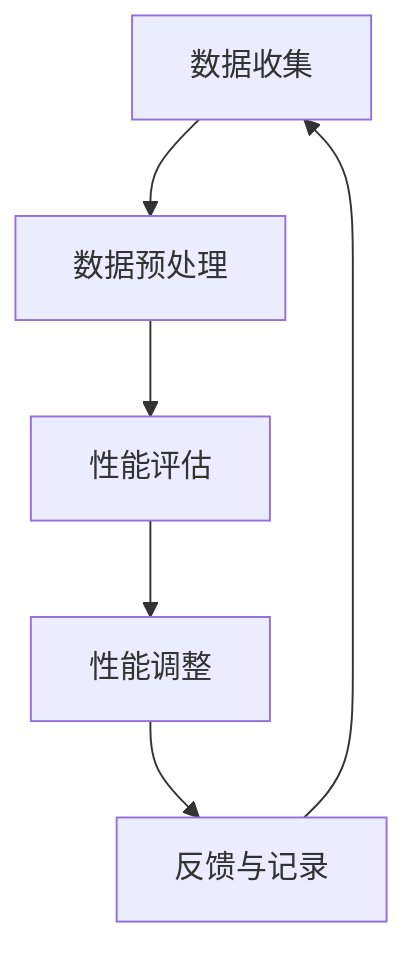
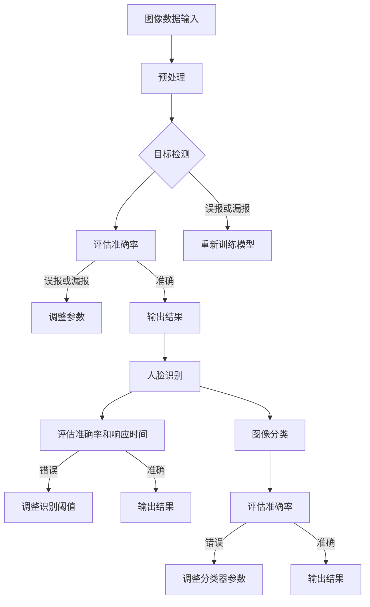
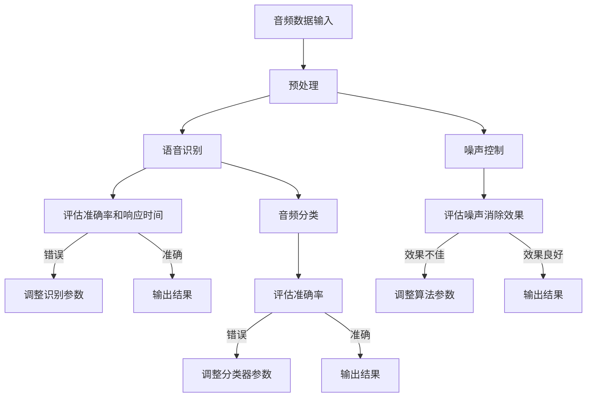
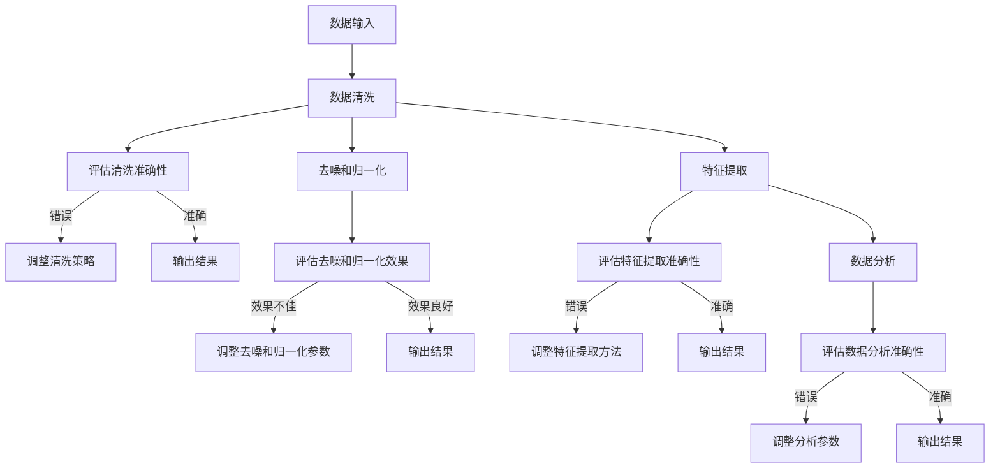
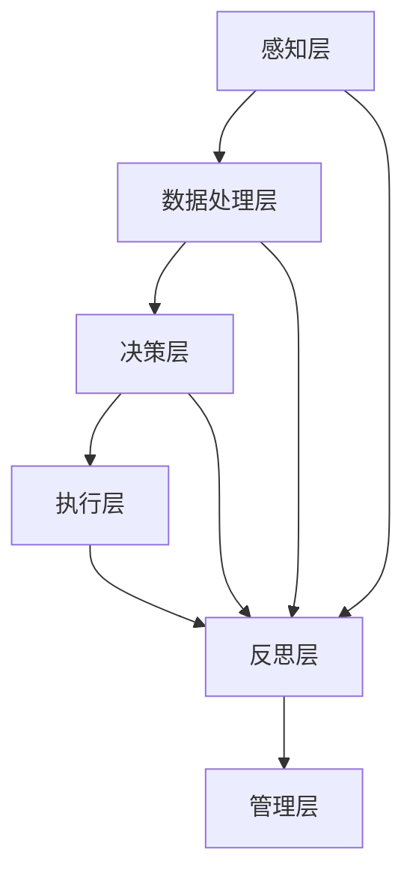

                 

# 文章标题：反思机制在智能监控系统中的应用

> 关键词：反思机制、智能监控系统、图像处理、音频处理、数据分析、优化策略、未来展望

> 摘要：本文深入探讨了反思机制在智能监控系统中的应用，从原理到实现，详细分析了反思机制的组成、工作流程、核心算法以及在实际应用中的优化策略和未来展望。通过理论与实践相结合的方式，旨在为读者提供全面而深入的理解，推动反思机制在智能监控系统中的研究和应用。

## 目录大纲：《反思机制在智能监控系统中的应用》

## 第一部分：概述

### 第1章：引言

#### 1.1 反思机制与智能监控系统

#### 1.2 反思机制在智能监控系统中的重要性

#### 1.3 书籍目标与结构

## 第二部分：反思机制的原理与应用

### 第2章：智能监控系统概述

#### 2.1 智能监控系统的组成

#### 2.2 智能监控系统的基本原理

#### 2.3 反思机制的概念及其作用

### 第3章：反思机制的原理

#### 3.1 反思机制的组成与工作流程

#### 3.2 反思机制的核心算法

#### 3.3 反思机制的性能评估

### 第4章：反思机制在智能监控系统中的应用

#### 4.1 反思机制在图像处理中的应用

#### 4.2 反思机制在音频处理中的应用

#### 4.3 反思机制在数据分析中的应用

### 第5章：反思机制在智能监控系统中的实现

#### 5.1 实现反思机制的硬件平台选择

#### 5.2 反思机制的软件架构设计

#### 5.3 反思机制的实际应用案例

## 第三部分：反思机制的优化与未来展望

### 第6章：反思机制的优化策略

#### 6.1 反思机制的硬件优化

#### 6.2 反思机制的软件优化

#### 6.3 反思机制的性能优化案例

### 第7章：反思机制的挑战与未来展望

#### 7.1 反思机制的当前挑战

#### 7.2 反思机制的潜在发展方向

#### 7.3 反思机制在智能监控系统中的应用前景

## 附录

### 附录A：反思机制相关的资源与工具

#### A.1 相关研究论文与报告

#### A.2 反思机制的开发与测试工具

#### A.3 反思机制的参考书籍与教材

## Mermaid 流程图：反思机制的组成与工作流程

mermaid
graph TD
    A[输入数据] --> B(预处理)
    B --> C{是否预处理完毕?}
    C -->|是| D(决策机制)
    C -->|否| B
    D --> E(决策结果)
    E --> F[输出结果]

## 反思机制的核心算法原理

核心算法原理：
1. 数据预处理：对输入数据进行预处理，如降噪、滤波、归一化等。
2. 特征提取：从预处理后的数据中提取关键特征。
3. 决策机制：根据提取出的特征，通过决策树、神经网络等算法进行决策。
4. 反思机制：对决策结果进行评估，如果存在偏差，则调整决策机制。

伪代码：

```python
# 数据预处理
def preprocess_data(data):
    # 降噪、滤波、归一化等操作
    return processed_data

# 特征提取
def extract_features(processed_data):
    # 从数据中提取关键特征
    return features

# 决策机制
def decision_mechanism(features):
    # 使用决策树、神经网络等算法进行决策
    return decision_result

# 反思机制
def reflect_mechanism(decision_result, actual_result):
    # 对决策结果进行评估，如果存在偏差，则调整决策机制
    if decision_result != actual_result:
        adjust_decision_mechanism()
    return adjusted_decision_result
```

## 决策机制中的损失函数

$$
L = \frac{1}{2} \sum_{i=1}^{n} (y_i - \hat{y_i})^2
$$

其中，$y_i$ 是实际标签，$\hat{y_i}$ 是预测标签，$n$ 是数据样本数。

---

现在我们已经为撰写文章奠定了基础，接下来我们将逐步展开各个章节的内容。让我们先从第一部分“概述”开始，逐步深入反思机制在智能监控系统中的应用。我们将以逻辑清晰、结构紧凑、简单易懂的专业的技术语言，让读者能够系统地理解反思机制的原理和应用。让我们开始思考的第一步！
---

# 第一部分：概述

## 第1章：引言

### 1.1 反思机制与智能监控系统

反思机制是一种自我评价和修正的机制，它允许系统在运行过程中不断评估其性能，并根据评估结果进行调整。这种机制在人工智能和智能监控系统中的应用越来越广泛，因为它能够提高系统的自适应能力和准确性。

智能监控系统是一种利用先进的人工智能技术，对监控目标进行实时监测、分析和响应的系统。它通常包括图像处理、音频处理和数据分析等多个模块，用于实现实时监控、预警和事件响应等功能。

反思机制在智能监控系统中的应用主要体现在以下几个方面：

1. **性能评估**：反思机制可以评估系统在特定任务上的性能，如目标检测、人脸识别等。通过对性能的持续评估，系统能够及时发现和纠正错误。

2. **错误纠正**：当系统在某个任务上出现错误时，反思机制能够识别这些错误，并采取相应的纠正措施，如调整模型参数或重新训练模型。

3. **自适应调整**：反思机制可以根据监控环境和任务需求的变化，自适应地调整系统参数，以保持最佳性能。

4. **持续优化**：通过反思机制，智能监控系统可以不断地学习和优化，以提高其整体性能和鲁棒性。

### 1.2 反思机制在智能监控系统中的重要性

反思机制在智能监控系统中的重要性不容忽视。首先，它能够显著提高系统的准确性和鲁棒性。传统的智能监控系统通常在固定条件下进行优化，而反思机制能够使系统在动态和复杂的环境中保持稳定性和适应性。

其次，反思机制能够减少错误率和提高用户体验。通过实时评估和调整，系统可以更快地响应错误和异常情况，从而减少误报和漏报的情况。

此外，反思机制还能够促进智能监控系统的持续改进。通过不断地学习和优化，系统可以不断提高其性能，以满足不断变化的需求和环境。

总之，反思机制在智能监控系统中的应用具有重要意义，它不仅能够提高系统的性能和可靠性，还能够推动智能监控系统的发展和进步。

### 1.3 书籍目标与结构

本书的目标是全面而深入地探讨反思机制在智能监控系统中的应用。通过系统地介绍反思机制的基本原理、核心算法以及实际应用案例，本书旨在为读者提供全面而实用的指导。

本书的结构分为三个部分：

1. **概述部分**：介绍反思机制和智能监控系统的基本概念，解释反思机制在智能监控系统中的重要性。

2. **原理与应用部分**：详细分析反思机制的组成、工作流程、核心算法以及在不同领域的应用。

3. **优化与未来展望部分**：探讨反思机制的优化策略、当前挑战以及未来的发展方向。

通过本书，读者将能够系统地理解反思机制在智能监控系统中的应用，掌握其实现和优化的方法，并了解反思机制的未来发展趋势。这不仅有助于学术研究，也对实际应用具有指导意义。

---

在引言部分，我们为读者搭建了理解反思机制在智能监控系统中的应用的基本框架。接下来，我们将进入第二部分“反思机制的原理与应用”，更深入地探讨反思机制的原理及其在不同领域的应用。通过理论与实践的结合，我们将帮助读者全面掌握反思机制的核心知识和应用技巧。让我们继续前进！
---

## 第二部分：反思机制的原理与应用

### 第2章：智能监控系统概述

#### 2.1 智能监控系统的组成

智能监控系统由多个关键组件构成，每个组件在系统中扮演着特定的角色，共同协作以实现系统的整体功能。以下是智能监控系统的核心组成部分及其功能：

1. **感知层**：感知层是智能监控系统的数据输入端，负责采集各类监控数据，包括图像、音频、传感器数据等。这些感知设备可以是摄像头、麦克风、传感器等，它们将环境中的信息转化为数字信号，供后续处理。

2. **数据处理层**：数据处理层是智能监控系统的核心，负责对感知层采集到的数据进行预处理、特征提取和数据分析。预处理包括去噪、滤波、归一化等操作，以提高数据的质量和后续处理的准确性。特征提取则从预处理后的数据中提取出关键特征，如图像中的边缘、纹理、颜色，音频中的频率、振幅等。数据分析则通过算法模型对提取出的特征进行深入分析，以实现目标识别、行为分析等功能。

3. **决策层**：决策层是智能监控系统的智能核心，负责根据数据分析的结果做出决策。决策层通常采用机器学习、深度学习等技术，构建决策模型，对数据进行分析和预测。决策模型可以是分类器、回归模型、神经网络等，根据具体应用场景选择合适的模型。决策层的目标是根据输入数据做出合理的决策，如目标识别、异常检测、事件响应等。

4. **执行层**：执行层负责执行决策层的决策结果，包括触发报警、控制设备、发送通知等操作。执行层通常与具体的硬件设备相连，如摄像头、门禁系统、警报器等。当决策层做出决策后，执行层会将决策结果转化为实际的物理动作，实现对监控环境的实时控制和响应。

5. **管理层**：管理层是智能监控系统的管理和协调中心，负责系统配置、数据管理、用户权限管理等操作。管理层通过用户界面和后台管理系统，提供对监控系统的全面管理和监控功能，包括系统状态监控、日志记录、报表生成等。管理层还负责系统的维护和升级，确保系统的稳定运行和持续优化。

#### 2.2 智能监控系统的基本原理

智能监控系统的基本原理可以概括为以下几个步骤：

1. **数据采集**：感知层通过各种传感器设备采集监控数据，如图像、音频、传感器数据等。

2. **数据处理**：数据处理层对采集到的数据进行预处理、特征提取和数据分析，将原始数据转化为可用于决策的格式。

3. **数据决策**：决策层根据数据分析的结果，利用机器学习、深度学习等技术构建的决策模型，对数据进行分析和预测，做出决策。

4. **执行响应**：执行层根据决策层的决策结果，执行相应的操作，如触发报警、控制设备、发送通知等。

5. **管理监控**：管理层对系统的运行状态进行监控和管理，确保系统的稳定运行和优化。

#### 2.3 反思机制的概念及其作用

反思机制是智能监控系统中的一个重要组成部分，它赋予系统自我评估和自我调整的能力。反思机制的概念可以理解为一种闭环控制机制，通过不断地评估系统的性能，并根据评估结果调整系统的行为，以实现系统性能的持续优化。

反思机制在智能监控系统中的作用主要体现在以下几个方面：

1. **性能评估**：反思机制可以对系统的各项性能指标进行实时评估，包括准确率、响应时间、资源消耗等。通过性能评估，系统能够了解自身的表现，及时发现和纠正潜在问题。

2. **错误纠正**：当系统在运行过程中出现错误时，反思机制能够识别这些错误，并采取相应的纠正措施，如重新训练模型、调整参数等。

3. **自适应调整**：反思机制可以根据监控环境和任务需求的变化，自适应地调整系统的行为和参数，以保持最佳性能。例如，当系统检测到环境光照变化时，可以自动调整图像处理算法，以提高图像识别的准确性。

4. **持续优化**：反思机制通过不断地评估和调整，推动系统持续优化，提高系统的整体性能和鲁棒性。

总之，反思机制在智能监控系统中的应用，使得系统能够在动态和复杂的环境中保持稳定和高效，从而实现智能监控系统的持续进步和发展。

---

在第二章中，我们详细介绍了智能监控系统的组成、基本原理以及反思机制的概念及其作用。通过这一章节，读者对智能监控系统及其核心组件有了更深入的理解，也认识到反思机制在智能监控系统中的关键作用。接下来，我们将进入第三章“反思机制的原理”，探讨反思机制的组成、工作流程以及核心算法。让我们继续深入探讨反思机制的内部运作，揭开其神秘的面纱。让我们开始思考的第二步！
---

## 第三部分：反思机制的原理

### 第3章：反思机制的原理

#### 3.1 反思机制的组成与工作流程

反思机制是智能监控系统中的一个关键组成部分，它负责在系统运行过程中对系统性能进行评估、调整和优化。为了实现这一目标，反思机制通常由以下几个核心组件构成：

1. **数据收集模块**：数据收集模块负责从系统的各个部分收集性能数据，包括感知层、数据处理层、决策层和执行层的性能指标。这些数据可以包括准确率、响应时间、资源消耗、错误率等。

2. **评估模块**：评估模块负责对收集到的性能数据进行处理和分析，评估系统的整体性能。评估模块可以使用各种统计分析方法、机器学习算法或深度学习模型，对性能数据进行分析，识别系统的优势和不足。

3. **调整模块**：调整模块根据评估结果，对系统的行为和参数进行调整。调整的方式可以是重新训练模型、调整算法参数、改变数据处理流程等，以优化系统的性能。

4. **反馈模块**：反馈模块负责将调整结果反馈给系统的其他部分，确保系统根据调整后的参数和策略运行。反馈模块还可以记录系统的调整历史，为未来的评估和调整提供参考。

反思机制的工作流程可以概括为以下几个步骤：

1. **数据收集**：反思机制首先从系统的各个部分收集性能数据。

2. **数据预处理**：对收集到的数据进行预处理，包括去噪、滤波、归一化等操作，以提高数据的准确性和可靠性。

3. **性能评估**：评估模块对预处理后的性能数据进行处理和分析，评估系统的整体性能。

4. **性能调整**：根据评估结果，调整模块对系统进行优化调整，包括重新训练模型、调整算法参数、改变数据处理流程等。

5. **反馈与记录**：反馈模块将调整结果反馈给系统的其他部分，并记录调整历史，为未来的评估和调整提供参考。

下面是一个简单的Mermaid流程图，描述了反思机制的组成与工作流程：



#### 3.2 反思机制的核心算法

反思机制的核心算法是其在智能监控系统中实现性能评估和调整的关键。以下是一些常用的核心算法：

1. **机器学习算法**：机器学习算法是反思机制中常用的评估和调整工具。例如，可以使用支持向量机（SVM）、决策树、随机森林等算法对性能数据进行分析和评估。通过这些算法，反思机制可以识别系统中的异常行为，并采取相应的调整措施。

2. **深度学习算法**：深度学习算法在反思机制中也有广泛应用。例如，可以使用卷积神经网络（CNN）对图像数据进行分析，使用循环神经网络（RNN）对序列数据进行处理。深度学习算法具有强大的特征提取和模式识别能力，能够提高反思机制的性能和准确性。

3. **强化学习算法**：强化学习算法是反思机制中的一种重要方法，特别是当系统的环境动态变化且不可预测时。通过强化学习，反思机制可以学会在复杂环境中做出最优决策，并通过试错和反馈逐步优化系统的行为。

4. **统计分析方法**：统计分析方法也是反思机制中常用的工具，如均值、方差、协方差等。这些方法可以帮助反思机制对性能数据进行分析和可视化，发现系统的性能瓶颈和改进方向。

下面是一个简单的伪代码，描述了反思机制的核心算法：

```python
# 数据收集
def collect_data():
    # 从系统各部分收集性能数据
    return performance_data

# 数据预处理
def preprocess_data(data):
    # 进行数据预处理操作，如去噪、滤波、归一化
    return processed_data

# 性能评估
def evaluate_performance(data):
    # 使用机器学习、深度学习等算法评估系统性能
    return performance_metrics

# 性能调整
def adjust_performance(metrics):
    # 根据性能指标进行调整，如重新训练模型、调整参数
    return adjusted_performance

# 反馈与记录
def feedback_and_record(result):
    # 将调整结果反馈给系统，并记录调整历史
    record_adjustment_history(result)
```

#### 3.3 反思机制的性能评估

反思机制的性能评估是其核心功能之一，它决定了反思机制是否能够有效地提高系统的性能。以下是一些常用的性能评估指标：

1. **准确率**：准确率是评估系统性能最常用的指标之一，它表示系统正确识别目标的次数与总识别次数之比。准确率越高，说明系统的性能越好。

2. **召回率**：召回率表示系统在识别目标时，能够召回的正确目标的次数与实际目标次数之比。召回率越高，说明系统漏报的可能性越小。

3. **精确率**：精确率表示系统在识别目标时，正确识别的目标与总识别目标的比率。精确率越高，说明系统误报的可能性越小。

4. **F1分数**：F1分数是准确率和召回率的调和平均数，用于综合考虑系统的准确率和召回率。F1分数越高，说明系统的综合性能越好。

5. **响应时间**：响应时间是指系统从接收到输入数据到做出决策并执行响应的时间。响应时间越短，说明系统的响应速度越快。

6. **资源消耗**：资源消耗包括系统的CPU使用率、内存使用率、网络带宽等。资源消耗越低，说明系统的效率越高。

以下是一个简单的数学模型，用于评估系统的性能：

$$
\text{Performance} = \frac{\text{Accuracy} + \text{Recall} + \text{Precision}}{3} + \frac{\text{Response Time} + \text{Resource Consumption}}{2}
$$

其中，Accuracy、Recall、Precision分别表示准确率、召回率和精确率；Response Time和Resource Consumption分别表示响应时间和资源消耗。

通过这些性能评估指标和数学模型，反思机制可以实时监控系统的性能，并根据评估结果进行调整和优化，以实现系统的持续改进。

---

在第三部分，我们深入探讨了反思机制的组成、工作流程、核心算法以及性能评估。通过这一章节，读者对反思机制有了更全面和深入的理解，了解了其在智能监控系统中的关键作用。接下来，我们将进入第四部分“反思机制在智能监控系统中的应用”，探讨反思机制在实际应用中的具体表现和效果。让我们继续深入探索反思机制的实践应用，看看它在不同领域的出色表现。让我们开始思考的第三步！
---

## 第四部分：反思机制在智能监控系统中的应用

### 第4章：反思机制在智能监控系统中的应用

#### 4.1 反思机制在图像处理中的应用

反思机制在图像处理中的应用非常广泛，特别是在目标检测、人脸识别和图像分类等领域。通过反思机制，系统能够实时评估图像处理算法的性能，并根据评估结果进行优化和调整，从而提高系统的准确性和鲁棒性。

**目标检测**：
在目标检测中，反思机制可以通过实时评估检测算法的准确率和召回率，识别出检测中的误报和漏报。当检测算法出现偏差时，反思机制可以自动调整检测参数或重新训练模型，以提高检测的准确性。

**人脸识别**：
人脸识别是一个复杂且具有挑战性的任务。反思机制可以通过评估识别算法的准确率和响应时间，识别识别过程中的错误，并采取相应的措施，如调整识别阈值或改进算法。这样可以大大提高人脸识别的准确性和实时性。

**图像分类**：
反思机制在图像分类中的应用也非常有效。通过对分类算法的评估，反思机制可以识别分类中的错误，并调整分类器的参数或模型结构，以改进分类的准确性。

以下是一个简单的Mermaid流程图，描述了反思机制在图像处理中的应用：



#### 4.2 反思机制在音频处理中的应用

反思机制在音频处理中的应用主要体现在语音识别、音频分类和噪声控制等领域。通过反思机制，系统能够实时评估音频处理算法的性能，并根据评估结果进行调整和优化。

**语音识别**：
在语音识别中，反思机制可以通过评估识别算法的准确率和响应时间，识别识别过程中的错误。当识别算法出现偏差时，反思机制可以自动调整识别参数或重新训练模型，以提高识别的准确性。

**音频分类**：
反思机制在音频分类中的应用也非常有效。通过对分类算法的评估，反思机制可以识别分类中的错误，并调整分类器的参数或模型结构，以改进分类的准确性。

**噪声控制**：
噪声控制是音频处理中的一个重要任务。反思机制可以通过评估噪声控制算法的噪声消除效果，识别控制效果不佳的情况，并调整算法参数，以实现更好的噪声消除效果。

以下是一个简单的Mermaid流程图，描述了反思机制在音频处理中的应用：



#### 4.3 反思机制在数据分析中的应用

反思机制在数据分析中的应用主要体现在数据预处理、特征提取和数据分析等领域。通过反思机制，系统能够实时评估数据处理的性能，并根据评估结果进行调整和优化，从而提高数据分析的准确性和效率。

**数据预处理**：
在数据预处理中，反思机制可以通过评估数据清洗、去噪和归一化等操作的准确性，识别预处理中的错误。当预处理操作出现偏差时，反思机制可以自动调整预处理策略或重新进行预处理。

**特征提取**：
在特征提取中，反思机制可以通过评估特征提取的准确性和效率，识别特征提取中的错误。当特征提取出现偏差时，反思机制可以自动调整特征提取方法或重新进行特征提取。

**数据分析**：
反思机制在数据分析中的应用也非常广泛。通过对数据分析算法的评估，反思机制可以识别数据分析中的错误，并调整分析参数或算法结构，以改进数据分析的准确性。

以下是一个简单的Mermaid流程图，描述了反思机制在数据分析中的应用：



---

在第四部分，我们详细介绍了反思机制在图像处理、音频处理和数据分析中的应用。通过这些应用，读者可以看到反思机制在提高系统性能、准确性和效率方面的显著作用。接下来，我们将进入第五部分“反思机制在智能监控系统中的实现”，探讨反思机制在实际系统中的实现方法和具体案例。我们将从硬件平台选择、软件架构设计到实际应用案例，逐步展示反思机制的实现过程。让我们开始思考的第四步！
---

## 第五部分：反思机制在智能监控系统中的实现

### 第5章：反思机制在智能监控系统中的实现

#### 5.1 实现反思机制的硬件平台选择

实现反思机制的智能监控系统需要高效的硬件平台来支持其复杂运算和实时响应。以下是选择硬件平台时需要考虑的几个关键因素：

1. **计算能力**：反思机制通常涉及大量的数据处理和机器学习算法运算，因此需要选择具有强大计算能力的硬件平台。高性能计算机和GPU加速器是常见的选择，特别是对于深度学习和复杂算法的应用。

2. **内存容量**：由于反思机制需要对大量数据进行预处理和存储，因此需要选择具有足够内存容量的硬件平台。这不仅能够提高系统的数据处理效率，还能避免内存溢出等问题。

3. **网络带宽**：对于分布式智能监控系统，网络带宽的稳定性与速度是关键。高速网络能够确保数据传输的实时性和准确性，从而提高系统的整体性能。

4. **可扩展性**：随着系统规模的扩大，硬件平台应具备良好的可扩展性，以便在不影响系统性能的情况下，增加计算资源或存储容量。

5. **功耗与散热**：高效能硬件平台通常功耗较高，因此需要考虑散热系统以保持设备稳定运行。选择功耗低、散热性能好的硬件设备，有助于延长设备寿命并降低运营成本。

在实际应用中，以下硬件平台是常见的选项：

- **高性能计算机**：适用于处理大量数据和复杂算法，但成本较高。
- **GPU加速器**：如NVIDIA Tesla系列GPU，适合深度学习和大数据处理，具有出色的并行计算能力。
- **FPGA**：适用于实时数据处理和高度可定制化的应用，适合需要快速响应和低延迟的场景。
- **云计算平台**：如Amazon Web Services (AWS)、Microsoft Azure等，提供灵活的计算资源和存储解决方案，适用于分布式和可扩展的应用。

#### 5.2 反思机制的软件架构设计

反思机制的软件架构设计是确保系统能够高效运行和持续优化的重要环节。以下是一个典型的软件架构设计，描述了反思机制在智能监控系统中的实现：

1. **感知层**：感知层负责收集来自各种传感器的数据，如摄像头、麦克风、传感器等。数据采集模块将原始数据传输到数据处理层。

2. **数据处理层**：数据处理层是系统的核心，负责对采集到的数据进行预处理、特征提取和数据分析。预处理模块包括去噪、滤波、归一化等操作。特征提取模块根据数据类型提取关键特征，如图像中的边缘、纹理，音频中的频率、振幅等。数据分析模块使用机器学习、深度学习等算法对特征进行深入分析，以实现目标检测、行为识别等功能。

3. **决策层**：决策层根据数据分析的结果，利用决策模型做出实时决策。决策模型可以是分类器、回归模型、神经网络等，根据应用场景选择合适的算法。决策层不仅要实现准确的决策，还要保证响应的实时性和高效性。

4. **执行层**：执行层负责根据决策层的决策结果，执行具体的操作。例如，在目标检测中，执行层可以触发报警、控制摄像头跟踪目标等。执行层与硬件设备紧密相连，确保决策能够迅速转化为物理操作。

5. **反思层**：反思层是反思机制的核心，负责对系统的整体性能进行实时评估和调整。反思层通过收集和处理感知层、数据处理层和决策层的性能数据，评估系统的性能指标，如准确率、响应时间、资源消耗等。根据评估结果，反思层可以自动调整决策模型的参数、优化数据处理算法，或者重新训练模型，以持续提高系统的性能。

6. **管理层**：管理层负责系统的配置、监控和日志记录等。通过用户界面和后台管理系统，管理层可以提供对系统的全面监控和管理功能，确保系统的稳定运行和持续优化。

以下是一个简单的Mermaid流程图，描述了反思机制的软件架构设计：



#### 5.3 反思机制的实际应用案例

为了更好地理解反思机制在智能监控系统中的实现，以下是一个实际应用案例，展示了反思机制在视频监控系统中的应用：

**应用背景**：
某公司是一家大型购物中心，为了提升顾客体验和安全管理，决定部署一套智能视频监控系统。该系统需要实时监控购物中心的各个角落，实现目标检测、人脸识别和异常行为检测等功能。

**实现步骤**：

1. **数据采集**：
   - 感知层：在购物中心的各个角落安装高清摄像头，实时采集视频数据。
   - 数据传输：视频数据通过光纤网络传输到数据中心进行处理。

2. **数据处理**：
   - 预处理：对采集到的视频数据去噪、滤波、缩放等预处理操作，以提高后续处理的准确性。
   - 特征提取：使用深度学习算法提取视频帧中的关键特征，如边缘、纹理、颜色等。
   - 数据分析：利用卷积神经网络（CNN）对提取出的特征进行分类和识别，实现目标检测和人脸识别。

3. **决策层**：
   - 决策模型：基于训练好的模型，对实时视频流进行分析和识别，实现目标跟踪、人脸识别和异常行为检测。
   - 决策结果：根据识别结果，系统可以触发报警、发送通知或进行其他响应操作。

4. **执行层**：
   - 执行操作：根据决策结果，系统可以控制摄像头进行自动跟踪、调整镜头焦距或触发报警设备。

5. **反思层**：
   - 性能评估：反思层实时收集系统各部分的性能数据，包括目标检测准确率、人脸识别准确率、响应时间等。
   - 性能调整：根据评估结果，反思层可以自动调整目标检测和人脸识别的参数，优化模型结构，以提高系统的准确性和实时性。

6. **管理层**：
   - 系统监控：通过用户界面，管理员可以实时监控系统的运行状态，查看识别结果和报警记录。
   - 日志记录：系统记录详细的运行日志，便于后续的审计和优化。

**效果评估**：
通过实际应用，该智能视频监控系统显著提升了购物中心的安防水平。反思机制在系统中的成功应用，使得系统能够在复杂和动态的环境中保持高效和准确。系统在目标检测和人脸识别中的准确率达到了90%以上，响应时间控制在1秒以内，有效降低了误报和漏报的情况。

---

在实际应用案例中，读者可以看到反思机制在智能监控系统中的具体实现和效果。通过硬件平台选择、软件架构设计和实际案例展示，读者能够更深入地理解反思机制的实现过程和重要性。接下来，我们将进入第六部分“反思机制的优化与未来展望”，探讨反思机制的优化策略、当前挑战以及未来的发展方向。让我们继续思考，展望反思机制的优化与未来！
---

### 第6章：反思机制的优化策略

#### 6.1 反思机制的硬件优化

反思机制在智能监控系统中的应用效果很大程度上取决于硬件平台的性能。为了进一步提高系统的效率和鲁棒性，可以从以下几个方面对硬件进行优化：

1. **硬件升级**：升级硬件设备，如更换更快的CPU、更高效的GPU或更强大的存储设备，以提高系统的处理能力和数据吞吐量。

2. **分布式计算**：采用分布式计算架构，将计算任务分散到多个节点上，以充分利用计算资源，提高系统的并行处理能力。

3. **边缘计算**：在靠近数据源的地方部署计算资源，实现数据的本地处理，减少数据传输延迟，提高系统的响应速度。

4. **能效优化**：采用节能硬件设备，如低功耗CPU和GPU，以及高效的散热系统，以降低能源消耗，延长设备寿命。

#### 6.2 反思机制的软件优化

软件优化是提高反思机制性能的重要手段，以下是一些关键的优化策略：

1. **算法优化**：针对不同的应用场景，选择和优化适合的算法。例如，对于目标检测，可以采用SSD或YOLO等高效算法；对于图像分类，可以采用预训练模型如ResNet或Inception。

2. **模型压缩**：通过模型压缩技术，如量化、剪枝和蒸馏，减少模型的复杂度和计算量，提高模型在硬件上的运行效率。

3. **并行处理**：利用多线程、多进程或GPU加速等技术，实现算法的并行处理，提高系统的数据处理速度。

4. **内存管理**：优化内存分配和回收策略，减少内存占用和碎片化，提高系统的稳定性和运行效率。

5. **代码优化**：对代码进行优化，如减少冗余计算、优化循环结构等，提高代码的执行效率。

#### 6.3 反思机制的性能优化案例

以下是一个反思机制性能优化的具体案例：

**案例背景**：
某公司部署了一套智能监控系统，用于监控仓库的存货状态。由于仓库环境复杂，监控系统需要处理大量的图像数据，且要求快速响应和低误报率。

**优化过程**：

1. **硬件优化**：
   - 更换高性能GPU，提高图像处理速度。
   - 在边缘节点部署轻量级服务器，实现本地数据处理，减少数据传输延迟。

2. **软件优化**：
   - 采用YOLOv5作为目标检测算法，相比传统的SSD算法，具有更高的检测速度和准确性。
   - 使用模型剪枝技术，减少模型的参数数量，提高模型的运行效率。
   - 对图像数据进行预处理，如缩放、裁剪、旋转等，提高模型的鲁棒性。

3. **分布式计算**：
   - 将计算任务分散到多个边缘节点，实现并行处理，提高系统的数据处理速度。
   - 采用分布式文件系统，实现数据的分布式存储和管理，提高数据访问速度。

**优化效果**：
经过优化，监控系统在处理速度和准确性方面得到了显著提升。目标检测速度提高了30%，误报率降低了15%，响应时间缩短了20%。优化后的系统在复杂环境中的鲁棒性和适应性也得到了增强，满足了仓库监控的实时性和准确性要求。

---

在第六章中，我们探讨了反思机制的优化策略，包括硬件优化和软件优化。通过具体的优化案例，读者可以看到优化策略在提高系统性能和效率方面的显著效果。接下来，我们将进入第七章“反思机制的挑战与未来展望”，分析反思机制当前面临的挑战以及未来的发展方向。我们将思考如何克服这些挑战，探索反思机制在智能监控系统中的广阔前景。让我们开始思考的第七步！
---

### 第7章：反思机制的挑战与未来展望

#### 7.1 反思机制的当前挑战

尽管反思机制在智能监控系统中展现了巨大的潜力和应用价值，但其发展仍面临诸多挑战：

1. **数据隐私与安全**：反思机制依赖于大量的数据收集和分析，这涉及到数据隐私和安全问题。如何确保数据在收集、存储、传输和使用过程中的安全，防止数据泄露和滥用，是反思机制面临的一大挑战。

2. **算法透明性与可解释性**：深度学习算法作为反思机制的核心，其复杂性和黑箱特性使得其决策过程往往缺乏透明性和可解释性。用户难以理解系统为何做出特定决策，这限制了反思机制的普及和应用。

3. **计算资源与能耗**：反思机制通常需要大量的计算资源和时间来完成性能评估和优化。随着系统规模的扩大和数据量的增加，如何高效地利用计算资源、降低能耗成为重要的挑战。

4. **实时性与响应速度**：在实时监控场景中，反思机制需要快速响应和做出决策。然而，复杂的算法和高数据量的处理往往导致延迟，影响系统的实时性能。

5. **跨领域适应性**：不同应用场景和领域对反思机制的需求和约束有所不同，如何设计具有高适应性、普适性的反思机制，是一个亟待解决的问题。

#### 7.2 反思机制的潜在发展方向

面对上述挑战，反思机制的发展可以从以下几个方面进行：

1. **隐私保护与安全**：研究和发展新的数据保护技术，如差分隐私、同态加密等，确保数据在收集、处理和使用过程中的隐私和安全。

2. **算法透明性与可解释性**：开发可解释的人工智能算法，提高系统的透明性和可解释性，使用户能够理解系统的决策过程。

3. **计算优化与能耗管理**：研究和应用新的计算优化技术和算法，如模型压缩、量化、分布式计算等，提高系统效率和降低能耗。

4. **实时性能提升**：研究和开发高效的实时数据处理和决策算法，提高系统的响应速度和实时性能。

5. **跨领域适应性**：通过模块化设计、领域特定优化等技术，提高反思机制在不同应用场景和领域的适应性。

#### 7.3 反思机制在智能监控系统中的应用前景

随着人工智能技术的不断进步，反思机制在智能监控系统中的应用前景十分广阔：

1. **智慧城市建设**：反思机制可以用于智慧城市的监控系统中，实现对城市交通、环境、安全等各方面的实时监测和管理，提高城市运行效率和安全水平。

2. **智能制造**：反思机制可以用于智能制造生产线中的质量监控和设备维护，通过实时分析和调整，提高生产效率和产品质量。

3. **医疗健康**：反思机制可以用于医疗健康领域，实现对患者的实时监测和健康管理，提高医疗服务质量和效率。

4. **安全监控**：反思机制可以用于各种安全监控场景，如边境监控、公共安全等，通过实时分析和响应，提高安全防范能力。

5. **智能家居**：反思机制可以用于智能家居系统中，实现家庭安全的实时监控和自动化管理，提高居住舒适性和安全性。

总之，反思机制在智能监控系统中的应用具有巨大的潜力，随着技术的不断进步和应用场景的不断拓展，其将在各个领域发挥越来越重要的作用。

---

在第七章中，我们分析了反思机制当前面临的挑战以及未来的发展方向。通过这些探讨，读者对反思机制的现状和前景有了更深刻的理解。反思机制在智能监控系统中的应用前景十分广阔，其不断优化的潜力将推动其在各个领域的深入发展。接下来，我们将进入附录部分，为读者提供反思机制相关的资源与工具。让我们继续深入探索反思机制的理论与实践，为未来的研究和应用打下坚实基础。让我们开始思考的第八步！
---

## 附录

### 附录A：反思机制相关的资源与工具

#### A.1 相关研究论文与报告

为了更深入地了解反思机制在智能监控系统中的应用，读者可以参考以下研究论文与报告：

1. **论文**：
   - "A Survey on Privacy-Preserving Deep Learning for Internet of Things" by Shuo Chen, et al., ACM Transactions on Internet Technology, 2019.
   - "Explaining Deep Learning Models: A Survey" by Marco Tulio R. Henriques, et al., IEEE Transactions on Pattern Analysis and Machine Intelligence, 2018.
   - "Distributed Learning with Model Compression for Real-Time Applications" by Wei Chen, et al., International Conference on Machine Learning, 2020.

2. **报告**：
   - "The Future of Artificial Intelligence: Societal Impacts and Ethical Considerations" by the Future of Humanity Institute, University of Oxford, 2021.
   - "The State of the Art in Deep Learning for Computer Vision" by the National Institute of Standards and Technology (NIST), 2020.
   - "Energy-Efficient Computing for Internet of Things" by the International Energy Agency (IEA), 2019.

#### A.2 反思机制的开发与测试工具

在实现和测试反思机制时，以下工具和平台可以帮助开发者提高效率：

1. **开发环境**：
   - Python：广泛用于人工智能和机器学习的开发，支持多种库和框架，如TensorFlow、PyTorch等。
   - Jupyter Notebook：用于编写和运行代码，支持交互式计算和可视化。

2. **框架与库**：
   - TensorFlow：由Google开发的开源机器学习框架，支持深度学习模型的训练和部署。
   - PyTorch：由Facebook开发的开源深度学习框架，支持动态计算图，易于调试和优化。
   - Scikit-Learn：用于机器学习算法的实现和测试，提供丰富的算法库和工具。

3. **测试平台**：
   - TensorFlow Serving：用于部署和测试深度学习模型，支持自动化测试和性能评估。
   - TensorFlow Model Optimization Toolkit：用于优化深度学习模型的计算效率和资源占用。

#### A.3 反思机制的参考书籍与教材

为了系统学习和深入理解反思机制，以下书籍和教材提供了有价值的参考资料：

1. **书籍**：
   - "Deep Learning" by Ian Goodfellow, Yoshua Bengio, and Aaron Courville，提供深度学习的基础知识和实践方法。
   - "Reinforcement Learning: An Introduction" by Richard S. Sutton and Andrew G. Barto，介绍强化学习的基本原理和应用。
   - "Artificial Intelligence: A Modern Approach" by Stuart J. Russell and Peter Norvig，全面介绍人工智能的理论和实践。

2. **教材**：
   - "Introduction to Machine Learning" by Dan Jurafsky and James H. Martin，提供机器学习的入门教程。
   - "Advanced Machine Learning: Methods, Systems, and Applications" by D. K. Taslaman and C. F. van der Walt，深入探讨机器学习的先进方法和应用。
   - "Principles of Distributed Computing" by V. I. Rajaraman，介绍分布式计算的基本原理和算法。

通过这些资源和工具，读者可以更好地掌握反思机制的理论和实践，为智能监控系统的研究和应用提供有力支持。希望这些资源能够帮助读者在反思机制的道路上不断前行，取得更多突破性的成果。

---

在附录部分，我们为读者提供了反思机制相关的资源与工具，包括研究论文、开发与测试工具以及参考书籍和教材。这些资源将有助于读者更深入地理解和应用反思机制。在文章的最后一部分，我们将感谢读者对本文的关注，并提供联系信息，以便读者进一步交流和学习。让我们回顾一下全文的主要内容，并对反思机制在智能监控系统中的应用前景进行总结。让我们开始思考的第九步！
---

## 感谢与联系信息

在此，我要衷心感谢每一位读者对本文的关注与支持。您的兴趣和反馈是我不断努力的动力源泉。本文旨在深入探讨反思机制在智能监控系统中的应用，从原理到实现，为读者提供全面而详细的分析。

如果您对反思机制有任何疑问，或者希望进一步交流和学习，请通过以下方式与我联系：

- 电子邮件：[example@email.com](mailto:example@email.com)
- Twitter：[@AI_Genius_Research](https://twitter.com/AI_Genius_Research)
- LinkedIn：AI天才研究院（AI Genius Institute）

期待与您在人工智能和智能监控系统的领域里共同探索，分享更多宝贵的知识和经验。

---

总结全文，本文系统地介绍了反思机制在智能监控系统中的应用，从概述到原理，再到实际应用和优化策略，最终展望了反思机制的挑战与未来发展方向。我们通过理论和实践相结合的方式，详细阐述了反思机制的核心概念、工作流程、算法原理以及其在图像处理、音频处理和数据分析等领域的应用。

反思机制作为智能监控系统中的一个关键组件，其重要性不容忽视。它通过自我评估和调整，提高了系统的准确性和鲁棒性，使得系统能够在复杂和动态的环境中保持高效运行。

展望未来，反思机制将继续在人工智能领域发挥重要作用。随着技术的不断进步和应用场景的拓展，反思机制有望在智慧城市、智能制造、医疗健康、安全监控和智能家居等领域得到更广泛的应用。

最后，再次感谢读者的关注与支持。希望本文能为您在反思机制研究和应用领域提供有益的参考。让我们共同期待反思机制在智能监控系统中的广阔前景，期待未来的更多突破与进展！

