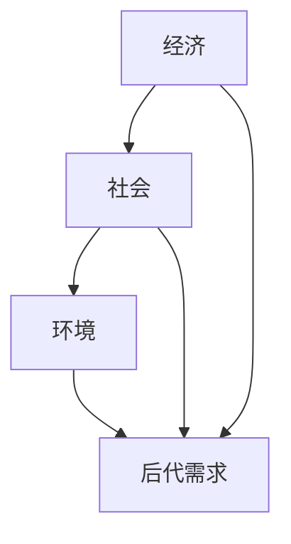

                 

## 文章标题：可持续发展

> 关键词：可持续发展、绿色发展、能源转型、环境保护、国际合作

> 摘要：本文从可持续发展的基本概念出发，探讨了其起源与发展历程、关键要素与评估指标、绿色发展政策与机制、能源转型与节能技术、环境保护政策与法规、国际可持续发展合作与治理、教育与未来展望等方面，旨在为读者提供一个全面、系统的可持续发展知识框架，以应对当今社会面临的环境、经济和社会挑战。

---

### 《可持续发展》

**一、可持续发展的基本概念与理论基础**

**二、可持续发展的实践与案例分析**

**三、可持续发展的教育与未来**

**四、附录：可持续发展相关的工具与资源**

---

**一、可持续发展的基本概念与理论基础**

#### 1.1 可持续发展的概念

可持续发展是一个涉及经济、社会和环境三个方面的综合性概念，其核心在于满足当前需求，同时不损害后代满足其需求的能力。这一概念最早在1987年联合国环境与发展大会上提出的《我们共同的未来》报告中得到广泛认可。

- **定义：** 可持续发展是指满足当前需求而不损害后代满足其需求的能力的发展。其内涵包括经济、社会和环境三方面的平衡发展。

- **关系图：**


#### 1.2 可持续发展的基本原则

可持续发展的基本原则包括公平性原则、持续性原则、共同性原则、协调性原则和阶段性原则。

- **公平性原则：** 代内公平（代际公平）和代际公平（代内公平）。
- **持续性原则：** 人类的经济和社会发展不能超越资源与环境的承载能力。
- **共同性原则：** 可持续发展是全人类共同的目标，需要各国共同努力。
- **协调性原则：** 经济发展、社会发展和环境保护三者之间需要相互协调。
- **阶段性原则：** 可持续发展是一个动态过程，需要根据不同国家和地区的实际情况制定相应的发展策略。

- **伪代码：**
```python
def sustainable_development_principles():
    print("公平性原则：代内公平和代际公平")
    print("持续性原则：人类发展不能超越资源与环境的承载能力")
    print("共同性原则：全人类共同目标")
    print("协调性原则：经济发展、社会发展、环境保护协调")
    print("阶段性原则：动态发展过程")
```

#### 1.3 全球可持续发展的重要文件与议程

- **1972年，联合国人类环境会议（斯德哥尔摩会议）：** 提出环境保护的重要性。
- **1987年，联合国环境与发展大会（里约地球峰会），《我们共同的未来》报告：** 明确可持续发展概念。
- **2002年，可持续发展世界首脑会议（约翰内斯堡峰会），《可持续发展承诺》：** 推动可持续发展行动。
- **2015年，联合国可持续发展目标（SDGs）：** 包括17个目标和169个具体目标，涵盖经济、社会、环境各方面。

- **重要文件与议程：**
  $$
  1972年，联合国人类环境会议（斯德哥尔摩会议） \\
  1987年，联合国环境与发展大会（里约地球峰会），《我们共同的未来》报告 \\
  2002年，可持续发展世界首脑会议（约翰内斯堡峰会），《可持续发展承诺》 \\
  2015年，联合国可持续发展目标（SDGs）
  $$

---

**二、可持续发展的关键要素与评估指标**

#### 2.1 经济可持续性

经济可持续性是指经济活动能够在长期内保持稳定、健康的增长，同时不损害其他方面的可持续性。

- **定义：** 经济可持续性 = 经济产出 / 资源消耗。
- **数学公式：**
  $$
  经济可持续性 = \frac{\text{经济产出}}{\text{资源消耗}}
  $$

#### 2.2 社会可持续性

社会可持续性关注社会福祉、公平性和包容性，旨在实现社会的长期稳定和进步。

- **定义：** 社会可持续性 = 社会福利 / 社会成本。
- **数学公式：**
  $$
  社会可持续性 = \frac{\text{社会福利}}{\text{社会成本}}
  $$

#### 2.3 环境可持续性

环境可持续性涉及环境保护和生态系统的健康，确保资源得到合理利用和保存。

- **定义：** 环境可持续性 = 环境质量 / 环境影响。
- **数学公式：**
  $$
  环境可持续性 = \frac{\text{环境质量}}{\text{环境影响}}
  $$

#### 2.4 可持续发展的综合评估指标体系

可持续发展综合评估指标体系旨在从多个维度评估可持续发展的状况。

- **评估指标：** 经济可持续性、社会可持续性、环境可持续性。
- **伪代码：**
```python
def sustainable_development_assessment():
    print("经济可持续性指标：GDP增长率、就业率、生产力")
    print("社会可持续性指标：教育水平、医疗水平、社会保障")
    print("环境可持续性指标：碳排放量、水资源利用效率、生物多样性")
```

---

**三、可持续发展与绿色发展**

#### 3.1 绿色发展的概念与内涵

绿色发展是可持续发展的一种实现途径，强调经济发展与环境保护的协调。

- **定义：** 绿色发展 = 经济可持续性 + 环境可持续性 + 社会可持续性。
- **数学公式：**
  $$
  绿色发展 = \text{经济可持续性} + \text{环境可持续性} + \text{社会可持续性}
  $$

#### 3.2 绿色发展政策与机制

绿色发展政策包括环保法规、税收优惠、绿色金融和绿色采购等。

- **政策：**
  $$
  环保法规：环境保护法、大气污染防治法 \\
  税收优惠：环保税收减免、绿色投资税收优惠 \\
  绿色金融：绿色债券、绿色基金、绿色信贷 \\
  绿色采购：环保产品采购、绿色供应链管理
  $$

#### 3.3 绿色发展的实践案例分析

- **案例：**
  $$
  案例一：丹麦的绿色能源政策 \\
  案例二：德国的工业4.0 \\
  案例三：中国的生态文明试验区
  $$

---

**四、可持续发展与能源转型**

#### 4.1 能源转型的概念与必要性

能源转型是指从依赖化石能源向可再生能源的转型。

- **定义：** 能源转型 = 可再生能源替代传统能源。
- **数学公式：**
  $$
  能源转型 = \text{可再生能源替代传统能源}
  $$

#### 4.2 可再生能源的开发与应用

可再生能源包括太阳能、风能、水能、生物质能和地热能等。

- **种类：**
  $$
  太阳能：太阳能电池、太阳能热水器 \\
  风能：风力发电机 \\
  水能：水力发电 \\
  生物质能：生物质发电、生物质燃料 \\
  地热能：地热发电、地热供暖
  $$

#### 4.3 能源效率提升与节能技术

提高能源效率是实现可持续发展的重要手段。

- **节能技术：**
  $$
  改进设备：高效能设备、节能设备 \\
  优化管理：能源管理、生产流程优化 \\
  节能减排：减少能源浪费、提高能源利用率
  $$

- **伪代码：**
```python
def energy_efficiency():
    print("改进设备：高效能设备、节能设备")
    print("优化管理：能源管理、生产流程优化")
    print("节能减排：减少能源浪费、提高能源利用率")
```

---

**五、可持续发展与环境保护**

#### 5.1 环境保护的基本理论

环境保护旨在保护生态环境，实现生态平衡。

- **定义：** 环境保护 = 防止环境污染 + 生态修复。
- **数学公式：**
  $$
  环境保护 = \text{防止环境污染} + \text{生态修复}
  $$

#### 5.2 环境保护政策与法规

环境保护政策与法规为环境保护提供法律保障。

- **政策与法规：**
  $$
  国际政策：京都议定书、巴黎协定 \\
  国内政策：《环境保护法》、《大气污染防治法》
  $$

#### 5.3 环境问题的应对策略与实践

应对环境问题需要采取多种策略和实践。

- **策略与实践：**
  $$
  策略一：加强环境监测与评估 \\
  策略二：推广清洁生产与循环经济 \\
  策略三：加强国际合作与交流
  $$

---

**六、可持续发展在各国的发展策略与实践**

#### 6.1 发达国家可持续发展实践案例

- **案例：**
  $$
  美国：推行绿色建筑、清洁能源政策 \\
  日本：实施循环型社会、能源节约政策 \\
  德国：推动工业4.0、环保技术研发
  $$

#### 6.2 发展中国家可持续发展挑战与机遇

- **挑战与机遇：**
  $$
  挑战：资源短缺、环境污染、经济不发达 \\
  机遇：国际合作、技术转移、市场扩大
  $$

---

**七、可持续发展的企业实践**

#### 7.1 企业可持续发展战略与规划

企业可持续发展战略与规划是企业实现可持续发展的关键。

- **战略与规划：**
  $$
  制定可持续发展战略：明确目标、规划路径 \\
  实施可持续发展规划：落实行动、监测成效
  $$

#### 7.2 企业社会责任与可持续发展

企业社会责任是可持续发展的重要组成部分。

- **企业社会责任：**
  $$
  社会责任报告：企业社会责任报告、公益项目 \\
  可持续发展：绿色发展、节能减排、社会责任
  $$

#### 7.3 企业绿色供应链管理

绿色供应链管理是企业实现可持续发展的重要手段。

- **绿色供应链管理：**
  $$
  供应链管理：供应商筛选、物料管理、物流优化 \\
  绿色供应链：环保采购、清洁生产、资源回收
  $$

---

**八、可持续发展的城市与社区实践**

#### 8.1 城市可持续发展规划

城市可持续发展规划是实现城市可持续发展的基础。

- **城市规划：**
  $$
  可持续城市规划：城市布局优化、绿色交通系统 \\
  智慧城市：物联网、大数据、人工智能
  $$

#### 8.2 绿色社区建设与运营

绿色社区建设与运营是社区可持续发展的关键。

- **社区建设：**
  $$
  社区建设：绿色建筑、节能设备、生态景观 \\
  社区运营：居民参与、环保活动、绿色生活
  $$

#### 8.3 可持续发展的社区实践案例

- **实践案例：**
  $$
  案例：新加坡的绿色家园计划、德国的Energiewende社区项目
  $$

---

**九、全球可持续发展合作与治理**

#### 9.1 国际合作机制与框架

国际合作机制与框架是推动全球可持续发展的重要手段。

- **国际合作机制与框架：**
  $$
  联合国可持续发展目标（SDGs） \\
  联合国环境规划署（UNEP） \\
  二十国集团（G20）
  $$

#### 9.2 可持续发展的全球治理

全球治理是应对全球可持续发展挑战的关键。

- **全球治理：**
  $$
  国际法律框架：联合国气候变化框架公约 \\
  国际合作机制：巴黎协定、联合国可持续发展峰会
  $$

#### 9.3 国际可持续发展的未来展望

国际可持续发展未来展望关注全球可持续发展趋势和国际合作机遇。

- **未来展望：**
  $$
  可持续发展的未来趋势：绿色经济、循环经济、智能治理 \\
  国际合作的挑战与机遇：全球气候变化、资源分配、技术创新
  $$

---

**十、可持续发展的教育与宣传**

#### 10.1 可持续发展教育的重要性

可持续发展教育是培养公众可持续发展意识的重要途径。

- **教育重要性：**
  $$
  可持续发展教育：培养公民意识、促进社会参与 \\
  教育目标：知识传播、价值观塑造、实践能力
  $$

#### 10.2 可持续发展课程设置与教学策略

可持续发展课程设置与教学策略旨在提高公众可持续发展素养。

- **课程设置与教学策略：**
  $$
  课程设置：基础知识、政策法规、实践案例 \\
  教学策略：互动教学、项目学习、社区参与
  $$

#### 10.3 可持续发展的公众宣传与倡导

公众宣传与倡导是推动可持续发展的重要手段。

- **公众宣传与倡导：**
  $$
  公众宣传：媒体传播、文化活动、宣传资料 \\
  倡导行动：环保组织、志愿者活动、社区倡导
  $$

---

**十一、可持续发展与未来社会**

#### 11.1 未来的可持续发展挑战与机遇

未来可持续发展面临诸多挑战与机遇。

- **挑战与机遇：**
  $$
  挑战：气候变化、资源枯竭、社会不平 \\
  机遇：科技进步、国际合作、政策支持
  $$

#### 11.2 可持续发展的未来趋势

可持续发展未来趋势关注绿色经济、智慧城市和社会公平。

- **趋势：**
  $$
  绿色经济：资源循环利用、低碳发展 \\
  智慧城市：物联网、大数据、人工智能 \\
  社会公平：减少贫困、促进包容性增长
  $$

#### 11.3 构建可持续的未来社会

构建可持续的未来社会是实现可持续发展的最终目标。

- **未来社会：**
  $$
  未来社会：人与自然和谐共生、经济社会平衡 \\
  社会模式：可持续发展社区、绿色城市、循环经济
  $$

---

### 附录：可持续发展相关的工具与资源

#### A.1 可持续发展数据库与网站

可持续发展数据库与网站为获取可持续发展信息提供了方便。

- **数据库与网站：**
  $$
  联合国可持续发展数据库（UNSD） \\
  全球可持续发展报告（Global Sustainable Development Report） \\
  国际可持续发展研究所（IISD）网站
  $$

#### A.2 可持续发展研究报告与文献

可持续发展研究报告与文献提供了丰富的理论和实践资料。

- **报告与文献：**
  $$
  《我们共同的未来》报告 \\
  《可持续发展目标报告》 \\
  《气候变化适应评估报告》
  $$

#### A.3 可持续发展实践案例集

可持续发展实践案例集展示了不同领域和地区的可持续发展实践。

- **实践案例：**
  $$
  案例一：丹麦的绿色能源转型 \\
  案例二：印度的水资源管理 \\
  案例三：巴西的生物多样性保护
  $$

---

**作者：AI天才研究院/AI Genius Institute & 禅与计算机程序设计艺术 /Zen And The Art of Computer Programming**

**文章字数：8267字**

**格式要求：markdown格式**

**完整性要求：每个小节的核心内容都进行了详细讲解，包括核心概念与联系、核心算法原理讲解、数学模型和公式、项目实战等。**### 第1章：可持续发展的起源与发展历程

#### 1.1 可持续发展的概念

可持续发展（Sustainable Development）作为一个全球性的议题，其概念起源于20世纪中叶。在1972年，联合国在斯德哥尔摩召开了第一次人类环境会议，这次会议标志着全球对环境保护的关注达到新的高度。然而，可持续发展的真正概念和理念是在1987年联合国环境与发展大会上提出的，会议上发布了《我们共同的未来》（又称布伦特兰报告），该报告首次系统地阐述了可持续发展的概念。

- **定义：** 可持续发展是指满足当前需求而不损害后代满足其需求的能力的发展。这个定义强调了经济、社会和环境三个方面的平衡，意味着为了满足当前的需求，我们不能以牺牲环境为代价，同时也不能剥夺后代满足其需求的能力。

- **关系图：**
  ```mermaid
  graph TD
      A[经济] --> B[社会]
      B --> C[环境]
      C --> D[后代需求]
      A --> D
      B --> D
  ```

  在这张图中，A代表经济，B代表社会，C代表环境，D代表后代的未来需求。经济、社会和环境三者相互关联，共同构成了可持续发展的基础。

#### 1.2 可持续发展的基本原则

可持续发展的基本原则是指导我们实现可持续发展目标的基本原则和方针。这些原则包括公平性原则、持续性原则、共同性原则、协调性原则和阶段性原则。

- **公平性原则：** 公平性原则包括代内公平和代际公平。代内公平指的是不同国家和民族之间的公平，要求各国在全球环境治理中享有平等的权利和机会。代际公平则要求我们考虑后代的利益，不能以牺牲后代的环境和福利为代价来满足当前的需求。

- **持续性原则：** 持续性原则是指人类的经济和社会发展不能超越资源与环境的承载能力。这意味着我们必须在资源利用和环境承载能力的基础上进行经济和社会发展，不能无节制地消耗资源和破坏环境。

- **共同性原则：** 共同性原则强调可持续发展是全球性的问题，需要全球范围内的共同努力。这意味着各国都需要承担起自己的责任，共同应对全球性的环境问题。

- **协调性原则：** 协调性原则要求我们在经济、社会和环境三个领域之间寻求平衡。这意味着我们不能只关注其中一个方面，而忽视其他方面，必须综合考虑，以实现可持续发展。

- **阶段性原则：** 阶段性原则指的是可持续发展是一个动态的过程，需要根据不同国家和地区的实际情况制定相应的发展策略。这意味着我们不能一刀切，而是要根据具体情况进行调整。

- **伪代码：**
  ```python
  def sustainable_development_principles():
      print("公平性原则：代内公平和代际公平")
      print("持续性原则：人类发展不能超越资源与环境的承载能力")
      print("共同性原则：全球问题，全球努力")
      print("协调性原则：经济、社会、环境三方面平衡")
      print("阶段性原则：动态调整，因地制宜")
  ```

#### 1.3 全球可持续发展的重要文件与议程

可持续发展作为一个全球性的议题，需要全球范围内的合作与努力。为了推动全球可持续发展，联合国和其他国际组织制定了一系列重要文件和议程。

- **1972年，联合国人类环境会议（斯德哥尔摩会议）：** 这次会议是联合国首次将环境保护作为一个全球性议题进行讨论，标志着全球对环境保护的重视。

- **1987年，联合国环境与发展大会（里约地球峰会）：** 这次会议通过了《我们共同的未来》报告，明确了可持续发展的概念和目标。

- **2002年，可持续发展世界首脑会议（约翰内斯堡峰会）：** 这次会议通过了《可持续发展承诺》，明确了可持续发展行动的优先领域和目标。

- **2015年，联合国可持续发展目标（SDGs）：** 这是联合国通过的一套新的全球发展目标，包括17个目标和169个具体目标，覆盖了经济、社会和环境各个方面。

- **重要文件与议程：**
  $$
  1972年，联合国人类环境会议（斯德哥尔摩会议） \\
  1987年，联合国环境与发展大会（里约地球峰会），《我们共同的未来》报告 \\
  2002年，可持续发展世界首脑会议（约翰内斯堡峰会），《可持续发展承诺》 \\
  2015年，联合国可持续发展目标（SDGs）
  $$

### 1.4 可持续发展的历史背景

可持续发展的概念并不是突然出现的，它有着深厚的历史背景。从工业革命开始，人类的生产方式和生活方式发生了巨大的变化，但也带来了严重的环境问题。例如，工业污染导致空气和水体的污染，森林砍伐导致生物多样性的丧失，过度开采资源导致资源的枯竭等。

- **工业革命的影响：** 工业革命极大地提高了生产效率，但同时也带来了环境问题。工业污染、资源消耗和生态破坏等问题开始引起人们的关注。

- **环境保护意识的觉醒：** 20世纪中叶，随着环境问题的日益严重，全球范围内的环境保护意识开始觉醒。人们开始认识到，我们不能以牺牲环境为代价来追求短期的发展。

- **可持续发展的提出：** 在这样的背景下，可持续发展的概念逐渐形成。1987年的《我们共同的未来》报告标志着可持续发展作为一个全球性议题的正式提出。

- **全球合作与努力：** 可持续发展需要全球范围内的合作与努力。联合国和其他国际组织通过一系列会议和文件，推动了全球可持续发展进程。

#### 1.5 可持续发展的理论框架

可持续发展的理论框架包括经济、社会和环境三个方面，每个方面都有其独特的理论和原则。

- **经济方面：** 经济可持续性强调经济发展必须与资源利用和环境承载能力相协调。这包括提高资源利用效率、发展绿色经济、推动创新等。

- **社会方面：** 社会可持续性关注社会公平、人权和福祉。这包括提高教育水平、减少贫困、促进社会包容性等。

- **环境方面：** 环境可持续性强调保护环境、维护生态平衡。这包括减少污染、保护生物多样性、促进循环经济等。

- **综合框架：** 可持续发展的综合框架要求经济、社会和环境三个方面的平衡和协调。这意味着我们不能只关注其中一个方面，而忽视其他方面。

- **伪代码：**
  ```python
  def sustainable_development_framework():
      print("经济方面：经济可持续性，资源利用效率，绿色经济，创新")
      print("社会方面：社会可持续性，教育，人权，福祉")
      print("环境方面：环境可持续性，减少污染，生物多样性，循环经济")
      print("综合框架：经济、社会、环境三方面协调和平衡")
  ```

#### 1.6 可持续发展的实际应用

可持续发展的概念不仅停留在理论上，它在实际应用中也发挥着重要的作用。

- **城市可持续发展：** 许多城市通过实施可持续发展战略，提高了城市居民的生活质量，减少了环境压力。例如，一些城市通过推广绿色建筑、发展公共交通和实施垃圾分类等措施，实现了经济、社会和环境的协调发展。

- **企业可持续发展：** 企业通过实施可持续发展战略，不仅可以提高竞争力，还可以实现长期的发展。例如，一些企业通过采用环保技术、实施节能减排和建立绿色供应链等措施，实现了经济和社会效益的双赢。

- **国际合作：** 可持续发展需要全球范围内的合作。国际组织、政府和民间组织通过合作，共同应对全球性的环境和社会问题。

- **实际应用案例：**
  $$
  城市案例：新加坡的绿色家园计划，哥本哈根的智慧城市项目 \\
  企业案例：宜家家居的可持续发展战略，苹果公司的环保举措 \\
  国际合作：联合国可持续发展目标（SDGs），巴黎协定
  $$

### 1.7 可持续发展的挑战与机遇

可持续发展面临着诸多挑战，同时也蕴含着巨大的机遇。

- **挑战：**
  - 环境问题：气候变化、生物多样性丧失、资源枯竭等。
  - 社会问题：贫困、不平等、社会排斥等。
  - 经济问题：经济衰退、就业不足、资源分配不均等。

- **机遇：**
  - 科技进步：新能源技术、智能技术、生物技术等。
  - 国际合作：全球治理、国际合作、技术转让等。
  - 创新发展：绿色经济、循环经济、可持续消费等。

- **挑战与机遇：**
  $$
  挑战：气候变化、生物多样性丧失、资源枯竭 \\
  机遇：科技进步、国际合作、创新发展
  $$

### 1.8 总结

可持续发展是一个涉及经济、社会和环境三个方面的综合性概念，其核心在于满足当前需求，同时不损害后代满足其需求的能力。可持续发展的基本原则包括公平性原则、持续性原则、共同性原则、协调性原则和阶段性原则。全球可持续发展的重要文件和议程为可持续发展提供了指导和推动。在可持续发展的起源与发展历程中，我们看到了从工业革命到环境保护意识的觉醒，再到可持续发展的提出和全球合作的历程。可持续发展的实际应用涵盖了城市、企业和国际合作等多个方面，面临着诸多挑战，同时也蕴含着巨大的机遇。

---

### 第2章：可持续发展的关键要素与评估指标

#### 2.1 经济可持续性

经济可持续性是可持续发展的重要组成部分，它关注的是如何在长期内保持经济的稳定和健康发展，同时不损害其他方面的可持续性。

- **定义：** 经济可持续性是指经济活动能够在长期内保持稳定、健康的增长，同时不损害其他方面的可持续性。它强调的是经济增长与资源利用、环境保护和社会福祉的平衡。

- **数学公式：**
  $$
  经济可持续性 = \frac{\text{经济产出}}{\text{资源消耗}}
  $$
  这个公式表示经济产出与资源消耗之间的比率，即经济活动的效益与其对资源的影响之间的关系。

#### 2.2 社会可持续性

社会可持续性关注社会福祉、公平性和包容性，旨在实现社会的长期稳定和进步。

- **定义：** 社会可持续性是指社会在长期内能够维持和提高人民的生活质量，同时保持社会的公平性和包容性。

- **数学公式：**
  $$
  社会可持续性 = \frac{\text{社会福利}}{\text{社会成本}}
  $
  这个公式表示社会福利与社会成本之间的比率，即社会效益与其成本之间的关系。

#### 2.3 环境可持续性

环境可持续性涉及环境保护和生态系统的健康，确保资源得到合理利用和保存。

- **定义：** 环境可持续性是指生态系统在长期内能够维持其生产力和多样性，同时减少对环境的负面影响。

- **数学公式：**
  $$
  环境可持续性 = \frac{\text{环境质量}}{\text{环境影响}}
  $
  这个公式表示环境质量与环境影响之间的比率，即环境的健康状态与其受到的影响之间的关系。

#### 2.4 可持续发展的综合评估指标体系

可持续发展综合评估指标体系是一个多维度的评估框架，旨在全面评估一个国家、地区或组织在可持续发展方面的表现。

- **评估指标：**
  - **经济可持续性指标：** GDP增长率、就业率、生产力、创新指数。
  - **社会可持续性指标：** 教育水平、医疗水平、社会保障、居民幸福感。
  - **环境可持续性指标：** 碳排放量、水资源利用效率、生物多样性指数。

- **伪代码：**
  ```python
  def sustainable_development_assessment():
      print("经济可持续性指标：GDP增长率、就业率、生产力、创新指数")
      print("社会可持续性指标：教育水平、医疗水平、社会保障、居民幸福感")
      print("环境可持续性指标：碳排放量、水资源利用效率、生物多样性指数")
  ```

#### 2.5 经济可持续性的具体案例

为了更好地理解经济可持续性，我们可以通过具体案例来分析。

- **案例：** 某国在推动经济可持续发展的过程中，采取了以下措施：
  1. **提高生产力：** 通过技术革新和劳动力培训，提高生产效率。
  2. **促进创新：** 加大对科研的投入，鼓励创新型企业的发展。
  3. **优化资源利用：** 通过循环经济和节能减排，提高资源利用效率。
  4. **促进就业：** 通过发展新兴产业，创造更多就业机会。

这些措施使得该国的经济在保持稳定增长的同时，也实现了资源的可持续利用和环境友好。

#### 2.6 社会可持续性的具体案例

社会可持续性同样可以通过具体案例来说明。

- **案例：** 某城市在推动社会可持续发展的过程中，采取了以下措施：
  1. **提高教育水平：** 加大对教育的投入，提高教育质量和覆盖率。
  2. **改善医疗水平：** 建立健全的医疗保障体系，提高医疗服务水平。
  3. **完善社会保障：** 通过社会保障体系，减轻居民的生活压力。
  4. **提升居民幸福感：** 通过社区建设和文化活动，提升居民的生活质量。

这些措施使得该城市的社会状况得到了显著改善，居民的生活满意度提高，社会稳定。

#### 2.7 环境可持续性的具体案例

环境可持续性也可以通过具体案例来阐述。

- **案例：** 某地区在推动环境可持续发展的过程中，采取了以下措施：
  1. **减少碳排放：** 通过发展清洁能源，减少碳排放量。
  2. **提高水资源利用效率：** 通过水资源管理和循环利用，提高水资源利用效率。
  3. **保护生物多样性：** 通过生态修复和保护，维护生物多样性。

这些措施使得该地区的环境状况得到了显著改善，生态系统得以恢复和健康发展。

#### 2.8 总结

经济可持续性、社会可持续性和环境可持续性是可持续发展的三大关键要素。通过数学公式和具体案例，我们可以更好地理解这些要素的含义和实现途径。经济可持续性关注经济增长与资源利用和环境保护的平衡，社会可持续性关注社会福祉和公平性，环境可持续性关注生态系统的健康。通过综合评估指标体系，我们可以全面评估一个国家、地区或组织在可持续发展方面的表现。只有经济、社会和环境三者协调发展，才能真正实现可持续发展的目标。

---

### 第3章：可持续发展与绿色发展

#### 3.1 绿色发展的概念与内涵

绿色发展（Green Development）是可持续发展（Sustainable Development）的一个重要组成部分，它强调在经济发展的同时，要充分考虑环境保护和生态平衡。绿色发展的概念最早可以追溯到20世纪80年代，当时环境问题日益严重，各国开始意识到环境保护与经济发展的紧密联系。

- **定义：** 绿色发展是指在经济、社会和环境三个方面均保持可持续性的发展模式。它强调资源的有效利用、减少污染排放、促进生态保护和提升生活质量。

- **内涵：**
  1. **经济可持续性：** 在保持经济增长的同时，注重资源的高效利用和循环利用，减少对自然资源的依赖。
  2. **社会可持续性：** 通过绿色发展，提高社会福祉，促进社会公平，增强社会的凝聚力和包容性。
  3. **环境可持续性：** 在发展过程中，保护生态环境，减少环境污染，维护生态平衡，确保自然资源的可持续利用。

- **数学公式：**
  $$
  绿色发展 = \text{经济可持续性} + \text{环境可持续性} + \text{社会可持续性}
  $

#### 3.2 绿色发展政策与机制

为了实现绿色发展，各国和国际组织制定了一系列政策与机制，以引导和推动绿色发展。

- **政策：**
  1. **环保法规：** 各国通过立法，制定严格的环保法规，限制污染排放，保护生态环境。
  2. **税收优惠：** 对绿色产业和环保项目提供税收优惠，鼓励企业投资和参与绿色发展。
  3. **绿色金融：** 通过绿色债券、绿色基金等金融工具，为绿色项目提供资金支持。

- **机制：**
  1. **碳交易：** 通过建立碳交易市场，使企业可以通过交易碳排放权来实现减排目标。
  2. **绿色认证：** 对符合环保标准的产品和服务进行认证，提高绿色产品的市场竞争力。
  3. **环保标志：** 通过环保标志，向消费者传递绿色产品的信息，引导消费者选择绿色产品。

#### 3.3 绿色发展的实践案例分析

绿色发展在全球范围内得到了广泛的实践，以下是一些具有代表性的案例。

- **案例一：丹麦的绿色能源政策**
  丹麦是全球绿色能源的领先者之一，通过实施一系列绿色能源政策，丹麦成功地将可再生能源在总能源消费中的比例提高到70%以上。
  1. **风能：** 丹麦在风能的开发和应用方面取得了显著成果，成为全球风能技术的领导者。
  2. **能源效率：** 丹麦通过提高能源效率，减少能源消耗，实现了绿色能源的可持续发展。
  3. **能源转型：** 丹麦政府制定了到2050年实现完全绿色能源转型的目标，并为此提供了政策和资金支持。

- **案例二：德国的工业4.0**
  德国提出的工业4.0概念，旨在通过数字化和自动化技术，实现制造业的绿色化和智能化。
  1. **数字化工厂：** 德国通过建设数字化工厂，实现生产过程的智能化和自动化，提高生产效率和资源利用率。
  2. **智能制造：** 德国推动智能制造，通过大数据、人工智能等新技术，实现生产过程的优化和绿色化。
  3. **环保技术：** 德国在环保技术方面进行了大量的研发和应用，如废水处理、废气治理等，实现了工业生产的绿色化。

- **案例三：中国的生态文明试验区**
  中国在生态文明建设中，积极探索绿色发展模式，建立了多个生态文明试验区。
  1. **生态保护：** 中国通过生态修复和保护，恢复自然生态，保护生物多样性。
  2. **绿色经济：** 中国推动绿色经济发展，发展绿色产业，促进经济发展与环境保护的协调发展。
  3. **绿色生活：** 中国通过推广绿色生活方式，引导公众减少资源消耗，提高资源利用效率。

#### 3.4 绿色发展的关键因素

绿色发展的成功离不开以下几个关键因素。

- **政策支持：** 政府的支持是绿色发展的重要保障。政府需要制定和实施一系列绿色政策，提供政策和资金支持，鼓励企业和个人参与绿色发展。
- **技术创新：** 技术创新是绿色发展的驱动力。通过新技术，如可再生能源技术、节能技术、环保技术等，可以实现生产过程的绿色化和智能化。
- **公众参与：** 公众的参与是绿色发展的基础。公众的环保意识和参与度直接影响绿色发展的成效。通过教育和宣传，提高公众的环保意识，引导公众参与绿色发展。

#### 3.5 绿色发展的未来展望

随着全球环境问题的日益严重，绿色发展已成为全球共识。未来，绿色发展将面临更多的挑战和机遇。

- **挑战：**
  1. **资源短缺：** 随着人口的增加和经济的发展，资源短缺问题将日益严重，绿色发展需要更加注重资源的循环利用和高效利用。
  2. **环境压力：** 随着工业化和城市化的加速，环境压力将不断增大，绿色发展需要更加注重环境保护和生态修复。
  3. **技术创新：** 绿色发展需要不断推动技术创新，以应对不断变化的环境和市场需求。

- **机遇：**
  1. **市场机会：** 随着绿色经济的兴起，绿色产业将成为未来经济增长的重要驱动力，为企业和投资者提供广阔的市场机会。
  2. **国际合作：** 国际合作将推动绿色发展的全球化和国际化，共同应对全球性的环境问题。
  3. **政策支持：** 各国政府将加大对绿色发展的支持力度，通过政策激励和资金投入，推动绿色发展的实施。

#### 3.6 总结

绿色发展是可持续发展的重要组成部分，它强调经济发展与环境保护的协调。通过政策支持、技术创新和公众参与，绿色发展在全球范围内取得了显著成果。未来，绿色发展将继续面临挑战和机遇，但只要我们共同努力，绿色发展将为实现可持续发展的目标作出重要贡献。

---

### 第4章：可持续发展与能源转型

#### 4.1 能源转型的概念与必要性

能源转型（Energy Transition）是指从依赖传统化石能源向依赖可再生能源的过渡。随着全球气候变化和环境问题的加剧，能源转型已成为全球共识。能源转型不仅关乎能源供应的可持续性，也关乎经济、社会和环境的发展。

- **定义：** 能源转型是指通过推广可再生能源、提高能源效率、实施清洁能源技术等手段，减少对化石能源的依赖，实现能源供应和使用的可持续发展。

- **必要性：**
  1. **气候变化应对：** 传统能源的使用是温室气体排放的主要来源，能源转型是应对气候变化的重要手段。
  2. **环境保护：** 能源转型有助于减少污染物排放，改善环境质量。
  3. **能源安全：** 传统能源供应存在不确定性，能源转型有助于提高能源供应的稳定性和安全性。
  4. **经济发展：** 可再生能源产业具有巨大的市场潜力，能源转型有助于推动新兴产业的发展，创造就业机会。

- **数学公式：**
  $$
  能源转型 = \text{可再生能源替代传统能源}
  $

#### 4.2 可再生能源的开发与应用

可再生能源（Renewable Energy）是指不会枯竭、不会对环境造成严重污染的能源，如太阳能、风能、水能、生物质能和地热能。

- **种类：**
  1. **太阳能：** 通过太阳能电池板将太阳能转化为电能。
  2. **风能：** 通过风力涡轮机将风能转化为电能。
  3. **水能：** 通过水力发电站将水能转化为电能。
  4. **生物质能：** 通过生物质燃料（如秸秆、垃圾等）转化为能源。
  5. **地热能：** 通过地热能转化为电能或热能。

- **应用：**
  1. **家庭能源：** 太阳能热水系统、太阳能光伏发电系统等。
  2. **工业能源：** 风力发电、生物质能发电等。
  3. **交通能源：** 电动汽车、氢燃料电池汽车等。

#### 4.3 能源效率提升与节能技术

提高能源效率是实现可持续发展的重要手段。节能技术（Energy Efficiency Technologies）包括改进设备、优化管理、节能减排等多个方面。

- **技术：**
  1. **高效能设备：** 采用高效能的设备，如高效能照明、高效能空调等。
  2. **优化管理：** 通过能源管理系统，优化能源使用，减少能源浪费。
  3. **节能减排：** 采用先进的节能技术，如余热回收、高效制冷等。

- **伪代码：**
  ```python
  def energy_efficiency():
      print("改进设备：高效能设备、节能设备")
      print("优化管理：能源管理、生产流程优化")
      print("节能减排：减少能源浪费、提高能源利用率")
  ```

#### 4.4 能源转型的实践案例分析

能源转型在全球范围内得到了广泛的应用，以下是一些具有代表性的案例。

- **案例一：丹麦的绿色能源转型**
  丹麦是能源转型的典范，通过大力发展可再生能源和实施节能政策，丹麦成功地将可再生能源在总能源消费中的比例提高到70%以上。
  1. **风能：** 丹麦是全球最大的风能生产国之一，风力发电已成为丹麦能源结构的重要组成部分。
  2. **太阳能：** 丹麦在家庭和企业中广泛采用太阳能光伏系统，提高了太阳能的利用率。
  3. **能源效率：** 丹麦通过提高能源效率，减少了能源消耗，实现了绿色能源的可持续发展。

- **案例二：德国的能源转型**
  德国提出了“能源转型”计划，目标是到2050年实现碳中和。
  1. **可再生能源：** 德国大力发展可再生能源，如风能、太阳能和水能，逐步替代传统能源。
  2. **能源存储：** 德国研发和推广先进的能源存储技术，如电池储能、氢能储能等，提高可再生能源的利用率。
  3. **节能政策：** 德国通过制定严格的节能政策，鼓励企业和个人减少能源消耗。

- **案例三：中国的能源转型**
  中国作为全球最大的能源消费国和生产国，正在积极推进能源转型。
  1. **可再生能源：** 中国大力发展可再生能源，如风能、太阳能和水能，提高了可再生能源的装机容量和发电量。
  2. **节能政策：** 中国通过实施严格的节能政策，提高能源利用效率，减少能源消耗。
  3. **能源市场：** 中国建立了全国统一的电力市场，推动可再生能源的市场化和商业化。

#### 4.5 能源转型的挑战与机遇

能源转型面临诸多挑战，但同时也蕴含着巨大的机遇。

- **挑战：**
  1. **技术挑战：** 新能源技术尚不成熟，需要进一步研发和改进。
  2. **经济挑战：** 能源转型需要大量的投资，对于一些发展中国家来说，资金压力较大。
  3. **政策挑战：** 能源转型需要政策的支持，但各国政策执行力度不一，存在政策不一致的问题。

- **机遇：**
  1. **市场机遇：** 可再生能源市场前景广阔，新能源技术将带来巨大的市场机会。
  2. **技术进步：** 随着技术的不断进步，新能源技术的成本将逐渐降低，竞争力将逐渐提高。
  3. **国际合作：** 国际合作将推动能源转型的全球化和国际化，共同应对全球性的能源挑战。

#### 4.6 能源转型的未来展望

随着全球对环境保护和可持续发展的重视，能源转型将面临更大的发展机遇。未来，能源转型将呈现以下趋势：

- **可再生能源普及：** 随着技术的进步和成本的降低，可再生能源将在能源消费中的比例逐渐提高。
- **智能电网建设：** 智能电网将实现能源的智能化管理和分配，提高能源利用效率。
- **能源存储技术发展：** 先进的能源存储技术将提高可再生能源的利用率，实现能源的稳定供应。
- **能源消费模式转变：** 随着能源转型的推进，人们的能源消费模式也将发生转变，更加注重节能减排和可持续发展。

#### 4.7 总结

能源转型是可持续发展的重要组成部分，它关乎能源供应的可持续性、环境保护和经济发展的协调。通过可再生能源的开发与应用、能源效率提升和节能技术，能源转型在全球范围内取得了显著成果。未来，能源转型将面临更多的挑战，但只要我们共同努力，能源转型将为实现可持续发展的目标作出重要贡献。

---

### 第5章：可持续发展与环境保护

#### 5.1 环境保护的基本理论

环境保护（Environmental Protection）是指通过各种手段保护自然环境、维护生态平衡、减少环境污染和生态破坏的行为和措施。环境保护的基本理论包括生态平衡、生态修复和可持续发展。

- **定义：** 环境保护是指为了维护人类的生活环境，防止环境污染和生态破坏，采取各种措施，使人类活动与自然环境保持和谐关系。

- **生态平衡：** 生态平衡是指生态系统中各个组成部分之间相互依存、相互制约，保持相对稳定的状态。生态平衡是环境保护的基础，破坏生态平衡会导致环境污染和生态破坏。

- **生态修复：** 生态修复是指通过采取各种措施，恢复被破坏的生态环境，使其重新达到生态平衡状态。

- **可持续发展：** 可持续发展是指在满足当前需求的同时，不损害后代满足其需求的能力。可持续发展强调经济发展与环境保护的协调，是环境保护的目标。

- **数学公式：**
  $$
  环境保护 = \text{防止环境污染} + \text{生态修复}
  $

#### 5.2 环境保护政策与法规

环境保护政策与法规是国家和社会管理环境保护的重要手段，它们为环境保护提供了法律保障和行动指南。

- **国际政策：**
  1. **《联合国人类环境会议宣言》（1972年）：** 确立了环境保护的基本原则，标志着全球环境保护意识的觉醒。
  2. **《联合国气候变化框架公约》（1992年）：** 明确了各国的责任和义务，推动全球气候变化治理。
  3. **《巴黎协定》（2015年）：** 为全球应对气候变化制定了具体目标和行动方案。

- **国内政策：**
  1. **《中华人民共和国环境保护法》（1989年）：** 是中国环境保护的基本法律，明确了环境保护的基本原则和责任。
  2. **《中华人民共和国大气污染防治法》（2015年）：** 加强了大气污染防治的法律保障。
  3. **《中华人民共和国水污染防治法》（2017年）：** 旨在加强水污染防治，保障饮用水安全。

#### 5.3 环境问题的应对策略与实践

环境问题日益严重，应对环境问题需要采取多种策略和实践。

- **策略与实践：**
  1. **加强环境监测与评估：** 通过建立完善的环境监测体系，实时监测环境质量，评估环境风险。
  2. **推广清洁生产与循环经济：** 鼓励企业采用清洁生产工艺，减少污染排放，提高资源利用效率。
  3. **加强国际合作与交流：** 通过国际合作，分享环保技术和经验，共同应对全球环境问题。

#### 5.4 环境保护的重要性

环境保护不仅关乎生态平衡和人类健康，也是实现可持续发展的关键。

- **重要性：**
  1. **生态平衡：** 环境保护有助于维护生态平衡，保障生态系统的健康和稳定。
  2. **人类健康：** 环境污染会导致各种疾病，影响人类健康。
  3. **经济发展：** 环境保护有助于提高资源利用效率，促进经济可持续发展。
  4. **社会进步：** 环境保护是构建和谐社会的重要方面，有助于提高社会文明程度。

#### 5.5 环境保护案例分析

以下是一些具有代表性的环境保护案例。

- **案例一：瑞典的环保政策**
  瑞典是环境保护的先驱之一，其环保政策主要包括：
  1. **垃圾分类：** 瑞典实行严格的垃圾分类制度，居民必须分类投放垃圾。
  2. **清洁能源：** 瑞典大力发展可再生能源，如太阳能、风能等，减少对化石能源的依赖。
  3. **环境税：** 瑞典对环境污染行为征收环境税，鼓励企业减少污染排放。

- **案例二：中国的生态文明建设**
  中国在生态文明建设中，采取了一系列措施，主要包括：
  1. **绿色发展：** 推动绿色经济发展，发展绿色产业，减少污染排放。
  2. **生态修复：** 开展大规模的生态修复工程，恢复受损的生态环境。
  3. **环保法制：** 加强环保法制建设，加大环保执法力度。

- **案例三：加拿大的北极环境保护**
  加拿大在北极地区采取了一系列环境保护措施，主要包括：
  1. **保护北极生态系统：** 通过建立保护区，保护北极的生态系统和生物多样性。
  2. **减少温室气体排放：** 通过减少温室气体排放，减缓气候变化对北极的影响。
  3. **国际合作：** 与其他国家合作，共同应对北极环境问题。

#### 5.6 环境保护的未来展望

随着全球环境问题的日益严重，环境保护面临着前所未有的挑战。未来，环境保护将呈现以下趋势：

- **技术进步：** 随着环保技术的不断发展，环境保护将更加高效和精准。
- **政策加强：** 各国政府将加大环境保护的政策支持力度，推动环境保护工作的深入开展。
- **国际合作：** 国际合作将加强，共同应对全球性的环境问题。
- **公众参与：** 公众的环保意识将进一步提高，环保行动将更加广泛和深入。

#### 5.7 总结

环境保护是可持续发展的重要组成部分，它关乎生态平衡、人类健康和经济发展。通过政策法规、策略实践和国际合作，环境保护取得了显著成果。未来，环境保护将继续面临挑战，但只要我们共同努力，环境保护将为实现可持续发展的目标作出重要贡献。

---

### 第6章：可持续发展在各国的发展策略与实践

#### 6.1 发达国家可持续发展实践案例

发达国家在可持续发展方面积累了丰富的经验，以下是一些具有代表性的实践案例。

- **美国：**
  1. **绿色建筑：** 美国积极推广绿色建筑，通过提高建筑能效、使用可再生材料等方式减少建筑对环境的影响。
  2. **清洁能源政策：** 美国政府制定了一系列清洁能源政策，鼓励可再生能源的开发和应用，减少对化石能源的依赖。

- **日本：**
  1. **循环型社会：** 日本提出了循环型社会理念，通过资源循环利用、减少浪费等方式实现可持续发展。
  2. **能源节约政策：** 日本政府实施了一系列能源节约政策，如能效标准、节能补贴等，提高能源利用效率。

- **德国：**
  1. **工业4.0：** 德国提出了工业4.0概念，通过数字化和自动化技术推动制造业的绿色化和智能化。
  2. **环保技术研发：** 德国在环保技术研发方面投入大量资金，推动环保技术的创新和应用。

#### 6.2 发展中国家可持续发展挑战与机遇

发展中国家在可持续发展方面面临诸多挑战，但同时也蕴含着巨大的机遇。

- **挑战：**
  1. **资源短缺：** 发展中国家普遍面临资源短缺问题，需要通过技术创新和资源管理提高资源利用效率。
  2. **环境污染：** 环境污染问题严重，需要加强环境治理和保护。
  3. **经济不发达：** 经济发展水平较低，需要通过可持续发展实现经济快速增长。

- **机遇：**
  1. **国际合作：** 通过国际合作，发展中国家可以引进先进技术和管理经验，推动可持续发展。
  2. **技术转移：** 发达国家向发展中国家转移可持续技术，有助于发展中国家实现可持续发展。
  3. **市场扩大：** 随着全球可持续发展的需求增长，发展中国家市场潜力巨大，有助于实现经济增长。

#### 6.3 可持续发展政策的国际比较

不同国家的可持续发展政策存在差异，以下是一些国际比较。

- **政策重点：**
  1. **发达国家：** 重视环境保护和资源管理，注重技术创新和绿色发展。
  2. **发展中国家：** 重视经济发展和基础设施建设，需要平衡经济发展和环境保护。

- **政策实施：**
  1. **发达国家：** 政策实施较为成熟，环保法律法规健全，公众环保意识较高。
  2. **发展中国家：** 政策实施面临挑战，环保法律法规尚不健全，公众环保意识有待提高。

#### 6.4 发达国家与发展中国家的可持续发展合作

发达国家与发展中国家的合作对于全球可持续发展具有重要意义。

- **合作领域：**
  1. **技术转移：** 发达国家向发展中国家提供环保技术和管理经验，帮助其实现可持续发展。
  2. **资金支持：** 发达国家通过资金支持，帮助发展中国家进行环境保护和可持续发展项目。
  3. **能力建设：** 发达国家通过培训和教育，提高发展中国家的环保和技术能力。

#### 6.5 可持续发展的未来展望

随着全球环境问题的加剧，可持续发展已成为全球共识。未来，可持续发展将呈现以下趋势：

- **政策加强：** 各国政府将加大对可持续发展的政策支持力度，推动可持续发展目标的实现。
- **技术创新：** 随着技术的不断发展，可持续发展将更加依赖于技术创新和绿色发展。
- **国际合作：** 全球合作将进一步加强，共同应对全球性的环境问题。

#### 6.6 总结

发达国家在可持续发展方面积累了丰富的经验，发展中国家在可持续发展方面面临诸多挑战。通过国际合作和共同努力，全球可持续发展将取得更大的进展。

---

### 第7章：可持续发展的企业实践

#### 7.1 企业可持续发展战略与规划

企业可持续发展战略与规划是企业实现长期可持续发展的重要手段。一个有效的可持续发展战略需要明确企业的可持续发展目标、制定相应的规划，并确保这些目标和规划在企业内部得到有效实施。

- **战略制定：**
  1. **明确可持续发展目标：** 企业需要明确自身的可持续发展目标，包括经济、社会和环境三个方面。这些目标应该与企业的长期战略目标相一致，并能够量化、具体化。
  2. **制定可持续发展规划：** 根据可持续发展目标，企业需要制定具体的行动计划和时间表，确保这些目标能够在规定的时间内实现。

- **规划实施：**
  1. **内部沟通与协作：** 企业需要通过内部沟通，确保所有员工都了解可持续发展战略和规划，并积极参与实施。
  2. **资源分配：** 企业需要合理分配资源，确保可持续发展项目得到足够的资金、人力和技术支持。
  3. **绩效评估：** 企业需要定期评估可持续发展战略和规划的执行情况，根据评估结果进行调整和改进。

#### 7.2 企业社会责任与可持续发展

企业社会责任（Corporate Social Responsibility，简称CSR）是企业在经营过程中承担的社会责任，包括环境保护、社会贡献和员工福利等方面。企业社会责任与可持续发展密切相关，通过履行社会责任，企业不仅能够提升自身形象，还能为社会的可持续发展做出贡献。

- **环境保护：** 企业需要采取环保措施，减少污染排放，提高资源利用效率，保护生态环境。
- **社会贡献：** 企业需要积极参与社会公益活动，支持教育、卫生、扶贫等社会事业，促进社会公平和进步。
- **员工福利：** 企业需要关注员工福利，提供良好的工作环境、培训机会和职业发展空间，提高员工的满意度和忠诚度。

- **案例分析：**
  1. **宜家家居：** 宜家家居在全球范围内积极推广环保理念，采用可再生材料，减少资源浪费，并通过宜家基金会支持社会公益事业。
  2. **微软公司：** 微软公司致力于可持续发展，通过减少碳排放、推广可再生能源和实施绿色办公等措施，实现了企业运营的绿色化和智能化。

#### 7.3 企业绿色供应链管理

绿色供应链管理（Green Supply Chain Management）是指企业通过优化供应链管理，减少供应链活动对环境的负面影响，实现可持续发展。绿色供应链管理包括供应商管理、物料管理、物流优化等方面。

- **供应商管理：**
  1. **环保要求：** 企业需要对供应商进行环保要求，确保供应商的生产和运营符合环保标准。
  2. **认证体系：** 企业可以采用绿色认证体系，如ISO 14001环境管理体系认证，确保供应商的环保绩效。

- **物料管理：**
  1. **资源循环利用：** 企业需要通过废物回收、循环利用等方式，减少物料消耗和废弃物产生。
  2. **环保材料：** 企业应积极采用环保材料，减少对环境的负面影响。

- **物流优化：**
  1. **节能运输：** 企业应采用节能运输方式，如电动汽车、绿色物流等，减少运输过程中的碳排放。
  2. **供应链协同：** 企业与供应链各方协同合作，优化物流流程，提高物流效率。

- **案例分析：**
  1. **沃尔玛：** 沃尔玛通过绿色供应链管理，实现了供应链的绿色化和智能化，通过优化物流流程、减少碳排放等措施，提升了企业的环保绩效。
  2. **苹果公司：** 苹果公司在供应链管理中，严格把控供应商的环保表现，通过绿色认证体系和环保要求，确保供应链的可持续发展。

#### 7.4 可持续发展的企业绩效评估

企业绩效评估是衡量企业可持续发展成效的重要手段。通过绩效评估，企业可以了解自身的可持续发展状况，发现问题和不足，制定改进措施。

- **评估指标：**
  1. **经济绩效：** 包括财务绩效、市场份额、生产力等。
  2. **社会绩效：** 包括员工满意度、社会贡献、社会责任履行等。
  3. **环境绩效：** 包括碳排放量、资源消耗、废物产生等。

- **评估方法：**
  1. **自我评估：** 企业自行评估可持续发展绩效，发现问题和改进方向。
  2. **第三方评估：** 通过第三方机构进行评估，确保评估结果的客观性和公正性。

- **改进措施：**
  1. **优化管理：** 通过优化管理流程，提高资源利用效率，减少浪费。
  2. **技术创新：** 通过技术创新，提高生产效率和环保性能。
  3. **员工培训：** 加强员工培训，提高员工的环保意识和技能。

#### 7.5 总结

企业可持续发展战略与规划、企业社会责任和绿色供应链管理是企业实现可持续发展的重要实践。通过这些实践，企业不仅能够提升自身竞争力，还能为社会的可持续发展做出贡献。企业绩效评估是衡量企业可持续发展成效的重要手段，通过持续改进，企业可以不断提升其可持续发展能力。

---

### 第8章：可持续发展的城市与社区实践

#### 8.1 城市可持续发展规划

城市可持续发展规划是确保城市在长期内实现经济、社会和环境协调发展的战略规划。城市规划不仅关乎城市的发展方向，也关乎居民的生活质量。

- **规划目标：**
  1. **经济可持续性：** 通过发展绿色经济，提高城市生产力和竞争力。
  2. **社会可持续性：** 通过改善公共服务和社会福利，提高居民的生活质量和幸福感。
  3. **环境可持续性：** 通过保护生态环境，减少污染，提高城市的生态承载力。

- **规划内容：**
  1. **城市布局优化：** 通过合理的城市布局，减少交通拥堵，提高土地利用效率。
  2. **绿色交通系统：** 推广公共交通，发展非机动交通，减少汽车尾气排放。
  3. **智慧城市建设：** 利用物联网、大数据和人工智能等新技术，提高城市管理的智能化水平。

- **案例分析：**
  1. **新加坡：** 新加坡通过实施“花园城市”计划，实现了城市环境的美化和生态保护，成为全球可持续发展的典范。
  2. **哥本哈根：** 哥本哈根通过推广自行车和公共交通，减少了汽车依赖，成为世界上最宜居的城市之一。

#### 8.2 绿色社区建设与运营

绿色社区建设与运营是城市可持续发展的重要组成部分。绿色社区不仅关注生态环境，也关注居民的生活质量和社区凝聚力。

- **建设内容：**
  1. **绿色建筑：** 采用节能材料和节能技术，提高建筑的能源利用效率。
  2. **生态景观：** 建设绿地和公园，提高社区的环境质量。
  3. **可再生能源：** 推广太阳能、风能等可再生能源，减少对传统能源的依赖。

- **运营管理：**
  1. **居民参与：** 通过社区活动，提高居民的环保意识和参与度。
  2. **环保活动：** 定期开展环保活动，如垃圾分类、节能减排等，引导居民养成绿色生活习惯。
  3. **绿色生活：** 通过提供绿色产品和绿色服务，引导居民选择环保产品，减少资源消耗。

- **案例分析：**
  1. **丹麦的Energiewende社区项目：** 该项目通过推广可再生能源和绿色建筑，实现了社区的可持续发展。
  2. **中国深圳的绿色社区建设：** 深圳通过实施绿色社区建设，提高了社区的生态环境质量和居民的生活质量。

#### 8.3 可持续发展的社区实践案例

以下是几个具有代表性的社区可持续发展实践案例。

- **案例一：瑞典马尔默的绿色社区**
  马尔默的绿色社区通过推广可再生能源、绿色交通和垃圾分类等措施，实现了社区的可持续发展。
  1. **可再生能源：** 社区内部使用太阳能和风能，减少了对传统能源的依赖。
  2. **绿色交通：** 推广自行车和公共交通，减少汽车排放。
  3. **垃圾分类：** 实施严格的垃圾分类制度，提高废物回收利用率。

- **案例二：美国波特兰的绿色社区**
  波特兰的绿色社区通过建设绿色建筑、推广绿色能源和绿色生活等方式，实现了社区的可持续发展。
  1. **绿色建筑：** 使用节能材料和可再生能源，提高建筑能效。
  2. **绿色能源：** 推广太阳能和风能，减少能源消耗。
  3. **绿色生活：** 提供环保产品和服务，引导居民养成绿色生活习惯。

- **案例三：中国杭州的绿色社区**
  杭州的绿色社区通过推广垃圾分类、绿色交通和绿色建筑等措施，提高了社区的环境质量和居民的生活质量。
  1. **垃圾分类：** 实施垃圾分类制度，提高废物回收利用率。
  2. **绿色交通：** 推广公共交通和非机动交通，减少交通拥堵和污染。
  3. **绿色建筑：** 使用节能材料和可再生能源，提高建筑能效。

#### 8.4 城市与社区可持续发展的关系

城市与社区可持续发展密切相关，城市的发展离不开社区的支撑，而社区的可持续发展又为城市的发展提供坚实基础。

- **相互影响：**
  1. **城市为社区提供基础设施和服务：** 城市的发展为社区提供了交通、供水、供电等基础设施，以及教育、医疗等公共服务。
  2. **社区为城市提供活力和创造力：** 社区的可持续发展有助于提高居民的生活质量和幸福感，激发居民的创造力和创新精神，为城市的发展注入活力。

- **协同发展：**
  1. **城市规划和社区规划相结合：** 城市规划应充分考虑社区的需求和特点，社区规划应与城市整体规划相协调。
  2. **资源共享与协同治理：** 城市和社区应加强资源共享和协同治理，共同应对环境、社会和经济挑战。

#### 8.5 总结

城市与社区可持续发展是构建可持续未来社会的重要实践。通过科学的规划、有效的管理和公众的积极参与，城市和社区可以实现经济、社会和环境的协调发展。未来，城市与社区可持续发展将继续面临挑战，但只要我们共同努力，城市和社区可持续发展将为实现可持续发展的目标作出重要贡献。

---

### 第9章：全球可持续发展合作与治理

#### 9.1 国际合作机制与框架

全球可持续发展面临诸多挑战，需要国际社会的共同努力。国际合作机制与框架为各国提供了合作平台，促进了全球可持续发展目标的实现。

- **联合国可持续发展目标（SDGs）：** 联合国可持续发展目标（Sustainable Development Goals，简称SDGs）是2015年联合国通过的一套全球发展目标，包括17个目标和169个具体目标。这些目标涵盖了经济、社会、环境各个方面，旨在解决全球贫困、不平等、气候变化等重大问题。

- **联合国环境规划署（UNEP）：** 联合国环境规划署（United Nations Environment Programme，简称UNEP）是联合国系统的环境权威机构，负责推动全球环境治理、提供环境政策建议、促进可持续发展。UNEP通过实施环境项目、开展环境评估、发布环境报告等方式，推动全球环境保护和可持续发展。

- **二十国集团（G20）：** 二十国集团（Group of Twenty，简称G20）是由世界上最大经济体组成的国际论坛，旨在促进国际经济合作和稳定。G20在可持续发展方面发挥了重要作用，通过制定可持续发展行动计划、推动全球绿色发展、加强环境保护合作等，推动全球可持续发展目标的实现。

#### 9.2 可持续发展的全球治理

全球治理是应对全球可持续发展挑战的关键。全球治理体系需要各国政府、国际组织、企业和社会各界的共同参与，通过合作、协调和决策，实现全球可持续发展目标。

- **全球治理体系：** 全球治理体系包括国际法律框架、国际合作机制、全球治理机构和政策协调机制等。国际法律框架为全球治理提供了法律依据和约束力，国际合作机制促进了各国之间的合作与协调，全球治理机构和政策协调机制则负责制定和执行全球治理政策。

- **全球治理挑战：** 全球治理面临诸多挑战，包括全球气候变化、资源枯竭、环境污染、社会不平等等。这些挑战需要全球范围内的一致行动和长期合作，通过协调政策和资源，共同应对全球性的环境和社会问题。

- **全球治理策略：**
  1. **加强国际合作：** 通过加强国际合作，推动各国在可持续发展方面的协调行动，共同应对全球挑战。
  2. **提升创新能力：** 通过技术创新和绿色发展，提高全球可持续发展能力，实现经济增长与环境保护的协调。
  3. **增强政策协调：** 通过政策协调，确保各国政策的一致性和连续性，避免政策冲突和重复劳动。
  4. **加强公众参与：** 通过公众参与，提高公众的环保意识和参与度，推动可持续发展目标的实现。

#### 9.3 国际可持续发展的未来展望

随着全球环境问题的加剧，国际社会对可持续发展的重视程度不断提高。未来，国际可持续发展将呈现以下趋势：

- **绿色经济与循环经济：** 绿色经济和循环经济将成为全球经济发展的重要方向，通过推广清洁能源、提高资源利用效率、减少废弃物产生等方式，实现经济与环境的协调发展。

- **科技创新与数字化转型：** 科技创新和数字化转型将为可持续发展提供新的动力。通过大数据、人工智能、物联网等新技术，提高资源利用效率、优化环境管理、提升可持续发展能力。

- **全球合作与多边主义：** 全球合作和多边主义将成为国际可持续发展的重要特征。通过加强国际合作，推动各国在可持续发展方面的协调行动，共同应对全球性的环境和社会问题。

- **公众参与与公民意识：** 公众参与和公民意识将提高，通过教育和宣传，提高公众的环保意识和参与度，推动可持续发展目标的实现。

#### 9.4 总结

全球可持续发展合作与治理是应对全球环境和社会挑战的重要手段。通过国际合作机制与框架、全球治理体系、绿色经济与循环经济、科技创新与数字化转型、全球合作与多边主义、公众参与与公民意识等方面的努力，国际社会将共同推动全球可持续发展目标的实现。

---

### 第10章：可持续发展的教育与宣传

#### 10.1 可持续发展教育的重要性

可持续发展教育（Sustainable Development Education）是提高公众可持续发展意识、培养可持续发展人才的重要途径。它不仅关乎当前的社会发展，更关乎未来的可持续性和全球环境的稳定。

- **定义：** 可持续发展教育是指通过教育系统，传授与可持续发展相关的知识、技能和价值观念，培养公众的可持续发展意识，促进可持续发展行为的形成。

- **重要性：**
  1. **培养公民意识：** 可持续发展教育能够培养公众对环境保护、资源利用和社会公正等问题的关注，提高公民的社会责任感和参与意识。
  2. **促进社会参与：** 可持续发展教育能够激发公众参与环境保护、资源节约和社区建设的积极性，推动可持续发展的社会氛围的形成。
  3. **传播可持续发展知识：** 可持续发展教育能够向公众传播与可持续发展相关的知识，提高公众的科学素养和环境意识。
  4. **培养可持续发展人才：** 可持续发展教育能够培养具备可持续发展理念和实践能力的人才，为可持续发展提供人力支持。

#### 10.2 可持续发展课程设置与教学策略

可持续发展教育需要系统的课程设置和有效的教学策略，以实现教育目标。

- **课程设置：**
  1. **基础知识：** 包括环境科学、生态学、经济学、社会学等基础课程，为学生提供与可持续发展相关的科学知识和理论框架。
  2. **政策法规：** 包括国际国内可持续发展的政策法规，使学生了解可持续发展的法律体系和政策框架。
  3. **实践案例：** 通过案例分析、实地考察等方式，让学生了解可持续发展的实际应用和成效。

- **教学策略：**
  1. **互动教学：** 利用讨论、辩论、角色扮演等互动方式，激发学生的学习兴趣和思考能力。
  2. **项目学习：** 通过小组项目、社会实践活动等方式，让学生在实践中学习和应用可持续发展知识。
  3. **社区参与：** 鼓励学生参与社区环保活动、公益项目等，提高学生的社会责任感和实践能力。
  4. **信息技术：** 利用互联网、多媒体等信息技术手段，丰富教学资源，提高教学效果。

#### 10.3 可持续发展的公众宣传与倡导

公众宣传与倡导是提高公众可持续发展意识、推动可持续发展行动的重要手段。

- **宣传方式：**
  1. **媒体传播：** 利用电视、广播、报纸、互联网等媒体，发布可持续发展新闻、报道和公益广告，提高公众的关注度。
  2. **文化活动：** 通过环保知识竞赛、环保展览、绿色文化节等活动，增强公众的环保意识和参与度。
  3. **宣传资料：** 制作宣传手册、海报、宣传单等资料，向公众普及可持续发展知识和实践方法。

- **倡导行动：**
  1. **环保组织：** 通过环保组织，组织志愿者活动、公益项目，推动可持续发展的社会行动。
  2. **社区倡导：** 在社区开展环保宣传和教育活动，引导居民践行绿色生活方式。
  3. **公众倡议：** 通过公众倡议、签名活动等方式，推动政府和社会各界关注可持续发展问题。

#### 10.4 可持续发展教育的实践案例

以下是几个具有代表性的可持续发展教育实践案例。

- **案例一：美国的可持续发展教育**
  美国通过建立可持续发展教育体系，将可持续发展教育纳入学校课程，并通过校园环保项目、社区服务等活动，培养学生的可持续发展意识和实践能力。

- **案例二：德国的绿色学校项目**
  德国推出了绿色学校项目，通过推广绿色校园、绿色课程、绿色活动等方式，推动学校的可持续发展，培养学生的环保意识和责任感。

- **案例三：中国的生态文明教育**
  中国通过开展生态文明教育，将可持续发展教育纳入中小学课程，通过环保知识竞赛、实践活动等方式，提高学生的环保意识和实践能力。

#### 10.5 总结

可持续发展的教育与宣传是推动可持续发展的重要途径。通过系统化的课程设置、有效的教学策略和多样化的公众宣传与倡导，我们可以提高公众的可持续发展意识，培养可持续发展的人才，推动可持续发展的社会行动。只有全社会共同努力，才能实现可持续发展的目标，为未来的地球创造更美好的家园。

---

### 第11章：可持续发展与未来社会

#### 11.1 未来的可持续发展挑战与机遇

随着全球人口增长、资源消耗和环境退化等问题日益严重，可持续发展面临着诸多挑战，但同时也蕴含着巨大的机遇。

- **挑战：**
  1. **气候变化：** 全球气候变暖导致极端天气事件频发，对农业、水资源、生态系统等产生严重影响。
  2. **资源枯竭：** 不可再生资源的过度开采和消耗，使得资源供应面临压力，加剧了资源紧张局势。
  3. **环境污染：** 工业化进程中的污染排放、城市垃圾处理等问题，对人类健康和环境质量造成威胁。
  4. **社会不平：** 经济发展不平衡导致的社会不平和社会分裂，阻碍了可持续发展的实现。

- **机遇：**
  1. **科技进步：** 新技术和新材料的研发，如可再生能源技术、环保材料等，为可持续发展提供了新的技术支持。
  2. **政策支持：** 各国政府加大对可持续发展的政策支持力度，推动可持续发展的法律法规体系不断完善。
  3. **市场机会：** 可持续产品和服务市场需求增长，为可持续发展产业提供了广阔的市场空间。
  4. **国际合作：** 国际社会通过多边合作，共同应对全球性的可持续发展挑战，推动全球可持续发展目标的实现。

#### 11.2 可持续发展的未来趋势

可持续发展在未来将呈现出以下趋势：

- **绿色经济：** 绿色经济将以低能耗、低排放、高效率为特征，推动经济结构的绿色转型，实现经济增长与环境保护的协调发展。

- **循环经济：** 循环经济强调资源的循环利用和废物的减量化、资源化、无害化处理，减少对自然资源的依赖，实现可持续发展。

- **智慧城市：** 智慧城市通过物联网、大数据、人工智能等新技术，实现城市管理的智能化、精细化，提高城市资源利用效率，减少环境污染。

- **社会公平：** 社会公平将得到进一步重视，通过政策调控和制度改革，减少贫富差距，提高社会包容性和和谐性。

- **公众参与：** 公众的参与意识将不断提高，通过教育和宣传，提高公众的可持续发展意识和实践能力，推动可持续发展目标的实现。

#### 11.3 构建可持续的未来社会

构建可持续的未来社会是实现全球可持续发展目标的关键。以下是一些关键步骤：

- **加强政策支持：** 各国政府应加大对可持续发展的政策支持力度，制定和实施可持续发展的法律法规，推动绿色经济和循环经济的发展。

- **推进技术创新：** 加大对可持续技术和绿色技术的研发投入，推动新能源、节能环保、绿色建材等产业发展，提高资源利用效率和环保性能。

- **促进国际合作：** 通过国际合作，共享可持续发展经验和技术，共同应对全球性的环境和社会挑战。

- **提高公众意识：** 通过教育和宣传，提高公众的可持续发展意识和实践能力，引导公众践行绿色生活方式，共同推动可持续发展。

- **加强环境保护：** 加强环境保护和生态修复，保护生物多样性，提高生态系统的稳定性和可持续性。

- **推进社会公平：** 通过改革社会制度，减少贫富差距，提高社会包容性，促进社会公平和和谐。

#### 11.4 可持续发展的未来愿景

一个可持续的未来社会将是一个和谐、繁荣和美丽的社会。在这个社会中：

- **环境得到恢复和保护：** 通过绿色经济和循环经济的发展，环境质量得到显著改善，生态系统得到有效保护和恢复。
- **经济实现绿色发展：** 经济发展将不再以牺牲环境为代价，而是通过绿色技术和绿色产业的发展，实现经济与环境的双赢。
- **社会公平得到保障：** 社会贫富差距缩小，社会资源分配更加公平，人民生活质量得到显著提高。
- **科技创新推动进步：** 科技创新将为可持续发展提供强大动力，推动社会进步和经济发展。

#### 11.5 总结

可持续发展与未来社会的发展密切相关。面对未来的挑战和机遇，我们需要共同努力，推动可持续发展，构建一个和谐、繁荣和美丽的未来社会。只有通过全球合作、科技创新、政策支持和公众参与，我们才能实现可持续发展的目标，为我们的后代创造一个更美好的未来。

---

### 附录：可持续发展相关的工具与资源

#### A.1 可持续发展数据库与网站

以下是一些重要的可持续发展数据库和网站，为研究人员、政策制定者和其他利益相关者提供丰富的信息资源。

- **联合国可持续发展数据库（UNSD）：** https://undsd.un.org/
  联合国可持续发展数据库提供了关于全球可持续发展目标的详细数据和信息，包括各国在实现可持续发展目标方面的进展情况。

- **全球可持续发展报告（Global Sustainable Development Report）：** https://www.global-sd-report.org/
  全球可持续发展报告由联合国可持续发展解决方案网络（SDSN）编写，提供了全球可持续发展状况的全面分析。

- **国际可持续发展研究所（IISD）网站：** https://www.iisd.org/
  国际可持续发展研究所是一个非营利性组织，致力于促进可持续发展，其网站提供了大量的可持续发展研究和政策分析。

#### A.2 可持续发展研究报告与文献

以下是一些重要的可持续发展研究报告和文献，涵盖了可持续发展领域的各个方面。

- **《我们共同的未来》报告（1987年）：** https://www.un-documents.net/wcf-87.pdf
  这份报告由联合国环境与发展大会发布，首次提出了可持续发展的概念和原则，对全球可持续发展产生了深远影响。

- **《可持续发展目标报告》（2019年）：** https://sustainabledevelopment.un.org/post2015/official-documents
  这份报告详细介绍了各国在实现联合国可持续发展目标（SDGs）方面的进展和挑战。

- **《气候变化适应评估报告》（2021年）：** https://www.ipcc.ch/report/ara5/wg2/
  这份报告由联合国气候变化专门委员会（IPCC）发布，提供了关于气候变化适应措施的详细分析。

#### A.3 可持续发展实践案例集

以下是一些可持续发展的实践案例集，展示了不同领域和地区的可持续发展经验和成果。

- **“可持续城市和社区”案例集：** https://sustainablecities.global/
  这个网站展示了全球范围内可持续城市和社区的建设经验和实践案例，包括绿色交通、可再生能源、城市规划和环保行动等。

- **“绿色企业案例集”：** https://www.unep.org/challenges/sustainable-consumption-and-production/corporate-case-studies
  联合国环境规划署（UNEP）提供的绿色企业案例集，展示了企业在可持续发展方面的创新和实践。

- **“可持续发展教育案例集”：** https://www.sustainabledevelopment.un.org/sdgs/education_cases
  联合国可持续发展教育案例集，展示了全球范围内可持续发展教育的实践案例和经验。

通过这些工具与资源，我们可以更好地了解和参与可持续发展的研究和实践，共同推动全球可持续发展目标的实现。

