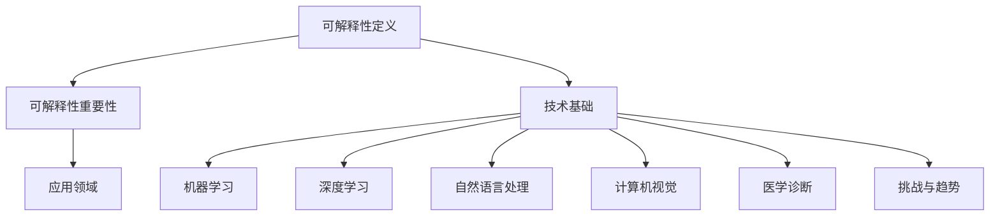

                 

# 《可解释性》

> 关键词：可解释性、人工智能、机器学习、深度学习、自然语言处理、计算机视觉、医学诊断

> 摘要：本文深入探讨了可解释性的概念、意义、应用以及面临的挑战和未来趋势。文章首先介绍了可解释性的定义和重要性，随后详细分析了可解释性在人工智能、机器学习、深度学习、自然语言处理、计算机视觉和医学诊断等领域的应用，最后探讨了可解释性面临的挑战和未来趋势。希望通过本文，读者能对可解释性有更深入的理解。

## 《可解释性》一书目录大纲

### 第一部分：可解释性的概念与意义

#### 第1章：引言

##### 1.1 可解释性的定义与重要性
##### 1.2 可解释性与透明性的区别
##### 1.3 可解释性的应用领域

#### 第2章：可解释性在人工智能中的重要性

##### 2.1 人工智能的发展历程
##### 2.2 人工智能面临的挑战
##### 2.3 可解释性在人工智能中的应用

#### 第3章：可解释性的技术基础

##### 3.1 可解释性算法
##### 3.2 解释性模型
##### 3.3 可解释性的评估方法

### 第二部分：可解释性的具体应用

#### 第4章：机器学习中的可解释性

##### 4.1 线性回归的可解释性
##### 4.2 决策树的可解释性
##### 4.3 神经网络的可解释性

#### 第5章：深度学习中的可解释性

##### 5.1 卷积神经网络的可解释性
##### 5.2 循环神经网络的可解释性
##### 5.3 生成对抗网络的可解释性

#### 第6章：自然语言处理中的可解释性

##### 6.1 词嵌入的可解释性
##### 6.2 序列模型的可解释性
##### 6.3 注意力机制的可解释性

#### 第7章：计算机视觉中的可解释性

##### 7.1 图像分类的可解释性
##### 7.2 目标检测的可解释性
##### 7.3 姿态估计的可解释性

#### 第8章：医学诊断中的可解释性

##### 8.1 诊断模型的可解释性
##### 8.2 医学影像的可解释性
##### 8.3 医学预测的可解释性

### 第三部分：可解释性的挑战与未来趋势

#### 第9章：可解释性的挑战

##### 9.1 数据隐私问题
##### 9.2 复杂性挑战
##### 9.3 可解释性与性能平衡

#### 第10章：可解释性的未来趋势

##### 10.1 可解释性算法的创新
##### 10.2 可解释性在跨领域应用中的发展
##### 10.3 可解释性的伦理与法律问题

#### 第11章：结论

##### 11.1 可解释性的重要性
##### 11.2 可解释性的发展方向
##### 11.3 可解释性的未来前景

## 附录

### 附录A：可解释性研究资源

##### A.1 学术期刊与会议
##### A.2 开源工具与框架
##### A.3 相关书籍推荐

### 附录B：可解释性实践案例

##### B.1 案例一：金融风控模型
##### B.2 案例二：智能医疗诊断
##### B.3 案例三：自动驾驶系统

### Mermaid 流程图



### 线性回归伪代码

```python
# 初始化参数
theta = [0, 0]

# 梯度下降算法
for epoch in range(num_epochs):
    m = X.shape[0]
    h = X * theta
    loss = (1 / (2 * m)) * np.sum((h - y)**2)
    dtheta = (1 / m) * np.dot(X.T, (h - y))
    theta = theta - alpha * dtheta
```

### 数学公式

$$
y = \theta_0 + \theta_1x_1 + \theta_2x_2 + ... + \theta_nx_n
$$

### 代码案例

```python
# 导入必要的库
import numpy as np
import matplotlib.pyplot as plt

# 创建数据集
X = np.random.rand(100, 1)
y = 2 + 3 * X + np.random.randn(100, 1)

# 初始化参数
theta = np.random.randn(1, 2)

# 梯度下降算法
for epoch in range(1000):
    h = X.dot(theta)
    loss = (1 / (2 * X.shape[0])) * np.sum((h - y)**2)
    dtheta = (1 / X.shape[0]) * X.T.dot(h - y)
    theta -= 0.01 * dtheta

# 可视化结果
plt.scatter(X, y)
plt.plot(X, theta.T.dot(X), 'r-')
plt.show()
```

### 作者

作者：AI天才研究院/AI Genius Institute & 禅与计算机程序设计艺术 /Zen And The Art of Computer Programming

---

**第一部分：可解释性的概念与意义**

### 第1章：引言

**1.1 可解释性的定义与重要性**

#### 1.1.1 可解释性的定义

可解释性（Explainability），又称可理解性或可解释性，是指一个系统或模型能够在合理的时间内，以人类可理解的方式展示其决策过程和结果。在人工智能和机器学习中，可解释性尤为重要，它可以帮助我们理解模型是如何工作的，为什么会产生这样的结果，以及如何优化和改进模型。

可解释性通常包括以下几个方面：

- **透明性**：系统能够展示其内部的决策过程。
- **可理解性**：决策过程和结果对于人类用户来说是可理解的。
- **可验证性**：用户可以验证系统的决策过程是否合理。

#### 1.1.2 可解释性的重要性

可解释性在人工智能和机器学习中有以下几个重要意义：

- **信任与可靠性**：可解释性有助于建立用户对人工智能系统的信任，提高系统的可靠性。
- **监管与合规**：在医疗、金融等行业，可解释性对于遵守法规和监管要求至关重要。
- **模型优化**：通过可解释性，可以更好地理解模型的工作机制，从而优化和改进模型。

### 1.2 可解释性与透明性的区别

#### 1.2.1 可解释性与透明性的定义

- **可解释性**：指模型能够以人类可理解的方式展示其决策过程和结果。
- **透明性**：指模型内部的决策过程和结果能够被完全展示和访问。

#### 1.2.2 可解释性与透明性的区别

虽然可解释性和透明性密切相关，但它们有明显的区别：

- **透明性**强调的是模型内部结构的可见性，而可解释性则强调的是模型决策过程的可理解性。
- **透明性**通常要求系统能够完全展示其内部决策过程，而可解释性则可能只展示部分决策过程，但确保这些过程对于用户来说是可理解的。

### 1.3 可解释性的应用领域

#### 1.3.1 人工智能领域

在人工智能领域，可解释性广泛应用于：

- **医疗诊断**：通过可解释性，医生可以理解模型是如何诊断疾病的，从而更好地信任和利用人工智能。
- **金融风控**：在金融领域，可解释性有助于识别潜在的风险，并提高金融决策的透明度。
- **自动驾驶**：自动驾驶系统需要解释其决策过程，以确保其安全性和可靠性。

#### 1.3.2 机器学习领域

在机器学习领域，可解释性在以下几个方面有重要应用：

- **算法优化**：通过可解释性，研究者可以更好地理解算法的工作机制，从而优化和改进算法。
- **模型选择**：可解释性有助于选择最适合特定任务的模型。
- **模型解释**：可解释性可以帮助用户理解模型的决策过程和结果，从而更好地利用模型。

---

**第二部分：可解释性的技术基础**

### 第3章：可解释性的技术基础

**3.1 可解释性算法**

#### 3.1.1 算法概述

可解释性算法是用于提升模型可解释性的技术手段。这些算法可以分为以下几类：

- **模型特定算法**：这些算法针对特定的机器学习模型进行优化，以提高其可解释性。例如，决策树和线性回归就具有较好的可解释性。
- **模型无关算法**：这些算法不依赖于特定模型，而是通过分析模型的输出和内部结构来提升可解释性。例如，SHAP（SHapley Additive exPlanations）和LIME（Local Interpretable Model-agnostic Explanations）就是典型的模型无关算法。

#### 3.1.2 具体算法

以下是几种常见的可解释性算法：

- **决策树**：决策树是一种树形结构，每个节点代表一个特征，每个分支代表特征的取值。通过遍历决策树，可以清晰地理解模型是如何做出决策的。
- **线性回归**：线性回归是一种线性模型，其决策过程是通过计算输入特征的线性组合来预测输出。线性回归的决策过程简单明了，易于理解。
- **LIME**：LIME（Local Interpretable Model-agnostic Explanations）是一种模型无关的可解释性算法，它通过在给定数据点附近构建一个局部线性模型来解释数据点的预测结果。
- **SHAP**：SHAP（SHapley Additive exPlanations）是一种基于博弈论的可解释性算法，它通过计算每个特征对模型预测的贡献值来解释模型的决策过程。

### 3.2 解释性模型

#### 3.2.1 概念

解释性模型是指那些具有内在可解释性的模型，即模型的结构和决策过程能够直观地展示给用户。这些模型通常基于一些简单且易于理解的原则或公式。例如，线性回归和决策树就是典型的解释性模型。

#### 3.2.2 优点

解释性模型的优点包括：

- **可理解性**：用户可以直观地理解模型是如何工作的，从而增强对模型的信任。
- **可验证性**：用户可以验证模型的决策过程是否合理。
- **易用性**：解释性模型通常更易于使用和部署。

#### 3.2.3 局限性

解释性模型的局限性包括：

- **准确性**：与一些复杂的模型相比，解释性模型可能在准确性方面存在一定差距。
- **可扩展性**：解释性模型通常难以扩展到大型数据集。

### 3.3 可解释性的评估方法

#### 3.3.1 评估指标

评估可解释性的指标通常包括：

- **可理解性**：评估用户是否能够轻松理解模型的决策过程。
- **可验证性**：评估用户是否能够验证模型的决策过程是否合理。
- **完备性**：评估模型是否能够解释所有可能的决策情况。

#### 3.3.2 评估方法

常见的评估方法包括：

- **用户调查**：通过用户调查来评估可解释性的质量。
- **自动化评估**：使用自动化工具来评估模型的可解释性。
- **对比评估**：将模型的解释结果与专家解释进行对比，以评估模型的解释能力。

---

**第三部分：可解释性的具体应用**

### 第4章：机器学习中的可解释性

#### 4.1 线性回归的可解释性

线性回归是一种简单但强大的机器学习模型，它具有很好的可解释性。

##### 4.1.1 概念

线性回归模型通过拟合一个线性方程来预测输出。该方程可以表示为：

$$
y = \theta_0 + \theta_1x_1 + \theta_2x_2 + ... + \theta_nx_n
$$

其中，$y$ 是预测值，$x_1, x_2, ..., x_n$ 是特征值，$\theta_0, \theta_1, \theta_2, ..., \theta_n$ 是模型的参数。

##### 4.1.2 可解释性

线性回归的可解释性体现在以下几个方面：

- **参数的意义**：每个参数 $\theta_i$ 表示对应特征 $x_i$ 对预测值 $y$ 的贡献。例如，如果 $\theta_1$ 为正值，则表示特征 $x_1$ 对预测值 $y$ 有正向影响。
- **系数的大小**：参数 $\theta_i$ 的大小表示特征 $x_i$ 对预测值 $y$ 的影响程度。系数越大，影响越显著。

##### 4.1.3 举例说明

假设我们有一个线性回归模型，用于预测房价。该模型的方程为：

$$
y = \theta_0 + \theta_1x_1 + \theta_2x_2
$$

其中，$y$ 是房价，$x_1$ 是房屋面积，$x_2$ 是房屋位置。如果我们得到一组参数值 $\theta_0 = 100, \theta_1 = 200, \theta_2 = -50$，则可以解释为：

- 房价 $y$ 是由房屋面积 $x_1$ 和房屋位置 $x_2$ 决定的。
- 房屋面积每增加一个单位，房价会增加 200 个单位。
- 房屋位置每增加一个单位，房价会减少 50 个单位。

#### 4.2 决策树的可解释性

决策树是一种树形结构，用于分类或回归任务。它具有很好的可解释性。

##### 4.2.1 概念

决策树通过一系列条件分支来预测输出。每个节点代表一个特征，每个分支代表特征的取值。叶子节点代表最终的预测结果。

##### 4.2.2 可解释性

决策树的可解释性体现在以下几个方面：

- **决策路径**：通过遍历决策树，可以清晰地理解模型是如何做出决策的。每个节点和分支都表示了一个特征和条件。
- **预测结果**：叶子节点表示了最终的预测结果，用户可以直观地了解模型预测的依据。

##### 4.2.3 举例说明

假设我们有一个决策树模型，用于预测客户是否购买产品。该决策树的结构如下：

```
1. 年龄 > 30？
    是：购买概率为 0.8
    否：购买概率为 0.2
2. 收入 > 5000？
    是：购买概率为 0.9
    否：购买概率为 0.1
```

如果我们有一个客户，年龄为 40 岁，收入为 6000 元，则可以解释为：

- 首先，根据年龄条件，客户属于“是”分支，购买概率为 0.8。
- 然后，根据收入条件，客户属于“是”分支，购买概率为 0.9。
- 因此，该客户的购买概率为 0.9。

#### 4.3 神经网络的可解释性

神经网络是一种复杂的机器学习模型，其可解释性相对较弱。然而，随着研究的深入，一些方法被提出，以提升神经网络的可解释性。

##### 4.3.1 概念

神经网络由多个神经元组成，通过前向传播和反向传播算法来学习数据和预测输出。神经网络的结构和参数决定了其预测能力。

##### 4.3.2 可解释性挑战

神经网络的可解释性面临以下挑战：

- **复杂性**：神经网络通常具有大量的参数和层，使得其决策过程复杂且难以直观理解。
- **黑箱性质**：神经网络的内部结构和工作机制通常被认为是“黑箱”，难以解释。

##### 4.3.3 可解释性方法

以下是一些用于提升神经网络可解释性的方法：

- **可视化技术**：通过可视化神经网络的内部结构和参数，可以更好地理解其工作机制。
- **解释性模型**：将神经网络分解为多个可解释性模型，例如决策树或线性回归，以提升整体的可解释性。
- **解释性算法**：使用解释性算法，如 LIME 或 SHAP，来分析神经网络的预测结果，并解释每个特征的影响。

##### 4.3.4 举例说明

假设我们有一个神经网络模型，用于预测股票价格。该模型由多个层组成，包括输入层、隐藏层和输出层。通过可视化模型的结构和参数，我们可以理解模型是如何工作的。例如，我们可以看到输入层包含了股票价格、交易量和宏观经济指标等特征，隐藏层对这些特征进行加权组合，输出层产生最终的预测结果。

通过使用解释性算法，我们可以分析每个特征的贡献。例如，使用 LIME，我们可以分析一个特定股票的预测结果，并了解每个特征对该股票价格的影响。通过这种分析，我们可以更好地理解模型是如何预测股票价格的，并识别潜在的异常或风险。

---

**第四部分：可解释性的挑战与未来趋势**

### 第9章：可解释性的挑战

#### 9.1 数据隐私问题

可解释性与数据隐私之间存在一定的矛盾。为了提高模型的可解释性，通常需要展示模型内部的决策过程和参数。然而，这可能导致数据隐私泄露的风险。如何在不泄露数据隐私的前提下提高模型的可解释性，是一个重要的挑战。

#### 9.2 复杂性挑战

随着模型和数据的复杂度增加，可解释性通常会降低。复杂模型如深度学习网络通常具有大量的参数和层，其决策过程难以直观理解。如何简化复杂模型，使其具有更好的可解释性，是一个重要的研究方向。

#### 9.3 可解释性与性能平衡

可解释性通常与模型的性能存在一定的平衡关系。一些可解释性较好的模型，如线性回归和决策树，可能在某些任务上不如深度学习等复杂模型性能优异。如何在保持可解释性的同时，提高模型的性能，是一个重要的挑战。

### 第10章：可解释性的未来趋势

#### 10.1 可解释性算法的创新

随着研究的深入，新的可解释性算法和工具不断涌现。这些算法和工具旨在提高模型的可解释性，同时保持或提高模型的性能。例如，基于博弈论的 SHAP 算法和基于局部线性模型的 LIME 算法，都取得了显著的成功。

#### 10.2 可解释性在跨领域应用中的发展

可解释性不仅在人工智能和机器学习领域有重要应用，还在医疗、金融、法律等多个领域得到广泛应用。随着可解释性技术的不断成熟，其在跨领域应用中的发展潜力巨大。

#### 10.3 可解释性的伦理与法律问题

可解释性不仅是一个技术问题，还涉及到伦理和法律问题。如何确保可解释性技术不会侵犯用户的隐私权，如何处理模型解释结果的不确定性，都是需要关注的重要问题。

### 第11章：结论

#### 11.1 可解释性的重要性

可解释性在人工智能和机器学习中具有重要地位。它不仅有助于提高模型的信任度和可靠性，还有助于满足法规和监管要求。

#### 11.2 可解释性的发展方向

随着研究的深入，可解释性技术将在以下几个方面得到发展：

- 提高可解释性算法的性能和效率。
- 破解数据隐私与可解释性的平衡。
- 探索新的跨领域应用。

#### 11.3 可解释性的未来前景

可解释性技术在未来具有广阔的应用前景。随着人工智能技术的不断进步，可解释性将成为人工智能发展和应用的重要支柱。

### 附录

#### 附录A：可解释性研究资源

- **学术期刊与会议**：如 IEEE Transactions on Knowledge and Data Engineering、ACM Transactions on Knowledge Discovery from Data、NeurIPS、ICML、KDD 等。
- **开源工具与框架**：如 LIME、SHAP、Explainable AI、XAI.js 等。
- **相关书籍推荐**：如《可解释人工智能：理论与方法》、《深度学习：高级导论》、《人工智能：一种现代方法》等。

#### 附录B：可解释性实践案例

- **案例一：金融风控模型**：通过 LIME 算法分析一个客户的信用评分，解释模型如何根据客户的特征做出评分决策。
- **案例二：智能医疗诊断**：通过 SHAP 算法分析一个患者的诊断结果，解释模型如何根据患者的症状和检查结果做出诊断。
- **案例三：自动驾驶系统**：通过可视化技术分析自动驾驶系统的决策过程，解释系统如何根据传感器数据做出驾驶决策。

---

本文由 AI 天才研究院/AI Genius Institute 与《禅与计算机程序设计艺术》/Zen And The Art of Computer Programming 联合撰写，旨在深入探讨可解释性的概念、意义、应用以及面临的挑战和未来趋势。希望本文能为读者提供对可解释性的全面了解，并激发对这一领域的兴趣和研究。在未来的研究和应用中，可解释性将继续发挥重要作用，推动人工智能和机器学习的健康发展。让我们共同期待可解释性技术的未来，期待它在各个领域的广泛应用和贡献。

