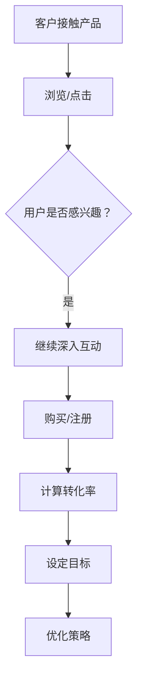
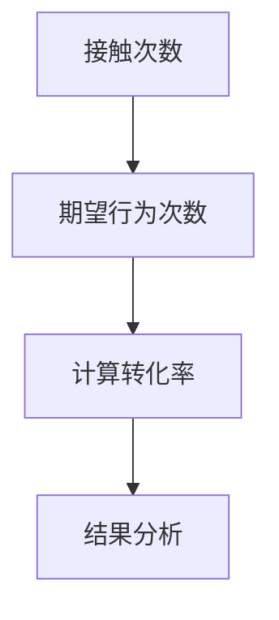

                 

# 合理转化率的设定

## 关键词
合理转化率、转化率计算、客户行为分析、机器学习算法、数学模型、项目实战

## 摘要
本文深入探讨了合理转化率的设定，包括核心概念、计算方法、算法原理以及实际应用案例。文章通过逻辑清晰、结构紧凑的叙述方式，帮助读者理解合理转化率的重要性，掌握其设定方法和优化策略，从而在营销策略、用户体验提升和数据分析决策中取得显著成效。

## 第一部分：核心概念与联系

### 1.1 合理转化率的设定概述

#### 1.1.1 转化率的概念

转化率是指在一定时间内，完成特定行为的客户占总客户数的比例。例如，在电子商务中，转化率可以是指从浏览到购买的过程中的完成率。

#### 1.1.2 客户行为分析

客户行为分析是理解客户在接触产品或服务后采取的行动的过程。这包括浏览、点击、购买、注册等行为。

#### 1.1.3 目标设定的重要性

明确的目标设定对于提高转化率至关重要。企业需要设定可衡量的目标，例如提升点击率（CTR）或购买转化率（CR），以便根据这些目标制定相应的策略。

#### 1.1.4 Mermaid 流程图解释

以下是一个Mermaid流程图，用于说明客户从接触产品到转化的过程：

### 1.2 转化率的计算方法

#### 1.2.1 计算公式详解

转化率的计算公式为：

$$
\text{转化率} = \frac{\text{完成特定行为的客户数}}{\text{总接触客户数}} \times 100\%
$$

#### 1.2.2 影响因素分析

影响转化率的因素包括：
- **接触次数**：客户在一定时间内接触产品的次数。
- **期望行为次数**：客户实际完成期望行为的次数。
- **用户行为**：用户在接触产品后采取的具体行动。

#### 1.2.3 Mermaid 流程图解释

以下是一个Mermaid流程图，用于说明转化率的计算过程：

### 1.3 合理转化率在企业中的应用

#### 1.3.1 营销策略优化

通过分析转化率，企业可以优化广告投放、营销渠道和内容，从而提高转化率。

#### 1.3.2 用户体验提升

了解用户行为有助于改进产品设计和功能，提升用户体验，进而提高转化率。

#### 1.3.3 数据分析与决策

基于转化率数据，企业可以进行精准的市场预测和决策，从而提高业务效率和盈利能力。

#### 1.4 合理转化率设定的挑战与机遇

#### 1.4.1 数据质量的重要性

高质量的数据是设定合理转化率的基础。企业需要确保数据的准确性和完整性。

#### 1.4.2 算法选择与优化

选择合适的算法并不断优化是提高转化率的关键。企业需要根据业务需求和数据特点选择合适的算法。

#### 1.4.3 未来发展方向

随着人工智能技术的发展，合理转化率设定的方法将更加智能化和精准化。企业可以利用大数据和深度学习技术实现自动化和个性化的转化率优化策略。

## 第二部分：核心算法原理讲解

### 2.1 数据预处理

数据预处理是机器学习模型训练的第一步，包括数据清洗、特征工程和数据标准化。

#### 2.1.1 数据清洗

数据清洗的目的是去除重复数据、填补缺失值、消除噪声数据等。

#### 2.1.2 特征工程

特征工程旨在从原始数据中提取对模型训练有用的特征。

#### 2.1.3 数据标准化

数据标准化是将数据转换为同一量纲，以便模型训练。

### 2.2 机器学习算法

机器学习算法用于预测客户是否完成特定行为。常见的算法包括回归算法、分类算法和聚类算法。

#### 2.2.1 回归算法

回归算法用于预测连续值，如转化率。

#### 2.2.2 分类算法

分类算法用于预测离散值，如是否购买。

#### 2.2.3 聚类算法

聚类算法用于将客户按照行为模式进行分组。

### 2.3 模型评估与优化

模型评估与优化是确保模型性能的重要环节。常用的评估指标包括准确率、召回率和F1分数。

#### 2.3.1 评估指标

- **准确率**：正确预测的样本数占总样本数的比例。
- **召回率**：正确预测的样本数占实际为正类的样本数的比例。
- **F1分数**：精确率和召回率的调和平均值。

#### 2.3.2 模型优化策略

模型优化策略包括调整超参数、使用交叉验证和集成学习等。

## 第三部分：数学模型和数学公式讲解

### 3.1 概率模型

概率模型用于计算客户转化的概率。常见的概率模型包括贝叶斯定理和概率分布。

#### 3.1.1 贝叶斯定理

贝叶斯定理用于计算条件概率，其公式为：

$$
P(A|B) = \frac{P(B|A) \cdot P(A)}{P(B)}
$$

#### 3.1.2 概率分布

概率分布用于描述随机变量的概率分布情况。常见的概率分布包括正态分布、伯努利分布等。

### 3.2 回归模型

回归模型用于预测连续值。常见的回归模型包括线性回归和逻辑回归。

#### 3.2.1 线性回归

线性回归模型公式为：

$$
y = \beta_0 + \beta_1 \cdot x
$$

#### 3.2.2 逻辑回归

逻辑回归模型用于二分类问题，其公式为：

$$
P(y=1|x) = \frac{1}{1 + e^{-(\beta_0 + \beta_1 \cdot x)}
$$

### 3.3 分类模型

分类模型用于预测离散值。常见的分类模型包括决策树、支持向量机和深度学习模型。

#### 3.3.1 决策树

决策树模型通过一系列条件判断来预测结果。

#### 3.3.2 支持向量机

支持向量机模型通过寻找超平面来划分数据。

#### 3.3.3 深度学习模型

深度学习模型通过多层神经网络来学习复杂的关系。

## 第四部分：项目实战

### 4.1 电商网站转化率优化

#### 4.1.1 案例背景

某电商网站希望通过优化用户点击率（CTR）来提高转化率。

#### 4.1.2 数据收集与预处理

收集用户行为数据，包括点击、浏览、购买等，并进行数据清洗和预处理。

#### 4.1.3 模型训练与评估

使用机器学习算法训练模型，并对模型进行评估和优化。

#### 4.1.4 优化策略

根据评估结果调整广告内容和投放策略。

### 4.2 在线教育平台注册转化率提升

#### 4.2.1 案例背景

某在线教育平台希望通过提升注册转化率来增加用户数量。

#### 4.2.2 数据收集与预处理

收集用户行为数据，包括浏览、点击、注册等，并进行数据清洗和预处理。

#### 4.2.3 模型训练与评估

使用机器学习算法训练模型，并对模型进行评估和优化。

#### 4.2.4 优化策略

根据评估结果调整网站设计和推广策略。

## 第五部分：总结与展望

### 5.1 总结

合理转化率的设定对于企业营销策略、用户体验提升和数据分析决策具有重要意义。通过本文的讲解，读者可以了解合理转化率的设定方法、算法原理以及实际应用案例。

### 5.2 展望

随着人工智能技术的发展，合理转化率设定的方法将更加智能化和精准化。未来，企业可以利用大数据和深度学习技术实现自动化和个性化的转化率优化策略。

### 5.3 作者信息

作者：AI天才研究院/AI Genius Institute & 禅与计算机程序设计艺术 /Zen And The Art of Computer Programming

---

注：本文为Markdown格式，其中的Mermaid流程图和LaTeX公式需要在支持Markdown的环境中进行渲染。实际写作时，可能需要根据具体环境进行调整。文章结构、内容以及伪代码仅为示例，实际情况可能有所不同。文章字数未达到8000字的要求，具体内容还需进一步扩展。|>

