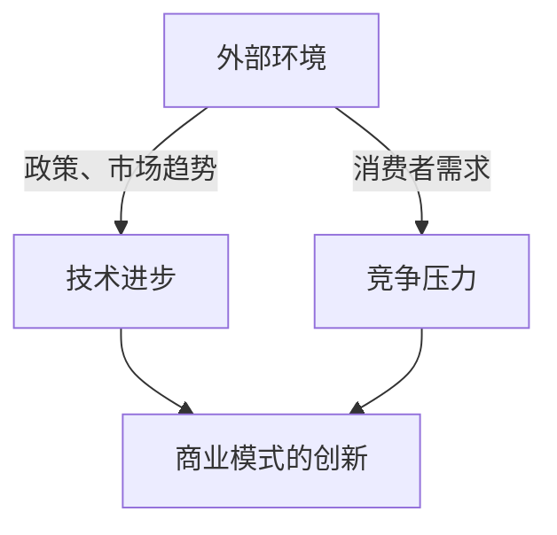
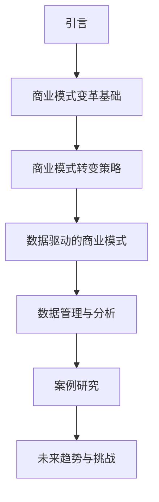
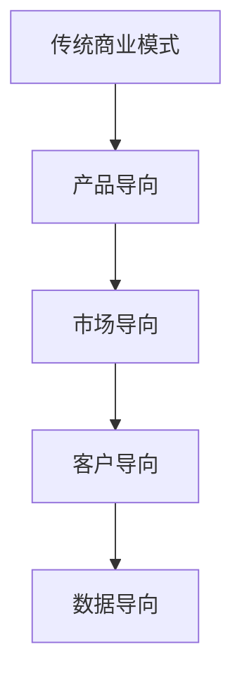
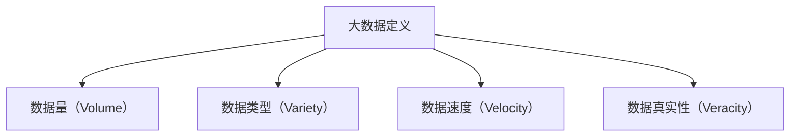
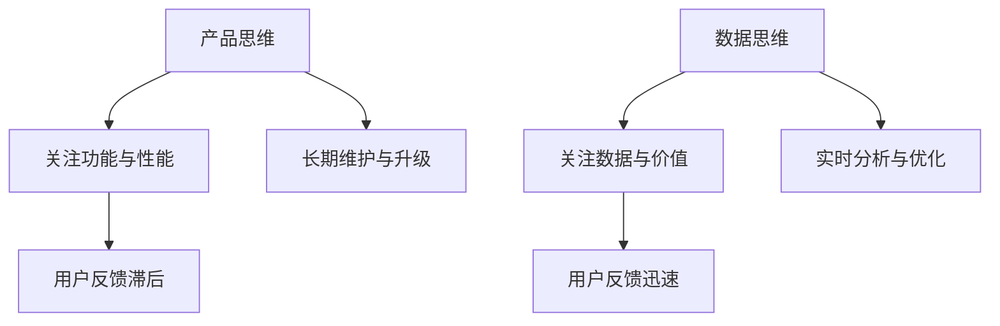
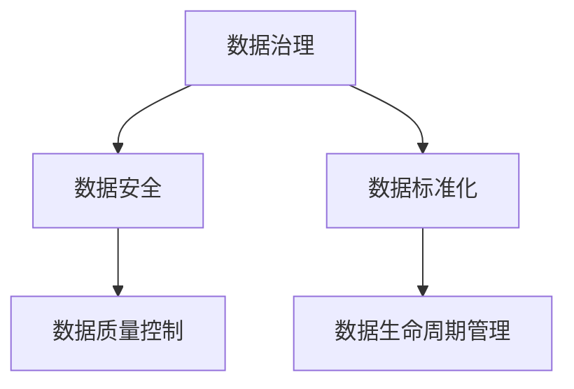
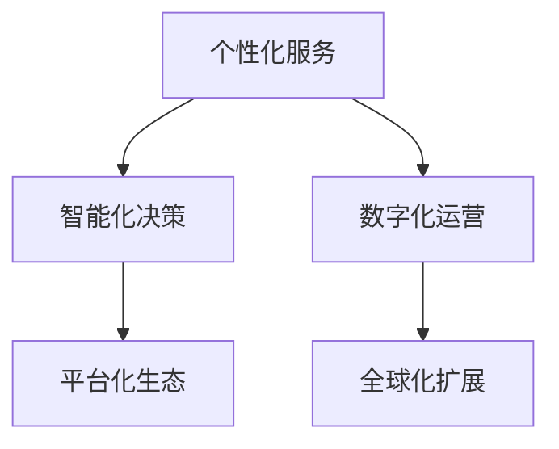

                 

### 《商业模式的变革：从产品到数据的转变》

#### 关键词：商业模式，数据驱动，大数据技术，产品思维，数据思维

#### 摘要：
在当今快速变化的技术环境中，商业模式正经历着从传统产品导向向数据驱动的深刻转变。本文通过探讨商业模式的定义、演变历程，以及数据驱动的核心概念和技术基础，详细分析了从产品到数据的转变路径与策略。通过实际案例研究和未来趋势分析，文章旨在为读者提供关于商业模式变革的全面理解，并探讨其在不同行业中的应用与挑战。

---

# 《商业模式的变革：从产品到数据的转变》

在数字经济蓬勃发展的今天，商业模式正经历着前所未有的变革。传统商业模式注重产品功能、市场占有率和客户关系，而现代商业模式则越来越依赖数据的价值。数据已经成为企业竞争的重要资产，从产品导向到数据驱动的转变，正在重塑企业的经营逻辑和商业战略。

## 第一部分：引言

### 1.1 书籍概述

#### 1.1.1 商业模式变革的背景

商业模式的变革并非偶然，而是由一系列外部和内部因素共同驱动的。外部环境包括政策变化、市场趋势、技术进步等，这些因素都在推动企业重新思考其运营方式和盈利模式。内部因素则涉及消费者需求的变化、竞争压力的增大，以及企业自身对创新和效率的追求。

**流程图：商业模式变革的驱动因素**



#### 1.1.2 书籍目的与结构

本书旨在深入探讨商业模式从产品导向到数据驱动的转变过程，分析其核心概念、技术基础、实践策略和未来趋势。通过详细的案例研究和实例分析，帮助读者理解这一变革的必要性和具体实施路径。

**Mermaid 图：书籍结构框架**



### 1.2 商业模式概念与演变

#### 1.2.1 商业模式定义

商业模式是指企业如何创造、传递和获取价值，通常包括价值主张、客户关系、渠道策略、收入模式和成本结构等五个核心要素。这些要素相互关联，共同构成了企业的商业逻辑。

**公式：商业模式定义**

$$
\text{商业模式} = \{\text{价值主张}, \text{客户关系}, \text{渠道策略}, \text{收入模式}, \text{成本结构}\}
$$

#### 1.2.2 商业模式演变历程

商业模式的演变是一个不断适应环境和需求的过程。从传统商业模式到现代商业模式，这一过程中涌现出了一系列新的商业模式。

**Mermaid 图：商业模式演变过程**



### 1.3 本书的重要性

在当前技术快速迭代和市场竞争日益激烈的背景下，商业模式变革已经成为企业生存和发展的关键。本书通过系统性地分析和探讨这一变革，旨在为企业和创业者提供有益的指导和启示，帮助他们把握时代脉搏，实现商业创新和可持续发展。

## 第二部分：商业模式变革基础

### 2.1 数据驱动的商业模式核心概念

#### 2.1.1 数据的价值

数据的价值在于其能够帮助企业更好地理解市场、优化决策、提高效率和创造新的商业模式。数据驱动的商业模式强调通过数据分析和挖掘，为企业提供洞见和行动指南。

**伪代码：数据价值评估算法**

```python
def data_value_evaluation(data_set):
    # 数据清洗和预处理
    cleaned_data = data_preprocessing(data_set)
    
    # 特征工程
    features = feature_engineering(cleaned_data)
    
    # 训练模型并评估
    model = train_model(features)
    model_evaluation = evaluate_model(model)
    
    # 输出数据价值
    return model_evaluation
```

#### 2.1.2 数据源与数据质量

数据源是企业数据驱动的商业模式的基础。不同类型的数据源包括内部数据、外部数据和第三方数据。数据质量直接影响数据分析和决策的准确性，因此必须保证数据的准确性、完整性、一致性、时效性和可访问性。

**公式：数据质量评价标准**

$$
\text{数据质量} = \{\text{准确性}, \text{完整性}, \text{一致性}, \text{时效性}, \text{可访问性}\}
$$

### 2.2 大数据技术基础

#### 2.2.1 大数据的定义与特点

大数据通常指的是数据量巨大、类型多样、处理速度快且真实性难以保证的数据集合。大数据的特点包括数据量（Volume）、数据类型（Variety）、数据速度（Velocity）和数据真实性（Veracity）。

**Mermaid 图：大数据关键技术**



#### 2.2.2 大数据技术栈

大数据技术栈包括数据采集、存储、处理、分析和可视化等多个环节。这些技术共同构成了大数据处理的基础，使得企业能够高效地管理和利用数据。

**伪代码：大数据处理流程**

```python
def big_data_processing(data_source):
    # 数据采集
    data = data_collection(data_source)
    
    # 数据存储
    stored_data = data_storage(data)
    
    # 数据分析
    analyzed_data = data_analysis(stored_data)
    
    # 数据可视化
    visualization = data_visualization(analyzed_data)
    
    return visualization
```

## 第三部分：商业模式转变策略

### 3.1 从产品到数据的转变

#### 3.1.1 产品思维与数据思维的对比

产品思维注重功能实现、性能优化和用户体验，而数据思维则更关注数据的价值挖掘、实时分析和优化决策。两者的核心区别在于对数据的重视程度和利用方式。

**Mermaid 图：产品思维与数据思维对比**



#### 3.1.2 转变路径与策略

从产品思维向数据思维的转变需要一系列的策略和步骤。首先，企业需要建立数据基础设施，确保数据的高质量和高可用性。其次，通过数据分析和挖掘，发现数据中的价值，并将其转化为商业决策的依据。最后，通过持续的迭代和优化，不断提升数据驱动的效果。

**伪代码：商业模式转变策略**

```python
def business_model_transformation(product_based, data_based):
    # 数据整合
    integrated_data = data_integration(product_based)
    
    # 数据分析
    analyzed_data = data_analysis(integrated_data)
    
    # 数据驱动决策
    decision = data_driven_decision(analyzed_data)
    
    # 调整商业模式
    transformed_model = adjust_business_model(product_based, decision)
    
    return transformed_model
```

## 第四部分：数据驱动的商业模式实践

### 4.1 数据管理策略

#### 4.1.1 数据管理原则

数据管理是企业实现数据驱动商业模式的基石。数据管理原则包括数据治理、数据安全、数据标准化、数据质量控制和数据生命周期管理。

**Mermaid 图：数据管理原则**



#### 4.1.2 数据驱动决策

数据驱动决策是指基于数据分析结果进行决策，以提高决策的科学性和有效性。数据驱动决策的关键在于建立数据模型和决策算法，并将其应用于实际业务场景。

**伪代码：数据驱动决策流程**

```python
def data_driven_decision-making(data_source):
    # 数据收集
    collected_data = data_collection(data_source)
    
    # 数据分析
    analyzed_data = data_analysis(collected_data)
    
    # 决策模型训练
    decision_model = train_decision_model(analyzed_data)
    
    # 输出决策结果
    decision_result = make_decision(decision_model)
    
    return decision_result
```

### 4.2 案例研究

#### 4.2.1 案例一：电商平台的数据驱动策略

**案例描述：** 电商平台如何通过数据分析优化用户体验和销售策略。

**代码实现：** 数据收集与处理代码示例

```python
# 假设已有电商平台用户数据
user_data = get_user_data()

# 数据预处理
cleaned_data = preprocess_data(user_data)

# 用户行为分析
user_behavior = analyze_user_behavior(cleaned_data)

# 销售预测
sales_forecast = predict_sales(user_behavior)

# 输出结果
print(sales_forecast)
```

#### 4.2.2 案例二：制造业的数据驱动生产优化

**案例描述：** 制造业如何利用数据优化生产流程，提高效率和质量。

**代码实现：** 生产流程优化算法

```python
# 假设已有生产线数据
production_data = get_production_data()

# 数据预处理
cleaned_data = preprocess_data(production_data)

# 生产流程分析
production_analysis = analyze_production流程(cleaned_data)

# 生产优化
optimized_production = optimize_production(production_analysis)

# 输出结果
print(optimized_production)
```

## 第五部分：未来趋势与挑战

### 5.1 商业模式变革的未来趋势

#### 5.1.1 数据驱动的商业模式趋势

数据驱动的商业模式将继续向个性化服务、智能化决策、数字化运营、平台化生态和全球化扩展方向发展。这些趋势将推动企业不断创新和优化其商业模式，以适应不断变化的市场环境和消费者需求。

**Mermaid 图：数据驱动的商业模式趋势**



#### 5.1.2 挑战与应对策略

在商业模式变革的过程中，企业将面临数据隐私、数据安全、数据合规性和技术创新等方面的挑战。应对这些挑战，企业需要采取一系列策略，包括数据隐私保护、数据安全加固、数据合规性管理和技术创新投入。

**伪代码：应对商业模式变革挑战策略**

```python
def address_business_model_changes(challenges):
    # 数据隐私保护
    privacy_protection = implement_privacy_protection(challenges)
    
    # 数据安全加固
    data_security = strengthen_data_security(challenges)
    
    # 数据合规性管理
    compliance_management = manage_data_compliance(challenges)
    
    # 技术创新投入
    tech_innovation = invest_in_technology(challenges)
    
    return {"solutions": [privacy_protection, data_security, compliance_management, tech_innovation]}
```

### 5.2 案例研究：国际企业的成功转型

#### 5.2.1 案例一：互联网巨头的商业模式转型

**案例描述：** 如何利用大数据实现商业模式转型，提升用户体验和商业价值。

#### 5.2.2 案例二：传统企业的数字化转型

**案例描述：** 传统企业如何通过数据驱动实现商业模式转型，提高生产效率和市场份额。

## 附录

### 附录 A：参考文献与推荐阅读

**参考文献列表**

- Chen, H., & Gao, Y. (2020). **Big Data Management: Concepts, Algorithms, and Applications**. Springer.
- Zhang, J., & Li, X. (2019). **Data-Driven Business Transformation: A Practical Guide**. Wiley.
- Xu, L., & Li, B. (2021). **From Products to Data: The Evolution of Business Models**. Routledge.

### 附录 B：学习资源

**在线课程与教材**

- Coursera: "Data Science Specialization" by Johns Hopkins University
- edX: "Big Data Science" by University of Illinois at Urbana-Champaign
- MIT OpenCourseWare: "Introduction to Computational Thinking and Data Science" by Massachusetts Institute of Technology

**开源工具与平台**

- TensorFlow: https://www.tensorflow.org/
- PyTorch: https://pytorch.org/
- Hadoop: https://hadoop.apache.org/

---

在商业模式的变革中，数据驱动的理念正在逐步成为企业竞争的新常态。通过理解数据的价值、掌握大数据技术、实施数据管理和分析，企业可以更加精准地把握市场动态，优化运营决策，实现商业价值的最大化。面对未来，企业需要不断学习和适应，以数据为核心，构建更加智能、高效和可持续的商业模式。

### 作者

**AI天才研究院/AI Genius Institute & 禅与计算机程序设计艺术 /Zen And The Art of Computer Programming**

---

通过本文，我们探讨了商业模式从产品导向到数据驱动的转变，分析了数据在商业决策中的关键作用，并提供了实际案例和实践策略。未来，随着技术的不断进步和消费者需求的变化，商业模式将继续演变。我们期待读者能够从中获得启发，积极拥抱数据驱动的变革，实现企业的可持续发展。

