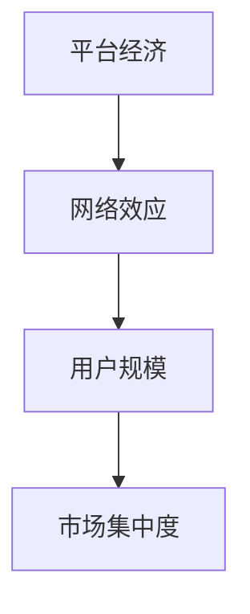

                 


# 商业领域的竞争格局长期演变

> 关键词：竞争格局、市场结构、技术创新、竞争策略、案例分析、数字化转型

> 摘要：本文将探讨商业领域竞争格局的长期演变，分析其基本概念、动力机制以及具体案例，旨在揭示市场竞争的本质和规律，为企业和投资者提供战略指导。

## 第一部分: 竞争格局的基本概念

### 1.1 竞争格局的定义与重要性

**竞争格局的定义**：竞争格局是指企业在市场中竞争的状态和形式，包括市场占有率、竞争者数量、市场进入与退出壁垒等因素。它是市场结构的重要组成部分，反映了市场参与者的力量对比和竞争态势。

**竞争格局的重要性**：理解竞争格局有助于企业制定战略，预测市场变化，优化资源配置。一个清晰明确的竞争格局能够帮助企业识别竞争对手、评估自身地位，从而制定出有效的市场策略。

### 1.2 竞争格局的分类

**完全竞争**：竞争者众多，产品同质化，价格主要由市场供需决定。在完全竞争市场中，企业无法通过价格来区分自己与其他竞争对手。

**垄断竞争**：竞争者较多，但产品存在差异，品牌和渠道等因素影响竞争。垄断竞争市场中，企业可以通过品牌效应、差异化产品等手段来区分自己与其他竞争对手。

**寡头垄断**：市场由少数大企业控制，产品可能差异化或同质化。寡头垄断市场中，几家大企业之间的竞争往往更加激烈，市场进入和退出壁垒较高。

**完全垄断**：市场上只有一个供应者，没有直接竞争者。完全垄断市场中，企业拥有绝对的定价权，市场竞争基本不存在。

### 1.3 竞争格局的影响因素

**市场需求**：市场需求变化直接影响竞争格局。当市场需求上升时，企业会扩大生产规模，竞争加剧；反之，当市场需求下降时，企业会缩小生产规模，竞争减弱。

**技术进步**：技术革新可能导致市场格局的变化。新技术的出现可能会打破原有市场的垄断格局，创造新的竞争机会。

**政策法规**：政府政策法规对市场格局产生重要影响。政策法规的调整可能会影响企业的市场进入和退出，从而改变竞争格局。

**资本流动**：资本流动会改变市场中企业的数量和实力。资本的大量流入可能导致市场集中度提高，而资本的大量流出可能导致市场集中度下降。

## 第二部分: 长期演变的动力机制

### 2.1 市场结构演变

**市场集中度**：市场集中度是指市场中前几名企业所占的市场份额。随着时间变化，市场集中度可能增加或减少，影响竞争格局。高集中度的市场通常意味着几家大企业垄断市场，而低集中度的市场则意味着竞争激烈。

**市场进入与退出**：市场进入与退出壁垒的高低决定了企业进出市场的难易程度。高壁垒的市场往往导致市场进入困难，从而保持高集中度；低壁垒的市场则可能导致企业频繁进出市场，市场集中度降低。

### 2.2 技术创新与竞争格局

**技术创新的作用**：技术创新可以改变市场格局，创造新的竞争机会。例如，互联网技术的兴起使得传统行业面临巨大挑战，同时也催生了众多新兴企业。

**技术生命周期**：从技术创新到市场应用的过程会影响竞争格局的演变。在技术发展的初期，市场往往处于垄断或寡头垄断状态；随着技术的成熟和普及，市场逐渐向竞争激烈的状态转变。

### 2.3 竞争策略演变

**竞争策略的变化**：企业根据市场环境调整竞争策略，如差异化、成本领先等。不同的竞争策略会导致不同的市场格局。

**合作与竞争的平衡**：企业间可能通过合作来应对竞争压力，同时保持市场地位。例如，产业链上下游企业之间的合作可以降低成本、提高效率，从而在竞争中占据优势。

## 第三部分: 案例分析

### 3.1 案例一：互联网行业竞争格局演变

**核心概念与联系**：互联网行业中的平台经济、网络效应等因素是影响竞争格局的关键。

- **平台经济**：平台经济通过提供中间服务连接供需双方，创造价值。例如，电商平台通过连接卖家和买家，提高了交易效率。
  
- **网络效应**：网络效应是指用户数量的增加能够带来产品或服务的价值提升。在互联网行业中，网络效应使得平台企业的市场份额不断扩大。

**流程图**：



### 3.2 案例二：汽车行业竞争格局演变

**核心算法原理讲解**：新能源汽车技术的进步和传统汽车企业的转型。

- **新能源汽车技术进步的算法模型**：

```python
def new_energy_vehicle_advancement():
    # 提高电池能量密度
    battery_energy_density += improvement_factor
    # 降低电池成本
    battery_cost -= cost_reduction_factor
    # 增强车辆性能
    vehicle_performance += performance_boost_factor
```

### 3.3 案例三：零售行业竞争格局演变

**数学模型与公式**：零售行业中的动态定价策略。

$$
P(t) = P_0 + \alpha \cdot (Q - Q_d)
$$

- **解释说明**：$P(t)$为定价策略函数，$P_0$为基准价格，$\alpha$为定价敏感系数，$Q$为市场需求量，$Q_d$为需求量阈值。

### 3.4 案例四：医疗行业竞争格局演变

**项目实战**：医疗行业的并购与市场整合。

- **开发环境搭建**：安装必要的数据库和数据分析工具。

- **源代码实现**：利用SQL语句进行数据抽取和分析。

```sql
SELECT company_name, COUNT(*) as merger_count
FROM mergers_and_acquisitions
GROUP BY company_name
ORDER BY merger_count DESC;
```

## 第四部分: 未来展望

### 4.1 数字化转型对竞争格局的影响

- **预测分析**：数字化转型加速，传统行业面临新的竞争格局。

- **技术趋势**：人工智能、区块链等新兴技术可能重塑行业竞争格局。

### 4.2 竞争格局演变的理论框架

- **演化经济学**：基于动态视角理解竞争格局的演变。

- **竞争战略理论**：企业如何在不断变化的竞争格局中保持竞争优势。

## 附录

### 附录 A: 竞争格局研究方法论

- **数据来源**：如何获取和分析竞争格局相关的数据。

- **分析方法**：运用统计学、计量经济学等方法对竞争格局进行量化分析。

### 附录 B: 参考文献

- **书籍**：相关竞争格局研究的重要书籍。

- **文章**：学术期刊和行业报告中的关键论文。

---

**作者：AI天才研究院/AI Genius Institute & 禅与计算机程序设计艺术 /Zen And The Art of Computer Programming**

