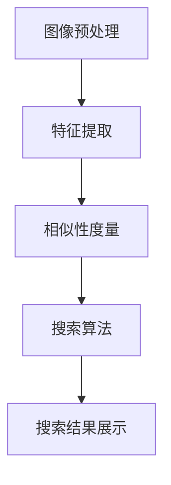
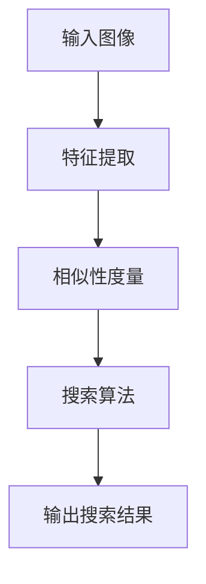

                 

## 1. 引言

图像搜索技术在电商领域中的应用已经成为提升用户体验和增加销售额的关键手段。本文旨在系统地探讨图像搜索技术在电商中的应用，通过逻辑清晰、结构紧凑的分析，深入探讨其核心概念、原理、实现方法以及在实际应用中的挑战和解决方案。

### 核心概念与联系

图像搜索技术的核心概念包括图像预处理、特征提取、相似性度量以及搜索算法。这些概念相互关联，共同构成了一个完整的图像搜索流程。具体来说：

- **图像预处理**：通过去噪、增强、缩放等操作，提高图像质量，为后续的特征提取和搜索提供高质量的数据。
- **特征提取**：从图像中提取关键特征，如颜色、纹理、形状等，用于相似性度量。
- **相似性度量**：计算图像间的相似度，用于搜索结果排序和匹配。
- **搜索算法**：基于特征和相似性度量，实现图像的检索和推荐。

通过这四个核心环节，图像搜索技术能够有效地将用户上传的图片与电商平台上的商品进行匹配，提供精准的搜索结果，从而提升用户体验。

### Mermaid 流程图



### 核心算法原理讲解

图像搜索算法的核心在于如何高效地匹配图像特征，以下是伪代码：

```python
# 假设 image1 和 image2 为输入图像
# features1 和 features2 为提取的图像特征

# 计算相似性度量
similarity = compute_similarity(features1, features2)

# 搜索结果排序
search_results = sort_by_similarity(similarity)

# 返回搜索结果
return search_results
```

其中，`compute_similarity` 函数用于计算图像特征之间的相似度，`sort_by_similarity` 函数用于根据相似度对搜索结果进行排序。

### 数学模型和公式

在图像搜索中，常用的相似性度量方法包括余弦相似性和欧氏距离。以下是这两个方法的数学公式：

- **余弦相似性**：

  $$ similarity_{cosine} = \frac{features1 \cdot features2}{\|features1\|\|features2\|} $$

- **欧氏距离**：

  $$ distance_{Euclidean} = \sqrt{\sum_{i=1}^{n} (features1_i - features2_i)^2} $$

其中，`features1` 和 `features2` 分别为两个图像的特征向量，`n` 为特征向量的维度。

### 详细讲解与举例说明

以电商平台上用户上传一张背包图片为例，图像搜索系统会按照以下步骤进行操作：

1. **图像预处理**：对用户上传的背包图片进行去噪、增强等操作，提高图像质量。
2. **特征提取**：使用卷积神经网络（CNN）从预处理后的图像中提取颜色、纹理等特征。
3. **相似性度量**：计算提取的特征与电商平台中所有背包商品的图像特征之间的相似度。
4. **搜索算法**：根据相似度值对商品进行排序，返回最相似的背包商品。

通过这样的过程，用户可以快速找到与上传图片相似的背包，从而提高购物效率。

### 总结

图像搜索技术在电商中的应用，不仅提高了用户的购物体验，还为电商平台带来了更多的商业机会。通过本文的详细探讨，我们了解了图像搜索技术的核心概念、原理以及实现方法，为实际应用提供了理论基础和技术指导。接下来，我们将进一步深入探讨图像搜索技术的具体实现和应用场景。## 2. 图像搜索技术在电商中的应用

图像搜索技术作为电商领域的一项重要创新，已经逐渐成为电商平台提升用户体验、增加销售额的有效手段。在电商行业中，图像搜索技术主要应用于以下几个方面：

### 2.1 商品搜索

商品搜索是图像搜索技术在电商领域中最常见、最重要的应用场景之一。通过图像搜索，用户可以上传一张商品的图片，系统会根据图像中的特征自动搜索出相似或匹配的商品。这种方式不仅提高了搜索效率，还降低了用户输入关键词的繁琐度，使得购物体验更加直观和便捷。

#### 应用实例

- **亚马逊**：亚马逊的图像搜索功能允许用户上传一张商品的图片，系统会返回与该图片相似的商品列表。
- **淘宝**：淘宝的“淘拍档”功能，用户可以通过上传商品图片来搜索相似的商品。

### 2.2 商品推荐

图像搜索技术还可以用于商品推荐。通过对用户上传的图片进行分析，系统能够了解用户的兴趣和偏好，从而推荐相关或符合用户需求的商品。

#### 应用实例

- **京东**：京东的“智能推荐”功能，根据用户的浏览和购买历史，以及上传的图片，为用户推荐相关的商品。

### 2.3 用户行为分析

图像搜索技术可以帮助电商平台更好地了解用户行为，通过对用户上传的图片和搜索行为进行分析，系统能够挖掘用户的兴趣点和潜在需求，从而优化推荐策略和营销活动。

#### 应用实例

- **天猫**：天猫通过分析用户上传的图片和搜索历史，为用户提供个性化的商品推荐和营销活动。

### 2.4 店铺优化

图像搜索技术还可以用于店铺优化，通过分析商品图片的搜索表现，店铺运营者可以了解哪些商品更受欢迎，从而调整商品陈列和营销策略。

#### 应用实例

- **拼多多**：拼多多通过分析商品图片的搜索和浏览数据，优化商品展示顺序和推广策略，提升商品销量。

### 2.5 供应链管理

图像搜索技术在供应链管理中也有应用，可以帮助企业更好地管理库存和追踪商品。通过图像识别技术，企业可以快速识别和定位库存商品，提高库存管理的效率和准确性。

#### 应用实例

- **阿里巴巴**：阿里巴巴旗下的菜鸟网络，利用图像识别技术进行库存管理和商品追踪，提高供应链的效率。

### 总结

图像搜索技术在电商行业的应用场景广泛，从商品搜索、推荐、用户行为分析到店铺优化和供应链管理，都发挥着重要作用。通过图像搜索技术，电商平台能够更好地满足用户需求，提升用户体验，同时也为企业带来了更多的商业机会。在接下来的部分，我们将深入探讨图像搜索技术的工作原理和核心实现方法。## 3. 图像搜索技术原理

图像搜索技术的工作原理主要包括图像预处理、特征提取、相似性度量、搜索算法等关键环节。以下是对这些环节的详细解释：

### 3.1 图像预处理

图像预处理是图像搜索的基础步骤，其主要目的是提高图像质量，为后续的特征提取和搜索提供高质量的输入数据。图像预处理通常包括以下几个步骤：

- **去噪**：去除图像中的噪声，提高图像的清晰度。常用的去噪方法包括均值滤波、中值滤波、高斯滤波等。
- **增强**：通过调整图像的对比度和亮度，增强图像的细节和特征，便于后续的特征提取。常用的增强方法包括直方图均衡化、对比度增强等。
- **缩放**：将图像缩放到统一的尺寸，以便后续的图像处理和特征提取。常用的缩放方法包括双线性插值、双立方插值等。
- **裁剪**：根据需要提取图像的感兴趣区域，去除无关部分，减少计算的复杂度。

### 3.2 特征提取

特征提取是将图像转换为数值向量表示的过程，通过提取图像的颜色、纹理、形状等特征，为相似性度量提供依据。特征提取方法可以分为传统特征提取方法和基于深度学习的特征提取方法。

- **传统特征提取方法**：
  - **颜色特征**：使用颜色直方图、颜色矩等来描述图像的颜色特征。
  - **纹理特征**：使用纹理能量、纹理方向、纹理对比度等来描述图像的纹理特征。
  - **形状特征**：使用边缘检测、轮廓提取等方法来描述图像的形状特征。
- **基于深度学习的特征提取方法**：
  - **卷积神经网络（CNN）**：通过卷积层、池化层等结构，自动提取图像的深层特征。如ResNet、Inception等模型。
  - **预训练模型**：使用预训练的深度学习模型，如VGG、ResNet等，提取图像的特征向量。

### 3.3 相似性度量

相似性度量是评估图像之间相似程度的方法，常用的相似性度量方法包括余弦相似性、欧氏距离、曼哈顿距离等。

- **余弦相似性**：计算两个向量夹角的余弦值，用于衡量它们之间的相似性。公式如下：

  $$ similarity_{cosine} = \frac{vector1 \cdot vector2}{\|vector1\|\|vector2\|} $$

- **欧氏距离**：计算两个向量之间欧氏距离，用于衡量它们之间的差异。公式如下：

  $$ distance_{Euclidean} = \sqrt{\sum_{i=1}^{n} (vector1_i - vector2_i)^2} $$

- **曼哈顿距离**：计算两个向量之间曼哈顿距离，用于衡量它们之间的差异。公式如下：

  $$ distance_{Manhattan} = \sum_{i=1}^{n} |vector1_i - vector2_i| $$

### 3.4 搜索算法

搜索算法是图像搜索技术的核心部分，基于特征提取和相似性度量，实现图像的检索和匹配。常见的搜索算法包括基于内容的搜索、基于特征的搜索和基于语义的搜索。

- **基于内容的搜索**：
  - 通过分析图像的颜色、纹理、形状等特征，实现图像之间的匹配和检索。这种方法适用于简单的图像搜索场景。

- **基于特征的搜索**：
  - 通过提取图像的特征向量，使用相似性度量方法计算特征向量之间的相似度，实现图像之间的匹配和检索。这种方法具有较高的准确性和鲁棒性。

- **基于语义的搜索**：
  - 通过理解图像的语义信息，实现图像之间的匹配和检索。这种方法适用于复杂的图像搜索场景，如视觉问答、场景理解等。

### 3.5 实现流程

图像搜索技术的实现流程通常包括以下几个步骤：

1. **图像预处理**：对输入图像进行预处理，如去噪、增强、缩放等。
2. **特征提取**：使用传统或深度学习方法提取图像的特征向量。
3. **相似性度量**：计算特征向量之间的相似度，根据相似度排序。
4. **搜索结果输出**：根据相似度排序，输出搜索结果。

以下是图像搜索技术的伪代码实现：

```python
# 输入图像image1和image2
# 预处理后的图像features1和features2

# 提取特征
features1 = extract_features(image1)
features2 = extract_features(image2)

# 计算相似度
similarity = compute_similarity(features1, features2)

# 输出搜索结果
return similarity
```

通过以上步骤，图像搜索技术可以有效地实现图像之间的匹配和检索，为电商用户提供便捷、精准的搜索服务。## 4. 图像搜索技术的工作原理

图像搜索技术是利用计算机视觉和机器学习技术，实现从图像到信息的高效检索和匹配。以下是图像搜索技术的工作原理：

### 4.1 特征提取技术

特征提取是图像搜索技术的核心步骤，其目的是从图像中提取出能够代表图像本质特性的数据。以下是一些常见的特征提取技术：

- **颜色特征**：通过计算图像的颜色分布，如颜色直方图、颜色矩等，来描述图像的颜色特征。
- **纹理特征**：通过分析图像的纹理结构，如纹理能量、纹理方向、纹理对比度等，来描述图像的纹理特征。
- **形状特征**：通过边缘检测、轮廓提取等方法，来描述图像的形状特征。

其中，基于深度学习的特征提取方法具有强大的表现力，能够提取出更丰富的图像特征，如卷积神经网络（CNN）。

### 4.2 相似性度量方法

相似性度量是判断两幅图像相似程度的方法，常用的相似性度量方法包括：

- **欧氏距离**：计算两个特征向量之间的欧氏距离，用于衡量它们之间的差异。
- **余弦相似性**：计算两个特征向量之间的余弦值，用于衡量它们之间的相似性。
- **皮尔逊相关系数**：计算两个特征向量之间的皮尔逊相关系数，用于衡量它们之间的相关性。

### 4.3 搜索算法原理

搜索算法是图像搜索技术的核心部分，其主要目的是通过特征提取和相似性度量，实现图像的高效检索和匹配。常见的搜索算法包括：

- **基于内容的搜索**：直接使用图像的特征向量进行相似性度量，适用于简单的图像搜索任务。
- **基于特征的搜索**：提取图像的特征向量后，使用相似性度量方法进行匹配，适用于具有复杂特征的图像搜索任务。
- **基于语义的搜索**：通过理解图像的语义信息，实现图像之间的匹配和检索，适用于复杂的图像搜索场景。

以下是图像搜索技术的原理图示：



### 4.4 核心挑战

图像搜索技术在实现过程中面临以下核心挑战：

- **数据量大**：图像数据通常具有高维度，数据量大，对计算资源的需求较高。
- **实时性要求高**：用户对图像搜索的实时性要求较高，需要高效的处理算法。
- **准确性与速度的权衡**：在保证搜索准确性的同时，如何提高搜索速度是一个重要问题。

通过上述工作原理和核心挑战的分析，我们可以更深入地理解图像搜索技术的实现方法和优化策略。在接下来的部分，我们将进一步探讨图像搜索技术在电商领域中的应用和实现。## 5. 图像搜索技术在电商领域的应用现状

随着人工智能和计算机视觉技术的不断发展，图像搜索技术在电商领域的应用已经越来越广泛，并且取得了显著的成效。以下是对图像搜索技术在电商领域应用现状的概述：

### 5.1 应用范围

图像搜索技术在电商领域的主要应用范围包括：

- **商品搜索**：用户可以通过上传一张商品图片，快速找到与该图片相似或匹配的商品。这种搜索方式不仅提高了搜索效率，还减少了用户输入关键词的繁琐度。
- **商品推荐**：通过分析用户的浏览历史和购买记录，系统可以推荐与用户兴趣相关的商品，提高用户的购买体验。
- **用户行为分析**：通过分析用户的上传图片和搜索行为，平台可以更准确地了解用户的需求和偏好，从而优化推荐策略和营销活动。
- **店铺优化**：通过分析商品图片的搜索表现，店铺运营者可以了解哪些商品更受欢迎，从而调整商品陈列和营销策略。
- **供应链管理**：通过图像识别技术，企业可以快速识别和定位库存商品，提高库存管理的效率和准确性。

### 5.2 应用实例

以下是一些电商平台上图像搜索技术的应用实例：

- **亚马逊**：亚马逊的图像搜索功能允许用户上传一张商品的图片，系统会返回与该图片相似的商品列表。用户可以通过这种方式找到心仪的商品，提高了购物效率。
- **淘宝**：淘宝的“淘拍档”功能，用户可以通过上传商品图片来搜索相似的商品。此外，淘宝还利用图像搜索技术进行商品推荐，提高用户的购买体验。
- **京东**：京东的“智能推荐”功能，根据用户的浏览和购买历史，以及上传的图片，为用户推荐相关的商品。这种个性化的推荐方式提高了用户的满意度。
- **拼多多**：拼多多通过分析商品图片的搜索和浏览数据，优化商品展示顺序和推广策略，提升商品销量。

### 5.3 应用效果

图像搜索技术在电商领域中的应用效果显著：

- **用户满意度**：通过图像搜索和推荐，用户可以更快速地找到心仪的商品，提高了购物体验和满意度。
- **销售额**：图像搜索和推荐功能有效提高了商品的曝光率和销售量，为企业创造了更多的商业价值。
- **运营效率**：图像搜索技术帮助电商平台优化了商品管理和营销策略，提高了运营效率。
- **库存管理**：通过图像识别技术，企业可以更准确地识别和定位库存商品，提高了库存管理的效率和准确性。

### 5.4 未来展望

随着技术的不断进步，图像搜索技术在电商领域的应用前景广阔：

- **智能化**：随着人工智能技术的发展，图像搜索技术将更加智能化，能够更好地理解和满足用户的需求。
- **多样化**：图像搜索技术将在更多电商场景中得到应用，如虚拟试衣、3D展示等，提供更丰富的购物体验。
- **全球化**：随着跨境电商的不断发展，图像搜索技术将在全球范围内得到更广泛的应用，促进国际贸易。

总的来说，图像搜索技术在电商领域的应用已经成为提升用户体验和增加销售额的关键手段，随着技术的不断进步，其应用前景将更加广阔。## 6. 图像搜索技术在其他领域的影响

图像搜索技术不仅在电商领域有着广泛的应用，在其他领域也产生了深远的影响。以下是对图像搜索技术在图像识别、医学影像、社交媒体和其他领域的详细介绍。

### 6.1 图像识别

图像识别是图像搜索技术的核心应用之一，通过提取图像特征和进行相似性度量，实现对图像内容的理解和分类。以下是一些图像识别领域的重要应用：

- **人脸识别**：通过分析人脸图像的特征，实现对人的身份识别，广泛应用于安全监控、身份验证等领域。
- **物体检测**：利用深度学习模型，如YOLO、SSD和Faster R-CNN等，实现对图像中物体的定位和分类，广泛应用于自动驾驶、视频监控等。
- **图像分类**：通过对图像的整体特征进行分类，实现对图像内容的理解，广泛应用于图像搜索引擎、内容审核等领域。

### 6.2 医学影像

医学影像领域是图像搜索技术的重要应用领域之一，通过图像识别和搜索技术，可以提高医学诊断的效率和准确性。

- **医学影像诊断**：利用图像搜索技术，医生可以通过搜索相关病例和医学图像，快速获取诊断参考信息，提高诊断效率。
- **医学图像分割**：通过图像分割技术，将医学图像中的病变区域分离出来，帮助医生更好地诊断和治疗。
- **医学图像检索**：利用图像搜索技术，医生可以快速检索与病例相关的医学图像，提高诊断的准确性。

### 6.3 社交媒体

社交媒体是图像搜索技术另一个重要的应用领域，通过图像识别和搜索技术，可以提升社交媒体的互动性和用户体验。

- **内容审核**：利用图像搜索技术，可以自动检测和过滤社交媒体上的不良内容，如色情、暴力等。
- **个性化推荐**：通过分析用户的浏览和上传的图片，社交媒体平台可以为用户推荐相关的内容和好友，提高用户粘性。
- **社交互动**：用户可以通过上传图片来分享生活，平台可以通过图像搜索技术，帮助用户找到感兴趣的内容和好友。

### 6.4 其他领域

图像搜索技术还在其他领域产生了广泛的应用，如：

- **娱乐行业**：在电影制作、音乐制作等领域，通过图像搜索技术，可以快速找到符合要求的背景图片和素材。
- **工业制造**：通过图像识别技术，可以实现对生产过程中的质量检测和故障诊断。
- **科研领域**：通过图像搜索技术，科研人员可以快速找到相关的研究资料和数据。

总的来说，图像搜索技术作为一种重要的计算机视觉技术，已经在多个领域产生了深远的影响，随着技术的不断进步，其应用范围将进一步扩大，为各个领域的发展带来新的机遇。## 7. 图像搜索技术在电商领域的未来发展趋势

随着人工智能、大数据、云计算等技术的不断发展，图像搜索技术在电商领域的应用前景将更加广阔。以下是对图像搜索技术在电商领域未来发展趋势的详细分析：

### 7.1 技术发展趋势分析

- **深度学习与强化学习**：
  - 深度学习将继续在图像搜索技术中发挥重要作用，通过更复杂的神经网络结构，提取更丰富的图像特征，提高搜索的准确性和效率。
  - 强化学习将在图像搜索策略优化中应用，通过不断学习和调整策略，提高搜索结果的满意度。

- **人工智能与物联网融合**：
  - 人工智能与物联网的结合，将使图像搜索技术能够更实时地获取和分析用户行为，提供更加个性化的搜索和推荐服务。
  - 物联网设备（如智能音箱、智能手表等）的普及，将扩大图像搜索技术的应用场景，提高用户的便捷性和体验。

- **大数据与云计算支持**：
  - 大数据的积累和分析，将提供更多的训练数据和场景，促进图像搜索技术的优化和发展。
  - 云计算提供的强大计算能力和存储资源，将支持大规模图像搜索系统的开发和部署。

### 7.2 电商行业趋势分析

- **个性化推荐**：
  - 随着用户需求的多样化，电商企业将更加注重个性化推荐，通过图像搜索技术，实现更精准的用户画像和个性化搜索推荐。

- **多元化购物体验**：
  - 图像搜索技术将推动电商平台的购物体验向多元化发展，如虚拟试衣、3D展示等，提高用户的购物满意度和参与度。

- **供应链管理优化**：
  - 图像搜索技术将在供应链管理中发挥重要作用

