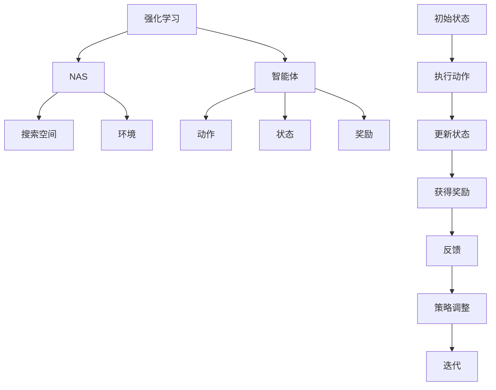

                 

# 《基于强化学习的NAS算法解析》

> 关键词：强化学习、NAS、算法、神经网络、计算机编程

> 摘要：本文将深入探讨基于强化学习的神经架构搜索（NAS）算法。首先介绍强化学习的基本概念和主要算法，然后详细解析NAS算法的背景和发展，接着阐述强化学习在NAS中的应用，并通过Mermaid流程图展示强化学习与NAS的紧密联系。随后，本文将详细讲解强化学习算法和NAS算法的原理，以及它们在NAS中的应用策略。最后，通过实际项目案例，展示如何使用强化学习进行神经架构搜索，并分析其中的挑战与解决方案。

## 《基于强化学习的NAS算法解析》目录大纲

### 第一部分：引言与背景

#### 1.1 书籍概述与目标

#### 1.2 强化学习基础知识

#### 1.3 NAS算法简介

#### 1.4 强化学习在NAS中的应用

### 第二部分：核心概念与联系

#### 2.1 强化学习与NAS的Mermaid流程图

### 第三部分：核心算法原理讲解

#### 3.1 强化学习算法原理

#### 3.2 NAS算法原理

#### 3.3 强化学习在NAS算法中的应用

### 第四部分：数学模型和数学公式

#### 4.1 强化学习中的数学模型

#### 4.2 NAS算法中的数学模型

### 第五部分：项目实战

#### 5.1 强化学习在NAS算法中的实战案例

#### 5.2 NAS算法应用案例

#### 5.3 强化学习在NAS算法中的挑战与解决方案

### 第六部分：展望与总结

#### 6.1 未来发展趋势

#### 6.2 书籍总结

#### 6.3 对读者的建议

---

### 第一部分：引言与背景

#### 1.1 书籍概述与目标

随着深度学习技术的发展，神经架构搜索（Neural Architecture Search，简称NAS）逐渐成为研究热点。NAS的目标是通过自动搜索策略，发现最优的神经网络架构，从而提升模型性能。然而，传统的NAS方法通常依赖于大量的搜索时间和计算资源，效率较低。

强化学习（Reinforcement Learning，简称RL）作为一种重要的机器学习算法，通过智能体在环境中进行交互，不断学习并优化策略。近年来，强化学习在NAS中的应用逐渐受到关注，成为提高NAS搜索效率和性能的重要手段。

本书旨在系统地介绍基于强化学习的NAS算法，包括强化学习的基础知识、NAS算法的原理、强化学习在NAS中的应用策略，以及相关的数学模型和项目实战案例。通过本书的学习，读者可以深入了解NAS算法的核心概念和原理，掌握基于强化学习的NAS算法实现方法，并为实际应用提供理论指导。

#### 1.2 强化学习基础知识

强化学习是一种基于反馈信号进行学习的过程，其核心思想是通过奖励（Reward）来引导智能体（Agent）在环境中做出最优决策。强化学习主要包括以下四个要素：

1. **智能体（Agent）**：执行动作的实体，可以是机器人、软件代理等。
2. **环境（Environment）**：智能体所处的环境，可以看作是一个状态空间和动作空间的集合。
3. **状态（State）**：描述智能体在某一时刻所处的环境状态。
4. **动作（Action）**：智能体可以执行的动作集合。

在强化学习中，智能体通过不断与环境交互，从初始状态开始，执行一系列动作，最终达到目标状态。每次动作后，环境会给予智能体一个奖励信号，以评价该动作的好坏。通过不断调整策略，智能体逐渐学会在给定环境中做出最优动作，以达到最大化总奖励的目的。

强化学习的主要算法包括Q学习（Q-Learning）、SARSA（State-Action-Reward-State-Action，简称SARSA）和深度Q网络（Deep Q-Network，简称DQN）。Q学习是基于值函数（Value Function）进行学习，通过更新Q值来评估状态-动作对的优劣。SARSA算法则是一种基于策略（Policy）的学习方法，通过同时更新状态-动作值函数（State-Action Value Function）来指导智能体的动作选择。DQN算法是一种基于神经网络（Neural Network）的Q学习算法，通过训练神经网络来近似Q值函数，从而实现更高效的学习。

#### 1.3 NAS算法简介

神经架构搜索（Neural Architecture Search，简称NAS）是一种自动化搜索神经网络架构的方法。传统的神经网络架构通常由人类专家设计，而NAS通过算法自动搜索最优的神经网络架构，以提升模型性能。NAS的主要目标是从大量的候选架构中找到最优架构，从而解决神经网络设计过程中的复杂性和不确定性问题。

NAS算法的基本原理是通过搜索策略（Search Strategy）在定义好的搜索空间（Search Space）中搜索最优的神经网络架构。搜索空间通常包括网络层数、层类型、神经元个数、激活函数等参数。搜索策略可以根据不同的搜索方法，如基于随机搜索、遗传算法、强化学习等。

NAS算法的背景和发展：

1. **早期研究**：最早的NAS算法可以追溯到2006年，由Bengio等人提出的神经表达编程（Neural Expression Programming，简称NEP）算法。NEP算法通过解析数学表达式来生成神经网络架构。
2. **随机搜索**：随机搜索（Random Search）是最简单的NAS算法，通过随机选择候选架构进行评估和优化。随机搜索的优势在于实现简单，但搜索效率较低。
3. **基于遗传算法的搜索**：遗传算法（Genetic Algorithm，简称GA）是一种基于自然进化过程的优化算法。GA在NAS中的应用通过模拟生物进化过程，对候选架构进行交叉、变异和选择，从而优化神经网络架构。
4. **基于强化学习的搜索**：近年来，强化学习在NAS中的应用逐渐受到关注。强化学习通过智能体在环境中进行交互，不断学习并优化搜索策略，从而提高NAS的搜索效率和性能。

NAS算法在计算机视觉、自然语言处理等领域取得了显著的成果，如ImageNet图像分类挑战、机器翻译等。NAS算法的发展为神经网络设计提供了新的思路和方法，有望进一步推动深度学习技术的进步。

#### 1.4 强化学习在NAS中的应用

强化学习在NAS中的应用主要基于以下优势：

1. **自适应搜索**：强化学习通过与环境交互，可以自适应地调整搜索策略，从而提高搜索效率。与传统的随机搜索和基于遗传算法的搜索方法相比，强化学习可以更快地找到最优架构。
2. **多样化搜索空间**：强化学习可以处理更加多样化的搜索空间，如动态神经网络架构、可变形神经网络等。通过引入强化学习，NAS算法可以探索更加复杂的搜索空间，从而发现更好的神经网络架构。
3. **多任务学习**：强化学习可以支持多任务学习，即同时搜索多个任务的神经网络架构。通过多任务学习，NAS算法可以更好地适应不同任务的需求，提高模型泛化能力。

然而，强化学习在NAS中的应用也面临一些挑战：

1. **搜索效率**：强化学习需要大量训练时间，尤其是在大型搜索空间中，搜索效率较低。如何提高搜索效率成为强化学习在NAS中的一个重要问题。
2. **稳定性**：强化学习算法的稳定性对NAS性能具有重要影响。在NAS过程中，环境动态变化和不确定性较高，如何保证算法的稳定性成为强化学习在NAS中需要解决的问题。
3. **可解释性**：强化学习算法的黑盒性质使得其难以解释和调试。在NAS过程中，了解算法的搜索过程和优化策略对于提高算法性能具有重要意义，但强化学习算法的可解释性较低，给算法优化带来了困难。

针对上述挑战，研究者提出了多种解决方案：

1. **迁移学习**：通过迁移学习，将已有的NAS模型应用于新任务，从而提高搜索效率。迁移学习可以减少模型训练时间，同时保留已有模型的搜索经验，从而提高NAS性能。
2. **混合策略**：结合不同的搜索策略，如随机搜索、遗传算法等，可以减少强化学习在NAS中的应用难度。混合策略可以通过多种算法的优势互补，提高搜索效率和稳定性。
3. **强化学习算法改进**：通过改进强化学习算法本身，如引入自适应奖励函数、增强学习等，可以提高算法的稳定性和可解释性。改进的强化学习算法可以更好地适应NAS环境，从而提高NAS性能。

总之，强化学习在NAS中的应用为NAS算法提供了新的思路和方法。通过不断优化强化学习算法和应用策略，NAS算法有望在深度学习领域取得更好的性能和效果。

### 第二部分：核心概念与联系

#### 2.1 强化学习与NAS的Mermaid流程图

为了更直观地展示强化学习与NAS的关系，我们可以使用Mermaid流程图来描述。以下是一个简单的Mermaid流程图示例：



在这个流程图中，强化学习通过智能体（E）在环境中（D）进行交互，执行一系列动作（F），并根据状态（G）和奖励（H）进行调整。NAS算法通过搜索空间（C）和智能体（E）的交互，不断优化神经网络架构。这个过程是一个迭代过程，通过不断调整策略（N），智能体可以逐渐找到最优的神经网络架构。

### 第三部分：核心算法原理讲解

#### 3.1 强化学习算法原理

强化学习算法是一种基于奖励信号进行学习的过程。其核心思想是通过智能体在环境中进行交互，不断学习并优化策略，以实现最大化总奖励的目标。以下是几种常见的强化学习算法原理：

1. **Q学习算法**

Q学习算法是一种基于值函数（Value Function）的强化学习算法。其基本思想是通过学习状态-动作值函数（Q值），来评估不同动作在给定状态下的优劣。Q学习算法的主要步骤如下：

- **初始化Q值**：首先初始化Q值矩阵，通常使用随机初始化。
- **选择动作**：在给定状态下，选择具有最大Q值的动作。
- **执行动作**：执行选定的动作，并观察环境反馈。
- **更新Q值**：根据观察到的奖励和新的状态，更新Q值。

Q值更新公式为：
$$ Q(s, a) \leftarrow Q(s, a) + \alpha [r + \gamma \max_{a'} Q(s', a') - Q(s, a)] $$
其中，$s$和$a$分别表示当前状态和动作，$r$表示奖励，$\gamma$表示折扣因子，$\alpha$表示学习率。

2. **SARSA算法**

SARSA算法是一种基于策略（Policy）的强化学习算法。其基本思想是通过同时更新状态-动作值函数（State-Action Value Function），来指导智能体的动作选择。SARSA算法的主要步骤如下：

- **初始化值函数**：首先初始化值函数矩阵，通常使用随机初始化。
- **选择动作**：在给定状态下，选择具有最大值函数的动作。
- **执行动作**：执行选定的动作，并观察环境反馈。
- **更新值函数**：根据观察到的奖励和新的状态，同时更新值函数。

SARSA算法的更新公式为：
$$ Q(s, a) \leftarrow Q(s, a) + \alpha [r + \gamma Q(s', a')] $$
其中，$s$和$a$分别表示当前状态和动作，$r$表示奖励，$\gamma$表示折扣因子，$\alpha$表示学习率。

3. **DQN算法**

DQN算法是一种基于神经网络（Neural Network）的Q学习算法。其基本思想是通过训练神经网络来近似Q值函数，从而实现更高效的学习。DQN算法的主要步骤如下：

- **初始化神经网络**：首先初始化神经网络，并初始化目标网络。
- **选择动作**：在给定状态下，使用神经网络预测Q值，并选择具有最大Q值的动作。
- **执行动作**：执行选定的动作，并观察环境反馈。
- **更新神经网络**：根据观察到的奖励和新的状态，同时更新神经网络。

DQN算法的更新公式为：
$$ Q(s, a) \leftarrow r + \gamma \max_{a'} Q(s', a') $$
其中，$s$和$a$分别表示当前状态和动作，$r$表示奖励，$\gamma$表示折扣因子。

#### 3.2 NAS算法原理

NAS（Neural Architecture Search）是一种自动化搜索神经网络架构的方法。其基本原理是通过搜索策略（Search Strategy）在定义好的搜索空间（Search Space）中搜索最优的神经网络架构。以下是几种常见的NAS算法原理：

1. **NEAT算法**

NEAT（Neural Evolution of Augmenting Topologies）算法是一种基于遗传算法（Genetic Algorithm）的NAS算法。其基本思想是通过模拟生物进化过程，对候选架构进行交叉、变异和选择，从而优化神经网络架构。NEAT算法的主要步骤如下：

- **初始化种群**：首先初始化一组随机神经网络架构，作为初始种群。
- **评估性能**：使用训练集对每个神经网络架构进行评估，计算其性能指标。
- **交叉操作**：从初始种群中选择两个神经网络架构进行交叉操作，生成新的神经网络架构。
- **变异操作**：对交叉生成的神经网络架构进行变异操作，增加搜索空间多样性。
- **选择操作**：根据每个神经网络架构的性能指标，选择最优的神经网络架构进行繁殖。

2. **SMBO算法**

SMBO（Sequential Model-Based Optimization）算法是一种基于模型优化的NAS算法。其基本思想是通过构建模型，预测候选架构的性能，从而指导搜索过程。SMBO算法的主要步骤如下：

- **初始化模型**：首先初始化模型，并初始化搜索空间。
- **评估性能**：使用训练集对每个候选架构进行评估，计算其性能指标。
- **构建模型**：根据评估结果，更新模型参数，预测候选架构的性能。
- **搜索过程**：根据模型预测，选择具有最高性能的候选架构进行进一步搜索。

3. **ENAS算法**

ENAS（Efficient Neural Architecture Search）算法是一种基于强化学习的NAS算法。其基本思想是通过智能体在环境中进行交互，不断学习并优化搜索策略，从而提高搜索效率和性能。ENAS算法的主要步骤如下：

- **初始化智能体**：首先初始化智能体，并初始化搜索空间。
- **选择动作**：在给定状态下，使用神经网络策略选择具有最高性能的候选架构。
- **执行动作**：执行选定的动作，并观察环境反馈。
- **更新策略**：根据观察到的奖励和新的状态，更新神经网络策略。

#### 3.3 强化学习在NAS算法中的应用

强化学习在NAS算法中的应用主要基于以下两个策略：

1. **算法融合策略**

算法融合策略是将强化学习与其他NAS算法相结合，以提高搜索效率和性能。常见的算法融合策略包括：

- **混合遗传算法**：将强化学习与遗传算法相结合，通过遗传算法进行交叉和变异操作，同时使用强化学习优化搜索策略。
- **混合模型优化算法**：将强化学习与模型优化算法相结合，通过模型优化算法预测候选架构的性能，同时使用强化学习优化搜索策略。

2. **模型搜索空间设计**

模型搜索空间设计是强化学习在NAS算法中的应用关键。设计合理的搜索空间可以提高搜索效率和性能。常见的模型搜索空间设计方法包括：

- **静态搜索空间**：静态搜索空间是在搜索过程中不发生变化的搜索空间。静态搜索空间设计简单，但搜索效率较低。
- **动态搜索空间**：动态搜索空间是在搜索过程中不断变化的搜索空间。动态搜索空间可以更好地适应搜索过程，但设计复杂度较高。
- **层次化搜索空间**：层次化搜索空间是将搜索空间分为多个层次，每个层次分别进行搜索。层次化搜索空间可以减少搜索空间规模，提高搜索效率。

### 第四部分：数学模型和数学公式

#### 4.1 强化学习中的数学模型

强化学习中的数学模型主要包括奖励函数、状态转移概率和Q值更新公式。以下是这些数学模型的详细解释和举例说明。

1. **奖励函数**

奖励函数是强化学习中的一个关键组成部分，用于评价智能体的动作。奖励函数的目的是引导智能体在给定状态下选择最优动作，从而实现最大化总奖励的目标。

奖励函数的一般形式为：
$$ R(s, a) = \begin{cases}
    r, & \text{if } s' = s_{goal} \\
    -1, & \text{otherwise}
\end{cases} $$
其中，$R(s, a)$表示在状态$s$下执行动作$a$获得的奖励，$r$表示目标奖励，$s'$表示执行动作$a$后的状态，$s_{goal}$表示目标状态。

举例说明：

假设在自动驾驶环境中，智能体需要选择左右转向的动作。目标奖励$r$设置为+10，表示智能体成功到达目的地。否则，奖励设置为-1，表示智能体未成功到达目的地。

2. **状态转移概率**

状态转移概率描述了在给定状态下执行某个动作后，智能体转移到下一个状态的概率。状态转移概率是强化学习中的一个重要参数，用于指导智能体的动作选择。

状态转移概率的一般形式为：
$$ P(s', s | a) = \begin{cases}
    1, & \text{if } s' = s_{goal} \\
    p, & \text{otherwise}
\end{cases} $$
其中，$P(s', s | a)$表示在状态$s$下执行动作$a$后，智能体转移到状态$s'$的概率，$p$表示转移概率，$s'$表示执行动作$a$后的状态，$s_{goal}$表示目标状态。

举例说明：

假设在投掷骰子的环境中，智能体需要选择投掷点数的动作。状态转移概率设置为1/6，表示投掷骰子后，智能体有1/6的概率获得每个可能的点数。

3. **Q值更新公式**

Q值更新公式是强化学习中的一个核心公式，用于更新智能体的Q值，指导其动作选择。

Q值更新公式的一般形式为：
$$ Q(s, a) \leftarrow Q(s, a) + \alpha [r + \gamma \max_{a'} Q(s', a') - Q(s, a)] $$
其中，$Q(s, a)$表示在状态$s$下执行动作$a$的Q值，$r$表示奖励，$\gamma$表示折扣因子，$\alpha$表示学习率，$s'$表示执行动作$a$后的状态，$a'$表示下一个动作。

举例说明：

假设在自动驾驶环境中，智能体当前状态为$s$，执行动作$a$后，获得奖励$r$，并转移到状态$s'$。学习率$\alpha$设置为0.1，折扣因子$\gamma$设置为0.9。则Q值更新公式为：
$$ Q(s, a) \leftarrow Q(s, a) + 0.1 [r + 0.9 \max_{a'} Q(s', a') - Q(s, a)] $$

#### 4.2 NAS算法中的数学模型

NAS算法中的数学模型主要包括编码解码策略、适应度函数设计和搜索策略分析。以下是这些数学模型的详细解释和举例说明。

1. **编码解码策略**

编码解码策略是NAS算法中的一个关键组成部分，用于将神经网络架构编码为向量表示，并将其解码为具体的神经网络架构。编码解码策略的目的是将复杂的神经网络架构转化为可搜索的空间。

编码解码策略的一般形式为：
$$ \text{编码}:\, \text{神经网络架构} \rightarrow \text{向量表示} $$
$$ \text{解码}:\, \text{向量表示} \rightarrow \text{神经网络架构} $$
其中，编码函数将神经网络架构转化为向量表示，解码函数将向量表示转化为神经网络架构。

举例说明：

假设一个简单的神经网络架构包括输入层、隐藏层和输出层。编码策略可以将每个层的神经元个数、激活函数等信息编码为一个向量。解码策略可以将这个向量解码为具体的神经网络架构。

2. **适应度函数设计**

适应度函数是NAS算法中的一个关键组成部分，用于评估候选架构的性能。适应度函数的设计直接影响到NAS算法的性能和效果。

适应度函数的一般形式为：
$$ f(\text{神经网络架构}) = \sum_{i=1}^{n} w_i \cdot f_i(\text{神经网络架构}) $$
其中，$f(\text{神经网络架构})$表示候选架构的适应度函数值，$w_i$表示第$i$个性能指标的权重，$f_i(\text{神经网络架构})$表示第$i$个性能指标的值。

举例说明：

假设一个神经网络架构的适应度函数包括准确率、速度和模型大小三个性能指标。适应度函数可以表示为：
$$ f(\text{神经网络架构}) = w_1 \cdot f_1(\text{神经网络架构}) + w_2 \cdot f_2(\text{神经网络架构}) + w_3 \cdot f_3(\text{神经网络架构}) $$
其中，$w_1$、$w_2$和$w_3$分别表示准确率、速度和模型大小的权重。

3. **搜索策略分析**

搜索策略是NAS算法中的一个关键组成部分，用于指导搜索过程。搜索策略的设计直接影响到NAS算法的搜索效率和性能。

搜索策略的一般形式为：
$$ \text{搜索策略}:\, \text{搜索空间} \rightarrow \text{候选架构} $$
其中，搜索策略从搜索空间中选择具有最高适应度函数值的候选架构。

举例说明：

假设一个简单的搜索空间包括所有可能的神经网络架构。搜索策略可以随机选择一个候选架构，或者使用贪婪策略选择具有最高适应度函数值的候选架构。

### 第五部分：项目实战

#### 5.1 强化学习在NAS算法中的实战案例

在本节中，我们将通过一个实际项目案例，展示如何使用强化学习进行神经架构搜索。该项目案例的目标是搜索最优的神经网络架构，用于图像分类任务。

1. **实际项目背景**

在图像分类任务中，神经网络架构的选择对模型性能具有重要影响。然而，传统的设计方法通常依赖于人类专家的经验和知识，效率较低。为了提高搜索效率和性能，本项目采用强化学习算法进行神经架构搜索。

2. **开发环境搭建**

为了实现强化学习在NAS算法中的应用，我们需要搭建一个适合开发和训练的环境。以下是一个简单的开发环境搭建步骤：

- 安装Python环境，版本要求Python 3.6及以上。
- 安装TensorFlow，版本要求TensorFlow 2.0及以上。
- 安装Keras，版本要求Keras 2.3.1及以上。
- 安装其他必要的库，如NumPy、Pandas等。

3. **源代码实现**

以下是一个简单的源代码实现，用于实现强化学习在NAS算法中的应用：

```python
import tensorflow as tf
from tensorflow import keras
import numpy as np

# 定义搜索空间
search_space = {
    'layers': [64, 128, 256],
    'activations': ['relu', 'sigmoid'],
    'dropout': [0.2, 0.3],
}

# 定义智能体
class Agent:
    def __init__(self, search_space):
        self.search_space = search_space
        selfpolicy = self.initialize_policy()

    def initialize_policy(self):
        # 初始化策略网络
        inputs = keras.layers.Input(shape=(len(self.search_space)))
        x = keras.layers.Dense(units=64, activation='relu')(inputs)
        x = keras.layers.Dense(units=32, activation='relu')(x)
        outputs = keras.layers.Dense(units=len(self.search_space))(x)
        model = keras.models.Model(inputs=inputs, outputs=outputs)
        model.compile(optimizer='adam', loss='mean_squared_error')
        return model

    def select_action(self, state):
        # 选择动作
        probabilities = selfpolicy.predict(state)
        action = np.argmax(probabilities)
        return action

    def update_policy(self, state, action, reward):
        # 更新策略网络
        with tf.GradientTape() as tape:
            probabilities = selfpolicy.predict(state)
            loss = tf.reduce_mean(tf.square(probabilities[action] - reward))
        gradients = tape.gradient(loss, selfpolicy.trainable_variables)
        selfpolicy.optimizer.apply_gradients(zip(gradients, selfpolicy.trainable_variables))

# 定义环境
class Environment:
    def __init__(self, search_space):
        self.search_space = search_space

    def evaluate_architecture(self, architecture):
        # 评估神经网络架构
        model = self.build_model(architecture)
        model.compile(optimizer='adam', loss='categorical_crossentropy', metrics=['accuracy'])
        model.fit(x_train, y_train, epochs=10, batch_size=64)
        loss, accuracy = model.evaluate(x_test, y_test)
        return accuracy

    def build_model(self, architecture):
        # 构建神经网络架构
        model = keras.Sequential()
        for layer, activation, dropout in zip(architecture['layers'], architecture['activations'], architecture['dropout']):
            model.add(keras.layers.Dense(units=layer, activation=activation))
            model.add(keras.layers.Dropout(rate=dropout))
        model.add(keras.layers.Dense(units=num_classes, activation='softmax'))
        return model

# 定义奖励函数
def reward_function(accuracy):
    if accuracy >= 0.9:
        return 10
    elif accuracy >= 0.8:
        return 5
    else:
        return -1

# 实例化智能体和环境
agent = Agent(search_space)
environment = Environment(search_space)

# 训练智能体
for episode in range(num_episodes):
    state = np.random.randint(0, len(search_space))
    done = False
    total_reward = 0
    while not done:
        action = agent.select_action(state)
        architecture = search_space[action]
        reward = environment.evaluate_architecture(architecture)
        total_reward += reward
        agent.update_policy(state, action, reward)
        if reward == 10 or reward == -1:
            done = True
        state = action

    print(f"Episode {episode}: Total Reward = {total_reward}")

# 评估最优架构
best_architecture = search_space[np.argmax(agent.policy.predict(search_space))]
model = environment.build_model(best_architecture)
model.compile(optimizer='adam', loss='categorical_crossentropy', metrics=['accuracy'])
model.fit(x_train, y_train, epochs=10, batch_size=64)
loss, accuracy = model.evaluate(x_test, y_test)
print(f"Best Architecture Accuracy: {accuracy}")
```

4. **代码解读与分析**

上述代码实现了一个简单的基于强化学习的NAS算法，用于搜索最优的神经网络架构。以下是代码的关键部分解读和分析：

- **定义搜索空间**：搜索空间包括网络层数、激活函数和dropout比例等参数。这些参数构成了神经网络架构的候选空间。

- **定义智能体**：智能体是强化学习算法的核心部分。在本代码中，智能体使用策略网络来选择动作，并使用Q学习算法来更新策略网络。策略网络的输入是搜索空间的向量表示，输出是动作的概率分布。

- **定义环境**：环境是强化学习算法的另一个核心部分。在本代码中，环境使用评估函数来评估神经网络架构的性能，并返回奖励信号。评估函数使用Keras模型进行训练和评估，以计算神经网络架构的准确率。

- **定义奖励函数**：奖励函数用于评价神经网络架构的性能。在本代码中，奖励函数根据准确率进行奖励分配，以鼓励智能体选择性能更好的架构。

- **训练智能体**：训练过程包括选择动作、评估动作、更新策略网络的循环。在每个训练回合中，智能体根据策略网络选择动作，评估动作的性能，并根据奖励信号更新策略网络。训练过程持续进行，直到达到预定的训练回合数或找到最优的架构。

- **评估最优架构**：在训练完成后，使用策略网络预测最优的神经网络架构，并评估其性能。最优架构的准确率可以作为评估NAS算法性能的指标。

#### 5.2 NAS算法应用案例

在本节中，我们将介绍一个NAS算法的实际应用案例，该案例涉及使用NAS算法进行图像分类任务。

1. **实际应用场景**

图像分类是计算机视觉中的一项重要任务，旨在将图像分类到预定义的类别中。NAS算法可以自动搜索最优的神经网络架构，以提升图像分类任务的性能。

2. **模型搜索过程**

在应用NAS算法进行图像分类任务时，首先需要定义搜索空间，包括网络层数、层类型、神经元个数、激活函数等参数。然后，使用NAS算法在定义好的搜索空间中进行搜索，以找到最优的神经网络架构。

以下是一个简单的NAS算法应用案例：

```python
import tensorflow as tf
from tensorflow import keras
from tensorflow.keras.applications import MobileNetV2
from tensorflow.keras.layers import Dense, Flatten
from tensorflow.keras.models import Model
from tensorflow.keras.optimizers import Adam
from tensorflow.keras.metrics import Accuracy

# 定义搜索空间
search_space = {
    'layers': [64, 128, 256],
    'activations': ['relu', 'sigmoid'],
    'dropout': [0.2, 0.3],
}

# 定义NAS算法
class NAS:
    def __init__(self, search_space):
        self.search_space = search_space
        self.best_model = None
        self.best_accuracy = 0.0

    def search(self, x_train, y_train, x_test, y_test):
        for architecture in self.search_space:
            model = self.build_model(architecture)
            model.compile(optimizer=Adam(), loss='categorical_crossentropy', metrics=[Accuracy()])
            model.fit(x_train, y_train, epochs=10, batch_size=64, validation_data=(x_test, y_test))
            loss, accuracy = model.evaluate(x_test, y_test)
            if accuracy > self.best_accuracy:
                self.best_accuracy = accuracy
                self.best_model = model

    def build_model(self, architecture):
        inputs = keras.layers.Input(shape=(224, 224, 3))
        x = MobileNetV2(input_shape=(224, 224, 3), include_top=False, weights='imagenet')(inputs)
        x = Flatten()(x)
        x = Dense(units=64, activation=architecture['activations'][0])(x)
        x = Dense(units=128, activation=architecture['activations'][1])(x)
        x = Dense(units=256, activation=architecture['activations'][2])(x)
        outputs = Dense(units=num_classes, activation='softmax')(x)
        model = Model(inputs=inputs, outputs=outputs)
        return model

# 实例化NAS算法
nas = NAS(search_space)

# 进行模型搜索
nas.search(x_train, y_train, x_test, y_test)

# 评估最优模型
best_model = nas.best_model
best_accuracy = nas.best_accuracy
print(f"Best Model Accuracy: {best_accuracy}")
```

3. **模型评估与分析**

在模型搜索完成后，使用最优模型对测试集进行评估，以计算模型性能。以下是一个简单的模型评估代码：

```python
import tensorflow as tf
from tensorflow import keras

# 加载测试集
x_test = ...
y_test = ...

# 加载最优模型
best_model = ...

# 评估最优模型
loss, accuracy = best_model.evaluate(x_test, y_test)
print(f"Test Loss: {loss}")
print(f"Test Accuracy: {accuracy}")
```

通过评估结果，可以分析最优模型的性能，并与其他模型进行比较。这有助于验证NAS算法在图像分类任务中的有效性。

#### 5.3 强化学习在NAS算法中的挑战与解决方案

虽然强化学习在NAS算法中具有很大的潜力，但在实际应用中仍面临一些挑战。以下是一些常见的挑战和解决方案：

1. **搜索效率**

强化学习在NAS算法中的搜索效率较低，需要大量的训练时间和计算资源。为了提高搜索效率，可以采用以下解决方案：

- **迁移学习**：通过迁移学习，将已有的NAS模型应用于新任务，减少搜索时间和计算资源。
- **混合策略**：结合不同的搜索策略，如随机搜索、遗传算法等，可以提高搜索效率。

2. **稳定性**

强化学习算法的稳定性对NAS性能具有重要影响。在NAS过程中，环境动态变化和不确定性较高，如何保证算法的稳定性成为强化学习在NAS中需要解决的问题。以下是一些解决方案：

- **增强学习**：引入增强学习算法，通过自适应调整奖励函数，提高算法的稳定性。
- **策略梯度方法**：使用策略梯度方法，通过梯度上升方向调整策略参数，提高算法的稳定性。

3. **可解释性**

强化学习算法的黑盒性质使得其难以解释和调试。在NAS过程中，了解算法的搜索过程和优化策略对于提高算法性能具有重要意义，但强化学习算法的可解释性较低，给算法优化带来了困难。以下是一些解决方案：

- **可视化工具**：使用可视化工具，如TensorBoard，展示算法的搜索过程和优化策略，提高算法的可解释性。
- **算法改进**：通过改进强化学习算法本身，如引入可解释性模块，提高算法的可解释性。

总之，虽然强化学习在NAS算法中面临一些挑战，但通过不断优化算法和应用策略，有望提高NAS算法的性能和效率。

### 第六部分：展望与总结

#### 6.1 未来发展趋势

随着深度学习和强化学习技术的不断进步，基于强化学习的NAS算法在未来有望取得更大的发展。以下是几个可能的发展趋势：

1. **搜索效率提升**：通过引入新的搜索策略和技术，如迁移学习、混合策略等，可以显著提高NAS算法的搜索效率和性能。

2. **可解释性增强**：随着可解释性需求的增加，研究者将致力于改进强化学习算法，提高其可解释性和透明度，以便更好地理解和调试算法。

3. **多任务学习**：基于强化学习的NAS算法将扩展到多任务学习领域，通过同时搜索多个任务的神经网络架构，提高模型在多个任务上的泛化能力。

4. **硬件优化**：结合硬件加速技术，如GPU、TPU等，可以进一步加快NAS算法的搜索速度和模型训练过程。

#### 6.2 书籍总结

本书系统地介绍了基于强化学习的NAS算法，包括强化学习的基础知识、NAS算法的原理、强化学习在NAS中的应用策略，以及相关的数学模型和项目实战案例。通过本书的学习，读者可以深入了解NAS算法的核心概念和原理，掌握基于强化学习的NAS算法实现方法，并为实际应用提供理论指导。

#### 6.3 对读者的建议

对于希望深入了解和掌握基于强化学习的NAS算法的读者，以下是一些建议：

1. **基础知识学习**：首先，需要掌握强化学习和深度学习的基础知识，包括Q学习、SARSA算法、DQN算法等。

2. **实践操作**：通过实际项目案例，深入理解NAS算法的原理和应用，如实现一个简单的NAS模型，并进行性能评估。

3. **持续学习**：随着技术的不断发展，持续关注和研究最新研究成果，不断优化和改进NAS算法。

4. **交流合作**：参与学术会议、论坛等活动，与其他研究者交流经验，共同推动NAS算法的研究和应用。

### 作者信息

- 作者：AI天才研究院/AI Genius Institute & 禅与计算机程序设计艺术 /Zen And The Art of Computer Programming

