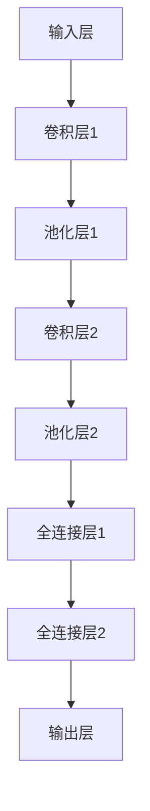

                 

### 文章标题

**《基础模型的图像应用》**

---

### 关键词

- 图像识别
- 卷积神经网络（CNN）
- 深度学习
- 梯度下降算法
- 数学模型
- 项目实战

---

### 摘要

本文旨在深入探讨基础模型的图像应用，尤其是卷积神经网络（CNN）在图像识别领域的应用。文章首先介绍了图像识别技术的发展历程、传统技术与深度学习的对比以及应用场景。接着，详细解析了CNN的架构与原理，通过Mermaid流程图和伪代码展示了CNN的工作流程。文章还涵盖了梯度下降算法的原理、数学公式以及优化方法，并针对激活函数与损失函数进行了详细讲解。此外，文章通过实际项目实战展示了如何将CNN应用于图像分类和目标检测，并分析了训练过程中常见的问题与解决方案。最后，文章总结了图像识别技术的发展趋势，并提出了读者建议，旨在帮助读者更好地理解和应用图像识别技术。

---

### 第一部分：基础模型的概述

#### 第1章：图像识别基础模型概述

#### 1.1 图像识别技术简史

图像识别技术作为计算机视觉领域的一个重要分支，其发展历程可以追溯到20世纪50年代。早期的研究主要集中在基于特征的手动提取方法上，如边缘检测、角点检测和纹理分析等。这些方法依赖于人工设计的特征，存在计算复杂度高、识别率较低等问题。随着计算机硬件性能的提升和算法的进步，20世纪80年代出现了基于模板匹配的图像识别技术。这种方法通过比较待识别图像与已知模板之间的相似度来进行分类，但模板库的建立和维护较为繁琐。

真正推动图像识别技术变革的是深度学习的兴起。2006年，加拿大多伦多大学的Hinton等人提出了深度信念网络（DBN），这是深度学习的早期代表。随后，2012年，AlexNet的问世标志着深度学习在图像识别领域取得了突破性的成果。AlexNet是一个基于卷积神经网络（CNN）的模型，它在ImageNet图像识别挑战赛上取得了显著的胜利，将识别准确率从约25%提升至约80%。

深度学习在图像识别领域的成功主要得益于其强大的特征提取能力和高度的非线性表示能力。通过多层神经网络，深度学习模型能够自动从大量数据中学习到丰富的特征表示，这使得图像识别任务不再需要人工设计特征，从而提高了识别效率和准确性。

#### 1.2 基础图像识别模型

**什么是卷积神经网络（CNN）**

卷积神经网络（Convolutional Neural Network，CNN）是一种特殊的神经网络，它通过模仿生物视觉系统的工作方式来处理图像数据。CNN的核心是卷积层，它能够自动从输入图像中提取局部特征，并通过逐层组合形成丰富的全局特征表示。

**CNN的架构与原理**

一个典型的CNN结构通常包括以下几个部分：

1. **输入层**：接收原始图像数据，并将其传递给卷积层。
2. **卷积层**：通过卷积操作从输入图像中提取特征，卷积核（filter）在图像上滑动，计算局部特征。
3. **激活函数**：通常使用ReLU（Rectified Linear Unit）函数，将卷积层的输出进行非线性变换。
4. **池化层**：通过池化操作（如最大池化或平均池化）降低特征图的维度，减少模型参数数量。
5. **全连接层**：将池化层输出的特征图进行扁平化，然后通过全连接层进行分类或回归。
6. **输出层**：根据任务需求，输出分类结果或回归值。

**CNN在图像识别中的优势**

1. **自动特征提取**：CNN能够自动从大量数据中学习到有效的特征表示，无需人工设计特征。
2. **层次化特征表示**：通过多层卷积和池化操作，CNN能够构建层次化的特征表示，从底层到高层逐步提取图像的语义信息。
3. **参数共享**：卷积操作中的卷积核是共享的，同一个卷积核对整个图像进行卷积，这大大减少了模型参数的数量。
4. **高效率**：CNN在计算上具有高效性，特别是对于大规模图像数据处理，通过并行计算和GPU加速，CNN可以显著提高处理速度。

#### 1.3 深层神经网络与梯度下降算法

**梯度下降算法的原理**

梯度下降算法是一种用于求解最小值问题的优化方法，其核心思想是通过不断调整参数，使得损失函数逐渐减小，最终找到损失函数的最小值点。在神经网络中，梯度下降算法用于更新网络权重，以最小化模型预测误差。

梯度下降算法的基本步骤如下：

1. **前向传播**：计算输入数据通过网络后的预测值。
2. **计算损失函数**：计算预测值与实际值之间的差异。
3. **反向传播**：通过反向传播算法计算网络权重的梯度。
4. **参数更新**：根据梯度方向和步长，更新网络权重。
5. **重复步骤2-4**，直到满足停止条件（如损失函数收敛到某个阈值）。

**梯度下降算法的改进方法**

1. **动量（Momentum）**：引入动量项，使得梯度方向上的更新能够持续，避免陷入局部最小值。
2. **学习率衰减（Learning Rate Decay）**：随着训练的进行，逐渐减小学习率，以防止参数更新过快。
3. **随机梯度下降（Stochastic Gradient Descent，SGD）**：在每个训练样本上进行参数更新，相比批量梯度下降（Batch Gradient Descent），SGD能够更快地收敛。
4. **自适应学习率方法（如Adam）**：自动调整学习率，提高优化效率。

**梯度消失与梯度爆炸问题及解决方案**

在深度神经网络中，梯度消失和梯度爆炸是常见的问题。梯度消失指的是梯度值变得非常小，导致参数无法更新；梯度爆炸则是梯度值变得非常大，同样导致参数更新失败。

**梯度消失问题**：

1. **深层网络中的非线性激活函数**：如Sigmoid和Tanh函数，这些函数在输入接近0时梯度值接近0。
2. **反向传播过程中的特征值**：随着反向传播的层数增加，特征值可能会被不断缩小，导致梯度值减小。

**解决方案**：

1. **使用ReLU激活函数**：ReLU函数在输入为负值时梯度为0，但在输入为正值时梯度为1，这避免了梯度消失问题。
2. **梯度裁剪（Gradient Clip）**：对梯度值进行裁剪，限制其最大或最小值，防止梯度爆炸。

**梯度爆炸问题**：

1. **深度神经网络中的特征值**：随着反向传播的层数增加，特征值可能会被不断放大，导致梯度值增大。

**解决方案**：

1. **梯度裁剪**：同样适用于梯度爆炸问题，通过限制梯度值的大小，避免参数更新过大。
2. **正确初始化参数**：通过合理初始化网络权重，减少特征值的初始放大效应。

---

### 第二部分：核心概念与联系

#### 第2章：核心概念与联系

##### 2.1 卷积神经网络（CNN）的Mermaid流程图

下面是卷积神经网络（CNN）的Mermaid流程图，展示了从输入层到输出层的整个数据处理流程：



**卷积层的操作**：

卷积层通过卷积操作从输入图像中提取特征。每个卷积核（filter）在图像上滑动，计算局部特征。卷积操作的数学公式如下：

$$
\text{output}_{ij} = \sum_{k,l} \text{filter}_{kl} \cdot \text{input}_{i+k, j+l}
$$

其中，$\text{output}_{ij}$是卷积层的输出值，$\text{filter}_{kl}$是卷积核的值，$\text{input}_{i+k, j+l}$是输入图像的局部值。

**池化层的操作**：

池化层通过下采样操作减少特征图的维度。最常用的池化方法是最大池化（Max Pooling），其数学公式如下：

$$
\text{output}_{i,j} = \max_{k,l} \text{input}_{i+k, j+l}
$$

其中，$\text{output}_{i,j}$是池化层的输出值，$\text{input}_{i+k, j+l}$是输入图像的局部值。

**全连接层的操作**：

全连接层通过全连接操作将特征图展开为一维向量，然后进行线性变换。全连接层的数学公式如下：

$$
\text{output}_{i} = \sum_{j} \text{weight}_{ij} \cdot \text{input}_{j} + \text{bias}_{i}
$$

其中，$\text{output}_{i}$是全连接层的输出值，$\text{weight}_{ij}$是权重值，$\text{input}_{j}$是输入值，$\text{bias}_{i}$是偏置值。

##### 2.2 深层神经网络与梯度下降算法

**梯度下降算法的原理**

梯度下降算法是一种优化方法，用于最小化损失函数。其基本思想是沿着损失函数的梯度方向更新参数，以逐步减小损失。

梯度下降算法的步骤如下：

1. **前向传播**：计算输入数据的输出值。
2. **计算损失**：计算输出值与实际值之间的差异，得到损失函数。
3. **反向传播**：计算损失函数关于参数的梯度。
4. **更新参数**：根据梯度方向和步长更新参数。
5. **重复步骤2-4**，直到满足停止条件。

**梯度下降算法的数学公式**

梯度下降算法的数学公式可以表示为：

$$
\text{weight}_{new} = \text{weight}_{old} - \alpha \cdot \nabla_{\text{weight}} L
$$

$$
\text{bias}_{new} = \text{bias}_{old} - \alpha \cdot \nabla_{\text{bias}} L
$$

其中，$\text{weight}_{new}$和$\text{weight}_{old}$分别是新权重和旧权重，$\alpha$是学习率，$L$是损失函数，$\nabla_{\text{weight}} L$和$\nabla_{\text{bias}} L$分别是权重和偏置的梯度。

**梯度下降算法的改进方法**

1. **动量（Momentum）**：

动量是一种加速梯度下降的方法，通过引入动量项，使得参数的更新方向持续，从而加快收敛速度。

$$
\text{velocity}_{t} = \beta \cdot \text{velocity}_{t-1} + (1 - \beta) \cdot \nabla_{\text{weight}} L
$$

$$
\text{weight}_{new} = \text{weight}_{old} - \alpha \cdot \text{velocity}_{t}
$$

其中，$\text{velocity}_{t}$是动量项，$\beta$是动量系数。

2. **自适应学习率（Adam）**：

Adam是一种自适应的学习率优化方法，通过同时考虑一阶矩估计（均值）和二阶矩估计（方差），自适应调整学习率。

$$
\text{m}_t = \beta_1 \cdot \text{m}_{t-1} + (1 - \beta_1) \cdot \nabla_{\text{weight}} L
$$

$$
\text{v}_t = \beta_2 \cdot \text{v}_{t-1} + (1 - \beta_2) \cdot (\nabla_{\text{weight}} L)^2
$$

$$
\text{weight}_{new} = \text{weight}_{old} - \alpha \cdot \frac{\text{m}_t}{\sqrt{\text{v}_t} + \epsilon}
$$

其中，$\text{m}_t$和$\text{v}_t$分别是均值和方差估计，$\beta_1$和$\beta_2$分别是动量系数，$\alpha$是学习率，$\epsilon$是常数项。

**梯度消失与梯度爆炸问题及解决方案**

1. **梯度消失问题**：

梯度消失是指梯度值变得非常小，导致参数无法有效更新。在深度神经网络中，梯度消失主要发生在以下情况：

- 深层网络的非线性激活函数，如Sigmoid和Tanh函数，其梯度在输入接近0时接近0，导致梯度消失。
- 反向传播过程中的特征值被不断缩小，导致梯度值减小。

**解决方案**：

- 使用ReLU激活函数，其梯度在输入为正值时为1，避免了梯度消失问题。
- 使用正则化技术，如L1和L2正则化，可以在一定程度上缓解梯度消失问题。

2. **梯度爆炸问题**：

梯度爆炸是指梯度值变得非常大，导致参数更新失败。在深度神经网络中，梯度爆炸主要发生在以下情况：

- 深层网络的反向传播过程中，特征值被不断放大，导致梯度值增大。
- 参数初始化不合理，导致特征值放大效应加剧。

**解决方案**：

- 使用梯度裁剪技术，通过限制梯度值的大小，避免梯度爆炸问题。
- 合理初始化参数，通过随机初始化权重和偏置，避免特征值放大效应。

---

### 第三部分：核心算法原理讲解

#### 第3章：核心算法原理讲解

##### 3.1 卷积神经网络（CNN）的伪代码讲解

卷积神经网络（CNN）是一种在图像识别领域广泛应用的深度学习模型，其核心组成部分包括卷积层、池化层和全连接层。以下是基于Python的CNN的伪代码讲解：

**卷积层伪代码**

```python
def conv2d(input, filters, kernel_size, stride):
    # 实现卷积操作
    output = Conv2D(filters=filters, kernel_size=kernel_size, strides=stride)(input)
    return output
```

在这个函数中，`input` 是输入图像，`filters` 是卷积核的数量，`kernel_size` 是卷积核的大小，`stride` 是卷积步长。函数返回卷积操作后的输出。

**池化层伪代码**

```python
def max_pooling2d(input, pool_size, stride):
    # 实现最大池化操作
    output = MaxPooling2D(pool_size=pool_size, strides=stride)(input)
    return output
```

在这个函数中，`input` 是输入图像，`pool_size` 是池化窗口的大小，`stride` 是池化步长。函数返回最大池化操作后的输出。

**全连接层伪代码**

```python
def dense(input, units, activation):
    # 实现全连接层操作
    output = Dense(units=units, activation=activation)(input)
    return output
```

在这个函数中，`input` 是输入图像，`units` 是全连接层的神经元数量，`activation` 是激活函数。函数返回全连接层操作后的输出。

##### 3.2 深层神经网络训练策略

在训练深层神经网络时，以下策略可以帮助提高模型的性能和稳定性：

**数据增强**

数据增强是一种通过增加训练数据多样性来提高模型泛化能力的方法。常用的数据增强技术包括：

- 随机裁剪：从原始图像中随机裁剪出不同大小和位置的图像块。
- 随机旋转：将图像随机旋转一定角度。
- 随机缩放：将图像随机缩放到不同的尺度。
- 对比度调整：随机调整图像的对比度。

**权重初始化**

权重初始化是训练深层神经网络的重要步骤，合理的初始化方法可以加快模型的收敛速度。常用的权重初始化方法包括：

- 随机初始化：将权重随机初始化为一个较小的值。
- 高斯初始化：将权重初始化为服从高斯分布的随机值。
- Xavier初始化：根据神经网络层数和神经元数量，自适应地初始化权重。

**正则化技术**

正则化技术可以防止模型过拟合，提高模型的泛化能力。常用的正则化技术包括：

- L1正则化：在损失函数中添加权重绝对值之和的项。
- L2正则化：在损失函数中添加权重平方之和的项。
- Dropout：在训练过程中随机丢弃一部分神经元，减少模型对特定神经元依赖。

**批量归一化**

批量归一化（Batch Normalization）是一种通过标准化神经元激活值来提高训练稳定性的方法。批量归一化的公式如下：

$$
\hat{x} = \frac{x - \mu}{\sqrt{\sigma^2 + \epsilon}}
$$

其中，$\hat{x}$ 是标准化后的激活值，$x$ 是原始激活值，$\mu$ 是当前批次激活值的均值，$\sigma$ 是当前批次激活值的标准差，$\epsilon$ 是一个很小的常数。

**优化器**

优化器是用于更新模型参数的工具，常用的优化器包括：

- 随机梯度下降（SGD）：每次更新参数时使用整个训练集的平均梯度。
- Adam优化器：结合SGD和动量，自适应调整学习率。

---

### 第四部分：数学模型与公式讲解

#### 第4章：数学模型与公式讲解

深度学习中的数学模型和公式是理解神经网络工作原理的基础。在这一章节中，我们将详细讲解激活函数、损失函数以及梯度下降算法的数学公式，并给出相应的例子来说明这些公式在实际中的应用。

##### 4.1 激活函数与损失函数

**激活函数的类型与选择**

激活函数是神经网络中的关键组件，它引入了非线性特性，使得神经网络能够建模复杂的数据。以下是一些常用的激活函数及其数学表示：

1. **Sigmoid函数**：

$$
f(x) = \frac{1}{1 + e^{-x}}
$$

Sigmoid函数将输入映射到(0,1)区间，常用于二分类问题。

2. **Tanh函数**：

$$
f(x) = \frac{e^x - e^{-x}}{e^x + e^{-x}}
$$

Tanh函数将输入映射到(-1,1)区间，相对于Sigmoid函数，Tanh函数在输出0附近梯度较大，有助于训练。

3. **ReLU函数**：

$$
f(x) = \max(0, x)
$$

ReLU函数在输入为正时返回输入值，为负时返回0，这种性质使得ReLU函数在训练过程中更加稳定。

4. **Leaky ReLU函数**：

$$
f(x) = \begin{cases} 
x & \text{if } x > 0 \\
\alpha x & \text{if } x \leq 0 
\end{cases}
$$

Leaky ReLU函数在ReLU函数的基础上加入了一个很小的斜率$\alpha$，避免了神经元死亡的问题。

**损失函数的类型与选择**

损失函数用于衡量模型预测值与真实值之间的差异，是优化过程中的关键组成部分。以下是一些常用的损失函数及其数学表示：

1. **均方误差（MSE）**：

$$
L(y, \hat{y}) = \frac{1}{2} \sum_{i} (y_i - \hat{y}_i)^2
$$

MSE损失函数用于回归问题，其中$y$是真实值，$\hat{y}$是预测值。

2. **交叉熵损失函数**：

$$
L(y, \hat{y}) = -\sum_{i} y_i \log(\hat{y}_i)
$$

交叉熵损失函数用于分类问题，特别是多分类问题，其中$y$是真实标签，$\hat{y}$是预测概率。

3. **对数损失函数**：

$$
L(y, \hat{y}) = \frac{1}{N} \sum_{i=1}^{N} -y_i \log(\hat{y}_i)
$$

对数损失函数是交叉熵损失函数的一个变种，用于处理多分类问题。

**激活函数与损失函数在CNN中的作用**

激活函数和损失函数在卷积神经网络中起着至关重要的作用。激活函数引入了非线性特性，使得网络能够建模复杂的数据，而损失函数则用于指导网络优化过程，使得网络能够更准确地预测目标。

1. **激活函数**：

激活函数使神经网络能够在不同层次上提取特征，从而形成层次化的特征表示。例如，ReLU函数在训练过程中能够加速收敛，避免梯度消失问题。

2. **损失函数**：

损失函数定义了网络优化过程中的目标，它使得网络能够通过反向传播算法自动调整权重和偏置，以达到最小化损失的目的。

##### 4.2 梯度下降算法的数学公式

梯度下降算法是训练神经网络的常用优化方法，其核心思想是通过计算损失函数关于模型参数的梯度，并沿着梯度的反方向更新参数，以最小化损失函数。

**梯度下降算法的步骤**：

1. **前向传播**：

计算输入数据经过网络后的输出值，并计算损失函数。

2. **计算梯度**：

通过反向传播算法计算损失函数关于模型参数的梯度。

3. **更新参数**：

根据梯度和学习率更新模型参数。

4. **重复步骤1-3**，直到满足停止条件（如损失函数收敛到某个阈值）。

**梯度下降算法的数学公式**：

1. **批量梯度下降**：

$$
\theta_{new} = \theta_{old} - \alpha \cdot \nabla_\theta J(\theta)
$$

其中，$\theta$ 是模型参数，$\alpha$ 是学习率，$J(\theta)$ 是损失函数。

2. **随机梯度下降（SGD）**：

$$
\theta_{new} = \theta_{old} - \alpha \cdot \nabla_\theta J(\theta; x_i, y_i)
$$

SGD在每个迭代步骤中使用单个样本的梯度来更新参数，这可以加速收敛。

3. **小批量梯度下降（Mini-batch Gradient Descent）**：

$$
\theta_{new} = \theta_{old} - \alpha \cdot \nabla_\theta J(\theta; \{x_1, x_2, ..., x_n\}, \{y_1, y_2, ..., y_n\})
$$

小批量梯度下降是SGD的一个变种，每个迭代步骤中使用一个小批量（如32或64个样本）的梯度来更新参数。

**梯度下降算法的优化方法**：

1. **动量（Momentum）**：

$$
v_t = \beta \cdot v_{t-1} + (1 - \beta) \cdot \nabla_\theta J(\theta)
$$

$$
\theta_{new} = \theta_{old} - \alpha \cdot v_t
$$

动量方法结合了多个梯度方向，可以加速收敛并避免局部最小值。

2. **自适应学习率（Adam）**：

$$
m_t = \beta_1 \cdot m_{t-1} + (1 - \beta_1) \cdot \nabla_\theta J(\theta)
$$

$$
v_t = \beta_2 \cdot v_{t-1} + (1 - \beta_2) \cdot (\nabla_\theta J(\theta))^2
$$

$$
\theta_{new} = \theta_{old} - \alpha \cdot \frac{m_t}{\sqrt{v_t} + \epsilon}
$$

Adam是一种自适应学习率的方法，结合了SGD和动量的优点。

**例子**：

假设我们有一个简单的线性回归模型，其损失函数为MSE，训练数据为$\{x_1, x_2, ..., x_n\}$和相应的标签$\{y_1, y_2, ..., y_n\}$。

1. **前向传播**：

$$
\hat{y} = \theta_0 + \theta_1 \cdot x
$$

$$
L = \frac{1}{2} \sum_{i=1}^{n} (\hat{y}_i - y_i)^2
$$

2. **计算梯度**：

$$
\nabla_\theta L = \sum_{i=1}^{n} (\hat{y}_i - y_i) \cdot x_i
$$

3. **更新参数**：

$$
\theta_{new} = \theta_{old} - \alpha \cdot \nabla_\theta L
$$

通过上述步骤，我们可以使用梯度下降算法更新模型的参数，以达到最小化损失函数的目的。

---

### 第五部分：项目实战

#### 第5章：项目实战

在本章节中，我们将通过实际项目实战来展示如何将卷积神经网络（CNN）应用于图像分类和目标检测任务。每个项目都将从背景、数据集收集与预处理、模型搭建与训练、模型评估与优化等方面进行详细讲解。

##### 5.1 图像分类项目实战

**项目背景与目标**

图像分类是计算机视觉领域的一个基础任务，其目标是将图像分配到预定义的类别中。本项目的目标是使用CNN对自然场景图像进行分类，识别出不同的物体类别。

**数据集的收集与预处理**

我们将使用开源的ImageNet数据集，该数据集包含数以百万计的带标签的图像，分为1000个不同的类别。数据预处理步骤包括：

- 数据下载：从ImageNet官方网站下载训练集和验证集。
- 标签处理：将图像文件与其对应的标签进行匹配。
- 数据增强：对图像进行随机裁剪、旋转、翻转等操作，增加数据多样性。

**模型搭建与训练**

我们将使用Keras框架搭建一个基于CNN的图像分类模型。以下是模型的结构和训练步骤：

1. **模型结构**：

```python
from keras.models import Sequential
from keras.layers import Conv2D, MaxPooling2D, Flatten, Dense

model = Sequential()
model.add(Conv2D(32, (3, 3), activation='relu', input_shape=(224, 224, 3)))
model.add(MaxPooling2D(pool_size=(2, 2)))
model.add(Conv2D(64, (3, 3), activation='relu'))
model.add(MaxPooling2D(pool_size=(2, 2)))
model.add(Flatten())
model.add(Dense(128, activation='relu'))
model.add(Dense(1000, activation='softmax'))
```

2. **模型编译**：

```python
model.compile(optimizer='adam', loss='categorical_crossentropy', metrics=['accuracy'])
```

3. **模型训练**：

```python
model.fit(x_train, y_train, batch_size=32, epochs=10, validation_data=(x_val, y_val))
```

**模型评估与优化**

在完成模型训练后，我们将使用验证集对模型进行评估。以下是评估步骤：

1. **评估指标**：

```python
loss, accuracy = model.evaluate(x_val, y_val)
print('Validation loss:', loss)
print('Validation accuracy:', accuracy)
```

2. **模型优化**：

为了进一步提高模型的性能，我们可以尝试以下方法：

- 调整网络结构：增加或减少卷积层和全连接层的数量。
- 调整学习率：使用学习率调整策略（如学习率衰减）。
- 使用预训练模型：利用预训练的模型作为起点，进行迁移学习。

##### 5.2 目标检测项目实战

**项目背景与目标**

目标检测是计算机视觉领域的一个重要任务，其目标是在图像中定位和识别多个物体。本项目的目标是使用Faster R-CNN模型进行目标检测，识别出图像中的物体。

**数据集的收集与预处理**

我们将使用COCO数据集，该数据集包含大量的带标注的图像，用于目标检测任务的训练和验证。

**模型搭建与训练**

Faster R-CNN模型由两个子网络组成：区域提议网络（Region Proposal Network，RPN）和分类网络（Region of Interest，ROI）。以下是模型的结构和训练步骤：

1. **模型结构**：

```python
from keras.models import Model
from keras.layers import Input, Conv2D, MaxPooling2D, Flatten, Dense, Reshape

input_image = Input(shape=(224, 224, 3))
conv_1 = Conv2D(32, (3, 3), activation='relu')(input_image)
pool_1 = MaxPooling2D(pool_size=(2, 2))(conv_1)
conv_2 = Conv2D(64, (3, 3), activation='relu')(pool_1)
pool_2 = MaxPooling2D(pool_size=(2, 2))(conv_2)
rpn = RPN()(pool_2)
roi = Flatten()(rpn)
class_output = Dense(1000, activation='softmax')(roi)
model = Model(inputs=input_image, outputs=class_output)

# RPN 的实现细节略
```

2. **模型编译**：

```python
model.compile(optimizer='adam', loss='categorical_crossentropy', metrics=['accuracy'])
```

3. **模型训练**：

```python
model.fit(x_train, y_train, batch_size=32, epochs=10, validation_data=(x_val, y_val))
```

**模型评估与优化**

与图像分类项目类似，我们将使用验证集对目标检测模型进行评估。以下是评估步骤：

1. **评估指标**：

```python
loss, accuracy = model.evaluate(x_val, y_val)
print('Validation loss:', loss)
print('Validation accuracy:', accuracy)
```

2. **模型优化**：

为了进一步提高模型的目标检测性能，我们可以尝试以下方法：

- 调整网络结构：使用更深的网络，如ResNet或Inception。
- 调整超参数：调整RPN的锚点框大小、分类器的阈值等。
- 使用预训练模型：利用预训练的模型作为起点，进行迁移学习。

---

### 第六部分：常见问题与解决方案

#### 第6章：常见问题与解决方案

在深度学习项目开发过程中，可能会遇到各种问题。在本章节中，我们将讨论一些在训练过程中常见的问题，并提供相应的解决方案。

##### 6.1 训练过程常见问题

**过拟合与欠拟合问题**

- **过拟合问题**：

过拟合是指模型在训练数据上表现良好，但在验证或测试数据上表现较差。过拟合的原因可能是模型过于复杂，学习能力过强，导致对训练数据的噪声和细节过度学习。

**解决方案**：

1. **正则化技术**：通过在损失函数中添加正则化项（如L1、L2正则化），降低模型的复杂度。
2. **Dropout**：在训练过程中随机丢弃一部分神经元，减少模型对特定神经元的依赖。
3. **数据增强**：通过增加数据多样性，提高模型的泛化能力。

- **欠拟合问题**：

欠拟合是指模型在训练和验证数据上表现都较差。欠拟合的原因可能是模型过于简单，无法捕捉到数据的特征。

**解决方案**：

1. **增加网络深度和宽度**：使用更深的网络结构，增加神经元的数量。
2. **调整学习率**：尝试使用不同的学习率，或使用学习率调整策略（如学习率衰减）。
3. **增加训练时间**：增加训练时间，使模型有更多时间学习数据。

**如何选择合适的网络结构**

选择合适的网络结构对于模型性能至关重要。以下是一些选择网络结构的建议：

- **基于问题类型选择**：对于图像分类问题，可以选择基于卷积神经网络的模型（如CNN、ResNet）；对于目标检测问题，可以选择基于R-CNN系列模型的模型（如Faster R-CNN、SSD、YOLO）。
- **基于数据规模选择**：对于大型数据集，可以选择更深的网络结构；对于小型数据集，可以选择较浅的网络结构。
- **基于计算资源选择**：在计算资源有限的情况下，可以选择参数较少的模型，如MobileNet或ShuffleNet。

**如何调整超参数**

超参数是神经网络模型中的一个重要组成部分，它们的调整对模型性能有显著影响。以下是一些调整超参数的建议：

- **学习率**：尝试不同的学习率，或使用自适应学习率方法（如Adam）。
- **批量大小**：选择合适的批量大小，太大可能导致计算资源浪费，太小可能导致模型过拟合。
- **正则化强度**：通过调整L1、L2正则化系数，控制正则化强度。
- **Dropout率**：选择适当的Dropout率，防止模型过拟合。

---

### 第七部分：总结与展望

#### 第7章：总结与展望

在本章节中，我们对卷积神经网络（CNN）在图像识别领域的应用进行了全面的探讨。从图像识别技术的发展历程，到CNN的架构与原理，再到梯度下降算法的优化方法，我们逐步解析了CNN的核心概念与联系。同时，通过实际项目实战，我们展示了如何将CNN应用于图像分类和目标检测任务。接下来，我们将总结图像识别技术的发展趋势，并提出一些建议，帮助读者更好地理解和应用图像识别技术。

##### 7.1 图像识别技术的发展趋势

1. **深度学习在图像识别领域的应用前景**

深度学习在图像识别领域的应用前景广阔。随着计算能力的提升和数据规模的扩大，深度学习模型在图像识别任务中的性能不断提升。未来，深度学习将在医疗影像分析、自动驾驶、人脸识别等众多领域发挥重要作用。

2. **图像识别技术在其他领域的拓展应用**

图像识别技术不仅限于图像识别任务，它还可以与其他领域的技术相结合，实现跨领域的融合应用。例如，将图像识别技术与自然语言处理、计算机视觉等技术相结合，可以构建更加智能的对话系统；将图像识别技术与物联网技术相结合，可以实现智能监控和智能安防系统。

3. **图像识别技术的未来发展方向**

未来，图像识别技术将朝着更高精度、更高效、更可解释性的方向发展。具体来说：

- **更高精度**：通过改进模型结构和训练方法，提高图像识别的准确率。
- **更高效**：通过模型压缩和量化技术，降低模型的计算复杂度和存储需求。
- **更可解释性**：通过引入可解释性机制，使得模型的决策过程更加透明，提高模型的信任度和可接受度。

##### 7.2 读者建议

1. **如何在学习过程中提升自己**

- **理论学习与实践并重**：理论学习是基础，但要真正掌握图像识别技术，必须通过实际项目进行实践。
- **参加在线课程和研讨会**：参加专业的在线课程和研讨会，了解最新的研究动态和技术趋势。
- **阅读论文和书籍**：阅读相关领域的论文和书籍，深入学习图像识别理论和实践。

2. **如何将图像识别技术应用到实际项目中**

- **了解实际需求**：在应用图像识别技术之前，首先要明确实际需求，确保解决方案能够解决实际问题。
- **数据收集与处理**：收集高质量的数据集，并进行预处理，为模型训练提供良好的数据支持。
- **模型选择与优化**：选择合适的模型，并通过调整超参数和优化算法，提高模型性能。

3. **读者互动与反馈建议**

- **分享学习经验**：与其他读者分享学习经验，交流心得，共同进步。
- **提出问题与建议**：在阅读过程中，如有疑问或建议，请随时提出，以便作者和读者进行互动和讨论。

---

### 附录

#### 附录 A：常用工具与资源

**A.1 深度学习框架**

- **TensorFlow**：由Google开发的开源深度学习框架，支持Python和C++编程语言。
- **PyTorch**：由Facebook开发的开源深度学习框架，提供灵活的动态计算图和Python接口。
- **Keras**：基于TensorFlow和Theano的开源深度学习高级API，提供简单易用的接口。

**A.2 数据集与库**

- **ImageNet**：由Netflix开放的数据集，包含数百万个带标签的图像，广泛应用于图像识别任务。
- **OpenCV**：开源的计算机视觉库，提供丰富的图像处理函数和算法。
- **Matplotlib**：Python的数据可视化库，用于绘制图表和图形。

**A.3 学习资源推荐**

- **Coursera**：提供大量深度学习和计算机视觉在线课程，适合不同层次的读者。
- **Udacity**：提供专业的在线学习平台，涵盖深度学习和计算机视觉领域。
- **arXiv**：开放获取的科学论文数据库，包括最新深度学习和计算机视觉的研究论文。

---

以上是对《基础模型的图像应用》的完整内容和结构概述。通过详细解析核心概念、算法原理和实际项目实战，本文旨在帮助读者全面掌握图像识别技术的核心知识和实际应用能力。希望本文能对您的学习之路提供有益的指导。**[文章结束]** **

---

**作者信息**

作者：AI天才研究院/AI Genius Institute & 禅与计算机程序设计艺术 /Zen And The Art of Computer Programming** **

---

**本文完。感谢您的阅读！希望这篇文章能帮助您更好地理解图像识别技术和卷积神经网络（CNN）。如果您有任何疑问或建议，请随时联系我们。祝您在深度学习和计算机视觉领域取得更多的成就！**

