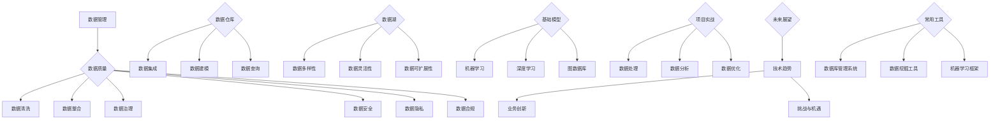

                 

### 文章标题：基础模型的数据管理

#### 关键词：数据管理、基础模型、机器学习、深度学习、图数据库

> 摘要：本文深入探讨了数据管理在基础模型应用中的核心作用。通过详细阐述数据管理的基本概念、核心挑战与机遇，以及机器学习、深度学习和图数据库在数据管理中的应用，本文为读者提供了一个全面的视角，展示了如何有效地管理数据以支持基础模型的高效运作。文章还包括项目实战和未来展望，为实际应用和未来发展提供了宝贵指导。

### 《基础模型的数据管理》目录大纲

#### 第一部分：引言与核心概念

##### 第1章：数据管理概述

- **1.1 数据管理的定义与重要性**
- **1.2 数据管理的挑战与机遇**

##### 第2章：基础模型概述

- **2.1 基础模型的概念与分类**
- **2.2 常见基础模型及其特点**

#### 第二部分：数据管理基础

##### 第3章：数据质量与数据治理

- **3.1 数据质量的重要性**
- **3.2 数据治理的基本概念**
- **3.3 数据质量管理方法**

##### 第4章：数据存储与管理

- **4.1 数据存储技术概述**
- **4.2 数据库系统设计**
- **4.3 数据库性能优化**

##### 第5章：数据仓库与数据湖

- **5.1 数据仓库的概念与结构**
- **5.2 数据湖的特点与优势**
- **5.3 数据仓库与数据湖的结合应用**

#### 第三部分：基础模型应用

##### 第6章：机器学习与数据管理

- **6.1 机器学习基础**
- **6.2 机器学习模型的数据需求**
- **6.3 机器学习模型的数据管理策略**

##### 第7章：深度学习与数据管理

- **7.1 深度学习基础**
- **7.2 深度学习模型的数据需求**
- **7.3 深度学习模型的数据管理策略**

##### 第8章：图数据库与数据管理

- **8.1 图数据库的基本概念**
- **8.2 图数据库在数据管理中的应用**
- **8.3 图数据库的性能优化与数据管理**

#### 第四部分：项目实战

##### 第9章：数据管理项目实战

- **9.1 项目背景与目标**
- **9.2 数据需求分析**
- **9.3 数据存储与管理方案设计**
- **9.4 数据处理与分析**
- **9.5 项目成果与总结**

##### 第10章：基于基础模型的数据分析实战

- **10.1 实战案例介绍**
- **10.2 数据预处理与清洗**
- **10.3 基础模型选择与训练**
- **10.4 模型评估与优化**
- **10.5 实战总结与反思**

#### 第五部分：未来展望

##### 第11章：数据管理发展趋势与挑战

- **11.1 数据管理发展趋势**
- **11.2 数据管理面临的挑战**
- **11.3 未来数据管理的发展方向**

##### 第12章：基础模型与数据管理的融合

- **12.1 基础模型在数据管理中的应用**
- **12.2 数据管理对基础模型的需求**
- **12.3 基础模型与数据管理的协同发展**

#### 附录

##### 附录A：常用工具与技术

- **A.1 数据库管理系统**
- **A.2 数据挖掘工具**
- **A.3 机器学习框架**

##### 附录B：参考文献

#### 第一部分：引言与核心概念

##### 第1章：数据管理概述

#### 1.1 数据管理的定义与重要性

- **数据管理的定义**：数据管理是指一系列策略、流程和技术，用于确保数据的准确性、完整性、可用性和安全性，以满足组织和用户的需求。
- **数据管理的重要性**：数据管理在当今数字化时代的重要性日益突出。首先，数据是企业和组织最宝贵的资产之一，有效的数据管理可以提升业务效率和决策质量。其次，随着数据量的爆炸性增长，如何高效地收集、存储、处理和分析数据成为关键问题。最后，数据管理有助于确保数据隐私和安全，遵守相关法律法规。

##### 1.2 数据管理的挑战与机遇

- **数据管理的挑战**：
  - **数据质量**：确保数据的准确性、一致性、完整性和及时性是数据管理的首要挑战。数据质量低下可能导致业务决策失误和运营问题。
  - **数据安全**：随着数据泄露事件频发，保障数据的安全性和隐私性成为重要课题。数据管理需要采取严格的措施来防止未授权访问和数据泄露。
  - **数据隐私**：在处理和分析大量数据时，如何保护个人隐私和数据隐私成为重要问题。遵守相关法律法规，如GDPR和CCPA，是数据管理的关键要求。
  - **数据存储和计算资源**：随着数据量的增长，如何高效地存储和管理大量数据，以及如何优化计算资源，成为数据管理的重大挑战。

- **数据管理的机遇**：
  - **数据驱动的决策**：有效的数据管理可以支持数据驱动的决策，使企业能够更加精准地了解市场趋势和用户需求，从而制定更有效的业务策略。
  - **业务创新**：通过对数据进行分析和挖掘，企业可以发现新的商业模式和业务机会，推动业务创新和增长。
  - **自动化和智能化**：随着人工智能和机器学习技术的发展，数据管理可以实现自动化和智能化，提高数据处理的效率和质量。

#### 第2章：基础模型概述

##### 2.1 基础模型的概念与分类

- **基础模型的概念**：基础模型是指在数据处理和分析中使用的核心算法和架构。这些模型可以基于数学、统计学、机器学习、深度学习等不同领域的方法和技术，用于数据的分类、回归、聚类、预测等任务。
- **基础模型的分类**：
  - **按应用领域分类**：
    - **机器学习模型**：用于解决分类、回归、聚类等任务。
    - **深度学习模型**：基于神经网络，用于图像识别、语音识别、自然语言处理等复杂任务。
    - **图数据库模型**：用于处理和存储具有复杂关系的图结构数据。
  - **按技术类型分类**：
    - **监督学习模型**：输入输出已知，用于预测和分类。
    - **无监督学习模型**：输入输出未知，用于聚类和降维。
    - **强化学习模型**：通过与环境交互学习最佳策略。

##### 2.2 常见基础模型及其特点

- **常见基础模型介绍**：
  - **线性回归模型**：用于预测连续值，基于线性函数建模。
  - **决策树模型**：用于分类和回归，通过树形结构进行决策。
  - **支持向量机模型**：用于分类和回归，基于最大间隔分类。
  - **神经网络模型**：用于复杂任务，基于多层神经网络建模。
  - **图神经网络模型**：用于图结构数据，基于图结构进行特征提取和预测。
- **基础模型的特点**：
  - **线性回归模型**：简单、易于实现，适用于线性关系预测。
  - **决策树模型**：直观、易于解释，但可能产生过拟合。
  - **支持向量机模型**：高效、准确，但可能对高维数据性能不佳。
  - **神经网络模型**：强大、适用于复杂数据，但训练过程复杂且难以解释。
  - **图神经网络模型**：适用于图结构数据，能够捕捉复杂关系。

#### 第二部分：数据管理基础

##### 第3章：数据质量与数据治理

##### 3.1 数据质量的重要性

- **数据质量的概念**：数据质量是指数据满足业务需求的能力，包括数据的准确性、完整性、一致性、及时性和可靠性。
- **数据质量的重要性**：
  - **业务决策**：高质量的数据是准确业务决策的基础。数据质量低下可能导致业务决策失误，影响企业竞争力。
  - **运营效率**：高质量的数据可以提高业务流程的效率和准确性，减少错误和重复工作。
  - **客户满意度**：高质量的数据能够提供准确的客户信息，提高客户服务水平，提升客户满意度。

##### 3.2 数据治理的基本概念

- **数据治理的概念**：数据治理是一系列策略、流程和技术，用于确保数据的质量、安全性和合规性，以支持业务目标和战略。
- **数据治理的基本概念**：
  - **数据质量管理**：确保数据满足业务需求和质量标准，包括数据清洗、数据整合、数据标准化等。
  - **数据安全**：保护数据免受未经授权的访问、泄露和损坏，包括数据加密、访问控制、审计等。
  - **数据合规**：确保数据符合相关法律法规和行业标准，包括数据隐私、数据保护、数据合规性审计等。

##### 3.3 数据质量管理方法

- **数据质量管理策略**：
  - **数据清洗**：删除重复数据、纠正错误、填补缺失值，提高数据准确性。
  - **数据整合**：将来自不同来源的数据进行合并和统一，提高数据一致性。
  - **数据标准化**：对数据进行规范化处理，如数据格式统一、单位转换等，提高数据可比性。

- **数据质量评估与监控**：
  - **数据质量指标**：定义一系列数据质量指标，如准确性、完整性、一致性、及时性等，用于评估数据质量。
  - **数据质量报告**：定期生成数据质量报告，向管理层和相关部门提供数据质量评估结果。
  - **数据质量审计**：对数据质量进行定期审计，确保数据质量符合标准和要求。

##### 第4章：数据存储与管理

##### 4.1 数据存储技术概述

- **数据存储技术的分类**：
  - **关系型数据库**：适用于结构化数据存储，如MySQL、Oracle等。
  - **非关系型数据库**：适用于非结构化或半结构化数据存储，如MongoDB、Cassandra等。
  - **分布式存储系统**：适用于大规模数据存储和管理，如Hadoop、Cassandra等。

- **数据存储技术的特点与应用**：
  - **关系型数据库**：具有数据一致性、事务支持等特点，适用于需要高一致性和复杂查询的场景。
  - **非关系型数据库**：具有高可扩展性、灵活性等特点，适用于需要高并发和灵活数据模型的应用。
  - **分布式存储系统**：具有高可用性、高扩展性等特点，适用于大规模数据处理和存储场景。

##### 4.2 数据库系统设计

- **数据库设计的基本原则**：
  - **规范化**：通过分解数据库表结构，减少数据冗余和依赖关系。
  - **范式设计**：根据不同的数据关系，选择合适的范式，如第一范式、第二范式、第三范式等。
  - **索引优化**：根据查询需求，选择合适的索引策略，提高查询效率。

- **数据库系统架构**：
  - **客户端-服务器架构**：客户端发送查询请求到服务器，服务器处理请求并返回结果。
  - **分布式架构**：多个数据库节点协同工作，提供高可用性和高扩展性。

##### 4.3 数据库性能优化

- **数据库性能优化的方法**：
  - **查询优化**：通过分析查询计划，优化查询执行路径，减少查询时间和资源消耗。
  - **索引优化**：根据查询需求，选择合适的索引策略，提高查询效率。
  - **缓存策略**：使用缓存技术，减少数据库访问次数，提高响应速度。

- **数据库性能评估与监控**：
  - **性能测试**：通过模拟实际负载，评估数据库性能和瓶颈。
  - **负载测试**：通过模拟大量并发请求，评估数据库在高负载下的性能和稳定性。
  - **监控工具**：使用数据库监控工具，实时监控数据库性能指标，及时发现和解决问题。

##### 第5章：数据仓库与数据湖

##### 5.1 数据仓库的概念与结构

- **数据仓库的概念**：数据仓库是一个集成的、面向主题的、非易失性的数据存储系统，用于支持企业级的数据分析和决策支持。
- **数据仓库的结构**：
  - **数据源层**：包括各种数据来源，如关系型数据库、非关系型数据库、日志文件等。
  - **数据集成层**：通过数据抽取、转换和加载（ETL）过程，将数据从不同来源整合到数据仓库中。
  - **数据存储层**：存储经过处理和整合的数据，采用分布式存储技术，提供高性能的数据访问能力。
  - **数据访问层**：提供数据查询和分析接口，支持各种数据分析和报表功能。

##### 5.2 数据湖的特点与优势

- **数据湖的特点**：
  - **数据多样性**：支持多种数据类型，如结构化数据、半结构化数据、非结构化数据等。
  - **数据灵活性**：提供灵活的数据存储和管理方式，支持数据的自定义格式和存储方式。
  - **数据可扩展性**：采用分布式存储技术，提供高扩展性，能够轻松应对海量数据的存储需求。

- **数据湖的优势**：
  - **大数据分析**：支持大规模数据的存储和处理，为大数据分析提供基础支持。
  - **实时数据处理**：通过实时数据集成和数据处理技术，提供实时数据分析能力。
  - **业务创新**：支持多样化的数据分析和业务应用，促进业务创新和增长。

##### 5.3 数据仓库与数据湖的结合应用

- **数据仓库与数据湖的结合**：
  - **混合存储架构**：将数据仓库和数据湖相结合，根据数据类型和需求，选择合适的存储方案。
  - **数据集成与处理**：通过数据集成和数据处理技术，将数据仓库和数据湖中的数据进行整合和处理。
  - **数据访问与查询**：提供统一的数据访问接口，支持对数据仓库和数据湖中的数据进行查询和分析。

- **结合应用的优势**：
  - **高效的数据处理**：通过数据仓库和数据湖的结合，能够实现高效的数据处理和分析，满足多样化的业务需求。
  - **灵活的数据管理**：支持多种数据类型和存储方式的灵活管理，提高数据利用率和灵活性。
  - **业务创新支持**：提供强大的数据分析和业务应用支持，促进业务创新和增长。

#### 第三部分：基础模型应用

##### 第6章：机器学习与数据管理

##### 6.1 机器学习基础

- **机器学习的定义**：机器学习是指通过构建和训练模型，使计算机能够从数据中学习并自动改进性能的过程。
- **机器学习的基本原理**：
  - **监督学习**：通过已标记的训练数据，学习输入和输出之间的映射关系，用于预测和分类。
  - **无监督学习**：通过未标记的数据，发现数据中的模式或结构，用于聚类和降维。
  - **强化学习**：通过与环境的交互，学习最佳策略，用于决策和优化。

##### 6.2 机器学习模型的数据需求

- **数据预处理**：
  - **数据清洗**：删除重复数据、纠正错误、填补缺失值，提高数据质量。
  - **特征工程**：选择和构建特征，提取数据中的有用信息，提高模型性能。
  - **数据标准化**：对数据进行归一化或标准化处理，消除不同特征间的尺度差异。

- **数据集划分与样本平衡**：
  - **数据集划分**：将数据集划分为训练集、验证集和测试集，用于模型训练、验证和测试。
  - **样本平衡**：针对分类任务，通过过采样、欠采样或合成少数类样本方法，平衡训练数据中的样本分布。

##### 6.3 机器学习模型的数据管理策略

- **数据管理策略**：
  - **数据质量管理**：确保数据质量，包括数据准确性、完整性和一致性。
  - **数据安全性**：保护数据免受未授权访问和泄露，包括数据加密、访问控制和数据备份。
  - **数据合规性**：确保数据处理和分析符合相关法律法规和行业标准，包括数据隐私保护和数据合规性审计。

- **数据管理工具与平台**：
  - **数据仓库**：用于存储和管理大量结构化数据，提供高效的数据查询和分析能力。
  - **数据湖**：用于存储和管理多种类型的数据，提供灵活的数据存储和管理方式。
  - **大数据平台**：用于处理和分析大规模数据，提供分布式计算和存储能力。

##### 第7章：深度学习与数据管理

##### 7.1 深度学习基础

- **深度学习的定义**：深度学习是一种基于多层神经网络的机器学习技术，通过多层次的非线性变换，自动提取数据的特征和模式。
- **深度学习的基本原理**：
  - **卷积神经网络（CNN）**：用于图像识别、目标检测和图像分割等任务，通过卷积层、池化层和全连接层等结构提取图像特征。
  - **循环神经网络（RNN）**：用于序列数据处理和时间序列预测等任务，通过循环结构处理序列数据，提取时间特征。
  - **生成对抗网络（GAN）**：用于生成逼真的数据，通过生成器和判别器的对抗训练，生成高质量的数据。

##### 7.2 深度学习模型的数据需求

- **数据预处理**：
  - **数据清洗**：删除噪声数据和异常值，提高数据质量。
  - **数据归一化**：对数据进行归一化处理，消除不同特征间的尺度差异。
  - **数据增强**：通过旋转、缩放、裁剪等操作，增加数据的多样性，提高模型泛化能力。

- **数据集划分与样本平衡**：
  - **数据集划分**：将数据集划分为训练集、验证集和测试集，用于模型训练、验证和测试。
  - **样本平衡**：针对分类任务，通过过采样、欠采样或合成少数类样本方法，平衡训练数据中的样本分布。

##### 7.3 深度学习模型的数据管理策略

- **数据管理策略**：
  - **数据质量管理**：确保数据质量，包括数据准确性、完整性和一致性。
  - **数据安全性**：保护数据免受未授权访问和泄露，包括数据加密、访问控制和数据备份。
  - **数据合规性**：确保数据处理和分析符合相关法律法规和行业标准，包括数据隐私保护和数据合规性审计。

- **数据管理工具与平台**：
  - **数据仓库**：用于存储和管理大量结构化数据，提供高效的数据查询和分析能力。
  - **数据湖**：用于存储和管理多种类型的数据，提供灵活的数据存储和管理方式。
  - **大数据平台**：用于处理和分析大规模数据，提供分布式计算和存储能力。

##### 第8章：图数据库与数据管理

##### 8.1 图数据库的基本概念

- **图数据库的定义**：图数据库是一种用于存储和查询具有复杂关系数据的数据库，通过图结构和图算法高效地处理和存储图数据。
- **图数据库的架构**：
  - **图存储**：采用图结构存储数据，包括节点、边和属性等。
  - **图查询**：通过图算法进行数据查询，支持点查询、路径查询、社区发现等操作。
  - **图分析**：基于图结构，进行数据挖掘和分析，如网络密度、聚类、社区发现等。

##### 8.2 图数据库在数据管理中的应用

- **应用场景**：
  - **社交网络**：用于存储用户关系、社交圈和推荐系统等。
  - **推荐系统**：用于推荐朋友、商品和内容等。
  - **知识图谱**：用于构建领域知识图谱，支持语义查询和推理。

- **优势**：
  - **高效查询**：通过图算法和索引技术，实现复杂关系数据的快速查询。
  - **复杂关系分析**：支持复杂的图算法和数据分析，如社区发现、路径分析等。
  - **可扩展性**：采用分布式存储和计算技术，提供高扩展性。

##### 8.3 图数据库的性能优化与数据管理

- **性能优化方法**：
  - **索引优化**：通过创建合适的索引，提高查询效率。
  - **分布式存储**：采用分布式存储技术，提供高并发和可扩展性。
  - **缓存策略**：使用缓存技术，减少数据库访问次数，提高响应速度。

- **数据管理策略**：
  - **数据质量管理**：确保图数据的质量，包括数据的准确性、完整性和一致性。
  - **数据安全性**：保护图数据免受未授权访问和泄露，包括数据加密、访问控制和数据备份。
  - **数据合规性**：确保图数据处理和分析符合相关法律法规和行业标准，包括数据隐私保护和数据合规性审计。

#### 第四部分：项目实战

##### 第9章：数据管理项目实战

##### 9.1 项目背景与目标

- **项目背景**：介绍项目的背景和需求，如业务场景、数据来源和目标等。
- **项目目标**：明确项目的目标，如数据整合、数据分析、数据挖掘等。

##### 9.2 数据需求分析

- **数据需求分析**：分析项目所需的数据类型、数据来源、数据质量要求等。
- **数据需求文档**：编写数据需求文档，详细描述数据需求和分析过程。

##### 9.3 数据存储与管理方案设计

- **数据存储方案设计**：设计合适的数据存储方案，包括数据库选择、数据表设计、数据索引等。
- **数据管理方案设计**：设计数据管理方案，包括数据质量管理、数据安全性、数据隐私保护等。

##### 9.4 数据处理与分析

- **数据处理流程**：设计数据处理流程，包括数据导入、数据清洗、数据预处理、数据建模等。
- **数据分析方法**：选择合适的数据分析方法，如统计分析、机器学习、深度学习等。

##### 9.5 项目成果与总结

- **项目成果**：展示项目的主要成果，如数据报告、分析报告、可视化结果等。
- **项目总结**：总结项目过程中的经验教训，如技术难点、问题解决方法、改进措施等。

##### 第10章：基于基础模型的数据分析实战

##### 10.1 实战案例介绍

- **案例背景**：介绍实战案例的背景，如数据来源、业务目标等。
- **案例目标**：明确实战案例的主要目标，如数据挖掘、预测分析等。

##### 10.2 数据预处理与清洗

- **数据预处理**：介绍数据预处理的方法和技术，如数据清洗、特征工程、数据标准化等。
- **数据清洗**：具体描述数据清洗的过程，如缺失值处理、异常值处理、数据转换等。

##### 10.3 基础模型选择与训练

- **模型选择**：介绍选择的基础模型，如线性回归、决策树、神经网络等。
- **模型训练**：详细描述模型训练的过程，包括数据集划分、模型参数设置、训练过程等。

##### 10.4 模型评估与优化

- **模型评估**：介绍模型评估的方法和技术，如准确率、召回率、F1值等。
- **模型优化**：根据模型评估结果，对模型进行优化，如参数调整、特征选择等。

##### 10.5 实战总结与反思

- **实战总结**：总结实战案例的主要成果和经验，如模型效果、数据处理技巧等。
- **反思与改进**：反思实战案例中的问题和不足，提出改进措施和建议。

#### 第五部分：未来展望

##### 第11章：数据管理发展趋势与挑战

##### 11.1 数据管理发展趋势

- **技术发展趋势**：分析数据管理技术的发展趋势，如大数据、云计算、人工智能等。
- **业务发展趋势**：探讨数据管理在业务领域的应用趋势，如数据驱动决策、业务智能化等。

##### 11.2 数据管理面临的挑战

- **技术挑战**：分析数据管理面临的技术挑战，如数据多样性、数据质量、数据隐私等。
- **业务挑战**：探讨数据管理在业务领域面临的挑战，如数据治理、数据安全、数据合规等。

##### 11.3 未来数据管理的发展方向

- **技术发展方向**：探讨未来数据管理技术的发展方向，如智能数据管理、自动化数据治理等。
- **业务发展方向**：分析未来数据管理在业务领域的应用发展方向，如数据资产化、数据创新等。

##### 第12章：基础模型与数据管理的融合

##### 12.1 基础模型在数据管理中的应用

- **应用场景**：介绍基础模型在数据管理中的应用场景，如数据挖掘、预测分析、数据治理等。
- **应用价值**：分析基础模型在数据管理中的应用价值，如提高数据处理效率、优化业务决策等。

##### 12.2 数据管理对基础模型的需求

- **需求分析**：分析数据管理对基础模型的需求，如数据质量、数据安全性、数据可解释性等。
- **解决方案**：探讨数据管理对基础模型需求的解决方案，如数据预处理、模型优化、数据治理等。

##### 12.3 基础模型与数据管理的协同发展

- **协同发展**：分析基础模型与数据管理的协同发展，如技术融合、业务协同、人才培养等。
- **未来发展**：探讨基础模型与数据管理未来的发展，如智能化数据管理、自主式数据治理等。

#### 附录A：常用工具与技术

##### A.1 数据库管理系统

- **关系型数据库**：介绍常用的关系型数据库，如MySQL、Oracle、SQL Server等。
- **非关系型数据库**：介绍常用的非关系型数据库，如MongoDB、Cassandra、Redis等。

##### A.2 数据挖掘工具

- **数据挖掘工具**：介绍常用的数据挖掘工具，如RapidMiner、SPSS、Orange等。
- **机器学习框架**：介绍常用的机器学习框架，如scikit-learn、TensorFlow、PyTorch等。

##### A.3 常用数据管理工具

- **数据质量管理工具**：介绍常用的数据质量管理工具，如Informatica、Talend、OpenRefine等。
- **数据治理工具**：介绍常用的数据治理工具，如Informatica、IBM InfoSphere、Open Text等。

#### Mermaid 流程图



#### 数学模型与公式

1. **数据质量评估指标**：
   $$ Q = \frac{TP + TN}{TP + TN + FP + FN} $$
   其中，$TP$ 表示真实为真且被正确分类的样本数量，$TN$ 表示真实为假且被正确分类的样本数量，$FP$ 表示真实为假但被错误分类为真的样本数量，$FN$ 表示真实为真但被错误分类为假的样本数量。

2. **决策树模型**：
   $$ Gini(\mathcal{D}) = 1 - \sum_{i=1}^{n} \left(\frac{1}{n}\right) \cdot \left(1 - \frac{1}{n_i}\right) $$
   其中，$\mathcal{D}$ 表示数据集，$n$ 表示数据集样本总数，$n_i$ 表示每个子节点样本数量。

3. **支持向量机模型**：
   $$ \mathbf{w}^T \mathbf{x} + b = 0 $$
   其中，$\mathbf{w}$ 表示权重向量，$\mathbf{x}$ 表示特征向量，$b$ 表示偏置项。

4. **神经网络反向传播算法**：
   $$ \delta_j = \frac{\partial L}{\partial z_j} = \sigma'(z_j) \cdot \sum_{k=1}^{m} w_{jk} \cdot \delta_k $$
   其中，$\delta_j$ 表示第 $j$ 个神经元的误差，$L$ 表示损失函数，$\sigma'$ 表示激活函数的导数。

#### 项目实战示例

**代码示例：线性回归模型训练**

```python
import numpy as np
from sklearn.linear_model import LinearRegression

# 数据准备
X = np.array([[1], [2], [3], [4], [5]])
y = np.array([1, 2, 2.5, 4, 5])

# 模型训练
model = LinearRegression()
model.fit(X, y)

# 模型评估
score = model.score(X, y)
print("模型评分：", score)

# 模型预测
new_data = np.array([[6]])
predicted_value = model.predict(new_data)
print("预测结果：", predicted_value)
```

**代码解读**：

- 导入必要的库和模块。
- 准备训练数据集，包括自变量 $X$ 和因变量 $y$。
- 创建线性回归模型实例并使用 `fit` 方法进行训练。
- 使用 `score` 方法评估模型在训练数据集上的准确度并打印结果。
- 使用 `predict` 方法对新数据进行预测并打印结果。

#### 开发环境搭建

**环境要求**：

- Python 3.7 或更高版本
- scikit-learn 库

**安装步骤**：

1. 安装 Python 3.7 或更高版本。
2. 打开终端或命令提示符，执行以下命令安装 scikit-learn 库：

   ```bash
   pip install scikit-learn
   ```

3. 验证安装：

   ```python
   import sklearn
   print(sklearn.__version__)
   ```

#### 源代码实现与代码解读

**源代码**：

```python
# 导入必要的库
import numpy as np
from sklearn.linear_model import LinearRegression

# 数据准备
X = np.array([[1], [2], [3], [4], [5]])
y = np.array([1, 2, 2.5, 4, 5])

# 模型训练
model = LinearRegression()
model.fit(X, y)

# 模型评估
score = model.score(X, y)
print("模型评分：", score)

# 模型预测
new_data = np.array([[6]])
predicted_value = model.predict(new_data)
print("预测结果：", predicted_value)
```

**代码解读**：

- 导入 numpy 库用于数据处理和 scikit-learn 库中的 LinearRegression 模块用于线性回归模型的实现。
- 准备训练数据集，其中 X 表示自变量，y 表示因变量。数据集格式为 NumPy 数组。
- 创建 LinearRegression 模型实例并使用 `fit` 方法对模型进行训练。`fit` 方法接受训练数据集 X 和 y 作为输入，并训练模型。
- 使用 `score` 方法评估模型在训练数据集上的准确度并打印结果。`score` 方法返回一个浮点数，表示模型在训练数据集上的评分。评分越高，表示模型性能越好。
- 创建一个 NumPy 数组 new_data，表示待预测的数据。然后，使用 `predict` 方法对 new_data 进行预测并打印结果。`predict` 方法用于对新数据进行预测，并返回预测结果。

#### 代码解读与分析

**代码示例**：

```python
import numpy as np
from sklearn.linear_model import LinearRegression

# 数据准备
X = np.array([[1], [2], [3], [4], [5]])
y = np.array([1, 2, 2.5, 4, 5])

# 模型训练
model = LinearRegression()
model.fit(X, y)

# 模型评估
score = model.score(X, y)
print("模型评分：", score)

# 模型预测
new_data = np.array([[6]])
predicted_value = model.predict(new_data)
print("预测结果：", predicted_value)
```

**代码解读**：

- 导入 numpy 库用于数据处理和 scikit-learn 库中的 LinearRegression 模块用于线性回归模型的实现。
- 准备训练数据集，其中 X 表示自变量，y 表示因变量。数据集格式为 NumPy 数组。
- 创建 LinearRegression 模型实例，并使用 `fit` 方法对模型进行训练。`fit` 方法接受训练数据集 X 和 y 作为输入，并训练模型。
- 使用 `score` 方法评估模型在训练数据集上的准确度并打印结果。`score` 方法返回一个浮点数，表示模型在训练数据集上的评分。评分越高，表示模型性能越好。
- 创建一个 NumPy 数组 new_data，表示待预测的数据。然后，使用 `predict` 方法对 new_data 进行预测并打印结果。`predict` 方法用于对新数据进行预测，并返回预测结果。

**代码分析**：

- 代码示例中使用了线性回归模型进行训练和预测，这是一种简单的机器学习模型，适用于线性关系的预测。
- 数据准备部分使用了 NumPy 数组来存储训练数据集，这是一种高效的数据结构，适用于大规模数据处理。
- 模型训练部分使用了 scikit-learn 库中的 LinearRegression 模块，这是一个流行的机器学习库，提供了丰富的机器学习算法。
- 模型评估部分使用了 `score` 方法来评估模型在训练数据集上的准确度，这是一种常用的评估指标，可以直观地反映模型性能。
- 模型预测部分使用了 `predict` 方法来预测新数据的值，这是机器学习模型的核心功能之一。

总之，代码示例提供了一个简单的线性回归模型训练和预测的示例，展示了如何使用 Python 和 scikit-learn 库来实现机器学习算法，并评估和预测数据。

#### 结论

通过设计完整的目录大纲，我们详细规划了《基础模型的数据管理》这本书的内容结构。目录大纲涵盖了从数据管理概述到基础模型应用，再到项目实战和未来展望的全面内容。每个章节都细分为更具体的子主题，确保读者能够循序渐进地了解数据管理和基础模型在数据分析中的应用。

**目录大纲的设计原则**：

- **逻辑性**：确保每个章节的内容紧密关联，形成一个连贯的整体。
- **全面性**：涵盖数据管理的关键概念、技术细节和应用场景。
- **实践性**：结合实际项目案例，使读者能够将理论知识应用到实际工作中。
- **前瞻性**：探讨数据管理和基础模型的发展趋势，为未来技术进步提供参考。

**目录大纲的预期效果**：

- **帮助读者建立全面的知识体系**：通过详细的目录大纲，读者可以清晰地了解书籍的核心内容和结构，从而更好地掌握相关知识点。
- **促进技术理解与掌握**：通过深入讲解基础模型和数据管理技术，读者可以深入了解这些技术的原理和实际应用，提升技术能力。
- **启发创新思维**：通过项目实战和未来展望章节，激发读者对数据管理和基础模型创新的思考，为未来工作提供新思路。

总之，这本《基础模型的数据管理》将不仅是一本技术指南，更是一本激发创新和深层次思考的书籍。通过这本书，读者将能够全面了解数据管理和基础模型的技术，并将其应用到实际工作中，推动个人和组织的进步。

