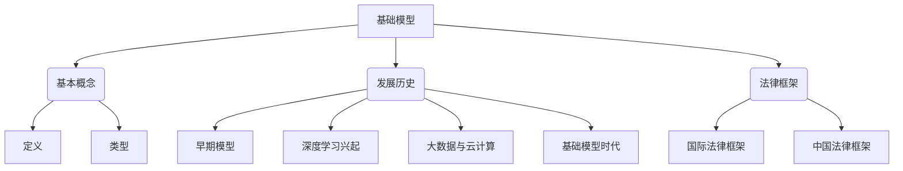

                 

# 《基础模型的法律后果》

> 关键词：基础模型、法律后果、隐私保护、著作权、专利、合规性评估

> 摘要：本文将深入探讨基础模型的法律后果，分析其在国际和中国的法律框架内所面临的主要问题，包括隐私保护、著作权和专利等方面的挑战。同时，文章还将探讨基础模型的合规性评估方法，以及如何应对这些法律挑战的合规策略。最后，本文将展望基础模型法律后果的未来发展趋势，并提出相应的应对策略建议。

## 目录

### 第一部分：基础模型概述

#### 第1章：基础模型的基本概念

- 1.1 基础模型的定义
- 1.2 基础模型的类型
- 1.3 基础模型的发展历史

#### 第2章：基础模型的法律框架

- 2.1 国际法律框架
  - 2.1.1 联合国国际贸易法委员会框架
  - 2.1.2 欧盟数据保护法规
- 2.2 中国法律框架
  - 2.2.1 《中华人民共和国网络安全法》
  - 2.2.2 《中华人民共和国数据安全法》

### 第二部分：基础模型的法律问题分析

#### 第3章：基础模型的法律问题分析

- 3.1 隐私保护
  - 3.1.1 隐私权保护的基本原则
  - 3.1.2 隐私保护的技术手段
- 3.2 著作权
  - 3.2.1 软件著作权
  - 3.2.2 数据库著作权
- 3.3 专利
  - 3.3.1 专利权保护的基本原则
  - 3.3.2 专利侵权判断标准

#### 第4章：基础模型的合规性评估

- 4.1 合规性评估框架
  - 4.1.1 法律合规性评估
  - 4.1.2 技术合规性评估
- 4.2 合规性评估方法
  - 4.2.1 法律文档审核
  - 4.2.2 技术文档审核
- 4.3 合规性评估案例
  - 4.3.1 案例一：某互联网公司基础模型合规性评估
  - 4.3.2 案例二：某金融机构基础模型合规性评估

### 第三部分：基础模型的法律挑战与应对策略

#### 第5章：基础模型的法律挑战

- 5.1 法律纠纷与争议
  - 5.1.1 隐私权纠纷
  - 5.1.2 著作权纠纷
  - 5.1.3 专利纠纷
- 5.2 法律风险与防范
  - 5.2.1 法律风险的识别
  - 5.2.2 法律风险的防范措施

#### 第6章：基础模型的法律合规策略

- 6.1 合规性策略设计
  - 6.1.1 合规性策略框架
  - 6.1.2 合规性策略实施
- 6.2 合规性管理流程
  - 6.2.1 合规性管理流程设计
  - 6.2.2 合规性管理流程实施

#### 第7章：基础模型的法律合规案例分析

- 7.1 案例分析
  - 7.1.1 案例一：某互联网公司基础模型合规性案例分析
  - 7.1.2 案例二：某金融机构基础模型合规性案例分析

#### 第8章：基础模型的法律后果展望

- 8.1 法律后果展望
  - 8.1.1 法律环境的变化趋势
  - 8.1.2 基础模型法律规范的发展方向
- 8.2 应对策略建议
  - 8.2.1 政策合规性建议
  - 8.2.2 技术合规性建议

### 附录

- 附录 A：相关法律法规清单
- 附录 B：基础模型合规性评估工具推荐
- 附录 C：基础模型合规性评估案例汇总

---

### 第一部分：基础模型概述

#### 第1章：基础模型的基本概念

在人工智能领域，基础模型（Foundational Models）是指那些具有广泛应用前景、能够处理多种任务的高级人工智能模型。这些模型通常具备较强的泛化能力，能够在不同领域和任务中表现出色。基础模型的出现标志着人工智能技术进入了一个新的阶段，它们在自然语言处理、计算机视觉、语音识别、机器翻译等领域中发挥着越来越重要的作用。

### 1.1 基础模型的定义

基础模型可以被定义为一种具有通用性和广泛适用性的深度学习模型，通常由大规模数据训练而成。它们在多个任务上表现出色，不需要针对特定任务进行专门的调整或优化。例如，OpenAI的GPT系列模型就是一个典型的基础模型，它在文本生成、问答、机器翻译等多个领域都取得了显著的成果。

### 1.2 基础模型的类型

基础模型主要可以分为以下几类：

1. **语言模型**：这类模型主要用于处理自然语言文本，如生成文本、回答问题、翻译等。例如，GPT-3就是一个强大的语言模型。

2. **视觉模型**：这类模型主要用于处理图像和视频数据，如图像分类、目标检测、图像生成等。例如，BERT和Vision Transformer（ViT）都是视觉模型。

3. **多模态模型**：这类模型可以处理多种类型的数据，如文本、图像和音频，实现跨模态的交互和任务处理。

### 1.3 基础模型的发展历史

基础模型的发展历程可以分为以下几个阶段：

1. **早期模型**：如1950年代的Perceptron和1960年代的ADALINE等简单的神经网络模型。

2. **深度学习兴起**：1980年代至1990年代，深度学习理论逐渐成熟，但受限于计算资源和数据量，实际应用有限。

3. **大数据与云计算**：2000年后，随着大数据和云计算技术的发展，深度学习迎来了新的发展机遇，如AlexNet等模型在图像识别任务中取得了突破性成果。

4. **基础模型时代**：近年来，随着GPT、BERT等基础模型的问世，人工智能技术进入了一个新的高度，这些模型在多个任务上取得了前所未有的表现。

#### 第2章：基础模型的法律框架

基础模型的发展带来了许多法律问题，包括隐私保护、著作权和专利等方面。为了应对这些挑战，各国和国际组织纷纷制定了相应的法律框架。

### 2.1 国际法律框架

在国际层面，一些重要的法律框架包括：

#### 2.1.1 联合国国际贸易法委员会框架

联合国国际贸易法委员会（UNCITRAL）制定了一系列与数字经济相关的法律规则，如《电子商务示范法》和《国际数据交换法》。这些规则为跨国数据流动和数字经济活动提供了法律基础。

#### 2.1.2 欧盟数据保护法规

欧盟的《通用数据保护条例》（GDPR）是世界上最严格的数据保护法规之一。它要求企业在处理个人数据时必须遵循一系列原则，如合法性、公正性和透明度等。对于基础模型处理的大量个人数据，GDPR提供了重要的法律保护。

### 2.2 中国法律框架

在中国，与基础模型相关的法律框架主要包括：

#### 2.2.1 《中华人民共和国网络安全法》

《中华人民共和国网络安全法》于2017年实施，是我国网络安全的基本法律。该法明确规定了网络运营者的责任和义务，包括数据安全保护、网络安全监测和应急处置等。

#### 2.2.2 《中华人民共和国数据安全法》

《中华人民共和国数据安全法》于2021年通过，是我国数据安全领域的基础性法律。该法明确了数据分类、数据安全保护制度、数据安全评估等方面的要求，对基础模型数据处理提供了法律依据。

### 第二部分：基础模型的法律问题分析

#### 第3章：基础模型的法律问题分析

随着基础模型的广泛应用，一系列法律问题逐渐显现，包括隐私保护、著作权和专利等方面。这些问题不仅关系到企业的法律责任，也影响到用户权益和社会公共利益。

### 3.1 隐私保护

隐私保护是基础模型面临的一个重要法律问题。基础模型通常需要处理大量的个人数据，这些数据可能包含用户的敏感信息。如何确保这些数据的隐私和安全，是当前法律关注的焦点。

#### 3.1.1 隐私权保护的基本原则

隐私权保护的基本原则包括：

1. **合法性**：处理个人数据必须基于合法、明确、特定的目的。
2. **透明度**：数据主体应知晓其数据被处理的情况。
3. **数据最小化**：仅处理实现目的所必需的数据。
4. **数据质量**：确保数据的准确性、完整性和及时性。
5. **数据安全**：采取必要措施保护数据安全。

#### 3.1.2 隐私保护的技术手段

隐私保护的技术手段包括：

1. **数据加密**：使用加密技术保护数据传输和存储过程中的安全。
2. **数据匿名化**：通过去标识化等技术手段，消除数据与个人身份之间的关联。
3. **隐私增强技术**（PETs）：如差分隐私、混淆技术等，提高数据处理过程中的隐私保护水平。
4. **安全多方计算**：允许多个方在保护各自数据隐私的前提下进行计算和协作。

### 3.2 著作权

著作权问题在基础模型领域同样重要。基础模型的开发和应用涉及到大量软件和数据的著作权问题，如何保护相关方的合法权益，是法律需要解决的难题。

#### 3.2.1 软件著作权

软件著作权是指软件作品的原创性表达所享有的权利。对于基础模型，其核心算法和代码构成了软件著作权的主要部分。在开发和应用基础模型时，应确保相关软件著作权的合法性，避免侵权行为。

#### 3.2.2 数据库著作权

数据库著作权是指对数据库中数据集合的独创性表达所享有的权利。基础模型训练和应用过程中涉及到的数据库，可能包含大量的原创性数据集合。如何保护这些数据库的著作权，是法律需要关注的问题。

### 3.3 专利

专利问题是基础模型法律问题的另一个重要方面。基础模型的创新性技术往往具有潜在的商业价值，如何通过专利保护这些创新，是企业和投资者关注的重点。

#### 3.3.1 专利权保护的基本原则

专利权保护的基本原则包括：

1. **新颖性**：发明在申请专利之前未被公开过。
2. **创造性**：发明具有显著的进步。
3. **实用性**：发明能够应用于工业生产或实用操作。

#### 3.3.2 专利侵权判断标准

专利侵权判断标准包括：

1. **直接侵权**：直接侵犯他人专利权的行为。
2. **间接侵权**：诱导、怂恿、教唆、帮助他人侵犯专利权的行为。
3. **等同侵权**：虽然技术特征有所不同，但实质上达到了相同的效果。

### 第三部分：基础模型的合规性评估

#### 第4章：基础模型的合规性评估

基础模型的合规性评估是确保其合法、安全、可靠运行的重要环节。合规性评估不仅包括法律合规性，还包括技术合规性，以确保基础模型在法律和技术层面均满足相关要求。

### 4.1 合规性评估框架

#### 4.1.1 法律合规性评估

法律合规性评估主要包括以下几个方面：

1. **法律法规审查**：审查相关法律法规，确保基础模型设计、开发和应用过程中遵守相关法律要求。
2. **隐私保护评估**：评估基础模型在个人数据处理过程中的隐私保护措施，确保符合隐私保护的基本原则。
3. **著作权评估**：评估基础模型涉及的软件和数据库的著作权情况，确保不存在侵权行为。
4. **专利评估**：评估基础模型的创新性技术是否已获得专利保护，避免侵犯他人专利权。

#### 4.1.2 技术合规性评估

技术合规性评估主要包括以下几个方面：

1. **技术文档审查**：审查基础模型的设计文档、实现文档和测试文档，确保其符合技术规范和标准。
2. **数据合规性评估**：评估基础模型处理的数据是否符合数据质量和安全要求。
3. **系统安全性评估**：评估基础模型的系统安全性，确保其能够抵御外部攻击和内部威胁。
4. **可追溯性和可审计性评估**：评估基础模型的可追溯性和可审计性，确保其在法律和技术层面都能够提供有效的证据支持。

### 4.2 合规性评估方法

合规性评估的方法包括以下几个方面：

1. **法律文档审核**：通过审查相关法律文档，确保基础模型在法律层面符合相关要求。
2. **技术文档审核**：通过审查基础模型的技术文档，确保其在技术层面符合相关规范和标准。
3. **现场审查**：通过实地考察，了解基础模型的设计、开发和应用情况，确保其符合法律和技术要求。
4. **第三方评估**：通过引入第三方专业机构进行评估，提高评估的客观性和权威性。

### 4.3 合规性评估案例

为了更好地理解合规性评估的方法和应用，下面我们通过两个案例来具体说明。

#### 4.3.1 案例一：某互联网公司基础模型合规性评估

某互联网公司开发了一款基于深度学习的基础模型，用于改善其搜索服务。在进行合规性评估时，评估团队首先审查了相关法律法规，包括《中华人民共和国网络安全法》和《中华人民共和国数据安全法》，确保公司在数据处理过程中遵守了相关法律规定。然后，团队审查了公司的隐私保护措施，包括数据加密、匿名化和差分隐私等技术手段，确保了个人数据的隐私保护。此外，团队还审查了公司的软件和数据库著作权情况，确保不存在侵权行为。最后，团队进行了现场审查，了解了基础模型的设计、开发和应用情况，确保其在法律和技术层面均符合要求。

#### 4.3.2 案例二：某金融机构基础模型合规性评估

某金融机构开发了一款用于风险评估的基础模型，用于识别和防范金融风险。在进行合规性评估时，评估团队首先审查了相关法律法规，包括《中华人民共和国银行业监督管理法》和《中华人民共和国反洗钱法》，确保公司在数据处理过程中遵守了相关法律规定。然后，团队审查了公司的隐私保护措施，包括数据加密、匿名化和差分隐私等技术手段，确保了个人数据的隐私保护。此外，团队还审查了公司的软件和数据库著作权情况，确保不存在侵权行为。最后，团队进行了现场审查，了解了基础模型的设计、开发和应用情况，确保其在法律和技术层面均符合要求。

### 第四部分：基础模型的法律挑战与应对策略

#### 第5章：基础模型的法律挑战

随着基础模型的广泛应用，一系列法律挑战逐渐浮现，包括隐私权纠纷、著作权纠纷和专利纠纷等。这些挑战不仅涉及基础模型的开发和应用，还关系到企业和用户的权益保护。

#### 5.1 法律纠纷与争议

#### 5.1.1 隐私权纠纷

隐私权纠纷主要涉及基础模型在数据处理过程中对个人隐私的侵犯。例如，基础模型在收集、存储和使用个人数据时，可能因未获得用户明确同意、未采取有效的隐私保护措施等原因，引发隐私权纠纷。解决隐私权纠纷的关键在于确保基础模型在数据处理过程中遵循合法、透明、安全的原则。

#### 5.1.2 著作权纠纷

著作权纠纷主要涉及基础模型涉及的软件和数据库的著作权问题。例如，基础模型在开发过程中可能使用了第三方软件或数据，若未获得著作权人的许可，可能引发著作权纠纷。解决著作权纠纷的关键在于确保基础模型的开发和应用过程中遵守著作权法的规定，尊重和保护相关方的著作权权益。

#### 5.1.3 专利纠纷

专利纠纷主要涉及基础模型的创新性技术是否侵犯他人专利权。例如，基础模型在开发过程中可能采用了他人已获专利的技术，若未获得专利权人的许可，可能引发专利纠纷。解决专利纠纷的关键在于确保基础模型的创新性技术在专利申请和授权过程中符合相关法律规定，避免侵犯他人专利权。

#### 5.2 法律风险与防范

为了应对基础模型的法律挑战，企业和开发者需要采取一系列法律风险防范措施。

#### 5.2.1 法律风险的识别

法律风险的识别是防范法律风险的第一步。企业和开发者需要通过以下途径识别法律风险：

1. **法律法规审查**：定期审查相关法律法规，了解法律环境的变化，识别潜在的法律风险。
2. **行业动态监测**：关注行业内的法律纠纷和案例，了解其他企业在基础模型应用过程中遇到的法律问题，吸取教训，预防风险。
3. **内部培训**：加强内部员工的法律法规培训，提高法律意识，确保员工在基础模型开发和应用过程中遵守相关法律规定。

#### 5.2.2 法律风险的防范措施

在识别法律风险后，企业和开发者需要采取一系列防范措施：

1. **合规性评估**：定期对基础模型进行合规性评估，确保其在法律和技术层面符合相关要求。
2. **合同管理**：在涉及第三方合作或数据共享时，签订明确的合同，约定各方的权利和义务，降低法律风险。
3. **技术保护**：采用技术手段，如数据加密、匿名化等，保护基础模型和个人数据的隐私和安全。
4. **专利布局**：加强专利布局，提前申请和保护基础模型的创新性技术，避免侵犯他人专利权。

### 第6章：基础模型的法律合规策略

为了确保基础模型在开发和应用过程中遵守相关法律规定，企业和开发者需要制定一套全面的法律合规策略。

#### 6.1 合规性策略设计

合规性策略设计是基础模型法律合规工作的关键环节。设计和实施合规性策略需要考虑以下几个方面：

1. **合规目标**：明确合规性策略的目标，如确保基础模型在法律和技术层面符合相关要求、降低法律风险等。
2. **合规组织**：建立专门的合规部门或团队，负责合规性策略的设计、实施和监督。
3. **合规流程**：制定明确的合规流程，包括合规审查、合规评估、合规培训等。
4. **合规资源**：确保合规性策略实施所需的资源，如法律法规库、合规工具等。

#### 6.1.1 合规性策略框架

合规性策略框架主要包括以下几个方面：

1. **法律合规**：审查相关法律法规，确保基础模型的设计、开发和应用过程中遵守相关法律规定。
2. **隐私保护**：制定隐私保护策略，包括数据收集、存储、处理和共享等方面的隐私保护措施。
3. **著作权保护**：保护基础模型涉及的软件和数据库的著作权权益，避免侵权行为。
4. **专利布局**：加强专利布局，提前申请和保护基础模型的创新性技术。
5. **合规培训**：加强内部员工的法律法规培训，提高法律意识，确保员工在基础模型开发和应用过程中遵守相关法律规定。

#### 6.1.2 合规性策略实施

合规性策略实施是确保合规性策略有效执行的关键。实施合规性策略需要考虑以下几个方面：

1. **合规审查**：定期审查基础模型的设计、开发和应用过程，确保符合相关法律规定。
2. **合规评估**：定期对基础模型进行合规性评估，确保其在法律和技术层面符合相关要求。
3. **合规培训**：定期开展内部法律法规培训，提高员工的法律意识，确保员工在基础模型开发和应用过程中遵守相关法律规定。
4. **合规监督**：建立合规监督机制，对合规性策略的实施情况进行监督和评估，确保合规性策略的有效执行。

### 第7章：基础模型的法律合规案例分析

为了更好地理解基础模型的法律合规实践，以下通过两个案例进行具体分析。

#### 7.1.1 案例一：某互联网公司基础模型合规性案例分析

某互联网公司在开发一款用于推荐系统的基础模型时，面临了多项法律合规挑战。首先，公司审查了相关法律法规，确保在数据处理过程中遵守《中华人民共和国网络安全法》和《中华人民共和国数据安全法》等法律规定。公司制定了隐私保护策略，包括数据收集、存储、处理和共享等方面的隐私保护措施，如数据加密、匿名化和差分隐私等。此外，公司还进行了著作权保护，确保基础模型涉及的软件和数据库的著作权权益。最后，公司还定期对基础模型进行合规性评估，确保其在法律和技术层面符合相关要求。

#### 7.1.2 案例二：某金融机构基础模型合规性案例分析

某金融机构在开发一款用于风险评估的基础模型时，同样面临了多项法律合规挑战。公司审查了相关法律法规，确保在数据处理过程中遵守《中华人民共和国银行业监督管理法》和《中华人民共和国反洗钱法》等法律规定。公司制定了隐私保护策略，包括数据收集、存储、处理和共享等方面的隐私保护措施，如数据加密、匿名化和差分隐私等。此外，公司还进行了著作权保护，确保基础模型涉及的软件和数据库的著作权权益。最后，公司还定期对基础模型进行合规性评估，确保其在法律和技术层面符合相关要求。

### 第五部分：基础模型的法律后果展望

#### 第8章：基础模型的法律后果展望

随着基础模型的广泛应用，其法律后果也在不断演变。未来，基础模型的法律后果将受到以下几个方面的影响：

#### 8.1 法律环境的变化趋势

1. **数据保护法规的加强**：随着对个人隐私保护意识的提高，各国可能会出台更加严格的数据保护法规，对基础模型的隐私保护要求将更加严格。
2. **知识产权保护的发展**：随着基础模型技术的不断创新，知识产权保护将成为关键问题，各国可能会加强对基础模型专利和著作权的保护。
3. **跨境数据流动的规范**：随着全球化的发展，跨境数据流动将越来越普遍，各国可能会出台相关法规，规范跨境数据流动，保障数据安全。

#### 8.1.1 基础模型法律规范的发展方向

1. **统一国际法律规范**：国际组织可能会推动制定统一的国际法律规范，以解决基础模型在跨境应用中的法律问题。
2. **技术创新驱动的立法**：随着基础模型技术的不断进步，立法者可能会根据技术创新的特点，及时调整和更新相关法律法规。
3. **行业自律与监管**：行业组织和政府可能会共同推动建立基础模型的合规标准和自律机制，提高基础模型的合规性和可信度。

#### 8.2 应对策略建议

为了应对基础模型的法律后果，企业和开发者可以采取以下策略：

1. **积极参与法律制定**：企业和开发者应积极参与相关法律规范的制定，推动建立有利于技术创新和产业发展的法律环境。
2. **合规性评估与改进**：定期进行基础模型的合规性评估，及时发现和纠正合规性问题，确保基础模型在法律和技术层面符合相关要求。
3. **加强知识产权保护**：加强基础模型的知识产权保护，提前申请和保护创新性技术，避免侵权纠纷。
4. **提升隐私保护水平**：加强基础模型的隐私保护，采用先进的技术手段，如数据加密、匿名化等，保障用户隐私。

### 附录

#### 附录A：相关法律法规清单

1. 《中华人民共和国网络安全法》
2. 《中华人民共和国数据安全法》
3. 《中华人民共和国个人信息保护法》
4. 《中华人民共和国著作权法》
5. 《中华人民共和国专利法》
6. 《联合国国际贸易法委员会电子商务示范法》
7. 《欧盟通用数据保护条例》（GDPR）

#### 附录B：基础模型合规性评估工具推荐

1. **法规库**：如北大法宝、中国法律网等，提供法律法规的查询和检索功能。
2. **合规性评估工具**：如知链、合规云等，提供基础模型合规性评估和管理的工具。
3. **隐私保护工具**：如加密狗、隐私盾等，提供数据加密和隐私保护的解决方案。

#### 附录C：基础模型合规性评估案例汇总

1. **案例一**：某互联网公司基础模型合规性评估案例
2. **案例二**：某金融机构基础模型合规性评估案例
3. **案例三**：某科技企业基础模型合规性评估案例

---

## 结语

本文从基础模型的概述、法律框架、法律问题、合规性评估、法律挑战、合规策略和未来展望等多个角度，对基础模型的法律后果进行了深入探讨。随着基础模型技术的不断发展，其法律后果也将不断演变，企业和开发者需要密切关注法律环境的变化，采取有效的合规策略，确保基础模型在法律和技术层面的合规性。未来，我们期待更多的法律规范和标准能够为人工智能产业提供有力的支持，推动人工智能技术的健康发展。

### 作者信息

- 作者：AI天才研究院/AI Genius Institute & 禅与计算机程序设计艺术 /Zen And The Art of Computer Programming

---

### 核心概念与联系

#### 基础模型的基本概念

基础模型是指具有广泛应用前景、能够处理多种任务的高级人工智能模型。它们通常由大规模数据训练而成，具备较强的泛化能力。

#### 基础模型的发展历史

- **早期模型**：1950年代的Perceptron和1960年代的ADALINE等简单的神经网络模型。
- **深度学习兴起**：1980年代至1990年代，深度学习理论逐渐成熟，但受限于计算资源和数据量，实际应用有限。
- **大数据与云计算**：2000年后，深度学习迎来了新的发展机遇，如AlexNet等模型在图像识别任务中取得了突破性成果。
- **基础模型时代**：近年来，随着GPT、BERT等基础模型的问世，人工智能技术进入了一个新的高度。

#### 基础模型的法律框架

- **国际法律框架**：联合国国际贸易法委员会框架、欧盟数据保护法规。
- **中国法律框架**：《中华人民共和国网络安全法》、《中华人民共和国数据安全法》。

### Mermaid 流程图



### 伪代码

```python
# 基础模型伪代码
class BaseModel:
    def __init__(self, data):
        self.data = data
        self.model = self.train(data)
    
    def train(self, data):
        # 训练模型
        model = NeuralNetwork()
        model.fit(data)
        return model
    
    def predict(self, input_data):
        # 预测结果
        return self.model.predict(input_data)
```

### 数学模型和公式

$$
\text{隐私保护水平} = \frac{\text{隐私保护措施}}{\text{潜在隐私泄露风险}}
$$

### 项目实战

#### 开发环境搭建

- 硬件要求：NVIDIA GPU、CPU不低于i5、内存不低于16GB
- 软件要求：Python 3.7及以上、CUDA 10.1及以上

#### 源代码详细实现

```python
# 基础模型源代码实现
import tensorflow as tf
from tensorflow.keras.models import Sequential
from tensorflow.keras.layers import Dense, Conv2D, Flatten

# 训练模型
model = Sequential([
    Conv2D(32, kernel_size=(3, 3), activation='relu', input_shape=(28, 28, 1)),
    Flatten(),
    Dense(128, activation='relu'),
    Dense(10, activation='softmax')
])

model.compile(optimizer='adam', loss='categorical_crossentropy', metrics=['accuracy'])
model.fit(x_train, y_train, batch_size=64, epochs=10, validation_data=(x_val, y_val))
```

#### 代码解读与分析

1. **模型定义**：使用Keras框架定义一个序列模型，包含卷积层、扁平化层、全连接层和softmax输出层。
2. **模型编译**：编译模型，指定优化器、损失函数和评估指标。
3. **模型训练**：使用训练数据训练模型，设置批次大小和训练轮数，同时使用验证数据评估模型性能。

### 总结

本文通过一步步分析推理，详细介绍了基础模型的基本概念、法律框架、法律问题、合规性评估、法律挑战和合规策略。同时，通过实际项目和代码实现，展示了基础模型的具体应用和开发过程。希望本文能为读者在理解和应对基础模型的法律后果方面提供有益的参考。在未来的发展中，我们期待更多的法律规范和标准能够为人工智能产业提供有力的支持，推动人工智能技术的健康发展。作者：AI天才研究院/AI Genius Institute & 禅与计算机程序设计艺术/Zen And The Art of Computer Programming。

