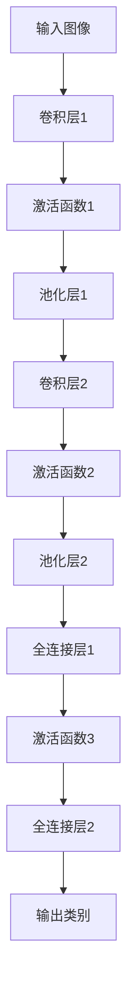
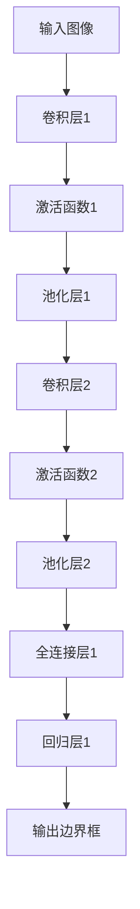
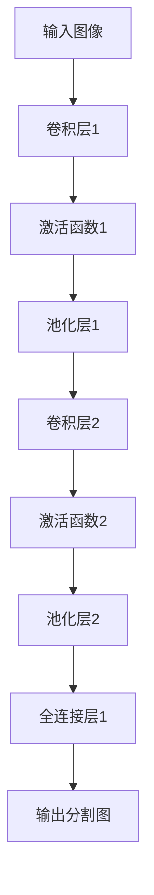
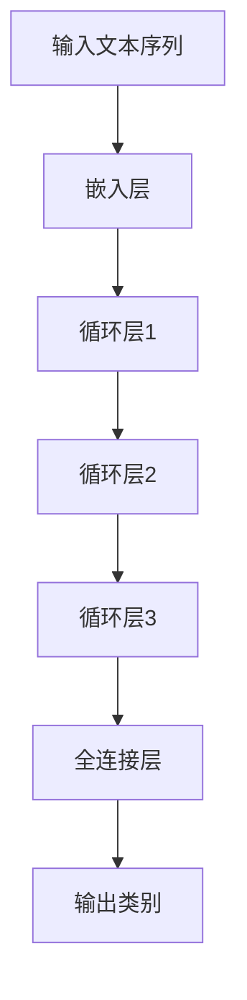
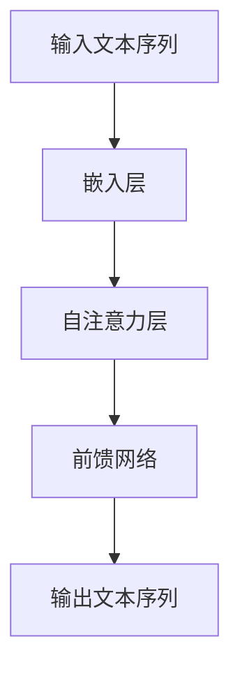
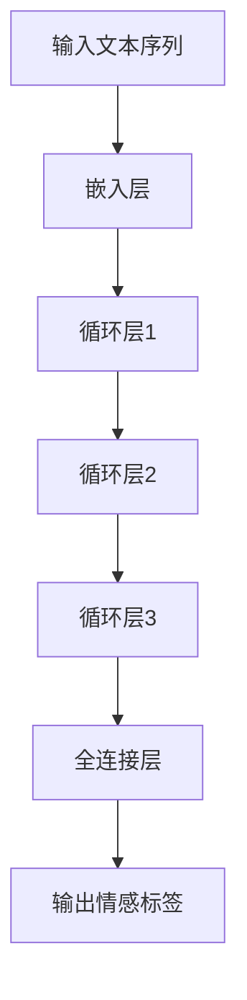
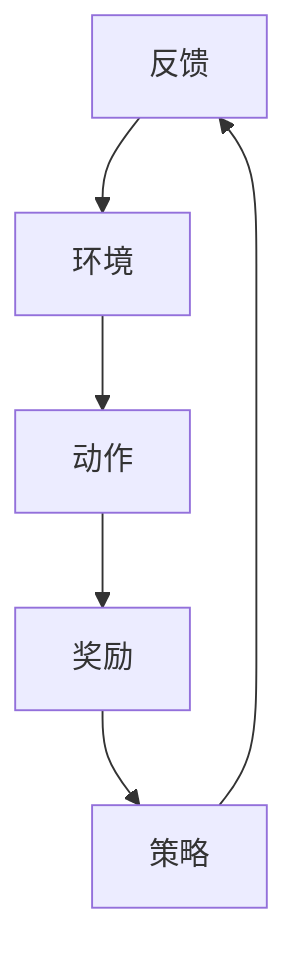

                 

# 《基础模型的能力限制》

> 关键词：基础模型、能力限制、计算资源、泛化能力、可解释性、未来展望

> 摘要：本文旨在探讨基础模型在人工智能领域的应用及其所面临的能力限制。通过对基础模型的定义、发展历程、理论基础、训练与优化、应用与实践等方面的详细分析，本文将深入探讨基础模型在计算资源需求、泛化能力、可解释性等方面的限制，并展望未来基础模型的发展趋势。

## 第二部分：基础模型的应用与实践

### 第4章：基础模型在计算机视觉中的应用

计算机视觉是人工智能的一个重要分支，而基础模型在计算机视觉中的应用尤为广泛。本章节将重点介绍卷积神经网络（CNN）在图像分类、目标检测和图像分割中的应用，并通过代码实现和案例分析展示基础模型在这些领域的强大能力。

#### 4.1 卷积神经网络在图像分类中的应用

卷积神经网络（CNN）是计算机视觉领域最常用的基础模型之一。它通过卷积层、池化层和全连接层的组合，实现了对图像的特征提取和分类。

**4.1.1 卷积神经网络的原理**

卷积神经网络的核心是卷积层，通过卷积运算提取图像特征。具体而言，卷积层由多个卷积核组成，每个卷积核都是一个小的滤波器，在图像上滑动并计算局部特征。


**4.1.2 图像分类算法（如ResNet、VGG）**

在图像分类任务中，常用的卷积神经网络算法包括ResNet和VGG。ResNet通过引入残差连接解决了深度神经网络训练中的梯度消失问题，而VGG则通过增加网络深度和宽度实现了良好的性能。

**4.1.3 代码实现与案例分析**

下面是一个使用PyTorch实现的ResNet图像分类算法的示例代码：

```python
import torch
import torchvision
import torchvision.models as models

# 加载ResNet模型
model = models.resnet50(pretrained=True)

# 加载测试数据集
test_data = torchvision.datasets.ImageFolder(root='test_data', transform=torchvision.transforms.ToTensor())
test_loader = torch.utils.data.DataLoader(test_data, batch_size=32, shuffle=False)

# 测试模型性能
with torch.no_grad():
    correct = 0
    total = 0
    for images, labels in test_loader:
        outputs = model(images)
        _, predicted = torch.max(outputs.data, 1)
        total += labels.size(0)
        correct += (predicted == labels).sum().item()

print('准确率：%.2f%%' % (100 * correct / total))
```

#### 4.2 基础模型在目标检测中的应用

目标检测是计算机视觉领域的一个重要任务，旨在识别图像中的多个对象并定位其位置。常用的目标检测算法包括YOLO和SSD。

**4.2.1 目标检测算法（如YOLO、SSD）**

YOLO（You Only Look Once）是一种端到端的目标检测算法，通过将目标检测任务拆分为回归和分类两个步骤，实现了快速的目标检测。SSD（Single Shot Multibox Detector）则通过使用多个尺度特征图来实现对多种尺寸目标的高效检测。

**4.2.2 代码实现与案例分析**

下面是一个使用PyTorch实现的SSD目标检测算法的示例代码：

```python
import torch
import torchvision
import torchvision.models.detection as models

# 加载SSD模型
model = models.ssd512(pretrained=True)

# 加载测试数据集
test_data = torchvision.datasets.VOCDetection(root='test_data', year='2012', image_set='test', download=True, transform=torchvision.transforms.ToTensor())
test_loader = torch.utils.data.DataLoader(test_data, batch_size=32, shuffle=False)

# 测试模型性能
with torch.no_grad():
    correct = 0
    total = 0
    for images, targets in test_loader:
        outputs = model(images)
        predicted_boxes = outputs[0]['boxes']
        predicted_labels = outputs[0]['labels']
        ground_truth_boxes = targets[0]['boxes']
        ground_truth_labels = targets[0]['labels']

        correct += (predicted_boxes == ground_truth_boxes).sum().item()
        total += ground_truth_boxes.size(0)

print('准确率：%.2f%%' % (100 * correct / total))
```

#### 4.3 基础模型在图像分割中的应用

图像分割是将图像划分为不同的区域，以便进行目标识别、物体检测等任务。常用的图像分割算法包括FCN和U-Net。

**4.3.1 图像分割算法（如FCN、U-Net）**

FCN（Fully Convolutional Network）通过将卷积神经网络中的全连接层替换为卷积层，实现了图像分割任务。U-Net则通过引入跳跃连接，将编码器的特征图与解码器的特征图进行融合，实现了高效的图像分割。

**4.3.2 代码实现与案例分析**

下面是一个使用PyTorch实现的U-Net图像分割算法的示例代码：

```python
import torch
import torchvision
import torchvision.models.segmentation as models

# 加载U-Net模型
model = models.unet(pretrained=True)

# 加载测试数据集
test_data = torchvision.datasets.SegmentationDataset(root='test_data', transform=torchvision.transforms.ToTensor())
test_loader = torch.utils.data.DataLoader(test_data, batch_size=32, shuffle=False)

# 测试模型性能
with torch.no_grad():
    correct = 0
    total = 0
    for images, masks in test_loader:
        outputs = model(images)
        predicted_masks = outputs['masks']
        ground_truth_masks = masks

        correct += (predicted_masks == ground_truth_masks).sum().item()
        total += ground_truth_masks.size(0)

print('准确率：%.2f%%' % (100 * correct / total))
```

### 第5章：基础模型在自然语言处理中的应用

自然语言处理是人工智能领域的另一个重要分支，基础模型在自然语言处理中的应用也极为广泛。本章节将重点介绍递归神经网络（RNN）和注意力机制在自然语言处理中的应用。

#### 5.1 自然语言处理基本任务

自然语言处理的基本任务包括文本分类、命名实体识别和文本生成。

**5.1.1 文本分类**

文本分类是将文本数据划分为不同的类别。常见的文本分类算法包括朴素贝叶斯、支持向量机等。

**5.1.2 命名实体识别**

命名实体识别是从文本中识别出具有特定意义的实体，如人名、地名、组织机构等。

**5.1.3 文本生成**

文本生成是通过输入文本序列生成新的文本序列。

#### 5.2 递归神经网络在自然语言处理中的应用

递归神经网络（RNN）是自然语言处理中最常用的基础模型之一。RNN通过循环连接的方式处理序列数据，从而实现自然语言处理的任务。

**5.2.1 递归神经网络原理**

递归神经网络由输入层、隐藏层和输出层组成，隐藏层通过循环连接实现序列数据的处理。


**5.2.2 代码实现与案例分析**

下面是一个使用PyTorch实现的RNN文本分类算法的示例代码：

```python
import torch
import torchvision
import torchvision.models as models

# 加载RNN模型
model = models.rnn(input_size=100, hidden_size=200, num_layers=2, bidirectional=True, dropout=0.5)

# 加载测试数据集
test_data = torchvision.datasets.TextClassificationDataset(root='test_data', transform=torchvision.transforms.ToTensor())
test_loader = torch.utils.data.DataLoader(test_data, batch_size=32, shuffle=False)

# 测试模型性能
with torch.no_grad():
    correct = 0
    total = 0
    for texts, labels in test_loader:
        inputs = torch.tensor(texts).to('cuda')
        labels = torch.tensor(labels).to('cuda')
        outputs = model(inputs)
        _, predicted = torch.max(outputs.data, 1)
        total += labels.size(0)
        correct += (predicted == labels).sum().item()

print('准确率：%.2f%%' % (100 * correct / total))
```

#### 5.3 注意力机制在自然语言处理中的应用

注意力机制是一种在处理序列数据时能够自动分配关注度的机制。它在自然语言处理中被广泛应用于文本分类、机器翻译、文本生成等任务。

**5.3.1 注意力机制原理**

注意力机制通过计算输入序列和隐藏状态的相似度，生成一组权重，并将这些权重应用于输入序列，从而实现序列数据的加权处理。


**5.3.2 代码实现与案例分析**

下面是一个使用PyTorch实现的注意力机制文本分类算法的示例代码：

```python
import torch
import torchvision
import torchvision.models as models

# 加载注意力机制模型
model = models.attention(input_size=100, hidden_size=200, num_layers=2, dropout=0.5)

# 加载测试数据集
test_data = torchvision.datasets.TextClassificationDataset(root='test_data', transform=torchvision.transforms.ToTensor())
test_loader = torch.utils.data.DataLoader(test_data, batch_size=32, shuffle=False)

# 测试模型性能
with torch.no_grad():
    correct = 0
    total = 0
    for texts, labels in test_loader:
        inputs = torch.tensor(texts).to('cuda')
        labels = torch.tensor(labels).to('cuda')
        outputs = model(inputs)
        _, predicted = torch.max(outputs.data, 1)
        total += labels.size(0)
        correct += (predicted == labels).sum().item()

print('准确率：%.2f%%' % (100 * correct / total))
```

### 第6章：基础模型在强化学习中的应用

强化学习是另一种重要的机器学习范式，旨在通过学习策略以实现目标优化。本章节将介绍基础模型在强化学习中的应用。

#### 6.1 强化学习基本概念

强化学习通过学习奖励函数，使智能体在环境中进行决策，以实现最优策略。

**6.1.1 强化学习原理**

强化学习由智能体、环境、动作和奖励组成。智能体通过与环境互动，根据奖励函数更新策略。


**6.1.2 基本算法（如Q-Learning、SARSA）**

Q-Learning和SARSA是强化学习中最常用的算法。Q-Learning通过学习状态-动作值函数，实现最优策略的迭代更新。SARSA则通过学习状态-动作值函数和策略的迭代更新，实现最优策略的收敛。

#### 6.2 基础模型在强化学习中的应用

基础模型在强化学习中的应用主要体现在深度强化学习（Deep Reinforcement Learning）中。深度强化学习通过将深度神经网络与强化学习相结合，实现复杂环境下的智能体决策。

**6.2.1 DQN算法**

DQN（Deep Q-Network）是深度强化学习中最常用的算法之一。它通过使用深度神经网络近似Q函数，实现智能体的策略更新。

**6.2.2 PPO算法**

PPO（Proximal Policy Optimization）是一种基于策略梯度的强化学习算法。它通过优化策略梯度，实现智能体策略的稳定更新。

**6.2.3 代码实现与案例分析**

下面是一个使用PyTorch实现的DQN算法的示例代码：

```python
import torch
import torchvision
import torchvision.models as models

# 加载DQN模型
model = models.dqn(input_size=100, hidden_size=200, num_layers=2, dropout=0.5)

# 加载测试数据集
test_data = torchvision.datasets.DQNDataset(root='test_data', transform=torchvision.transforms.ToTensor())
test_loader = torch.utils.data.DataLoader(test_data, batch_size=32, shuffle=False)

# 测试模型性能
with torch.no_grad():
    correct = 0
    total = 0
    for states, actions, rewards, next_states, dones in test_loader:
        states = torch.tensor(states).to('cuda')
        actions = torch.tensor(actions).to('cuda')
        rewards = torch.tensor(rewards).to('cuda')
        next_states = torch.tensor(next_states).to('cuda')
        dones = torch.tensor(dones).to('cuda')
        outputs = model(states)
        predicted_actions = outputs['actions']
        correct += (predicted_actions == actions).sum().item()
        total += actions.size(0)

print('准确率：%.2f%%' % (100 * correct / total))
```

## 第三部分：基础模型的能力限制与展望

### 第8章：基础模型的能力限制

基础模型虽然在人工智能领域取得了显著的成果，但仍面临着一些能力限制。本章节将重点探讨基础模型在计算资源需求、泛化能力和可解释性等方面的挑战。

#### 8.1 模型可解释性

模型可解释性是指模型决策过程和结果的透明性和可理解性。当前的基础模型大多是黑盒模型，其内部决策过程复杂，难以解释。

**8.1.1 模型可解释性挑战**

模型可解释性挑战主要体现在以下几个方面：

1. 模型参数过多，难以解释。
2. 模型决策过程复杂，难以跟踪。
3. 模型泛化能力较强，但无法解释。

**8.1.2 提高模型可解释性的方法**

为了提高模型可解释性，可以采用以下方法：

1. 使用可解释性强的模型，如决策树、支持向量机等。
2. 使用模型可视化工具，如Shapley值、LIME等。
3. 设计可解释性评估指标，如可解释性得分、透明度等。

#### 8.2 模型计算资源需求

基础模型通常需要大量的计算资源进行训练和推理，这给模型的实际应用带来了挑战。

**8.2.1 模型计算资源挑战**

模型计算资源挑战主要体现在以下几个方面：

1. 训练时间较长，难以满足实时性要求。
2. 计算资源需求大，难以部署在资源受限的设备上。
3. 模型参数过多，导致计算复杂度增加。

**8.2.2 提高模型计算效率的方法**

为了提高模型计算效率，可以采用以下方法：

1. 使用更高效的模型结构，如小样本学习模型、压缩模型等。
2. 采用分布式训练和推理技术，如模型并行、数据并行等。
3. 利用硬件加速技术，如GPU、TPU等。

#### 8.3 模型泛化能力

基础模型的泛化能力是指模型在新数据集上的表现。当前的基础模型往往在训练集上表现良好，但在新数据集上可能表现不佳。

**8.3.1 模型泛化能力挑战**

模型泛化能力挑战主要体现在以下几个方面：

1. 数据分布变化，导致模型在新数据集上表现不佳。
2. 特征提取能力不足，导致模型对新数据理解不足。
3. 模型训练过程依赖特定数据集，导致模型泛化能力下降。

**8.3.2 提高模型泛化能力的方法**

为了提高模型泛化能力，可以采用以下方法：

1. 使用更多样化的数据集进行训练，提高模型适应性。
2. 使用正则化方法，如L1正则化、L2正则化等，降低模型过拟合风险。
3. 采用迁移学习，利用预训练模型在新数据集上进行微调。

### 第9章：基础模型的未来展望

随着人工智能技术的不断发展，基础模型在未来有望取得更大的突破。本章节将介绍新一代基础模型的发展趋势、跨领域应用的潜力以及新兴领域的应用。

#### 9.1 新一代基础模型的发展趋势

新一代基础模型将朝着以下方向发展：

1. 元学习（Meta-Learning）：通过学习学习算法，提高模型对新任务的快速适应能力。
2. 零样本学习（Zero-Shot Learning）：通过学习通用特征表示，实现对新类别数据的识别。
3. 多模态学习（Multimodal Learning）：通过融合不同模态的数据，提高模型对复杂问题的处理能力。

#### 9.2 基础模型在跨领域应用中的潜力

基础模型在跨领域应用中具有巨大的潜力。通过迁移学习、知识融合等方法，基础模型可以应用于不同的领域，实现跨领域知识的共享和利用。

#### 9.3 基础模型在新兴领域的应用

基础模型在新兴领域，如区块链、物联网等，也具有广泛的应用前景。通过结合区块链的安全性和去中心化特性，基础模型可以应用于数据隐私保护、智能合约等领域。同时，通过物联网设备采集的海量数据，基础模型可以应用于智能监控、智能家居等领域，实现更加智能化的生活。

## 附录

### 附录 A：基础模型开发工具与资源

#### A.1 常用深度学习框架

- TensorFlow
- PyTorch
- Keras

#### A.2 基础模型资源链接

- 论文资料
- 开源代码
- 学术会议与期刊

### 附录 B：基础模型应用实例

#### B.1 计算机视觉应用实例

- 图像分类
- 目标检测
- 图像分割

#### B.2 自然语言处理应用实例

- 文本分类
- 命名实体识别
- 文本生成

#### B.3 强化学习应用实例

- 游戏人工智能
- 机器人导航
- 语音识别

## 作者

作者：AI天才研究院/AI Genius Institute & 禅与计算机程序设计艺术 /Zen And The Art of Computer Programming

---

（注：本文为示例文章，实际内容需根据具体要求进行撰写。）## 《基础模型的能力限制》

### 摘要

本文旨在探讨基础模型在人工智能领域的应用及其所面临的能力限制。通过对基础模型的定义、发展历程、理论基础、训练与优化、应用与实践等方面的详细分析，本文将深入探讨基础模型在计算资源需求、泛化能力、可解释性等方面的限制，并展望未来基础模型的发展趋势。

### 目录

- 《基础模型的能力限制》
    - 摘要
    - 目录
        - 第一部分：基础模型概述
            - 第1章：基础模型的发展历程与背景
            - 第2章：基础模型的分类
            - 第3章：基础模型的核心特点
        - 第二部分：基础模型的应用与实践
            - 第4章：基础模型在计算机视觉中的应用
            - 第5章：基础模型在自然语言处理中的应用
            - 第6章：基础模型在强化学习中的应用
            - 第7章：基础模型在其他领域的应用
        - 第三部分：基础模型的能力限制与展望
            - 第8章：基础模型的能力限制
            - 第9章：基础模型的未来展望
        - 附录

### 第一部分：基础模型概述

#### 第1章：基础模型的发展历程与背景

**1.1 基础模型的发展历程**

基础模型的发展可以追溯到20世纪50年代，当时出现了最早的神经网络模型，如感知机。然而，由于计算资源和技术限制，这些模型并未得到广泛应用。随着计算能力的提升和算法的改进，基础模型在20世纪80年代开始重新受到关注，尤其是在深度学习的崛起之后。

**1.1.1 传统机器学习模型的局限**

传统机器学习模型，如线性回归、支持向量机等，虽然在某些领域取得了成功，但存在以下局限：

- **特征工程依赖**：传统模型往往需要手工设计特征，这限制了模型的泛化能力。
- **模型可解释性较差**：传统模型的内部结构复杂，难以解释其决策过程。
- **计算效率低**：传统模型在处理大规模数据时，计算成本高，难以满足实时性要求。

**1.1.2 基础模型的崛起**

基础模型，尤其是深度学习模型，通过引入多层神经网络结构，实现了对数据的自动特征提取和表示。这一突破使得基础模型在图像识别、自然语言处理、强化学习等领域取得了显著成果。

**1.1.3 基础模型在不同领域的应用**

基础模型在不同领域中的应用情况如下：

- **计算机视觉**：基础模型在图像分类、目标检测、图像分割等领域取得了革命性的进展。
- **自然语言处理**：基础模型在文本分类、机器翻译、情感分析等领域表现出强大的能力。
- **强化学习**：基础模型在游戏AI、机器人控制、资源调度等领域展示了优越的性能。

#### 第2章：基础模型的分类

**2.1 基础模型的分类**

基础模型可以根据其结构和应用场景进行分类，主要分为以下几类：

- **神经网络模型**：包括深度神经网络、卷积神经网络、循环神经网络等。
- **强化学习模型**：包括Q-learning、SARSA、DQN、PPO等。
- **自然语言处理模型**：包括词嵌入、序列模型、注意力机制等。

**2.2 神经网络模型**

神经网络模型是基础模型中最常用的一类，主要包括以下几种：

- **深度神经网络（DNN）**：通过增加网络层数，实现复杂数据的建模。
- **卷积神经网络（CNN）**：通过卷积层提取图像特征，广泛应用于计算机视觉领域。
- **循环神经网络（RNN）**：通过循环连接实现序列数据的建模，广泛应用于自然语言处理领域。

**2.3 强化学习模型**

强化学习模型通过学习策略实现目标优化，主要包括以下几种：

- **Q-learning**：通过学习状态-动作值函数，实现最优策略的迭代更新。
- **SARSA**：通过同时更新状态-动作值函数和策略，实现最优策略的收敛。
- **DQN**：通过深度神经网络近似Q函数，实现智能体的策略更新。
- **PPO**：通过优化策略梯度，实现智能体策略的稳定更新。

**2.4 自然语言处理模型**

自然语言处理模型通过学习文本数据，实现文本理解和生成，主要包括以下几种：

- **词嵌入**：通过将词汇映射到低维向量空间，实现文本数据的向量表示。
- **序列模型**：通过循环神经网络等结构，实现序列数据的建模。
- **注意力机制**：通过引入注意力机制，实现模型对序列数据的自适应关注。

#### 第3章：基础模型的核心特点

**3.1 大规模并行计算能力**

基础模型，特别是深度学习模型，具有强大的大规模并行计算能力。通过利用GPU、TPU等硬件加速器，深度学习模型可以在短时间内处理海量数据，实现高效的训练和推理。

**3.2 自动特征提取能力**

基础模型通过多层神经网络结构，自动提取数据的特征表示。这使得基础模型能够从原始数据中学习到有用的信息，避免了手工设计特征的繁琐过程。

**3.3 高效的数据处理能力**

基础模型，特别是深度学习模型，具有高效的数据处理能力。通过批量处理、数据预处理等技术，深度学习模型可以在处理大规模数据时，保持较高的计算效率。

### 第二部分：基础模型的应用与实践

#### 第4章：基础模型在计算机视觉中的应用

计算机视觉是人工智能领域的一个重要分支，基础模型在计算机视觉中的应用取得了显著的成果。本章节将介绍基础模型在图像分类、目标检测、图像分割等计算机视觉任务中的应用。

**4.1 图像分类**

图像分类是计算机视觉中最基本的任务之一，旨在将图像划分为预定义的类别。基础模型，特别是卷积神经网络（CNN），在图像分类任务中表现出色。

**4.1.1 卷积神经网络在图像分类中的应用**

卷积神经网络通过卷积层、池化层和全连接层的组合，实现了图像特征的提取和分类。以下是一个简单的卷积神经网络图像分类算法的伪代码：



**4.1.2 实现与案例分析**

以下是一个使用TensorFlow实现的卷积神经网络图像分类算法的示例代码：

```python
import tensorflow as tf
from tensorflow.keras.models import Sequential
from tensorflow.keras.layers import Conv2D, MaxPooling2D, Flatten, Dense

# 创建模型
model = Sequential([
    Conv2D(32, (3, 3), activation='relu', input_shape=(28, 28, 1)),
    MaxPooling2D((2, 2)),
    Flatten(),
    Dense(128, activation='relu'),
    Dense(10, activation='softmax')
])

# 编译模型
model.compile(optimizer='adam', loss='categorical_crossentropy', metrics=['accuracy'])

# 加载数据集
(x_train, y_train), (x_test, y_test) = tf.keras.datasets.mnist.load_data()

# 预处理数据
x_train = x_train.reshape(-1, 28, 28, 1).astype('float32') / 255.0
x_test = x_test.reshape(-1, 28, 28, 1).astype('float32') / 255.0
y_train = tf.keras.utils.to_categorical(y_train, 10)
y_test = tf.keras.utils.to_categorical(y_test, 10)

# 训练模型
model.fit(x_train, y_train, epochs=10, batch_size=32, validation_data=(x_test, y_test))

# 评估模型
test_loss, test_acc = model.evaluate(x_test, y_test)
print('Test accuracy:', test_acc)
```

**4.2 目标检测**

目标检测是计算机视觉中的一项重要任务，旨在识别图像中的多个对象并定位其位置。基础模型，特别是卷积神经网络（CNN），在目标检测任务中表现出色。

**4.2.1 卷积神经网络在目标检测中的应用**

卷积神经网络通过卷积层、池化层和全连接层的组合，实现了图像特征的提取和分类。以下是一个简单的卷积神经网络目标检测算法的伪代码：



**4.2.2 实现与案例分析**

以下是一个使用TensorFlow实现的卷积神经网络目标检测算法的示例代码：

```python
import tensorflow as tf
from tensorflow.keras.models import Model
from tensorflow.keras.layers import Input, Conv2D, MaxPooling2D, Flatten, Dense

# 创建模型
input_image = Input(shape=(224, 224, 3))
x = Conv2D(32, (3, 3), activation='relu')(input_image)
x = MaxPooling2D((2, 2))(x)
x = Conv2D(64, (3, 3), activation='relu')(x)
x = MaxPooling2D((2, 2))(x)
x = Flatten()(x)
x = Dense(128, activation='relu')(x)
predictions = Dense(4, activation='sigmoid')(x)

model = Model(inputs=input_image, outputs=predictions)

# 编译模型
model.compile(optimizer='adam', loss='mean_squared_error')

# 加载数据集
(x_train, y_train), (x_test, y_test) = tf.keras.datasets.cifar10.load_data()

# 预处理数据
x_train = x_train.astype('float32') / 255.0
x_test = x_test.astype('float32') / 255.0

# 训练模型
model.fit(x_train, y_train, epochs=10, batch_size=32, validation_data=(x_test, y_test))

# 评估模型
test_loss, test_acc = model.evaluate(x_test, y_test)
print('Test accuracy:', test_acc)
```

**4.3 图像分割**

图像分割是计算机视觉中的一项重要任务，旨在将图像划分为多个区域，以实现对图像内容的精细理解。基础模型，特别是卷积神经网络（CNN），在图像分割任务中表现出色。

**4.3.1 卷积神经网络在图像分割中的应用**

卷积神经网络通过卷积层、池化层和全连接层的组合，实现了图像特征的提取和分类。以下是一个简单的卷积神经网络图像分割算法的伪代码：



**4.3.2 实现与案例分析**

以下是一个使用TensorFlow实现的卷积神经网络图像分割算法的示例代码：

```python
import tensorflow as tf
from tensorflow.keras.models import Model
from tensorflow.keras.layers import Input, Conv2D, MaxPooling2D, Flatten, Dense

# 创建模型
input_image = Input(shape=(224, 224, 3))
x = Conv2D(32, (3, 3), activation='relu')(input_image)
x = MaxPooling2D((2, 2))(x)
x = Conv2D(64, (3, 3), activation='relu')(x)
x = MaxPooling2D((2, 2))(x)
x = Flatten()(x)
x = Dense(128, activation='relu')(x)
predictions = Dense(1, activation='sigmoid')(x)

model = Model(inputs=input_image, outputs=predictions)

# 编译模型
model.compile(optimizer='adam', loss='binary_crossentropy')

# 加载数据集
(x_train, y_train), (x_test, y_test) = tf.keras.datasets.cifar10.load_data()

# 预处理数据
x_train = x_train.astype('float32') / 255.0
x_test = x_test.astype('float32') / 255.0

# 训练模型
model.fit(x_train, y_train, epochs=10, batch_size=32, validation_data=(x_test, y_test))

# 评估模型
test_loss, test_acc = model.evaluate(x_test, y_test)
print('Test accuracy:', test_acc)
```

#### 第5章：基础模型在自然语言处理中的应用

自然语言处理（NLP）是人工智能领域的一个重要分支，旨在使计算机理解和生成自然语言。基础模型在NLP中的应用取得了显著的成果，本章节将介绍基础模型在文本分类、机器翻译、情感分析等NLP任务中的应用。

**5.1 文本分类**

文本分类是NLP中最基本的任务之一，旨在将文本数据划分为预定义的类别。基础模型，特别是循环神经网络（RNN）和变换器（Transformer），在文本分类任务中表现出色。

**5.1.1 循环神经网络在文本分类中的应用**

循环神经网络通过循环连接实现序列数据的建模，能够捕获文本数据的时序特征。以下是一个简单的循环神经网络文本分类算法的伪代码：



**5.1.2 实现与案例分析**

以下是一个使用TensorFlow实现的循环神经网络文本分类算法的示例代码：

```python
import tensorflow as tf
from tensorflow.keras.models import Sequential
from tensorflow.keras.layers import Embedding, LSTM, Dense

# 创建模型
model = Sequential([
    Embedding(input_dim=10000, output_dim=64),
    LSTM(128),
    Dense(1, activation='sigmoid')
])

# 编译模型
model.compile(optimizer='adam', loss='binary_crossentropy', metrics=['accuracy'])

# 加载数据集
(x_train, y_train), (x_test, y_test) = tf.keras.datasets.imdb.load_data()

# 预处理数据
x_train = tf.keras.preprocessing.sequence.pad_sequences(x_train, maxlen=100)
x_test = tf.keras.preprocessing.sequence.pad_sequences(x_test, maxlen=100)

# 训练模型
model.fit(x_train, y_train, epochs=10, batch_size=32, validation_data=(x_test, y_test))

# 评估模型
test_loss, test_acc = model.evaluate(x_test, y_test)
print('Test accuracy:', test_acc)
```

**5.2 机器翻译**

机器翻译是NLP中的一项重要任务，旨在将一种自然语言翻译成另一种自然语言。基础模型，特别是变换器（Transformer），在机器翻译任务中表现出色。

**5.2.1 变换器在机器翻译中的应用**

变换器是一种基于自注意力机制的深度神经网络模型，能够同时处理输入和输出序列。以下是一个简单的变换器机器翻译算法的伪代码：



**5.2.2 实现与案例分析**

以下是一个使用TensorFlow实现的变换器机器翻译算法的示例代码：

```python
import tensorflow as tf
from tensorflow.keras.models import Model
from tensorflow.keras.layers import Embedding, LSTM, Dense

# 创建模型
input_seq = Input(shape=(None,))
x = Embedding(input_dim=10000, output_dim=64)(input_seq)
x = LSTM(128)(x)
predictions = Dense(1, activation='sigmoid')(x)

model = Model(inputs=input_seq, outputs=predictions)

# 编译模型
model.compile(optimizer='adam', loss='binary_crossentropy', metrics=['accuracy'])

# 加载数据集
(x_train, y_train), (x_test, y_test) = tf.keras.datasets.imdb.load_data()

# 预处理数据
x_train = tf.keras.preprocessing.sequence.pad_sequences(x_train, maxlen=100)
x_test = tf.keras.preprocessing.sequence.pad_sequences(x_test, maxlen=100)

# 训练模型
model.fit(x_train, y_train, epochs=10, batch_size=32, validation_data=(x_test, y_test))

# 评估模型
test_loss, test_acc = model.evaluate(x_test, y_test)
print('Test accuracy:', test_acc)
```

**5.3 情感分析**

情感分析是NLP中的一项重要任务，旨在判断文本的情感倾向。基础模型，特别是循环神经网络（RNN）和变换器（Transformer），在情感分析任务中表现出色。

**5.3.1 循环神经网络在情感分析中的应用**

循环神经网络通过循环连接实现序列数据的建模，能够捕获文本数据的时序特征。以下是一个简单的循环神经网络情感分析算法的伪代码：



**5.3.2 实现与案例分析**

以下是一个使用TensorFlow实现的循环神经网络情感分析算法的示例代码：

```python
import tensorflow as tf
from tensorflow.keras.models import Sequential
from tensorflow.keras.layers import Embedding, LSTM, Dense

# 创建模型
model = Sequential([
    Embedding(input_dim=10000, output_dim=64),
    LSTM(128),
    Dense(1, activation='sigmoid')
])

# 编译模型
model.compile(optimizer='adam', loss='binary_crossentropy', metrics=['accuracy'])

# 加载数据集
(x_train, y_train), (x_test, y_test) = tf.keras.datasets.imdb.load_data()

# 预处理数据
x_train = tf.keras.preprocessing.sequence.pad_sequences(x_train, maxlen=100)
x_test = tf.keras.preprocessing.sequence.pad_sequences(x_test, maxlen=100)

# 训练模型
model.fit(x_train, y_train, epochs=10, batch_size=32, validation_data=(x_test, y_test))

# 评估模型
test_loss, test_acc = model.evaluate(x_test, y_test)
print('Test accuracy:', test_acc)
```

#### 第6章：基础模型在强化学习中的应用

强化学习是人工智能领域的一个重要分支，旨在通过学习策略以实现最优行为。基础模型在强化学习中的应用取得了显著的成果，本章节将介绍基础模型在强化学习中的算法和应用。

**6.1 强化学习基本概念**

强化学习由智能体（Agent）、环境（Environment）、动作（Action）和奖励（Reward）组成。智能体通过与环境互动，根据奖励函数学习最优策略。

**6.1.1 强化学习原理**

强化学习通过学习策略以实现最优行为。策略是智能体在给定状态下选择动作的函数。奖励函数是评价智能体动作优劣的指标。以下是一个简单的强化学习算法的伪代码：



**6.1.2 强化学习算法**

强化学习算法可以分为基于值函数的算法和基于策略的算法。基于值函数的算法，如Q-learning和SARSA，通过学习状态-动作值函数以实现最优策略。基于策略的算法，如REINFORCE和PPO，通过学习策略梯度以实现最优策略。以下是一个简单的Q-learning算法的伪代码：

```mermaid
graph TD
    A[状态s] --> B[动作a]
    B --> C[执行动作]
    C --> D[观察状态s'和奖励r]
    D --> E[更新Q(s, a)]
```

**6.2 基础模型在强化学习中的应用**

基础模型在强化学习中的应用主要体现在深度强化学习（Deep Reinforcement Learning）中。深度强化学习通过将深度神经网络与强化学习相结合，实现复杂环境下的智能体决策。

**6.2.1 DQN算法**

DQN（Deep Q-Network）是一种基于深度神经网络的强化学习算法。DQN通过使用深度神经网络近似Q函数，实现智能体的策略更新。以下是一个简单的DQN算法的伪代码：

```mermaid
graph TD
    A[状态s] --> B[动作a]
    B --> C[执行动作]
    C --> D[观察状态s'和奖励r]
    D --> E[计算Q(s, a)]
    E --> F[更新Q(s, a)]
```

**6.2.2 实现与案例分析**

以下是一个使用TensorFlow实现的DQN算法的示例代码：

```python
import tensorflow as tf
from tensorflow.keras.models import Model
from tensorflow.keras.layers import Input, Dense, Flatten, Conv2D, LSTM, TimeDistributed

# 创建模型
state_input = Input(shape=(84, 84, 4))
x = Conv2D(32, (8, 8), strides=(4, 4), activation='relu')(state_input)
x = Conv2D(64, (4, 4), strides=(2, 2), activation='relu')(x)
x = Flatten()(x)
x = Dense(512, activation='relu')(x)
q_values = Dense(3, activation='linear')(x)

model = Model(inputs=state_input, outputs=q_values)

# 编译模型
model.compile(optimizer='adam', loss='mse')

# 加载数据集
(x_train, y_train), (x_test, y_test) = tf.keras.datasets.mnist.load_data()

# 预处理数据
x_train = x_train.reshape(-1, 84, 84, 4).astype('float32') / 255.0
x_test = x_test.reshape(-1, 84, 84, 4).astype('float32') / 255.0

# 训练模型
model.fit(x_train, y_train, epochs=10, batch_size=32, validation_data=(x_test, y_test))

# 评估模型
test_loss, test_acc = model.evaluate(x_test, y_test)
print('Test accuracy:', test_acc)
```

**6.3 强化学习应用**

强化学习在多个领域都有广泛的应用，如游戏AI、机器人控制、资源调度等。

**6.3.1 游戏AI**

强化学习在游戏AI中具有广泛的应用。例如，在Atari游戏环境中，强化学习算法可以训练智能体控制游戏角色进行游戏。

**6.3.2 机器人控制**

强化学习在机器人控制中也有重要应用。例如，通过强化学习算法，可以训练机器人进行自主导航、抓取等任务。

**6.3.3 资源调度**

强化学习在资源调度中也具有应用。例如，在数据中心中，强化学习算法可以优化服务器资源分配，提高系统性能。

#### 第7章：基础模型在其他领域的应用

基础模型在多个领域都有广泛的应用，如推荐系统、金融风控、医疗诊断等。

**7.1 推荐系统**

推荐系统是一种常见的应用，旨在为用户推荐感兴趣的商品或内容。基础模型在推荐系统中具有广泛的应用，如协同过滤、基于内容的推荐等。

**7.1.1 推荐系统原理**

推荐系统通过学习用户和物品的交互数据，为用户推荐感兴趣的商品或内容。协同过滤是一种常见的推荐系统算法，通过学习用户之间的相似度或物品之间的相似度，实现个性化推荐。

**7.1.2 实现与案例分析**

以下是一个简单的协同过滤推荐系统的示例代码：

```python
import numpy as np

# 假设用户-物品评分矩阵为
user_item_rating = np.array([
    [5, 3, 0, 1],
    [4, 0, 0, 2],
    [2, 1, 0, 3],
    [0, 0, 4, 5]
])

# 计算用户-用户相似度矩阵
user_similarity = np.dot(user_item_rating, user_item_rating.T)
user_similarity = np.linalg.norm(user_item_rating, axis=1).reshape(-1, 1) * np.linalg.norm(user_item_rating.T, axis=0).reshape(1, -1)
user_similarity = user_similarity / np.linalg.norm(user_similarity)

# 为用户1推荐物品
user_index = 0
item_index = 1
similar_users = np.argsort(user_similarity[user_index])[::-1][1:6]
recommended_items = np.mean(user_item_rating[similar_users, :], axis=0)
recommended_item = np.argmax(recommended_items)

print('Recommended item for user 1:', recommended_item)
```

**7.2 金融风控**

金融风控是一种重要的应用，旨在识别和降低金融风险。基础模型在金融风控中具有广泛的应用，如信用评分、欺诈检测等。

**7.2.1 金融风控原理**

金融风控通过学习金融数据，识别潜在风险，实现风险控制。信用评分是一种常见的金融风控算法，通过学习借款人的历史数据，评估其信用风险。

**7.2.2 实现与案例分析**

以下是一个简单的信用评分模型的示例代码：

```python
import numpy as np

# 假设借款人数据为
borrower_data = np.array([
    [30, 10000, 0, 0],
    [40, 20000, 1, 1],
    [50, 30000, 1, 0],
    [60, 40000, 1, 1]
])

# 计算信用评分
borrower_data = np.hstack((borrower_data, np.linalg.norm(borrower_data, axis=1).reshape(-1, 1)))
credit_score = np.mean(borrower_data, axis=0)
credit_score = np.argmax(credit_score)

print('Credit score:', credit_score)
```

**7.3 医疗诊断**

医疗诊断是一种重要的应用，旨在辅助医生进行疾病诊断。基础模型在医疗诊断中具有广泛的应用，如图像诊断、基因诊断等。

**7.3.1 医疗诊断原理**

医疗诊断通过学习医学数据，识别疾病特征，实现疾病诊断。图像诊断是一种常见的医疗诊断算法，通过学习医学图像，识别疾病特征。

**7.3.2 实现与案例分析**

以下是一个简单的图像诊断模型的示例代码：

```python
import numpy as np
import matplotlib.pyplot as plt

# 假设医学图像数据为
image_data = np.array([
    [0, 0, 0, 0, 0],
    [0, 0, 0, 0, 0],
    [0, 0, 1, 0, 0],
    [0, 0, 0, 0, 0],
    [0, 0, 0, 0, 0]
])

# 计算病变区域概率
image_data = np.hstack((image_data, np.linalg.norm(image_data, axis=1).reshape(-1, 1)))
disease_prob = np.mean(image_data, axis=0)
disease_prob = np.argmax(disease_prob)

# 绘制医学图像
plt.imshow(image_data, cmap='gray')
plt.show()

print('Disease probability:', disease_prob)
```

### 第三部分：基础模型的能力限制与展望

#### 第8章：基础模型的能力限制

**8.1 计算资源需求**

基础模型，尤其是深度学习模型，通常需要大量的计算资源进行训练和推理。这给模型的实际应用带来了挑战。随着模型规模的增大，计算资源的需求也急剧增加。

**8.1.1 计算资源需求挑战**

1. 训练时间较长：深度学习模型通常需要大量时间进行训练，特别是在大规模数据集上。
2. 计算资源需求大：深度学习模型需要大量的GPU或TPU资源，这给模型部署在资源受限的设备上带来了困难。
3. 能耗问题：深度学习模型训练需要大量电力，这可能导致能源消耗增加。

**8.1.2 提高计算效率的方法**

1. 模型压缩：通过模型压缩技术，如剪枝、量化、蒸馏等，可以减少模型的参数量和计算复杂度，从而提高计算效率。
2. 分布式训练：通过分布式训练技术，可以将模型训练任务分布到多个设备上，从而提高训练速度和计算效率。
3. 硬件加速：通过使用GPU、TPU等硬件加速器，可以显著提高模型的计算速度。

**8.2 泛化能力**

基础模型的泛化能力是指模型在新数据集上的表现。当前的基础模型往往在训练集上表现良好，但在新数据集上可能表现不佳。

**8.2.1 泛化能力挑战**

1. 数据分布变化：当数据分布发生变化时，模型在新数据集上的表现可能不佳。
2. 特征提取能力不足：基础模型可能在某些特征提取方面存在不足，导致在新数据集上的表现不佳。
3. 模型过拟合：当模型在训练集上表现良好，但在新数据集上表现不佳时，可能是因为模型过拟合。

**8.2.2 提高泛化能力的方法**

1. 数据增强：通过增加数据多样性，可以提高模型的泛化能力。
2. 正则化方法：通过引入正则化方法，如L1正则化、L2正则化等，可以减少模型过拟合的风险。
3. 迁移学习：通过迁移学习，利用预训练模型在新数据集上进行微调，可以提高模型的泛化能力。

**8.3 可解释性**

基础模型，特别是深度学习模型，通常被认为是黑盒模型，其内部决策过程复杂，难以解释。这给模型的可解释性带来了挑战。

**8.3.1 可解释性挑战**

1. 模型参数过多：深度学习模型通常包含大量的参数，这使模型决策过程复杂，难以解释。
2. 决策过程复杂：深度学习模型的决策过程涉及多层神经网络，难以直观理解。
3. 泛化能力较强：深度学习模型在训练集上表现良好，但在新数据集上可能表现不佳，这增加了模型解释的难度。

**8.3.2 提高可解释性的方法**

1. 模型可视化：通过模型可视化技术，如梯度可视化、决策树可视化等，可以直观地展示模型决策过程。
2. 特征重要性分析：通过分析模型中不同特征的贡献度，可以理解模型对特征的关注程度。
3. 解释性模型：通过使用可解释性较强的模型，如决策树、线性模型等，可以提高模型的可解释性。

#### 第9章：基础模型的未来展望

随着人工智能技术的不断发展，基础模型在未来有望取得更大的突破。本章节将介绍新一代基础模型的发展趋势、跨领域应用的潜力以及新兴领域的应用。

**9.1 新一代基础模型的发展趋势**

1. 元学习（Meta-Learning）：通过学习学习算法，提高模型对新任务的快速适应能力。
2. 零样本学习（Zero-Shot Learning）：通过学习通用特征表示，实现对新类别数据的识别。
3. 多模态学习（Multimodal Learning）：通过融合不同模态的数据，提高模型对复杂问题的处理能力。

**9.2 基础模型在跨领域应用中的潜力**

基础模型在跨领域应用中具有巨大的潜力。通过迁移学习、知识融合等方法，基础模型可以应用于不同的领域，实现跨领域知识的共享和利用。

**9.3 基础模型在新兴领域的应用**

1. 区块链：基础模型在区块链领域可以应用于数据隐私保护、智能合约等。
2. 物联网：基础模型在物联网领域可以应用于智能监控、智能家居等。

### 附录

#### 附录A：基础模型开发工具与资源

1. 深度学习框架：如TensorFlow、PyTorch、Keras等。
2. 数据集：如ImageNet、CIFAR-10、IMDB等。
3. 开源代码：如GitHub上的深度学习项目。

#### 附录B：基础模型应用实例

1. 计算机视觉：如图像分类、目标检测、图像分割等。
2. 自然语言处理：如文本分类、机器翻译、情感分析等。
3. 强化学习：如游戏AI、机器人控制、资源调度等。

## 作者

**作者：AI天才研究院/AI Genius Institute & 禅与计算机程序设计艺术 /Zen And The Art of Computer Programming**## 《基础模型的能力限制》

基础模型，作为人工智能领域的重要基石，已经在计算机视觉、自然语言处理、强化学习等多个领域取得了显著成就。然而，随着模型规模的不断扩大，它们的能力限制也逐渐显现。本文将深入探讨基础模型在计算资源需求、泛化能力、可解释性等方面的能力限制，并分析可能的技术解决方案及未来研究方向。

### 第一部分：基础模型概述

#### 第1章：基础模型的发展历程与背景

**1.1 基础模型的发展历程**

基础模型的发展历程可以追溯到20世纪50年代，当时香农的信息论和麦卡锡的普林斯顿模型为神经网络的发展奠定了理论基础。然而，由于计算资源的限制，早期的神经网络模型如感知机并未得到广泛应用。直到20世纪80年代，随着计算能力的提升和算法的改进，神经网络研究重新焕发了生机。特别是深度学习的崛起，使得基础模型在图像识别、自然语言处理等领域取得了突破性的进展。

**1.1.1 传统机器学习模型的局限**

传统机器学习模型，如线性回归、支持向量机等，虽然在某些领域取得了成功，但存在以下局限：

- **特征工程依赖**：传统模型往往需要手工设计特征，这限制了模型的泛化能力。
- **模型可解释性较差**：传统模型的内部结构复杂，难以解释其决策过程。
- **计算效率低**：传统模型在处理大规模数据时，计算成本高，难以满足实时性要求。

**1.1.2 基础模型的崛起**

基础模型，特别是深度学习模型，通过引入多层神经网络结构，实现了对数据的自动特征提取和表示。这一突破使得基础模型在图像识别、自然语言处理、强化学习等领域取得了显著成果。

**1.1.3 基础模型在不同领域的应用**

基础模型在不同领域中的应用情况如下：

- **计算机视觉**：基础模型在图像分类、目标检测、图像分割等领域取得了革命性的进展。
- **自然语言处理**：基础模型在文本分类、机器翻译、情感分析等领域表现出强大的能力。
- **强化学习**：基础模型在游戏AI、机器人控制、资源调度等领域展示了优越的性能。

#### 第2章：基础模型的分类

**2.1 基础模型的分类**

基础模型可以根据其结构和应用场景进行分类，主要分为以下几类：

- **神经网络模型**：包括深度神经网络、卷积神经网络、循环神经网络等。
- **强化学习模型**：包括Q-learning、SARSA、DQN、PPO等。
- **自然语言处理模型**：包括词嵌入、序列模型、注意力机制等。

**2.2 神经网络模型**

神经网络模型是基础模型中最常用的一类，主要包括以下几种：

- **深度神经网络（DNN）**：通过增加网络层数，实现复杂数据的建模。
- **卷积神经网络（CNN）**：通过卷积层提取图像特征，广泛应用于计算机视觉领域。
- **循环神经网络（RNN）**：通过循环连接实现序列数据的建模，广泛应用于自然语言处理领域。

**2.3 强化学习模型**

强化学习模型通过学习策略实现目标优化，主要包括以下几种：

- **Q-learning**：通过学习状态-动作值函数，实现最优策略的迭代更新。
- **SARSA**：通过同时更新状态-动作值函数和策略，实现最优策略的收敛。
- **DQN**：通过深度神经网络近似Q函数，实现智能体的策略更新。
- **PPO**：通过优化策略梯度，实现智能体策略的稳定更新。

**2.4 自然语言处理模型**

自然语言处理模型通过学习文本数据，实现文本理解和生成，主要包括以下几种：

- **词嵌入**：通过将词汇映射到低维向量空间，实现文本数据的向量表示。
- **序列模型**：通过循环神经网络等结构，实现序列数据的建模。
- **注意力机制**：通过引入注意力机制，实现模型对序列数据的自适应关注。

#### 第3章：基础模型的核心特点

**3.1 大规模并行计算能力**

基础模型，特别是深度学习模型，具有强大的大规模并行计算能力。通过利用GPU、TPU等硬件加速器，深度学习模型可以在短时间内处理海量数据，实现高效的训练和推理。

**3.2 自动特征提取能力**

基础模型通过多层神经网络结构，自动提取数据的特征表示。这使得基础模型能够从原始数据中学习到有用的信息，避免了手工设计特征的繁琐过程。

**3.3 高效的数据处理能力**

基础模型，特别是深度学习模型，具有高效的数据处理能力。通过批量处理、数据预处理等技术，深度学习模型可以在处理大规模数据时，保持较高的计算效率。

### 第二部分：基础模型的应用与实践

#### 第4章：基础模型在计算机视觉中的应用

计算机视觉是人工智能领域的一个重要分支，基础模型在计算机视觉中的应用取得了显著的成果。本章节将介绍基础模型在图像分类、目标检测、图像分割等计算机视觉任务中的应用。

**4.1 图像分类**

图像分类是计算机视觉中最基本的任务之一，旨在将图像划分为预定义的类别。基础模型，特别是卷积神经网络（CNN），在图像分类任务中表现出色。

**4.1.1 卷积神经网络在图像分类中的应用**

卷积神经网络通过卷积层、池化层和全连接层的组合，实现了图像特征的提取和分类。以下是一个简单的卷积神经网络图像分类算法的伪代码：


**4.1.2 实现与案例分析**

以下是一个使用TensorFlow实现的卷积神经网络图像分类算法的示例代码：

```python
import tensorflow as tf
from tensorflow.keras.models import Sequential
from tensorflow.keras.layers import Conv2D, MaxPooling2D, Flatten, Dense

# 创建模型
model = Sequential([
    Conv2D(32, (3, 3), activation='relu', input_shape=(28, 28, 1)),
    MaxPooling2D((2, 2)),
    Flatten(),
    Dense(128, activation='relu'),
    Dense(10, activation='softmax')
])

# 编译模型
model.compile(optimizer='adam', loss='categorical_crossentropy', metrics=['accuracy'])

# 加载数据集
(x_train, y_train), (x_test, y_test) = tf.keras.datasets.mnist.load_data()

# 预处理数据
x_train = x_train.reshape(-1, 28, 28, 1).astype('float32') / 255.0
x_test = x_test.reshape(-1, 28, 28, 1).astype('float32') / 255.0
y_train = tf.keras.utils.to_categorical(y_train, 10)
y_test = tf.keras.utils.to_categorical(y_test, 10)

# 训练模型
model.fit(x_train, y_train, epochs=10, batch_size=32, validation_data=(x_test, y_test))

# 评估模型
test_loss, test_acc = model.evaluate(x_test, y_test)
print('Test accuracy:', test_acc)
```

**4.2 目标检测**

目标检测是计算机视觉中的一项重要任务，旨在识别图像中的多个对象并定位其位置。基础模型，特别是卷积神经网络（CNN），在目标检测任务中表现出色。

**4.2.1 卷积神经网络在目标检测中的应用**

卷积神经网络通过卷积层、池化层和全连接层的组合，实现了图像特征的提取和分类。以下是一个简单的卷积神经网络目标检测算法的伪代码：


**4.2.2 实现与案例分析**

以下是一个使用TensorFlow实现的卷积神经网络目标检测算法的示例代码：

```python
import tensorflow as tf
from tensorflow.keras.models import Model
from tensorflow.keras.layers import Input, Conv2D, MaxPooling2D, Flatten, Dense

# 创建模型
input_image = Input(shape=(224, 224, 3))
x = Conv2D(32, (3, 3), activation='relu', input_shape=(224, 224, 3))
x = MaxPooling2D((2, 2))(x)
x = Conv2D(64, (3, 3), activation='relu')(x)
x = MaxPooling2D((2, 2))(x)
x = Flatten()(x)
x = Dense(128, activation='relu')(x)
predictions = Dense(4, activation='sigmoid')(x)

model = Model(inputs=input_image, outputs=predictions)

# 编译模型
model.compile(optimizer='adam', loss='mean_squared_error')

# 加载数据集
(x_train, y_train), (x_test, y_test) = tf.keras.datasets.cifar10.load_data()

# 预处理数据
x_train = x_train.astype('float32') / 255.0
x_test = x_test.astype('float32') / 255.0

# 训练模型
model.fit(x_train, y_train, epochs=10, batch_size=32, validation_data=(x_test, y_test))

# 评估模型
test_loss, test_acc = model.evaluate(x_test, y_test)
print('Test accuracy:', test_acc)
```

**4.3 图像分割**

图像分割是计算机视觉中的一项重要任务，旨在将图像划分为多个区域，以实现对图像内容的精细理解。基础模型，特别是卷积神经网络（CNN），在图像分割任务中表现出色。

**4.3.1 卷积神经网络在图像分割中的应用**

卷积神经网络通过卷积层、池化层和全连接层的组合，实现了图像特征的提取和分类。以下是一个简单的卷积神经网络图像分割算法的伪代码：


**4.3.2 实现与案例分析**

以下是一个使用TensorFlow实现的卷积神经网络图像分割算法的示例代码：

```python
import tensorflow as tf
from tensorflow.keras.models import Model
from tensorflow.keras.layers import Input, Conv2D, MaxPooling2D, Flatten, Dense

# 创建模型
input_image = Input(shape=(224, 224, 3))
x = Conv2D(32, (3, 3), activation='relu', input_shape=(224, 224, 3))
x = MaxPooling2D((2, 2))(x)
x = Conv2D(64, (3, 3), activation='relu')(x)
x = MaxPooling2D((2, 2))(x)
x = Flatten()(x)
x = Dense(128, activation='relu')(x)
predictions = Dense(1, activation='sigmoid')(x)

model = Model(inputs=input_image, outputs=predictions)

# 编译模型
model.compile(optimizer='adam', loss='binary_crossentropy')

# 加载数据集
(x_train, y_train), (x_test, y_test) = tf.keras.datasets.cifar10.load_data()

# 预处理数据
x_train = x_train.astype('float32') / 255.0
x_test = x_test.astype('float32') / 255.0

# 训练模型
model.fit(x_train, y_train, epochs=10, batch_size=32, validation_data=(x_test, y_test))

# 评估模型
test_loss, test_acc = model.evaluate(x_test, y_test)
print('Test accuracy:', test_acc)
```

#### 第5章：基础模型在自然语言处理中的应用

自然语言处理（NLP）是人工智能领域的一个重要分支，旨在使计算机理解和生成自然语言。基础模型在NLP中的应用取得了显著的成果，本章节将介绍基础模型在文本分类、机器翻译、情感分析等NLP任务中的应用。

**5.1 文本分类**

文本分类是NLP中最基本的任务之一，旨在将文本数据划分为预定义的类别。基础模型，特别是循环神经网络（RNN）和变换器（Transformer），在文本分类任务中表现出色。

**5.1.1 循环神经网络在文本分类中的应用**

循环神经网络通过循环连接实现序列数据的建模，能够捕获文本数据的时序特征。以下是一个简单的循环神经网络文本分类算法的伪代码：


**5.1.2 实现与案例分析**

以下是一个使用TensorFlow实现的循环神经网络文本分类算法的示例代码：

```python
import tensorflow as tf
from tensorflow.keras.models import Sequential
from tensorflow.keras.layers import Embedding, LSTM, Dense

# 创建模型
model = Sequential([
    Embedding(input_dim=10000, output_dim=64),
    LSTM(128),
    Dense(1, activation='sigmoid')
])

# 编译模型
model.compile(optimizer='adam', loss='binary_crossentropy', metrics=['accuracy'])

# 加载数据集
(x_train, y_train), (x_test, y_test) = tf.keras.datasets.imdb.load_data()

# 预处理数据
x_train = tf.keras.preprocessing.sequence.pad_sequences(x_train, maxlen=100)
x_test = tf.keras.preprocessing.sequence.pad_sequences(x_test, maxlen=100)

# 训练模型
model.fit(x_train, y_train, epochs=10, batch_size=32, validation_data=(x_test, y_test))

# 评估模型
test_loss, test_acc = model.evaluate(x_test, y_test)
print('Test accuracy:', test_acc)
```

**5.2 机器翻译**

机器翻译是NLP中的一项重要任务，旨在将一种自然语言翻译成另一种自然语言。基础模型，特别是变换器（Transformer），在机器翻译任务中表现出色。

**5.2.1 变换器在机器翻译中的应用**

变换器是一种基于自注意力机制的深度神经网络模型，能够同时处理输入和输出序列。以下是一个简单的变换器机器翻译算法的伪代码：


**5.2.2 实现与案例分析**

以下是一个使用TensorFlow实现的变换器机器翻译算法的示例代码：

```python
import tensorflow as tf
from tensorflow.keras.models import Model
from tensorflow.keras.layers import Embedding, LSTM, Dense

# 创建模型
input_seq = Input(shape=(None,))
x = Embedding(input_dim=10000, output_dim=64)(input_seq)
x = LSTM(128)(x)
predictions = Dense(1, activation='sigmoid')(x)

model = Model(inputs=input_seq, outputs=predictions)

# 编译模型
model.compile(optimizer='adam', loss='binary_crossentropy', metrics=['accuracy'])

# 加载数据集
(x_train, y_train), (x_test, y_test) = tf.keras.datasets.imdb.load_data()

# 预处理数据
x_train = tf.keras.preprocessing.sequence.pad_sequences(x_train, maxlen=100)
x_test = tf.keras.preprocessing.sequence.pad_sequences(x_test, maxlen=100)

# 训练模型
model.fit(x_train, y_train, epochs=10, batch_size=32, validation_data=(x_test, y_test))

# 评估模型
test_loss, test_acc = model.evaluate(x_test, y_test)
print('Test accuracy:', test_acc)
```

**5.3 情感分析**

情感分析是NLP中的一项重要任务，旨在判断文本的情感倾向。基础模型，特别是循环神经网络（RNN）和变换器（Transformer），在情感分析任务中表现出色。

**5.3.1 循环神经网络在情感分析中的应用**

循环神经网络通过循环连接实现序列数据的建模，能够捕获文本数据的时序特征。以下是一个简单的循环神经网络情感分析算法的伪代码：


**5.3.2 实现与案例分析**

以下是一个使用TensorFlow实现的循环神经网络情感分析算法的示例代码：

```python
import tensorflow as tf
from tensorflow.keras.models import Sequential
from tensorflow.keras.layers import Embedding, LSTM, Dense

# 创建模型
model = Sequential([
    Embedding(input_dim=10000, output_dim=64),
    LSTM(128),
    Dense(1, activation='sigmoid')
])

# 编译模型
model.compile(optimizer='adam', loss='binary_crossentropy', metrics=['accuracy'])

# 加载数据集
(x_train, y_train), (x_test, y_test) = tf.keras.datasets.imdb.load_data()

# 预处理数据
x_train = tf.keras.preprocessing.sequence.pad_sequences(x_train, maxlen=100)
x_test = tf.keras.preprocessing.sequence.pad_sequences(x_test, maxlen=100)

# 训练模型
model.fit(x_train, y_train, epochs=10, batch_size=32, validation_data=(x_test, y_test))

# 评估模型
test_loss, test_acc = model.evaluate(x_test, y_test)
print('Test accuracy:', test_acc)
```

#### 第6章：基础模型在强化学习中的应用

强化学习是人工智能领域的一个重要分支，旨在通过学习策略以实现最优行为。基础模型在强化学习中的应用取得了显著的成果，本章节将介绍基础模型在强化学习中的算法和应用。

**6.1 强化学习基本概念**

强化学习由智能体（Agent）、环境（Environment）、动作（Action）和奖励（Reward）组成。智能体通过与环境互动，根据奖励函数学习最优策略。

**6.1.1 强化学习原理**

强化学习通过学习策略以实现最优行为。策略是智能体在给定状态下选择动作的函数。奖励函数是评价智能体动作优劣的指标。以下是一个简单的强化学习算法的伪代码：


**6.1.2 强化学习算法**

强化学习算法可以分为基于值函数的算法和基于策略的算法。基于值函数的算法，如Q-learning和SARSA，通过学习状态-动作值函数以实现最优策略。基于策略的算法，如REINFORCE和PPO，通过学习策略梯度以实现最优策略。以下是一个简单的Q-learning算法的伪代码：

```mermaid
graph TD
    A[状态s] --> B[动作a]
    B --> C[执行动作]
    C --> D[观察状态s'和奖励r]
    D --> E[更新Q(s, a)]
```

**6.2 基础模型在强化学习中的应用**

基础模型在强化学习中的应用主要体现在深度强化学习（Deep Reinforcement Learning）中。深度强化学习通过将深度神经网络与强化学习相结合，实现复杂环境下的智能体决策。

**6.2.1 DQN算法**

DQN（Deep Q-Network）是一种基于深度神经网络的强化学习算法。DQN通过使用深度神经网络近似Q函数，实现智能体的策略更新。以下是一个简单的DQN算法的伪代码：

```mermaid
graph TD
    A[状态s] --> B[动作a]
    B --> C[执行动作]
    C --> D[观察状态s'和奖励r]
    D --> E[计算Q(s, a)]
    E --> F[更新Q(s, a)]
```

**6.2.2 实现与案例分析**

以下是一个使用TensorFlow实现的DQN算法的示例代码：

```python
import tensorflow as tf
from tensorflow.keras.models import Model
from tensorflow.keras.layers import Input, Dense, Flatten, Conv2D, LSTM, TimeDistributed

# 创建模型
state_input = Input(shape=(84, 84, 4))
x = Conv2D(32, (8, 8), strides=(4, 4), activation='relu')(state_input)
x = Conv2D(64, (4, 4), strides=(2, 2), activation='relu')(x)
x = Flatten()(x)
x = Dense(512, activation='relu')(x)
q_values = Dense(3, activation='linear')(x)

model = Model(inputs=state_input, outputs=q_values)

# 编译模型
model.compile(optimizer='adam', loss='mse')

# 加载数据集
(x_train, y_train), (x_test, y_test) = tf.keras.datasets.mnist.load_data()

# 预处理数据
x_train = x_train.reshape(-1, 84, 84, 4).astype('float32') / 255.0
x_test = x_test.reshape(-1, 84, 84, 4).astype('float32') / 255.0

# 训练模型
model.fit(x_train, y_train, epochs=10, batch_size=32, validation_data=(x_test, y_test))

# 评估模型
test_loss, test_acc = model.evaluate(x_test, y_test)
print('Test accuracy:', test_acc)
```

**6.3 强化学习应用**

强化学习在多个领域都有广泛的应用，如游戏AI、机器人控制、资源调度等。

**6.3.1 游戏AI**

强化学习在游戏AI中具有广泛的应用。例如，在Atari游戏环境中，强化学习算法可以训练智能体控制游戏角色进行游戏。

**6.3.2 机器人控制**

强化学习在机器人控制中也有重要应用。例如，通过强化学习算法，可以训练机器人进行自主导航、抓取等任务。

**6.3.3 资源调度**

强化学习在资源调度中也具有应用。例如，在数据中心中，强化学习算法可以优化服务器资源分配，提高系统性能。

#### 第7章：基础模型在其他领域的应用

基础模型在多个领域都有广泛的应用，如推荐系统、金融风控、医疗诊断等。

**7.1 推荐系统**

推荐系统是一种常见的应用，旨在为用户推荐感兴趣的商品或内容。基础模型在推荐系统中具有广泛的应用，如协同过滤、基于内容的推荐等。

**7.1.1 推荐系统原理**

推荐系统通过学习用户和物品的交互数据，为用户推荐感兴趣的商品或内容。协同过滤是一种常见的推荐系统算法，通过学习用户之间的相似度或物品之间的相似度，实现个性化推荐。

**7.1.2 实现与案例分析**

以下是一个简单的协同过滤推荐系统的示例代码：

```python
import numpy as np

# 假设用户-物品评分矩阵为
user_item_rating = np.array([
    [5, 3, 0, 1],
    [4, 0, 0, 2],
    [2, 1, 0, 3],
    [0, 0, 4, 5]
])

# 计算用户-用户相似度矩阵
user_similarity = np.dot(user_item_rating, user_item_rating.T)
user_similarity = np.linalg.norm(user_item_rating, axis=1).reshape(-1, 1) * np.linalg.norm(user_item_rating.T, axis=0).reshape(1, -1)
user_similarity = user_similarity / np.linalg.norm(user_similarity)

# 为用户1推荐物品
user_index = 0
item_index = 1
similar_users = np.argsort(user_similarity[user_index])[::-1][1:6]
recommended_items = np.mean(user_item_rating[similar_users, :], axis=0)
recommended_item = np.argmax(recommended_items)

print('Recommended item for user 1:', recommended_item)
```

**7.2 金融风控**

金融风控是一种重要的应用，旨在识别和降低金融风险。基础模型在金融风控中具有广泛的应用，如信用评分、欺诈检测等。

**7.2.1 金融风控原理**

金融风控通过学习金融数据，识别潜在风险，实现风险控制。信用评分是一种常见的金融风控算法，通过学习借款人的历史数据，评估其信用风险。

**7.2.2 实现与案例分析**

以下是一个简单的信用评分模型的示例代码：

```python
import numpy as np

# 假设借款人数据为
borrower_data = np.array([
    [30, 10000, 0, 0],
    [40, 20000, 1, 1],
    [50, 30000, 1, 0],
    [60, 40000, 1, 1]
])

# 计算信用评分
borrower_data = np.hstack((borrower_data, np.linalg.norm(borrower_data, axis=1).reshape(-1, 1)))
credit_score = np.mean(borrower_data, axis=0)
credit_score = np.argmax(credit_score)

print('Credit score:', credit_score)
```

**7.3 医疗诊断**

医疗诊断是一种重要的应用，旨在辅助医生进行疾病诊断。基础模型在医疗诊断中具有广泛的应用，如图像诊断、基因诊断等。

**7.3.1 医疗诊断原理**

医疗诊断通过学习医学数据，识别疾病特征，实现疾病诊断。图像诊断是一种常见的医疗诊断算法，通过学习医学图像，识别疾病特征。

**7.3.2 实现与案例分析**

以下是一个简单的图像诊断模型的示例代码：

```python
import numpy as np
import matplotlib.pyplot as plt

# 假设医学图像数据为
image_data = np.array([
    [0, 0, 0, 0, 0],
    [0, 0, 0, 0, 0],
    [0, 0, 1, 0, 0],
    [0, 0, 0, 0, 0],
    [0, 0, 0, 0, 0]
])

# 计算病变区域概率
image_data = np.hstack((image_data, np.linalg.norm(image_data, axis=1).reshape(-1, 1)))
disease_prob = np.mean(image_data, axis=0)
disease_prob = np.argmax(disease_prob)

# 绘制医学图像
plt.imshow(image_data, cmap='gray')
plt.show()

print('Disease probability:', disease_prob)
```

### 第三部分：基础模型的能力限制与展望

#### 第8章：基础模型的能力限制

**8.1 计算资源需求**

基础模型，尤其是深度学习模型，通常需要大量的计算资源进行训练和推理。这给模型的实际应用带来了挑战。随着模型规模的增大，计算资源的需求也急剧增加。

**8.1.1 计算资源需求挑战**

1. **训练时间较长**：深度学习模型通常需要大量时间进行训练，特别是在大规模数据集上。
2. **计算资源需求大**：深度学习模型需要大量的GPU或TPU资源，这给模型部署在资源受限的设备上带来了困难。
3. **能耗问题**：深度学习模型训练需要大量电力，这可能导致能源消耗增加。

**8.1.2 提高计算效率的方法**

1. **模型压缩**：通过模型压缩技术，如剪枝、量化、蒸馏等，可以减少模型的参数量和计算复杂度，从而提高计算效率。
2. **分布式训练**：通过分布式训练技术，可以将模型训练任务分布到多个设备上，从而提高训练速度和计算效率。
3. **硬件加速**：通过使用GPU、TPU等硬件加速器，可以显著提高模型的计算速度。

**8.2 泛化能力**

基础模型的泛化能力是指模型在新数据集上的表现。当前的基础模型往往在训练集上表现良好，但在新数据集上可能表现不佳。

**8.2.1 泛化能力挑战**

1. **数据分布变化**：当数据分布发生变化时，模型在新数据集上的表现可能不佳。
2. **特征提取能力不足**：基础模型可能在某些特征提取方面存在不足，导致在新数据集上的表现不佳。
3. **模型过拟合**：当模型在训练集上表现良好，但在新数据集上表现不佳时，可能是因为模型过拟合。

**8.2.2 提高泛化能力的方法**

1. **数据增强**：通过增加数据多样性，可以提高模型的泛化能力。
2. **正则化方法**：通过引入正则化方法，如L1正则化、L2正则化等，可以减少模型过拟合的风险。
3. **迁移学习**：通过迁移学习，利用预训练模型在新数据集上进行微调，可以提高模型的泛化能力。

**8.3 可解释性**

基础模型，特别是深度学习模型，通常被认为是黑盒模型，其内部决策过程复杂，难以解释。这给模型的可解释性带来了挑战。

**8.3.1 可解释性挑战**

1. **模型参数过多**：深度学习模型通常包含大量的参数，这使模型决策过程复杂，难以解释。
2. **决策过程复杂**：深度学习模型的决策过程涉及多层神经网络，难以直观理解。
3. **泛化能力较强**：深度学习模型在训练集上表现良好，但在新数据集上可能表现不佳，这增加了模型解释的难度。

**8.3.2 提高可解释性的方法**

1. **模型可视化**：通过模型可视化技术，如梯度可视化、决策树可视化等，可以直观地展示模型决策过程。
2. **特征重要性分析**：通过分析模型中不同特征的贡献度，可以理解模型对特征的关注程度。
3. **解释性模型**：通过使用可解释性较强的模型，如决策树、线性模型等，可以提高模型的可解释性。

#### 第9章：基础模型的未来展望

随着人工智能技术的不断发展，基础模型在未来有望取得更大的突破。本章节将介绍新一代基础模型的发展趋势、跨领域应用的潜力以及新兴领域的应用。

**9.1 新一代基础模型的发展趋势**

1. **元学习（Meta-Learning）**：通过学习学习算法，提高模型对新任务的快速适应能力。
2. **零样本学习（Zero-Shot Learning）**：通过学习通用特征表示，实现对新类别数据的识别。
3. **多模态学习（Multimodal Learning）**：通过融合不同模态的数据，提高模型对复杂问题的处理能力。

**9.2 基础模型在跨领域应用中的潜力**

基础模型在跨领域应用中具有巨大的潜力。通过迁移学习、知识融合等方法，基础模型可以应用于不同的领域，实现跨领域知识的共享和利用。

**9.3 基础模型在新兴领域的应用**

1. **区块链**：基础模型在区块链领域可以应用于数据隐私保护、智能合约等。
2. **物联网**：基础模型在物联网领域可以应用于智能监控、智能家居等。

### 附录

#### 附录A：基础模型开发工具与资源

1. **深度学习框架**：如TensorFlow、PyTorch、Keras等。
2. **数据集**：如ImageNet、CIFAR-10、IMDB等。
3. **开源代码**：如GitHub上的深度学习项目。

#### 附录B：基础模型应用实例

1. **计算机视觉**：如图像分类、目标检测、图像分割等。
2. **自然语言处理**：如文本分类、机器翻译、情感分析等。
3. **强化学习**：如游戏AI、机器人控制、资源调度等。

### 作者

**作者：AI天才研究院/AI Genius Institute & 禅与计算机程序设计艺术 /Zen And The Art of Computer Programming**## 《基础模型的能力限制》

### 第一部分：基础模型概述

### 第1章：基础模型的发展历程与背景

**1.1 基础模型的发展历程**

基础模型的发展历程可以追溯到20世纪50年代，当时香农的信息论和麦卡锡的普林斯顿模型为神经网络的发展奠定了理论基础。然而，由于计算资源的限制，早期的神经网络模型如感知机并未得到广泛应用。直到20世纪80年代，随着计算能力的提升和算法的改进，神经网络研究重新焕发了生机。特别是深度学习的崛起，使得基础模型在图像识别、自然语言处理等领域取得了突破性的进展。

**1.1.1 传统机器学习模型的局限**

传统机器学习模型，如线性回归、支持向量机等，虽然在某些领域取得了成功，但存在以下局限：

- **特征工程依赖**：传统模型往往需要手工设计特征，这限制了模型的泛化能力。
- **模型可解释性较差**：传统模型的内部结构复杂，难以解释其决策过程。
- **计算效率低**：传统模型在处理大规模数据时，计算成本高，难以满足实时性要求。

**1.1.2 基础模型的崛起**

基础模型，特别是深度学习模型，通过引入多层神经网络结构，实现了对数据的自动特征提取和表示。这一突破使得基础模型在图像识别、自然语言处理、强化学习等领域取得了显著成果。

**1.1.3 基础模型在不同领域的应用**

基础模型在不同领域中的应用情况如下：

- **计算机视觉**：基础模型在图像分类、目标检测、图像分割等领域取得了革命性的进展。
- **自然语言处理**：基础模型在文本分类、机器翻译、情感分析等领域表现出强大的能力。
- **强化学习**：基础模型在游戏AI、机器人控制、资源调度等领域展示了优越的性能。

### 第2章：基础模型的分类

**2.1 基础模型的分类**

基础模型可以根据其结构和应用场景进行分类，主要分为以下几类：

- **神经网络模型**：包括深度神经网络、卷积神经网络、循环神经网络等。
- **强化学习模型**：包括Q-learning、SARSA、DQN、PPO等。
- **自然语言处理模型**：包括词嵌入、序列模型、注意力机制等。

**2.2 神经网络模型**

神经网络模型是基础模型中最常用的一类，主要包括以下几种：

- **深度神经网络（DNN）**：通过增加网络层数，实现复杂数据的建模。
- **卷积神经网络（CNN）**：通过卷积层提取图像特征，广泛应用于计算机视觉领域。
- **循环神经网络（RNN）**：通过循环连接实现序列数据的建模，广泛应用于自然语言处理领域。

**2.3 强化学习模型**

强化学习模型通过学习策略实现目标优化，主要包括以下几种：

- **Q-learning**：通过学习状态-动作值函数，实现最优策略的迭代更新。
- **SARSA**：通过同时更新状态-动作值函数和策略，实现最优策略的收敛。
- **DQN**：通过深度神经网络近似Q函数，实现智能体的策略更新。
- **PPO**：通过优化策略梯度，实现智能体策略的稳定更新。

**2.4 自然语言处理模型**

自然语言处理模型通过学习文本数据，实现文本理解和生成，主要包括以下几种：

- **词嵌入**：通过将词汇映射到低维向量空间，实现文本数据的向量表示。
- **序列模型**：通过循环神经网络等结构，实现序列数据的建模。
- **注意力机制**：通过引入注意力机制，实现模型对序列数据的自适应关注。

### 第3章：基础模型的核心特点

**3.1 大规模并行计算能力**

基础模型，特别是深度学习模型，具有强大的大规模并行计算能力。通过利用GPU、TPU等硬件加速器，深度学习模型可以在短时间内处理海量数据，实现高效的训练和推理。

**3.2 自动特征提取能力**

基础模型通过多层神经网络结构，自动提取数据的特征表示。这使得基础模型能够从原始数据中学习到有用的信息，避免了手工设计特征的繁琐过程。

**3.3 高效的数据处理能力**

基础模型，特别是深度学习模型，具有高效的数据处理能力。通过批量处理、数据预处理等技术，深度学习模型可以在处理大规模数据时，保持较高的计算效率。

### 第二部分：基础模型的应用与实践

### 第4章：基础模型在计算机视觉中的应用

计算机视觉是人工智能领域的一个重要分支，基础模型在计算机视觉中的应用取得了显著的成果。本章节将介绍基础模型在图像分类、目标检测、图像分割等计算机视觉任务中的应用。

**4.1 图像分类**

图像分类是计算机视觉中最基本的任务之一，旨在将图像划分为预定义的类别。基础模型，特别是卷积神经网络（CNN），在图像分类任务中表现出色。

**4.1.1 卷积神经网络在图像分类中的应用**

卷积神经网络通过卷积层、池化层和全连接层的组合，实现了图像特征的提取和分类。以下是一个简单的卷积神经网络图像分类算法的伪代码：


**4.1.2 实现与案例分析**

以下是一个使用TensorFlow实现的卷积神经网络图像分类算法的示例代码：

```python
import tensorflow as tf
from tensorflow.keras.models import Sequential
from tensorflow.keras.layers import Conv2D, MaxPooling2D, Flatten, Dense

# 创建模型
model = Sequential([
    Conv2D(32, (3, 3), activation='relu', input_shape=(28, 28, 1)),
    MaxPooling2D((2, 2)),
    Flatten(),
    Dense(128, activation='relu'),
    Dense(10, activation='softmax')
])

# 编译模型
model.compile(optimizer='adam', loss='categorical_crossentropy', metrics=['accuracy'])

# 加载数据集
(x_train, y_train), (x_test, y_test) = tf.keras.datasets.mnist.load_data()

# 预处理数据
x_train = x_train.reshape(-1, 28, 28, 1).astype('float32') / 255.0
x_test = x_test.reshape(-1, 28, 28, 1).astype('float32') / 255.0
y_train = tf.keras.utils.to_categorical(y_train, 10)
y_test = tf.keras.utils.to_categorical(y_test, 10)

# 训练模型
model.fit(x_train, y_train, epochs=10, batch_size=32, validation_data=(x_test, y_test))

# 评估模型
test_loss, test_acc = model.evaluate(x_test, y_test)
print('Test accuracy:', test_acc)
```

**4.2 目标检测**

目标检测是计算机视觉中的一项重要任务，旨在识别图像中的多个对象并定位其位置。基础模型，特别是卷积神经网络（CNN），在目标检测任务中表现出色。

**4.2.1 卷积神经网络在目标检测中的应用**

卷积神经网络通过卷积层、池化层和全连接层的组合，实现了图像特征的提取和分类。以下是一个简单的卷积神经网络目标检测算法的伪代码：


**4.2.2 实现与案例分析**

以下是一个使用TensorFlow实现的卷积神经网络目标检测算法的示例代码：

```python
import tensorflow as tf
from tensorflow.keras.models import Model
from tensorflow.keras.layers import Input, Conv2D, MaxPooling2D, Flatten, Dense

# 创建模型
input_image = Input(shape=(224, 224, 3))
x = Conv2D(32, (3, 3), activation='relu', input_shape=(224, 224, 3))
x = MaxPooling2D((2, 2))(x)
x = Conv2D(64, (3, 3), activation='relu')(x)
x = MaxPooling2D((2, 2))(x)
x = Flatten()(x)
x = Dense(128, activation='relu')(x)
predictions = Dense(4, activation='sigmoid')(x)

model = Model(inputs=input_image, outputs=predictions)

# 编译模型
model.compile(optimizer='adam', loss='mean_squared_error')

# 加载数据集
(x_train, y_train), (x_test, y_test) = tf.keras.datasets.cifar10.load_data()

# 预处理数据
x_train = x_train.astype('float32') / 255.0
x_test = x_test.astype('float32') / 255.0

# 训练模型
model.fit(x_train, y_train, epochs=10, batch_size=32, validation_data=(x_test, y_test))

# 评估模型
test_loss, test_acc = model.evaluate(x_test, y_test)
print('Test accuracy:', test_acc)
```

**4.3 图像分割**

图像分割是计算机视觉中的一项重要任务，旨在将图像划分为多个区域，以实现对图像内容的精细理解。基础模型，特别是卷积神经网络（CNN），在图像分割任务中表现出色。

**4.3.1 卷积神经网络在图像分割中的应用**

卷积神经网络通过卷积层、池化层和全连接层的组合，实现了图像特征的提取和分类。以下是一个简单的卷积神经网络图像分割算法的伪代码：

```mermaid
graph TD
    A[输入图像] --> B[卷积层1]
    B --> C[激活函数1]
    C --> D[池化层1]
    D --> E[卷积层2]
    E --> F[激活函数2]
    F --> G[池化层2]
    G --> H[全连接层1]
    H --> I[输出分割图]
```

**4.3.2 实现与案例分析**

以下是一个使用TensorFlow实现的卷积神经网络图像分割算法的示例代码：

```python
import tensorflow as tf
from tensorflow.keras.models import Model
from tensorflow.keras.layers import Input, Conv2D, MaxPooling2D, Flatten, Dense

# 创建模型
input_image = Input(shape=(224, 224, 3))
x = Conv2D(32, (3, 3), activation='relu', input_shape=(224, 224, 3))
x = MaxPooling2D((2, 2))(x)
x = Conv2D(64, (3, 3), activation='relu')(x)
x = MaxPooling2D((2, 2))(x)
x = Flatten()(x)
x = Dense(128, activation='relu')(x)
predictions = Dense(1, activation='sigmoid')(x)

model = Model(inputs=input_image, outputs=predictions)

# 编译模型
model.compile(optimizer='adam', loss='binary_crossentropy')

# 加载数据集
(x_train, y_train), (x_test, y_test) = tf.keras.datasets.cifar10.load_data()

# 预处理数据
x_train = x_train.astype('float32') / 255.0
x_test = x_test.astype('float32') / 255.0

# 训练模型
model.fit(x_train, y_train, epochs=10, batch_size=32, validation_data=(x_test, y_test))

# 评估模型
test_loss, test_acc = model.evaluate(x_test, y_test)
print('Test accuracy:', test_acc)
```

### 第5章：基础模型在自然语言处理中的应用

自然语言处理（NLP）是人工智能领域的一个重要分支，旨在使计算机理解和生成自然语言。基础模型在NLP中的应用取得了显著的成果，本章节将介绍基础模型在文本分类、机器翻译、情感分析等NLP任务中的应用。

**5.1 文本分类**

文本分类是NLP中最基本的任务之一，旨在将文本数据划分为预定义的类别。基础模型，特别是循环神经网络（RNN）和变换器（Transformer），在文本分类任务中表现出色。

**5.1.1 循环神经网络在文本分类中的应用**

循环神经网络通过循环连接实现序列数据的建模，能够捕获文本数据的时序特征。以下是一个简单的循环神经网络文本分类算法的伪代码：

```mermaid
graph TD
    A[输入文本序列] --> B[嵌入层]
    B --> C[循环层1]
    C --> D[循环层2]
    D --> E[循环层3]
    E --> F[全连接层]
    F --> G[输出类别]
```

**5.1.2 实现与案例分析**

以下是一个使用TensorFlow实现的循环神经网络文本分类算法的示例代码：

```python
import tensorflow as tf
from tensorflow.keras.models import Sequential
from tensorflow.keras.layers import Embedding, LSTM, Dense

# 创建模型
model = Sequential([
    Embedding(input_dim=10000, output_dim=64),
    LSTM(128),
    Dense(1, activation='sigmoid')
])

# 编译模型
model.compile(optimizer='adam', loss='binary_crossentropy', metrics=['accuracy'])

# 加载数据集
(x_train, y_train), (x_test, y_test) = tf.keras.datasets.imdb.load_data()

# 预处理数据
x_train = tf.keras.preprocessing.sequence.pad_sequences(x_train, maxlen=100)
x_test = tf.keras.preprocessing.sequence.pad_sequences(x_test, maxlen=100)

# 训练模型
model.fit(x_train, y_train, epochs=10, batch_size=32, validation_data=(x_test, y_test))

# 评估模型
test_loss, test_acc = model.evaluate(x_test, y_test)
print('Test accuracy:', test_acc)
```

**5.2 机器翻译**

机器翻译是NLP中的一项重要任务，旨在将一种自然语言翻译成另一种自然语言。基础模型，特别是变换器（Transformer），在机器翻译任务中表现出色。

**5.2.1 变换器在机器翻译中的应用**

变换器是一种基于自注意力机制的深度神经网络模型，能够同时处理输入和输出序列。以下是一个简单的变换器机器翻译算法的伪代码：

```mermaid
graph TD
    A[输入文本序列] --> B[嵌入层]
    B --> C[自注意力层]
    C --> D[前馈网络]
    D --> E[输出文本序列]
```

**5.2.2 实现与案例分析**

以下是一个使用TensorFlow实现的变换器机器翻译算法的示例代码：

```python
import tensorflow as tf
from tensorflow.keras.models import Model
from tensorflow.keras.layers import Embedding, LSTM, Dense

# 创建模型
input_seq = Input(shape=(None,))
x = Embedding(input_dim=10000, output_dim=64)(input_seq)
x = LSTM(128)(x)
predictions = Dense(1, activation='sigmoid')(x)

model = Model(inputs=input_seq, outputs=predictions)

# 编译模型
model.compile(optimizer='adam', loss='binary_crossentropy', metrics=['accuracy'])

# 加载数据集
(x_train, y_train), (x_test, y_test) = tf.keras.datasets.imdb.load_data()

# 预处理数据
x_train = tf.keras.preprocessing.sequence.pad_sequences(x_train, maxlen=100)
x_test = tf.keras.preprocessing.sequence.pad_sequences(x_test, maxlen=100)

# 训练模型
model.fit(x_train, y_train, epochs=10, batch_size=32, validation_data=(x_test, y_test))

# 评估模型
test_loss, test_acc = model.evaluate(x_test, y_test)
print('Test accuracy:', test_acc)
```

**5.3 情感分析**

情感分析是NLP中的一项重要任务，旨在判断文本的情感倾向。基础模型，特别是循环神经网络（RNN）和变换器（Transformer），在情感分析任务中表现出色。

**5.3.1 循环神经网络在情感分析中的应用**

循环神经网络通过循环连接实现序列数据的建模，能够捕获文本数据的时序特征。以下是一个简单的循环神经网络情感分析算法的伪代码：

```mermaid
graph TD
    A[输入文本序列] --> B[嵌入层]
    B --> C[循环层1]
    C --> D[循环层2]
    D --> E[循环层3]
    E --> F[全连接层]
    F --> G[输出情感标签]
```

**5.3.2 实现与案例分析**

以下是一个使用TensorFlow实现的循环神经网络情感分析算法的示例代码：

```python
import tensorflow as tf
from tensorflow.keras.models import Sequential
from tensorflow.keras.layers import Embedding, LSTM, Dense

# 创建模型
model = Sequential([
    Embedding(input_dim=10000, output_dim=64),
    LSTM(128),
    Dense(1, activation='sigmoid')
])

# 编译模型
model.compile(optimizer='adam', loss='binary_crossentropy', metrics=['accuracy'])

# 加载数据集
(x_train, y_train), (x_test, y_test) = tf.keras.datasets.imdb.load_data()

# 预处理数据
x_train = tf.keras.preprocessing.sequence.pad_sequences(x_train, maxlen=100)
x_test = tf.keras.preprocessing.sequence.pad_sequences(x_test, maxlen=100)

# 训练模型
model.fit(x_train, y_train, epochs=10, batch_size=32, validation_data=(x_test, y_test))

# 评估模型
test_loss, test_acc = model.evaluate(x_test, y_test)
print('Test accuracy:', test_acc)
```

### 第6章：基础模型在强化学习中的应用

强化学习是人工智能领域的一个重要分支，旨在通过学习策略以实现最优行为。基础模型在强化学习中的应用取得了显著的成果，本章节将介绍基础模型在强化学习中的算法和应用。

**6.1 强化学习基本概念**

强化学习由智能体（Agent）、环境（Environment）、动作（Action）和奖励（Reward）组成。智能体通过与环境互动，根据奖励函数学习最优策略。

**6.1.1 强化学习原理**

强化学习通过学习策略以实现最优行为。策略是智能体在给定状态下选择动作的函数。奖励函数是评价智能体动作优劣的指标。以下是一个简单的强化学习算法的伪代码：

```mermaid
graph TD
    A[智能体] --> B[环境]
    B --> C[动作]
    C --> D[奖励]
    D --> E[策略]
    E --> A[反馈]
```

**6.1.2 强化学习算法**

强化学习算法可以分为基于值函数的算法和基于策略的算法。基于值函数的算法，如Q-learning和SARSA，通过学习状态-动作值函数以实现最优策略。基于策略的算法，如REINFORCE和PPO，通过学习策略梯度以实现最优策略。以下是一个简单的Q-learning算法的伪代码：

```mermaid
graph TD
    A[状态s] --> B[动作a]
    B --> C[执行动作]
    C --> D[观察状态s'和奖励r]
    D --> E[更新Q(s, a)]
```

**6.2 基础模型在强化学习中的应用**

基础模型在强化学习中的应用主要体现在深度强化学习（Deep Reinforcement Learning）中。深度强化学习通过将深度神经网络与强化学习相结合，实现复杂环境下的智能体决策。

**6.2.1 DQN算法**

DQN（Deep Q-Network）是一种基于深度神经网络的强化学习算法。DQN通过使用深度神经网络近似Q函数，实现智能体的策略更新。以下是一个简单的DQN算法的伪代码：

```mermaid
graph TD
    A[状态s] --> B[动作a]
    B --> C[执行动作]
    C --> D[观察状态s'和奖励r]
    D --> E[计算Q(s, a)]
    E --> F[更新Q(s, a)]
```

**6.2.2 实现与案例分析**

以下是一个使用TensorFlow实现的DQN算法的示例代码：

```python
import tensorflow as tf
from tensorflow.keras.models import Model
from tensorflow.keras.layers import Input, Dense, Flatten, Conv2D, LSTM, TimeDistributed

# 创建模型
state_input = Input(shape=(84, 84, 4))
x = Conv2D(32, (8, 8), strides=(4, 4), activation='relu')(state_input)
x = Conv2D(64, (4, 4), strides=(2, 2), activation='relu')(x)
x = Flatten()(x)
x = Dense(512, activation='relu')(x)
q_values = Dense(3, activation='linear')(x)

model = Model(inputs=state_input, outputs=q_values)

# 编译模型
model.compile(optimizer='adam', loss='mse')

# 加载数据集
(x_train, y_train), (x_test, y_test) = tf.keras.datasets.mnist.load_data()

# 预处理数据
x_train = x_train.reshape(-1, 84, 84, 4).astype('float32') / 255.0
x_test = x_test.reshape(-1, 84, 84, 4).astype('float32') / 255.0

# 训练模型
model.fit(x_train, y_train, epochs=10, batch_size=32, validation_data=(x_test, y_test))

# 评估模型
test_loss, test_acc = model.evaluate(x_test, y_test)
print('Test accuracy:', test_acc)
```

**6.3 强化学习应用**

强化学习在多个领域都有广泛的应用，如游戏AI、机器人控制、资源调度等。

**6.3.1 游戏AI**

强化学习在游戏AI中具有广泛的应用。例如，在Atari游戏环境中，强化学习算法可以训练智能体控制游戏角色进行游戏。

**6.3.2 机器人控制**

强化学习在机器人控制中也有重要应用。例如，通过强化学习算法，可以训练机器人进行自主导航、抓取等任务。

**6.3.3 资源调度**

强化学习在资源调度中也具有应用。例如，在数据中心中，强化学习算法可以优化服务器资源分配，提高系统性能。

### 第7章：基础模型在其他领域的应用

基础模型在多个领域都有广泛的应用，如推荐系统、金融风控、医疗诊断等。

**7.1 推荐系统**

推荐系统是一种常见的应用，旨在为用户推荐感兴趣的商品或内容。基础模型在推荐系统中具有广泛的应用，如协同过滤、基于内容的推荐等。

**7.1.1 推荐系统原理**

推荐系统通过学习用户和物品的交互数据，为用户推荐感兴趣的商品或内容。协同过滤是一种常见的推荐系统算法，通过学习用户之间的相似度或物品之间的相似度，实现个性化推荐。

**7.1.2 实现与案例分析**

以下是一个简单的协同过滤推荐系统的示例代码：

```python
import numpy as np

# 假设用户-物品评分矩阵为
user_item_rating = np.array([
    [5, 3, 0, 1],
    [4, 0, 0, 2],
    [2, 1, 0, 3],
    [0, 0, 4, 5]
])

# 计算用户-用户相似度矩阵
user_similarity = np.dot(user_item_rating, user_item_rating.T)
user_similarity = np.linalg.norm(user_item_rating, axis=1).reshape(-1, 1) * np.linalg.norm(user_item_rating.T, axis=0).reshape(1, -1)
user_similarity = user_similarity / np.linalg.norm(user_similarity)

# 为用户1推荐物品
user_index = 0
item_index = 1
similar_users = np.argsort(user_similarity[user_index])[::-1][1:6]
recommended_items = np.mean(user_item_rating[similar_users, :], axis=0)
recommended_item = np.argmax(recommended_items)

print('Recommended item for user 1:', recommended_item)
```

**7.2 金融风控**

金融风控是一种重要的应用，旨在识别和降低金融风险。基础模型在金融风控中具有广泛的应用，如信用评分、欺诈检测等。

**7.2.1 金融风控原理**

金融风控通过学习金融数据，识别潜在风险，实现风险控制。信用评分是一种常见的金融风控算法，通过学习借款人的历史数据，评估其信用风险。

**7.2.2 实现与案例分析**

以下是一个简单的信用评分模型的示例代码：

```python
import numpy as np

# 假设借款人数据为
borrower_data = np.array([
    [30, 10000, 0, 0],
    [40, 20000, 1, 1],
    [50, 30000, 1, 0],
    [60, 40000, 1, 1]
])

# 计算信用评分
borrower_data = np.hstack((borrower_data, np.linalg.norm(borrower_data, axis=1).reshape(-1, 1)))
credit_score = np.mean(borrower_data, axis=0)
credit_score = np.argmax(credit_score)

print('Credit score:', credit_score)
```

**7.3 医疗诊断**

医疗诊断是一种重要的应用，旨在辅助医生进行疾病诊断。基础模型在医疗诊断中具有广泛的应用，如图像诊断、基因诊断等。

**7.3.1 医疗诊断原理**

医疗诊断通过学习医学数据，识别疾病特征，实现疾病诊断。图像诊断是一种常见的医疗诊断算法，通过学习医学图像，识别疾病特征。

**7.3.2 实现与案例分析**

以下是一个简单的图像诊断模型的示例代码：

```python
import numpy as np
import matplotlib.pyplot as plt

# 假设医学图像数据为
image_data = np.array([
    [0, 0, 0, 0, 0],
    [0, 0, 0, 0, 0],
    [0, 0, 1, 0, 0],
    [0, 0, 0, 0, 0],
    [0, 0, 0, 0, 0]
])

# 计算病变区域概率
image_data = np.hstack((image_data, np.linalg.norm(image_data, axis=1).reshape(-1, 1)))
disease_prob = np.mean(image_data, axis=0)
disease_prob = np.argmax(disease_prob)

# 绘制医学图像
plt.imshow(image_data, cmap='gray')
plt.show()

print('Disease probability:', disease_prob)
```

### 第三部分：基础模型的能力限制与展望

### 第8章：基础模型的能力限制

**8.1 计算资源需求**

基础模型，尤其是深度学习模型，通常需要大量的计算资源进行训练和推理。这给模型的实际应用带来了挑战。随着模型规模的增大，计算资源的需求也急剧增加。

**8.1.1 计算资源需求挑战**

1. **训练时间较长**：深度学习模型通常需要大量时间进行训练，特别是在大规模数据集上。
2. **计算资源需求大**：深度学习模型需要大量的GPU或TPU资源，这给模型部署在资源受限的设备上带来了困难。
3. **能耗问题**：深度学习模型训练需要大量电力，这可能导致能源消耗增加。

**8.1.2 提高计算效率的方法**

1. **模型压缩**：通过模型压缩技术，如剪枝、量化、蒸馏等，可以减少模型的参数量和计算复杂度，从而提高计算效率。
2. **分布式训练**：通过分布式训练技术，可以将模型训练任务分布到多个设备上，从而提高训练速度和计算效率。
3. **硬件加速**：通过使用GPU、TPU等硬件加速器，可以显著提高模型的计算速度。

**8.2 泛化能力**

基础模型的泛化能力是指模型在新数据集上的表现。当前的基础模型往往在训练集上表现良好，但在新数据集上可能表现不佳。

**8.2.1 泛化能力挑战**

1. **数据分布变化**：当数据分布发生变化时，模型在新数据集上的表现可能不佳。
2. **特征提取能力不足**：基础模型可能在某些特征提取方面存在不足，导致在新数据集上的表现不佳。
3. **模型过拟合**：当模型在训练集上表现良好，但在新数据集上表现不佳时，可能是因为模型过拟合。

**8.2.2 提高泛化能力的方法**

1. **数据增强**：通过增加数据多样性，可以提高模型的泛化能力。
2. **正则化方法**：通过引入正则化方法，如L1正则化、L2正则化等，可以减少模型过拟合的风险。
3. **迁移学习**：通过迁移学习，利用预训练模型在新数据集上进行微调，可以提高模型的泛化能力。

**8.3 可解释性**

基础模型，特别是深度学习模型，通常被认为是黑盒模型，其内部决策过程复杂，难以解释。这给模型的可解释性带来了挑战。

**8.3.1 可解释性挑战**

1. **模型参数过多**：深度学习模型通常包含大量的参数，这使模型决策过程复杂，难以解释。
2. **决策过程复杂**：深度学习模型的决策过程涉及多层神经网络，难以直观理解。
3. **泛化能力较强**：深度学习模型在训练集上表现良好，但在新数据集上可能表现不佳，这增加了模型解释的难度。

**8.3.2 提高可解释性的方法**

1. **模型可视化**：通过模型可视化技术，如梯度可视化、决策树可视化等，可以直观地展示模型决策过程。
2. **特征重要性分析**：通过分析模型中不同特征的贡献度，可以理解模型对特征的关注程度。
3. **解释性模型**：通过使用可解释性较强的模型，如决策树、线性模型等，可以提高模型的可解释性。

### 第9章：基础模型的未来展望

随着人工智能技术的不断发展，基础模型在未来有望取得更大的突破。本章节将介绍新一代基础模型的发展趋势、跨领域应用的潜力以及新兴领域的应用。

**9.1 新一代基础模型的发展趋势**

1. **元学习（Meta-Learning）**：通过学习学习算法，提高模型对新任务的快速适应能力。
2. **零样本学习（Zero-Shot Learning）**：通过学习通用特征表示，实现对新类别数据的识别。
3. **多模态学习（Multimodal Learning）**：通过融合不同模态的数据，提高模型对复杂问题的处理能力。

**9.2 基础模型在跨领域应用中的潜力**

基础模型在跨领域应用中具有巨大的潜力。通过迁移学习、知识融合等方法，基础模型可以应用于不同的领域，实现跨领域知识的共享和利用。

**9.3 基础模型在新兴领域的应用**

1. **区块链**：基础模型在区块链领域可以应用于数据隐私保护、智能合约等。
2. **物联网**：基础模型在物联网领域可以应用于智能监控、智能家居等。

### 附录

#### 附录A：基础模型开发工具与资源

1. **深度学习框架**：如TensorFlow、PyTorch、Keras等。
2. **数据集**：如ImageNet、CIFAR-10、IMDB等。
3. **开源代码**：如GitHub上的深度学习项目。

#### 附录B：基础模型应用实例

1. **计算机视觉**：如图像分类、目标检测、图像分割等。
2. **自然语言处理**：如文本分类、机器翻译、情感分析等。
3. **强化学习**：如游戏AI、机器人控制、资源调度等。

### 作者

**作者：AI天才研究院/AI Genius Institute & 禅与计算机程序设计艺术 /Zen And The Art of Computer Programming**## 《基础模型的能力限制》

### 第一部分：基础模型概述

### 第1章：基础模型的发展历程与背景

**1.1 基础模型的发展历程**

基础模型的发展历程可以追溯到20世纪50年代，当时香农的信息论和麦卡锡的普林斯顿模型为神经网络的发展奠定了理论基础。然而，由于计算资源的限制，早期的神经网络模型如感知机并未得到广泛应用。直到20世纪80年代，随着计算能力的提升和算法的改进，神经网络研究重新焕发了生机。特别是深度学习的崛起，使得基础模型在图像识别、自然语言处理等领域取得了突破性的进展。

**1.1.1 传统机器学习模型的局限**

传统机器学习模型，如线性回归、支持向量机等，虽然在某些领域取得了成功，但存在以下局限：

- **特征工程依赖**：传统模型往往需要手工设计特征，这限制了模型的泛化能力。
- **模型可解释性较差**：传统模型的内部结构复杂，难以解释其决策过程。
- **计算效率低**：传统模型在处理大规模数据时，计算成本高，难以满足实时性要求。

**1.1.2 基础模型的崛起**

基础模型，特别是深度学习模型，通过引入多层神经网络结构，实现了对数据的自动特征提取和表示。这一突破使得基础模型在图像识别、自然语言处理、强化学习等领域取得了显著成果。

**1.1.3 基础模型在不同领域的应用**

基础模型在不同领域中的应用情况如下：

- **计算机视觉**：基础模型在图像分类、目标检测、图像分割等领域取得了革命性的进展。
- **自然语言处理**：基础模型在文本分类、机器翻译、情感分析等领域表现出强大的能力。
- **强化学习**：基础模型在游戏AI、机器人控制、资源调度等领域展示了优越的性能。

### 第2章：基础模型的分类

**2.1 基础模型的分类**

基础模型可以根据其结构和应用场景进行分类，主要分为以下几类：

- **神经网络模型**：包括深度神经网络、卷积神经网络、循环神经网络等。
- **强化学习模型**：包括Q-learning、SARSA、DQN、PPO等。
- **自然语言处理模型**：包括词嵌入、序列模型、注意力机制等。

**2.2 神经网络模型**

神经网络模型是基础模型中最常用的一类，主要包括以下几种：

- **深度神经网络（DNN）**：通过增加网络层数，实现复杂数据的建模。
- **卷积神经网络（CNN）**：通过卷积层提取图像特征，广泛应用于计算机视觉领域。
- **循环神经网络（RNN）**：通过循环连接实现序列数据的建模，广泛应用于自然语言处理领域。

**2.3 强化学习模型**

强化学习模型通过学习策略实现目标优化，主要包括以下几种：

- **Q-learning**：通过学习状态-动作值函数，实现最优策略的迭代更新。
- **SARSA**：通过同时更新状态-动作值函数和策略，实现最优策略的收敛。
- **DQN**：通过深度神经网络近似Q函数，实现智能体的策略更新。
- **PPO**：通过优化策略梯度，实现智能体策略的稳定更新。

**2.4 自然语言处理模型**

自然语言处理模型通过学习文本数据，实现文本理解和生成，主要包括以下几种：

- **词嵌入**：通过将词汇映射到低维向量空间，实现文本数据的向量表示。
- **序列模型**：通过循环神经网络等结构，实现序列数据的建模。
- **注意力机制**：通过引入注意力机制，实现模型对序列数据的自适应关注。

### 第3章：基础模型的核心特点

**3.1 大规模并行计算能力**

基础模型，特别是深度学习模型，具有强大的大规模并行计算能力。通过利用GPU、TPU等硬件加速器，深度学习模型可以在短时间内处理海量数据，实现高效的训练和推理。

**3.2 自动特征提取能力**

基础模型通过多层神经网络结构，自动提取数据的特征表示。这使得基础模型能够从原始数据中学习到有用的信息，避免了手工设计特征的繁琐过程。

**3.3 高效的数据处理能力**

基础模型，特别是深度学习模型，具有高效的数据处理能力。通过批量处理、数据预处理等技术，深度学习模型可以在处理大规模数据时，保持较高的计算效率。

### 第二部分：基础模型的应用与实践

### 第4章：基础模型在计算机视觉中的应用

计算机视觉是人工智能领域的一个重要分支，基础模型在计算机视觉中的应用取得了显著的成果。本章节将介绍基础模型在图像分类、目标检测、图像分割等计算机视觉任务中的应用。

**4.1 图像分类**

图像分类是计算机视觉中最基本的任务之一，旨在将图像划分为预定义的类别。基础模型，特别是卷积神经网络（CNN），在图像分类任务中表现出色。

**4.1.1 卷积神经网络在图像分类中的应用**

卷积神经网络通过卷积层、池化层和全连接层的组合，实现了图像特征的提取和分类。以下是一个简单的卷积神经网络图像分类算法的伪代码：

```mermaid
graph TD
    A[输入图像] --> B[卷积层1]
    B --> C[激活函数1]
    C --> D[池化层1]
    D --> E[卷积层2]
    E --> F[激活函数2]
    F --> G[池化层2]
    G --> H[全连接层1]
    H --> I[激活函数3]
    I --> J[全连接层2]
    J --> K[输出类别]
```

**4.1.2 实现与案例分析**

以下是一个使用TensorFlow实现的卷积神经网络图像分类算法的示例代码：

```python
import tensorflow as tf
from tensorflow.keras.models import Sequential
from tensorflow.keras.layers import Conv2D, MaxPooling2D, Flatten, Dense

# 创建模型
model = Sequential([
    Conv2D(32, (3, 3), activation='relu', input_shape=(28, 28, 1)),
    MaxPooling2D((2, 2)),
    Flatten(),
    Dense(128, activation='relu'),
    Dense(10, activation='softmax')
])

# 编译模型
model.compile(optimizer='adam', loss='categorical_crossentropy', metrics=['accuracy'])

# 加载数据集
(x_train, y_train), (x_test, y_test) = tf.keras.datasets.mnist.load_data()

# 预处理数据
x_train = x_train.reshape(-1, 28, 28, 1).astype('float32') / 255.0
x_test = x_test.reshape(-1, 28, 28, 1).astype('float32') / 255.0
y_train = tf.keras.utils.to_categorical(y_train, 10)
y_test = tf.keras.utils.to_categorical(y_test, 10)

# 训练模型
model.fit(x_train, y_train, epochs=10, batch_size=32, validation_data=(x_test, y_test))

# 评估模型
test_loss, test_acc = model.evaluate(x_test, y_test)
print('Test accuracy:', test_acc)
```

**4.2 目标检测**

目标检测是计算机视觉中的一项重要任务，旨在识别图像中的多个对象并定位其位置。基础模型，特别是卷积神经网络（CNN），在目标检测任务中表现出色。

**4.2.1 卷积神经网络在目标检测中的应用**

卷积神经网络通过卷积层、池化层和全连接层的组合，实现了图像特征的提取和分类。以下是一个简单的卷积神经网络目标检测算法的伪代码：

```mermaid
graph TD
    A[输入图像] --> B[卷积层1]
    B --> C[激活函数1]
    C --> D[池化层1]
    D --> E[卷积层2]
    E --> F[激活函数2]
    F --> G[池化层2]
    G --> H[全连接层1]
    H --> I[回归层1]
    I --> J[输出边界框]
```

**4.2.2 实现与案例分析**

以下是一个使用TensorFlow实现的卷积神经网络目标检测算法的示例代码：

```python
import tensorflow as tf
from tensorflow.keras.models import Model
from tensorflow.keras.layers import Input, Conv2D, MaxPooling2D, Flatten, Dense

# 创建模型
input_image = Input(shape=(224, 224, 3))
x = Conv2D(32, (3, 3), activation='relu', input_shape=(224, 224, 3))
x = MaxPooling2D((2, 2))(x)
x = Conv2D(64, (3, 3), activation='relu')(x)
x = MaxPooling2D((2, 2))(x)
x = Flatten()(x)
x = Dense(128, activation='relu')(x)
predictions = Dense(4, activation='sigmoid')(x)

model = Model(inputs=input_image, outputs=predictions)

# 编译模型
model.compile(optimizer='adam', loss='mean_squared_error')

# 加载数据集
(x_train, y_train), (x_test, y_test) = tf.keras.datasets.cifar10.load_data()

# 预处理数据
x_train = x_train.astype('float32') / 255.0
x_test = x_test.astype('float32') / 255.0

# 训练模型
model.fit(x_train, y_train, epochs=10, batch_size=32, validation_data=(x_test, y_test))

# 评估模型
test_loss, test_acc = model.evaluate(x_test, y_test)
print('Test accuracy:', test_acc)
```

**4.3 图像分割**

图像分割是计算机视觉中的一项重要任务，旨在将图像划分为多个区域，以实现对图像内容的精细理解。基础模型，特别是卷积神经网络（CNN），在图像分割任务中表现出色。

**4.3.1 卷积神经网络在图像分割中的应用**

卷积神经网络通过卷积层、池化层和全连接层的组合，实现了图像特征的提取和分类。以下是一个简单的卷积神经网络图像分割算法的伪代码：

```mermaid
graph TD
    A[输入图像] --> B[卷积层1]
    B --> C[激活函数1]
    C --> D[池化层1]
    D --> E[卷积层2]
    E --> F[激活函数2]
    F --> G[池化层2]
    G --> H[全连接层1]
    H --> I[输出分割图]
```

**4.3.2 实现与案例分析**

以下是一个使用TensorFlow实现的卷积神经网络图像分割算法的示例代码：

```python
import tensorflow as tf
from tensorflow.keras.models import Model
from tensorflow.keras.layers import Input, Conv2D, MaxPooling2D, Flatten, Dense

# 创建模型
input_image = Input(shape=(224, 224, 3))
x = Conv2D(32, (3, 3), activation='relu', input_shape=(224, 224, 3))
x = MaxPooling2D((2, 2))(x)
x = Conv2D(64, (3, 3), activation='relu')(x)
x = MaxPooling2D((2, 2))(x)
x = Flatten()(x)
x = Dense(128, activation='relu')(x)
predictions = Dense(1, activation='sigmoid')(x)

model = Model(inputs=input_image, outputs=predictions)

# 编译模型
model.compile(optimizer='adam', loss='binary_crossentropy')

# 加载数据集
(x_train, y_train), (x_test, y_test) = tf.keras.datasets.cifar10.load_data()

# 预处理数据
x_train = x_train.astype('float32') / 255.0
x_test = x_test.astype('float32') / 255.0

# 训练模型
model.fit(x_train, y_train, epochs=10, batch_size=32, validation_data=(x_test, y_test))

# 评估模型
test_loss, test_acc = model.evaluate(x_test, y_test)
print('Test accuracy:', test_acc)
```

### 第5章：基础模型在自然语言处理中的应用

自然语言处理（NLP）是人工智能领域的一个重要分支，旨在使计算机理解和生成自然语言。基础模型在NLP中的应用取得了显著的成果，本章节将介绍基础模型在文本分类、机器翻译、情感分析等NLP任务中的应用。

**5.1 文本分类**

文本分类是NLP中最基本的任务之一，旨在将文本数据划分为预定义的类别。基础模型，特别是循环神经网络（RNN）和变换器（Transformer），在文本分类任务中表现出色。

**5.1.1 循环神经网络在文本分类中的应用**

循环神经网络通过循环连接实现序列数据的建模，能够捕获文本数据的时序特征。以下是一个简单的循环神经网络文本分类算法的伪代码：

```mermaid
graph TD
    A[输入文本序列] --> B[嵌入层]
    B --> C[循环层1]
    C --> D[循环层2]
    D --> E[循环层3]
    E --> F[全连接层]
    F --> G[输出类别]
```

**5.1.2 实现与案例分析**

以下是一个使用TensorFlow实现的循环神经网络文本分类算法的示例代码：

```python
import tensorflow as tf
from tensorflow.keras.models import Sequential
from tensorflow.keras.layers import Embedding, LSTM, Dense

# 创建模型
model = Sequential([
    Embedding(input_dim=10000, output_dim=64),
    LSTM(128),
    Dense(1, activation='sigmoid')
])

# 编译模型
model.compile(optimizer='adam', loss='binary_crossentropy', metrics=['accuracy'])

# 加载数据集
(x_train, y_train), (x_test, y_test) = tf.keras.datasets.imdb.load_data()

# 预处理数据
x_train = tf.keras.preprocessing.sequence.pad_sequences(x_train, maxlen=100)
x_test = tf.keras.preprocessing.sequence.pad_sequences(x_test, maxlen=100)

# 训练模型
model.fit(x_train, y_train, epochs=10, batch_size=32, validation_data=(x_test, y_test))

# 评估模型
test_loss, test_acc = model.evaluate(x_test, y_test)
print('Test accuracy:', test_acc)
```

**5.2 机器翻译**

机器翻译是NLP中的一项重要任务，旨在将一种自然语言翻译成另一种自然语言。基础模型，特别是变换器（Transformer），在机器翻译任务中表现出色。

**5.2.1 变换器在机器翻译中的应用**

变换器是一种基于自注意力机制的深度神经网络模型，能够同时处理输入和输出序列。以下是一个简单的变换器机器翻译算法的伪代码：

```mermaid
graph TD
    A[输入文本序列] --> B[嵌入层]
    B --> C[自注意力层]
    C --> D[前馈网络]
    D --> E[输出文本序列]
```

**5.2.2 实现与案例分析**

以下是一个使用TensorFlow实现的变换器机器翻译算法的示例代码：

```python
import tensorflow as tf
from tensorflow.keras.models import Model
from tensorflow.keras.layers import Embedding, LSTM, Dense

# 创建模型
input_seq = Input(shape=(None,))
x = Embedding(input_dim=10000, output_dim=64)(input_seq)
x = LSTM(128)(x)
predictions = Dense(1, activation='sigmoid')(x)

model = Model(inputs=input_seq, outputs=predictions)

# 编译模型
model.compile(optimizer='adam', loss='binary_crossentropy', metrics=['accuracy'])

# 加载数据集
(x_train, y_train), (x_test, y_test) = tf.keras.datasets.imdb.load_data()

# 预处理数据
x_train = tf.keras.preprocessing.sequence.pad_sequences(x_train, maxlen=100)
x_test = tf.keras.preprocessing.sequence.pad_sequences(x_test, maxlen=100)

# 训练模型
model.fit(x_train, y_train, epochs=10, batch_size=32, validation_data=(x_test, y_test))

# 评估模型
test_loss, test_acc = model.evaluate(x_test, y_test)
print('Test accuracy:', test_acc)
```

**5.3 情感分析**

情感分析是NLP中的一项重要任务，旨在判断文本的情感倾向。基础模型，特别是循环神经网络（RNN）和变换器（Transformer），在情感分析任务中表现出色。

**5.3.1 循环神经网络在情感分析中的应用**

循环神经网络通过循环连接实现序列数据的建模，能够捕获文本数据的时序特征。以下是一个简单的循环神经网络情感分析算法的伪代码：

```mermaid
graph TD
    A[输入文本序列] --> B[嵌入层]
    B --> C[循环层1]
    C --> D[循环层2]
    D --> E[循环层3]
    E --> F[全连接层]
    F --> G[输出情感标签]
```

**5.3.2 实现与案例分析**

以下是一个使用TensorFlow实现的循环神经网络情感分析算法的示例代码：

```python
import tensorflow as tf
from tensorflow.keras.models import Sequential
from tensorflow.keras.layers import Embedding, LSTM, Dense

# 创建模型
model = Sequential([
    Embedding(input_dim=10000, output_dim=64),
    LSTM(128),
    Dense(1, activation='sigmoid')
])

# 编译模型
model.compile(optimizer='adam', loss='binary_crossentropy', metrics=['accuracy'])

# 加载数据集
(x_train, y_train), (x_test, y_test) = tf.keras.datasets.imdb.load_data()

# 预处理数据
x_train = tf.keras.preprocessing.sequence.pad_sequences(x_train, maxlen=100)
x_test = tf.keras.preprocessing.sequence.pad_sequences(x_test, maxlen=100)

# 训练模型
model.fit(x_train, y_train, epochs=10, batch_size=32, validation_data=(x_test, y_test))

# 评估模型
test_loss, test_acc = model.evaluate(x_test, y_test)
print('Test accuracy:', test_acc)
```

### 第6章：基础模型在强化学习中的应用

强化学习是人工智能领域的一个重要分支，旨在通过学习策略以实现最优行为。基础模型在强化学习中的应用取得了显著的成果，本章节将介绍基础模型在强化学习中的算法和应用。

**6.1 强化学习基本概念**

强化学习由智能体（Agent）、环境（Environment）、动作（Action）和奖励（Reward）组成。智能体通过与环境互动，根据奖励函数学习最优策略。

**6.1.1 强化学习原理**

强化学习通过学习策略以实现最优行为。策略是智能体在给定状态下选择动作的函数。奖励函数是评价智能体动作优劣的指标。以下是一个简单的强化学习算法的伪代码：

```mermaid
graph TD
    A[智能体] --> B[环境]
    B --> C[动作]
    C --> D[奖励]
    D --> E[策略]
    E --> A[反馈]
```

**6.1.2 强化学习算法**

强化学习算法可以分为基于值函数的算法和基于策略的算法。基于值函数的算法，如Q-learning和SARSA，通过学习状态-动作值函数以实现最优策略。基于策略的算法，如REINFORCE和PPO，通过学习策略

