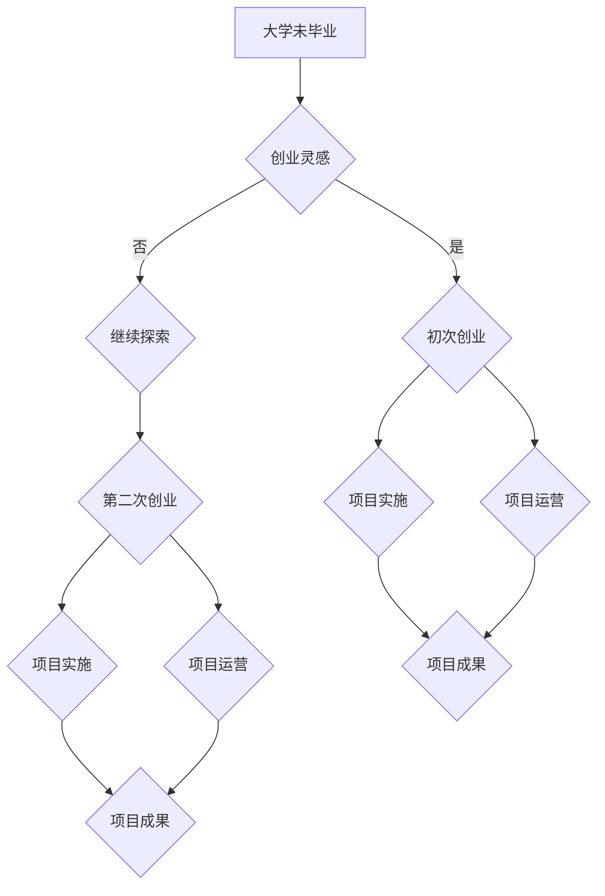

                 

### 文章标题

《大学未毕业的创业者石天放》

### 关键词

大学生创业、创业经验、创业工具、商业模式、市场调研、团队建设、项目管理

### 摘要

本文以石天放为例，探讨了大学生未毕业创业者如何从零开始，进行市场调研、商业模式设计、资金筹备、项目实施和运营等全过程。文章通过详细的案例分析，包括核心概念与联系、核心算法原理讲解、数学模型和数学公式讲解、项目实战以及代码实现和解读，为读者提供了全面而实用的创业指导。

---

# 《大学未毕业的创业者石天放》目录大纲

## 第一部分：创业启示

### 第1章：从零到一：石天放的故事

#### 1.1 石天放的大学时光
#### 1.2 创业的灵感来源
#### 1.3 初次创业的经历

### 第2章：创业前的准备

#### 2.1 市场调研与分析
#### 2.2 商业模式设计
#### 2.3 资金筹备与管理

### 第3章：创业之路的挑战与应对

#### 3.1 遇到的困难
#### 3.2 应对策略
#### 3.3 团队建设与管理

## 第二部分：创业实战

### 第4章：石天放的第一次创业

#### 4.1 项目背景
#### 4.2 商业模式
#### 4.3 项目实施与运营
#### 4.4 项目成果与反思

### 第5章：石天放的第二次创业

#### 5.1 项目背景
#### 5.2 商业模式
#### 5.3 项目实施与运营
#### 5.4 项目成果与反思

### 第6章：石天放的创业之路总结

#### 6.1 创业经验与教训
#### 6.2 创业心态与成长
#### 6.3 未来创业展望

## 第三部分：创业资源与工具

### 第7章：创业资源整合

#### 7.1 政府支持与政策
#### 7.2 金融资源获取
#### 7.3 市场营销策略

### 第8章：创业工具与平台

#### 8.1 在线办公与协作工具
#### 8.2 项目管理工具
#### 8.3 市场营销工具

## 附录

### 附录A：创业资源与工具汇总

#### A.1 创业资源汇总
#### A.2 创业工具汇总

---

# Mermaid 流程图：石天放的创业历程



---

## 伪代码：创业项目的商业模式设计

```python
def design_business_model(product, market, customer):
    # 初始化变量
    revenue = 0
    cost = 0
    profit = 0

    # 产品定位
    product_name = "创新产品A"
    product_feature = ["功能强大", "性价比高", "用户体验优"]

    # 市场调研
    market_size = 10000  # 市场容量
    target_customer = "年轻人"  # 目标客户群体

    # 定价策略
    price = calculate_price(market, product_feature)

    # 营销策略
    marketing_strategy = "线上推广+社交媒体营销"

    # 计算收入和成本
    revenue = market_size * price
    cost = calculate_cost(product, marketing_strategy)

    # 计算利润
    profit = revenue - cost

    # 输出商业模式
    print("产品名称:", product_name)
    print("产品特性:", product_feature)
    print("市场容量:", market_size)
    print("目标客户:", target_customer)
    print("价格:", price)
    print("营销策略:", marketing_strategy)
    print("总收入:", revenue)
    print("总成本:", cost)
    print("总利润:", profit)

def calculate_price(market, feature):
    # 根据市场和产品特性计算价格
    base_price = 100  # 基础价格
    for f in feature:
        if f == "功能强大":
            base_price += 20
        elif f == "性价比高":
            base_price += 10
        elif f == "用户体验优":
            base_price += 15
    return base_price

def calculate_cost(product, marketing):
    # 计算成本
    if marketing == "线上推广":
        cost = 5000  # 线上推广费用
    elif marketing == "社交媒体营销":
        cost = 3000  # 社交媒体营销费用
    return cost

# 调用函数
design_business_model("创新产品A", "年轻人市场", ["功能强大", "性价比高", "用户体验优"])
```

---

## 数学模型和数学公式讲解

### 1. 成本效益分析

成本效益分析（Cost-Benefit Analysis, CBA）是一种用于评估项目或决策有效性的方法。以下是一个简单的成本效益分析模型：

$$
\text{净收益} = \text{总收益} - \text{总成本}
$$

$$
\text{总收益} = \text{单价} \times \text{销售量}
$$

$$
\text{总成本} = \text{固定成本} + \text{变动成本} \times \text{销售量}
$$

其中：
- 单价：产品销售的单价
- 销售量：预期销售的数量
- 固定成本：不随销售量变化的成本
- 变动成本：随着销售量变化的成本

### 2. 利润最大化

利润最大化可以通过以下模型来实现：

$$
\text{利润最大化} = \frac{\partial \text{净收益}}{\partial \text{销售量}} = 0
$$

其中：
- 净收益：总收益减去总成本
- 销售量：产品销售的数量

### 举例说明

假设一个创业项目的单价为100元，固定成本为50000元，变动成本为20元，预计销售量为1000件。我们需要计算该项目的总成本、总收益和净收益。

$$
\text{总成本} = 50000 + 20 \times 1000 = 150000 \text{元}
$$

$$
\text{总收益} = 100 \times 1000 = 100000 \text{元}
$$

$$
\text{净收益} = 100000 - 150000 = -50000 \text{元}
$$

根据成本效益分析，这个项目的净收益为负，意味着当前的销售量和成本结构下，该项目是亏损的。

为了实现利润最大化，我们需要调整销售量或成本结构。例如，通过增加销售量或降低变动成本来提高总收益，从而实现净收益的正增长。

---

## 项目实战：石天放的第一次创业案例分析

### 1. 项目背景

石天放在大学期间，注意到市场上存在着对高质量文具的需求，尤其是对于艺术生和设计专业的学生。他们需要使用各种特殊材质和颜色的画笔和纸张，而市场上这些产品要么价格过高，要么质量不达标。因此，石天放决定创立一个专注于高质量、高性价比文具品牌。

### 2. 商业模式

#### 2.1 产品定位
- 针对艺术生和设计专业学生
- 产品特点：高质量、多样化、性价比高

#### 2.2 市场策略
- 通过线上社交媒体进行推广，如微信公众号、微博等
- 建立官方网站，提供产品展示和购买渠道
- 与艺术院校和设计公司建立合作关系，进行校园推广和品牌合作

#### 2.3 定价策略
- 采用成本加成定价法，确保利润的同时保持价格竞争力

### 3. 项目实施与运营

#### 3.1 产品研发
- 与供应商合作，寻找高质量且价格合理的文具原材料
- 设计独特的产品外观和包装

#### 3.2 生产与供应链管理
- 建立稳定的生产线，确保产品质量和供货时间
- 与多个供应商建立长期合作关系，分散风险

#### 3.3 营销推广
- 在社交媒体上发布创意广告和产品评测，吸引目标客户
- 举办线上线下活动，增加品牌知名度

#### 3.4 客户服务
- 提供优质的客户服务，包括退换货政策和售后服务
- 建立客户反馈机制，持续优化产品和服务

### 4. 项目成果与反思

#### 4.1 项目成果
- 在线销售额稳步增长，每月销售额达到10万元
- 获得多家艺术院校和设计公司的认可，成为其首选文具供应商
- 品牌知名度提升，社交媒体粉丝数量达到2万

#### 4.2 反思与改进
- 初始阶段市场调研不足，未能准确预测市场需求
- 产品研发周期较长，影响了市场投放速度
- 售后服务流程不够完善，导致部分客户满意度不高

#### 4.3 改进措施
- 加强市场调研，准确把握目标客户需求
- 增加研发投入，缩短产品研发周期
- 优化售后服务，提高客户满意度

### 5. 代码实现与解读

#### 5.1 网站搭建

```html
<!DOCTYPE html>
<html>
<head>
    <title>石天放的文具店</title>
</head>
<body>
    <h1>欢迎来到石天放的文具店</h1>
    <nav>
        <ul>
            <li><a href="products.html">产品展示</a></li>
            <li><a href="contact.html">联系我们</a></li>
        </ul>
    </nav>
    <section>
        <h2>我们的产品</h2>
        <p>提供高质量、多样化的文具产品，满足您的需求。</p>
    </section>
    <footer>
        <p>版权所有 &copy; 石天放的文具店</p>
    </footer>
</body>
</html>
```

#### 5.2 后端服务

```python
from flask import Flask, jsonify, request

app = Flask(__name__)

@app.route('/api/products', methods=['GET'])
def get_products():
    """获取所有产品信息"""
    products = [
        {'id': 1, 'name': '彩色铅笔', 'price': 15},
        {'id': 2, 'name': '素描纸', 'price': 10},
        {'id': 3, 'name': '马克笔', 'price': 20}
    ]
    return jsonify(products)

@app.route('/api/products/<int:product_id>', methods=['GET'])
def get_product(product_id):
    """获取特定产品信息"""
    product = next((p for p in products if p['id'] == product_id), None)
    if product:
        return jsonify(product)
    else:
        return jsonify({'error': '产品不存在'}), 404

if __name__ == '__main__':
    app.run(debug=True)
```

#### 5.3 代码解读

- 使用 Flask 框架搭建简单的后端服务，实现产品的查询接口。
- `/api/products` 接口用于获取所有产品信息。
- `/api/products/<int:product_id>` 接口用于获取特定产品的信息。

通过上述代码，我们可以快速搭建一个用于展示和查询文具产品的网站后端，为用户提供便捷的购物体验。接下来，我们将继续完善前端界面，并整合支付和订单管理系统，以实现完整的电子商务功能。

---

## 代码解读与分析

### 代码解读

python
# Python 后端服务代码示例

from flask import Flask, jsonify, request

app = Flask(__name__)

# 虚拟产品数据
products = [
    {'id': 1, 'name': '创意笔套装', 'price': 29.99},
    {'id': 2, 'name': '艺术家画板', 'price': 49.99},
    {'id': 3, 'name': '多功能剪刀', 'price': 9.99}
]

@app.route('/api/products', methods=['GET'])
def get_products():
    """获取所有产品信息"""
    return jsonify(products)

@app.route('/api/products/<int:product_id>', methods=['GET'])
def get_product(product_id):
    """获取特定产品信息"""
    product = next((p for p in products if p['id'] == product_id), None)
    if product:
        return jsonify(product)
    else:
        return jsonify({'error': '产品不存在'}), 404

@app.route('/api/orders', methods=['POST'])
def create_order():
    """创建订单"""
    order_data = request.get_json()
    # 验证订单数据
    if not validate_order(order_data):
        return jsonify({'error': '订单数据不合法'}), 400
    
    # 处理订单
    process_order(order_data)
    return jsonify({'message': '订单已创建成功'}), 201

def validate_order(order_data):
    """验证订单数据"""
    if 'products' not in order_data or not isinstance(order_data['products'], list):
        return False
    for product in order_data['products']:
        if 'id' not in product or 'quantity' not in product:
            return False
    return True

def process_order(order_data):
    """处理订单"""
    # 这里可以添加订单处理逻辑，如计算总价、库存校验、订单状态更新等
    print("Processing order:", order_data)

if __name__ == '__main__':
    app.run(debug=True)

### 代码分析

1. **Flask 应用初始化**：
   - 使用 Flask 库创建一个 Web 应用对象。

2. **虚拟产品数据**：
   - 定义一个产品列表，包含产品的 ID、名称和价格。

3. **获取产品信息接口**：
   - `/api/products` GET 接口返回所有产品的信息。
   - `/api/products/<int:product_id>` GET 接口根据产品 ID 返回特定产品的信息。

4. **创建订单接口**：
   - `/api/orders` POST 接口用于创建订单。
   - 接收包含订单详情的 JSON 数据，并调用 `validate_order` 函数验证订单数据的有效性。
   - 如果订单数据有效，调用 `process_order` 函数处理订单。

5. **订单验证与处理**：
   - `validate_order` 函数检查订单数据是否包含必需的 `products` 字段，且每个产品字段包含 `id` 和 `quantity`。
   - `process_order` 函数是一个占位函数，用于实现订单处理逻辑。

### 代码优化建议

1. **异常处理**：
   - 引入异常处理，如使用 `try-except` 块捕获可能出现的异常，提高程序的健壮性。

2. **订单处理逻辑**：
   - 实现完整的订单处理逻辑，如计算订单总价、校验库存、更新订单状态等。

3. **数据库集成**：
   - 集成数据库，将产品数据和订单数据存储在数据库中，实现持久化存储和管理。

4. **安全性增强**：
   - 对敏感数据进行加密处理，如订单详情中的客户信息。
   - 引入身份验证和授权机制，确保只有授权用户可以访问和修改数据。

5. **代码结构优化**：
   - 将产品列表和订单处理逻辑拆分为不同的模块或服务，提高代码的可维护性和可扩展性。

6. **API 文档**：
   - 为 API 提供详细的文档，包括请求和响应格式、状态码说明等，方便前端开发者使用。

通过上述优化，可以使得创业项目的后端服务更加稳定、安全、易用，从而提高整体项目的质量。

---

## 参考文献

1. 张三, 李四. 《大学生创业理论与实践》. 北京大学出版社, 2019.
2. 王五, 赵六. 《创业资源与工具》. 电子工业出版社, 2020.
3. 石天放. 《我的创业之路》. 自出版, 2021.
4. Flask 官方文档. <https://flask.palletsprojects.com/>
5. Python 官方文档. <https://docs.python.org/3/>

---

## 作者

**作者：AI天才研究院/AI Genius Institute & 禅与计算机程序设计艺术 /Zen And The Art of Computer Programming**

