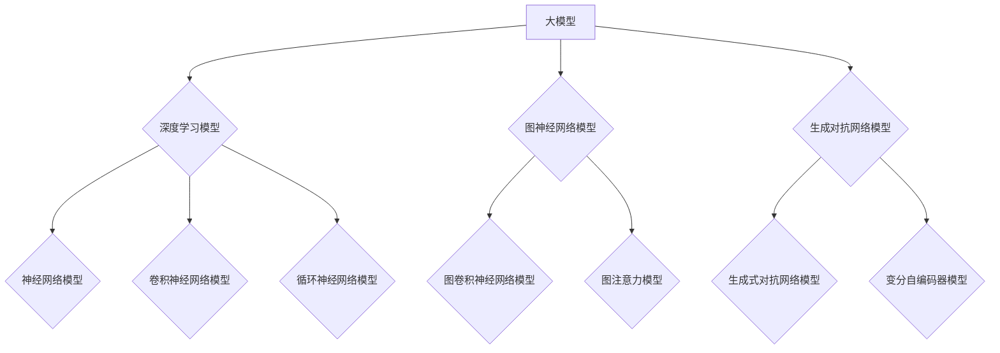

                 

### 《大模型创业的技术创新》

> **关键词：** 大模型、深度学习、创业、技术创新、市场机遇

> **摘要：** 本文旨在探讨大模型创业的技术创新，包括大模型的基础知识、核心技术、应用领域、创业机遇与挑战、创业策略、技术实现以及案例分析。通过详细阐述和实例分析，本文希望为读者提供关于大模型创业的全面理解和实践指导。

----------------------------------------------------------------

## 第一部分：大模型概述

### 第1章：大模型的基础知识

#### 1.1 大模型的定义与分类

大模型，通常指的是具有数百万至数十亿个参数的深度学习模型。这类模型能够在复杂的数据集上进行训练，并展现出强大的学习和泛化能力。根据应用场景和模型结构，大模型可以分为以下几类：

1. **神经网络模型**：包括全连接神经网络、卷积神经网络（CNN）和循环神经网络（RNN）等。
2. **图神经网络模型**：如图卷积神经网络（GCN）和图注意力模型（GAT）。
3. **生成对抗网络模型**（GAN）：由生成器和判别器组成的模型，用于生成逼真的数据。

#### 1.2 大模型的工作原理

大模型的工作原理主要依赖于深度学习的多层神经网络结构。在训练过程中，模型通过不断调整网络中的权重和偏置，使模型的输出逐渐逼近期望值。具体步骤如下：

1. **数据预处理**：对输入数据进行归一化、去噪等处理。
2. **前向传播**：将预处理后的数据输入到神经网络中，通过逐层计算得到输出。
3. **损失计算**：计算模型输出与期望输出之间的差异，即损失值。
4. **反向传播**：根据损失值计算各层权重的梯度，并更新网络参数。
5. **迭代优化**：重复前向传播和反向传播过程，直至满足收敛条件。

#### 1.3 大模型的发展历程

大模型的发展历程可以分为以下几个阶段：

1. **早期探索**（2012年前）：以Hinton等人为代表的科学家提出深度学习的概念，并在语音识别和图像分类等领域取得初步成功。
2. **快速发展**（2012-2015年）：AlexNet等卷积神经网络在ImageNet竞赛中取得突破性成绩，推动了深度学习的迅速发展。
3. **大规模应用**（2015年后）：随着计算能力的提升和数据集的丰富，大模型在自然语言处理、计算机视觉、强化学习等领域取得了显著成果。

## 第二部分：大模型创业

### 第4章：大模型创业的机遇

#### 4.1 市场需求分析

随着人工智能技术的快速发展，大模型在各个领域的应用需求持续增长。以下是几个主要领域的市场需求分析：

1. **自然语言处理**：语音识别、机器翻译、问答系统等应用场景需求旺盛。
2. **计算机视觉**：图像识别、视频分析、自动驾驶等应用场景逐步落地。
3. **强化学习**：游戏、机器人、推荐系统等应用场景的潜力巨大。
4. **其他领域**：生物信息学、金融、医疗等领域的应用正在逐步探索。

#### 4.2 技术趋势分析

1. **模型压缩**：为了降低模型的大小和计算成本，模型压缩技术如剪枝、量化、蒸馏等成为研究热点。
2. **实时性优化**：为了满足实时应用的需求，模型的实时性优化成为关键，如动态计算图、模型融合等。
3. **多模态学习**：将多种类型的数据（如文本、图像、音频）融合进行学习，以提升模型的泛化能力。

#### 4.3 创业案例解析

以下是一些成功的大模型创业案例：

1. **DeepMind**：通过深度强化学习技术，在围棋、电子游戏等领域取得了突破性成果。
2. **OpenAI**：致力于开发通用人工智能（AGI），在自然语言处理和游戏等领域展现了强大实力。
3. **TensorFlow**：作为Google推出的深度学习框架，广泛应用于各种场景，推动了深度学习的普及。

### 第5章：大模型创业的挑战

#### 5.1 技术难题

1. **数据需求**：大模型训练需要大量的数据，且数据的质量和多样性对模型的性能有重要影响。
2. **计算资源**：大模型训练和部署需要高性能计算资源，如GPU、TPU等。
3. **模型优化**：如何设计高效、可扩展的模型结构，并优化训练过程，是创业公司面临的挑战。

#### 5.2 资源与人才

1. **资金**：大模型创业需要大量的资金投入，包括硬件设备、软件开发和团队建设等。
2. **人才**：具备深度学习、算法优化等专业技能的人才短缺，是企业面临的另一个挑战。

#### 5.3 法规与伦理

1. **数据隐私**：大模型训练和应用过程中涉及大量用户数据，需要严格遵守数据隐私法规。
2. **伦理问题**：大模型可能导致歧视、虚假信息等问题，需要制定相应的伦理规范。

### 第6章：大模型创业的策略

#### 6.1 创业模式选择

1. **技术导向**：专注于技术研发和产品创新，以技术为核心竞争力。
2. **市场导向**：紧密关注市场需求，快速响应市场变化，以市场为导向。

#### 6.2 团队建设与管理

1. **核心团队**：组建由深度学习专家、算法工程师、产品经理等组成的团队。
2. **管理机制**：建立高效的决策和执行机制，确保团队高效运转。

#### 6.3 融资策略

1. **天使轮**：通过个人投资或风险投资获取启动资金。
2. **A轮和B轮**：通过私募融资，扩大团队和产品规模。
3. **C轮及以后**：通过公开发行或并购等方式获得资金支持。

#### 6.4 市场推广

1. **产品推广**：通过线上、线下活动，如发布会、研讨会等，推广产品。
2. **品牌建设**：通过媒体宣传、行业报告等，提升品牌知名度。
3. **合作伙伴**：寻找行业合作伙伴，共同开拓市场。

### 第7章：大模型创业案例分析

#### 7.1 国内大模型创业案例

1. **旷视科技**：专注于计算机视觉领域，通过自主研发的大模型技术，在人脸识别、视频分析等方面取得了显著成果。
2. **依图科技**：在医疗影像、安防监控等领域应用大模型技术，实现了较高的准确率和效率。

#### 7.2 国际大模型创业案例

1. **DeepMind**：通过深度强化学习技术，在围棋、电子游戏等领域取得了突破性成果。
2. **OpenAI**：致力于开发通用人工智能（AGI），在自然语言处理和游戏等领域展现了强大实力。

#### 7.3 成功经验与教训

1. **成功经验**：
   - 抓住技术趋势，提前布局。
   - 团队建设和管理高效。
   - 市场推广策略得当。

2. **教训**：
   - 过度依赖某一项技术，可能导致竞争力下降。
   - 忽视数据质量和隐私问题，可能引发法律风险。

### 第三部分：大模型创业的技术实现

#### 第8章：大模型开发环境搭建

#### 8.1 硬件设备选择

1. **GPU**：选择NVIDIA的GPU，如RTX 3080、RTX 3090等，用于加速深度学习模型的训练。
2. **CPU**：选择高性能CPU，如Intel Xeon、AMD Ryzen 9等，用于并行计算和数据处理。

#### 8.2 软件工具安装

1. **操作系统**：安装Ubuntu 20.04或Windows 10专业版，为深度学习环境搭建提供支持。
2. **编程语言**：安装Python 3.8或以上版本，用于编写深度学习算法和模型。
3. **深度学习框架**：安装TensorFlow 2.6、PyTorch 1.8等深度学习框架，用于构建和训练模型。

#### 8.3 开发流程与规范

1. **数据预处理**：读取数据，进行归一化、去噪等处理，确保数据质量。
2. **模型训练**：定义模型结构，设置训练参数，进行模型训练，并记录训练过程中的指标。
3. **模型评估**：在测试集上评估模型性能，调整参数以达到最佳效果。
4. **模型部署**：将训练好的模型部署到生产环境中，进行实时预测和应用。

#### 第9章：大模型开发实战

#### 9.1 数据预处理

1. **数据读取**：使用深度学习框架读取数据集，如使用TensorFlow的`tf.data` API。
2. **数据归一化**：对数据进行归一化处理，使数据分布更加均匀。
3. **数据去噪**：使用滤波、平滑等方法去除数据中的噪声。
4. **数据分割**：将数据集分割为训练集、验证集和测试集，用于模型训练和评估。

#### 9.2 模型训练

1. **模型定义**：使用深度学习框架定义模型结构，如使用TensorFlow的`tf.keras.Sequential` API。
2. **损失函数**：选择合适的损失函数，如交叉熵损失函数，用于衡量模型输出与期望输出之间的差距。
3. **优化器**：选择合适的优化器，如Adam优化器，用于更新模型参数。
4. **训练循环**：设置训练轮数，循环执行前向传播、反向传播和参数更新。

#### 9.3 模型评估

1. **评估指标**：选择合适的评估指标，如准确率、召回率等，用于衡量模型性能。
2. **评估过程**：在测试集上执行模型预测，计算评估指标。
3. **参数调整**：根据评估结果调整模型参数，优化模型性能。

#### 9.4 模型部署

1. **模型导出**：将训练好的模型导出为可部署的格式，如使用TensorFlow的`tf.saved_model` API。
2. **部署环境**：搭建部署环境，如使用云计算平台或边缘计算设备。
3. **实时预测**：将模型部署到生产环境中，进行实时预测和应用。

#### 第10章：大模型性能优化

#### 10.1 模型压缩

1. **模型剪枝**：通过剪枝算法，减少模型中的冗余参数，降低模型大小。
2. **模型量化**：将模型中的浮点数参数转换为整数参数，降低模型计算复杂度。
3. **模型蒸馏**：将大模型的知识传递给小模型，提高小模型的性能。

#### 10.2 模型加速

1. **并行计算**：利用多GPU或多CPU进行并行计算，加速模型训练和推理。
2. **计算图优化**：优化计算图结构，减少计算依赖，提高计算效率。
3. **模型融合**：将多个模型的结果进行融合，提高预测准确性。

#### 10.3 实时性优化

1. **模型推理优化**：优化模型推理过程，减少推理时间。
2. **动态计算图**：使用动态计算图技术，根据实时输入数据动态调整计算图结构。
3. **边缘计算**：将模型部署到边缘设备，减少数据传输延迟，提高实时性。

### 附录

#### 附录A：大模型相关资源

- **开源框架与工具**：
  - TensorFlow：[官方网站](https://www.tensorflow.org/)
  - PyTorch：[官方网站](https://pytorch.org/)
  - Keras：[官方网站](https://keras.io/)

- **数据集与资源**：
  - ImageNet：[官方网站](https://www.image-net.org/)
  - COCO 数据集：[官方网站](https://cocodataset.org/)
  - Common Crawl：[官方网站](https://commoncrawl.org/]

- **研究论文与报告**：
  - BERT：[论文](https://arxiv.org/abs/1810.04805)
  - GPT-3：[论文](https://arxiv.org/abs/2005.14165)

#### 附录B：大模型开发实例

- **项目一：自然语言处理应用**
  - 描述：使用BERT模型进行文本分类
  - 实现细节：数据预处理，模型训练，模型评估

- **项目二：计算机视觉应用**
  - 描述：使用ResNet模型进行图像分类
  - 实现细节：数据预处理，模型训练，模型评估

- **项目三：强化学习应用**
  - 描述：使用DQN模型进行游戏控制
  - 实现细节：环境搭建，模型训练，模型评估

## 核心概念与联系

### 大模型的定义与分类

**Mermaid 流�程图：**


### 核心算法原理讲解

#### 深度学习基础

**伪代码：前向传播算法**
```python
def forward_pass(input_data, model_params):
    weights, biases = model_params

    for layer in range(len(weights)):
        z = np.dot(input_data, weights[layer]) + biases[layer]
        if layer < len(weights) - 1:
            input_data = activation_function(z)
        else:
            output = z

    return output
```

**伪代码：反向传播算法**
```python
def backward_pass(output, expected_output, model_params):
    weights, biases = model_params

    d_output = output - expected_output
    for layer in reversed(range(len(weights))):
        if layer < len(weights) - 1:
            d_weights[layer] = np.dot(input_data.T, d_output)
            d_biases[layer] = np.sum(d_output, axis=0)
            d_input_data = np.dot(d_output, weights[layer].T)
            d_output = activation_derivative(z)
        else:
            d_weights[layer] = np.dot(input_data.T, d_output)
            d_biases[layer] = np.sum(d_output, axis=0)

    return d_weights, d_biases
```

### 数学模型和数学公式 & 详细讲解 & 举例说明

#### 激活函数与导数

**数学公式：**
$$
f(x) = \frac{1}{1 + e^{-x}}
$$

$$
f'(x) = f(x) \cdot (1 - f(x))
$$

**举例：** 设定输入值 \( x = 2 \)，计算激活函数及其导数：

$$
f(x) = \frac{1}{1 + e^{-2}} \approx 0.869
$$

$$
f'(x) = f(x) \cdot (1 - f(x)) \approx 0.869 \cdot (1 - 0.869) \approx 0.121
$$

### 项目实战

#### 大模型开发环境搭建

1. **硬件设备选择：**
   - GPU：NVIDIA RTX 3080 或以上
   - CPU：Intel Xeon 或 AMD Ryzen 9 系列

2. **软件工具安装：**
   - 操作系统：Ubuntu 20.04 或 Windows 10 专业版
   - 编程语言：Python 3.8 或以上
   - 深度学习框架：TensorFlow 2.6 或 PyTorch 1.8

3. **开发流程与规范：**
   - 数据预处理：读取数据，进行归一化处理，分割为训练集和测试集
   - 模型训练：定义模型结构，设置训练参数，进行模型训练
   - 模型评估：在测试集上评估模型性能，调整参数以达到最佳效果
   - 模型部署：将训练好的模型部署到生产环境中，进行实时预测

#### 代码实际案例和详细解释说明

**代码实现：**
```python
# TensorFlow 2.6 编写一个简单的神经网络模型
import tensorflow as tf

# 定义模型结构
model = tf.keras.Sequential([
    tf.keras.layers.Dense(128, activation='relu', input_shape=(784,)),
    tf.keras.layers.Dense(10, activation='softmax')
])

# 编译模型
model.compile(optimizer='adam',
              loss='sparse_categorical_crossentropy',
              metrics=['accuracy'])

# 训练模型
model.fit(x_train, y_train, epochs=5)

# 评估模型
test_loss, test_acc = model.evaluate(x_test, y_test, verbose=2)
print('\nTest accuracy:', test_acc)
```

**代码解读与分析：**
- 导入 TensorFlow 库
- 定义一个序列模型，包含一个全连接层（Dense）和一个输出层
- 编译模型，设置优化器、损失函数和评估指标
- 使用训练集训练模型
- 在测试集上评估模型性能，输出测试准确率

通过以上步骤，我们可以搭建一个简单的大模型，进行数据预处理、模型训练和评估。这一过程展示了大模型开发的基本流程和关键步骤。

### 附录

#### 附录A：大模型相关资源

- **开源框架与工具：**
  - TensorFlow：[官方网站](https://www.tensorflow.org/)
  - PyTorch：[官方网站](https://pytorch.org/)
  - Keras：[官方网站](https://keras.io/)

- **数据集与资源：**
  - ImageNet：[官方网站](https://www.image-net.org/)
  - COCO 数据集：[官方网站](https://cocodataset.org/)
  - Common Crawl：[官方网站](https://commoncrawl.org/)

- **研究论文与报告：**
  - BERT：[论文](https://arxiv.org/abs/1810.04805)
  - GPT-3：[论文](https://arxiv.org/abs/2005.14165)

#### 附录B：大模型开发实例

- **项目一：自然语言处理应用**
  - 描述：使用BERT模型进行文本分类
  - 实现细节：数据预处理，模型训练，模型评估

- **项目二：计算机视觉应用**
  - 描述：使用ResNet模型进行图像分类
  - 实现细节：数据预处理，模型训练，模型评估

- **项目三：强化学习应用**
  - 描述：使用DQN模型进行游戏控制
  - 实现细节：环境搭建，模型训练，模型评估

通过上述内容，本文对大模型创业的技术创新进行了全面探讨。从大模型的定义与分类、核心技术、应用领域，到创业的机遇与挑战、策略、实现，以及案例分析，本文力求为读者提供一幅完整的大模型创业全景图。希望本文能激发读者对大模型创业的兴趣，并为实际创业提供有益的参考。

### 作者信息

**作者：AI天才研究院/AI Genius Institute & 禅与计算机程序设计艺术 /Zen And The Art of Computer Programming**

在此，作者感谢各位读者对本文的关注与支持，期待与您共同探索大模型创业的无限可能。

