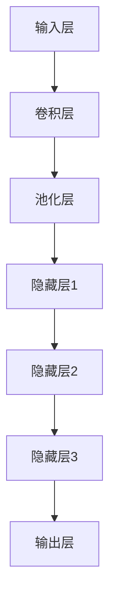
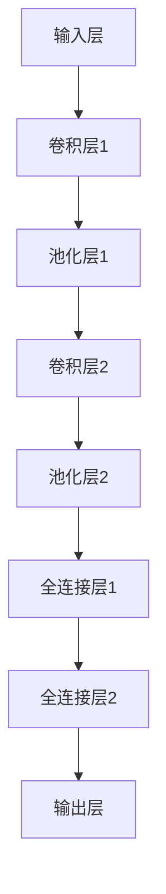

                 

# 《大模型创业的未来机会》

> 关键词：大模型，创业，深度学习，算法，自然语言处理，计算机视觉

> 摘要：本文旨在探讨大模型创业的未来机会，通过对大模型时代的背景、技术原理、创业策略和实战案例的分析，为创业者提供有价值的参考。文章首先介绍了大模型的定义、分类和当前技术趋势，然后深入探讨了创业者面临的挑战和机遇，并从数据预处理、特征工程和模型评估等方面详细阐述了大模型在不同创业项目中的应用策略。接着，文章通过实际案例展示了大模型创业的实战过程，包括项目规划、开发环境搭建和代码实现。最后，文章展望了大模型创业的未来趋势，并提出了相应的建议。

---

## 第一部分：大模型与创业概述

### 第1章：大模型时代与创业机遇

#### 1.1 大模型时代的背景与趋势

大模型时代是指以深度学习和人工智能为代表的技术快速发展，使得大型神经网络模型在各个领域得到广泛应用的时代。这一时代的背景主要源于以下几个方面的因素：

1. **计算能力的提升**：随着硬件技术的发展，特别是GPU和TPU等专用计算设备的普及，计算能力得到了极大的提升，使得大规模模型的训练成为可能。

2. **数据资源的丰富**：互联网和移动设备的普及带来了海量的数据，这些数据为模型的训练提供了丰富的素材。

3. **算法的进步**：深度学习算法的不断发展，特别是卷积神经网络（CNN）和递归神经网络（RNN）等模型的成功应用，为处理复杂数据提供了有效的工具。

4. **应用的拓展**：随着大模型的不断发展，其在计算机视觉、自然语言处理、语音识别等领域的应用越来越广泛，推动了整个科技产业的变革。

#### 1.1.1 大模型的定义与分类

大模型，通常指的是具有数十亿至数万亿参数的大型神经网络模型。根据应用领域的不同，大模型可以分为以下几类：

1. **计算机视觉模型**：如ImageNet分类模型、BERT自然语言处理模型等。

2. **自然语言处理模型**：如GPT-3、T5等语言生成模型。

3. **语音识别模型**：如WaveNet、DeepSpeech等。

4. **推荐系统模型**：如TensorFlow Recommenders等。

5. **强化学习模型**：如DQN、DDPG等。

#### 1.1.2 大模型技术的发展现状

目前，大模型技术已经取得了显著的进展。例如，在计算机视觉领域，ResNet、Inception等模型的提出，使得图像分类的准确率达到了前所未有的高度。在自然语言处理领域，BERT、GPT等模型的引入，使得机器阅读理解和文本生成能力得到了极大的提升。此外，多模态模型如ViT、DALL-E等，也展示了跨领域融合的巨大潜力。

#### 1.1.3 大模型在创业中的潜在应用领域

大模型在创业中的潜在应用领域非常广泛，以下是一些典型的例子：

1. **医疗健康**：通过大模型进行疾病预测、诊断和个性化治疗。

2. **金融科技**：利用大模型进行风险管理、信用评估和投资策略。

3. **智能制造**：利用大模型实现智能监控、故障预测和优化生产流程。

4. **教育科技**：利用大模型进行智能教育、课程推荐和学习效果评估。

5. **智慧城市**：利用大模型进行交通管理、环境保护和公共安全。

#### 1.2 大模型创业的挑战与机遇

大模型创业面临着许多挑战，同时也蕴藏着巨大的机遇。

**挑战**：

1. **技术门槛高**：大模型的训练和优化需要强大的计算能力和专业的技术知识。

2. **数据隐私与安全**：大规模数据的收集、存储和使用涉及到隐私保护和数据安全的问题。

3. **法律法规**：大模型的应用需要遵守相关法律法规，如数据保护法、隐私法等。

4. **市场接受度**：大模型的应用需要消费者的接受和理解，这需要时间来培养市场。

**机遇**：

1. **技术创新**：大模型为创业提供了前所未有的技术创新机会。

2. **市场潜力**：随着技术的进步和应用场景的拓展，大模型市场具有巨大的潜力。

3. **跨界融合**：大模型的应用不仅限于单一领域，还涉及到多个领域的跨界融合。

4. **人才需求**：大模型的研发和运营需要大量高素质的专业人才。

#### 1.2.1 创业者面临的挑战

1. **技术难题**：大模型的训练和优化需要大量的计算资源和专业知识，这对创业者的技术能力提出了较高的要求。

2. **市场定位**：在众多竞争者中找到自己的市场定位，制定有效的商业策略。

3. **资金筹集**：大模型的研发和运营需要大量的资金投入，如何有效筹集资金是创业者面临的一大挑战。

4. **团队建设**：组建一个高效的专业团队，包括技术、市场、运营等各方面的专业人才。

#### 1.2.2 创业机遇与市场前景

1. **技术创新**：大模型为创业提供了前所未有的技术创新机会，可以从算法改进、架构优化、应用拓展等方面进行创新。

2. **市场潜力**：随着大模型技术的不断进步和应用场景的拓展，市场潜力巨大。例如，在医疗健康领域，大模型可以用于疾病预测、诊断和个性化治疗；在金融科技领域，大模型可以用于风险管理、信用评估和投资策略。

3. **跨界融合**：大模型的应用不仅限于单一领域，还涉及到多个领域的跨界融合。例如，在智能制造领域，大模型可以与物联网、大数据等技术结合，实现智能监控、故障预测和优化生产流程。

4. **人才需求**：大模型的研发和运营需要大量高素质的专业人才，这为创业者提供了人才市场的机遇。

#### 1.2.3 创业策略与实践指南

1. **市场调研**：在创业初期，进行充分的市场调研，了解目标市场的需求、竞争态势和潜在机会。

2. **技术定位**：根据市场需求和自身技术优势，确定技术方向和市场定位。

3. **团队建设**：组建一支高效的专业团队，包括技术、市场、运营等各方面的专业人才。

4. **商业模式**：制定有效的商业模式，明确盈利模式、成本结构和市场推广策略。

5. **持续创新**：持续进行技术创新和应用拓展，以保持市场竞争力。

6. **风险控制**：在创业过程中，合理控制风险，包括技术风险、市场风险和资金风险等。

#### 1.3 大模型创业案例分析

##### 1.3.1 成功案例解析

**案例一：谷歌的BERT模型**

BERT（Bidirectional Encoder Representations from Transformers）是谷歌提出的一种自然语言处理模型，它在多个NLP任务中取得了优异的性能，如文本分类、问答系统等。BERT的成功主要得益于其创新性的双向训练方法和大规模的模型参数。

**成功原因**：

1. **技术创新**：BERT采用了双向训练方法，使得模型能够同时学习单词在文本中的前后关系，提高了模型的表达能力。

2. **数据集丰富**：BERT使用了大量的高质量数据集，如维基百科、书籍等，为模型训练提供了丰富的素材。

3. **应用广泛**：BERT在多个NLP任务中取得了优异的性能，使得其在多个应用场景中得到了广泛应用。

**经验教训**：

1. **技术创新是关键**：在竞争激烈的市场中，技术创新是保持竞争力的关键。

2. **数据质量至关重要**：高质量的数据集对于模型训练至关重要。

3. **应用拓展是持续发展的动力**：不断拓展应用场景，提高模型的实用性，是持续发展的关键。

##### 1.3.2 失败案例分析

**案例二：某AI医疗诊断公司**

某AI医疗诊断公司致力于利用深度学习技术进行疾病诊断，但其产品在实际应用中表现不佳，最终导致失败。

**失败原因**：

1. **数据质量差**：公司使用的数据集质量差，导致模型训练效果不佳。

2. **技术应用不当**：公司未能正确选择和应用合适的深度学习算法，导致模型性能不理想。

3. **市场接受度低**：由于产品性能不佳，市场接受度低，导致公司无法实现商业成功。

**经验教训**：

1. **数据质量至关重要**：在医疗领域，数据质量直接影响到诊断的准确性，必须确保数据集的质量。

2. **技术应用需谨慎**：在选择和应用深度学习算法时，必须根据具体问题选择合适的方法。

3. **市场调研是基础**：在推出产品之前，必须进行充分的市场调研，了解市场需求和竞争态势。

##### 1.3.3 教训与启示

通过以上案例分析，我们可以得出以下教训和启示：

1. **技术创新是关键**：在竞争激烈的市场中，技术创新是保持竞争力的关键。

2. **数据质量至关重要**：无论是模型训练还是应用，高质量的数据集都是成功的基础。

3. **市场调研是基础**：在推出产品之前，必须进行充分的市场调研，了解市场需求和竞争态势。

4. **团队建设是关键**：一个高效的专业团队是创业成功的保证。

5. **风险控制是必要的**：在创业过程中，合理控制风险，特别是技术风险和市场风险，是保证项目成功的关键。

---

## 第二部分：大模型技术基础

### 第2章：大模型技术原理与实现

#### 2.1 大模型核心概念与联系

在深入探讨大模型的技术原理和实现之前，我们首先需要了解一些核心概念和它们之间的联系。

##### 2.1.1 神经网络基础

神经网络（Neural Networks，简称NN）是模仿人脑神经元连接方式构建的计算模型，它由大量的神经元（节点）和连接（边）组成。每个神经元接收来自其他神经元的输入，通过激活函数处理后输出结果。

神经网络的基本组成部分包括：

- **输入层**：接收外部输入数据。
- **隐藏层**：对输入数据进行处理，提取特征。
- **输出层**：生成最终的输出结果。

神经网络的核心在于其训练过程，即通过调整神经元之间的连接权重（权重矩阵）来优化模型性能。这个过程通常采用梯度下降（Gradient Descent）算法。

##### 2.1.2 大模型架构详解

大模型（Large Models）通常指的是具有数十亿至数万亿参数的大型神经网络模型。大模型在架构上通常具有以下特点：

- **深度**：具有多层隐藏层，深度可达数十层甚至更多。
- **宽度**：每层具有大量神经元，宽度可达数千甚至数万个神经元。
- **参数量**：具有数十亿至数万亿个参数，这是大模型得名的原因。

大模型的核心架构包括：

- **卷积神经网络（CNN）**：主要用于图像处理，通过卷积层、池化层等模块提取图像特征。
- **循环神经网络（RNN）**：主要用于序列数据，通过循环结构处理序列中的依赖关系。
- **Transformer模型**：一种基于自注意力机制的模型，广泛应用于自然语言处理领域。

大模型的架构可以通过以下Mermaid流程图进行展示：



##### 2.1.3 Mermaid流程图（大模型架构图）

以下是一个简化的Mermaid流程图，展示了大模型的典型架构：



在上述流程图中，卷积层和池化层用于提取图像特征，全连接层用于分类和回归任务。这种架构在大模型中非常常见，通过增加层数和神经元数量，可以实现更高的模型容量和更好的性能。

#### 2.2 大模型算法原理讲解

大模型的算法原理主要涉及深度学习（Deep Learning）的基础算法，包括神经网络训练、预训练与微调等。

##### 2.2.1 深度学习基础算法

深度学习的基础算法主要包括前向传播（Forward Propagation）和反向传播（Backpropagation）。

1. **前向传播**：

   在前向传播过程中，数据从输入层流向输出层，每层神经元计算其输出值。具体步骤如下：

   - 输入数据通过输入层进入网络。
   - 每个神经元接收来自前一层神经元的输入，并加权求和处理。
   - 应用激活函数（如ReLU、Sigmoid、Tanh等）产生输出。

   前向传播的伪代码如下：

   ```python
   def forward_propagation(x, weights, biases):
       for layer in range(num_layers):
           x = activate( weights[layer] * x + biases[layer] )
       return x
   ```

2. **反向传播**：

   在反向传播过程中，通过计算梯度来更新网络权重和偏置，以优化模型性能。具体步骤如下：

   - 计算输出层的误差（损失函数的导数）。
   - 误差反向传播至每一层，计算每层神经元的梯度。
   - 使用梯度下降算法更新权重和偏置。

   反向传播的伪代码如下：

   ```python
   def backward_propagation(x, y, weights, biases):
       for layer in reversed(range(num_layers)):
           error = (y - output) * activate_derivative(output)
           d_output = error
           for prev_layer in range(num_layers - 1):
               d_weights[prev_layer] += x[prev_layer] * d_output
               d_biases[prev_layer] += d_output
               d_output = weights[prev_layer].T.dot(d_output)
               x[prev_layer] = activate_derivative(x[prev_layer])
       return d_weights, d_biases
   ```

##### 2.2.2 预训练与微调

预训练（Pre-training）与微调（Fine-tuning）是深度学习中的常用技术，用于提升模型的性能。

1. **预训练**：

   预训练是指在大型数据集上对模型进行初步训练，以学习通用的特征表示。预训练完成后，模型可以在特定任务上进行微调。

   预训练的步骤如下：

   - 使用大型数据集（如ImageNet、WikiText-2等）对模型进行预训练。
   - 在预训练过程中，主要关注模型参数的优化，以学习有效的特征表示。

   预训练的伪代码如下：

   ```python
   def pre_train(dataset, model, epochs):
       for epoch in range(epochs):
           for data in dataset:
               x, y = data
               model.zero_grad()
               output = model(x)
               loss = loss_function(output, y)
               loss.backward()
               optimizer.step()
   ```

2. **微调**：

   微调是指在使用预训练模型的基础上，针对特定任务进行进一步训练，以优化模型在特定任务上的性能。

   微调的步骤如下：

   - 加载预训练模型。
   - 在特定任务上对模型进行微调，调整部分层的参数。
   - 使用小数据集（如特定领域的文本数据）进行微调。

   微调的伪代码如下：

   ```python
   def fine_tune(model, task_dataset, epochs):
       for epoch in range(epochs):
           for data in task_dataset:
               x, y = data
               model.zero_grad()
               output = model(x)
               loss = loss_function(output, y)
               loss.backward()
               optimizer.step()
   ```

##### 2.2.3 伪代码示例

以下是一个简单的伪代码示例，展示了如何使用预训练与微调技术对图像分类模型进行训练：

```python
# 预训练
pre_train(dataset, model, 10)  # 使用ImageNet数据集进行10轮预训练

# 微调
fine_tune(model, task_dataset, 5)  # 使用特定任务数据集进行5轮微调
```

#### 2.3 数学模型与公式详解

大模型的设计和训练涉及大量的数学模型和公式。以下将详细介绍一些核心的数学模型和公式。

##### 2.3.1 矩阵与向量操作

在深度学习中，矩阵和向量操作是基础。以下是一些常用的矩阵和向量操作：

1. **矩阵-向量乘法**：

   矩阵-向量乘法是指将一个矩阵与一个向量相乘，得到一个新的向量。公式如下：

   $$ y = X \cdot x $$

   其中，$X$ 是矩阵，$x$ 是向量，$y$ 是结果向量。

2. **矩阵-矩阵乘法**：

   矩阵-矩阵乘法是指将两个矩阵相乘，得到一个新的矩阵。公式如下：

   $$ Y = X \cdot W $$

   其中，$X$ 和$W$ 是矩阵，$Y$ 是结果矩阵。

3. **向量的点积**：

   向量的点积是指两个向量对应元素相乘后求和。公式如下：

   $$ dot_product = x \cdot y = \sum_{i=1}^{n} x_i \cdot y_i $$

4. **向量的叉积**：

   向量的叉积是指两个三维向量相乘得到一个新的向量。公式如下：

   $$ cross_product = x \times y = (x_2 \cdot y_3 - x_3 \cdot y_2, x_3 \cdot y_1 - x_1 \cdot y_3, x_1 \cdot y_2 - x_2 \cdot y_1) $$

##### 2.3.2 损失函数与优化算法

在深度学习中，损失函数用于衡量模型预测结果与实际结果之间的差距。优化算法则用于调整模型参数，以最小化损失函数。

1. **损失函数**：

   损失函数是深度学习中至关重要的概念。以下是一些常用的损失函数：

   - **均方误差（MSE）**：

     均方误差是指预测值与实际值之差的平方的平均值。公式如下：

     $$ MSE = \frac{1}{n} \sum_{i=1}^{n} (y_i - \hat{y}_i)^2 $$

   - **交叉熵（Cross-Entropy）**：

     交叉熵是指预测概率分布与真实概率分布之间的差异。公式如下：

     $$ Cross-Entropy = -\sum_{i=1}^{n} y_i \cdot \log(\hat{y}_i) $$

2. **优化算法**：

   优化算法用于最小化损失函数，以下是一些常用的优化算法：

   - **随机梯度下降（SGD）**：

     随机梯度下降是一种常用的优化算法，它通过随机选择一部分样本来更新模型参数。公式如下：

     $$ w = w - \alpha \cdot \nabla_w J(w) $$

     其中，$w$ 是模型参数，$\alpha$ 是学习率，$J(w)$ 是损失函数关于$w$ 的梯度。

   - **Adam优化器**：

     Adam优化器是一种基于SGD的优化算法，它结合了Adagrad和RMSprop的优点。公式如下：

     $$ m = \beta_1 m + (1 - \beta_1) \cdot \nabla_w J(w) $$
     $$ v = \beta_2 v + (1 - \beta_2) \cdot (\nabla_w J(w))^2 $$
     $$ w = w - \alpha \cdot \frac{m}{\sqrt{v} + \epsilon} $$

     其中，$m$ 和$v$ 分别是梯度的一阶和二阶矩估计，$\beta_1$ 和$\beta_2$ 是超参数，$\epsilon$ 是一个较小的常数。

##### 2.3.3 LaTeX数学公式示例

在LaTeX中，数学公式的书写有其特定的语法。以下是一些LaTeX数学公式的示例：

1. **基本的数学公式**：

   ```latex
   $ E = mc^2 $
   $$ \sum_{i=1}^{n} x_i $$
   $$ \frac{d}{dx} f(x) $$
   $$ \int_{0}^{1} f(x) \, dx $$
   $$ \lim_{x \to \infty} f(x) $$
   ```

2. **矩阵和向量**：

   ```latex
   $ \mathbf{A} = \begin{bmatrix} a_{11} & a_{12} \\ a_{21} & a_{22} \end{bmatrix} $
   $$ \mathbf{v} = \begin{bmatrix} v_1 \\ v_2 \end{bmatrix} $$
   ```

3. **积分和微分**：

   ```latex
   $ \int_{-\infty}^{\infty} f(x) \, dx $
   $$ \frac{d^2}{dx^2} f(x) $$
   ```

4. **极限和求和**：

   ```latex
   $$ \lim_{n \to \infty} a_n $$
   $$ \sum_{i=1}^{n} i $$
   ```

通过以上示例，我们可以看到LaTeX在书写数学公式时的灵活性和便捷性。

---

## 第三部分：大模型在创业项目中的应用

### 第3章：大模型在创业项目中的应用策略

大模型在创业项目中具有广泛的应用潜力，通过有效的应用策略，可以大大提升项目的成功率。以下将详细探讨大模型在不同创业项目中的应用策略。

#### 3.1 大模型在数据分析中的应用

数据分析是许多创业项目的核心，大模型在数据分析中具有显著的优势。

##### 3.1.1 数据预处理

数据预处理是数据分析的基础，大模型在数据预处理中可以发挥重要作用。

1. **缺失值处理**：大模型可以通过学习数据中的缺失模式来自动填补缺失值。
   
2. **异常值检测**：大模型可以识别数据中的异常值，并通过异常值检测算法对其进行处理。

3. **数据规范化**：大模型可以通过学习数据分布特征，对数据进行规范化处理，使其符合模型输入要求。

##### 3.1.2 特征工程

特征工程是数据分析中至关重要的一环，大模型在特征工程中可以发挥以下作用：

1. **特征提取**：大模型可以通过学习数据中的内在结构，自动提取有效的特征。

2. **特征选择**：大模型可以通过学习特征的重要程度，自动选择对模型性能有显著影响的特征。

3. **特征组合**：大模型可以通过学习特征之间的相互作用，自动组合新的特征，提高模型的性能。

##### 3.1.3 模型选择与评估

在数据分析中，选择合适的模型和评估模型性能是关键步骤。大模型在模型选择和评估中具有以下优势：

1. **多模型选择**：大模型可以同时评估多个模型，选择最佳模型。

2. **自动化评估**：大模型可以通过自动化评估算法，快速评估模型性能。

3. **实时更新**：大模型可以根据新数据实时更新模型，提高模型的适应性。

#### 3.2 大模型在自然语言处理中的应用

自然语言处理（NLP）是人工智能领域的一个重要分支，大模型在NLP中具有广泛的应用。

##### 3.2.1 文本分类

文本分类是指将文本数据分为预定义的类别。大模型在文本分类中具有以下优势：

1. **高精度**：大模型可以通过学习海量文本数据，实现高精度的文本分类。

2. **多语言支持**：大模型可以同时支持多种语言，实现跨语言文本分类。

3. **实时更新**：大模型可以通过实时更新模型，适应文本分类需求的变化。

##### 3.2.2 命名实体识别

命名实体识别（NER）是指识别文本中的命名实体，如人名、地名、机构名等。大模型在NER中具有以下优势：

1. **高准确性**：大模型可以通过学习海量标注数据，实现高准确性的命名实体识别。

2. **自适应学习**：大模型可以根据新的标注数据，自适应地调整模型参数，提高识别准确性。

3. **跨领域应用**：大模型可以适应不同领域的命名实体识别任务，实现跨领域应用。

##### 3.2.3 问答系统

问答系统是指通过输入问题，自动生成答案。大模型在问答系统中具有以下优势：

1. **高响应速度**：大模型可以通过并行计算，实现快速响应。

2. **多模态支持**：大模型可以同时支持文本、语音、图像等多种输入模态，实现多模态问答。

3. **自适应更新**：大模型可以根据用户的反馈，自适应地调整模型，提高问答系统的准确性。

#### 3.3 大模型在计算机视觉中的应用

计算机视觉是人工智能领域的另一个重要分支，大模型在计算机视觉中具有广泛的应用。

##### 3.3.1 图像分类

图像分类是指将图像数据分为预定义的类别。大模型在图像分类中具有以下优势：

1. **高精度**：大模型可以通过学习海量图像数据，实现高精度的图像分类。

2. **多尺度处理**：大模型可以同时处理不同尺度的图像，实现精细的分类。

3. **实时更新**：大模型可以通过实时更新模型，适应图像分类需求的变化。

##### 3.3.2 目标检测

目标检测是指识别图像中的目标物体。大模型在目标检测中具有以下优势：

1. **高准确性**：大模型可以通过学习海量标注数据，实现高准确性的目标检测。

2. **多目标识别**：大模型可以同时识别图像中的多个目标物体，实现多目标检测。

3. **实时处理**：大模型可以通过并行计算，实现实时目标检测。

##### 3.3.3 视频分析

视频分析是指对视频数据进行处理和分析。大模型在视频分析中具有以下优势：

1. **高精度**：大模型可以通过学习海量视频数据，实现高精度的视频分析。

2. **多模态支持**：大模型可以同时支持文本、语音、图像等多种输入模态，实现多模态视频分析。

3. **实时更新**：大模型可以通过实时更新模型，适应视频分析需求的变化。

通过以上分析，我们可以看到大模型在创业项目中的应用策略非常丰富，从数据预处理、特征工程到模型选择和评估，大模型在各个阶段都发挥着重要作用。同时，大模型在自然语言处理、计算机视觉等领域也具有广泛的应用前景，为创业项目提供了强大的技术支持。

### 3.4 大模型在推荐系统中的应用

推荐系统是创业项目中常见的一种应用，通过大模型可以显著提升推荐系统的性能。

##### 3.4.1 用户行为分析

大模型可以分析用户的点击、购买、浏览等行为，挖掘用户兴趣和偏好，为个性化推荐提供依据。

1. **行为数据预处理**：大模型可以对用户行为数据进行清洗、归一化和特征提取，为后续分析提供高质量的数据。

2. **用户兴趣模型**：大模型可以建立用户兴趣模型，通过分析用户行为数据，预测用户的潜在兴趣。

##### 3.4.2 商品推荐

基于用户兴趣模型，大模型可以推荐用户可能感兴趣的商品。

1. **商品特征提取**：大模型可以提取商品的特征，如价格、品牌、类别等，为商品推荐提供基础。

2. **协同过滤**：大模型可以采用协同过滤算法，根据用户行为和商品特征，生成推荐列表。

##### 3.4.3 风险控制

大模型可以用于推荐系统的风险控制，识别和过滤潜在的不良推荐。

1. **异常行为检测**：大模型可以检测用户行为中的异常，识别潜在的风险。

2. **违规内容过滤**：大模型可以过滤掉推荐结果中的违规内容，确保推荐内容的合规性。

通过以上分析，我们可以看到大模型在推荐系统中的应用策略包括用户行为分析、商品推荐和风险控制，这些策略可以提升推荐系统的个性化、精准性和安全性。

### 3.5 大模型在金融科技中的应用

金融科技（FinTech）是近年来快速发展的领域，大模型在金融科技中具有广泛的应用。

##### 3.5.1 风险管理

大模型可以用于风险管理，预测金融市场的波动和风险。

1. **历史数据挖掘**：大模型可以分析历史金融数据，挖掘市场规律和趋势。

2. **风险模型构建**：大模型可以建立风险预测模型，根据市场数据和用户行为，预测潜在风险。

##### 3.5.2 信用评估

大模型可以用于信用评估，评估用户的信用等级。

1. **用户特征提取**：大模型可以提取用户的财务状况、行为数据等特征，为信用评估提供依据。

2. **信用评分模型**：大模型可以建立信用评分模型，根据用户特征，评估用户的信用等级。

##### 3.5.3 投资策略

大模型可以用于投资策略的制定和优化。

1. **市场预测**：大模型可以预测市场的走势，为投资决策提供依据。

2. **策略优化**：大模型可以通过机器学习算法，优化投资策略，提高投资收益。

通过以上分析，我们可以看到大模型在金融科技中的应用策略包括风险管理、信用评估和投资策略，这些策略可以提升金融科技产品的风险控制、信用评估和投资效果。

### 3.6 大模型在教育科技中的应用

教育科技（EdTech）是近年来发展迅速的领域，大模型在教育科技中具有广泛的应用。

##### 3.6.1 智能教育

大模型可以用于智能教育，根据学生的学习行为和表现，提供个性化的学习建议。

1. **学习行为分析**：大模型可以分析学生的学习行为，如学习时长、学习进度等，了解学生的学习状况。

2. **个性化推荐**：大模型可以根据学生的学习行为和表现，推荐适合的学习资源，提高学习效果。

##### 3.6.2 课程推荐

大模型可以用于课程推荐，根据学生的兴趣和学习需求，推荐适合的课程。

1. **课程特征提取**：大模型可以提取课程的特征，如课程难度、课程类别等，为课程推荐提供依据。

2. **推荐算法**：大模型可以采用推荐算法，根据学生的兴趣和学习需求，推荐合适的课程。

##### 3.6.3 学习效果评估

大模型可以用于学习效果评估，评估学生的学习成果。

1. **考试分析**：大模型可以分析学生的考试成绩，了解学生的学习效果。

2. **学习路径规划**：大模型可以根据学生的学习效果，规划合适的学习路径，提高学习效果。

通过以上分析，我们可以看到大模型在教育科技中的应用策略包括智能教育、课程推荐和学习效果评估，这些策略可以提升教育科技产品的个性化、互动性和学习效果。

### 3.7 大模型在其他创业项目中的应用

除了上述领域，大模型在其他创业项目中也有广泛的应用。

##### 3.7.1 智慧城市

大模型可以用于智慧城市的建设，实现智能交通、智能监控和环境保护等功能。

1. **交通管理**：大模型可以分析交通数据，优化交通信号控制，缓解交通拥堵。

2. **环境监测**：大模型可以分析环境数据，预测环境污染，提供环境治理建议。

##### 3.7.2 智能制造

大模型可以用于智能制造，实现智能监控、故障预测和优化生产流程。

1. **设备监控**：大模型可以监控设备的运行状态，预测设备故障，提前进行维护。

2. **生产优化**：大模型可以分析生产数据，优化生产流程，提高生产效率。

##### 3.7.3 公共安全

大模型可以用于公共安全，实现人脸识别、行为分析等功能，提高公共安全水平。

1. **人脸识别**：大模型可以识别图像中的人脸，用于安全监控和身份验证。

2. **行为分析**：大模型可以分析行为数据，识别异常行为，提供安全预警。

通过以上分析，我们可以看到大模型在其他创业项目中的应用策略包括智慧城市、智能制造和公共安全，这些策略可以提升相关领域的智能化、高效化和安全水平。

综上所述，大模型在创业项目中的应用策略丰富多样，从数据分析、自然语言处理到推荐系统、金融科技、教育科技等领域，大模型都发挥着重要作用。同时，大模型在其他创业项目中的应用也展现出巨大的潜力，为创业项目的成功提供了强有力的技术支持。

---

## 第四部分：大模型创业实战与案例分析

### 第4章：大模型创业实战

#### 4.1 创业项目规划与执行

创业项目规划与执行是成功创业的关键环节，对于大模型创业项目，这一过程尤为复杂和重要。以下将从项目需求分析、技术选型与架构设计、团队建设与资源整合等方面进行详细阐述。

##### 4.1.1 项目需求分析

项目需求分析是创业项目的第一步，也是至关重要的一步。在这一阶段，需要明确项目的目标、功能、性能和成本等关键要素。对于大模型创业项目，需求分析的具体步骤如下：

1. **明确项目目标**：首先，需要明确项目的主要目标，如实现图像分类、文本生成、智能诊断等。

2. **功能需求**：详细列举项目所需的功能，包括基本功能、高级功能和特殊功能等。例如，对于图像分类项目，需要实现图片上传、分类预测、结果展示等。

3. **性能需求**：明确项目的性能指标，如响应时间、准确率、稳定性等。对于大模型项目，性能需求尤为重要，因为模型训练和推理过程可能会消耗大量的计算资源。

4. **成本预算**：根据项目需求，初步估算项目的成本，包括硬件成本、人力成本、运维成本等。

5. **风险评估**：识别项目可能面临的风险，如技术风险、市场风险、资金风险等，并制定相应的应对策略。

##### 4.1.2 技术选型与架构设计

技术选型与架构设计是确保项目成功的关键。对于大模型创业项目，技术选型需要考虑以下因素：

1. **深度学习框架**：选择合适的深度学习框架，如TensorFlow、PyTorch、MXNet等。不同的框架具有不同的优缺点，需要根据项目需求和技术团队的能力进行选择。

2. **硬件配置**：根据项目需求，选择合适的硬件配置，如GPU、TPU等。对于大模型项目，硬件配置至关重要，因为它直接影响到模型训练和推理的效率。

3. **数据存储和处理**：选择合适的数据存储和处理方案，如HDFS、MongoDB、Redis等。大模型项目通常需要处理大量的数据，因此需要高效的存储和处理方案。

4. **网络架构**：设计项目的网络架构，包括前端、后端、数据库等。对于大模型项目，网络架构需要具备高并发、高可用性、高扩展性等特点。

以下是一个简化的技术选型和架构设计流程：

1. **需求分析**：明确项目需求，包括功能、性能和成本等。
2. **技术选型**：选择深度学习框架、硬件配置、数据存储和处理方案等。
3. **架构设计**：设计项目的网络架构，包括前端、后端、数据库等。
4. **原型开发**：开发项目的原型，验证技术选型和架构设计的可行性。
5. **迭代优化**：根据原型开发的结果，对技术选型和架构设计进行迭代优化。

##### 4.1.3 团队建设与资源整合

团队建设与资源整合是创业项目成功的关键因素之一。对于大模型创业项目，团队建设和资源整合需要考虑以下方面：

1. **团队规模**：根据项目需求，确定合适的团队规模，包括技术团队、市场团队、运营团队等。

2. **技术能力**：评估团队成员的技术能力，确保团队具备实现项目的技术能力。

3. **人力资源配置**：合理配置人力资源，确保每个团队成员都能发挥其优势。

4. **资源整合**：整合外部资源，如合作伙伴、投资者、技术专家等，以支持项目的发展。

5. **项目进度管理**：制定详细的项目进度计划，确保项目按期完成。

#### 4.2 大模型开发环境搭建

大模型开发环境搭建是创业项目的第一步，以下将详细介绍硬件配置、软件安装和开发工具配置等内容。

##### 4.2.1 硬件配置

1. **CPU**：选择高性能的CPU，如Intel Xeon系列，确保模型训练和推理的效率。
2. **GPU**：选择NVIDIA GPU，如Tesla V100，用于加速深度学习模型的训练和推理。
3. **内存**：确保足够的内存，至少64GB，以支持大模型的训练和推理。
4. **存储**：选择高性能的存储设备，如SSD，以确保数据读写速度。

##### 4.2.2 软件安装

1. **操作系统**：安装Linux操作系统，如Ubuntu 18.04，以确保软件兼容性和稳定性。
2. **深度学习框架**：安装TensorFlow 2.0或PyTorch 1.8等深度学习框架。
3. **依赖库**：安装Python依赖库，如NumPy、Pandas、Scikit-learn等。

以下是安装TensorFlow 2.0的命令示例：

```bash
pip install tensorflow==2.0.0
```

##### 4.2.3 开发工具配置

1. **代码编辑器**：选择合适的代码编辑器，如Visual Studio Code，进行代码编写和调试。
2. **版本控制**：使用Git进行代码版本控制，确保代码的可维护性和协作性。
3. **容器化**：使用Docker进行容器化部署，确保环境的一致性和可移植性。

#### 4.3 代码实现与解读

以下将通过一个简单的图像分类项目，详细解读代码实现过程，包括模型训练、评估和推理等。

##### 4.3.1 数据准备

1. **数据集**：选择一个公共图像分类数据集，如ImageNet，用于训练和评估模型。
2. **数据预处理**：对图像进行缩放、裁剪、翻转等预处理操作，使其符合模型输入要求。

```python
from tensorflow.keras.preprocessing.image import ImageDataGenerator

train_datagen = ImageDataGenerator(rescale=1./255, shear_range=0.2, zoom_range=0.2, horizontal_flip=True)
test_datagen = ImageDataGenerator(rescale=1./255)

train_generator = train_datagen.flow_from_directory(train_directory, target_size=(64, 64), batch_size=32, class_mode='binary')
validation_generator = test_datagen.flow_from_directory(validation_directory, target_size=(64, 64), batch_size=32, class_mode='binary')
```

##### 4.3.2 模型训练

1. **模型定义**：定义卷积神经网络（CNN）模型，包括卷积层、池化层和全连接层。

```python
from tensorflow.keras.models import Sequential
from tensorflow.keras.layers import Conv2D, MaxPooling2D, Flatten, Dense

model = Sequential()
model.add(Conv2D(32, (3, 3), activation='relu', input_shape=(64, 64, 3)))
model.add(MaxPooling2D(pool_size=(2, 2)))
model.add(Conv2D(64, (3, 3), activation='relu'))
model.add(MaxPooling2D(pool_size=(2, 2)))
model.add(Flatten())
model.add(Dense(128, activation='relu'))
model.add(Dense(1, activation='sigmoid'))
```

2. **模型编译**：编译模型，指定优化器、损失函数和评估指标。

```python
model.compile(optimizer='adam', loss='binary_crossentropy', metrics=['accuracy'])
```

3. **模型训练**：训练模型，使用训练数据集和验证数据集。

```python
model.fit(train_generator, epochs=10, validation_data=validation_generator)
```

##### 4.3.3 模型评估

1. **评估指标**：计算模型在验证数据集上的准确率。

```python
test_loss, test_acc = model.evaluate(validation_generator)
print('Validation accuracy:', test_acc)
```

2. **结果分析**：根据评估结果，分析模型的性能和优化空间。

```python
predictions = model.predict(validation_generator)
predicted_classes = np.argmax(predictions, axis=1)
accuracy = np.mean(predictions == validation_generator.classes)
print('Accuracy:', accuracy)
```

##### 4.3.4 模型推理

1. **输入图像**：读取输入图像，进行预处理。

```python
from tensorflow.keras.preprocessing import image
test_image = image.load_img(test_directory, target_size=(64, 64))
test_image = image.img_to_array(test_image)
test_image = np.expand_dims(test_image, axis=0)
```

2. **预测结果**：使用训练好的模型进行预测。

```python
predictions = model.predict(test_image)
predicted_class = np.argmax(predictions)
print('Predicted class:', predicted_class)
```

通过以上步骤，我们完成了一个简单的图像分类项目的代码实现，并对其进行了详细解读。这为我们提供了一个基本的大模型开发流程，可以帮助其他创业项目更好地进行大模型的开发和部署。

---

## 第五部分：大模型创业的未来趋势

### 第5章：大模型创业的未来机会

随着大模型技术的不断发展，其在各个领域的应用前景愈发广阔，未来大模型创业将面临诸多机会和挑战。以下将从未来技术趋势、创业方向和策略建议等方面进行分析。

#### 5.1 未来技术趋势与创业方向

##### 5.1.1 人工智能领域的新动向

1. **多模态学习**：未来人工智能领域的一个重要趋势是多模态学习，即同时处理文本、图像、音频等多种类型的数据。这一技术将促进跨领域的融合，为创业项目提供新的方向，如智能交互、多模态诊断等。

2. **强化学习**：强化学习在游戏、自动驾驶、智能机器人等领域具有巨大潜力。未来，强化学习与大模型的结合将推动这些领域的发展，为创业提供新的机会。

3. **联邦学习**：联邦学习是一种保护用户隐私的数据共享技术，未来将逐渐应用于医疗、金融等敏感数据领域。创业项目可以围绕联邦学习技术，开发隐私保护的数据分析和应用解决方案。

##### 5.1.2 大模型在新兴领域的应用

1. **生物信息学**：大模型在生物信息学领域具有广泛应用，如基因组分析、蛋白质结构预测等。未来，生物信息学与大数据、人工智能的结合将进一步推动生物科技的发展，为创业提供新的方向。

2. **能源与环境**：大模型可以用于能源管理与环境保护，如智能电网、环境监测等。随着能源与环境问题的日益突出，这一领域将涌现出大量的创业机会。

3. **教育科技**：教育科技是近年来快速发展的领域，大模型在教育中的应用将进一步提高教学效果和个性化学习体验。未来，教育科技创业项目可以关注智能教学、个性化学习等领域。

##### 5.1.3 创业者的策略与建议

1. **紧跟技术趋势**：创业者应密切关注人工智能领域的最新技术动态，把握技术机遇，制定相应的创业策略。

2. **聚焦细分市场**：在技术趋势的基础上，创业者应聚焦于细分市场，挖掘市场需求，开发具有针对性的解决方案。

3. **合作与开放**：创业者应积极参与行业合作，开放技术平台，促进技术交流与共享，提高自身竞争力。

4. **重视人才培养**：大模型创业项目对技术人才的需求较高，创业者应重视人才培养和团队建设，吸引和留住优秀人才。

#### 5.2 大模型创业的生态与政策环境

##### 5.2.1 创业生态的发展现状

1. **技术创新活跃**：随着人工智能技术的不断进步，大模型创业生态日趋活跃，各类创新项目层出不穷。

2. **资本投入增加**：资本市场的关注度不断提高，大模型创业项目吸引了大量的投资和融资。

3. **政策支持力度加大**：各国政府纷纷出台政策，支持人工智能和大数据技术的发展，为创业项目提供了良好的政策环境。

##### 5.2.2 政策支持与法规挑战

1. **政策支持**：政府出台了一系列政策，如税收优惠、研发补贴、人才培养等，以支持人工智能和大数据产业的发展。

2. **法规挑战**：大模型创业项目面临数据隐私、知识产权保护等法规挑战。创业者需要关注相关法律法规，确保合规经营。

##### 5.2.3 企业与科研机构的合作

1. **产学研结合**：企业与科研机构的合作将成为推动大模型创业生态发展的重要力量。通过产学研结合，可以实现技术创新和产业应用的深度融合。

2. **技术共享**：科研机构和企业可以通过技术共享，共同推动人工智能技术的发展。例如，开放数据集、开源算法等，为创业者提供丰富的技术资源。

3. **人才培养**：企业与科研机构可以合作开展人才培养项目，为企业输送高素质的技术人才，提高企业竞争力。

#### 5.3 大模型创业者的成长之路

##### 5.3.1 创业者技能提升

1. **技术能力**：创业者需要不断提升自身的技术能力，掌握深度学习、强化学习等核心技术，以应对不断变化的技术环境。

2. **商业洞察**：创业者需要具备敏锐的商业洞察力，挖掘市场需求，开发具有市场前景的解决方案。

3. **团队管理**：创业者需要具备良好的团队管理能力，吸引和留住优秀人才，建立高效的创业团队。

##### 5.3.2 团队管理与文化建设

1. **团队建设**：创业者应重视团队建设，建立有效的沟通和协作机制，提高团队执行力。

2. **文化建设**：创业者应倡导积极向上的企业文化，激发员工的创造力和凝聚力。

3. **激励机制**：创业者应制定合理的激励机制，激励团队成员为实现企业目标而努力。

##### 5.3.3 持续学习与适应能力

1. **持续学习**：创业者需要具备持续学习的能力，关注行业动态，不断更新知识体系。

2. **适应能力**：创业者需要具备快速适应市场变化的能力，灵活调整创业策略，以应对不确定的市场环境。

3. **创新能力**：创业者需要具备创新能力，不断探索新的商业模式和技术应用，推动企业持续发展。

通过以上分析，我们可以看到大模型创业的未来机会和挑战并存。创业者应紧跟技术趋势，聚焦细分市场，加强团队建设和文化建设，提高自身竞争力，以应对未来的挑战，抓住创业机遇。

### 结论

大模型创业的未来充满了无限可能，同时也面临着诸多挑战。创业者需紧跟技术发展趋势，抓住细分市场机会，加强团队建设和文化培养，提高自身竞争力。本文从大模型的定义、技术原理、创业策略、实战案例等方面进行了深入探讨，旨在为创业者提供有价值的参考。在未来的大模型创业道路上，我们期待看到更多的创新和突破，推动人工智能技术造福社会。

---

### 附录

#### 附录 A：大模型开发工具与资源

##### A.1 主流深度学习框架对比

在深度学习开发中，选择合适的框架至关重要。以下是一些主流深度学习框架的对比：

| 框架 | 特点 | 应用场景 | 社区支持 | 更新频率 |
| :---: | :---: | :---: | :---: | :---: |
| TensorFlow | 开放源代码，支持多种平台，丰富的生态系统 | 图形处理、推荐系统、语音识别 | 强大 | 活跃 |
| PyTorch | 动态计算图，易于调试，科研友好 | 图像识别、自然语言处理、强化学习 | 强大 | 活跃 |
| Keras | 高级神经网络API，简洁易用 | 快速原型开发、学术研究 | 较强 | 活跃 |
| MXNet | 支持多种编程语言，高效能 | 跨平台应用、嵌入式系统 | 中等 | 活跃 |

##### A.2 开源工具与库简介

在深度学习开发中，开源工具和库极大地提高了开发效率。以下是一些常用的开源工具和库：

| 工具/库 | 功能 | 应用场景 | 更新频率 |
| :---: | :---: | :---: | :---: |
| TensorFlow Datasets | 数据集加载和管理 | 数据预处理、模型训练 | 活跃 |
| Matplotlib | 数据可视化 | 数据分析和报告 | 活跃 |
| Scikit-learn | 数据挖掘和数据分析 | 模型评估、特征提取 | 活跃 |
| Pandas | 数据操作和分析 | 数据预处理、数据清洗 | 活跃 |

##### A.3 在线教程与学习资源

在线教程和学习资源是深度学习学习的重要途径。以下是一些推荐的在线教程和学习资源：

| 资源 | 描述 | 更新频率 |
| :---: | :---: | :---: |
| Coursera | 人工智能、深度学习课程 | 定期更新 |
| edX | 机器学习、深度学习课程 | 定期更新 |
| Fast.ai | 实用导向的深度学习课程 | 活跃 |
| 网易云课堂 | 深度学习教程 | 活跃 |

#### 附录 B：大模型创业案例分析

##### B.1 成功创业案例精选

1. **谷歌的BERT模型**：BERT是谷歌开发的一种自然语言处理模型，广泛应用于搜索引擎、问答系统等场景。其成功原因在于技术创新、数据集丰富和应用广泛。

2. **OpenAI的GPT-3**：GPT-3是OpenAI开发的一种语言生成模型，具有强大的文本生成能力。其成功原因在于技术创新、强大的计算能力和广泛的应用场景。

3. **Salesforce的Einstein**：Einstein是Salesforce推出的一款人工智能平台，用于客户关系管理、销售预测等。其成功原因在于技术创新、强大的生态系统和商业应用。

##### B.2 失败创业案例反思

1. **某AI医疗诊断公司**：该公司致力于利用深度学习技术进行疾病诊断，但由于数据质量差、技术应用不当和市场接受度低，最终失败。其失败原因在于数据质量、技术应用和市场调研不足。

2. **某智能安防公司**：该公司开发了智能安防系统，但由于技术无法满足实际需求、市场竞争激烈和资金链断裂，最终失败。其失败原因在于技术实现、市场竞争和资金管理。

##### B.3 经验与教训总结

1. **技术创新是关键**：成功创业项目通常具有技术创新，能够解决实际问题和满足市场需求。

2. **数据质量至关重要**：高质量的数据集是深度学习模型成功的基础，创业者应重视数据质量和数据隐私保护。

3. **市场调研是基础**：在推出产品之前，进行充分的市场调研，了解市场需求和竞争态势。

4. **团队建设是关键**：高效专业的团队是创业成功的保证，创业者应重视团队建设和人才培养。

5. **风险控制是必要的**：在创业过程中，合理控制技术风险、市场风险和资金风险，确保项目可持续发展。

---

### 作者信息

作者：AI天才研究院/AI Genius Institute & 禅与计算机程序设计艺术 /Zen And The Art of Computer Programming

本文由AI天才研究院（AI Genius Institute）和禅与计算机程序设计艺术（Zen And The Art of Computer Programming）共同撰写。AI天才研究院致力于推动人工智能技术的发展和应用，为创业者提供有价值的参考。禅与计算机程序设计艺术则专注于深入探讨计算机程序设计的哲学和艺术，为技术开发者提供灵感和启示。希望本文能够为读者在人工智能创业领域提供有益的指导。

