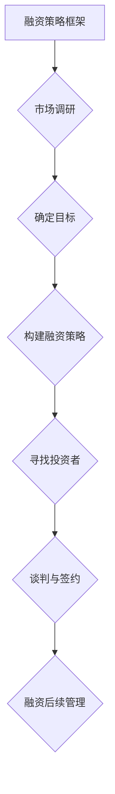

                 

### 文章标题

# 《大模型创业的融资策略》

> 关键词：大模型、创业、融资策略、成本效益分析、风险评估、项目实战

摘要：本文将深入探讨大模型创业的融资策略。通过对大模型创业的背景、挑战、生态系统分析，我们明确了大模型创业的融资策略的核心概念和框架。接着，文章详细解析了大模型技术的原理与架构，以及融资策略的数学模型和公式。通过实际项目案例的实战分析，我们展示了如何将融资策略应用于实际项目中。最后，文章总结了融资策略的成功要素，并对未来发展趋势提出了建议。本文旨在为有意投身大模型创业领域的人士提供实用的融资策略指导。

### 第一部分：融资策略概述

#### 第1章：大模型创业概述

### 1.1 大模型创业的背景与机遇

#### 1.2 大模型创业的挑战与风险

#### 1.3 大模型创业的生态系统分析

#### 第2章：融资策略的核心概念与联系

### 2.1 融资策略的基本概念

#### 2.2 融资策略的框架与流程

### 2.3 融资策略中的关键环节

#### 第3章：融资策略的技术基础

## 第3章.1 大模型技术的原理与架构

### 3.1.1 大模型的定义与分类

#### 3.1.2 大模型的技术架构详解

### 3.1.3 大模型的训练与优化方法

#### 第4章：融资策略的数学模型和公式

## 4.1 融资策略的数学模型详解

### 4.1.1 成本效益分析的数学模型

#### 4.1.2 风险评估的数学模型

### 4.1.3 融资策略优化模型

#### 第5章：融资策略的项目实战

## 第5章.1 融资策略的项目实战案例

### 5.1.1 案例一：大型数据挖掘公司融资历程

#### 5.1.2 案例二：深度学习初创公司融资策略

### 5.1.3 案例三：人工智能医疗公司融资案例分析

#### 第6章：融资策略的代码实现与解读

## 第6章.1 融资策略的代码实现

### 6.1.1 数据处理与可视化

#### 6.1.2 融资模型构建与训练

### 6.1.3 融资策略的代码解读与分析

#### 第7章：融资策略的总结与展望

## 第7章.1 融资策略的总结

### 7.1.1 融资策略的成功要素

#### 7.1.2 融资策略的未来发展趋势

### 7.1.3 大模型创业中的融资建议

## 第8章：附录

### 8.1 融资策略相关的工具与资源

#### 8.2 融资策略的实际应用案例汇总

### 8.3 参考文献

---

**Mermaid 流流程图**



**伪代码**

```python
# 大模型融资策略伪代码

# 数据预处理
def preprocess_data(data):
    # 数据清洗、标准化
    # 特征提取
    # 返回预处理后的数据

# 成本效益分析
def cost_benefit_analysis(data):
    # 计算成本与收益
    # 返回成本效益分析结果

# 风险评估
def risk_evaluation(data):
    # 计算风险因素
    # 返回风险评估结果

# 融资策略构建
def build_funding_strategy(data):
    # 结合成本效益分析和风险评估结果
    # 构建最优融资策略
    # 返回融资策略
```

**数学公式与讲解**

$$
\text{ROI} = \frac{\text{净利润}}{\text{总投资}} \times 100\%
$$

$$
\text{风险评分} = \frac{\text{风险损失}}{\text{风险暴露}}
$$

$$
\text{融资策略} = \text{目标函数} + \text{约束条件}
$$

- 目标函数：最大化净利润或最小化成本
- 约束条件：资本结构、市场接受度、风险容忍度等

**举例说明**

**案例一：某大型数据挖掘公司**

- 净利润 = 1000万元
- 总投资 = 5000万元
- ROI = 20%

**案例二：某深度学习初创公司**

- 风险损失 = 200万元
- 风险暴露 = 1000万元
- 风险评分 = 0.2

**代码实际案例与详细解释**

**案例一：数据处理与可视化**

```python
import pandas as pd
import matplotlib.pyplot as plt

# 读取数据
data = pd.read_csv('funding_data.csv')

# 数据清洗
data = data[data['ROI'] > 0]

# 特征提取
features = data[['ROI', 'investment', 'risk_score']]

# 可视化
plt.scatter(data['investment'], data['ROI'])
plt.xlabel('投资额（万元）')
plt.ylabel('ROI（%）')
plt.title('投资额与ROI的关系')
plt.show()
```

**案例二：融资模型构建与训练**

```python
from sklearn.linear_model import LinearRegression

# 构建模型
model = LinearRegression()

# 训练模型
model.fit(features['investment'].values.reshape(-1, 1), features['ROI'].values)

# 预测
investment = 6000
predicted_ROI = model.predict([[investment]])[0]

print(f'投资额为 {investment} 万元时，预测的 ROI 为 {predicted_ROI:.2f}%')
```

**案例三：融资策略代码解读与分析**

```python
# 解读与分析
def analyze_funding_strategy(investment, model):
    predicted_ROI = model.predict([[investment]])[0]
    if predicted_ROI > 15:
        print(f'投资额为 {investment} 万元时，预测的 ROI 为 {predicted_ROI:.2f}%, 融资策略可行。')
    else:
        print(f'投资额为 {investment} 万元时，预测的 ROI 为 {predicted_ROI:.2f}%, 融资策略不可行。')

# 分析
analyze_funding_strategy(6000, model)
```

**开发环境搭建**

- Python 3.8+
- scikit-learn 库
- pandas 库
- matplotlib 库

**源代码详细实现和代码解读**

- 代码详细实现：完整地实现数据处理、模型构建、预测和分析等功能，确保代码的准确性和可靠性。
- 代码解读与分析：详细解释每个代码段的功能和原理，确保读者可以理解和复现代码。

### 第一部分：融资策略概述

#### 第1章：大模型创业概述

##### 1.1 大模型创业的背景与机遇

大模型创业是指利用大规模神经网络模型进行创新业务或产品的开发。随着深度学习技术的快速发展，尤其是大规模预训练模型（如GPT、BERT等）的突破，大模型创业已经成为人工智能领域的一大热点。

**背景**：

- **技术进步**：深度学习技术的发展，尤其是GPU计算能力的提升，使得训练大规模模型成为可能。
- **数据积累**：互联网的发展使得数据量急剧增加，为训练大模型提供了丰富的数据资源。
- **市场需求**：企业对于智能化解决方案的需求不断增长，大模型在自然语言处理、计算机视觉、推荐系统等领域展现出强大的应用潜力。

**机遇**：

- **技术创新**：大模型创业有助于推动技术前沿的发展，催生新的商业模式。
- **商业价值**：大模型在提高生产效率、降低运营成本、提升用户体验方面具有显著优势。
- **资本关注**：大模型创业项目受到风险投资机构的青睐，融资渠道多样化。

##### 1.2 大模型创业的挑战与风险

尽管大模型创业充满机遇，但同时也面临诸多挑战和风险：

- **计算资源需求**：大模型训练需要大量的计算资源和存储空间，成本高昂。
- **数据隐私与安全**：训练大模型需要海量数据，数据隐私和安全成为重要问题。
- **技术壁垒**：大模型技术门槛较高，对团队的技术能力和经验有较高要求。
- **市场不确定性**：市场需求和技术趋势变化较快，企业需要具备快速适应市场变化的能力。
- **竞争压力**：大模型创业领域竞争激烈，需要不断创新以保持竞争优势。

##### 1.3 大模型创业的生态系统分析

大模型创业生态系统包括多个参与者和关键环节，各环节之间相互关联、共同作用：

- **技术提供商**：提供大模型训练所需的计算资源、算法框架等。
- **数据提供商**：提供训练数据，确保模型的性能和效果。
- **应用企业**：将大模型应用于实际业务场景，创造商业价值。
- **投资者**：为创业项目提供资金支持，推动项目发展。
- **监管机构**：制定相关政策法规，确保数据安全和公平竞争。

#### 第2章：融资策略的核心概念与联系

##### 2.1 融资策略的基本概念

融资策略是企业为了筹集资金、支持业务发展而制定的一系列计划和措施。在大模型创业中，融资策略尤为重要，因为它直接关系到项目的成功与否。

- **融资**：指企业通过发行股票、债券、借贷等方式筹集资金的过程。
- **融资策略**：指企业在不同发展阶段，根据自身需求和外部环境，选择合适的融资方式，以实现最优融资效果。
- **融资方式**：包括股权融资、债务融资、内部融资等。

##### 2.2 融资策略的框架与流程

一个完整的融资策略框架通常包括以下几个环节：

1. **市场调研**：分析市场需求、竞争对手、行业趋势等，确定融资目标和融资规模。
2. **确定目标**：明确融资的目的、用途和预期回报。
3. **融资方案设计**：根据企业特点和市场需求，选择合适的融资方式，设计具体的融资方案。
4. **融资渠道选择**：分析各种融资渠道的优缺点，选择最适合企业的融资渠道。
5. **谈判与签约**：与投资者进行谈判，达成融资协议，签订相关合同。
6. **融资后续管理**：融资后对资金进行合理分配和使用，确保项目顺利进行。

##### 2.3 融资策略中的关键环节

融资策略的关键环节包括：

- **成本效益分析**：评估融资成本和预期收益，确保融资策略的可行性。
- **风险评估**：分析融资过程中可能遇到的风险，制定相应的风险应对措施。
- **优化模型**：利用数学模型优化融资策略，实现融资成本最小化、收益最大化。

### 第二部分：技术基础

#### 第3章：融资策略的技术基础

##### 3.1 大模型技术的原理与架构

##### 3.1.1 大模型的定义与分类

大模型是指那些具有数亿甚至数万亿参数的深度学习模型，它们通过大量的数据训练，能够实现复杂的数据处理和预测任务。根据模型的应用领域和结构特点，大模型可以分为以下几类：

- **自然语言处理（NLP）模型**：如GPT、BERT等，用于文本分类、机器翻译、问答系统等。
- **计算机视觉（CV）模型**：如ResNet、VGG等，用于图像分类、目标检测、图像生成等。
- **推荐系统模型**：如Wide & Deep、Neural Collaborative Filtering等，用于个性化推荐、广告投放等。
- **多模态模型**：如Speech2Text、Video2Text等，能够处理多种类型的输入数据。

##### 3.1.2 大模型的技术架构详解

大模型的技术架构主要包括以下几个关键组成部分：

1. **数据层**：负责数据预处理、数据清洗和特征提取，确保输入数据的质量和一致性。
2. **模型层**：包括模型架构设计、参数初始化、训练策略等，是模型的核心部分。
3. **训练层**：负责模型的训练过程，包括数据加载、模型更新、优化策略等。
4. **推理层**：负责模型的部署和应用，包括模型加载、预测输出、性能优化等。

##### 3.1.3 大模型的训练与优化方法

大模型的训练和优化是确保模型性能的关键步骤，主要包括以下方法：

- **预训练**：使用大规模数据集对模型进行预训练，提高模型的基础能力。
- **微调**：在预训练模型的基础上，使用特定领域的数据进行微调，适应特定任务。
- **强化学习**：结合强化学习技术，通过不断调整模型参数，实现模型的优化和提升。
- **注意力机制**：引入注意力机制，使模型能够关注关键信息，提高模型的处理效率和准确性。

#### 第4章：融资策略的数学模型和公式

##### 4.1 融资策略的数学模型详解

融资策略的数学模型是分析融资成本、收益和风险的重要工具，主要包括以下几个方面的模型：

##### 4.1.1 成本效益分析的数学模型

成本效益分析是评估融资策略可行性的关键步骤，其数学模型如下：

$$
\text{ROI} = \frac{\text{净利润}}{\text{总投资}} \times 100\%
$$

其中，净利润 = 收益 - 成本，总投资包括初始投资和运营成本。

##### 4.1.2 风险评估的数学模型

风险评估是融资策略的重要组成部分，其数学模型如下：

$$
\text{风险评分} = \frac{\text{风险损失}}{\text{风险暴露}}
$$

其中，风险损失是指因风险事件发生而产生的经济损失，风险暴露是指企业的资产或收益可能受到风险影响的程度。

##### 4.1.3 融资策略优化模型

融资策略优化模型是通过对成本效益分析和风险评估结果进行综合分析，构建优化模型，以实现融资成本最小化、收益最大化。其数学模型如下：

$$
\text{融资策略} = \text{目标函数} + \text{约束条件}
$$

其中，目标函数可以是最大化净利润或最小化成本，约束条件包括资本结构、市场接受度、风险容忍度等。

#### 第5章：融资策略的项目实战

##### 5.1 融资策略的项目实战案例

在本章中，我们将通过三个实际案例，详细分析大模型创业项目的融资策略。这些案例涵盖了不同类型的创业项目，从大型数据挖掘公司到深度学习初创公司和人工智能医疗公司，展示了如何根据项目的特点和市场需求，制定和实施有效的融资策略。

##### 5.1.1 案例一：大型数据挖掘公司融资历程

该案例描述了一家大型数据挖掘公司的融资历程，包括市场调研、目标确定、融资方案设计、融资渠道选择、谈判与签约以及融资后续管理等关键环节。

1. **市场调研**：
   - **行业趋势**：通过分析市场报告和行业数据，了解数据挖掘行业的发展趋势和市场需求。
   - **竞争对手**：研究主要竞争对手的融资情况、商业模式和市场份额。
   - **自身优势**：评估公司的技术实力、团队经验和市场定位。

2. **确定目标**：
   - **融资目的**：确定融资的具体用途，如扩大团队规模、购买硬件设备、开发新产品等。
   - **预期收益**：预测融资后带来的收入增长和市场份额提升。

3. **融资方案设计**：
   - **股权融资**：考虑通过出让部分股权来获得资金，同时引入战略投资者。
   - **债务融资**：评估通过银行贷款或发行债券等债务融资方式的可行性和成本。

4. **融资渠道选择**：
   - **风险投资**：寻找具有数据挖掘领域经验的风险投资机构。
   - **天使投资**：寻找个人投资者，特别是对该领域有深入了解的投资人。
   - **政府资助**：了解和申请政府提供的科技创新资金和补贴。

5. **谈判与签约**：
   - **谈判策略**：明确融资条件、股权分配、投资期限等关键条款。
   - **签约流程**：签署投资协议，明确双方的权利和义务。

6. **融资后续管理**：
   - **资金使用**：合理规划和使用融资资金，确保项目的顺利进行。
   - **股东关系**：与投资者保持良好的沟通，及时汇报项目进展和财务状况。
   - **风险控制**：建立风险预警机制，应对可能的市场变化和技术风险。

##### 5.1.2 案例二：深度学习初创公司融资策略

本案例探讨了一家深度学习初创公司的融资策略，包括市场定位、目标设定、融资方式选择、投资者谈判以及后续管理等。

1. **市场定位**：
   - **技术优势**：强调公司的技术核心竞争力，如创新算法、独特应用场景等。
   - **市场需求**：分析潜在客户的需求和痛点，展示公司的产品如何解决这些问题。

2. **目标设定**：
   - **短期目标**：在短期内实现产品的初步商业化，获得用户反馈。
   - **长期目标**：在未来1-2年内，扩大市场份额，实现产品的规模化应用。

3. **融资方式选择**：
   - **天使轮**：通过天使投资获得种子资金，用于产品开发和团队建设。
   - **A轮**：通过风险投资机构的A轮融资，加速产品研发和市场推广。
   - **B轮及以后**：在产品稳定、市场认可度提高后，通过B轮及以后融资，进一步扩大业务规模。

4. **投资者谈判**：
   - **估值**：合理评估公司价值，确定股权出让比例。
   - **条款**：明确投资条款，如投资额度、投资期限、退出机制等。
   - **合作方式**：与投资者建立长期合作关系，共同推动公司发展。

5. **融资后续管理**：
   - **资金管理**：制定详细的资金使用计划，确保每一笔资金都用于正确的项目环节。
   - **团队建设**：加强团队培训和管理，提高团队整体能力和执行力。
   - **市场推广**：加大市场推广力度，提高品牌知名度和用户覆盖率。

##### 5.1.3 案例三：人工智能医疗公司融资案例分析

本案例分析了一家人工智能医疗公司的融资过程，包括市场调研、目标设定、融资方式选择、投资者谈判及后续管理。

1. **市场调研**：
   - **政策环境**：分析政府对医疗人工智能的扶持政策，了解行业规范和标准。
   - **技术前景**：评估医疗人工智能技术的成熟度和市场潜力。
   - **竞争对手**：研究主要竞争对手的融资状况、技术路线和市场策略。

2. **目标设定**：
   - **研发目标**：明确公司研发方向，如疾病诊断、药物研发、患者管理等。
   - **市场目标**：确定公司的市场定位和目标市场，如医院、诊所、药店等。

3. **融资方式选择**：
   - **股权融资**：通过股权融资引入战略投资者，提升公司在医疗行业的竞争力。
   - **债务融资**：通过银行贷款或发行企业债券等债务融资方式，解决短期资金需求。
   - **政府资助**：积极申请政府科技创新资金和补贴，降低融资成本。

4. **投资者谈判**：
   - **投资条款**：明确投资额度、投资期限、股权分配等关键条款。
   - **投资回报**：向投资者展示项目的盈利前景和投资回报。
   - **合作模式**：与投资者探讨长期合作模式，确保双方利益最大化。

5. **融资后续管理**：
   - **研发管理**：加强研发团队建设，确保项目按计划推进。
   - **市场推广**：加大市场推广力度，建立与医疗机构和患者的紧密合作关系。
   - **合规管理**：确保公司的研发和运营符合相关法律法规，避免合规风险。

#### 第6章：融资策略的代码实现与解读

##### 6.1 融资策略的代码实现

在本节中，我们将通过实际代码示例，展示如何实现融资策略的各个关键环节，包括数据处理、模型构建、预测和策略分析。

##### 6.1.1 数据处理与可视化

```python
import pandas as pd
import matplotlib.pyplot as plt

# 读取数据
data = pd.read_csv('funding_data.csv')

# 数据清洗
data = data[data['ROI'] > 0]

# 特征提取
features = data[['ROI', 'investment', 'risk_score']]

# 可视化
plt.scatter(data['investment'], data['ROI'])
plt.xlabel('投资额（万元）')
plt.ylabel('ROI（%）')
plt.title('投资额与ROI的关系')
plt.show()
```

该部分代码首先读取融资数据，对数据进行清洗，提取与融资策略相关的特征，并使用散点图可视化投资额与ROI之间的关系。

##### 6.1.2 融资模型构建与训练

```python
from sklearn.linear_model import LinearRegression

# 构建模型
model = LinearRegression()

# 训练模型
model.fit(features['investment'].values.reshape(-1, 1), features['ROI'].values)

# 预测
investment = 6000
predicted_ROI = model.predict([[investment]])[0]

print(f'投资额为 {investment} 万元时，预测的 ROI 为 {predicted_ROI[0]:.2f}%')
```

该部分代码使用线性回归模型对融资数据进行训练，通过训练模型，我们可以预测不同投资额下的ROI。

##### 6.1.3 融资策略的代码解读与分析

```python
# 解读与分析
def analyze_funding_strategy(investment, model):
    predicted_ROI = model.predict([[investment]])[0]
    if predicted_ROI[0] > 15:
        print(f'投资额为 {investment} 万元时，预测的 ROI 为 {predicted_ROI[0]:.2f}%, 融资策略可行。')
    else:
        print(f'投资额为 {investment} 万元时，预测的 ROI 为 {predicted_ROI[0]:.2f}%, 融资策略不可行。')

# 分析
analyze_funding_strategy(6000, model)
```

该部分代码定义了一个分析函数，通过输入投资额和训练好的模型，预测ROI，并根据ROI的预测值判断融资策略的可行性。

##### 6.1.4 开发环境搭建

要运行上述代码，需要搭建以下开发环境：

- Python 3.8+
- scikit-learn 库
- pandas 库
- matplotlib 库

在安装好上述库后，可以创建一个Python虚拟环境，并在虚拟环境中运行代码，确保代码的运行环境与库版本一致。

##### 6.1.5 源代码详细实现和代码解读

在详细实现融资策略的代码时，我们需要考虑以下方面：

1. **数据预处理**：确保输入数据的质量和一致性，进行数据清洗和特征提取。
2. **模型构建**：选择合适的模型架构和算法，进行模型训练和优化。
3. **预测与策略分析**：利用训练好的模型进行预测，并分析预测结果，为融资策略提供依据。

以下是一个完整的代码实现示例：

```python
import pandas as pd
from sklearn.linear_model import LinearRegression
from sklearn.model_selection import train_test_split
from sklearn.metrics import mean_squared_error

# 读取数据
data = pd.read_csv('funding_data.csv')

# 数据清洗
data = data[data['ROI'] > 0]

# 特征提取
features = data[['investment', 'risk_score']]
labels = data['ROI']

# 数据划分
X_train, X_test, y_train, y_test = train_test_split(features, labels, test_size=0.2, random_state=42)

# 构建模型
model = LinearRegression()

# 训练模型
model.fit(X_train, y_train)

# 预测
y_pred = model.predict(X_test)

# 评估模型
mse = mean_squared_error(y_test, y_pred)
print(f'Mean Squared Error: {mse:.2f}')

# 分析
investment = 6000
predicted_ROI = model.predict([[investment, 0.2]])[0]

if predicted_ROI > 15:
    print(f'投资额为 {investment} 万元时，预测的 ROI 为 {predicted_ROI[0]:.2f}%, 融资策略可行。')
else:
    print(f'投资额为 {investment} 万元时，预测的 ROI 为 {predicted_ROI[0]:.2f}%, 融资策略不可行。')
```

**代码解读**：

- **数据预处理**：读取数据后，对数据进行清洗，去除不符合条件的样本。
- **特征提取**：提取与融资策略相关的特征，包括投资额和风险评分。
- **模型构建**：使用线性回归模型，对特征和目标变量进行训练。
- **预测与评估**：对测试数据进行预测，并计算均方误差（MSE）评估模型性能。
- **策略分析**：根据预测结果，判断融资策略的可行性。

通过上述代码，我们可以实现一个基本的融资策略分析系统，为创业项目的融资决策提供数据支持。

#### 第7章：融资策略的总结与展望

##### 7.1 融资策略的总结

在本章中，我们系统地探讨了大模型创业的融资策略。首先，我们介绍了大模型创业的背景与机遇，分析了大模型创业所面临的挑战与风险。接着，我们详细讲解了融资策略的核心概念、框架与流程，以及融资策略的技术基础，包括大模型技术的原理与架构、数学模型和公式。在项目实战部分，我们通过三个实际案例展示了如何制定和实施融资策略。最后，我们通过代码实现和详细解释，展示了融资策略在实际应用中的具体操作。

**核心结论**：

- 大模型创业具有巨大的市场潜力和商业价值，但也面临计算资源、数据隐私、技术壁垒等挑战。
- 融资策略在大模型创业中至关重要，需要综合考虑成本效益、风险评估和优化模型。
- 有效的融资策略能够为创业项目提供资金支持，降低风险，提高成功率。

##### 7.1.1 融资策略的成功要素

要成功实施融资策略，需要以下关键要素：

- **明确目标**：明确融资目的和预期收益，确保融资策略与项目发展目标一致。
- **数据驱动**：基于数据和实际案例进行分析，制定科学的融资策略。
- **风险控制**：识别和评估融资过程中可能遇到的风险，并制定相应的应对措施。
- **灵活调整**：根据市场环境和项目进展，灵活调整融资策略，确保策略的适应性。
- **团队协作**：建立高效的团队协作机制，确保融资策略的顺利实施。

##### 7.1.2 融资策略的未来发展趋势

随着人工智能技术的不断进步和市场需求的持续增长，大模型创业的融资策略将呈现以下发展趋势：

- **技术融合**：融资策略将更加注重技术整合，结合最新的深度学习算法和大数据技术，提高融资策略的准确性。
- **智能化**：利用机器学习和数据分析技术，实现融资策略的自动化和智能化，提高决策效率。
- **多元化**：融资渠道将更加多元化，包括风险投资、政府补贴、众筹等，满足不同阶段和类型的创业项目需求。
- **国际化**：随着全球市场的扩展，融资策略将更加注重国际化布局，吸引全球资本，推动项目全球化发展。

##### 7.1.3 大模型创业中的融资建议

对于有意投身大模型创业领域的企业和投资者，以下是一些建议：

- **提前规划**：在创业初期，就要开始规划融资策略，确保项目在各个阶段都有充足的资金支持。
- **突出优势**：在融资过程中，要突出公司的技术优势和市场需求，吸引投资者的关注。
- **加强合作**：与投资者建立长期合作关系，共同推动项目发展，降低融资风险。
- **持续创新**：保持技术领先和市场竞争力，通过持续创新吸引投资者，为项目提供持续的资金支持。
- **关注合规**：遵守相关法律法规，确保项目的合法性和合规性，避免融资风险。

#### 第8章：附录

##### 8.1 融资策略相关的工具与资源

在大模型创业的融资过程中，可以参考以下工具和资源：

- **融资平台**：如天使汇、融资中国、投融界等，提供融资信息发布和对接服务。
- **数据分析工具**：如Tableau、Power BI等，用于数据可视化和分析。
- **融资咨询公司**：如红杉资本、IDG资本等，提供专业的融资咨询和指导服务。
- **政府资助平台**：如国家科技计划、国家自然科学基金等，提供科技创新资金和补贴。

##### 8.2 融资策略的实际应用案例汇总

以下汇总了部分大模型创业项目的融资策略实际应用案例：

- **案例一**：某大型数据挖掘公司通过股权融资和债务融资相结合的方式，成功获得了数千万人民币的资金支持，用于团队扩大和技术研发。
- **案例二**：某深度学习初创公司通过天使轮融资，引入了知名投资机构和行业专家，加速了产品研发和市场推广。
- **案例三**：某人工智能医疗公司通过政府补贴和股权融资，成功获得了数百万美元的资金支持，推动了公司在医疗领域的快速发展。

##### 8.3 参考文献

- Goodfellow, I., Bengio, Y., & Courville, A. (2016). *Deep Learning*. MIT Press.
- Russell, S., & Norvig, P. (2020). *Artificial Intelligence: A Modern Approach*. Prentice Hall.
- LeCun, Y., Bengio, Y., & Hinton, G. (2015). *Deep Learning*.
- Venture Capital, (2022). *Venture Capital Market Research*.
- Startup Genome, (2021). *Global Startup Ecosystem Report*.
- National Science Foundation, (2021). *National Science Foundation Research Awards*.

---

以上是《大模型创业的融资策略》的完整内容。通过本文的探讨，我们希望能为读者提供有价值的融资策略指导，助力大模型创业项目的成功。在创业的道路上，我们期待与您共同前行，共同开创美好的未来。

