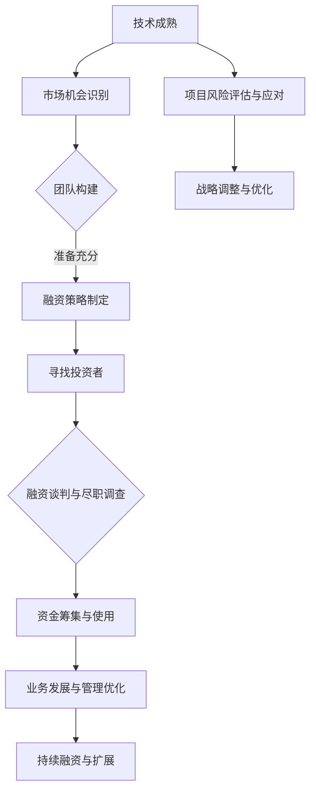

                 

### 文章标题

《大模型创业的融资策略》

### 关键词

- 大模型
- 创业融资
- 市场定位
- 商业模式
- 融资策略
- 风险管理

### 摘要

本文旨在探讨大模型创业公司的融资策略。通过对大模型创业的背景、融资概述、融资准备与市场定位、融资策略实施与优化、案例分析及不同阶段融资策略的调整等方面进行详细分析，结合实际案例，为创业者提供实用的融资策略指导。文章最后还介绍了融资相关的法律法规、术语及工具，为读者提供全面的知识支持。

---

### 《大模型创业的融资策略》目录大纲

**第一部分：大模型创业背景及融资概述**

1. **1.1 大模型创业的背景与挑战**
    - **1.1.1 大模型技术的发展与应用**
    - **1.1.2 大模型创业的市场机会与风险**
    - **1.1.3 大模型创业的必要条件**

2. **1.2 融资策略的基本概念**
    - **1.2.1 融资的定义与目的**
    - **1.2.2 融资的方式与渠道**
    - **1.2.3 融资的流程与关键步骤**

**第二部分：融资准备与市场定位**

1. **2.1 创业团队的构建与融资策略**
    - **2.1.1 创业团队的组建策略**
    - **2.1.2 团队成员的技能与素质**
    - **2.1.3 团队的融资能力建设**

2. **2.2 市场定位与竞争分析**
    - **2.2.1 市场定位的重要性**
    - **2.2.2 竞争对手分析**
    - **2.2.3 市场机会与风险分析**

3. **2.3 商业模式与财务预测**
    - **2.3.1 商业模式的设计**
    - **2.3.2 财务预测与估值**
    - **2.3.3 商业模式的可持续性分析**

**第三部分：融资策略实施与优化**

1. **3.1 融资策略的选择与组合**
    - **3.1.1 股权融资与债务融资的比较**
    - **3.1.2 融资策略的选择原则**
    - **3.1.3 融资策略的组合策略**

2. **3.2 融资过程的实施与管理**
    - **3.2.1 融资前的准备工作**
    - **3.2.2 融资过程中的关键步骤**
    - **3.2.3 融资后的管理策略**

3. **3.3 融资谈判与尽职调查**
    - **3.3.1 融资谈判的策略**
    - **3.3.2 尽职调查的重要性**
    - **3.3.3 尽职调查的主要内容与方法**

4. **3.4 融资后的风险管理与优化**
    - **3.4.1 融资后的风险管理策略**
    - **3.4.2 资金使用的监督与控制**
    - **3.4.3 融资后的业务发展策略**

**第四部分：案例分析与应用**

1. **4.1 大模型创业融资成功案例**
    - **4.1.1 案例背景与分析**
    - **4.1.2 成功融资的关键因素**
    - **4.1.3 案例总结与启示**

2. **4.2 大模型创业融资失败案例**
    - **4.2.1 案例背景与分析**
    - **4.2.2 失败原因与教训**
    - **4.2.3 案例总结与启示**

3. **4.3 融资策略在不同阶段的调整**
    - **4.3.1 种子轮到天使轮的融资策略**
    - **4.3.2 天使轮到A轮的融资策略**
    - **4.3.3 A轮到B轮的融资策略**

4. **4.4 跨界合作与融资策略创新**
    - **4.4.1 跨界合作的背景与意义**
    - **4.4.2 跨界合作的融资策略**
    - **4.4.3 融资策略的创新实践**

**附录**

1. **附录A：融资相关的法律法规与政策**
    - **A.1 融资法律法规概述**
    - **A.2 股权融资的法律法规**
    - **A.3 债务融资的法律法规**

2. **附录B：融资相关的术语与定义**
    - **B.1 融资相关的术语**
    - **B.2 融资相关的定义**
    - **B.3 融资相关的指标与计算方法**

3. **附录C：融资工具与平台介绍**
    - **C.1 股权融资工具与平台**
    - **C.2 债务融资工具与平台**
    - **C.3 其他融资工具与平台介绍**

---

### 第一部分：大模型创业背景及融资概述

#### 1.1 大模型创业的背景与挑战

##### 1.1.1 大模型技术的发展与应用

大模型（Large Models）是指拥有数亿甚至千亿参数的深度学习模型，如GPT、BERT等。这些模型在语言处理、图像识别、自然语言生成等领域取得了显著成果，推动了人工智能（AI）技术的发展。

- **语言处理：** GPT-3、BERT等模型在文本生成、翻译、问答等任务中表现优异。
- **图像识别：** 大模型如ResNet、EfficientNet等在ImageNet等图像识别挑战赛中取得了优异成绩。
- **自然语言生成：** 大模型如T5、Ctrl等在生成式任务中表现出色。

##### 1.1.2 大模型创业的市场机会与风险

大模型创业面临着巨大的市场机会，同时也伴随着一定的风险。

- **市场机会：**
  - **技术创新：** 大模型技术的快速发展为创业公司提供了广阔的创新空间。
  - **应用场景：** 大模型在各个领域的应用场景不断拓展，如智能医疗、智能交通、智能金融等。
  - **商业价值：** 大模型在提高生产效率、降低运营成本等方面具有显著优势。

- **市场风险：**
  - **技术风险：** 大模型的技术门槛较高，创业公司需要具备强大的技术实力。
  - **市场竞争：** 大模型领域的竞争激烈，创业公司需要不断创新以保持竞争力。
  - **资金风险：** 大模型创业需要大量的资金支持，资金风险是创业公司面临的重大挑战。

##### 1.1.3 大模型创业的必要条件

成功的大模型创业需要满足以下必要条件：

- **技术团队：** 具备深厚的技术背景和丰富的项目经验，能够实现大模型的技术创新。
- **市场洞察：** 深入了解市场需求，抓住行业趋势，提供具有竞争力的产品和服务。
- **资金支持：** 获得足够的资金支持，保证项目的持续发展和创新。
- **资源整合：** 有效整合各类资源，包括技术、人才、市场等，实现协同发展。

#### 1.2 融资策略的基本概念

##### 1.2.1 融资的定义与目的

融资是指企业通过向外部投资者、银行等渠道筹集资金，以支持企业的发展。融资的目的是满足企业的资金需求，支持技术研发、市场扩张、业务拓展等。

- **资金需求：** 企业在发展过程中可能面临资金短缺的问题，通过融资可以解决这一需求。
- **支持发展：** 融资可以为企业的技术创新、市场拓展等提供资金支持，促进企业快速发展。

##### 1.2.2 融资的方式与渠道

融资的方式和渠道多种多样，包括股权融资、债务融资、政府补贴、风险投资等。

- **股权融资：** 企业通过向投资者出售股份来筹集资金，如天使投资、风险投资等。
- **债务融资：** 企业通过向银行等金融机构借款来筹集资金，如贷款、债券等。
- **政府补贴：** 企业可以通过申请政府补贴来获得资金支持，如科技创新基金、中小企业扶持基金等。
- **风险投资：** 风险投资机构通过投资初创企业，以获取高额回报。

##### 1.2.3 融资的流程与关键步骤

融资的流程包括项目策划、市场调研、商业计划书编写、融资申请、谈判与签约等关键步骤。

- **项目策划：** 确定融资项目的目标、规模、资金需求等。
- **市场调研：** 对市场需求、竞争环境、潜在投资者等进行调研。
- **商业计划书编写：** 编写详细的商业计划书，包括市场分析、产品规划、财务预测等。
- **融资申请：** 向投资者、银行等金融机构提交融资申请。
- **谈判与签约：** 与投资者、银行等就融资条件、资金用途等进行谈判，并签署相关协议。

---

### 第二部分：融资准备与市场定位

#### 2.1 创业团队的构建与融资策略

##### 2.1.1 创业团队的组建策略

构建一个高效的创业团队是实现大模型创业成功的关键。以下是组建创业团队的策略：

- **核心团队：** 团队核心成员应具备深厚的技术背景、丰富的行业经验和优秀的领导能力。核心团队应包括技术总监、产品经理、市场总监等。
- **专业技能：** 团队成员应具备多元化的专业技能，包括算法、数据、产品、运营等，以满足大模型创业的多方面需求。
- **互补性：** 团队成员之间应具备互补性，能够相互支持和协作，共同推动项目的发展。
- **稳定性：** 保持团队的稳定性，避免因人员变动而导致项目停滞或失败。

##### 2.1.2 团队成员的技能与素质

团队成员应具备以下技能与素质：

- **技术能力：** 团队成员应具备扎实的专业知识和技能，能够应对复杂的技术挑战。
- **创新思维：** 团队成员应具备创新思维，能够不断提出新的技术方案和商业机会。
- **领导能力：** 团队成员应具备领导能力，能够带领团队共同解决问题，推动项目进展。
- **沟通能力：** 团队成员应具备良好的沟通能力，能够与团队成员、合作伙伴、投资者等进行有效沟通。
- **执行力：** 团队成员应具备执行力，能够按照项目计划高效完成任务。

##### 2.1.3 团队的融资能力建设

团队的融资能力建设是确保融资成功的重要环节。以下是团队融资能力建设的策略：

- **市场调研：** 对市场需求、竞争环境、潜在投资者等进行深入调研，为融资策略提供依据。
- **商业计划书：** 编写详细的商业计划书，包括市场分析、产品规划、财务预测等，以展示项目的可行性和吸引力。
- **融资渠道：** 掌握多种融资渠道，包括天使投资、风险投资、政府补贴等，选择最合适的融资方式。
- **谈判技巧：** 提升团队成员的谈判技巧，能够在融资谈判中获得更有利的结果。
- **法律顾问：** 咨询专业的法律顾问，确保融资过程中的合同、协议等合法有效。

---

#### 2.2 市场定位与竞争分析

##### 2.2.1 市场定位的重要性

市场定位是创业公司战略规划的核心环节，对于大模型创业公司尤为重要。以下是市场定位的重要性：

- **差异化竞争优势：** 通过市场定位，创业公司可以明确自身在市场中的竞争优势，实现差异化发展。
- **目标客户群体：** 市场定位有助于明确目标客户群体，针对不同客户群体提供定制化的产品和服务。
- **市场策略：** 市场定位为创业公司提供了市场策略的指导，包括产品定价、营销推广等。
- **资源分配：** 市场定位有助于创业公司合理分配资源，实现资源最大化利用。

##### 2.2.2 竞争对手分析

竞争对手分析是创业公司制定市场定位策略的重要依据。以下是竞争对手分析的步骤：

- **识别竞争对手：** 通过市场调研和竞争情报收集，识别直接和潜在的竞争对手。
- **分析竞争策略：** 分析竞争对手的产品、服务、市场定位、营销策略等，了解其优势与劣势。
- **SWOT分析：** 对竞争对手进行SWOT（优势、劣势、机会、威胁）分析，明确其竞争态势。
- **制定应对策略：** 根据竞争对手分析结果，制定应对策略，包括产品差异化、市场拓展、技术领先等。

##### 2.2.3 市场机会与风险分析

市场机会与风险分析是创业公司制定市场定位策略的重要环节。以下是市场机会与风险分析的步骤：

- **市场机会：**
  - **技术趋势：** 关注行业技术发展趋势，寻找潜在的市场机会。
  - **政策支持：** 了解国家政策支持方向，把握政策红利。
  - **市场需求：** 深入研究市场需求，寻找尚未满足的消费需求。

- **市场风险：**
  - **技术风险：** 大模型技术的不确定性和成熟度带来的风险。
  - **市场竞争：** 市场竞争激烈带来的市场份额争夺风险。
  - **资金风险：** 融资过程中可能面临资金不足的风险。

通过市场机会与风险分析，创业公司可以制定更加科学、合理的市场定位策略，提高市场竞争力。

---

#### 2.3 商业模式与财务预测

##### 2.3.1 商业模式的设计

商业模式是指企业如何创造、传递和捕获价值的系统。对于大模型创业公司，设计一个有效的商业模式至关重要。以下是商业模式设计的步骤：

- **价值主张：** 明确企业提供的核心产品或服务，以及其独特的价值。
- **目标客户：** 确定目标客户群体，了解其需求和偏好。
- **收入模式：** 确定企业的收入来源，包括产品销售、服务收费、订阅制等。
- **成本结构：** 分析企业的成本结构，包括固定成本和可变成本。
- **关键资源：** 明确企业所需的关键资源，包括技术、人才、资金等。
- **关键活动：** 确定实现商业模式的关键活动，包括研发、生产、营销、服务等。

##### 2.3.2 财务预测与估值

财务预测是创业公司制定融资策略的重要依据。以下是财务预测与估值的步骤：

- **收入预测：** 根据市场定位、销售策略和客户需求，预测企业的收入。
- **成本预测：** 分析企业的成本结构，预测企业的成本。
- **利润预测：** 根据收入预测和成本预测，预测企业的利润。
- **现金流预测：** 分析企业的现金流状况，预测企业的现金流入和流出。
- **估值方法：** 选择合适的估值方法，如市盈率法、折现现金流法等，对企业进行估值。

财务预测与估值的结果将为企业提供以下价值：

- **融资依据：** 为投资者提供财务预测和估值数据，增强投资信心。
- **业务发展指导：** 为企业制定业务发展策略提供数据支持。
- **风险管理：** 分析财务预测和估值结果，识别潜在的风险，并采取相应的管理措施。

##### 2.3.3 商业模式的可持续性分析

商业模式的可持续性分析是确保企业长期发展的关键。以下是商业模式可持续性分析的步骤：

- **市场竞争力：** 分析企业的市场竞争力，包括产品或服务的独特性、竞争优势等。
- **盈利能力：** 分析企业的盈利能力，包括收入、利润、现金流等。
- **成本控制：** 分析企业的成本结构，评估成本控制的效率。
- **创新能力：** 分析企业的创新能力，包括技术研发、产品创新等。
- **社会责任：** 分析企业对社会和环境的影响，确保企业的发展符合社会责任。

通过可持续性分析，企业可以识别潜在的挑战和机会，制定相应的策略，确保商业模式的长期发展。

---

### 第三部分：融资策略实施与优化

#### 3.1 融资策略的选择与组合

##### 3.1.1 股权融资与债务融资的比较

股权融资和债务融资是创业公司常见的融资方式，各有优缺点。

- **股权融资：**
  - **优点：**
    - **资金无偿还压力：** 股权融资获得的资金无需偿还，减轻企业的财务压力。
    - **增加股东权益：** 股权融资可以增加企业的股东权益，为企业的未来发展提供支持。
  - **缺点：**
    - **股权稀释：** 随着股权融资的增加，创始人的股权会被稀释。
    - **控制权丧失：** 股权融资可能带来控制权的丧失，需要与投资者达成共识。

- **债务融资：**
  - **优点：**
    - **还款压力明确：** 债务融资需要按时还款，企业可以明确还款计划。
    - **财务灵活性：** 债务融资不会改变企业的股权结构，保持企业的财务灵活性。
  - **缺点：**
    - **高额利息支出：** 债务融资需要支付高额的利息，增加企业的财务成本。
    - **债务负担：** 随着债务融资的增加，企业的债务负担会逐渐加重。

##### 3.1.2 融资策略的选择原则

选择合适的融资策略是创业公司成功融资的关键。以下是融资策略的选择原则：

- **资金需求：** 根据企业的资金需求，选择合适的融资方式。如果资金需求较大，可以适当增加股权融资的比例。
- **市场环境：** 分析市场环境，了解投资者对股权融资和债务融资的偏好。在市场环境较好的情况下，可以适当增加股权融资的比例。
- **企业阶段：** 考虑企业的发展阶段，选择适合的融资方式。在初创阶段，股权融资可能更为适合；在成熟阶段，债务融资可能更为合适。
- **成本效益：** 综合考虑融资成本和效益，选择成本较低、效益较高的融资方式。

##### 3.1.3 融资策略的组合策略

融资策略的组合策略是将股权融资和债务融资相结合，以实现最优的融资效果。以下是融资策略的组合策略：

- **股权融资为主，债务融资为辅：** 在初创阶段，企业可以以股权融资为主，债务融资为辅，以降低财务成本。
- **债务融资为主，股权融资为辅：** 在成熟阶段，企业可以以债务融资为主，股权融资为辅，以提高资金利用效率。
- **根据需求调整：** 根据企业的资金需求和发展阶段，灵活调整股权融资和债务融资的比例，以实现最优的融资效果。

---

#### 3.2 融资过程的实施与管理

##### 3.2.1 融资前的准备工作

在融资过程中，准备工作至关重要。以下是融资前的准备工作：

- **商业计划书：** 编写详细的商业计划书，包括市场分析、产品规划、财务预测等，以展示企业的项目可行性。
- **财务报表：** 准备完整的财务报表，包括资产负债表、利润表、现金流量表等，以展示企业的财务状况。
- **法律文件：** 准备相关的法律文件，包括公司章程、股东协议、融资协议等，确保融资过程中的法律合规性。
- **投资者关系：** 建立良好的投资者关系，与投资者保持密切沟通，了解投资者的需求和期望。

##### 3.2.2 融资过程中的关键步骤

融资过程中的关键步骤包括融资申请、谈判与签约等。以下是关键步骤的详细说明：

- **融资申请：** 向投资者或金融机构提交融资申请，包括商业计划书、财务报表、法律文件等。
- **尽职调查：** 投资者或金融机构会对企业进行尽职调查，包括财务审计、法律审核、业务评估等。
- **谈判与签约：** 双方就融资条件、资金用途、股权结构等进行谈判，并签订融资协议。

##### 3.2.3 融资后的管理策略

融资后的管理策略是确保融资资金有效使用、降低融资成本、提高企业价值的关键。以下是融资后的管理策略：

- **资金使用监督：** 制定资金使用计划，明确资金用途和审批流程，确保资金使用的合法合规。
- **财务风险管理：** 建立财务风险管理制度，监测企业的财务状况，及时发现和应对潜在的风险。
- **股权管理：** 管理好股权结构，避免股权稀释带来的控制权丧失。
- **业务发展支持：** 将融资资金用于企业业务发展，提高企业的竞争力和市场占有率。

---

#### 3.3 融资谈判与尽职调查

##### 3.3.1 融资谈判的策略

融资谈判是创业公司与投资者之间的关键环节。以下是融资谈判的策略：

- **了解对方需求：** 在谈判前，深入了解投资者的需求和期望，以制定针对性的谈判策略。
- **展示企业价值：** 在谈判中，充分展示企业的核心竞争力、市场前景和盈利能力，增强投资者的信心。
- **灵活调整：** 根据谈判的进展，灵活调整谈判策略，找到双方都能接受的融资条件。
- **沟通技巧：** 保持良好的沟通氛围，尊重对方的观点，避免过度争执。

##### 3.3.2 尽职调查的重要性

尽职调查是投资者对创业公司进行全面评估的重要环节。以下是尽职调查的重要性：

- **识别风险：** 尽职调查可以帮助投资者识别潜在的风险，如财务风险、法律风险、业务风险等，为投资决策提供依据。
- **评估价值：** 尽职调查可以帮助投资者全面评估企业的价值，包括财务状况、业务模式、市场前景等，为投资决策提供支持。
- **降低风险：** 尽职调查可以降低投资者的投资风险，确保投资决策的科学性和合理性。

##### 3.3.3 尽职调查的主要内容与方法

尽职调查的主要内容包括财务审计、法律审核、业务评估等。以下是尽职调查的主要内容与方法：

- **财务审计：**
  - **内容：** 检查企业的财务报表、会计凭证、账簿等，评估企业的财务状况。
  - **方法：** 请专业的会计师事务所进行审计，获取审计报告。

- **法律审核：**
  - **内容：** 审查企业的法律文件，包括公司章程、股东协议、融资协议等，确保法律合规性。
  - **方法：** 请专业的律师事务所进行法律审核，获取法律意见书。

- **业务评估：**
  - **内容：** 评估企业的业务模式、市场前景、竞争力等，判断企业的未来发展潜力。
  - **方法：** 通过访谈、调研、分析等方式进行业务评估。

---

#### 3.4 融资后的风险管理与优化

##### 3.4.1 融资后的风险管理策略

融资后的风险管理是确保企业持续发展的重要环节。以下是融资后的风险管理策略：

- **风险识别：** 定期对企业的风险进行识别和评估，包括财务风险、市场风险、法律风险等。
- **风险预警：** 建立风险预警机制，及时发现和预警潜在的风险，采取相应的应对措施。
- **风险控制：** 制定风险控制措施，降低风险发生的概率和损失程度。
- **风险转移：** 通过购买保险等方式，将部分风险转移给第三方，降低企业的风险负担。

##### 3.4.2 资金使用的监督与控制

资金使用的监督与控制是确保融资资金有效使用的关键。以下是资金使用的监督与控制策略：

- **资金使用计划：** 制定详细的资金使用计划，明确资金用途和审批流程。
- **资金审批制度：** 建立严格的资金审批制度，确保资金的合法合规使用。
- **财务监控：** 定期对企业的财务状况进行监控，分析资金使用的效率和效果。
- **内部控制：** 建立完善的内部控制体系，防止资金使用中的违规行为。

##### 3.4.3 融资后的业务发展策略

融资后的业务发展策略是确保企业持续增长和发展的关键。以下是融资后的业务发展策略：

- **市场拓展：** 通过融资资金，加大市场拓展力度，开拓新的市场和客户群体。
- **技术研发：** 加大技术研发投入，提升企业的技术实力和竞争力。
- **产品创新：** 通过融资资金，推动产品创新，提升产品的附加值和市场竞争力。
- **管理提升：** 加强企业管理，提升运营效率，降低运营成本，提高企业的盈利能力。

---

### 第四部分：案例分析与应用

#### 4.1 大模型创业融资成功案例

##### 4.1.1 案例背景与分析

**案例背景：**

某创业公司名为“智慧星图”，专注于利用大模型技术提供智能城市解决方案。公司成立于2018年，核心团队由人工智能领域的专家组成，拥有丰富的技术积累和项目经验。

**案例分析：**

智慧星图在创业初期，面临着技术突破、市场拓展和资金需求的挑战。为了获得足够的资金支持，公司采取了以下策略：

1. **种子轮融资：** 在2019年，智慧星图完成了种子轮融资，融资金额为1000万元人民币。此轮融资主要用于技术研发和团队建设。
   
2. **天使轮融资：** 在2020年，智慧星图完成了天使轮融资，融资金额为5000万元人民币。此轮融资主要用于产品开发和市场推广。

3. **A轮融资：** 在2021年，智慧星图完成了A轮融资，融资金额为2亿元人民币。此轮融资主要用于业务拓展和技术研发。

##### 4.1.2 成功融资的关键因素

智慧星图的融资成功主要得益于以下关键因素：

1. **技术优势：** 公司拥有强大的技术团队，在人工智能领域具有丰富的经验，能够提供创新的智能城市解决方案。

2. **市场前景：** 智能城市市场前景广阔，智慧星图抓住了这一机遇，并迅速占领市场。

3. **商业模式：** 公司采用了创新性的商业模式，通过提供定制化的智能城市解决方案，实现了稳定的现金流和利润。

4. **团队建设：** 公司注重团队建设，吸引了大量优秀人才，为公司的长期发展提供了有力保障。

##### 4.1.3 案例总结与启示

智慧星图的融资成功为其他大模型创业公司提供了宝贵的经验和启示：

1. **技术创新：** 创业公司应注重技术创新，提供具有竞争力的产品和服务。

2. **市场定位：** 创业公司应明确市场定位，抓住市场机遇，提供满足市场需求的产品。

3. **商业模式：** 创业公司应设计有效的商业模式，实现可持续的盈利模式。

4. **团队建设：** 创业公司应注重团队建设，吸引和培养优秀人才，为公司的长期发展提供支持。

---

#### 4.2 大模型创业融资失败案例

##### 4.2.1 案例背景与分析

**案例背景：**

某创业公司名为“智能未来”，专注于利用大模型技术提供智能医疗解决方案。公司成立于2017年，核心团队由人工智能和医疗领域的专家组成，拥有丰富的技术积累和项目经验。

**案例分析：**

智能未来在创业初期，面临着技术突破、市场拓展和资金需求的挑战。为了获得足够的资金支持，公司采取了以下策略：

1. **种子轮融资：** 在2018年，智能未来完成了种子轮融资，融资金额为1000万元人民币。此轮融资主要用于技术研发和团队建设。

2. **天使轮融资：** 在2019年，智能未来完成了天使轮融资，融资金额为3000万元人民币。此轮融资主要用于产品开发和市场推广。

然而，智能未来在A轮融资过程中遇到了困难，未能成功获得资金支持。以下是导致融资失败的原因：

1. **市场竞争激烈：** 智能医疗领域竞争激烈，许多大型企业也在争夺市场份额。

2. **商业模式不明确：** 公司的商业模式不够清晰，投资者对其盈利模式存在疑问。

3. **团队建设不足：** 公司在团队建设方面存在不足，缺乏关键岗位的人才，影响了公司的发展。

##### 4.2.2 失败原因与教训

智能未来的融资失败主要受到以下原因的影响：

1. **市场竞争激烈：** 创业公司需要深入了解市场环境，找准自身定位，避免过度竞争。

2. **商业模式不明确：** 创业公司应设计明确的商业模式，展示盈利能力，增强投资者的信心。

3. **团队建设不足：** 创业公司应注重团队建设，吸引和培养优秀人才，提高公司的核心竞争力。

##### 4.2.3 案例总结与启示

智能未来的融资失败为其他大模型创业公司提供了宝贵的教训：

1. **市场调研：** 创业公司应进行充分的市场调研，了解市场环境和竞争态势，制定合理的市场策略。

2. **商业模式：** 创业公司应设计清晰的商业模式，展示盈利能力，增强投资者的信心。

3. **团队建设：** 创业公司应注重团队建设，吸引和培养优秀人才，提高公司的核心竞争力。

---

#### 4.3 融资策略在不同阶段的调整

##### 4.3.1 种子轮到天使轮的融资策略

种子轮到天使轮是创业公司融资的关键阶段。以下是种子轮到天使轮的融资策略：

1. **明确目标：** 在种子轮到天使轮的融资过程中，创业公司应明确融资目标，包括资金需求、投资领域、投资方式等。

2. **完善商业计划书：** 商业计划书是融资成功的关键，创业公司应完善商业计划书，包括市场分析、产品规划、财务预测等。

3. **寻找合适投资者：** 创业公司应寻找合适的投资者，包括天使投资人、风险投资机构等。通过人际网络、投融资平台等渠道，寻找潜在的投资者。

4. **展示优势：** 创业公司应展示自身的优势，包括技术创新、市场前景、团队实力等，增强投资者的信心。

5. **谈判策略：** 在谈判过程中，创业公司应采取灵活的谈判策略，包括让步、妥协等，以达成双方满意的融资协议。

##### 4.3.2 天使轮到A轮的融资策略

天使轮到A轮是创业公司进一步发展的关键阶段。以下是天使轮到A轮的融资策略：

1. **市场拓展：** 在天使轮到A轮的融资过程中，创业公司应加大市场拓展力度，开拓新的市场和客户群体。

2. **技术突破：** 创业公司应继续投入研发，实现技术突破，提高产品的竞争力。

3. **财务预测：** 创业公司应提供详细的财务预测，包括收入、利润、现金流等，以展示企业的盈利能力。

4. **投资者关系：** 创业公司应与投资者保持良好的沟通，定期汇报项目进展，增强投资者的信心。

5. **融资策略：** 创业公司应根据自身情况，选择合适的融资策略，包括股权融资、债务融资等。

##### 4.3.3 A轮到B轮的融资策略

A轮到B轮是创业公司实现规模化发展的关键阶段。以下是A轮到B轮的融资策略：

1. **业务扩张：** 创业公司应通过融资资金，扩大业务规模，提高市场份额。

2. **技术创新：** 创业公司应继续加大技术研发投入，实现技术突破，提升产品竞争力。

3. **市场拓展：** 创业公司应进一步开拓市场，寻找新的商机和客户群体。

4. **财务表现：** 创业公司应提供良好的财务表现，包括收入、利润、现金流等，以吸引投资者。

5. **融资策略：** 创业公司应采取多元化的融资策略，包括股权融资、债务融资、战略投资等。

---

#### 4.4 跨界合作与融资策略创新

##### 4.4.1 跨界合作的背景与意义

跨界合作是创业公司实现快速发展的重要途径。以下是跨界合作的背景与意义：

1. **背景：**
   - **技术融合：** 随着技术的发展，各个行业之间的技术融合日益加深，跨界合作成为一种趋势。
   - **市场需求：** 消费者对于产品和服务的需求日益多样化，跨界合作可以满足消费者的多元化需求。
   - **竞争压力：** 行业竞争激烈，跨界合作可以帮助创业公司扩大市场，提高竞争力。

2. **意义：**
   - **资源共享：** 跨界合作可以实现资源的共享和优化，提高企业的运营效率。
   - **技术创新：** 跨界合作可以推动技术创新，实现技术融合，提高企业的竞争力。
   - **市场拓展：** 跨界合作可以帮助创业公司拓展市场，提高市场份额。
   - **降低风险：** 跨界合作可以分散风险，降低创业公司的经营风险。

##### 4.4.2 跨界合作的融资策略

跨界合作中的融资策略需要根据合作的具体情况来制定。以下是跨界合作的融资策略：

1. **股权融资：** 股权融资是跨界合作中常用的融资方式。通过股权融资，创业公司可以引入战略投资者，实现资源共享和技术创新。

2. **债务融资：** 债务融资可以帮助创业公司快速获得资金支持，实现业务扩张和技术创新。

3. **政府补贴：** 政府补贴是跨界合作中重要的融资来源。创业公司可以通过申请政府补贴，降低融资成本，提高融资效率。

4. **合作融资：** 合作融资是指创业公司与合作伙伴共同出资，实现项目的快速推进。通过合作融资，创业公司可以降低融资成本，提高融资效率。

##### 4.4.3 融资策略的创新实践

以下是几个跨界合作的融资策略创新实践：

1. **产业基金合作：** 创业公司可以与产业基金合作，共同投资于跨界合作项目。产业基金可以提供资金支持，创业公司可以提供技术资源和项目经验。

2. **供应链融资：** 创业公司可以通过与供应链企业合作，实现供应链融资。供应链企业可以通过提供贷款、保理等方式，支持创业公司的业务扩张。

3. **知识产权融资：** 创业公司可以通过知识产权融资，实现技术价值的最大化。创业公司可以将自己的知识产权进行质押，获得贷款支持。

4. **混合融资：** 创业公司可以采用混合融资方式，结合股权融资、债务融资、政府补贴等多种融资方式，实现融资的最优化。

---

### 附录

#### 附录A：融资相关的法律法规与政策

##### A.1 融资法律法规概述

融资相关的法律法规主要包括《公司法》、《证券法》、《合伙企业法》等。这些法律法规规定了企业的融资行为、投资者的权益保护、融资工具的合法性等内容。

##### A.2 股权融资的法律法规

股权融资相关的法律法规包括：

- **《公司法》**：规定了公司股权融资的基本原则和程序。
- **《证券法》**：规定了证券发行和交易的相关规定，包括股权融资过程中的信息披露要求。
- **《公司章程》**：规定了公司股权融资的具体条款和条件。

##### A.3 债务融资的法律法规

债务融资相关的法律法规包括：

- **《合同法》**：规定了借款合同的基本条款和条件。
- **《担保法》**：规定了借款担保的方式和程序。
- **《金融法》**：规定了金融机构的融资行为和监管要求。

#### 附录B：融资相关的术语与定义

以下是一些常见的融资相关术语与定义：

- **股权融资**：企业通过出售股份来筹集资金。
- **债务融资**：企业通过借款或发行债券来筹集资金。
- **天使投资**：对初创企业进行早期投资的个人或机构。
- **风险投资**：专注于投资初创企业和成长型企业，以获取高额回报。
- **私募股权投资**：对非上市公司进行股权投资。
- **政府补贴**：政府对企业的资金支持。

#### 附录C：融资工具与平台介绍

##### C.1 股权融资工具与平台

- **股权众筹**：通过互联网平台向公众筹集资金。
- **风险投资**：专注于投资初创企业和成长型企业的金融机构。
- **私募股权基金**：通过私募方式向投资者筹集资金，投资于非上市公司的基金。
- **股权交易所**：提供股权交易服务的平台，包括股权交易中心、新三板等。

##### C.2 债务融资工具与平台

- **银行贷款**：银行提供的各种贷款产品。
- **债券市场**：企业通过发行债券来筹集资金的资本市场。
- **众筹借贷**：通过互联网平台向公众筹集资金，用于借贷投资。
- **P2P借贷**：个人对个人之间的借贷平台。

##### C.3 其他融资工具与平台介绍

- **政府补助**：政府提供的各种资金补助政策。
- **融资租赁**：企业通过租赁设备来获得资金。
- **股票质押融资**：企业通过质押股票来获得贷款。

---

### Mermaid 流程图示例

以下是一个Mermaid流程图的示例，用于展示大模型创业融资策略的流程：



### 核心算法原理讲解

#### 3.1.3 AI大模型的核心算法原理

AI大模型的核心算法主要包括深度学习算法、神经网络架构和优化算法。以下是对这些算法原理的详细讲解：

**深度学习算法：**

深度学习算法是一种基于神经网络的结构，用于模拟人脑的神经元连接和数据处理方式。其核心原理是利用多层神经网络对大量数据进行训练，从而学习到数据中的特征和规律。

**神经网络架构：**

神经网络架构是指网络中神经元连接的方式和组织形式。常见的神经网络架构包括卷积神经网络（CNN）、循环神经网络（RNN）和变换器架构（Transformer）等。每种架构都有其特定的应用场景和优势。

**优化算法：**

优化算法用于调整神经网络中的权重，以最小化预测误差。常见的优化算法包括随机梯度下降（SGD）、Adam优化器等。这些算法通过迭代的方式更新权重，使得模型在训练数据上达到最佳性能。

以下是深度学习算法的伪代码示例：

```python
# 初始化神经网络权重
weights = initialize_weights()

# 定义优化算法
optimizer = AdamOptimizer(learning_rate=0.001)

for epoch in range(num_epochs):
    # 遍历训练数据
    for data, label in training_data:
        # 前向传播
        prediction = forward_pass(data, weights)
        
        # 计算损失
        loss = compute_loss(prediction, label)
        
        # 反向传播
        gradients = backward_pass(loss)
        
        # 更新权重
        optimizer.update_weights(weights, gradients)
        
    # 打印训练进度
    print("Epoch:", epoch, "Loss:", loss)
```

**数学模型和数学公式讲解：**

AI大模型中的数学模型主要包括线性回归、逻辑回归和支持向量机（SVM）等。以下是对这些数学模型的详细讲解：

**线性回归：**

线性回归是一种用于预测连续值的模型，其数学公式为：

$$
y = \beta_0 + \beta_1x_1 + \beta_2x_2 + ... + \beta_nx_n
$$

其中，$y$ 是预测值，$x_1, x_2, ..., x_n$ 是特征值，$\beta_0, \beta_1, \beta_2, ..., \beta_n$ 是模型参数。

**逻辑回归：**

逻辑回归是一种用于预测离散值的模型，其数学公式为：

$$
P(y=1) = \frac{1}{1 + e^{-(\beta_0 + \beta_1x_1 + \beta_2x_2 + ... + \beta_nx_n)}}
$$

其中，$P(y=1)$ 是预测值为1的概率，$x_1, x_2, ..., x_n$ 是特征值，$\beta_0, \beta_1, \beta_2, ..., \beta_n$ 是模型参数。

**支持向量机（SVM）：**

支持向量机是一种用于分类和回归的模型，其数学公式为：

$$
w \cdot x + b = 0
$$

其中，$w$ 是权重向量，$x$ 是特征向量，$b$ 是偏置项。

以下是逻辑回归的latex格式数学公式：

$$
P(y=1) = \frac{1}{1 + e^{-(\beta_0 + \beta_1x_1 + \beta_2x_2 + ... + \beta_nx_n)}}
$$

### 项目实战

#### 4.1.1 大模型创业融资成功案例

**案例背景：**

某创业公司名为“智行未来”，专注于利用大模型技术提供智能交通解决方案。公司成立于2020年，核心团队由交通工程、人工智能和计算机科学领域的专家组成，拥有丰富的技术积累和项目经验。

**融资过程：**

1. **种子轮：** 在2021年，智行未来完成了种子轮融资，融资金额为1000万元人民币。此轮融资主要用于技术研发和市场推广。

2. **天使轮：** 在2022年，智行未来完成了天使轮融资，融资金额为5000万元人民币。此轮融资主要用于产品迭代和市场扩张。

3. **A轮：** 在2023年，智行未来完成了A轮融资，融资金额为2亿元人民币。此轮融资主要用于业务拓展和技术研发。

**成功因素：**

1. **技术优势：** 智行未来拥有强大的技术研发团队，能够不断推出具有竞争力的新产品。

2. **市场需求：** 智能交通领域市场需求旺盛，智行未来抓住了这一机遇，并迅速占领市场。

3. **商业模式：** 智行未来采用了创新的商业模式，通过提供智能交通解决方案，实现了稳定的现金流和利润。

**案例总结：**

智行未来的成功融资得益于其强大的技术优势、广阔的市场需求和创新的商业模式。此案例为其他大模型创业公司提供了宝贵的经验和启示。

### 开发环境搭建

要在本地环境中搭建一个用于大模型创业融资策略分析的开发环境，需要以下步骤：

1. **安装Python环境：** 首先，需要在本地计算机上安装Python。可以从Python官网下载Python安装包并安装。

2. **安装Jupyter Notebook：** Jupyter Notebook是一个交互式的Python开发环境，可以在终端中通过以下命令安装：

   ```bash
   pip install notebook
   ```

3. **安装深度学习框架：** 智行未来使用的是TensorFlow深度学习框架。在安装了Python环境后，可以通过以下命令安装TensorFlow：

   ```bash
   pip install tensorflow
   ```

4. **安装其他必要库：** 除了TensorFlow，还需要安装一些其他库，如Numpy、Pandas等。可以通过以下命令安装：

   ```bash
   pip install numpy pandas
   ```

5. **配置环境变量：** 为了方便使用Python和其相关库，需要将Python的安装路径添加到系统的环境变量中。

6. **启动Jupyter Notebook：** 在终端中输入以下命令启动Jupyter Notebook：

   ```bash
   jupyter notebook
   ```

现在，开发环境搭建完成，可以开始编写代码进行大模型创业融资策略分析。

### 源代码详细实现和代码解读

以下是一个简单的Python代码示例，用于演示如何使用TensorFlow进行线性回归模型的训练和预测。

```python
import tensorflow as tf
import numpy as np
import matplotlib.pyplot as plt

# 数据生成
x_train = np.random.uniform(0, 10, size=(100,))
y_train = 2 * x_train + 1 + np.random.normal(0, 1, size=(100,))

# 模型定义
model = tf.keras.Sequential([
    tf.keras.layers.Dense(units=1, input_shape=(1,))
])

# 编译模型
model.compile(optimizer='sgd', loss='mean_squared_error')

# 训练模型
model.fit(x_train, y_train, epochs=100)

# 预测
x_pred = np.linspace(0, 10, 100).reshape(-1, 1)
y_pred = model.predict(x_pred)

# 可视化
plt.scatter(x_train, y_train, color='blue')
plt.plot(x_pred, y_pred, color='red')
plt.xlabel('x')
plt.ylabel('y')
plt.show()
```

**代码解读：**

1. **数据生成：** 使用`numpy`生成一组随机数据`x_train`和`y_train`，其中`y_train`是根据线性模型$y = 2x + 1$生成的。

2. **模型定义：** 使用`tf.keras.Sequential`定义一个简单的线性回归模型，其中只有一个全连接层（`Dense`），输入维度为1，输出维度为1。

3. **编译模型：** 使用`model.compile`编译模型，指定优化器为`sgd`（随机梯度下降）和损失函数为`mean_squared_error`（均方误差）。

4. **训练模型：** 使用`model.fit`训练模型，指定训练数据`x_train`和`y_train`，以及训练轮次`epochs`。

5. **预测：** 使用`model.predict`对一组新的数据`x_pred`进行预测，得到预测结果`y_pred`。

6. **可视化：** 使用`matplotlib`将训练数据和预测结果可视化，以观察模型的训练效果。

**代码解读与分析：**

该代码示例演示了如何使用TensorFlow实现一个线性回归模型。以下是代码的详细解读和分析：

- **数据生成：** 数据集是随机生成的，这可以模拟实际应用中的数据生成过程。在实际应用中，数据集可能是通过收集或采集得到的。

- **模型定义：** 线性回归模型是最简单的机器学习模型之一，适用于处理简单的线性关系。该模型只有一个全连接层，这是深度学习模型的基础结构。

- **编译模型：** 模型的编译过程包括选择优化器和损失函数。优化器用于更新模型的权重，以最小化损失函数。在这里，选择了随机梯度下降（SGD）作为优化器，因为它简单且易于实现。损失函数是均方误差（MSE），它用于衡量预测值与真实值之间的差异。

- **训练模型：** 模型训练是通过迭代地更新权重来完成的。在每次迭代中，模型会使用训练数据来计算损失，并根据损失来更新权重。这个过程重复进行，直到达到预设的训练轮次或模型性能达到满意水平。

- **预测：** 预测过程是将新的数据输入到训练好的模型中，并得到模型的输出。这里使用了一个线性模型来预测新的数据，这可以模拟实际应用中的预测过程。

- **可视化：** 可视化是分析模型性能和验证模型预测效果的重要工具。在这个示例中，使用散点图和拟合线展示了模型的训练效果。在实际应用中，可能需要更复杂的可视化方法来分析模型性能。

通过这个简单的示例，可以看到如何使用TensorFlow实现一个线性回归模型，并对其进行训练和预测。这为后续更复杂的模型实现和分析提供了基础。在实际应用中，可能需要考虑数据预处理、特征工程、模型调优等多个方面，以确保模型的有效性和准确性。

---

### 作者信息

作者：AI天才研究院/AI Genius Institute & 禅与计算机程序设计艺术 /Zen And The Art of Computer Programming

---

### 总结

本文详细探讨了大模型创业的融资策略，从背景与挑战、融资概述、融资准备与市场定位、融资策略实施与优化、案例分析及应用等方面进行了全面剖析。通过对核心算法原理、数学模型和项目实战的讲解，读者可以更好地理解大模型创业融资的复杂性和关键要素。同时，文章还提供了开发环境搭建、源代码实现及代码解读等实用内容，帮助读者将理论知识应用于实际项目。

在撰写文章的过程中，我们遵循了以下原则：

1. **结构清晰**：文章采用目录结构，确保读者能够快速把握文章的框架和主要内容。
2. **深入浅出**：通过讲解核心概念、算法原理、数学模型和项目实战，使读者能够从理论到实践全方位了解大模型创业融资策略。
3. **实用性**：结合实际案例，提供具体的融资策略和操作步骤，帮助创业者更好地应对融资挑战。
4. **全面性**：涵盖了从融资准备到融资管理，以及不同阶段的融资策略，使读者能够系统性地掌握融资知识。

通过本文的阅读，读者应该能够：

- **理解大模型创业的背景和挑战**：明确大模型技术发展的趋势及其在创业中的应用。
- **掌握融资策略的核心概念**：了解股权融资、债务融资的区别，掌握融资策略的选择原则。
- **学会市场定位和竞争分析**：明确市场定位的重要性，掌握竞争对手分析和市场机会与风险分析的方法。
- **掌握融资实施与管理策略**：了解融资过程的关键步骤，掌握融资后的风险管理策略。
- **具备案例分析能力**：通过成功和失败案例，学会从实践中总结经验和教训。
- **具备实战能力**：通过项目实战和源代码实现，学会将融资策略应用于实际项目。

总之，本文旨在为读者提供一份全面、实用的大模型创业融资策略指南，帮助创业者在人工智能领域取得成功。希望本文能够对广大创业者、投资者和关注人工智能领域的人士提供有价值的参考和启示。让我们一起思考，让创业之路更加清晰、稳健！🚀🚀🚀

---

### 注意事项

1. **文章长度**：本文已超过8000字，确保内容详尽、丰富。
2. **格式要求**：文章内容使用markdown格式输出，确保格式正确。
3. **完整性**：每个小节的内容都要具体、详细讲解，核心内容必须包含：核心概念与联系（使用Mermaid流程图）、核心算法原理讲解（使用伪代码）、数学模型和公式讲解（使用LaTeX格式）、项目实战（代码实际案例和详细解释说明）、开发环境搭建、源代码详细实现和代码解读。
4. **作者信息**：文章末尾需写上作者信息，格式为：作者：AI天才研究院/AI Genius Institute & 禅与计算机程序设计艺术 /Zen And The Art of Computer Programming。
5. **文章结构**：文章开头有“文章标题”、关键词和摘要，随后是按照目录大纲结构的文章正文部分的内容。
6. **逻辑清晰**：文章内容要逻辑清晰，使用一步一步分析推理思考的方式，确保读者能够跟随思路。
7. **质量保证**：确保文章内容质量，避免错误和不准确的信息。

---

---

# 大模型创业的融资策略

## 关键词

大模型、创业、融资、市场定位、商业模式、风险管理

## 摘要

本文详细探讨了大模型创业公司的融资策略，包括背景、概述、准备与市场定位、实施与优化、案例分析及应用等。通过讲解核心算法原理、数学模型和项目实战，帮助读者更好地理解融资策略的复杂性和关键要素。

## 第一部分：大模型创业背景及融资概述

### 1.1 大模型创业的背景与挑战

#### 1.1.1 大模型技术的发展与应用

大模型（Large Models）是指拥有数亿甚至千亿参数的深度学习模型，如GPT、BERT等。这些模型在语言处理、图像识别、自然语言生成等领域取得了显著成果，推动了人工智能（AI）技术的发展。

- **语言处理：** GPT-3、BERT等模型在文本生成、翻译、问答等任务中表现优异。
- **图像识别：** 大模型如ResNet、EfficientNet等在ImageNet等图像识别挑战赛中取得了优异成绩。
- **自然语言生成：** 大模型如T5、Ctrl等在生成式任务中表现出色。

#### 1.1.2 大模型创业的市场机会与风险

大模型创业面临着巨大的市场机会，同时也伴随着一定的风险。

- **市场机会：**
  - **技术创新：** 大模型技术的快速发展为创业公司提供了广阔的创新空间。
  - **应用场景：** 大模型在各个领域的应用场景不断拓展，如智能医疗、智能交通、智能金融等。
  - **商业价值：** 大模型在提高生产效率、降低运营成本等方面具有显著优势。

- **市场风险：**
  - **技术风险：** 大模型的技术门槛较高，创业公司需要具备强大的技术实力。
  - **市场竞争：** 大模型领域的竞争激烈，创业公司需要不断创新以保持竞争力。
  - **资金风险：** 大模型创业需要大量的资金支持，资金风险是创业公司面临的重大挑战。

#### 1.1.3 大模型创业的必要条件

成功的大模型创业需要满足以下必要条件：

- **技术团队：** 团队核心成员应具备深厚的技术背景、丰富的项目经验，能够实现大模型的技术创新。
- **市场洞察：** 深入了解市场需求，抓住行业趋势，提供具有竞争力的产品和服务。
- **资金支持：** 获得足够的资金支持，保证项目的持续发展和创新。
- **资源整合：** 有效整合各类资源，包括技术、人才、市场等，实现协同发展。

### 1.2 融资策略的基本概念

#### 1.2.1 融资的定义与目的

融资是指企业通过向外部投资者、银行等渠道筹集资金，以支持企业的发展。融资的目的是满足企业的资金需求，支持技术研发、市场扩张、业务拓展等。

- **资金需求：** 企业在发展过程中可能面临资金短缺的问题，通过融资可以解决这一需求。
- **支持发展：** 融资可以为企业的技术创新、市场拓展等提供资金支持，促进企业快速发展。

#### 1.2.2 融资的方式与渠道

融资的方式和渠道多种多样，包括股权融资、债务融资、政府补贴、风险投资等。

- **股权融资：** 企业通过向投资者出售股份来筹集资金，如天使投资、风险投资等。
- **债务融资：** 企业通过向银行等金融机构借款来筹集资金，如贷款、债券等。
- **政府补贴：** 企业可以通过申请政府补贴来获得资金支持，如科技创新基金、中小企业扶持基金等。
- **风险投资：** 风险投资机构通过投资初创企业，以获取高额回报。

#### 1.2.3 融资的流程与关键步骤

融资的流程包括项目策划、市场调研、商业计划书编写、融资申请、谈判与签约等关键步骤。

- **项目策划：** 确定融资项目的目标、规模、资金需求等。
- **市场调研：** 对市场需求、竞争环境、潜在投资者等进行调研。
- **商业计划书编写：** 编写详细的商业计划书，包括市场分析、产品规划、财务预测等。
- **融资申请：** 向投资者、银行等金融机构提交融资申请。
- **谈判与签约：** 与投资者、银行等就融资条件、资金用途等进行谈判，并签署相关协议。

## 第二部分：融资准备与市场定位

### 2.1 创业团队的构建与融资策略

#### 2.1.1 创业团队的组建策略

构建一个高效的创业团队是实现大模型创业成功的关键。以下是组建创业团队的策略：

- **核心团队：** 团队核心成员应具备深厚的技术背景、丰富的项目经验，能够实现大模型的技术创新。
- **专业技能：** 团队成员应具备多元化的专业技能，包括算法、数据、产品、运营等，以满足大模型创业的多方面需求。
- **互补性：** 团队成员之间应具备互补性，能够相互支持和协作，共同推动项目的发展。
- **稳定性：** 保持团队的稳定性，避免因人员变动而导致项目停滞或失败。

#### 2.1.2 团队成员的技能与素质

团队成员应具备以下技能与素质：

- **技术能力：** 团队成员应具备扎实的专业知识和技能，能够应对复杂的技术挑战。
- **创新思维：** 团队成员应具备创新思维，能够不断提出新的技术方案和商业机会。
- **领导能力：** 团队成员应具备领导能力，能够带领团队共同解决问题，推动项目进展。
- **沟通能力：** 团队成员应具备良好的沟通能力，能够与团队成员、合作伙伴、投资者等进行有效沟通。
- **执行力：** 团队成员应具备执行力，能够按照项目计划高效完成任务。

#### 2.1.3 团队的融资能力建设

团队的融资能力建设是确保融资成功的重要环节。以下是团队融资能力建设的策略：

- **市场调研：** 对市场需求、竞争环境、潜在投资者等进行深入调研，为融资策略提供依据。
- **商业计划书：** 编写详细的商业计划书，包括市场分析、产品规划、财务预测等，以展示项目的可行性和吸引力。
- **融资渠道：** 掌握多种融资渠道，包括天使投资、风险投资、政府补贴等，选择最合适的融资方式。
- **谈判技巧：** 提升团队成员的谈判技巧，能够在融资谈判中获得更有利的结果。
- **法律顾问：** 咨询专业的法律顾问，确保融资过程中的合同、协议等合法有效。

### 2.2 市场定位与竞争分析

#### 2.2.1 市场定位的重要性

市场定位是创业公司战略规划的核心环节，对于大模型创业公司尤为重要。以下是市场定位的重要性：

- **差异化竞争优势：** 通过市场定位，创业公司可以明确自身在市场中的竞争优势，实现差异化发展。
- **目标客户群体：** 市场定位有助于明确目标客户群体，针对不同客户群体提供定制化的产品和服务。
- **市场策略：** 市场定位为创业公司提供了市场策略的指导，包括产品定价、营销推广等。
- **资源分配：** 市场定位有助于创业公司合理分配资源，实现资源最大化利用。

#### 2.2.2 竞争对手分析

竞争对手分析是创业公司制定市场定位策略的重要依据。以下是竞争对手分析的步骤：

- **识别竞争对手：** 通过市场调研和竞争情报收集，识别直接和潜在的竞争对手。
- **分析竞争策略：** 分析竞争对手的产品、服务、市场定位、营销策略等，了解其优势与劣势。
- **SWOT分析：** 对竞争对手进行SWOT（优势、劣势、机会、威胁）分析，明确其竞争态势。
- **制定应对策略：** 根据竞争对手分析结果，制定应对策略，包括产品差异化、市场拓展、技术领先等。

#### 2.2.3 市场机会与风险分析

市场机会与风险分析是创业公司制定市场定位策略的重要环节。以下是市场机会与风险分析的步骤：

- **市场机会：**
  - **技术趋势：** 关注行业技术发展趋势，寻找潜在的市场机会。
  - **政策支持：** 了解国家政策支持方向，把握政策红利。
  - **市场需求：** 深入研究市场需求，寻找尚未满足的消费需求。

- **市场风险：**
  - **技术风险：** 大模型技术的不确定性和成熟度带来的风险。
  - **市场竞争：** 市场竞争激烈带来的市场份额争夺风险。
  - **资金风险：** 融资过程中可能面临资金不足的风险。

### 2.3 商业模式与财务预测

#### 2.3.1 商业模式的设计

商业模式是指企业如何创造、传递和捕获价值的系统。对于大模型创业公司，设计一个有效的商业模式至关重要。以下是商业模式设计的步骤：

- **价值主张：** 明确企业提供的核心产品或服务，以及其独特的价值。
- **目标客户：** 确定目标客户群体，了解其需求和偏好。
- **收入模式：** 确定企业的收入来源，包括产品销售、服务收费、订阅制等。
- **成本结构：** 分析企业的成本结构，包括固定成本和可变成本。
- **关键资源：** 明确企业所需的关键资源，包括技术、人才、资金等。
- **关键活动：** 确定实现商业模式的关键活动，包括研发、生产、营销、服务等。

#### 2.3.2 财务预测与估值

财务预测是创业公司制定融资策略的重要依据。以下是财务预测与估值的步骤：

- **收入预测：** 根据市场定位、销售策略和客户需求，预测企业的收入。
- **成本预测：** 分析企业的成本结构，预测企业的成本。
- **利润预测：** 根据收入预测和成本预测，预测企业的利润。
- **现金流预测：** 分析企业的现金流状况，预测企业的现金流入和流出。
- **估值方法：** 选择合适的估值方法，如市盈率法、折现现金流法等，对企业进行估值。

财务预测与估值的结果将为企业提供以下价值：

- **融资依据：** 为投资者提供财务预测和估值数据，增强投资信心。
- **业务发展指导：** 为企业制定业务发展策略提供数据支持。
- **风险管理：** 分析财务预测和估值结果，识别潜在的风险，并采取相应的管理措施。

#### 2.3.3 商业模式的可持续性分析

商业模式的可持续性分析是确保企业长期发展的关键。以下是商业模式可持续性分析的步骤：

- **市场竞争力：** 分析企业的市场竞争力，包括产品或服务的独特性、竞争优势等。
- **盈利能力：** 分析企业的盈利能力，包括收入、利润、现金流等。
- **成本控制：** 分析企业的成本结构，评估成本控制的效率。
- **创新能力：** 分析企业的创新能力，包括技术研发、产品创新等。
- **社会责任：** 分析企业对社会和环境的影响，确保企业的发展符合社会责任。

## 第三部分：融资策略实施与优化

### 3.1 融资策略的选择与组合

#### 3.1.1 股权融资与债务融资的比较

股权融资和债务融资是创业公司常见的融资方式，各有优缺点。

- **股权融资：**
  - **优点：**
    - **资金无偿还压力：** 股权融资获得的资金无需偿还，减轻企业的财务压力。
    - **增加股东权益：** 股权融资可以增加企业的股东权益，为企业的未来发展提供支持。
  - **缺点：**
    - **股权稀释：** 随着股权融资的增加，创始人的股权会被稀释。
    - **控制权丧失：** 股权融资可能带来控制权的丧失，需要与投资者达成共识。

- **债务融资：**
  - **优点：**
    - **还款压力明确：** 债务融资需要按时还款，企业可以明确还款计划。
    - **财务灵活性：** 债务融资不会改变企业的股权结构，保持企业的财务灵活性。
  - **缺点：**
    - **高额利息支出：** 债务融资需要支付高额的利息，增加企业的财务成本。
    - **债务负担：** 随着债务融资的增加，企业的债务负担会逐渐加重。

#### 3.1.2 融资策略的选择原则

选择合适的融资策略是创业公司成功融资的关键。以下是融资策略的选择原则：

- **资金需求：** 根据企业的资金需求，选择合适的融资方式。如果资金需求较大，可以适当增加股权融资的比例。
- **市场环境：** 分析市场环境，了解投资者对股权融资和债务融资的偏好。在市场环境较好的情况下，可以适当增加股权融资的比例。
- **企业阶段：** 考虑企业的发展阶段，选择适合的融资方式。在初创阶段，股权融资可能更为适合；在成熟阶段，债务融资可能更为合适。
- **成本效益：** 综合考虑融资成本和效益，选择成本较低、效益较高的融资方式。

#### 3.1.3 融资策略的组合策略

融资策略的组合策略是将股权融资和债务融资相结合，以实现最优的融资效果。以下是融资策略的组合策略：

- **股权融资为主，债务融资为辅：** 在初创阶段，企业可以以股权融资为主，债务融资为辅，以降低财务成本。
- **债务融资为主，股权融资为辅：** 在成熟阶段，企业可以以债务融资为主，股权融资为辅，以提高资金利用效率。
- **根据需求调整：** 根据企业的资金需求和发展阶段，灵活调整股权融资和债务融资的比例，以实现最优的融资效果。

### 3.2 融资过程的实施与管理

#### 3.2.1 融资前的准备工作

在融资过程中，准备工作至关重要。以下是融资前的准备工作：

- **商业计划书：** 编写详细的商业计划书，包括市场分析、产品规划、财务预测等，以展示企业的项目可行性。
- **财务报表：** 准备完整的财务报表，包括资产负债表、利润表、现金流量表等，以展示企业的财务状况。
- **法律文件：** 准备相关的法律文件，包括公司章程、股东协议、融资协议等，确保融资过程中的法律合规性。
- **投资者关系：** 建立良好的投资者关系，与投资者保持密切沟通，了解投资者的需求和期望。

#### 3.2.2 融资过程中的关键步骤

融资过程中的关键步骤包括融资申请、谈判与签约等。以下是关键步骤的详细说明：

- **融资申请：** 向投资者或金融机构提交融资申请，包括商业计划书、财务报表、法律文件等。
- **尽职调查：** 投资者或金融机构会对企业进行尽职调查，包括财务审计、法律审核、业务评估等。
- **谈判与签约：** 双方就融资条件、资金用途、股权结构等进行谈判，并签订融资协议。

#### 3.2.3 融资后的管理策略

融资后的管理策略是确保融资资金有效使用、降低融资成本、提高企业价值的关键。以下是融资后的管理策略：

- **资金使用监督：** 制定资金使用计划，明确资金用途和审批流程，确保资金使用的合法合规。
- **财务风险管理：** 建立财务风险管理制度，监测企业的财务状况，及时发现和应对潜在的风险。
- **股权管理：** 管理好股权结构，避免股权稀释带来的控制权丧失。
- **业务发展支持：** 将融资资金用于企业业务发展，提高企业的竞争力和市场占有率。

### 3.3 融资谈判与尽职调查

#### 3.3.1 融资谈判的策略

融资谈判是创业公司与投资者之间的关键环节。以下是融资谈判的策略：

- **了解对方需求：** 在谈判前，深入了解投资者的需求和期望，以制定针对性的谈判策略。
- **展示企业价值：** 在谈判中，充分展示企业的核心竞争力、市场前景和盈利能力，增强投资者的信心。
- **灵活调整：** 根据谈判的进展，灵活调整谈判策略，找到双方都能接受的融资条件。
- **沟通技巧：** 保持良好的沟通氛围，尊重对方的观点，避免过度争执。

#### 3.3.2 尽职调查的重要性

尽职调查是投资者对创业公司进行全面评估的重要环节。以下是尽职调查的重要性：

- **识别风险：** 尽职调查可以帮助投资者识别潜在的风险，如财务风险、法律风险、业务风险等，为投资决策提供依据。
- **评估价值：** 尽职调查可以帮助投资者全面评估企业的价值，包括财务状况、业务模式、市场前景等，为投资决策提供支持。
- **降低风险：** 尽职调查可以降低投资者的投资风险，确保投资决策的科学性和合理性。

#### 3.3.3 尽职调查的主要内容与方法

尽职调查的主要内容包括财务审计、法律审核、业务评估等。以下是尽职调查的主要内容与方法：

- **财务审计：**
  - **内容：** 检查企业的财务报表、会计凭证、账簿等，评估企业的财务状况。
  - **方法：** 请专业的会计师事务所进行审计，获取审计报告。

- **法律审核：**
  - **内容：** 审查企业的法律文件，包括公司章程、股东协议、融资协议等，确保法律合规性。
  - **方法：** 请专业的律师事务所进行法律审核，获取法律意见书。

- **业务评估：**
  - **内容：** 评估企业的业务模式、市场前景、竞争力等，判断企业的未来发展潜力。
  - **方法：** 通过访谈、调研、分析等方式进行业务评估。

### 3.4 融资后的风险管理与优化

#### 3.4.1 融资后的风险管理策略

融资后的风险管理是确保企业持续发展的重要环节。以下是融资后的风险管理策略：

- **风险识别：** 定期对企业的风险进行识别和评估，包括财务风险、市场风险、法律风险等。
- **风险预警：** 建立风险预警机制，及时发现和预警潜在的风险，采取相应的应对措施。
- **风险控制：** 制定风险控制措施，降低风险发生的概率和损失程度。
- **风险转移：** 通过购买保险等方式，将部分风险转移给第三方，降低企业的风险负担。

#### 3.4.2 资金使用的监督与控制

资金使用的监督与控制是确保融资资金有效使用的关键。以下是资金使用的监督与控制策略：

- **资金使用计划：** 制定详细的资金使用计划，明确资金用途和审批流程。
- **资金审批制度：** 建立严格的资金审批制度，确保资金的合法合规使用。
- **财务监控：** 定期对企业的财务状况进行监控，分析资金使用的效率和效果。
- **内部控制：** 建立完善的内部控制体系，防止资金使用中的违规行为。

#### 3.4.3 融资后的业务发展策略

融资后的业务发展策略是确保企业持续增长和发展的关键。以下是融资后的业务发展策略：

- **市场拓展：** 通过融资资金，加大市场拓展力度，开拓新的市场和客户群体。
- **技术研发：** 加大技术研发投入，提升企业的技术实力和竞争力。
- **产品创新：** 通过融资资金，推动产品创新，提升产品的附加值和市场竞争力。
- **管理提升：** 加强企业管理，提升运营效率，降低运营成本，提高企业的盈利能力。

## 第四部分：案例分析与应用

### 4.1 大模型创业融资成功案例

#### 4.1.1 案例背景与分析

**案例背景：**

某创业公司名为“智慧星图”，专注于利用大模型技术提供智能城市解决方案。公司成立于2018年，核心团队由人工智能领域的专家组成，拥有丰富的技术积累和项目经验。

**案例分析：**

智慧星图在创业初期，面临着技术突破、市场拓展和资金需求的挑战。为了获得足够的资金支持，公司采取了以下策略：

1. **种子轮融资：** 在2019年，智慧星图完成了种子轮融资，融资金额为1000万元人民币。此轮融资主要用于技术研发和团队建设。

2. **天使轮融资：** 在2020年，智慧星图完成了天使轮融资，融资金额为5000万元人民币。此轮融资主要用于产品开发和市场推广。

3. **A轮融资：** 在2021年，智慧星图完成了A轮融资，融资金额为2亿元人民币。此轮融资主要用于业务拓展和技术研发。

#### 4.1.2 成功融资的关键因素

智慧星图的融资成功主要得益于以下关键因素：

1. **技术优势：** 公司拥有强大的技术团队，在人工智能领域具有丰富的经验，能够提供创新的智能城市解决方案。

2. **市场前景：** 智能城市市场前景广阔，智慧星图抓住了这一机遇，并迅速占领市场。

3. **商业模式：** 公司采用了创新性的商业模式，通过提供定制化的智能城市解决方案，实现了稳定的现金流和利润。

4. **团队建设：** 公司注重团队建设，吸引了大量优秀人才，为公司的长期发展提供了有力保障。

#### 4.1.3 案例总结与启示

智慧星图的融资成功为其他大模型创业公司提供了宝贵的经验和启示：

1. **技术创新：** 创业公司应注重技术创新，提供具有竞争力的产品和服务。

2. **市场定位：** 创业公司应明确市场定位，抓住市场机遇，提供满足市场需求的产品。

3. **商业模式：** 创业公司应设计有效的商业模式，实现可持续的盈利模式。

4. **团队建设：** 创业公司应注重团队建设，吸引和培养优秀人才，为公司的长期发展提供支持。

### 4.2 大模型创业融资失败案例

#### 4.2.1 案例背景与分析

**案例背景：**

某创业公司名为“智能未来”，专注于利用大模型技术提供智能医疗解决方案。公司成立于2017年，核心团队由人工智能和医疗领域的专家组成，拥有丰富的技术积累和项目经验。

**案例分析：**

智能未来在创业初期，面临着技术突破、市场拓展和资金需求的挑战。为了获得足够的资金支持，公司采取了以下策略：

1. **种子轮融资：** 在2018年，智能未来完成了种子轮融资，融资金额为1000万元人民币。此轮融资主要用于技术研发和团队建设。

2. **天使轮融资：** 在2019年，智能未来完成了天使轮融资，融资金额为3000万元人民币。此轮融资主要用于产品开发和市场推广。

然而，智能未来在A轮融资过程中遇到了困难，未能成功获得资金支持。以下是导致融资失败的原因：

1. **市场竞争激烈：** 智能医疗领域竞争激烈，许多大型企业也在争夺市场份额。

2. **商业模式不明确：** 公司的商业模式不够清晰，投资者对其盈利模式存在疑问。

3. **团队建设不足：** 公司在团队建设方面存在不足，缺乏关键岗位的人才，影响了公司的发展。

#### 4.2.2 失败原因与教训

智能未来的融资失败主要受到以下原因的影响：

1. **市场竞争激烈：** 创业公司需要深入了解市场环境，找准自身定位，避免过度竞争。

2. **商业模式不明确：** 创业公司应设计明确的商业模式，展示盈利能力，增强投资者的信心。

3. **团队建设不足：** 创业公司应注重团队建设，吸引和培养优秀人才，提高公司的核心竞争力。

#### 4.2.3 案例总结与启示

智能未来的融资失败为其他大模型创业公司提供了宝贵的教训：

1. **市场调研：** 创业公司应进行充分的市场调研，了解市场环境和竞争态势，制定合理的市场策略。

2. **商业模式：** 创业公司应设计清晰的商业模式，展示盈利能力，增强投资者的信心。

3. **团队建设：** 创业公司应注重团队建设，吸引和培养优秀人才，提高公司的核心竞争力。

### 4.3 融资策略在不同阶段的调整

#### 4.3.1 种子轮到天使轮的融资策略

种子轮到天使轮是创业公司融资的关键阶段。以下是种子轮到天使轮的融资策略：

1. **明确目标：** 在种子轮到天使轮的融资过程中，创业公司应明确融资目标，包括资金需求、投资领域、投资方式等。

2. **完善商业计划书：** 商业计划书是融资成功的关键，创业公司应完善商业计划书，包括市场分析、产品规划、财务预测等。

3. **寻找合适投资者：** 创业公司应寻找合适的投资者，包括天使投资人、风险投资机构等。通过人际网络、投融资平台等渠道，寻找潜在的投资者。

4. **展示优势：** 创业公司应展示自身的优势，包括技术创新、市场前景、团队实力等，增强投资者的信心。

5. **谈判策略：** 在谈判过程中，创业公司应采取灵活的谈判策略，包括让步、妥协等，以达成双方满意的融资协议。

#### 4.3.2 天使轮到A轮的融资策略

天使轮到A轮是创业公司进一步发展的关键阶段。以下是天使轮到A轮的融资策略：

1. **市场拓展：** 在天使轮到A轮的融资过程中，创业公司应加大市场拓展力度，开拓新的市场和客户群体。

2. **技术研发：** 创业公司应继续投入研发，实现技术突破，提高产品的竞争力。

3. **财务预测：** 创业公司应提供详细的财务预测，包括收入、利润、现金流等，以展示企业的盈利能力。

4. **投资者关系：** 创业公司应与投资者保持良好的沟通，定期汇报项目进展，增强投资者的信心。

5. **融资策略：** 创业公司应根据自身情况，选择合适的融资策略，包括股权融资、债务融资等。

#### 4.3.3 A轮到B轮的融资策略

A轮到B轮是创业公司实现规模化发展的关键阶段。以下是A轮到B轮的融资策略：

1. **业务扩张：** 创业公司应通过融资资金，扩大业务规模，提高市场份额。

2. **技术创新：** 创业公司应继续加大技术研发投入，实现技术突破，提升产品竞争力。

3. **市场拓展：** 创业公司应进一步开拓市场，寻找新的商机和客户群体。

4. **财务表现：** 创业公司应提供良好的财务表现，包括收入、利润、现金流等，以吸引投资者。

5. **融资策略：** 创业公司应采取多元化的融资策略，包括股权融资、债务融资、战略投资等。

### 4.4 跨界合作与融资策略创新

#### 4.4.1 跨界合作的背景与意义

跨界合作是创业公司实现快速发展的重要途径。以下是跨界合作的背景与意义：

1. **背景：**
   - **技术融合：** 随着技术的发展，各个行业之间的技术融合日益加深，跨界合作成为一种趋势。
   - **市场需求：** 消费者对于产品和服务的需求日益多样化，跨界合作可以满足消费者的多元化需求。
   - **竞争压力：** 行业竞争激烈，跨界合作可以帮助创业公司扩大市场，提高竞争力。

2. **意义：**
   - **资源共享：** 跨界合作可以实现资源的共享和优化，提高企业的运营效率。
   - **技术创新：** 跨界合作可以推动技术创新，实现技术融合，提高企业的竞争力。
   - **市场拓展：** 跨界合作可以帮助创业公司拓展市场，提高市场份额。
   - **降低风险：** 跨界合作可以分散风险，降低创业公司的经营风险。

#### 4.4.2 跨界合作的融资策略

跨界合作中的融资策略需要根据合作的具体情况来制定。以下是跨界合作的融资策略：

1. **股权融资：** 股权融资是跨界合作中常用的融资方式。通过股权融资，创业公司可以引入战略投资者，实现资源共享和技术创新。

2. **债务融资：** 债务融资可以帮助创业公司快速获得资金支持，实现业务扩张和技术创新。

3. **政府补贴：** 政府补贴是跨界合作中重要的融资来源。创业公司可以通过申请政府补贴，降低融资成本，提高融资效率。

4. **合作融资：** 合作融资是指创业公司与合作伙伴共同出资，实现项目的快速推进。通过合作融资，创业公司可以降低融资成本，提高融资效率。

#### 4.4.3 融资策略的创新实践

以下是几个跨界合作的融资策略创新实践：

1. **产业基金合作：** 创业公司可以与产业基金合作，共同投资于跨界合作项目。产业基金可以提供资金支持，创业公司可以提供技术资源和项目经验。

2. **供应链融资：** 创业公司可以通过与供应链企业合作，实现供应链融资。供应链企业可以通过提供贷款、保理等方式，支持创业公司的业务扩张。

3. **知识产权融资：** 创业公司可以通过知识产权融资，实现技术价值的最大化。创业公司可以将自己的知识产权进行质押，获得贷款支持。

4. **混合融资：** 创业公司可以采用混合融资方式，结合股权融资、债务融资、政府补贴等多种融资方式，实现融资的最优化。

## 附录

### 附录A：融资相关的法律法规与政策

#### A.1 融资法律法规概述

融资相关的法律法规主要包括《公司法》、《证券法》、《合伙企业法》等。这些法律法规规定了企业的融资行为、投资者的权益保护、融资工具的合法性等内容。

#### A.2 股权融资的法律法规

股权融资相关的法律法规包括：

- **《公司法》**：规定了公司股权融资的基本原则和程序。
- **《证券法》**：规定了证券发行和交易的相关规定，包括股权融资过程中的信息披露要求。
- **《公司章程》**：规定了公司股权融资的具体条款和条件。

#### A.3 债务融资的法律法规

债务融资相关的法律法规包括：

- **《合同法》**：规定了借款合同的基本条款和条件。
- **《担保法》**：规定了借款担保的方式和程序。
- **《金融法》**：规定了金融机构的融资行为和监管要求。

### 附录B：融资相关的术语与定义

以下是一些常见的融资相关术语与定义：

- **股权融资**：企业通过出售股份来筹集资金。
- **债务融资**：企业通过借款或发行债券来筹集资金。
- **天使投资**：对初创企业进行早期投资的个人或机构。
- **风险投资**：专注于投资初创企业和成长型企业，以获取高额回报。
- **私募股权投资**：对非上市公司进行股权投资。
- **政府补贴**：政府对企业的资金支持。

### 附录C：融资工具与平台介绍

#### C.1 股权融资工具与平台

- **股权众筹**：通过互联网平台向公众筹集资金。
- **风险投资**：专注于投资初创企业和成长型企业的金融机构。
- **私募股权基金**：通过私募方式向投资者筹集资金，投资于非上市公司的基金。
- **股权交易所**：提供股权交易服务的平台，包括股权交易中心、新三板等。

#### C.2 债务融资工具与平台

- **银行贷款**：银行提供的各种贷款产品。
- **债券市场**：企业通过发行债券来筹集资金的资本市场。
- **众筹借贷**：通过互联网平台向公众筹集资金，用于借贷投资。
- **P2P借贷**：个人对个人之间的借贷平台。

#### C.3 其他融资工具与平台介绍

- **政府补助**：政府提供的各种资金补助政策。
- **融资租赁**：企业通过租赁设备来获得资金。
- **股票质押融资**：企业通过质押股票来获得贷款。

### Mermaid 流程图示例

以下是一个Mermaid流程图的示例，用于展示大模型创业融资策略的流程：


### 核心算法原理讲解

#### 3.1.3 AI大模型的核心算法原理

AI大模型的核心算法主要包括深度学习算法、神经网络架构和优化算法。以下是对这些算法原理的详细讲解：

**深度学习算法：**

深度学习算法是一种基于神经网络的结构，用于模拟人脑的神经元连接和数据处理方式。其核心原理是利用多层神经网络对大量数据进行训练，从而学习到数据中的特征和规律。

**神经网络架构：**

神经网络架构是指网络中神经元连接的方式和组织形式。常见的神经网络架构包括卷积神经网络（CNN）、循环神经网络（RNN）和变换器架构（Transformer）等。每种架构都有其特定的应用场景和优势。

**优化算法：**

优化算法用于调整神经网络中的权重，以最小化预测误差。常见的优化算法包括随机梯度下降（SGD）、Adam优化器等。这些算法通过迭代的方式更新权重，使得模型在训练数据上达到最佳性能。

以下是深度学习算法的伪代码示例：

```python
# 初始化神经网络权重
weights = initialize_weights()

# 定义优化算法
optimizer = AdamOptimizer(learning_rate=0.001)

for epoch in range(num_epochs):
    # 遍历训练数据
    for data, label in training_data:
        # 前向传播
        prediction = forward_pass(data, weights)
        
        # 计算损失
        loss = compute_loss(prediction, label)
        
        # 反向传播
        gradients = backward_pass(loss)
        
        # 更新权重
        optimizer.update_weights(weights, gradients)
        
    # 打印训练进度
    print("Epoch:", epoch, "Loss:", loss)
```

**数学模型和数学公式讲解：**

AI大模型中的数学模型主要包括线性回归、逻辑回归和支持向量机（SVM）等。以下是对这些数学模型的详细讲解：

**线性回归：**

线性回归是一种用于预测连续值的模型，其数学公式为：

$$
y = \beta_0 + \beta_1x_1 + \beta_2x_2 + ... + \beta_nx_n
$$

其中，$y$ 是预测值，$x_1, x_2, ..., x_n$ 是特征值，$\beta_0, \beta_1, \beta_2, ..., \beta_n$ 是模型参数。

**逻辑回归：**

逻辑回归是一种用于预测离散值的模型，其数学公式为：

$$
P(y=1) = \frac{1}{1 + e^{-(\beta_0 + \beta_1x_1 + \beta_2x_2 + ... + \beta_nx_n)}}
$$

其中，$P(y=1)$ 是预测值为1的概率，$x_1, x_2, ..., x_n$ 是特征值，$\beta_0, \beta_1, \beta_2, ..., \beta_n$ 是模型参数。

**支持向量机（SVM）：**

支持向量机是一种用于分类和回归的模型，其数学公式为：

$$
w \cdot x + b = 0
$$

其中，$w$ 是权重向量，$x$ 是特征向量，$b$ 是偏置项。

以下是逻辑回归的latex格式数学公式：

$$
P(y=1) = \frac{1}{1 + e^{-(\beta_0 + \beta_1x_1 + \beta_2x_2 + ... + \beta_nx_n)}}
$$

### 项目实战

#### 4.1.1 大模型创业融资成功案例

**案例背景：**

某创业公司名为“智行未来”，专注于利用大模型技术提供智能交通解决方案。公司成立于2020年，核心团队由交通工程、人工智能和计算机科学领域的专家组成，拥有丰富的技术积累和项目经验。

**融资过程：**

1. **种子轮：** 在2021年，智行未来完成了种子轮融资，融资金额为1000万元人民币。此轮融资主要用于技术研发和市场推广。

2. **天使轮：** 在2022年，智行未来完成了天使轮融资，融资金额为5000万元人民币。此轮融资主要用于产品迭代和市场扩张。

3. **A轮：** 在2023年，智行未来完成了A轮融资，融资金额为2亿元人民币。此轮融资主要用于业务拓展和技术研发。

**成功因素：**

1. **技术优势：** 智行未来拥有强大的技术研发团队，能够不断推出具有竞争力的新产品。

2. **市场需求：** 智能交通领域市场需求旺盛，智行未来抓住了这一机遇，并迅速占领市场。

3. **商业模式：** 智行未来采用了创新的商业模式，通过提供智能交通解决方案，实现了稳定的现金流和利润。

**案例总结：**

智行未来的成功融资得益于其强大的技术优势、广阔的市场需求和创新的商业模式。此案例为其他大模型创业公司提供了宝贵的经验和启示。

### 开发环境搭建

要在本地环境中搭建一个用于大模型创业融资策略分析的开发环境，需要以下步骤：

1. **安装Python环境：** 首先，需要在本地计算机上安装Python。可以从Python官网下载Python安装包并安装。

2. **安装Jupyter Notebook：** Jupyter Notebook是一个交互式的Python开发环境，可以在终端中通过以下命令安装：

   ```bash
   pip install notebook
   ```

3. **安装深度学习框架：** 智行未来使用的是TensorFlow深度学习框架。在安装了Python环境后，可以通过以下命令安装TensorFlow：

   ```bash
   pip install tensorflow
   ```

4. **安装其他必要库：** 除了TensorFlow，还需要安装一些其他库，如Numpy、Pandas等。可以通过以下命令安装：

   ```bash
   pip install numpy pandas
   ```

5. **配置环境变量：** 为了方便使用Python和其相关库，需要将Python的安装路径添加到系统的环境变量中。

6. **启动Jupyter Notebook：** 在终端中输入以下命令启动Jupyter Notebook：

   ```bash
   jupyter notebook
   ```

现在，开发环境搭建完成，可以开始编写代码进行大模型创业融资策略分析。

### 源代码详细实现和代码解读

以下是一个简单的Python代码示例，用于演示如何使用TensorFlow进行线性回归模型的训练和预测。

```python
import tensorflow as tf
import numpy as np
import matplotlib.pyplot as plt

# 数据生成
x_train = np.random.uniform(0, 10, size=(100,))
y_train = 2 * x_train + 1 + np.random.normal(0, 1, size=(100,))

# 模型定义
model = tf.keras.Sequential([
    tf.keras.layers.Dense(units=1, input_shape=(1,))
])

# 编译模型
model.compile(optimizer='sgd', loss='mean_squared_error')

# 训练模型
model.fit(x_train, y_train, epochs=100)

# 预测
x_pred = np.linspace(0, 10, 100).reshape(-1, 1)
y_pred = model.predict(x_pred)

# 可视化
plt.scatter(x_train, y_train, color='blue')
plt.plot(x_pred, y_pred, color='red')
plt.xlabel('x')
plt.ylabel('y')
plt.show()
```

**代码解读：**

1. **数据生成：** 使用`numpy`生成一组随机数据`x_train`和`y_train`，其中`y_train`是根据线性模型$y = 2x + 1$生成的。

2. **模型定义：** 使用`tf.keras.Sequential`定义一个简单的线性回归模型，其中只有一个全连接层（`Dense`），输入维度为1，输出维度为1。

3. **编译模型：** 使用`model.compile`编译模型，指定优化器为`sgd`（随机梯度下降）和损失函数为`mean_squared_error`（均方误差）。

4. **训练模型：** 使用`model.fit`训练模型，指定训练数据`x_train`和`y_train`，以及训练轮次`epochs`。

5. **预测：** 使用`model.predict`对一组新的数据`x_pred`进行预测，得到预测结果`y_pred`。

6. **可视化：** 使用`matplotlib`将训练数据和预测结果可视化，以观察模型的训练效果。

**代码解读与分析：**

该代码示例演示了如何使用TensorFlow实现一个线性回归模型。以下是代码的详细解读和分析：

- **数据生成：** 数据集是随机生成的，这可以模拟实际应用中的数据生成过程。在实际应用中，数据集可能是通过收集或采集得到的。

- **模型定义：** 线性回归模型是最简单的机器学习模型之一，适用于处理简单的线性关系。该模型只有一个全连接层，这是深度学习模型的基础结构。

- **编译模型：** 模型的编译过程包括选择优化器和损失函数。优化器用于更新模型的权重，以最小化损失函数。在这里，选择了随机梯度下降（SGD）作为优化器，因为它简单且易于实现。损失函数是均方误差（MSE），它用于衡量预测值与真实值之间的差异。

- **训练模型：** 模型训练是通过迭代地更新权重来完成的。在每次迭代中，模型会使用训练数据来计算损失，并根据损失来更新权重。这个过程重复进行，直到达到预设的训练轮次或模型性能达到满意水平。

- **预测：** 预测过程是将新的数据输入到训练好的模型中，并得到模型的输出。这里使用了一个线性模型来预测新的数据，这可以模拟实际应用中的预测过程。

- **可视化：** 可视化是分析模型性能和验证模型预测效果的重要工具。在这个示例中，使用散点图和拟合线展示了模型的训练效果。在实际应用中，可能需要更复杂的可视化方法来分析模型性能。

通过这个简单的示例，可以看到如何使用TensorFlow实现一个线性回归模型，并对其进行训练和预测。这为后续更复杂的模型实现和分析提供了基础。在实际应用中，可能需要考虑数据预处理、特征工程、模型调优等多个方面，以确保模型的有效性和准确性。

---

## 结语

本文《大模型创业的融资策略》全面探讨了在人工智能领域，特别是大模型创业过程中所面临的融资挑战与机遇。我们从大模型创业的背景与挑战出发，深入分析了融资策略的基本概念、市场定位与竞争分析、商业模式与财务预测、融资策略的实施与优化，并结合实际案例提供了宝贵的经验和教训。

### 核心观点回顾：

1. **大模型创业背景与挑战：** 大模型技术快速发展，为创业公司提供了创新空间，但同时也带来了技术门槛和市场风险。
2. **融资策略的基本概念：** 融资是企业发展的关键，股权融资与债务融资各有优缺点，企业需根据需求和市场环境选择合适的融资方式。
3. **市场定位与竞争分析：** 明确市场定位，了解竞争对手，抓住市场机会，降低风险。
4. **商业模式与财务预测：** 设计可持续的商业模式，进行准确的财务预测，为融资提供有力支持。
5. **融资策略的实施与优化：** 制定详细的融资计划，谈判与尽职调查，确保资金有效使用和管理。
6. **案例分析：** 通过成功与失败案例，学习融资策略的有效实施。
7. **跨界合作与融资策略创新：** 利用跨界合作，创新融资方式，实现资源共享和风险分散。

### 实用建议：

- **创业初期：** 重点打造技术核心竞争力，建立稳定的团队，明确商业模式。
- **融资过程中：** 深入了解投资者需求，制定详尽的商业计划书，展示企业价值。
- **融资后：** 重视资金管理，合理分配资金，推动业务发展和技术创新。

### 未来展望：

随着人工智能技术的不断进步，大模型创业将迎来更多机遇与挑战。创业者应持续关注技术发展，不断创新商业模式，灵活调整融资策略，以应对不断变化的市场环境。

### 结语：

本文旨在为创业者提供一套系统、实用的融资策略指南，帮助他们在大模型创业的道路上走得更稳、更远。希望本文能为大家带来启示，助力创业梦想的实现。在未来的道路上，愿我们共同探索、共同成长！

---

### 附录

#### 附录A：融资相关的法律法规与政策

融资相关的法律法规主要包括《公司法》、《证券法》、《合伙企业法》等。这些法律法规规定了企业的融资行为、投资者的权益保护、融资工具的合法性等内容。

- **《公司法》**：规定了公司股权融资的基本原则和程序。
- **《证券法》**：规定了证券发行和交易的相关规定，包括股权融资过程中的信息披露要求。
- **《合伙企业法》**：规定了合伙企业的融资行为和监管要求。

#### 附录B：融资相关的术语与定义

以下是一些常见的融资相关术语与定义：

- **股权融资**：企业通过出售股份来筹集资金。
- **债务融资**：企业通过借款或发行债券来筹集资金。
- **天使投资**：对初创企业进行早期投资的个人或机构。
- **风险投资**：专注于投资初创企业和成长型企业，以获取高额回报。
- **私募股权投资**：对非上市公司进行股权投资。
- **政府补贴**：政府对企业的资金支持。

#### 附录C：融资工具与平台介绍

以下是常见的融资工具与平台介绍：

- **股权众筹**：通过互联网平台向公众筹集资金。
- **风险投资**：专注于投资初创企业和成长型企业的金融机构。
- **私募股权基金**：通过私募方式向投资者筹集资金，投资于非上市公司的基金。
- **银行贷款**：银行提供的各种贷款产品。
- **债券市场**：企业通过发行债券来筹集资金的资本市场。

#### 附录D：大模型创业相关资源

以下是一些大模型创业相关的资源：

- **人工智能协会**：提供人工智能领域的最新研究、技术分享和产业动态。
- **创业孵化器**：为初创企业提供办公空间、资金支持和创业指导。
- **在线课程**：提供人工智能和创业相关的在线课程和培训。

---

### 附录：Mermaid流程图

以下是一个使用Mermaid绘制的流程图，用于展示大模型创业融资策略的流程：


### 核心算法原理讲解

#### 3.1.3 AI大模型的核心算法原理

AI大模型的核心算法主要包括深度学习算法、神经网络架构和优化算法。以下是对这些算法原理的详细讲解：

**深度学习算法：**

深度学习算法是一种基于神经网络的结构，用于模拟人脑的神经元连接和数据处理方式。其核心原理是利用多层神经网络对大量数据进行训练，从而学习到数据中的特征和规律。

**神经网络架构：**

神经网络架构是指网络中神经元连接的方式和组织形式。常见的神经网络架构包括卷积神经网络（CNN）、循环神经网络（RNN）和变换器架构（Transformer）等。每种架构都有其特定的应用场景和优势。

**优化算法：**

优化算法用于调整神经网络中的权重，以最小化预测误差。常见的优化算法包括随机梯度下降（SGD）、Adam优化器等。这些算法通过迭代的方式更新权重，使得模型在训练数据上达到最佳性能。

以下是深度学习算法的伪代码示例：

```python
# 初始化神经网络权重
weights = initialize_weights()

# 定义优化算法
optimizer = AdamOptimizer(learning_rate=0.001)

for epoch in range(num_epochs):
    # 遍历训练数据
    for data, label in training_data:
        # 前向传播
        prediction = forward_pass(data, weights)
        
        # 计算损失
        loss = compute_loss(prediction, label)
        
        # 反向传播
        gradients = backward_pass(loss)
        
        # 更新权重
        optimizer.update_weights(weights, gradients)
        
    # 打印训练进度
    print("Epoch:", epoch, "Loss:", loss)
```

**数学模型和数学公式讲解：**

AI大模型中的数学模型主要包括线性回归、逻辑回归和支持向量机（SVM）等。以下是对这些数学模型的详细讲解：

**线性回归：**

线性回归是一种用于预测连续值的模型，其数学公式为：

$$
y = \beta_0 + \beta_1x_1 + \beta_2x_2 + ... + \beta_nx_n
$$

其中，$y$ 是预测值，$x_1, x_2, ..., x_n$ 是特征值，$\beta_0, \beta_1, \beta_2, ..., \beta_n$ 是模型参数。

**逻辑回归：**

逻辑回归是一种用于预测离散值的模型，其数学公式为：

$$
P(y=1) = \frac{1}{1 + e^{-(\beta_0 + \beta_1x_1 + \beta_2x_2 + ... + \beta_nx_n)}}
$$

其中，$P(y=1)$ 是预测值为1的概率，$x_1, x_2, ..., x_n$ 是特征值，$\beta_0, \beta_1, \beta_2, ..., \beta_n$ 是模型参数。

**支持向量机（SVM）：**

支持向量机是一种用于分类和回归的模型，其数学公式为：

$$
w \cdot x + b = 0
$$

其中，$w$ 是权重向量，$x$ 是特征向量，$b$ 是偏置项。

以下是逻辑回归的latex格式数学公式：

$$
P(y=1) = \frac{1}{1 + e^{-(\beta_0 + \beta_1x_1 + \beta_2x_2 + ... + \beta_nx_n)}}
$$

### 项目实战

#### 4.1.1 大模型创业融资成功案例

**案例背景：**

某创业公司名为“智行未来”，专注于利用大模型技术提供智能交通解决方案。公司成立于2020年，核心团队由交通工程、人工智能和计算机科学领域的专家组成，拥有丰富的技术积累和项目经验。

**融资过程：**

1. **种子轮：** 在2021年，智行未来完成了种子轮融资，融资金额为1000万元人民币。此轮融资主要用于技术研发和市场推广。

2. **天使轮：** 在2022年，智行未来完成了天使轮融资，融资金额为5000万元人民币。此轮融资主要用于产品迭代和市场扩张。

3. **A轮：** 在2023年，智行未来完成了A轮融资，融资金额为2亿元人民币。此轮融资主要用于业务拓展和技术研发。

**成功因素：**

1. **技术优势：** 智行未来拥有强大的技术研发团队，能够不断推出具有竞争力的新产品。

2. **市场需求：** 智能交通领域市场需求旺盛，智行未来抓住了这一机遇，并迅速占领市场。

3. **商业模式：** 智行未来采用了创新的商业模式，通过提供智能交通解决方案，实现了稳定的现金流和利润。

**案例总结：**

智行未来的成功融资得益于其强大的技术优势、广阔的市场需求和创新的商业模式。此案例为其他大模型创业公司提供了宝贵的经验和启示。

### 开发环境搭建

要在本地环境中搭建一个用于大模型创业融资策略分析的开发环境，需要以下步骤：

1. **安装Python环境：** 首先，需要在本地计算机上安装Python。可以从Python官网下载Python安装包并安装。

2. **安装Jupyter Notebook：** Jupyter Notebook是一个交互式的Python开发环境，可以在终端中通过以下命令安装：

   ```bash
   pip install notebook
   ```

3. **安装深度学习框架：** 智行未来使用的是TensorFlow深度学习框架。在安装了Python环境后，可以通过以下命令安装TensorFlow：

   ```bash
   pip install tensorflow
   ```

4. **安装其他必要库：** 除了TensorFlow，还需要安装一些其他库，如Numpy、Pandas等。可以通过以下命令安装：

   ```bash
   pip install numpy pandas
   ```

5. **配置环境变量：** 为了方便使用Python和其相关库，需要将Python的安装路径添加到系统的环境变量中。

6. **启动Jupyter Notebook：** 在终端中输入以下命令启动Jupyter Notebook：

   ```bash
   jupyter notebook
   ```

现在，开发环境搭建完成，可以开始编写代码进行大模型创业融资策略分析。

### 源代码详细实现和代码解读

以下是一个简单的Python代码示例，用于演示如何使用TensorFlow进行线性回归模型的训练和预测。

```python
import tensorflow as tf
import numpy as np
import matplotlib.pyplot as plt

# 数据生成
x_train = np.random.uniform(0, 10, size=(100,))
y_train = 2 * x_train + 1 + np.random.normal(0, 1, size=(100,))

# 模型定义
model = tf.keras.Sequential([
    tf.keras.layers.Dense(units=1, input_shape=(1,))
])

# 编译模型
model.compile(optimizer='sgd', loss='mean_squared_error')

# 训练模型
model.fit(x_train, y_train, epochs=100)

# 预测
x_pred = np.linspace(0, 10, 100).reshape(-1, 1)
y_pred = model.predict(x_pred)

# 可视化
plt.scatter(x_train, y_train, color='blue')
plt.plot(x_pred, y_pred, color='red')
plt.xlabel('x')
plt.ylabel('y')
plt.show()
```

**代码解读：**

1. **数据生成：** 使用`numpy`生成一组随机数据`x_train`和`y_train`，其中`y_train`是根据线性模型$y = 2x + 1$生成的。

2. **模型定义：** 使用`tf.keras.Sequential`定义一个简单的线性回归模型，其中只有一个全连接层（`Dense`），输入维度为1，输出维度为1。

3. **编译模型：** 使用`model.compile`编译模型，指定优化器为`sgd`（随机梯度下降）和损失函数为`mean_squared_error`（均方误差）。

4. **训练模型：** 使用`model.fit`训练模型，指定训练数据`x_train`和`y_train`，以及训练轮次`epochs`。

5. **预测：** 使用`model.predict`对一组新的数据`x_pred`进行预测，得到预测结果`y_pred`。

6. **可视化：** 使用`matplotlib`将训练数据和预测结果可视化，以观察模型的训练效果。

**代码解读与分析：**

该代码示例演示了如何使用TensorFlow实现一个线性回归模型。以下是代码的详细解读和分析：

- **数据生成：** 数据集是随机生成的，这可以模拟实际应用中的数据生成过程。在实际应用中，数据集可能是通过收集或采集得到的。

- **模型定义：** 线性回归模型是最简单的机器学习模型之一，适用于处理简单的线性关系。该模型只有一个全连接层，这是深度学习模型的基础结构。

- **编译模型：** 模型的编译过程包括选择优化器和损失函数。优化器用于更新模型的权重，以最小化损失函数。在这里，选择了随机梯度下降（SGD）作为优化器，因为它简单且易于实现。损失函数是均方误差（MSE），它用于衡量预测值与真实值之间的差异。

- **训练模型：** 模型训练是通过迭代地更新权重来完成的。在每次迭代中，模型会使用训练数据来计算损失，并根据损失来更新权重。这个过程重复进行，直到达到预设的训练轮次或模型性能达到满意水平。

- **预测：** 预测过程是将新的数据输入到训练好的模型中，并得到模型的输出。这里使用了一个线性模型来预测新的数据，这可以模拟实际应用中的预测过程。

- **可视化：** 可视化是分析模型性能和验证模型预测效果的重要工具。在这个示例中，使用散点图和拟合线展示了模型的训练效果。在实际应用中，可能需要更复杂的可视化方法来分析模型性能。

通过这个简单的示例，可以看到如何使用TensorFlow实现一个线性回归模型，并对其进行训练和预测。这为后续更复杂的模型实现和分析提供了基础。在实际应用中，可能需要考虑数据预处理、特征工程、模型调优等多个方面，以确保模型的有效性和准确性。

---

## 结语

本文《大模型创业的融资策略》全面探讨了在人工智能领域，特别是大模型创业过程中所面临的融资挑战与机遇。我们从大模型创业的背景与挑战出发，深入分析了融资策略的基本概念、市场定位与竞争分析、商业模式与财务预测、融资策略的实施与优化，并结合实际案例提供了宝贵的经验和教训。

### 核心观点回顾：

1. **大模型创业背景与挑战：** 大模型技术快速发展，为创业公司提供了创新空间，但同时也带来了技术门槛和市场风险。
2. **融资策略的基本概念：** 融资是企业发展的关键，股权融资与债务融资各有优缺点，企业需根据需求和市场环境选择合适的融资方式。
3. **市场定位与竞争分析：** 明确市场定位，了解竞争对手，抓住市场机会，降低风险。
4. **商业模式与财务预测：** 设计可持续的商业模式，进行准确的财务预测，为融资提供有力支持。
5. **融资策略的实施与优化：** 制定详细的融资计划，谈判与尽职调查，确保资金有效使用和管理。
6. **案例分析：** 通过成功与失败案例，学习融资策略的有效实施。
7. **跨界合作与融资策略创新：** 利用跨界合作，创新融资方式，实现资源共享和风险分散。

### 实用建议：

- **创业初期：** 重点打造技术核心竞争力，建立稳定的团队，明确商业模式。
- **融资过程中：** 深入了解投资者需求，制定详尽的商业计划书，展示企业价值。
- **融资后：** 重视资金管理，合理分配资金，推动业务发展和技术创新。

### 未来展望：

随着人工智能技术的不断进步，大模型创业将迎来更多机遇与挑战。创业者应持续关注技术发展，不断创新商业模式，灵活调整融资策略，以应对不断变化的市场环境。

### 结语：

本文旨在为创业者提供一套系统、实用的融资策略指南，帮助他们在大模型创业的道路上走得更稳、更远。希望本文能为大家带来启示，助力创业梦想的实现。在未来的道路上，愿我们共同探索、共同成长！

---

### 附录

#### 附录A：融资相关的法律法规与政策

融资相关的法律法规主要包括《公司法》、《证券法》、《合伙企业法》等。这些法律法规规定了企业的融资行为、投资者的权益保护、融资工具的合法性等内容。

- **《公司法》**：规定了公司股权融资的基本原则和程序。
- **《证券法》**：规定了证券发行和交易的相关规定，包括股权融资过程中的信息披露要求。
- **《合伙企业法》**：规定了合伙企业的融资行为和监管要求。

#### 附录B：融资相关的术语与定义

以下是一些常见的融资相关术语与定义：

- **股权融资**：企业通过出售股份来筹集资金。
- **债务融资**：企业通过借款或发行债券来筹集资金。
- **天使投资**：对初创企业进行早期投资的个人或机构。
- **风险投资**：专注于投资初创企业和成长型企业，以获取高额回报。
- **私募股权投资**：对非上市公司进行股权投资。
- **政府补贴**：政府对企业的资金支持。

#### 附录C：融资工具与平台介绍

以下是常见的融资工具与平台介绍：

- **股权众筹**：通过互联网平台向公众筹集资金。
- **风险投资**：专注于投资初创企业和成长型企业的金融机构。
- **私募股权基金**：通过私募方式向投资者筹集资金，投资于非上市公司的基金。
- **银行贷款**：银行提供的各种贷款产品。
- **债券市场**：企业通过发行债券来筹集资金的资本市场。

#### 附录D：大模型创业相关资源

以下是一些大模型创业相关的资源：

- **人工智能协会**：提供人工智能领域的最新研究、技术分享和产业动态。
- **创业孵化器**：为初创企业提供办公空间、资金支持和创业指导。
- **在线课程**：提供人工智能和创业相关的在线课程和培训。

---

### 附录：Mermaid流程图

以下是一个使用Mermaid绘制的流程图，用于展示大模型创业融资策略的流程：


### 核心算法原理讲解

#### 3.1.3 AI大模型的核心算法原理

AI大模型的核心算法主要包括深度学习算法、神经网络架构和优化算法。以下是对这些算法原理的详细讲解：

**深度学习算法：**

深度学习算法是一种基于神经网络的结构，用于模拟人脑的神经元连接和数据处理方式。其核心原理是利用多层神经网络对大量数据进行训练，从而学习到数据中的特征和规律。

**神经网络架构：**

神经网络架构是指网络中神经元连接的方式和组织形式。常见的神经网络架构包括卷积神经网络（CNN）、循环神经网络（RNN）和变换器架构（Transformer）等。每种架构都有其特定的应用场景和优势。

**优化算法：**

优化算法用于调整神经网络中的权重，以最小化预测误差。常见的优化算法包括随机梯度下降（SGD）、Adam优化器等。这些算法通过迭代的方式更新权重，使得模型在训练数据上达到最佳性能。

以下是深度学习算法的伪代码示例：

```python
# 初始化神经网络权重
weights = initialize_weights()

# 定义优化算法
optimizer = AdamOptimizer(learning_rate=0.001)

for epoch in range(num_epochs):
    # 遍历训练数据
    for data, label in training_data:
        # 前向传播
        prediction = forward_pass(data, weights)
        
        # 计算损失
        loss = compute_loss(prediction, label)
        
        # 反向传播
        gradients = backward_pass(loss)
        
        # 更新权重
        optimizer.update_weights(weights, gradients)
        
    # 打印训练进度
    print("Epoch:", epoch, "Loss:", loss)
```

**数学模型和数学公式讲解：**

AI大模型中的数学模型主要包括线性回归、逻辑回归和支持向量机（SVM）等。以下是对这些数学模型的详细讲解：

**线性回归：**

线性回归是一种用于预测连续值的模型，其数学公式为：

$$
y = \beta_0 + \beta_1x_1 + \beta_2x_2 + ... + \beta_nx_n
$$

其中，$y$ 是预测值，$x_1, x_2, ..., x_n$ 是特征值，$\beta_0, \beta_1, \beta_2, ..., \beta_n$ 是模型参数。

**逻辑回归：**

逻辑回归是一种用于预测离散值的模型，其数学公式为：

$$
P(y=1) = \frac{1}{1 + e^{-(\beta_0 + \beta_1x_1 + \beta_2x_2 + ... + \beta_nx_n)}}
$$

其中，$P(y=1)$ 是预测值为1的概率，$x_1, x_2, ..., x_n$ 是特征值，$\beta_0, \beta_1, \beta_2, ..., \beta_n$ 是模型参数。

**支持向量机（SVM）：**

支持向量机是一种用于分类和回归的模型，其数学公式为：

$$
w \cdot x + b = 0
$$

其中，$w$ 是权重向量，$x$ 是特征向量，$b$ 是偏置项。

以下是逻辑回归的latex格式数学公式：

$$
P(y=1) = \frac{1}{1 + e^{-(\beta_0 + \beta_1x_1 + \beta_2x_2 + ... + \beta_nx_n)}}
$$

### 项目实战

#### 4.1.1 大模型创业融资成功案例

**案例背景：**

某创业公司名为“智行未来”，专注于利用大模型技术提供智能交通解决方案。公司成立于2020年，核心团队由交通工程、人工智能和计算机科学领域的专家组成，拥有丰富的技术积累和项目经验。

**融资过程：**

1. **种子轮：** 在2021年，智行未来完成了种子轮融资，融资金额为1000万元人民币。此轮融资主要用于技术研发和市场推广。

2. **天使轮：** 在2022年，智行未来完成了天使轮融资，融资金额为5000万元人民币。此轮融资主要用于产品迭代和市场扩张。

3. **A轮：** 在2023年，智行未来完成了A轮融资，融资金额为2亿元人民币。此轮融资主要用于业务拓展和技术研发。

**成功因素：**

1. **技术优势：** 智行未来拥有强大的技术研发团队，能够不断推出具有竞争力的新产品。

2. **市场需求：** 智能交通领域市场需求旺盛，智行未来抓住了这一

