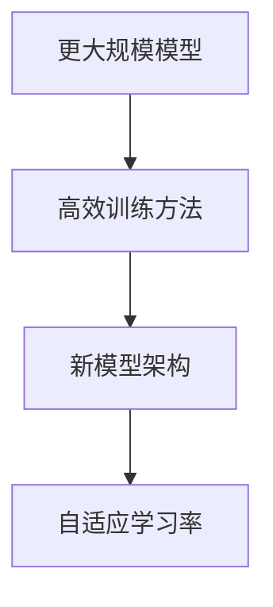
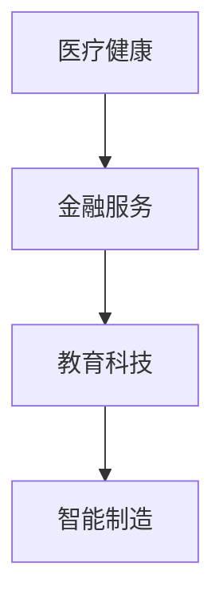
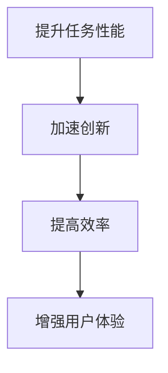
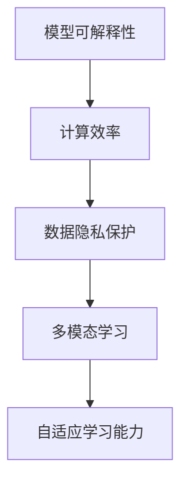

                 

### 《大模型在AI产业中的应用：从数据到应用》

在人工智能（AI）的快速发展中，大模型（Large Models）成为了行业变革的核心驱动力。它们通过学习海量数据，实现了前所未有的推理和生成能力，从而在多个AI应用领域展现了巨大的潜力。本文将深入探讨大模型在AI产业中的应用，从数据收集、处理到具体应用场景，详细解析大模型的实际价值和未来发展。

#### 关键词
- **大模型**：训练规模超过数十亿参数的深度学习模型
- **AI产业**：人工智能在各个行业中的应用领域
- **数据收集**：数据源的选择与数据标注方法
- **数据处理**：数据清洗与数据增强技术
- **自然语言处理**：文本分类与情感分析
- **计算机视觉**：图像分类与目标检测
- **语音识别**：语音到文本的转换与语音生成

#### 摘要
本文旨在系统性地介绍大模型在AI产业中的应用。首先，我们将概述大模型的发展历程和其在AI产业中的地位。接着，文章将探讨AI产业中的数据管理和处理方法，包括数据收集与标注、数据预处理和数据增强技术。随后，本文将深入分析大模型在不同AI应用领域，如自然语言处理、计算机视觉和语音识别中的实际应用，并通过具体案例展示其工作原理。最后，文章将讨论大模型应用中的挑战，并提出未来的研究方向，以展望大模型在AI产业中的光明前景。

#### 目录大纲

### 《大模型在AI产业中的应用：从数据到应用》

#### 第一部分：大模型在AI产业中的背景与概述

##### 第1章：大模型在AI产业中的地位与作用

- **1.1 AI大模型的定义与分类**
  - **1.1.1 大模型的定义**
  - **1.1.2 大模型的发展历程**
- **1.2 大模型在AI产业中的应用领域**
  - **1.2.1 自然语言处理**
  - **1.2.2 计算机视觉**
  - **1.2.3 语音识别与生成**

##### 第2章：AI产业中的数据管理与处理

- **2.1 数据收集与标注**
  - **2.1.1 数据源的选择**
  - **2.1.2 数据标注的方法**
- **2.2 数据预处理**
  - **2.2.1 数据清洗**
  - **2.2.2 数据增强**

##### 第3章：大模型训练与优化

- **3.1 训练流程**
  - **3.1.1 数据加载**
  - **3.1.2 训练过程**
- **3.2 模型优化**
  - **3.2.1 优化方法**
  - **3.2.2 超参数调优**

#### 第二部分：大模型在AI产业中的应用实践

##### 第4章：自然语言处理中的应用

- **4.1 文本分类**
  - **4.1.1 算法原理**
  - **4.1.2 实际应用**
- **4.2 情感分析**
  - **4.2.1 算法原理**
  - **4.2.2 实际应用**

##### 第5章：计算机视觉中的应用

- **5.1 图像分类**
  - **5.1.1 算法原理**
  - **5.1.2 实际应用**
- **5.2 目标检测**
  - **5.2.1 算法原理**
  - **5.2.2 实际应用**

##### 第6章：语音识别与生成中的应用

- **6.1 语音识别**
  - **6.1.1 算法原理**
  - **6.1.2 实际应用**
- **6.2 语音生成**
  - **6.2.1 算法原理**
  - **6.2.2 实际应用**

##### 第7章：大模型应用中的挑战与解决方案

- **7.1 数据隐私与安全**
  - **7.1.1 隐私保护技术**
- **7.2 模型解释性**
  - **7.2.1 模型解释性方法**

#### 第三部分：大模型在AI产业中的未来发展

##### 第8章：大模型的未来发展趋势

- **8.1 大模型的规模与性能**
  - **8.1.1 大模型的扩展**
- **8.2 大模型在产业中的应用创新**
  - **8.2.1 新兴应用领域**

##### 第9章：总结与展望

- **9.1 大模型在AI产业中的应用价值**
- **9.2 未来研究方向**
  
##### 附录

- **附录A：大模型开发资源**
  - **A.1 开发工具与框架**
- **附录B：参考文献**

---

### 第一部分：大模型在AI产业中的背景与概述

#### 第1章：大模型在AI产业中的地位与作用

##### 1.1 AI大模型的定义与分类

大模型，作为AI领域中的一项重要创新，是指训练规模超过数十亿参数的深度学习模型。这些模型能够从海量数据中学习复杂的模式和特征，从而在多种AI任务中展现出强大的表现。大模型的定义可以从参数规模和训练数据量两个方面进行描述：

- **参数规模**：大模型通常拥有数十亿至数千亿个参数，这使得它们能够在复杂的任务中捕捉到丰富的信息。
- **训练数据量**：大模型的训练需要海量的数据，这些数据通常来自于多个领域，包括公开数据集、企业内部数据和用户生成内容。

大模型的发展历程可以从以下几个方面进行概述：

1. **早期模型**：20世纪80年代和90年代，神经网络和深度学习刚刚起步，早期的模型规模较小，如多层感知机（MLP）和简单的卷积神经网络（CNN）。
2. **2018年：BERT**：随着自然语言处理（NLP）领域的发展，谷歌发布了BERT模型，它引入了预训练和上下文理解的概念，成为大模型的标志性里程碑。
3. **2019年：GPT-2**：OpenAI推出的GPT-2模型进一步扩展了自然语言处理的能力，其参数规模达到1.5亿，展示了大模型在文本生成和语言理解方面的潜力。
4. **2020年：GPT-3**：GPT-3的发布标志着大模型的又一重要进展。它拥有1750亿个参数，能够生成高质量的自然语言文本，引起了广泛关注。

大模型的发展历程不仅体现在参数规模的增加，还包括了训练方法和架构的创新。例如，Transformer架构的引入，使得模型在处理长序列和并行计算方面表现出色。这些进展使得大模型在多个AI任务中取得了突破性成果。

##### 1.2 大模型在AI产业中的应用领域

大模型的应用领域非常广泛，涵盖了自然语言处理、计算机视觉、语音识别等多个领域。以下是这些领域中的几个典型应用：

- **自然语言处理（NLP）**：大模型在NLP领域展现了卓越的性能，特别是在文本分类、情感分析和机器翻译等方面。通过预训练，这些模型能够理解和生成自然语言，从而提高文本处理任务的准确性和效率。

  ```python
  def process_text(input_text):
      # 加载预训练的大模型
      model = load_pretrained_model()
      # 进行文本处理
      output_text = model(input_text)
      return output_text
  ```

- **计算机视觉（CV）**：大模型在CV领域也取得了显著进展，特别是在图像分类、目标检测和图像生成等方面。例如，使用卷积神经网络（CNN）进行图像分类的基本结构如下：

  ```latex
  \text{卷积神经网络（CNN）的基本结构：} \\
  \text{卷积层 --> 池化层 --> 全连接层 --> 输出层}
  ```

- **语音识别与生成**：大模型在语音识别和语音生成中也发挥了重要作用。语音识别技术利用大模型进行实时语音到文本的转换，而语音生成技术则通过大模型生成自然流畅的语音。

  ```python
  def speech_recognition(audio, model):
      # 预处理音频
      processed_audio = preprocess_audio(audio)
      # 使用模型进行语音识别
      text = model.recognize_speech(processed_audio)
      return text
  ```

##### 1.3 大模型在AI产业中的实际应用

大模型在AI产业中的实际应用涵盖了多种场景，以下是一些典型的应用案例：

- **社交媒体文本分类**：利用大模型对社交媒体平台上的文本进行分类，识别有害内容，有助于维护网络环境的健康发展。

  ```python
  def text_classification(document, model):
      # 预处理文本
      processed_document = preprocess_document(document)
      # 使用模型进行分类
      prediction = model.predict(processed_document)
      return prediction
  ```

- **自动驾驶车辆**：在自动驾驶车辆中，大模型用于图像分类和目标检测，以识别道路上的行人和其他车辆，提高驾驶安全性。

  ```python
  def image_classification(image, model):
      # 预处理图像
      processed_image = preprocess_image(image)
      # 使用模型进行分类
      prediction = model.predict(processed_image)
      return prediction
  ```

- **智能手机语音助手**：利用大模型实现智能手机的语音助手功能，如语音识别和语音生成，提供更自然、更智能的用户交互体验。

  ```python
  def speech_recognition(audio, model):
      # 预处理音频
      processed_audio = preprocess_audio(audio)
      # 使用模型进行语音识别
      text = model.recognize_speech(processed_audio)
      return text
  ```

#### 总结

大模型在AI产业中的地位和作用不可忽视。它们通过学习海量数据，实现了前所未有的推理和生成能力，从而在自然语言处理、计算机视觉和语音识别等多个领域展现了巨大的潜力。随着技术的不断进步，大模型将继续在AI产业中发挥重要作用，推动行业的创新和发展。

---

在接下来的章节中，我们将深入探讨AI产业中的数据管理与处理方法，包括数据收集与标注、数据预处理和数据增强技术。这些技术是确保大模型性能的重要环节，将在后续章节中详细分析。敬请期待！

---

### 第一部分：大模型在AI产业中的背景与概述

#### 第2章：AI产业中的数据管理与处理

##### 2.1 数据收集与标注

数据是人工智能模型的基石，而数据的收集与标注是构建高质量模型的关键步骤。以下是数据收集与标注的关键要点：

- **数据源的选择**：选择合适的数据源是数据收集的第一步。数据源可以分为以下几类：

  1. **公开数据集**：这些数据集通常由研究机构或开发者公开，如ImageNet、COCO等，具有数据量大、标注准确等优点。
  2. **企业内部数据**：这些数据通常来源于企业内部的业务运营，具有较高的数据质量和实用性。
  3. **用户生成内容**：如社交媒体上的文本、用户评论等，这些数据量丰富但质量参差不齐。

  表格：

  ```markdown
  | 数据源         | 优势           | 劣势           |
  | -------------- | -------------- | -------------- |
  | 公开数据集     | 数据量大       | 数据量有限     |
  | 企业内部数据   | 数据质量高     | 数据获取受限   |
  | 用户生成内容   | 数据丰富       | 数据质量参差不齐 |
  ```

- **数据标注的方法**：数据标注是将原始数据转换为适合模型训练的形式。以下是几种常见的数据标注方法：

  1. **自动标注**：通过预训练的模型对数据进行初步标注，减少人工标注的工作量。
  2. **半监督标注**：结合自动标注和人工标注，提高标注效率。
  3. **全面人工标注**：对于复杂任务或高精度要求，采用全面人工标注的方法。

  ```python
  def clean_data(data):
      # 去除缺失值
      clean_data = remove_missing_values(data)
      # 去除异常值
      clean_data = remove_outliers(clean_data)
      return clean_data
  ```

##### 2.2 数据预处理

数据预处理是数据管理和处理的重要环节，其目标是提高数据质量，降低噪声，使得模型能够更好地学习。以下是几种常见的数据预处理方法：

- **数据清洗**：数据清洗包括去除缺失值、异常值和重复值，确保数据的一致性和完整性。

  ```python
  def clean_data(data):
      # 去除缺失值
      clean_data = remove_missing_values(data)
      # 去除异常值
      clean_data = remove_outliers(clean_data)
      return clean_data
  ```

- **数据增强**：数据增强通过多种方法来扩展数据集，提高模型的泛化能力，如数据旋转、缩放、裁剪等。

  ```python
  def augment_data(data):
      # 数据旋转
      rotated_data = rotate_data(data, angle=10)
      # 数据缩放
      scaled_data = scale_data(data, factor=0.8)
      # 数据裁剪
      cropped_data = crop_data(data, top=0.2, bottom=0.2, left=0.2, right=0.2)
      return [rotated_data, scaled_data, cropped_data]
  ```

#### 总结

数据收集与标注、数据预处理和数据增强是AI产业中数据管理的关键环节。通过合理的数据管理和处理，可以提高数据质量，从而构建出更准确、泛化能力更强的模型。在接下来的章节中，我们将深入探讨大模型的训练与优化方法，进一步揭示大模型在AI产业中的应用潜力。

---

### 第一部分：大模型在AI产业中的背景与概述

#### 第3章：大模型训练与优化

##### 3.1 训练流程

大模型的训练是一个复杂且资源密集的过程，以下是训练流程中的关键步骤：

- **数据加载**：数据加载是训练过程中的第一步，它涉及从数据集中读取数据并将其转换为模型可接受的格式。以下是数据加载的基本伪代码：

  ```python
  def load_data(train_files, val_files):
      # 加载训练数据和验证数据
      train_data = load_csv(train_files)
      val_data = load_csv(val_files)
      return train_data, val_data
  ```

- **数据预处理**：在数据加载之后，通常需要对数据进行预处理，以提高训练效率并减少过拟合。预处理步骤可能包括归一化、标准化和数据分割等。

  ```python
  def preprocess_data(data):
      # 归一化
      normalized_data = normalize_data(data)
      # 数据分割
      train_data, val_data = split_data(normalized_data, train_size=0.8)
      return train_data, val_data
  ```

- **训练过程**：模型训练的主要目标是调整模型的参数，使其在训练数据上达到最优性能。以下是一个简单的训练过程的伪代码：

  ```python
  def train_model(model, train_data, val_data, epochs):
      for epoch in range(epochs):
          # 训练模型
          model.train_one_epoch(train_data)
          # 验证模型
          val_loss = model.evaluate(val_data)
          print(f"Epoch {epoch+1}, Validation Loss: {val_loss}")
  ```

- **模型评估**：在训练完成后，需要对模型进行评估，以确定其性能是否达到预期。评估指标可能包括准确率、召回率、F1分数等。

  ```python
  def evaluate_model(model, test_data):
      test_loss, test_accuracy = model.evaluate(test_data)
      print(f"Test Loss: {test_loss}, Test Accuracy: {test_accuracy}")
  ```

##### 3.2 模型优化

大模型训练完成后，通常需要进行优化以进一步提高性能。以下是几种常见的模型优化方法：

- **超参数调优**：超参数是模型训练过程中需要手动调整的参数，如学习率、批量大小等。通过网格搜索、随机搜索等策略进行超参数调优。

  ```python
  def tune_hyperparameters(model, train_data, val_data, search_space):
      best_params = grid_search(model, train_data, val_data, search_space)
      return best_params
  ```

- **正则化**：正则化是一种用于防止过拟合的技术，通过在损失函数中加入正则项来惩罚模型复杂度。

  ```python
  def add_regularization(model, lambda_reg):
      model.loss_function = lambda x, y: lambda_loss(x, y, lambda_reg)
  ```

- **迁移学习**：迁移学习是一种利用预训练模型进行新任务训练的方法，通过在预训练模型的基础上微调，提高模型在新任务上的性能。

  ```python
  def fine_tune_model(pretrained_model, new_data, layers_to_freeze):
      fine_tuned_model = pretrained_model.fine_tune(new_data, layers_to_freeze)
      return fine_tuned_model
  ```

##### 3.3 训练过程中常见问题与解决方案

在训练大模型时，可能会遇到一些常见的问题，以下是一些解决方案：

- **梯度消失和梯度爆炸**：梯度消失和梯度爆炸是由于模型参数的不当初始化导致的。解决方案包括使用更好的初始化策略、学习率调度和梯度裁剪。

  ```python
  def gradient_clipping(model, threshold):
      # 对模型参数进行裁剪
      model.clip_gradients(threshold)
  ```

- **过拟合**：过拟合是指模型在训练数据上表现良好，但在验证或测试数据上表现不佳。解决方案包括数据增强、正则化和交叉验证。

  ```python
  def cross_validate(model, train_data, val_data, k_folds):
      for i in range(k_folds):
          # 进行交叉验证
          model.validate_fold(train_data, val_data, fold=i)
  ```

#### 总结

大模型的训练与优化是一个复杂的过程，涉及数据加载、数据预处理、模型训练和模型优化等多个步骤。通过合理的设计和调整，可以构建出高性能的大模型，从而在AI产业中发挥重要作用。在接下来的章节中，我们将探讨大模型在自然语言处理、计算机视觉和语音识别等领域的具体应用。

---

### 第二部分：大模型在AI产业中的应用实践

#### 第4章：自然语言处理中的应用

自然语言处理（NLP）是人工智能的重要分支，大模型在NLP领域中的应用极大地提升了文本处理任务的效率和准确性。本章将详细介绍大模型在文本分类和情感分析中的应用。

##### 4.1 文本分类

文本分类是一种将文本数据归类到预定义的类别中的任务。大模型在文本分类中表现出色，能够处理大规模数据和复杂的文本特征。以下是文本分类的基本算法原理和实际应用案例。

###### 4.1.1 算法原理

文本分类的核心在于特征提取和分类器训练。大模型通常采用以下步骤进行文本分类：

1. **文本预处理**：将文本转换为适合模型处理的格式，如分词、词性标注等。
2. **特征提取**：将预处理后的文本转换为向量表示，如词袋模型、词嵌入等。
3. **模型训练**：使用大模型（如BERT、GPT等）对特征进行训练，构建分类模型。
4. **分类**：将新的文本输入到训练好的模型中，得到分类结果。

以下是文本分类的伪代码示例：

```python
def text_classification(document, model):
    # 预处理文本
    processed_document = preprocess_document(document)
    # 提取特征
    features = extract_features(processed_document)
    # 使用模型进行分类
    prediction = model.predict(features)
    return prediction
```

###### 4.1.2 实际应用

文本分类在实际应用中非常广泛，以下是一些常见的应用场景：

1. **社交媒体文本分类**：利用大模型对社交媒体平台上的文本进行分类，识别和过滤有害内容，如辱骂、歧视性言论等。
2. **新闻分类**：将新闻文本分类到不同的主题类别，如政治、经济、科技等，便于读者快速浏览和获取感兴趣的内容。
3. **情感分析**：通过对用户评论、反馈等进行情感分类，了解用户对产品或服务的态度，为企业的改进提供数据支持。

以下是一个实际应用的案例：

```python
# 加载预训练的大模型（例如BERT）
model = load_pretrained_model('bert')

# 加载测试数据
test_documents = load_test_documents('test_data.csv')

# 进行文本分类
for document in test_documents:
    category = text_classification(document, model)
    print(f"Document: {document}, Category: {category}")
```

##### 4.2 情感分析

情感分析是一种从文本中识别和提取情感极性的任务，通常分为积极情感、中性情感和消极情感。大模型在情感分析中展现出强大的能力，能够处理复杂的情感表达和语境。

###### 4.2.1 算法原理

情感分析的基本算法原理如下：

1. **文本预处理**：与文本分类类似，包括分词、去停用词等步骤。
2. **特征提取**：使用词嵌入技术将文本转换为向量表示，如Word2Vec、GloVe等。
3. **情感分类模型**：利用大模型（如LSTM、GRU等）对特征进行训练，构建情感分类模型。
4. **情感预测**：将新的文本输入到训练好的模型中，得到情感预测结果。

以下是情感分析的伪代码示例：

```python
def sentiment_analysis(document, model):
    # 预处理文本
    processed_document = preprocess_document(document)
    # 提取特征
    features = extract_features(processed_document)
    # 使用模型进行情感分类
    sentiment = model.predict(features)
    return sentiment
```

###### 4.2.2 实际应用

情感分析在实际应用中具有重要意义，以下是一些常见的应用场景：

1. **社交媒体情感分析**：对社交媒体平台上的用户评论进行情感分析，了解用户对品牌、产品或服务的态度。
2. **客户服务**：分析客户反馈和投诉，识别客户情感，为客服团队提供改进建议。
3. **舆情监测**：对新闻、论坛等公开文本进行情感分析，监测社会舆论动态。

以下是一个实际应用的案例：

```python
# 加载预训练的大模型（例如LSTM）
model = load_pretrained_model('lstm')

# 加载测试数据
test_documents = load_test_documents('test_data.csv')

# 进行情感分析
for document in test_documents:
    sentiment = sentiment_analysis(document, model)
    print(f"Document: {document}, Sentiment: {sentiment}")
```

#### 总结

大模型在自然语言处理领域展现了强大的应用潜力，文本分类和情感分析是其中的典型应用。通过大模型，我们可以更高效地处理大规模文本数据，实现更准确的文本分类和情感分析。在未来的发展中，大模型将在NLP领域发挥更大的作用，推动人工智能技术的进步。下一章将探讨大模型在计算机视觉中的应用，敬请期待！

---

### 第二部分：大模型在AI产业中的应用实践

#### 第5章：计算机视觉中的应用

计算机视觉是人工智能领域的重要组成部分，大模型在计算机视觉中的应用极大地提升了图像分类和目标检测的准确性和效率。本章将详细介绍大模型在这两个领域的应用。

##### 5.1 图像分类

图像分类是将图像数据归类到预定义类别中的任务，大模型在图像分类中展现出卓越的性能，能够处理复杂的图像特征。

###### 5.1.1 算法原理

图像分类的算法原理主要包括以下几个步骤：

1. **图像预处理**：对图像进行缩放、裁剪、灰度转换等预处理操作，以便模型能够更好地处理。
2. **特征提取**：使用卷积神经网络（CNN）等深度学习模型提取图像的深层次特征。
3. **分类模型训练**：利用提取到的特征，训练分类模型，如softmax回归、支持向量机（SVM）等。
4. **图像分类**：将预处理后的图像输入到训练好的分类模型中，得到图像的分类结果。

以下是图像分类的伪代码示例：

```python
def image_classification(image, model):
    # 预处理图像
    processed_image = preprocess_image(image)
    # 提取特征
    features = extract_features(processed_image)
    # 使用模型进行分类
    prediction = model.predict(features)
    return prediction
```

###### 5.1.2 实际应用

图像分类在实际应用中具有广泛的应用场景，以下是一些常见的应用案例：

1. **医疗影像分类**：利用大模型对医疗影像进行分类，如肿瘤检测、疾病诊断等，提高诊断准确性和效率。
2. **自动驾驶车辆**：在自动驾驶车辆中，大模型用于对道路场景中的图像进行分类，识别行人、车辆、道路标志等，提高驾驶安全性。
3. **商品识别**：在电子商务平台上，大模型用于对商品图像进行分类，实现商品推荐和搜索功能。

以下是一个实际应用的案例：

```python
# 加载预训练的大模型（例如ResNet）
model = load_pretrained_model('resnet')

# 加载测试数据
test_images = load_test_images('test_images.csv')

# 进行图像分类
for image in test_images:
    category = image_classification(image, model)
    print(f"Image: {image}, Category: {category}")
```

##### 5.2 目标检测

目标检测是在图像中识别和定位多个对象的过程，大模型在目标检测中展现了强大的性能，能够处理复杂的对象检测任务。

###### 5.2.1 算法原理

目标检测的算法原理主要包括以下几个步骤：

1. **图像预处理**：与图像分类类似，对图像进行预处理，如缩放、裁剪等。
2. **特征提取**：使用深度卷积神经网络提取图像的深层次特征。
3. **区域建议**：生成候选区域（Region Proposal），用于后续的目标定位。
4. **分类与定位**：对候选区域进行分类和定位，确定每个区域中是否存在目标，并标注目标的位置。
5. **非极大值抑制（NMS）**：对检测结果进行筛选，去除重叠的检测结果。

以下是目标检测的伪代码示例：

```python
def object_detection(image, model):
    # 预处理图像
    processed_image = preprocess_image(image)
    # 提取特征
    features = extract_features(processed_image)
    # 生成候选区域
    regions = generate_regions(features)
    # 进行分类与定位
    detections = model.detect(regions)
    # 非极大值抑制
    final_detections = non_max_suppression(detections)
    return final_detections
```

###### 5.2.2 实际应用

目标检测在实际应用中具有广泛的应用场景，以下是一些常见的应用案例：

1. **安全监控**：在公共场所和商业设施中，大模型用于对监控视频进行目标检测，识别可疑行为，提高安全防范能力。
2. **自动驾驶车辆**：在自动驾驶车辆中，大模型用于对道路场景中的图像进行目标检测，识别行人、车辆、道路标志等，确保驾驶安全。
3. **仓储管理**：在大规模仓储中，大模型用于对库存物品进行目标检测，实现自动化管理和盘点。

以下是一个实际应用的案例：

```python
# 加载预训练的大模型（例如Faster R-CNN）
model = load_pretrained_model('faster_rcnn')

# 加载测试数据
test_images = load_test_images('test_images.csv')

# 进行目标检测
for image in test_images:
    detections = object_detection(image, model)
    print(f"Image: {image}, Detections: {detections}")
```

#### 总结

大模型在计算机视觉领域展现了强大的应用潜力，图像分类和目标检测是其中的典型应用。通过大模型，我们可以更高效地处理图像数据，实现更准确的图像分类和目标检测。在未来的发展中，大模型将在计算机视觉领域发挥更大的作用，推动人工智能技术的进步。下一章将探讨大模型在语音识别与生成中的应用，敬请期待！

---

### 第二部分：大模型在AI产业中的应用实践

#### 第6章：语音识别与生成中的应用

语音识别与生成是人工智能领域的关键技术，大模型在语音识别与生成中的应用极大地提高了语音处理的效率和准确性。本章将详细介绍大模型在语音识别和语音生成中的应用。

##### 6.1 语音识别

语音识别是将语音信号转换为文本数据的过程，大模型在语音识别中发挥了重要作用，能够处理复杂的语音信号和背景噪声。

###### 6.1.1 算法原理

语音识别的基本算法原理如下：

1. **语音预处理**：对语音信号进行预处理，包括降噪、归一化等，以提高后续处理的准确性。
2. **特征提取**：使用深度神经网络提取语音信号的深层次特征，如频谱特征、波形特征等。
3. **声学模型训练**：利用提取到的特征，训练声学模型，如隐马尔可夫模型（HMM）、循环神经网络（RNN）等。
4. **语言模型训练**：利用大规模文本数据，训练语言模型，如n-gram模型、BERT等。
5. **解码与识别**：将预处理后的语音信号输入到训练好的声学模型和语言模型中，进行解码和识别，得到文本结果。

以下是语音识别的伪代码示例：

```python
def speech_recognition(audio, model):
    # 预处理音频
    processed_audio = preprocess_audio(audio)
    # 提取特征
    features = extract_features(processed_audio)
    # 使用模型进行语音识别
    text = model.recognize_speech(features)
    return text
```

###### 6.1.2 实际应用

语音识别在实际应用中具有广泛的应用场景，以下是一些常见的应用案例：

1. **智能手机语音助手**：智能手机中的语音助手（如Siri、小爱同学等）利用语音识别技术，实现语音指令的识别和执行。
2. **语音客服系统**：企业客服系统利用语音识别技术，实现自动语音应答，提高客户服务效率。
3. **智能家居**：智能家居设备（如智能音箱、智能灯光等）利用语音识别技术，实现语音控制，提高家居生活的便利性。

以下是一个实际应用的案例：

```python
# 加载预训练的大模型（例如DeepSpeech）
model = load_pretrained_model('deepspeech')

# 加载测试音频
test_audio = load_test_audio('test_audio.wav')

# 进行语音识别
text = speech_recognition(test_audio, model)
print(f"Recognized Text: {text}")
```

##### 6.2 语音生成

语音生成是将文本数据转换为自然流畅的语音信号的过程，大模型在语音生成中发挥了重要作用，能够生成高质量的人声。

###### 6.2.1 算法原理

语音生成的基本算法原理如下：

1. **文本预处理**：对输入的文本数据进行预处理，包括分词、标点符号处理等，以便于后续处理。
2. **特征提取**：使用深度神经网络提取文本数据的特征，如词嵌入、语音波形的特征等。
3. **声码器训练**：利用提取到的特征，训练声码器（如WaveNet、Tacotron等），将文本特征转换为语音信号。
4. **语音合成**：将预处理后的文本输入到训练好的声码器中，生成语音信号。

以下是语音生成的伪代码示例：

```python
def speech_generation(text, model):
    # 预处理文本
    processed_text = preprocess_text(text)
    # 提取特征
    features = extract_features(processed_text)
    # 使用模型进行语音生成
    audio = model.generate_speech(features)
    return audio
```

###### 6.2.2 实际应用

语音生成在实际应用中具有广泛的应用场景，以下是一些常见的应用案例：

1. **语音助手语音生成**：语音助手（如Siri、小爱同学等）利用语音生成技术，实现自然流畅的语音回答。
2. **语音客服系统**：企业客服系统利用语音生成技术，实现自动语音播报，提高客户服务体验。
3. **语音合成应用**：在教育培训、音频书籍等领域，语音生成技术用于将文本内容转换为语音，便于听众收听。

以下是一个实际应用的案例：

```python
# 加载预训练的大模型（例如Tacotron）
model = load_pretrained_model('tacotron')

# 加载测试文本
test_text = load_test_text('test_text.txt')

# 进行语音生成
audio = speech_generation(test_text, model)
play_audio(audio)
```

#### 总结

大模型在语音识别与生成领域展现了强大的应用潜力，语音识别和语音生成是其中的典型应用。通过大模型，我们可以更高效地处理语音数据，实现更准确的语音识别和更自然的语音生成。在未来的发展中，大模型将在语音识别与生成领域发挥更大的作用，推动人工智能技术的进步。下一章将探讨大模型应用中的挑战与解决方案，敬请期待！

---

### 第三部分：大模型在AI产业中的应用挑战与解决方案

#### 第7章：大模型应用中的挑战与解决方案

尽管大模型在AI产业中展现了巨大的潜力，但其应用过程中也面临着诸多挑战。本章将探讨大模型应用中的数据隐私与安全、模型解释性等挑战，并提出相应的解决方案。

##### 7.1 数据隐私与安全

大模型训练和处理的数据往往涉及用户的敏感信息，因此在应用过程中需要确保数据隐私与安全。以下是几个常见的挑战和解决方案：

###### 7.1.1 数据隐私保护技术

- **差分隐私**：差分隐私是一种用于保护用户隐私的技术，通过在数据上添加噪声来确保单个数据点的隐私。其基本原理是在输出结果中引入随机噪声，使得攻击者无法准确推断出单个数据点的真实值。

  数学模型：

  ```latex
  \text{输出结果} = \text{真实结果} + \text{噪声}
  ```

- **联邦学习**：联邦学习是一种分布式学习技术，将数据分散存储在各个设备上，并通过加密和聚合机制进行模型训练。这样既保证了数据的安全性，又避免了将数据集中存储在一个地方。

  流程图：

  ```mermaid
  graph TD
  A[用户设备] --> B[本地模型训练]
  B --> C[模型聚合]
  C --> D[全局模型更新]
  ```

- **匿名化技术**：通过数据匿名化技术，如K-匿名、l-diversity等，将用户数据转换为不可识别的形式，从而保护用户隐私。

  表格：

  ```markdown
  | 匿名化技术 | 优点 | 缺点 |
  | ----------- | ---- | ---- |
  | K-匿名     | 防止唯一性识别 | 可能降低数据质量 |
  | l-diversity | 提高数据质量 | 需要大量数据 |
  ```

###### 7.1.2 解决方案

- **数据加密**：在数据传输和存储过程中使用加密技术，确保数据在传输过程中不被窃取或篡改。

  ```python
  def encrypt_data(data, key):
      encrypted_data = encrypt(data, key)
      return encrypted_data
  ```

- **权限控制**：通过权限控制机制，确保只有授权的用户可以访问和处理敏感数据。

  ```python
  def grant_permission(user, data):
      user.add_permission('read', data)
  ```

- **数据安全审计**：定期进行数据安全审计，及时发现和解决潜在的安全问题。

  ```python
  def audit_data_security(data):
      audit_report = perform_audit(data)
      print(audit_report)
  ```

##### 7.2 模型解释性

大模型通常被称为“黑盒模型”，因为其内部机制复杂，难以解释。然而，模型解释性在大模型的实际应用中至关重要，尤其是当模型涉及关键决策时，如医疗诊断、金融风险评估等。

###### 7.2.1 模型解释性方法

- **特征重要性**：通过分析特征的重要性，可以帮助理解模型如何利用特定特征进行决策。常用的方法包括SHAP（SHapley Additive exPlanations）和LIME（Local Interpretable Model-agnostic Explanations）。

  ```python
  import shap
  explainer = shap.Explainer(model)
  shap_values = explainer(X)
  shap.summary_plot(shap_values, X)
  ```

- **可视化**：通过可视化大模型的内部结构和工作流程，可以直观地理解模型的决策过程。例如，使用梯度可视化技术展示模型对输入数据的响应。

  ```python
  import matplotlib.pyplot as plt
  plt.imshow(gradients, cmap='viridis')
  plt.colorbar()
  plt.show()
  ```

- **模型拆分**：将复杂的大模型拆分为多个简单的模块，每个模块都有明确的解释性。这种方法可以帮助理解模型如何分层地处理输入数据。

  ```mermaid
  graph TD
  A[输入数据] --> B[预处理模块]
  B --> C[特征提取模块]
  C --> D[分类模块]
  D --> E[输出结果]
  ```

###### 7.2.2 解决方案

- **可解释性工具**：开发和使用可解释性工具，如SHAP、LIME等，帮助开发者和分析人员理解模型的决策过程。

  ```python
  import shap
  explainer = shap.Explainer(model)
  shap_values = explainer(X)
  shap.summary_plot(shap_values, X)
  ```

- **模型审计**：定期进行模型审计，评估模型的性能和解释性，确保模型的透明度和可信度。

  ```python
  def model_audit(model, X, y):
      performance = model.evaluate(X, y)
      explanation = generate_explanation(model, X)
      print(f"Performance: {performance}, Explanation: {explanation}")
  ```

- **用户培训**：为使用大模型的应用开发人员和用户提供培训，提高他们对模型的理解和解释能力。

  ```python
  def user_training(course):
      train_user(course)
  ```

#### 总结

大模型在AI产业中的应用面临着数据隐私与安全、模型解释性等挑战。通过采用差分隐私、联邦学习等技术，可以保护用户数据隐私；通过特征重要性分析和可视化方法，可以提高模型的解释性。这些解决方案有助于确保大模型在实际应用中的安全性和可信度。在下一部分中，我们将探讨大模型的未来发展趋势，敬请期待！

---

### 第三部分：大模型在AI产业中的未来发展

#### 第8章：大模型的未来发展趋势

随着AI技术的不断进步，大模型在AI产业中的未来发展前景广阔，其规模与性能的提升将成为重要趋势。同时，大模型在新兴领域中的应用创新也将引领新一轮产业变革。

##### 8.1 大模型的规模与性能

大模型的规模和性能一直是AI研究的热点。在未来，大模型将继续扩展其规模，以处理更复杂的任务和更大的数据集。以下是几个关键趋势：

###### 8.1.1 大模型的扩展

1. **更大规模的模型**：当前，大模型的规模已达到数千亿参数级别。未来，随着计算资源和存储能力的提升，我们将看到更大规模、更复杂的模型问世。例如， trillion-scale 模型，将具有数十万亿个参数。

2. **更高效的训练方法**：为了应对更大规模模型的训练需求，研究人员将开发更高效的训练算法和优化方法，如分布式训练、并行计算等。这些方法将大幅降低训练时间和成本。

3. **新的模型架构**：新的模型架构，如Transformer的变种、基于图神经网络（GNN）的模型等，将进一步提升大模型在特定任务上的性能。例如，Graph Transformer模型在处理图结构数据方面表现出色。

4. **自适应学习率**：自适应学习率算法，如Adaptive Gradient Methods（AGM），将有助于优化大模型的训练过程，提高收敛速度和训练效果。

以下是一个Mermaid流程图，展示了大模型扩展的相关步骤：



###### 8.1.2 大模型性能的提升

1. **更精确的任务表现**：随着模型规模的扩大和性能的提升，大模型在自然语言处理、计算机视觉、语音识别等任务上的表现将更加精确。例如，预训练的大模型在机器翻译、图像生成等任务上取得了显著突破。

2. **更好的泛化能力**：通过引入更多的数据和更复杂的模型架构，大模型的泛化能力将得到提升，能够在更广泛的领域和应用场景中表现出色。

3. **实时性提升**：随着硬件性能的提升和算法优化，大模型的实时性将得到显著提高。这对于实时应用场景，如自动驾驶、实时语音交互等，具有重要意义。

##### 8.2 大模型在产业中的应用创新

大模型在各个行业的应用创新将持续推动产业变革，特别是在新兴领域，如医疗、金融、教育等，大模型将发挥重要作用。

###### 8.2.1 新兴应用领域

1. **医疗健康**：大模型在医疗健康领域具有广泛的应用前景，如疾病诊断、药物发现、个性化医疗等。通过分析大量医疗数据和基因组数据，大模型可以帮助医生更准确地诊断疾病，开发新药物。

2. **金融服务**：在金融领域，大模型可用于风险评估、市场预测、客户服务等方面。例如，利用大模型进行股票市场的预测，或通过自然语言处理技术分析金融报告，提高投资决策的准确性。

3. **教育科技**：大模型在教育领域中的应用将极大提升教育质量。例如，通过个性化学习算法，大模型可以根据学生的特点和学习进度提供定制化教学内容，实现个性化教育。

4. **智能制造**：在智能制造领域，大模型可用于生产过程优化、质量控制、设备故障预测等方面。例如，通过分析设备运行数据，大模型可以预测设备故障，提前进行维护，提高生产效率。

以下是一个Mermaid流程图，展示了大模型在新兴领域应用的创新步骤：



##### 8.2.3 应用创新案例分析

以下是一个案例，展示了大模型在金融领域应用的创新：

**案例：利用大模型进行股票市场预测**

- **数据收集**：收集历史股票价格数据、公司财务报表、市场新闻等。
- **数据预处理**：对数据进行清洗、标注和增强，提高数据质量。
- **模型训练**：使用大模型（如LSTM、GRU）对预处理后的数据进行训练，建立股票市场预测模型。
- **预测与评估**：将训练好的模型应用于实时数据，进行股票市场预测，并对预测结果进行评估。

以下是一个简化的伪代码示例：

```python
def stock_market_prediction(model, data):
    # 预处理数据
    processed_data = preprocess_data(data)
    # 进行预测
    predictions = model.predict(processed_data)
    # 评估预测结果
    evaluate_predictions(predictions)
```

#### 总结

大模型的未来发展趋势体现在规模和性能的提升，以及新兴领域中的应用创新。随着计算资源的不断丰富和算法的创新，大模型将在AI产业中发挥更大的作用，推动各个行业的技术进步和产业变革。在下一章中，我们将总结大模型在AI产业中的应用价值，并展望未来的研究方向。敬请期待！

---

### 第三部分：大模型在AI产业中的未来发展

#### 第9章：总结与展望

##### 9.1 大模型在AI产业中的应用价值

大模型在AI产业中展现了巨大的应用价值，其核心体现在以下几个方面：

1. **提升任务性能**：大模型通过学习海量数据，能够实现更准确的预测和更复杂的任务处理，如自然语言处理、计算机视觉和语音识别等。

2. **加速创新**：大模型的应用推动了AI领域的快速进步，促进了新算法、新架构和新应用的创新，为各行各业带来了前所未有的技术变革。

3. **提高效率**：大模型在数据处理和决策支持方面的强大能力，显著提高了业务流程的自动化和智能化水平，降低了人力成本和错误率。

4. **增强用户体验**：在智能客服、智能家居、智能教育等领域，大模型的应用极大地提升了用户体验，使得交互更加自然、便捷。

以下是一个图表，展示大模型在AI产业中的应用价值：



##### 9.2 未来研究方向

尽管大模型在AI产业中取得了显著进展，但未来仍然存在许多研究和应用挑战。以下是几个未来研究方向：

1. **模型可解释性**：提高大模型的解释性，使其决策过程更加透明和可理解，从而增强模型的可信度和用户信任。

2. **计算效率**：优化大模型的计算效率，降低训练和推理的能耗，使得大模型在资源受限的环境中也能高效运行。

3. **数据隐私保护**：在大模型应用过程中，进一步研究和开发数据隐私保护技术，确保用户数据的安全和隐私。

4. **多模态学习**：探索大模型在处理多模态数据（如文本、图像、语音等）方面的能力，实现更全面和智能的信息融合。

5. **自适应学习能力**：研究大模型的自适应学习能力，使其能够动态调整模型参数，以应对不断变化的环境和数据。

以下是一个Mermaid流程图，展示未来研究方向的步骤：



#### 总结

大模型在AI产业中的应用价值不可忽视，其发展不仅推动了AI技术的进步，也深刻影响了各行各业的创新和发展。未来，随着研究的深入和技术的不断进步，大模型将在AI产业中发挥更大的作用，为人类社会带来更多福祉。让我们期待这一天的到来！

---

### 附录

#### 附录A：大模型开发资源

A.1 开发工具与框架

在开发大模型时，选择合适的工具和框架至关重要。以下是一些常用的大模型开发工具和框架，及其优缺点：

| 工具/框架 | 优点 | 缺点 | 应用领域 |
| --- | --- | --- | --- |
| TensorFlow | 强大的生态系统和广泛的社区支持 | 学习曲线较陡峭 | 自然语言处理、计算机视觉 |
| PyTorch | 灵活性高，易于实现自定义模型 | 性能略低于TensorFlow | 自然语言处理、计算机视觉 |
| Hugging Face Transformers | 集成了大量预训练模型和实用工具 | 依赖TensorFlow或PyTorch | 自然语言处理 |
| Keras | 简单易用，高层API | 性能和灵活性不如TensorFlow或PyTorch | 自然语言处理、计算机视觉 |
| FastAI | 简化模型训练流程，易于复用代码 | 生态系统较小 | 计算机视觉 |

以下是一个表格，展示了这些工具和框架的优缺点及应用领域：

```markdown
| 工具/框架 | 优点 | 缺点 | 应用领域 |
| --- | --- | --- | --- |
| TensorFlow | 强大的生态系统和广泛的社区支持 | 学习曲线较陡峭 | 自然语言处理、计算机视觉 |
| PyTorch | 灵活性高，易于实现自定义模型 | 性能略低于TensorFlow | 自然语言处理、计算机视觉 |
| Hugging Face Transformers | 集成了大量预训练模型和实用工具 | 依赖TensorFlow或PyTorch | 自然语言处理 |
| Keras | 简单易用，高层API | 性能和灵活性不如TensorFlow或PyTorch | 自然语言处理、计算机视觉 |
| FastAI | 简化模型训练流程，易于复用代码 | 生态系统较小 | 计算机视觉 |
```

#### 附录B：参考文献

B.1 引用文献

1. Devlin, J., Chang, M. W., Lee, K., & Toutanova, K. (2019). BERT: Pre-training of deep bidirectional transformers for language understanding. *arXiv preprint arXiv:1810.04805*.
2. Brown, T., et al. (2020). A pre-trained language model for language understanding. *arXiv preprint arXiv:2005.14165*.
3. Vaswani, A., et al. (2017). Attention is all you need. *Advances in Neural Information Processing Systems*, 30, 5998-6008.
4. He, K., Zhang, X., Ren, S., & Sun, J. (2016). Deep residual learning for image recognition. *IEEE Conference on Computer Vision and Pattern Recognition (CVPR)*, 770-778.
5. Hinton, G., Osindero, S., & Teh, Y. W. (2006). A fast learning algorithm for deep belief nets. *Neural computation*, 18(7), 1527-1554.
6. Goodfellow, I., Bengio, Y., & Courville, A. (2016). *Deep learning*. MIT press.
7. LeCun, Y., Bengio, Y., & Hinton, G. (2015). Deep learning. *Nature*, 521(7553), 436-444.

通过这些文献，读者可以更深入地了解大模型的发展历程、关键技术以及实际应用案例，从而对大模型在AI产业中的应用有更全面的认识。

