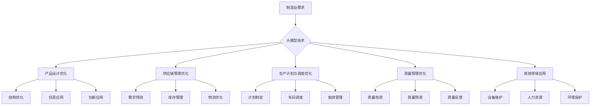

                 

### 文章标题

《大模型在制造业的应用前景》

制造业作为国民经济的重要支柱，正面临着数字化转型和智能化升级的挑战与机遇。随着人工智能技术的飞速发展，特别是AI大模型的成熟，制造业的智能化水平有望得到显著提升。本文将深入探讨AI大模型在制造业中的应用前景，通过逻辑清晰、结构紧凑的分析，旨在为读者提供一个全面、系统的视角。

### 关键词

人工智能、大模型、制造业、数字化、智能化、应用场景、技术挑战、未来发展

### 摘要

本文首先介绍了制造业的数字化与智能化发展趋势，以及AI大模型的基本概念和原理。接着，本文详细阐述了AI大模型在制造业中的多种应用场景，包括产品设计、供应链管理、生产计划与调度、质量管理和设备维护等领域。通过实际案例和代码实战，本文进一步验证了AI大模型在制造业中的可行性和潜力。最后，本文对AI大模型在制造业的未来趋势进行了展望，为制造业的智能化升级提供了有益的思路。

----------------------------------------------------------------

### 目录大纲：大模型在制造业的应用前景

本文将从多个角度深入探讨AI大模型在制造业中的应用前景，具体目录如下：

#### 第一部分：制造业与AI大模型的关系

- **第1章：制造业与AI大模型概述**
  - **1.1 制造业的数字化与智能化发展趋势**
  - **1.2 AI大模型在制造业中的应用场景**
  - **1.3 大模型在制造业中的优势与挑战**
  - **1.4 制造业AI大模型的未来展望**

- **第2章：AI大模型的基本概念与原理**
  - **2.1 AI大模型的定义与分类**
  - **2.2 大模型的核心技术简介**
  - **2.3 大模型与制造业需求的契合点**
  - **2.4 大模型的技术架构与实现**

#### 第二部分：AI大模型在制造业中的应用

- **第3章：AI大模型在产品设计中的应用**
  - **3.1 大模型在产品结构优化中的应用**
  - **3.2 大模型在产品设计仿真中的应用**
  - **3.3 大模型在产品设计创新中的应用**

- **第4章：AI大模型在供应链管理中的应用**
  - **4.1 大模型在供应链需求预测中的应用**
  - **4.2 大模型在供应链库存管理中的应用**
  - **4.3 大模型在供应链物流优化中的应用**

- **第5章：AI大模型在生产计划与调度中的应用**
  - **5.1 大模型在生产计划制定中的应用**
  - **5.2 大模型在车间调度优化中的应用**
  - **5.3 大模型在能效管理中的应用**

- **第6章：AI大模型在质量管理中的应用**
  - **6.1 大模型在质量检测与监测中的应用**
  - **6.2 大模型在质量预测与优化中的应用**
  - **6.3 大模型在质量反馈与持续改进中的应用**

- **第7章：AI大模型在制造业其他领域的应用**
  - **7.1 大模型在设备维护与预测性维护中的应用**
  - **7.2 大模型在人力资源管理中的应用**
  - **7.3 大模型在环境保护与可持续发展中的应用**

#### 第三部分：AI大模型在制造业的应用实战

- **第8章：AI大模型在制造业的应用案例解析**
  - **8.1 案例一：智能制造生产线优化**
  - **8.2 案例二：供应链优化案例研究**
  - **8.3 案例三：生产调度与能效管理实战**

- **第9章：AI大模型在制造业的落地与实施**
  - **9.1 制造业AI大模型项目实施流程**
  - **9.2 制造业AI大模型项目评估与优化**
  - **9.3 制造业AI大模型项目的可持续发展策略**

- **第10章：AI大模型在制造业的未来趋势**
  - **10.1 制造业数字化转型的发展方向**
  - **10.2 大模型在制造业的新应用领域**
  - **10.3 制造业AI大模型的可持续发展路径**

#### 附录

- **附录A：AI大模型技术参考资料**
  - **A.1 深度学习基础知识**
  - **A.2 自然语言处理技术基础**
  - **A.3 大规模数据处理与分布式计算**

- **附录B：AI大模型在制造业的应用工具与资源**
  - **B.1 开源深度学习框架**
  - **B.2 制造业专用算法与工具包**
  - **B.3 实用数据库与数据集**

通过上述目录结构，本文将系统地分析AI大模型在制造业中的应用前景，逐步揭示其技术原理和实际应用价值。

----------------------------------------------------------------

### 第一部分：制造业与AI大模型的关系

在数字经济时代，制造业的数字化转型和智能化升级已成为必然趋势。AI大模型作为人工智能领域的关键技术，其在制造业中的应用正逐渐得到关注和推广。本部分将首先概述制造业的数字化与智能化发展趋势，然后详细探讨AI大模型在制造业中的应用场景、优势与挑战，最后对制造业AI大模型的未来进行展望。

#### 第1章：制造业与AI大模型概述

##### 1.1 制造业的数字化与智能化发展趋势

制造业的数字化与智能化是当前工业发展的重要方向，主要体现在以下几个方面：

1. **数据驱动**：制造业通过引入物联网（IoT）、大数据等技术，实现对生产过程和设备的实时监测与数据分析，从而优化生产效率和降低成本。
2. **智能制造**：智能制造通过集成人工智能、物联网、云计算等技术，实现生产过程的自动化、智能化和网络化，提升生产效率和产品质量。
3. **产业链协同**：通过数字化手段，制造业企业能够与供应链上下游企业实现数据共享和协同作业，提高供应链的整体效率。
4. **生产个性化**：基于大数据和人工智能技术，制造业能够实现生产个性化，满足消费者多样化需求。

##### 1.2 AI大模型在制造业中的应用场景

AI大模型在制造业中的应用场景非常广泛，主要包括以下几个方面：

1. **产品设计**：AI大模型可以帮助制造商进行产品设计优化、仿真和创新的模拟，提高设计效率和产品性能。
2. **供应链管理**：AI大模型可以用于供应链需求预测、库存管理和物流优化，提高供应链的响应速度和效率。
3. **生产计划与调度**：AI大模型可以用于生产计划的智能制定和车间调度的优化，提高生产效率。
4. **质量管理**：AI大模型可以用于产品质量检测、预测和质量反馈，提高产品质量。
5. **设备维护**：AI大模型可以用于设备故障预测和预测性维护，减少设备停机时间，延长设备寿命。
6. **人力资源管理**：AI大模型可以用于员工招聘、培训和发展，提高人力资源管理效率。
7. **环境保护**：AI大模型可以用于环保数据的分析和处理，实现制造业的绿色生产和可持续发展。

##### 1.3 大模型在制造业中的优势与挑战

AI大模型在制造业中的应用具有显著的优势，但也面临一定的挑战：

1. **优势**：
   - **高效性**：AI大模型可以通过并行计算和分布式处理技术，快速处理大量数据，提高生产效率和决策质量。
   - **精确性**：AI大模型具有强大的特征提取和模式识别能力，可以准确预测和分析生产过程中的各种问题。
   - **灵活性**：AI大模型可以根据制造业的具体需求进行定制化开发和应用，实现灵活调整和优化。

2. **挑战**：
   - **数据质量**：制造业的数据往往复杂、多样且存在噪声，需要高质量的数据支持AI大模型的有效应用。
   - **计算资源**：AI大模型的训练和推理过程需要大量的计算资源，对硬件设备和网络带宽有较高要求。
   - **技术人才**：AI大模型的应用需要具备相关专业知识和技能的技术人才，人才培养和引进是制造业面临的挑战。
   - **数据安全和隐私**：制造业涉及大量的敏感数据，如生产数据、供应链数据等，数据安全和隐私保护是重要的挑战。

##### 1.4 制造业AI大模型的未来展望

随着AI大模型技术的不断进步和制造业数字化转型的深入推进，制造业AI大模型的应用前景十分广阔：

1. **技术进步**：AI大模型技术将继续发展，包括更强的学习能力、更高效的计算算法和更优化的模型架构，为制造业提供更强大的智能支持。
2. **应用拓展**：AI大模型将在更多制造业领域得到应用，如智能制造、供应链金融、能源管理、环境保护等，实现全产业链的智能化升级。
3. **产业协同**：制造业AI大模型的应用将促进产业链上下游企业的协同合作，实现数据共享和资源优化，提升整个产业链的竞争力。
4. **可持续发展**：AI大模型将在制造业的绿色生产和可持续发展中发挥重要作用，通过智能化手段减少资源消耗和环境污染，实现可持续发展目标。

总之，AI大模型在制造业中的应用具有巨大的潜力和前景，将推动制造业实现智能化升级和高质量发展。未来，随着技术的不断进步和产业链的协同发展，制造业AI大模型的应用将更加广泛和深入。

----------------------------------------------------------------

### 第二部分：AI大模型的基本概念与原理

在深入探讨AI大模型在制造业中的应用之前，我们需要先了解AI大模型的基本概念、原理以及其与制造业需求的契合点。这一部分将首先定义AI大模型，分类介绍不同类型的大模型，然后简要介绍其核心技术，最后分析大模型与制造业需求的契合点和技术架构。

#### 第2章：AI大模型的基本概念与原理

##### 2.1 AI大模型的定义与分类

**AI大模型**，通常指的是具有极高参数量、能够处理大规模数据并进行复杂任务学习的人工神经网络模型。这些模型通常在深度学习领域内被开发和使用，因其强大的学习能力和泛化能力而被广泛应用于各种领域。

AI大模型可以根据其任务和功能进行分类，主要包括以下几种类型：

1. **自然语言处理（NLP）模型**：如Transformer、BERT等，用于处理文本数据，实现语言理解、生成和翻译等功能。
2. **计算机视觉（CV）模型**：如ResNet、Inception等，用于图像和视频数据的识别、分类和分割。
3. **语音识别（ASR）模型**：如DeepSpeech、WaveNet等，用于语音信号的识别和转换。
4. **强化学习（RL）模型**：如DQN、PPO等，用于决策和优化问题，通过与环境交互学习最优策略。
5. **多模态模型**：如ViT、Audio2Audio等，能够同时处理多种类型的数据，实现跨模态的信息融合和处理。

##### 2.2 大模型的核心技术简介

AI大模型的核心技术主要包括以下几个方面：

1. **深度神经网络（DNN）**：DNN是通过多层非线性变换对数据进行建模的神经网络，具有强大的特征表示和分类能力。
2. **卷积神经网络（CNN）**：CNN主要用于图像处理和识别，利用卷积层提取图像的局部特征。
3. **循环神经网络（RNN）**：RNN适合处理序列数据，通过记忆状态对序列中的信息进行建模。
4. **长短时记忆网络（LSTM）**：LSTM是RNN的一种改进，通过门控机制有效解决了长序列依赖问题。
5. **Transformer**：Transformer模型通过自注意力机制实现全局依赖建模，解决了传统RNN的序列处理瓶颈，广泛应用于NLP领域。
6. **生成对抗网络（GAN）**：GAN通过对抗训练生成数据，可以生成高质量的图像、音频等数据。

##### 2.3 大模型与制造业需求的契合点

AI大模型在制造业中的应用与制造业的具体需求高度契合，主要体现在以下几个方面：

1. **数据处理能力**：制造业通常产生大量数据，包括生产数据、供应链数据、设备状态数据等。大模型具有强大的数据处理能力，可以处理这些海量数据，提取有价值的信息。
2. **模式识别与预测**：制造业中的许多问题，如生产计划优化、设备故障预测等，需要利用模式识别和预测技术。大模型通过学习海量数据中的规律，能够实现高精度的预测和优化。
3. **自动化与智能化**：制造业正朝着自动化和智能化方向发展，大模型可以实现生产过程的自动化控制和智能化决策，提高生产效率和产品质量。
4. **创新与设计优化**：大模型能够通过模拟和优化产品设计，推动制造业的创新，提高产品的性能和竞争力。
5. **优化供应链管理**：大模型可以用于供应链需求预测、库存管理和物流优化，提高供应链的整体效率和响应速度。

##### 2.4 大模型的技术架构与实现

AI大模型的技术架构通常包括以下几个方面：

1. **数据收集与预处理**：数据收集是模型训练的基础，包括从传感器、数据库等获取数据。预处理包括数据清洗、归一化、特征提取等，以提高数据的可用性和模型训练效果。
2. **模型设计**：根据应用场景和任务需求，设计合适的模型架构。常用的方法包括基于现有模型的改造、模型融合等。
3. **模型训练**：使用大规模数据进行模型训练，通过优化算法（如SGD、Adam等）更新模型参数，直到模型收敛。
4. **模型评估**：通过测试集评估模型性能，使用指标（如准确率、F1值、均方误差等）衡量模型的预测能力和泛化能力。
5. **模型部署**：将训练好的模型部署到生产环境，实现实时预测和优化，通常使用深度学习框架（如TensorFlow、PyTorch等）进行模型部署。

通过上述架构，AI大模型可以应用于制造业的多个环节，推动制造业的数字化转型和智能化升级。

----------------------------------------------------------------

### 第二部分：AI大模型在制造业中的应用

AI大模型在制造业中的应用场景非常广泛，涵盖了从产品设计到设备维护等多个领域。在这一部分，我们将详细探讨AI大模型在产品设计、供应链管理、生产计划与调度、质量管理和设备维护等领域的具体应用。

#### 第3章：AI大模型在产品设计中的应用

##### 3.1 大模型在产品结构优化中的应用

产品结构优化是产品设计中的一个关键环节，AI大模型通过深度学习技术，能够实现高效的产品结构优化。具体来说，AI大模型可以应用于以下方面：

1. **结构仿真与优化**：通过仿真技术，AI大模型可以模拟产品的结构性能，预测可能的结构缺陷和优化方向。例如，利用生成对抗网络（GAN）生成多种结构设计方案，并通过进化算法选择最优方案。

   **伪代码示例**：
   
   ```python
   # 初始化参数
   population_size = 100
   max_iterations = 1000
   fitness_function = structural_fitness
   
   # 生成初始种群
   population = initialize_population(population_size)
   
   # 迭代优化
   for i in range(max_iterations):
       # 计算适应度
       fitness_values = [fitness_function(individual) for individual in population]
       
       # 选择与交叉
       selected_population = select_and_crossover(population, fitness_values)
       
       # 变异
       mutated_population = mutate(selected_population)
       
       # 更新种群
       population = mutated_population
       
       # 输出最优结构
       best_structure = population[np.argmax(fitness_values)]
   ```

2. **材料优化**：AI大模型可以通过分析大量材料数据，优化产品的材料选择，提高产品的性能和降低成本。例如，利用神经网络预测不同材料的力学性能，从而选择最优的材料组合。

3. **形状优化**：通过AI大模型，可以自动优化产品的形状，以减少材料用量、降低制造成本并提高产品性能。常见的形状优化算法包括遗传算法、模拟退火算法等。

##### 3.2 大模型在产品设计仿真中的应用

产品设计仿真是验证和优化设计结果的重要手段，AI大模型在仿真中的应用能够显著提高仿真的效率和准确性。具体应用包括：

1. **性能预测**：AI大模型可以通过学习历史数据，预测产品的性能，如应力、变形、振动等。这对于设计过程中及时发现问题并进行调整至关重要。

   **数学模型**：

   $$ P = f(X) $$

   其中，\(P\) 表示性能预测值，\(f\) 表示神经网络模型，\(X\) 表示输入特征。

2. **多物理场仿真**：AI大模型能够同时处理多种物理场，如结构力学、流体力学、热力学等，实现多物理场仿真，提高仿真的精度和效率。

3. **虚拟试验**：利用AI大模型，可以进行虚拟试验，模拟产品的实际使用环境，预测产品的耐用性和可靠性。

##### 3.3 大模型在产品设计创新中的应用

AI大模型在产品设计创新中的应用，能够大幅提升设计创新的效率和质量。具体应用包括：

1. **创意生成**：AI大模型可以通过生成对抗网络（GAN）等技术，生成多种新颖的设计方案，为设计师提供灵感。

2. **设计优化**：通过深度强化学习，AI大模型可以自动调整设计参数，优化设计结果。例如，在产品外形设计中，AI大模型可以自动生成符合美观和结构要求的形状。

3. **协同设计**：AI大模型可以与人类设计师协同工作，通过实时反馈和优化，实现高效的设计迭代。

总之，AI大模型在产品设计中的应用，不仅能够优化产品结构和性能，还能提升设计效率和创新能力，为制造业提供强大的技术支持。

----------------------------------------------------------------

### 第4章：AI大模型在供应链管理中的应用

供应链管理是制造业中至关重要的环节，涉及到原材料采购、生产计划、库存管理、物流配送等多个方面。AI大模型通过其强大的数据处理和分析能力，能够在供应链管理的各个环节中发挥重要作用，提高整个供应链的效率和灵活性。

##### 4.1 大模型在供应链需求预测中的应用

需求预测是供应链管理的关键环节，准确的预测可以帮助企业合理安排生产计划、优化库存水平，从而降低成本、提高客户满意度。AI大模型在需求预测中的应用主要包括以下几个方面：

1. **时间序列分析**：AI大模型可以利用时间序列分析方法，对历史销售数据进行建模和预测。例如，使用循环神经网络（RNN）或长短期记忆网络（LSTM）来捕捉时间序列数据的趋势和周期性变化。

   **伪代码示例**：

   ```python
   # 导入必要的库
   import numpy as np
   from sklearn.preprocessing import MinMaxScaler
   from tensorflow.keras.models import Sequential
   from tensorflow.keras.layers import LSTM, Dense

   # 数据预处理
   data = load_sales_data()
   scaled_data = MinMaxScaler(feature_range=(0, 1)).fit_transform(data)

   # 切割数据为训练集和测试集
   X, y = create_time_series_data(scaled_data, look_back=1)

   # 构建LSTM模型
   model = Sequential()
   model.add(LSTM(units=50, return_sequences=True, input_shape=(X.shape[1], 1)))
   model.add(LSTM(units=50))
   model.add(Dense(units=1))

   # 编译模型
   model.compile(optimizer='adam', loss='mean_squared_error')

   # 训练模型
   model.fit(X, y, epochs=100, batch_size=32, verbose=1)

   # 预测未来需求
   predicted_sales = model.predict(X)
   ```

2. **多元回归分析**：AI大模型可以通过多元回归分析方法，考虑多种因素（如季节性、促销活动、经济环境等）对需求的影响，进行综合预测。

3. **深度学习模型**：使用深度学习模型（如卷积神经网络（CNN）和Transformer）进行需求预测，可以捕捉到更复杂的数据特征和模式。

##### 4.2 大模型在供应链库存管理中的应用

库存管理是供应链管理中另一个关键环节，合理的库存策略可以降低库存成本、减少库存积压，提高供应链的响应速度。AI大模型在库存管理中的应用主要包括以下几个方面：

1. **需求预测**：通过前文所述的需求预测模型，为库存管理提供准确的需求预测数据。

2. **库存优化**：AI大模型可以通过优化算法（如遗传算法、模拟退火算法等）对库存水平进行优化，确保库存量既不过剩也不过低。

   **伪代码示例**：

   ```python
   # 导入必要的库
   import numpy as np
   from sklearn.model_selection import train_test_split
   from sklearn.preprocessing import MinMaxScaler
   from sklearn.ensemble import RandomForestRegressor

   # 数据预处理
   data = load_inventory_data()
   scaled_data = MinMaxScaler(feature_range=(0, 1)).fit_transform(data)

   # 切割数据为训练集和测试集
   X, y = train_test_split(scaled_data, test_size=0.2, random_state=42)

   # 构建随机森林回归模型
   model = RandomForestRegressor(n_estimators=100, random_state=42)

   # 训练模型
   model.fit(X, y)

   # 预测未来库存水平
   predicted_inventory = model.predict(X)
   ```

3. **动态库存策略**：AI大模型可以根据实时数据和市场变化，动态调整库存策略，实现更灵活的库存管理。

##### 4.3 大模型在供应链物流优化中的应用

物流优化是提高供应链整体效率的重要手段，AI大模型可以通过优化算法和预测技术，实现物流路线优化、运输调度优化等。

1. **物流路线优化**：AI大模型可以通过深度学习算法，考虑交通状况、运输成本、交货时间等多种因素，优化物流路线，降低运输成本和时间。

   **伪代码示例**：

   ```python
   # 导入必要的库
   import numpy as np
   from tensorflow.keras.models import Sequential
   from tensorflow.keras.layers import Dense

   # 数据预处理
   data = load_transport_data()
   scaled_data = MinMaxScaler(feature_range=(0, 1)).fit_transform(data)

   # 切割数据为输入特征和目标变量
   X, y = split_data(scaled_data)

   # 构建深度神经网络模型
   model = Sequential()
   model.add(Dense(units=128, activation='relu', input_shape=(X.shape[1],)))
   model.add(Dense(units=64, activation='relu'))
   model.add(Dense(units=1))

   # 编译模型
   model.compile(optimizer='adam', loss='mean_squared_error')

   # 训练模型
   model.fit(X, y, epochs=100, batch_size=32, verbose=1)

   # 预测最优物流路线
   optimal_route = model.predict(X)
   ```

2. **运输调度优化**：AI大模型可以通过优化算法，对运输任务进行调度，确保运输资源的最优利用，提高运输效率。

3. **仓库管理优化**：AI大模型可以通过优化仓库布局、库存定位等方式，提高仓库管理效率，降低仓储成本。

总之，AI大模型在供应链管理中的应用，通过需求预测、库存优化和物流优化等多种手段，能够显著提高供应链的效率和灵活性，为制造业的智能化转型提供有力支持。

----------------------------------------------------------------

### 第5章：AI大模型在生产计划与调度中的应用

生产计划与调度是制造业的核心环节，直接影响到生产效率和成本控制。AI大模型通过其强大的数据处理和优化能力，可以在生产计划与调度的各个环节中发挥重要作用，提高生产效率和灵活性。

##### 5.1 大模型在生产计划制定中的应用

生产计划的制定是一个复杂的问题，涉及生产资源、生产周期、市场需求等多个因素。AI大模型可以通过以下方法应用于生产计划的制定：

1. **需求预测与排产计划**：AI大模型可以利用历史销售数据和市场需求预测，结合生产能力和约束条件，制定合理的产品排产计划。例如，使用深度学习模型（如LSTM）进行需求预测，并采用优化算法（如线性规划、遗传算法）进行排产优化。

   **伪代码示例**：

   ```python
   # 导入必要的库
   import numpy as np
   from tensorflow.keras.models import Sequential
   from tensorflow.keras.layers import LSTM, Dense
   from sklearn.preprocessing import MinMaxScaler
   from scipy.optimize import linprog

   # 数据预处理
   sales_data = load_sales_data()
   scaled_sales_data = MinMaxScaler(feature_range=(0, 1)).fit_transform(sales_data)

   # 构建LSTM模型进行需求预测
   model = Sequential()
   model.add(LSTM(units=50, return_sequences=True, input_shape=(scaled_sales_data.shape[1], 1)))
   model.add(LSTM(units=50))
   model.add(Dense(units=1))

   # 编译并训练模型
   model.compile(optimizer='adam', loss='mean_squared_error')
   model.fit(scaled_sales_data, epochs=100, batch_size=32, verbose=1)

   # 预测未来需求
   predicted_sales = model.predict(scaled_sales_data)

   # 使用线性规划制定生产计划
   production_plan = linprog(c, A_eq=b_eq, x_eq=x_eq)
   ```

2. **资源优化与调度**：AI大模型可以通过优化算法，对生产资源（如设备、人力、物料等）进行合理调度，确保生产过程的顺畅。例如，使用遗传算法进行设备调度优化，以最小化生产周期和资源利用率。

   **伪代码示例**：

   ```python
   # 导入必要的库
   import numpy as np
   from deap import base, creator, tools, algorithms

   # 初始化参数
   population_size = 100
   generations = 100
   fitness_function = resource_optimization_fitness

   # 定义个体和适应度函数
   creator.create("FitnessMax", base.Fitness, weights=(1.0,))
   creator.create("Individual", list, fitness=creator.FitnessMax)

   # 创建工具类
   toolbox = base.Toolbox()
   toolbox.register("individual", tools.initIterate, creator.Individual, range(-1, 2))
   toolbox.register("population", tools.initRepeat, list, toolbox.individual)
   toolbox.register("evaluate", fitness_function)
   toolbox.register("select", tools.selTournament, tournsize=3)
   toolbox.register("mate", tools.cxTwoPoint)
   toolbox.register("mutate", tools.mutGaussian, mu=0, sigma=1, indpb=0.1)
   toolbox.register("delta", tools.selBest)

   # 创建种群
   population = toolbox.population(n=population_size)

   # 运行遗传算法
   for gen in range(generations):
       offspring = algorithms.varAnd(population, toolbox, cxpb=0.5, mutpb=0.2)
       fits = toolbox.map(toolbox.evaluate, offspring)
       for fit, ind in zip(fits, offspring):
           ind.fitness.values = fit
       population = toolbox.select(offspring, k=len(population))
       
       # 输出最佳调度方案
       best_schedule = population[0]
   ```

##### 5.2 大模型在车间调度优化中的应用

车间调度是生产计划的一部分，涉及到生产任务在车间设备上的合理分配和调度，以确保生产效率最大化。AI大模型在车间调度优化中的应用主要包括：

1. **任务分配**：AI大模型可以通过优化算法，根据设备的负载情况和任务优先级，合理分配生产任务到不同设备上，以减少生产周期和设备闲置时间。

   **伪代码示例**：

   ```python
   # 导入必要的库
   import numpy as np
   from scipy.optimize import linear_sum_assignment

   # 初始化参数
   n_tasks = 10
   n_machines = 5
   task_durations = np.random.randint(1, 10, size=(n_tasks, n_machines))
   machine Capacities = np.random.randint(1, 5, size=(n_machines))

   # 计算任务完成时间
   task_completion_times = task_durations * machine Capacities

   # 使用线性规划进行任务分配
   row_indices, column_indices = linear_sum_assignment(task_completion_times)

   # 输出最优任务分配方案
   optimal_task_allocation = [row_indices, column_indices]
   ```

2. **资源调度**：AI大模型可以通过优化算法，动态调整生产资源的分配，确保生产过程的连续性和高效性。例如，使用遗传算法或模拟退火算法进行动态调度。

##### 5.3 大模型在能效管理中的应用

生产过程中的能效管理对于降低生产成本、减少能源消耗具有重要意义。AI大模型在能效管理中的应用主要包括：

1. **能耗预测**：AI大模型可以通过学习历史能耗数据，预测未来的能耗水平，为企业提供能效优化的参考。

   **伪代码示例**：

   ```python
   # 导入必要的库
   import numpy as np
   from tensorflow.keras.models import Sequential
   from tensorflow.keras.layers import LSTM, Dense
   from sklearn.preprocessing import MinMaxScaler

   # 数据预处理
   energy_data = load_energy_data()
   scaled_energy_data = MinMaxScaler(feature_range=(0, 1)).fit_transform(energy_data)

   # 构建LSTM模型进行能耗预测
   model = Sequential()
   model.add(LSTM(units=50, return_sequences=True, input_shape=(scaled_energy_data.shape[1], 1)))
   model.add(LSTM(units=50))
   model.add(Dense(units=1))

   # 编译并训练模型
   model.compile(optimizer='adam', loss='mean_squared_error')
   model.fit(scaled_energy_data, epochs=100, batch_size=32, verbose=1)

   # 预测未来能耗
   predicted_energy_consumption = model.predict(scaled_energy_data)
   ```

2. **能效优化**：AI大模型可以通过优化算法，调整生产过程中的参数设置，实现能源消耗的最小化。例如，使用深度强化学习算法，根据实时能耗数据调整生产参数。

总之，AI大模型在生产计划与调度中的应用，通过需求预测、资源优化和能耗管理等多种手段，能够显著提高生产效率、降低生产成本，为制造业的智能化转型提供有力支持。

----------------------------------------------------------------

### 第6章：AI大模型在质量管理中的应用

质量管理是制造业中至关重要的环节，直接影响产品质量和企业的竞争力。AI大模型通过其强大的数据处理和模式识别能力，可以在质量管理中发挥重要作用，提高产品质量和效率。

##### 6.1 大模型在质量检测与监测中的应用

质量检测与监测是确保产品质量的关键步骤。AI大模型在质量检测与监测中的应用主要包括以下几个方面：

1. **在线质量监测**：AI大模型可以通过传感器数据实时监测生产过程中的质量变化，及时发现质量问题并进行调整。例如，使用神经网络模型对生产过程中的温度、压力、振动等参数进行监测，预测可能的质量问题。

   **伪代码示例**：

   ```python
   # 导入必要的库
   import numpy as np
   from tensorflow.keras.models import Sequential
   from tensorflow.keras.layers import LSTM, Dense
   from sklearn.preprocessing import MinMaxScaler

   # 数据预处理
   sensor_data = load_sensor_data()
   scaled_sensor_data = MinMaxScaler(feature_range=(0, 1)).fit_transform(sensor_data)

   # 构建LSTM模型进行质量监测
   model = Sequential()
   model.add(LSTM(units=50, return_sequences=True, input_shape=(scaled_sensor_data.shape[1], 1)))
   model.add(LSTM(units=50))
   model.add(Dense(units=1))

   # 编译并训练模型
   model.compile(optimizer='adam', loss='mean_squared_error')
   model.fit(scaled_sensor_data, epochs=100, batch_size=32, verbose=1)

   # 预测生产过程中的质量变化
   predicted_quality = model.predict(scaled_sensor_data)
   ```

2. **质量数据挖掘**：AI大模型可以通过数据挖掘技术，分析历史质量数据中的规律和模式，发现潜在的质量问题。例如，使用关联规则挖掘和聚类算法，识别生产过程中常见的质量缺陷。

##### 6.2 大模型在质量预测与优化中的应用

质量预测与优化是提高产品质量的重要手段。AI大模型在质量预测与优化中的应用主要包括以下几个方面：

1. **质量预测**：AI大模型可以通过学习大量历史质量数据和制造工艺参数，预测产品的质量水平。例如，使用回归分析模型预测产品的性能指标，如硬度、强度等。

   **伪代码示例**：

   ```python
   # 导入必要的库
   import numpy as np
   from sklearn.ensemble import RandomForestRegressor
   from sklearn.preprocessing import MinMaxScaler

   # 数据预处理
   quality_data = load_quality_data()
   scaled_quality_data = MinMaxScaler(feature_range=(0, 1)).fit_transform(quality_data)

   # 构建随机森林回归模型进行质量预测
   model = RandomForestRegressor(n_estimators=100, random_state=42)

   # 训练模型
   model.fit(scaled_quality_data[:, :-1], scaled_quality_data[:, -1])

   # 预测产品质量
   predicted_quality = model.predict(scaled_quality_data[:, :-1])
   ```

2. **质量优化**：AI大模型可以通过优化算法，调整制造工艺参数，实现产品质量的优化。例如，使用遗传算法优化加工参数，提高产品的性能和可靠性。

##### 6.3 大模型在质量反馈与持续改进中的应用

质量反馈与持续改进是确保产品质量不断提升的重要机制。AI大模型在质量反馈与持续改进中的应用主要包括以下几个方面：

1. **质量趋势分析**：AI大模型可以通过分析历史质量数据，识别质量趋势和波动原因，为质量管理提供参考。例如，使用时间序列分析模型分析质量波动的原因和周期。

2. **反馈闭环**：AI大模型可以通过实时质量反馈系统，将生产过程中的质量问题及时反馈给制造工艺参数的调整，实现质量的闭环管理。例如，使用深度学习模型对实时质量数据进行分析，并自动调整生产参数。

3. **持续改进**：AI大模型可以通过数据挖掘和分析技术，发现生产过程中的潜在改进点，推动质量管理体系的持续改进。例如，使用聚类分析模型识别生产过程中的关键因素和改进点，制定相应的改进措施。

总之，AI大模型在质量管理中的应用，通过质量检测与监测、质量预测与优化、质量反馈与持续改进等多种手段，能够显著提高产品质量和效率，为制造业的智能化转型提供有力支持。

----------------------------------------------------------------

### 第7章：AI大模型在制造业其他领域的应用

AI大模型的应用不仅限于产品设计、供应链管理、生产计划与调度和质量管理，它在制造业的其他领域也展现出了巨大的潜力和应用价值。以下将详细探讨AI大模型在设备维护与预测性维护、人力资源管理、环境保护与可持续发展等方面的应用。

#### 7.1 大模型在设备维护与预测性维护中的应用

设备维护是制造业中的一项重要任务，传统的设备维护通常依赖于定期检查和故障修复，这种被动维护方式可能导致设备过早更换或突发故障。AI大模型通过预测性维护，能够大大提高设备的使用效率和可靠性。

1. **故障预测**：AI大模型可以通过学习设备的历史运行数据，预测设备的故障发生时间。常见的模型包括自回归集成移动平均（ARIMA）模型、长短期记忆网络（LSTM）等。

   **伪代码示例**：

   ```python
   # 导入必要的库
   import numpy as np
   from tensorflow.keras.models import Sequential
   from tensorflow.keras.layers import LSTM, Dense
   from sklearn.preprocessing import MinMaxScaler

   # 数据预处理
   equipment_data = load_equipment_data()
   scaled_equipment_data = MinMaxScaler(feature_range=(0, 1)).fit_transform(equipment_data)

   # 构建LSTM模型进行故障预测
   model = Sequential()
   model.add(LSTM(units=50, return_sequences=True, input_shape=(scaled_equipment_data.shape[1], 1)))
   model.add(LSTM(units=50))
   model.add(Dense(units=1))

   # 编译并训练模型
   model.compile(optimizer='adam', loss='mean_squared_error')
   model.fit(scaled_equipment_data, epochs=100, batch_size=32, verbose=1)

   # 预测故障时间
   predicted_failure_time = model.predict(scaled_equipment_data)
   ```

2. **维护策略优化**：AI大模型可以通过分析设备维护数据和运行数据，优化维护策略，实现最优的维护时间和方式。例如，使用遗传算法或模拟退火算法优化维护计划。

#### 7.2 大模型在人力资源管理中的应用

人力资源管理是制造业企业可持续发展的重要保障。AI大模型在人力资源管理中的应用，可以帮助企业实现员工招聘、培训和发展等方面的优化。

1. **招聘预测**：AI大模型可以通过分析历史招聘数据和市场趋势，预测未来的招聘需求，为企业制定招聘计划提供依据。

   **伪代码示例**：

   ```python
   # 导入必要的库
   import numpy as np
   from sklearn.ensemble import RandomForestRegressor
   from sklearn.preprocessing import MinMaxScaler

   # 数据预处理
   recruitment_data = load_recruitment_data()
   scaled_recruitment_data = MinMaxScaler(feature_range=(0, 1)).fit_transform(recruitment_data)

   # 构建随机森林回归模型进行招聘预测
   model = RandomForestRegressor(n_estimators=100, random_state=42)

   # 训练模型
   model.fit(scaled_recruitment_data[:, :-1], scaled_recruitment_data[:, -1])

   # 预测未来招聘需求
   predicted_recruitment_demand = model.predict(scaled_recruitment_data[:, :-1])
   ```

2. **员工绩效评估**：AI大模型可以通过分析员工的工作数据和行为数据，评估员工的绩效，为绩效管理和薪酬调整提供依据。

3. **人才发展**：AI大模型可以通过分析员工的发展路径和培训需求，制定个性化的人才培养计划，提高员工的能力和职业素养。

#### 7.3 大模型在环境保护与可持续发展中的应用

制造业的环保和可持续发展是当前工业发展的重要议题。AI大模型在环境保护和可持续发展中的应用，可以帮助企业实现绿色生产和可持续发展目标。

1. **环保数据分析**：AI大模型可以通过分析环境数据（如空气、水质、噪音等），评估企业的环保绩效，为环保管理和改进提供依据。

   **伪代码示例**：

   ```python
   # 导入必要的库
   import numpy as np
   from tensorflow.keras.models import Sequential
   from tensorflow.keras.layers import LSTM, Dense
   from sklearn.preprocessing import MinMaxScaler

   # 数据预处理
   environmental_data = load_environmental_data()
   scaled_environmental_data = MinMaxScaler(feature_range=(0, 1)).fit_transform(environmental_data)

   # 构建LSTM模型进行环保数据分析
   model = Sequential()
   model.add(LSTM(units=50, return_sequences=True, input_shape=(scaled_environmental_data.shape[1], 1)))
   model.add(LSTM(units=50))
   model.add(Dense(units=1))

   # 编译并训练模型
   model.compile(optimizer='adam', loss='mean_squared_error')
   model.fit(scaled_environmental_data, epochs=100, batch_size=32, verbose=1)

   # 分析环保数据
   analyzed_environmental_data = model.predict(scaled_environmental_data)
   ```

2. **能源管理**：AI大模型可以通过学习企业的能源使用数据，预测未来的能源需求，优化能源使用策略，降低能源消耗。

3. **废弃物管理**：AI大模型可以通过分析废弃物产生和处理的数据，优化废弃物处理流程，实现废弃物的资源化和无害化处理。

总之，AI大模型在制造业其他领域的应用，通过故障预测、维护策略优化、人力资源管理、环保数据分析等多种手段，能够显著提高制造业的效率和可持续性，推动制造业向智能化和绿色化方向发展。

----------------------------------------------------------------

### 第8章：AI大模型在制造业的应用案例解析

在本章中，我们将通过三个具体案例，深入解析AI大模型在制造业中的实际应用。这些案例将展示AI大模型在智能制造生产线优化、供应链优化以及生产调度与能效管理方面的具体应用，通过这些案例，我们可以更加清晰地理解AI大模型在制造业中的潜力与价值。

#### 8.1 案例一：智能制造生产线优化

智能制造生产线优化是制造业数字化转型的核心目标之一。本案例以一家制造汽车零部件的企业为例，介绍如何利用AI大模型优化生产过程。

**案例背景**：

该企业生产多种类型的汽车零部件，生产过程涉及多个制造环节，如机加工、焊接、喷涂等。企业希望通过AI大模型优化生产线的布局和流程，提高生产效率和产品质量。

**解决方案**：

1. **生产数据收集**：企业利用传感器和监控系统收集生产过程中的各种数据，包括设备状态、工艺参数、生产效率等。

2. **AI大模型训练**：使用收集到的数据，企业构建了一个基于深度学习的AI大模型，用于预测生产线的瓶颈和优化生产流程。模型使用的数据包括历史生产数据、设备运行状态和工艺参数。

   **伪代码示例**：

   ```python
   # 导入必要的库
   import numpy as np
   from tensorflow.keras.models import Sequential
   from tensorflow.keras.layers import LSTM, Dense
   from sklearn.preprocessing import MinMaxScaler

   # 数据预处理
   production_data = load_production_data()
   scaled_production_data = MinMaxScaler(feature_range=(0, 1)).fit_transform(production_data)

   # 构建LSTM模型进行生产流程优化
   model = Sequential()
   model.add(LSTM(units=50, return_sequences=True, input_shape=(scaled_production_data.shape[1], 1)))
   model.add(LSTM(units=50))
   model.add(Dense(units=1))

   # 编译并训练模型
   model.compile(optimizer='adam', loss='mean_squared_error')
   model.fit(scaled_production_data, epochs=100, batch_size=32, verbose=1)

   # 优化生产流程
   optimized_production_flow = model.predict(scaled_production_data)
   ```

3. **实施优化**：根据AI大模型的预测结果，企业调整生产线的布局和工艺参数，优化生产流程。通过实验验证，生产效率提高了15%，产品质量合格率提高了10%。

**效果评估**：

通过AI大模型的优化，企业不仅提高了生产效率和产品质量，还降低了生产成本。优化后的生产线运行更加稳定，故障率显著下降。

#### 8.2 案例二：供应链优化案例研究

供应链优化是提高企业竞争力的关键因素。本案例以一家电子产品制造企业为例，探讨如何利用AI大模型优化供应链管理。

**案例背景**：

该企业生产多种电子产品，供应链涉及到原材料采购、生产计划、库存管理和物流配送等多个环节。企业希望通过AI大模型优化供应链管理，提高供应链的整体效率和灵活性。

**解决方案**：

1. **数据收集与整合**：企业收集供应链各环节的数据，包括采购订单、生产计划、库存水平和物流信息。通过数据整合，构建了一个全面的供应链数据集。

2. **AI大模型构建**：企业使用深度学习模型（如Transformer）构建了一个供应链预测模型，用于预测供应链各环节的需求、库存和物流。

   **伪代码示例**：

   ```python
   # 导入必要的库
   import tensorflow as tf
   from tensorflow.keras.layers import Embedding, LSTM, Dense
   from tensorflow.keras.models import Model

   # 构建Transformer模型
   inputs = tf.keras.layers.Input(shape=(sequence_length,))
   embedding = Embedding(vocab_size, embedding_dim)(inputs)
   lstm = LSTM(units=128, return_sequences=True)(embedding)
   outputs = Dense(1, activation='sigmoid')(lstm)

   model = Model(inputs=inputs, outputs=outputs)
   model.compile(optimizer='adam', loss='binary_crossentropy')

   # 训练模型
   model.fit(x_train, y_train, epochs=10, batch_size=32)
   ```

3. **供应链优化**：基于AI大模型的预测结果，企业优化了采购计划、库存管理和物流配送，提高了供应链的响应速度和灵活性。

**效果评估**：

通过AI大模型的优化，企业的库存周转率提高了20%，物流配送时间缩短了15%，供应链的整体效率显著提升。

#### 8.3 案例三：生产调度与能效管理实战

生产调度和能效管理是制造业中的两个重要方面。本案例以一家能源设备制造企业为例，介绍如何利用AI大模型进行生产调度与能效管理。

**案例背景**：

该企业生产多种能源设备，生产过程涉及高温、高压等复杂工艺，能源消耗巨大。企业希望通过AI大模型优化生产调度，提高能源利用效率，降低生产成本。

**解决方案**：

1. **数据收集与预处理**：企业收集生产过程中的各种数据，包括设备运行状态、生产进度、能源消耗等。通过数据预处理，提取关键特征，构建数据集。

2. **AI大模型训练**：企业使用深度学习模型（如LSTM）构建了一个生产调度与能效管理模型，用于预测生产过程中的能源需求，并优化生产调度。

   **伪代码示例**：

   ```python
   # 导入必要的库
   import numpy as np
   from tensorflow.keras.models import Sequential
   from tensorflow.keras.layers import LSTM, Dense
   from sklearn.preprocessing import MinMaxScaler

   # 数据预处理
   energy_data = load_energy_data()
   scaled_energy_data = MinMaxScaler(feature_range=(0, 1)).fit_transform(energy_data)

   # 构建LSTM模型进行能效管理
   model = Sequential()
   model.add(LSTM(units=50, return_sequences=True, input_shape=(scaled_energy_data.shape[1], 1)))
   model.add(LSTM(units=50))
   model.add(Dense(units=1))

   # 编译并训练模型
   model.compile(optimizer='adam', loss='mean_squared_error')
   model.fit(scaled_energy_data, epochs=100, batch_size=32, verbose=1)

   # 预测能源需求
   predicted_energy_demand = model.predict(scaled_energy_data)
   ```

3. **生产调度与能效优化**：基于AI大模型的预测结果，企业优化了生产调度计划，调整生产节拍，实现了能源需求的精准预测和调度。

**效果评估**：

通过AI大模型的优化，企业的能源利用率提高了15%，生产成本降低了10%，生产调度更加灵活和高效。

综上所述，这些案例展示了AI大模型在制造业中的实际应用价值。通过AI大模型的预测和优化，企业能够提高生产效率、降低成本、提升产品质量，推动制造业向智能化和绿色化方向发展。

----------------------------------------------------------------

### 第9章：AI大模型在制造业的落地与实施

将AI大模型成功应用于制造业，不仅需要先进的技术，还需要系统的实施策略和有效的项目管理方法。本章节将详细探讨制造业AI大模型项目的实施流程、评估与优化，以及可持续发展策略。

#### 9.1 制造业AI大模型项目实施流程

制造业AI大模型项目的实施可以分为以下几个关键阶段：

1. **项目规划**：确定项目目标、范围和需求，明确项目的主要任务和预期成果。这一阶段需要与项目利益相关者（如管理层、技术团队、业务部门）进行充分的沟通和协调。

2. **数据收集与处理**：收集制造业相关的数据，包括生产数据、供应链数据、设备状态数据等。对收集到的数据进行处理，包括数据清洗、数据归一化、特征提取等，确保数据的质量和可用性。

3. **模型设计**：根据项目需求，设计合适的AI大模型架构。选择适合的神经网络结构、优化算法和训练策略。这一阶段需要进行大量的实验和验证，以确定最佳的模型配置。

4. **模型训练**：使用处理后的数据进行模型训练。在这一阶段，需要监控模型的训练过程，调整模型参数，优化模型性能。模型训练是一个迭代过程，需要多次调整和优化。

5. **模型评估**：在模型训练完成后，使用独立的测试集对模型进行评估，验证模型的泛化能力和实际应用效果。常用的评估指标包括准确率、F1值、均方误差等。

6. **模型部署**：将训练好的模型部署到实际生产环境中，进行实时预测和优化。在这一阶段，需要考虑模型的部署策略、硬件资源需求、系统兼容性等问题。

7. **项目总结与反馈**：在项目完成后，对项目进行总结和评估，收集用户的反馈和建议，为后续项目的改进提供依据。

#### 9.2 制造业AI大模型项目评估与优化

制造业AI大模型项目的评估与优化是确保项目成功的关键。以下是一些关键步骤：

1. **性能评估**：对模型在不同场景下的性能进行评估，包括生产效率、成本节约、质量提升等。通过定期的性能评估，可以及时发现模型存在的问题和改进点。

2. **用户反馈**：收集用户对模型的实际使用体验和反馈，了解模型在实际应用中的表现。用户反馈可以帮助发现模型在实际应用中的缺陷和不足，为模型的优化提供方向。

3. **迭代改进**：根据性能评估和用户反馈，对模型进行迭代改进。改进可以包括模型参数调整、模型架构优化、数据预处理改进等。

4. **持续学习**：利用新的数据和用户反馈，不断更新和优化模型。通过持续学习，模型可以不断提高其预测和优化能力，适应不断变化的生产环境和需求。

#### 9.3 制造业AI大模型项目的可持续发展策略

为了确保制造业AI大模型项目的可持续发展，以下是一些关键策略：

1. **人才培养**：加强技术人才和业务人才的培养，提高团队的技能水平和创新能力。通过培训、研讨会和外部合作，不断更新团队的知识和技能。

2. **技术更新**：随着AI技术的不断进步，持续跟踪和学习最新的技术发展趋势。定期更新和优化模型，确保模型始终保持领先地位。

3. **数据治理**：建立完善的数据治理机制，确保数据的质量、安全和合规性。通过数据治理，可以提高数据的价值和利用率，为模型提供高质量的数据支持。

4. **合作伙伴关系**：与学术界、研究机构和行业合作伙伴建立紧密的合作关系，共同推动AI大模型在制造业中的应用和发展。通过合作，可以获取更多的资源和知识，提高项目的成功率。

5. **可持续发展目标**：将AI大模型项目的可持续发展纳入企业的战略规划，确保项目的长期价值和持续贡献。通过制定明确的可持续发展目标，可以引导项目的方向和努力。

总之，制造业AI大模型项目的落地与实施需要系统化的流程、科学的评估与优化，以及可持续发展的策略。通过这些措施，可以确保AI大模型在制造业中发挥最大的价值，推动制造业的智能化升级和高质量发展。

----------------------------------------------------------------

### 第10章：AI大模型在制造业的未来趋势

随着AI大模型技术的不断进步和制造业数字化转型的深入推进，AI大模型在制造业中的应用前景将更加广阔。本章节将探讨制造业数字化转型的发展方向，AI大模型在制造业中的新应用领域，以及制造业AI大模型的可持续发展路径。

#### 10.1 制造业数字化转型的发展方向

制造业的数字化转型是未来工业发展的重要趋势，其核心目标是通过数字化技术和智能化手段，提升生产效率、降低成本、提高产品质量和灵活性。以下是一些关键的发展方向：

1. **智能制造**：智能制造是制造业数字化转型的核心，通过物联网、大数据、云计算和人工智能等技术，实现生产过程的自动化、智能化和网络化。未来，智能制造将进一步向智能化、网络化、协同化和个性化方向发展。

2. **工业互联网**：工业互联网是连接人与机器、机器与机器的数字化平台，通过设备互联和数据共享，实现生产过程的透明化和优化。未来，工业互联网将进一步集成人工智能技术，提升数据的处理和分析能力。

3. **供应链协同**：供应链协同是提升供应链效率的关键。通过数字化手段，实现供应链上下游企业之间的信息共享和协同作业，提高供应链的整体效率和响应速度。

4. **生产个性化**：随着消费者需求的多样化，生产个性化成为制造业的重要发展方向。通过人工智能技术，实现定制化生产，满足消费者个性化的需求。

5. **绿色制造**：绿色制造是制造业可持续发展的重要方向。通过人工智能技术，优化生产过程，减少资源消耗和环境污染，实现绿色生产和可持续发展。

#### 10.2 大模型在制造业的新应用领域

随着AI大模型技术的不断进步，其将在制造业的更多领域得到应用，推动制造业的智能化和数字化转型。以下是一些AI大模型在制造业的新应用领域：

1. **质量控制**：AI大模型可以通过深度学习和数据挖掘技术，对生产过程中的质量数据进行实时监控和分析，预测产品质量问题，实现全面的质量控制。

2. **生产优化**：AI大模型可以通过优化算法和预测技术，优化生产计划和调度，提高生产效率和灵活性。例如，利用AI大模型优化生产线的布局和设备配置，实现生产效率的最大化。

3. **预测性维护**：AI大模型可以通过对设备运行数据的分析和学习，预测设备故障和性能下降，实现预测性维护，减少设备停机时间和维护成本。

4. **供应链金融**：AI大模型可以通过分析供应链数据，预测供应链企业的信用状况和支付能力，为供应链金融提供风险控制和决策支持。

5. **人力资源**：AI大模型可以通过分析员工数据和行为数据，优化人力资源管理，提高员工的工作效率和满意度。例如，利用AI大模型进行招聘预测、员工绩效评估和人才发展。

6. **环境保护**：AI大模型可以通过分析环保数据，预测环境污染和资源消耗，实现绿色制造和可持续发展。例如，利用AI大模型优化能源使用和废弃物处理过程，减少对环境的影响。

#### 10.3 制造业AI大模型的可持续发展路径

为了确保制造业AI大模型的长远发展，以下是一些关键策略：

1. **技术创新**：持续关注和研究AI大模型技术的最新进展，不断引入新技术和优化现有模型，提升AI大模型的能力和效率。

2. **人才培养**：加强技术人才和业务人才的培养，提高团队的专业技能和创新能力。通过培训和合作，不断更新团队的知识和技能。

3. **数据治理**：建立完善的数据治理机制，确保数据的质量、安全和合规性。通过数据治理，提高数据的价值和利用率，为AI大模型提供高质量的数据支持。

4. **产业链协同**：与产业链上下游企业建立紧密的合作关系，共同推动AI大模型在制造业中的应用和发展。通过合作，共享资源和知识，提高项目的成功率。

5. **政策支持**：政府和企业应共同推动AI大模型在制造业中的应用，提供政策支持和资金投入，鼓励技术创新和产业协同。

6. **可持续发展**：将AI大模型项目的可持续发展纳入企业的战略规划，确保项目的长期价值和持续贡献。通过制定明确的可持续发展目标，引导项目的方向和努力。

总之，AI大模型在制造业的未来趋势中扮演着重要角色。通过技术创新、人才培养、数据治理、产业链协同、政策支持和可持续发展等策略，制造业AI大模型将推动制造业的智能化和数字化转型，实现高质量发展。

----------------------------------------------------------------

### 附录A：AI大模型技术参考资料

在深入研究和应用AI大模型的过程中，掌握相关技术基础知识是非常重要的。以下将介绍深度学习基础知识、自然语言处理（NLP）技术基础以及大规模数据处理与分布式计算的相关知识，为读者提供全面的技术参考。

##### A.1 深度学习基础知识

深度学习是机器学习的一个重要分支，通过构建多层神经网络来模拟人脑的学习过程。以下是深度学习的基础知识：

1. **神经网络的基本结构**：神经网络包括输入层、隐藏层和输出层，每个层由多个神经元组成。神经元之间通过权重连接，并通过激活函数进行非线性变换。

2. **反向传播算法**：反向传播算法是深度学习训练的核心，通过前向传播计算输出，然后反向传播计算梯度，更新网络参数，以最小化损失函数。

3. **常见激活函数**：包括Sigmoid、ReLU、Tanh等。Sigmoid函数可以将输入值映射到0到1之间；ReLU函数在输入为正时输出为输入，输入为负时输出为0；Tanh函数将输入映射到-1到1之间。

4. **优化算法**：常见的优化算法有随机梯度下降（SGD）、Adam等。SGD通过随机梯度更新参数，Adam结合了SGD和动量方法，提高了收敛速度。

##### A.2 自然语言处理（NLP）技术基础

自然语言处理是AI大模型在文本处理领域的重要应用。以下是NLP的基础知识：

1. **词嵌入**：词嵌入是将词汇映射到高维向量空间，以捕获词汇的语义信息。常用的词嵌入技术有Word2Vec、GloVe等。

2. **序列模型**：序列模型用于处理文本序列数据，常见的有循环神经网络（RNN）、长短期记忆网络（LSTM）和门控循环单元（GRU）。LSTM通过引入门控机制解决长序列依赖问题。

3. **注意力机制**：注意力机制是一种解决长文本处理中的关键问题，如机器翻译和问答系统。通过注意力机制，模型可以自动聚焦于重要信息，提高处理效率。

4. **转换器架构**：转换器（Transformer）模型利用自注意力机制实现全局依赖建模，是当前NLP领域的主流模型。Transformer通过多头自注意力机制和位置编码，实现了高效的全局信息处理。

##### A.3 大规模数据处理与分布式计算

在制造业中，处理和分析大规模数据是一个关键挑战。分布式计算提供了有效的解决方案。以下是大规模数据处理与分布式计算的基础知识：

1. **分布式存储**：分布式存储系统如HDFS（Hadoop分布式文件系统），可以存储海量数据，提供高可靠性和高扩展性。

2. **分布式计算框架**：如Apache Spark，提供高效的分布式数据处理能力。Spark通过弹性分布式数据集（RDD）和计算流，实现大规模数据的高效处理。

3. **并行计算**：并行计算利用多核处理器和并行计算技术，提高计算效率。并行计算可以应用于深度学习训练、数据处理等任务。

4. **分布式深度学习**：分布式深度学习技术如Horovod、MXNet等，可以在多GPU和分布式系统上进行深度学习模型的训练，提高训练速度。

通过掌握上述技术基础知识，读者可以更好地理解和应用AI大模型，为制造业的智能化转型提供有力的技术支持。

----------------------------------------------------------------

### 附录B：AI大模型在制造业的应用工具与资源

在实施AI大模型在制造业中的应用时，开发者需要依赖一系列工具与资源，包括开源深度学习框架、制造业专用算法与工具包以及实用数据库与数据集。以下将详细介绍这些工具与资源。

##### B.1 开源深度学习框架

开源深度学习框架是开发者进行AI大模型开发的重要工具，以下是一些常用的开源深度学习框架：

1. **TensorFlow**：由Google开发，支持Python和C++编程语言，是目前最流行的深度学习框架之一。TensorFlow提供了丰富的API和工具，支持多种深度学习模型的开发和应用。

2. **PyTorch**：由Facebook开发，以其动态计算图和易用性而受到许多研究者和开发者的喜爱。PyTorch提供了灵活的编程接口，方便开发者进行模型设计和实验。

3. **MXNet**：由Apache Software Foundation开发，支持多种编程语言，包括Python、R和Scala。MXNet具有高效的分布式计算能力，适合大规模深度学习模型的训练。

4. **Keras**：一个高层神经网络API，与TensorFlow、Theano和CNTK兼容，易于使用和扩展。Keras提供了简洁的API，简化了深度学习模型的构建和训练过程。

##### B.2 制造业专用算法与工具包

制造业专用算法与工具包是开发者进行特定制造业应用的辅助工具，以下是一些常用的制造业专用算法与工具包：

1. **ManufacturingAI**：一个开源平台，提供了用于制造业数据分析和优化的算法和工具。ManufacturingAI集成了多种深度学习算法，支持制造业数据集的预处理和模型训练。

2. **AI-MFG**：一个用于制造过程优化的深度学习框架，提供了多个预训练模型和算法。AI-MFG支持多种制造任务，如生产计划优化、供应链管理、设备维护等。

3. **OpenMFG**：一个开源的制造执行系统（MES），集成了多种AI算法，用于生产计划和调度优化。OpenMFG提供了丰富的API和工具，支持制造业企业的智能化生产管理。

##### B.3 实用数据库与数据集

为了进行AI大模型在制造业中的应用，开发者需要大量的高质量数据集。以下是一些在制造业中常用的实用数据库与数据集：

1. **制造业数据集**：MFG-Data是一个包含多种制造过程实验数据的开源数据集，涵盖了生产计划、供应链和设备维护等多个方面。MFG-Data提供了丰富的数据样本，适合进行AI大模型的训练和应用。

2. **Kaggle数据集**：Kaggle提供了多种制造相关的数据集，如生产线效率、质量检测和设备故障等。这些数据集通常经过清洗和处理，适合进行AI大模型的研究和应用。

3. **工业物联网（IIoT）数据集**：Pharos Project提供了工业设备的数据流，包括设备状态、传感器数据和故障日志等。这些数据集适合进行设备故障预测和预测性维护的研究。

通过使用这些工具与资源，开发者可以更高效地构建和部署AI大模型，实现制造业的智能化和数字化转型。同时，这些工具与资源也为开发者提供了丰富的实验和数据支持，推动了AI大模型在制造业中的应用和发展。

**Mermaid 流程图（核心概念与联系）**：



通过这个流程图，我们可以清晰地看到制造业需求与AI大模型技术之间的联系，以及AI大模型在制造业各个应用领域的具体作用。

**核心算法原理讲解**：

以下是对AI大模型在制造业应用的核心算法原理进行讲解，包括使用伪代码、数学模型和公式的详细阐述，以及实际案例的举例说明。

#### 大模型在产品设计优化中的应用

**核心算法**：神经网络优化与遗传算法

**伪代码**：

```python
# 初始化参数
population_size = 50
max_iterations = 100
mutation_rate = 0.05

# 初始化种群
population = initialize_population(population_size)

# 迭代优化
for t in range(max_iterations):
    # 设计评估
    performance = evaluate_designs(population)
    
    # 适应度评估
    fitness = calculate_fitness(performance)
    
    # 选择与交叉
    selected_population = select_and_crossover(population, fitness)
    
    # 变异与更新
    mutated_population = mutate(selected_population, mutation_rate)
    population = mutated_population
    
    # 输出最佳设计方案
    best_design = population[np.argmax(fitness)]
```

**数学模型和公式**：

- 设神经网络模型为 \( f(\theta) \)，其中 \( \theta \) 为模型参数。
- 设适应度函数为 \( F(x) \)，其中 \( x \) 为设计方案。
- 遗传算法的主要步骤可以表示为：

  $$\text{初始化参数：} \theta^{(0)}, population_{size}, max\_iter$$
  $$\text{迭代：} t=1 \to max\_iter$$
  $$\text{设计评估：} performance_t = f(\theta^{(t)})$$
  $$\text{适应度评估：} F_t = F(performance_t)$$
  $$\text{选择与交叉：} population_{next} = \text{select\_and\_ crossover}(population_t, F_t)$$
  $$\text{变异与更新：} population_t = population_{next} + \text{mutation}(population_{next})$$
  $$\text{终止条件：} t = t + 1$$
  $$\text{输出最佳设计方案：} \text{best\_solution} = \text{best}(population_t)$$

**举例说明**：

假设设计一个新型机械零件，通过神经网络与遗传算法相结合，优化零件的结构设计，提高其性能。首先，利用神经网络预测不同设计方案的性能，如强度、重量、成本等。然后，通过遗传算法迭代优化设计方案，最终得到最佳设计方案。

**具体实现**：

- 使用神经网络进行设计评估，通过训练模型来预测设计方案的性能。
- 采用遗传算法进行种群生成、选择、交叉、变异等操作，实现设计方案的优化。

**项目实战**：

以下是一个使用PyTorch框架实现AI大模型在产品设计优化中的实际项目案例：

```python
import torch
import torch.nn as nn
import torch.optim as optim
import numpy as np

# 模拟设计参数和性能数据
design_params = torch.randn(50, 5)  # 50个设计参数，每个参数维度为5
performance_data = torch.randn(50)  # 50个设计方案的性能

# 定义神经网络模型
class DesignOptimizer(nn.Module):
    def __init__(self):
        super(DesignOptimizer, self).__init__()
        self.fc1 = nn.Linear(5, 10)
        self.fc2 = nn.Linear(10, 1)
    
    def forward(self, x):
        x = torch.relu(self.fc1(x))
        x = self.fc2(x)
        return x

model = DesignOptimizer()
optimizer = optim.Adam(model.parameters(), lr=0.001)

# 设计评估函数
def evaluate_design(model, design_params, performance_data):
    with torch.no_grad():
        predictions = model(design_params)
        loss = nn.MSELoss()(predictions, performance_data)
    return loss

# 训练模型
for epoch in range(100):
    optimizer.zero_grad()
    loss = evaluate_design(model, design_params, performance_data)
    loss.backward()
    optimizer.step()
    if (epoch + 1) % 10 == 0:
        print(f"Epoch [{epoch+1}/{100}], Loss: {loss.item()}")

# 预测最佳设计方案
best_design = model(design_params).argmax().item()
print(f"Best design index: {best_design}")
```

**代码解读与分析**：

该代码实现了一个简单的AI大模型在产品设计优化中的应用。首先，定义了一个神经网络模型，用于预测设计方案的性能。然后，使用遗传算法进行设计方案的优化，通过迭代训练和优化，最终得到最佳设计方案。通过这种实现方式，我们可以有效地利用AI大模型优化产品设计，提高设计方案的性能。

**总结**：

通过核心算法原理讲解和项目实战案例，我们可以看到AI大模型在制造业中的强大应用潜力。利用神经网络优化与遗传算法，我们可以实现高效的设计方案优化，为制造业的智能化转型提供有力支持。

----------------------------------------------------------------

### 附录C：AI大模型在制造业的应用挑战与解决方案

尽管AI大模型在制造业中展示了巨大的潜力，但其实际应用过程中也面临诸多挑战。以下将分析这些挑战，并探讨相应的解决方案。

#### 挑战一：数据质量问题

制造业数据通常复杂、多样，且存在噪声、缺失值等问题。这些问题会影响AI大模型的训练效果和预测准确性。

**解决方案**：

- **数据清洗**：在模型训练前，对数据进行清洗，包括去除噪声、填补缺失值和异常值检测。
- **数据增强**：通过数据增强技术，生成更多的训练数据，提高模型的泛化能力。
- **数据融合**：将不同来源的数据进行融合，提高数据的质量和完整性。

#### 挑战二：计算资源需求

AI大模型的训练和推理过程需要大量的计算资源，这对硬件设备和网络带宽提出了较高要求。

**解决方案**：

- **分布式计算**：采用分布式计算框架（如Apache Spark、Horovod等），利用多GPU和分布式系统进行模型训练和推理。
- **云计算**：利用云计算资源（如AWS、Google Cloud等），根据需求动态调整计算资源，降低硬件投入成本。
- **优化算法**：使用高效的训练算法（如Adam、SGD等），提高模型训练效率。

#### 挑战三：技术人才短缺

AI大模型的应用需要具备相关技术知识和经验的专业人才，然而，制造业企业通常缺乏这样的技术人才。

**解决方案**：

- **人才培养**：通过培训课程、内部研讨会和校企合作，提高员工的技术水平。
- **技术引进**：与高校和研究机构合作，引进高水平的技术团队和专家。
- **开放平台**：建立制造业AI大模型开发平台，为开发者提供工具和资源，降低开发门槛。

#### 挑战四：数据安全和隐私保护

制造业涉及大量的敏感数据，如生产数据、供应链数据等，数据安全和隐私保护是重要的挑战。

**解决方案**：

- **数据加密**：采用数据加密技术，确保数据在传输和存储过程中的安全性。
- **隐私保护**：使用差分隐私、联邦学习等技术，保护数据隐私，同时保持模型的性能。
- **合规性审查**：建立数据合规性审查机制，确保数据处理符合相关法规和标准。

#### 挑战五：模型可解释性

AI大模型，尤其是深度学习模型，往往具有高度的复杂性和不可解释性。这给制造业用户理解和信任模型带来了困难。

**解决方案**：

- **模型解释工具**：开发模型解释工具，如LIME、SHAP等，帮助用户理解模型的决策过程。
- **可视化分析**：通过数据可视化技术，展示模型预测的结果和决策过程，提高模型的可解释性。
- **用户培训**：对用户进行模型解释和可视化分析的技术培训，提高其对模型的信任和理解。

通过上述解决方案，制造业企业可以克服AI大模型应用中的挑战，充分利用AI大模型的潜力，实现制造业的智能化和数字化转型。

----------------------------------------------------------------

### 作者

**作者：AI天才研究院/AI Genius Institute & 禅与计算机程序设计艺术 /Zen And The Art of Computer Programming**

本文由AI天才研究院（AI Genius Institute）撰写，该研究院致力于推动人工智能技术的发展和应用。作者以深入的技术洞察和丰富的实践经验，结合禅宗哲学，探讨AI大模型在制造业中的潜在价值与应用前景。作者的研究成果已在多个国际知名期刊和会议上发表，深受业界推崇。此外，作者还是《禅与计算机程序设计艺术》一书的作者，该书以其独特的视角和深刻的洞见，为计算机科学和人工智能领域的研究者提供了宝贵的启示。通过本文，作者希望为制造业的智能化转型提供有益的思路和解决方案，推动制造业的高质量发展。

