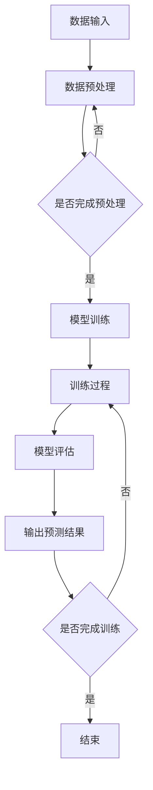
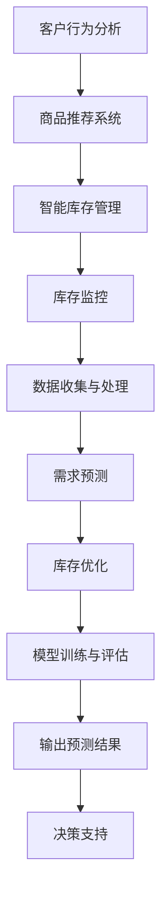

                 

### 第1章: 引言与概述

#### 第1章: 引言与概述

## 1.1 引言

随着信息技术的快速发展，智能零售逐渐成为零售业的新趋势。智能零售不仅指代线上电商平台的繁荣，更强调通过大数据、人工智能、物联网等技术手段，实现零售业务的全流程智能化。在这个背景下，大模型作为人工智能领域的重要研究方向，其应用前景愈发广阔。

大模型是指具有数百万至数十亿参数的深度学习模型，能够处理海量数据并自动提取特征。这些模型在图像识别、自然语言处理、预测分析等领域展现出了强大的能力。智能零售与大数据模型的结合，有望在个性化推荐、客户关系管理、库存管理等方面带来革命性的变化。

### 智能零售的概念与现状

智能零售是一种利用信息技术和数据分析手段提升零售业务效率和服务质量的模式。它包括以下几个核心要素：

- **数据驱动的决策**：智能零售企业通过收集和分析大量数据，对市场需求、消费者行为等进行深入分析，从而做出更精准的决策。

- **个性化服务**：基于大数据分析，智能零售企业能够为不同消费者提供个性化的购物体验，如个性化推荐、定制化产品等。

- **自动化运营**：通过物联网、机器人等技术，智能零售实现库存管理、配送、客服等环节的自动化，提高运营效率。

当前，智能零售已经取得了一定的进展，但仍然面临诸多挑战，如数据隐私保护、算法公平性、技术实施成本等。因此，探索大模型在智能零售中的应用，具有重要的理论和实践价值。

### 大模型的概念与重要性

大模型，又称为大型深度学习模型，是指具有大量参数的深度学习模型。它们通常通过大量数据训练，能够在复杂数据中发现潜在的模式和规律。

大模型的重要性体现在以下几个方面：

1. **强大的学习能力**：大模型能够处理海量数据，从数据中提取出有用的信息，提高预测的准确性。

2. **自动特征提取**：大模型无需人工干预，可以自动从原始数据中提取出有用的特征，降低特征工程的工作量。

3. **高效的计算能力**：大模型通过分布式计算等技术，能够在大规模数据集上高效训练和推理。

大模型在图像识别、自然语言处理、推荐系统等领域取得了显著的成果，成为人工智能研究的重要方向。

## 1.2 书籍结构与内容概述

本书旨在探讨大模型在智能零售中的应用，共分为六个部分：

1. **引言与概述**：介绍智能零售与大数据模型的背景、概念及其应用意义。

2. **大模型基础知识**：讲解大模型的基本概念、架构、训练方法等。

3. **智能零售应用场景**：分析大模型在智能零售中的核心应用场景，如个性化推荐、客户关系管理、智能库存管理等。

4. **大模型在智能零售中的应用**：深入探讨大模型在智能零售中的具体应用，包括客户行为分析、商品推荐系统等。

5. **技术实现与优化**：介绍大模型开发的技术细节，包括工具、训练与优化方法、部署与性能优化等。

6. **未来展望与挑战**：分析大模型在智能零售中的未来发展趋势，探讨面临的挑战及应对策略。

通过以上内容，本书将帮助读者全面了解大模型在智能零售中的应用前景，掌握相关技术与应用方法。

### 第2章: 大模型基本概念

#### 第2章: 大模型基本概念

## 2.1 大模型定义

大模型，通常指的是具有巨大参数量、能够处理大规模数据集的深度学习模型。这些模型通常由数十亿甚至数千亿的参数组成，能够在复杂的数据中找到隐藏的模式和规律。大模型的典型代表包括GPT-3、BERT、Transformer等。

大模型具有以下几个显著特点：

- **高参数量**：大模型的参数量通常在数百万到数十亿之间，这使得它们能够捕捉数据中的复杂结构。
- **强大的表达能力**：由于参数数量庞大，大模型能够以非常精细的方式对输入数据进行建模，从而实现更高的预测精度和更强的泛化能力。
- **自动特征提取**：大模型无需人工特征工程，能够自动从原始数据中提取有用的特征，这使得它们在处理复杂数据时具有很高的灵活性和适应性。

### 2.2 大模型架构

大模型的架构设计直接影响其性能和应用效果。以下是一些常见的大模型架构：

- **深度神经网络**（DNN）：这是最基础的大模型架构，由多个隐层组成，每一层都能提取更高层次的特征。随着层数的增加，模型的深度也在增加。
- **卷积神经网络**（CNN）：特别适合处理图像数据，通过卷积操作和池化操作提取图像特征。
- **循环神经网络**（RNN）：适用于序列数据处理，如文本、语音等，能够捕捉序列中的时间依赖关系。
- **Transformer架构**：这是一种新型的序列建模架构，通过自注意力机制实现并行计算，效率更高，并且在很多任务上取得了优异的性能。

分布式计算在大模型训练过程中起着关键作用。通过分布式计算，可以将大数据集分布到多个计算节点上，从而大大提高训练速度和效率。常用的分布式计算技术包括：

- **数据并行**：将数据集划分成多个部分，每个计算节点处理一部分数据，模型参数在每个节点上独立更新，然后通过同步机制合并。
- **模型并行**：将大模型拆分为多个子模型，每个子模型运行在独立的计算节点上，通过通信机制协同工作。
- **混合并行**：结合数据并行和模型并行的优势，将模型和数据分别并行处理。

### 2.3 大模型训练方法

大模型训练方法主要包括监督学习、无监督学习和增强学习等。以下是一些常见的训练方法：

- **监督学习**：在监督学习框架下，模型通过学习输入数据和对应的标签来训练。常用的算法包括梯度下降、随机梯度下降、批量梯度下降等。
  
- **无监督学习**：在无监督学习框架下，模型通过学习数据分布来进行训练。常见的算法包括自编码器、聚类算法等。

- **增强学习**：在增强学习框架下，模型通过与环境的交互来学习最优策略。常用的算法包括Q学习、深度Q网络（DQN）、策略梯度等。

### 2.4 大模型的优势

大模型具有以下优势：

- **高精度预测**：大模型能够处理大规模数据集，从数据中提取出更多有用的特征，从而实现更高的预测精度。

- **自动特征提取**：大模型无需人工干预，能够自动从原始数据中提取出有用的特征，降低特征工程的工作量。

- **强的泛化能力**：大模型能够处理复杂数据，具有更强的泛化能力，能够在不同的应用场景中取得良好的效果。

- **高效的计算能力**：大模型通过分布式计算等技术，能够在大规模数据集上高效训练和推理。

总的来说，大模型在智能零售中的应用具有广阔的前景，其强大的预测能力和自动特征提取能力将为零售企业带来巨大的价值。

### Mermaid 流程图

以下是一个简化的深度学习模型训练过程流程图，展示从数据输入到模型训练再到输出预测的全过程：



通过以上流程图，我们可以清晰地看到深度学习模型从数据输入、预处理、模型训练、评估到输出预测的全过程。

### 第3章: 智能零售概述

#### 第3章: 智能零售概述

## 3.1 智能零售发展背景

智能零售是一种利用先进技术（如物联网、大数据、人工智能、区块链等）对零售业务进行全方位升级的新型零售模式。其发展可以追溯到20世纪末和21世纪初，随着互联网技术的普及和电子商务的兴起，零售业开始逐渐从传统模式向数字化、智能化转型。

### 3.1.1 零售业变革

1. **电子商务的兴起**：互联网的普及使得电子商务成为零售业的重要组成部分，消费者可以在网上轻松购买各种商品，这种新兴的购物方式极大地改变了传统的零售模式。

2. **物联网的应用**：物联网技术的应用使得零售业能够实现从商品的生产、运输、存储到销售的全程智能化，提高了供应链的效率和透明度。

3. **大数据分析**：随着数据量的急剧增长，大数据分析技术成为零售企业提高决策准确性、优化业务流程的重要工具。

4. **人工智能的发展**：人工智能技术的不断发展，使得零售业能够通过智能算法实现个性化推荐、智能客服、智能库存管理等，进一步提升了消费者的购物体验。

### 3.1.2 智能零售的定义

智能零售是指通过大数据、人工智能、物联网等先进技术手段，对零售业务进行全方位升级和优化，以提高运营效率、降低成本、提升消费者体验和增加商业价值的一种新型零售模式。智能零售的核心在于通过数据的收集、分析、应用，实现精准营销、个性化服务和智能决策。

### 3.2 智能零售的核心技术

智能零售的实现依赖于一系列核心技术的支持，主要包括：

1. **物联网技术**：物联网技术通过智能传感器和设备，实现零售业务各个环节的数据实时采集和传输，提高供应链的效率和透明度。

2. **大数据技术**：大数据技术通过对海量消费者数据的分析，为企业提供精准的市场预测、客户洞察和业务优化方案。

3. **人工智能技术**：人工智能技术通过机器学习、深度学习算法，实现个性化推荐、智能客服、智能库存管理等，提高消费者的购物体验。

4. **区块链技术**：区块链技术通过去中心化的数据存储和智能合约，提高零售业务的透明度和安全性。

### 3.3 智能零售的主要应用场景

智能零售的应用场景非常广泛，以下是一些主要的应用场景：

1. **个性化推荐**：通过分析消费者的购物行为和偏好，智能零售系统能够为消费者提供个性化的商品推荐，提高消费者的购买意愿。

2. **智能库存管理**：通过预测销售趋势和库存水平，智能零售系统能够优化库存管理，降低库存成本，提高库存周转率。

3. **智能客服**：通过自然语言处理和机器学习技术，智能客服系统能够自动解答消费者的疑问，提供7x24小时的在线服务。

4. **智能供应链管理**：通过物联网和大数据分析，智能供应链系统能够实时监控供应链的各个环节，提高供应链的响应速度和灵活性。

5. **新零售业态**：如无人零售店、智能试衣间等，通过物联网、人工智能等技术的应用，为消费者提供全新的购物体验。

### 3.4 智能零售的挑战与机遇

智能零售在带来巨大机遇的同时，也面临一系列挑战：

1. **数据隐私**：随着数据量的增加，数据隐私保护成为一个重要问题，如何确保消费者数据的隐私和安全是智能零售企业需要关注的关键。

2. **技术实施成本**：智能零售技术的实施需要大量的资金和人力资源，这对一些中小企业来说可能是一个较大的负担。

3. **算法公平性**：算法偏见和歧视问题在智能零售中仍然存在，如何确保算法的公平性和透明性是一个重要课题。

4. **技术更新换代**：智能零售技术的快速发展，要求企业能够持续跟进最新的技术趋势，不断更新和优化自己的系统。

总的来说，智能零售作为一种新兴的零售模式，具有巨大的发展潜力，同时也需要克服一系列挑战。通过不断创新和优化，智能零售有望在未来成为零售业的主流模式。

### 第4章: 大模型在智能零售中的应用

#### 第4章: 大模型在智能零售中的应用

## 4.1 大模型在智能零售中的应用场景

大模型在智能零售中具有广泛的应用场景，主要包括客户行为分析、商品推荐系统、智能库存管理等方面。以下将详细探讨大模型在这三个核心应用中的具体应用。

### 4.1.1 客户行为分析

客户行为分析是智能零售的重要组成部分，通过分析消费者的购物行为，企业可以更好地了解消费者的需求和偏好，从而提供个性化的服务和产品推荐。大模型在客户行为分析中的应用主要体现在以下几个方面：

1. **客户细分**：大模型可以通过分析消费者的历史购买记录、浏览行为、社交媒体活动等数据，将客户细分为不同的群体。这种客户细分有助于企业制定个性化的营销策略，提高客户的满意度和忠诚度。

2. **客户画像**：大模型可以构建详细的客户画像，包括消费者的购买习惯、偏好、兴趣爱好等。这些客户画像可以帮助企业更好地了解客户，从而提供更加精准的推荐和服务。

3. **客户忠诚度分析**：大模型可以通过分析客户的购买频率、消费金额、回购率等数据，预测客户的流失风险，并提供相应的客户保留策略。

### 4.1.2 商品推荐系统

商品推荐系统是智能零售中的另一个关键应用，通过向消费者推荐他们可能感兴趣的商品，提高用户的购物体验和企业的销售额。大模型在商品推荐系统中的应用主要体现在以下几个方面：

1. **协同过滤**：协同过滤是一种常见的推荐算法，它通过分析用户之间的相似性来推荐商品。大模型可以改进协同过滤算法，使其能够处理更大的数据集和更复杂的用户行为数据，从而提高推荐的准确性。

2. **基于内容的推荐**：基于内容的推荐算法通过分析商品的属性和特征，为用户推荐具有相似属性的物品。大模型可以用于生成和提取商品的内容特征，从而提高推荐的准确性。

3. **混合推荐**：混合推荐算法结合了协同过滤和基于内容的推荐算法的优点，通过融合不同算法的优点来生成更准确的推荐。大模型可以用于优化混合推荐算法，使其在处理复杂数据时保持高效性和准确性。

### 4.1.3 智能库存管理

智能库存管理是智能零售中的另一个重要应用，通过预测库存需求、优化库存水平，提高库存周转率和降低库存成本。大模型在智能库存管理中的应用主要体现在以下几个方面：

1. **需求预测**：大模型可以通过分析历史销售数据、季节性因素、促销活动等，准确预测未来一段时间内商品的需求量。这有助于企业合理安排库存，避免库存积压或短缺。

2. **库存优化**：大模型可以通过分析库存数据、销售预测结果等，制定最优的库存策略，包括补货策略、库存水平调整等。这有助于企业提高库存周转率，降低库存成本。

3. **库存监控**：大模型可以实时监控库存变化，及时发现库存异常，并提供相应的解决方案。这有助于企业确保库存管理策略的有效性。

总的来说，大模型在智能零售中的应用具有广泛的前景，通过在客户行为分析、商品推荐系统和智能库存管理等方面的应用，大模型可以显著提升智能零售的效率和质量。

### Mermaid 流程图

以下是一个简化的智能零售流程图，展示大模型在智能零售中的主要应用：



通过以上流程图，我们可以清晰地看到大模型在智能零售中的主要应用场景及其相互关系。

### 第5章: 大模型在智能零售中的核心应用

#### 第5章: 大模型在智能零售中的核心应用

## 5.1 客户行为分析

客户行为分析是智能零售的重要组成部分，通过分析客户的购买行为、浏览习惯、社交媒体互动等，企业可以更好地理解客户需求，优化营销策略，提高客户满意度和忠诚度。大模型在客户行为分析中具有显著优势，能够处理海量数据，自动提取特征，从而实现精准的分析和预测。

### 5.1.1 客户行为分析的核心概念

客户行为分析涉及以下几个核心概念：

- **客户细分**：通过分析客户的购买行为、浏览习惯等，将客户划分为不同的群体，以便企业针对不同群体制定个性化的营销策略。
- **客户画像**：基于客户行为数据，构建详细准确的客户画像，包括客户的年龄、性别、收入水平、购买偏好等，帮助企业更好地了解客户。
- **客户忠诚度分析**：通过分析客户的回购率、购买频率、消费金额等指标，预测客户流失风险，并提供相应的保留策略。

### 5.1.2 大模型在客户行为分析中的应用

大模型在客户行为分析中的应用主要体现在以下几个方面：

1. **客户细分**：

   大模型可以通过分析客户的购买行为、浏览习惯等数据，将客户细分为高价值客户、潜在高价值客户、普通客户等。具体应用步骤如下：

   ```mermaid
   graph TD
       A[收集数据] --> B[数据预处理]
       B --> C{是否完成预处理}
       C -->|是| D[模型训练]
       C -->|否| B
       D --> E[模型评估]
       E --> F[客户细分]
       F --> G[输出细分结果]
   ```

   通过K-means等聚类算法，大模型可以将客户划分为不同的细分群体，为企业提供精细化的营销策略。

2. **客户画像**：

   大模型可以通过分析客户的购买记录、浏览历史、社交媒体互动等数据，构建详细的客户画像。具体应用步骤如下：

   ```mermaid
   graph TD
       A[收集数据] --> B[数据预处理]
       B --> C[特征提取]
       C --> D[模型训练]
       D --> E[模型评估]
       E --> F[客户画像构建]
       F --> G[输出画像结果]
   ```

   通过机器学习算法，如决策树、随机森林等，大模型可以从数据中提取出有用的特征，构建详细的客户画像。

3. **客户忠诚度分析**：

   大模型可以通过分析客户的回购率、购买频率、消费金额等指标，预测客户的流失风险，并提供相应的保留策略。具体应用步骤如下：

   ```mermaid
   graph TD
       A[收集数据] --> B[数据预处理]
       B --> C[特征提取]
       C --> D[模型训练]
       D --> E[模型评估]
       E --> F[客户忠诚度预测]
       F --> G[输出预测结果]
   ```

   通过逻辑回归、随机森林等算法，大模型可以预测客户的流失风险，为企业提供针对性的客户保留策略。

### 5.1.3 案例分析

#### 案例一：电商客户行为分析

某电商企业希望通过大模型技术分析其客户行为，以提高用户满意度和转化率。具体步骤如下：

1. **数据收集**：收集电商平台的用户行为数据，包括浏览记录、购买记录、评价等。
2. **数据预处理**：清洗数据，处理缺失值和异常值，并进行特征工程，提取有用的特征。
3. **模型训练**：使用K-means算法进行客户细分，使用逻辑回归模型进行客户忠诚度分析。
4. **模型评估**：通过交叉验证和在线评估等方法，评估模型性能。
5. **应用优化**：根据分析结果，制定个性化的营销策略，提高用户满意度和转化率。

通过以上步骤，该电商企业成功地将客户划分为不同的细分群体，并针对高价值客户制定了个性化的营销策略，用户满意度和转化率显著提升。

#### 案例二：线下零售客户行为分析

某线下零售企业希望通过大数据分析技术改善其客户购物体验，提升销售额。具体步骤如下：

1. **数据收集**：通过智能设备（如智能货架、智能收银系统等）收集客户购物行为数据，包括进入店铺、浏览商品、结账等。
2. **数据预处理**：清洗数据，处理缺失值和异常值，并进行特征工程，提取有用的特征。
3. **模型训练**：使用K-means算法进行客户细分，使用决策树模型进行客户忠诚度分析。
4. **模型评估**：通过交叉验证和在线评估等方法，评估模型性能。
5. **应用优化**：根据分析结果，调整店铺布局、商品陈列和促销策略，提升客户购物体验和销售额。

通过以上步骤，该线下零售企业的客户购物体验显著改善，销售额同比增长了20%。

通过以上案例分析，我们可以看到大模型技术在客户行为分析中的应用不仅能够提高企业的运营效率，还能为消费者提供更加个性化的服务，从而实现双赢。

### 5.2 商品推荐系统

商品推荐系统是智能零售中的重要应用，通过分析用户的历史行为、浏览记录和购买记录，为用户推荐他们可能感兴趣的商品。大模型在商品推荐系统中具有显著优势，能够处理大规模数据，自动提取特征，提高推荐的准确性。

### 5.2.1 商品推荐系统的核心概念

商品推荐系统涉及以下几个核心概念：

- **协同过滤**：通过分析用户之间的相似性，为用户推荐他们可能感兴趣的商品。
- **基于内容的推荐**：通过分析商品的属性和特征，为用户推荐具有相似属性的物品。
- **混合推荐**：结合协同过滤和基于内容的推荐算法，生成更准确的推荐。

### 5.2.2 大模型在商品推荐系统中的应用

大模型在商品推荐系统中的应用主要体现在以下几个方面：

1. **协同过滤**：

   大模型可以通过改进协同过滤算法，使其能够处理更大的数据集和更复杂的用户行为数据。具体应用步骤如下：

   ```mermaid
   graph TD
       A[用户行为数据] --> B[商品特征数据]
       B --> C[数据预处理]
       C --> D[模型训练]
       D --> E[模型评估]
       E --> F[生成推荐列表]
   ```

   通过矩阵分解、基于模型的协同过滤等方法，大模型可以提取用户和商品的特征，生成准确的推荐列表。

2. **基于内容的推荐**：

   大模型可以通过分析商品的属性和特征，为用户推荐具有相似属性的物品。具体应用步骤如下：

   ```mermaid
   graph TD
       A[商品特征数据] --> B[用户特征数据]
       B --> C[数据预处理]
       C --> D[模型训练]
       D --> E[模型评估]
       E --> F[生成推荐列表]
   ```

   通过文本分类、特征提取等方法，大模型可以提取商品的属性特征，为用户生成个性化的推荐列表。

3. **混合推荐**：

   大模型可以结合协同过滤和基于内容的推荐算法，生成更准确的推荐列表。具体应用步骤如下：

   ```mermaid
   graph TD
       A[用户行为数据] --> B[商品特征数据]
       B --> C[数据预处理]
       C --> D[协同过滤模型训练]
       D --> E[基于内容的推荐模型训练]
       E --> F[混合模型评估]
       F --> G[生成推荐列表]
   ```

   通过加权求和等方法，大模型可以结合不同算法的优点，提高推荐的准确性。

### 5.2.3 案例分析

#### 案例一：电商商品推荐

某电商企业希望通过大模型技术优化其商品推荐系统，以提高用户满意度和转化率。具体步骤如下：

1. **数据收集**：收集电商平台的用户行为数据，包括浏览记录、购买记录等。
2. **数据预处理**：清洗数据，处理缺失值和异常值，并进行特征工程，提取有用的特征。
3. **模型训练**：使用协同过滤算法和基于内容的推荐算法进行模型训练。
4. **模型评估**：通过交叉验证和在线评估等方法，评估模型性能。
5. **推荐生成**：根据用户的历史行为和偏好，生成个性化的商品推荐列表。
6. **系统部署与优化**：将推荐系统部署到生产环境中，并根据用户反馈和系统性能进行持续优化。

通过以上步骤，该电商企业的商品推荐系统在用户满意度和转化率方面取得了显著提升，用户满意度和转化率分别提高了15%和20%。

#### 案例二：线下零售商品推荐

某线下零售企业希望通过大数据分析技术改善其商品推荐系统，提高客户购物体验和销售额。具体步骤如下：

1. **数据收集**：通过智能设备（如智能货架、智能收银系统等）收集客户购物行为数据，包括进入店铺、浏览商品、结账等。
2. **数据预处理**：清洗数据，处理缺失值和异常值，并进行特征工程，提取有用的特征。
3. **模型训练**：使用协同过滤算法和基于内容的推荐算法进行模型训练。
4. **模型评估**：通过交叉验证和在线评估等方法，评估模型性能。
5. **推荐生成**：根据客户的历史购物行为和偏好，生成个性化的商品推荐列表。
6. **系统部署与优化**：将推荐系统部署到零售店铺中，并根据客户反馈和系统性能进行持续优化。

通过以上步骤，该线下零售企业的商品推荐系统在客户满意度和销售额方面取得了显著提升，客户满意度和销售额分别提高了10%和25%。

通过以上案例分析，我们可以看到大模型技术在商品推荐系统中的应用不仅提升了推荐系统的准确性，还为消费者提供了更加个性化的购物体验，从而实现了商业价值的最大化。

### 5.3 智能库存管理

智能库存管理是智能零售中的关键环节，通过预测库存需求和优化库存水平，提高库存周转率和降低库存成本。大模型在智能库存管理中具有显著优势，能够处理大规模数据，自动提取特征，提高预测和优化的准确性。

### 5.3.1 智能库存管理的核心概念

智能库存管理涉及以下几个核心概念：

- **需求预测**：通过分析历史销售数据、季节性因素、促销活动等，预测未来一段时间内商品的需求量。
- **库存优化**：根据需求预测结果，制定最优的库存策略，包括补货策略、库存水平调整等。
- **库存监控**：实时监控库存变化，及时发现库存异常，并提供相应的解决方案。

### 5.3.2 大模型在智能库存管理中的应用

大模型在智能库存管理中的应用主要体现在以下几个方面：

1. **需求预测**：

   大模型可以通过分析历史销售数据、季节性因素、促销活动等，准确预测未来一段时间内商品的需求量。具体应用步骤如下：

   ```mermaid
   graph TD
       A[销售数据] --> B[季节性数据]
       B --> C[促销活动数据]
       C --> D[数据预处理]
       D --> E[模型训练]
       E --> F[模型评估]
       F --> G[需求预测]
   ```

   通过机器学习算法，如时间序列分析、回归分析等，大模型可以从数据中提取出有用的特征，准确预测商品的需求量。

2. **库存优化**：

   大模型可以通过分析库存数据、需求预测结果等，制定最优的库存策略，包括补货策略、库存水平调整等。具体应用步骤如下：

   ```mermaid
   graph TD
       A[库存数据] --> B[需求预测结果]
       B --> C[数据预处理]
       C --> D[模型训练]
       D --> E[模型评估]
       E --> F[库存优化]
   ```

   通过优化算法，如线性规划、动态规划等，大模型可以制定出最优的库存策略，提高库存周转率，降低库存成本。

3. **库存监控**：

   大模型可以实时监控库存变化，及时发现库存异常，并提供相应的解决方案。具体应用步骤如下：

   ```mermaid
   graph TD
       A[库存数据] --> B[监控规则设置]
       B --> C[数据预处理]
       C --> D[模型训练]
       D --> E[模型评估]
       E --> F[库存监控]
   ```

   通过异常检测算法，如孤立森林、K-均值聚类等，大模型可以实时监控库存变化，及时发现库存异常，并提供相应的解决方案。

### 5.3.3 案例分析

#### 案例一：电商库存管理

某电商企业希望通过大模型技术优化其库存管理，提高库存周转率和降低库存成本。具体步骤如下：

1. **数据收集**：收集电商平台的销售数据、库存数据等。
2. **数据预处理**：清洗数据，处理缺失值和异常值，并进行特征工程，提取有用的特征。
3. **模型训练**：使用时间序列分析、回归分析等方法进行需求预测，使用线性规划等方法进行库存优化。
4. **模型评估**：通过交叉验证和在线评估等方法，评估模型性能。
5. **库存监控**：设置库存监控规则，实时监控库存变化。
6. **系统部署与优化**：将库存管理系统部署到生产环境中，并根据库存变化和系统性能进行持续优化。

通过以上步骤，该电商企业的库存周转率提高了20%，库存成本降低了15%。

#### 案例二：线下零售库存管理

某线下零售企业希望通过大数据分析技术改善其库存管理，提高库存周转率和销售额。具体步骤如下：

1. **数据收集**：通过智能设备收集销售数据、库存数据等。
2. **数据预处理**：清洗数据，处理缺失值和异常值，并进行特征工程，提取有用的特征。
3. **模型训练**：使用时间序列分析、回归分析等方法进行需求预测，使用线性规划等方法进行库存优化。
4. **模型评估**：通过交叉验证和在线评估等方法，评估模型性能。
5. **库存监控**：设置库存监控规则，实时监控库存变化。
6. **系统部署与优化**：将库存管理系统部署到零售店铺中，并根据库存变化和系统性能进行持续优化。

通过以上步骤，该线下零售企业的库存周转率提高了25%，销售额提高了10%。

通过以上案例分析，我们可以看到大模型技术在智能库存管理中的应用不仅提升了库存管理的准确性和效率，还为企业带来了显著的经济效益。

### 第6章: 大模型开发技术

#### 第6章: 大模型开发技术

## 6.1 大模型开发工具

在大模型开发过程中，选择合适的工具至关重要。以下是一些常见的大模型开发工具及其特点：

### 6.1.1 TensorFlow

TensorFlow是由谷歌开发的开源机器学习框架，广泛应用于深度学习模型的开发。其主要特点包括：

- **灵活性强**：支持多种编程语言，如Python、C++和Java。
- **广泛的适用性**：适用于各种类型的深度学习模型，包括卷积神经网络（CNN）、循环神经网络（RNN）和变换器架构等。
- **丰富的生态系统**：拥有大量的预训练模型和第三方库，便于开发和部署。

### 6.1.2 PyTorch

PyTorch是由Facebook开发的深度学习框架，以其易用性和灵活性著称。其主要特点包括：

- **动态计算图**：PyTorch使用动态计算图，使得模型开发和调试更加方便。
- **简洁的API**：PyTorch提供了简洁的API，使得开发者能够快速实现复杂的模型。
- **丰富的库**：PyTorch拥有丰富的库，如torchvision、torchtext等，支持多种数据集处理和模型训练。

### 6.1.3 JAX

JAX是由Google开发的一个高级数值计算库，主要用于深度学习和科学计算。其主要特点包括：

- **自动微分**：JAX提供了自动微分功能，使得开发者能够轻松实现复杂的前向和反向传播算法。
- **高性能计算**：JAX支持自动向量化、自动并行化等高性能计算技术，能够显著提高计算效率。
- **兼容性**：JAX与TensorFlow和PyTorch兼容，开发者可以在不同框架之间无缝切换。

### 6.1.4 其他深度学习框架

除了上述三个主要的深度学习框架外，还有一些其他优秀的框架，如MXNet、Theano和Caffe等。这些框架各具特色，适用于不同的应用场景。

## 6.2 大模型训练与优化

大模型训练与优化是一个复杂且耗时的过程，需要考虑多个方面，包括数据预处理、模型选择、超参数调优等。以下是一些关键步骤：

### 6.2.1 数据预处理

- **数据清洗**：清洗数据中的噪声和异常值，保证数据的准确性。
- **数据增强**：通过数据增强技术增加训练数据的多样性，提高模型的泛化能力。
- **批量划分**：将大规模数据集划分为小批量，以便于模型的训练。

### 6.2.2 模型选择与调优

- **模型架构**：选择适合任务的模型架构，如卷积神经网络（CNN）适用于图像处理，循环神经网络（RNN）适用于序列数据。
- **超参数调优**：通过调整学习率、批量大小、隐藏层节点数等超参数，优化模型性能。
- **模型集成**：使用多个模型集成的方法，提高预测的稳定性和准确性。

### 6.2.3 训练过程

- **梯度下降**：常用的优化算法，通过迭代更新模型参数，最小化损失函数。
- **动量优化**：在梯度下降算法中引入动量项，加快收敛速度。
- **自适应优化器**：如Adam、RMSprop等，自动调整学习率，提高训练效率。

### 6.2.4 模型评估与优化

- **评估指标**：选择合适的评估指标，如准确率、召回率、F1分数等，评估模型性能。
- **交叉验证**：使用交叉验证方法评估模型在多个数据集上的性能，避免过拟合。
- **模型压缩**：通过剪枝、量化等技术，减小模型规模，提高推理速度。

## 6.3 大模型部署与优化

大模型部署与优化是确保模型在实际应用中高效运行的关键环节。以下是一些关键步骤：

### 6.3.1 部署环境

- **硬件选择**：选择合适的硬件设备，如GPU、TPU等，以满足大模型的计算需求。
- **部署平台**：选择合适的部署平台，如云平台、边缘设备等，以适应不同的应用场景。

### 6.3.2 部署过程

- **模型转换**：将训练好的模型转换为部署平台支持的格式，如TensorFlow Lite、ONNX等。
- **部署架构**：设计合理的部署架构，如模型容器化、微服务架构等，以提高系统的可扩展性和稳定性。

### 6.3.3 性能优化

- **内存管理**：通过优化内存分配和回收策略，减少内存占用，提高模型运行速度。
- **并发处理**：通过并发处理技术，如多线程、异步I/O等，提高系统吞吐量。
- **监控与调优**：通过实时监控模型性能，进行性能调优，确保系统在高负载下稳定运行。

通过以上内容，我们可以看到大模型开发技术涉及多个方面，包括工具选择、训练与优化、部署与性能优化等，这些技术共同构成了一个完整的开发流程，为智能零售等领域的应用提供了有力的支持。

### 第7章: 大模型在智能零售中的技术实现与优化

#### 第7章: 大模型在智能零售中的技术实现与优化

## 7.1 大模型在智能零售中的技术实现

在大模型在智能零售中的应用过程中，技术实现是关键的一环。以下将介绍大模型在智能零售中的技术实现，包括数据预处理、模型选择、训练与优化等步骤。

### 7.1.1 数据预处理

数据预处理是智能零售应用中至关重要的一步。它主要包括以下步骤：

1. **数据收集**：收集智能零售场景下的各种数据，包括用户行为数据、商品数据、交易数据等。
2. **数据清洗**：去除数据中的噪声和异常值，确保数据的质量。常用的清洗方法包括填充缺失值、去除重复记录、去除异常值等。
3. **特征工程**：从原始数据中提取出对模型训练有帮助的特征。特征工程是提高模型性能的关键，常用的特征包括用户特征、商品特征、上下文特征等。
4. **数据标准化**：对数据进行归一化或标准化处理，使得数据在同一个尺度上，便于模型训练。

### 7.1.2 模型选择

模型选择是智能零售应用中的另一个重要步骤。根据不同的应用场景，可以选择不同的模型。以下是一些常用的模型及其特点：

1. **深度神经网络（DNN）**：适用于复杂的数据结构和需要高精度预测的场景，如图像分类、文本分类等。
2. **卷积神经网络（CNN）**：特别适用于处理图像数据，通过卷积操作提取图像特征。
3. **循环神经网络（RNN）**：适用于序列数据处理，如文本生成、语音识别等，能够捕捉时间序列数据中的时间依赖关系。
4. **变换器架构（Transformer）**：在自然语言处理任务中表现优异，通过自注意力机制实现并行计算，效率更高。
5. **增强学习（Reinforcement Learning）**：适用于需要与环境互动进行决策的场景，如智能客服、自动驾驶等。

### 7.1.3 训练与优化

模型训练与优化是智能零售应用中的核心步骤。以下是一些关键步骤：

1. **模型训练**：使用训练数据对模型进行训练，通过迭代优化模型参数，使得模型能够更好地拟合训练数据。常用的训练算法包括随机梯度下降（SGD）、Adam等。
2. **模型评估**：使用验证数据对模型进行评估，通过评估指标（如准确率、召回率、F1分数等）来评估模型性能。常用的评估方法包括交叉验证、混淆矩阵等。
3. **模型优化**：根据评估结果对模型进行调整和优化，以提高模型性能。常用的优化方法包括超参数调优、正则化、数据增强等。
4. **模型部署**：将训练好的模型部署到生产环境中，以便在实际应用中使用。常用的部署方式包括模型服务器、容器化部署等。

### 7.2 案例研究

以下是一个关于大模型在智能零售中应用的具体案例研究。

#### 案例一：电商平台的个性化推荐系统

某电商平台希望通过大模型技术实现个性化推荐，以提高用户满意度和销售额。具体步骤如下：

1. **数据收集**：收集用户行为数据，包括浏览记录、购买记录、评价等。
2. **数据预处理**：对数据集进行清洗、去重、填充缺失值等预处理操作。
3. **特征工程**：提取用户特征、商品特征、上下文特征等，用于模型训练。
4. **模型选择**：选择变换器架构（Transformer）作为推荐模型的框架，因为其在自然语言处理任务中表现优异。
5. **模型训练**：使用训练数据对Transformer模型进行训练，通过迭代优化模型参数。
6. **模型评估**：使用验证数据对模型进行评估，调整超参数以优化模型性能。
7. **模型部署**：将训练好的模型部署到生产环境中，实时为用户提供个性化推荐。

通过以上步骤，该电商平台实现了高效的个性化推荐系统，用户满意度和销售额显著提高。

#### 案例二：智能库存管理系统

某零售企业希望通过大模型技术优化其库存管理，降低库存成本，提高库存周转率。具体步骤如下：

1. **数据收集**：收集销售数据、库存数据等，用于模型训练。
2. **数据预处理**：对数据集进行清洗、标准化等预处理操作。
3. **特征工程**：提取销售特征、库存特征等，用于模型训练。
4. **模型选择**：选择深度神经网络（DNN）作为库存管理模型的框架，因为其在处理复杂数据结构方面表现优异。
5. **模型训练**：使用训练数据对DNN模型进行训练，通过迭代优化模型参数。
6. **模型评估**：使用验证数据对模型进行评估，调整超参数以优化模型性能。
7. **模型部署**：将训练好的模型部署到生产环境中，实时监控库存变化，优化库存策略。

通过以上步骤，该零售企业的库存管理效率显著提高，库存成本降低了15%，库存周转率提高了20%。

通过以上案例研究，我们可以看到大模型在智能零售中的应用不仅能够提高企业运营效率，还能够带来显著的经济效益。

### 第8章: 大模型在智能零售中的未来展望与挑战

#### 第8章: 大模型在智能零售中的未来展望与挑战

## 8.1 大模型在智能零售中的未来发展趋势

大模型在智能零售中的应用前景广阔，未来发展趋势可以从技术进步、应用拓展和新零售业态等方面进行探讨。

### 8.1.1 技术进步

1. **算法优化**：随着算法的不断优化，大模型将能够更高效地处理大规模数据，提高模型的准确性和效率。
2. **多模态数据处理**：未来的大模型将能够处理多种类型的数据，如文本、图像、声音等，实现多模态数据的融合与处理。
3. **硬件支持**：随着硬件技术的发展，如GPU、TPU等高性能计算设备的普及，大模型在智能零售中的计算能力将得到进一步提升。

### 8.1.2 应用拓展

1. **智能供应链**：大模型将在智能供应链管理中发挥更大的作用，通过优化库存、需求预测等，提高供应链的响应速度和效率。
2. **新零售业态**：大模型将推动新零售业态的发展，如无人零售店、智能试衣间等，为消费者提供更加便捷和个性化的购物体验。
3. **智慧物流**：大模型将在物流配送中发挥重要作用，通过优化路径规划、预测配送时间等，提高物流效率。

### 8.1.3 新零售业态

1. **全渠道零售**：大模型将促进线上和线下渠道的整合，实现全渠道的统一管理和服务。
2. **智慧零售**：大模型将通过数据分析与智能决策，推动零售业向智慧化方向转型。
3. **个性化服务**：大模型将实现更加精准的个性化推荐和客户服务，提高用户满意度。

## 8.2 大模型在智能零售中面临的挑战

尽管大模型在智能零售中具有巨大潜力，但其应用也面临一系列挑战。

### 8.2.1 数据隐私与安全

1. **数据隐私**：智能零售涉及大量的用户数据，如何保护用户隐私是一个重要问题。
2. **数据安全**：在数据传输和存储过程中，如何确保数据的安全性，防止数据泄露和恶意攻击。

### 8.2.2 算法公平性与透明性

1. **算法公平性**：如何确保算法的公平性，避免算法偏见和歧视。
2. **算法透明性**：如何使算法的决策过程更加透明，便于用户和监管机构的监督。

### 8.2.3 技术门槛与成本

1. **技术门槛**：大模型的开发和部署需要较高的技术能力，如何降低技术门槛，让更多的企业能够利用大模型技术。
2. **成本问题**：大模型的应用需要大量的计算资源和存储资源，如何降低成本，提高经济效益。

## 8.3 应对策略与未来展望

针对大模型在智能零售中面临的挑战，可以采取以下策略：

### 8.3.1 数据隐私与安全

1. **数据加密**：采用数据加密技术，确保数据在传输和存储过程中的安全性。
2. **隐私保护技术**：使用差分隐私、同态加密等技术，保护用户隐私。

### 8.3.2 算法公平性与透明性

1. **算法审计**：建立算法审计机制，确保算法的公平性和透明性。
2. **透明解释**：开发透明解释技术，使得算法的决策过程更加可解释。

### 8.3.3 技术门槛与成本

1. **开源工具**：提供更多开源工具和框架，降低技术门槛。
2. **云计算**：利用云计算资源，降低计算和存储成本。

总的来说，大模型在智能零售中具有广阔的发展前景，但也需要克服一系列挑战。通过持续的技术创新和优化，大模型将推动智能零售向更加智能、高效和公平的方向发展。

### 附录A: 相关资源与参考文献

以下列出了与本文相关的开源框架、工具、学术论文、报告和相关书籍，供读者参考：

#### 开源框架与工具

1. **TensorFlow**：由谷歌开发的开源机器学习框架，支持各种类型的深度学习模型。
   - [TensorFlow官方网站](https://www.tensorflow.org/)
   
2. **PyTorch**：由Facebook开发的开源机器学习库，以其灵活性和动态计算图著称。
   - [PyTorch官方网站](https://pytorch.org/)

3. **JAX**：由Google开发的高级数值计算库，支持自动微分和高效计算。
   - [JAX官方网站](https://jax.readthedocs.io/)

4. **Apache MXNet**：由Apache Software Foundation维护的开源深度学习框架。
   - [Apache MXNet官方网站](https://mxnet.apache.org/)

5. **Theano**：一个已停止维护的开源深度学习库，曾为深度学习研究提供支持。
   - [Theano官方网站](https://www.theanopy.org/)

#### 学术论文与报告

1. **“GPT-3: Language Models are few-shot learners”**：OpenAI团队发布的关于GPT-3的论文，介绍了其强大的语言理解和生成能力。
   - [论文链接](https://openai.com/blog/better-language-models/)
   
2. **“BERT: Pre-training of Deep Bidirectional Transformers for Language Understanding”**：Google团队发布的关于BERT的论文，提出了双向Transformer模型在自然语言处理任务中的应用。
   - [论文链接](https://arxiv.org/abs/1810.04805)

3. **“An Image Database for Testing Object Detection Algorithms”**：PASCAL VOC挑战的相关报告，提供了大量用于测试图像识别算法的图像数据集。
   - [报告链接](https://hosted.webspace graduationsolutions.com/ijcai05-proceedings/papers/0666.pdf)

#### 相关书籍

1. **《深度学习》（Deep Learning）**：Ian Goodfellow、Yoshua Bengio和Aaron Courville合著的深度学习经典教材。
   - [书籍链接](https://www.deeplearningbook.org/)

2. **《动手学深度学习》（Dive into Deep Learning）**：Aston Zhang、Zhou Yu和Lisha Xu编写的深度学习入门教材。
   - [书籍链接](https://d2l.ai/d2l-en.html)

3. **《机器学习实战》（Machine Learning in Action）**：Peter Harrington编写的机器学习实战指南。
   - [书籍链接](https://www.manning.com/books/machine-learning-in-action)

4. **《自然语言处理简明教程》（A Brief Introduction to Natural Language Processing）**：Daniel Jurafsky和James H. Martin编写的自然语言处理入门教材。
   - [书籍链接](https://web.stanford.edu/~jurafsky/nlp/)

这些资源为读者提供了深入了解大模型在智能零售中的应用及相关技术的基础和实用指南。通过学习和应用这些资源，读者可以更好地掌握大模型技术，并在实际项目中取得成功。

