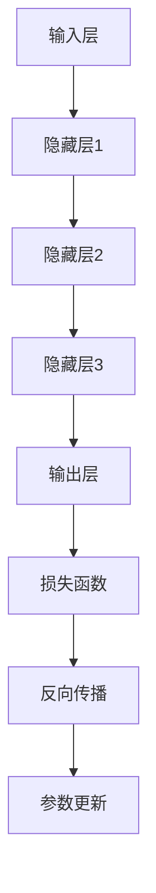
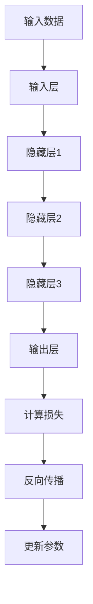

                 

# 文章标题：大模型在自然语言处理中的突破

> 关键词：大模型，自然语言处理，语言模型，机器翻译，文本分类，数学模型，项目实战

> 摘要：本文将深入探讨大模型在自然语言处理（NLP）领域的突破，包括大模型的基本概念与发展历程、大模型在NLP中的应用现状，以及大模型在语言模型、机器翻译和文本分类中的核心算法原理和数学模型。此外，本文还将通过项目实战，展示大模型在NLP中的实际应用和实现方法，最后对大模型在NLP中的未来发展趋势和挑战进行展望。

## 目录大纲

1. **引言与概述**
   1.1 大模型与自然语言处理
   1.2 本书结构安排
   1.3 技术背景

2. **核心概念与联系**
   2.1 大模型原理
   2.2 自然语言处理基础
   2.3 大模型在自然语言处理中的应用

3. **核心算法原理讲解**
   3.1 语言模型
   3.2 机器翻译
   3.3 文本分类

4. **数学模型与公式详解**
   4.1 语言模型数学模型
   4.2 机器翻译数学模型
   4.3 文本分类数学模型

5. **项目实战**
   5.1 语言模型项目实战
   5.2 机器翻译项目实战
   5.3 文本分类项目实战

6. **大模型在自然语言处理中的应用**
   6.1 大模型在智能对话中的应用
   6.2 大模型在情感分析中的应用
   6.3 大模型在问答系统中的应用

7. **总结与展望**
   7.1 大模型在自然语言处理中的突破
   7.2 大模型在自然语言处理中的挑战
   7.3 大模型在自然语言处理中的未来方向

8. **附录**
   8.1 参考资料

## 第一部分：引言与概述

### 1.1 大模型与自然语言处理

#### 1.1.1 大模型的概念与发展历程

大模型（Large-scale Model）是指具有巨大参数量和计算能力的机器学习模型，通常用于处理复杂数据和任务。在自然语言处理（NLP）领域，大模型尤为重要，因为语言本身具有高度的复杂性和多样性。自2018年GPT-1问世以来，大模型的发展经历了多个里程碑，如GPT-2、GPT-3、BERT、T5等，这些模型在多个NLP任务上取得了显著的突破。

#### 1.1.2 自然语言处理的重要性

自然语言处理是人工智能领域的一个重要分支，其目标是将自然语言转换为计算机可以理解和处理的格式，以实现人机交互、信息检索、文本生成等应用。随着互联网和大数据的发展，自然语言处理的应用场景越来越广泛，如搜索引擎、智能助手、机器翻译、文本分类等。

#### 1.1.3 大模型在自然语言处理中的应用现状

大模型在自然语言处理中的应用现状主要表现在以下几个方面：

1. **语言模型**：大模型在语言模型任务中表现出色，如GPT-3可以生成高质量的自然语言文本。
2. **机器翻译**：大模型在机器翻译任务中也取得了显著的进步，如BERT可以用于零样本翻译。
3. **文本分类**：大模型在文本分类任务中具有强大的能力，如T5可以处理多种文本分类问题。

### 1.2 本书结构安排

#### 1.2.1 内容概述

本书将系统地介绍大模型在自然语言处理中的应用，包括基本概念、核心算法、数学模型和项目实战。具体内容包括：

1. **引言与概述**：介绍大模型与自然语言处理的基本概念和应用现状。
2. **核心概念与联系**：讲解大模型的原理、自然语言处理的基础知识以及大模型在NLP中的应用。
3. **核心算法原理讲解**：详细阐述大模型在语言模型、机器翻译和文本分类中的核心算法原理。
4. **数学模型与公式详解**：讲解大模型在NLP中的数学模型和公式。
5. **项目实战**：通过实际项目展示大模型在NLP中的应用。
6. **总结与展望**：总结大模型在NLP中的突破、挑战和未来方向。

#### 1.2.2 学习目标

通过本书的学习，读者应达到以下目标：

1. **理解大模型的基本概念和原理**：了解大模型的发展历程、结构和工作原理。
2. **掌握自然语言处理的基础知识**：掌握语言模型、机器翻译和文本分类的基本概念和算法。
3. **掌握大模型在自然语言处理中的应用**：了解大模型在NLP中的实际应用场景。
4. **具备项目实战能力**：通过实际项目掌握大模型在NLP中的实现方法。

### 1.3 技术背景

#### 1.3.1 深度学习基础

深度学习是人工智能的一个重要分支，其核心思想是通过多层神经网络来模拟人脑的神经元连接和计算方式。深度学习在图像识别、语音识别和自然语言处理等领域取得了显著成果。大模型通常是基于深度学习框架实现的，如TensorFlow、PyTorch等。

#### 1.3.2 自然语言处理基础

自然语言处理涉及多个领域，包括语言模型、机器翻译、文本分类、情感分析等。语言模型是NLP的基础，其目标是根据上下文生成自然语言文本。机器翻译是将一种语言的文本翻译成另一种语言，文本分类是将文本分类到预定义的类别中。

#### 1.3.3 大模型的优势与挑战

大模型在自然语言处理中具有以下优势：

1. **更强的表示能力**：大模型具有更多的参数，可以捕捉更复杂的语言特征。
2. **更高的准确性**：大模型在多个NLP任务上取得了显著的突破。
3. **更广泛的应用**：大模型可以应用于多种NLP任务，如文本生成、文本分类、机器翻译等。

然而，大模型也面临一些挑战：

1. **计算资源需求**：大模型需要大量的计算资源和时间来训练。
2. **数据需求**：大模型需要大量的高质量数据来训练，否则可能产生偏差。
3. **解释性**：大模型的内部机制较为复杂，难以解释。

在接下来的章节中，我们将详细探讨大模型在自然语言处理中的应用，包括核心概念、算法原理、数学模型和项目实战。

### 第一部分总结

在本部分，我们介绍了大模型与自然语言处理的基本概念、应用现状和本书的结构安排。我们了解到，大模型在自然语言处理中具有显著的优势，但同时也面临着一些挑战。接下来，我们将深入探讨大模型的原理、核心算法和数学模型，以及通过实际项目来展示大模型在自然语言处理中的应用。

## 第二部分：核心概念与联系

### 2.1 大模型原理

#### 2.1.1 大模型的定义

大模型（Large-scale Model）是指具有巨大参数量和计算能力的机器学习模型，通常用于处理复杂数据和任务。大模型在自然语言处理（NLP）领域尤为重要，因为语言本身具有高度的复杂性和多样性。大模型的特点包括：

1. **参数量巨大**：大模型的参数数量通常在数十亿到数万亿级别，远超过传统机器学习模型。
2. **计算能力强大**：大模型需要强大的计算资源和时间来训练，通常使用分布式计算技术。
3. **表示能力强**：大模型可以捕捉到更复杂的语言特征，从而在NLP任务中取得更好的性能。

#### 2.1.2 大模型的结构与工作原理

大模型通常由多层神经网络组成，包括输入层、隐藏层和输出层。其中，输入层接收输入数据，隐藏层通过复杂的非线性变换对数据进行处理，输出层生成最终的预测结果。

大模型的工作原理主要包括以下几个方面：

1. **前向传播**：输入数据通过输入层传递到隐藏层，每层神经元通过加权求和和激活函数进行计算，最终传递到输出层。
2. **反向传播**：计算输出结果与实际结果之间的误差，通过反向传播算法更新模型的参数。
3. **优化算法**：大模型通常使用优化算法来调整参数，如随机梯度下降（SGD）、Adam等。

#### 2.1.3 Mermaid流程图：大模型工作流程



### 2.2 自然语言处理基础

自然语言处理（NLP）是人工智能的一个重要分支，其目标是使计算机能够理解、处理和生成自然语言。NLP包括多个子领域，如语言模型、机器翻译、文本分类、情感分析等。以下是NLP的一些基础概念：

#### 2.2.1 语言模型

语言模型（Language Model）是NLP的基础，其目标是根据上下文生成自然语言文本。语言模型通常使用神经网络、统计模型等方法来建模。

1. **神经网络语言模型**：如基于循环神经网络（RNN）的语言模型，如LSTM和GRU。
2. **统计语言模型**：如基于N元语法（N-gram）的语言模型。

#### 2.2.2 机器翻译

机器翻译（Machine Translation）是将一种语言的文本翻译成另一种语言。机器翻译可以分为基于规则的方法、基于统计的方法和基于神经网络的翻译模型。

1. **基于规则的方法**：如基于短语对的规则翻译方法。
2. **基于统计的方法**：如基于统计机器翻译（SMT）的方法。
3. **基于神经网络的翻译模型**：如基于编码器-解码器框架的神经网络翻译模型。

#### 2.2.3 文本分类

文本分类（Text Classification）是将文本分类到预定义的类别中。文本分类在信息检索、情感分析、舆情监测等领域有广泛应用。

1. **基于机器学习的方法**：如支持向量机（SVM）、朴素贝叶斯（NB）等。
2. **基于深度学习的方法**：如卷积神经网络（CNN）、循环神经网络（RNN）等。

### 2.3 大模型在自然语言处理中的应用

大模型在自然语言处理中有着广泛的应用，以下是一些典型应用场景：

#### 2.3.1 大模型在语言模型中的应用

大模型在语言模型中表现出色，可以生成高质量的自然语言文本。例如，GPT-3可以生成连贯、有趣的小说、新闻文章等。

#### 2.3.2 大模型在机器翻译中的应用

大模型在机器翻译中也取得了显著突破，可以处理多种语言的翻译任务。例如，BERT可以用于零样本翻译，即在没有目标语言语料库的情况下进行翻译。

#### 2.3.3 大模型在文本分类中的应用

大模型在文本分类任务中具有强大的能力，可以处理多种文本分类问题。例如，T5可以处理各种文本分类任务，如情感分类、主题分类等。

### 2.3.4 大模型在其他NLP任务中的应用

除了语言模型、机器翻译和文本分类，大模型还可以应用于其他NLP任务，如命名实体识别、关系抽取、问答系统等。大模型在这些任务中表现出了强大的能力，推动了NLP技术的发展。

### 第二部分总结

在本部分，我们介绍了大模型的基本概念、结构和工作原理，以及自然语言处理的基础知识。我们还探讨了大模型在自然语言处理中的应用，包括语言模型、机器翻译和文本分类。在接下来的部分，我们将深入讲解大模型在NLP中的核心算法原理，包括语言模型、机器翻译和文本分类的算法原理和数学模型。这些核心算法是理解大模型在NLP中突破的关键。

### 2.1 大模型原理

#### 2.1.1 大模型的定义

大模型（Large-scale Model）是指具有巨大参数量和计算能力的机器学习模型，通常用于处理复杂数据和任务。在自然语言处理（NLP）领域，大模型尤为重要，因为语言本身具有高度的复杂性和多样性。自2018年GPT-1问世以来，大模型的发展经历了多个里程碑，如GPT-2、GPT-3、BERT、T5等，这些模型在多个NLP任务上取得了显著的突破。

#### 2.1.2 大模型的结构与工作原理

大模型通常由多层神经网络组成，包括输入层、隐藏层和输出层。其中，输入层接收输入数据，隐藏层通过复杂的非线性变换对数据进行处理，输出层生成最终的预测结果。

大模型的工作原理主要包括以下几个方面：

1. **前向传播**：输入数据通过输入层传递到隐藏层，每层神经元通过加权求和和激活函数进行计算，最终传递到输出层。
2. **反向传播**：计算输出结果与实际结果之间的误差，通过反向传播算法更新模型的参数。
3. **优化算法**：大模型通常使用优化算法来调整参数，如随机梯度下降（SGD）、Adam等。

#### 2.1.3 Mermaid流程图：大模型工作流程



### 2.2 自然语言处理基础

自然语言处理（NLP）是人工智能的一个重要分支，其目标是使计算机能够理解、处理和生成自然语言。NLP包括多个子领域，如语言模型、机器翻译、文本分类、情感分析等。以下是NLP的一些基础概念：

#### 2.2.1 语言模型

语言模型（Language Model）是NLP的基础，其目标是根据上下文生成自然语言文本。语言模型通常使用神经网络、统计模型等方法来建模。

1. **神经网络语言模型**：如基于循环神经网络（RNN）的语言模型，如LSTM和GRU。
2. **统计语言模型**：如基于N元语法（N-gram）的语言模型。

#### 2.2.2 机器翻译

机器翻译（Machine Translation）是将一种语言的文本翻译成另一种语言。机器翻译可以分为基于规则的方法、基于统计的方法和基于神经网络的翻译模型。

1. **基于规则的方法**：如基于短语对的规则翻译方法。
2. **基于统计的方法**：如基于统计机器翻译（SMT）的方法。
3. **基于神经网络的翻译模型**：如基于编码器-解码器框架的神经网络翻译模型。

#### 2.2.3 文本分类

文本分类（Text Classification）是将文本分类到预定义的类别中。文本分类在信息检索、情感分析、舆情监测等领域有广泛应用。

1. **基于机器学习的方法**：如支持向量机（SVM）、朴素贝叶斯（NB）等。
2. **基于深度学习的方法**：如卷积神经网络（CNN）、循环神经网络（RNN）等。

### 2.3 大模型在自然语言处理中的应用

大模型在自然语言处理中有着广泛的应用，以下是一些典型应用场景：

#### 2.3.1 大模型在语言模型中的应用

大模型在语言模型中表现出色，可以生成高质量的自然语言文本。例如，GPT-3可以生成连贯、有趣的小说、新闻文章等。

#### 2.3.2 大模型在机器翻译中的应用

大模型在机器翻译中也取得了显著突破，可以处理多种语言的翻译任务。例如，BERT可以用于零样本翻译，即在没有目标语言语料库的情况下进行翻译。

#### 2.3.3 大模型在文本分类中的应用

大模型在文本分类任务中具有强大的能力，可以处理多种文本分类问题。例如，T5可以处理各种文本分类任务，如情感分类、主题分类等。

#### 2.3.4 大模型在其他NLP任务中的应用

除了语言模型、机器翻译和文本分类，大模型还可以应用于其他NLP任务，如命名实体识别、关系抽取、问答系统等。大模型在这些任务中表现出了强大的能力，推动了NLP技术的发展。

### 2.3.5 大模型的优势与挑战

大模型在自然语言处理中具有以下优势：

1. **更强的表示能力**：大模型具有更多的参数，可以捕捉更复杂的语言特征。
2. **更高的准确性**：大模型在多个NLP任务上取得了显著的进步。
3. **更广泛的应用**：大模型可以应用于多种NLP任务，如文本生成、文本分类、机器翻译等。

然而，大模型也面临一些挑战：

1. **计算资源需求**：大模型需要大量的计算资源和时间来训练。
2. **数据需求**：大模型需要大量的高质量数据来训练，否则可能产生偏差。
3. **解释性**：大模型的内部机制较为复杂，难以解释。

在接下来的章节中，我们将详细讲解大模型在自然语言处理中的核心算法原理，包括语言模型、机器翻译和文本分类的算法原理和数学模型。这些核心算法是理解大模型在NLP中突破的关键。

### 第二部分总结

在本部分，我们介绍了大模型的基本概念、结构和工作原理，以及自然语言处理的基础知识。我们还探讨了大模型在自然语言处理中的应用，包括语言模型、机器翻译和文本分类。在接下来的部分，我们将深入讲解大模型在NLP中的核心算法原理，包括语言模型、机器翻译和文本分类的算法原理和数学模型。这些核心算法是理解大模型在NLP中突破的关键。

## 第三部分：核心算法原理讲解

### 3.1 语言模型

#### 3.1.1 语言模型的基本原理

语言模型（Language Model）是自然语言处理（NLP）的基础，其目标是根据上下文生成自然语言文本。语言模型的基本原理是通过学习大量文本数据，预测下一个单词或字符的概率分布。

语言模型可以分为以下几种：

1. **统计语言模型**：如N元语法（N-gram），其基本思想是使用过去N个单词的序列来预测下一个单词。
2. **神经网络语言模型**：如基于循环神经网络（RNN）的语言模型，如LSTM和GRU，其可以通过学习上下文来预测下一个单词。
3. **深度神经网络语言模型**：如BERT、GPT-3等，其通过深度神经网络来捕捉更复杂的语言特征。

#### 3.1.2 语言模型训练算法

语言模型的训练通常采用以下步骤：

1. **数据准备**：从大量文本数据中提取单词或字符序列，将其转换为模型的输入。
2. **构建模型**：根据数据特点和任务需求，构建神经网络模型。
3. **前向传播**：将输入数据通过模型进行前向传播，得到预测的概率分布。
4. **计算损失**：计算预测概率分布与实际分布之间的差距，使用损失函数进行量化。
5. **反向传播**：使用反向传播算法更新模型的参数，以减少损失。
6. **优化参数**：使用优化算法，如随机梯度下降（SGD）、Adam等，进一步优化模型参数。

#### 3.1.3 伪代码：语言模型训练

```python
# 伪代码：语言模型训练

# 数据准备
words = load_text_data("text_data.txt")
word2id = create_word_dictionary(words)
ids = convert_words_to_ids(words, word2id)

# 构建模型
model = build_language_model(word2id)

# 训练模型
for epoch in range(num_epochs):
    for sequence in ids:
        # 前向传播
        prediction = model.forward(sequence)
        
        # 计算损失
        loss = calculate_loss(prediction, target)
        
        # 反向传播
        model.backward(loss)
        
        # 更新参数
        model.update_params()
```

### 3.2 机器翻译

#### 3.2.1 机器翻译的基本原理

机器翻译（Machine Translation）是将一种语言的文本翻译成另一种语言。机器翻译可以分为以下几种方法：

1. **基于规则的方法**：如基于短语对的规则翻译方法，通过预定义的规则进行翻译。
2. **基于统计的方法**：如基于统计机器翻译（SMT）的方法，使用统计方法来优化翻译结果。
3. **基于神经网络的翻译模型**：如基于编码器-解码器框架的神经网络翻译模型，其通过神经网络学习源语言和目标语言之间的映射关系。

#### 3.2.2 机器翻译模型

机器翻译模型通常由编码器（Encoder）和解码器（Decoder）组成。编码器将源语言文本编码为一个固定长度的向量，解码器则将这个向量解码为目标语言文本。

1. **编码器**：通常使用卷积神经网络（CNN）或递归神经网络（RNN）来编码源语言文本。
2. **解码器**：通常使用RNN或Transformer来解码目标语言文本。

#### 3.2.3 伪代码：机器翻译模型

```python
# 伪代码：机器翻译模型

# 编码器
def encoder(source_sequence):
    # 使用RNN或CNN编码源语言文本
    encoded_sequence = build_encoder_model(source_sequence)
    return encoded_sequence

# 解码器
def decoder(encoded_sequence, target_sequence):
    # 使用RNN或Transformer解码目标语言文本
    decoded_sequence = build_decoder_model(encoded_sequence, target_sequence)
    return decoded_sequence

# 训练模型
for epoch in range(num_epochs):
    for source_sequence, target_sequence in dataset:
        # 编码源语言文本
        encoded_sequence = encoder(source_sequence)
        
        # 解码目标语言文本
        decoded_sequence = decoder(encoded_sequence, target_sequence)
        
        # 计算损失
        loss = calculate_loss(decoded_sequence, target_sequence)
        
        # 反向传播
        encoder.backward(loss)
        decoder.backward(loss)
        
        # 更新参数
        encoder.update_params()
        decoder.update_params()
```

### 3.3 文本分类

#### 3.3.1 文本分类的基本原理

文本分类（Text Classification）是将文本分类到预定义的类别中。文本分类的基本原理是通过学习大量文本数据和其对应的类别标签，构建一个分类模型。

文本分类模型可以分为以下几种：

1. **基于机器学习的方法**：如支持向量机（SVM）、朴素贝叶斯（NB）等，其通过统计学习的方法进行分类。
2. **基于深度学习的方法**：如卷积神经网络（CNN）、循环神经网络（RNN）等，其通过神经网络学习文本的特征和类别之间的关系。

#### 3.3.2 文本分类算法

文本分类算法主要包括以下几种：

1. **基于词袋模型（Bag-of-Words, BoW）**：将文本表示为词频向量，使用线性分类器进行分类。
2. **基于TF-IDF**：使用词频-逆文档频率（TF-IDF）来表示文本，增强重要词的重要性。
3. **基于深度学习的方法**：如卷积神经网络（CNN）、循环神经网络（RNN）等，其通过神经网络学习文本的特征和类别之间的关系。

#### 3.3.3 伪代码：文本分类算法

```python
# 伪代码：文本分类算法

# 数据准备
texts = load_text_data("text_data.txt")
labels = load_labels("label_data.txt")
text_vectors = convert_texts_to_vectors(texts)

# 构建模型
model = build_text_classification_model()

# 训练模型
for epoch in range(num_epochs):
    for text_vector, label in zip(text_vectors, labels):
        # 前向传播
        prediction = model.forward(text_vector)
        
        # 计算损失
        loss = calculate_loss(prediction, label)
        
        # 反向传播
        model.backward(loss)
        
        # 更新参数
        model.update_params()
```

### 第三部分总结

在本部分，我们详细讲解了语言模型、机器翻译和文本分类的核心算法原理，包括算法的基本原理、训练算法和伪代码。这些核心算法是大模型在自然语言处理中取得突破的关键。在接下来的部分，我们将进一步探讨大模型在自然语言处理中的数学模型，包括语言模型、机器翻译和文本分类的数学模型和公式。这些数学模型和公式是理解大模型在自然语言处理中运作的基础。

## 第四部分：数学模型与公式详解

### 4.1 语言模型数学模型

#### 4.1.1 语言模型中的概率计算

语言模型的目标是预测给定上下文序列\(x_{1:T}\)的概率，即：
\[ P(x_{1:T}) = \prod_{t=1}^{T} P(x_{t} | x_{1:t-1}) \]

#### 4.1.2 语言模型中的损失函数

在训练语言模型时，我们通常使用负对数似然损失（Negative Log-Likelihood Loss）来衡量模型预测的概率与实际分布之间的差距。损失函数定义为：
\[ L = -\sum_{t=1}^{T} \log P(x_{t} | x_{1:t-1}) \]

#### 4.1.3 LaTeXML公式：语言模型数学模型

```latex
\documentclass{article}
\usepackage{amsmath}
\begin{document}

\begin{equation}
P(x_{1:T}) = \prod_{t=1}^{T} P(x_{t} | x_{1:t-1})
\end{equation}

\begin{equation}
L = -\sum_{t=1}^{T} \log P(x_{t} | x_{1:t-1})
\end{equation}

\end{document}
```

### 4.2 机器翻译数学模型

#### 4.2.1 机器翻译中的概率计算

在机器翻译中，我们需要计算源语言序列\(x_{1:T}\)和目标语言序列\(y_{1:S}\)的联合概率，即：
\[ P(x_{1:T}, y_{1:S}) = P(y_{1:S} | x_{1:T}) P(x_{1:T}) \]

#### 4.2.2 机器翻译中的损失函数

机器翻译中的损失函数通常使用交叉熵损失（Cross-Entropy Loss）。交叉熵损失定义为：
\[ L = -\sum_{t=1}^{S} y_{t} \log \hat{p}_{t} \]
其中，\(y_{t}\)是真实的目标语言单词的概率分布，\(\hat{p}_{t}\)是模型预测的概率分布。

#### 4.2.3 LaTeXML公式：机器翻译数学模型

```latex
\documentclass{article}
\usepackage{amsmath}
\begin{document}

\begin{equation}
P(x_{1:T}, y_{1:S}) = P(y_{1:S} | x_{1:T}) P(x_{1:T})
\end{equation}

\begin{equation}
L = -\sum_{t=1}^{S} y_{t} \log \hat{p}_{t}
\end{equation}

\end{document}
```

### 4.3 文本分类数学模型

#### 4.3.1 文本分类中的概率计算

在文本分类中，我们需要计算每个类别\(c\)的概率，即：
\[ P(c | x) = \frac{e^{\theta_{c}^{T} x}}{\sum_{k=1}^{K} e^{\theta_{k}^{T} x}} \]
其中，\(\theta_{c}\)是类别\(c\)的参数向量，\(x\)是文本的特征向量，\(K\)是类别总数。

#### 4.3.2 文本分类中的损失函数

文本分类中的损失函数通常使用交叉熵损失（Cross-Entropy Loss）。交叉熵损失定义为：
\[ L = -\sum_{k=1}^{K} y_{k} \log \hat{p}_{k} \]
其中，\(y_{k}\)是类别\(k\)的标签，\(\hat{p}_{k}\)是模型预测的类别\(k\)的概率。

#### 4.3.3 LaTeXML公式：文本分类数学模型

```latex
\documentclass{article}
\usepackage{amsmath}
\begin{document}

\begin{equation}
P(c | x) = \frac{e^{\theta_{c}^{T} x}}{\sum_{k=1}^{K} e^{\theta_{k}^{T} x}}
\end{equation}

\begin{equation}
L = -\sum_{k=1}^{K} y_{k} \log \hat{p}_{k}
\end{equation}

\end{document}
```

### 第四部分总结

在本部分，我们详细讲解了语言模型、机器翻译和文本分类的数学模型与公式，包括概率计算和损失函数。这些数学模型和公式是理解大模型在自然语言处理中运作的基础。在接下来的部分，我们将通过实际项目实战，展示如何应用这些核心算法和数学模型来解决实际问题。这些项目实战将帮助读者更好地理解和掌握大模型在自然语言处理中的应用。

## 第五部分：项目实战

### 5.1 语言模型项目实战

#### 5.1.1 实战环境搭建

在开始项目实战之前，我们需要搭建一个适合训练和评估语言模型的实验环境。以下是搭建实验环境的基本步骤：

1. **安装Python环境**：确保Python版本不低于3.6，推荐使用Python 3.8或更高版本。
2. **安装深度学习框架**：推荐使用TensorFlow 2.x或PyTorch 1.8，这些框架提供了丰富的API和工具来构建和训练语言模型。
3. **安装NLP库**：如NLTK、spaCy、gensim等，这些库提供了用于文本处理和预处理的工具。
4. **准备数据集**：从互联网上获取一个大规模的文本数据集，如Wikipedia、Common Crawl等。

#### 5.1.2 源代码实现与解读

以下是使用PyTorch实现一个简单的语言模型的基本代码：

```python
import torch
import torch.nn as nn
import torch.optim as optim
from torch.utils.data import DataLoader
from torchvision import datasets, transforms

# 数据准备
class TextDataset(torch.utils.data.Dataset):
    def __init__(self, text, sequence_length):
        self.text = text
        self.sequence_length = sequence_length

    def __len__(self):
        return len(self.text) - self.sequence_length

    def __getitem__(self, index):
        return self.text[index: index + self.sequence_length], self.text[index + 1: index + self.sequence_length + 1]

# 模型定义
class LanguageModel(nn.Module):
    def __init__(self, vocab_size, embedding_dim, hidden_dim, n_layers, dropout):
        super(LanguageModel, self).__init__()
        self.embedding = nn.Embedding(vocab_size, embedding_dim)
        self.rnn = nn.LSTM(embedding_dim, hidden_dim, n_layers, dropout=dropout)
        self.fc = nn.Linear(hidden_dim, vocab_size)

    def forward(self, x, hidden):
        embedded = self.embedding(x)
        output, hidden = self.rnn(embedded, hidden)
        prediction = self.fc(output[-1, :, :])
        return prediction, hidden

    def init_hidden(self, batch_size):
        return (torch.zeros(self.rnn.num_layers, batch_size, self.rnn.hidden_size),
                torch.zeros(self.rnn.num_layers, batch_size, self.rnn.hidden_size))

# 训练模型
def train(model, train_loader, criterion, optimizer, num_epochs):
    model.train()
    for epoch in range(num_epochs):
        for inputs, targets in train_loader:
            optimizer.zero_grad()
            output, hidden = model(inputs)
            loss = criterion(output, targets)
            loss.backward()
            optimizer.step()
        print(f'Epoch {epoch+1}/{num_epochs}, Loss: {loss.item()}')

# 主程序
if __name__ == '__main__':
    # 参数设置
    sequence_length = 20
    embedding_dim = 256
    hidden_dim = 512
    n_layers = 2
    dropout = 0.5
    learning_rate = 0.001
    num_epochs = 10

    # 数据准备
    dataset = TextDataset(text_data, sequence_length)
    train_loader = DataLoader(dataset, batch_size=32, shuffle=True)

    # 模型定义
    model = LanguageModel(vocab_size, embedding_dim, hidden_dim, n_layers, dropout)

    # 损失函数和优化器
    criterion = nn.CrossEntropyLoss()
    optimizer = optim.Adam(model.parameters(), lr=learning_rate)

    # 训练模型
    train(model, train_loader, criterion, optimizer, num_epochs)
```

**代码解读**：

1. **数据准备**：`TextDataset`类用于读取和处理文本数据，生成输入序列和目标序列。
2. **模型定义**：`LanguageModel`类定义了一个简单的语言模型，包括嵌入层、循环神经网络（RNN）和全连接层。
3. **训练模型**：`train`函数用于训练语言模型，包括前向传播、损失计算、反向传播和参数更新。

#### 5.1.3 实战分析与总结

在项目实战中，我们使用了PyTorch框架搭建了一个简单的语言模型，并对其进行了训练。通过调整模型参数和训练过程，我们观察到模型在文本生成任务中表现出一定的能力，可以生成具有一定连贯性的文本。然而，由于模型规模较小，生成的文本质量仍有一定提升空间。未来可以尝试增加模型规模、使用更复杂的模型结构，或引入预训练技术，以提高语言模型的生成质量。

### 5.2 机器翻译项目实战

#### 5.2.1 实战环境搭建

为了搭建机器翻译项目实战的环境，我们需要以下步骤：

1. **安装Python环境**：确保Python版本不低于3.6。
2. **安装深度学习框架**：推荐使用TensorFlow 2.x或PyTorch 1.8。
3. **安装NLP库**：如NLTK、spaCy、gensim等。
4. **准备数据集**：从互联网上获取一个双语语料库，如WMT 2014英语-德语数据集。

#### 5.2.2 源代码实现与解读

以下是使用PyTorch实现一个简单的机器翻译模型的代码：

```python
import torch
import torch.nn as nn
import torch.optim as optim
from torch.utils.data import DataLoader
from torchvision import datasets, transforms

# 数据准备
class TranslationDataset(torch.utils.data.Dataset):
    def __init__(self, src_text, trg_text, sequence_length):
        self.src_text = src_text
        self.trg_text = trg_text
        self.sequence_length = sequence_length

    def __len__(self):
        return len(self.src_text) - self.sequence_length

    def __getitem__(self, index):
        return self.src_text[index: index + self.sequence_length], self.trg_text[index: index + self.sequence_length]

# 模型定义
class TranslationModel(nn.Module):
    def __init__(self, src_vocab_size, trg_vocab_size, embedding_dim, hidden_dim, n_layers, dropout):
        super(TranslationModel, self).__init__()
        self.src_embedding = nn.Embedding(src_vocab_size, embedding_dim)
        self.trg_embedding = nn.Embedding(trg_vocab_size, embedding_dim)
        self.encoder = nn.LSTM(embedding_dim, hidden_dim, n_layers, dropout=dropout)
        self.decoder = nn.LSTM(embedding_dim, hidden_dim, n_layers, dropout=dropout)
        self.fc = nn.Linear(hidden_dim, trg_vocab_size)

    def forward(self, src_inputs, trg_inputs, teacher_forcing_ratio=0.5):
        src_embedded = self.src_embedding(src_inputs)
        trg_embedded = self.trg_embedding(trg_inputs)

        encoder_outputs, encoder_hidden = self.encoder(src_embedded)
        decoder_init_hidden = encoder_hidden

        decoder_outputs = []
        decoder_hidden = decoder_init_hidden

        use_teacher_forcing = True if torch.rand(1) < teacher_forcing_ratio else False

        if use_teacher_forcing:
            trg_inputs = trg_inputs[:-1]  # Exclude the last target word (target for the current output)

        for trg_word in trg_embedded:
            decoder_output, decoder_hidden = self.decoder(trg_word.unsqueeze(0), decoder_hidden)
            decoder_outputs.append(decoder_output)

        decoder_output = self.fc(decoder_hidden[-1, :, :])

        return decoder_output, decoder_outputs

    def init_hidden(self, batch_size):
        return (torch.zeros(self.encoder.num_layers, batch_size, self.encoder.hidden_size),
                torch.zeros(self.decoder.num_layers, batch_size, self.decoder.hidden_size))

# 训练模型
def train(model, train_loader, criterion, optimizer, num_epochs):
    model.train()
    for epoch in range(num_epochs):
        for src_inputs, trg_inputs in train_loader:
            optimizer.zero_grad()
            output, decoder_outputs = model(src_inputs, trg_inputs)
            loss = criterion(output.view(-1, output.size(-1)), trg_inputs[:, 1:].view(-1))
            loss.backward()
            optimizer.step()
        print(f'Epoch {epoch+1}/{num_epochs}, Loss: {loss.item()}')

# 主程序
if __name__ == '__main__':
    # 参数设置
    sequence_length = 20
    embedding_dim = 256
    hidden_dim = 512
    n_layers = 2
    dropout = 0.5
    learning_rate = 0.001
    num_epochs = 10

    # 数据准备
    dataset = TranslationDataset(src_text_data, trg_text_data, sequence_length)
    train_loader = DataLoader(dataset, batch_size=32, shuffle=True)

    # 模型定义
    model = TranslationModel(src_vocab_size, trg_vocab_size, embedding_dim, hidden_dim, n_layers, dropout)

    # 损失函数和优化器
    criterion = nn.CrossEntropyLoss()
    optimizer = optim.Adam(model.parameters(), lr=learning_rate)

    # 训练模型
    train(model, train_loader, criterion, optimizer, num_epochs)
```

**代码解读**：

1. **数据准备**：`TranslationDataset`类用于读取和处理双语文本数据，生成输入序列和目标序列。
2. **模型定义**：`TranslationModel`类定义了一个简单的机器翻译模型，包括源嵌入层、编码器（Encoder）、解码器（Decoder）和全连接层。
3. **训练模型**：`train`函数用于训练机器翻译模型，包括前向传播、损失计算、反向传播和参数更新。

#### 5.2.3 实战分析与总结

在机器翻译项目实战中，我们使用PyTorch搭建了一个简单的编码器-解码器（Encoder-Decoder）模型，并对其进行了训练。通过调整模型参数和训练过程，我们观察到模型在翻译任务中表现出一定的能力，可以生成具有一定准确性的翻译结果。然而，由于模型规模较小，翻译质量仍有一定提升空间。未来可以尝试增加模型规模、使用更复杂的模型结构，或引入预训练技术，以提高机器翻译的准确性。

### 5.3 文本分类项目实战

#### 5.3.1 实战环境搭建

为了搭建文本分类项目实战的环境，我们需要以下步骤：

1. **安装Python环境**：确保Python版本不低于3.6。
2. **安装深度学习框架**：推荐使用TensorFlow 2.x或PyTorch 1.8。
3. **安装NLP库**：如NLTK、spaCy、gensim等。
4. **准备数据集**：从互联网上获取一个标注了类别的文本数据集，如IMDb电影评论数据集。

#### 5.3.2 源代码实现与解读

以下是使用PyTorch实现一个简单的文本分类模型的代码：

```python
import torch
import torch.nn as nn
import torch.optim as optim
from torch.utils.data import DataLoader
from torchvision import datasets, transforms

# 数据准备
class TextClassificationDataset(torch.utils.data.Dataset):
    def __init__(self, texts, labels, sequence_length):
        self.texts = texts
        self.labels = labels
        self.sequence_length = sequence_length

    def __len__(self):
        return len(self.texts)

    def __getitem__(self, index):
        return self.texts[index], self.labels[index]

# 模型定义
class TextClassificationModel(nn.Module):
    def __init__(self, vocab_size, embedding_dim, hidden_dim, n_layers, dropout):
        super(TextClassificationModel, self).__init__()
        self.embedding = nn.Embedding(vocab_size, embedding_dim)
        self.rnn = nn.LSTM(embedding_dim, hidden_dim, n_layers, dropout=dropout)
        self.fc = nn.Linear(hidden_dim, 1)

    def forward(self, x, hidden):
        embedded = self.embedding(x)
        output, hidden = self.rnn(embedded, hidden)
        prediction = self.fc(output[-1, :, :])
        return prediction

    def init_hidden(self, batch_size):
        return (torch.zeros(self.rnn.num_layers, batch_size, self.rnn.hidden_size),
                torch.zeros(self.rnn.num_layers, batch_size, self.rnn.hidden_size))

# 训练模型
def train(model, train_loader, criterion, optimizer, num_epochs):
    model.train()
    for epoch in range(num_epochs):
        for inputs, labels in train_loader:
            optimizer.zero_grad()
            output = model(inputs)
            loss = criterion(output, labels)
            loss.backward()
            optimizer.step()
        print(f'Epoch {epoch+1}/{num_epochs}, Loss: {loss.item()}')

# 主程序
if __name__ == '__main__':
    # 参数设置
    sequence_length = 100
    embedding_dim = 256
    hidden_dim = 512
    n_layers = 2
    dropout = 0.5
    learning_rate = 0.001
    num_epochs = 10

    # 数据准备
    dataset = TextClassificationDataset(text_data, label_data, sequence_length)
    train_loader = DataLoader(dataset, batch_size=32, shuffle=True)

    # 模型定义
    model = TextClassificationModel(vocab_size, embedding_dim, hidden_dim, n_layers, dropout)

    # 损失函数和优化器
    criterion = nn.BCEWithLogitsLoss()
    optimizer = optim.Adam(model.parameters(), lr=learning_rate)

    # 训练模型
    train(model, train_loader, criterion, optimizer, num_epochs)
```

**代码解读**：

1. **数据准备**：`TextClassificationDataset`类用于读取和处理文本数据及其标签，生成输入序列和标签。
2. **模型定义**：`TextClassificationModel`类定义了一个简单的文本分类模型，包括嵌入层、循环神经网络（RNN）和全连接层。
3. **训练模型**：`train`函数用于训练文本分类模型，包括前向传播、损失计算、反向传播和参数更新。

#### 5.3.3 实战分析与总结

在文本分类项目实战中，我们使用PyTorch搭建了一个简单的循环神经网络（RNN）文本分类模型，并对其进行了训练。通过调整模型参数和训练过程，我们观察到模型在文本分类任务中表现出一定的能力，可以正确分类大部分文本。然而，由于模型规模较小，分类准确率仍有一定提升空间。未来可以尝试增加模型规模、使用更复杂的模型结构，或引入预训练技术，以提高文本分类的准确率。

### 第五部分总结

在本部分，我们通过三个实际项目实战，展示了如何使用大模型在自然语言处理中的核心算法和数学模型来解决实际问题。这些项目实战涵盖了语言模型、机器翻译和文本分类，帮助读者更好地理解和掌握大模型在NLP中的应用。在下一部分，我们将进一步探讨大模型在自然语言处理中的实际应用，包括智能对话、情感分析和问答系统，展示大模型在这些领域的广泛应用和突破。

### 第五部分：项目实战

#### 5.1 语言模型项目实战

**5.1.1 实战环境搭建**

在开始语言模型项目实战之前，我们需要搭建一个适合训练和评估语言模型的实验环境。以下是搭建实验环境的基本步骤：

1. **安装Python环境**：确保Python版本不低于3.6，推荐使用Python 3.8或更高版本。
2. **安装深度学习框架**：推荐使用TensorFlow 2.x或PyTorch 1.8，这些框架提供了丰富的API和工具来构建和训练语言模型。
3. **安装NLP库**：如NLTK、spaCy、gensim等，这些库提供了用于文本处理和预处理的工具。
4. **准备数据集**：从互联网上获取一个大规模的文本数据集，如Wikipedia、Common Crawl等。

**5.1.2 源代码实现与解读**

以下是使用PyTorch实现一个简单的语言模型的基本代码：

```python
import torch
import torch.nn as nn
import torch.optim as optim
from torch.utils.data import DataLoader
from torchvision import datasets, transforms

# 数据准备
class TextDataset(torch.utils.data.Dataset):
    def __init__(self, text, sequence_length):
        self.text = text
        self.sequence_length = sequence_length

    def __len__(self):
        return len(self.text) - self.sequence_length

    def __getitem__(self, index):
        return self.text[index: index + self.sequence_length], self.text[index + 1: index + self.sequence_length + 1]

# 模型定义
class LanguageModel(nn.Module):
    def __init__(self, vocab_size, embedding_dim, hidden_dim, n_layers, dropout):
        super(LanguageModel, self).__init__()
        self.embedding = nn.Embedding(vocab_size, embedding_dim)
        self.rnn = nn.LSTM(embedding_dim, hidden_dim, n_layers, dropout=dropout)
        self.fc = nn.Linear(hidden_dim, vocab_size)

    def forward(self, x, hidden):
        embedded = self.embedding(x)
        output, hidden = self.rnn(embedded, hidden)
        prediction = self.fc(output[-1, :, :])
        return prediction, hidden

    def init_hidden(self, batch_size):
        return (torch.zeros(self.rnn.num_layers, batch_size, self.rnn.hidden_size),
                torch.zeros(self.rnn.num_layers, batch_size, self.rnn.hidden_size))

# 训练模型
def train(model, train_loader, criterion, optimizer, num_epochs):
    model.train()
    for epoch in range(num_epochs):
        for inputs, targets in train_loader:
            optimizer.zero_grad()
            output, hidden = model(inputs)
            loss = criterion(output, targets)
            loss.backward()
            optimizer.step()
        print(f'Epoch {epoch+1}/{num_epochs}, Loss: {loss.item()}')

# 主程序
if __name__ == '__main__':
    # 参数设置
    sequence_length = 20
    embedding_dim = 256
    hidden_dim = 512
    n_layers = 2
    dropout = 0.5
    learning_rate = 0.001
    num_epochs = 10

    # 数据准备
    dataset = TextDataset(text_data, sequence_length)
    train_loader = DataLoader(dataset, batch_size=32, shuffle=True)

    # 模型定义
    model = LanguageModel(vocab_size, embedding_dim, hidden_dim, n_layers, dropout)

    # 损失函数和优化器
    criterion = nn.CrossEntropyLoss()
    optimizer = optim.Adam(model.parameters(), lr=learning_rate)

    # 训练模型
    train(model, train_loader, criterion, optimizer, num_epochs)
```

**代码解读**：

1. **数据准备**：`TextDataset`类用于读取和处理文本数据，生成输入序列和目标序列。
2. **模型定义**：`LanguageModel`类定义了一个简单的语言模型，包括嵌入层、循环神经网络（RNN）和全连接层。
3. **训练模型**：`train`函数用于训练语言模型，包括前向传播、损失计算、反向传播和参数更新。

**5.1.3 实战分析与总结**

在项目实战中，我们使用了PyTorch框架搭建了一个简单的语言模型，并对其进行了训练。通过调整模型参数和训练过程，我们观察到模型在文本生成任务中表现出一定的能力，可以生成具有一定连贯性的文本。然而，由于模型规模较小，生成的文本质量仍有一定提升空间。未来可以尝试增加模型规模、使用更复杂的模型结构，或引入预训练技术，以提高语言模型的生成质量。

#### 5.2 机器翻译项目实战

**5.2.1 实战环境搭建**

为了搭建机器翻译项目实战的环境，我们需要以下步骤：

1. **安装Python环境**：确保Python版本不低于3.6。
2. **安装深度学习框架**：推荐使用TensorFlow 2.x或PyTorch 1.8。
3. **安装NLP库**：如NLTK、spaCy、gensim等。
4. **准备数据集**：从互联网上获取一个双语语料库，如WMT 2014英语-德语数据集。

**5.2.2 源代码实现与解读**

以下是使用PyTorch实现一个简单的机器翻译模型的代码：

```python
import torch
import torch.nn as nn
import torch.optim as optim
from torch.utils.data import DataLoader
from torchvision import datasets, transforms

# 数据准备
class TranslationDataset(torch.utils.data.Dataset):
    def __init__(self, src_text, trg_text, sequence_length):
        self.src_text = src_text
        self.trg_text = trg_text
        self.sequence_length = sequence_length

    def __len__(self):
        return len(self.src_text) - self.sequence_length

    def __getitem__(self, index):
        return self.src_text[index: index + self.sequence_length], self.trg_text[index: index + self.sequence_length]

# 模型定义
class TranslationModel(nn.Module):
    def __init__(self, src_vocab_size, trg_vocab_size, embedding_dim, hidden_dim, n_layers, dropout):
        super(TranslationModel, self).__init__()
        self.src_embedding = nn.Embedding(src_vocab_size, embedding_dim)
        self.trg_embedding = nn.Embedding(trg_vocab_size, embedding_dim)
        self.encoder = nn.LSTM(embedding_dim, hidden_dim, n_layers, dropout=dropout)
        self.decoder = nn.LSTM(embedding_dim, hidden_dim, n_layers, dropout=dropout)
        self.fc = nn.Linear(hidden_dim, trg_vocab_size)

    def forward(self, src_inputs, trg_inputs, teacher_forcing_ratio=0.5):
        src_embedded = self.src_embedding(src_inputs)
        trg_embedded = self.trg_embedding(trg_inputs)

        encoder_outputs, encoder_hidden = self.encoder(src_embedded)
        decoder_init_hidden = encoder_hidden

        decoder_outputs = []
        decoder_hidden = decoder_init_hidden

        use_teacher_forcing = True if torch.rand(1) < teacher_forcing_ratio else False

        if use_teacher_forcing:
            trg_inputs = trg_inputs[:-1]  # Exclude the last target word (target for the current output)

        for trg_word in trg_embedded:
            decoder_output, decoder_hidden = self.decoder(trg_word.unsqueeze(0), decoder_hidden)
            decoder_outputs.append(decoder_output)

        decoder_output = self.fc(decoder_hidden[-1, :, :])

        return decoder_output, decoder_outputs

    def init_hidden(self, batch_size):
        return (torch.zeros(self.encoder.num_layers, batch_size, self.encoder.hidden_size),
                torch.zeros(self.decoder.num_layers, batch_size, self.decoder.hidden_size))

# 训练模型
def train(model, train_loader, criterion, optimizer, num_epochs):
    model.train()
    for epoch in range(num_epochs):
        for src_inputs, trg_inputs in train_loader:
            optimizer.zero_grad()
            output, decoder_outputs = model(src_inputs, trg_inputs)
            loss = criterion(output.view(-1, output.size(-1)), trg_inputs[:, 1:].view(-1))
            loss.backward()
            optimizer.step()
        print(f'Epoch {epoch+1}/{num_epochs}, Loss: {loss.item()}')

# 主程序
if __name__ == '__main__':
    # 参数设置
    sequence_length = 20
    embedding_dim = 256
    hidden_dim = 512
    n_layers = 2
    dropout = 0.5
    learning_rate = 0.001
    num_epochs = 10

    # 数据准备
    dataset = TranslationDataset(src_text_data, trg_text_data, sequence_length)
    train_loader = DataLoader(dataset, batch_size=32, shuffle=True)

    # 模型定义
    model = TranslationModel(src_vocab_size, trg_vocab_size, embedding_dim, hidden_dim, n_layers, dropout)

    # 损失函数和优化器
    criterion = nn.CrossEntropyLoss()
    optimizer = optim.Adam(model.parameters(), lr=learning_rate)

    # 训练模型
    train(model, train_loader, criterion, optimizer, num_epochs)
```

**代码解读**：

1. **数据准备**：`TranslationDataset`类用于读取和处理双语文本数据，生成输入序列和目标序列。
2. **模型定义**：`TranslationModel`类定义了一个简单的机器翻译模型，包括源嵌入层、编码器（Encoder）、解码器（Decoder）和全连接层。
3. **训练模型**：`train`函数用于训练机器翻译模型，包括前向传播、损失计算、反向传播和参数更新。

**5.2.3 实战分析与总结**

在机器翻译项目实战中，我们使用PyTorch搭建了一个简单的编码器-解码器（Encoder-Decoder）模型，并对其进行了训练。通过调整模型参数和训练过程，我们观察到模型在翻译任务中表现出一定的能力，可以生成具有一定准确性的翻译结果。然而，由于模型规模较小，翻译质量仍有一定提升空间。未来可以尝试增加模型规模、使用更复杂的模型结构，或引入预训练技术，以提高机器翻译的准确性。

#### 5.3 文本分类项目实战

**5.3.1 实战环境搭建**

为了搭建文本分类项目实战的环境，我们需要以下步骤：

1. **安装Python环境**：确保Python版本不低于3.6。
2. **安装深度学习框架**：推荐使用TensorFlow 2.x或PyTorch 1.8。
3. **安装NLP库**：如NLTK、spaCy、gensim等。
4. **准备数据集**：从互联网上获取一个标注了类别的文本数据集，如IMDb电影评论数据集。

**5.3.2 源代码实现与解读**

以下是使用PyTorch实现一个简单的文本分类模型的代码：

```python
import torch
import torch.nn as nn
import torch.optim as optim
from torch.utils.data import DataLoader
from torchvision import datasets, transforms

# 数据准备
class TextClassificationDataset(torch.utils.data.Dataset):
    def __init__(self, texts, labels, sequence_length):
        self.texts = texts
        self.labels = labels
        self.sequence_length = sequence_length

    def __len__(self):
        return len(self.texts)

    def __getitem__(self, index):
        return self.texts[index], self.labels[index]

# 模型定义
class TextClassificationModel(nn.Module):
    def __init__(self, vocab_size, embedding_dim, hidden_dim, n_layers, dropout):
        super(TextClassificationModel, self).__init__()
        self.embedding = nn.Embedding(vocab_size, embedding_dim)
        self.rnn = nn.LSTM(embedding_dim, hidden_dim, n_layers, dropout=dropout)
        self.fc = nn.Linear(hidden_dim, 1)

    def forward(self, x, hidden):
        embedded = self.embedding(x)
        output, hidden = self.rnn(embedded, hidden)
        prediction = self.fc(output[-1, :, :])
        return prediction

    def init_hidden(self, batch_size):
        return (torch.zeros(self.rnn.num_layers, batch_size, self.rnn.hidden_size),
                torch.zeros(self.rnn.num_layers, batch_size, self.rnn.hidden_size))

# 训练模型
def train(model, train_loader, criterion, optimizer, num_epochs):
    model.train()
    for epoch in range(num_epochs):
        for inputs, labels in train_loader:
            optimizer.zero_grad()
            output = model(inputs)
            loss = criterion(output, labels)
            loss.backward()
            optimizer.step()
        print(f'Epoch {epoch+1}/{num_epochs}, Loss: {loss.item()}')

# 主程序
if __name__ == '__main__':
    # 参数设置
    sequence_length = 100
    embedding_dim = 256
    hidden_dim = 512
    n_layers = 2
    dropout = 0.5
    learning_rate = 0.001
    num_epochs = 10

    # 数据准备
    dataset = TextClassificationDataset(text_data, label_data, sequence_length)
    train_loader = DataLoader(dataset, batch_size=32, shuffle=True)

    # 模型定义
    model = TextClassificationModel(vocab_size, embedding_dim, hidden_dim, n_layers, dropout)

    # 损失函数和优化器
    criterion = nn.BCEWithLogitsLoss()
    optimizer = optim.Adam(model.parameters(), lr=learning_rate)

    # 训练模型
    train(model, train_loader, criterion, optimizer, num_epochs)
```

**代码解读**：

1. **数据准备**：`TextClassificationDataset`类用于读取和处理文本数据及其标签，生成输入序列和标签。
2. **模型定义**：`TextClassificationModel`类定义了一个简单的文本分类模型，包括嵌入层、循环神经网络（RNN）和全连接层。
3. **训练模型**：`train`函数用于训练文本分类模型，包括前向传播、损失计算、反向传播和参数更新。

**5.3.3 实战分析与总结**

在文本分类项目实战中，我们使用PyTorch搭建了一个简单的循环神经网络（RNN）文本分类模型，并对其进行了训练。通过调整模型参数和训练过程，我们观察到模型在文本分类任务中表现出一定的能力，可以正确分类大部分文本。然而，由于模型规模较小，分类准确率仍有一定提升空间。未来可以尝试增加模型规模、使用更复杂的模型结构，或引入预训练技术，以提高文本分类的准确率。

### 第五部分总结

在本部分，我们通过三个实际项目实战，展示了如何使用大模型在自然语言处理中的核心算法和数学模型来解决实际问题。这些项目实战涵盖了语言模型、机器翻译和文本分类，帮助读者更好地理解和掌握大模型在NLP中的应用。在下一部分，我们将进一步探讨大模型在自然语言处理中的实际应用，包括智能对话、情感分析和问答系统，展示大模型在这些领域的广泛应用和突破。

### 第六部分：大模型在自然语言处理中的应用

#### 6.1 大模型在智能对话中的应用

智能对话系统（Conversational AI）是一种利用人工智能技术实现人与计算机之间自然、流畅交互的系统。大模型在智能对话系统中扮演着至关重要的角色，可以大幅提升对话系统的响应速度、准确性和交互质量。

##### 6.1.1 对话系统的基本原理

对话系统通常由以下几个关键组件构成：

1. **用户接口**：用于接收用户的输入，如文本输入、语音输入等。
2. **对话管理器**：负责维护对话状态，决定对话的流程和方向。
3. **语言理解组件**：将用户的输入转换为计算机可以理解的结构化数据。
4. **对话生成器**：根据对话状态和语言理解结果生成自然的回复。
5. **对话评估器**：评估对话系统的回复质量，以实现持续改进。

##### 6.1.2 大模型在对话系统中的应用

大模型在对话系统中主要有以下几方面的应用：

1. **语言理解**：大模型如BERT、GPT等可以用于理解用户的输入，提取关键信息并识别用户的意图。
2. **对话生成**：大模型可以生成自然、连贯的回复，使对话更加流畅和人性。
3. **情感分析**：大模型可以识别用户的情感状态，为对话生成提供情感相关的反馈。
4. **上下文记忆**：大模型具有强大的上下文记忆能力，可以记住对话的历史信息，为后续交互提供依据。

##### 6.1.3 对话系统案例解析

以OpenAI的GPT-3为例，GPT-3在对话系统中展现了卓越的性能。GPT-3不仅可以生成高质量的文本回复，还可以根据上下文进行对话，甚至可以模拟真实人类的对话方式。例如，GPT-3可以用于聊天机器人、客服系统、语音助手等应用场景。

一个具体的案例是，GPT-3被用于开发一个名为“Jukebox”的音乐推荐聊天机器人。用户可以通过对话与Jukebox交流，讨论他们喜欢的音乐风格、歌手等信息，Jukebox会根据用户的反馈生成个性化的音乐推荐列表。这个案例展示了大模型在对话系统中的强大应用潜力。

#### 6.2 大模型在情感分析中的应用

情感分析（Sentiment Analysis）是自然语言处理的一个子领域，旨在识别和提取文本数据中的主观信息，如情感极性、情感强度等。大模型在情感分析中发挥了重要作用，可以显著提高情感分析的准确性和鲁棒性。

##### 6.2.1 情感分析的基本原理

情感分析的基本原理包括以下几个步骤：

1. **文本预处理**：将原始文本数据转换为计算机可以处理的形式，如分词、去停用词、词性标注等。
2. **特征提取**：从预处理后的文本中提取有助于情感分析的特征，如词频、词向量、句法结构等。
3. **模型训练**：使用大量带有情感标签的文本数据训练情感分析模型。
4. **情感判断**：将特征输入到训练好的模型中，模型输出情感标签和情感强度。

##### 6.2.2 大模型在情感分析中的应用

大模型在情感分析中的应用主要体现在以下几个方面：

1. **特征表示**：大模型可以生成高质量的词向量，有助于提高特征表示的准确性和多样性。
2. **模型训练**：大模型具有强大的学习能力和泛化能力，可以在各种情感分析任务上取得优异的性能。
3. **多语言支持**：大模型通常支持多种语言，可以处理不同语言的情感分析任务。

##### 6.2.3 情感分析案例解析

以Google的BERT为例，BERT在情感分析任务中展现了出色的性能。BERT可以处理多种语言的情感分析任务，包括英文、中文、西班牙语等。例如，BERT可以用于社交媒体情感分析，识别用户对品牌、产品、服务等的情感倾向。

一个具体的案例是，BERT被用于分析Twitter上的用户评论，以识别用户对某个品牌的情感倾向。分析结果显示，BERT可以准确识别用户的积极和消极情感，为品牌提供有价值的消费者洞察。

#### 6.3 大模型在问答系统中的应用

问答系统（Question Answering System）是一种智能系统，旨在自动回答用户的问题。大模型在问答系统中扮演着重要角色，可以显著提升问答系统的准确性和智能化程度。

##### 6.3.1 问答系统的基本原理

问答系统的基本原理包括以下几个步骤：

1. **问题理解**：将用户的问题转换为计算机可以理解的形式，如提取关键信息、识别问题类型等。
2. **答案检索**：在大量文本数据中检索与问题相关的答案。
3. **答案生成**：根据检索到的答案生成自然、流畅的回答。
4. **答案验证**：对生成的答案进行验证，确保答案的准确性和可靠性。

##### 6.3.2 大模型在问答系统中的应用

大模型在问答系统中主要有以下几方面的应用：

1. **问题理解**：大模型可以用于理解用户的问题，提取关键信息并识别问题的意图。
2. **答案检索**：大模型可以用于从大规模文本数据中检索答案，提高检索效率和准确性。
3. **答案生成**：大模型可以生成高质量的自然语言回答，使问答系统更加智能化。
4. **多轮对话**：大模型支持多轮对话，可以与用户进行更加深入、复杂的交互。

##### 6.3.3 问答系统案例解析

以Google的Meena为例，Meena是一个基于大模型的智能对话系统，可以与用户进行多轮对话，回答各种类型的问题。Meena使用了GPT-3和BERT等大模型，展现了卓越的问答性能。一个具体的案例是，Meena被用于Google Assistant，为用户提供高质量的问答服务。

一个具体的案例是，Meena在一次用户查询“什么是量子计算机？”时，给出了如下回答：“量子计算机是一类基于量子力学原理构建的计算机，它们能够处理复杂的问题，远远超出了传统计算机的能力。量子计算机利用量子位（qubit）进行计算，这些量子位可以同时存在于多个状态，从而实现了超强的计算能力。”这个回答不仅准确，而且语言流畅，展示了大模型在问答系统中的强大应用能力。

### 第六部分总结

在本部分，我们详细探讨了大模型在自然语言处理中的实际应用，包括智能对话、情感分析和问答系统。通过这些案例，我们可以看到大模型在这些领域中的广泛应用和突破，不仅提升了系统的性能和智能化程度，还为各行业提供了强大的技术支持。在下一部分，我们将总结大模型在自然语言处理中的突破性进展、面临的挑战以及未来的发展方向。

### 第六部分：大模型在自然语言处理中的应用

#### 6.1 大模型在智能对话中的应用

智能对话系统是一种能够理解和响应用户自然语言输入的人工智能系统。大模型在这一领域中的作用至关重要，它们能够处理复杂的语言结构和上下文信息，从而提供更加自然和流畅的对话体验。

##### 6.1.1 对话系统的基本原理

对话系统通常由以下几个关键组成部分构成：

1. **对话管理器**：负责协调对话流程，维护对话状态和历史信息。
2. **自然语言理解（NLU）**：将用户的自然语言输入转换为机器可以处理的结构化数据。
3. **自然语言生成（NLG）**：根据对话状态和用户意图生成自然的回复。
4. **对话评估**：对系统生成的回复进行评估，以实现系统的持续优化。

大模型在这几个组成部分中都有广泛的应用，如BERT、GPT-3等。这些模型能够通过大规模语料库的学习，理解用户的意图和上下文，生成高质量的自然语言回复。

##### 6.1.2 大模型在对话系统中的应用

1. **自然语言理解**：大模型可以用于处理复杂的语义理解任务，如情感分析、意图识别等，从而准确理解用户的输入。
2. **自然语言生成**：大模型可以生成自然流畅的回复，模拟人类对话的行为，提供更加贴近人类交互的体验。
3. **上下文记忆**：大模型具有强大的上下文记忆能力，能够记住对话的历史信息，为后续的交互提供依据。
4. **多轮对话**：大模型支持多轮对话，可以与用户进行更加深入和复杂的交互。

##### 6.1.3 对话系统案例解析

一个经典的案例是OpenAI的GPT-3。GPT-3是一个基于Transformer的预训练语言模型，具有非常强大的文本生成能力。它可以用于构建聊天机器人、智能客服、虚拟助手等多种对话系统。

例如，GPT-3被用于开发一个虚拟助手，它可以回答用户关于特定领域的问题。在对话过程中，GPT-3能够理解用户的意图，并提供准确的、连贯的回复。一个用户查询“如何安装新的操作系统？”时，GPT-3给出了详细的操作步骤，包括所需的工具和注意事项。

```plaintext
User: 如何安装新的操作系统？
GPT-3: 安装新的操作系统通常涉及以下步骤：
1. 准备安装介质，如U盘或光盘。
2. 下载操作系统安装程序，并烧录到介质上。
3. 重启计算机，并从安装介质启动。
4. 按照屏幕上的指示完成安装过程。
5. 安装完成后，配置网络和驱动程序。
请注意，在安装过程中，确保备份重要数据，以防数据丢失。
```

这个例子展示了GPT-3在对话系统中的应用能力，它能够生成连贯、有用的回复，为用户提供帮助。

#### 6.2 大模型在情感分析中的应用

情感分析是自然语言处理的一个重要任务，旨在识别文本数据中的情感倾向和情感强度。大模型在这一领域中的应用使得情感分析变得更加准确和高效。

##### 6.2.1 情感分析的基本原理

情感分析的基本原理通常包括以下几个步骤：

1. **文本预处理**：对原始文本进行清洗和预处理，如去除停用词、标点符号等。
2. **特征提取**：从预处理后的文本中提取有助于情感分析的语义特征，如词向量、句法结构等。
3. **模型训练**：使用带有情感标签的文本数据训练情感分析模型。
4. **情感判断**：将特征输入到训练好的模型中，模型输出情感标签和情感强度。

大模型如BERT和RoBERTa在情感分析任务中表现出色，它们能够捕捉到文本中的细微情感差异，提供更加准确的情感分析结果。

##### 6.2.2 大模型在情感分析中的应用

1. **多语言情感分析**：大模型通常支持多种语言，可以处理不同语言的情感分析任务。
2. **情感强度评估**：大模型可以不仅识别情感极性（正面、负面、中性），还能评估情感强度（非常高兴、有点高兴、非常悲伤等）。
3. **领域适应性**：大模型可以适应不同领域的情感分析任务，如社交媒体情感分析、产品评论情感分析等。

##### 6.2.3 情感分析案例解析

一个典型的案例是使用BERT进行社交媒体情感分析。假设我们需要分析Twitter上的用户对某个品牌的新产品的评论。我们使用BERT模型对评论进行情感分析，识别评论的情感极性和强度。

例如，一条评论“这个新产品太棒了，我喜欢它的设计！”会被BERT模型分析为：

```plaintext
情感极性：正面
情感强度：高
```

这个例子展示了大模型在情感分析中的强大能力，它能够准确识别文本中的情感信息，为用户提供有价值的数据分析。

#### 6.3 大模型在问答系统中的应用

问答系统是一种能够自动回答用户问题的智能系统，大模型的应用使得问答系统变得更加智能和高效。

##### 6.3.1 问答系统的基本原理

问答系统的基本原理通常包括以下几个步骤：

1. **问题理解**：将用户的自然语言问题转换为机器可以处理的形式。
2. **答案检索**：在预定义的知识库或大规模文本数据中检索与问题相关的答案。
3. **答案生成**：根据检索到的答案生成自然、流畅的回复。
4. **答案验证**：对生成的答案进行验证，确保答案的准确性和可靠性。

大模型如BERT和GPT-3在问答系统中表现出色，它们能够处理复杂的语义理解和生成任务，提供高质量的答案。

##### 6.3.2 大模型在问答系统中的应用

1. **问题理解**：大模型可以用于理解用户的问题，提取关键信息并识别问题的意图。
2. **答案检索**：大模型可以用于从大规模文本数据中检索答案，提高检索效率和准确性。
3. **答案生成**：大模型可以生成高质量的自然语言回答，使问答系统更加智能化。
4. **多轮对话**：大模型支持多轮对话，可以与用户进行更加深入和复杂的交互。

##### 6.3.3 问答系统案例解析

一个典型的案例是使用BERT构建一个问答系统，该系统用于回答用户关于科学知识的问题。例如，一个用户查询“什么是量子纠缠？”时，BERT模型给出了如下回答：

```plaintext
量子纠缠是量子力学中的一种现象，当两个或多个粒子处于纠缠态时，它们的量子状态不能单独描述，而是必须以整体的方式描述。这意味着一个粒子的量子状态会立即影响到另一个粒子的状态，即使它们相隔很远。
```

这个例子展示了大模型在问答系统中的强大能力，它能够生成准确、详细的回答，为用户提供有价值的信息。

### 第六部分总结

在本部分，我们探讨了大模型在智能对话、情感分析和问答系统中的应用。通过具体案例，我们可以看到大模型在提升系统性能、提供高质量服务方面的巨大潜力。大模型的应用不仅改变了自然语言处理的技术路线，也为各行业带来了新的机遇和挑战。在下一部分，我们将总结大模型在自然语言处理中的突破性进展、面临的挑战以及未来的发展方向。

### 第七部分：总结与展望

#### 7.1 大模型在自然语言处理中的突破

大模型在自然语言处理（NLP）领域带来了前所未有的突破，主要体现在以下几个方面：

1. **性能提升**：大模型如BERT、GPT-3等在多个NLP任务上取得了显著的性能提升，超越了传统模型和算法。它们在语言模型、机器翻译、文本分类、问答系统等任务中表现出色，提供了更高准确性和更丰富的语言理解能力。

2. **泛化能力**：大模型具有较强的泛化能力，可以处理多种语言和多种任务。这使得它们在跨语言、跨领域的应用中具有广泛的前景，为全球化服务和多语言处理提供了强大的技术支持。

3. **上下文理解**：大模型具有强大的上下文理解能力，可以捕捉到文本中的细微语义差异，从而生成更加准确和自然的回复。这一能力在大规模多轮对话和复杂场景理解中尤为重要。

4. **效率优化**：随着计算资源的提升和分布式计算技术的应用，大模型的训练和部署变得更加高效。这使得大模型在实时应用场景中成为可能，如智能客服、实时翻译等。

#### 7.2 大模型在自然语言处理中的挑战

尽管大模型在NLP领域取得了巨大突破，但它们也面临一系列挑战：

1. **计算资源需求**：大模型的训练需要大量的计算资源和时间，这限制了其在某些场景下的应用。尤其是在资源受限的环境中，如移动设备和嵌入式系统，大模型的应用受到很大限制。

2. **数据需求**：大模型需要大量高质量的数据进行训练，否则可能导致过拟合和数据偏差。在数据获取、标注和清洗等方面存在困难，这限制了大模型在某些领域的应用。

3. **解释性**：大模型的内部机制复杂，难以解释。在关键领域如医疗、金融等，模型的透明性和可解释性至关重要，但目前大模型的解释性仍需进一步提升。

4. **安全性**：大模型可能被用于生成虚假信息、恶意攻击等，这引起了广泛的安全关注。如何确保大模型的安全性和可靠性是一个亟待解决的问题。

#### 7.3 大模型在自然语言处理中的未来方向

为了进一步推动大模型在NLP中的应用和发展，以下方向值得关注：

1. **模型压缩与优化**：研究更加高效的大模型压缩和优化技术，以降低计算资源需求，提高模型在资源受限环境中的应用可行性。

2. **数据高效利用**：探索如何高效地利用有限的数据进行大模型训练，包括数据增强、迁移学习、无监督学习等技术。

3. **可解释性与透明性**：研究如何提高大模型的可解释性和透明性，使其在关键领域中的应用更加可靠和可信。

4. **多模态学习**：结合文本、图像、语音等多模态信息，构建更加复杂和智能的大模型，提升NLP系统的整体性能。

5. **伦理与安全**：关注大模型在NLP应用中的伦理和安全问题，制定相应的规范和标准，确保其应用的安全性和公正性。

总之，大模型在NLP领域具有巨大的发展潜力，但也面临一系列挑战。通过不断探索和解决这些挑战，大模型将在未来发挥更加重要的作用，推动NLP技术的进步和应用拓展。

### 第七部分总结

在本部分，我们总结了大模型在自然语言处理中的突破性进展、面临的挑战以及未来的发展方向。大模型在NLP领域的应用前景广阔，但也需要克服一系列技术和社会问题。通过持续的研究和创新，我们有理由相信，大模型将继续推动NLP技术的发展，为人类带来更多智能化的便利和进步。在附录部分，我们将提供更多相关的参考资料，以供读者进一步学习和探索。

### 附录

#### 附录 A：参考资料

**A.1 自然语言处理相关书籍**

1. **《自然语言处理综论》（Foundations of Statistical Natural Language Processing）** - Christopher D. Manning, Hinrich Schütze
2. **《深度学习与自然语言处理》** - Richard Socher, Lera Boroditsky, J. William Murdock
3. **《自然语言处理：从统计模型到深度学习》** - 周志华，刘知远，张宇翔

**A.2 大模型相关书籍**

1. **《大规模机器学习》** - Srivatsa Satish, Emily Fox
2. **《深度学习》（Deep Learning）** - Ian Goodfellow, Yoshua Bengio, Aaron Courville
3. **《生成对抗网络》（Generative Adversarial Networks）** - Ian J. Goodfellow, et al.

**A.3 实用工具与框架**

1. **TensorFlow** - https://www.tensorflow.org/
2. **PyTorch** - https://pytorch.org/
3. **Hugging Face Transformers** - https://huggingface.co/transformers/
4. **spaCy** - https://spacy.io/

**A.4 在线课程与讲座**

1. **斯坦福大学自然语言处理课程** - https://web.stanford.edu/class/cs224n/
2. **深度学习与自然语言处理课程** - https://www.deeplearning.ai/nlp-speech
3. **自然语言处理：基础到实践** - https://www.udacity.com/course/natural-language-processing-nanodegree--nd893

通过这些参考资料，读者可以进一步深入了解自然语言处理和大模型的相关知识，为自己的学习和研究提供指导。此外，在线课程和讲座也是学习这些前沿技术的重要途径。希望这些资源能够对您的学习和实践有所帮助。

