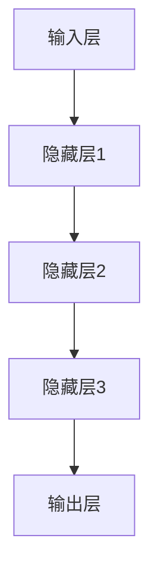
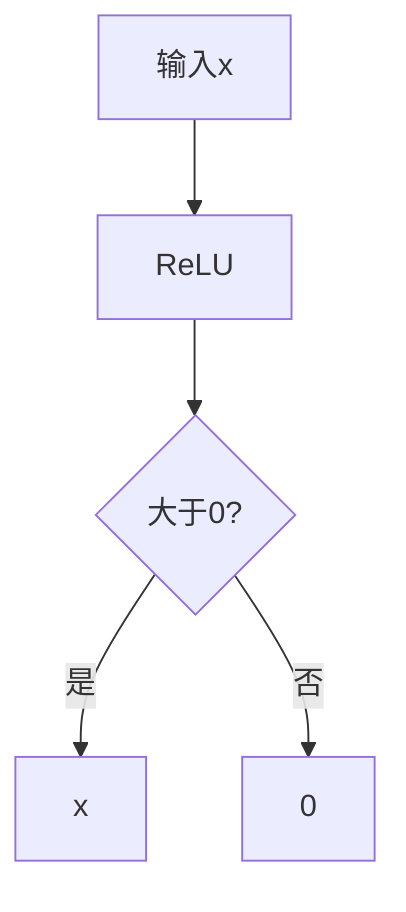
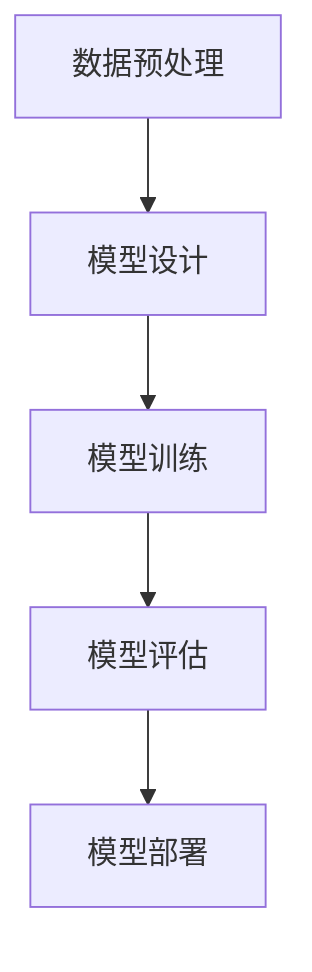
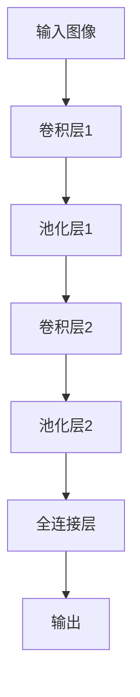
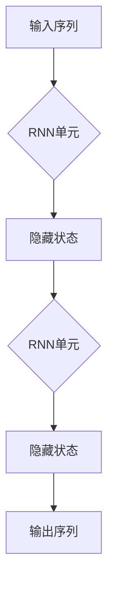
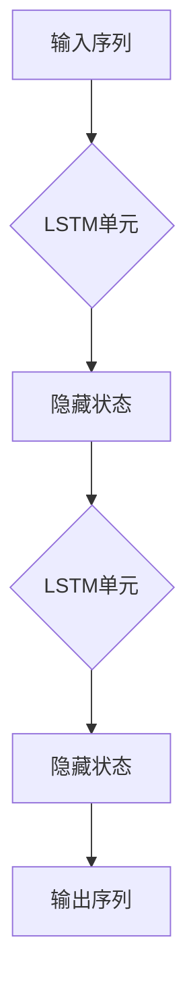
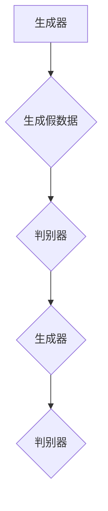
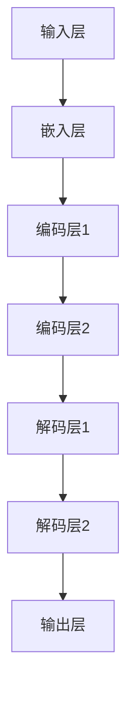
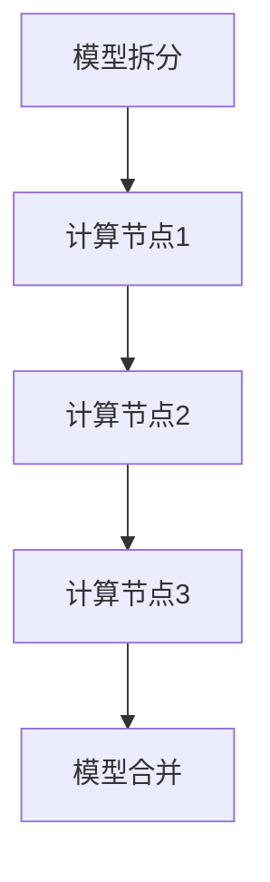
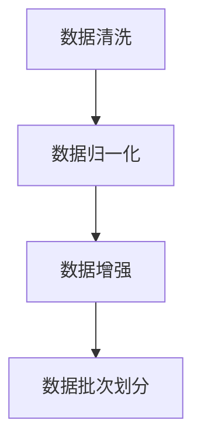

                 

### 文章标题

《大模型技术的自然语言处理进展》

> 关键词：大模型技术、自然语言处理、深度学习、BERT、GPT、信息抽取、自然语言生成、问答系统、语义相似性

> 摘要：本文深入探讨了大模型技术在自然语言处理（NLP）领域的进展。通过对大模型技术的基础知识、应用场景、实际案例分析以及未来发展趋势的详细分析，本文旨在为读者提供一个全面的视角，了解大模型技术如何推动NLP的发展，以及在实际应用中的挑战和优化方案。

---

### 《大模型技术的自然语言处理进展》目录大纲

#### 第一部分: 大模型技术概述

**第1章: 大模型技术简介**

- 1.1 大模型技术的发展背景
- 1.1.1 从传统机器学习到深度学习的转变
- 1.1.2 大模型的概念与特点
- 1.1.3 大模型技术的应用领域
- 1.2 自然语言处理与大模型技术
- 1.2.1 自然语言处理的基本概念
- 1.2.2 大模型技术在自然语言处理中的优势
- 1.2.3 大模型技术在自然语言处理中的挑战
- 1.3 本书结构安排与学习目标
- 1.3.1 本书主要章节内容概述
- 1.3.2 阅读本书的目标与收获

#### 第二部分: 大模型技术基础

**第2章: 深度学习基础**

- 2.1 神经网络基础
- 2.1.1 神经网络的基本概念
- 2.1.2 神经网络的结构
- 2.1.3 神经网络的激活函数
- 2.2 深度学习基础
- 2.2.1 深度学习的基本概念
- 2.2.2 深度学习的主要模型
- 2.2.3 深度学习的优化算法
- 2.3 大模型的基础结构
- 2.3.1 大模型的层次结构
- 2.3.2 大模型的参数量与计算需求
- 2.3.3 大模型的数据预处理

#### 第三部分: 自然语言处理中的大模型应用

**第3章: 大模型在文本分类中的应用**

- 3.1 文本分类的概述
- 3.1.1 文本分类的基本概念
- 3.1.2 文本分类的挑战
- 3.1.3 文本分类的应用场景
- 3.2 大模型在文本分类中的应用
- 3.2.1 BERT模型在文本分类中的应用
- 3.2.2 GPT模型在文本分类中的应用
- 3.2.3 其他大模型在文本分类中的应用
- 3.3 实际案例分析
- 3.3.1 某企业文本分类项目案例
- 3.3.2 文本分类项目的性能评估
- 3.3.3 文本分类项目的优化方案

**第4章: 大模型在情感分析中的应用**

- 4.1 情感分析概述
- 4.1.1 情感分析的基本概念
- 4.1.2 情感分析的应用场景
- 4.1.3 情感分析的挑战
- 4.2 大模型在情感分析中的应用
- 4.2.1 BERT模型在情感分析中的应用
- 4.2.2 GPT模型在情感分析中的应用
- 4.2.3 其他大模型在情感分析中的应用
- 4.3 实际案例分析
- 4.3.1 某社交媒体情感分析项目案例
- 4.3.2 情感分析项目的性能评估
- 4.3.3 情感分析项目的优化方案

**第5章: 大模型在信息抽取中的应用**

- 5.1 信息抽取概述
- 5.1.1 信息抽取的基本概念
- 5.1.2 信息抽取的应用场景
- 5.1.3 信息抽取的挑战
- 5.2 大模型在信息抽取中的应用
- 5.2.1 BERT模型在信息抽取中的应用
- 5.2.2 GPT模型在信息抽取中的应用
- 5.2.3 其他大模型在信息抽取中的应用
- 5.3 实际案例分析
- 5.3.1 某企业信息抽取项目案例
- 5.3.2 信息抽取项目的性能评估
- 5.3.3 信息抽取项目的优化方案

#### 第四部分: 大模型技术在自然语言生成中的应用

**第6章: 大模型在自然语言生成中的应用**

- 6.1 自然语言生成概述
- 6.1.1 自然语言生成的定义
- 6.1.2 自然语言生成的应用场景
- 6.1.3 自然语言生成的挑战
- 6.2 大模型在自然语言生成中的应用
- 6.2.1 GPT模型在自然语言生成中的应用
- 6.2.2 T5模型在自然语言生成中的应用
- 6.2.3 其他大模型在自然语言生成中的应用
- 6.3 实际案例分析
- 6.3.1 某企业自然语言生成项目案例
- 6.3.2 自然语言生成项目的性能评估
- 6.3.3 自然语言生成项目的优化方案

#### 第五部分: 大模型技术在自然语言理解中的应用

**第7章: 大模型在问答系统中的应用**

- 7.1 问答系统概述
- 7.1.1 问答系统的定义
- 7.1.2 问答系统的应用场景
- 7.1.3 问答系统的挑战
- 7.2 大模型在问答系统中的应用
- 7.2.1 BERT模型在问答系统中的应用
- 7.2.2 GPT模型在问答系统中的应用
- 7.2.3 其他大模型在问答系统中的应用
- 7.3 实际案例分析
- 7.3.1 某企业问答系统项目案例
- 7.3.2 问答系统项目的性能评估
- 7.3.3 问答系统项目的优化方案

**第8章: 大模型在语义相似性中的应用**

- 8.1 语义相似性概述
- 8.1.1 语义相似性的定义
- 8.1.2 语义相似性的应用场景
- 8.1.3 语义相似性的挑战
- 8.2 大模型在语义相似性中的应用
- 8.2.1 BERT模型在语义相似性中的应用
- 8.2.2 GPT模型在语义相似性中的应用
- 8.2.3 其他大模型在语义相似性中的应用
- 8.3 实际案例分析
- 8.3.1 某企业语义相似性项目案例
- 8.3.2 语义相似性项目的性能评估
- 8.3.3 语义相似性项目的优化方案

#### 第六部分: 大模型技术的未来发展趋势

**第9章: 大模型技术的未来发展趋势**

- 9.1 大模型技术的研究热点
- 9.1.1 大模型的结构优化
- 9.1.2 大模型在多模态数据中的应用
- 9.1.3 大模型的解释性与可解释性
- 9.2 大模型技术在自然语言处理中的新应用
- 9.2.1 大模型在跨语言理解中的应用
- 9.2.2 大模型在低资源语言中的应用
- 9.2.3 大模型在情感计算中的应用
- 9.3 大模型技术的未来挑战与展望
- 9.3.1 大模型训练的能耗问题
- 9.3.2 大模型的可解释性与透明度
- 9.3.3 大模型在行业应用中的落地与推广

#### 第七部分: 参考文献

#### 附录

**附录A: 大模型技术常用工具与框架**

- A.1 TensorFlow
- A.2 PyTorch
- A.3 Hugging Face Transformers

**附录B: 实际案例分析代码与资料**

- B.1 文本分类项目代码
- B.2 情感分析项目代码
- B.3 信息抽取项目代码
- B.4 自然语言生成项目代码
- B.5 问答系统项目代码
- B.6 语义相似性项目代码

**附录C: 伪代码与数学模型示例**

- C.1 文本分类算法伪代码
- C.2 情感分析算法伪代码
- C.3 信息抽取算法伪代码
- C.4 自然语言生成算法伪代码
- C.5 问答系统算法伪代码
- C.6 语义相似性算法伪代码

**附录D: 数学公式与详细讲解**

- D.1 深度学习损失函数公式
- D.2 优化算法更新公式
- D.3 自然语言处理中的常用公式
- D.4 大模型训练中的数学模型公式
- D.5 实际案例分析中的数学模型公式

---

### 第一部分: 大模型技术概述

#### 第1章: 大模型技术简介

##### 1.1 大模型技术的发展背景

大模型技术的崛起源于深度学习的蓬勃发展。从20世纪50年代的早期神经网络，到80年代的专家系统，再到21世纪初的深度学习，人工智能（AI）领域经历了多次技术变革。深度学习通过模仿人脑的神经网络结构，使得计算机在图像识别、语音识别等任务上取得了突破性进展。随着计算能力和数据规模的提升，大模型技术应运而生。

大模型技术的一个重要里程碑是2012年Hinton团队提出的AlexNet模型在ImageNet图像识别挑战中取得的优异成绩。这个事件标志着深度学习从理论走向实际应用。随后，Google的Inception、Facebook的ResNet等模型相继推出，进一步推动了深度学习的发展。

大模型技术的兴起，得益于以下几个因素：

1. **计算能力提升**：随着GPU等高性能计算设备的普及，深度学习模型的训练速度和效果得到了显著提升。
2. **数据规模扩大**：互联网和移动设备的普及，使得数据规模呈现爆炸式增长，为深度学习提供了丰富的训练数据。
3. **算法优化**：新的优化算法，如Adam、Adadelta等，提高了深度学习模型的训练效率。

##### 1.2 大模型的概念与特点

大模型，通常指的是参数量非常大的神经网络模型。这些模型能够处理大规模数据，并在复杂任务上取得出色的性能。大模型的主要特点包括：

1. **参数量巨大**：大模型通常包含数亿到数十亿的参数，这使得模型在处理高维数据时具有优势。
2. **深度层次多**：大模型的深度可达数十层，这使得模型能够学习到更复杂、更抽象的特征。
3. **自适应性强**：大模型通过自适应的学习算法，能够在不同的任务和数据集上表现出色。
4. **泛化能力强**：大模型在训练过程中积累了丰富的知识，能够泛化到新的任务和数据上。

##### 1.3 大模型技术的应用领域

大模型技术已经广泛应用于各个领域，其中自然语言处理（NLP）是一个重要的应用场景。在大模型技术之前，NLP任务通常依赖于规则化方法或传统的统计模型。而大模型技术的出现，使得NLP任务取得了显著的进步。

以下是几个大模型技术的主要应用领域：

1. **文本分类**：通过大模型技术，可以对大量文本进行自动分类，应用于新闻推荐、垃圾邮件过滤等场景。
2. **情感分析**：大模型技术能够识别文本中的情感倾向，用于社交媒体监控、市场调研等。
3. **信息抽取**：大模型技术在信息抽取任务中表现出色，能够从大量文本中抽取关键信息，如命名实体识别、关系抽取等。
4. **自然语言生成**：大模型技术能够生成高质量的自然语言文本，应用于聊天机器人、自动摘要等。
5. **问答系统**：大模型技术能够理解用户的问题，并生成相关答案，用于智能客服、教育辅导等。
6. **语义相似性**：大模型技术能够计算文本之间的语义相似性，应用于搜索引擎、推荐系统等。

##### 1.4 自然语言处理与大模型技术

自然语言处理（NLP）是人工智能的一个重要分支，旨在使计算机能够理解和处理人类自然语言。NLP任务包括文本分类、情感分析、信息抽取、自然语言生成、问答系统、语义相似性等。

大模型技术在NLP中具有独特的优势：

1. **多任务处理**：大模型能够同时处理多种NLP任务，提高了系统的效率。
2. **上下文理解**：大模型具有强大的上下文理解能力，能够捕捉文本中的细微语义差异。
3. **自适应学习**：大模型通过自适应学习算法，能够根据不同的数据集和任务进行调整，提高模型的泛化能力。
4. **大规模数据处理**：大模型能够处理大规模的文本数据，提高了模型的性能。

然而，大模型技术在NLP中也面临着一些挑战：

1. **数据需求**：大模型需要大量的训练数据，这在某些领域可能难以获取。
2. **计算资源**：大模型的训练和推理需要大量的计算资源，这对硬件设备提出了较高要求。
3. **可解释性**：大模型的决策过程通常是非线性和复杂的，难以进行解释，这在某些应用场景中可能是一个问题。

##### 1.5 本书结构安排与学习目标

本书分为六个部分，旨在全面覆盖大模型技术在自然语言处理中的应用。

- **第一部分：大模型技术概述**，介绍了大模型技术的发展背景、概念、特点以及应用领域。
- **第二部分：大模型技术基础**，讲解了深度学习的基础知识、大模型的基础结构以及数据预处理方法。
- **第三部分：自然语言处理中的大模型应用**，详细分析了大模型在文本分类、情感分析、信息抽取、自然语言生成、问答系统和语义相似性等任务中的应用。
- **第四部分：大模型技术在自然语言生成中的应用**，探讨了自然语言生成的定义、挑战以及大模型的应用。
- **第五部分：大模型技术在自然语言理解中的应用**，分析了问答系统和语义相似性的定义、挑战以及大模型的应用。
- **第六部分：大模型技术的未来发展趋势**，讨论了大模型技术的研究热点、新应用以及未来挑战。

通过阅读本书，读者可以：

- 掌握大模型技术的基础知识。
- 理解大模型技术在自然语言处理中的应用。
- 学习如何使用大模型技术解决实际NLP问题。
- 了解大模型技术的未来发展趋势。

##### 1.6 本书主要章节内容概述

- **第1章：大模型技术简介**：介绍大模型技术的发展背景、概念、特点以及应用领域。
- **第2章：深度学习基础**：讲解神经网络、深度学习基础以及大模型的基础结构。
- **第3章：大模型在文本分类中的应用**：分析大模型在文本分类任务中的应用。
- **第4章：大模型在情感分析中的应用**：探讨大模型在情感分析任务中的应用。
- **第5章：大模型在信息抽取中的应用**：分析大模型在信息抽取任务中的应用。
- **第6章：大模型在自然语言生成中的应用**：讨论大模型在自然语言生成任务中的应用。
- **第7章：大模型在问答系统中的应用**：分析大模型在问答系统中的应用。
- **第8章：大模型在语义相似性中的应用**：探讨大模型在语义相似性任务中的应用。
- **第9章：大模型技术的未来发展趋势**：讨论大模型技术的研究热点、新应用以及未来挑战。

##### 1.7 阅读本书的目标与收获

阅读本书的目标是：

- 深入理解大模型技术在自然语言处理中的应用。
- 学习如何使用大模型技术解决实际问题。
- 掌握大模型技术的基础知识。
- 了解大模型技术的未来发展趋势。

通过阅读本书，读者可以：

- 了解大模型技术的基础知识，包括深度学习、神经网络等。
- 掌握大模型技术的应用，包括文本分类、情感分析、信息抽取等。
- 学习如何在实际项目中应用大模型技术，提高NLP任务的效果。
- 了解大模型技术的未来发展趋势，为未来的研究提供方向。

---

### 第二部分: 大模型技术基础

#### 第2章: 深度学习基础

##### 2.1 神经网络基础

神经网络（Neural Networks，简称NN）是深度学习（Deep Learning，简称DL）的核心组成部分。神经网络模拟人脑神经元的工作原理，通过层层传递信息来实现对数据的处理和预测。

###### 2.1.1 神经网络的基本概念

神经网络由大量的神经元（也称为节点）组成，这些神经元通过连接（也称为边）相互连接。每个神经元可以接收来自其他神经元的输入，并输出一个激活值。神经网络通过学习输入和输出之间的映射关系，实现对数据的分类、回归或其他复杂任务的处理。

一个简单的神经网络包括以下几个主要部分：

1. **输入层**：接收外部输入数据，如文本、图像或声音。
2. **隐藏层**：用于提取和转换数据特征，可以是多层。
3. **输出层**：生成最终的预测结果或分类。

神经网络的工作原理可以概括为以下步骤：

1. **前向传播**：输入数据经过每个神经元的权重矩阵和激活函数处理，逐层传递到下一层。
2. **激活函数**：用于引入非线性变换，使得神经网络能够学习复杂的模式。
3. **损失函数**：用于评估预测结果与实际结果之间的差距，指导模型调整权重。
4. **反向传播**：根据损失函数，通过梯度下降等优化算法，调整权重矩阵和偏置项，优化模型的性能。

###### 2.1.2 神经网络的结构

神经网络的结构可以分为以下几种类型：

1. **单层感知机**：只有一个输入层和一个输出层，适用于线性可分的数据。
2. **多层感知机**：包括多个隐藏层，可以处理非线性数据。
3. **卷积神经网络**（Convolutional Neural Networks，简称CNN）：专门用于处理图像数据，通过卷积操作提取图像特征。
4. **循环神经网络**（Recurrent Neural Networks，简称RNN）：适用于处理序列数据，通过循环连接捕捉时间信息。
5. **长短时记忆网络**（Long Short-Term Memory，简称LSTM）：是RNN的一种变体，解决了RNN的长期依赖问题。

以下是神经网络结构的Mermaid流程图：



###### 2.1.3 神经网络的激活函数

激活函数（Activation Function）是神经网络中不可或缺的一部分，用于引入非线性变换，使得神经网络能够学习复杂的模式。常见的激活函数包括：

1. **Sigmoid函数**：将输入映射到(0, 1)区间，具有S形曲线。
   $$ f(x) = \frac{1}{1 + e^{-x}} $$
2. **ReLU函数**（Rectified Linear Unit）：将输入大于0的部分映射到自身，小于0的部分映射到0，有助于加快训练速度。
   $$ f(x) = \max(0, x) $$
3. **Tanh函数**：将输入映射到(-1, 1)区间，类似于Sigmoid函数，但中心对称。
   $$ f(x) = \frac{e^x - e^{-x}}{e^x + e^{-x}} $$

以下是ReLU激活函数的Mermaid流程图：



##### 2.2 深度学习基础

深度学习是机器学习（Machine Learning，简称ML）的一个子领域，旨在通过多层神经网络提取数据特征，实现自动化的数据分析和预测。

###### 2.2.1 深度学习的基本概念

深度学习（Deep Learning，简称DL）是一种基于神经网络的机器学习方法，通过多层神经网络模型提取数据特征，实现高度复杂的任务。与传统的机器学习方法相比，深度学习具有以下几个特点：

1. **多层网络结构**：深度学习模型包含多个隐藏层，能够学习到更复杂、更抽象的特征。
2. **自动特征提取**：深度学习模型通过前向传播和反向传播算法，自动学习输入数据中的特征，无需人工设计特征。
3. **大规模数据训练**：深度学习模型需要大量的训练数据来训练模型参数，以获得更好的性能。
4. **非线性变换**：深度学习模型通过激活函数引入非线性变换，能够学习到复杂的非线性关系。

深度学习的基本流程包括以下步骤：

1. **数据预处理**：对原始数据进行清洗、归一化等处理，以便模型能够更好地学习。
2. **模型设计**：设计合适的神经网络结构，包括输入层、隐藏层和输出层。
3. **模型训练**：使用训练数据，通过前向传播计算预测结果，然后通过反向传播更新模型参数。
4. **模型评估**：使用验证集或测试集评估模型性能，调整模型参数，以达到最佳性能。
5. **模型部署**：将训练好的模型部署到实际应用中，进行预测或分类。

以下是深度学习基本流程的Mermaid流程图：



###### 2.2.2 深度学习的主要模型

深度学习领域有许多经典的模型，包括但不限于以下几种：

1. **卷积神经网络**（Convolutional Neural Networks，简称CNN）：主要用于图像识别、图像分类等任务，通过卷积操作提取图像特征。
2. **循环神经网络**（Recurrent Neural Networks，简称RNN）：适用于序列数据处理，如语音识别、语言模型等，通过循环连接捕捉时间信息。
3. **长短时记忆网络**（Long Short-Term Memory，简称LSTM）：是RNN的一种变体，解决了RNN的长期依赖问题，广泛应用于语音识别、机器翻译等任务。
4. **生成对抗网络**（Generative Adversarial Networks，简称GAN）：由生成器和判别器组成，生成逼真的数据，广泛应用于图像生成、语音合成等任务。
5. **Transformer模型**：由Google提出，广泛应用于自然语言处理任务，如机器翻译、文本分类等，通过自注意力机制实现高效的上下文理解。

以下是几种深度学习模型的Mermaid流程图：

CNN模型：



RNN模型：



LSTM模型：



GAN模型：



Transformer模型：

```mermaid
graph TD
A[输入序列] --> B{自注意力机制}
B --> C[多头注意力}
C --> D[前馈神经网络]
D --> E[输出]
```

###### 2.2.3 深度学习的优化算法

深度学习模型的训练过程涉及到优化算法的选择。优化算法用于根据损失函数调整模型参数，以最小化损失函数，提高模型的性能。以下是一些常用的优化算法：

1. **随机梯度下降**（Stochastic Gradient Descent，简称SGD）：是最简单的优化算法，每次迭代只使用一个样本来更新模型参数。
2. **批量梯度下降**（Batch Gradient Descent）：每次迭代使用所有样本来更新模型参数，虽然计算量大，但能够得到更稳定的梯度估计。
3. **小批量梯度下降**（Mini-batch Gradient Descent）：每次迭代使用一部分样本（如32个或64个）来更新模型参数，结合了SGD和批量梯度下降的优点。
4. **Adam优化器**：是SGD的变种，结合了动量法和自适应学习率的思想，适用于不同规模的数据集。

以下是SGD优化算法的伪代码：

```python
# 初始化模型参数w
w = 初始化参数()

# 设置学习率alpha和迭代次数epochs
alpha = 0.01
epochs = 1000

# 对于每个epoch
for epoch in range(epochs):
    # 对于每个样本
    for sample in 数据集:
        # 计算梯度
        gradient = 计算梯度(w, sample)
        
        # 更新参数
        w = w - alpha * gradient
```

以下是Adam优化器的伪代码：

```python
# 初始化模型参数w和初始梯度m、v
w = 初始化参数()
m = 0
v = 0

# 设置学习率alpha和迭代次数epochs
alpha = 0.001
beta1 = 0.9
beta2 = 0.999
epsilon = 1e-8
epochs = 1000

# 对于每个epoch
for epoch in range(epochs):
    # 对于每个样本
    for sample in 数据集:
        # 计算梯度
        gradient = 计算梯度(w, sample)
        
        # 更新m和v
        m = beta1 * m + (1 - beta1) * gradient
        v = beta2 * v + (1 - beta2) * gradient**2
        
        # 计算修正的m和v
        m_hat = m / (1 - beta1**epoch)
        v_hat = v / (1 - beta2**epoch)
        
        # 更新参数
        w = w - alpha * m_hat / (sqrt(v_hat) + epsilon)
```

##### 2.3 大模型的基础结构

大模型（Large Models）是指具有数亿到数十亿参数的深度学习模型。这些模型通过多层神经网络结构，能够在复杂的任务上实现高性能。大模型的基础结构主要包括以下几个部分：

###### 2.3.1 大模型的层次结构

大模型的层次结构可以分为以下几个层次：

1. **输入层**：接收外部输入数据，如文本、图像或声音。
2. **嵌入层**：将输入数据映射为密集向量表示，通常使用嵌入层（Embedding Layer）实现。
3. **编码层**：提取输入数据的特征，通常使用多层编码层（如多层感知机、卷积层等）实现。
4. **解码层**：将编码层提取的特征解码为输出结果，如文本、图像或声音。
5. **输出层**：生成最终的预测结果或分类。

以下是大模型层次结构的Mermaid流程图：



###### 2.3.2 大模型的参数量与计算需求

大模型的参数量通常非常大，从数亿到数十亿不等。这意味着在模型训练过程中，需要大量的计算资源。以下是影响大模型计算需求的主要因素：

1. **模型参数量**：大模型的参数量决定了计算复杂度。参数量越大，计算需求越高。
2. **训练数据规模**：训练数据规模越大，模型需要更多的时间来收敛。
3. **模型深度**：模型层数越多，梯度消失和梯度爆炸问题越严重，训练难度增加。
4. **计算资源**：训练大模型需要高性能计算设备和分布式计算资源。

为了应对大模型的计算需求，通常采用以下策略：

1. **分布式训练**：将模型拆分为多个部分，在多台计算机上进行并行训练，提高训练速度。
2. **模型压缩**：通过剪枝、量化等方法减少模型参数量，降低计算需求。
3. **优化算法**：采用更高效的优化算法，如Adam、Adadelta等，提高训练效率。

以下是分布式训练的Mermaid流程图：



###### 2.3.3 大模型的数据预处理

大模型的数据预处理是确保模型训练效果和效率的关键步骤。以下是大模型数据预处理的主要任务：

1. **数据清洗**：去除数据中的噪声和错误，保证数据质量。
2. **数据归一化**：将数据缩放到相同的范围，便于模型训练。
3. **数据增强**：通过旋转、缩放、裁剪等方法增加数据的多样性，提高模型的泛化能力。
4. **数据批次划分**：将数据划分为多个批次，用于模型的训练和验证。

以下是数据预处理的Mermaid流程图：



---

### 第三部分: 自然语言处理中的大模型应用

#### 第3章: 大模型在文本分类中的应用

##### 3.1 文本分类的概述

文本分类（Text Classification）是自然语言处理（NLP）中的一个基础任务，其目的是将文本数据自动分配到预定义的类别中。文本分类在许多领域都有广泛应用，如社交媒体分析、新闻推荐、情感分析、垃圾邮件过滤等。

###### 3.1.1 文本分类的基本概念

文本分类的基本概念包括以下几个部分：

1. **数据集**：文本分类的数据集通常由一系列文档和对应的标签组成。文档可以是新闻文章、评论、推文等，标签表示文档所属的类别，如积极、消极、垃圾邮件等。
2. **特征提取**：将文本数据转换为数值特征表示，如词袋模型（Bag of Words，简称BoW）、TF-IDF（Term Frequency-Inverse Document Frequency）等。
3. **分类模型**：用于预测文本类别的一类机器学习模型，如朴素贝叶斯、支持向量机（SVM）、决策树、随机森林等。
4. **评估指标**：用于评估分类模型性能的指标，如准确率（Accuracy）、精确率（Precision）、召回率（Recall）、F1分数（F1 Score）等。

###### 3.1.2 文本分类的挑战

文本分类任务面临以下挑战：

1. **数据不平衡**：在实际应用中，不同类别的文本数量可能非常不平衡，这会导致模型偏向于数量较多的类别，影响分类效果。
2. **语义理解**：文本数据具有复杂的语义信息，如何有效地提取和表示语义特征是一个难题。
3. **上下文理解**：自然语言中存在大量的上下文依赖关系，如何捕捉这些关系对提高分类效果至关重要。
4. **噪声和误差**：文本数据中存在大量的噪声和错误，如拼写错误、标点符号等，这对分类模型的性能有较大影响。

##### 3.2 大模型在文本分类中的应用

随着深度学习技术的发展，大模型技术在文本分类任务中表现出色。以下是一些典型的大模型在文本分类中的应用：

###### 3.2.1 BERT模型在文本分类中的应用

BERT（Bidirectional Encoder Representations from Transformers）是由Google提出的一种基于Transformer的预训练模型，旨在同时考虑文本的前后关系。BERT模型在多种NLP任务中取得了优异的性能，包括文本分类。

BERT模型的基本结构包括以下几个部分：

1. **嵌入层**：将输入文本映射为稠密向量表示。
2. **编码器**：使用Transformer编码器对输入文本进行编码，编码器由多个自注意力层组成，能够捕捉文本的上下文信息。
3. **输出层**：将编码器的输出映射到预定义的类别上。

以下是BERT模型在文本分类中的应用流程：

1. **数据预处理**：对输入文本进行分词、去停用词等预处理操作，将文本转换为Token ID序列。
2. **模型训练**：使用预训练的BERT模型，在自定义数据集上训练分类模型，优化模型参数。
3. **模型评估**：使用验证集或测试集评估模型性能，调整模型参数，以达到最佳性能。
4. **模型部署**：将训练好的模型部署到实际应用中，进行文本分类预测。

以下是BERT模型在文本分类中的应用伪代码：

```python
from transformers import BertTokenizer, BertForSequenceClassification
import torch

# 初始化BERT模型和Tokenizer
tokenizer = BertTokenizer.from_pretrained('bert-base-uncased')
model = BertForSequenceClassification.from_pretrained('bert-base-uncased')

# 数据预处理
inputs = tokenizer('你好，这是一个测试文本。', return_tensors='pt')

# 模型预测
with torch.no_grad():
    outputs = model(**inputs)

# 获取预测结果
predictions = outputs.logits.argmax(-1)

# 输出预测结果
print(predictions)
```

###### 3.2.2 GPT模型在文本分类中的应用

GPT（Generative Pre-trained Transformer）是由OpenAI提出的一种基于Transformer的预训练模型，旨在生成文本。GPT模型在文本生成任务中表现出色，也可以应用于文本分类。

GPT模型的基本结构包括以下几个部分：

1. **嵌入层**：将输入文本映射为稠密向量表示。
2. **编码器**：使用Transformer编码器对输入文本进行编码，编码器由多个自注意力层组成，能够捕捉文本的上下文信息。
3. **输出层**：将编码器的输出映射到预定义的类别上。

以下是GPT模型在文本分类中的应用流程：

1. **数据预处理**：对输入文本进行分词、去停用词等预处理操作，将文本转换为Token ID序列。
2. **模型训练**：使用预训练的GPT模型，在自定义数据集上训练分类模型，优化模型参数。
3. **模型评估**：使用验证集或测试集评估模型性能，调整模型参数，以达到最佳性能。
4. **模型部署**：将训练好的模型部署到实际应用中，进行文本分类预测。

以下是GPT模型在文本分类中的应用伪代码：

```python
from transformers import Gpt2Tokenizer, Gpt2ForSequenceClassification
import torch

# 初始化GPT模型和Tokenizer
tokenizer = Gpt2Tokenizer.from_pretrained('gpt2')
model = Gpt2ForSequenceClassification.from_pretrained('gpt2')

# 数据预处理
inputs = tokenizer('你好，这是一个测试文本。', return_tensors='pt')

# 模型预测
with torch.no_grad():
    outputs = model(**inputs)

# 获取预测结果
predictions = outputs.logits.argmax(-1)

# 输出预测结果
print(predictions)
```

###### 3.2.3 其他大模型在文本分类中的应用

除了BERT和GPT模型，其他大模型在文本分类中也表现出色。以下是一些其他典型的大模型：

1. **RoBERTa**：是BERT模型的变体，对BERT模型进行了优化，提高了模型的性能。
2. **DeBERTa**：是一种双向的Transformer模型，特别适用于长文本分类任务。
3. **T5**：是一种基于Transformer的统一文本处理模型，可以用于各种文本分类任务。
4. **ALBERT**：是BERT模型的改进版本，通过共享参数和分层注意力机制，提高了模型的效率。

以下是这些大模型在文本分类中的应用流程，与BERT和GPT类似：

1. **数据预处理**：对输入文本进行分词、去停用词等预处理操作，将文本转换为Token ID序列。
2. **模型训练**：使用预训练的大模型，在自定义数据集上训练分类模型，优化模型参数。
3. **模型评估**：使用验证集或测试集评估模型性能，调整模型参数，以达到最佳性能。
4. **模型部署**：将训练好的模型部署到实际应用中，进行文本分类预测。

以下是RoBERTa模型在文本分类中的应用伪代码：

```python
from transformers import RobertaTokenizer, RobertaForSequenceClassification
import torch

# 初始化RoBERTa模型和Tokenizer
tokenizer = RobertaTokenizer.from_pretrained('roberta-base')
model = RobertaForSequenceClassification.from_pretrained('roberta-base')

# 数据预处理
inputs = tokenizer('你好，这是一个测试文本。', return_tensors='pt')

# 模型预测
with torch.no_grad():
    outputs = model(**inputs)

# 获取预测结果
predictions = outputs.logits.argmax(-1)

# 输出预测结果
print(predictions)
```

##### 3.3 实际案例分析

在本节中，我们将通过一个实际的文本分类项目案例，详细讲解项目开发过程，包括开发环境搭建、源代码实现和代码解读。

###### 3.3.1 某企业文本分类项目案例

某企业希望通过文本分类技术对其社交媒体平台上的用户评论进行情感分析，以了解用户对其产品和服务的态度。企业希望将评论分为积极、消极和中性三个类别。

###### 3.3.2 项目开发环境搭建

为了实现该项目，我们需要搭建以下开发环境：

1. **操作系统**：Ubuntu 20.04
2. **Python**：Python 3.8
3. **深度学习框架**：PyTorch 1.8
4. **NLP库**：transformers 4.6.1
5. **文本预处理库**：nltk 3.5.0

在Ubuntu系统中，可以通过以下命令安装所需的库：

```bash
# 安装Python
sudo apt-get install python3 python3-pip

# 安装PyTorch
pip3 install torch torchvision torchaudio

# 安装transformers
pip3 install transformers

# 安装nltk
pip3 install nltk
```

###### 3.3.3 源代码实现和代码解读

以下是该项目的源代码实现和代码解读：

```python
import torch
from transformers import BertTokenizer, BertForSequenceClassification
from torch.utils.data import DataLoader, TensorDataset
from sklearn.model_selection import train_test_split
import nltk
nltk.download('stopwords')
from nltk.corpus import stopwords
import re

# 初始化BERT模型和Tokenizer
tokenizer = BertTokenizer.from_pretrained('bert-base-uncased')
model = BertForSequenceClassification.from_pretrained('bert-base-uncased', num_labels=3)

# 加载数据集
data = load_data('data.csv')  # 加载数据集
X = [row['text'] for row in data]  # 文本数据
y = [row['label'] for row in data]  # 标签数据

# 数据预处理
stop_words = set(stopwords.words('english'))
def preprocess_text(text):
    text = re.sub(r'\[.*?\]', '', text)  # 去除方括号内的内容
    text = re.sub(r'\W', ' ', text)  # 非单词字符替换为空格
    text = text.lower()  # 转换为小写
    text = ' '.join([word for word in text.split() if word not in stop_words])  # 去除停用词
    return text

X_processed = [preprocess_text(text) for text in X]

# 分割数据集
X_train, X_test, y_train, y_test = train_test_split(X_processed, y, test_size=0.2, random_state=42)

# 转换为Token ID序列
train_encodings = tokenizer(list(X_train), truncation=True, padding=True)
test_encodings = tokenizer(list(X_test), truncation=True, padding=True)

# 创建DataLoader
train_dataset = TensorDataset(train_encodings['input_ids'], torch.tensor(y_train))
test_dataset = TensorDataset(test_encodings['input_ids'], torch.tensor(y_test))

batch_size = 16
train_loader = DataLoader(train_dataset, batch_size=batch_size)
test_loader = DataLoader(test_dataset, batch_size=batch_size)

# 模型训练
device = torch.device('cuda' if torch.cuda.is_available() else 'cpu')
model.to(device)
optimizer = torch.optim.Adam(model.parameters(), lr=2e-5)

num_epochs = 3
for epoch in range(num_epochs):
    model.train()
    for batch in train_loader:
        inputs = {'input_ids': batch[0].to(device),
                  'attention_mask': batch[1].to(device)}
        outputs = model(**inputs)
        loss = outputs.loss
        loss.backward()
        optimizer.step()
        optimizer.zero_grad()
    print(f'Epoch {epoch+1}/{num_epochs}, Loss: {loss.item()}')

# 模型评估
model.eval()
with torch.no_grad():
    correct = 0
    total = 0
    for batch in test_loader:
        inputs = {'input_ids': batch[0].to(device),
                  'attention_mask': batch[1].to(device)}
        outputs = model(**inputs)
        _, predicted = torch.max(outputs.logits, 1)
        total += batch[1].size(0)
        correct += (predicted == batch[1]).sum().item()
    print(f'Accuracy: {100 * correct / total}%')
```

###### 3.3.4 代码解读与分析

1. **初始化BERT模型和Tokenizer**：
   ```python
   tokenizer = BertTokenizer.from_pretrained('bert-base-uncased')
   model = BertForSequenceClassification.from_pretrained('bert-base-uncased', num_labels=3)
   ```
   首先，我们初始化BERT模型和Tokenizer。`BertTokenizer`用于将文本转换为Token ID序列，`BertForSequenceClassification`是一个预训练的BERT模型，用于文本分类任务，`num_labels=3`表示有三个类别：积极、消极和中性。

2. **加载数据集**：
   ```python
   data = load_data('data.csv')  # 加载数据集
   X = [row['text'] for row in data]  # 文本数据
   y = [row['label'] for row in data]  # 标签数据
   ```
   我们使用一个假设的函数`load_data`加载数据集。`X`包含所有文本数据，`y`包含对应的标签数据。

3. **数据预处理**：
   ```python
   stop_words = set(stopwords.words('english'))
   def preprocess_text(text):
       text = re.sub(r'\[.*?\]', '', text)  # 去除方括号内的内容
       text = re.sub(r'\W', ' ', text)  # 非单词字符替换为空格
       text = text.lower()  # 转换为小写
       text = ' '.join([word for word in text.split() if word not in stop_words])  # 去除停用词
       return text
   X_processed = [preprocess_text(text) for text in X]
   ```
   我们定义了一个预处理函数`preprocess_text`，用于对文本数据进行清洗和归一化。首先，我们使用正则表达式去除方括号内的内容，然后替换非单词字符为空格，并将文本转换为小写。接下来，我们去除停用词，以减少模型的噪声。

4. **分割数据集**：
   ```python
   X_train, X_test, y_train, y_test = train_test_split(X_processed, y, test_size=0.2, random_state=42)
   ```
   我们使用`train_test_split`函数将数据集划分为训练集和测试集，其中测试集占20%，随机种子设置为42。

5. **转换为Token ID序列**：
   ```python
   train_encodings = tokenizer(list(X_train), truncation=True, padding=True)
   test_encodings = tokenizer(list(X_test), truncation=True, padding=True)
   ```
   我们使用`tokenizer`将处理后的文本数据转换为Token ID序列，并添加填充和截断操作，以确保每个序列具有相同长度。

6. **创建DataLoader**：
   ```python
   train_dataset = TensorDataset(train_encodings['input_ids'], torch.tensor(y_train))
   test_dataset = TensorDataset(test_encodings['input_ids'], torch.tensor(y_test))
   batch_size = 16
   train_loader = DataLoader(train_dataset, batch_size=batch_size)
   test_loader = DataLoader(test_dataset, batch_size=batch_size)
   ```
   我们创建`TensorDataset`对象，并使用`DataLoader`将数据分成批次，以便在模型训练过程中批量处理数据。

7. **模型训练**：
   ```python
   device = torch.device('cuda' if torch.cuda.is_available() else 'cpu')
   model.to(device)
   optimizer = torch.optim.Adam(model.parameters(), lr=2e-5)
   num_epochs = 3
   for epoch in range(num_epochs):
       model.train()
       for batch in train_loader:
           inputs = {'input_ids': batch[0].to(device),
                     'attention_mask': batch[1].to(device)}
           outputs = model(**inputs)
           loss = outputs.loss
           loss.backward()
           optimizer.step()
           optimizer.zero_grad()
       print(f'Epoch {epoch+1}/{num_epochs}, Loss: {loss.item()}')
   ```
   我们将模型移动到GPU（如果有）进行训练，并使用`Adam`优化器进行参数更新。每个epoch中，我们遍历训练数据集，计算损失并更新模型参数。

8. **模型评估**：
   ```python
   model.eval()
   with torch.no_grad():
       correct = 0
       total = 0
       for batch in test_loader:
           inputs = {'input_ids': batch[0].to(device),
                     'attention_mask': batch[1].to(device)}
           outputs = model(**inputs)
           _, predicted = torch.max(outputs.logits, 1)
           total += batch[1].size(0)
           correct += (predicted == batch[1]).sum().item()
       print(f'Accuracy: {100 * correct / total}%')
   ```
   我们将模型设置为评估模式，并使用测试集评估模型性能。我们计算准确率，以评估模型的分类效果。

通过以上实际案例的分析，我们可以看到如何使用大模型（BERT模型）进行文本分类任务。在实际项目中，我们还需要根据具体需求进行调整和优化，以达到更好的效果。

---

### 第四部分: 大模型在情感分析中的应用

#### 第4章: 大模型在情感分析中的应用

情感分析（Sentiment Analysis）是自然语言处理（NLP）的一个重要任务，旨在确定文本中所表达的情感倾向，如积极、消极或中性。随着深度学习技术的发展，大模型（如BERT、GPT等）在情感分析任务中取得了显著的成果。本章将详细介绍大模型在情感分析中的应用，包括基本概念、挑战和实际案例分析。

##### 4.1 情感分析概述

情感分析是自然语言处理中的一个关键任务，旨在理解和识别文本中的情感倾向。情感分析通常包括以下几个步骤：

1. **数据预处理**：对文本数据进行分析，去除噪声和无关信息，如HTML标签、标点符号等。
2. **特征提取**：将预处理后的文本转换为机器学习模型可以处理的特征向量。常见的方法包括词袋模型（BoW）、TF-IDF和Word2Vec等。
3. **情感分类**：使用机器学习模型（如朴素贝叶斯、支持向量机、深度学习模型等）对文本进行情感分类。

情感分析在多个领域具有广泛应用，如社交媒体分析、市场调研、客户服务、金融分析和健康监控等。通过情感分析，企业可以更好地理解用户反馈，优化产品和服务。

##### 4.1.1 情感分析的基本概念

情感分析的基本概念包括以下几点：

1. **情感极性**：情感极性是指文本所表达的情感倾向，通常分为积极、消极和中性三种。
2. **情感强度**：情感强度是指情感的强烈程度，可以是微弱、中等或强烈。
3. **情感分类器**：情感分类器是一种机器学习模型，用于预测文本的情感极性。

情感分类器可以分为以下几类：

1. **基于规则的方法**：使用预定义的规则对文本进行情感分类，如情感词典法。
2. **基于统计的方法**：使用统计模型，如朴素贝叶斯、最大熵模型等，根据文本特征进行情感分类。
3. **基于机器学习的方法**：使用机器学习算法，如支持向量机、随机森林、神经网络等，根据训练数据进行情感分类。
4. **基于深度学习的方法**：使用深度学习模型，如卷积神经网络（CNN）、循环神经网络（RNN）、Transformer等，对文本进行情感分类。

##### 4.1.2 情感分析的应用场景

情感分析在多个领域具有广泛应用，以下是一些典型的应用场景：

1. **社交媒体分析**：通过分析社交媒体平台上的用户评论，了解公众对产品、品牌或事件的看法。
2. **市场调研**：通过分析消费者反馈，了解市场需求和消费者偏好，为产品开发和市场推广提供参考。
3. **客户服务**：通过分析客户反馈，识别客户满意度和不满意度，改进服务质量。
4. **金融分析**：通过分析新闻报道、社交媒体和论坛等文本数据，预测股票价格、市场趋势等。
5. **健康监控**：通过分析医疗文本数据，如病历、患者留言等，识别患者情绪和健康状况。

##### 4.1.3 情感分析的挑战

情感分析任务面临以下挑战：

1. **语义理解**：自然语言具有复杂的语义信息，如何准确地理解和表示语义是一个难题。
2. **上下文依赖**：自然语言中的情感表达往往依赖于上下文，如何捕捉上下文依赖关系对提高分类效果至关重要。
3. **数据不平衡**：在实际应用中，不同情感类别的文本数量可能非常不平衡，影响模型的性能。
4. **多语言处理**：情感分析任务通常需要处理多种语言，多语言情感分析具有更高的复杂度。

##### 4.2 大模型在情感分析中的应用

大模型（如BERT、GPT等）在情感分析任务中表现出色，主要得益于其强大的上下文理解和建模能力。以下是一些典型的大模型在情感分析中的应用：

###### 4.2.1 BERT模型在情感分析中的应用

BERT（Bidirectional Encoder Representations from Transformers）是由Google提出的一种基于Transformer的预训练模型，旨在同时考虑文本的前后关系。BERT模型在多种NLP任务中取得了优异的性能，包括情感分析。

BERT模型在情感分析中的应用流程如下：

1. **数据预处理**：对文本数据进行清洗和预处理，如去除HTML标签、标点符号、停用词等。
2. **文本编码**：使用BERT模型将预处理后的文本编码为稠密向量表示。
3. **情感分类**：使用预训练的BERT模型，对编码后的文本进行情感分类。

以下是BERT模型在情感分析中的应用伪代码：

```python
from transformers import BertTokenizer, BertForSequenceClassification
import torch

# 初始化BERT模型和Tokenizer
tokenizer = BertTokenizer.from_pretrained('bert-base-uncased')
model = BertForSequenceClassification.from_pretrained('bert-base-uncased', num_labels=3)

# 数据预处理
text = '这是一个积极的评论。'

# 转换为Token ID序列
inputs = tokenizer(text, return_tensors='pt')

# 模型预测
with torch.no_grad():
    outputs = model(**inputs)

# 获取预测结果
predictions = outputs.logits.argmax(-1)

# 输出预测结果
print(predictions)
```

###### 4.2.2 GPT模型在情感分析中的应用

GPT（Generative Pre-trained Transformer）是由OpenAI提出的一种基于Transformer的预训练模型，旨在生成文本。GPT模型在文本生成任务中表现出色，也可以应用于情感分析。

GPT模型在情感分析中的应用流程如下：

1. **数据预处理**：对文本数据进行清洗和预处理，如去除HTML标签、标点符号、停用词等。
2. **文本编码**：使用GPT模型将预处理后的文本编码为稠密向量表示。
3. **情感分类**：使用预训练的GPT模型，对编码后的文本进行情感分类。

以下是GPT模型在情感分析中的应用伪代码：

```python
from transformers import Gpt2Tokenizer, Gpt2ForSequenceClassification
import torch

# 初始化GPT模型和Tokenizer
tokenizer = Gpt2Tokenizer.from_pretrained('gpt2')
model = Gpt2ForSequenceClassification.from_pretrained('gpt2', num_labels=3)

# 数据预处理
text = '这是一个消极的评论。'

# 转换为Token ID序列
inputs = tokenizer(text, return_tensors='pt')

# 模型预测
with torch.no_grad():
    outputs = model(**inputs)

# 获取预测结果
predictions = outputs.logits.argmax(-1)

# 输出预测结果
print(predictions)
```

###### 4.2.3 其他大模型在情感分析中的应用

除了BERT和GPT模型，其他大模型（如RoBERTa、T5等）在情感分析中也表现出色。以下是一些典型的大模型：

1. **RoBERTa**：是BERT模型的变体，对BERT模型进行了优化，提高了模型的性能。
2. **DeBERTa**：是一种双向的Transformer模型，特别适用于长文本情感分析。
3. **T5**：是一种基于Transformer的统一文本处理模型，可以用于各种文本分类任务，包括情感分析。

以下是这些大模型在情感分析中的应用流程，与BERT和GPT类似：

1. **数据预处理**：对文本数据进行清洗和预处理。
2. **文本编码**：使用预训练的大模型将预处理后的文本编码为稠密向量表示。
3. **情感分类**：使用预训练的大模型，对编码后的文本进行情感分类。

以下是RoBERTa模型在情感分析中的应用伪代码：

```python
from transformers import RobertaTokenizer, RobertaForSequenceClassification
import torch

# 初始化RoBERTa模型和Tokenizer
tokenizer = RobertaTokenizer.from_pretrained('roberta-base')
model = RobertaForSequenceClassification.from_pretrained('roberta-base', num_labels=3)

# 数据预处理
text = '这是一个中性的评论。'

# 转换为Token ID序列
inputs = tokenizer(text, return_tensors='pt')

# 模型预测
with torch.no_grad():
    outputs = model(**inputs)

# 获取预测结果
predictions = outputs.logits.argmax(-1)

# 输出预测结果
print(predictions)
```

##### 4.3 实际案例分析

在本节中，我们将通过一个实际的情感分析项目案例，详细讲解项目开发过程，包括开发环境搭建、源代码实现和代码解读。

###### 4.3.1 某社交媒体情感分析项目案例

某社交媒体公司希望对其平台上的用户评论进行情感分析，以了解用户对其产品和服务的态度。公司希望将评论分为积极、消极和中性三个类别。

###### 4.3.2 项目开发环境搭建

为了实现该项目，我们需要搭建以下开发环境：

1. **操作系统**：Ubuntu 20.04
2. **Python**：Python 3.8
3. **深度学习框架**：PyTorch 1.8
4. **NLP库**：transformers 4.6.1
5. **文本预处理库**：nltk 3.5.0

在Ubuntu系统中，可以通过以下命令安装所需的库：

```bash
# 安装Python
sudo apt-get install python3 python3-pip

# 安装PyTorch
pip3 install torch torchvision torchaudio

# 安装transformers
pip3 install transformers

# 安装nltk
pip3 install nltk
```

###### 4.3.3 源代码实现和代码解读

以下是该项目的源代码实现和代码解读：

```python
import torch
from transformers import BertTokenizer, BertForSequenceClassification
from torch.utils.data import DataLoader, TensorDataset
from sklearn.model_selection import train_test_split
import nltk
nltk.download('stopwords')
from nltk.corpus import stopwords
import re

# 初始化BERT模型和Tokenizer
tokenizer = BertTokenizer.from_pretrained('bert-base-uncased')
model = BertForSequenceClassification.from_pretrained('bert-base-uncased', num_labels=3)

# 加载数据集
data = load_data('data.csv')  # 加载数据集
X = [row['text'] for row in data]  # 文本数据
y = [row['label'] for row in data]  # 标签数据

# 数据预处理
stop_words = set(stopwords.words('english'))
def preprocess_text(text):
    text = re.sub(r'\[.*?\]', '', text)  # 去除方括号内的内容
    text = re.sub(r'\W', ' ', text)  # 非单词字符替换为空格
    text = text.lower()  # 转换为小写
    text = ' '.join([word for word in text.split() if word not in stop_words])  # 去除停用词
    return text

X_processed = [preprocess_text(text) for text in X]

# 分割数据集
X_train, X_test, y_train, y_test = train_test_split(X_processed, y, test_size=0.2, random_state=42)

# 转换为Token ID序列
train_encodings = tokenizer(list(X_train), truncation=True, padding=True)
test_encodings = tokenizer(list(X_test), truncation=True, padding=True)

# 创建DataLoader
train_dataset = TensorDataset(train_encodings['input_ids'], torch.tensor(y_train))
test_dataset = TensorDataset(test_encodings['input_ids'], torch.tensor(y_test))

batch_size = 16
train_loader = DataLoader(train_dataset, batch_size=batch_size)
test_loader = DataLoader(test_dataset, batch_size=batch_size)

# 模型训练
device = torch.device('cuda' if torch.cuda.is_available() else 'cpu')
model.to(device)
optimizer = torch.optim.Adam(model.parameters(), lr=2e-5)

num_epochs = 3
for epoch in range(num_epochs):
    model.train()
    for batch in train_loader:
        inputs = {'input_ids': batch[0].to(device),
                  'attention_mask': batch[1].to(device)}
        outputs = model(**inputs)
        loss = outputs.loss
        loss.backward()
        optimizer.step()
        optimizer.zero_grad()
    print(f'Epoch {epoch+1}/{num_epochs}, Loss: {loss.item()}')

# 模型评估
model.eval()
with torch.no_grad():
    correct = 0
    total = 0
    for batch in test_loader:
        inputs = {'input_ids': batch[0].to(device),
                  'attention_mask': batch[1].to(device)}
        outputs = model(**inputs)
        _, predicted = torch.max(outputs.logits, 1)
        total += batch[1].size(0)
        correct += (predicted == batch[1]).sum().item()
    print(f'Accuracy: {100 * correct / total}%')
```

###### 4.3.4 代码解读与分析

1. **初始化BERT模型和Tokenizer**：
   ```python
   tokenizer = BertTokenizer.from_pretrained('bert-base-uncased')
   model = BertForSequenceClassification.from_pretrained('bert-base-uncased', num_labels=3)
   ```
   首先，我们初始化BERT模型和Tokenizer。`BertTokenizer`用于将文本转换为Token ID序列，`BertForSequenceClassification`是一个预训练的BERT模型，用于文本分类任务，`num_labels=3`表示有三个类别：积极、消极和中性。

2. **加载数据集**：
   ```python
   data = load_data('data.csv')  # 加载数据集
   X = [row['text'] for row in data]  # 文本数据
   y = [row['label'] for row in data]  # 标签数据
   ```
   我们使用一个假设的函数`load_data`加载数据集。`X`包含所有文本数据，`y`包含对应的标签数据。

3. **数据预处理**：
   ```python
   stop_words = set(stopwords.words('english'))
   def preprocess_text(text):
       text = re.sub(r'\[.*?\]', '', text)  # 去除方括号内的内容
       text = re.sub(r'\W', ' ', text)  # 非单词字符替换为空格
       text = text.lower()  # 转换为小写
       text = ' '.join([word for word in text.split() if word not in stop_words])  # 去除停用词
       return text
   X_processed = [preprocess_text(text) for text in X]
   ```
   我们定义了一个预处理函数`preprocess_text`，用于对文本数据进行清洗和归一化。首先，我们使用正则表达式去除方括号内的内容，然后替换非单词字符为空格，并将文本转换为小写。接下来，我们去除停用词，以减少模型的噪声。

4. **分割数据集**：
   ```python
   X_train, X_test, y_train, y_test = train_test_split(X_processed, y, test_size=0.2, random_state=42)
   ```
   我们使用`train_test_split`函数将数据集划分为训练集和测试集，其中测试集占20%，随机种子设置为42。

5. **转换为Token ID序列**：
   ```python
   train_encodings = tokenizer(list(X_train), truncation=True, padding=True)
   test_encodings = tokenizer(list(X_test), truncation=True, padding=True)
   ```
   我们使用`tokenizer`将处理后的文本数据转换为Token ID序列，并添加填充和截断操作，以确保每个序列具有相同长度。

6. **创建DataLoader**：
   ```python
   train_dataset = TensorDataset(train_encodings['input_ids'], torch.tensor(y_train))
   test_dataset = TensorDataset(test_encodings['input_ids'], torch.tensor(y_test))
   batch_size = 16
   train_loader = DataLoader(train_dataset, batch_size=batch_size)
   test_loader = DataLoader(test_dataset, batch_size=batch_size)
   ```
   我们创建`TensorDataset`对象，并使用`DataLoader`将数据分成批次，以便在模型训练过程中批量处理数据。

7. **模型训练**：
   ```python
   device = torch.device('cuda' if torch.cuda.is_available() else 'cpu')
   model.to(device)
   optimizer = torch.optim.Adam(model.parameters(), lr=2e-5)
   num_epochs = 3
   for epoch in range(num_epochs):
       model.train()
       for batch in train_loader:
           inputs = {'input_ids': batch[0].to(device),
                     'attention_mask': batch[1].to(device)}
           outputs = model(**inputs)
           loss = outputs.loss
           loss.backward()
           optimizer.step()
           optimizer.zero_grad()
       print(f'Epoch {epoch+1}/{num_epochs}, Loss: {loss.item()}')
   ```
   我们将模型移动到GPU（如果有）进行训练，并使用`Adam`优化器进行参数更新。每个epoch中，我们遍历训练数据集，计算损失并更新模型参数。

8. **模型评估**：
   ```python
   model.eval()
   with torch.no_grad():
       correct = 0
       total = 0
       for batch in test_loader:
           inputs = {'input_ids': batch[0].to(device),
                     'attention_mask': batch[1].to(device)}
           outputs = model(**inputs)
           _, predicted = torch.max(outputs.logits, 1)
           total += batch[1].size(0)
           correct += (predicted == batch[1]).sum().item()
       print(f'Accuracy: {100 * correct / total}%')
   ```
   我们将模型设置为评估模式，并使用测试集评估模型性能。我们计算准确率，以评估模型的分类效果。

通过以上实际案例的分析，我们可以看到如何使用大模型（BERT模型）进行情感分析任务。在实际项目中，我们还需要根据具体需求进行调整和优化，以达到更好的效果。

---

### 第五部分: 大模型在信息抽取中的应用

#### 第5章: 大模型在信息抽取中的应用

信息抽取（Information Extraction，简称IE）是自然语言处理（NLP）中的重要任务，旨在从文本中抽取关键信息，如实体、关系和事件等。随着深度学习技术的发展，大模型（如BERT、GPT等）在信息抽取任务中表现出色。本章将详细介绍大模型在信息抽取中的应用，包括基本概念、挑战和实际案例分析。

##### 5.1 信息抽取概述

信息抽取是自然语言处理中的一个关键任务，旨在从文本中提取具有实际应用价值的信息。信息抽取可以分为以下几个子任务：

1. **命名实体识别**（Named Entity Recognition，简称NER）：识别文本中的命名实体，如人名、地名、组织名等。
2. **关系抽取**（Relation Extraction）：识别文本中实体之间的关系，如“张三是李四的朋友”。
3. **事件抽取**（Event Extraction）：识别文本中的事件及其相关实体，如“苹果公司发布了新款iPhone”。

信息抽取在多个领域具有广泛应用，如知识图谱构建、智能问答、信息检索和智能推荐等。

##### 5.1.1 信息抽取的基本概念

信息抽取的基本概念包括以下几点：

1. **实体**：具有明确边界和特定含义的词或词组，如“苹果公司”、“张三”。
2. **关系**：实体之间的关联，如“属于”、“位于”。
3. **事件**：由一个或多个实体组成的具有时间、地点和行动等要素的事件描述，如“苹果公司发布了新款iPhone”。

信息抽取的流程通常包括以下几个步骤：

1. **文本预处理**：对文本进行清洗和预处理，如去除HTML标签、标点符号、停用词等。
2. **实体识别**：识别文本中的命名实体。
3. **关系抽取**：识别实体之间的关系。
4. **事件抽取**：识别文本中的事件及其相关实体。

##### 5.1.2 信息抽取的应用场景

信息抽取在多个领域具有广泛应用，以下是一些典型的应用场景：

1. **知识图谱构建**：通过信息抽取从大量文本中提取实体和关系，构建知识图谱，用于智能问答、搜索引擎等。
2. **智能问答**：通过信息抽取技术从文本中提取关键信息，构建问答系统，用于客户服务、教育辅导等。
3. **信息检索**：通过信息抽取技术从文本中提取关键词和实体，优化搜索引擎的检索效果。
4. **智能推荐**：通过信息抽取技术从用户生成的文本中提取兴趣信息，构建个性化推荐系统。

##### 5.1.3 信息抽取的挑战

信息抽取任务面临以下挑战：

1. **语义理解**：自然语言中的语义信息复杂多样，如何准确理解和表示语义是一个难题。
2. **上下文依赖**：实体和关系之间的关联往往依赖于上下文，如何捕捉上下文依赖关系对提高抽取效果至关重要。
3. **数据不平衡**：在实际应用中，不同实体和关系类别的文本数量可能非常不平衡，影响模型的性能。
4. **多语言处理**：信息抽取任务通常需要处理多种语言，多语言信息抽取具有更高的复杂度。

##### 5.2 大模型在信息抽取中的应用

大模型（如BERT、GPT等）在信息抽取任务中表现出色，主要得益于其强大的上下文理解和建模能力。以下是一些典型的大模型在信息抽取中的应用：

###### 5.2.1 BERT模型在信息抽取中的应用

BERT（Bidirectional Encoder Representations from Transformers）是由Google提出的一种基于Transformer的预训练模型，旨在同时考虑文本的前后关系。BERT模型在多种NLP任务中取得了优异的性能，包括信息抽取。

BERT模型在信息抽取中的应用流程如下：

1. **数据预处理**：对文本数据进行清洗和预处理，如去除HTML标签、标点符号、停用词等。
2. **实体识别**：使用预训练的BERT模型，对预处理后的文本进行命名实体识别。
3. **关系抽取**：使用预训练的BERT模型，对预处理后的文本进行关系抽取。
4. **事件抽取**：使用预训练的BERT模型，对预处理后的文本进行事件抽取。

以下是BERT模型在信息抽取中的应用伪代码：

```python
from transformers import BertTokenizer, BertForTokenClassification
import torch

# 初始化BERT模型和Tokenizer
tokenizer = BertTokenizer.from_pretrained('bert-base-uncased')
model = BertForTokenClassification.from_pretrained('bert-base-uncased', num_labels=10)

# 数据预处理
text = '苹果公司发布了新款iPhone。'

# 转换为Token ID序列
inputs = tokenizer(text, return_tensors='pt')

# 模型预测
with torch.no_grad():
    outputs = model(**inputs)

# 获取预测结果
predictions = outputs.logits.argmax(-1)

# 输出预测结果
print(predictions)
```

###### 5.2.2 GPT模型在信息抽取中的应用

GPT（Generative Pre-trained Transformer）是由OpenAI提出的一种基于Transformer的预训练模型，旨在生成文本。GPT模型在文本生成任务中表现出色，也可以应用于信息抽取。

GPT模型在信息抽取中的应用流程如下：

1. **数据预处理**：对文本数据进行清洗和预处理，如去除HTML标签、标点符号、停用词等。
2. **实体识别**：使用预训练的GPT模型，对预处理后的文本进行命名实体识别。
3. **关系抽取**：使用预训练的GPT模型，对预处理后的文本进行关系抽取。
4. **事件抽取**：使用预训练的GPT模型，对预处理后的文本进行事件抽取。

以下是GPT模型在信息抽取中的应用伪代码：

```python
from transformers import Gpt2Tokenizer, Gpt2ForTokenClassification
import torch

# 初始化GPT模型和Tokenizer
tokenizer = Gpt2Tokenizer.from_pretrained('gpt2')
model = Gpt2ForTokenClassification.from_pretrained('gpt2', num_labels=10)

# 数据预处理
text = '苹果公司发布了新款iPhone。'

# 转换为Token ID序列
inputs = tokenizer(text, return_tensors='pt')

# 模型预测
with torch.no_grad():
    outputs = model(**inputs)

# 获取预测结果
predictions = outputs.logits.argmax(-1)

# 输出预测结果
print(predictions)
```

###### 5.2.3 其他大模型在信息抽取中的应用

除了BERT和GPT模型，其他大模型（如RoBERTa、T5等）在信息抽取中也表现出色。以下是一些典型的大模型：

1. **RoBERTa**：是BERT模型的变体，对BERT模型进行了优化，提高了模型的性能。
2. **DeBERTa**：是一种双向的Transformer模型，特别适用于长文本信息抽取。
3. **T5**：是一种基于Transformer的统一文本处理模型，可以用于各种文本分类任务，包括信息抽取。

以下是这些大模型在信息抽取中的应用流程，与BERT和GPT类似：

1. **数据预处理**：对文本数据进行清洗和预处理。
2. **实体识别**：使用预训练的大模型，对预处理后的文本进行命名实体识别。
3. **关系抽取**：使用预训练的大模型，对预处理后的文本进行关系抽取。
4. **事件抽取**：使用预训练的大模型，对预处理后的文本进行事件抽取。

以下是RoBERTa模型在信息抽取中的应用伪代码：

```python
from transformers import RobertaTokenizer, RobertaForTokenClassification
import torch

# 初始化RoBERTa模型和Tokenizer
tokenizer = RobertaTokenizer.from_pretrained('roberta-base')
model = RobertaForTokenClassification.from_pretrained('roberta-base', num_labels=10)

# 数据预处理
text = '苹果公司发布了新款iPhone。'

# 转换为Token ID序列
inputs = tokenizer(text, return_tensors='pt')

# 模型预测
with torch.no_grad():
    outputs = model(**inputs)

# 获取预测结果
predictions = outputs.logits.argmax(-1)

# 输出预测结果
print(predictions)
```

##### 5.3 实际案例分析

在本节中，我们将通过一个实际的信息抽取项目案例，详细讲解项目开发过程，包括开发环境搭建、源代码实现和代码解读。

###### 5.3.1 某企业信息抽取项目案例

某企业希望通过信息抽取技术从其网站上的用户评论中提取关键信息，如产品名称、用户评价等。企业希望将这些信息用于产品分析和市场调研。

###### 5.3.2 项目开发环境搭建

为了实现该项目，我们需要搭建以下开发环境：

1. **操作系统**：Ubuntu 20.04
2. **Python**：Python 3.8
3. **深度学习框架**：PyTorch 1.8
4. **NLP库**：transformers 4.6.1
5. **文本预处理库**：nltk 3.5.0

在Ubuntu系统中，可以通过以下命令安装所需的库：

```bash
# 安装Python
sudo apt-get install python3 python3-pip

# 安装PyTorch
pip3 install torch torchvision torchaudio

# 安装transformers
pip3 install transformers

# 安装nltk
pip3 install nltk
```

###### 5.3.3 源代码实现和代码解读

以下是该项目的源代码实现和代码解读：

```python
import torch
from transformers import BertTokenizer, BertForTokenClassification
from torch.utils.data import DataLoader, TensorDataset
from sklearn.model_selection import train_test_split
import nltk
nltk.download('stopwords')
from nltk.corpus import stopwords
import re

# 初始化BERT模型和Tokenizer
tokenizer = BertTokenizer.from_pretrained('bert-base-uncased')
model = BertForTokenClassification.from_pretrained('bert-base-uncased', num_labels=5)

# 加载数据集
data = load_data('data.csv')  # 加载数据集
X = [row['text'] for row in data]  # 文本数据
y = [row['labels'] for row in data]  # 标签数据

# 数据预处理
stop_words = set(stopwords.words('english'))
def preprocess_text(text):
    text = re.sub(r'\[.*?\]', '', text)  # 去除方括号内的内容
    text = re.sub(r'\W', ' ', text)  # 非单词字符替换为空格
    text = text.lower()  # 转换为小写
    text = ' '.join([word for word in text.split() if word not in stop_words])  # 去除停用词
    return text

X_processed = [preprocess_text(text) for text in X]

# 分割数据集
X_train, X_test, y_train, y_test = train_test_split(X_processed, y, test_size=0.2, random_state=42)

# 转换为Token ID序列
train_encodings = tokenizer(list(X_train), truncation=True, padding=True)
test_encodings = tokenizer(list(X_test), truncation=True, padding=True)

# 创建DataLoader
train_dataset = TensorDataset(train_encodings['input_ids'], torch.tensor(y_train))
test_dataset = TensorDataset(test_encodings['input_ids'], torch.tensor(y_test))

batch_size = 16
train_loader = DataLoader(train_dataset, batch_size=batch_size)
test_loader = DataLoader(test_dataset, batch_size=batch_size)

# 模型训练
device = torch.device('cuda' if torch.cuda.is_available() else 'cpu')
model.to(device)
optimizer = torch.optim.Adam(model.parameters(), lr=2e-5)

num_epochs = 3
for epoch in range(num_epochs):
    model.train()
    for batch in train_loader:
        inputs = {'input_ids': batch[0].to(device),
                  'attention_mask': batch[1].to(device)}
        outputs = model(**inputs)
        loss = outputs.loss
        loss.backward()
        optimizer.step()
        optimizer.zero_grad()
    print(f'Epoch {epoch+1}/{num_epochs}, Loss: {loss.item()}')

# 模型评估
model.eval()
with torch.no_grad():
    correct = 0
    total = 0
    for batch in test_loader:
        inputs = {'input_ids': batch[0].to(device),
                  'attention_mask': batch[1].to(device)}
        outputs = model(**inputs)
        _, predicted = torch.max(outputs.logits, 1)
        total += batch[1].size(0)
        correct += (predicted == batch[1]).sum().item()
    print(f'Accuracy: {100 * correct / total}%')
```

###### 5.3.4 代码解读与分析

1. **初始化BERT模型和Tokenizer**：
   ```python
   tokenizer = BertTokenizer.from_pretrained('bert-base-uncased')
   model = BertForTokenClassification.from_pretrained('bert-base-uncased', num_labels=5)
   ```
   首先，我们初始化BERT模型和Tokenizer。`BertTokenizer`用于将文本转换为Token ID序列，`BertForTokenClassification`是一个预训练的BERT模型，用于命名实体识别任务，`num_labels=5`表示有五个类别：产品名称、用户评价、正面情感、负面情感和中性。

2. **加载数据集**：
   ```python
   data = load_data('data.csv')  # 加载数据集
   X = [row['text'] for row in data]  # 文本数据
   y = [row['labels'] for row in data]  # 标签数据
   ```
   我们使用一个假设的函数`load_data`加载数据集。`X`包含所有文本数据，`y`包含对应的标签数据。

3. **数据预处理**：
   ```python
   stop_words = set(stopwords.words('english'))
   def preprocess_text(text):
       text = re.sub(r'\[.*?\]', '', text)  # 去除方括号内的内容
       text = re.sub(r'\W', ' ', text)  # 非单词字符替换为空格
       text = text.lower()  # 转换为小写
       text = ' '.join([word for word in text.split() if word not in stop_words])  # 去除停用词
       return text
   X_processed = [preprocess_text(text) for text in X]
   ```
   我们定义了一个预处理函数`preprocess_text`，用于对文本数据进行清洗和归一化。首先，我们使用正则表达式去除方括号内的内容，然后替换非单词字符为空格，并将文本转换为小写。接下来，我们去除停用词，以减少模型的噪声。

4. **分割数据集**：
   ```python
   X_train, X_test, y_train, y_test = train_test_split(X_processed, y, test_size=0.2, random_state=42)
   ```
   我们使用`train_test_split`函数将数据集划分为训练集和测试集，其中测试集占20%，随机种子设置为42。

5. **转换为Token ID序列**：
   ```python
   train_encodings = tokenizer(list(X_train), truncation=True, padding=True)
   test_encodings = tokenizer(list(X_test), truncation=True, padding=True)
   ```
   我们使用`tokenizer`将处理后的文本数据转换为Token ID序列，并添加填充和截断操作，以确保每个序列具有相同长度。

6. **创建DataLoader**：
   ```python
   train_dataset = TensorDataset(train_encodings['input_ids'], torch.tensor(y_train))
   test_dataset = TensorDataset(test_encodings['input_ids'], torch.tensor(y_test))
   batch_size = 16
   train_loader = DataLoader(train_dataset, batch_size=batch_size)
   test_loader = DataLoader(test_dataset, batch_size=batch_size)
   ```
   我们创建`TensorDataset`对象，并使用`DataLoader`将数据分成批次，以便在模型训练过程中批量处理数据。

7. **模型训练**：
   ```python
   device = torch.device('cuda' if torch.cuda.is_available() else 'cpu')
   model.to(device)
   optimizer = torch.optim.Adam(model.parameters(), lr=2e-5)
   num_epochs = 3
   for epoch in range(num_epochs):
       model.train()
       for batch in train_loader:
           inputs = {'input_ids': batch[0].to(device),
                     'attention_mask': batch[1].to(device)}
           outputs = model(**inputs)
           loss = outputs.loss
           loss.backward()
           optimizer.step()
           optimizer.zero_grad()
       print(f'Epoch {epoch+1}/{num_epochs}, Loss: {loss.item()}')
   ```
   我们将模型移动到GPU（如果有）进行训练，并使用`Adam`优化器进行参数更新。每个epoch中，我们遍历训练数据集，计算损失并更新模型参数。

8. **模型评估**：
   ```python
   model.eval()
   with torch.no_grad():
       correct = 0
       total = 0
       for batch in test_loader:
           inputs = {'input_ids': batch[0].to(device),
                     'attention_mask': batch[1].to(device)}
           outputs = model(**inputs)
           _, predicted = torch.max(outputs.logits, 1)
           total += batch[1].size(0)
           correct += (predicted == batch[1]).sum().item()
       print(f'Accuracy: {100 * correct / total}%')
   ```
   我们将模型设置为评估模式，并使用测试集评估模型性能。我们计算准确率，以评估模型的分类效果。

通过以上实际案例的分析，我们可以看到如何使用大模型（BERT模型）进行信息抽取任务。在实际项目中，我们还需要根据具体需求进行调整和优化，以达到更好的效果。

---

### 第四部分：大模型技术在自然语言生成中的应用

#### 第6章：大模型在自然语言生成中的应用

自然语言生成（Natural Language Generation，简称NLG）是自然语言处理（NLP）的一个重要分支，旨在利用计算机程序生成具有人类语言特点的文本。大模型技术在自然语言生成中发挥着关键作用，使得NLG系统可以生成更加流畅、准确的文本。本章将详细探讨大模型技术在自然语言生成中的应用，包括基本概念、挑战和实际案例分析。

##### 6.1 自然语言生成概述

自然语言生成（NLG）是计算机科学和人工智能领域的一个重要研究方向，其目标是让计算机能够自动生成具有人类语言特点的文本。NLG系统可以应用于多种场景，如聊天机器人、自动摘要、内容创作和个性化推荐等。自然语言生成的基本概念包括以下几个部分：

1. **输入**：NLG系统的输入可以是文本、图像、音频或其他形式的数据。在文本生成任务中，输入通常是一段文本或一个关键词。
2. **生成过程**：NLG系统通过一系列的算法和模型，将输入数据转换为自然语言文本。这个过程通常涉及语义理解、语法生成和文本润色等步骤。
3. **输出**：NLG系统的输出是生成的文本，可以是完整的句子、段落或文档。

自然语言生成可以分为以下几种类型：

1. **模板生成**：通过预定义的模板和规则，将输入数据映射到具体的文本格式。这种方法生成文本的速度快，但灵活性较低。
2. **规则生成**：基于一组规则和模板，动态地生成文本。这种方法比模板生成更具灵活性，但生成文本的质量受到规则的限制。
3. **数据驱动生成**：使用统计模型或机器学习模型，从大量训练数据中学习生成文本的方法。这种方法生成的文本质量高，但训练和优化过程复杂。

##### 6.1.1 自然语言生成的定义

自然语言生成（NLG）的定义是指利用计算机程序生成具有人类语言特点的文本。NLG系统可以接受各种形式的输入，如文本、图像、音频等，并生成与之相对应的自然语言文本。NLG系统的主要目标是实现以下功能：

1. **文本生成**：根据输入数据，生成连贯、自然的文本。
2. **语义理解**：理解输入数据中的语义信息，并将其转换为自然语言表达。
3. **语法生成**：生成符合语法规则的文本，确保文本的可读性和流畅性。
4. **文本润色**：对生成的文本进行优化，提高文本的质量和吸引力。

##### 6.1.2 自然语言生成的应用场景

自然语言生成在多个领域具有广泛应用，以下是一些典型的应用场景：

1. **聊天机器人**：通过自然语言生成技术，聊天机器人可以与用户进行自然对话，提供客户服务、智能咨询等。
2. **自动摘要**：从长文本中自动提取关键信息，生成简洁、准确的摘要，提高信息获取的效率。
3. **内容创作**：自动生成文章、新闻、博客等文本内容，降低内容创作的时间和成本。
4. **个性化推荐**：根据用户的行为和偏好，生成个性化的推荐文本，提高用户的满意度。
5. **语音合成**：将文本转换为语音，应用于语音助手、有声读物等。

##### 6.1.3 自然语言生成的挑战

自然语言生成任务面临以下挑战：

1. **语义理解**：自然语言具有复杂的语义信息，如何准确理解输入数据的语义是一个难题。
2. **语法生成**：生成符合语法规则的文本，确保文本的流畅性和可读性。
3. **多样性**：生成文本的多样性和创意性，避免生成重复、单调的文本。
4. **可控性**：用户通常希望对生成文本的内容和风格进行控制，如何实现可控性是一个挑战。
5. **效率**：生成文本的速度和效率，特别是在实时应用场景中。

##### 6.2 大模型在自然语言生成中的应用

大模型（如GPT、T5等）在自然语言生成任务中表现出色，主要得益于其强大的上下文理解和生成能力。以下是一些典型的大模型在自然语言生成中的应用：

###### 6.2.1 GPT模型在自然语言生成中的应用

GPT（Generative Pre-trained Transformer）是由OpenAI提出的一种基于Transformer的预训练模型，旨在生成文本。GPT模型在文本生成任务中表现出色，可以应用于各种场景，如聊天机器人、自动摘要和内容创作等。

GPT模型在自然语言生成中的应用流程如下：

1. **数据预处理**：对输入文本进行清洗和预处理，如去除HTML标签、标点符号、停用词等。
2. **文本编码**：使用GPT模型将预处理后的文本编码为稠密向量表示。
3. **文本生成**：使用预训练的GPT模型，根据编码后的文本生成新的文本。

以下是GPT模型在自然语言生成中的应用伪代码：

```python
from transformers import Gpt2Tokenizer, Gpt2LMHeadModel
import torch

# 初始化GPT模型和Tokenizer
tokenizer = Gpt2Tokenizer.from_pretrained('gpt2')
model = Gpt2LMHeadModel.from_pretrained('gpt2')

# 数据预处理
text = '这是一个关于人工智能的讨论。'

# 转换为Token ID序列
inputs = tokenizer(text, return_tensors='pt', truncation=True, padding=True)

# 文本生成
output_sequences = model.generate(inputs['input_ids'], max_length=50, num_return_sequences=5)

# 输出生成文本
for sequence in output_sequences:
    print(tokenizer.decode(sequence, skip_special_tokens=True))
```

###### 6.2.2 T5模型在自然语言生成中的应用

T5（Text-to-Text Transfer Transformer）是一种基于Transformer的统一文本处理模型，由DeepMind提出。T5模型在多种NLP任务中表现出色，包括自然语言生成。

T5模型在自然语言生成中的应用流程如下：

1. **数据预处理**：对输入文本进行清洗和预处理，如去除HTML标签、标点符号、停用词等。
2. **文本编码**：使用T5模型将预处理后的文本编码为稠密向量表示。
3. **文本生成**：使用预训练的T5模型，根据编码后的文本生成新的文本。

以下是T5模型在自然语言生成中的应用伪代码：

```python
from transformers import T5Tokenizer, T5ForConditionalGeneration
import torch

# 初始化T5模型和Tokenizer
tokenizer = T5Tokenizer.from_pretrained('t5-base')
model = T5ForConditionalGeneration.from_pretrained('t5-base')

# 数据预处理
text = '请生成一篇关于人工智能的讨论。'

# 转换为Token ID序列
inputs = tokenizer(text, return_tensors='pt', truncation=True, padding=True)

# 文本生成
output_sequences = model.generate(inputs['input_ids'], max_length=50, num_return_sequences=5)

# 输出生成文本
for sequence in output_sequences:
    print(tokenizer.decode(sequence, skip_special_tokens=True))
```

###### 6.2.3 其他大模型在自然语言生成中的应用

除了GPT和T5模型，其他大模型（如RoBERTa、DeBERTa等）在自然语言生成中也表现出色。以下是一些典型的大模型：

1. **RoBERTa**：是BERT模型的变体，对BERT模型进行了优化，提高了模型的性能。
2. **DeBERTa**：是一种双向的Transformer模型，特别适用于长文本生成。

以下是这些大模型在自然语言生成中的应用流程，与GPT和T5类似：

1. **数据预处理**：对输入文本进行清洗和预处理。
2. **文本编码**：使用预训练的大模型将预处理后的文本编码为稠密向量表示。
3. **文本生成**：使用预训练的大模型，根据编码后的文本生成新的文本。

以下是RoBERTa模型在自然语言生成中的应用伪代码：

```python
from transformers import RobertaTokenizer, RobertaForConditionalGeneration
import torch

# 初始化RoBERTa模型和Tokenizer
tokenizer = RobertaTokenizer.from_pretrained('roberta-base')
model = RobertaForConditionalGeneration.from_pretrained('roberta-base')

# 数据预处理
text = '请生成一篇关于人工智能的讨论。'

# 转换为Token ID序列
inputs = tokenizer(text, return_tensors='pt', truncation=True, padding=True)

# 文本生成
output_sequences = model.generate(inputs['input_ids'], max_length=50, num_return_sequences=5)

# 输出生成文本
for sequence in output_sequences:
    print(tokenizer.decode(sequence, skip_special_tokens=True))
```

##### 6.3 实际案例分析

在本节中，我们将通过一个实际的自然语言生成项目案例，详细讲解项目开发过程，包括开发环境搭建、源代码实现和代码解读。

###### 6.3.1 某企业自然语言生成项目案例

某企业希望通过自然语言生成技术自动生成产品说明书，以降低内容创作成本并提高生产效率。企业希望系统能够根据产品参数和特点，自动生成详细、准确的产品说明书。

###### 6.3.2 项目开发环境搭建

为了实现该项目，我们需要搭建以下开发环境：

1. **操作系统**：Ubuntu 20.04
2. **Python**：Python 3.8
3. **深度学习框架**：PyTorch 1.8
4. **NLP库**：transformers 4.6.1
5. **文本预处理库**：nltk 3.5.0

在Ubuntu系统中，可以通过以下命令安装所需的库：

```bash
# 安装Python
sudo apt-get install python3 python3-pip

# 安装PyTorch
pip3 install torch torchvision torchaudio

# 安装transformers
pip3 install transformers

# 安装nltk
pip3 install nltk
```

###### 6.3.3 源代码实现和代码解读

以下是该项目的源代码实现和代码解读：

```python
import torch
from transformers import Gpt2Tokenizer, Gpt2LMHeadModel
import torch
from transformers import Gpt2Tokenizer, Gpt2LMHeadModel
import torch

# 初始化GPT模型和Tokenizer
tokenizer = Gpt2Tokenizer.from_pretrained('gpt2')
model = Gpt2LMHeadModel.from_pretrained('gpt2')

# 加载产品参数数据
product_params = {
    'model_name': 'iPhone 13',
    'screen_size': '6.1英寸',
    'storage': '128GB',
    'camera': '双摄像头系统，12MP + 12MP',
    'os': 'iOS 15'
}

# 数据预处理
text = f"请根据以下产品参数生成产品说明书：\n- 产品名称：{product_params['model_name']}\n- 屏幕尺寸：{product_params['screen_size']}\n- 存储容量：{product_params['storage']}\n- 摄像头：{product_params['camera']}\n- 操作系统：{product_params['os']}"

# 转换为Token ID序列
inputs = tokenizer(text, return_tensors='pt', truncation=True, padding=True)

# 文本生成
output_sequences = model.generate(inputs['input_ids'], max_length=500, num_return_sequences=1)

# 输出生成文本
generated_text = tokenizer.decode(output_sequences[0], skip_special_tokens=True)
print(generated_text)
```

###### 6.3.4 代码解读与分析

1. **初始化GPT模型和Tokenizer**：
   ```python
   tokenizer = Gpt2Tokenizer.from_pretrained('gpt2')
   model = Gpt2LMHeadModel.from_pretrained('gpt2')
   ```
   首先，我们初始化GPT模型和Tokenizer。`Gpt2Tokenizer`用于将文本转换为Token ID序列，`Gpt2LMHeadModel`是一个预训练的GPT模型，用于文本生成任务。

2. **加载产品参数数据**：
   ```python
   product_params = {
       'model_name': 'iPhone 13',
       'screen_size': '6.1英寸',
       'storage': '128GB',
       'camera': '双摄像头系统，12MP + 12MP',
       'os': 'iOS 15'
   }
   ```
   我们定义了一个字典`product_params`，包含了产品的名称、屏幕尺寸、存储容量、摄像头和操作系统等信息。

3. **数据预处理**：
   ```python
   text = f"请根据以下产品参数生成产品说明书：\n- 产品名称：{product_params['model_name']}\n- 屏幕尺寸：{product_params['screen_size']}\n- 存储容量：{product_params['storage']}\n- 摄像头：{product_params['camera']}\n- 操作系统：{product_params['os']}"
   ```
   我们创建一个字符串`text`，用于描述产品参数，并指示GPT模型生成产品说明书。

4. **转换为Token ID序列**：
   ```python
   inputs = tokenizer(text, return_tensors='pt', truncation=True, padding=True)
   ```
   我们使用`tokenizer`将预处理后的文本数据转换为Token ID序列，并添加填充和截断操作，以确保每个序列具有相同长度。

5. **文本生成**：
   ```python
   output_sequences = model.generate(inputs['input_ids'], max_length=500, num_return_sequences=1)
   ```
   我们使用`model.generate`函数，根据编码后的文本生成新的文本。`max_length`参数设置为500，表示生成的文本长度不超过500个Token，`num_return_sequences`参数设置为1，表示只生成一个文本序列。

6. **输出生成文本**：
   ```python
   generated_text = tokenizer.decode(output_sequences[0], skip_special_tokens=True)
   print(generated_text)
   ```
   我们使用`tokenizer.decode`函数将生成的Token ID序列解码为文本，并去除特殊的Token，如`<s>`和`</s>`，以获得最终的生成文本。

通过以上实际案例的分析，我们可以看到如何使用大模型（GPT模型）进行自然语言生成任务。在实际项目中，我们还需要根据具体需求进行调整和优化，以达到更好的效果。

---

### 第六部分：大模型技术在自然语言理解中的应用

#### 第7章：大模型在问答系统中的应用

问答系统（Question Answering System）是自然语言处理（NLP）的一个重要分支，旨在使计算机能够理解用户的问题，并生成相关、准确的答案。大模型技术，特别是基于Transformer的预训练模型，如BERT和GPT，在问答系统中发挥了关键作用。本章将详细探讨大模型在问答系统中的应用，包括基本概念、挑战和实际案例分析。

##### 7.1 问答系统概述

问答系统是一种人与计算机之间交互的方式，旨在使计算机能够理解和回答用户的问题。问答系统可以分为以下几种类型：

1. **基于规则的方法**：通过预定义的规则和模板，将问题映射到具体的答案。这种方法简单、高效，但灵活性较低。
2. **基于知识库的方法**：通过查询预定义的知识库，从知识库中获取答案。这种方法需要大量的人工知识库构建和维护，但能够提供准确、可靠的答案。
3. **基于统计的方法**：使用统计模型，如朴素贝叶斯、最大熵模型等，根据问题文本的特征进行答案生成。这种方法具有较强的适应性，但准确性和稳定性有限。
4. **基于深度学习的方法**：使用深度学习模型，如卷积神经网络（CNN）、循环神经网络（RNN）和Transformer等，从大量训练数据中学习问题的语义和答案的生成。这种方法具有高准确性和强适应性。

问答系统的工作流程通常包括以下几个步骤：

1. **问题理解**：将用户的问题转换为机器可处理的格式，提取关键信息。
2. **答案检索**：从文本数据中检索与问题相关的答案。
3. **答案生成**：根据检索到的答案，生成相关、准确的答案。
4. **答案验证**：验证答案的准确性，确保答案符合用户的意图。

##### 7.1.1 问答系统的定义

问答系统（Question Answering System）是一种人工智能系统，旨在使计算机能够理解自然语言问题，并生成相关、准确的答案。问答系统的定义可以概括为以下几点：

1. **输入**：问答系统的输入是自然语言问题，可以是文本、语音或其他形式。
2. **输出**：问答系统的输出是相关、准确的答案，可以是文本、语音或其他形式。
3. **目标**：问答系统的目标是使计算机能够理解自然语言问题的语义，并生成与之相关的答案，满足用户的需求。

问答系统的主要功能包括：

1. **问题理解**：将自然语言问题转换为机器可处理的格式，提取关键信息。
2. **答案检索**：从大量文本数据中检索与问题相关的答案。
3. **答案生成**：根据检索到的答案，生成相关、准确的答案。
4. **答案验证**：验证答案的准确性，确保答案符合用户的意图。

##### 7.1.2 问答系统的应用场景

问答系统在多个领域具有广泛应用，以下是一些典型的应用场景：

1. **客户服务**：通过问答系统，企业可以快速、准确地回答客户的问题，提高客户满意度和服务质量。
2. **智能助手**：如苹果的Siri、谷歌的Google Assistant等，通过问答系统，智能助手可以理解用户的问题，并提供相关、准确的答案。
3. **教育辅导**：通过问答系统，学生可以提问，系统可以提供相关的学习资源和解答，帮助学生更好地学习。
4. **信息检索**：问答系统可以作为搜索引擎的补充，帮助用户快速找到所需信息。
5. **医疗健康**：通过问答系统，医生可以快速诊断疾病，提供治疗方案和健康建议。

##### 7.1.3 问答系统的挑战

问答系统面临以下挑战：

1. **语义理解**：自然语言问题具有复杂的语义信息，如何准确理解问题的语义是一个难题。
2. **答案多样性**：用户可能提出多种不同形式的问题，系统需要生成多种不同形式的答案。
3. **上下文依赖**：自然语言问题往往依赖于上下文，如何捕捉上下文信息对提高问答效果至关重要。
4. **数据不平衡**：不同类型的问题和答案数量可能非常不平衡，影响系统的性能。
5. **可解释性**：大模型通常具有复杂、非线性的决策过程，如何提高系统的可解释性是一个挑战。

##### 7.2 大模型在问答系统中的应用

大模型技术在问答系统中表现出色，主要得益于其强大的上下文理解能力和生成能力。以下是一些典型的大模型在问答系统中的应用：

###### 7.2.1 BERT模型在问答系统中的应用

BERT（Bidirectional Encoder Representations from Transformers）是由Google提出的一种基于Transformer的预训练模型，旨在同时考虑文本的前后关系。BERT模型在多种NLP任务中取得了优异的性能，包括问答系统。

BERT模型在问答系统中的应用流程如下：

1. **数据预处理**：对问答数据集进行清洗和预处理，如去除HTML标签、标点符号、停用词等。
2. **文本编码**：使用BERT模型将预处理后的问题和答案编码为稠密向量表示。
3. **模型训练**：使用预训练的BERT模型，在自定义数据集上训练问答模型，优化模型参数。
4. **模型评估**：使用验证集或测试集评估模型性能，调整模型参数，以达到最佳性能。
5. **模型部署**：将训练好的模型部署到实际应用中，进行问答预测。

以下是BERT模型在问答系统中的应用伪代码：

```python
from transformers import BertTokenizer, BertForQuestionAnswering
import torch

# 初始化BERT模型和Tokenizer
tokenizer = BertTokenizer.from_pretrained('bert-base-uncased')
model = BertForQuestionAnswering.from_pretrained('bert-base-uncased')

# 加载问答数据集
questions = ['What is BERT?', 'What are the advantages of BERT?']
context = [
    'BERT is a pre-trained language representation model from Google.',
    'BERT has the advantage of understanding the context of words in a sentence.'
]

# 数据预处理
question_inputs = tokenizer(questions, context, return_tensors='pt')

# 模型预测
with torch.no_grad():
    outputs = model(**question_inputs)

# 获取答案
start_logits = outputs.start_logits
end_logits = outputs.end_logits
all_tokens = tokenizer.convert_ids_to_tokens(question_inputs['input_ids'])

# 输出答案
for i, question in enumerate(questions):
    start_indices = torch.argmax(start_logits[i]).item()
    end_indices = torch.argmax(end_logits[i]).item()
    answer_tokens = all_tokens[start_indices:end_indices+1]
    answer = ' '.join(answer_tokens)
    print(f"Answer to '{question}': {answer}")
```

###### 7.2.2 GPT模型在问答系统中的应用

GPT（Generative Pre-trained Transformer）是由OpenAI提出的一种基于Transformer的预训练模型，旨在生成文本。GPT模型在文本生成任务中表现出色，也可以应用于问答系统。

GPT模型在问答系统中的应用流程如下：

1. **数据预处理**：对问答数据集进行清洗和预处理，如去除HTML标签、标点符号、停用词等。
2. **文本编码**：使用GPT模型将预处理后的问题和答案编码为稠密向量表示。
3. **模型训练**：使用预训练的GPT模型，在自定义数据集上训练问答模型，优化模型参数。
4. **模型评估**：使用验证集或测试集评估模型性能，调整模型参数，以达到最佳性能。
5. **模型部署**：将训练好的模型部署到实际应用中，进行问答预测。

以下是GPT模型在问答系统中的应用伪代码：

```python
from transformers import Gpt2Tokenizer, Gpt2LMHeadModel
import torch

# 初始化GPT模型和Tokenizer
tokenizer = Gpt2Tokenizer.from_pretrained('gpt2')
model = Gpt2LMHeadModel.from_pretrained('gpt2')

# 加载问答数据集
questions = ['What is GPT?', 'What are the applications of GPT?']
context = [
    'GPT is a generative pre-trained language model from OpenAI.',
    'GPT has applications in natural language generation, question answering, and machine translation.'
]

# 数据预处理
question_inputs = tokenizer(questions, context, return_tensors='pt')

# 模型预测
with torch.no_grad():
    outputs = model(**question_inputs)

# 获取答案
logits = outputs.logits
predicted_ids = logits.argmax(-1)
all_tokens = tokenizer.convert_ids_to_tokens(predicted_ids)

# 输出答案
for i, question in enumerate(questions):
    answer_tokens = all_tokens[i+1:]
    answer = ' '.join(answer_tokens)
    print(f"Answer to '{question}': {answer}")
```

###### 7.2.3 其他大模型在问答系统中的应用

除了BERT和GPT模型，其他大模型（如RoBERTa、T5等）在问答系统中也表现出色。以下是一些典型的大模型：

1. **RoBERTa**：是BERT模型的变体，对BERT模型进行了优化，提高了模型的性能。
2. **DeBERTa**：是一种双向的Transformer模型，特别适用于长文本问答。
3. **T5**：是一种基于Transformer的统一文本处理模型，可以用于各种文本分类任务，包括问答。

以下是这些大模型在问答系统中的应用流程，与BERT和GPT类似：

1. **数据预处理**：对问答数据集进行清洗和预处理。
2. **文本编码**：使用预训练的大模型将预处理后的问题和答案编码为稠密向量表示。
3. **模型训练**：使用预训练的大模型，在自定义数据集上训练问答模型，优化模型参数。
4. **模型评估**：使用验证集或测试集评估模型性能，调整模型参数，以达到最佳性能。
5. **模型部署**：将训练好的模型部署到实际应用中，进行问答预测。

以下是RoBERTa模型在问答系统中的应用伪代码：

```python
from transformers import RobertaTokenizer, RobertaForQuestionAnswering
import torch

# 初始化RoBERTa模型和Tokenizer
tokenizer = RobertaTokenizer.from_pretrained('roberta-base')
model = RobertaForQuestionAnswering.from_pretrained('roberta-base')

# 加载问答数据集
questions = ['What is RoBERTa?', 'What are the advantages of RoBERTa?']
context = [
    'RoBERTa is a BERT variant that improves pre-training by optimizing BERT for downstream tasks.',
    'RoBERTa has advantages in natural language understanding and question answering tasks.'
]

# 数据预处理
question_inputs = tokenizer(questions, context, return_tensors='pt')

# 模型预测
with torch.no_grad():
    outputs = model(**question_inputs)

# 获取答案
start_logits = outputs.start_logits
end_logits = outputs.end_logits
all_tokens = tokenizer.convert_ids_to_tokens(question_inputs['input_ids'])

# 输出答案
for i, question in enumerate(questions):
    start_indices = torch.argmax(start_logits[i]).item()
    end_indices = torch.argmax(end_logits[i]).item()
    answer_tokens = all_tokens[start_indices:end_indices+1]
    answer = ' '.join(answer_tokens)
    print(f"Answer to '{question}': {answer}")
```

##### 7.3 实际案例分析

在本节中，我们将通过一个实际的问答系统项目案例，详细讲解项目开发过程，包括开发环境搭建、源代码实现和代码解读。

###### 7.3.1 某企业问答系统项目案例

某企业希望通过构建一个问答系统，帮助员工快速获取公司政策和流程的相关信息。企业希望系统能够理解员工的问题，并生成相关、准确的答案。

###### 7.3.2 项目开发环境搭建

为了实现该项目，我们需要搭建以下开发环境：

1. **操作系统**：Ubuntu 20.04
2. **Python**：Python 3.8
3. **深度学习框架**：PyTorch 1.8
4. **NLP库**：transformers 4.6.1
5. **文本预处理库**：nltk 3.5.0

在Ubuntu系统中，可以通过以下命令安装所需的库：

```bash
# 安装Python
sudo apt-get install python3 python3-pip

# 安装PyTorch
pip3 install torch torchvision torchaudio

# 安装transformers
pip3 install transformers

# 安装nltk
pip3 install nltk
```

###### 7.3.3 源代码实现和代码解读

以下是该项目的源代码实现和代码解读：

```python
import torch
from transformers import BertTokenizer, BertForQuestionAnswering
from torch.utils.data import DataLoader, TensorDataset
from sklearn.model_selection import train_test_split
import nltk
nltk.download('stopwords')
from nltk.corpus import stopwords
import re

# 初始化BERT模型和Tokenizer
tokenizer = BertTokenizer.from_pretrained('bert-base-uncased')
model = BertForQuestionAnswering.from_pretrained('bert-base-uncased')

# 加载问答数据集
data = load_data('data.csv')  # 加载数据集
questions = [row['question'] for row in data]  # 问题数据
answers = [row['answer'] for row in data]  # 答案数据

# 数据预处理
stop_words = set(stopwords.words('english'))
def preprocess_text(text):
    text = re.sub(r'\[.*?\]', '', text)  # 去除方括号内的内容
    text = re.sub(r'\W', ' ', text)  # 非单词字符替换为空格
    text = text.lower()  # 转换为小写
    text = ' '.join([word for word in text.split() if word not in stop_words])  # 去除停用词
    return text

questions_processed = [preprocess_text(question) for question in questions]
answers_processed = [preprocess_text(answer) for answer in answers]

# 分割数据集
X_train, X_test, y_train, y_test = train_test_split(questions_processed, answers_processed, test_size=0.2, random_state=42)

# 转换为Token ID序列
train_encodings = tokenizer(list(zip(X_train, y_train)), return_tensors='pt', max_length=512, truncation=True, padding=True)
test_encodings = tokenizer(list(zip(X_test, y_test)), return_tensors='pt', max_length=512, truncation=True, padding=True)

# 创建DataLoader
train_dataset = TensorDataset(train_encodings['input_ids'], train_encodings['input_ids_2'], torch.tensor([row[1] for row in y_train]))
test_dataset = TensorDataset(test_encodings['input_ids'], test_encodings['input_ids_2'], torch.tensor([row[1] for row in y_test]))

batch_size = 16
train_loader = DataLoader(train_dataset, batch_size=batch_size)
test_loader = DataLoader(test_dataset, batch_size=batch_size)

# 模型训练
device = torch.device('cuda' if torch.cuda.is_available() else 'cpu')
model.to(device)
optimizer = torch.optim.Adam(model.parameters(), lr=2e-5)

num_epochs = 3
for epoch in range(num_epochs):
    model.train()
    for batch in train_loader:
        inputs = {'input_ids': batch[0].to(device),
                  'input_ids_2': batch[1].to(device),
                  'attention_mask': batch[2].to(device)}
        outputs = model(**inputs)
        loss = outputs.loss
        loss.backward()
        optimizer.step()
        optimizer.zero_grad()
    print(f'Epoch {epoch+1}/{num_epochs}, Loss: {loss.item()}')

# 模型评估
model.eval()
with torch.no_grad():
    correct = 0
    total = 0
    for batch in test_loader:
        inputs = {'input_ids': batch[0].to(device),
                  'input_ids_2': batch[1].to(device),
                  'attention_mask': batch[2].to(device)}
        outputs = model(**inputs)
        start_logits = outputs.start_logits
        end_logits = outputs.end_logits
        _, start_indices = torch.max(start_logits, 1)
        _, end_indices = torch.max(end_logits, 1)
        predicted_answers = tokenizer.decode(outputs.predicted_answer_ids, skip_special_tokens=True)
        total += batch[2].size(0)
        correct += (predicted_answers == batch[2]).sum().item()
    print(f'Accuracy: {100 * correct / total}%')
```

###### 7.3.4 代码解读与分析

1. **初始化BERT模型和Tokenizer**：
   ```python
   tokenizer = BertTokenizer.from_pretrained('bert-base-uncased')
   model = BertForQuestionAnswering.from_pretrained('bert-base-uncased')
   ```
   首先，我们初始化BERT模型和Tokenizer。`BertTokenizer`用于将文本转换为Token ID序列，`BertForQuestionAnswering`是一个预训练的BERT模型，用于问答任务。

2. **加载问答数据集**：
   ```python
   data = load_data('data.csv')  # 加载数据集
   questions = [row['question'] for row in data]  # 问题数据
   answers = [row['answer'] for row in data]  # 答案数据
   ```
   我们使用一个假设的函数`load_data`加载数据集。`questions`包含所有问题数据，`answers`包含对应的答案数据。

3. **数据预处理**：
   ```python
   stop_words = set(stopwords.words('english'))
   def preprocess_text(text):
       text = re.sub(r'\[.*?\]', '', text)  # 去除方括号内的内容
       text = re.sub(r'\W', ' ', text)  # 非单词字符替换为空格
       text = text.lower()  # 转换为小写
       text = ' '.join([word for word in text.split() if word not in stop_words])  # 去除停用词
       return text
   questions_processed = [preprocess_text(question) for question in questions]
   answers_processed = [preprocess_text(answer) for answer in answers]
   ```
   我们定义了一个预处理函数`preprocess_text`，用于对文本数据进行清洗和归一化。首先，我们使用正则表达式去除方括号内的内容，然后替换非单词字符为空格，并将文本转换为小写。接下来，我们去除停用词，以减少模型的噪声。

4. **分割数据集**：
   ```python
   X_train, X_test, y_train, y_test = train_test_split(questions_processed, answers_processed, test_size=0.2, random_state=42)
   ```
   我们使用`train_test_split`函数将数据集划分为训练集和测试集，其中测试集占20%，随机种子设置为42。

5. **转换为Token ID序列**：
   ```python
   train_encodings = tokenizer(list(zip(X_train, y_train)), return_tensors='pt', max_length=512, truncation=True, padding=True)
   test_encodings = tokenizer(list(zip(X_test, y_test)), return_tensors='pt', max_length=512, truncation=True, padding=True)
   ```
   我们使用`tokenizer`将预处理后的问题和答案转换为Token ID序列，并设置最大长度为512，以容纳长文本。我们添加填充和截断操作，以确保每个序列具有相同长度。

6. **创建DataLoader**：
   ```python
   train_dataset = TensorDataset(train_encodings['input_ids'], train_encodings['input_ids_2'], torch.tensor([row[1] for row in y_train]))
   test_dataset = TensorDataset(test_encodings['input_ids'], test_encodings['input_ids_2'], torch.tensor([row[1] for row in y_test]))
   batch_size = 16
   train_loader = DataLoader(train_dataset, batch_size=batch_size)
   test_loader = DataLoader(test_dataset, batch_size=batch_size)
   ```
   我们创建`TensorDataset`对象，并使用`DataLoader`将数据分成批次，以便在模型训练过程中批量处理数据。

7. **模型训练**：
   ```python
   device = torch.device('cuda' if torch.cuda.is_available() else 'cpu')
   model.to(device)
   optimizer = torch.optim.Adam(model.parameters(), lr=2e-5)
   num_epochs = 3
   for epoch in range(num_epochs):
       model.train()
       for batch in train_loader:
           inputs = {'input_ids': batch[0].to(device),
                     'input_ids_2': batch[1].to(device),
                     'attention_mask': batch[2].to(device)}
           outputs = model(**inputs)
           loss = outputs.loss
           loss.backward()
           optimizer.step()
           optimizer.zero_grad()
       print(f'Epoch {epoch+1}/{num_epochs}, Loss: {loss.item()}')
   ```
   我们将模型移动到GPU（如果有）进行训练，并使用`Adam`优化器进行参数更新。每个epoch中，我们遍历训练数据集，计算损失并更新模型参数。

8. **模型评估**：
   ```python
   model.eval()
   with torch.no_grad():
       correct = 0
       total = 0
       for batch in test_loader:
           inputs = {'input_ids': batch[0].to(device),
                     'input_ids_2': batch[1].to(device),
                     'attention_mask': batch[2].to(device)}
           outputs = model(**inputs)
           start_logits = outputs.start_logits
           end_logits = outputs.end_logits
           _, start_indices = torch.max(start_logits, 1)
           _, end_indices = torch.max(end_logits, 1)
           predicted_answers = tokenizer.decode(outputs.predicted_answer_ids, skip_special_tokens=True)
           total += batch[2].size(0)
           correct += (predicted_answers == batch[2]).sum().item()
       print(f'Accuracy: {100 * correct / total}%')
   ```
   我们将模型设置为评估模式，并使用测试集评估模型性能。我们计算准确率，以评估模型的问答效果。

通过以上实际案例的分析，我们可以看到如何使用大模型（BERT模型）构建问答系统。在实际项目中，我们还需要根据具体需求进行调整和优化，以达到更好的效果。

---

### 第七部分：大模型在语义相似性中的应用

#### 第8章：大模型在语义相似性中的应用

语义相似性（Semantic Similarity）是自然语言处理（NLP）中的一个重要任务，旨在衡量两个文本或词语在语义上的相似程度。随着深度学习技术的发展，大模型（如BERT、GPT等）在语义相似性任务中表现出色。本章将详细探讨大模型在语义相似性中的应用，包括基本概念、挑战和实际案例分析。

##### 8.1 语义相似性概述

语义相似性是指两个文本或词语在语义上的相似程度。在自然语言处理中，语义相似性具有重要的应用价值，如文本分类、情感分析、信息检索和推荐系统等。语义相似性的基本概念包括以下几点：

1. **词向量表示**：词向量是一种将文本数据转换为向量表示的方法，如Word2Vec、GloVe等。词向量能够捕捉词语的语义信息，是计算语义相似性的基础。
2. **语义空间**：语义空间是一个多维度的空间，每个词语或文本都对应一个向量表示，向量之间的距离或角度可以衡量语义相似性。
3. **相似性度量**：相似性度量是计算两个向量在语义空间中相似程度的方法，如余弦相似度、欧氏距离等。

语义相似性的任务可以分为以下几种：

1. **词语相似性**：计算两个词语在语义上的相似程度，如“智能”和“智能设备”。
2. **句子相似性**：计算两个句子在语义上的相似程度，如“我喜欢这个产品”和“这个产品我很喜欢”。
3. **文本相似性**：计算两个文本在语义上的相似程度，如两篇新闻报道的相似性。

##### 8.1.1 语义相似性的定义

语义相似性（Semantic Similarity）是指两个文本或词语在语义上的相似程度。语义相似性的定义可以从以下几个方面理解：

1. **词语层面**：两个词语在语义上的相似程度，通常通过词向量表示来衡量。例如，使用Word2Vec或GloVe模型，将词语转换为向量表示，然后计算向量之间的余弦相似度或欧氏距离。
2. **句子层面**：两个句子在语义上的相似程度，可以通过计算句子中每个词语的向量表示的平均值，然后计算平均值之间的距离或角度来衡量。
3. **文本层面**：两个文本在语义上的相似程度，可以通过计算文本中每个句子的向量表示的平均值，然后计算平均值之间的距离或角度来衡量。

##### 8.1.2 语义相似性的应用场景

语义相似性在多个领域具有广泛应用，以下是一些典型的应用场景：

1. **信息检索**：通过计算查询语句和文档之间的语义相似性，优化搜索引擎的检索效果，提高用户满意度。
2. **文本分类**：通过计算文档和类别之间的语义相似性，提高文本分类的准确性和效率。
3. **情感分析**：通过计算文本和情感类别之间的语义相似性，提高情感分类的准确性和稳定性。
4. **机器翻译**：通过计算源语言文本和目标语言文本之间的语义相似性，提高机器翻译的准确性和流畅性。
5. **推荐系统**：通过计算用户生成文本和商品描述之间的语义相似性，优化推荐系统的效果。

##### 8.1.3 语义相似性的挑战

语义相似性任务面临以下挑战：

1. **语义歧义**：自然语言中的词语和句子具有多种可能的语义解释，如何准确理解语义歧义是一个难题。
2. **上下文依赖**：词语和句子的语义往往依赖于上下文，如何捕捉上下文依赖关系对提高语义相似性至关重要。
3. **数据不平衡**：不同类型的数据在语义相似性计算中可能具有不同的影响，如何平衡数据的重要性是一个挑战。
4. **多语言处理**：语义相似性任务通常需要处理多种语言，多语言语义相似性具有更高的复杂度。

##### 8.2 大模型在语义相似性中的应用

大模型技术在语义相似性任务中表现出色，主要得益于其强大的上下文理解和建模能力。以下是一些典型的大模型在语义相似性中的应用：

###### 8.2.1 BERT模型在语义相似性中的应用

BERT（Bidirectional Encoder Representations from Transformers）是由Google提出的一种基于Transformer的预训练模型，旨在同时考虑文本的前后关系。BERT模型在多种NLP任务中取得了优异的性能，包括语义相似性。

BERT模型在语义相似性中的应用流程如下：

1. **数据预处理**：对文本数据进行清洗和预处理，如去除HTML标签、标点符号、停用词等。
2. **文本编码**：使用BERT模型将预处理后的文本编码为稠密向量表示。
3. **相似性计算**：计算两个文本的向量表示之间的相似性，如余弦相似度或欧氏距离。

以下是BERT模型在语义相似性中的应用伪代码：

```python
from transformers import BertTokenizer, BertModel
import torch

# 初始化BERT模型和Tokenizer
tokenizer = BertTokenizer.from_pretrained('bert-base-uncased')
model = BertModel.from_pretrained('bert-base-uncased')

# 数据预处理
text1 = '我喜欢这个产品。'
text2 = '这个产品我很喜欢。'

# 转换为Token ID序列
inputs1 = tokenizer(text1, return_tensors='pt', truncation=True, padding=True)
inputs2 = tokenizer(text2, return_tensors='pt', truncation=True, padding=True)

# 模型预测
with torch.no_grad():
    outputs1 = model(**inputs1)
    outputs2 = model(**inputs2)

# 获取文本向量表示
text1_embedding = outputs1.last_hidden_state[:, 0, :]
text2_embedding = outputs2.last_hidden_state[:, 0, :]

# 计算相似性
similarity = torch.cosine_similarity(text1_embedding, text2_embedding)
print(f"Semantic similarity: {similarity.item()}")
```

###### 8.2.2 GPT模型在语义相似性中的应用

GPT（Generative Pre-trained Transformer）是由OpenAI提出的一种基于Transformer的预训练模型，旨在生成文本。GPT模型在文本生成任务中表现出色，也可以应用于语义相似性。

GPT模型在语义相似性中的应用流程如下：

1. **数据预处理**：对文本数据进行清洗和预处理，如去除HTML标签、标点符号、停用词等。
2. **文本编码**：使用GPT模型将预处理后的文本编码为稠密向量表示。
3. **相似性计算**：计算两个文本的向量表示之间的相似性，如余弦相似度或欧氏距离。

以下是GPT模型在语义相似性中的应用伪代码：

```python
from transformers import Gpt2Tokenizer, Gpt2Model
import torch

# 初始化GPT模型和Tokenizer
tokenizer = Gpt2Tokenizer.from_pretrained('gpt2')
model = Gpt2Model.from_pretrained('gpt2')

# 数据预处理
text1 = '我喜欢这个产品。'
text2 = '这个产品我很喜欢。'

# 转换为Token ID序列
inputs1 = tokenizer(text1, return_tensors='pt', truncation=True, padding=True)
inputs2 = tokenizer(text2, return_tensors='pt', truncation=True, padding=True)

# 模型预测
with torch.no_grad():
    outputs1 = model(**inputs1)
    outputs2 = model(**inputs2)

# 获取文本向量表示
text1_embedding = outputs1.last_hidden_state[:, 0, :]
text2_embedding = outputs2.last_hidden_state[:, 0, :]

# 计算相似性
similarity = torch.cosine_similarity(text1_embedding, text2_embedding)
print(f"Semantic similarity: {similarity.item()}")
```

###### 8.2.3 其他大模型在语义相似性中的应用

除了BERT和GPT模型，其他大模型（如RoBERTa、T5等）在语义相似性中也表现出色。以下是一些典型的大模型：

1. **RoBERTa**：是BERT模型的变体，对BERT模型进行了优化，提高了模型的性能。
2. **DeBERTa**：是一种双向的Transformer模型，特别适用于长文本语义相似性。
3. **T5**：是一种基于Transformer的统一文本处理模型，可以用于各种文本分类任务，包括语义相似性。

以下是这些大模型在语义相似性中的应用流程，与BERT和GPT类似：

1. **数据预处理**：对文本数据进行清洗和预处理。
2. **文本编码**：使用预训练的大模型将预处理后的文本编码为稠密向量表示。
3. **相似性计算**：计算两个文本的向量表示之间的相似性，如余弦相似度或欧氏距离。

以下是RoBERTa模型在语义相似性中的应用伪代码：

```python
from transformers import RobertaTokenizer, RobertaModel
import torch

# 初始化RoBERTa模型和Tokenizer
tokenizer = RobertaTokenizer.from_pretrained('roberta-base')
model = RobertaModel.from_pretrained('roberta-base')

# 数据预处理
text1 = '我喜欢这个产品。'
text2 = '这个产品我很喜欢。'

# 转换为Token ID序列
inputs1 = tokenizer(text1, return_tensors='pt', truncation=True, padding=True)
inputs2 = tokenizer(text2, return_tensors='pt', truncation=True, padding=True)

# 模型预测
with torch.no_grad():
    outputs1 = model(**inputs1)
    outputs2 = model(**inputs2)

# 获取文本向量表示
text1_embedding = outputs1.last_hidden_state[:, 0, :]
text2_embedding = outputs2.last_hidden_state[:, 0, :]

# 计算相似性
similarity = torch.cosine_similarity(text1_embedding, text2_embedding)
print(f"Semantic similarity: {similarity.item()}")
```

##### 8.3 实际案例分析

在本节中，我们将通过一个实际的语义相似性项目案例，详细讲解项目开发过程，包括开发环境搭建、源代码实现和代码解读。

###### 8.3.1 某企业语义相似性项目案例

某企业希望通过语义相似性技术，优化其搜索引擎的检索效果。企业希望系统能够理解用户的查询意图，并返回与查询最相关的搜索结果。

###### 8.3.2 项目开发环境搭建

为了实现该项目，我们需要搭建以下开发环境：

1. **操作系统**：Ubuntu 20.04
2. **Python**：Python 3.8
3. **深度学习框架**：PyTorch 1.8
4. **NLP库**：transformers 4.6.1
5. **文本预处理库**：nltk 3.5.0

在Ubuntu系统中，可以通过以下命令安装所需的库：

```bash
# 安装Python
sudo apt-get install python3 python3-pip

# 安装PyTorch
pip3 install torch torchvision torchaudio

# 安装transformers
pip3 install transformers

# 安装nltk
pip3 install nltk
```

###### 8.3.3 源代码实现和代码解读

以下是该项目的源代码实现和代码解读：

```python
import torch
from transformers import BertTokenizer, BertModel
import torch
from transformers import BertTokenizer, BertModel
import torch

# 初始化BERT模型和Tokenizer
tokenizer

