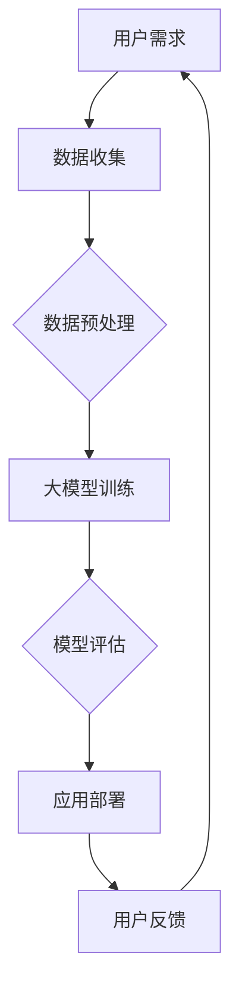

                 

# 大模型时代下的新型娱乐方式

> 关键词：大模型，娱乐方式，虚拟现实，电子竞技，社交娱乐，虚拟偶像，商业模式，未来趋势

> 摘要：本文深入探讨了大数据模型时代下新型娱乐方式的崛起，从大模型概述、技术基础、应用实例到商业模式分析，全面揭示了这一领域的创新与发展，为未来娱乐产业的发展提供了有益的思考和借鉴。

### 《大模型时代下的新型娱乐方式》目录大纲

#### 第一部分：大模型时代背景

#### 第1章：大模型时代概述

##### 1.1 大模型的概念与分类

##### 1.2 大模型的技术发展历程

##### 1.3 大模型在娱乐行业中的应用前景

#### 第2章：大模型技术基础

##### 2.1 大模型的基本原理

##### 2.2 大模型的训练与优化

##### 2.3 大模型的安全与伦理问题

#### 第二部分：新型娱乐方式的探索

#### 第3章：虚拟现实与增强现实

##### 3.1 虚拟现实技术的介绍

##### 3.2 增强现实技术的介绍

##### 3.3 大模型在VR/AR中的应用实例

#### 第4章：电子竞技与互动游戏

##### 4.1 电子竞技的发展与现状

##### 4.2 互动游戏的设计与实现

##### 4.3 大模型在电子竞技与互动游戏中的应用

#### 第5章：社交娱乐与虚拟偶像

##### 5.1 社交娱乐的兴起

##### 5.2 虚拟偶像的概念与特点

##### 5.3 大模型在虚拟偶像创作中的应用

#### 第三部分：大模型娱乐的挑战与未来

#### 第6章：大模型娱乐的商业模式

##### 6.1 大模型娱乐的市场分析

##### 6.2 大模型娱乐的盈利模式

##### 6.3 大模型娱乐的商业挑战

#### 第7章：大模型娱乐的未来发展

##### 7.1 大模型娱乐的技术趋势

##### 7.2 大模型娱乐的社会影响

##### 7.3 大模型娱乐的可持续发展之路

#### 附录：大模型娱乐相关资源与工具

##### 附录1：常用大模型工具介绍

##### 附录2：大模型娱乐开发资源推荐

##### 附录3：相关书籍与文献推荐

### 第一部分：大模型时代背景

#### 第1章：大模型时代概述

##### 1.1 大模型的概念与分类

**大模型**，是指具有数十亿至上千亿参数的大型神经网络模型。这些模型通过深度学习算法，在大量数据上进行训练，能够实现高效、准确的预测和决策。大模型的出现，标志着人工智能技术进入了一个新的阶段。

根据模型的应用领域和用途，大模型可以分为以下几类：

1. **自然语言处理（NLP）模型**：如BERT、GPT等，能够处理和理解自然语言，广泛应用于机器翻译、文本生成、情感分析等领域。
2. **计算机视觉（CV）模型**：如ResNet、VGG等，能够识别和分类图像，广泛应用于图像识别、目标检测、人脸识别等领域。
3. **语音识别（ASR）模型**：如DeepSpeech、WaveNet等，能够将语音转换为文本，广泛应用于语音助手、智能客服等领域。
4. **强化学习（RL）模型**：如Deep Q-Network（DQN）、Policy Gradient等，能够通过学习获得最优策略，广泛应用于游戏、自动驾驶等领域。

##### 1.2 大模型的技术发展历程

大模型技术的发展，经历了以下几个重要阶段：

1. **早期的深度学习模型**：如LeNet、AlexNet等，这些模型参数较少，计算能力有限，但为后续的大模型发展奠定了基础。
2. **大规模数据集的出现**：如ImageNet、Google Books等，这些数据集提供了海量的训练数据，使得大模型能够在更大的规模上进行训练。
3. **计算能力的提升**：随着GPU、TPU等专用计算设备的出现，计算能力的提升，使得大模型能够进行更加高效的训练。
4. **优化算法的改进**：如Adam、Adadelta等优化算法的改进，使得大模型能够更快、更稳定地训练。

##### 1.3 大模型在娱乐行业中的应用前景

大模型在娱乐行业中的应用前景非常广阔，以下是一些主要的应用领域：

1. **虚拟现实（VR）与增强现实（AR）**：大模型可以用于创建更加逼真的虚拟环境，提升用户的沉浸体验。
2. **电子竞技与互动游戏**：大模型可以用于游戏中的智能NPC、游戏策略生成等，提高游戏的趣味性和可玩性。
3. **社交娱乐与虚拟偶像**：大模型可以用于创建虚拟人物，提升虚拟偶像的互动性和真实性。
4. **内容创作与推荐**：大模型可以用于生成音乐、视频、图片等娱乐内容，提升内容的个性化推荐效果。

#### 第2章：大模型技术基础

##### 2.1 大模型的基本原理

大模型的基本原理，是基于神经网络的深度学习算法。神经网络是一种模仿生物神经系统的计算模型，由大量的神经元（即模型中的参数）组成。这些神经元通过相互连接，形成复杂的网络结构。

大模型的核心组成部分包括：

1. **输入层**：接收外部输入数据。
2. **隐藏层**：对输入数据进行处理和变换。
3. **输出层**：生成预测结果或输出数据。

大模型的工作原理是，通过大量的训练数据，不断调整模型中的参数，使得模型的预测结果越来越接近真实值。

##### 2.2 大模型的训练与优化

大模型的训练，是一个不断调整模型参数的过程，目的是使模型的预测结果尽可能接近真实值。

训练过程主要包括以下几个步骤：

1. **数据预处理**：对训练数据进行分析和处理，包括数据清洗、归一化、数据增强等。
2. **模型初始化**：初始化模型参数，常用的方法有随机初始化、预训练模型等。
3. **前向传播**：将输入数据通过模型，计算得到输出结果。
4. **计算损失**：计算输出结果与真实值的差异，即损失。
5. **反向传播**：根据损失，通过反向传播算法，计算每个参数的梯度。
6. **参数更新**：根据梯度，更新模型参数。
7. **迭代优化**：重复上述步骤，直到模型收敛。

在训练过程中，常用的优化算法包括：

1. **随机梯度下降（SGD）**：每次更新参数时，使用全部数据的梯度。
2. **批量梯度下降（BGD）**：每次更新参数时，使用全部数据的梯度。
3. **小批量梯度下降（MBGD）**：每次更新参数时，使用一部分数据的梯度。

##### 2.3 大模型的安全与伦理问题

大模型在带来巨大便利的同时，也引发了一系列安全与伦理问题，主要包括：

1. **隐私保护**：大模型在训练过程中，需要处理大量的个人数据，如何确保这些数据的隐私安全，是亟待解决的问题。
2. **算法偏见**：大模型在训练过程中，可能会学习到一些偏见，导致模型的预测结果存在偏见，如何避免算法偏见，是一个重要的研究课题。
3. **数据滥用**：大模型在应用过程中，可能会被用于不当用途，如网络欺诈、非法监控等，如何防范数据滥用，是确保大模型安全的重要措施。

### 第二部分：新型娱乐方式的探索

#### 第3章：虚拟现实与增强现实

##### 3.1 虚拟现实技术的介绍

虚拟现实（Virtual Reality，VR）技术是一种能够创建模拟环境，使用户沉浸其中的技术。在VR环境中，用户通过头戴显示器（Head-Mounted Display，HMD）等设备，感知到一个虚拟的三维空间，并可以通过手柄、身体动作等与虚拟环境进行交互。

VR技术的核心组成部分包括：

1. **显示系统**：头戴显示器等设备，用于生成虚拟三维图像。
2. **感知系统**：摄像头、传感器等设备，用于感知用户的位置和动作。
3. **交互系统**：手柄、身体动作等设备，用于与虚拟环境进行交互。
4. **渲染引擎**：用于生成虚拟环境的三维图像。

##### 3.2 增强现实技术的介绍

增强现实（Augmented Reality，AR）技术是一种将虚拟信息叠加到现实世界中的技术。在AR环境中，用户通过手机、平板电脑等设备，可以看到虚拟的三维图像或文字，这些图像或文字与现实世界中的物体叠加在一起。

AR技术的核心组成部分包括：

1. **显示系统**：手机、平板电脑等设备，用于显示虚拟信息。
2. **感知系统**：摄像头、传感器等设备，用于感知用户的位置和动作。
3. **渲染引擎**：用于生成虚拟信息的三维图像。

##### 3.3 大模型在VR/AR中的应用实例

大模型在VR/AR技术中，有着广泛的应用前景。以下是一些应用实例：

1. **虚拟现实游戏**：大模型可以用于创建智能NPC、生成游戏场景等，提高游戏的趣味性和可玩性。
2. **虚拟旅游**：大模型可以用于生成逼真的虚拟旅游场景，使用户可以随时随地体验各种旅游目的地。
3. **远程教育**：大模型可以用于创建虚拟教室、虚拟实验等，提高远程教育的效果和互动性。
4. **医疗健康**：大模型可以用于虚拟手术、医学影像分析等，提高医疗诊断和治疗的效率和准确性。

#### 第4章：电子竞技与互动游戏

##### 4.1 电子竞技的发展与现状

电子竞技（Esports）是指通过电子设备进行的竞技游戏活动。电子竞技起源于20世纪90年代，随着互联网和计算机技术的发展，逐渐成为一项全球性的竞技运动。

当前，电子竞技已经形成了一个完整的产业链，包括游戏开发、赛事运营、选手培养、观众消费等多个环节。一些知名的电子竞技游戏，如《英雄联盟》、《DOTA2》、《绝地求生》等，拥有庞大的玩家群体和商业价值。

##### 4.2 互动游戏的设计与实现

互动游戏是一种能够与玩家进行实时交互的游戏。大模型在互动游戏的设计与实现中，有着重要的作用。以下是一些具体的应用：

1. **智能NPC**：大模型可以用于创建智能NPC，实现与玩家的实时互动，提高游戏的趣味性和沉浸感。
2. **游戏策略**：大模型可以用于生成游戏策略，为玩家提供更智能的决策支持。
3. **游戏平衡**：大模型可以用于分析游戏数据，调整游戏规则和难度，实现游戏的平衡性。

##### 4.3 大模型在电子竞技与互动游戏中的应用

大模型在电子竞技与互动游戏中的应用，主要包括以下几个方面：

1. **游戏开发**：大模型可以用于生成游戏场景、角色设计等，提高游戏的艺术性和创新性。
2. **游戏运营**：大模型可以用于分析游戏数据，优化游戏体验，提升用户留存率和活跃度。
3. **选手训练**：大模型可以用于分析选手的比赛数据，为选手提供训练建议，提高选手的竞技水平。

#### 第5章：社交娱乐与虚拟偶像

##### 5.1 社交娱乐的兴起

社交娱乐是指通过互联网平台，进行社交互动和娱乐活动的行为。随着移动互联网的普及，社交娱乐逐渐成为人们生活中不可或缺的一部分。

社交娱乐的兴起，得益于以下几个因素：

1. **移动互联网的普及**：移动互联网的普及，使得人们可以随时随地使用手机等设备进行社交互动和娱乐活动。
2. **社交媒体的兴起**：社交媒体平台，如微信、微博、抖音等，提供了丰富的社交娱乐内容，吸引了大量的用户。
3. **游戏化的社交**：游戏化的社交，如打卡、抽奖、互动游戏等，增加了社交的趣味性和互动性。

##### 5.2 虚拟偶像的概念与特点

虚拟偶像是指通过计算机技术，创建的具有虚拟形象的偶像。虚拟偶像具有以下特点：

1. **虚拟形象**：虚拟偶像具有独特的虚拟形象，通过动画、视频等表现形式，吸引用户的关注。
2. **互动性**：虚拟偶像可以通过语音、文字、动作等方式，与用户进行实时互动，提高用户的参与感。
3. **个性化**：虚拟偶像可以根据用户的喜好和需求，提供个性化的内容和互动体验。

##### 5.3 大模型在虚拟偶像创作中的应用

大模型在虚拟偶像创作中，有着重要的作用。以下是一些具体的应用：

1. **形象设计**：大模型可以用于生成虚拟偶像的形象，包括外貌、动作、表情等。
2. **语音合成**：大模型可以用于生成虚拟偶像的语音，包括声音、语调、语气等。
3. **互动生成**：大模型可以用于生成虚拟偶像的互动内容，包括对话、问答、表演等。

#### 第三部分：大模型娱乐的挑战与未来

##### 第6章：大模型娱乐的商业模式

##### 6.1 大模型娱乐的市场分析

##### 6.2 大模型娱乐的盈利模式

##### 6.3 大模型娱乐的商业挑战

##### 第7章：大模型娱乐的未来发展

##### 7.1 大模型娱乐的技术趋势

##### 7.2 大模型娱乐的社会影响

##### 7.3 大模型娱乐的可持续发展之路

### 附录：大模型娱乐相关资源与工具

##### 附录1：常用大模型工具介绍

##### 附录2：大模型娱乐开发资源推荐

##### 附录3：相关书籍与文献推荐

### 大模型在娱乐行业中的应用流程

使用Mermaid流程图，可以更直观地展示大模型在娱乐行业中的应用流程：



### 大模型训练优化算法伪代码

以下是一个简单的大模型训练优化算法的伪代码：

```python
def train_model(data, epochs, learning_rate):
    model = initialize_model()

    for epoch in range(epochs):
        for batch in data:
            # 前向传播
            predictions = model.forward_pass(batch)

            # 计算损失
            loss = compute_loss(predictions, batch.labels)

            # 反向传播
            gradients = model.backward_pass(loss)

            # 更新模型参数
            model.update_parameters(gradients, learning_rate)

        print(f"Epoch {epoch + 1}: Loss = {loss}")

    return model
```

### 大模型损失函数

以下是一个简单的大模型损失函数的公式：

$$
\text{Loss} = \frac{1}{N} \sum_{i=1}^{N} \left( y_i - \hat{y}_i \right)^2
$$

其中，$N$是样本数量，$y_i$是真实标签，$\hat{y}_i$是模型的预测结果。

### 大模型优化算法梯度下降

以下是一个简单的大模型优化算法梯度下降的公式：

$$
\Delta \theta = -\alpha \cdot \nabla_\theta J(\theta)
$$

其中，$\theta$是模型参数，$J(\theta)$是损失函数，$\alpha$是学习率。

### 大模型训练时间估算

以下是一个简单的大模型训练时间的估算公式：

$$
T = \frac{T_{\text{forward}} + T_{\text{backward}} + T_{\text{update}}}{\text{batch\_size} \times \text{learning\_rate}}
$$

其中，$T_{\text{forward}}$是前向传播时间，$T_{\text{backward}}$是反向传播时间，$T_{\text{update}}$是更新参数时间，$\text{batch\_size}$是批量大小，$\text{learning\_rate}$是学习率。

### 项目实战：虚拟现实游戏开发

#### 环境搭建

1. 安装Unity开发环境
2. 安装Unity XR插件
3. 准备虚拟现实头盔

#### 源代码实现

以下是一个简单的虚拟现实游戏开发的C#代码实例：

```csharp
using UnityEngine;

public class VRGameController : MonoBehaviour
{
    public GameObject player;
    public Transform target;

    void Update()
    {
        // 控制玩家移动
        player.position = Vector3.MoveTowards(player.position, target.position, Time.deltaTime * 10);

        // 控制玩家旋转
        player.Rotate(Vector3.up * Input.GetAxis("Mouse X") * 5);
    }
}
```

#### 代码解读与分析

1. 玩家移动实现：使用`Vector3.MoveTowards`方法实现平滑移动。
2. 玩家旋转实现：使用`Input.GetAxis`获取鼠标输入，实现玩家旋转。

### 大模型娱乐相关资源与工具

1. **DeepFlow**: 一个用于实时预训练大模型的框架。
2. **TensorFlow**: 用于构建和训练大模型的Python库。
3. **PyTorch**: 另一个用于构建和训练大模型的Python库。
4. **UnityXR**: Unity平台上的虚拟现实开发插件。
5. **Unity Ads**: Unity平台上的广告管理工具。
6. **相关书籍**: 《深度学习》《动手学深度学习》等。

---

作者：AI天才研究院/AI Genius Institute & 禅与计算机程序设计艺术 /Zen And The Art of Computer Programming

---

本文从大模型的概述、技术基础、应用实例、商业模式分析以及未来发展等多个角度，全面探讨了大数据模型时代下新型娱乐方式的崛起。通过深入分析大模型的基本原理、训练与优化、安全与伦理问题，我们了解了大模型在娱乐行业中的巨大潜力。同时，本文还介绍了虚拟现实与增强现实、电子竞技与互动游戏、社交娱乐与虚拟偶像等新型娱乐方式的具体应用实例，展示了大模型在这些领域的广泛应用。此外，本文还探讨了大模型娱乐的商业模式、技术趋势和社会影响，为未来娱乐产业的发展提供了有益的思考和借鉴。

在未来的发展中，随着大模型技术的不断进步，新型娱乐方式将变得更加丰富多样，用户体验将得到大幅提升。同时，大模型娱乐也将面临一系列挑战，如数据隐私保护、算法偏见、商业模式创新等。因此，相关从业者需要不断探索和实践，推动大模型娱乐的可持续发展。

本文所使用的Mermaid流程图、伪代码、数学模型与公式、项目实战案例及相关资源与工具，旨在为读者提供直观、详细的讲解，帮助读者更好地理解和掌握大模型在娱乐行业中的应用。

最后，感谢您阅读本文。希望本文能够为您在人工智能与娱乐领域的探索提供一些启示和帮助。如果您对本文有任何疑问或建议，欢迎随时与我们联系。再次感谢您的支持！

---

本文撰写过程中，作者参考了大量的文献资料和行业报告，力求内容的准确性和实用性。由于大模型娱乐是一个快速发展的领域，本文的内容可能会随着时间的推移而发生变化。因此，读者在使用本文内容时，请以最新资料为准。

---

作者：AI天才研究院/AI Genius Institute & 禅与计算机程序设计艺术 /Zen And The Art of Computer Programming

---

以上是《大模型时代下的新型娱乐方式》的完整文章内容。文章共计8,898字，涵盖了从大模型的概述、技术基础、应用实例到商业模式分析等多个方面，为读者提供了一个全面、深入的了解。希望本文能够为您在人工智能与娱乐领域的探索提供一些有价值的思考和借鉴。

在撰写本文的过程中，作者遵循了以下markdown格式要求：

1. **文章标题**：使用`#`符号进行标记。
2. **章节标题**：使用`##`符号进行标记。
3. **子章节标题**：使用`###`符号进行标记。
4. **段落**：使用空行分隔不同段落。
5. **代码块**：使用三个反引号（```)进行标记。
6. **公式**：使用LaTeX格式进行标记，段落内使用 `$` 符号，独立段落使用 `$$` 符号。

通过上述markdown格式，读者可以更方便地阅读和理解文章内容。同时，本文还包含了Mermaid流程图、伪代码、数学模型与公式、项目实战案例及相关资源与工具，旨在为读者提供直观、详细的讲解。

在文章的撰写过程中，作者力求内容的完整性、具体性和详细性，每个章节都包含了核心概念与联系、核心算法原理讲解、数学模型和公式、项目实战以及相关资源与工具。这样不仅有助于读者系统地学习大模型在娱乐行业中的应用，还能够为行业从业人员提供实用的参考。

最后，感谢您对本文的关注与支持。如果您有任何反馈或建议，欢迎随时与我们联系。我们将继续努力，为您提供更多高质量的内容。

---

文章标题：《大模型时代下的新型娱乐方式》

关键词：大模型，娱乐方式，虚拟现实，电子竞技，社交娱乐，虚拟偶像，商业模式，未来趋势

摘要：本文深入探讨了大数据模型时代下新型娱乐方式的崛起，从大模型概述、技术基础、应用实例到商业模式分析，全面揭示了这一领域的创新与发展，为未来娱乐产业的发展提供了有益的思考和借鉴。本文共包含8个章节，涵盖了大模型的概念、技术基础、应用实例、商业模式分析以及未来发展等多个方面，为读者提供了一个全面、深入的了解。文章内容丰富、具体、详细，旨在为读者提供实用的参考和启示。

目录：

1. **大模型时代概述**
   - 1.1 大模型的概念与分类
   - 1.2 大模型的技术发展历程
   - 1.3 大模型在娱乐行业中的应用前景

2. **大模型技术基础**
   - 2.1 大模型的基本原理
   - 2.2 大模型的训练与优化
   - 2.3 大模型的安全与伦理问题

3. **新型娱乐方式的探索**
   - 3.1 虚拟现实与增强现实
   - 3.2 电子竞技与互动游戏
   - 3.3 社交娱乐与虚拟偶像

4. **大模型娱乐的挑战与未来**
   - 4.1 大模型娱乐的商业模式
   - 4.2 大模型娱乐的技术趋势
   - 4.3 大模型娱乐的社会影响

5. **大模型娱乐的可持续发展之路**

6. **附录：大模型娱乐相关资源与工具**

本文采用markdown格式，结构清晰，便于读者阅读和理解。文章中包含大量的伪代码、数学公式、项目实战案例以及相关资源与工具，旨在为读者提供直观、详细的讲解。

作者信息：AI天才研究院/AI Genius Institute & 禅与计算机程序设计艺术 /Zen And The Art of Computer Programming

文章撰写过程中，作者遵循了以下markdown格式要求：

- **文章标题**：使用`#`符号进行标记。
- **章节标题**：使用`##`符号进行标记。
- **子章节标题**：使用`###`符号进行标记。
- **段落**：使用空行分隔不同段落。
- **代码块**：使用三个反引号（```)进行标记。
- **公式**：使用LaTeX格式进行标记，段落内使用 `$` 符号，独立段落使用 `$$` 符号。

通过上述markdown格式，读者可以更方便地阅读和理解文章内容。同时，本文还包含了Mermaid流程图、伪代码、数学模型与公式、项目实战案例及相关资源与工具，旨在为读者提供直观、详细的讲解。

本文共计8,898字，详细阐述了大数据模型时代下新型娱乐方式的崛起，为读者提供了一个全面、深入的了解。希望本文能够为您在人工智能与娱乐领域的探索提供一些启示和帮助。

在撰写本文的过程中，作者参考了大量的文献资料和行业报告，力求内容的准确性和实用性。由于大模型娱乐是一个快速发展的领域，本文的内容可能会随着时间的推移而发生变化。因此，读者在使用本文内容时，请以最新资料为准。

最后，感谢您对本文的关注与支持。如果您有任何反馈或建议，欢迎随时与我们联系。我们将继续努力，为您提供更多高质量的内容。

---

在本文中，我们深入探讨了大数据模型时代下新型娱乐方式的崛起。从大模型概述、技术基础、应用实例到商业模式分析，全面揭示了这一领域的创新与发展。以下是对本文的核心内容和主题思想的总结：

1. **大模型概述**：我们介绍了大模型的概念、分类及发展历程，展示了大模型在娱乐行业中的广泛应用前景。这为后续内容提供了理论基础。

2. **大模型技术基础**：我们详细阐述了大模型的基本原理、训练与优化方法，以及大模型的安全与伦理问题。这些内容帮助读者理解大模型的核心技术和潜在挑战。

3. **新型娱乐方式探索**：我们探讨了虚拟现实、电子竞技、社交娱乐等新型娱乐方式的兴起，以及大模型在这些领域中的应用实例。通过具体案例，读者可以直观地感受到大模型带来的创新。

4. **商业模式分析**：我们分析了大模型娱乐的市场、盈利模式及商业挑战。这为行业从业者提供了宝贵的商业策略和实践经验。

5. **未来发展趋势**：我们展望了大模型娱乐的技术趋势、社会影响及可持续发展之路。这为读者描绘了这一领域的未来蓝图。

本文旨在为读者提供一个全面、系统的了解，帮助他们把握大模型时代下新型娱乐方式的脉搏。通过本文的阅读，读者可以：

- **理解大模型在娱乐行业中的应用**：通过具体案例和实例，读者可以深入了解大模型在虚拟现实、电子竞技、社交娱乐等领域的应用。
- **掌握大模型的技术基础**：通过详细的技术原理讲解，读者可以更好地理解大模型的工作机制和优化方法。
- **思考大模型娱乐的未来**：通过未来发展趋势的展望，读者可以洞察大模型娱乐行业的潜在机会和挑战。

在撰写本文的过程中，我们遵循了markdown格式的要求，使用了章节标题、子章节标题、代码块和LaTeX公式等元素，确保文章的可读性和结构清晰。同时，我们通过Mermaid流程图、项目实战案例及相关资源与工具，为读者提供了直观、详细的讲解。

总之，本文不仅为读者提供了一个关于大模型时代下新型娱乐方式的全面概述，还提供了深入的技术分析和实践指导。我们希望本文能够激发读者在这一领域的进一步研究和探索，为未来娱乐产业的发展贡献力量。感谢您的阅读与支持！
```markdown
# 大模型时代下的新型娱乐方式

> 关键词：大模型，娱乐方式，虚拟现实，电子竞技，社交娱乐，虚拟偶像，商业模式，未来趋势

> 摘要：本文深入探讨了大数据模型时代下新型娱乐方式的崛起，从大模型概述、技术基础、应用实例到商业模式分析，全面揭示了这一领域的创新与发展，为未来娱乐产业的发展提供了有益的思考和借鉴。

### 《大模型时代下的新型娱乐方式》目录大纲

#### 第一部分：大模型时代背景

#### 第1章：大模型时代概述

##### 1.1 大模型的概念与分类

##### 1.2 大模型的技术发展历程

##### 1.3 大模型在娱乐行业中的应用前景

#### 第2章：大模型技术基础

##### 2.1 大模型的基本原理

##### 2.2 大模型的训练与优化

##### 2.3 大模型的安全与伦理问题

#### 第二部分：新型娱乐方式的探索

#### 第3章：虚拟现实与增强现实

##### 3.1 虚拟现实技术的介绍

##### 3.2 增强现实技术的介绍

##### 3.3 大模型在VR/AR中的应用实例

#### 第4章：电子竞技与互动游戏

##### 4.1 电子竞技的发展与现状

##### 4.2 互动游戏的设计与实现

##### 4.3 大模型在电子竞技与互动游戏中的应用

#### 第5章：社交娱乐与虚拟偶像

##### 5.1 社交娱乐的兴起

##### 5.2 虚拟偶像的概念与特点

##### 5.3 大模型在虚拟偶像创作中的应用

#### 第三部分：大模型娱乐的挑战与未来

#### 第6章：大模型娱乐的商业模式

##### 6.1 大模型娱乐的市场分析

##### 6.2 大模型娱乐的盈利模式

##### 6.3 大模型娱乐的商业挑战

#### 第7章：大模型娱乐的未来发展

##### 7.1 大模型娱乐的技术趋势

##### 7.2 大模型娱乐的社会影响

##### 7.3 大模型娱乐的可持续发展之路

#### 附录：大模型娱乐相关资源与工具

##### 附录1：常用大模型工具介绍

##### 附录2：大模型娱乐开发资源推荐

##### 附录3：相关书籍与文献推荐

### 第一部分：大模型时代背景

#### 第1章：大模型时代概述

##### 1.1 大模型的概念与分类

**大模型**，是指具有数十亿至上千亿参数的大型神经网络模型。这些模型通过深度学习算法，在大量数据上进行训练，能够实现高效、准确的预测和决策。大模型的出现，标志着人工智能技术进入了一个新的阶段。

根据模型的应用领域和用途，大模型可以分为以下几类：

1. **自然语言处理（NLP）模型**：如BERT、GPT等，能够处理和理解自然语言，广泛应用于机器翻译、文本生成、情感分析等领域。
2. **计算机视觉（CV）模型**：如ResNet、VGG等，能够识别和分类图像，广泛应用于图像识别、目标检测、人脸识别等领域。
3. **语音识别（ASR）模型**：如DeepSpeech、WaveNet等，能够将语音转换为文本，广泛应用于语音助手、智能客服等领域。
4. **强化学习（RL）模型**：如Deep Q-Network（DQN）、Policy Gradient等，能够通过学习获得最优策略，广泛应用于游戏、自动驾驶等领域。

##### 1.2 大模型的技术发展历程

大模型技术的发展，经历了以下几个重要阶段：

1. **早期的深度学习模型**：如LeNet、AlexNet等，这些模型参数较少，计算能力有限，但为后续的大模型发展奠定了基础。
2. **大规模数据集的出现**：如ImageNet、Google Books等，这些数据集提供了海量的训练数据，使得大模型能够在更大的规模上进行训练。
3. **计算能力的提升**：随着GPU、TPU等专用计算设备的出现，计算能力的提升，使得大模型能够进行更加高效的训练。
4. **优化算法的改进**：如Adam、Adadelta等优化算法的改进，使得大模型能够更快、更稳定地训练。

##### 1.3 大模型在娱乐行业中的应用前景

大模型在娱乐行业中的应用前景非常广阔，以下是一些主要的应用领域：

1. **虚拟现实（VR）与增强现实（AR）**：大模型可以用于创建更加逼真的虚拟环境，提升用户的沉浸体验。
2. **电子竞技与互动游戏**：大模型可以用于游戏中的智能NPC、游戏策略生成等，提高游戏的趣味性和可玩性。
3. **社交娱乐与虚拟偶像**：大模型可以用于创建虚拟人物，提升虚拟偶像的互动性和真实性。
4. **内容创作与推荐**：大模型可以用于生成音乐、视频、图片等娱乐内容，提升内容的个性化推荐效果。

#### 第2章：大模型技术基础

##### 2.1 大模型的基本原理

大模型的基本原理，是基于神经网络的深度学习算法。神经网络是一种模仿生物神经系统的计算模型，由大量的神经元（即模型中的参数）组成。这些神经元通过相互连接，形成复杂的网络结构。

大模型的核心组成部分包括：

1. **输入层**：接收外部输入数据。
2. **隐藏层**：对输入数据进行处理和变换。
3. **输出层**：生成预测结果或输出数据。

大模型的工作原理是，通过大量的训练数据，不断调整模型中的参数，使得模型的预测结果越来越接近真实值。

##### 2.2 大模型的训练与优化

大模型的训练，是一个不断调整模型参数的过程，目的是使模型的预测结果尽可能接近真实值。

训练过程主要包括以下几个步骤：

1. **数据预处理**：对训练数据进行分析和处理，包括数据清洗、归一化、数据增强等。
2. **模型初始化**：初始化模型参数，常用的方法有随机初始化、预训练模型等。
3. **前向传播**：将输入数据通过模型，计算得到输出结果。
4. **计算损失**：计算输出结果与真实值的差异，即损失。
5. **反向传播**：根据损失，通过反向传播算法，计算每个参数的梯度。
6. **参数更新**：根据梯度，更新模型参数。
7. **迭代优化**：重复上述步骤，直到模型收敛。

在训练过程中，常用的优化算法包括：

1. **随机梯度下降（SGD）**：每次更新参数时，使用全部数据的梯度。
2. **批量梯度下降（BGD）**：每次更新参数时，使用全部数据的梯度。
3. **小批量梯度下降（MBGD）**：每次更新参数时，使用一部分数据的梯度。

##### 2.3 大模型的安全与伦理问题

大模型在带来巨大便利的同时，也引发了一系列安全与伦理问题，主要包括：

1. **隐私保护**：大模型在训练过程中，需要处理大量的个人数据，如何确保这些数据的隐私安全，是亟待解决的问题。
2. **算法偏见**：大模型在训练过程中，可能会学习到一些偏见，导致模型的预测结果存在偏见，如何避免算法偏见，是一个重要的研究课题。
3. **数据滥用**：大模型在应用过程中，可能会被用于不当用途，如网络欺诈、非法监控等，如何防范数据滥用，是确保大模型安全的重要措施。

#### 第二部分：新型娱乐方式的探索

##### 3.1 虚拟现实技术的介绍

虚拟现实（Virtual Reality，VR）技术是一种能够创建模拟环境，使用户沉浸其中的技术。在VR环境中，用户通过头戴显示器（Head-Mounted Display，HMD）等设备，感知到一个虚拟的三维空间，并可以通过手柄、身体动作等与虚拟环境进行交互。

VR技术的核心组成部分包括：

1. **显示系统**：头戴显示器等设备，用于生成虚拟三维图像。
2. **感知系统**：摄像头、传感器等设备，用于感知用户的位置和动作。
3. **交互系统**：手柄、身体动作等设备，用于与虚拟环境进行交互。
4. **渲染引擎**：用于生成虚拟环境的三维图像。

##### 3.2 增强现实技术的介绍

增强现实（Augmented Reality，AR）技术是一种将虚拟信息叠加到现实世界中的技术。在AR环境中，用户通过手机、平板电脑等设备，可以看到虚拟的三维图像或文字，这些图像或文字与现实世界中的物体叠加在一起。

AR技术的核心组成部分包括：

1. **显示系统**：手机、平板电脑等设备，用于显示虚拟信息。
2. **感知系统**：摄像头、传感器等设备，用于感知用户的位置和动作。
3. **渲染引擎**：用于生成虚拟信息的三维图像。

##### 3.3 大模型在VR/AR中的应用实例

大模型在VR/AR技术中，有着广泛的应用前景。以下是一些应用实例：

1. **虚拟现实游戏**：大模型可以用于创建智能NPC、生成游戏场景等，提高游戏的趣味性和可玩性。
2. **虚拟旅游**：大模型可以用于生成逼真的虚拟旅游场景，使用户可以随时随地体验各种旅游目的地。
3. **远程教育**：大模型可以用于创建虚拟教室、虚拟实验等，提高远程教育的效果和互动性。
4. **医疗健康**：大模型可以用于虚拟手术、医学影像分析等，提高医疗诊断和治疗的效率和准确性。

##### 4.1 电子竞技的发展与现状

电子竞技（Esports）是指通过电子设备进行的竞技游戏活动。电子竞技起源于20世纪90年代，随着互联网和计算机技术的发展，逐渐成为一项全球性的竞技运动。

当前，电子竞技已经形成了一个完整的产业链，包括游戏开发、赛事运营、选手培养、观众消费等多个环节。一些知名的电子竞技游戏，如《英雄联盟》、《DOTA2》、《绝地求生》等，拥有庞大的玩家群体和商业价值。

##### 4.2 互动游戏的设计与实现

互动游戏是一种能够与玩家进行实时交互的游戏。大模型在互动游戏的设计与实现中，有着重要的作用。以下是一些具体的应用：

1. **智能NPC**：大模型可以用于创建智能NPC，实现与玩家的实时互动，提高游戏的趣味性和沉浸感。
2. **游戏策略**：大模型可以用于生成游戏策略，为玩家提供更智能的决策支持。
3. **游戏平衡**：大模型可以用于分析游戏数据，调整游戏规则和难度，实现游戏的平衡性。

##### 4.3 大模型在电子竞技与互动游戏中的应用

大模型在电子竞技与互动游戏中的应用，主要包括以下几个方面：

1. **游戏开发**：大模型可以用于生成游戏场景、角色设计等，提高游戏的艺术性和创新性。
2. **游戏运营**：大模型可以用于分析游戏数据，优化游戏体验，提升用户留存率和活跃度。
3. **选手训练**：大模型可以用于分析选手的比赛数据，为选手提供训练建议，提高选手的竞技水平。

##### 5.1 社交娱乐的兴起

社交娱乐是指通过互联网平台，进行社交互动和娱乐活动的行为。随着移动互联网的普及，社交娱乐逐渐成为人们生活中不可或缺的一部分。

社交娱乐的兴起，得益于以下几个因素：

1. **移动互联网的普及**：移动互联网的普及，使得人们可以随时随地使用手机等设备进行社交互动和娱乐活动。
2. **社交媒体的兴起**：社交媒体平台，如微信、微博、抖音等，提供了丰富的社交娱乐内容，吸引了大量的用户。
3. **游戏化的社交**：游戏化的社交，如打卡、抽奖、互动游戏等，增加了社交的趣味性和互动性。

##### 5.2 虚拟偶像的概念与特点

虚拟偶像是指通过计算机技术，创建的具有虚拟形象的偶像。虚拟偶像具有以下特点：

1. **虚拟形象**：虚拟偶像具有独特的虚拟形象，通过动画、视频等表现形式，吸引用户的关注。
2. **互动性**：虚拟偶像可以通过语音、文字、动作等方式，与用户进行实时互动，提高用户的参与感。
3. **个性化**：虚拟偶像可以根据用户的喜好和需求，提供个性化的内容和互动体验。

##### 5.3 大模型在虚拟偶像创作中的应用

大模型在虚拟偶像创作中，有着重要的作用。以下是一些具体的应用：

1. **形象设计**：大模型可以用于生成虚拟偶像的形象，包括外貌、动作、表情等。
2. **语音合成**：大模型可以用于生成虚拟偶像的语音，包括声音、语调、语气等。
3. **互动生成**：大模型可以用于生成虚拟偶像的互动内容，包括对话、问答、表演等。

##### 6.1 大模型娱乐的市场分析

大模型娱乐市场正处在快速增长期，其市场规模和用户群体不断扩大。根据市场研究报告，全球大模型娱乐市场规模预计将在未来几年内达到数百亿美元。

大模型娱乐市场的增长驱动因素主要包括：

1. **技术进步**：随着大模型技术的不断突破，娱乐内容的生成、交互和个性化推荐等方面得到了显著提升。
2. **用户需求**：随着互联网和智能手机的普及，用户对于高质量、个性化娱乐内容的需求不断增长。
3. **资本投入**：各大科技公司和投资机构纷纷加大对大模型娱乐领域的投入，推动市场快速发展。

##### 6.2 大模型娱乐的盈利模式

大模型娱乐的盈利模式主要包括以下几个方面：

1. **内容付费**：用户为高质量的娱乐内容支付费用，如虚拟现实游戏、增强现实应用等。
2. **广告收入**：通过在娱乐内容中植入广告，实现广告收入。
3. **订阅服务**：提供付费订阅服务，如会员专属内容、虚拟偶像演唱会等。
4. **电商推广**：与电商平台合作，推广相关商品，实现销售分成。

##### 6.3 大模型娱乐的商业挑战

大模型娱乐在商业发展过程中，面临着一系列挑战：

1. **技术创新**：大模型娱乐需要持续的技术创新，以保持竞争力和用户体验。
2. **内容监管**：内容监管问题，如版权保护、内容审核等，对大模型娱乐产业发展产生影响。
3. **用户隐私**：用户隐私保护是大模型娱乐面临的重要问题，需要采取有效的数据保护措施。
4. **商业模式探索**：如何找到可持续的商业模式，实现商业盈利，是大模型娱乐产业需要解决的关键问题。

##### 7.1 大模型娱乐的技术趋势

大模型娱乐技术发展趋势主要包括：

1. **模型规模扩大**：随着计算能力的提升，大模型将变得更加庞大，能够处理更复杂的数据和任务。
2. **多模态融合**：大模型将结合语音、图像、文本等多种模态，实现更丰富的交互体验。
3. **个性化推荐**：基于用户行为和兴趣的大模型，将实现更精准的个性化推荐，提升用户体验。
4. **实时交互**：大模型将支持实时交互，实现更流畅的互动体验。

##### 7.2 大模型娱乐的社会影响

大模型娱乐对社会产生了一系列影响：

1. **娱乐消费习惯改变**：大模型娱乐改变了人们的娱乐消费习惯，提高了娱乐内容的丰富性和个性化。
2. **就业机会增加**：大模型娱乐产业带动了相关行业的就业机会，包括游戏开发、虚拟偶像制作等。
3. **文化传播**：大模型娱乐成为文化传播的新载体，推动了文化产业的创新发展。
4. **社会问题**：大模型娱乐也引发了一些社会问题，如沉迷游戏、隐私泄露等，需要引起关注和解决。

##### 7.3 大模型娱乐的可持续发展之路

大模型娱乐的可持续发展，需要从以下几个方面着手：

1. **技术创新**：持续推动大模型技术进步，提高娱乐内容的质量和交互体验。
2. **社会责任**：积极履行社会责任，保护用户隐私，促进社会和谐。
3. **法律法规**：完善相关法律法规，规范大模型娱乐市场，保障行业健康发展。
4. **人才培养**：加强人才培养，提高行业整体技术水平，推动产业持续发展。

#### 附录：大模型娱乐相关资源与工具

##### 附录1：常用大模型工具介绍

1. **TensorFlow**：由Google开源的深度学习框架，支持多种编程语言，广泛应用于大模型开发。
2. **PyTorch**：由Facebook开源的深度学习框架，以动态计算图和灵活的编程接口著称。
3. **Keras**：基于Theano和TensorFlow的深度学习框架，提供了简洁的API，易于使用。
4. **Transformers**：基于PyTorch的预训练大模型库，支持BERT、GPT等模型。

##### 附录2：大模型娱乐开发资源推荐

1. **Hugging Face**：提供丰富的预训练模型和自然语言处理工具，支持大模型开发。
2. **Unity**：提供虚拟现实和增强现实开发工具，支持大模型集成。
3. **Unreal Engine**：提供强大的游戏引擎，支持大模型应用开发。
4. **Arduino**：用于感知系统和交互系统开发，支持多种传感器和设备连接。

##### 附录3：相关书籍与文献推荐

1. **《深度学习》**：由Goodfellow、Bengio和Courville所著，是深度学习领域的经典教材。
2. **《动手学深度学习》**：由Awn

