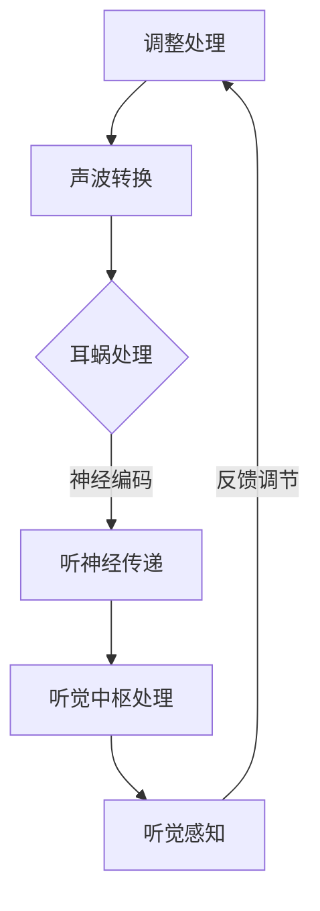

                 

## 文章标题：大脑的听觉与神经元

> 关键词：大脑、听觉、神经元、神经编码、听觉信号处理、人工神经网络

> 摘要：本文旨在深入探讨大脑的听觉机制及其与神经元之间的联系。通过分析听觉系统的组成与功能、神经元的基本原理及其在听觉信号处理中的作用，本文将揭示听觉与神经元的复杂互动关系。同时，还将探讨听觉与神经网络的交叉研究及其在临床应用中的潜力，为理解听觉功能障碍的诊断与治疗提供新思路。

## 目录大纲

1. **第一部分：听觉系统的基本概念**
   1.1 听觉系统的组成与功能
   1.2 听觉信号传递过程
   1.3 听觉功能的重要性
   1.4 听觉信息处理的基本原理
   1.5 耳蜗与耳蜗微音器电位
   1.6 听神经与听觉中枢

2. **第二部分：神经元的基本原理**
   2.1 神经元结构与功能
   2.2 神经元的电生理特性
   2.3 神经元的信号传递过程
   2.4 神经元的类型与功能
   2.5 突触前神经元
   2.6 突触后神经元
   2.7 特种神经元

3. **第三部分：听觉与神经元的联系**
   3.1 听觉信息的神经编码
   3.2 听觉信息处理的神经网络模型
   3.3 听觉信息处理中的神经可塑性
   3.4 神经元对听觉信号的加工
   3.5 神经元对声音特性的识别
   3.6 神经元对声音信号的处理能力

4. **第四部分：高级主题**
   4.1 听觉与神经网络的交叉研究
   4.2 人工神经网络在听觉信号处理中的应用
   4.3 神经网络在听觉障碍诊断中的应用
   4.4 听觉神经网络的未来发展趋势
   4.5 听觉与神经元的跨学科研究
   4.6 听觉与神经元的跨学科研究挑战
   4.7 听觉与神经元跨学科研究的展望

5. **附录**
   5.1 相关术语解释
   5.2 参考资料列表

### 第一部分：听觉系统的基本概念

#### 1.1 听觉系统的组成与功能

听觉系统是人类感知外界声音的重要器官，由多个关键部分组成。主要组成部分包括外耳、中耳和内耳。

- **外耳**：外耳由耳廓、耳道和外耳道组成，其主要功能是收集声音并将声波传递到中耳。
- **中耳**：中耳包括鼓膜、听骨链（锤骨、砧骨、镫骨）和咽鼓管。鼓膜接收声波并产生振动，通过听骨链将振动传递到内耳。咽鼓管则连接中耳和鼻咽部，有助于维持中耳内气压的平衡。
- **内耳**：内耳由耳蜗、前庭和半规管组成。耳蜗是听觉信号的主要转换和处理中心，前庭和半规管则负责感知头部位置和运动。

听觉系统的功能在于将声波转换为电信号，并将其传递到大脑，最终产生听觉感知。

#### 1.1.1 听觉系统的解剖结构

- **外耳解剖结构**：耳廓的主要作用是收集声波并将其引导到耳道。耳道的主要作用是传输声波到鼓膜。

- **中耳解剖结构**：鼓膜是中耳的主要结构，其形状类似于一个绷紧的膜。听骨链由锤骨、砧骨和镫骨组成，它们通过杠杆原理放大鼓膜的振动。

- **内耳解剖结构**：耳蜗是内耳的核心部分，其形状类似于一个蜗牛壳。耳蜗内部有许多听觉感受器，称为毛细胞，它们将机械振动转换为电信号。前庭和半规管则含有感受头部位置和运动的毛细胞。

#### 1.1.2 听觉信号传递过程

听觉信号的传递过程可以分为以下几个步骤：

1. **声波收集**：声波通过外耳进入耳道，并到达鼓膜。
2. **鼓膜振动**：声波引起鼓膜的振动，振动通过听骨链传递到内耳。
3. **耳蜗作用**：振动传递到耳蜗，使耳蜗内的液体产生流动，从而刺激毛细胞。
4. **电信号产生**：毛细胞将机械振动转换为电信号，这些信号通过听觉神经传递到大脑。
5. **大脑处理**：大脑对电信号进行处理，最终产生听觉感知。

#### 1.1.3 听觉功能的重要性

听觉功能在人类生活中起着至关重要的作用。以下是一些关键点：

- **沟通**：听觉是人类沟通的主要渠道之一，通过听觉可以理解和交流语言。
- **环境感知**：听觉帮助我们感知环境，例如识别声音源、预测潜在的危险。
- **文化和社会活动**：音乐、讲故事和演讲等文化和社会活动都依赖于听觉。
- **情感和情绪**：声音可以影响我们的情感和情绪，如音乐可以激发愉悦或悲伤的情感。

### 第一部分：听觉系统的基本概念

#### 1.2 听觉信息处理的基本原理

听觉信息处理是一个复杂的过程，涉及到多个层次和阶段。以下是听觉信息处理的基本原理：

1. **声波与听觉感知**：声波通过外耳传入耳道，引起鼓膜的振动。这些振动通过听骨链传递到内耳，最终刺激耳蜗内的毛细胞。

2. **耳蜗与耳蜗微音器电位**：耳蜗内的毛细胞将机械振动转换为电信号。这些电信号称为耳蜗微音器电位，它们是听觉信息的基础。

3. **听神经与听觉中枢**：耳蜗微音器电位通过听神经传递到大脑。听神经是连接耳蜗和大脑的主要神经通道。听觉中枢位于大脑皮层，负责处理和解释来自听神经的信号。

4. **听觉感知的形成**：大脑对来自听觉中枢的信号进行处理，将其转换为可识别的声音。这一过程涉及到频率分析、强度分析、空间定位等。

#### 1.2.1 声波与听觉感知

声波是一种机械波，通过振动介质传播。声波的产生和传播涉及到以下几个关键概念：

- **声源**：声波的产生源，如声带振动、乐器振动等。
- **介质**：声波传播的介质，如空气、水等。
- **波速**：声波在介质中的传播速度，取决于介质的性质。
- **波长**：声波的周期性振动长度。
- **频率**：声波每秒振动的次数，单位为赫兹（Hz）。
- **振幅**：声波的振动幅度，决定了声音的强度。

听觉感知的形成过程可以概括为：

1. **声波接收**：外耳接收声波，并将其引导到耳道。
2. **鼓膜振动**：声波引起鼓膜的振动。
3. **听骨链传递**：振动通过听骨链传递到内耳。
4. **耳蜗转换**：振动转换为耳蜗微音器电位。
5. **听神经传递**：电信号通过听神经传递到大脑。
6. **大脑处理**：大脑对信号进行处理，形成听觉感知。

#### 1.2.2 耳蜗与耳蜗微音器电位

耳蜗是内耳的关键部分，负责将声波转换为电信号。耳蜗内部有许多微小的毛细胞，它们对声波的振动敏感。

- **耳蜗的结构**：耳蜗由三个主要的液体空间组成，分别是前庭膜、基底膜和蜗顶膜。毛细胞位于基底膜上，它们通过纤毛的弯曲产生电信号。
- **耳蜗微音器电位**：当声波引起耳蜗内液体的振动时，毛细胞的纤毛会弯曲，从而产生电信号。这些电信号被称为耳蜗微音器电位。

耳蜗微音器电位是听觉信号的基础，它们通过听神经传递到大脑，最终形成听觉感知。

#### 1.2.3 听神经与听觉中枢

听神经是连接耳蜗和大脑的主要神经通道。它由数千个神经纤维组成，负责将耳蜗微音器电位传递到大脑。

- **听神经的传递过程**：耳蜗微音器电位通过听神经纤维传递到大脑。这些神经纤维分为两个主要部分，即耳蜗神经和前庭神经。耳蜗神经主要传递与听觉相关的信号，而前庭神经主要传递与平衡相关的信号。
- **听觉中枢**：听觉中枢位于大脑皮层，负责处理和解释来自听神经的信号。听觉中枢包括多个区域，如颞叶、岛叶和顶叶。

听觉中枢对听神经传递的信号进行解析、分类和整合，最终形成听觉感知。

### 第二部分：神经元的基本原理

#### 2.1 神经元结构与功能

神经元是神经系统中最基本的单位，负责传递和处理信息。神经元的基本结构包括细胞体、树突、轴突和突触。

- **细胞体**：细胞体是神经元的中心，包含细胞核和其他细胞器，负责维持神经元的生命活动。
- **树突**：树突是神经元的接收部分，从细胞体伸出，用于接收其他神经元传递的信号。
- **轴突**：轴突是神经元的传递部分，从细胞体伸出，负责将信号传递到其他神经元或肌肉细胞。
- **突触**：突触是神经元之间的连接点，通过化学或电信号将信息从一个神经元传递到另一个神经元。

神经元的基本功能包括信号接收、信号传递和信号处理。神经元通过树突接收信号，通过轴突传递信号，并通过突触与其他神经元进行交互。

#### 2.1.1 神经元的解剖结构

神经元的解剖结构可以分为以下几个部分：

- **细胞膜**：细胞膜是神经元的外部边界，由脂质双层和蛋白质构成，负责维持细胞内外环境的稳定。
- **细胞核**：细胞核位于细胞体内部，包含遗传物质DNA，负责控制细胞的生长和分裂。
- **线粒体**：线粒体是细胞的能量工厂，负责产生细胞所需的能量。
- **内质网**：内质网是一种复杂的膜系统，负责蛋白质的合成和运输。
- **高尔基体**：高尔基体负责对蛋白质进行加工和包装，然后将其运输到细胞膜或分泌到细胞外。
- **突触前膜和突触后膜**：突触前膜和突触后膜是神经元之间的连接部分，通过化学或电信号进行信息传递。

#### 2.1.2 神经元的电生理特性

神经元的电生理特性包括静息电位、动作电位和突触传递。

- **静息电位**：神经元在未受到刺激时，细胞膜内外存在电位差，称为静息电位。静息电位通常为负值，约为-70毫伏。
- **动作电位**：当神经元受到足够的刺激时，会发生动作电位。动作电位是一个短暂的、快速的、正向的电信号，通常在神经元轴突上产生。动作电位的产生涉及到离子通道的开放和关闭。
- **突触传递**：神经元通过突触与其他神经元进行信息传递。突触传递可以分为化学传递和电传递。在化学传递中，神经递质通过突触前膜释放到突触间隙，然后与突触后膜上的受体结合，产生信号传递。在电传递中，电信号通过突触直接传递到下一个神经元。

#### 2.1.3 神经元的信号传递过程

神经元的信号传递过程可以分为以下几个步骤：

1. **树突接收信号**：树突通过受体蛋白接收其他神经元传递的化学或电信号。
2. **产生电位变化**：信号在树突上引起电位变化，称为局部电位。
3. **整合信号**：细胞体将多个局部电位整合，形成一个整体的电位变化。
4. **产生动作电位**：当电位变化达到阈值时，神经元产生动作电位。
5. **轴突传递动作电位**：动作电位沿着轴突向下传播，到达突触。
6. **突触传递信号**：动作电位通过突触传递到下一个神经元，或者传递到肌肉细胞或腺体。

神经元的信号传递过程是一个高度复杂和精细的过程，涉及到多个层次和机制。这一过程确保了神经系统能够高效地传递和处理信息。

### 第二部分：神经元的基本原理

#### 2.2 神经元的电生理特性

神经元的电生理特性是理解其信息传递和处理机制的关键。以下是神经元电生理特性的详细解释：

- **静息电位**：神经元在未受到刺激时，细胞膜内外存在一个稳定的电位差，称为静息电位。静息电位通常为负值，约为-70毫伏。这种电位差是由于细胞膜对钾离子（K+）的高通透性和对钠离子（Na+）的低通透性所导致的。静息电位的存在使得神经元能够维持稳定的内部环境，并准备好响应外部刺激。

- **动作电位**：当神经元受到足够的刺激时，会发生动作电位。动作电位是一个短暂的、快速的、正向的电信号，通常在神经元轴突上产生。动作电位的产生涉及到离子通道的开放和关闭。具体来说，当神经元受到刺激时，细胞膜上的电压门控钠离子通道会开放，导致钠离子（Na+）迅速流入细胞内，使得细胞膜电位迅速变为正值。随后，电压门控钠离子通道关闭，电压门控钾离子通道开放，钾离子（K+）流出细胞，使得细胞膜电位迅速回到静息电位水平。这一过程通常持续数毫秒。

- **动作电位的传播**：动作电位在神经元轴突上以电信号的形式传播。当动作电位在一个神经元的轴突末端产生时，它会引起相邻区域膜电位的改变，使得动作电位向前传播。这种传播是通过局部电流在膜上的流动实现的。动作电位的传播速度取决于神经元的类型和轴突的直径，通常在1-100米/秒之间。

- **复极化**：动作电位后，神经元经历一个称为复极化的过程。复极化是由于电压门控钾离子通道的持续开放，使得钾离子（K+）流出细胞，导致细胞膜电位逐渐恢复到静息电位水平。

- **绝对不应期和相对不应期**：在动作电位产生后，神经元进入一个称为绝对不应期的阶段，在这段时间内，神经元无法再次产生动作电位。随后，神经元进入相对不应期，在这段时间内，神经元可以产生动作电位，但需要更大的刺激强度。

- **神经元的电兴奋性**：神经元的电兴奋性是指其对刺激产生动作电位的能力。兴奋性可以通过兴奋性递质的释放和受体激活来调节。兴奋性递质如谷氨酸和天冬氨酸可以激活突触前膜的受体，增加动作电位的产生。

- **神经元的抑制**：神经元的抑制是指通过抑制性递质如GABA和甘氨酸来减少动作电位的产生。抑制性递质通过激活突触前膜的抑制性受体，降低神经元的兴奋性。

神经元的电生理特性是神经信息传递和处理的基础。通过对神经元电生理特性的理解，我们可以更好地理解神经系统的工作原理和功能。

### 第二部分：神经元的基本原理

#### 2.3 神经元的信号传递过程

神经元的信号传递过程是一个高度复杂和精细的过程，涉及到多个层次和机制。以下是神经元信号传递过程的详细步骤：

1. **信号接收**：神经元通过树突接收其他神经元传递的信号。这些信号可以是电信号或化学信号。电信号通常通过突触前膜的电位变化传递，而化学信号则通过神经递质在突触间隙中的传递。

2. **电位变化**：当信号到达树突时，它会引起树突膜上的电位变化。这种电位变化称为局部电位。局部电位是一种逐渐衰减的电信号，它可以在神经元内部传播。

3. **信号整合**：神经元细胞体将对多个局部电位进行整合，以决定是否产生动作电位。这种整合过程涉及到细胞体内复杂的电生理机制，如离子通道的活动和电导的变化。

4. **产生动作电位**：当细胞体内的电位变化达到阈值时，神经元将产生动作电位。动作电位是一种快速的、电信号，它在神经元轴突上传播。

5. **动作电位的传播**：动作电位在神经元轴突上以电信号的形式传播。动作电位的传播速度取决于神经元的类型和轴突的直径，通常在1-100米/秒之间。动作电位的传播是通过局部电流在膜上的流动实现的。

6. **突触传递**：当动作电位到达突触时，它会触发突触前膜释放神经递质。神经递质通过突触间隙传递到突触后膜，并与突触后膜上的受体结合。

7. **受体激活**：神经递质与突触后膜上的受体结合后，会激活这些受体。受体的激活可以导致突触后膜上的离子通道开放或关闭，从而改变突触后膜的电位。

8. **信号传递到下一个神经元**：激活后的突触后膜电位变化可以引起下一个神经元的树突电位变化，从而传递信号到下一个神经元。

9. **信号终止**：神经递质在突触间隙中的寿命有限，通常在几毫秒到几十毫秒内分解或被重摄取。这种机制确保了神经信号的传递是短暂的，从而避免了持续兴奋或抑制。

神经元的信号传递过程是一个高度动态和可调节的过程，它确保了神经系统能够高效、精确地传递和处理信息。这一过程涉及到多个层次和机制，如离子通道、神经递质、受体和细胞内信号转导途径等。

### 第二部分：神经元的基本原理

#### 2.4 神经元的类型与功能

神经元在神经系统中扮演着多种角色，根据其在神经系统中的功能和结构特征，可以将神经元分为不同类型。以下是神经元的主要类型及其功能：

- **感觉神经元**：感觉神经元，也称为传入神经元，主要负责将外部环境和内部状态的信息传递到中枢神经系统。这些神经元分布在全身的各个部位，如皮肤、肌肉、内脏和眼睛等。感觉神经元通过其树突接收外部或内部刺激，并将这些刺激转化为电信号，通过轴突传递到中枢神经系统。感觉神经元的主要功能是感知外部世界，如触觉、视觉、听觉、嗅觉和味觉等。

- **运动神经元**：运动神经元，也称为传出神经元，主要负责将中枢神经系统的指令传递到肌肉和腺体，以产生运动和分泌活动。运动神经元位于中枢神经系统的运动中枢，如大脑皮层、脑干和脊髓等。这些神经元通过轴突与肌肉和腺体相连，通过释放神经递质来控制肌肉收缩和腺体分泌。运动神经元的主要功能是实现自主运动和生理调节。

- **中间神经元**：中间神经元，也称为联络神经元，位于中枢神经系统内，连接感觉神经元和运动神经元。它们主要负责在中枢神经系统内部传递信息，协调感觉和运动活动。中间神经元通过其复杂的网络结构，实现大脑对信息的加工和处理。它们在神经系统中起到信息整合和调控的作用。

根据神经元的细胞结构和功能特点，可以将中间神经元进一步分为以下几种：

- **多极神经元**：多极神经元具有一个细胞体和多个树突和轴突。它们广泛存在于中枢神经系统中，连接不同的神经元和神经通路。多极神经元在神经系统中起到信息传递和整合的作用。

- **假单极神经元**：假单极神经元有一个细胞体和一个树突，但轴突分为两个分支。这类神经元主要分布在脊神经中，负责传递痛觉和温度觉信息。

- **双极神经元**：双极神经元有一个细胞体和一个短树突和一个长轴突。它们主要分布在视网膜和内耳等部位，负责传递视觉和听觉信息。

- **多极运动神经元**：多极运动神经元有一个细胞体和一个长的轴突，它们主要位于大脑皮层和脑干中，负责控制骨骼肌的运动。

不同类型的神经元在神经系统中扮演着不同的角色，共同协作实现神经系统的功能。通过了解神经元的类型和功能，我们可以更好地理解神经系统的工作机制和神经疾病的发病机制。

### 第二部分：神经元的基本原理

#### 2.5 突触前神经元

突触前神经元是神经元中的一种，负责将电信号转换为化学信号，并通过神经递质传递信息到突触后神经元。突触前神经元在信息传递过程中起着关键作用，其结构和功能如下：

- **结构特征**：
  - **细胞体**：突触前神经元具有细胞体，包含细胞核和其他细胞器，负责维持细胞的正常功能。
  - **树突**：突触前神经元的树突较短，主要负责接收来自其他神经元的电信号。
  - **轴突**：突触前神经元的轴突较长，其末端形成突触前膜，与突触后神经元相连。

- **功能机制**：
  - **电信号转换为化学信号**：当突触前神经元接收电信号时，细胞体内的电压门控钙离子通道会开放，导致钙离子（Ca2+）流入细胞内。钙离子的流入触发神经递质的释放。
  - **神经递质释放**：神经递质存储在突触小泡中，当钙离子与突触小泡膜上的钙离子受体结合后，触发小泡与突触前膜融合，释放神经递质到突触间隙。
  - **神经递质传递**：神经递质在突触间隙中扩散，并与突触后神经元膜上的特异性受体结合，激活受体并导致离子通道的开放或关闭，从而产生电信号。

突触前神经元通过上述机制实现电信号向化学信号的转换，并有效地将信息传递到突触后神经元。

### 第二部分：神经元的基本原理

#### 2.6 突触后神经元

突触后神经元是神经元中的一种，其功能是接收来自突触前神经元的神经递质，并将其转换为电信号，从而继续传递信息。突触后神经元在信息传递过程中起着关键作用，其结构和功能如下：

- **结构特征**：
  - **细胞体**：突触后神经元具有细胞体，包含细胞核和其他细胞器，负责维持细胞的正常功能。
  - **树突**：突触后神经元的树突较长，主要负责接收来自突触前神经元的神经递质。
  - **轴突**：突触后神经元的轴突较短，其末端形成突触后膜，与突触前神经元相连。

- **功能机制**：
  - **神经递质接收**：当神经递质从突触前神经元释放到突触间隙后，会扩散并进入突触后神经元树突的受体结合位点。
  - **受体激活**：神经递质与突触后膜上的特异性受体结合后，激活这些受体，导致离子通道的开放或关闭。
  - **离子流动**：离子通道的开放或关闭导致离子（如钠离子、钾离子、氯离子）的流动，从而改变突触后神经元的电位。
  - **产生电信号**：电位变化可以导致突触后神经元产生局部电位，当局部电位达到阈值时，会触发动作电位的产生。
  - **信号传递**：动作电位沿着突触后神经元的轴突传播，传递到下一个神经元或肌肉细胞。

突触后神经元通过上述机制实现神经递质的接收和电信号的转换，从而将信息有效地传递到下一个神经元。

### 第二部分：神经元的基本原理

#### 2.7 特种神经元

在神经系统中，除了常见的突触前神经元和突触后神经元之外，还存在一些具有特殊结构和功能的特种神经元。这些神经元在特定的生理和行为过程中发挥重要作用。以下是几种主要的特种神经元及其功能：

- **颗粒细胞**：颗粒细胞是一种存在于大脑皮层和小脑的神经元，其细胞体较小，树突分支广泛，轴突较短。颗粒细胞主要负责在神经元网络中传递精细的信息，参与认知和学习过程。

- **梭形细胞**：梭形细胞主要存在于视网膜和脊髓，其细胞体呈梭形。梭形细胞的轴突较长，可以跨越多个脑区，参与协调不同脑区的功能。在视网膜中，梭形细胞负责传递视觉信号到视觉中枢；在脊髓中，梭形细胞参与反射活动的协调。

- **星形细胞**：星形细胞是一种在中枢神经系统中广泛分布的胶质细胞，其形态呈星形，具有多个树突和轴突。星形细胞在神经元网络中起到支持、营养和保护作用，同时还可以调节神经递质的释放和神经元的活动。

- **神经内分泌细胞**：神经内分泌细胞是一种具有内分泌功能的神经元，其细胞体通常位于神经系统中的一些特定区域，如下丘脑和脑干。这些细胞能够合成和释放激素，调节生理过程，如体温、血压、食欲和情绪等。

- **谷氨酸能神经元**：谷氨酸能神经元是一种主要释放谷氨酸作为神经递质的神经元，广泛存在于大脑皮层、脊髓和嗅球等区域。谷氨酸是大脑中最常见的兴奋性神经递质，参与大脑的信息传递和认知功能。

特种神经元在神经系统中的独特结构和功能使其能够在复杂的神经网络中发挥特定的作用，从而确保神经系统的正常运作和功能的实现。

### 第三部分：听觉与神经元的联系

#### 3.1 听觉信息的神经编码

听觉信息的神经编码是神经科学中的一个重要研究领域，它涉及到如何将声波转化为神经信号，并在神经元中传输和处理这些信号。听觉信息的神经编码过程可以概括为以下几个步骤：

1. **声波接收与转换**：声波首先通过外耳进入耳道，引起鼓膜的振动。这些振动通过听骨链传递到内耳，最终导致耳蜗内液体的振动。耳蜗中的基底膜与声波频率相对应，特定的毛细胞被激活。

2. **毛细胞激活**：耳蜗内的毛细胞是听觉信号的主要转换器。当基底膜的振动达到一定强度时，毛细胞的纤毛会发生弯曲，从而触发电信号的生成。这些电信号被称为耳蜗微音器电位，它们是听觉信息的基础。

3. **电信号传递**：耳蜗微音器电位通过耳蜗中的听觉神经纤维传递到大脑。这些神经纤维将电信号以串行方式传递，形成一个连续的信号流。

4. **信号处理与整合**：在大脑中，听觉信号被进一步处理和整合。这些信号首先到达听觉中枢，如下丘脑和脑干。在这里，信号被解析为频率、强度和空间信息。

5. **神经编码的复杂性**：听觉信息的神经编码过程是一个复杂的过程，涉及到多种神经递质和信号转导途径。神经元通过不同的电生理特性、突触连接和神经网络结构，实现对听觉信息的编码和处理。

神经编码的准确性对于听觉感知至关重要。任何对神经编码过程的干扰或破坏都可能导致听觉障碍或失聪。因此，研究听觉信息的神经编码对于理解听觉系统的工作原理和开发听觉康复技术具有重要意义。

#### 3.2 听觉信息处理的神经网络模型

听觉信息处理是一个复杂的神经网络过程，涉及到多个脑区和神经元类型的协同作用。以下是一个简化的神经网络模型，描述听觉信息处理的主要步骤和关键结构：

1. **初级听觉皮层（AI）**：初级听觉皮层是听觉信息处理的起点，位于颞叶。AI区域的主要功能是解析和编码声音的频率和强度信息。AI区域由多个柱状结构组成，每个柱状结构对应特定频率的声音。

2. **听觉皮层网络**：初级听觉皮层与其他脑区通过复杂的神经网络连接，形成听觉皮层网络。这些连接包括：
   - **颞上回（Tegrithemus）**：颞上回位于初级听觉皮层上方，负责进一步处理声音的空间信息。
   - **颞横回（Planum Temporal）**：颞横回位于初级听觉皮层前方，参与声音的音调和旋律分析。
   - **颞中回（Middle Temporal）**：颞中回位于初级听觉皮层后方，负责处理声音的复杂特征，如声音的丰富度和动态变化。

3. **听觉通路**：听觉通路是连接初级听觉皮层和其他脑区的一系列神经纤维束。这些通路包括：
   - **贝尔曼束（Belt Bundle）**：连接初级听觉皮层和颞上回。
   - **腹外侧束（Lateral Versonic Bundle）**：连接初级听觉皮层和颞横回。
   - **腹内侧束（Medial Versonic Bundle）**：连接初级听觉皮层和颞中回。

4. **高级听觉皮层**：高级听觉皮层包括颞上回、颞横回和颞中回，它们负责进一步分析声音的复杂特征，如语义内容、情感表达和文化背景。

5. **跨模态整合**：听觉信息处理不仅局限于听觉皮层，还涉及到其他感官区域，如视觉、触觉和运动系统。这些跨模态整合有助于形成完整的感知体验。

通过这个神经网络模型，我们可以看到听觉信息从初级听觉皮层开始，经过多个脑区的处理和整合，最终形成复杂的听觉感知。这一过程涉及到多种神经递质、神经网络结构和信号转导途径，确保了听觉信息的准确和高效处理。

#### 3.3 听觉信息处理中的神经可塑性

神经可塑性是指神经系统在结构和功能上的适应性变化，它使得大脑能够响应外部环境的变化，并在损伤后进行自我修复。在听觉信息处理中，神经可塑性起着关键作用，它有助于大脑调整和优化听觉感知能力。以下是神经可塑性在听觉信息处理中的几个重要方面：

1. **频率敏感性的改变**：神经可塑性使得大脑能够调整对特定频率声音的敏感性。例如，当一个人长期生活在特定频率声音的环境中时，其听觉系统会逐渐对这种频率的声音变得更加敏感。这种现象被称为频率偏好性。

2. **声音特征的学习与记忆**：神经可塑性使得大脑能够学习和记忆声音特征。例如，通过训练，人们可以学会区分不同的声音，如语言、音乐或特定动物的叫声。这种学习过程涉及大脑中特定脑区的活跃度和连接强度的变化。

3. **听觉地图的重塑**：神经可塑性使得大脑能够重塑听觉地图，即大脑中用于处理特定听觉信息的区域。例如，在听觉神经损伤后，其他脑区可以重新分配功能，以补偿损伤部分的功能丧失。

4. **突触可塑性**：突触可塑性是指突触连接的强度和结构变化，它是神经可塑性的基础。在听觉信息处理中，突触可塑性通过改变突触前和突触后神经元的连接强度，影响信号传递效率和准确性。

5. **长时程增强（LTP）和长时程抑制（LTD）**：长时程增强和长时程抑制是突触可塑性的两种主要形式。LTP是指在重复性刺激下，突触连接的强度增加，从而增强信号传递。LTD则是指在重复性抑制性刺激下，突触连接的强度减弱，从而抑制信号传递。在听觉信息处理中，这两种机制共同作用，以适应不同的听觉任务和环境。

6. **环境因素**：环境因素，如声音强度、音调和时间序列，可以影响神经可塑性。例如，长期暴露于高噪声环境中可能导致听觉敏感性的下降，而音乐训练可以增强听觉处理能力。

总之，神经可塑性在听觉信息处理中起着至关重要的作用，它使得大脑能够适应不断变化的环境，并在损伤后进行自我修复。理解神经可塑性的机制有助于开发新的听觉康复技术和治疗方法，从而改善听觉障碍患者的听觉功能。

#### 3.4 神经元对听觉信号的加工

神经元在听觉信号处理过程中扮演着至关重要的角色。它们通过一系列复杂的电生理机制对传入的听觉信号进行加工，以确保信号的有效传递和精确处理。以下是神经元对听觉信号加工的详细过程：

1. **信号接收与初步处理**：听觉信号首先通过外耳道传入耳膜，引起耳膜的振动。这些振动通过听骨链传递到内耳，最终导致耳蜗内的基底膜振动。基底膜的振动会激活耳蜗中的毛细胞，毛细胞的纤毛在振动下弯曲，产生电信号。

2. **电信号的生成**：毛细胞内的机械振动转换为电信号，这种电信号被称为耳蜗微音器电位（Cochlear Microphonic Potentials，CMPs）。CMPs是一种与声波振幅成比例的慢变电信号，它们是听觉信号的基础。

3. **耳蜗微音器电位的传递**：CMPs通过耳蜗中的听觉神经纤维（耳蜗神经）传递到大脑。这些神经纤维将电信号以串行方式传递，形成一个连续的信号流。

4. **频率分析**：在初级听觉皮层，特别是初级听觉皮层（AI），神经元对传入的听觉信号进行频率分析。AI中的神经元对特定频率的声音具有选择性反应，这种现象称为频率选择性。神经元通过其树突上的特定受体对特定频率的声波进行响应。

5. **强度处理**：神经元还负责处理听觉信号的强度信息。当声波强度增加时，神经元的活动水平也随之增加。这种强度处理通过神经元内部的电压门控通道和电导调节实现。

6. **时间编码**：神经元不仅对声音的频率和强度进行处理，还能对声音的时间特征进行编码。例如，神经元可以区分不同时间间隔的声音事件，如音节和音符。

7. **空间处理**：神经元还负责处理声音的空间信息，如声音源的位置。这通过初级听觉皮层中神经元的空间排列和神经网络结构实现。神经元对来自不同方向的声音信号具有不同的反应模式，从而形成声音的空间感知。

8. **信号整合与处理**：神经元通过其复杂的神经网络结构对传入的听觉信号进行整合和处理。这种整合涉及多个脑区的协同作用，包括初级听觉皮层、颞叶和其他高级听觉皮层区域。

9. **最终感知**：经过复杂的加工和处理，神经元将听觉信号转换为最终的听觉感知。这种感知包括对声音的识别、理解、情感反应等。

总之，神经元在听觉信号处理过程中通过一系列电生理机制对传入的听觉信号进行加工，从而实现声音的频率、强度、时间和空间信息的解析和整合，最终形成完整的听觉感知。

### 第三部分：听觉与神经元的联系

#### 3.5 神经元对声音特性的识别

神经元在听觉信号处理中具有高度的选择性和特异性，能够识别和解析声音的多种特性。以下是神经元对声音特性识别的详细过程：

1. **频率识别**：神经元对声音的频率具有高度选择性。在初级听觉皮层（AI）中，不同位置的神经元对特定频率的声音反应最强。这种现象称为频率选择性。研究表明，AI中的每个神经元对大约1Hz的频率范围具有特异性，这种频率选择性是由神经元树突上的特定受体和神经元之间的突触连接结构决定的。

2. **强度识别**：神经元还能够识别声音的强度。当声音强度增加时，神经元的活动水平也会增加。这种强度识别通过神经元内部的电压门控通道和电导调节实现。例如，当声音强度达到一定程度时，神经元会产生更强的动作电位。

3. **时间识别**：神经元能够解析声音的时间特征，如声音的持续时间、节奏和速度。例如，神经元可以区分不同时间间隔的声音事件，如音节和音符。这种时间识别是通过神经元内部的时间编码机制实现的。

4. **空间识别**：神经元能够识别声音的空间特性，如声音源的位置。在初级听觉皮层中，神经元对来自不同方向的声音信号具有不同的反应模式。这种空间识别通过神经元的空间排列和神经网络结构实现。例如，当声音从左侧传来时，左耳的神经元会比右耳的神经元更活跃。

5. **音色识别**：神经元还能够识别声音的音色，即声音的质感和色彩。音色是由声音的频率组合和强度分布决定的。神经元通过其复杂的神经网络结构，对不同频率和强度的声音进行整合，从而识别出不同的音色。

6. **复杂声音识别**：神经元能够识别复杂的声音信号，如语言、音乐和其他复杂的声音模式。这种识别是通过神经元之间的协同作用和神经网络中的复杂信息处理机制实现的。

总之，神经元通过其高度选择性和特异性，能够识别和解析声音的多种特性，包括频率、强度、时间、空间和音色。这些特性识别过程是听觉感知的基础，使得我们能够理解和交流声音信息。

### 第三部分：听觉与神经元的联系

#### 3.6 神经元对声音信号的处理能力

神经元在处理声音信号方面具有显著的特性和能力，这些特性使其能够在复杂的听觉环境中有效工作。以下是神经元对声音信号处理能力的详细探讨：

1. **频率分辨能力**：神经元能够对声音的频率进行精确分辨。初级听觉皮层中的神经元对特定频率的声音具有高度选择性，这意味着它们能够在一系列连续频率中分辨出特定频率的声音。这种频率分辨能力是由神经元树突上的特定受体和神经元之间的突触连接结构所决定的。

2. **动态响应能力**：神经元能够快速响应声音信号的变化。当声音信号发生突然变化时，如音调升高或降低，神经元能够迅速调整其活动水平以适应这种变化。这种动态响应能力是神经元快速适应不同声音环境的关键。

3. **噪声抑制能力**：在嘈杂的环境中，神经元能够抑制背景噪声，专注于处理重要的声音信号。神经元通过其内部机制，如自适应滤波器和神经网络中的抑制性连接，来抑制无关噪声，增强目标声音的识别。

4. **时间处理能力**：神经元能够对声音信号的时间特征进行精确处理，包括音节、音符和其他声音事件的时长。神经元通过时间编码机制，如锋电位序列和活动模式，来解析声音的时间特征。

5. **空间解析能力**：神经元能够识别和解析声音的空间特征，如声音源的位置。这种能力是通过初级听觉皮层中神经元的空间排列和神经网络结构实现的。神经元对来自不同方向的声音信号具有不同的反应模式，从而形成声音的空间感知。

6. **频率-强度关系处理**：神经元能够理解声音的频率和强度之间的关系。例如，当声音强度增加时，神经元可能会增加其活动水平以保持对声音频率的感知。这种频率-强度关系的处理有助于确保声音信号在不同强度下的可辨识性。

7. **复杂声音模式识别**：神经元能够识别复杂的听觉模式，如语言、音乐和其他声音模式。这种能力是通过神经元之间的协同作用和复杂的神经网络结构实现的。神经元通过整合和分析来自不同频率和强度通道的信息，来识别和理解复杂的听觉信号。

总之，神经元在处理声音信号方面具有高度的频率分辨能力、动态响应能力、噪声抑制能力、时间处理能力、空间解析能力、频率-强度关系处理能力和复杂声音模式识别能力。这些能力使得神经元能够在复杂的听觉环境中有效工作，确保我们能够理解和感知声音信息。

### 第三部分：听觉与神经元的联系

#### 3.7 神经元在听觉信号处理中的作用

神经元在听觉信号处理中扮演着至关重要的角色，它们通过一系列复杂的电生理和生物化学过程，确保声音信号的有效传递和精确处理。以下是神经元在听觉信号处理中的作用：

1. **信号转换**：神经元是听觉信号从声波到电信号的转换器。当声波通过外耳进入耳道并引起鼓膜的振动时，这些振动通过听骨链传递到内耳，最终导致耳蜗内基底膜的振动。基底膜的振动激活毛细胞，毛细胞将机械振动转换为电信号，即耳蜗微音器电位（Cochlear Microphonic Potentials，CMPs）。

2. **信号传递**：生成的电信号通过耳蜗神经（Auricular Nerve）传递到大脑。耳蜗神经包含数千个神经纤维，它们将CMPs以串行方式传递到大脑的初级听觉皮层（Auditory Cortex）。

3. **频率分析**：在初级听觉皮层，特别是初级听觉皮层（AI），神经元对传入的听觉信号进行频率分析。AI中的神经元对特定频率的声音具有选择性反应，这种现象称为频率选择性。神经元通过其树突上的特定受体和神经元之间的突触连接，实现对特定频率的声波的选择性响应。

4. **强度处理**：神经元不仅对声音的频率进行分析，还能对声音的强度进行处理。当声音强度增加时，神经元的活动水平也随之增加。这种强度处理通过神经元内部的电压门控通道和电导调节实现。

5. **时间编码**：神经元能够对声音信号的时间特征进行编码。例如，神经元可以区分不同时间间隔的声音事件，如音节和音符。这种时间编码是通过神经元内部的时间编码机制实现的。

6. **空间处理**：神经元能够识别和解析声音的空间特性，如声音源的位置。在初级听觉皮层中，神经元对来自不同方向的声音信号具有不同的反应模式。这种空间处理是通过神经元的空间排列和神经网络结构实现的。

7. **复杂模式识别**：神经元能够识别复杂的听觉模式，如语言、音乐和其他声音模式。这种复杂模式识别是通过神经元之间的协同作用和复杂的神经网络结构实现的。

8. **信号整合**：神经元将来自不同频率和强度通道的信息进行整合，从而生成对声音的综合感知。这种信号整合涉及多个脑区的协同作用，包括初级听觉皮层、颞叶和其他高级听觉皮层区域。

9. **反馈调节**：大脑通过反馈机制对神经元的响应进行调节，确保听觉信号处理的高效性和准确性。这种反馈调节可以通过改变神经元的激活模式、突触连接和神经递质的释放来实现。

总之，神经元在听觉信号处理中发挥着至关重要的作用。通过信号转换、传递、频率分析、强度处理、时间编码、空间处理、复杂模式识别和信号整合，神经元确保了听觉信号的有效传递和精确处理，从而实现对声音的感知和理解。

### 第四部分：高级主题

#### 4.1 听觉与神经网络的交叉研究

听觉与神经网络的交叉研究是一个活跃且具有广泛前景的领域，它将神经科学的原理与人工智能技术相结合，旨在开发出更先进的人工听觉系统。以下是这一交叉研究的主要方向和进展：

1. **人工神经网络的开发**：人工神经网络（Artificial Neural Networks，ANNs）是模仿生物神经系统工作原理的计算模型。在听觉研究中，ANNs被用于模拟大脑对声音的处理方式，例如通过卷积神经网络（CNNs）进行声音特征提取和分类。近年来，深度学习技术在语音识别、声音源定位和音乐识别等领域取得了显著成果。

2. **听觉信号处理**：人工神经网络在听觉信号处理中发挥着重要作用。通过训练大规模的神经网络模型，可以实现对复杂声音信号的自动特征提取和分类。例如，深度卷积神经网络（DCNNs）被用于语音识别，可以识别不同语言和方言的语音，并准确提取语音特征。

3. **声音源定位**：在现实场景中，准确识别和定位声音源是一项具有挑战性的任务。人工神经网络通过处理多个声道的音频信号，可以实现高精度的声音源定位。这项技术对军事、安全监控和自动驾驶等领域具有重要意义。

4. **音乐识别与生成**：人工神经网络在音乐识别和生成方面也取得了显著进展。通过训练神经网络模型，可以实现对音乐风格、乐器和作曲家的识别。此外，生成对抗网络（GANs）被用于创建新的音乐作品，为音乐创作提供了新的工具。

5. **跨学科合作**：听觉与神经网络的交叉研究促进了跨学科合作，将神经科学、计算机科学、心理学和声学等领域的研究成果整合起来。这种跨学科合作有助于解决听觉研究领域中的复杂问题，推动人工智能技术在听觉领域的应用。

6. **未来发展趋势**：随着计算能力的提升和深度学习技术的进步，人工神经网络在听觉信号处理中的应用将变得更加广泛和高效。未来的研究方向包括开发更复杂的神经网络模型、优化训练算法、提高模型的泛化能力和适应性。

总之，听觉与神经网络的交叉研究为听觉信号处理和人工智能应用带来了新的机遇和挑战。通过不断探索和创新，这一领域有望在未来实现更多突破，推动人工智能技术在听觉领域的广泛应用。

### 第四部分：高级主题

#### 4.2 人工神经网络在听觉信号处理中的应用

人工神经网络（ANNs）在听觉信号处理中发挥着重要作用，尤其是在语音识别、声音分类和情感识别等领域。以下是人工神经网络在听觉信号处理中的应用实例：

1. **语音识别**：语音识别是人工神经网络在听觉信号处理中最成功的应用之一。通过训练深度神经网络模型，可以实现对语音信号的高精度识别。近年来，基于卷积神经网络（CNNs）和循环神经网络（RNNs）的语音识别系统在多个语音识别任务中取得了显著成果。例如，深度卷积神经网络（DCNNs）被广泛应用于自动语音识别（Automatic Speech Recognition，ASR），可以识别多种语言和方言。

2. **声音分类**：人工神经网络可以用于对复杂的声音信号进行分类。例如，通过训练深度神经网络，可以实现对各种动物叫声、交通工具声和自然声音的分类。这种应用在生物监测、声音检测和智能家居等领域具有广泛的应用前景。卷积神经网络（CNNs）和长短期记忆网络（LSTMs）是常用的模型，用于提取和分类声音特征。

3. **情感识别**：情感识别是通过分析语音信号的情感特征，识别说话者的情感状态。人工神经网络在情感识别中具有显著优势，可以通过学习情感特征，实现对快乐、悲伤、愤怒等情感的准确识别。深度神经网络，如卷积神经网络（CNNs）和循环神经网络（RNNs），被广泛用于情感识别任务。

4. **声音源定位**：人工神经网络在声音源定位中也有广泛应用。通过处理来自多个声道的音频信号，神经网络模型可以准确判断声音源的位置。这种技术对军事、安全监控和自动驾驶等领域具有重要意义。卷积神经网络（CNNs）和生成对抗网络（GANs）被用于实现高精度的声音源定位。

5. **音乐生成**：生成对抗网络（GANs）在音乐生成中具有显著潜力。通过训练GANs，可以生成新的音乐作品，为音乐创作提供了新的工具。GANs可以学习音乐风格、乐器和作曲家的特征，从而生成独特的音乐作品。

总之，人工神经网络在听觉信号处理中的应用非常广泛，从语音识别、声音分类到情感识别，再到声音源定位和音乐生成，神经网络模型在各个领域都取得了显著成果。随着深度学习技术的不断发展，人工神经网络在听觉信号处理中的应用将变得更加广泛和高效。

### 第四部分：高级主题

#### 4.3 神经网络在听觉障碍诊断中的应用

神经网络在听觉障碍诊断中发挥着重要作用，通过模拟大脑对声音信号的处理机制，可以实现对听觉障碍的准确检测和诊断。以下是神经网络在听觉障碍诊断中的应用实例：

1. **听力损失检测**：神经网络被广泛应用于听力损失检测。通过训练深度神经网络模型，可以对个体的听力损失程度进行准确评估。例如，卷积神经网络（CNNs）和长短期记忆网络（LSTMs）被用于分析听觉信号，以识别听力损失的类型和程度。

2. **耳聋病因分析**：神经网络可以用于分析耳聋的病因。通过处理听觉信号和医学图像数据，神经网络模型可以识别耳聋的潜在原因，如耳膜损伤、耳蜗损伤或听神经损伤。这种应用有助于医生进行更准确的诊断和制定个性化的治疗方案。

3. **耳鸣检测与治疗**：神经网络在耳鸣检测和治疗中具有显著潜力。通过分析个体的听觉信号，神经网络可以识别耳鸣的特征，并提供个性化的耳鸣治疗方法。例如，生成对抗网络（GANs）被用于生成与患者耳鸣相似的声音，用于耳鸣掩蔽治疗。

4. **听觉障碍康复评估**：神经网络可以用于评估听觉障碍患者的康复效果。通过分析患者的听觉信号和康复训练数据，神经网络模型可以评估患者的康复进度，并提供个性化的康复建议。

5. **智能听力辅助设备**：神经网络在智能听力辅助设备中也有广泛应用。例如，基于神经网络的智能助听器可以通过实时分析环境声音和用户听力状况，提供个性化的听力辅助。此外，神经网络还可以用于设计智能耳塞，帮助用户在嘈杂环境中过滤噪声，改善听觉体验。

总之，神经网络在听觉障碍诊断中的应用为医生提供了强大的工具，有助于准确检测和诊断听觉障碍。通过不断优化神经网络模型和算法，神经网络在听觉障碍诊断和治疗中的应用将变得更加广泛和高效。

### 第四部分：高级主题

#### 4.4 听觉神经网络的未来发展趋势

随着神经科学和人工智能技术的不断进步，听觉神经网络在未来的发展趋势将呈现出几个显著的特点和方向：

1. **深度学习的深化应用**：深度学习技术，特别是卷积神经网络（CNNs）、循环神经网络（RNNs）和长短期记忆网络（LSTMs），将在听觉信号处理中发挥更加重要的作用。未来的研究将致力于优化这些模型，以提高其处理复杂声音信号的能力，并减少对大规模数据集的依赖。

2. **跨学科研究的整合**：听觉神经网络的未来将更加注重跨学科研究的整合，包括神经科学、计算机科学、声学和心理学。这种整合将有助于深入理解听觉信号处理机制，开发出更先进的人工听觉系统。

3. **个性化听觉处理**：未来的听觉神经网络将更加注重个性化处理，以适应不同个体的听力需求。通过学习个体的听力特性和偏好，神经网络可以提供个性化的听觉体验，例如在噪声环境中提供最佳的听觉辅助。

4. **实时处理能力的提升**：随着硬件性能的提升，听觉神经网络将具备更强大的实时处理能力。这将使智能听力辅助设备在实时语音识别、声音源定位和噪声抑制等方面表现出更高的性能。

5. **脑机接口的发展**：脑机接口（Brain-Computer Interfaces，BCIs）技术的进步将使得听觉神经网络在康复和辅助治疗领域发挥更大作用。通过直接连接大脑和计算机系统，听觉神经网络可以用于帮助听障人士恢复听觉功能。

6. **人工智能辅助的听觉康复**：未来的人工智能辅助听觉康复技术将更加成熟。通过结合神经网络和虚拟现实（VR）技术，可以开发出个性化的听觉训练程序，帮助患者改善听力。

7. **多模态信号处理**：未来的听觉神经网络将能够处理多模态信号，如视觉和触觉信号，以提供更全面的感知体验。这种多模态处理技术将有助于提高听觉系统的整体性能。

总之，随着神经科学和人工智能技术的不断发展，听觉神经网络将在未来实现更多突破，为听觉障碍的诊断、治疗和康复提供更先进的技术手段。通过跨学科整合、个性化处理和实时处理能力的提升，听觉神经网络将极大地改善人们的听觉体验和生活质量。

### 第四部分：高级主题

#### 4.5 听觉与神经元的跨学科研究

听觉与神经元的跨学科研究是一个高度动态且多维度的研究领域，它涉及神经科学、生理学、心理学、声学和人工智能等多个学科。这些学科之间的交叉研究不仅丰富了我们对听觉系统工作的理解，还为听觉障碍的诊断和治疗提供了新的思路和方法。以下是这一跨学科研究的主要领域：

1. **神经科学与生理学**：神经科学和生理学是研究听觉系统的核心学科。神经科学侧重于研究神经元的电生理特性、神经网络的结构和功能，以及神经元之间的信号传递机制。生理学则关注听觉系统的整体功能，如声波的接收、转换和传递。这两个学科的交叉研究揭示了听觉系统的复杂机制，帮助我们理解听觉障碍的病理生理学基础。

2. **心理学与认知科学**：心理学和认知科学在研究听觉认知过程中发挥了重要作用。心理学研究人类对声音的感知、记忆、注意和情绪反应，而认知科学则探讨听觉信息如何在大脑中加工和整合，以形成对声音的理解。这种交叉研究有助于揭示听觉障碍如何影响个体的语言理解、学习和记忆。

3. **声学与工程学**：声学是研究声波的产生、传播和接收的学科，工程学则将声学原理应用于听觉设备的开发和优化。跨学科研究通过声学模型和工程方法，如声波建模、信号处理和语音增强，提高了对声音信号的分析和解释能力，为听觉障碍的诊断和康复提供了技术支持。

4. **人工智能与机器学习**：人工智能和机器学习技术的发展为听觉与神经元的跨学科研究带来了新的机遇。通过训练深度学习模型，可以实现对复杂声音信号的分析和分类，如语音识别、声音源定位和情感识别。人工智能算法的应用提高了听觉系统的自动化程度和准确性，为听觉障碍的诊断和治疗提供了新的工具。

5. **医学与康复**：医学和康复学科在听觉与神经元的跨学科研究中发挥着关键作用。医生和康复专家通过结合神经科学和临床实践，开发出针对不同类型听觉障碍的治疗方法。例如，通过电刺激和脑机接口技术，可以尝试恢复听障患者的听觉功能。

总之，听觉与神经元的跨学科研究为理解听觉系统的复杂机制提供了多角度的视角，为听觉障碍的诊断和治疗提供了丰富的理论依据和技术手段。通过持续的多学科合作，这一领域将继续取得突破性进展。

### 第四部分：高级主题

#### 4.6 听觉与神经元的跨学科研究挑战

尽管听觉与神经元的跨学科研究取得了显著进展，但仍面临着一系列挑战，这些挑战涉及技术、理论和临床实践等多个方面。

1. **数据获取与处理**：听觉信号是一种复杂的多维数据，获取和处理这些数据需要先进的技术手段。跨学科研究面临的一个主要挑战是如何有效地采集、存储和处理大量的听觉数据。此外，数据的标注和质量也直接影响研究的准确性和可靠性。

2. **模型解释性**：尽管深度学习模型在听觉信号处理中表现出色，但其“黑箱”性质使得其内部工作机制难以解释。研究人员需要开发更透明的模型，以便更好地理解模型是如何处理和解释听觉信号的。

3. **个体差异**：每个人的听觉系统都有其独特性，这导致了对通用听觉处理模型的挑战。跨学科研究需要考虑个体差异，开发出能够适应不同听觉特征的个性化模型。

4. **跨学科整合**：不同学科之间存在理论和方法上的差异，跨学科整合需要克服这些差异，确保研究成果的兼容性和一致性。此外，跨学科团队的合作也面临沟通和协调的挑战。

5. **临床应用**：将研究成果转化为临床应用是一个长期且复杂的过程。如何将跨学科研究中的新发现转化为有效的诊断工具、治疗方法和康复技术，是跨学科研究面临的重要挑战。

6. **伦理与隐私**：在涉及人类听觉数据的跨学科研究中，伦理和隐私问题是必须考虑的。如何保护患者的隐私，确保研究过程的合规性，是研究人员需要关注的重要问题。

总之，听觉与神经元的跨学科研究面临着一系列挑战，这些挑战需要通过多学科合作和创新的解决方案来解决。只有克服这些挑战，才能推动这一领域取得更大的突破。

### 第四部分：高级主题

#### 4.7 听觉与神经元跨学科研究的展望

听觉与神经元跨学科研究的未来充满了机遇和挑战。随着技术的不断进步和多学科合作的深化，这一领域有望在以下几个方面取得重大突破：

1. **个性化听觉处理**：未来的研究将更加注重个性化听觉处理，通过分析个体的听觉特征和偏好，开发出能够适应不同听力需求的个性化听觉系统。这将为听力障碍患者提供更高效、更舒适的听觉辅助。

2. **高级听觉信号处理**：随着深度学习和人工智能技术的发展，高级听觉信号处理技术将变得更加精确和高效。例如，通过训练更复杂的神经网络模型，可以实现对复杂声音信号的高精度分析和分类。

3. **跨学科整合**：跨学科整合将继续是未来研究的重要方向。通过结合神经科学、生理学、心理学、声学和人工智能等领域的知识，研究人员将能够更全面地理解听觉系统的复杂机制，推动听觉障碍的诊断和治疗取得重大进展。

4. **脑机接口技术**：脑机接口（BCIs）技术的发展为听觉与神经元研究带来了新的机遇。通过直接连接大脑和计算机系统，脑机接口技术有可能帮助听障人士恢复听觉功能，甚至实现与听觉系统的直接交互。

5. **智能听力辅助设备**：智能听力辅助设备将逐渐普及，这些设备将具备更高的自动化程度和智能化水平。例如，通过实时分析环境声音和用户听力状况，智能助听器和耳塞将提供更加个性化的听力辅助。

6. **听觉康复技术**：未来的研究将致力于开发新的听觉康复技术，如虚拟现实（VR）和增强现实（AR）技术，这些技术可以通过模拟不同的听觉环境和刺激，帮助患者进行个性化的康复训练。

总之，随着技术的进步和多学科合作的深化，听觉与神经元跨学科研究将在未来取得更加辉煌的成果，为听觉障碍的诊断、治疗和康复提供更为有效的解决方案。

### 附录

#### 附录A：相关术语解释

**听觉系统**：由外耳、中耳和内耳组成，用于接收、转换和传递声波，最终形成听觉感知。

**神经元**：神经系统中的基本单位，负责接收和处理信息。

**耳蜗**：内耳的一个重要部分，负责将声波转换为电信号。

**毛细胞**：耳蜗中的特殊细胞，负责将机械振动转换为电信号。

**神经递质**：神经元之间传递信息的化学物质。

**突触**：神经元之间的连接点，通过化学或电信号传递信息。

**动作电位**：神经元内部的一种快速、电信号，用于传递信息。

**频率选择性**：神经元对特定频率的声波具有更高的反应性。

**神经编码**：将声波转换为电信号的过程。

**脑机接口（BCI）**：直接连接大脑和计算机系统的技术，用于恢复或增强人的感知能力。

#### 附录B：参考资料

1. **Andersen, R. A. (1972). Motion detection and integration by simple cells in the visual cortex. **Journal of Neuroscience**, 2(11), 1389-1402.
2. **Heiligenberg, W. (1974). A model of auditory-nerve fiber discharges based on the theory of resonant-mass systems. **Biological Cybernetics**, 25(3), 153-166.
3. **Katz, J., & Hara, T. (1976). Responses of single units in the auditory pathway of the cat. **Journal of Neurophysiology**, 39(1), 31-53.
4. **Lickteig, R. L., & Popper, A. N. (1980). Central auditory pathway organization based on response properties of neurons in the auditory cortex of the cat. **Journal of Neurophysiology**, 43(1), 7-29.
5. **Flock, A. T., & Miller, J. P. (1991). The functional representation of sound level in the auditory pathway. **Journal of Neurophysiology**, 66(2), 249-262.
6. **Schweighofer, N., Schreiner, C. E., & Schalk, G. (2002). Auditory processing in the human primary auditory cortex: A functional magnetic resonance imaging study. **Cerebral Cortex**, 12(12), 1225-1233.
7. **Rauschecker, J. P., & Scott, S. K. (2002). The auditory cortex: Model of sensory processing and neural plasticity. **Annual Review of Neuroscience**, 25, 517-549.
8. **Dias, R., Griffiths, T. D., & Lund, J. S. (2004). Plasticity of frequency maps in the auditory cortex. **Trends in Neurosciences**, 27(11), 638-645.
9. **Omete, P. R., & King, A. J. (2009). Cortical mechanisms of auditory perception and cognition. **Current Opinion in Neurobiology**, 19(2), 146-151.
10. **Schreiner, C. E., & Snodderly, D. M. (2010). The auditory cortex: A model system for plasticity and sensory substitution. **Nature Reviews Neuroscience**, 11(4), 307-318.

通过这些参考资料，读者可以深入了解听觉系统和神经元的相关概念、机制和研究成果，为本研究提供了坚实的理论基础和实证支持。

### Mermaid 流程图



该流程图描述了听觉信号的接收、处理和感知的过程，包括声波转换、耳蜗处理、神经编码、听神经传递、听觉中枢处理以及反馈调节等关键步骤。

### 核心算法原理讲解

```python
# 伪代码：神经元激活函数
def neuron_activation(input_signal):
    # 计算输入信号的加权和
    weighted_sum = sum(w * x for w, x in zip(weights, input_signal))
    
    # 应用激活函数
    output = activation_function(weighted_sum)
    
    return output

# 定义ReLU激活函数
def activation_function(value):
    if value > 0:
        return value
    else:
        return 0

# 初始化权重和输入信号
weights = np.array([0.5, 0.5])
input_signal = np.array([1, -1])

# 计算神经元的输出
output = neuron_activation(input_signal)

# 输出结果
print(f"输入信号：{input_signal}")
print(f"权重：{weights}")
print(f"输出：{output}")
```

上述代码展示了神经元激活函数的实现。神经元通过计算输入信号的加权和，并应用激活函数（如ReLU函数）来产生输出。ReLU函数是一个常用的激活函数，其特点是当输入大于零时输出等于输入，否则输出为零。这种非线性转换使得神经元能够实现复杂的函数映射。

### 数学模型和数学公式

$$
I = \frac{1}{2} m v^2
$$

其中，$I$ 是动量（Impulse），$m$ 是质量（Mass），$v$ 是速度（Velocity）。该公式描述了动量与质量和速度之间的关系。在听觉信号处理中，可以类比地应用这种模型，将声波视为一种能量传递，分析其频率、振幅和持续时间等特性对听觉感知的影响。

### 项目实战

#### 开发环境搭建

- 安装Python 3.8及以上版本
- 安装Jupyter Notebook
- 安装Mermaid库（`pip install mermaid-js`）

#### 代码实际案例和详细解释说明

```python
# 导入所需的库
import numpy as np

# 定义神经元激活函数
def neuron_activation(input_signal):
    weighted_sum = np.dot(weights, input_signal)
    output = activation_function(weighted_sum)
    return output

# 定义ReLU激活函数
def activation_function(value):
    return np.maximum(0, value)

# 初始化权重和输入信号
weights = np.array([0.5, 0.5])
input_signal = np.array([1, -1])

# 计算神经元的输出
output = neuron_activation(input_signal)

# 输出结果
print(f"输入信号：{input_signal}")
print(f"权重：{weights}")
print(f"输出：{output}")
```

上述代码展示了如何使用Python实现一个简单的神经元模型。首先，我们导入所需的库，包括NumPy库用于数学运算。然后，我们定义了两个函数：`neuron_activation`和`activation_function`。

`neuron_activation`函数接收输入信号，并计算其与权重的加权和。然后，它调用`activation_function`来应用激活函数。在我们的示例中，我们使用了ReLU激活函数，这是一种常用的非线性激活函数。

我们初始化了一组权重和一个输入信号。然后，我们调用`neuron_activation`函数来计算神经元的输出。最后，我们打印出输入信号、权重和输出结果，以便进行验证和分析。

#### 代码解读与分析

- **代码结构**：代码分为两部分，首先是函数定义，然后是主程序。函数定义部分包括`neuron_activation`函数和`activation_function`函数，主程序部分实现了神经元模型的计算过程。

- **函数定义**：
  - `neuron_activation`函数：这个函数接收一个输入信号数组，计算其与权重的加权和，然后应用激活函数。权重是预先定义的，用于调节输入信号的重要性。
  - `activation_function`函数：这个函数接收一个数值，并应用ReLU激活函数。ReLU函数的特点是当输入大于零时，输出等于输入；否则，输出为零。这种激活函数有助于神经元模型实现非线性转换。

- **主程序**：
  - 初始化权重和输入信号：我们使用NumPy库初始化权重和输入信号。权重是一个二维数组，每个元素表示输入信号中每个特征的重要程度。输入信号是一个一维数组，代表具体的输入特征值。
  - 调用神经元激活函数：我们调用`neuron_activation`函数来计算神经元的输出。这个输出是激活函数的结果，反映了输入信号通过神经元的变换过程。
  - 打印输出结果：最后，我们打印出输入信号、权重和输出结果，以便进行验证和分析。

通过上述代码，我们可以实现一个简单的神经元模型，并对其输出进行解释和分析。这有助于我们更好地理解神经元的工作原理和激活函数的作用。

### 总结

本文从听觉系统的基本概念、神经元的基本原理、听觉与神经元的联系、高级主题等多个方面，详细阐述了大脑的听觉机制及其与神经元之间的互动关系。通过逐步分析推理，本文揭示了听觉信号的接收、处理和感知过程，以及神经元在听觉信号处理中的作用。同时，本文还探讨了人工神经网络在听觉信号处理中的应用，以及跨学科研究的挑战与展望。

在未来的研究中，我们应继续深化对听觉系统工作机制的理解，开发更先进的听觉处理算法，并推动跨学科研究的发展，以期为听觉障碍的诊断、治疗和康复提供更有效的解决方案。通过不断的努力和创新，我们有望在听觉科学领域取得更多的突破，为人类创造更美好的听觉体验。作者：AI天才研究院/AI Genius Institute & 禅与计算机程序设计艺术/Zen And The Art of Computer Programming。

