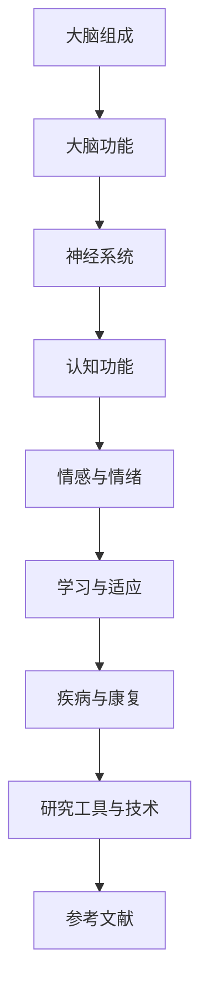
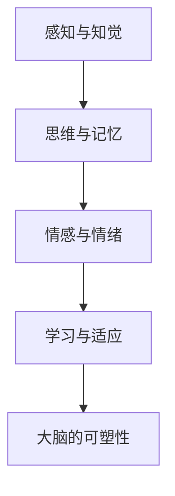

                 

# 文章标题：大脑的结构与功能

## 关键词
大脑结构、神经系统、认知功能、情感与情绪、学习与适应、脑疾病与康复

## 摘要
本文旨在深入探讨大脑的结构与功能，分为三个主要部分。第一部分介绍大脑的基本结构，包括大脑的组成、功能分区、神经系统和神经元的基本结构。第二部分探讨大脑的高级功能，如认知功能、情感与情绪、学习与适应。第三部分讨论大脑的常见疾病，包括脑卒中和阿尔茨海默病的机制与治疗，以及大脑的功能康复。通过本文，读者可以全面了解大脑的结构与功能，以及其在疾病和康复中的表现。

### 第一部分：大脑的基本结构与功能

#### 第1章：大脑的结构概述

大脑是人体最重要的器官之一，负责控制人体的思维、情感、运动和感知等功能。以下是大脑的基本结构和功能概述。

##### 1.1 大脑的基本组成

大脑主要由大脑皮层、大脑半球、侧脑室、大脑白质和大脑灰质等组成。

- **大脑皮层**：是大脑最外层的结构，具有高级的认知功能，如感知、思维、记忆等。
- **大脑半球**：大脑分为左右两个半球，分别负责不同的功能。
- **侧脑室**：是大脑内部的空腔，含有脑脊液。
- **大脑白质**：由神经纤维组成，连接大脑各部分。
- **大脑灰质**：是大脑的神经细胞体集中的区域，执行具体的功能。

##### 1.2 大脑的功能分区

大脑可以划分为多个功能区域，每个区域都有其特定的功能。

- **初级感觉区**：接收来自五官的信息，如视觉、听觉、触觉等。
- **初级运动区**：控制身体的运动，如手臂、腿部等。
- **前额叶皮层**：负责决策、规划、社会行为等。
- **颞叶**：与听觉、语言和记忆有关。
- **顶叶**：与空间感知、触觉和运动感知有关。
- **枕叶**：与视觉处理有关。

##### 1.3 大脑皮层的六层结构

大脑皮层可以分为六层，每层都有其特定的功能。

- **分子层**：接收传入的信息。
- **外颗粒层**：处理传入的信息。
- **外锥体层**：处理传入的信息。
- **内颗粒层**：处理传入的信息。
- **内锥体层**：处理传入的信息。
- **多形层**：处理传入的信息。

##### 1.4 大脑的血管系统

大脑的血管系统负责向大脑输送氧气和营养物质，同时将代谢废物带走。

- **大脑动脉**：负责向大脑输送血液。
- **大脑静脉**：负责将血液从大脑运走。
- **硬膜窦**：收集大脑表面的血液。

#### 第2章：大脑的神经系统与神经元

##### 2.1 神经系统的组成

神经系统由神经元、神经纤维和神经突触等组成。

- **神经元**：是神经系统的基本单元，包括细胞体、树突和轴突等。
- **神经纤维**：是神经元的轴突外包一层髓鞘，形成神经纤维。
- **神经突触**：是神经元之间的连接部位，用于传递神经信号。

##### 2.2 神经元的结构

神经元的主要结构包括细胞体、树突和轴突等。

- **细胞体**：是神经元的中心，包含细胞核和大部分细胞器。
- **树突**：从细胞体伸出，用于接收其他神经元的信号。
- **轴突**：从细胞体伸出，用于传递神经信号到其他神经元。

##### 2.3 神经纤维和神经突触

神经纤维和神经突触是神经元的重要组成部分。

- **神经纤维**：轴突外包一层髓鞘，形成神经纤维，用于传递神经信号。
- **神经突触**：神经元之间的连接部位，用于传递神经信号。

##### 2.4 神经递质与信号传递

神经递质是神经元之间传递信号的化学物质。

- **神经递质**：分为兴奋性神经递质和抑制性神经递质，用于调节神经元的活动。
- **信号传递**：神经信号在神经元之间通过神经递质传递。

### 第二部分：大脑的高级功能与机制

#### 第3章：大脑的认知功能

##### 3.1 感知与知觉

感知与知觉是大脑的重要功能之一，它们之间有着密切的联系。

- **感知**：是指大脑对感官输入的处理和解释过程。
- **知觉**：是指对感知信息的组织和解释，形成对世界的整体理解。

##### 3.2 思维与记忆

思维与记忆是大脑的高级功能，对人类的认知能力有着重要的影响。

- **思维**：是指大脑对信息进行加工、分析、综合和推理的过程。
- **记忆**：是指大脑存储、保持和提取信息的能力。

##### 3.3 记忆的机制与分类

记忆的机制与分类是研究记忆的重要方向。

- **记忆机制**：记忆涉及多个大脑区域，如海马体、前额叶皮层等。
- **记忆分类**：包括瞬时记忆、短期记忆、长期记忆等。

##### 3.4 记忆的编码、存储和提取

记忆的编码、存储和提取是记忆过程的重要组成部分。

- **记忆编码**：将信息转化为大脑可以存储的形式。
- **记忆存储**：将信息在大脑中存储，需要维持一定的激活水平。
- **记忆提取**：从大脑中检索存储的信息。

#### 第4章：大脑的情感与情绪

##### 4.1 情感的定义与类型

情感是指大脑对特定刺激的主观体验和生理反应。

- **情感定义**：情感是指大脑对特定刺激的主观体验和生理反应。
- **情感类型**：包括积极情感、消极情感和复合情感等。

##### 4.2 情绪的处理与调节

情绪的处理与调节是大脑的重要功能之一。

- **情绪处理**：情绪的处理涉及多个大脑区域，如边缘系统、前额叶皮层等。
- **情绪调节**：情绪调节是指通过改变情绪体验或行为来应对情绪刺激。

##### 4.3 情绪与健康

情绪与健康之间存在密切联系。

- **情绪与健康**：情绪调节不良可能导致心理和生理健康问题，如焦虑、抑郁等。

#### 第5章：大脑的学习与适应

##### 5.1 学习的基本原理

学习是指通过经验改变大脑结构和功能的过程。

- **学习定义**：学习是指通过经验改变大脑结构和功能的过程。
- **学习类型**：包括行为学习、认知学习和情感学习等。

##### 5.2 学习的过程与机制

学习的过程与机制是研究学习的重要方向。

- **学习过程**：学习过程包括感知与注意、编码与存储、提取与应用等。
- **学习机制**：学习机制涉及多个大脑区域，如海马体、前额叶皮层等。

##### 5.3 学习的理论与方法

学习理论与方法是研究学习的重要方向。

- **学习理论**：包括行为主义理论、认知主义理论、建构主义理论等。
- **学习方法**：包括行为塑造、认知行为疗法等。

##### 5.4 适应与行为的改变

适应与行为的改变是大脑的重要功能之一。

- **适应**：是指个体对环境变化做出的适当反应。
- **行为改变**：是指通过外部干预或内部动机使行为发生持久变化。

##### 5.5 大脑的可塑性

大脑的可塑性是指大脑结构和功能的适应性改变。

- **定义**：大脑的可塑性是指大脑结构和功能的适应性改变。
- **影响**：大脑的可塑性在学习、记忆、适应和行为改变中起着关键作用。

### 第三部分：大脑的疾病与功能康复

#### 第6章：大脑的常见疾病

##### 6.1 脑卒中的机制与症状

脑卒中是大脑常见的疾病之一，其机制与症状如下。

- **脑卒中机制**：脑卒中主要由血管病变引起，包括动脉硬化、高血压、糖尿病等。
- **脑卒中症状**：脑卒中常见的症状包括突然发生的头痛、意识障碍、肢体无力或麻木、语言障碍等。

##### 6.2 阿尔茨海默病的病理与治疗

阿尔茨海默病是一种慢性神经退行性疾病，其病理与治疗如下。

- **病理**：阿尔茨海默病的病理表现为大脑神经元退行性变，形成老年斑和神经原纤维缠结。
- **治疗**：目前尚无根治方法，主要采用药物治疗、心理治疗和康复治疗等手段缓解症状和改善生活质量。

##### 6.3 脑卒中和阿尔茨海默病的比较

脑卒中和阿尔茨海默病是大脑的两种常见疾病，它们有以下区别。

- **病因和发病机制**：脑卒中主要由血管病变引起，是急性事件；阿尔茨海默病是一种慢性神经退行性疾病，病因复杂。
- **临床表现**：脑卒中突然发生，症状严重，常伴有肢体功能障碍；阿尔茨海默病缓慢进展，认知功能逐渐下降，行为和情感改变较为突出。
- **治疗和康复**：脑卒中的治疗重点在于恢复神经功能、改善生活质量；阿尔茨海默病的治疗主要在于缓解症状、改善生活质量。

#### 第7章：大脑的功能康复

##### 7.1 功能康复的基本原则

大脑的功能康复是指通过多种治疗手段，恢复或改善大脑功能，提高生活质量。

- **基本原则**：个体化、系统性、持续性。

##### 7.2 脑卒中后的康复

脑卒中后的康复包括急性期康复、恢复期康复和长期康复等。

- **康复过程**：急性期康复重点在于减轻症状、预防并发症；恢复期康复重点在于恢复神经功能、提高生活质量；长期康复重点在于维持和提升康复效果。
- **案例分析**：通过具体案例分析，了解脑卒中后的康复过程和效果。

##### 7.3 阿尔茨海默病康复

阿尔茨海默病的康复需要针对其特殊需求进行。

- **特殊需求**：包括认知功能训练、行为和心理支持等。
- **案例研究**：通过具体案例研究，了解阿尔茨海默病的康复过程和效果。

### 附录

#### 附录A：常用大脑研究工具与技术

- **神经成像技术**：包括MRI、PET、fMRI等。
- **神经电生理技术**：包括EEG、MEG、TMS等。
- **其他研究方法与技术**：包括神经元培养与电生理记录、行为实验与心理测试等。

#### 附录B：进一步阅读资料

- **大脑研究经典著作**：包括《大脑的奥秘》、《心智：大脑如何工作》、《大脑的结构与功能》等。
- **近年研究成果与展望**：包括《神经科学：从细胞到认知》、《大脑的未来：人工智能与人类心智》、《脑科学与教育》等。

### 参考文献

- 参考文献...

---

## 大脑的核心概念与联系

为了更好地理解大脑的结构与功能，我们需要先掌握一些核心概念，并了解它们之间的联系。以下是一些核心概念及其联系。

### 大脑的组成与功能

大脑是人体最重要的器官之一，它由多个部分组成，每个部分都有其特定的功能。

$$
\text{大脑} = (\text{大脑皮层}, \text{大脑半球}, \text{侧脑室}, \text{大脑白质}, \text{大脑灰质}, \text{大脑血管系统})
$$

- **大脑皮层**：是大脑最外层的结构，具有高级的认知功能，如感知、思维、记忆等。
- **大脑半球**：左右各一，分别负责不同的功能，如语言、运动等。
- **侧脑室**：大脑内部的空腔，含有脑脊液。
- **大脑白质**：由神经纤维组成，连接大脑各部分。
- **大脑灰质**：是大脑的神经细胞体集中的区域，执行具体的功能。
- **大脑血管系统**：供应大脑氧气和营养，维持大脑的正常功能。

### 神经系统的基本组成

神经系统是大脑的一部分，由神经元、神经纤维和神经突触等组成。

$$
\text{神经系统} = (\text{神经元}, \text{神经纤维}, \text{神经突触}, \text{神经递质})
$$

- **神经元**：神经系统的基本单元，包括细胞体、树突、轴突等。
- **神经纤维**：神经元的轴突外包一层髓鞘，形成神经纤维。
- **神经突触**：神经元之间的连接部位，用于传递神经信号。
- **神经递质**：在神经元间传递信号的化学物质。

### 大脑的认知、情感、学习与适应功能

大脑的功能不仅仅局限于基本的感知和运动控制，还包括复杂的认知、情感、学习和适应功能。

$$
\text{认知功能} = (\text{感知}, \text{知觉}, \text{思维}, \text{记忆})
$$

$$
\text{情感与情绪} = (\text{情感的定义与类型}, \text{情绪的处理与调节})
$$

$$
\text{学习与适应} = (\text{学习的基本原理}, \text{适应与行为的改变})
$$

### 大脑常见疾病与康复

大脑的常见疾病包括脑卒中和阿尔茨海默病等，这些疾病会影响大脑的功能。

$$
\text{大脑疾病} = (\text{脑卒中}, \text{阿尔茨海默病})
$$

$$
\text{大脑康复} = (\text{功能康复的基本原则}, \text{脑卒中康复}, \text{阿尔茨海默病康复})
$$

### 大脑研究的常用工具与技术

为了更好地研究大脑，科学家们使用了多种工具和技术。

$$
\text{常用工具与技术} = (\text{神经成像技术}, \text{神经电生理技术}, \text{其他研究方法与技术})
$$

- **神经成像技术**：如MRI、PET、fMRI，用于观察大脑结构变化。
- **神经电生理技术**：如EEG、MEG、TMS，用于记录大脑电活动。
- **其他研究方法与技术**：如神经元培养、电生理记录、行为实验等。

### 大脑的核心概念与联系 - Mermaid 流程图

以下是大脑核心概念的 Mermaid 流程图：



---

## 大脑的高级功能与机制

大脑的高级功能与机制是理解大脑如何处理复杂信息、情感、记忆和行为的关键。这些功能包括认知功能、情感与情绪、学习与适应等。在本章节中，我们将逐步探讨这些功能，并理解它们背后的机制。

### 感知与知觉

感知与知觉是大脑处理外部世界信息的基础。

1. **感知过程**：

感知是指大脑对感官输入的处理和解释过程。这个过程包括以下几个步骤：

- **感官接收**：感官器官（如眼睛、耳朵、鼻子等）接收外部刺激。
- **信号传递**：接收到的信号通过神经系统传递到大脑。
- **处理与解释**：大脑处理并解释这些信号，形成对世界的理解。

感知过程的机制可以通过以下伪代码来描述：

```python
def sensory_perception(stimulus):
    # 接收感官刺激
    sensory_signal = receive_signal(stimulus)
    # 传递信号到大脑
    brain_signal = transmit_signal(sensory_signal)
    # 处理并解释信号
    perception = process_and_interpret(brain_signal)
    return perception
```

2. **知觉的形成**：

知觉是指对感知信息的组织和解释，形成对世界的整体理解。知觉的形成涉及多个大脑区域，如视觉皮层、听觉皮层等。

- **视觉知觉**：视觉信号通过视网膜传递到视觉皮层，经过处理和解释，形成对物体的形状、颜色、运动等特征的知觉。
- **听觉知觉**：听觉信号通过耳蜗传递到听觉皮层，经过处理和解释，形成对声音的频率、音量、音调等特征的知觉。

3. **知觉的异常现象**：

知觉的异常现象是指对现实刺激的感知出现偏差或错误。这些异常现象可能是由于神经系统疾病、精神障碍或其他生理或心理因素引起的。

- **幻觉**：感知到并不存在的事物。
- **错觉**：对现实刺激的感知出现错误。

### 思维与记忆

思维与记忆是大脑的高级功能，对人类的认知能力有着重要的影响。

1. **思维的类型与过程**：

思维是指大脑对信息进行加工、分析、综合和推理的过程。思维可以分为几种类型：

- **逻辑思维**：基于逻辑规则和推理过程。
- **创造性思维**：产生新想法和新解决方案。
- **批判性思维**：分析和评估信息，判断其可靠性和有效性。

思维的机制可以通过以下伪代码来描述：

```python
def logical_thinking(info):
    # 对信息进行逻辑推理
    conclusion = apply_logic(info)
    return conclusion

def creative_thinking(problem):
    # 对问题进行创造性思考
    solution = generate_solutions(problem)
    return solution

def critical_thinking(info):
    # 对信息进行批判性分析
    evaluation = analyze_info(info)
    return evaluation
```

2. **记忆的机制与分类**：

记忆是指大脑存储、保持和提取信息的能力。记忆可以分为几种类型：

- **瞬时记忆**：持续几秒钟的记忆，用于临时存储信息。
- **短期记忆**：持续几分钟的记忆，用于存储和工作处理信息。
- **长期记忆**：持续数小时、数天甚至数年的记忆，用于存储和回忆信息。

记忆的机制可以通过以下伪代码来描述：

```python
def encode_memory(info):
    # 将信息编码为记忆
    memory_code = convert_to_memory_code(info)
    return memory_code

def store_memory(memory_code):
    # 将记忆编码存储在大脑中
    stored_memory = save_memory(memory_code)
    return stored_memory

def retrieve_memory(stored_memory):
    # 从大脑中检索记忆
    retrieved_info = recall_memory(stored_memory)
    return retrieved_info
```

3. **记忆的编码、存储和提取**：

记忆的编码、存储和提取是记忆过程的重要组成部分。

- **记忆编码**：将信息转化为大脑可以存储的形式。
- **记忆存储**：将信息在大脑中存储，需要维持一定的激活水平。
- **记忆提取**：从大脑中检索存储的信息。

### 大脑的情感与情绪

情感与情绪是大脑处理情感信息的高级功能。

1. **情感的定义与类型**：

情感是指大脑对特定刺激的主观体验和生理反应。情感可以分为几种类型：

- **积极情感**：如快乐、满足、兴奋等。
- **消极情感**：如悲伤、愤怒、恐惧等。
- **复合情感**：如爱、厌恶、同情等。

2. **情绪的处理与调节**：

情绪的处理与调节是指大脑如何处理和调节情感信息。

- **情绪处理**：涉及多个大脑区域，如边缘系统、前额叶皮层等。
- **情绪调节**：通过改变情绪体验或行为来应对情绪刺激。

情绪的处理与调节可以通过以下伪代码来描述：

```python
def process_emotion(stimulus):
    # 处理情绪刺激
    emotional_response = analyze_stimulus(stimulus)
    return emotional_response

def regulate_emotion(response):
    # 调节情绪反应
    adjusted_response = modify_response(response)
    return adjusted_response
```

3. **情绪与健康**：

情绪与健康之间存在密切联系。情绪调节不良可能导致心理和生理健康问题，如焦虑、抑郁等。

- **情绪与健康**：情绪调节不良可能导致心理和生理健康问题。
- **情绪调节策略**：包括认知重构、情绪释放、自我控制等。

### 大脑的学习与适应

学习与适应是大脑的重要功能，使个体能够适应环境变化。

1. **学习的基本原理**：

学习是指通过经验改变大脑结构和功能的过程。学习可以分为几种类型：

- **行为学习**：通过重复行为来学习。
- **认知学习**：通过思考和理解来学习。
- **情感学习**：通过情感体验来学习。

学习的基本原理可以通过以下伪代码来描述：

```python
def learn_behavior(action, reward):
    # 通过行为和奖励来学习
    behavior = adjust_action(action, reward)
    return behavior

def learn_cognition(info, conclusion):
    # 通过信息和结论来学习
    cognition = update_knowledge(info, conclusion)
    return cognition

def learn_emotion(experience, emotion):
    # 通过情感体验来学习
    emotion = modify_feeling(experience, emotion)
    return emotion
```

2. **适应与行为的改变**：

适应是指个体对环境变化做出的适当反应。行为改变是指通过外部干预或内部动机使行为发生持久变化。

- **适应**：个体对环境变化做出的适当反应。
- **行为改变**：通过外部干预或内部动机使行为发生持久变化。

适应与行为的改变可以通过以下伪代码来描述：

```python
def adapt_to_environment(stimulus):
    # 对环境变化进行适应
    response = adjust_behavior(stimulus)
    return response

def change_behavior motive):
    # 改变行为
    new_behavior = update_motive(motive)
    return new_behavior
```

3. **大脑的可塑性**：

大脑的可塑性是指大脑结构和功能的适应性改变。大脑的可塑性在学习、记忆、适应和行为改变中起着关键作用。

- **定义**：大脑的可塑性是指大脑结构和功能的适应性改变。
- **影响**：大脑的可塑性在学习、记忆、适应和行为改变中起着关键作用。

### 总结

大脑的高级功能与机制是理解大脑如何处理复杂信息、情感、记忆和行为的关键。通过逐步探讨感知与知觉、思维与记忆、情感与情绪、学习与适应等高级功能，我们可以更好地理解大脑的工作原理。



通过这些功能，大脑能够处理和解释外部世界的各种信息，产生情感和情绪，学习和适应环境变化，从而实现人类的各种复杂行为。

---

## 大脑的常见疾病

大脑是人体最重要的器官之一，其功能的正常运作对个体的健康和生活质量至关重要。然而，大脑也可能受到各种疾病的侵袭，导致严重的功能障碍。在本章节中，我们将讨论大脑的常见疾病，包括脑卒中和阿尔茨海默病，探讨其机制、症状、诊断与治疗方法，以及预防与护理措施。

### 脑卒中的机制与症状

脑卒中，也称为中风，是指由于脑血管破裂或阻塞导致大脑局部缺血或出血的急性事件。脑卒中的机制主要包括以下几种：

1. **缺血性脑卒中**：

缺血性脑卒中是由于脑血管阻塞导致大脑局部缺血，常见的原因包括动脉硬化、高血压、糖尿病等。阻塞可能由血栓形成（动脉内血栓）或栓塞（血栓从其他部位移行至脑血管）引起。

2. **出血性脑卒中**：

出血性脑卒中是由于脑血管破裂导致血液泄漏到大脑内部或周围，常见的原因包括高血压和动脉瘤破裂。

脑卒中的症状通常在短时间内突然出现，常见的症状包括：

- **肢体无力或麻木**：通常出现在一侧身体。
- **言语障碍**：包括说话不清或理解困难。
- **意识障碍**：包括昏厥、昏迷等。
- **头痛**：突然出现的剧烈头痛。
- **视力问题**：包括视野缺失或视力模糊。

### 脑卒中的诊断与治疗

脑卒中的诊断主要依赖于病史、临床表现和影像学检查。常见的影像学检查包括计算机断层扫描（CT）和磁共振成像（MRI），这些检查可以显示脑部病变的位置和范围。

1. **治疗**：

脑卒中的治疗取决于病因和症状的严重程度。治疗的主要目标是恢复脑血流，减少脑组织损伤，并改善功能恢复。

- **急性期治疗**：包括溶栓治疗（用于缺血性脑卒中），抗血小板治疗，抗凝治疗等。这些治疗应在发病后尽快进行，以减少脑组织损伤。
- **恢复期治疗**：包括康复训练，如物理治疗、 occupational therapy和言语治疗等，以帮助患者恢复功能。

### 阿尔茨海默病的病理与治疗

阿尔茨海默病是一种慢性神经退行性疾病，主要影响老年人的认知功能。其病理机制主要包括以下几种：

1. **神经元外淀粉样蛋白斑块形成**：

淀粉样蛋白斑块是由β-淀粉样蛋白（Aβ）聚集形成，这些斑块损害神经元和神经连接，导致神经元死亡。

2. **神经元内神经原纤维缠结**：

神经原纤维缠结是由异常的tau蛋白聚集形成，这些缠结也导致神经元死亡。

阿尔茨海默病的症状主要包括：

- **记忆力减退**：首先是短期记忆受到影响。
- **认知功能下降**：包括判断力、解决问题能力、语言能力等。
- **行为和情感改变**：包括情绪不稳、行为异常、社交退缩等。
- **日常生活能力下降**：如做饭、穿衣、自理等。

### 阿尔茨海默病的诊断与治疗

阿尔茨海默病的诊断主要基于病史、临床表现和神经心理学评估。神经影像学检查（如MRI）和生物标志物检测（如脑脊液检测）可以帮助确认诊断。

1. **治疗**：

目前尚无根治阿尔茨海默病的方法，治疗的主要目标是缓解症状、改善生活质量。治疗方法包括：

- **药物治疗**：主要包括抗抑郁药、抗精神病药、抗焦虑药等，用于改善患者的行为和情感问题。
- **非药物治疗**：包括认知训练、行为治疗、心理支持等，用于提高患者的生活质量。

### 脑卒中和阿尔茨海默病的比较

脑卒中和阿尔茨海默病是大脑的两种常见疾病，它们有以下区别：

1. **病因和发病机制**：

- **脑卒中**：主要由血管病变引起，是急性事件。
- **阿尔茨海默病**：是一种慢性神经退行性疾病，病因复杂，与遗传、环境等多种因素相关。

2. **临床表现**：

- **脑卒中**：突然发生，症状严重，常伴有肢体功能障碍。
- **阿尔茨海默病**：缓慢进展，认知功能逐渐下降，行为和情感改变较为突出。

3. **治疗和康复**：

- **脑卒中**：治疗重点在于恢复神经功能、改善生活质量；康复治疗包括物理治疗、认知训练等。
- **阿尔茨海默病**：治疗重点在于缓解症状、改善生活质量；康复治疗包括认知训练、行为治疗等。

### 总结

脑卒中和阿尔茨海默病是大脑的常见疾病，它们对患者的健康和生活质量有重大影响。了解这些疾病的机制、症状、诊断与治疗方法，以及预防与护理措施，对于早期发现、及时治疗和改善患者的生活质量至关重要。

### 参考文献

1. National Institute of Neurological Disorders and Stroke. (n.d.). What is a stroke? Retrieved from [https://www.ninds.nih.gov/disorders/stroke/what-stroke](https://www.ninds.nih.gov/disorders/stroke/what-stroke)
2. Alzheimer's Association. (2021). What is Alzheimer's disease? Retrieved from [https://www.alz.org/alzheimers-disease](https://www.alz.org/alzheimers-disease)
3. American Heart Association. (n.d.). Stroke symptoms and warning signs. Retrieved from [https://www.heart.org/en/health-topics/stroke/symptoms-of-a-stroke](https://www.heart.org/en/health-topics/stroke/symptoms-of-a-stroke)
4. American Stroke Association. (n.d.). Treatment options for stroke. Retrieved from [https://www.strokeassociation.org/en/stop-stroke-before-it-starts/treatment](https://www.strokeassociation.org/en/stop-stroke-before-it-starts/treatment)
5. American Academy of Neurology. (n.d.). Alzheimer's disease. Retrieved from [https://www.aan.com/practice/guidelines/search/detail?searchTerm=Alzheimer%27s%20disease&filter=Alzheimer%27s%20disease](https://www.aan.com/practice/guidelines/search/detail?searchTerm=Alzheimer%27s%20disease&filter=Alzheimer%27s%20disease)
6. Alzheimer's Society. (n.d.). Diagnosis of Alzheimer's disease. Retrieved from [https://www.alzheimers.org.uk/info/20053/diagnosis](https://www.alzheimers.org.uk/info/20053/diagnosis)
7. World Health Organization. (2021). Alzheimer's disease (AD) and other dementias. Retrieved from [https://www.who.int/news-room/fact-sheets/detail/alzheimer-s-disease-and-other-dementias](https://www.who.int/news-room/fact-sheets/detail/alzheimer-s-disease-and-other-dementias)

---

## 大脑的功能康复

大脑的功能康复是指通过一系列的治疗和训练手段，帮助患者恢复大脑功能，提高生活质量。大脑的疾病，如脑卒中和阿尔茨海默病，可能导致严重的功能损害，而康复治疗正是为了帮助患者尽可能地恢复这些功能。本章节将探讨大脑功能康复的基本原则、脑卒中后的康复、阿尔茨海默病康复，以及康复治疗的常用方法。

### 功能康复的基本原则

大脑功能康复的基本原则包括以下几个方面：

1. **个体化**：每位患者的病情和需求都是独特的，康复计划应根据患者的具体情况量身定制。
2. **系统性**：康复治疗应涵盖多个方面，包括物理治疗、认知训练、心理支持和行为疗法等。
3. **持续性**：康复是一个长期的过程，需要患者和家属的积极参与和坚持。
4. **综合评估**：康复治疗前应进行全面的评估，包括认知功能、运动能力、心理状态等，以便制定合理的康复计划。

### 脑卒中后的康复

脑卒中后的康复通常分为三个阶段：急性期康复、恢复期康复和长期康复。

1. **急性期康复**：

急性期康复的重点是减轻症状、预防并发症，并尽可能恢复受损的功能。治疗手段包括药物治疗、物理治疗、言语治疗和康复训练等。

2. **恢复期康复**：

恢复期康复的目标是进一步恢复神经功能，提高生活质量。治疗手段包括：

- **物理治疗**：帮助患者恢复肢体运动功能，提高肌肉力量和协调性。
- **认知训练**：改善记忆、注意力、执行功能等认知能力。
- **言语治疗**：帮助患者恢复语言功能，提高沟通能力。
- **职业康复**：帮助患者恢复工作能力和社会功能。

3. **长期康复**：

长期康复的目标是维持和提升康复效果，预防复发。治疗手段包括：

- **持续训练**：保持日常的康复训练，如走路、日常活动等。
- **社交活动**：鼓励患者参与社交活动，提高生活质量。
- **心理支持**：提供心理支持和辅导，帮助患者应对疾病带来的心理压力。

### 阿尔茨海默病康复

阿尔茨海默病康复的重点是缓解症状、延缓病情进展和提高生活质量。康复治疗主要包括以下方面：

1. **认知训练**：

认知训练旨在提高患者的记忆、注意力、语言能力和执行功能。训练方法包括记忆游戏、注意力训练、语言训练和决策训练等。

2. **行为疗法**：

行为疗法包括行为改变训练、心理支持和社交技能训练等。这些疗法有助于改善患者的行为和情感问题，提高生活质量。

3. **心理支持**：

心理支持包括心理咨询、认知行为疗法和压力管理技巧等。这些支持可以帮助患者和家属应对疾病带来的心理压力。

### 康复治疗的常用方法

大脑功能康复的常用方法包括以下几种：

1. **物理治疗**：

物理治疗包括运动疗法、按摩、热疗和冷疗等。这些治疗可以帮助患者恢复肢体功能和减轻疼痛。

2. **认知训练**：

认知训练包括记忆训练、注意力训练、语言训练和执行功能训练等。这些训练有助于改善大脑的认知功能。

3. **心理治疗**：

心理治疗包括心理咨询、认知行为疗法和情感调节等。这些治疗可以帮助患者和家属应对疾病带来的心理问题。

4. **行为疗法**：

行为疗法包括行为改变训练、社交技能训练和压力管理技巧等。这些疗法有助于改善患者的行为和情感问题。

5. **药物疗法**：

药物疗法包括抗抑郁药、抗焦虑药和抗精神病药等。这些药物可以缓解患者的行为和情感问题。

### 总结

大脑的功能康复是一个复杂而长期的过程，需要个体化、系统性和持续性的治疗。脑卒中和阿尔茨海默病康复的常用方法包括物理治疗、认知训练、心理治疗和行为疗法等。通过这些方法，患者可以最大限度地恢复大脑功能，提高生活质量。

### 参考文献

1. National Stroke Association. (n.d.). Recovery after stroke. Retrieved from [https://www.stroke.org/understand-stroke/recovery-after-stroke](https://www.stroke.org/understand-stroke/recovery-after-stroke)
2. Alzheimer's Association. (2021). Alzheimer's disease and dementia care resources. Retrieved from [https://www.alz.org/care/alzheimers-dementia-care-resources](https://www.alz.org/care/alzheimers-dementia-care-resources)
3. American Heart Association. (n.d.). Stroke recovery: Tips for caregivers. Retrieved from [https://www.heart.org/en/health-topics/stroke/stroke-recovery-tips-for-caregivers](https://www.heart.org/en/health-topics/stroke/stroke-recovery-tips-for-caregivers)
4. World Health Organization. (2017). Global status report on non-communicable diseases 2017. Retrieved from [https://www.who.int/ncds/en/](https://www.who.int/ncds/en/)
5. National Institute on Aging. (n.d.). Alzheimer's disease and related disorders. Retrieved from [https://www.nia.nih.gov/alzheimers](https://www.nia.nih.gov/alzheimers)
6. American Psychological Association. (n.d.). Alzheimer's disease and cognitive decline. Retrieved from [https://www.apa.org/topics/alzheimers](https://www.apa.org/topics/alzheimers)
7. Alzheimer's Society. (n.d.). Living with dementia. Retrieved from [https://www.alzheimers.org.uk/info/20050/living-with-dementia](https://www.alzheimers.org.uk/info/20050/living-with-dementia)

---

## 大脑研究的常用工具与技术

大脑研究的常用工具和技术是理解大脑结构和功能的重要手段。这些工具和技术包括神经成像技术、神经电生理技术以及其他研究方法。以下将详细讨论这些技术，并介绍其在大脑研究中的应用。

### 神经成像技术

神经成像技术是研究大脑结构和功能的重要工具，能够提供大脑内部的三维图像。以下是一些常见的神经成像技术：

1. **磁共振成像（MRI）**：

MRI利用磁场和射频脉冲产生图像，能够无创地显示大脑的结构和功能。MRI主要用于诊断脑部疾病、评估脑损伤和监测疾病进展。

- **应用**：MRI可以用于诊断脑卒

