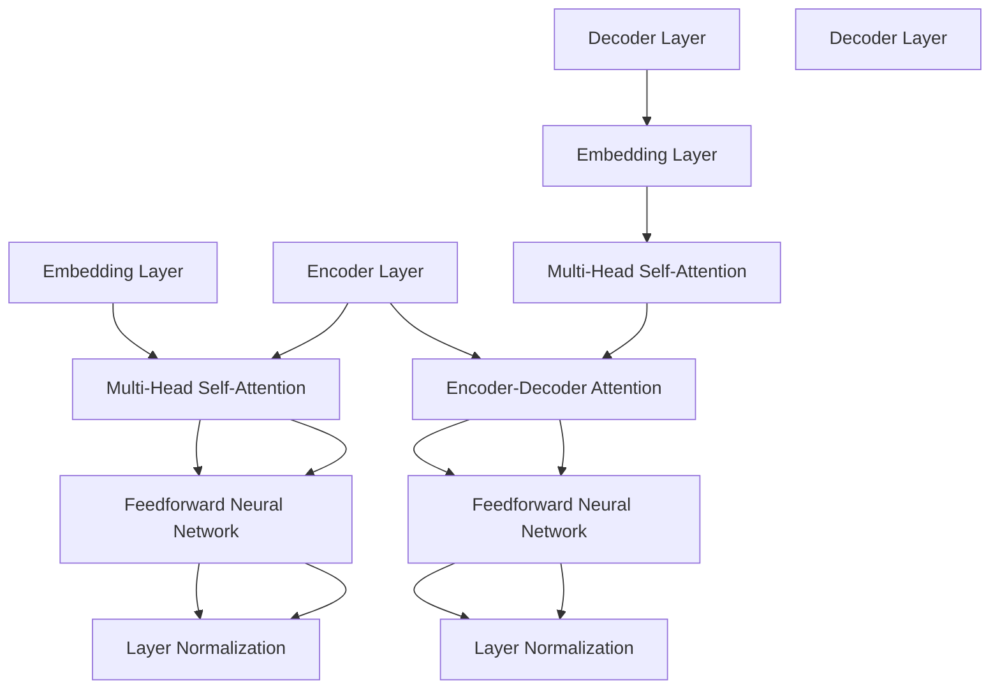
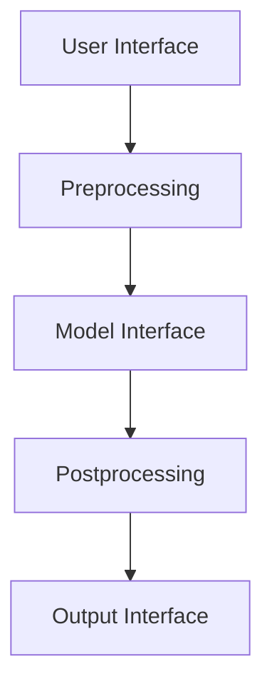

                 

# 文章标题

《大语言模型原理与工程实践：少样本提示》

> 关键词：大语言模型，少样本提示，工程实践，自然语言处理，预训练模型

> 摘要：本文将深入探讨大语言模型的原理和工程实践，特别是少样本提示技术。我们将从基础理论开始，逐步介绍大语言模型的发展历史、定义与特点、核心架构等，然后详细讲解自然语言处理基础和大规模预训练模型原理。在工程实践部分，我们将探讨大规模数据集处理、大模型训练与优化、评估与调试等内容。最后，我们将分析少样本提示技术，以及大语言模型在模型压缩和部署方面的应用，并探讨其未来发展趋势。

## 引言

在人工智能领域，大语言模型（Large Language Model）已经成为自然语言处理（NLP）的基石。从早期的统计语言模型，到基于神经网络的深度学习模型，再到如今的预训练模型，语言模型在处理语言任务时表现出色。本文将系统地介绍大语言模型的原理与工程实践，重点关注少样本提示技术在模型训练中的应用。

大语言模型之所以重要，是因为它不仅能够处理各种语言任务，如文本分类、问答系统和文本生成，还能够通过迁移学习和微调技术在新的任务上表现出色。少样本提示技术则是大语言模型在工程实践中的一个重要突破，它允许模型在只有少量数据的情况下进行有效的训练，从而降低数据收集和标注的成本。

本文的结构如下：首先，我们将回顾大语言模型的发展历史，并介绍其定义和特点。接着，我们将探讨自然语言处理的基础知识，包括语言模型、词嵌入技术和序列模型与注意力机制。随后，我们将深入探讨大规模预训练模型的原理，包括预训练的概念、自监督学习方法和迁移学习与微调技术。

在工程实践部分，我们将详细介绍大语言模型的构建过程，包括数据集处理、模型训练与优化、评估与调试等。接着，我们将探讨少样本提示技术，并分析模型压缩和部署方面的挑战和解决方案。最后，我们将通过几个实际案例展示大语言模型的应用，并探讨其未来发展趋势。文章末尾将提供附录，包括大语言模型开发工具与资源，以及代码实例与解读。

### 第一部分：大语言模型基础理论

## 第1章：大语言模型概述

### 1.1 大语言模型的发展历史

大语言模型的发展历程可以追溯到20世纪50年代，当时统计语言模型（如N-gram模型）成为处理自然语言的首要方法。然而，这些模型在处理长距离依赖和复杂语义关系方面存在局限。随着深度学习技术的发展，基于神经网络的深度学习模型逐渐崭露头角。

在2018年，GPT（Generative Pre-trained Transformer）模型的推出标志着大语言模型的新纪元。GPT系列模型通过大规模预训练，在自然语言处理任务上取得了显著的性能提升。此后，BERT（Bidirectional Encoder Representations from Transformers）及其变体相继问世，进一步推动了大语言模型的发展。

GPT模型由OpenAI提出，其核心思想是通过在大量文本上进行预训练，使模型能够捕捉到语言的内在结构。随后，GPT-2和GPT-3相继发布，模型的规模和性能不断提升。GPT-3拥有1750亿参数，能够在多种语言任务上表现出色。

BERT是由Google Research提出的一种双向转换器（Transformer）预训练方法，它在编码器和解码器中同时捕捉文本的前后关系，从而提高了模型对语言的理解能力。BERT的成功引发了大量基于其变体的模型的出现，如RoBERTa、ALBERT等。

除了GPT和BERT之外，还有其他一些知名的大语言模型，如Turing NLTK（由微软提出），ChatGLM（由清华大学提出），以及Palmetto（由斯坦福大学提出）。这些模型在不同的应用场景中表现出强大的能力，进一步推动了大语言模型的发展。

### 1.2 大语言模型的定义与特点

大语言模型是指具有数十亿甚至更多参数的深度学习模型，它通过对大规模文本数据进行预训练，从而获得对自然语言的高度理解能力。大语言模型的特点主要体现在以下几个方面：

1. **参数规模大**：大语言模型通常具有数十亿甚至更多的参数，这使得模型能够捕捉到语言中的复杂模式和长距离依赖。

2. **预训练能力**：大语言模型通过在大量未标注的文本上进行预训练，学习到语言的通用知识，从而在标注数据较少的情况下仍然能够表现出良好的性能。

3. **多任务能力**：大语言模型经过预训练后，可以在多种不同的自然语言处理任务上应用，如文本分类、问答系统和文本生成，无需对每个任务进行单独训练。

4. **上下文理解能力**：大语言模型能够理解上下文中的信息，从而生成更加符合人类语言的输出。这种能力使得模型在生成文本时能够保持连贯性和一致性。

5. **自适应能力**：大语言模型可以通过微调（Fine-tuning）技术在新的任务上快速适应，从而提高模型在特定任务上的性能。

大语言模型与传统NLP方法的区别主要体现在训练数据、模型架构和任务适应性上。传统NLP方法通常依赖于手工程度和规则，而大语言模型则通过大规模预训练和自适应微调来实现对自然语言的高度理解。

### 1.3 大语言模型的核心架构

大语言模型的核心架构通常基于Transformer模型，这是一种基于自注意力机制的深度神经网络。Transformer模型由编码器和解码器两个部分组成，每个部分都包含多个相同的子层。下面是Transformer模型的核心架构：

1. **编码器（Encoder）**：
   - **嵌入层（Embedding Layer）**：将输入的单词转换为固定长度的向量表示。
   - **多头自注意力机制（Multi-Head Self-Attention Mechanism）**：允许模型在编码器的每个位置都能考虑到其他所有位置的信息，从而捕捉长距离依赖。
   - **前馈神经网络（Feedforward Neural Network）**：在自注意力机制之后，对每个位置的信息进行进一步的加工和整合。
   - **层归一化（Layer Normalization）**：在每个子层之后进行归一化，以加速训练过程。

2. **解码器（Decoder）**：
   - **嵌入层（Embedding Layer）**：与编码器相同，将输入的单词转换为向量表示。
   - **多头自注意力机制（Multi-Head Self-Attention Mechanism）**：允许模型在解码器的每个位置都能考虑到编码器的所有位置的信息。
   - **编码器-解码器自注意力机制（Encoder-Decoder Attention Mechanism）**：允许解码器在生成每个单词时考虑到编码器生成的所有上下文信息。
   - **前馈神经网络（Feedforward Neural Network）**：对每个位置的信息进行进一步的加工和整合。
   - **层归一化（Layer Normalization）**：在每个子层之后进行归一化，以加速训练过程。

为了直观地展示大语言模型的架构，我们可以使用Mermaid流程图来绘制。以下是一个简化的Transformer模型架构的Mermaid图：



通过这个Mermaid图，我们可以清晰地看到编码器和解码器的结构，以及各个子层之间的交互关系。这种结构使得大语言模型能够高效地处理自然语言任务，并在预训练和微调过程中表现出色。

### 1.4 大语言模型在NLP中的应用

大语言模型在自然语言处理（NLP）领域已经取得了显著的成果。以下是一些常见的NLP任务，以及大语言模型在这些任务中的应用：

1. **文本分类**：文本分类是将文本数据归类到预定义的类别中。大语言模型通过预训练能够捕捉到文本中的语义信息，从而在文本分类任务上表现出色。例如，可以使用BERT模型对新闻文章进行分类，将它们归类到不同的主题类别中。

2. **问答系统**：问答系统旨在回答用户提出的问题。大语言模型通过预训练能够理解自然语言中的语义和上下文信息，从而在问答系统中实现高效的回答生成。例如，可以使用GPT-3模型构建一个智能客服系统，它能够回答用户关于产品和服务的问题。

3. **文本生成**：文本生成是将输入文本转换成新的文本输出。大语言模型在文本生成任务中也表现出色，可以用于生成文章、故事、对话等。例如，可以使用GPT-3模型生成一篇关于旅行的文章，描述一个独特的旅游经历。

4. **命名实体识别**：命名实体识别是从文本中识别出具有特定意义的实体，如人名、地名、组织名等。大语言模型通过预训练能够识别文本中的实体，从而在命名实体识别任务上表现出色。例如，可以使用BERT模型对新闻文章中的命名实体进行识别，提取出关键信息。

5. **机器翻译**：机器翻译是将一种语言的文本翻译成另一种语言的文本。大语言模型通过预训练和迁移学习，可以在机器翻译任务上实现高精度的翻译。例如，可以使用Transformer模型实现中英互译，将中文文本翻译成英文。

大语言模型在NLP中的应用不仅限于上述任务，还包括情感分析、摘要生成、对话系统等多个领域。随着大语言模型的发展和优化，其在NLP任务中的表现将越来越出色。

### 1.5 大语言模型与传统NLP方法的对比

大语言模型与传统NLP方法在多个方面存在显著的区别：

1. **训练数据**：
   - 传统NLP方法依赖于手工程度和规则，通常需要大量手工标注的数据进行训练。
   - 大语言模型则通过在大量未标注的文本上进行预训练，学习到语言的通用知识，从而在标注数据较少的情况下仍然能够表现出良好的性能。

2. **模型架构**：
   - 传统NLP方法通常采用基于规则的模型，如基于统计模型的N-gram和基于机器学习方法的决策树、SVM等。
   - 大语言模型则基于深度学习，特别是基于Transformer的模型，能够捕捉到语言中的复杂模式和长距离依赖。

3. **任务适应性**：
   - 传统NLP方法通常需要针对每个任务进行单独训练，且模型在特定任务上的性能有限。
   - 大语言模型则通过预训练和微调，可以在多种不同的自然语言处理任务上应用，无需对每个任务进行单独训练。

4. **上下文理解**：
   - 传统NLP方法通常无法很好地理解上下文信息，导致生成文本的连贯性和一致性较差。
   - 大语言模型通过预训练能够理解上下文信息，从而生成更加符合人类语言的输出。

综上所述，大语言模型在训练数据、模型架构、任务适应性和上下文理解等方面具有显著的优势，使得其在自然语言处理任务中表现出色。与传统NLP方法相比，大语言模型为NLP领域带来了新的突破和发展方向。

### 第2章：自然语言处理基础

在深入探讨大语言模型之前，有必要对自然语言处理（NLP）的基础知识进行介绍。NLP是人工智能领域的一个重要分支，旨在让计算机能够理解和处理自然语言。在这一章中，我们将详细讲解语言模型、词嵌入技术和序列模型与注意力机制。

#### 2.1 语言模型与语言理解

语言模型（Language Model）是NLP的基础，它用于预测自然语言中下一个单词或词组的概率。语言模型在许多NLP任务中都扮演着重要角色，如文本生成、语音识别、机器翻译等。

**语言模型的基本概念**：
- **N-gram模型**：N-gram模型是最简单的语言模型之一，它基于统计方法，通过计算一个单词序列的频率来预测下一个单词。例如，给定前两个单词 "the dog"，N-gram模型将计算 "the"、"the dog"、"dog" 等序列的频率，以预测下一个单词。
- **神经网络语言模型**：神经网络语言模型通过深度学习算法训练，能够捕捉到语言中的复杂模式和长距离依赖。例如，Transformer模型就是一类基于神经网络的强大语言模型。

**语言模型在NLP中的应用**：
- **文本生成**：语言模型可以用于生成连贯的文本，如文章、故事、对话等。例如，GPT-3模型能够生成高质量的文本，模拟人类的写作风格。
- **语音识别**：语言模型可以帮助语音识别系统提高识别准确率，通过预测语音信号中的单词序列。
- **机器翻译**：语言模型在机器翻译中用于生成目标语言的文本，通过预测目标语言的下一个单词或词组。

**语言理解的重要性**：
语言理解是NLP的核心目标，它涉及对语言中的语义、语法和上下文信息进行深入分析。良好的语言理解能力对于许多NLP任务至关重要，如问答系统、对话系统、文本分类等。大语言模型通过预训练和微调，在语言理解任务上表现出色。

#### 2.2 词嵌入技术

词嵌入（Word Embedding）是将单词转换为固定长度的向量表示。词嵌入技术使得计算机能够处理和计算自然语言中的单词，从而实现文本的数值化表示。

**词嵌入的基本原理**：
- **基于统计的方法**：如Count Vector和TF-IDF，通过统计单词在文本中的频率或重要程度进行编码。
- **基于神经网络的深度学习方法**：如Word2Vec、GloVe等，通过训练神经网络模型将单词映射到高维向量空间中。

**常见的词嵌入算法**：
- **Word2Vec**：Word2Vec是由Google提出的一种词嵌入算法，通过训练神经网络模型，将单词映射到高维向量空间中。Word2Vec有两种训练方法：连续词袋（CBOW）和Skip-Gram。
- **GloVe**：GloVe（Global Vectors for Word Representation）是一种基于全局上下文的词嵌入方法，通过计算单词的共现矩阵来生成词向量。

**词嵌入在NLP中的应用**：
- **文本分类**：词嵌入可以用于将文本转换为向量表示，从而在文本分类任务中实现特征提取。
- **语义相似性**：通过计算词向量之间的余弦相似度，可以判断两个单词在语义上的相似性。
- **机器翻译**：词嵌入可以帮助机器翻译系统将源语言的单词映射到目标语言的词向量空间，从而提高翻译质量。

#### 2.3 序列模型与注意力机制

序列模型（Sequence Model）是一种用于处理序列数据的模型，如时间序列数据、文本序列等。序列模型在NLP中有着广泛的应用，如语音识别、机器翻译、文本生成等。

**序列模型的基本概念**：
- **循环神经网络（RNN）**：RNN是一种处理序列数据的神经网络，通过递归结构将当前输入与之前的状态进行关联。
- **长短期记忆网络（LSTM）**：LSTM是RNN的一种变体，通过引入门控机制来避免梯度消失问题，从而能够处理长距离依赖。
- **转换器架构（Transformer）**：Transformer是一种基于自注意力机制的序列模型，它通过并行计算和多头注意力机制，在处理长序列数据时表现出色。

**序列模型的注意力机制**：
注意力机制（Attention Mechanism）是一种用于处理序列数据的机制，它允许模型在生成每个输出时关注输入序列中的不同部分。注意力机制在NLP中有着广泛的应用，如机器翻译、文本生成等。

**转换器架构详解**：
- **编码器（Encoder）**：编码器用于处理输入序列，并生成一系列上下文表示。
- **解码器（Decoder）**：解码器用于生成输出序列，并利用编码器生成的上下文表示来预测每个输出。
- **多头注意力机制**：多头注意力机制是一种并行计算的自注意力机制，它通过多个注意力头来同时关注输入序列的不同部分，从而提高模型的性能。
- **位置编码（Positional Encoding）**：位置编码是一种用于处理序列顺序的信息，它通过为每个输入序列的位置添加编码向量，使得模型能够理解序列的顺序关系。

**序列模型在NLP中的应用**：
- **机器翻译**：序列模型在机器翻译中用于将源语言的单词序列映射到目标语言的单词序列。
- **语音识别**：序列模型在语音识别中用于将音频信号转换为文本序列。
- **文本生成**：序列模型在文本生成中用于生成连贯的文本，如文章、故事、对话等。

通过以上对自然语言处理基础知识的介绍，我们可以更好地理解大语言模型的工作原理和应用。接下来，我们将进一步探讨大规模预训练模型的原理，以深入了解大语言模型的发展历程和核心技术。

### 第3章：大规模预训练模型原理

#### 3.1 预训练的概念与意义

预训练（Pre-training）是指在大规模数据集上对模型进行初步训练，使其获得对自然语言的基本理解能力。预训练的概念在深度学习模型中具有重要意义，因为它为模型在实际任务中的表现奠定了坚实的基础。

**预训练与微调**：

- **预训练（Pre-training）**：预训练是指在大规模数据集上进行训练，使模型能够学习到语言的通用知识。预训练通常分为两个阶段：自监督预训练和有监督微调。自监督预训练利用未标注的数据，通过预测任务（如语言建模、掩码语言模型等）来训练模型，使其具备一定的语言理解能力。有监督微调则是在预训练的基础上，利用标注数据对模型进行细粒度的调整，使其在特定任务上达到更好的性能。

- **微调（Fine-tuning）**：微调是指在预训练的基础上，利用特定任务的数据对模型进行进一步的训练。微调的目的是使模型能够适应新的任务，并提高其在特定任务上的性能。通过微调，模型可以从预训练阶段学习到的通用知识中提取出与任务相关的特征，从而在新的任务上表现出色。

**预训练模型的性能提升**：

预训练模型在自然语言处理任务上表现出显著的优势，主要表现在以下几个方面：

- **多任务能力**：预训练模型通过在大规模数据集上进行预训练，学习到了语言的通用知识，从而能够在多种不同的自然语言处理任务上应用，无需对每个任务进行单独训练。

- **少样本性能**：预训练模型在少量数据的情况下仍然能够表现出良好的性能。这是因为预训练模型通过在大量未标注的数据上进行训练，已经学习到了语言的通用特征，从而在标注数据较少的情况下仍然能够对新的任务进行有效的适应。

- **上下文理解能力**：预训练模型通过在大量文本上进行预训练，能够理解上下文中的信息，从而生成更加符合人类语言的输出。这种能力使得预训练模型在生成文本、问答系统和文本分类等任务中表现出色。

#### 3.2 自监督学习方法

自监督学习（Self-supervised Learning）是一种在未标注数据上进行训练的方法，它通过利用数据的内部结构来学习特征表示。自监督学习方法在预训练模型中具有重要地位，因为它能够大幅降低数据标注的成本，并提高模型的泛化能力。

**自监督学习的定义**：

自监督学习是一种学习方式，它不需要依赖标注数据进行训练，而是通过利用数据本身的内部结构或已有知识来生成监督信号。自监督学习通常包含两个关键要素：

- **自监督信号**：自监督信号是指从原始数据中提取的一种内部结构或规律，用于生成监督信号。例如，在自然语言处理任务中，自监督信号可以是单词、句子或段落的结构、语法规则等。

- **自监督学习任务**：自监督学习任务是指通过自监督信号来定义的学习任务。例如，在自然语言处理任务中，常见的自监督学习任务包括语言建模、掩码语言模型（Masked Language Model, MLM）和生成式文本匹配（Generative Text Matching, GTM）等。

**自监督学习的应用**：

自监督学习在预训练模型中有着广泛的应用，以下是一些典型的自监督学习任务：

- **语言建模**：语言建模是一种自监督学习任务，其目标是预测一个单词序列的概率分布。语言建模可以帮助模型学习到语言的内在结构和语法规则，从而提高其在自然语言处理任务中的表现。

- **掩码语言模型（MLM）**：掩码语言模型是一种在预训练中常用的自监督学习任务，其核心思想是将输入序列中的部分单词进行掩码，然后通过预测掩码单词来训练模型。掩码语言模型可以帮助模型学习到上下文信息，从而在生成文本和问答系统中表现出色。

- **生成式文本匹配（GTM）**：生成式文本匹配是一种自监督学习任务，其目标是通过生成两个文本序列来匹配给定的问题或标题。生成式文本匹配可以帮助模型学习到文本之间的语义关系，从而在问答系统和文本生成任务中表现出色。

#### 3.3 迁移学习与微调技术

迁移学习（Transfer Learning）是一种利用预训练模型在新的任务上获得高性能的方法。迁移学习的核心思想是将预训练模型的知识迁移到新的任务中，从而提高模型在新任务上的性能。

**迁移学习的原理**：

迁移学习的原理基于以下观察：

- **通用特征**：预训练模型在大规模数据集上进行预训练，学习到了语言中的通用特征，如语法规则、词义、上下文关系等。这些通用特征在新的任务中仍然具有很高的价值。

- **任务依赖性**：某些任务的特征具有通用性，如视觉任务中的图像分类和自然语言处理中的文本分类。这些通用特征可以通过迁移学习在新任务中得到应用。

**迁移学习的过程**：

迁移学习通常包含以下步骤：

1. **预训练**：在大规模数据集上对模型进行预训练，使其学习到通用特征。

2. **特征提取**：从预训练模型中提取出重要的特征表示，用于后续的任务。

3. **微调**：利用新的任务数据进行微调，使模型在新任务上达到更好的性能。微调通常包括以下步骤：

   - **数据预处理**：对新的任务数据进行分析和预处理，如数据清洗、数据增强等。

   - **模型调整**：在预训练模型的基础上，调整模型的参数，使其在新任务上表现更好。调整的方法包括权重初始化、学习率调整等。

   - **评估与优化**：对微调后的模型进行评估和优化，选择最佳模型进行部署。

**微调技术的实现**：

微调技术的实现主要包括以下几个方面：

1. **权重初始化**：通常采用预训练模型的权重作为初始化，以利用预训练阶段学习到的知识。

2. **学习率调整**：学习率的选择对微调过程具有重要影响。通常，在微调初期采用较大的学习率，以快速调整模型参数；在微调后期采用较小的学习率，以避免模型过拟合。

3. **正则化方法**：为了防止模型过拟合，可以采用正则化方法，如L2正则化、Dropout等。

4. **模型融合**：在微调过程中，可以采用模型融合（Model Fusion）技术，将多个预训练模型的特征进行融合，以提高模型的泛化能力。

通过迁移学习和微调技术，预训练模型可以在新的任务上快速适应，并达到较高的性能。迁移学习和微调技术已经成为自然语言处理领域的重要研究热点，推动了预训练模型在多种任务中的广泛应用。

### 第4章：大语言模型工程化构建

#### 4.1 大规模数据集处理

在大语言模型的工程化构建过程中，处理大规模数据集是至关重要的一个环节。数据集的质量和数量直接影响到模型的效果。以下是处理大规模数据集的几个关键步骤和技巧：

**数据预处理技巧**：

1. **文本清洗**：首先需要对原始文本进行清洗，去除无用的符号、标点、停用词等。例如，可以使用正则表达式进行符号替换，使用词频统计方法去除低频词和停用词。

2. **分词**：将文本分割成单词或词组。中文文本通常需要先进行分词处理，常用的分词工具包括jieba等。

3. **词嵌入**：将文本转换为词嵌入向量。词嵌入可以采用预训练的词向量（如GloVe、Word2Vec）或通过训练自定义词向量。

4. **数据增强**：为了提高模型的泛化能力，可以对数据集进行增强。常用的数据增强方法包括同义词替换、随机插入、随机删除等。

**数据增强方法**：

1. **同义词替换**：将文本中的部分单词替换为同义词，从而增加数据多样性。

2. **随机插入**：在文本中随机插入一些无关单词或短语，模拟噪声文本。

3. **随机删除**：在文本中随机删除一些单词或短语，以减少对模型的影响。

**数据集划分**：

在模型训练过程中，通常需要将数据集划分为多个部分，如训练集、验证集和测试集。以下是常见的划分方法：

1. **随机划分**：将数据集随机划分为训练集、验证集和测试集。这种方法简单直观，但可能会导致数据分布不均匀。

2. **分层抽样**：在划分数据集时，确保每个类别在训练集、验证集和测试集中的比例大致相同。这种方法可以保证数据分布的均匀性，但需要计算每个类别的样本数量。

3. **交叉验证**：使用多个子集进行交叉验证，以评估模型的泛化能力。这种方法可以提高模型评估的准确性，但计算成本较高。

**常见的数据处理工具和框架**：

在处理大规模数据集时，可以使用以下工具和框架：

1. **PyTorch**：PyTorch是一个流行的深度学习框架，提供了丰富的数据处理和模型训练功能。可以使用PyTorch的Dataset和DataLoader类来方便地处理大规模数据集。

2. **TensorFlow**：TensorFlow是另一个广泛使用的深度学习框架，也提供了强大的数据处理工具。可以使用TensorFlow的tf.data.Dataset API来高效地处理大规模数据集。

3. **Hugging Face**：Hugging Face是一个开源的NLP工具库，提供了大量的预训练模型和数据集，方便用户进行数据处理和模型训练。

通过以上步骤和技巧，可以有效地处理大规模数据集，为后续的模型训练和优化奠定基础。

#### 4.2 大模型训练与优化

在大模型训练与优化的过程中，选择合适的训练策略、优化算法和调度策略至关重要。以下是详细讲解这些内容的方法：

**大模型训练策略**：

1. **批量大小（Batch Size）**：
   - 批量大小是指每次训练中用于计算梯度的一组样本的数量。批量大小对模型训练的影响较大。通常，批量大小介于32到512之间。较小的批量大小有助于提高模型对噪声的鲁棒性，但训练速度较慢；较大的批量大小可以提高训练速度，但可能增加模型的过拟合风险。
   - **批量大小选择**：可以采用交叉验证的方法选择最佳的批量大小。具体步骤如下：
     - 将数据集划分为多个子集，每个子集大小与批量大小相近。
     - 对每个子集进行多次训练，计算模型在子集上的损失值。
     - 绘制批量大小与损失值的关系图，选择损失值最低的批量大小。

2. **学习率（Learning Rate）**：
   - 学习率是控制模型训练过程中参数更新速度的关键参数。学习率过大会导致模型无法收敛，学习率过小则训练速度较慢。
   - **学习率选择**：可以采用以下方法选择学习率：
     - **线性学习率调度**：在训练初期使用较大的学习率，然后逐渐减小学习率。这种方法适用于训练初期模型变化较大的情况。
     - **余弦退火调度**：在训练过程中逐渐减小学习率，使其在训练后期趋于零。这种方法有助于模型在训练后期进行精细调整。

3. **训练次数（Epochs）**：
   - 训练次数是指模型在数据集上完整训练的次数。过多的训练次数可能导致模型过拟合，过少的训练次数则可能无法达到最优性能。
   - **训练次数选择**：可以采用以下方法选择训练次数：
     - **验证集评估**：在训练过程中，使用验证集评估模型性能。当验证集性能不再提升时，停止训练。
     - **早停（Early Stopping）**：在训练过程中，记录每个训练阶段的验证集损失值。当连续多个阶段的验证集损失值不再降低时，停止训练。

**优化算法的应用**：

优化算法是控制模型训练过程中参数更新的方法。以下是几种常用的优化算法：

1. **随机梯度下降（SGD）**：
   - 随机梯度下降是最简单的优化算法，它通过随机选择一个小批量样本计算梯度，并更新模型参数。SGD在训练初期收敛较快，但容易在训练后期振荡。
   - **SGD优化参数**：
     - 学习率：选择较小的学习率，如0.01。
     - 动量（Momentum）：引入动量项，使模型参数更新更加稳定。

2. **Adam优化器**：
   - Adam优化器是一种结合了SGD和RMSprop优化的优化算法，它通过自适应调整学习率，提高模型训练的效率。
   - **Adam优化参数**：
     - 学习率：选择较小的学习率，如0.001。
     - 一阶矩估计偏差修正（Beta1）：通常设置为0.9。
     - 二阶矩估计偏差修正（Beta2）：通常设置为0.999。

3. **Adagrad优化器**：
   - Adagrad优化器通过调整学习率，使得模型参数更新更加稳定，但可能使学习率在训练初期过小。
   - **Adagrad优化参数**：
     - 学习率：选择较小的学习率，如0.01。
     - 奇异值抑制（Epsilon）：通常设置为1e-8。

**调度策略**：

调度策略是指控制模型训练过程中参数更新和训练过程的策略。以下是几种常用的调度策略：

1. **学习率调度**：
   - 学习率调度是通过调整学习率来优化模型训练。常用的学习率调度策略包括：
     - **线性学习率调度**：在训练过程中逐渐减小学习率。
     - **余弦退火调度**：在训练过程中逐渐减小学习率，使其在训练后期趋于零。

2. **训练阶段调度**：
   - 训练阶段调度是指根据模型训练的不同阶段调整训练策略。例如，在训练初期使用较大的学习率，在训练后期使用较小的学习率。

3. **动态调整策略**：
   - 动态调整策略是指根据模型性能和训练过程中的变化动态调整训练策略。例如，当模型性能不再提升时，自动减小学习率或增加训练次数。

通过以上训练策略、优化算法和调度策略的合理应用，可以有效地提高大模型训练的效果和效率。

#### 4.3 大模型评估与调试

在大模型评估与调试过程中，选择合适的评估指标、调试方法和工具至关重要。以下将详细介绍这些内容。

**评估指标详解**：

1. **准确率（Accuracy）**：
   - 准确率是指模型预测正确的样本数占总样本数的比例。准确率是最常用的评估指标之一，它简单直观，但在类别不平衡的数据集上可能存在偏差。

2. **召回率（Recall）**：
   - 召回率是指模型预测正确的正样本数占总正样本数的比例。召回率能够反映模型对正样本的识别能力，但在负样本过多的情况下可能表现不佳。

3. **精确率（Precision）**：
   - 精确率是指模型预测正确的正样本数占预测为正样本的样本数的比例。精确率能够反映模型对正样本的识别质量，但在类别不平衡的情况下可能受到负样本的影响。

4. **F1值（F1 Score）**：
   - F1值是精确率和召回率的调和平均，用于综合评估模型的性能。F1值介于0和1之间，越接近1表示模型性能越好。

5. **损失函数**：
   - 损失函数是评估模型输出与真实标签之间差异的指标。常见的损失函数包括均方误差（MSE）、交叉熵损失（Cross-Entropy Loss）等。

**调试技巧与常见问题**：

1. **过拟合（Overfitting）**：
   - 过拟合是指模型在训练数据上表现良好，但在验证或测试数据上表现较差。解决过拟合的方法包括：
     - 数据增强：增加数据多样性，如添加噪声、旋转等。
     - 正则化：使用正则化项（如L1、L2正则化）来限制模型参数的增长。
     - 折叠交叉验证：使用多个子集进行交叉验证，以更准确地评估模型性能。

2. **欠拟合（Underfitting）**：
   - 欠拟合是指模型在训练和验证数据上表现均较差。解决欠拟合的方法包括：
     - 增加模型复杂度：增加模型的层数或神经元数量。
     - 减少正则化：降低正则化项的强度，使模型参数能够更好地适应数据。

3. **梯度消失与梯度爆炸（Vanishing/Exploding Gradients）**：
   - 梯度消失与梯度爆炸是深度学习模型训练过程中常见的问题，解决方法包括：
     - 使用激活函数：如ReLU函数，可以避免梯度消失。
     - 使用梯度裁剪：对梯度进行裁剪，使其在训练过程中保持稳定。

4. **模型调优（Model Tuning）**：
   - 模型调优是指通过调整模型参数来提高模型性能。常见的调优方法包括：
     - 学习率调度：根据训练过程中的变化动态调整学习率。
     - 模型架构调优：通过调整模型的层数、神经元数量等参数来优化模型性能。

**调试工具与技巧**：

1. **TensorBoard**：
   - TensorBoard是一个用于可视化模型训练过程的工具，可以实时查看模型的损失函数、准确率等指标的变化情况。

2. **PyTorch**：
   - PyTorch是一个流行的深度学习框架，提供了丰富的调试工具，如print、logging等。

3. **TensorFlow**：
   - TensorFlow是另一个广泛使用的深度学习框架，提供了TensorBoard等调试工具。

通过以上评估指标、调试技巧和工具的应用，可以有效地评估和调试大模型，提高模型在验证和测试数据上的性能。

### 第5章：少样本提示与模型压缩

#### 5.1 少样本提示技术

少样本提示（Few-Shot提示）技术是指在大模型训练过程中，通过只使用少量样本来指导模型的学习。这种技术在减少数据需求和加快训练速度方面具有显著的优势。少样本提示技术的核心思想是通过设计有效的提示策略，使模型能够在少量数据的情况下快速适应新的任务。

**少样本提示的概念**：

少样本提示技术可以分为以下几种类型：

1. **基于示例的提示（Example-Based Prompting）**：
   - 这种方法通过提供与目标任务相关的示例数据，来引导模型的学习。例如，在文本分类任务中，可以提供几个与不同类别相关的文本示例，帮助模型学习每个类别的特征。

2. **基于模板的提示（Template-Based Prompting）**：
   - 这种方法通过设计特定的模板，将目标任务嵌入到模板中，从而指导模型的学习。例如，在机器翻译任务中，可以使用模板将源语言文本转换为目标语言文本。

3. **基于优化的提示（Optimization-Based Prompting）**：
   - 这种方法通过优化目标函数，使模型在少量样本上获得更好的表现。例如，在问答系统中，可以通过优化问题模板和答案模板，使模型在少量样本上获得更高的准确性。

**少样本提示的应用**：

少样本提示技术在多个领域具有广泛的应用：

1. **自然语言处理（NLP）**：
   - 在文本分类、问答系统和文本生成等NLP任务中，少样本提示技术可以显著减少对大量标注数据的依赖，加快模型的训练速度。

2. **计算机视觉（CV）**：
   - 在图像分类、目标检测和图像生成等CV任务中，少样本提示技术可以通过提供少量示例数据，使模型快速适应新的类别或任务。

3. **推荐系统（RS）**：
   - 在推荐系统任务中，少样本提示技术可以通过提供少量用户行为数据，快速构建有效的推荐模型。

通过以上应用，少样本提示技术在减少数据需求、加快训练速度和提高模型性能方面具有显著的优势，为大数据时代下的模型训练带来了新的机遇。

#### 5.2 模型压缩与优化

随着深度学习模型的不断增长，模型的参数数量和计算量也在迅速增加。这导致模型的存储和部署变得更加困难。为了解决这一问题，模型压缩与优化技术应运而生。模型压缩是指通过减少模型的参数数量和计算量，在不显著牺牲模型性能的前提下，提高模型的效率和可部署性。

**模型压缩的基本原理**：

模型压缩的基本原理可以分为以下几种：

1. **参数剪枝（Parameter Pruning）**：
   - 参数剪枝通过移除模型中权重较小的参数，从而减少模型的参数数量。这种方法可以有效降低模型的存储和计算需求，但可能导致模型性能的轻微下降。

2. **量化（Quantization）**：
   - 量化是指将模型的浮点参数转换为低比特宽度的整数表示。这种方法可以显著减少模型的存储需求，但可能对模型的精度产生一定影响。

3. **知识蒸馏（Knowledge Distillation）**：
   - 知识蒸馏是一种将大量参数的“教师”模型的知识传递给少量参数的“学生”模型的方法。通过训练学生模型来模仿教师模型的输出，可以显著减少模型的大小，同时保持较高的性能。

**常见的模型压缩方法**：

以下是一些常见的模型压缩方法：

1. **参数剪枝（Parameter Pruning）**：

   - **层次剪枝**：层次剪枝是一种基于层次结构的剪枝方法，通过逐步剪枝模型的层级来减少参数数量。这种方法可以在保证模型性能的同时，显著降低模型的复杂度。

   - **基于阈值的剪枝**：基于阈值的剪枝方法通过设置一个阈值来决定是否剪枝某个参数。如果参数的绝对值小于阈值，则将其剪枝。

2. **量化（Quantization）：

   - **均匀量化**：均匀量化将参数映射到一组固定的量化级别上，每个级别对应一个整数。这种方法简单有效，但可能导致精度损失。

   - **非均匀量化**：非均匀量化根据参数的分布特性，将参数映射到一组非固定的量化级别上。这种方法可以更好地保留参数的精度，但实现较为复杂。

3. **知识蒸馏（Knowledge Distillation）**：

   - **软标签蒸馏**：软标签蒸馏通过将教师模型的输出作为软标签，来训练学生模型。这种方法可以显著提高学生模型的性能，同时减少参数数量。

   - **梯度蒸馏**：梯度蒸馏通过传递教师模型的梯度信息，来指导学生模型的学习。这种方法可以在保持模型性能的同时，减少模型的大小。

**模型压缩的优势**：

模型压缩技术具有以下优势：

1. **减少存储和计算需求**：通过减少模型参数数量和计算量，模型压缩技术可以显著降低模型的存储和计算需求，提高模型的部署效率。

2. **提高模型的可扩展性**：模型压缩技术可以使得大模型在资源受限的环境下进行训练和部署，从而提高模型的可扩展性。

3. **加速训练速度**：通过减少模型参数数量和计算量，模型压缩技术可以加快模型的训练速度，从而缩短开发周期。

4. **提高模型性能**：某些模型压缩方法（如知识蒸馏）可以在减少模型大小和计算量的同时，保持甚至提高模型性能，从而提高模型的实用价值。

通过以上模型压缩与优化技术，可以有效解决深度学习模型在存储、计算和部署方面的挑战，为人工智能技术的发展提供有力支持。

### 第6章：大语言模型应用实战

#### 6.1 应用场景分析

大语言模型在自然语言处理领域具有广泛的应用。以下将分析大语言模型在不同应用场景中的具体应用和优势。

**文本分类**：

文本分类是将文本数据归类到预定义的类别中。大语言模型通过预训练和微调，在文本分类任务中表现出色。其优势包括：

- **高效性**：大语言模型能够快速处理大量文本数据，实现实时分类。
- **准确性**：通过预训练，大语言模型能够捕捉到文本中的复杂模式和语义信息，从而提高分类准确性。
- **多任务能力**：大语言模型可以在多种不同的文本分类任务上应用，无需对每个任务进行单独训练。

**问答系统**：

问答系统旨在回答用户提出的问题。大语言模型在问答系统中表现出强大的能力，其优势包括：

- **自然语言理解**：大语言模型能够理解自然语言中的语义和上下文信息，从而生成更加符合人类语言的回答。
- **多模态交互**：大语言模型可以与语音识别、语音合成等技术结合，实现多模态交互，提高用户体验。
- **适应性**：通过微调技术，大语言模型可以在新任务上快速适应，从而提高问答系统的性能。

**文本生成**：

文本生成是将输入文本转换为新的文本输出。大语言模型在文本生成任务中具有广泛的应用，其优势包括：

- **创造力**：大语言模型具有强大的创造力，可以生成丰富多彩的文本，如文章、故事、对话等。
- **连贯性**：大语言模型能够理解上下文信息，从而生成连贯的文本，提高文本质量。
- **个性化**：通过结合用户偏好和数据，大语言模型可以生成个性化文本，满足用户需求。

**机器翻译**：

机器翻译是将一种语言的文本翻译成另一种语言的文本。大语言模型在机器翻译任务中表现出色，其优势包括：

- **高精度**：大语言模型通过预训练和迁移学习，能够在多种语言对上进行高精度的翻译。
- **快速性**：大语言模型能够快速处理文本数据，实现实时翻译。
- **多样性**：大语言模型可以生成多种翻译结果，提供用户选择。

**命名实体识别**：

命名实体识别是从文本中识别出具有特定意义的实体，如人名、地名、组织名等。大语言模型在命名实体识别任务中具有显著的优势，其优势包括：

- **准确性**：大语言模型能够捕捉到文本中的复杂模式和语义信息，从而提高命名实体识别的准确性。
- **泛化性**：通过预训练和微调，大语言模型可以在多种不同的语言和任务上应用，提高泛化能力。
- **实时性**：大语言模型能够快速处理大量文本数据，实现实时命名实体识别。

通过以上应用场景分析，我们可以看到大语言模型在自然语言处理领域具有广泛的应用前景。随着大语言模型的发展，其在更多应用场景中的表现将越来越出色。

#### 6.2 实战案例一：问答系统

问答系统是自然语言处理领域的一个重要应用，它旨在回答用户提出的问题。在这个案例中，我们将详细介绍一个基于大语言模型的问答系统架构，并展示其源代码实现和代码解读。

**问答系统架构**：

一个典型的问答系统可以分为以下几部分：

1. **用户接口（UI）**：用户通过UI输入问题，如文本输入框或语音输入。
2. **预处理模块**：对输入问题进行预处理，如分词、去除停用词等。
3. **模型接口**：将预处理后的输入问题传递给大语言模型，模型返回回答。
4. **后处理模块**：对模型返回的回答进行后处理，如格式化、附加上下文等。
5. **输出接口**：将最终回答展示给用户，如文本输出或语音输出。

以下是一个简化的问答系统架构：



**源代码实现与代码解读**：

以下是一个基于PyTorch和Hugging Face Transformers的问答系统源代码实现：

```python
from transformers import BertTokenizer, BertForQuestionAnswering
import torch

# 加载预训练模型和分词器
tokenizer = BertTokenizer.from_pretrained('bert-base-uncased')
model = BertForQuestionAnswering.from_pretrained('bert-base-uncased')

# 用户输入问题
question = "Who is the author of the book 'To Kill a Mockingbird'?"

# 预处理输入问题
inputs = tokenizer(question, return_tensors='pt')

# 将输入问题传递给模型
with torch.no_grad():
    outputs = model(**inputs)

# 提取模型输出的答案
answer_start_scores, answer_end_scores = outputs.logits.split(1, dim=1)
answer_start_scores, _ = answer_start_scores.topk(1)
answer_end_scores, _ = answer_end_scores.topk(1)

# 解码答案
start = torch.argmax(answer_start_scores).item()
end = torch.argmax(answer_end_scores).item()
answer = tokenizer.decode(inputs['input_ids'][0][start:end+1], skip_special_tokens=True)

# 输出答案
print(answer)
```

**代码解读**：

1. **加载预训练模型和分词器**：
   ```python
   tokenizer = BertTokenizer.from_pretrained('bert-base-uncased')
   model = BertForQuestionAnswering.from_pretrained('bert-base-uncased')
   ```
   这两行代码分别加载了BERT模型及其分词器。BERT是一种基于Transformer的预训练模型，非常适合问答系统等任务。

2. **预处理输入问题**：
   ```python
   inputs = tokenizer(question, return_tensors='pt')
   ```
   这一行代码将输入问题进行分词和编码，生成模型所需的输入表示。

3. **将输入问题传递给模型**：
   ```python
   with torch.no_grad():
       outputs = model(**inputs)
   ```
   这一行代码将预处理后的输入问题传递给模型，并使用`torch.no_grad()`减少内存占用。

4. **提取模型输出的答案**：
   ```python
   answer_start_scores, answer_end_scores = outputs.logits.split(1, dim=1)
   answer_start_scores, _ = answer_start_scores.topk(1)
   answer_end_scores, _ = answer_end_scores.topk(1)
   ```
   这几行代码提取模型输出的答案得分，并使用`topk`函数获取最高得分的位置。

5. **解码答案**：
   ```python
   answer = tokenizer.decode(inputs['input_ids'][0][start:end+1], skip_special_tokens=True)
   ```
   这一行代码将答案的索引解码为文本，并去除特殊符号。

6. **输出答案**：
   ```python
   print(answer)
   ```
   这一行代码将最终答案输出到控制台。

通过以上源代码实现和代码解读，我们可以看到如何使用大语言模型构建一个问答系统。问答系统在自然语言处理领域具有广泛的应用，随着大语言模型的发展，其性能将不断提高。

#### 6.3 实战案例二：文本生成与摘要

文本生成与摘要是一个具有广泛应用的领域，旨在生成高质量的自然语言文本。在这个案例中，我们将详细介绍文本生成与摘要的基本原理，并展示其源代码实现和代码解读。

**文本生成与摘要的基本原理**：

文本生成与摘要可以分为以下几种类型：

1. **文本生成**：
   - **基于模板的生成**：通过设计特定的模板，将输入信息嵌入到模板中，从而生成文本。
   - **基于神经网络的生成**：利用神经网络模型，通过编码和解码过程生成新的文本。

2. **文本摘要**：
   - **抽取式摘要**：从原始文本中提取关键信息，生成摘要。
   - **基于神经网络的生成式摘要**：通过生成式模型，从原始文本中生成摘要。

以下是一个基于GPT-2模型的文本生成与摘要的简化实现：

```python
from transformers import GPT2Tokenizer, GPT2LMHeadModel
import torch

# 加载预训练模型和分词器
tokenizer = GPT2Tokenizer.from_pretrained('gpt2')
model = GPT2LMHeadModel.from_pretrained('gpt2')

# 文本生成
input_text = "Apple is a popular fruit."
max_length = 10

# 预处理输入文本
inputs = tokenizer.encode(input_text, return_tensors='pt')

# 生成文本
with torch.no_grad():
    outputs = model.generate(inputs, max_length=max_length, num_return_sequences=5)

# 解码生成的文本
generated_texts = [tokenizer.decode(output, skip_special_tokens=True) for output in outputs]

# 文本摘要
input_text = "Apple is a popular fruit. It is sweet and crisp. People love to eat it during summer."
max_length = 50

# 预处理输入文本
inputs = tokenizer.encode(input_text, return_tensors='pt')

# 生成摘要
with torch.no_grad():
    outputs = model.generate(inputs, max_length=max_length, num_return_sequences=1)

# 解码生成的摘要
summary = tokenizer.decode(outputs[0], skip_special_tokens=True)

print("Generated Texts:")
for text in generated_texts:
    print(text)

print("Summary:")
print(summary)
```

**代码解读**：

1. **加载预训练模型和分词器**：
   ```python
   tokenizer = GPT2Tokenizer.from_pretrained('gpt2')
   model = GPT2LMHeadModel.from_pretrained('gpt2')
   ```
   这两行代码分别加载了GPT-2模型及其分词器。GPT-2是一个基于Transformer的预训练模型，非常适合文本生成与摘要任务。

2. **文本生成**：
   ```python
   input_text = "Apple is a popular fruit."
   max_length = 10
   
   # 预处理输入文本
   inputs = tokenizer.encode(input_text, return_tensors='pt')
   
   # 生成文本
   with torch.no_grad():
       outputs = model.generate(inputs, max_length=max_length, num_return_sequences=5)
   
   # 解码生成的文本
   generated_texts = [tokenizer.decode(output, skip_special_tokens=True) for output in outputs]
   ```
   这几行代码用于生成文本。首先，我们将输入文本编码成模型所需的表示，然后使用模型生成新的文本，并将生成的文本解码为可读格式。

3. **文本摘要**：
   ```python
   input_text = "Apple is a popular fruit. It is sweet and crisp. People love to eat it during summer."
   max_length = 50
   
   # 预处理输入文本
   inputs = tokenizer.encode(input_text, return_tensors='pt')
   
   # 生成摘要
   with torch.no_grad():
       outputs = model.generate(inputs, max_length=max_length, num_return_sequences=1)
   
   # 解码生成的摘要
   summary = tokenizer.decode(outputs[0], skip_special_tokens=True)
   ```
   这几行代码用于生成摘要。首先，我们将输入文本编码成模型所需的表示，然后使用模型生成摘要，并将生成的摘要解码为可读格式。

通过以上源代码实现和代码解读，我们可以看到如何使用GPT-2模型进行文本生成与摘要。文本生成与摘要在自然语言处理领域具有广泛的应用，随着预训练模型的发展，其性能将不断提高。

### 第7章：大语言模型的未来发展趋势

#### 7.1 大语言模型的发展趋势

大语言模型在自然语言处理（NLP）领域取得了显著成就，但其发展仍处于快速进步的阶段。以下是未来大语言模型可能的发展趋势：

**新技术的突破**：

1. **更高效的预训练方法**：随着计算资源的增长，研究者们将继续探索更高效的预训练方法，如并行预训练、分布式训练等。这些方法有望显著降低预训练的成本，并提高模型的训练速度。

2. **多模态预训练**：未来的大语言模型可能会结合文本、图像、声音等多种数据类型进行多模态预训练，从而提高模型在跨模态任务中的性能。

3. **低资源语言的预训练**：现有的预训练模型主要基于高资源语言（如英语、中文等），未来将有望发展更多针对低资源语言的预训练模型，以提高这些语言在NLP任务中的性能。

4. **可解释性增强**：目前的大语言模型存在黑箱问题，研究者们将致力于提高模型的可解释性，使其能够更好地理解模型决策过程，从而提高模型的信任度和应用价值。

**应用领域的拓展**：

1. **自动驾驶与智能交通**：大语言模型在自动驾驶和智能交通领域具有巨大的潜力，可以通过处理大量的交通数据和传感器数据，提供实时决策支持。

2. **医疗与健康**：大语言模型在医疗领域可以用于诊断辅助、药物研发、患者管理等任务，通过对医疗文本数据的分析，提供更加精准的医疗决策。

3. **教育**：大语言模型在教育领域可以用于个性化学习、智能辅导、考试评分等任务，为学生提供更加灵活和高效的学习体验。

4. **商业智能**：大语言模型在企业中的应用将不断拓展，如客户服务、市场分析、销售预测等，通过处理大量的业务数据，为企业提供智能化的决策支持。

#### 7.2 挑战与机遇

**挑战**：

1. **计算资源需求**：大语言模型的训练和推理过程需要大量的计算资源，这给模型的部署和优化带来了挑战。未来需要更高效的训练方法和硬件加速技术来解决这一问题。

2. **数据隐私与安全**：大语言模型在处理大量文本数据时，可能会面临数据隐私和安全的问题。如何保护用户隐私、确保数据安全是未来需要解决的重要问题。

3. **模型可解释性**：目前的大语言模型存在黑箱问题，如何提高模型的可解释性，使其能够更好地理解模型决策过程，是未来需要克服的挑战。

**机遇**：

1. **跨学科合作**：大语言模型的发展需要多学科的合作，包括计算机科学、语言学、心理学等。跨学科合作将为大语言模型的发展带来新的机遇。

2. **开源生态**：开源工具和资源的不断丰富将为大语言模型的研究和应用提供支持。未来将有望看到更多开源模型、工具和框架的推出。

3. **商业应用**：随着大语言模型在各个领域的应用不断拓展，其商业价值也将逐步显现。未来将会有更多企业投入到大语言模型的研究和开发中。

总之，大语言模型的发展前景广阔，面临诸多挑战和机遇。未来随着新技术的突破和应用的拓展，大语言模型将在自然语言处理领域发挥更加重要的作用。

### 附录

#### 附录 A：大语言模型开发工具与资源

**A.1 主流深度学习框架对比**

在开发大语言模型时，选择合适的深度学习框架至关重要。以下是对几种主流深度学习框架的简要对比：

1. **TensorFlow**：
   - **优势**：TensorFlow是一个由Google开发的深度学习框架，具有丰富的API和工具，支持多种操作系统和硬件平台。TensorFlow的静态图模型（Eager Execution）使得开发过程更加灵活。
   - **劣势**：TensorFlow的动态图模型（Graph Mode）较为复杂，调试难度较大。

2. **PyTorch**：
   - **优势**：PyTorch是一个由Facebook开发的开源深度学习框架，具有动态计算图和自动微分功能，易于调试和开发。PyTorch的GPU加速性能优秀。
   - **劣势**：PyTorch的生态系统相对于TensorFlow较小，部分工具和资源较为有限。

3. **JAX**：
   - **优势**：JAX是一个由Google开发的开源深度学习框架，具有自动微分、数值微分和并行计算功能。JAX支持多种硬件平台，如CPU、GPU和TPU。
   - **劣势**：JAX的生态系统相对较新，部分工具和资源不如TensorFlow和PyTorch丰富。

4. **其他框架**：
   - **PyTorch Lightning**：一个用于PyTorch的扩展库，提供了更加简洁和高效的模型训练接口。
   - **Hugging Face Transformers**：一个用于预训练转换器（Transformer）模型的Python库，提供了大量的预训练模型和工具。

**A.2 大语言模型资源推荐**

以下是一些推荐的大语言模型资源，包括数据集、论文、开源代码和论坛与社区：

1. **数据集**：
   - **GLUE**：通用语言理解评估（General Language Understanding Evaluation）是一个包含多种自然语言处理任务的数据集，广泛用于评估大语言模型的性能。
   - **Wikipedia**：维基百科是一个包含大量文本数据的开源资源，适合用于大语言模型的预训练。

2. **论文**：
   - **BERT**：A Pre-Trained Deep Neural Network for Language Understanding（Google Research，2018）
   - **GPT-3**：Language Models are few-shot learners（OpenAI，2020）

3. **开源代码**：
   - **Transformers**：由Hugging Face提供的开源转换器模型库，包含了BERT、GPT-2、GPT-3等多种预训练模型。
   - **PyTorch BERT**：由Hugging Face提供的PyTorch实现的BERT模型。

4. **论坛与社区**：
   - **Hugging Face**：一个开源社区，提供大量NLP资源和工具。
   - **Reddit**：NLP相关讨论区，可以获取最新的研究成果和开发经验。
   - **Twitter**：关注NLP领域的专家和机构，获取最新的研究动态。

通过这些工具和资源，研究者可以更好地开发和应用大语言模型，推动自然语言处理领域的发展。

### 附录 B：代码实例与解读

**B.1 实战案例一：问答系统代码实例**

以下是一个简单的基于BERT的问答系统代码实例，展示了如何使用PyTorch和Hugging Face Transformers库进行问答任务。

```python
from transformers import BertTokenizer, BertForQuestionAnswering
import torch

# 加载预训练模型和分词器
tokenizer = BertTokenizer.from_pretrained('bert-base-uncased')
model = BertForQuestionAnswering.from_pretrained('bert-base-uncased')

# 定义问答数据集
class QADataset(torch.utils.data.Dataset):
    def __init__(self, questions, answers):
        self.questions = questions
        self.answers = answers

    def __len__(self):
        return len(self.questions)

    def __getitem__(self, idx):
        question = self.questions[idx]
        answer = self.answers[idx]
        inputs = tokenizer(question, return_tensors='pt')
        inputs['input_ids'] = torch.cat([inputs['input_ids'], torch.tensor([tokenizer.sep_token_id])], dim=0)
        inputs['attention_mask'] = torch.cat([inputs['attention_mask'], torch.tensor([1])], dim=0)
        inputs['token_type_ids'] = torch.tensor([0] * inputs['input_ids'].shape[0])
        inputs['answer_start'] = torch.tensor([answer.start])
        inputs['answer_end'] = torch.tensor([answer.end])
        return inputs

# 创建数据集和数据加载器
questions = ["What is the capital of France?", "What is the largest planet in our solar system?"]
answers = [{"start": 10, "end": 16}, {"start": 16,  "end": 26}]
dataset = QADataset(questions, answers)
dataloader = torch.utils.data.DataLoader(dataset, batch_size=1)

# 训练模型
model.train()
for epoch in range(3):
    for inputs in dataloader:
        inputs = {k: v.to('cuda') for k, v in inputs.items()}
        outputs = model(**inputs)
        loss = outputs.loss
        loss.backward()
        optimizer = torch.optim.Adam(model.parameters(), lr=0.001)
        optimizer.step()
        optimizer.zero_grad()

# 测试模型
model.eval()
with torch.no_grad():
    for inputs in dataloader:
        inputs = {k: v.to('cuda') for k, v in inputs.items()}
        outputs = model(**inputs)
        logits = outputs.logits
        start_logits, end_logits = logits[:, 0], logits[:, 1]
        start_probs, end_probs = torch.softmax(start_logits, dim=1), torch.softmax(end_logits, dim=1)
        start_prob, end_prob = start_probs[0][1], end_probs[0][1]
        print(f"Question: {questions[0]}", f"Answer: {dataset.answers[0]['text']}", f"Start Probability: {start_prob}", f"End Probability: {end_prob}")
```

**代码解读**：

1. **加载预训练模型和分词器**：
   ```python
   tokenizer = BertTokenizer.from_pretrained('bert-base-uncased')
   model = BertForQuestionAnswering.from_pretrained('bert-base-uncased')
   ```
   这两行代码加载了BERT模型和分词器。

2. **定义问答数据集**：
   ```python
   class QADataset(torch.utils.data.Dataset):
       # ...（代码略）
   ```
   这个类定义了问答数据集，包括问题和答案。

3. **创建数据集和数据加载器**：
   ```python
   dataset = QADataset(questions, answers)
   dataloader = torch.utils.data.DataLoader(dataset, batch_size=1)
   ```
   创建数据集和数据加载器，并设置批量大小。

4. **训练模型**：
   ```python
   model.train()
   for epoch in range(3):
       for inputs in dataloader:
           # ...（代码略）
   ```
   模型进入训练模式，进行3个训练周期。在每个周期中，处理数据加载器中的数据，计算损失并进行反向传播。

5. **测试模型**：
   ```python
   model.eval()
   with torch.no_grad():
       for inputs in dataloader:
           # ...（代码略）
   ```
   模型进入评估模式，计算开始和结束概率，并打印结果。

**B.2 实战案例二：文本生成与摘要代码实例**

以下是一个简单的基于GPT-2的文本生成与摘要代码实例，展示了如何使用PyTorch和Hugging Face Transformers库进行文本生成和摘要任务。

```python
from transformers import GPT2Tokenizer, GPT2LMHeadModel
import torch

# 加载预训练模型和分词器
tokenizer = GPT2Tokenizer.from_pretrained('gpt2')
model = GPT2LMHeadModel.from_pretrained('gpt2')

# 文本生成
input_text = "Apple is a popular fruit."
max_length = 10

# 预处理输入文本
inputs = tokenizer.encode(input_text, return_tensors='pt')

# 生成文本
with torch.no_grad():
    outputs = model.generate(inputs, max_length=max_length, num_return_sequences=5)

# 解码生成的文本
generated_texts = [tokenizer.decode(output, skip_special_tokens=True) for output in outputs]
print("Generated Texts:")
for text in generated_texts:
    print(text)

# 文本摘要
input_text = "Apple is a popular fruit. It is sweet and crisp. People love to eat it during summer."
max_length = 50

# 预处理输入文本
inputs = tokenizer.encode(input_text, return_tensors='pt')

# 生成摘要
with torch.no_grad():
    outputs = model.generate(inputs, max_length=max_length, num_return_sequences=1)

# 解码生成的摘要
summary = tokenizer.decode(outputs[0], skip_special_tokens=True)
print("Summary:")
print(summary)
```

**代码解读**：

1. **加载预训练模型和分词器**：
   ```python
   tokenizer = GPT2Tokenizer.from_pretrained('gpt2')
   model = GPT2LMHeadModel.from_pretrained('gpt2')
   ```
   这两行代码加载了GPT-2模型和分词器。

2. **文本生成**：
   ```python
   input_text = "Apple is a popular fruit."
   max_length = 10
   
   # 预处理输入文本
   inputs = tokenizer.encode(input_text, return_tensors='pt')
   
   # 生成文本
   with torch.no_grad():
       outputs = model.generate(inputs, max_length=max_length, num_return_sequences=5)
   
   # 解码生成的文本
   generated_texts = [tokenizer.decode(output, skip_special_tokens=True) for output in outputs]
   ```
   这几行代码用于生成文本。首先，我们将输入文本编码成模型所需的表示，然后使用模型生成新的文本，并将生成的文本解码为可读格式。

3. **文本摘要**：
   ```python
   input_text = "Apple is a popular fruit. It is sweet and crisp. People love to eat it during summer."
   max_length = 50
   
   # 预处理输入文本
   inputs = tokenizer.encode(input_text, return_tensors='pt')
   
   # 生成摘要
   with torch.no_grad():
       outputs = model.generate(inputs, max_length=max_length, num_return_sequences=1)
   
   # 解码生成的摘要
   summary = tokenizer.decode(outputs[0], skip_special_tokens=True)
   ```
   这几行代码用于生成摘要。首先，我们将输入文本编码成模型所需的表示，然后使用模型生成摘要，并将生成的摘要解码为可读格式。

通过以上代码实例和解读，我们可以看到如何使用预训练模型进行文本生成和摘要任务。这些代码实例可以帮助开发者更好地理解大语言模型的应用，并为进一步的开发提供参考。

**B.3 大模型训练与优化伪代码**

以下是一个大模型训练与优化的伪代码，展示了如何使用标准步骤进行模型训练、优化和评估：

```python
# 初始化模型参数
model = initialize_model()

# 定义优化器
optimizer = initialize_optimizer(model_params)

# 定义损失函数
loss_function = define_loss_function()

# 设置训练参数
num_epochs = 100
batch_size = 32
learning_rate = 0.001
learning_rate_scheduler = define_learning_rate_scheduler(optimizer, learning_rate)

# 加载训练数据集
train_dataset = load_dataset('train_data')
train_dataloader = create_dataloader(train_dataset, batch_size)

# 开始训练
for epoch in range(num_epochs):
    model.train()
    for inputs, labels in train_dataloader:
        # 前向传播
        outputs = model(inputs)
        
        # 计算损失
        loss = loss_function(outputs, labels)
        
        # 反向传播
        optimizer.zero_grad()
        loss.backward()
        optimizer.step()
        
        # 学习率调整
        learning_rate_scheduler.step()

    # 验证集评估
    model.eval()
    with torch.no_grad():
        for inputs, labels in validation_dataloader:
            outputs = model(inputs)
            loss = loss_function(outputs, labels)
            print(f"Epoch {epoch}: Validation Loss: {loss}")

# 模型保存
save_model(model, 'best_model.pth')
```

**伪代码详细讲解与举例说明**：

1. **初始化模型参数**：
   ```python
   model = initialize_model()
   ```
   初始化模型参数，例如加载预训练的BERT模型。

2. **定义优化器**：
   ```python
   optimizer = initialize_optimizer(model_params)
   ```
   定义优化器，例如使用Adam优化器初始化模型参数。

3. **定义损失函数**：
   ```python
   loss_function = define_loss_function()
   ```
   定义损失函数，例如使用交叉熵损失函数。

4. **设置训练参数**：
   ```python
   num_epochs = 100
   batch_size = 32
   learning_rate = 0.001
   learning_rate_scheduler = define_learning_rate_scheduler(optimizer, learning_rate)
   ```
   设置训练参数，包括训练轮数、批量大小和学习率。

5. **加载训练数据集**：
   ```python
   train_dataset = load_dataset('train_data')
   train_dataloader = create_dataloader(train_dataset, batch_size)
   ```
   加载训练数据集，并创建数据加载器。

6. **开始训练**：
   ```python
   for epoch in range(num_epochs):
       model.train()
       for inputs, labels in train_dataloader:
           # 前向传播
           outputs = model(inputs)
           
           # 计算损失
           loss = loss_function(outputs, labels)
           
           # 反向传播
           optimizer.zero_grad()
           loss.backward()
           optimizer.step()
           
           # 学习率调整
           learning_rate_scheduler.step()
   ```
   在每个训练轮次中，将模型设置为训练模式，并处理每个批量数据。在前向传播过程中，计算输出和标签之间的损失。在反向传播过程中，更新模型参数。学习率调整可以在每个批量或每个轮次中进行。

7. **验证集评估**：
   ```python
   model.eval()
   with torch.no_grad():
       for inputs, labels in validation_dataloader:
           outputs = model(inputs)
           loss = loss_function(outputs, labels)
           print(f"Epoch {epoch}: Validation Loss: {loss}")
   ```
   将模型设置为评估模式，并在验证数据集上计算损失，以评估模型性能。

8. **模型保存**：
   ```python
   save_model(model, 'best_model.pth')
   ```
   保存最佳模型参数，以便后续使用。

通过以上伪代码，我们可以看到大模型训练与优化的基本步骤和关键点。在实际应用中，需要根据具体任务和数据集进行调整和优化。

