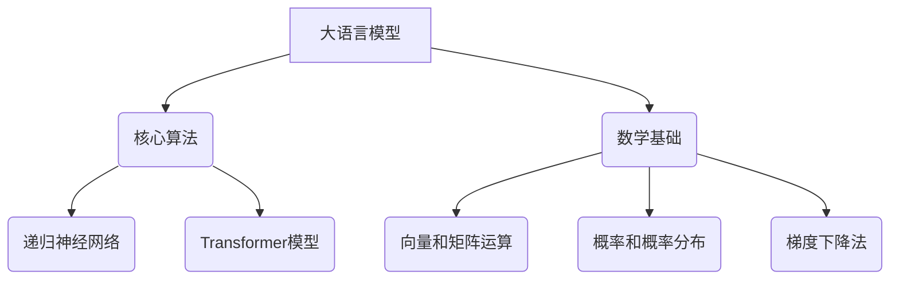

                 

### 文章标题：大语言模型应用指南：使用更清晰的语法

### 关键词：大语言模型，自然语言处理，深度学习，Transformer，预训练，模型优化，应用场景

> 摘要：本文旨在为广大读者提供一个全面的大语言模型应用指南，从基础理论到实际应用，详细解析大语言模型的构建、训练、优化以及在不同领域的应用。通过本文，读者将了解如何使用更清晰的语法来设计和部署高效的大语言模型，从而推动自然语言处理技术的发展。

### 第一部分：大语言模型基础理论

#### 第1章：大语言模型概述

##### 1.1 大语言模型的概念

大语言模型（Large Language Model，简称LLM）是一种基于深度学习的自然语言处理模型，能够对大量文本数据进行学习，并生成高质量的自然语言输出。LLM的核心是神经网络，通过对文本数据进行大规模的预训练，模型能够理解并预测语言中的上下文关系，从而生成与输入文本相关的内容。

##### 1.2 大语言模型的发展历程

- **早期研究**：20世纪50年代，基于规则和统计的方法开始用于自然语言处理。例如，LAPLACE语言模型和n-gram模型。
- **深度学习时代**：20世纪80年代，循环神经网络（RNN）的出现使得自然语言处理取得重要突破。LSTM和GRU进一步优化了RNN。
- **大规模预训练**：2018年，BERT模型的提出标志着大规模预训练时代的到来。GPT、T5等模型进一步推动了预训练技术的发展。

##### 1.3 大语言模型的工作原理

大语言模型的工作原理可以概括为三个主要步骤：

1. **输入处理**：将自然语言文本转化为向量表示。这通常涉及词嵌入（word embedding）技术，如Word2Vec和BERT。
2. **权重矩阵**：模型中的参数通过学习文本数据得到。这些参数决定了模型对输入文本的理解能力。
3. **输出生成**：通过概率分布生成文本输出。模型会根据输入文本和已学习的权重矩阵，生成一个概率分布，从中采样得到输出文本。

#### 第2章：语言模型的核心算法

##### 2.1 基本语言模型算法

- **N元语法模型**：基于前n个词预测下一个词的概率。这种模型简单直观，但难以处理长文本。
- **n-gram模型**：使用n个连续单词的历史信息来预测下一个单词的概率。n-gram模型是对N元语法模型的改进，但同样面临长文本处理困难的问题。

##### 2.2 递归神经网络（RNN）

- **基本原理**：RNN使用循环结构来保存和利用历史信息。通过更新隐藏状态，RNN能够处理序列数据。
- **变体**：LSTM和GRU是RNN的改进版本，它们通过门控机制来解决梯度消失和梯度爆炸的问题。

##### 2.3 卷积神经网络（CNN）在NLP中的应用

- **文本分类**：利用卷积层捕捉文本特征，然后通过全连接层进行分类。
- **序列标注**：利用卷积层和全连接层对序列信息进行标注。

##### 2.4 Transformer模型

- **原理**：Transformer模型引入了自注意力机制，能够对输入序列进行全局建模。
- **变体**：BERT、GPT等模型都是基于Transformer的变体，它们通过不同的架构设计实现了不同的功能。

#### 第3章：数学基础

##### 3.1 向量和矩阵运算

- **加法和标量乘法**：线性代数的基本运算，用于计算神经网络的权重更新。
- **矩阵乘法**：用于神经网络中的权重更新，是计算模型输出的关键步骤。

##### 3.2 概率和概率分布

- **概率的基本规则**：条件概率、贝叶斯定理等。
- **概率分布**：伯努利分布、高斯分布等，用于建模语言中的不确定性。

##### 3.3 梯度下降法

- **原理**：通过反向传播计算梯度，更新模型参数。
- **优化算法**：随机梯度下降（SGD）、Adam优化器等。

#### 第4章：大语言模型的训练与优化

##### 4.1 数据预处理

- **文本清洗**：去除噪声、标点符号、停用词等。
- **数据增强**：提高模型的泛化能力。

##### 4.2 预训练技术

- **自监督学习**：利用未标注数据进行预训练。
- **迁移学习**：将预训练模型应用于特定任务。

##### 4.3 模型微调和调优

- **任务特定微调**：调整模型以适应特定任务。
- **超参数优化**：调整学习率、批量大小等超参数。

#### 第5章：大语言模型的应用场景

##### 5.1 自动问答系统

- **工作原理**：使用大语言模型理解用户问题，并生成回答。
- **案例研究**：例如，基于BERT的问答系统。

##### 5.2 自动摘要与文本生成

- **自动摘要**：利用大语言模型生成文章的摘要。
- **文本生成**：利用大语言模型创作文章、故事等。

##### 5.3 机器翻译

- **工作原理**：利用大语言模型学习源语言和目标语言之间的映射关系。
- **案例研究**：例如，基于GPT的机器翻译系统。

#### 第6章：大语言模型的评估与优化

##### 6.1 模型评估指标

- **精度与召回率**：用于分类任务的评估。
- **BLEU评分**：用于机器翻译的评价。

##### 6.2 实时优化

- **在线学习**：调整模型以适应动态变化的数据。
- **自适应学习率**：根据模型性能自动调整学习率。

##### 6.3 模型压缩与部署

- **模型压缩**：降低模型的大小和计算复杂度。
- **模型部署**：在生产环境中部署模型，提供实时服务。

#### 第7章：项目实战

##### 7.1 开发环境搭建

- **Python环境配置**：安装Python和相关库。
- **深度学习框架**：使用TensorFlow或PyTorch进行模型训练。

##### 7.2 代码实战

- **数据预处理**：示例代码和数据集的加载。
- **模型训练**：代码实现和训练流程。
- **模型评估**：评估模型性能的代码实现。

##### 7.3 项目解读与分析

- **项目背景**：项目的目的和背景。
- **代码解读**：详细解读项目中的关键代码。
- **性能分析**：对项目结果进行性能分析。

#### 附录

##### 附录 A：大语言模型常用工具和资源

- **深度学习框架**：TensorFlow、PyTorch、JAX等。
- **开源代码与数据集**：Hugging Face、TensorFlow Datasets等。

##### 附录 B：Mermaid流程图示例

### 作者：AI天才研究院/AI Genius Institute & 禅与计算机程序设计艺术 /Zen And The Art of Computer Programming

---

本文按照目录大纲结构进行了撰写，涵盖了从大语言模型的基础理论到实际应用的各个方面。在后续的篇幅中，我们将对每个章节进行详细的讲解，帮助读者深入理解大语言模型的原理和应用。通过本文，希望能够为读者提供一个清晰、系统的学习路径，助力他们在自然语言处理领域取得更大的成就。

