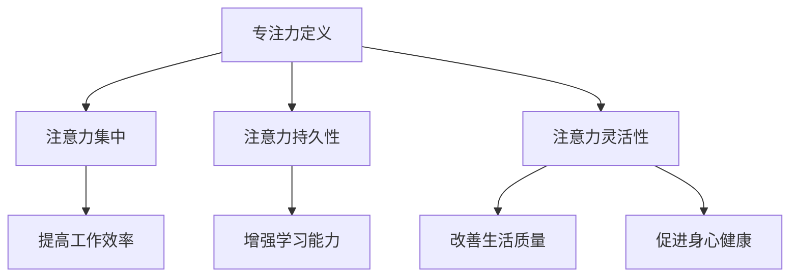
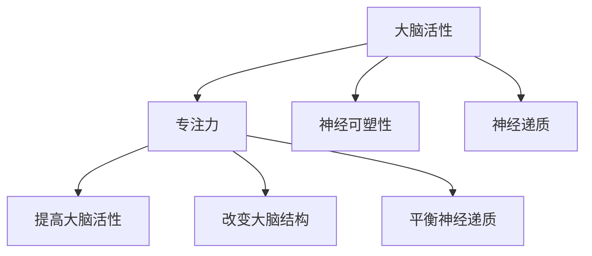
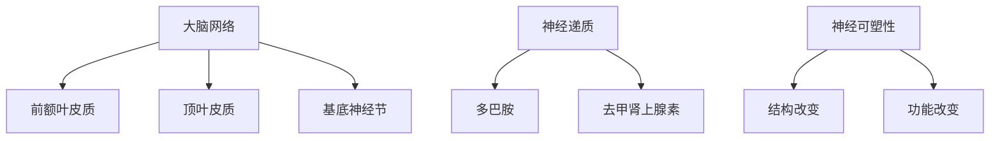

                 

### 第1章：专注力的概念与重要性

专注力是指个体在特定任务上集中注意力，忽略干扰因素的能力。它包括注意力的集中、持久性和灵活性。

#### 1.1.1 专注力的定义

专注力是一种认知能力，它涉及到大脑对信息的筛选和处理。具体来说，专注力包括以下三个方面：

1. **注意力集中**：指个体将注意力集中在特定的目标上，使其不被其他无关信息干扰。
2. **注意力持久性**：指个体能够长时间保持注意力的集中，而不易受到疲劳、干扰等因素的影响。
3. **注意力灵活性**：指个体能够根据任务需求和环境变化灵活调整注意力的分配。

#### 1.1.2 专注力的重要性

专注力对个人的工作和生活有着至关重要的影响，它有助于以下几个方面：

- **提高工作效率**：专注力能够帮助个体在任务执行过程中避免分心，提高工作效率和准确性。
- **增强学习能力**：专注力有助于个体深入理解学习内容，提高学习效果。
- **改善生活质量**：专注力能够帮助个体更好地管理时间和资源，提高生活质量。
- **促进身心健康**：专注于特定活动可以减轻压力，改善心理健康。

#### 1.1.3 专注力的影响因素

专注力的水平受到多种因素的影响，包括：

- **生理因素**：如睡眠质量、身体状态、饮食等。
- **心理因素**：如情绪、动机、自信心等。
- **环境因素**：如噪音、光线、空间布局等。
- **任务特点**：如任务难度、兴趣度、挑战性等。

### Mermaid 流程图

### 1.2 大脑运作与专注力

#### 2.1.1 大脑的基本结构

大脑是人体最重要的器官之一，它由以下几个主要部分组成：

- **大脑皮层**：大脑的最外层，负责处理高级认知功能，如思考、决策、记忆等。
- **大脑海马体**：位于大脑皮层下方，是记忆和学习的核心区域。
- **大脑杏仁核**：位于大脑底部，负责处理情绪反应。
- **大脑基底神经节**：与运动控制和习惯形成有关。

#### 2.1.2 注意力机制

注意力机制是大脑处理信息的一种基本方式，它通过选择性的信息加工来确保个体能够关注到重要的信息，同时忽略无关的干扰信息。

- **选择性注意**：大脑通过过滤机制，选择性地关注特定类型的刺激。
- **分配性注意**：个体在同时处理多个任务时，分配注意力资源。
- **持续注意**：保持对特定任务的持续关注，即使存在干扰。

#### 2.1.3 专注力与大脑的关系

专注力与大脑的关系密切，良好的大脑功能是保持专注力的重要基础。以下是一些关于专注力与大脑关系的要点：

- **大脑活性**：大脑的活性水平与专注力密切相关。通过适当的训练，可以提高大脑活性，增强专注力。
- **神经可塑性**：大脑具有神经可塑性，通过专注力的训练，可以改变大脑的结构和功能，提高专注力。
- **神经递质**：神经递质如多巴胺、去甲肾上腺素等与专注力密切相关。平衡的神经递质水平有助于提高专注力。

### Mermaid 流程图

### 2.3 专注力的心理学原理

#### 3.1.1 注意力心理学理论

注意力心理学理论提供了关于如何理解和管理注意力的框架。以下是一些主要的注意力心理学理论：

- **认知控制理论**：强调个体通过认知控制来调节注意力。
- **注意力资源理论**：认为注意力是一种有限的资源，需要分配给不同的任务。
- **双重加工理论**：提出注意力分为无意注意和有意注意两种形式。
- **认知风格理论**：关注个体如何处理信息，以及这种处理方式如何影响专注力。

#### 3.1.2 专注力与认知心理学

认知心理学研究个体的认知过程，包括注意力、记忆、思维等。以下是如何理解专注力与认知心理学的关系：

- **注意力与记忆**：专注力影响记忆的编码和提取过程。专注力越高，记忆效果越好。
- **注意力与思维**：专注力影响个体的决策过程和问题解决能力。专注力强的人更容易保持清晰的思考。
- **认知负荷**：当认知负荷过高时，专注力容易下降。通过合理分配认知资源，可以减轻认知负荷，提高专注力。

#### 3.1.3 专注力的神经科学基础

神经科学提供了关于专注力的大脑基础和神经机制的见解。以下是一些关于专注力神经科学基础的要点：

- **大脑网络**：专注力涉及到多个大脑网络，包括前额叶皮质、顶叶皮质和基底神经节等。
- **神经递质**：神经递质如多巴胺、去甲肾上腺素等在专注力中起着关键作用。
- **神经可塑性**：通过训练，大脑可以改变其结构和功能，从而提高专注力。

### Mermaid 流�程图

### 2.4 专注力测试与评估

#### 4.1.1 专注力测试方法

专注力测试旨在评估个体的专注力水平。以下是一些常用的专注力测试方法：

- **反事实测试**：通过让被试者回忆过去的事件，评估他们的专注力。
- **任务切换测试**：通过让被试者在不同的任务间切换，评估他们的注意力灵活性。
- **持续注意力测试**：通过持续监测被试者的行为，评估他们的专注力持久性。

#### 4.1.2 专注力评估工具

专注力评估工具可以帮助个体了解自己的专注力水平。以下是一些常用的专注力评估工具：

- **专注力问卷**：通过一系列问题，评估个体的专注力。
- **神经心理学测试**：通过专业的测试，评估个体的神经心理功能。
- **行为观察**：通过观察个体在特定任务中的表现，评估他们的专注力。

#### 4.1.3 自我评估与改进

自我评估是了解自己专注力水平的重要步骤。以下是一些自我评估的方法和改进技巧：

- **记录和反思**：记录每天的任务和表现，定期反思，了解自己的进步和挑战。
- **设定目标**：设定具体、可衡量的目标，逐步提高专注力。
- **实践技巧**：通过练习专注力训练技巧，如冥想、时间管理等，提高专注力。

### 2.5 环境因素与专注力

#### 5.1.1 环境对专注力的影响

环境对专注力有着显著的影响。以下是一些环境因素对专注力的影响：

- **噪音**：噪音是影响专注力的主要干扰因素。高噪音水平会导致注意力的分散，降低专注力。
- **光线**：光线亮度对专注力有重要影响。过亮或过暗的光线都会影响个体的注意力集中。
- **空间布局**：合理设计的空间布局有助于提高专注力。一个整洁、有序的工作环境可以减少干扰。
- **干扰物品**：桌面上的杂物和电子设备都可能成为干扰因素，影响专注力。

#### 5.1.2 创建有利于专注的环境

为了提高专注力，需要创建一个有利于专注的环境。以下是一些创建有利环境的建议：

- **减少噪音**：使用耳塞或耳机屏蔽外界噪音，或者选择一个安静的场所进行工作。
- **控制光线**：确保工作区域的光线充足，避免过亮或过暗的光线。
- **整理空间**：保持工作环境的整洁，减少杂乱无章的物品。
- **专注空间**：为自己创建一个专门用于专注工作的空间，避免其他干扰。

#### 5.1.3 减少干扰技巧

以下是一些减少干扰的技巧，有助于提高专注力：

- **时间管理**：合理安排工作和休息时间，避免长时间连续工作导致疲劳。
- **设定专注时间**：使用番茄工作法等时间管理技巧，设定专注时间段，提高工作效率。
- **关闭通知**：关闭不必要的通知和消息提示，减少电子设备的干扰。
- **单任务处理**：专注于一项任务，避免同时处理多个任务，减少分心。

### 2.6 生理因素与专注力

#### 6.1.1 生理因素对专注力的影响

生理因素对专注力有重要影响。以下是一些生理因素对专注力的影响：

- **睡眠质量**：良好的睡眠质量是保持专注力的重要因素。睡眠不足会导致注意力下降、记忆力减退。
- **身体状态**：身体健康状况也会影响专注力。慢性疾病、疲劳等都会降低专注力。
- **饮食**：饮食对专注力有显著影响。均衡的饮食和充足的营养有助于提高专注力。
- **身体活动**：适量的身体活动可以提高大脑活性，增强专注力。

#### 6.1.2 保持良好的生理状态

以下是一些建议，有助于保持良好的生理状态，提高专注力：

- **充足睡眠**：每天保持7-8小时的充足睡眠，有助于提高专注力。
- **健康饮食**：摄入丰富的水果、蔬菜、全谷物和优质蛋白质，避免过量摄入糖和咖啡因。
- **适量运动**：每周进行至少150分钟的中等强度运动，有助于提高大脑活性。
- **健康生活习惯**：保持适当的体重，戒烟限酒，减少压力，提高身体健康。

#### 6.1.3 健康饮食与睡眠

健康饮食和充足睡眠是保持专注力的重要因素。以下是一些关于健康饮食和睡眠的建议：

- **健康饮食**：

  - **早餐**：早餐是一天中最重要的一餐，应该包含丰富的蛋白质、纤维和健康脂肪。
  - **午餐**：午餐应该均衡营养，包括蛋白质、蔬菜和适量的碳水化合物。
  - **晚餐**：晚餐应该轻食，避免过量摄入，以免影响睡眠质量。
  - **零食**：选择健康的零食，如坚果、水果，避免高糖和高脂肪的食物。

- **充足睡眠**：

  - **睡眠环境**：确保睡眠环境舒适、安静、黑暗。使用遮光窗帘，保持室内温度适宜。
  - **睡眠时间**：成年人每天需要7-8小时的睡眠时间。尽量保持固定的睡眠和起床时间，形成健康的睡眠习惯。
  - **睡前习惯**：睡前进行放松活动，如阅读、冥想或听轻音乐，有助于入睡。

### 6.2 心理因素与专注力

#### 7.1.1 心理因素对专注力的影响

心理因素对专注力有着重要影响。以下是一些心理因素对专注力的影响：

- **情绪**：情绪状态会影响专注力。焦虑、压力和抑郁等负面情绪会导致注意力下降。
- **动机**：个体的动机水平也会影响专注力。高度动机可以增强专注力，而缺乏动机则可能导致分心。
- **自信心**：自信心对专注力也有重要影响。自信的人更容易保持专注，而缺乏自信的人可能会感到不安，导致注意力分散。

#### 7.1.2 心理调适技巧

以下是一些心理调适技巧，有助于提高专注力：

- **情绪管理**：学会识别和管理自己的情绪，避免情绪波动对专注力的影响。
- **设定目标**：设定具体、可实现的短期和长期目标，提高动机和专注力。
- **自我激励**：通过自我激励，如奖励自己完成任务，增强专注力。
- **认知重构**：改变对任务的看法，将困难视为挑战，提高自信心。

#### 7.1.3 减轻心理压力的方法

以下是一些减轻心理压力的方法，有助于提高专注力：

- **放松技巧**：如深呼吸、冥想和渐进性肌肉松弛等，有助于缓解压力。
- **时间管理**：合理安排时间和任务，避免过度工作和时间紧迫感。
- **社交支持**：与家人、朋友或同事交流，分享自己的压力和困扰，获得支持。
- **运动**：适量的运动可以释放压力，提高身心健康。

### 7.2 专注力训练方法

#### 8.1.1 分散注意力训练

分散注意力训练旨在提高个体的注意力控制能力，以下是一些分散注意力训练的方法：

- **倒计时练习**：从1数到10，尽量在短时间内完成，以提高专注力和反应速度。
- **记忆游戏**：玩一些需要集中注意力的记忆游戏，如拼图、数独等，锻炼记忆力。
- **焦点转移练习**：在完成一项任务时，尝试将注意力转移到其他任务，以提高注意力的灵活性。

#### 8.1.2 注意力集中训练

注意力集中训练旨在提高个体在特定任务上的专注力，以下是一些注意力集中训练的方法：

- **冥想**：通过冥想练习，学会专注呼吸或某一物体，提高注意力集中能力。
- **定时练习**：设定一段时间，专注于一项任务，如在规定时间内完成阅读或写作。
- **专注力游戏**：玩一些需要高度集中注意力的游戏，如反应速度游戏、追踪练习等。

#### 8.1.3 提高专注力的游戏与活动

以下是一些可以提高专注力的游戏与活动：

- **思维游戏**：玩一些需要逻辑思维和解谜能力的游戏，如拼图、数独、棋类游戏等。
- **户外活动**：进行户外运动，如跑步、骑行、徒步等，有助于提高大脑活性。
- **艺术创作**：参与绘画、音乐、写作等艺术创作活动，可以提高专注力和创造力。

### 8.2 专注力在工作中的应用

#### 9.1.1 提高工作效率的专注技巧

以下是一些提高工作效率的专注技巧：

- **优先级排序**：将任务按照优先级排序，首先完成最重要的任务，提高工作效率。
- **定时工作**：使用番茄工作法等时间管理技巧，设定专注时间段，提高工作效率。
- **减少干扰**：关闭不必要的通知和消息提示，减少电子设备的干扰，保持专注。
- **专注区域**：为自己创建一个专注区域，避免其他干扰，提高工作效率。

#### 9.1.2 避免工作分心的方法

以下是一些避免工作分心的方法：

- **设置任务目标**：在开始工作前，明确任务目标，避免在任务执行过程中分心。
- **避免多任务处理**：专注于一项任务，避免同时处理多个任务，减少分心。
- **定期休息**：在长时间工作后，进行短暂休息，避免疲劳导致的分心。
- **保持环境整洁**：保持工作环境的整洁，减少杂乱无章的物品。

#### 9.1.3 专注力在工作项目中的应用案例

以下是一些专注力在工作项目中的应用案例：

- **项目管理**：项目经理通过专注力训练，提高了任务管理和项目进度控制的能力，成功完成了多个复杂项目。
- **软件开发**：软件开发人员在编程过程中，通过专注力训练，提高了代码质量和开发效率。
- **销售与营销**：销售人员通过专注力训练，提高了客户沟通和销售技巧，提高了业绩。

### 9.2 专注力在学习中的应用

#### 10.1.1 提高学习效果的专注技巧

以下是一些提高学习效果的专注技巧：

- **目标设定**：在开始学习前，设定明确的学习目标，提高学习的动力和专注力。
- **环境准备**：为自己创造一个适合学习的环境，减少干扰因素，提高学习效率。
- **专注时段**：使用番茄工作法等时间管理技巧，设定专注学习时段，提高学习效果。
- **重复练习**：通过反复练习和复习，加深对学习内容的理解和记忆。

#### 10.1.2 避免学习干扰的方法

以下是一些避免学习干扰的方法：

- **关闭通知**：关闭手机和电脑的通知功能，减少学习过程中被干扰的可能性。
- **专注区域**：为自己创建一个专注区域，避免学习时被外界干扰。
- **避免多任务处理**：专注于一项学习任务，避免同时进行其他活动，提高学习效率。
- **定期休息**：在长时间学习后，进行短暂休息，避免疲劳导致的分心。

#### 10.1.3 专注力在学习中的实际应用案例

以下是一些专注力在学习中的实际应用案例：

- **考试成绩提升**：通过专注力训练，学生在考试中能够集中注意力，提高了考试成绩。
- **科研论文撰写**：科研人员通过专注力训练，提高了科研工作效率，加快了论文的撰写进度。
- **外语学习**：通过专注力训练，提高了外语学习者的听力、口语和阅读能力。

### 10.3 专注力在生活中的应用

#### 11.1.1 提高生活质量的专注技巧

以下是一些提高生活质量的专注技巧：

- **时间管理**：合理安排时间，确保在工作和生活中有足够的专注时间。
- **情绪管理**：通过专注力训练，提高情绪管理能力，减少焦虑和压力。
- **自我反思**：定期进行自我反思，了解自己的需求和目标，提高生活质量。
- **家庭关系**：在家庭生活中，通过专注力训练，提高与家人的沟通质量，增进家庭和谐。

#### 11.1.2 避免日常生活中的分心因素

以下是一些避免日常生活中的分心因素的方法：

- **设定规则**：为自己设定一些规则，如不使用手机或电脑进行其他活动，提高专注力。
- **专注活动**：在进行日常活动时，专注于当前的任务，避免分心。
- **限制社交媒体**：限制社交媒体的使用时间，避免过度沉迷和分心。
- **创造专注环境**：为自己创造一个有利于专注的环境，减少干扰因素。

#### 11.1.3 专注力在个人生活规划中的应用案例

以下是一些专注力在个人生活规划中的应用案例：

- **职业规划**：通过专注力训练，规划自己的职业发展路径，提高职业竞争力。
- **旅行计划**：在旅行规划过程中，专注选择目的地、行程安排和活动，提高旅行体验。
- **家庭财务管理**：通过专注力训练，合理安排家庭财务，提高生活质量。

### 10.4 专注力的长期养成与维持

#### 12.1.1 长期专注力的养成策略

以下是一些长期专注力的养成策略：

- **习惯培养**：将专注力训练融入日常生活，培养良好的专注习惯。
- **持续训练**：定期进行专注力训练，提高专注力水平。
- **目标设定**：设定具体、可实现的短期和长期目标，保持专注的动力。
- **反馈与调整**：定期评估自己的专注力水平，及时调整训练策略。

#### 12.1.2 避免专注力衰退的方法

以下是一些避免专注力衰退的方法：

- **定期休息**：避免长时间连续工作或学习，定期休息，避免疲劳。
- **多样化训练**：进行多种形式的专注力训练，避免单一训练导致的疲劳和厌倦。
- **保持好奇心**：保持对学习和探索的好奇心，激发专注的动力。
- **避免过度使用电子设备**：减少电子设备的使用时间，避免对电子设备的依赖。

#### 12.1.3 专注力养成与自我提升的持续过程

专注力的养成是一个持续的过程，以下是一些关于专注力养成与自我提升的持续过程的要点：

- **自我反思**：定期进行自我反思，了解自己的进步和不足，调整训练策略。
- **学习新技能**：通过学习新技能，挑战自己的专注力，提高自己的能力。
- **与他人交流**：与他人分享专注力训练的经验和技巧，互相学习，共同进步。
- **持续关注**：关注专注力研究的前沿动态，了解最新的研究方法和成果。

### 附录

#### 附录A：专注力提升资源推荐

以下是一些专注力提升资源的推荐：

- **书籍推荐**：
  - 《专注力训练：如何提高注意力与工作效率》
  - 《冥想与专注力：如何通过冥想提高专注力》
  - 《深度工作：如何在工作与生活中保持专注》

- **优质文章推荐**：
  - 《如何提高专注力：实用技巧与策略》
  - 《专注力与大脑关系的研究》
  - 《专注力训练的科学依据与实践方法》

- **注意力训练应用软件推荐**：
  - **专注力训练器**：提供专注力训练的软件和应用程序，如“专注力训练器”、“专注力练习”等。
  - **时间管理工具**：如“番茄钟”、“时间管理大师”等，帮助设定专注时间，提高工作效率。
  - **冥想应用**：如“冥想大师”、“喜马拉雅冥想”等，提供冥想音频和指导，帮助放松心情，提高专注力。

#### 附录B：专注力训练指南

以下是一些专注力训练指南：

- **常见问题解答**：
  - **如何开始专注力训练？**
    - 首先，设定一个明确的目标，如提高工作或学习中的专注力。然后，选择一种适合自己的专注力训练方法，如定时练习、专注力游戏等。开始时，可以从较短的时间段（例如5-10分钟）开始，逐渐增加专注时间。
  - **专注力训练是否会影响其他方面的能力？**
    - 通常情况下，专注力训练有助于提高个体的整体认知能力，包括注意力、记忆、思维等。然而，过度专注于一项任务可能会导致其他方面的能力下降。因此，建议在训练时保持平衡，避免单一任务的过度依赖。

- **专注力训练常见误区及解决方法**：
  - **误区1：专注力训练必须连续进行**
    - **解决方法**：专注力训练不必连续进行，适当休息可以提高训练效果。建议在训练后进行短暂的休息，让大脑得到恢复。
  - **误区2：专注力训练只能通过特定方法进行**
    - **解决方法**：有多种专注力训练方法，如冥想、时间管理技巧、专注力游戏等。选择适合自己的方法，并根据个人需求进行调整。

- **专注力训练实用技巧分享**：
  - **技巧1：设定明确的目标**
    - 在进行专注力训练前，设定一个具体、可衡量的目标，有助于提高训练的动机和效果。
  - **技巧2：使用计时工具**
    - 使用计时工具（如番茄钟）来帮助自己保持专注，并在完成任务后进行短暂休息。
  - **技巧3：保持积极的心态**
    - 保持积极的心态，对待训练过程充满信心。遇到困难时，不要轻易放弃，而是尝试调整训练策略。

### 附录C：专注力提升工具与资源

以下是一些专注力提升的工具和资源：

- **专注力训练应用**：
  - **专注力训练器**：提供专注力训练的软件和应用程序，如“专注力训练器”、“专注力练习”等。
  - **番茄钟**：基于番茄工作法的时间管理工具，帮助设定专注时间和休息时间。

- **时间管理工具**：
  - **时间管理大师**：提供任务管理、时间跟踪等功能，帮助用户合理安排时间，提高效率。
  - **滴答清单**：一款任务管理应用，帮助用户制定计划、设置提醒，提高时间管理能力。

- **冥想应用**：
  - **冥想大师**：提供冥想指导、音频课程等功能，帮助用户进行冥想练习，提高专注力。
  - **喜马拉雅冥想**：提供各种类型的冥想课程和音频，适合不同需求的用户。

#### 附录D：专注力提升专业机构与课程推荐

以下是一些专注力提升的专业机构和课程推荐：

- **专业机构**：
  - **专注力训练学院**：提供专注力训练课程、工作坊和心理咨询服务。
  - **注意力训练研究所**：专注于注意力提升的研究和应用，提供相关培训和咨询服务。

- **课程推荐**：
  - **专注力训练课程**：专注于提高个体的专注力和工作效率，适合职场人士和学生。
  - **注意力提升课程**：针对不同年龄段和需求，提供个性化的注意力提升训练。
  - **家庭专注力训练课程**：帮助家长和孩子共同提高专注力，改善家庭生活质量。

### 附录E：专注力提升实用技巧

以下是一些专注力提升的实用技巧：

- **技巧1：设定明确的目标**
  - 在进行专注力训练前，设定一个具体、可衡量的目标，有助于提高训练的动机和效果。

- **技巧2：使用计时工具**
  - 使用计时工具（如番茄钟）来帮助自己保持专注，并在完成任务后进行短暂休息。

- **技巧3：保持积极的心态**
  - 保持积极的心态，对待训练过程充满信心。遇到困难时，不要轻易放弃，而是尝试调整训练策略。

- **技巧4：合理安排时间**
  - 合理安排时间，确保有足够的时间进行专注力训练，避免过度疲劳。

- **技巧5：避免多任务处理**
  - 专注于一项任务，避免同时进行其他活动，提高专注力。

### 附录F：专注力提升常见问题解答

以下是一些关于专注力提升的常见问题解答：

- **问题1：如何开始专注力训练？**
  - 首先，设定一个明确的目标，如提高工作或学习中的专注力。然后，选择一种适合自己的专注力训练方法，如定时练习、专注力游戏等。开始时，可以从较短的时间段（例如5-10分钟）开始，逐渐增加专注时间。

- **问题2：专注力训练会影响其他方面的能力吗？**
  - 通常情况下，专注力训练有助于提高个体的整体认知能力，包括注意力、记忆、思维等。然而，过度专注于一项任务可能会导致其他方面的能力下降。因此，建议在训练时保持平衡，避免单一任务的过度依赖。

- **问题3：专注力训练是否需要每天进行？**
  - 不一定需要每天进行专注力训练。根据个人的时间和需求，可以选择每周进行几次训练。重要的是保持持续的练习，逐渐提高专注力。

### 附录G：专注力提升注意事项

以下是一些专注力提升的注意事项：

- **注意事项1：保持积极的心态**
  - 在进行专注力训练时，保持积极的心态非常重要。对待训练过程充满信心，相信自己可以逐步提高专注力。

- **注意事项2：避免过度训练**
  - 过度的专注力训练可能导致身体和心理疲劳。建议根据自己的身体状况和需求，合理安排训练时间和强度。

- **注意事项3：结合实际情况调整训练方法**
  - 根据个人的实际情况，调整训练方法和策略。如果感到训练过于困难，可以适当降低难度，逐渐增加挑战。

- **注意事项4：定期评估训练效果**
  - 定期评估自己的专注力水平，了解训练的进展和效果。根据评估结果，调整训练策略，保持持续的进步。

### 附录H：专注力提升实践案例

以下是一些专注力提升的实践案例：

- **案例1：通过专注力训练提高工作效率**
  - 张某是一家公司的项目经理，他通过定期进行专注力训练，提高了任务管理和项目进度控制的能力。他设定了明确的目标，并使用番茄钟来帮助自己保持专注。经过一段时间的训练，他的工作效率明显提高，成功完成了多个复杂项目。

- **案例2：通过专注力训练提高学习效果**
  - 李某是一名大学生，他发现自己在学习时容易分心，影响学习效果。他开始进行专注力训练，设定了明确的学习目标，并使用番茄钟来帮助自己保持专注。通过持续的训练，他的学习效果显著提高，考试成绩稳步提升。

- **案例3：通过专注力训练改善生活质量**
  - 王某是一名上班族，他发现自己经常在工作时感到焦虑和疲惫，影响生活质量。他开始进行专注力训练，通过设定明确的目标、调整时间管理和减少干扰，他的工作效率和生活质量都有所提高。

