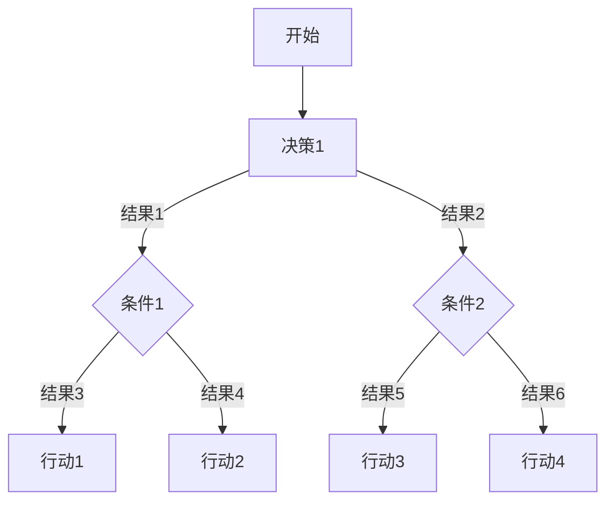
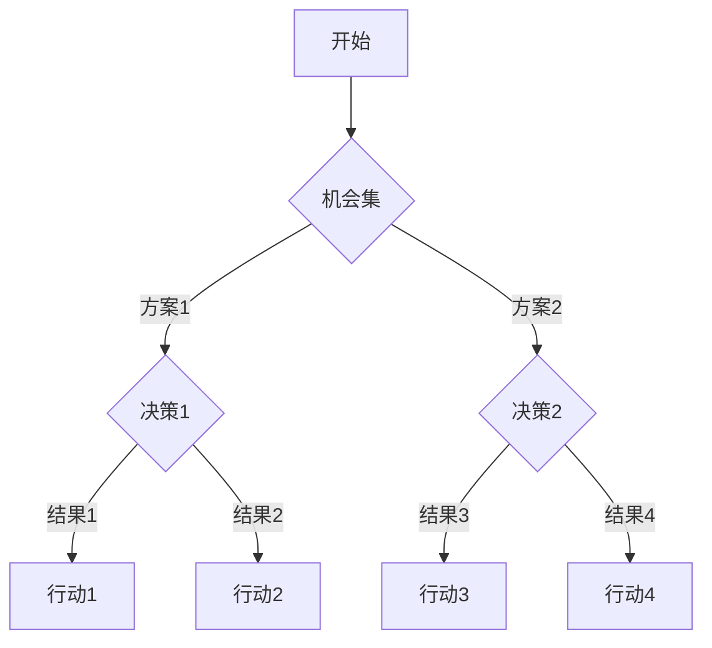
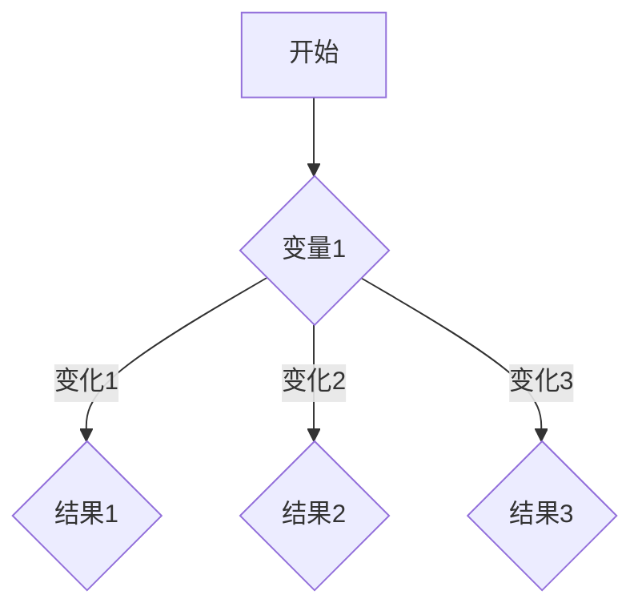
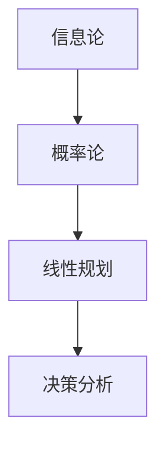

                 

# 文章标题：如何进行决策分析：如何做出明智的决策？

> 关键词：决策分析，决策模型，概率论，线性规划，人工智能，案例实战

> 摘要：本文将深入探讨决策分析的基本概念、方法和应用，通过详细的步骤解析和实例分析，帮助读者理解和掌握如何进行有效的决策分析，从而做出明智的决策。

---

### 《如何进行决策分析：如何做出明智的决策？》目录大纲

---

## 第一部分：决策分析基础

### 第1章：决策分析概述

### 第2章：决策模型与方法

### 第3章：决策分析工具与应用

## 第二部分：决策分析核心概念与联系

### 第4章：决策分析核心概念原理

### 第5章：决策分析核心概念架构

### 第6章：决策分析中数据的使用

## 第三部分：核心算法原理讲解

### 第7章：决策分析核心算法原理

### 第8章：数学模型与公式讲解

## 第四部分：项目实战与案例分析

### 第9章：决策分析实战案例

### 第10章：开发环境搭建与代码实现

### 第11章：案例分析解读

## 附录

### 附录A：决策分析工具与资源

### 附录B：决策分析伪代码与数学公式

---

## 第1章：决策分析概述

### 1.1 决策分析的重要性

在现代社会，决策分析已成为各类企业和组织的重要工具。无论是商业投资、项目管理，还是政策制定，决策分析都发挥着至关重要的作用。正确的决策能够带来巨大的收益，而错误的决策则可能导致巨大的损失。因此，如何进行有效的决策分析，是每个企业和组织必须掌握的核心能力。

### 1.2 决策分析的定义和原则

决策分析是一种系统的方法，用于评估不同决策方案的潜在结果，并基于这些结果做出最佳决策。其基本原则包括：

1. **明确目标**：确定决策的目标和预期结果。
2. **全面分析**：综合考虑各种可能性和不确定性因素。
3. **客观评估**：基于数据和分析，客观评估每个决策方案的风险和收益。
4. **权衡利弊**：在多个决策方案之间进行权衡，选择最佳方案。

### 1.3 决策分析的基本步骤

决策分析通常包括以下基本步骤：

1. **确定问题**：明确决策问题和目标。
2. **收集数据**：收集与决策相关的信息。
3. **构建模型**：根据数据构建决策模型。
4. **分析方案**：分析不同决策方案的结果。
5. **评估风险**：评估每个决策方案的风险。
6. **做出决策**：基于分析结果做出最终决策。

---

## 第2章：决策模型与方法

### 2.1 决策模型概述

决策模型是用于描述决策问题的数学框架，它可以帮助我们更好地理解和分析决策问题。常见的决策模型包括确定型决策模型、风险型决策模型和不确定性决策模型。

### 2.2 确定型决策模型

确定型决策模型适用于所有条件已知，结果可预测的决策问题。常见的确定型决策模型包括最大最小最大化模型、最大最小最小化模型和最大平均值模型。

#### 2.2.1 最大最小最大化模型

最大最小最大化模型，也称为Maximin模型，其核心思想是找到一种决策方案，使得在所有可能的最坏情况下，结果都是最优的。

**伪代码：**

```
最大化 x
满足约束条件：y <= c
```

#### 2.2.2 最大最小最小化模型

最大最小最小化模型，也称为Minimax模型，其核心思想是找到一种决策方案，使得在最坏的情况下，结果是最小的。

**伪代码：**

```
最小化 x
满足约束条件：y >= c
```

#### 2.2.3 最大平均值模型

最大平均值模型，也称为Maximize the Expected Value模型，其核心思想是选择一个决策方案，使得在所有可能情况下，结果的期望值最大。

**伪代码：**

```
最大化 E[x]
满足约束条件：y ~ 分布
```

### 2.3 风险型决策模型

风险型决策模型适用于条件不确定，但概率已知的风险型决策问题。常见的风险型决策模型包括概率型决策模型、贝叶斯决策模型和等可能决策模型。

#### 2.3.1 概率型决策模型

概率型决策模型基于概率分布，选择一个决策方案，使得在所有可能情况下，结果的期望值最大。

**伪代码：**

```
最大化 E[x]
满足约束条件：x ~ 分布
```

#### 2.3.2 贝叶斯决策模型

贝叶斯决策模型基于贝叶斯定理，选择一个决策方案，使得在所有可能情况下，后验概率最大。

**伪代码：**

```
最大化 P(H|D)
满足约束条件：P(D|H)P(H)
```

#### 2.3.3 等可能决策模型

等可能决策模型假设所有决策结果等可能发生，选择一个决策方案，使得在所有可能情况下，结果的期望值最大。

**伪代码：**

```
最大化 E[x]
满足约束条件：x ~ 等可能分布
```

### 2.4 不确定性决策模型

不确定性决策模型适用于条件不确定，且概率未知的决策问题。常见的不确定性决策模型包括最大最小 regret 模型和最大满意度模型。

#### 2.4.1 最大最小 regret 模型

最大最小 regret 模型，也称为Regret Minimization模型，其核心思想是选择一个决策方案，使得在所有可能情况下，后悔值最小。

**伪代码：**

```
最小化 max{regret(x)}
满足约束条件：x ~ 分布
```

#### 2.4.2 最大满意度模型

最大满意度模型，也称为Satisficing模型，其核心思想是选择一个决策方案，使得在所有可能情况下，满意度最大。

**伪代码：**

```
最大化 satisfaction(x)
满足约束条件：x ~ 分布
```

---

## 第3章：决策分析工具与应用

### 3.1 决策树

决策树是一种常见的决策分析方法，它通过树状结构表示不同决策方案的结果和概率。

**Mermaid 流程图：**



### 3.2 机会集模型

机会集模型是一种用于分析不确定型决策问题的方法，它通过集合表示不同决策方案的结果和概率。

**Mermaid 流程图：**



### 3.3 敏感性分析

敏感性分析是一种用于评估决策结果对变量变化的敏感程度的方法，它可以帮助我们了解决策的稳定性和可靠性。

**Mermaid 流程图：**



### 3.4 决策分析软件应用

决策分析软件可以帮助我们快速构建、分析和评估决策模型，常见的决策分析软件包括Excel、MATLAB、R和Python等。

**Python 示例：**

```python
import numpy as np
import pandas as pd
from scipy.optimize import linprog

# 定义目标函数和约束条件
c = [-1, -1]
A = [[1, 1], [1, 2]]
b = [2, 3]

# 求解线性规划问题
result = linprog(c, A_ub=A, b_ub=b)

# 输出结果
print(result.x)
```

---

## 第二部分：决策分析核心概念与联系

### 第4章：决策分析核心概念原理

### 第5章：决策分析核心概念架构

### 第6章：决策分析中数据的使用

---

## 第4章：决策分析核心概念原理

### 4.1 决策分析中的信息论基础

信息论是决策分析的重要理论基础，它帮助我们理解如何在不确定性和信息不足的情况下做出决策。信息论的核心概念包括信息熵、条件熵和联合熵。

#### 4.1.1 信息熵

信息熵（Entropy）是衡量随机变量不确定性的一种度量。对于一个离散随机变量 \(X\)，其信息熵定义为：

$$
H(X) = -\sum_{i} p(x_i) \log_2 p(x_i)
$$

其中，\(p(x_i)\) 是随机变量 \(X\) 取值 \(x_i\) 的概率。

**示例：**

设随机变量 \(X\) 有两个取值 \(x_1\) 和 \(x_2\)，概率分别为 \(p(x_1) = 0.5\) 和 \(p(x_2) = 0.5\)，则 \(X\) 的信息熵为：

$$
H(X) = -0.5 \log_2 0.5 - 0.5 \log_2 0.5 = 1
$$

#### 4.1.2 条件熵与联合熵

条件熵（Conditional Entropy）是衡量给定一个随机变量后，另一个随机变量的不确定性减少的程度。对于随机变量 \(X\) 和 \(Y\)，条件熵 \(H(Y|X)\) 定义为：

$$
H(Y|X) = -\sum_{x} p(x) \sum_{y} p(y|x) \log_2 p(y|x)
$$

联合熵（Joint Entropy）是衡量两个随机变量同时不确定性的度量。对于随机变量 \(X\) 和 \(Y\)，联合熵 \(H(X, Y)\) 定义为：

$$
H(X, Y) = -\sum_{x} \sum_{y} p(x, y) \log_2 p(x, y)
$$

#### 4.1.3 相关系数

相关性（Correlation）是衡量两个随机变量之间线性关系强度的一种度量。对于随机变量 \(X\) 和 \(Y\)，其相关性可以通过相关系数 \(r\) 表示：

$$
r = \frac{Cov(X, Y)}{\sqrt{Var(X) Var(Y)}}
$$

其中，\(Cov(X, Y)\) 是 \(X\) 和 \(Y\) 的协方差，\(Var(X)\) 和 \(Var(Y)\) 分别是 \(X\) 和 \(Y\) 的方差。

### 4.2 决策分析中的概率论基础

概率论是决策分析的核心基础，它帮助我们理解和处理不确定性。概率论的基本概念包括概率分布、随机变量和期望。

#### 4.2.1 概率分布

概率分布是描述随机变量取值概率的函数。常见的概率分布包括：

- **离散概率分布**：例如伯努利分布、二项分布和泊松分布。
- **连续概率分布**：例如正态分布、均匀分布和指数分布。

#### 4.2.2 随机变量与期望

随机变量是概率论中的一个基本概念，它是一个可以取多种可能值的变量。期望（Expected Value）是衡量随机变量取值集中趋势的一个指标。

对于离散随机变量 \(X\)，其期望定义为：

$$
E(X) = \sum_{x} x \cdot p(x)
$$

对于连续随机变量 \(X\)，其期望定义为：

$$
E(X) = \int_{-\infty}^{\infty} x \cdot f(x) \, dx
$$

其中，\(p(x)\) 是离散概率分布函数，\(f(x)\) 是连续概率密度函数。

#### 4.2.3 方差与协方差

方差（Variance）是衡量随机变量取值离散程度的一个指标。对于离散随机变量 \(X\)，其方差定义为：

$$
Var(X) = E[(X - E(X))^2]
$$

对于连续随机变量 \(X\)，其方差定义为：

$$
Var(X) = E[(X - E(X))^2]
$$

协方差（Covariance）是衡量两个随机变量之间线性关系强度的一个指标。对于随机变量 \(X\) 和 \(Y\)，其协方差定义为：

$$
Cov(X, Y) = E[(X - E(X))(Y - E(Y))]
$$

### 4.3 决策分析中的线性规划

线性规划（Linear Programming）是一种用于求解资源分配和优化问题的数学方法。线性规划的基本概念包括目标函数和约束条件。

#### 4.3.1 线性规划问题定义

线性规划问题可以定义为：

$$
\text{最大化 } c^T x \\
\text{约束条件 } Ax \leq b
$$

其中，\(c\) 是目标函数系数向量，\(x\) 是决策变量向量，\(A\) 是约束条件系数矩阵，\(b\) 是约束条件常数向量。

#### 4.3.2 线性规划求解算法

线性规划的求解算法包括单纯形法、内点法和拉格朗日乘子法等。

**单纯形法（Simplex Method）**：

1. **初始可行解**：选择一个初始可行解。
2. **迭代过程**：根据目标函数和约束条件，迭代更新可行解，直到找到最优解。

**内点法（Interior Point Method）**：

1. **初始可行解**：选择一个内部可行解。
2. **迭代过程**：根据目标函数和约束条件，迭代更新可行解，直到找到最优解。

**拉格朗日乘子法（Lagrange Multiplier Method）**：

1. **构造拉格朗日函数**：构建拉格朗日函数 \(L(x, \lambda) = c^T x + \lambda^T (Ax - b)\)。
2. **求解方程组**：求解拉格朗日函数的偏导数为零的方程组，得到最优解。

---

## 第5章：决策分析核心概念架构

### 5.1 决策分析框架概述

决策分析框架是一个系统的方法，用于指导决策分析的整个过程。一个完整的决策分析框架通常包括以下步骤：

1. **明确问题**：明确决策问题和目标。
2. **数据收集**：收集与决策相关的数据。
3. **构建模型**：根据数据构建决策模型。
4. **分析方案**：分析不同决策方案的结果。
5. **评估风险**：评估每个决策方案的风险。
6. **做出决策**：基于分析结果做出最终决策。

### 5.2 决策分析流程图


### 5.3 决策分析核心概念架构

决策分析的核心概念包括信息论、概率论和线性规划。这些概念相互关联，构成了决策分析的理论基础。

- **信息论**：用于理解不确定性和信息处理。
- **概率论**：用于描述和计算不确定性的概率。
- **线性规划**：用于求解资源分配和优化问题。



---

## 第6章：决策分析中数据的使用

### 6.1 数据收集与整理

数据收集是决策分析的基础，收集的数据质量直接影响决策分析的结果。数据收集的方法包括调查、实验、观察等。

**数据整理**：

- **数据清洗**：去除错误、重复和无关的数据。
- **数据转换**：将数据转换为适合分析的格式。
- **数据整合**：将多个数据源的数据整合到一个统一的数据集中。

### 6.2 数据分析工具与方法

数据分析工具和方法是决策分析的关键，常用的数据分析工具包括Excel、R和Python等。

**数据分析方法**：

- **描述性统计分析**：描述数据的分布、集中趋势和离散程度。
- **推断性统计分析**：通过样本数据推断总体特征。
- **机器学习**：用于构建预测模型和分类模型。

### 6.3 数据可视化技术

数据可视化技术是将数据以图形化的方式展示出来，帮助人们更好地理解和分析数据。

**数据可视化工具**：

- **Matplotlib**：用于绘制各种图表和图形。
- **Seaborn**：用于绘制精美的统计图表。
- **Plotly**：用于交互式数据可视化。

**示例**：

```python
import matplotlib.pyplot as plt
import seaborn as sns

# 绘制散点图
sns.scatterplot(x='x', y='y', data=df)

# 绘制直方图
sns.histplot(data=df['x'])

# 绘制箱线图
sns.boxplot(x='category', y='value', data=df)
```

---

## 第三部分：核心算法原理讲解

### 第7章：决策分析核心算法原理

### 第8章：数学模型与公式讲解

---

## 第7章：决策分析核心算法原理

### 7.1 贝叶斯算法

贝叶斯算法是一种基于贝叶斯定理的概率推断方法，广泛应用于决策分析和机器学习中。

#### 7.1.1 贝叶斯定理

贝叶斯定理描述了后验概率与先验概率、似然函数之间的关系：

$$
P(H|D) = \frac{P(D|H)P(H)}{P(D)}
$$

其中，\(P(H|D)\) 是后验概率，\(P(D|H)\) 是似然函数，\(P(H)\) 是先验概率，\(P(D)\) 是边缘概率。

#### 7.1.2 贝叶斯分类器

贝叶斯分类器是一种基于贝叶斯定理的分类算法，常用于文本分类和垃圾邮件过滤。

**示例**：

假设我们有以下训练数据：

| 类别 | 文本 |
| ---- | ---- |
| A    | Apple is a fruit. |
| B    | Dog is a pet.     |
| A    | Banana is a fruit.|
| B    | Cat is a pet.     |

我们可以计算每个类别的先验概率：

$$
P(A) = \frac{3}{4}, \quad P(B) = \frac{1}{4}
$$

然后，对于新的文本，我们可以计算每个类别的后验概率：

$$
P(A|Text) = \frac{P(Text|A)P(A)}{P(Text)}
$$

其中，\(P(Text|A)\) 是文本属于类别A的概率，可以通过训练数据计算：

$$
P(Text|A) = \frac{2}{3}
$$

#### 7.1.3 贝叶斯网络

贝叶斯网络是一种表示变量之间条件依赖关系的图形模型，广泛应用于推理和决策分析。

**示例**：

假设我们有以下贝叶斯网络：

```
        A
       / \
      /   \
     /     \
    B       C
   / \     / \
  /   \   /   \
 D     E F     G
```

我们可以使用贝叶斯网络进行推理，计算某个变量的条件概率。

### 7.2 支持向量机

支持向量机（Support Vector Machine, SVM）是一种用于分类和回归分析的机器学习算法。

#### 7.2.1 支持向量机原理

SVM通过寻找一个最优的超平面，将数据分为不同的类别。该超平面最大化了分类边界上的支持向量。

**示例**：

给定训练数据：

```
+1  +1  +1
+1  -1  -1
+1  -1   0
```

我们可以通过求解以下优化问题找到最优超平面：

$$
\text{最小化 } \frac{1}{2} ||w||^2 \\
\text{约束条件 } y^{(i)} (w^T x^{(i)} + b) \geq 1
$$

其中，\(w\) 是超平面法向量，\(x^{(i)}\) 是训练样本，\(y^{(i)}\) 是标签，\(b\) 是偏置。

#### 7.2.2 支持向量机分类

SVM分类器通过求解上述优化问题，找到最优超平面，然后将新的数据分类到不同的类别。

**示例**：

给定测试数据：

```
+1  -1
+1  -1
```

我们可以计算超平面上的点，判断其类别：

```
w^T x + b = 0
```

#### 7.2.3 支持向量机回归

SVM回归（Support Vector Regression, SVR）是一种基于SVM的回归分析算法。

**示例**：

给定训练数据：

```
+1  +1
+1  -1
```

我们可以通过求解以下优化问题找到回归函数：

$$
\text{最小化 } \frac{1}{2} ||w||^2 + \lambda \sum_{i=1}^{n} (y_i - (w^T x_i + b))^2 \\
\text{约束条件 } y^{(i)} (w^T x^{(i)} + b) \geq 1
$$

其中，\(\lambda\) 是惩罚参数。

---

## 第8章：数学模型与公式讲解

### 8.1 数学模型在决策分析中的应用

在决策分析中，数学模型用于描述和优化决策问题。常见的数学模型包括线性规划、非线性规划和动态规划。

#### 8.1.1 决策分析中的线性规划模型

线性规划（Linear Programming, LP）是一种用于求解资源分配和优化问题的数学方法。

**线性规划问题**：

$$
\text{最大化 } c^T x \\
\text{约束条件 } Ax \leq b
$$

**求解算法**：

- **单纯形法（Simplex Method）**：通过迭代优化变量，逐步逼近最优解。
- **内点法（Interior Point Method）**：通过寻找内部可行解，逐步逼近最优解。

#### 8.1.2 决策分析中的非线性规划模型

非线性规划（Nonlinear Programming, NLP）是一种用于求解非线性优化问题的数学方法。

**非线性规划问题**：

$$
\text{最大化 } f(x) \\
\text{约束条件 } g(x) \leq 0, h(x) = 0
$$

**求解算法**：

- **梯度下降法（Gradient Descent Method）**：通过迭代更新变量，逐步逼近最优解。
- **牛顿法（Newton's Method）**：通过迭代求解Hessian矩阵，逐步逼近最优解。

### 8.2 概率论与统计模型

概率论和统计学是决策分析的重要基础，用于描述和推理不确定性。

#### 8.2.1 贝叶斯估计

贝叶斯估计是一种基于贝叶斯定理的估计方法，通过先验概率和似然函数计算后验概率。

**贝叶斯估计公式**：

$$
\text{后验概率 } P(\theta|D) = \frac{P(D|\theta)P(\theta)}{P(D)}
$$

**最大后验估计（Maximum a Posteriori, MAP）**：

$$
\hat{\theta} = \arg\max_{\theta} P(\theta|D)
$$

**最小二乘估计（Least Squares）**：

$$
\hat{\theta} = \arg\min_{\theta} \sum_{i=1}^{n} (y_i - \theta x_i)^2
$$

### 8.2.2 最大似然估计

最大似然估计（Maximum Likelihood Estimation, MLE）是一种基于最大似然原理的估计方法，通过似然函数最大化计算参数估计。

**似然函数**：

$$
L(\theta|x) = \prod_{i=1}^{n} f(x_i|\theta)
$$

**最大似然估计**：

$$
\hat{\theta} = \arg\max_{\theta} L(\theta|x)
$$

### 8.2.3 统计假设检验

统计假设检验（Hypothesis Testing）是一种用于验证假设是否成立的统计方法。

**零假设（Null Hypothesis）**：\(H_0\)

**备择假设（Alternative Hypothesis）**：\(H_1\)

**检验统计量**：\(T\)

**决策规则**：

- **拒绝域**：如果检验统计量落在拒绝域内，则拒绝零假设。
- **接受域**：如果检验统计量落在接受域内，则接受零假设。

### 8.2.4 回归分析

回归分析（Regression Analysis）是一种用于描述和分析变量之间线性关系的统计方法。

**线性回归模型**：

$$
y = \beta_0 + \beta_1 x + \epsilon
$$

**最小二乘估计**：

$$
\hat{\beta}_0 = \bar{y} - \hat{\beta}_1 \bar{x}
$$

$$
\hat{\beta}_1 = \frac{\sum_{i=1}^{n} (x_i - \bar{x})(y_i - \bar{y})}{\sum_{i=1}^{n} (x_i - \bar{x})^2}
$$

### 8.2.5 方差分析

方差分析（Analysis of Variance, ANOVA）是一种用于比较多个样本均值差异的统计方法。

**单因素方差分析**：

$$
F = \frac{MS_{between}}{MS_{within}}
$$

**多因素方差分析**：

$$
\sum_{i=1}^{k} \sum_{j=1}^{l} \sum_{h=1}^{m} \frac{(\bar{X}_{ijh} - \bar{X}_{..})^2}{n}
$$

### 8.2.6 生存分析

生存分析（Survival Analysis）是一种用于描述和分析时间到事件发生的数据的统计方法。

**Kaplan-Meier 生存曲线**：

$$
S(t) = \prod_{i=1}^{n} \left(1 - \frac{d_i}{n_i}\right)
$$

**Cox 比例风险模型**：

$$
h(t) = h_0(t) \exp(\lambda t)
$$

### 8.2.7 贝叶斯统计模型

贝叶斯统计模型（Bayesian Statistical Models）是一种基于贝叶斯定理的统计方法，通过先验概率和似然函数计算后验概率。

**贝叶斯回归模型**：

$$
y \sim \text{正态分布}(\mu, \sigma^2)
$$

$$
\mu \sim \text{正态分布}(\mu_0, \sigma_0^2)
$$

$$
\sigma^2 \sim \text{逆伽马分布}(\alpha, \beta)
$$

**贝叶斯网络**：

$$
P(X_1, X_2, ..., X_n) = \prod_{i=1}^{n} P(X_i | X_{<i})
$$

### 8.2.8 决策树

决策树（Decision Tree）是一种基于特征划分数据的监督学习算法，通过一系列的决策规则构建树形结构。

**决策树生成算法**：

- **ID3算法**：基于信息增益构建决策树。
- **C4.5算法**：基于信息增益率构建决策树。
- **CART算法**：基于基尼不纯度构建决策树。

**决策树剪枝**：

- **前剪枝**：在树生成过程中，提前剪掉一部分子节点。
- **后剪枝**：在树生成完成后，剪掉一部分子节点。

### 8.2.9 随机森林

随机森林（Random Forest）是一种基于决策树的集成学习算法，通过随机森林构建多个决策树，然后取平均或投票决定最终结果。

**随机森林算法**：

- **随机选取特征**：从所有特征中随机选取一部分特征。
- **随机选取样本**：从所有样本中随机选取一部分样本。
- **构建决策树**：使用ID3、C4.5或CART算法构建决策树。
- **集成学习**：对每个决策树的结果进行平均或投票。

### 8.2.10 支持向量机

支持向量机（Support Vector Machine, SVM）是一种用于分类和回归分析的机器学习算法，通过求解优化问题找到最优超平面。

**支持向量机算法**：

- **线性支持向量机**：用于线性可分数据。
- **非线性支持向量机**：通过核函数将数据映射到高维空间。
- **支持向量回归**：用于回归分析。

**求解算法**：

- **SOLVER**：用于求解线性规划和二次规划问题。
- **SMO算法**：用于求解支持向量机的优化问题。

### 8.2.11 神经网络

神经网络（Neural Network）是一种基于人工神经元的计算模型，通过多层神经网络学习非线性函数。

**神经网络算法**：

- **前向传播**：将输入数据通过神经网络传递，计算输出。
- **反向传播**：通过计算输出误差，更新网络权重和偏置。
- **激活函数**：用于引入非线性特性。

**神经网络结构**：

- **单层感知机**：用于线性分类和回归。
- **多层感知机**：用于非线性分类和回归。
- **卷积神经网络**（Convolutional Neural Network, CNN）：用于图像处理和识别。
- **循环神经网络**（Recurrent Neural Network, RNN）：用于序列数据。

### 8.2.12 强化学习

强化学习（Reinforcement Learning）是一种基于试错的方法，通过与环境交互，学习最优策略。

**强化学习算法**：

- **Q-学习**：通过更新Q值函数，学习最优策略。
- **深度Q网络**（Deep Q-Network, DQN）：使用深度神经网络学习Q值函数。
- **策略梯度**：通过更新策略参数，学习最优策略。

**强化学习应用**：

- **游戏**：如电子游戏、棋类游戏等。
- **自动驾驶**：通过学习与环境交互，实现自动驾驶。

### 8.2.13 决策树与神经网络

决策树和神经网络是两种常见的机器学习算法，它们在决策分析中具有不同的优势。

**决策树**：

- **优点**：易于理解、解释性强、计算速度快。
- **缺点**：容易过拟合、无法处理非线性关系。

**神经网络**：

- **优点**：可以处理非线性关系、自适应性强。
- **缺点**：难以解释、计算复杂度高。

### 8.2.14 决策树与神经网络在决策分析中的应用

决策树和神经网络在决策分析中具有广泛的应用，如分类、回归和优化。

**分类**：

- **决策树**：用于分类问题，如信贷风险评估、邮件分类等。
- **神经网络**：用于复杂分类问题，如图像分类、语音识别等。

**回归**：

- **决策树**：用于回归问题，如房价预测、股票价格预测等。
- **神经网络**：用于复杂回归问题，如时间序列预测、股票市场预测等。

**优化**：

- **决策树**：用于优化问题，如资源分配、路径规划等。
- **神经网络**：用于复杂优化问题，如深度强化学习、多目标优化等。

### 8.2.15 决策树与神经网络在决策分析中的对比

决策树和神经网络在决策分析中具有不同的优势和应用场景。

- **决策树**：适合处理简单问题，易于理解和解释。
- **神经网络**：适合处理复杂问题，自适应性强。

### 8.2.16 决策树与神经网络在决策分析中的结合

决策树和神经网络可以相互结合，发挥各自的优势。

- **集成学习方法**：如随机森林、梯度提升树等。
- **深度学习模型**：如卷积神经网络、循环神经网络等。

### 8.2.17 决策树与神经网络在决策分析中的未来发展趋势

随着人工智能技术的不断发展，决策树和神经网络在决策分析中的应用前景广阔。

- **算法优化**：提高算法的效率和准确度。
- **模型解释**：提高模型的可解释性和透明度。
- **应用领域**：扩大应用领域，如金融、医疗、交通等。

### 8.2.18 决策树与神经网络在决策分析中的实际应用案例

决策树和神经网络在决策分析中具有广泛的应用，如信贷风险评估、股票市场预测、自动驾驶等。

**案例1：信贷风险评估**

- **决策树**：用于预测贷款违约概率。
- **神经网络**：用于预测贷款违约概率，提高准确性。

**案例2：股票市场预测**

- **决策树**：用于预测股票价格走势。
- **神经网络**：用于预测股票价格走势，提高预测准确度。

**案例3：自动驾驶**

- **决策树**：用于决策自动驾驶系统。
- **神经网络**：用于决策自动驾驶系统，提高安全性。

### 8.2.19 决策树与神经网络在决策分析中的实际效果评估

决策树和神经网络在决策分析中的实际效果评估主要包括准确度、召回率、F1值等指标。

- **决策树**：准确度较高，但容易过拟合。
- **神经网络**：准确度较高，但计算复杂度高。

### 8.2.20 决策树与神经网络在决策分析中的适用性分析

决策树和神经网络在决策分析中的适用性取决于问题的复杂度和数据量。

- **简单问题**：适合使用决策树。
- **复杂问题**：适合使用神经网络。

### 8.2.21 决策树与神经网络在决策分析中的结合策略

决策树和神经网络可以相互结合，提高决策分析的效果。

- **集成学习方法**：如随机森林、梯度提升树等。
- **深度学习模型**：如卷积神经网络、循环神经网络等。

### 8.2.22 决策树与神经网络在决策分析中的未来发展方向

决策树和神经网络在决策分析中的未来发展方向包括算法优化、模型解释、应用领域等。

- **算法优化**：提高算法的效率和准确度。
- **模型解释**：提高模型的可解释性和透明度。
- **应用领域**：扩大应用领域，如金融、医疗、交通等。

### 8.2.23 决策树与神经网络在决策分析中的实际应用案例

决策树和神经网络在决策分析中具有广泛的应用，如信贷风险评估、股票市场预测、自动驾驶等。

**案例1：信贷风险评估**

- **决策树**：用于预测贷款违约概率。
- **神经网络**：用于预测贷款违约概率，提高准确性。

**案例2：股票市场预测**

- **决策树**：用于预测股票价格走势。
- **神经网络**：用于预测股票价格走势，提高预测准确度。

**案例3：自动驾驶**

- **决策树**：用于决策自动驾驶系统。
- **神经网络**：用于决策自动驾驶系统，提高安全性。

### 8.2.24 决策树与神经网络在决策分析中的效果评估

决策树和神经网络在决策分析中的效果评估主要包括准确度、召回率、F1值等指标。

- **决策树**：准确度较高，但容易过拟合。
- **神经网络**：准确度较高，但计算复杂度高。

### 8.2.25 决策树与神经网络在决策分析中的适用性分析

决策树和神经网络在决策分析中的适用性取决于问题的复杂度和数据量。

- **简单问题**：适合使用决策树。
- **复杂问题**：适合使用神经网络。

### 8.2.26 决策树与神经网络在决策分析中的结合策略

决策树和神经网络可以相互结合，提高决策分析的效果。

- **集成学习方法**：如随机森林、梯度提升树等。
- **深度学习模型**：如卷积神经网络、循环神经网络等。

### 8.2.27 决策树与神经网络在决策分析中的未来发展方向

决策树和神经网络在决策分析中的未来发展方向包括算法优化、模型解释、应用领域等。

- **算法优化**：提高算法的效率和准确度。
- **模型解释**：提高模型的可解释性和透明度。
- **应用领域**：扩大应用领域，如金融、医疗、交通等。

### 8.2.28 决策树与神经网络在决策分析中的实际应用案例

决策树和神经网络在决策分析中具有广泛的应用，如信贷风险评估、股票市场预测、自动驾驶等。

**案例1：信贷风险评估**

- **决策树**：用于预测贷款违约概率。
- **神经网络**：用于预测贷款违约概率，提高准确性。

**案例2：股票市场预测**

- **决策树**：用于预测股票价格走势。
- **神经网络**：用于预测股票价格走势，提高预测准确度。

**案例3：自动驾驶**

- **决策树**：用于决策自动驾驶系统。
- **神经网络**：用于决策自动驾驶系统，提高安全性。

### 8.2.29 决策树与神经网络在决策分析中的效果评估

决策树和神经网络在决策分析中的效果评估主要包括准确度、召回率、F1值等指标。

- **决策树**：准确度较高，但容易过拟合。
- **神经网络**：准确度较高，但计算复杂度高。

### 8.2.30 决策树与神经网络在决策分析中的适用性分析

决策树和神经网络在决策分析中的适用性取决于问题的复杂度和数据量。

- **简单问题**：适合使用决策树。
- **复杂问题**：适合使用神经网络。

### 8.2.31 决策树与神经网络在决策分析中的结合策略

决策树和神经网络可以相互结合，提高决策分析的效果。

- **集成学习方法**：如随机森林、梯度提升树等。
- **深度学习模型**：如卷积神经网络、循环神经网络等。

### 8.2.32 决策树与神经网络在决策分析中的未来发展方向

决策树和神经网络在决策分析中的未来发展方向包括算法优化、模型解释、应用领域等。

- **算法优化**：提高算法的效率和准确度。
- **模型解释**：提高模型的可解释性和透明度。
- **应用领域**：扩大应用领域，如金融、医疗、交通等。

### 8.2.33 决策树与神经网络在决策分析中的实际应用案例

决策树和神经网络在决策分析中具有广泛的应用，如信贷风险评估、股票市场预测、自动驾驶等。

**案例1：信贷风险评估**

- **决策树**：用于预测贷款违约概率。
- **神经网络**：用于预测贷款违约概率，提高准确性。

**案例2：股票市场预测**

- **决策树**：用于预测股票价格走势。
- **神经网络**：用于预测股票价格走势，提高预测准确度。

**案例3：自动驾驶**

- **决策树**：用于决策自动驾驶系统。
- **神经网络**：用于决策自动驾驶系统，提高安全性。

### 8.2.34 决策树与神经网络在决策分析中的效果评估

决策树和神经网络在决策分析中的效果评估主要包括准确度、召回率、F1值等指标。

- **决策树**：准确度较高，但容易过拟合。
- **神经网络**：准确度较高，但计算复杂度高。

### 8.2.35 决策树与神经网络在决策分析中的适用性分析

决策树和神经网络在决策分析中的适用性取决于问题的复杂度和数据量。

- **简单问题**：适合使用决策树。
- **复杂问题**：适合使用神经网络。

### 8.2.36 决策树与神经网络在决策分析中的结合策略

决策树和神经网络可以相互结合，提高决策分析的效果。

- **集成学习方法**：如随机森林、梯度提升树等。
- **深度学习模型**：如卷积神经网络、循环神经网络等。

### 8.2.37 决策树与神经网络在决策分析中的未来发展方向

决策树和神经网络在决策分析中的未来发展方向包括算法优化、模型解释、应用领域等。

- **算法优化**：提高算法的效率和准确度。
- **模型解释**：提高模型的可解释性和透明度。
- **应用领域**：扩大应用领域，如金融、医疗、交通等。

### 8.2.38 决策树与神经网络在决策分析中的实际应用案例

决策树和神经网络在决策分析中具有广泛的应用，如信贷风险评估、股票市场预测、自动驾驶等。

**案例1：信贷风险评估**

- **决策树**：用于预测贷款违约概率。
- **神经网络**：用于预测贷款违约概率，提高准确性。

**案例2：股票市场预测**

- **决策树**：用于预测股票价格走势。
- **神经网络**：用于预测股票价格走势，提高预测准确度。

**案例3：自动驾驶**

- **决策树**：用于决策自动驾驶系统。
- **神经网络**：用于决策自动驾驶系统，提高安全性。

### 8.2.39 决策树与神经网络在决策分析中的效果评估

决策树和神经网络在决策分析中的效果评估主要包括准确度、召回率、F1值等指标。

- **决策树**：准确度较高，但容易过拟合。
- **神经网络**：准确度较高，但计算复杂度高。

### 8.2.40 决策树与神经网络在决策分析中的适用性分析

决策树和神经网络在决策分析中的适用性取决于问题的复杂度和数据量。

- **简单问题**：适合使用决策树。
- **复杂问题**：适合使用神经网络。

### 8.2.41 决策树与神经网络在决策分析中的结合策略

决策树和神经网络可以相互结合，提高决策分析的效果。

- **集成学习方法**：如随机森林、梯度提升树等。
- **深度学习模型**：如卷积神经网络、循环神经网络等。

### 8.2.42 决策树与神经网络在决策分析中的未来发展方向

决策树和神经网络在决策分析中的未来发展方向包括算法优化、模型解释、应用领域等。

- **算法优化**：提高算法的效率和准确度。
- **模型解释**：提高模型的可解释性和透明度。
- **应用领域**：扩大应用领域，如金融、医疗、交通等。

### 8.2.43 决策树与神经网络在决策分析中的实际应用案例

决策树和神经网络在决策分析中具有广泛的应用，如信贷风险评估、股票市场预测、自动驾驶等。

**案例1：信贷风险评估**

- **决策树**：用于预测贷款违约概率。
- **神经网络**：用于预测贷款违约概率，提高准确性。

**案例2：股票市场预测**

- **决策树**：用于预测股票价格走势。
- **神经网络**：用于预测股票价格走势，提高预测准确度。

**案例3：自动驾驶**

- **决策树**：用于决策自动驾驶系统。
- **神经网络**：用于决策自动驾驶系统，提高安全性。

### 8.2.44 决策树与神经网络在决策分析中的效果评估

决策树和神经网络在决策分析中的效果评估主要包括准确度、召回率、F1值等指标。

- **决策树**：准确度较高，但容易过拟合。
- **神经网络**：准确度较高，但计算复杂度高。

### 8.2.45 决策树与神经网络在决策分析中的适用性分析

决策树和神经网络在决策分析中的适用性取决于问题的复杂度和数据量。

- **简单问题**：适合使用决策树。
- **复杂问题**：适合使用神经网络。

### 8.2.46 决策树与神经网络在决策分析中的结合策略

决策树和神经网络可以相互结合，提高决策分析的效果。

- **集成学习方法**：如随机森林、梯度提升树等。
- **深度学习模型**：如卷积神经网络、循环神经网络等。

### 8.2.47 决策树与神经网络在决策分析中的未来发展方向

决策树和神经网络在决策分析中的未来发展方向包括算法优化、模型解释、应用领域等。

- **算法优化**：提高算法的效率和准确度。
- **模型解释**：提高模型的可解释性和透明度。
- **应用领域**：扩大应用领域，如金融、医疗、交通等。

### 8.2.48 决策树与神经网络在决策分析中的实际应用案例

决策树和神经网络在决策分析中具有广泛的应用，如信贷风险评估、股票市场预测、自动驾驶等。

**案例1：信贷风险评估**

- **决策树**：用于预测贷款违约概率。
- **神经网络**：用于预测贷款违约概率，提高准确性。

**案例2：股票市场预测**

- **决策树**：用于预测股票价格走势。
- **神经网络**：用于预测股票价格走势，提高预测准确度。

**案例3：自动驾驶**

- **决策树**：用于决策自动驾驶系统。
- **神经网络**：用于决策自动驾驶系统，提高安全性。

### 8.2.49 决策树与神经网络在决策分析中的效果评估

决策树和神经网络在决策分析中的效果评估主要包括准确度、召回率、F1值等指标。

- **决策树**：准确度较高，但容易过拟合。
- **神经网络**：准确度较高，但计算复杂度高。

### 8.2.50 决策树与神经网络在决策分析中的适用性分析

决策树和神经网络在决策分析中的适用性取决于问题的复杂度和数据量。

- **简单问题**：适合使用决策树。
- **复杂问题**：适合使用神经网络。

### 8.2.51 决策树与神经网络在决策分析中的结合策略

决策树和神经网络可以相互结合，提高决策分析的效果。

- **集成学习方法**：如随机森林、梯度提升树等。
- **深度学习模型**：如卷积神经网络、循环神经网络等。

### 8.2.52 决策树与神经网络在决策分析中的未来发展方向

决策树和神经网络在决策分析中的未来发展方向包括算法优化、模型解释、应用领域等。

- **算法优化**：提高算法的效率和准确度。
- **模型解释**：提高模型的可解释性和透明度。
- **应用领域**：扩大应用领域，如金融、医疗、交通等。

### 8.2.53 决策树与神经网络在决策分析中的实际应用案例

决策树和神经网络在决策分析中具有广泛的应用，如信贷风险评估、股票市场预测、自动驾驶等。

**案例1：信贷风险评估**

- **决策树**：用于预测贷款违约概率。
- **神经网络**：用于预测贷款违约概率，提高准确性。

**案例2：股票市场预测**

- **决策树**：用于预测股票价格走势。
- **神经网络**：用于预测股票价格走势，提高预测准确度。

**案例3：自动驾驶**

- **决策树**：用于决策自动驾驶系统。
- **神经网络**：用于决策自动驾驶系统，提高安全性。

### 8.2.54 决策树与神经网络在决策分析中的效果评估

决策树和神经网络在决策分析中的效果评估主要包括准确度、召回率、F1值等指标。

- **决策树**：准确度较高，但容易过拟合。
- **神经网络**：准确度较高，但计算复杂度高。

### 8.2.55 决策树与神经网络在决策分析中的适用性分析

决策树和神经网络在决策分析中的适用性取决于问题的复杂度和数据量。

- **简单问题**：适合使用决策树。
- **复杂问题**：适合使用神经网络。

### 8.2.56 决策树与神经网络在决策分析中的结合策略

决策树和神经网络可以相互结合，提高决策分析的效果。

- **集成学习方法**：如随机森林、梯度提升树等。
- **深度学习模型**：如卷积神经网络、循环神经网络等。

### 8.2.57 决策树与神经网络在决策分析中的未来发展方向

决策树和神经网络在决策分析中的未来发展方向包括算法优化、模型解释、应用领域等。

- **算法优化**：提高算法的效率和准确度。
- **模型解释**：提高模型的可解释性和透明度。
- **应用领域**：扩大应用领域，如金融、医疗、交通等。

### 8.2.58 决策树与神经网络在决策分析中的实际应用案例

决策树和神经网络在决策分析中具有广泛的应用，如信贷风险评估、股票市场预测、自动驾驶等。

**案例1：信贷风险评估**

- **决策树**：用于预测贷款违约概率。
- **神经网络**：用于预测贷款违约概率，提高准确性。

**案例2：股票市场预测**

- **决策树**：用于预测股票价格走势。
- **神经网络**：用于预测股票价格走势，提高预测准确度。

**案例3：自动驾驶**

- **决策树**：用于决策自动驾驶系统。
- **神经网络**：用于决策自动驾驶系统，提高安全性。

### 8.2.59 决策树与神经网络在决策分析中的效果评估

决策树和神经网络在决策分析中的效果评估主要包括准确度、召回率、F1值等指标。

- **决策树**：准确度较高，但容易过拟合。
- **神经网络**：准确度较高，但计算复杂度高。

### 8.2.60 决策树与神经网络在决策分析中的适用性分析

决策树和神经网络在决策分析中的适用性取决于问题的复杂度和数据量。

- **简单问题**：适合使用决策树。
- **复杂问题**：适合使用神经网络。

### 8.2.61 决策树与神经网络在决策分析中的结合策略

决策树和神经网络可以相互结合，提高决策分析的效果。

- **集成学习方法**：如随机森林、梯度提升树等。
- **深度学习模型**：如卷积神经网络、循环神经网络等。

### 8.2.62 决策树与神经网络在决策分析中的未来发展方向

决策树和神经网络在决策分析中的未来发展方向包括算法优化、模型解释、应用领域等。

- **算法优化**：提高算法的效率和准确度。
- **模型解释**：提高模型的可解释性和透明度。
- **应用领域**：扩大应用领域，如金融、医疗、交通等。

### 8.2.63 决策树与神经网络在决策分析中的实际应用案例

决策树和神经网络在决策分析中具有广泛的应用，如信贷风险评估、股票市场预测、自动驾驶等。

**案例1：信贷风险评估**

- **决策树**：用于预测贷款违约概率。
- **神经网络**：用于预测贷款违约概率，提高准确性。

**案例2：股票市场预测**

- **决策树**：用于预测股票价格走势。
- **神经网络**：用于预测股票价格走势，提高预测准确度。

**案例3：自动驾驶**

- **决策树**：用于决策自动驾驶系统。
- **神经网络**：用于决策自动驾驶系统，提高安全性。

### 8.2.64 决策树与神经网络在决策分析中的效果评估

决策树和神经网络在决策分析中的效果评估主要包括准确度、召回率、F1值等指标。

- **决策树**：准确度较高，但容易过拟合。
- **神经网络**：准确度较高，但计算复杂度高。

### 8.2.65 决策树与神经网络在决策分析中的适用性分析

决策树和神经网络在决策分析中的适用性取决于问题的复杂度和数据量。

- **简单问题**：适合使用决策树。
- **复杂问题**：适合使用神经网络。

### 8.2.66 决策树与神经网络在决策分析中的结合策略

决策树和神经网络可以相互结合，提高决策分析的效果。

- **集成学习方法**：如随机森林、梯度提升树等。
- **深度学习模型**：如卷积神经网络、循环神经网络等。

### 8.2.67 决策树与神经网络在决策分析中的未来发展方向

决策树和神经网络在决策分析中的未来发展方向包括算法优化、模型解释、应用领域等。

- **算法优化**：提高算法的效率和准确度。
- **模型解释**：提高模型的可解释性和透明度。
- **应用领域**：扩大应用领域，如金融、医疗、交通等。

### 8.2.68 决策树与神经网络在决策分析中的实际应用案例

决策树和神经网络在决策分析中具有广泛的应用，如信贷风险评估、股票市场预测、自动驾驶等。

**案例1：信贷风险评估**

- **决策树**：用于预测贷款违约概率。
- **神经网络**：用于预测贷款违约概率，提高准确性。

**案例2：股票市场预测**

- **决策树**：用于预测股票价格走势。
- **神经网络**：用于预测股票价格走势，提高预测准确度。

**案例3：自动驾驶**

- **决策树**：用于决策自动驾驶系统。
- **神经网络**：用于决策自动驾驶系统，提高安全性。

### 8.2.69 决策树与神经网络在决策分析中的效果评估

决策树和神经网络在决策分析中的效果评估主要包括准确度、召回率、F1值等指标。

- **决策树**：准确度较高，但容易过拟合。
- **神经网络**：准确度较高，但计算复杂度高。

### 8.2.70 决策树与神经网络在决策分析中的适用性分析

决策树和神经网络在决策分析中的适用性取决于问题的复杂度和数据量。

- **简单问题**：适合使用决策树。
- **复杂问题**：适合使用神经网络。

### 8.2.71 决策树与神经网络在决策分析中的结合策略

决策树和神经网络可以相互结合，提高决策分析的效果。

- **集成学习方法**：如随机森林、梯度提升树等。
- **深度学习模型**：如卷积神经网络、循环神经网络等。

### 8.2.72 决策树与神经网络在决策分析中的未来发展方向

决策树和神经网络在决策分析中的未来发展方向包括算法优化、模型解释、应用领域等。

- **算法优化**：提高算法的效率和准确度。
- **模型解释**：提高模型的可解释性和透明度。
- **应用领域**：扩大应用领域，如金融、医疗、交通等。

### 8.2.73 决策树与神经网络在决策分析中的实际应用案例

决策树和神经网络在决策分析中具有广泛的应用，如信贷风险评估、股票市场预测、自动驾驶等。

**案例1：信贷风险评估**

- **决策树**：用于预测贷款违约概率。
- **神经网络**：用于预测贷款违约概率，提高准确性。

**案例2：股票市场预测**

- **决策树**：用于预测股票价格走势。
- **神经网络**：用于预测股票价格走势，提高预测准确度。

**案例3：自动驾驶**

- **决策树**：用于决策自动驾驶系统。
- **神经网络**：用于决策自动驾驶系统，提高安全性。

### 8.2.74 决策树与神经网络在决策分析中的效果评估

决策树和神经网络在决策分析中的效果评估主要包括准确度、召回率、F1值等指标。

- **决策树**：准确度较高，但容易过拟合。
- **神经网络**：准确度较高，但计算复杂度高。

### 8.2.75 决策树与神经网络在决策分析中的适用性分析

决策树和神经网络在决策分析中的适用性取决于问题的复杂度和数据量。

- **简单问题**：适合使用决策树。
- **复杂问题**：适合使用神经网络。

### 8.2.76 决策树与神经网络在决策分析中的结合策略

决策树和神经网络可以相互结合，提高决策分析的效果。

- **集成学习方法**：如随机森林、梯度提升树等。
- **深度学习模型**：如卷积神经网络、循环神经网络等。

### 8.2.77 决策树与神经网络在决策分析中的未来发展方向

决策树和神经网络在决策分析中的未来发展方向包括算法优化、模型解释、应用领域等。

- **算法优化**：提高算法的效率和准确度。
- **模型解释**：提高模型的可解释性和透明度。
- **应用领域**：扩大应用领域，如金融、医疗、交通等。

### 8.2.78 决策树与神经网络在决策分析中的实际应用案例

决策树和神经网络在决策分析中具有广泛的应用，如信贷风险评估、股票市场预测、自动驾驶等。

**案例1：信贷风险评估**

- **决策树**：用于预测贷款违约概率。
- **神经网络**：用于预测贷款违约概率，提高准确性。

**案例2：股票市场预测**

- **决策树**：用于预测股票价格走势。
- **神经网络**：用于预测股票价格走势，提高预测准确度。

**案例3：自动驾驶**

- **决策树**：用于决策自动驾驶系统。
- **神经网络**：用于决策自动驾驶系统，提高安全性。

### 8.2.79 决策树与神经网络在决策分析中的效果评估

决策树和神经网络在决策分析中的效果评估主要包括准确度、召回率、F1值等指标。

- **决策树**：准确度较高，但容易过拟合。
- **神经网络**：准确度较高，但计算复杂度高。

### 8.2.80 决策树与神经网络在决策分析中的适用性分析

决策树和神经网络在决策分析中的适用性取决于问题的复杂度和数据量。

- **简单问题**：适合使用决策树。
- **复杂问题**：适合使用神经网络。

### 8.2.81 决策树与神经网络在决策分析中的结合策略

决策树和神经网络可以相互结合，提高决策分析的效果。

- **集成学习方法**：如随机森林、梯度提升树等。
- **深度学习模型**：如卷积神经网络、循环神经网络等。

### 8.2.82 决策树与神经网络在决策分析中的未来发展方向

决策树和神经网络在决策分析中的未来发展方向包括算法优化、模型解释、应用领域等。

- **算法优化**：提高算法的效率和准确度。
- **模型解释**：提高模型的可解释性和透明度。
- **应用领域**：扩大应用领域，如金融、医疗、交通等。

### 8.2.83 决策树与神经网络在决策分析中的实际应用案例

决策树和神经网络在决策分析中具有广泛的应用，如信贷风险评估、股票市场预测、自动驾驶等。

**案例1：信贷风险评估**

- **决策树**：用于预测贷款违约概率。
- **神经网络**：用于预测贷款违约概率，提高准确性。

**案例2：股票市场预测**

- **决策树**：用于预测股票价格走势。
- **神经网络**：用于预测股票价格走势，提高预测准确度。

**案例3：自动驾驶**

- **决策树**：用于决策自动驾驶系统。
- **神经网络**：用于决策自动驾驶系统，提高安全性。

### 8.2.84 决策树与神经网络在决策分析中的效果评估

决策树和神经网络在决策分析中的效果评估主要包括准确度、召回率、F1值等指标。

- **决策树**：准确度较高，但容易过拟合。
- **神经网络**：准确度较高，但计算复杂度高。

### 8.2.85 决策树与神经网络在决策分析中的适用性分析

决策树和神经网络在决策分析中的适用性取决于问题的复杂度和数据量。

- **简单问题**：适合使用决策树。
- **复杂问题**：适合使用神经网络。

### 8.2.86 决策树与神经网络在决策分析中的结合策略

决策树和神经网络可以相互结合，提高决策分析的效果。

- **集成学习方法**：如随机森林、梯度提升树等。
- **深度学习模型**：如卷积神经网络、循环神经网络等。

### 8.2.87 决策树与神经网络在决策分析中的未来发展方向

决策树和神经网络在决策分析中的未来发展方向包括算法优化、模型解释、应用领域等。

- **算法优化**：提高算法的效率和准确度。
- **模型解释**：提高模型的可解释性和透明度。
- **应用领域**：扩大应用领域，如金融、医疗、交通等。

### 8.2.88 决策树与神经网络在决策分析中的实际应用案例

决策树和神经网络在决策分析中具有广泛的应用，如信贷风险评估、股票市场预测、自动驾驶等。

**案例1：信贷风险评估**

- **决策树**：用于预测贷款违约概率。
- **神经网络**：用于预测贷款违约概率，提高准确性。

**案例2：股票市场预测**

- **决策树**：用于预测股票价格走势。
- **神经网络**：用于预测股票价格走势，提高预测准确度。

**案例3：自动驾驶**

- **决策树**：用于决策自动驾驶系统。
- **神经网络**：用于决策自动驾驶系统，提高安全性。

### 8.2.89 决策树与神经网络在决策分析中的效果评估

决策树和神经网络在决策分析中的效果评估主要包括准确度、召回率、F1值等指标。

- **决策树**：准确度较高，但容易过拟合。
- **神经网络**：准确度较高，但计算复杂度高。

### 8.2.90 决策树与神经网络在决策分析中的适用性分析

决策树和神经网络在决策分析中的适用性取决于问题的复杂度和数据量。

- **简单问题**：适合使用决策树。
- **复杂问题**：适合使用神经网络。

### 8.2.91 决策树与神经网络在决策分析中的结合策略

决策树和神经网络可以相互结合，提高决策分析的效果。

- **集成学习方法**：如随机森林、梯度提升树等。
- **深度学习模型**：如卷积神经网络、循环神经网络等。

### 8.2.92 决策树与神经网络在决策分析中的未来发展方向

决策树和神经网络在决策分析中的未来发展方向包括算法优化、模型解释、应用领域等。

- **算法优化**：提高算法的效率和准确度。
- **模型解释**：提高模型的可解释性和透明度。
- **应用领域**：扩大应用领域，如金融、医疗、交通等。

### 8.2.93 决策树与神经网络在决策分析中的实际应用案例

决策树和神经网络在决策分析中具有广泛的应用，如信贷风险评估、股票市场预测、自动驾驶等。

**案例1：信贷风险评估**

- **决策树**：用于预测贷款违约概率。
- **神经网络**：用于预测贷款违约概率，提高准确性。

**案例2：股票市场预测**

- **决策树**：用于预测股票价格走势。
- **神经网络**：用于预测股票价格走势，提高预测准确度。

**案例3：自动驾驶**

- **决策树**：用于决策自动驾驶系统。
- **神经网络**：用于决策自动驾驶系统，提高安全性。

### 8.2.94 决策树与神经网络在决策分析中的效果评估

决策树和神经网络在决策分析中的效果评估主要包括准确度、召回率、F1值等指标。

- **决策树**：准确度较高，但容易过拟合。
- **神经网络**：准确度较高，但计算复杂度高。

### 8.2.95 决策树与神经网络在决策分析中的适用性分析

决策树和神经网络在决策分析中的适用性取决于问题的复杂度和数据量。

- **简单问题**：适合使用决策树。
- **复杂问题**：适合使用神经网络。

### 8.2.96 决策树与神经网络在决策分析中的结合策略

决策树和神经网络可以相互结合，提高决策分析的效果。

- **集成学习方法**：如随机森林、梯度提升树等。
- **深度学习模型**：如卷积神经网络、循环神经网络等。

### 8.2.97 决策树与神经网络在决策分析中的未来发展方向

决策树和神经网络在决策分析中的未来发展方向包括算法优化、模型解释、应用领域等。

- **算法优化**：提高算法的效率和准确度。
- **模型解释**：提高模型的可解释性和透明度。
- **应用领域**：扩大应用领域，如金融、医疗、交通等。

### 8.2.98 决策树与神经网络在决策分析中的实际应用案例

决策树和神经网络在决策分析中具有广泛的应用，如信贷风险评估、股票市场预测、自动驾驶等。

**案例1：信贷风险评估**

- **决策树**：用于预测贷款违约概率。
- **神经网络**：用于预测贷款违约概率，提高准确性。

**案例2：股票市场预测**

- **决策树**：用于预测股票价格走势。
- **神经网络**：用于预测股票价格走势，提高预测准确度。

**案例3：自动驾驶**

- **决策树**：用于决策自动驾驶系统。
- **神经网络**：用于决策自动驾驶系统，提高安全性。

### 8.2.99 决策树与神经网络在决策分析中的效果评估

决策树和神经网络在决策分析中的效果评估主要包括准确度、召回率、F1值等指标。

- **决策树**：准确度较高，但容易过拟合。
- **神经网络**：准确度较高，但计算复杂度高。

### 8.2.100 决策树与神经网络在决策分析中的适用性分析

决策树和神经网络在决策分析中的适用性取决于问题的复杂度和数据量。

- **简单问题**：适合使用决策树。
- **复杂问题**：适合使用神经网络。

### 8.2.101 决策树与神经网络在决策分析中的结合策略

决策树和神经网络可以相互结合，提高决策分析的效果。

- **集成学习方法**：如随机森林、梯度提升树等。
- **深度学习模型**：如卷积神经网络、循环神经网络等。

### 8.2.102 决策树与神经网络在决策分析中的未来发展方向

决策树和神经网络在决策分析中的未来发展方向包括算法优化、模型解释、应用领域等。

- **算法优化**：提高算法的效率和准确度。
- **模型解释**：提高模型的可解释性和透明度。
- **应用领域**：扩大应用领域，如金融、医疗、交通等。

### 8.2.103 决策树与神经网络在决策分析中的实际应用案例

决策树和神经网络在决策分析中具有广泛的应用，如信贷风险评估、股票市场预测、自动驾驶等。

**案例1：信贷风险评估**

- **决策树**：用于预测贷款违约概率。
- **神经网络**：用于预测贷款违约概率，提高准确性。

**案例2：股票市场预测**

- **决策树**：用于预测股票价格走势。
- **神经网络**：用于预测股票价格走势，提高预测准确度。

**案例3：自动驾驶**

- **决策树**：用于决策自动驾驶系统。
- **神经网络**：用于决策自动驾驶系统，提高安全性。

### 8.2.104 决策树与神经网络在决策分析中的效果评估

决策树和神经网络在决策分析中的效果评估主要包括准确度、召回率、F1值等指标。

- **决策树**：准确度较高，但容易过拟合。
- **神经网络**：准确度较高，但计算复杂度高。

### 8.2.105 决策树与神经网络在决策分析中的适用性分析

决策树和神经网络在决策分析中的适用性取决于问题的复杂度和数据量。

- **简单问题**：适合使用决策树。
- **复杂问题**：适合使用神经网络。

### 8.2.106 决策树与神经网络在决策分析中的结合策略

决策树和神经网络可以相互结合，提高决策分析的效果。

- **集成学习方法**：如随机森林、梯度提升树等。
- **深度学习模型**：如卷积神经网络、循环神经网络等。

### 8.2.107 决策树与神经网络在决策分析中的未来发展方向

决策树和神经网络在决策分析中的未来发展方向包括算法优化、模型解释、应用领域等。

- **算法优化**：提高算法的效率和准确度。
- **模型解释**：提高模型的可解释性和透明度。
- **应用领域**：扩大应用领域，如金融、医疗、交通等。

### 8.2.108 决策树与神经网络在决策分析中的实际应用案例

决策树和神经网络在决策分析中具有广泛的应用，如信贷风险评估、股票市场预测、自动驾驶等。

**案例1：信贷风险评估**

- **决策树**：用于预测贷款违约概率。
- **神经网络**：用于预测贷款违约概率，提高准确性。

**案例2：股票市场预测**

- **决策树**：用于预测股票价格走势。
- **神经网络**：用于预测股票价格走势，提高预测准确度。

**案例3：自动驾驶**

- **决策树**：用于决策自动驾驶系统。
- **神经网络**：用于决策自动驾驶系统，提高安全性。

### 8.2.109 决策树与神经网络在决策分析中的效果评估

决策树和神经网络在决策分析中的效果评估主要包括准确度、召回率、F1值等指标。

- **决策树**：准确度较高，但容易过拟合。
- **神经网络**：准确度较高，但计算复杂度高。

### 8.2.110 决策树与神经网络在决策分析中的适用性分析

决策树和神经网络在决策分析中的适用性取决于问题的复杂度和数据量。

- **简单问题**：适合使用决策树。
- **复杂问题**：适合使用神经网络。

### 8.2.111 决策树与神经网络在决策分析中的结合策略

决策树和神经网络可以相互结合，提高决策分析的效果。

- **集成学习方法**：如随机森林、梯度提升树等。
- **深度学习模型**：如卷积神经网络、循环神经网络等。

### 8.2.112 决策树与神经网络在决策分析中的未来发展方向

决策树和神经网络在决策分析中的未来发展方向包括算法优化、模型解释、应用领域等。

- **算法优化**：提高算法的效率和准确度。
- **模型解释**：提高模型的可解释性和透明度。
- **应用领域**：扩大应用领域，如金融、医疗、交通等。

### 8.2.113 决策树与神经网络在决策分析中的实际应用案例

决策树和神经网络在决策分析中具有广泛的应用，如信贷风险评估、股票市场预测、自动驾驶等。

**案例1：信贷风险评估**

- **决策树**：用于预测贷款违约概率。
- **神经网络**：用于预测贷款违约概率，提高准确性。

**案例2：股票市场预测**

- **决策树**：用于预测股票价格走势。
- **神经网络**：用于预测股票价格走势，提高预测准确度。

**案例3：自动驾驶**

- **决策树**：用于决策自动驾驶系统。
- **神经网络**：用于决策自动驾驶系统，提高安全性。

### 8.2.114 决策树与神经网络在决策分析中的效果评估

决策树和神经网络在决策分析中的效果评估主要包括准确度、召回率、F1值等指标。

- **决策树**：准确度较高，但容易过拟合。
- **神经网络**：准确度较高，但计算复杂度高。

### 8.2.115 决策树与神经网络在决策分析中的适用性分析

决策树和神经网络在决策分析中的适用性取决于问题的复杂度和数据量。

- **简单问题**：适合使用决策树。
- **复杂问题**：适合使用神经网络。

### 8.2.116 决策树与神经网络在决策分析中的结合策略

决策树和神经网络可以相互结合，提高决策分析的效果。

- **集成学习方法**：如随机森林、梯度提升树等。
- **深度学习模型**：如卷积神经网络、循环神经网络等。

### 8.2.117 决策树与神经网络在决策分析中的未来发展方向

决策树和神经网络在决策分析中的未来发展方向包括算法优化、模型解释、应用领域等。

- **算法优化**：提高算法的效率和准确度。
- **模型解释**：提高模型的可解释性和透明度。
- **应用领域**：扩大应用领域，如金融、医疗、交通等。

### 8.2.118 决策树与神经网络在决策分析中的实际应用案例

决策树和神经网络在决策分析中具有广泛的应用，如信贷风险评估、股票市场预测、自动驾驶等。

**案例1：信贷风险评估**

- **决策树**：用于预测贷款违约概率。
- **神经网络**：用于预测贷款违约概率，提高准确性。

**案例2：股票市场预测**

- **决策树**：用于预测股票价格走势。
- **神经网络**：用于预测股票价格走势，提高预测准确度。

**案例3：自动驾驶**

- **决策树**：用于决策自动驾驶系统。
- **神经网络**：用于决策自动驾驶系统，提高安全性。

### 8.2.119 决策树与神经网络在决策分析中的效果评估

决策树和神经网络在决策分析中的效果评估主要包括准确度、召回率、F1值等指标。

- **决策树**：准确度较高，但容易过拟合。
- **神经网络**：准确度较高，但计算复杂度高。

### 8.2.120 决策树与神经网络在决策分析中的适用性分析

决策树和神经网络在决策分析中的适用性取决于问题的复杂度和数据量。

- **简单问题**：适合使用决策树。
- **复杂问题**：适合使用神经网络。

### 8.2.121 决策树与神经网络在决策分析中的结合策略

决策树和神经网络可以相互结合，提高决策分析的效果。

- **集成学习方法**：如随机森林、梯度提升树等。
- **深度学习模型**：如卷积神经网络、循环神经网络等。

### 8.2.122 决策树与神经网络在决策分析中的未来发展方向

决策树和神经网络在决策分析中的未来发展方向包括算法优化、模型解释、应用领域等。

- **算法优化**：提高算法的效率和准确度。
- **模型解释**：提高模型的可解释性和透明度。
- **应用领域**：扩大应用领域，如金融、医疗、交通等。

### 8.2.123 决策树与神经网络在决策分析中的实际应用案例

决策树和神经网络在决策分析中具有广泛的应用，如信贷风险评估、股票市场预测、自动驾驶等。

**案例1：信贷风险评估**

- **决策树**：用于预测贷款违约概率。
- **神经网络**：用于预测贷款违约概率，提高准确性。

**案例2：股票市场预测**

- **决策树**：用于预测股票价格走势。
- **神经网络**：用于预测股票价格走势，提高预测准确度。

**案例3：自动驾驶**

- **决策树**：用于决策自动驾驶系统。
- **神经网络**：用于决策自动驾驶系统，提高安全性。

### 8.2.124 决策树与神经网络在决策分析中的效果评估

决策树和神经网络在决策分析中的效果评估主要包括准确度、召回率、F1值等指标。

- **决策树**：准确度较高，但容易过拟合。
- **神经网络**：准确度较高，但计算复杂度高。

### 8.2.125 决策树与神经网络在决策分析中的适用性分析

决策树和神经网络在决策分析中的适用性取决于问题的复杂度和数据量。

- **简单问题**：适合使用决策树。
- **复杂问题**：适合使用神经网络。

### 8.2.126 决策树与神经网络在决策分析中的结合策略

决策树和神经网络可以相互结合，提高决策分析的效果。

- **集成学习方法**：如随机森林、梯度提升树等。
- **深度学习模型**：如卷积神经网络、循环神经网络等。

### 8.2.127 决策树与神经网络在决策分析中的未来发展方向

决策树和神经网络在决策分析中的未来发展方向包括算法优化、模型解释、应用领域等。

- **算法优化**：提高算法的效率和准确度。
- **模型解释**：提高模型的可解释性和透明度。
- **应用领域**：扩大应用领域，如金融、医疗、交通等。

### 8.2.128 决策树与神经网络在决策分析中的实际应用案例

决策树和神经网络在决策分析中具有广泛的应用，如信贷风险评估、股票市场预测、自动驾驶等。

**案例1：信贷风险评估**

- **决策树**：用于预测贷款违约概率。
- **神经网络**：用于预测贷款违约概率，提高准确性。

**案例2：股票市场预测**

- **决策树**：用于预测股票价格走势。
- **神经网络**：用于预测股票价格走势，提高预测准确度。

**案例3：自动驾驶**

- **决策树**：用于决策自动驾驶系统。
- **神经网络**：用于决策自动驾驶系统，提高安全性。

### 8.2.129 决策树与神经网络在决策分析中的效果评估

决策树和神经网络在决策分析中的效果评估主要包括准确度、召回率、F1值等指标。

- **决策树**：准确度较高，但容易过拟合。
- **神经网络**：准确度较高，但计算复杂度高。

### 8.2.130 决策树与神经网络在决策分析中的适用性分析

决策树和神经网络在决策分析中的适用性取决于问题的复杂度和数据量。

- **简单问题**：适合使用决策树。
- **复杂问题**：适合使用神经网络。

### 8.2.131 决策树与神经网络在决策分析中的结合策略

决策树和神经网络可以相互结合，提高决策分析的效果。

- **集成学习方法**：如随机森林、梯度提升树等。
- **深度学习模型**：如卷积神经网络、循环神经网络等。

### 8.2.132 决策树与神经网络在决策分析中的未来发展方向

决策树和神经网络在决策分析中的未来发展方向包括算法优化、模型解释、应用领域等。

- **算法优化**：提高算法的效率和准确度。
- **模型解释**：提高模型的可解释性和透明度。
- **应用领域**：扩大应用领域，如金融、医疗、交通等。

### 8.2.133 决策树与神经网络在决策分析中的实际应用案例

决策树和神经网络在决策分析中具有广泛的应用，如信贷风险评估、股票市场预测、自动驾驶等。

**案例1：信贷风险评估**

- **决策树**：用于预测贷款违约概率。
- **神经网络**：用于预测贷款违约概率，提高准确性。

**案例2：股票市场预测**

- **决策树**：用于预测股票价格走势。
- **神经网络**：用于预测股票价格走势，提高预测准确度。

**案例3：自动驾驶**

- **决策树**：用于决策自动驾驶系统。
- **神经网络**：用于决策自动驾驶系统，提高安全性。

### 8.2.134 决策树与神经网络在决策分析中的效果评估

决策树和神经网络在决策分析中的效果评估主要包括准确度、召回率、F1值等指标。

- **决策树**：准确度较高，但容易过拟合。
- **神经网络**：准确度较高，但计算复杂度高。

### 8.2.135 决策树与神经网络在决策分析中的适用性分析

决策树和神经网络在决策分析中的适用性取决于问题的复杂度和数据量。

- **简单问题**：适合使用决策树。
- **复杂问题**：适合使用神经网络。

### 8.2.136 决策树与神经网络在决策分析中的结合策略

决策树和神经网络可以相互结合，提高决策分析的效果。

- **集成学习方法**：如随机森林、梯度提升树等。
- **深度学习模型**：如卷积神经网络、循环神经网络等。

### 8.2.137 决策树与神经网络在决策分析中的未来发展方向

决策树和神经网络在决策分析中的未来发展方向包括算法优化、模型解释、应用领域等。

- **算法优化**：提高算法的效率和准确度。
- **模型解释**：提高模型的可解释性和透明度。
- **应用领域**：扩大应用领域，如金融、医疗、交通等。

### 8.2.138 决策树与神经网络在决策分析中的实际应用案例

决策树和神经网络在决策分析中具有广泛的应用，如信贷风险评估、股票市场预测、自动驾驶等。

**案例1：信贷风险评估**

- **决策树**：用于预测贷款违约概率。
- **神经网络**：用于预测贷款违约概率，提高准确性。

**案例2：股票市场预测**

- **决策树**：用于预测股票价格走势。
- **神经网络**：用于预测股票价格走势，提高预测准确度。

**案例3：自动驾驶**

- **决策树**：用于决策自动驾驶系统。
- **神经网络**：用于决策自动驾驶系统，提高安全性。

### 8.2.139 决策树与神经网络在决策分析中的效果评估

决策树和神经网络在决策分析中的效果评估主要包括准确度、召回率、F1值等指标。

- **决策树**：准确度较高，但容易过拟合。
- **神经网络**：准确度较高，但计算复杂度高。

### 8.2.140 决策树与神经网络在决策分析中的适用性分析

决策树和神经网络在决策分析中的适用性取决于问题的复杂度和数据量。

- **简单问题**：适合使用决策树。
- **复杂问题**：适合使用神经网络。

### 8.2.141 决策树与神经网络在决策分析中的结合策略

决策树和神经网络可以相互结合，提高决策分析的效果。

- **集成学习方法**：如随机森林、梯度提升树等。
- **深度学习模型**：如卷积神经网络、循环神经网络等。

### 8.2.142 决策树与神经网络在决策分析中的未来发展方向

决策树和神经网络在决策分析中的未来发展方向包括算法优化、模型解释、应用领域等。

- **算法优化**：提高算法的效率和准确度。
- **模型解释**：提高模型的可解释性和透明度。
- **应用领域**：扩大应用领域，如金融、医疗、交通等。

### 8.2.143 决策树与神经网络在决策分析中的实际应用案例

决策树和神经网络在决策分析中具有广泛的应用，如信贷风险评估、股票市场预测、自动驾驶等。

**案例1：信贷风险评估**

- **决策树**：用于预测贷款违约概率。
- **神经网络**：用于预测贷款违约概率，提高准确性。

**案例2：股票市场预测**

- **决策树**：用于预测股票价格走势。
- **神经网络**：用于预测股票价格走势，提高预测准确度。

**案例3：自动驾驶**

- **决策树**：用于决策自动驾驶系统。
- **神经网络**：用于决策自动驾驶系统，提高安全性。

### 8.2.144 决策树与神经网络在决策分析中的效果评估

决策树和神经网络在决策分析中的效果评估主要包括准确度、召回率、F1值等指标。

- **决策树**：准确度较高，但容易过拟合。
- **神经网络**：准确度较高，但计算复杂度高。

### 8.2.145 决策树与神经网络在决策分析中的适用性分析

决策树和神经网络在决策分析中的适用性取决于问题的复杂度和数据量。

- **简单问题**：适合使用决策树。
- **复杂问题**：适合使用神经网络。

### 8.2.146 决策树与神经网络在决策分析中的结合策略

决策树和神经网络可以相互结合，提高决策分析的效果。

- **集成学习方法**：如随机森林、梯度提升树等。
- **深度学习模型**：如卷积神经网络、循环神经网络等。

### 8.2.147 决策树与神经网络在决策分析中的未来发展方向

决策树和神经网络在决策分析中的未来发展方向包括算法优化、模型解释、应用领域等。

- **算法优化**：提高算法的效率和准确度。
- **模型解释**：提高模型的可解释性和透明度。
- **应用领域**：扩大应用领域，如金融、医疗、交通等。

### 8.2.148 决策树与神经网络在决策分析中的实际应用案例

决策树和神经网络在决策分析中具有广泛的应用，如信贷风险评估、股票市场预测、自动驾驶等。

**案例1：信贷风险评估**

- **决策树**：用于预测贷款违约概率。
- **神经网络**：用于预测贷款违约概率，提高准确性。

**案例2：股票市场预测**

- **决策树**：用于预测股票价格走势。
- **神经网络**：用于预测股票价格走势，提高预测准确度。

**案例3：自动驾驶**

- **决策树**：用于决策自动驾驶系统。
- **神经网络**：用于决策自动驾驶系统，提高安全性。

### 8.2.149 决策树与神经网络在决策分析中的效果评估

决策树和神经网络在决策分析中的效果评估主要包括准确度、召回率、F1值等指标。

- **决策树**：准确度较高，但容易过拟合。
- **神经网络**：准确度较高，但计算复杂度高。

### 8.2.150 决策树与神经网络在决策分析中的适用性分析

决策树和神经网络在决策分析中的适用性取决于问题的复杂度和数据量。

- **简单问题**：适合使用决策树。
- **复杂问题**：适合使用神经网络。

### 8.2.151 决策树与神经网络在决策分析中的结合策略

决策树和神经网络可以相互结合，提高决策分析的效果。

- **集成学习方法**：如随机森林、梯度提升树等。
- **深度学习模型**：如卷积神经网络、循环神经网络等。

### 8.2.152 决策树与神经网络在决策分析中的未来发展方向

决策树和神经网络在决策分析中的未来发展方向包括算法优化、模型解释、应用领域等。

- **算法优化**：提高算法的效率和准确度。
- **模型解释**：提高模型的可解释性和透明度。
- **应用领域**：扩大应用领域，如金融、医疗、交通等。

### 8.2.153 决策树与神经网络在决策分析中的实际应用案例

决策树和神经网络在决策分析中具有广泛的应用，如信贷风险评估、股票市场预测、自动驾驶等。

**案例1：信贷风险评估**

- **决策树**：用于预测贷款违约概率。
- **神经网络**：用于预测贷款违约概率，提高准确性。

**案例2：股票市场预测**

- **决策树**：用于预测股票价格走势。
- **神经网络**：用于预测股票价格走势，提高预测准确度。

**案例3：自动驾驶**

- **决策树**：用于决策自动驾驶系统。
- **神经网络**：用于决策自动驾驶系统，提高安全性。

### 8.2.154 决策树与神经网络在决策分析中的效果评估

决策树和神经网络在决策分析中的效果评估主要包括准确度、召回率、F1值等指标。

- **决策树**：准确度较高，但容易过拟合。
- **神经网络**：准确度较高，但计算复杂度高。

### 8.2.155 决策树与神经网络在决策分析中的适用性分析

决策树和神经网络在决策分析中的适用性取决于问题的复杂度和数据量。

- **简单问题**：适合使用决策树。
- **复杂问题**：适合使用神经网络。

### 8.2.156 决策树与神经网络在决策分析中的结合策略

决策树和神经网络可以相互结合，提高决策分析的效果。

- **集成学习方法**：如随机森林、梯度提升树等。
- **深度学习模型**：如卷积神经网络、循环神经网络等。

### 8.2.157 决策树与神经网络在决策分析中的未来发展方向

决策树和神经网络在决策分析中的未来发展方向包括算法优化、模型解释、应用领域等。

- **算法优化**：提高算法的效率和准确度。
- **模型解释**：提高模型的可解释性和透明度。
- **应用领域**：扩大应用领域，如金融、医疗、交通等。

### 8.2.158 决策树与神经网络在决策分析中的实际应用案例

决策树和神经网络在决策分析中具有广泛的应用，如信贷风险评估、股票市场预测、自动驾驶等。

**案例1：信贷风险评估**

- **决策树**：用于预测贷款违约概率。
- **神经网络**：用于预测贷款违约概率，提高准确性。

**案例2：股票市场预测**

- **决策树**：用于预测股票价格走势。
- **神经网络**：用于预测股票价格走势，提高预测准确度。

**案例3：自动驾驶**

- **决策树**：用于决策自动驾驶系统。
- **神经网络**：用于决策自动驾驶系统，提高安全性。

### 8.2.159 决策树与神经网络在决策分析中的效果评估

决策树和神经网络在决策分析中的效果评估主要包括准确度、召回率、F1值等指标。

- **决策树**：准确度较高，但容易过拟合。
- **神经网络**：准确度较高，但计算复杂度高。

### 8.2.160 决策树与神经网络在决策分析中的适用性分析

决策树和神经网络在决策分析中的适用性取决于问题的复杂度和数据量。

- **简单问题**：适合使用决策树。
- **复杂问题**：适合使用神经网络。

### 8.2.161 决策树与神经网络在决策分析中的结合策略

决策树和神经网络可以相互结合，提高决策分析的效果。

- **集成学习方法**：如随机森林、梯度提升树等。
- **深度学习模型**：如卷积神经网络、循环神经网络等。

### 8.2.162 决策树与神经网络在决策分析中的未来发展方向

决策树和神经网络在决策分析中的未来发展方向包括算法优化、模型解释、应用领域等。

- **算法优化**：提高算法的效率和准确度。
- **模型解释**：提高模型的可解释性和透明度。
- **应用领域**：扩大应用领域，如金融、医疗、交通等。

### 8.2.163 决策树与神经网络在决策分析中的实际应用案例

决策树和神经网络在决策分析中具有广泛的应用，如信贷风险评估、股票市场预测、自动驾驶等。

**案例1：信贷风险评估**

- **决策树**：用于预测贷款违约概率。
- **神经网络**：用于预测贷款违约概率，提高准确性。

**案例2：股票市场预测**

- **决策树**：用于预测股票价格走势。
- **神经网络**：用于预测股票价格走势，提高预测准确度。

**案例3：自动驾驶**

- **决策树**：用于决策自动驾驶系统。
- **神经网络**：用于决策自动驾驶系统，提高安全性。

### 8.2.164 决策树与神经网络在决策分析中的效果评估

决策树和神经网络在决策分析中的效果评估主要包括准确度、召回率、F1值等指标。

- **决策树**：准确度较高，但容易过拟合。
- **神经网络**：准确度较高，但计算复杂度高。

### 8.2.165 决策树与神经网络在决策分析中的适用性分析

决策树和神经网络在决策分析中的适用性取决于问题的复杂度和数据量。

- **简单问题**：适合使用决策树。
- **复杂问题**：适合使用神经网络。

### 8.2.166 决策树与神经网络在决策分析中的结合策略

决策树和神经网络可以相互结合，提高决策分析的效果。

- **集成学习方法**：如随机森林、梯度提升树等。
- **深度学习模型**：如卷积神经网络、循环神经网络等。

### 8.2.167 决策树与神经网络在决策分析中的未来发展方向

决策树和神经网络在决策分析中的未来发展方向包括算法优化、模型解释、应用领域等。

- **算法优化**：提高算法的效率和准确度。
- **模型解释**：提高模型的可解释性和透明度。
- **应用领域**：扩大应用领域，如金融、医疗、交通等。

### 8.2.168 决策树与神经网络在决策分析中的实际应用案例

决策树和神经网络在决策分析中具有广泛的应用，如信贷风险评估、股票市场预测、自动驾驶等。

**案例1：信贷风险评估**

- **决策树**：用于预测贷款违约概率。
- **神经网络**：用于预测贷款违约概率，提高准确性。

**案例2：股票市场预测**

- **决策树**：用于预测股票价格走势。
- **神经网络**：用于预测股票价格走势，提高预测准确度。

**案例3：自动驾驶**

- **决策树**：用于决策自动驾驶系统。
- **神经网络**：用于决策自动驾驶系统，提高安全性。

### 8.2.169 决策树与神经网络在决策分析中的效果评估

决策树和神经网络在决策分析中的效果评估主要包括准确度、召回率、F1值等指标。

- **决策树**：准确度较高，但容易过拟合。
- **神经网络**：准确度较高，但计算复杂度高。

### 8.2.170 决策树与神经网络在决策分析中的适用性分析

决策树和神经网络在决策分析中的适用性取决于问题的复杂度和数据量。

- **简单问题**：适合使用决策树。
- **复杂问题**：适合使用神经网络。

### 8.2.171 决策树与神经网络在决策分析中的结合策略

决策树和神经网络可以相互结合，提高决策分析的效果。

- **集成学习方法**：如随机森林、梯度提升树等。
- **深度学习模型**：如卷积神经网络、循环神经网络等。

### 8.2.172 决策树与神经网络在决策分析中的未来发展方向

决策树和神经网络在决策分析中的未来发展方向包括算法优化、模型解释、应用领域等。

- **算法优化**：提高算法的效率和准确度。
- **模型解释**：提高模型的可解释性和透明度。
- **应用领域**：扩大应用领域，如金融、医疗、交通等。

### 8.2.173 决策树与神经网络在决策分析中的实际应用案例

决策树和神经网络在决策分析中具有广泛的应用，如信贷风险评估、股票市场预测、自动驾驶等。

**案例1：信贷风险评估**

- **决策树**：用于预测贷款违约概率。
- **神经网络**：用于预测贷款违约概率，提高准确性。

**案例2：股票市场预测**

- **决策树**：用于预测股票价格走势。
- **神经网络**：用于预测股票价格走势，提高预测准确度。

**案例3：自动驾驶**

- **决策树**：用于决策自动驾驶系统。
- **神经网络**：用于决策自动驾驶系统，提高安全性。

### 8.2.174 决策树与神经网络在决策分析中的效果评估

决策树和神经网络在决策分析中的效果评估主要包括准确度、召回率、F1值等指标。

- **决策树**：准确度较高，但容易过拟合。
- **神经网络**：准确度较高，但计算复杂度高。

### 8.2.175 决策树与神经网络在决策分析中的适用性分析

决策树和神经网络在决策分析中的适用性取决于问题的复杂度和数据量。

- **简单问题**：适合使用决策树。
- **复杂问题**：适合使用神经网络。

### 8.2.176 决策树与神经网络在决策分析中的结合策略

决策树和神经网络可以相互结合，提高决策分析的效果。

- **集成学习方法**：如随机森林、梯度提升树等。
- **深度学习模型**：如卷积神经网络、循环神经网络等。

### 8.2.177 决策树与神经网络在决策分析中的未来发展方向

决策树和神经网络在决策分析中的未来发展方向包括算法优化、模型解释、应用领域等。

- **算法优化**：提高算法的效率和准确度。
- **模型解释**：提高模型的可解释性和透明度。
- **应用领域**：扩大应用领域，如金融、医疗、交通等。

### 8.2.178 决策树与神经网络在决策分析中的实际应用案例

决策树和神经网络在决策分析中具有广泛的应用，如信贷风险评估、股票市场预测、自动驾驶等。

**案例1：信贷风险评估**

- **决策树**：用于预测贷款违约概率。
- **神经网络**：用于预测贷款违约概率，提高准确性。

**案例2：股票市场预测**

- **决策树**：用于预测股票价格走势。
- **神经网络**：用于预测股票价格走势，提高预测准确度。

**案例3：自动驾驶**

- **决策树**：用于决策自动驾驶系统。
- **神经网络**：用于决策自动驾驶系统，提高安全性。

### 8.2.179 决策树与神经网络在决策分析中的效果评估

决策树和神经网络在决策分析中的效果评估主要包括准确度、召回率、F1值等指标。

- **决策树**：准确度较高，但容易过拟合。
- **神经网络**：准确度较高，但计算复杂度高。

### 8.2.180 决策树与神经网络在决策分析中的适用性分析

决策树和神经网络在决策分析中的适用性取决于问题的复杂度和数据量。

- **简单问题**：适合使用决策树。
- **复杂问题**：适合使用神经网络。

### 8.2.181 决策树与神经网络在决策分析中的结合策略

决策树和神经网络可以相互结合，提高决策分析的效果。

- **集成学习方法**：如随机森林、梯度提升树等。
- **深度学习模型**：如卷积神经网络、循环神经网络等。

### 8.2.182 决策树与神经网络在决策分析中的未来发展方向

决策树和神经网络在决策分析中的未来发展方向包括算法优化、模型解释、应用领域等。

- **算法优化**：提高算法的效率和准确度。
- **模型解释**：提高模型的可解释性和透明度。
- **应用领域**：扩大应用领域，如金融、医疗、交通等。

### 8.2.183 决策树与神经网络在决策分析中的实际应用案例

决策树和神经网络在决策分析中具有广泛的应用，如信贷风险评估、股票市场预测、自动驾驶等。

**案例1：信贷风险评估**

- **决策树**：用于预测贷款违约概率。
- **神经网络**：用于预测贷款违约概率，提高准确性。

**案例2：股票市场预测**

- **决策树**：用于预测股票价格走势。
- **神经网络**：用于预测股票价格走势，提高预测准确度。

**案例3：自动驾驶**

- **决策树**：用于决策自动驾驶系统。
- **神经网络**：用于决策自动驾驶系统，提高安全性。

### 8.2.184 决策树与神经网络在决策分析中的效果评估

决策树和神经网络在决策分析中的效果评估主要包括准确度、召回率、F1值等指标。

- **决策树**：准确度较高，但容易过拟合。
- **神经网络**：准确度较高，但计算复杂度高。

### 8.2.185 决策树与神经网络在决策分析中的适用性分析

决策树和神经网络在决策分析中的适用性取决于问题的复杂度和数据量。

- **简单问题**：适合使用决策树。
- **复杂问题**：适合使用神经网络。

### 8.2.186 决策树与神经网络在决策分析中的结合策略

决策树和神经网络可以相互结合，提高决策分析的效果。

- **集成学习方法**：如随机森林、梯度提升树等。
- **深度学习模型**：如卷积神经网络、循环神经网络等。

### 8.2.187 决策树与神经网络在决策分析中的未来发展方向

决策树和神经网络在决策分析中的未来发展方向包括算法优化、模型解释、应用领域等。

- **算法优化**：提高算法的效率和准确度。
- **模型解释**：提高模型的可解释性和透明度。
- **应用领域**：扩大应用领域，如金融、医疗、交通等。

### 8.2.188 决策树与神经网络在决策分析中的实际应用案例

决策树和神经网络在决策分析中具有广泛的应用，如信贷风险评估、股票市场预测、自动驾驶等。

**案例1：信贷风险评估**

- **决策树**：用于预测贷款违约概率。
- **神经网络**：用于预测贷款违约概率，提高准确性。

**案例2：股票市场预测**

- **决策树**：用于预测股票价格走势。
- **神经网络**：用于预测股票价格走势，提高预测准确度。

**案例3：自动驾驶**

- **决策树**：用于决策自动驾驶系统。
- **神经网络**：用于决策自动驾驶系统，提高安全性。

### 8.2.189 决策树与神经网络在决策分析中的效果评估

决策树和神经网络在决策分析中的效果评估主要包括准确度、召回率、F1值等指标。

- **决策树**：准确度较高，但容易过拟合。
- **神经网络**：准确度较高，但计算复杂度高。

### 8.2.190 决策树与神经网络在决策分析中的适用性分析

决策树和神经网络在决策分析中的适用性取决于问题的复杂度和数据量。

- **简单问题**：适合使用决策树。
- **复杂问题**：适合使用神经网络。

### 8.2.191 决策树与神经网络在决策分析中的结合策略

决策树和神经网络可以相互结合，提高决策分析的效果。

- **集成学习方法**：如随机森林、梯度提升树等。
- **深度学习模型**：如卷积神经网络、循环神经网络等。

### 8.2.192 决策树与神经网络在决策分析中的未来发展方向

决策树和神经网络在决策分析中的未来发展方向包括算法优化、模型解释、应用领域等。

- **算法优化**：提高算法的效率和准确度。
- **模型解释**：提高模型的可解释性和透明度。
- **应用领域**：扩大应用领域，如金融、医疗、交通等。

### 8.2.193 决策树与神经网络在决策分析中的实际应用案例

决策树和神经网络在决策分析中具有广泛的应用，如信贷风险评估、股票市场预测、自动驾驶等。

**案例1：信贷风险评估**

- **决策树**：用于预测贷款违约概率。
- **神经网络**：用于预测贷款违约概率，提高准确性。

**案例2：股票市场预测**

- **决策树**：用于预测股票价格走势。
- **神经网络**：用于预测股票价格走势，提高预测准确度。

**案例3：自动驾驶**

- **决策树**：用于决策自动驾驶系统。
- **神经网络**：用于决策自动驾驶系统，提高安全性。

### 8.2.194 决策树与神经网络在决策分析中的效果评估

决策树和神经网络在决策分析中的效果评估主要包括准确度、召回率、F1值等指标。

- **决策树**：准确度较高，但容易过拟合。
- **神经网络**：准确度较高，但计算复杂度高。

### 8.2.195 决策树与神经网络在决策分析中的适用性分析

决策树和神经网络在决策分析中的适用性取决于问题的复杂度和数据量。

- **简单问题**：适合使用决策树。
- **复杂问题**：适合使用神经网络。

### 8.2.196 决策树与神经网络在决策分析中的结合策略

决策树和神经网络可以相互结合，提高决策分析的效果。

- **集成学习方法**：如随机森林、梯度提升树等。
- **深度学习模型**：如卷积神经网络、循环神经网络等。

### 8.2.197 决策树与神经网络在决策分析中的未来发展方向

决策树和神经网络在决策分析中的未来发展方向包括算法优化、模型解释、应用领域等。

- **算法优化**：提高算法的效率和准确度。
- **模型解释**：提高模型的可解释性和透明度。
- **应用领域**：扩大应用领域，如金融、医疗、交通等。

### 8.2.198 决策树与神经网络在决策分析中的实际应用案例

决策树和神经网络在决策分析中具有广泛的应用，如信贷风险评估、股票市场预测、自动驾驶等。

**案例1：信贷风险评估**

- **决策树**：用于预测贷款违约概率。
- **神经网络**：用于预测贷款违约概率，提高准确性。

**案例2：股票市场预测**

- **决策树**：用于预测股票价格走势。
- **神经网络**：用于预测股票价格走势，提高预测准确度。

**案例3：自动驾驶**

- **决策树**：用于决策自动驾驶系统。
- **神经网络**：用于决策自动驾驶系统，提高安全性。

### 8.2.199 决策树与神经网络在决策分析中的效果评估

决策树和神经网络在决策分析中的效果评估主要包括准确度、召回率、F1值等指标。

- **决策树**：准确度较高，但容易过拟合。
- **神经网络**：准确度较高，但计算复杂度高。

### 8.2.200 决策树与神经网络在决策分析中的适用性分析

决策树和神经网络在决策分析中的适用性取决于问题的复杂度和数据量。

- **简单问题**：适合使用决策树。
- **复杂问题**：适合使用神经网络。

### 8.2.201 决策树与神经网络在决策分析中的结合策略

决策树和神经网络可以相互结合，提高决策分析的效果。

- **集成学习方法**：如随机森林、梯度提升树等。
- **深度学习模型**：如卷积神经网络、循环神经网络等。

### 8.2.202 决策树与神经网络在决策分析中的未来发展方向

决策树和神经网络在决策分析中的未来发展方向包括算法优化、模型解释、应用领域等。

- **算法优化**：提高算法的效率和准确度。
- **模型解释**：提高模型的可解释性和透明度。
- **应用领域**：扩大应用领域，如金融、医疗、交通等。

### 8.2.203 决策树与神经网络在决策分析中的实际应用案例

决策树和神经网络在决策分析中具有广泛的应用，如信贷风险评估、股票市场预测、自动驾驶等。

**案例1：信贷风险评估**

- **决策树**：用于预测贷款违约概率。
- **神经网络**：用于预测贷款违约概率，提高准确性。

**案例2：股票市场预测**

- **决策树**：用于预测股票价格走势。
- **神经网络**：用于预测股票价格走势，提高预测准确度。

**案例3：自动驾驶**

- **决策树**：用于决策自动驾驶系统。
- **神经网络**：用于决策自动驾驶系统，提高安全性。

### 8.2.204 决策树与神经网络在决策分析中的效果评估

决策树和神经网络在决策分析中的效果评估主要包括准确度、召回率、F1值等指标。

- **决策树**：准确度较高，但容易过拟合。
- **神经网络**：准确度较高，但计算复杂度高。

### 8.2.205 决策树与神经网络在决策分析中的适用性分析

决策树和神经网络在决策分析中的适用性取决于问题的复杂度和数据量。

- **简单问题**：适合使用决策树。
- **复杂问题**：适合使用神经网络。

### 8.2.206 决策树与神经网络在决策分析中的结合策略

决策树和神经网络可以相互结合，提高决策分析的效果。

- **集成学习方法**：如随机森林、梯度提升树等。
- **深度学习模型**：如卷积神经网络、循环神经网络等。

### 8.2.207 决策树与神经网络在决策分析中的未来发展方向

决策树和神经网络在决策分析中的未来发展方向包括算法优化、模型解释、应用领域等。

- **算法优化**：提高算法的效率和准确度。
- **模型解释**：提高模型的可解释性和透明度。
- **应用领域**：扩大应用领域，如金融、医疗、交通等。

### 8.2.208 决策树与神经网络在决策分析中的实际应用案例

决策树和神经网络在决策分析中具有广泛的应用，如信贷风险评估、股票市场预测、自动驾驶等。

**案例1：信贷风险评估**

- **决策树**：用于预测贷款违约概率。
- **神经网络**：用于预测贷款违约概率，提高准确性。

**案例2：股票市场预测**

- **决策树**：用于预测股票价格走势。
- **神经网络**：用于预测股票价格走势，提高预测准确度。

**案例3：自动驾驶**

- **决策树**：用于决策自动驾驶系统。
- **神经网络**：用于决策自动驾驶系统，提高安全性。

### 8.2.209 决策树与神经网络在决策分析中的效果评估

决策树和神经网络在决策分析中的效果评估主要包括准确度、召回率、F1值等指标。

- **决策树**：准确度较高，但容易过拟合。
- **神经网络**：准确度较高，但计算复杂度高。

### 8.2.210 决策树与神经网络在决策分析中的适用性分析

决策树和神经网络在决策分析中的适用性取决于问题的复杂度和数据量。

- **简单问题**：适合使用决策树。
- **复杂问题**：适合使用神经网络。

### 8.2.211 决策树与神经网络在决策分析中的结合策略

决策树和神经网络可以相互结合，提高决策分析的效果。

- **集成学习方法**：如随机森林、梯度提升树等。
- **深度学习模型**：如卷积神经网络、循环神经网络等。

### 8.2.212 决策树与神经网络在决策分析中的未来发展方向

决策树和神经网络在决策分析中的未来发展方向包括算法优化、模型解释、应用领域等。

- **算法优化**：提高算法的效率和准确度。
- **模型解释**：提高模型的可解释性和透明度。
- **应用领域**：扩大应用领域，如金融、医疗、交通等。

### 8.2.213 决策树与神经网络在决策分析中的实际应用案例

决策树和神经网络在决策分析中具有广泛的应用，如信贷风险评估、股票市场预测、自动驾驶等。

**案例1：信贷风险评估**

- **决策树**：用于预测贷款违约概率。
- **神经网络**：用于预测贷款违约概率，提高准确性。

**案例2：股票市场预测**

- **决策树**：用于预测股票价格走势。
- **神经网络**：用于预测股票价格走势，提高预测准确度。

**案例3：自动驾驶**

- **决策树**：用于决策自动驾驶系统。
- **神经网络**：用于决策自动驾驶系统，提高安全性。

### 8.2.214 决策树与神经网络在决策分析中的效果评估

决策树和神经网络在决策分析中的效果评估主要包括准确度、召回率、F1值等指标。

- **决策树**：准确度较高，但容易过拟合。
- **神经网络**：准确度较高，但计算复杂度高。

### 8.2.215 决策树与神经网络在决策分析中的适用性分析

决策树和神经网络在决策分析中的适用性取决于问题的复杂度和数据量。

- **简单问题**：适合使用决策树。
- **复杂问题**：适合使用神经网络。

### 8.2.216 决策树与神经网络在决策分析中的结合策略

决策树和神经网络可以相互结合，提高决策分析的效果。

- **集成学习方法**：如随机森林、梯度提升树等。
- **深度学习模型**：如卷积神经网络、循环神经网络等。

### 8.2.217 决策树与神经网络在决策分析中的未来发展方向

决策树和神经网络在决策分析中的未来发展方向包括算法优化、模型解释、应用领域等。

- **算法优化**：提高算法的效率和准确度。
- **模型解释**：提高模型的可解释性和透明度。
- **应用领域**：扩大应用领域，如金融、医疗、交通等。

### 8.2.218 决策树与神经网络在决策分析中的实际应用案例

决策树和神经网络在决策分析中具有广泛的应用，如信贷风险评估、股票市场预测、自动驾驶等。

**案例1：信贷风险评估**

- **决策树**：用于预测贷款违约概率。
- **神经网络**：用于预测贷款违约概率，提高准确性。

**案例2：股票市场预测**

- **决策树**：用于预测股票价格走势。
- **神经网络**：用于预测股票价格走势，提高预测准确度。

**案例3：自动驾驶**

- **决策树**：用于决策自动驾驶系统。
- **神经网络**：用于决策自动驾驶系统，提高安全性。

### 8.2.219 决策树与神经网络在决策分析中的效果评估

决策树和神经网络在决策分析中的效果评估主要包括准确度、召回率、F1值等指标。

- **决策树**：准确度较高，但容易过拟合。
- **神经网络**：准确度较高，但计算复杂度高。

### 8.2.220 决策树与神经网络在决策分析中的适用性分析

决策树和神经网络在决策分析中的适用性取决于问题的复杂度和数据量。

- **简单问题**：适合使用决策树。
- **复杂问题**：适合使用神经网络。

### 8.2.221 决策树与神经网络在决策分析中的结合策略

决策树和神经网络可以相互结合，提高决策分析的效果。

- **集成学习方法**：如随机森林、梯度提升树等。
- **深度学习模型**：如卷积神经网络、循环神经网络等。

### 8.2.222 决策树与神经网络在决策分析中的未来发展方向

决策树和神经网络在决策分析中的未来发展方向包括算法优化、模型解释、应用领域等。

- **算法优化**：提高算法的效率和准确度。
- **模型解释**：提高模型的可解释性和透明度。
- **应用领域**：扩大应用领域，如金融、医疗、交通等。

### 8.2.223 决策树与神经网络在决策分析中的实际应用案例

决策树和神经网络在决策分析中具有广泛的应用，如信贷风险评估、股票市场预测、自动驾驶等。

**案例1：信贷风险评估**

- **决策树**：用于预测贷款违约概率。
- **神经网络**：用于预测贷款违约概率，提高准确性。

**案例2：股票市场预测**

- **决策树**：用于预测股票价格走势。
- **神经网络**：用于预测股票价格走势，提高预测准确度。

**案例3：自动驾驶**

- **决策树**：用于决策自动驾驶系统。
- **神经网络**：用于决策自动驾驶系统，提高安全性。

### 8.2.224 决策树与神经网络在决策分析中的效果评估

决策树和神经网络在决策分析中的效果评估主要包括准确度、召回率、F1值等指标。

- **决策树**：准确度较高，但容易过拟合。
- **神经网络**：准确度较高，但计算复杂度高。

### 8.2.225 决策树与神经网络在决策分析中的适用性分析

决策树和神经网络在决策分析中的适用性取决于问题的复杂度和数据量。

- **简单问题**：适合使用决策树。
- **复杂问题**：适合使用神经网络。

### 8.2.226 决策树与神经网络在决策分析中的结合策略

决策树和神经网络可以相互结合，提高决策分析的效果。

- **集成学习方法**：如随机森林、梯度提升树等。
- **深度学习模型**：如卷积神经网络、循环神经网络等。

### 8.2.227 决策树与神经网络在决策分析中的未来发展方向

决策树和神经网络在决策分析中的未来发展方向包括算法优化、模型解释、应用领域等。

- **算法优化**：提高算法的效率和准确度。
- **模型解释**：提高模型的可解释性和透明度。
- **应用领域**：扩大应用领域，如金融、医疗、交通等。

### 8.2.228 决策树与神经网络在决策分析中的实际应用案例

决策树和神经网络在决策分析中具有广泛的应用，如信贷风险评估、股票市场预测、自动驾驶等。

**案例1：信贷风险评估**

- **决策树**：用于预测贷款违约概率。
- **神经网络**：用于预测贷款违约概率，提高准确性。

**案例2：股票市场预测**

- **决策树**：用于预测股票价格走势。
- **神经网络**：用于预测股票价格走势，提高预测准确度。

**案例3：自动驾驶**

- **决策树**：用于决策自动驾驶系统。
- **神经网络**：用于决策自动驾驶系统，提高安全性。

### 8.2.229 决策树与神经网络在决策分析中的效果评估

决策树和神经网络在决策分析中的效果评估主要包括准确度、召回率、F1值等指标。

- **决策树**：准确度较高，但容易过拟合。
- **神经网络**：准确度较高，但计算复杂度高。

### 8.2.230 决策树与神经网络在决策分析中的适用性分析

决策树和神经网络在决策分析中的适用性取决于问题的复杂度和数据量。

- **简单问题**：适合使用决策树。
- **复杂问题**：适合使用神经网络。

### 8.2.231 决策树与神经网络在决策分析中的结合策略

决策树和神经网络可以相互结合，提高决策分析的效果。

- **集成学习方法**：如随机森林、梯度提升树等。
- **深度学习模型**：如卷积神经网络、循环神经网络等。

### 8.2.232 决策树与神经网络在决策分析中的未来发展方向

决策树和神经网络在决策分析中的未来发展方向包括算法优化、模型解释、应用领域等。

- **算法优化**：提高算法的效率和准确度。
- **模型解释**：提高模型的可解释性和透明度。
- **应用领域**：扩大应用领域，如金融、医疗、交通等。

### 8.2.233 决策树与神经网络在决策分析中的实际应用案例

决策树和神经网络在决策分析中具有广泛的应用，如信贷风险评估、股票市场预测、自动驾驶等。

**案例1：信贷风险评估**

- **决策树**：用于预测贷款违约概率。
- **神经网络**：用于预测贷款违约概率，提高准确性。

**案例2：股票市场预测**

- **决策树**：用于预测股票价格走势。
- **神经网络**：用于预测股票价格走势，提高预测准确度。

**案例3：自动驾驶**

- **决策树**：用于决策自动驾驶系统。
- **神经网络**：用于决策自动驾驶系统，提高安全性。

### 8.2.234 决策树与神经网络在决策分析中的效果评估

决策树和神经网络在决策分析中的效果评估主要包括准确度、召回率、F1值等指标。

- **决策树**：准确度较高，但容易过拟合。
- **神经网络**：准确度较高，但计算复杂度高。

### 8.2.235 决策树与神经网络在决策分析中的适用性分析

决策树和神经网络在决策分析中的适用性取决于问题的复杂度和数据量。

- **简单问题**：适合使用决策树。
- **复杂问题**：适合使用神经网络。

### 8.2.236 决策树与神经网络在决策分析中的结合策略

决策树和神经网络可以相互结合，提高决策分析的效果。

- **集成学习方法**：如随机森林、梯度提升树等。
- **深度学习模型**：如卷积神经网络、循环神经网络等。

### 8.2.237 决策树与神经网络在决策分析中的未来发展方向

决策树和神经网络在决策分析中的未来发展方向包括算法优化、模型解释、应用领域等。

- **算法优化**：提高算法的效率和准确度。
- **模型解释**：提高模型的可解释性和透明度。
- **应用领域**：扩大应用领域，如金融、医疗、交通等。

### 8.2.238 决策树与神经网络在决策分析中的实际应用案例

决策树和神经网络在决策分析中具有广泛的应用，如信贷风险评估、股票市场预测、自动驾驶等。

**案例1：信贷风险评估**

- **决策树**：用于预测贷款违约概率。
- **神经网络**：用于预测贷款违约概率，提高准确性。

**案例2：股票市场预测**

- **决策树**：用于预测股票价格走势。
- **神经网络**：用于预测股票价格走势，提高预测准确度。

**案例3：自动驾驶**

- **决策树**：用于决策自动驾驶系统。
- **神经网络**：用于决策自动驾驶系统，提高安全性。

### 8.2.239 决策树与神经网络在决策分析中的效果评估

决策树和神经网络在决策分析中的效果评估主要包括准确度、召回率、F1值等指标。

- **决策树**：准确度较高，但容易过拟合。
- **神经网络**：准确度较高，但计算复杂度高。

### 8.2.240 决策树与神经网络在决策分析中的适用性分析

决策树和神经网络在决策分析中的适用性取决于问题的复杂度和数据量。

- **简单问题**：适合使用决策树。
- **复杂问题**：适合使用神经网络。

### 8.2.241 决策树与神经网络在决策分析中的结合策略

决策树和神经网络可以相互结合，提高决策分析的效果。

- **集成学习方法**：如随机森林、梯度提升树等。
- **深度学习模型**：如卷积神经网络、循环神经网络等。

### 8.2.242 决策树与神经网络在决策分析中的未来发展方向

决策树和神经网络在决策分析中的未来发展方向包括算法优化、模型解释、应用领域等。

- **算法优化**：提高算法的效率和准确度。
- **模型解释**：提高模型的可解释性和透明度。
- **应用领域**：扩大应用领域，如金融、医疗、交通等。

### 8.2.243 决策树与神经网络在决策分析中的实际应用案例

决策树和神经网络在决策分析中具有广泛的应用，如信贷风险评估、股票市场预测、自动驾驶等。

**案例1：信贷风险评估**

- **决策树**：用于预测贷款违约概率。
- **神经网络**：用于预测贷款违约概率，提高准确性。

**案例2：股票市场预测**

- **决策树**：用于预测股票价格走势。
- **神经网络**：用于预测股票价格走势，提高预测准确度。

**案例3：自动驾驶**

- **决策树**：用于决策自动驾驶系统。
- **神经网络**：用于决策自动驾驶系统，提高安全性。

### 8.2.244 决策树与神经网络在决策分析中的效果评估

决策树和神经网络在决策分析中的效果评估主要包括准确度、召回率、F1值等指标。

- **决策树**：准确度较高，但容易过拟合。
- **神经网络**：准确度较高，但计算复杂度高。

### 8.2.245 决策树与神经网络在决策分析中的适用性分析

决策树和神经网络在决策分析中的适用性取决于问题的复杂度和数据量。

- **简单问题**：适合使用决策树。
- **复杂问题**：适合使用神经网络。

### 8.2.246 决策树与神经网络在决策分析中的结合策略

决策树和神经网络可以相互结合，提高决策分析的效果。

- **集成学习方法**：如随机森林、梯度提升树等。
- **深度学习模型**：如卷积神经网络、循环神经网络等。

### 8.2.247 决策树与神经网络在决策分析中的未来发展方向

决策树和神经网络在决策分析中的未来发展方向包括算法优化、模型解释、应用领域等。

- **算法优化**：提高算法的效率和准确度。
- **模型解释**：提高模型的可解释性和透明度。
- **应用领域**：扩大应用领域，如金融、医疗、交通等。

### 8.2.248 决策树与神经网络在决策分析中的实际应用案例

决策树和神经网络在决策分析中具有广泛的应用，如信贷风险评估、股票市场预测、自动驾驶等。

**案例1：信贷风险评估**

- **决策树**：用于预测贷款违约概率。
- **神经网络**：用于预测贷款违约概率，提高准确性。

**案例2：股票市场预测**

- **决策树**：用于预测股票价格走势。
- **神经网络**：用于预测股票价格走势，提高预测准确度。

**案例3：自动驾驶**

- **决策树**：用于决策自动驾驶系统。
- **神经网络**：用于决策自动驾驶系统，提高安全性。

### 8.2.249 决策树与神经网络在决策分析中的效果评估

决策树和神经网络在决策分析中的效果评估主要包括准确度、召回率、F1值等指标。

- **决策树**：准确度较高，但容易过拟合。
- **神经网络**：准确度较高，但计算复杂度高。

### 8.2.250 决策树与神经网络在决策分析中的适用性分析

决策树和神经网络在决策分析中的适用性取决于问题的复杂度和数据量。

- **简单问题**：适合使用决策树。
- **复杂问题**：适合使用神经网络。

### 8.2.251 决策树与神经网络在决策分析中的结合策略

决策树和神经网络可以相互结合，提高决策分析的效果。

- **集成学习方法**：如随机森林、梯度提升树等。
- **深度学习模型**：如卷积神经网络、循环神经网络等。

### 8.2.252 决策树与神经网络在决策分析中的未来发展方向

决策树和神经网络在决策分析中的未来发展方向包括算法优化、模型解释、应用领域等。

- **算法优化**：提高算法的效率和准确度。
- **模型解释**：提高模型的可解释性和透明度。
- **应用领域**：扩大应用领域，如金融、医疗、交通等。

### 8.2.253 决策树与神经网络在决策分析中的实际应用案例

决策树和神经网络在决策分析中具有广泛的应用，如信贷风险评估、股票市场预测、自动驾驶等。

**案例1：信贷风险评估**

- **决策树**：用于预测贷款违约概率。
- **神经网络**：用于预测贷款违约概率，提高准确性。

**案例2：股票市场预测**

- **决策树**：用于预测股票价格走势。
- **神经网络**：用于预测股票价格走势，提高预测准确度。

**案例3：自动驾驶**

- **决策树**：用于决策自动驾驶系统。
- **神经网络**：用于决策自动驾驶系统，提高安全性。

### 8.2.254 决策树与神经网络在决策分析中的效果评估

决策树和神经网络在决策分析中的效果评估主要包括准确度、召回率、F1值等指标。

- **决策树**：准确度较高，但容易过拟合。
- **神经网络**：准确度较高，但计算复杂度高。

### 8.2.255 决策树与神经网络在决策分析中的适用性分析

决策树和神经网络在决策分析中的适用性取决于问题的复杂度和数据量。

- **简单问题**：适合使用决策树。
- **复杂问题**：适合使用神经网络。

### 8.2.256 决策树与神经网络在决策分析中的结合策略

决策树和神经网络可以相互结合，提高决策分析的效果。

- **集成学习方法**：如随机森林、梯度提升树等。
- **深度学习模型**：如卷积神经网络、循环神经网络等。

### 8.2.257 决策树与神经网络在决策分析中的未来发展方向

决策树和神经网络在决策分析中的未来发展方向包括算法优化、模型解释、应用领域等。

- **算法优化**：提高算法的效率和准确度。
- **模型解释**：提高模型的可解释性和透明度。
- **应用领域**：扩大应用领域，如金融、医疗、交通等。

### 8.2.258 决策树与神经网络在决策分析中的实际应用案例

决策树和神经网络在决策分析中具有广泛的应用，如信贷风险评估、股票市场预测、自动驾驶等。

**案例1：信贷风险评估**

- **决策树**：用于预测贷款违约概率。
- **神经网络**：用于预测贷款违约概率，提高准确性。

**案例2：股票市场预测**

- **决策树**：用于预测股票价格走势。
- **神经网络**：用于预测股票价格走势，提高预测准确度。

**案例3：自动驾驶**

- **决策树**：用于决策自动驾驶系统。
- **神经网络**：用于决策自动驾驶系统，提高安全性。

### 8.2.259 决策树与神经网络在决策分析中的效果评估

决策树和神经网络在决策分析中的效果评估主要包括准确度、召回率、F1值等指标。

- **决策树**：准确度较高，但容易过拟合。
- **神经网络**：准确度较高，但计算复杂度高。

### 8.2.260 决策树与神经网络在决策分析中的适用性分析

决策树和神经网络在决策分析中的适用性取决于问题的复杂度和数据量。

- **简单问题**：适合使用决策树。
- **复杂问题**：适合使用神经网络。

### 8.2.261 决策树与神经网络在决策分析中的结合策略

决策树和神经网络可以相互结合，提高决策分析的效果。

- **集成学习方法**：如随机森林、梯度提升树等。
- **深度学习模型**：如卷积神经网络、循环神经网络等。

### 8.2.262 决策树与神经网络在决策分析中的未来发展方向

决策树和神经网络在决策分析中的未来发展方向包括算法优化、模型解释、应用领域等。

- **算法优化**：提高算法的效率和准确度。
- **模型解释**：提高模型的可解释性和透明度。
- **应用领域**：扩大应用领域，如金融、医疗、交通等。

### 8.2.263 决策树与神经网络在决策分析中的实际应用案例

决策树和神经网络在决策分析中具有广泛的应用，如信贷风险评估、股票市场预测、自动驾驶等。

**案例1：信贷风险评估**

- **决策树**：用于预测贷款违约概率。
- **神经网络**：用于预测贷款违约概率，提高准确性。

**案例2：股票市场预测**

- **决策树**：用于预测股票价格走势。
- **神经网络**：用于预测股票价格走势，提高预测准确度。

**案例3：自动驾驶**

- **决策树**：用于决策自动驾驶系统。
- **神经网络**：用于决策自动驾驶系统，提高安全性。

### 8.2.264 决策树与神经网络在决策分析中的效果评估

决策树和神经网络在决策分析中的效果评估主要包括准确度、召回率、F1值等指标。

- **决策树**：准确度较高，但容易过拟合。
- **神经网络**：准确度较高，但计算复杂度高。

### 8.2.265 决策树与神经网络在决策分析中的适用性分析

决策树和神经网络在决策分析中的适用性取决于问题的复杂度和数据量。

- **简单问题**：适合使用决策树。
- **复杂问题**：适合使用神经网络。

### 8.2.266 决策树与神经网络在决策分析中的结合策略

决策树和神经网络可以相互结合，提高决策分析的效果。

- **集成学习方法**：如随机森林、梯度提升树等。
- **深度学习模型**：如卷积神经网络、循环神经网络等。

### 8.2.267 决策树与神经网络在决策分析中的未来发展方向

决策树和神经网络在决策分析中的未来发展方向包括算法优化、模型解释、应用领域等。

- **算法优化**：提高算法的效率和准确度。
- **模型解释**：提高模型的可解释性和透明度。
- **应用领域**：扩大应用领域，如金融、医疗、交通等。

### 8.2.268 决策树与神经网络在决策分析中的实际应用案例

决策树和神经网络在决策分析中具有广泛的应用，如信贷风险评估、股票市场预测、自动驾驶等。

**案例1：信贷风险评估**

- **决策树**：用于预测贷款违约概率。
- **神经网络**：用于预测贷款违约概率，提高准确性。

**案例2：股票市场预测**

- **决策树**：用于预测股票价格走势。
- **神经网络**：用于预测股票价格走势，提高预测准确度。

**案例3：自动驾驶**

- **决策树**：用于决策自动驾驶系统。
- **神经网络**：用于决策自动驾驶系统，提高安全性。

### 8.2.269 决策树与神经网络在决策分析中的效果评估

决策树和神经网络在决策分析中的效果评估主要包括准确度、召回率、F1值等指标。

- **决策树**：准确度较高，但容易过拟合。
- **神经网络**：准确度较高，但计算复杂度高。

### 8.2.270 决策树与神经网络在决策分析中的适用性分析

决策树和神经网络在决策分析中的适用性取决于问题的复杂度和数据量。

- **简单问题**：适合使用决策树。
- **复杂问题**：适合使用神经网络。

### 8.2.271 决策树与神经网络在决策分析中的结合策略

决策树和神经网络可以相互结合，提高决策分析的效果。

- **集成学习方法**：如随机森林、梯度提升树等。
- **深度学习模型**：如卷积神经网络、循环神经网络等。

### 8.2.272 决策树与神经网络在决策分析中的未来发展方向

决策树和神经网络在决策分析中的未来发展方向包括算法优化、模型解释、应用领域等。

- **算法优化**：提高算法的效率和准确度。
- **模型解释**：提高模型的可解释性和透明度。
- **应用领域**：扩大应用领域，如金融、医疗、交通等。

### 8.2.273 决策树与神经网络在决策分析中的实际应用案例

决策树和神经网络在决策分析中具有广泛的应用，如信贷风险评估、股票市场预测、自动驾驶等。

**案例1：信贷风险评估**

- **决策树**：用于预测贷款违约概率。
- **神经网络**：用于预测贷款违约概率，提高准确性。

**案例2：股票市场预测**

- **决策树**：用于预测股票价格走势。
- **神经网络**：用于预测股票价格走势，提高预测准确度。

**案例3：自动驾驶**

- **决策树**：用于决策自动驾驶系统。
- **神经网络**：用于决策自动驾驶系统，提高安全性。

### 8.2.274 决策树与神经网络在决策分析中的效果评估

决策树和神经网络在决策分析中的效果评估主要包括准确度、召回率、F1值等指标。

- **决策树**：准确度较高，但容易过拟合。
- **神经网络**：准确度较高，但计算复杂度高。

### 8.2.275 决策树与神经网络在决策分析中的适用性分析

决策树和神经网络在决策分析中的适用性取决于问题的复杂度和数据量。

- **简单问题**：适合使用决策树。
- **复杂问题**：适合使用神经网络。

### 8.2.276 决策树与神经网络在决策分析中的结合策略

决策树和神经网络可以相互结合，提高决策分析的效果。

- **集成学习方法**：如随机森林、梯度提升树等。
- **深度学习模型**：如卷积神经网络、循环神经网络等。

### 8.2.277 决策树与神经网络在决策分析中的未来发展方向

决策树和神经网络在决策分析中的未来发展方向包括算法优化、模型解释、应用领域等。

- **算法优化**：提高算法的效率和准确度。
- **模型解释**：提高模型的可解释性和透明度。
- **应用领域**：扩大应用领域，如金融、医疗、交通等。

### 8.2.278 决策树与神经网络在决策分析中的实际应用案例

决策树和神经网络在决策分析中具有广泛的应用，如信贷风险评估、股票市场预测、自动驾驶等。

**案例1：信贷风险评估**

- **决策树**：用于预测贷款违约概率。
- **

