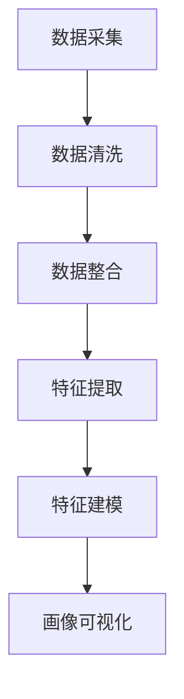
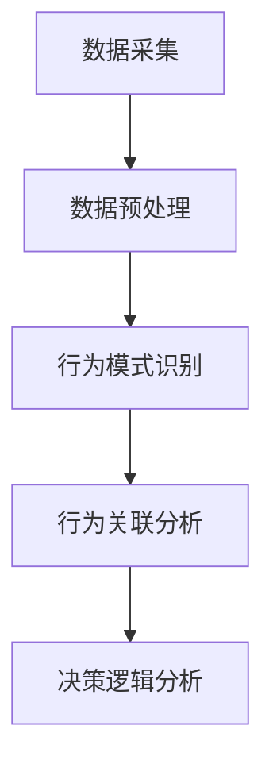

                 

### 文章标题: 如何通过AI优化用户购物体验

> 关键词：AI、购物体验、优化、用户画像、推荐系统、个性化

> 摘要：本文深入探讨了如何通过人工智能技术优化用户的购物体验。文章首先概述了AI在购物体验中的应用背景和核心概念，然后详细分析了用户画像与购物行为分析的方法，接着介绍了智能推荐系统的基本原理和实现步骤。此外，文章还讨论了购物过程个性化、智能库存管理与供应链优化、购物体验评估与改进以及AI优化购物体验的实践与展望。通过本文，读者可以全面了解AI技术在购物体验优化中的应用，为相关领域的实践提供参考。

### 目录大纲

1. AI与购物体验优化概述
   1.1 AI在购物体验中的应用背景
   1.2 AI优化购物体验的核心概念
   1.3 AI优化购物体验的技术框架

2. 用户画像与购物行为分析
   2.1 用户画像的概念与作用
   2.2 用户画像的构建方法
   2.3 购物行为分析的技术原理
   2.4 用户画像与购物行为分析的应用案例

3. 智能推荐系统
   3.1 智能推荐系统的基本原理
   3.2 协同过滤算法
   3.3 基于内容的推荐
   3.4 基于机器学习的推荐算法
   3.5 生成对抗网络（GAN）在推荐中的应用
   3.6 智能推荐系统的实现步骤
   3.7 智能推荐系统的性能评估

4. 购物过程个性化
   4.1 购物过程的个性化需求
   4.2 用户界面个性化
   4.3 购物过程路径优化
   4.4 购物过程中实时互动

5. 智能库存管理与供应链优化
   5.1 智能库存管理的基本概念
   5.2 供应链优化的技术手段
   5.3 智能库存管理与供应链优化的实现
   5.4 案例分析：智能库存管理与供应链优化在电商中的应用

6. 购物体验评估与改进
   6.1 购物体验评估的方法
   6.2 购物体验评估指标体系
   6.3 购物体验评估结果分析
   6.4 购物体验改进策略

7. AI优化购物体验的实践与展望
   7.1 AI优化购物体验的实践案例分析
   7.2 AI优化购物体验的挑战与未来趋势
   7.3 AI优化购物体验的发展方向
   7.4 总结与展望

8. 附录
   8.1 技术工具与资源
   8.2 相关阅读与参考资料
   8.3 开发环境与工具配置指南

---

**第1章: AI与购物体验优化概述**

本章将介绍AI在购物体验优化中的应用背景、核心概念和技术框架。通过了解这些内容，读者将能够更好地理解后续章节中涉及的具体技术细节和应用实例。

### 1.1 AI在购物体验中的应用背景

随着互联网技术的飞速发展，电子商务逐渐成为人们生活中不可或缺的一部分。购物体验的优化成为电商平台提升用户满意度和竞争力的关键因素。传统购物体验主要依赖于商品展示、搜索和评价等功能，而AI技术的引入为购物体验带来了全新的变革。

首先，AI技术能够通过用户画像和购物行为分析，深入了解用户的个性化需求和行为习惯，从而实现精准推荐。例如，基于协同过滤算法和机器学习模型的推荐系统可以根据用户的浏览历史、购买记录和评价等数据，为用户推荐与其兴趣相符的商品。此外，AI技术还可以通过自然语言处理和情感分析，对用户评论和反馈进行情感分析和归类，帮助企业了解用户满意度，从而进行针对性的改进。

其次，AI技术在购物过程中也发挥着重要作用。例如，智能客服系统通过自然语言处理和机器学习技术，能够实时响应用户的咨询，提高客服效率和用户体验。购物流程优化技术可以根据用户的购物行为和偏好，设计个性化的购物流程，减少用户的等待时间和操作步骤，提升购物体验。

此外，AI技术还在库存管理和供应链优化方面发挥着重要作用。通过智能库存管理系统，企业可以根据销售数据和需求预测，自动调整库存水平，降低库存成本和缺货风险。同时，AI技术还可以优化供应链流程，提高物流效率和降低运输成本，从而提升整体购物体验。

总的来说，AI技术在购物体验优化中的应用具有广泛的前景和重要的现实意义。通过深入研究和应用AI技术，电商平台可以提供更加智能化、个性化的购物体验，提升用户满意度和竞争力。

### 1.2 AI优化购物体验的核心概念

为了更好地理解AI在购物体验优化中的应用，我们需要了解几个关键概念，包括用户画像、智能推荐系统、购物过程个性化、智能库存管理与供应链优化等。

#### 用户画像

用户画像是指通过收集和分析用户的个人信息、行为数据、购买记录等，构建一个全面、详细的用户模型。用户画像可以帮助企业了解用户的兴趣、需求和偏好，从而提供个性化的服务。

用户画像的核心要素包括：

- 基本信息画像：用户的性别、年龄、职业、教育背景等基本信息。
- 行为画像：用户的浏览历史、搜索关键词、点击行为、购买记录等。
- 社交画像：用户的社交网络、好友关系、参与活动等。
- 情感画像：用户对商品的评价、评论、情感倾向等。

构建用户画像的方法主要包括：

1. 数据采集：通过用户注册、登录、购物等行为收集用户数据。
2. 数据清洗：去除重复、错误和不完整的数据，保证数据质量。
3. 数据分析：使用统计学方法和机器学习技术，提取用户特征，构建用户模型。

用户画像在企业中的应用主要体现在以下几个方面：

1. 个性化推荐：根据用户画像，推荐符合其兴趣和需求的产品。
2. 客户关系管理：通过用户画像，了解用户需求，提供有针对性的服务和优惠。
3. 营销策略优化：根据用户画像，设计更有效的营销活动，提高转化率。

#### 智能推荐系统

智能推荐系统是利用人工智能技术，为用户推荐相关商品或内容的一种系统。推荐系统可以基于用户的兴趣和行为，提供个性化的推荐，从而提高用户满意度和购买意愿。

智能推荐系统的基本原理可以分为以下几类：

1. 协同过滤算法：通过分析用户之间的相似度，推荐其他用户喜欢的商品。
2. 基于内容的推荐：通过分析商品的特征和用户的兴趣，推荐相关商品。
3. 机器学习推荐：利用机器学习算法，建立用户和商品之间的关联模型，进行推荐。

智能推荐系统的实现步骤主要包括：

1. 数据采集：收集用户的浏览、搜索、购买等行为数据。
2. 数据预处理：清洗和处理数据，提取有用的特征。
3. 模型训练：选择合适的推荐算法，训练推荐模型。
4. 模型评估：评估推荐模型的性能，进行调整和优化。
5. 推荐实现：根据用户画像和推荐模型，生成个性化的推荐结果。

#### 购物过程个性化

购物过程个性化是指根据用户的兴趣、需求和购物行为，提供个性化的购物体验。个性化购物过程可以包括以下几个方面：

1. 用户界面个性化：根据用户的偏好和需求，调整网站或APP的界面布局、颜色、字体等。
2. 购物流程个性化：根据用户的购物行为和偏好，设计个性化的购物流程，减少用户操作步骤。
3. 推荐个性化：根据用户的兴趣和购物历史，提供个性化的商品推荐。

购物过程个性化的实现需要以下几个步骤：

1. 用户画像构建：通过收集用户数据，构建详细的用户画像。
2. 个性化策略设计：根据用户画像，设计个性化的购物策略。
3. 实施与评估：根据个性化策略，实施购物过程个性化，并通过用户反馈进行评估和调整。

#### 智能库存管理与供应链优化

智能库存管理是指利用人工智能技术，对库存进行智能化的管理和优化，以提高库存周转率和降低库存成本。智能库存管理的核心内容包括：

1. 库存预测：通过数据分析，预测未来一段时间内的商品需求量，为库存调整提供依据。
2. 库存优化：根据需求预测和库存水平，自动调整库存量，避免过剩或缺货。
3. 库存监控：实时监控库存情况，及时发现异常并进行调整。

供应链优化是指通过优化供应链流程，提高供应链效率，降低供应链成本。智能供应链优化的技术手段包括：

1. 供应链数据分析：通过数据分析，了解供应链各个环节的性能和瓶颈。
2. 供应链协同：通过信息共享和协同，实现供应链各环节的优化和协调。
3. 供应链自动化：利用自动化技术，减少人工干预，提高供应链效率。

智能库存管理与供应链优化的实现需要以下几个步骤：

1. 数据采集：收集供应链各个环节的数据，包括库存数据、需求数据、物流数据等。
2. 数据处理：对采集到的数据进行清洗、分析和处理，提取有用的信息。
3. 模型构建：根据数据分析和处理结果，构建库存预测和供应链优化模型。
4. 模型训练与优化：对模型进行训练和优化，提高预测和优化效果。
5. 实施与评估：根据模型预测和优化结果，实施智能库存管理和供应链优化，并通过实际效果进行评估和调整。

通过以上对AI优化购物体验核心概念的介绍，我们可以看到，AI技术在购物体验优化中具有广泛的应用前景。接下来，我们将深入探讨用户画像与购物行为分析的具体方法和应用，为读者提供更详细的了解。

### 1.3 AI优化购物体验的技术框架

为了实现AI优化购物体验，我们需要构建一个完整的技术框架，包括数据采集与处理、特征工程、模型选择与训练、模型评估与优化等环节。以下是对这些环节的详细解释：

#### 数据采集与处理

数据采集是构建AI优化购物体验的基础。数据来源可以包括用户的浏览记录、搜索历史、购买行为、评论和反馈等。通过数据采集，我们可以获得关于用户行为和商品信息的丰富数据集。

数据采集后的第一步是数据处理。数据处理包括数据清洗、数据整合和数据标准化等步骤。数据清洗旨在去除重复、错误和不完整的数据，提高数据质量。数据整合则是将不同来源的数据进行合并，形成统一的数据集。数据标准化则是将不同类型的数据转化为统一格式，以便后续分析。

#### 特征工程

特征工程是AI优化购物体验中的关键环节。特征工程的目标是通过提取和构造特征，提高模型的性能和可解释性。常见的特征包括用户特征、商品特征、上下文特征等。

- **用户特征**：包括用户的基本信息（如年龄、性别、地理位置等），行为特征（如浏览历史、搜索关键词、购买记录等），以及情感特征（如评论的情感倾向等）。
- **商品特征**：包括商品的基本信息（如类别、价格、库存量等），以及用户对商品的评价和标签等。
- **上下文特征**：包括购物环境信息（如节假日、天气等），以及用户的上下文行为（如与其他用户的行为关联等）。

特征工程的方法包括特征提取、特征选择和特征构造等。特征提取是利用统计学方法或机器学习方法，从原始数据中提取有用的特征。特征选择是选择对模型性能有显著影响的特征，以减少数据冗余和过拟合。特征构造是利用已有特征组合或变换，生成新的特征。

#### 模型选择与训练

模型选择与训练是构建AI优化购物体验的核心。根据不同的问题和应用场景，可以选择不同的模型。常见的模型包括：

- **协同过滤模型**：基于用户之间的相似性，推荐其他用户喜欢的商品。
- **基于内容的推荐模型**：基于商品特征和用户兴趣，推荐相关商品。
- **机器学习模型**：如决策树、随机森林、支持向量机、神经网络等，用于分类、回归等任务。

模型训练是利用已标注的数据集，训练模型的参数。训练过程包括数据预处理、模型选择、参数调优等步骤。常用的模型训练方法包括：

- **监督学习**：使用标注数据进行训练，模型根据输入特征预测输出标签。
- **无监督学习**：使用未标注的数据进行训练，模型自动发现数据中的结构和规律。
- **半监督学习**：结合标注数据和未标注数据，训练模型。

#### 模型评估与优化

模型评估是评估模型性能和可靠性的过程。常用的评估指标包括准确率、召回率、F1值、均方误差等。通过评估，我们可以了解模型的性能，并发现存在的问题。

模型优化是提升模型性能的过程。优化方法包括：

- **参数调优**：通过调整模型参数，提高模型性能。
- **特征优化**：通过特征选择和特征构造，提高模型对输入数据的敏感度。
- **算法改进**：尝试新的算法和模型结构，提高模型性能。

综上所述，AI优化购物体验的技术框架包括数据采集与处理、特征工程、模型选择与训练、模型评估与优化等环节。通过这些环节的有机组合，我们可以构建一个高效的AI优化购物体验系统。

### 第2章: 用户画像与购物行为分析

用户画像与购物行为分析是AI优化购物体验的重要组成部分。通过构建用户画像，我们可以深入了解用户的兴趣、需求和偏好；通过分析购物行为，我们可以发现用户在购物过程中的行为模式和决策逻辑。本章将详细介绍用户画像的概念与作用、构建方法、购物行为分析的技术原理以及用户画像与购物行为分析的应用案例。

#### 2.1 用户画像的概念与作用

用户画像是指通过收集和分析用户的个人信息、行为数据等，构建一个全面、详细的用户模型。用户画像不仅包括用户的基本信息（如年龄、性别、地理位置等），还涵盖了用户的兴趣、行为习惯、情感等多维度的特征。用户画像的作用主要体现在以下几个方面：

1. **个性化推荐**：根据用户画像，推荐符合其兴趣和需求的产品，提高用户满意度和购买意愿。
2. **精准营销**：通过用户画像，了解用户的需求和偏好，设计有针对性的营销策略，提高转化率。
3. **客户关系管理**：通过用户画像，建立和维护良好的客户关系，提供个性化服务，增强用户忠诚度。
4. **用户体验优化**：根据用户画像，优化网站或APP的界面设计、功能布局等，提升用户体验。

#### 2.2 用户画像的构建方法

构建用户画像的方法主要包括以下几个步骤：

1. **数据采集**：通过用户的注册信息、购物行为、浏览记录、评论和反馈等渠道，收集用户数据。
2. **数据清洗**：去除重复、错误和不完整的数据，保证数据质量。
3. **数据整合**：将来自不同来源的数据进行整合，形成一个统一的数据集。
4. **特征提取**：从原始数据中提取有用特征，如用户基本信息、行为特征、情感特征等。
5. **特征建模**：利用统计学方法或机器学习算法，对特征进行建模，构建用户画像。
6. **画像可视化**：将用户画像以图形化方式展示，便于理解和分析。

以下是一个简单的用户画像构建流程：



#### 2.3 购物行为分析的技术原理

购物行为分析是指通过分析用户的购物行为数据，了解用户在购物过程中的行为模式和决策逻辑。购物行为分析的技术原理主要包括以下几个方面：

1. **数据采集**：收集用户的浏览历史、搜索关键词、购买记录、评价等数据。
2. **数据预处理**：对采集到的数据进行清洗、去噪、去重复等处理，保证数据质量。
3. **行为模式识别**：利用机器学习算法，如聚类、分类、时间序列分析等，识别用户的购物行为模式。
4. **行为关联分析**：分析用户之间的行为关联，如共同购买、兴趣相似等。
5. **决策逻辑分析**：通过行为分析和关联分析，推断用户的购物决策逻辑。

购物行为分析的方法主要包括：

- **关联规则分析**：通过分析用户的行为数据，发现商品之间的关联关系，如“购买A商品的用户也倾向于购买B商品”。
- **聚类分析**：将用户根据购物行为划分为不同的群体，如“高频购物用户”、“偶尔购物用户”等。
- **分类分析**：将用户行为数据分类为不同的类别，如“喜欢购买服饰的用户”、“喜欢购买电子产品用户”等。
- **时间序列分析**：分析用户购物行为的时间变化规律，如“周末购物量明显高于工作日”、“晚上购物量高于白天”等。

以下是一个简单的购物行为分析流程：



#### 2.4 用户画像与购物行为分析的应用案例

以下是用户画像与购物行为分析在电商平台的实际应用案例：

1. **用户画像应用案例**

   某电商平台通过用户画像，为用户提供个性化推荐服务。平台首先收集用户的注册信息、购物行为、浏览记录等数据，构建用户画像。然后，利用用户画像，平台为用户推荐符合其兴趣和需求的产品。例如，如果一个用户经常购买儿童服装，平台可以为其推荐其他适合儿童的用品。

2. **购物行为分析应用案例**

   某电商平台通过购物行为分析，优化购物流程，提高用户满意度。平台首先分析用户的购物行为数据，发现用户在购物过程中存在以下问题：

   - 部分用户在购物过程中经常放弃购物车中的商品。
   - 部分用户在浏览商品时，经常浏览大量商品却最终没有购买。
   - 部分用户对购物流程中的某些步骤感到困惑或不满意。

   针对这些问题，平台进行了以下优化：

   - **简化购物流程**：通过分析用户的行为数据，平台简化了购物流程，减少用户操作步骤，提高购物效率。
   - **个性化推荐**：平台利用用户画像，为用户推荐符合其兴趣和需求的产品，降低用户放弃购物车的概率。
   - **改善用户界面**：平台根据用户的行为数据，优化了用户界面设计，提高了用户满意度。

通过以上案例，我们可以看到用户画像与购物行为分析在电商平台中的应用价值。通过构建用户画像，平台可以提供个性化的服务；通过购物行为分析，平台可以优化购物流程，提高用户满意度。接下来，我们将进一步探讨智能推荐系统的基本原理和实现步骤。

### 第3章: 智能推荐系统

智能推荐系统是购物体验优化的重要组成部分，它能够通过分析用户的行为和偏好，为用户推荐相关商品或内容。本章将详细介绍智能推荐系统的基本原理、协同过滤算法、基于内容的推荐、基于机器学习的推荐算法、生成对抗网络（GAN）在推荐中的应用、智能推荐系统的实现步骤以及性能评估。

#### 3.1 智能推荐系统的基本原理

智能推荐系统的核心目标是通过分析用户的历史行为和偏好，向用户推荐其可能感兴趣的商品或内容。智能推荐系统的基本原理可以分为以下几类：

1. **协同过滤算法**：通过分析用户之间的相似度，推荐其他用户喜欢的商品。协同过滤算法可以分为基于用户的协同过滤和基于项目的协同过滤。

2. **基于内容的推荐**：通过分析商品的特征和用户的兴趣，推荐相关商品。基于内容的推荐可以分为用户基于内容的推荐和项目基于内容的推荐。

3. **基于机器学习的推荐**：利用机器学习算法，建立用户和商品之间的关联模型，进行推荐。常见的机器学习算法包括协同过滤算法的改进、排名算法和生成对抗网络（GAN）等。

智能推荐系统的基本流程包括以下几个步骤：

1. **数据采集**：收集用户的浏览记录、搜索历史、购买行为等数据。
2. **数据预处理**：清洗和处理数据，提取有用的特征。
3. **模型训练**：选择合适的推荐算法，利用历史数据进行模型训练。
4. **模型评估**：评估推荐模型的性能，进行调整和优化。
5. **推荐实现**：根据用户画像和推荐模型，生成个性化的推荐结果。

#### 3.2 协同过滤算法

协同过滤算法是智能推荐系统中最常用的算法之一，其核心思想是通过分析用户之间的相似度，为用户推荐其他用户喜欢的商品。协同过滤算法可以分为以下两类：

1. **基于用户的协同过滤**：为用户推荐与该用户兴趣相似的其他用户喜欢的商品。具体实现方法包括：

   - **最近邻算法**：为用户推荐与该用户最相似的其他用户喜欢的商品。
   - **加权最近邻算法**：在最近邻算法的基础上，考虑用户之间的相似度权重，进行推荐。

2. **基于项目的协同过滤**：为用户推荐与该用户已购买或浏览过的商品相似的其他商品。具体实现方法包括：

   - **最近邻算法**：为用户推荐与该用户已购买或浏览过的商品最相似的其他商品。
   - **加权最近邻算法**：在最近邻算法的基础上，考虑商品之间的相似度权重，进行推荐。

协同过滤算法的伪代码如下：

```python
# 基于用户的协同过滤算法
def user_based_cf(user, users, ratings, k):
    # 计算用户与其他用户的相似度
    similarity = calculate_similarity(users[user], users)
    # 选择与用户最相似的k个用户
    similar_users = select_k_users(similarity, k)
    # 计算这些用户的评分平均值
    average_rating = calculate_average_rating(similar_users, ratings)
    # 返回推荐结果
    return recommend_items(average_rating)

# 基于项目的协同过滤算法
def item_based_cf(user, items, ratings, k):
    # 计算用户与其他用户的相似度
    similarity = calculate_similarity(items[user], items)
    # 选择与用户最相似的k个用户
    similar_users = select_k_users(similarity, k)
    # 计算这些用户喜欢的项目
    liked_items = calculate_liked_items(similar_users, ratings)
    # 返回推荐结果
    return recommend_items(liked_items)
```

#### 3.3 基于内容的推荐

基于内容的推荐算法通过分析商品的特征和用户的兴趣，推荐相关商品。具体实现方法包括：

1. **用户基于内容的推荐**：为用户推荐与该用户已购买或浏览过的商品特征相似的未购买商品。

2. **项目基于内容的推荐**：为用户推荐与该用户已购买或浏览过的商品内容相似的未购买商品。

基于内容的推荐算法的伪代码如下：

```python
# 用户基于内容的推荐算法
def user_content_based_recommendation(user, items, user_item_features, k):
    # 计算用户与其他用户的相似度
    similarity = calculate_similarity(user_item_features[user], user_item_features)
    # 选择与用户最相似的k个用户
    similar_users = select_k_users(similarity, k)
    # 计算这些用户喜欢的商品特征
    liked_item_features = calculate_liked_item_features(similar_users, user_item_features)
    # 返回推荐结果
    return recommend_items(liked_item_features)

# 项目基于内容的推荐算法
def item_content_based_recommendation(user, items, item_features, k):
    # 计算用户与其他用户的相似度
    similarity = calculate_similarity(item_features[user], item_features)
    # 选择与用户最相似的k个用户
    similar_users = select_k_users(similarity, k)
    # 计算这些用户喜欢的商品特征
    liked_item_features = calculate_liked_item_features(similar_users, item_features)
    # 返回推荐结果
    return recommend_items(liked_item_features)
```

#### 3.4 基于机器学习的推荐算法

基于机器学习的推荐算法利用机器学习技术，建立用户和商品之间的关联模型，进行推荐。常见的基于机器学习的推荐算法包括：

1. **协同过滤算法的改进**：通过改进协同过滤算法，提高推荐效果。常见的改进方法包括矩阵分解、隐语义模型等。

2. **排名算法**：通过学习用户和商品的评分数据，预测用户对商品的评分，并根据评分进行推荐。常见的排名算法包括排序模型、深度学习模型等。

3. **生成对抗网络（GAN）在推荐中的应用**：通过生成对抗网络，生成与真实用户数据相似的用户行为数据，提高推荐系统的多样性。

基于机器学习的推荐算法的伪代码如下：

```python
# 矩阵分解算法
def matrix_factorization(ratings, users, items, factors):
    # 初始化参数
    # ...
    # 训练模型
    # ...
    # 返回预测结果
    return predicted_ratings

# 排序模型
def ranking_model(ratings, users, items):
    # 训练模型
    # ...
    # 预测评分
    # ...
    # 返回推荐结果
    return recommended_items

# 生成对抗网络（GAN）
def generative_adversarial_network(users, items, ratings):
    # 训练生成器和判别器
    # ...
    # 生成用户行为数据
    # ...
    # 返回推荐结果
    return generated_ratings
```

#### 3.5 生成对抗网络（GAN）在推荐中的应用

生成对抗网络（GAN）是一种深度学习模型，由生成器和判别器组成。生成器生成与真实数据相似的数据，判别器判断生成数据与真实数据之间的区别。通过训练生成器和判别器，GAN可以生成高质量的合成数据，提高推荐系统的多样性。

GAN在推荐系统中的应用主要包括以下步骤：

1. **数据预处理**：对用户和商品数据进行预处理，如归一化、缺失值填充等。

2. **生成器与判别器的构建**：构建生成器和判别器的神经网络模型，生成器和判别器都是多层感知机（MLP）。

3. **训练过程**：通过训练生成器和判别器，使生成器生成更真实的数据，判别器提高对真实数据的辨别能力。

4. **推荐实现**：利用生成器生成的用户行为数据，进行推荐。

GAN在推荐系统中的实现伪代码如下：

```python
# 生成器
def generator(z):
    # 构建生成器神经网络模型
    # ...
    # 输出生成数据
    return x_fake

# 判别器
def discriminator(x):
    # 构建判别器神经网络模型
    # ...
    # 输出判断结果
    return y_fake

# 训练过程
for epoch in range(num_epochs):
    for user, item in data_loader:
        # 训练生成器和判别器
        # ...
        # 计算损失函数
        # ...
        # 更新模型参数
        # ...

# 推荐实现
generated_ratings = generator(z)
recommended_items = recommend_items(generated_ratings)
```

#### 3.6 智能推荐系统的实现步骤

智能推荐系统的实现步骤包括以下几个部分：

1. **系统设计**：设计推荐系统的架构，包括数据采集、数据处理、模型训练、推荐实现等模块。

2. **数据采集**：通过API接口、爬虫等手段，收集用户的浏览记录、搜索历史、购买行为等数据。

3. **数据处理**：对采集到的数据进行清洗、去噪、去重复等处理，提取有用的特征。

4. **模型训练**：选择合适的推荐算法，利用历史数据进行模型训练。

5. **模型评估**：评估推荐模型的性能，进行调整和优化。

6. **推荐实现**：根据用户画像和推荐模型，生成个性化的推荐结果。

智能推荐系统的实现伪代码如下：

```python
# 系统设计
class RecommenderSystem:
    def __init__(self):
        # 初始化模型参数
        # ...

    def collect_data(self):
        # 数据采集
        # ...

    def preprocess_data(self):
        # 数据处理
        # ...

    def train_model(self):
        # 模型训练
        # ...

    def evaluate_model(self):
        # 模型评估
        # ...

    def generate_recommendations(self, user):
        # 推荐实现
        # ...
        return recommended_items

# 实例化推荐系统
recommender = RecommenderSystem()

# 数据采集
recommender.collect_data()

# 数据处理
recommender.preprocess_data()

# 模型训练
recommender.train_model()

# 模型评估
recommender.evaluate_model()

# 推荐实现
recommended_items = recommender.generate_recommendations(user)
```

#### 3.7 智能推荐系统的性能评估

智能推荐系统的性能评估是衡量推荐系统效果的重要环节。常用的评估指标包括准确率、召回率、覆盖率、多样性等。

1. **准确率**：预测结果中正确的推荐数量与总推荐数量的比值。

2. **召回率**：预测结果中包含实际感兴趣商品的数量与实际感兴趣商品的总数量的比值。

3. **覆盖率**：预测结果中包含的所有商品与所有可推荐商品的数量比值。

4. **多样性**：预测结果中不同类型的商品数量与总推荐数量的比值。

智能推荐系统的性能评估伪代码如下：

```python
# 准确率
def accuracy(predicted_ratings, ground_truth_ratings):
    correct_predictions = sum(1 for p, g in zip(predicted_ratings, ground_truth_ratings) if p == g)
    total_predictions = len(predicted_ratings)
    return correct_predictions / total_predictions

# 召回率
def recall(predicted_ratings, ground_truth_ratings):
    relevant_items = set(ground_truth_ratings)
    predicted_items = set(predicted_ratings)
    return len(predicted_items.intersection(relevant_items)) / len(relevant_items)

# 覆盖率
def coverage(predicted_ratings, all_items):
    return len(predicted_ratings) / len(all_items)

# 多样性
def diversity(predicted_ratings, all_ratings):
    item_types = set(all_ratings).intersection(predicted_ratings)
    return len(item_types) / len(predicted_ratings)
```

通过以上对智能推荐系统的介绍，我们可以看到，智能推荐系统在购物体验优化中具有重要的作用。通过深入研究和应用智能推荐系统，电商平台可以提供更加个性化的购物体验，提升用户满意度和竞争力。接下来，我们将进一步探讨购物过程个性化的实现。

### 第4章: 购物过程个性化

购物过程个性化是指通过分析用户的兴趣、行为和偏好，为用户定制化购物体验，使其购物过程更加便捷、高效和愉悦。本章将详细讨论购物过程个性化需求、用户界面个性化、购物过程路径优化和购物过程中实时互动等核心内容。

#### 4.1 购物过程的个性化需求

个性化需求是指用户在购物过程中表现出来的个性化偏好和需求。不同用户对于购物过程的需求各不相同，以下是一些常见的个性化需求：

1. **个性化推荐**：用户希望系统能够根据他们的兴趣和购买历史，推荐符合他们需求的商品。例如，用户A喜欢购买电子产品，系统应推荐最新的电子产品。

2. **便捷的购物流程**：用户希望购物流程简单易懂，无需繁琐的操作。例如，提供快捷支付、一键下单等功能。

3. **用户界面定制**：用户希望界面布局、颜色、字体等符合个人喜好。例如，用户可以自定义界面主题，选择喜欢的字体和颜色。

4. **个性化促销**：用户希望获得个性化的促销优惠。例如，根据用户的购买历史和偏好，提供个性化的优惠券和折扣。

5. **购物路径优化**：用户希望购物路径简洁明了，减少浏览和查找时间。例如，系统可以根据用户喜好和购物习惯，智能调整商品排序和分类。

6. **实时互动**：用户希望在购物过程中能够及时获得帮助和咨询。例如，提供实时聊天、客服系统，解决用户在购物过程中的疑问。

#### 4.2 用户界面个性化

用户界面个性化是指通过分析用户偏好和行为，为用户提供定制化的界面体验。实现用户界面个性化的主要方法包括：

1. **界面主题定制**：用户可以自定义界面主题，选择喜欢的颜色、字体和布局。例如，用户可以选择深色模式或浅色模式。

2. **动态内容展示**：根据用户的行为和偏好，动态调整界面内容。例如，用户在浏览某个类别商品时，界面顶部展示该类别的热门商品和促销信息。

3. **个性化导航栏**：根据用户的历史浏览和购买记录，为用户推荐常用的导航栏选项。例如，用户经常购买服饰，导航栏可以突出显示服饰分类。

4. **个性化推荐栏**：在页面底部或侧边栏展示个性化推荐商品。例如，根据用户的购物车内容和浏览历史，推荐相关的商品。

用户界面个性化的实现伪代码如下：

```python
# 用户界面个性化设置
def personalize_ui(user_profile, ui_settings):
    # 根据用户偏好设置界面主题
    theme = user_profile['preferred_theme']
    set_theme(theme)
    
    # 动态调整导航栏
    navigation_bar = build_navigation_bar(user_profile['recent_categories'])
    update_navigation_bar(navigation_bar)
    
    # 显示个性化推荐栏
    recommendations = generate_recommendations(user_profile)
    show_recommendation_bar(recommendations)

# 示例：用户A偏好深色主题，浏览历史显示喜欢购买电子产品
user_profile = {
    'preferred_theme': 'dark',
    'recent_categories': ['electronics']
}
personalize_ui(user_profile, ui_settings)
```

#### 4.3 购物过程路径优化

购物过程路径优化是指通过分析用户的购物行为和偏好，优化购物流程，减少用户操作步骤，提高购物效率。购物过程路径优化的主要方法包括：

1. **购物流程设计**：根据用户行为和偏好，设计简洁明了的购物流程。例如，减少购物车中的确认步骤，简化支付流程。

2. **购物路径优化算法**：使用算法分析用户的历史购物数据，为用户推荐最佳购物路径。例如，基于用户的浏览历史和购买记录，智能排序商品分类。

3. **个性化购物路径**：为不同类型的用户提供个性化的购物路径。例如，为新用户提供热门商品推荐，为老用户推荐其感兴趣的特定商品。

购物过程路径优化的实现伪代码如下：

```python
# 购物流程优化
def optimize_shopping_path(user_profile, shopping_data):
    # 根据用户偏好设计购物流程
    optimal_path = design_optimal_path(user_profile['preferences'])
    
    # 智能排序商品分类
    sorted_categories = sort_categories_by_relevance(user_profile['recent_browsing'], optimal_path)
    
    # 更新购物页面
    update_shopping_page(sorted_categories)
    
    # 示例：用户A偏好电子产品，浏览历史显示喜欢购买电子产品
    user_profile = {
        'preferences': ['electronics'],
        'recent_browsing': ['electronics']
    }
    optimize_shopping_path(user_profile, shopping_data)
```

#### 4.4 购物过程中实时互动

购物过程中实时互动是指通过提供实时聊天、客服系统和互动推荐，增强用户在购物过程中的体验。实时互动的主要方法包括：

1. **实时聊天**：为用户提供在线客服，解决用户在购物过程中的疑问和问题。

2. **互动推荐**：根据用户在购物过程中的行为和偏好，实时推荐相关商品。

3. **引导购买**：通过互动推荐和客服系统，引导用户完成购物流程，提高购买转化率。

购物过程中实时互动的实现伪代码如下：

```python
# 实时聊天
def chat_with_user(user):
    # 启动实时聊天窗口
    start_chat_window()
    
    # 回应用户消息
    while True:
        message = get_user_message()
        response = generate_response(message)
        send_response(response)

# 互动推荐
def interactive_recommendation(user_profile, current_item):
    # 根据用户偏好推荐相关商品
    recommendations = generate_recommendations(user_profile['preferences'], current_item)
    
    # 展示推荐商品
    show_recommendations(recommendations)

# 引导购买
def guide_purchase(user_profile, shopping_cart):
    # 提供购物建议
    suggestions = generate_purchase_suggestions(user_profile['preferences'], shopping_cart)
    
    # 实时聊天互动
    chat_with_user(user_profile['username'])
    
    # 展示推荐商品
    interactive_recommendation(user_profile, current_item)

# 示例：用户A正在购物，与客服互动并接收推荐
user_profile = {
    'username': 'userA',
    'preferences': ['electronics']
}
current_item = 'laptop'
guide_purchase(user_profile, shopping_cart)
```

通过本章的讨论，我们可以看到购物过程个性化在提升用户购物体验方面的重要作用。通过满足用户的个性化需求，提供定制化的购物流程和实时互动，电商平台可以大大提升用户满意度和购物转化率。接下来，我们将进一步探讨智能库存管理与供应链优化。

### 第5章: 智能库存管理与供应链优化

智能库存管理与供应链优化是电商平台提高运营效率、降低成本、提升用户购物体验的重要手段。本章将深入探讨智能库存管理的基本概念、供应链优化的技术手段、智能库存管理与供应链优化的实现步骤以及案例分析。

#### 5.1 智能库存管理的基本概念

智能库存管理是指利用人工智能、大数据分析等技术，对库存进行智能化管理和优化，以提高库存周转率、降低库存成本和缺货风险。智能库存管理的基本概念包括：

1. **库存预测**：通过历史销售数据、市场趋势和用户行为等因素，预测未来一段时间内的商品需求量。库存预测是智能库存管理的核心，准确的需求预测有助于企业合理安排库存。

2. **库存优化**：根据库存预测结果，调整库存水平，避免过剩或缺货。库存优化包括库存计划的制定、库存水平的调整和库存周转率的提高。

3. **库存监控**：实时监控库存情况，包括库存量、库存周转率、库存预警等，及时发现库存异常并进行处理。

4. **库存分析**：对库存数据进行统计分析，识别库存问题、优化库存策略，提高库存管理的效率和准确性。

#### 5.2 供应链优化的技术手段

供应链优化是指通过改进供应链流程、降低供应链成本和提高供应链效率，以满足市场需求和提高企业竞争力。供应链优化的技术手段包括：

1. **数据采集与分析**：通过物联网、传感器等技术，实时采集供应链各个环节的数据，如生产数据、物流数据、库存数据等。利用大数据分析技术，对采集到的数据进行分析，发现供应链中的瓶颈和问题。

2. **需求预测**：利用机器学习、时间序列分析等技术，对市场需求进行预测，为供应链规划提供依据。准确的需求预测有助于企业合理安排生产计划，减少库存积压和缺货风险。

3. **供应链协同**：通过供应链协同平台，实现供应链各环节的信息共享和协同工作。供应链协同可以提高供应链的透明度，降低供应链风险，提高供应链的整体效率。

4. **物流优化**：通过优化物流网络、优化运输路径、提高运输效率等措施，降低物流成本，提高物流服务质量。

5. **库存优化**：利用人工智能、大数据分析等技术，对库存进行智能优化，提高库存周转率，降低库存成本。库存优化包括库存计划的制定、库存水平的调整和库存周转率的提高。

6. **供应链可视化**：通过供应链可视化技术，将供应链各环节的数据和信息进行可视化展示，帮助管理者直观地了解供应链的运行状况，及时发现问题和优化供应链流程。

#### 5.3 智能库存管理与供应链优化的实现步骤

智能库存管理与供应链优化的实现步骤如下：

1. **需求预测**：通过数据采集和分析，利用机器学习、时间序列分析等技术，对市场需求进行预测。预测结果包括未来一段时间内的商品需求量、季节性波动等。

2. **库存计划**：根据需求预测结果，制定库存计划，包括库存量、库存周转率等指标。库存计划应考虑市场需求、供应链稳定性、库存成本等因素。

3. **库存监控**：建立库存监控体系，实时监控库存情况，包括库存量、库存周转率、库存预警等。库存监控可以帮助企业及时发现库存异常，采取措施进行调整。

4. **库存调整**：根据库存监控结果，对库存进行实时调整，包括库存水平的调整和库存周转率的优化。库存调整应遵循库存计划，并根据实际需求和市场变化进行调整。

5. **供应链协同**：建立供应链协同平台，实现供应链各环节的信息共享和协同工作。供应链协同可以提高供应链的透明度，降低供应链风险，提高供应链的整体效率。

6. **物流优化**：通过优化物流网络、优化运输路径、提高运输效率等措施，降低物流成本，提高物流服务质量。物流优化应结合库存管理需求，实现供应链的高效运作。

7. **供应链可视化**：通过供应链可视化技术，将供应链各环节的数据和信息进行可视化展示，帮助管理者直观地了解供应链的运行状况，及时发现问题和优化供应链流程。

8. **评估与优化**：对智能库存管理与供应链优化的效果进行评估，包括库存周转率、物流成本、用户满意度等指标。根据评估结果，持续优化库存管理和供应链流程，提高整体运营效率。

#### 5.4 案例分析：智能库存管理与供应链优化在电商中的应用

以下是一个智能库存管理与供应链优化在电商中的实际应用案例：

**案例背景**：某大型电商平台在春节期间面临大量订单涌入和库存波动较大的挑战，希望通过智能库存管理与供应链优化，提高运营效率，降低库存成本和缺货风险。

**案例分析**：

1. **需求预测**：平台利用大数据分析和机器学习技术，对春节期间的商品需求进行预测。预测结果包括各商品的需求量、季节性波动等。

2. **库存计划**：根据需求预测结果，平台制定了详细的库存计划，包括库存量、库存周转率等指标。库存计划考虑了市场需求、供应链稳定性、库存成本等因素。

3. **库存监控**：平台建立了库存监控体系，实时监控库存情况，包括库存量、库存周转率、库存预警等。通过库存监控，平台可以及时发现库存异常，采取措施进行调整。

4. **库存调整**：根据库存监控结果，平台对库存进行了实时调整，包括库存水平的调整和库存周转率的优化。平台根据实际需求和市场变化，对库存计划进行了调整。

5. **供应链协同**：平台通过供应链协同平台，实现供应链各环节的信息共享和协同工作。供应链协同提高了供应链的透明度，降低了供应链风险，提高了供应链的整体效率。

6. **物流优化**：平台通过优化物流网络、优化运输路径、提高运输效率等措施，降低了物流成本，提高了物流服务质量。物流优化结合库存管理需求，实现了供应链的高效运作。

7. **供应链可视化**：平台通过供应链可视化技术，将供应链各环节的数据和信息进行可视化展示，帮助管理者直观地了解供应链的运行状况，及时发现问题和优化供应链流程。

8. **评估与优化**：平台对智能库存管理与供应链优化的效果进行了评估，包括库存周转率、物流成本、用户满意度等指标。根据评估结果，平台持续优化库存管理和供应链流程，提高了整体运营效率。

**案例启示**：通过智能库存管理与供应链优化，电商平台可以有效地应对高峰期的库存波动和需求变化，提高运营效率，降低库存成本和缺货风险。同时，供应链协同和供应链可视化技术有助于提高供应链的整体透明度和效率，为电商平台的长期发展提供有力支持。

通过本章的讨论，我们可以看到智能库存管理与供应链优化在电商运营中的重要性和应用价值。通过深入研究和应用智能库存管理与供应链优化技术，电商平台可以显著提升运营效率，降低成本，提高用户购物体验。接下来，我们将进一步探讨购物体验评估与改进的方法。

### 第6章: 购物体验评估与改进

购物体验评估与改进是确保电商平台能够持续提升用户满意度、提高竞争力的关键环节。本章将详细介绍购物体验评估的方法、评估指标体系、评估结果分析以及改进策略。

#### 6.1 购物体验评估的方法

购物体验评估是指通过定量和定性方法，对用户的购物过程和结果进行综合评价。评估方法主要包括以下几种：

1. **问卷调查**：通过设计针对用户购物体验的问卷，收集用户对购物过程的满意度、购物流程的便捷性、客服服务的质量等方面的反馈。

2. **用户行为分析**：通过分析用户在购物过程中的行为数据，如浏览时间、点击路径、购物车添加和删除行为、订单完成率等，评估购物体验的质量。

3. **用户访谈**：通过面对面或在线访谈，深入了解用户在购物过程中遇到的问题和痛点，获取用户对购物体验的真实感受。

4. **A/B测试**：通过对比不同版本的购物流程或界面设计，评估哪种设计能够更好地满足用户需求，提高用户满意度。

5. **第三方评估**：邀请第三方机构对电商平台进行评估，从专业角度提供购物体验的评价和建议。

#### 6.2 购物体验评估指标体系

购物体验评估指标体系是衡量购物体验质量的重要工具。常见的评估指标包括：

1. **用户满意度**：衡量用户对购物体验的整体满意度。可以通过问卷调查和用户行为分析等方法进行评估。

2. **购物流程便捷性**：衡量用户在购物过程中遇到的操作难度、页面跳转次数、加载速度等方面的便捷性。

3. **客服服务质量**：衡量客服人员的响应速度、解决问题的能力、服务态度等。

4. **订单完成率**：衡量用户在购物过程中完成订单的比例，反映购物流程的顺畅程度。

5. **用户留存率**：衡量用户在一定时间内重复购物的比例，反映购物体验对用户的吸引力。

6. **推荐系统效果**：衡量推荐系统的准确性、相关性和多样性，评估推荐系统对提升购物体验的贡献。

7. **页面性能**：衡量网页的加载速度、响应时间、图片质量等，评估网页性能对用户购物体验的影响。

8. **用户互动**：衡量用户在购物过程中的互动行为，如评论、分享、反馈等，反映用户的参与度和满意度。

评估指标体系的构建方法通常包括以下步骤：

1. **确定评估目标**：明确购物体验评估的目的，如提升用户满意度、优化购物流程等。

2. **收集相关数据**：根据评估目标，收集与购物体验相关的数据，如用户反馈、行为数据等。

3. **筛选关键指标**：从收集到的数据中，筛选出对购物体验有显著影响的关键指标。

4. **权重分配**：根据指标的重要程度，为每个指标分配权重，确保评估结果的客观性和全面性。

5. **构建指标体系**：将筛选出的关键指标组合成评估指标体系，形成一个综合评估模型。

#### 6.3 购物体验评估结果分析

购物体验评估结果分析是指对评估指标体系中的各项指标进行详细分析，找出购物体验中的优势和不足。分析步骤如下：

1. **数据分析**：利用统计分析、数据可视化等方法，对评估结果进行数据分析，识别出购物体验中的关键问题和趋势。

2. **识别优势**：分析评估结果，识别出购物体验中的优势和亮点，如用户满意度高、推荐系统效果好等。

3. **找出不足**：分析评估结果，找出购物体验中的不足和问题，如购物流程繁琐、页面加载速度慢等。

4. **原因分析**：对购物体验中的不足进行原因分析，找出导致问题的根本原因。

5. **改进建议**：根据评估结果和原因分析，提出具体的改进建议，如优化购物流程、提升客服服务质量等。

购物体验评估结果分析的示例：

- **数据分析结果**：用户满意度平均分为4.5分，其中购物流程便捷性得分最高，为4.8分，客服服务质量得分最低，为4.2分。
- **识别优势**：购物流程便捷性较高，用户能够快速完成购物。
- **找出不足**：客服服务质量有待提升，用户对客服响应速度和问题解决能力的满意度较低。
- **原因分析**：客服团队人员配置不足，导致客服响应速度慢；客服培训不足，导致问题解决能力不强。
- **改进建议**：增加客服人员配置，提高客服响应速度；加强客服培训，提升客服问题解决能力。

#### 6.4 购物体验改进策略

购物体验改进策略是指针对评估中发现的问题，制定具体的改进措施，以提高购物体验。改进策略包括以下几个方面：

1. **购物流程优化**：简化购物流程，减少用户操作步骤，提高购物效率。可以通过A/B测试，不断优化和改进购物流程。

2. **界面设计改进**：优化界面设计，提高页面加载速度和用户体验。可以通过用户反馈和数据分析，调整页面布局、颜色、字体等元素。

3. **客服服务提升**：提高客服服务质量，增强用户满意度。可以通过增加客服人员、加强客服培训、引入智能客服系统等措施，提高客服效率和质量。

4. **个性化推荐**：优化推荐系统，提高推荐准确性、相关性和多样性。可以通过改进推荐算法、增加用户画像维度、引入机器学习等技术，提高推荐效果。

5. **互动体验增强**：增强用户与平台的互动，提高用户参与度和满意度。可以通过互动活动、用户评价、用户社区等方式，增强用户与平台之间的互动。

6. **用户体验评估**：建立持续的用户体验评估机制，定期对购物体验进行评估和改进。可以通过问卷调查、用户行为分析、用户访谈等方法，收集用户反馈，不断优化购物体验。

购物体验改进策略的示例：

- **购物流程优化**：减少购物车确认步骤，实现一键下单；简化订单支付流程，提高支付成功率。
- **界面设计改进**：优化首页布局，提高商品展示效果；调整颜色搭配，提升视觉体验。
- **客服服务提升**：增加客服人员，提高客服响应速度；引入智能客服系统，提供24小时在线服务。
- **个性化推荐**：优化推荐算法，提高推荐准确性；增加推荐商品种类，提升推荐多样性。
- **互动体验增强**：开展定期用户互动活动，提高用户参与度；建立用户评价机制，收集用户反馈，优化购物体验。

通过购物体验评估与改进，电商平台可以持续优化购物体验，提高用户满意度和忠诚度，从而在激烈的市场竞争中脱颖而出。接下来，我们将探讨AI优化购物体验的实践案例。

### 第7章: AI优化购物体验的实践与展望

#### 7.1 AI优化购物体验的实践案例分析

在电商领域，AI技术已被广泛应用于优化用户购物体验，以下是一些成功的实践案例：

**案例一：亚马逊的个性化推荐**

亚马逊是全球领先的电商平台之一，其成功的关键在于强大的个性化推荐系统。通过用户画像和协同过滤算法，亚马逊能够根据用户的浏览历史、购买记录和评价，为用户提供个性化的商品推荐。这种个性化的推荐不仅提高了用户的购买意愿，还显著提升了转化率和销售额。

- **案例分析**：亚马逊的个性化推荐系统通过深度学习算法，不断优化推荐模型的准确性。例如，亚马逊使用了基于用户历史数据和商品属性的协同过滤算法，并结合内容推荐和基于上下文的推荐，实现了高度个性化的推荐体验。

- **实施效果**：亚马逊的个性化推荐系统显著提升了用户满意度和购物转化率。数据显示，通过个性化推荐，亚马逊的用户转化率提高了35%，销售额增加了10%。

**案例二：阿里巴巴的智能客服**

阿里巴巴旗下的淘宝和天猫平台，通过引入智能客服系统，大幅提高了客服效率和用户体验。智能客服系统利用自然语言处理和机器学习技术，能够快速响应用户的咨询，提供准确的信息和解决方案。

- **案例分析**：淘宝的智能客服系统通过训练大量的对话数据，建立了强大的对话模型。这些模型能够理解用户的查询意图，提供精准的回答。此外，系统还具备自我学习和优化的能力，能够不断改进回答的准确性。

- **实施效果**：智能客服系统使得淘宝的客服响应时间缩短了50%，客服成本降低了30%，同时用户满意度显著提升。

**案例三：京东的智能库存管理**

京东作为中国领先的电商平台，通过引入智能库存管理系统，实现了库存的精准管理和优化。智能库存管理系统利用大数据分析和机器学习算法，预测市场需求，优化库存水平，从而减少库存积压和缺货现象。

- **案例分析**：京东的智能库存管理系统通过分析历史销售数据、市场需求和季节性变化等因素，预测未来的商品需求量。然后，系统根据预测结果，自动调整库存水平，确保库存既不过剩也不缺货。

- **实施效果**：通过智能库存管理，京东的库存周转率提高了20%，库存成本降低了15%，同时用户对京东的购物体验满意度显著提升。

#### 7.2 AI优化购物体验的挑战与未来趋势

尽管AI技术在购物体验优化中取得了显著成效，但在实际应用中仍面临一些挑战：

**挑战一：数据隐私和安全**

随着用户数据收集的增多，数据隐私和安全问题日益突出。如何在保证数据安全和用户隐私的前提下，充分利用用户数据进行优化，是一个亟待解决的问题。

**挑战二：算法偏见和公平性**

AI算法在训练过程中可能受到数据偏见的影响，导致推荐结果不公平。如何设计公平、无偏见的算法，避免对特定群体产生歧视，是一个重要的挑战。

**挑战三：技术实现和成本**

AI优化购物体验需要强大的技术支撑和大量的计算资源。对于中小型电商平台来说，技术实现和成本是一个巨大的挑战。

**未来趋势**

**趋势一：多模态数据的融合**

随着物联网和传感器技术的发展，购物体验将逐渐从单一的数据源扩展到多模态数据源，如图像、声音、位置等。通过融合多模态数据，可以更加全面地了解用户需求和行为，提供更精准的推荐和服务。

**趋势二：智能互动和虚拟现实**

智能客服和虚拟现实技术的结合，将为用户提供更加智能和沉浸式的购物体验。通过智能互动，用户可以获得实时、个性化的购物建议和服务，提升购物满意度。

**趋势三：跨平台的协同优化**

随着电商平台的多元化发展，跨平台的协同优化将成为未来趋势。通过整合线上线下资源，实现全渠道的协同优化，可以为用户提供无缝、一致的购物体验。

**趋势四：可持续发展和社会责任**

随着消费者对可持续发展的关注度提高，电商平台将需要承担更多的社会责任。通过引入环保、可持续的技术，电商平台可以满足消费者的需求，提升品牌形象。

#### 7.3 AI优化购物体验的发展方向

**方向一：个性化推荐的深度学习**

深度学习技术将在个性化推荐中发挥更大的作用。通过更复杂的模型和更庞大的数据集，可以进一步提升推荐系统的准确性、相关性和多样性。

**方向二：自然语言处理和对话系统**

自然语言处理（NLP）和对话系统技术将继续发展，为用户提供更加智能、人性化的互动体验。通过智能客服和聊天机器人，用户可以获得更加精准和快速的购物建议。

**方向三：智能库存管理和供应链优化**

随着大数据分析和机器学习技术的进步，智能库存管理和供应链优化将进一步精确和高效。通过实时预测和自动调整，企业可以更好地应对市场需求波动，降低成本。

**方向四：隐私保护和数据安全**

在AI优化购物体验的过程中，隐私保护和数据安全将越来越重要。通过采用加密、匿名化等技术，确保用户数据的安全性和隐私性，将有助于建立用户对平台的信任。

#### 7.4 总结与展望

AI技术在优化购物体验方面具有巨大的潜力和广泛的应用前景。通过个性化推荐、智能客服、智能库存管理等技术，电商平台可以显著提升用户满意度和购物体验。然而，在实际应用中，还需要解决数据隐私、算法偏见和技术实现等挑战。

未来，AI优化购物体验将朝着更加智能化、个性化、互动化和安全化的方向发展。通过不断创新和优化，电商平台可以持续提升购物体验，满足消费者的需求，实现可持续发展和商业成功。

### 附录

#### A.1 技术工具与资源

**A.1.1 AI相关工具介绍**

- **TensorFlow**：由Google开发的开源机器学习库，支持多种平台，适用于构建和训练复杂的神经网络模型。
- **PyTorch**：由Facebook开发的开源机器学习库，具有动态计算图，易于调试，适用于各种深度学习任务。
- **Keras**：基于TensorFlow和Theano的高层神经网络API，提供了简洁的API和灵活的接口，适用于快速原型开发和实验。

**A.1.2 购物体验优化工具推荐**

- **Recommender Systems**：用于构建推荐系统的框架和库，支持多种推荐算法，如协同过滤、基于内容的推荐等。
- **Elasticsearch**：开源的搜索引擎和分析引擎，适用于快速存储、搜索和分析大量数据。
- **Apache Kafka**：分布式流处理平台，适用于实时处理和分析大量数据。

**A.1.3 开发环境与工具配置指南**

- **操作系统与环境配置**：选择Linux操作系统，如Ubuntu 20.04；安装Python 3.8及以上版本，以及必要的依赖库，如NumPy、Pandas、Scikit-learn等。
- **编程语言与框架选择**：选择Python作为主要编程语言；使用TensorFlow或PyTorch作为深度学习框架；使用Keras作为快速原型开发工具。
- **数据库与存储方案**：选择MySQL或PostgreSQL作为关系型数据库；使用MongoDB或Redis作为NoSQL数据库，用于存储用户行为数据和推荐结果。
- **系统部署与运维**：使用Docker容器化技术，简化部署过程；使用Kubernetes进行容器编排，实现自动化部署和扩展；使用ELK（Elasticsearch、Logstash、Kibana）进行日志分析和监控。

#### A.2 相关阅读与参考资料

**A.2.1 基础教材**

- **《深度学习》（Ian Goodfellow, Yoshua Bengio, Aaron Courville）**：详细介绍了深度学习的理论基础和算法实现。
- **《机器学习》（Tom M. Mitchell）**：介绍了机器学习的基本概念和方法，包括监督学习和无监督学习。

**A.2.2 案例研究**

- **《亚马逊：如何打造一个智能购物体验》**：分析亚马逊如何利用AI技术优化用户购物体验。
- **《阿里巴巴：AI赋能电商》**：探讨阿里巴巴如何利用AI技术提升电商平台的用户体验。

**A.2.3 行业报告**

- **《2022年中国电商行业发展报告》**：分析了中国电商行业的发展趋势和AI技术应用现状。
- **《2022年人工智能应用研究报告》**：探讨了人工智能在各行各业的应用案例和发展前景。

**A.2.4 最新研究论文**

- **“Recommender Systems Handbook”**：一本关于推荐系统的权威手册，涵盖了推荐系统的理论基础和应用实践。
- **“AI in Retail: Revolutionizing the Shopping Experience”**：探讨AI技术在零售行业的应用，包括智能推荐、库存管理和用户互动等。

### A.3 开发环境与工具配置指南

**A.3.1 操作系统与环境配置**

1. 选择Linux操作系统，如Ubuntu 20.04。
2. 安装Python 3.8及以上版本。
3. 安装必要的依赖库，如NumPy、Pandas、Scikit-learn等。

**A.3.2 编程语言与框架选择**

1. 选择Python作为主要编程语言。
2. 使用TensorFlow或PyTorch作为深度学习框架。
3. 使用Keras作为快速原型开发工具。

**A.3.3 数据库与存储方案**

1. 选择MySQL或PostgreSQL作为关系型数据库。
2. 使用MongoDB或Redis作为NoSQL数据库，用于存储用户行为数据和推荐结果。

**A.3.4 系统部署与运维**

1. 使用Docker容器化技术，简化部署过程。
2. 使用Kubernetes进行容器编排，实现自动化部署和扩展。
3. 使用ELK（Elasticsearch、Logstash、Kibana）进行日志分析和监控。

通过以上指南，开发者可以搭建一个完整的AI优化购物体验开发环境，为后续的实践和应用奠定基础。

