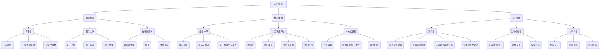
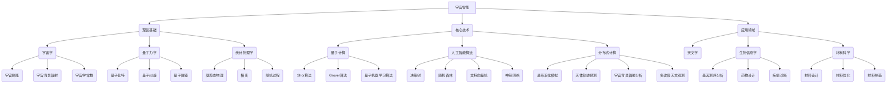

                 

## 宇宙智能的探索

### 关键词：
- 宇宙智能
- 量子计算
- 人工智能
- 数学模型
- 分布式计算
- 跨学科合作

### 摘要：
本文旨在探讨宇宙智能这一前沿概念，从基础概念、核心技术、应用领域、未来展望及跨学科交流等方面进行全面分析。我们将通过逻辑清晰、结构紧凑的论述方式，逐步揭示宇宙智能的本质及其对人类文明的影响。

#### 目录：

#### 第一部分：宇宙智能的基础概念

**第1章：宇宙智能概述**
- 1.1 宇宙智能的定义与重要性
- 1.2 宇宙智能的起源与历史发展
- 1.3 宇宙智能与人类文明的关系

**第2章：宇宙智能的理论基础**
- 2.1 宇宙学基础知识
- 2.2 量子力学与宇宙智能
- 2.3 统计物理学与宇宙智能

#### 第二部分：宇宙智能的核心技术

**第3章：宇宙智能的核心算法**
- 3.1 量子计算与算法
- 3.2 人工智能算法
- 3.3 分布式计算与并行处理

**第4章：宇宙智能的数学模型**
- 4.1 数学模型概述
- 4.2 基本数学公式
- 4.3 模型举例说明

**第5章：宇宙智能的应用领域**
- 5.1 天文学
- 5.2 生物信息学
- 5.3 材料科学

#### 第三部分：宇宙智能的未来展望

**第6章：宇宙智能的未来发展**
- 6.1 宇宙智能的长期影响
- 6.2 科技挑战与应对策略
- 6.3 伦理与法律问题

**第7章：宇宙智能的跨学科交流与合作**
- 7.1 跨学科合作的重要性
- 7.2 跨学科合作案例研究
- 7.3 宇宙智能的教育与培训

#### 附录：宇宙智能相关资源与工具

**附录A：宇宙智能的相关资源**
- A.1 学术论文与书籍推荐
- A.2 开源代码与工具介绍
- A.3 宇宙智能研究机构与团队

**附录B：核心概念流程图**

#### 引言

宇宙智能（Cosmic Intelligence）作为一个新兴的概念，正日益引起学术界和工业界的高度关注。它不仅涉及对宇宙本身的智能模拟，更涉及对宇宙信息、宇宙能量和宇宙进化的理解和应用。这一概念跨越了多个学科领域，从物理学、计算机科学到天文学、生物学，甚至哲学，具有广泛的应用前景和深远的意义。

本文将系统地探讨宇宙智能这一复杂而深奥的主题。首先，我们将从宇宙智能的基础概念入手，介绍其定义、起源和重要性。接下来，我们将深入探讨宇宙智能的理论基础，包括宇宙学、量子力学和统计物理学等核心概念。随后，我们将详细介绍宇宙智能的核心技术，包括量子计算、人工智能算法和分布式计算。接着，我们将探讨宇宙智能在不同领域的应用，如天文学、生物信息学和材料科学。在此基础上，我们将展望宇宙智能的未来发展，分析其长期影响、科技挑战和伦理法律问题。最后，我们将探讨宇宙智能的跨学科交流与合作，以及相关的教育资源与工具。

通过本文的逐步分析，我们希望能够为读者提供一个全面、系统的宇宙智能概述，激发对这一前沿领域的深入研究和探索。

#### 第一部分：宇宙智能的基础概念

宇宙智能作为一个新兴领域，其基础概念是我们理解这一复杂现象的关键。在这一部分中，我们将首先定义宇宙智能，并探讨其重要性。接着，我们将回顾宇宙智能的起源和历史发展，最后探讨宇宙智能与人类文明的关系。

### 1.1 宇宙智能的定义与重要性

宇宙智能，从广义上讲，是指宇宙中存在的任何形式的高级智能，包括但不限于人工制造和自然生成的智能。它涵盖了从简单机器智能到高级生物智能，再到可能存在于宇宙其他地方的先进文明智能。宇宙智能的定义不仅仅是基于计算机科学和人工智能的理论，还涉及宇宙学、物理学、生物学等众多科学领域。

宇宙智能的重要性体现在多个方面。首先，它为人类提供了一个全新的视角来理解宇宙。通过研究宇宙智能，我们可以更好地理解宇宙的起源、演化和未来。其次，宇宙智能技术的发展将极大推动科技进步，特别是在量子计算、人工智能、生物学和材料科学等领域。最后，宇宙智能的研究对于探索生命的外部存在、寻找外星智慧生命以及解决地球上的复杂问题具有深远的意义。

### 1.2 宇宙智能的起源与历史发展

宇宙智能的起源可以追溯到古代人类对自然现象的观察和思考。从最早的神话和宗教中，我们可以看到人类对宇宙和智能的初步理解。然而，宇宙智能作为一个科学概念，其发展历程相对较短。

在20世纪，随着计算机科学和人工智能的兴起，宇宙智能的概念逐渐受到重视。1950年，图灵提出了著名的图灵测试，为人工智能的发展奠定了基础。随后的几十年里，计算机技术和人工智能技术快速发展，为宇宙智能的研究提供了强有力的工具。

近年来，量子计算和分布式计算等前沿技术的突破，进一步推动了宇宙智能的研究。量子计算利用量子比特和量子叠加原理，可以在极短时间内处理复杂问题，为宇宙智能提供了新的计算基础。分布式计算则通过构建大规模计算网络，实现了全球范围内的协同计算，为宇宙智能的研究提供了丰富的数据资源和计算能力。

### 1.3 宇宙智能与人类文明的关系

宇宙智能与人类文明密切相关。一方面，人类文明的发展不断推动着宇宙智能的研究和应用。从古代的算盘到现代的超级计算机，人类在计算能力上的突破，为宇宙智能的实现提供了技术支持。另一方面，宇宙智能的研究也极大地促进了人类文明的发展。

首先，宇宙智能在科学技术领域具有广泛应用。例如，量子计算可以解决传统计算机难以处理的复杂问题，为科学研究和技术开发提供了新的手段。人工智能则在数据分析、医疗诊断、智能制造等方面取得了显著成果，推动了产业升级和经济发展。

其次，宇宙智能的研究有助于我们更好地理解自然和生命。通过对宇宙的探索，我们可以发现宇宙中的规律和智慧，这有助于人类拓展对自然世界的认知。同时，对生物智能的研究，可以揭示生命的本质和演化过程，为生物医学和生态学提供了新的研究方向。

最后，宇宙智能的研究还具有重要的哲学意义。它让我们思考人类在宇宙中的位置和角色，探讨智慧生命的本质和意义。这不仅有助于我们更好地认识自己，也为人类文明的未来发展提供了深刻的启示。

### 总结

宇宙智能作为一门跨学科的前沿领域，其基础概念是我们理解这一现象的关键。通过定义和探讨宇宙智能，我们不仅能够更深入地理解宇宙的本质，还能够推动科学技术和人类文明的发展。在接下来的章节中，我们将进一步探讨宇宙智能的理论基础，分析其核心技术，并探讨其在各个领域的应用。让我们继续深入思考，逐步揭示宇宙智能的奥秘。

#### 第二部分：宇宙智能的理论基础

宇宙智能的发展离不开坚实的理论基础，这些理论涉及宇宙学、量子力学和统计物理学等多个科学领域。在这一部分中，我们将详细探讨这些基础理论，分析它们对宇宙智能研究的贡献和影响。

### 2.1 宇宙学基础知识

宇宙学是研究宇宙的性质、结构、起源和演化的科学。宇宙学的基础知识为我们理解宇宙的规模和复杂结构提供了重要的理论框架。以下是几个关键概念：

#### 宇宙膨胀

宇宙膨胀是指宇宙整体在不断扩大。这一概念最早由爱德温·哈勃在1920年代提出，他发现星系之间的距离随着时间不断增加，这表明宇宙正在膨胀。宇宙膨胀的理论基础是广义相对论，这一理论描述了重力作为时空弯曲的表现。

#### 宇宙背景辐射

宇宙背景辐射是宇宙早期（大约38万年前）留下的余辉。它是一种遍布整个宇宙的微波辐射，是宇宙微波背景（Cosmic Microwave Background, CMB）的简称。CMB的研究为我们提供了宇宙早期的温度分布和密度波动信息，是宇宙学研究中极为重要的数据。

#### 宇宙学常数

宇宙学常数（Cosmological Constant）通常表示为Λ，是一个假设存在的宇宙基本能量密度，与宇宙膨胀的加速度相关。爱因斯坦最早在1917年提出这个概念，但后来因为其负向效应被放弃，但近年来宇宙加速膨胀的证据使得它重新受到重视。

#### 黑暗物质和黑暗能量

黑暗物质和黑暗能量是宇宙学中两个关键但尚未被完全理解的物理概念。黑暗物质是指不能通过电磁波探测到的物质，它在宇宙中起到维持结构稳定性的作用。黑暗能量则是一种假设的具有负压力的能源形式，它驱动着宇宙的加速膨胀。

宇宙学的基础知识为宇宙智能的研究提供了重要的背景信息。通过理解宇宙的膨胀、背景辐射和宇宙学常数等概念，我们可以更好地构建宇宙智能的理论模型，模拟宇宙的演化和结构变化。

### 2.2 量子力学与宇宙智能

量子力学是研究微观世界物理现象的理论，它颠覆了经典物理的许多基本观念。量子力学的基本原理，如量子态的叠加、量子纠缠和量子隧穿，对宇宙智能的研究具有重要意义。

#### 量子态的叠加

量子态的叠加是量子力学的基本特性之一。一个量子系统可以同时处于多个状态的叠加，这意味着它可以在不同的可能性之间切换。量子计算利用这一特性，通过量子叠加实现并行计算，从而在处理复杂问题上具有显著优势。

#### 量子纠缠

量子纠缠是量子力学中另一种重要特性。当两个或多个量子粒子发生纠缠时，它们之间的状态将相互依赖，无论它们相隔多远，一个粒子的状态变化都会即时影响到另一个粒子的状态。量子纠缠为量子通信和量子计算提供了强大的基础，是实现宇宙智能的关键技术之一。

#### 量子隧穿

量子隧穿是指量子粒子有概率通过一个潜在的能量屏障，这一现象在量子计算和量子信息处理中具有重要应用。量子隧穿可以用于实现量子逻辑门和量子算法，为量子计算提供了新的计算模式。

量子力学为宇宙智能的研究提供了理论基础。量子计算技术利用量子力学原理，通过量子比特和量子算法实现高效的计算，为宇宙智能提供了强大的计算能力。此外，量子纠缠和量子隧穿等特性在量子通信和量子信息处理中也具有广泛应用，为宇宙智能的通信和数据处理提供了新的可能。

### 2.3 统计物理学与宇宙智能

统计物理学是研究大量粒子系统行为的科学，它通过统计方法描述和预测宏观物理现象。统计物理学与宇宙智能的关系主要体现在以下几个方面：

#### 混凝态物理

凝聚态物理是统计物理学的一个重要分支，研究固体和液体的物理性质。宇宙智能的研究需要理解材料的微观结构，如晶格结构、电子态和能带结构。这些知识对于设计和开发新的材料，以及构建基于量子计算和人工智能的设备至关重要。

#### 相变

相变是物质从一种状态转变为另一种状态的过程，如液态转变为固态或气态转变为液态。统计物理学通过研究相变，揭示了物质在临界点的复杂行为。这些研究为宇宙智能的模拟提供了重要的理论基础，特别是在模拟复杂系统和探索新型材料方面。

#### 随机过程

随机过程是统计物理学中的一个核心概念，它描述了系统在时间上的随机变化。随机过程在宇宙智能的研究中具有重要应用，特别是在模拟复杂系统和进行数据分析和预测方面。通过研究随机过程，我们可以更好地理解宇宙中复杂系统的行为和演化。

统计物理学为宇宙智能的研究提供了重要的工具和方法。通过理解凝聚态物理、相变和随机过程等概念，我们可以更好地模拟和预测宇宙中复杂系统的行为，为宇宙智能的实现提供了理论基础。

### 总结

宇宙智能的理论基础涵盖了宇宙学、量子力学和统计物理学等多个领域。宇宙学为我们提供了宇宙的结构和演化信息，量子力学提供了微观世界的计算和通信原理，统计物理学则提供了描述和模拟复杂系统的工具和方法。这些理论基础不仅为宇宙智能的研究提供了坚实的科学依据，也为宇宙智能技术的应用和创新提供了广阔的空间。在接下来的章节中，我们将进一步探讨宇宙智能的核心技术，分析其在不同领域的应用，展望其未来发展。

#### 第二部分：宇宙智能的核心技术

宇宙智能作为一门跨学科的前沿领域，其核心技术涵盖了量子计算、人工智能算法和分布式计算等多个方面。这些技术为宇宙智能的实现提供了强大的计算能力、智能算法和高效的数据处理手段。在这一部分中，我们将详细探讨这些核心技术，分析其原理和应用。

### 3.1 量子计算与算法

量子计算是宇宙智能的核心技术之一，它基于量子力学原理，通过量子比特（qubit）和量子门（quantum gate）实现计算。量子计算与经典计算最大的区别在于其并行性和量子叠加原理。

#### 量子比特

量子比特是量子计算的基本单位，它不仅可以表示0和1的经典比特状态，还可以同时处于0和1的叠加态。一个量子比特可以表示2个状态，而两个量子比特可以表示4个状态，三个量子比特可以表示8个状态，以此类推。量子比特的叠加原理使得量子计算机能够并行处理大量数据，从而在复杂问题求解上具有显著优势。

#### 量子门

量子门是量子计算中的操作单元，类似于经典计算中的逻辑门。量子门通过作用在量子比特上，改变其状态。常见的量子门包括 Hadamard 门、Pauli 门和控制非门等。这些量子门组合起来可以实现复杂的量子逻辑操作，为量子计算提供基本工具。

#### 量子算法

量子算法是利用量子计算原理解决特定问题的算法。量子算法与经典算法相比，在处理某些类型的问题时具有显著优势。以下是一些重要的量子算法：

1. **Shor 算法**：Shor 算法是一种用于因数分解的量子算法，它利用量子并行性和量子叠加原理，能够在多项式时间内解决经典计算难题。这一算法的提出，标志着量子计算在特定问题上的突破性进展。

2. **Grover 算法**：Grover 算法是一种用于搜索问题的量子算法，它利用量子叠加和量子纠缠，能够在多项式时间内完成经典搜索算法无法完成的任务。Grover 算法在数据分析和信息检索等领域具有广泛的应用前景。

3. **量子机器学习算法**：量子机器学习算法利用量子计算的优势，加速机器学习模型的训练和预测过程。例如，量子支持向量机（QSVM）和量子神经网络（QNN）等算法，可以在处理高维数据时提供更高效的解决方案。

量子计算和量子算法为宇宙智能提供了强大的计算能力，使得解决复杂问题成为可能。随着量子计算技术的不断发展，量子计算机将在宇宙智能的应用中发挥越来越重要的作用。

### 3.2 人工智能算法

人工智能算法是宇宙智能的核心技术之一，它模拟人类智能行为，实现机器学习、自然语言处理、计算机视觉等应用。以下是几种重要的人工智能算法：

#### 决策树

决策树是一种基于树形结构进行决策的分类算法。它通过将数据集划分为多个子集，并对每个子集应用不同的特征，最终生成一个分类结果。决策树算法具有简单、易理解和高效的特点，在许多分类任务中表现出色。

#### 随机森林

随机森林是一种基于决策树的集成学习算法。它通过构建多棵决策树，并对每棵树的分类结果进行投票，从而提高分类的准确性和鲁棒性。随机森林在处理高维数据和避免过拟合方面具有显著优势。

#### 支持向量机

支持向量机是一种用于分类和回归分析的机器学习算法。它通过找到最佳的超平面，将不同类别的数据点分开。支持向量机在处理高维数据和线性不可分问题上表现出色。

#### 神经网络

神经网络是一种基于生物神经网络原理的机器学习算法。它通过多层节点（神经元）的连接和激活函数，实现从输入到输出的映射。神经网络在图像识别、自然语言处理和语音识别等领域具有广泛的应用。

人工智能算法在宇宙智能中具有广泛的应用，例如：

1. **天文学**：人工智能算法可以用于星系分类、天体轨迹预测和宇宙演化模拟。

2. **生物信息学**：人工智能算法可以用于基因序列分析、药物发现和疾病诊断。

3. **材料科学**：人工智能算法可以用于材料设计、性能预测和优化。

人工智能算法通过模拟人类智能行为，为宇宙智能提供了强大的数据处理和分析能力，使得宇宙智能在各个领域中的应用成为可能。

### 3.3 分布式计算与并行处理

分布式计算和并行处理是宇宙智能的另一个核心技术，它们通过将计算任务分布在多个节点上，实现高效的数据处理和计算。以下是分布式计算和并行处理的关键技术和应用：

#### 分布式计算

分布式计算是指通过计算机网络将计算任务分布在多个计算机节点上，共同完成计算任务。分布式计算的关键技术包括：

1. **任务调度**：任务调度是分布式计算的核心，它通过优化任务分配和执行顺序，提高计算效率。常见的调度算法包括最小完成时间调度、最小负载调度等。

2. **数据复制与一致性**：在分布式计算中，数据的一致性和可靠性至关重要。数据复制技术通过在多个节点上复制数据副本，提高数据的可用性和容错能力。一致性算法如Paxos和Raft，用于确保分布式系统的数据一致性。

3. **容错机制**：容错机制是指系统在部分节点失败时，仍能保持正常运行的能力。常见的容错机制包括故障检测、恢复和负载均衡等。

分布式计算在宇宙智能中的应用包括：

1. **大数据处理**：分布式计算可以高效地处理大规模数据集，实现数据的快速分析和挖掘。

2. **科学计算**：分布式计算可以用于复杂科学计算任务，如天体物理模拟、量子化学计算等。

3. **人工智能**：分布式计算可以加速机器学习模型的训练和预测，实现大规模人工智能应用。

#### 并行处理

并行处理是指通过同时执行多个任务，提高计算效率。并行处理的关键技术包括：

1. **多核处理器**：多核处理器通过将多个计算核心集成在一个芯片上，实现并行计算。

2. **并行算法**：并行算法通过将计算任务分解为多个子任务，同时执行，提高计算效率。常见的并行算法包括并行矩阵乘法、并行排序等。

3. **数据并行与任务并行**：数据并行是指将数据集划分为多个子集，同时在多个处理器上处理。任务并行是指将计算任务分解为多个子任务，同时执行。

并行处理在宇宙智能中的应用包括：

1. **高性能计算**：并行处理可以用于解决高性能计算问题，如流体动力学模拟、地震波传播模拟等。

2. **图像处理**：并行处理可以用于图像处理任务，如图像增强、图像压缩等。

3. **机器学习**：并行处理可以加速机器学习模型的训练和预测，实现大规模机器学习应用。

分布式计算和并行处理为宇宙智能提供了高效的数据处理和计算能力，使得宇宙智能在各个领域中的应用成为可能。

### 总结

宇宙智能的核心技术包括量子计算、人工智能算法和分布式计算与并行处理。量子计算通过量子比特和量子算法实现高效计算，人工智能算法通过模拟人类智能实现数据分析和预测，分布式计算和并行处理通过多节点协同实现高效数据处理。这些核心技术的不断发展，为宇宙智能的研究和应用提供了强大的支持。在接下来的章节中，我们将探讨宇宙智能在不同领域的应用，分析其未来的发展前景。

### 第三部分：宇宙智能的应用领域

宇宙智能作为一种前沿技术，已经在多个领域展现出强大的应用潜力。在这一部分中，我们将详细探讨宇宙智能在天文学、生物信息学和材料科学等领域的具体应用，分析其优势和挑战。

#### 5.1 天文学

天文学是宇宙智能的一个重要应用领域，利用量子计算、人工智能和分布式计算等技术，天文学家可以更好地理解宇宙的起源、演化和结构。以下是宇宙智能在天文学中的几个主要应用：

1. **星系演化模拟**：通过量子计算，天文学家可以模拟星系的演化过程，预测星系的形成、碰撞和合并。这些模拟有助于我们理解星系结构的动态变化，以及宇宙中物质的分布。

2. **天体轨迹预测**：量子计算和分布式计算可以用于计算大量天体的运动轨迹，为天文观测和导航提供精确的数据支持。例如，在星际旅行和太空探测中，精确的天体轨迹预测至关重要。

3. **宇宙背景辐射分析**：宇宙背景辐射是宇宙早期遗留下来的微波辐射，通过量子计算和人工智能技术，可以对其进行分析，揭示宇宙早期的温度分布和密度波动，为研究宇宙的起源和演化提供重要线索。

4. **多波段天文观测**：利用分布式计算，天文学家可以同时进行多波段观测，如光学、红外、射电波段等。这种多波段观测可以提供更全面、更细致的宇宙图像，有助于揭示宇宙中的复杂现象。

**优势**：宇宙智能在天文学中的应用，显著提高了数据分析和模拟的效率，使得复杂的宇宙问题得到更加精确的解答。例如，量子计算的并行性和高效性，使得大规模的天体模拟成为可能，大大缩短了计算时间。

**挑战**：虽然宇宙智能在天文学中具有巨大的应用潜力，但实现这一潜力仍面临许多挑战。首先，量子计算技术尚未完全成熟，计算复杂度和误差问题亟待解决。其次，分布式计算需要巨大的计算资源，如何有效地分配和利用这些资源是一个重要问题。最后，天文数据的处理和分析需要高效的算法和模型，这需要跨学科的合作和持续的创新。

#### 5.2 生物信息学

生物信息学是研究生物数据和信息的一门学科，宇宙智能在生物信息学中的应用，大大加速了基因测序、药物设计和疾病诊断等领域的进展。以下是宇宙智能在生物信息学中的几个主要应用：

1. **基因测序分析**：基因测序产生的数据量巨大，通过分布式计算和并行处理，可以快速处理和分析这些数据，识别基因序列中的变异和突变。量子计算在处理复杂的基因组分析任务时也具有显著优势。

2. **药物设计**：宇宙智能可以帮助研究人员设计新的药物分子，通过模拟和优化药物分子的结构，提高药物的治疗效果和安全性。量子计算和人工智能算法在这一领域具有广泛的应用前景。

3. **疾病诊断**：通过人工智能算法，可以对医学图像进行分析，实现早期疾病检测和诊断。例如，使用深度学习算法，可以自动识别医学影像中的病变区域，提高诊断的准确性和效率。

**优势**：宇宙智能在生物信息学中的应用，显著提高了数据处理和分析的效率，使得复杂的生物问题得到更加精确的解答。量子计算和人工智能算法的引入，使得生物信息学的研究进入了一个全新的时代。

**挑战**：尽管宇宙智能在生物信息学中具有巨大的应用潜力，但实现这一潜力也面临许多挑战。首先，生物数据的高维度和复杂性，使得数据处理和分析变得极为困难。其次，量子计算和人工智能技术在生物信息学中的应用，仍处于初步阶段，需要更多的研究和技术突破。最后，生物信息的隐私和伦理问题也需要得到充分的关注和解决。

#### 5.3 材料科学

材料科学是研究材料结构和性能的一门学科，宇宙智能在材料科学中的应用，为新材料的设计、性能优化和制造提供了新的途径。以下是宇宙智能在材料科学中的几个主要应用：

1. **材料设计**：通过量子计算，可以模拟和预测材料的电子结构和物理性能，帮助研究人员设计出具有特定性能的新材料。例如，利用量子计算可以设计出具有高电导率和高温稳定性的新型导电材料。

2. **材料优化**：通过分布式计算和并行处理，可以对材料结构进行大规模模拟和优化，寻找最优的分子结构和合成路径。这种方法可以显著缩短新材料的研发周期。

3. **材料制造**：宇宙智能可以帮助优化材料制造过程，提高生产效率和产品质量。例如，通过机器学习算法，可以优化烧结工艺，提高陶瓷材料的密度和硬度。

**优势**：宇宙智能在材料科学中的应用，显著提高了新材料的研发效率，使得复杂材料问题得到更加精确的解答。量子计算和人工智能算法的引入，为材料科学带来了新的工具和方法。

**挑战**：尽管宇宙智能在材料科学中具有巨大的应用潜力，但实现这一潜力也面临许多挑战。首先，材料科学中的计算复杂度极高，量子计算和人工智能技术仍需要进一步发展。其次，材料性能的优化需要大量的实验验证，如何有效地结合计算和实验数据是一个重要问题。最后，材料的应用场景多样化，如何设计出具有广泛应用前景的新材料，仍需要深入研究和探索。

### 总结

宇宙智能在天文学、生物信息学和材料科学等领域的应用，展示了其强大的计算和智能分析能力。这些应用不仅提高了研究效率和准确性，也为解决复杂科学问题提供了新的思路和方法。然而，实现宇宙智能的广泛应用，仍需要克服一系列技术、数据和应用挑战。随着量子计算、人工智能和分布式计算等技术的不断进步，宇宙智能的未来发展将充满希望和机遇。

### 第四部分：宇宙智能的未来展望

宇宙智能作为一门新兴的跨学科领域，其未来发展具有广阔的前景。然而，这一领域也面临着诸多挑战和问题，需要科技界和伦理界的共同努力来解决。在这一部分中，我们将探讨宇宙智能的未来发展方向，分析其面临的科技挑战，并讨论伦理与法律问题。

#### 6.1 宇宙智能的未来发展

宇宙智能的未来发展可以从技术进步、应用拓展和跨学科合作三个角度进行展望。

1. **技术进步**：随着量子计算、人工智能和分布式计算等核心技术的不断进步，宇宙智能将获得更强大的计算能力和数据处理能力。量子计算机的性能将不断提升，解决复杂问题的能力也将进一步增强。人工智能算法将更加智能和高效，能够处理更加复杂的任务。分布式计算将进一步优化，实现更高效的数据共享和协同计算。

2. **应用拓展**：宇宙智能的应用领域将不断拓展，从现有的天文学、生物信息学和材料科学，扩展到更多的领域，如环境科学、能源科学、医疗健康等。通过宇宙智能的技术，我们可以更好地解决全球性问题，如气候变化、资源短缺和公共卫生危机等。

3. **跨学科合作**：宇宙智能的发展需要跨学科的合作，涉及物理学、计算机科学、生物学、材料科学等多个领域。通过跨学科的合作，可以整合不同领域的知识和技术，推动宇宙智能的进步。例如，量子计算与生物信息学的结合，可以用于药物设计和疾病诊断；人工智能与材料科学的结合，可以用于新材料的研发和性能优化。

#### 6.2 科技挑战与应对策略

宇宙智能的发展面临着诸多科技挑战，需要采取有效的策略来解决。

1. **量子计算挑战**：量子计算的发展面临计算复杂度、量子比特误差和量子纠错等问题。为了克服这些挑战，需要研发更高效的量子算法，提高量子比特的稳定性和精确度，以及开发可靠的量子纠错技术。

2. **人工智能挑战**：人工智能的发展面临数据隐私、算法公平性和可解释性等问题。为了解决这些问题，需要建立更加完善的数据保护机制，开发公平和透明的算法，提高算法的可解释性，以增强用户对人工智能系统的信任。

3. **分布式计算挑战**：分布式计算的发展面临数据传输延迟、网络可靠性和资源分配等问题。为了解决这些问题，需要优化数据传输协议，提高网络的可靠性和鲁棒性，以及开发更加智能的资源调度算法。

4. **材料科学挑战**：材料科学的发展面临新材料的发现和制备问题。为了解决这些问题，需要加强材料设计理论的研究，开发高效的材料合成方法，以及建立材料性能评价和筛选体系。

#### 6.3 伦理与法律问题

宇宙智能的发展不仅带来技术进步，还引发了一系列伦理和法律问题，需要认真对待和解决。

1. **隐私问题**：随着宇宙智能技术的发展，数据收集和分析能力将显著增强，个人隐私问题将受到更大挑战。为了保护个人隐私，需要制定严格的数据保护法规，并采取有效的技术手段来确保数据的安全性和隐私性。

2. **算法公平性**：人工智能算法可能存在偏见和歧视，导致不公平的结果。为了确保算法的公平性，需要建立公正的算法评估和监督机制，确保算法的设计和实施符合伦理和法律标准。

3. **责任归属**：在宇宙智能的应用中，当出现技术失误或造成损害时，责任归属问题将变得复杂。需要明确责任归属，制定相应的责任分配和赔偿机制，确保受害者的合法权益得到保障。

4. **法律法规**：随着宇宙智能技术的不断发展，现有的法律法规可能无法完全覆盖新的技术领域。需要及时修订和完善相关法律法规，确保宇宙智能技术的合法合规应用。

### 总结

宇宙智能的未来发展充满希望，但也面临诸多挑战。通过技术进步、应用拓展和跨学科合作，宇宙智能有望在更多领域发挥重要作用。然而，这一领域的发展也带来了隐私、公平性和责任归属等伦理和法律问题，需要科技界和伦理界的共同努力来解决。只有通过持续的技术创新和伦理法律保障，宇宙智能才能实现其最大的潜力，为人类社会带来真正的福祉。

### 第五部分：宇宙智能的跨学科交流与合作

宇宙智能作为一个跨学科领域，其研究和发展离不开不同学科之间的交流与合作。跨学科合作不仅能够整合多学科的知识和资源，还能够激发创新思维，推动科学技术的进步。在这一部分中，我们将探讨跨学科合作的重要性，分析其挑战，并介绍一些成功的跨学科合作案例。

#### 7.1 跨学科合作的重要性

跨学科合作在宇宙智能的研究中具有重要价值。首先，宇宙智能涉及多个学科领域，如物理学、计算机科学、生物学、天文学等，单一学科的研究难以解决复杂的科学问题。通过跨学科合作，可以整合不同领域的知识，提供更全面的研究视角和方法。其次，跨学科合作能够促进科学知识的融合和创新。不同学科的理论和方法相互借鉴，可以激发新的研究思路和突破。此外，跨学科合作还可以提高科研团队的协作能力和创新能力，促进科学研究的效率和质量。

#### 7.2 跨学科合作案例研究

以下是一些成功的跨学科合作案例，展示了跨学科合作在宇宙智能研究中的实际应用：

1. **量子生物学研究**：量子生物学是量子力学与生物学交叉的领域，研究生物系统中的量子现象。一个著名的案例是研究光合作用中的量子计算过程。研究人员结合量子力学和生物学知识，发现光合作用中的某些过程可以通过量子计算实现，这为理解光合作用的机制提供了新的视角。

2. **量子天文学**：量子天文学研究利用量子计算技术解决天文学中的问题。例如，量子计算机可以用于模拟宇宙早期的大爆炸和黑洞的形成。一个成功的案例是利用量子计算机模拟宇宙背景辐射，这一研究揭示了宇宙早期的一些关键特征，为宇宙学提供了重要的数据支持。

3. **量子计算与材料科学**：量子计算在材料科学中的应用也取得了显著成果。研究人员利用量子计算机模拟材料的电子结构和相互作用，发现了一些新型材料。例如，通过量子计算，研究人员发现了一种具有优异导电性能的新型二维材料，这一发现为新型电子器件的设计提供了重要参考。

4. **人工智能与医学**：人工智能在医学领域的应用也越来越广泛。一个成功的案例是利用人工智能进行癌症诊断。研究人员结合医学影像数据和人工智能算法，开发了一种能够自动识别和诊断肺癌的算法。这一算法的准确性和效率显著高于传统方法，为癌症早期诊断提供了有力支持。

#### 7.3 宇宙智能的教育与培训

跨学科合作不仅需要研究人员之间的紧密合作，还需要培养具备跨学科知识和技能的人才。因此，宇宙智能的教育与培训至关重要。以下是一些教育和培训方面的建议：

1. **跨学科课程设置**：大学和科研机构可以设置跨学科课程，涵盖多个领域的知识，帮助学生建立全面的科学素养。这些课程可以包括物理学、计算机科学、生物学、天文学等领域的核心课程，以及跨学科研究方法和技术。

2. **实践项目与合作研究**：通过实践项目和合作研究，学生可以亲身体验跨学科合作的过程，培养解决实际问题的能力。例如，可以组织跨学科的研究小组，共同完成一个复杂的研究项目，通过团队合作和知识整合，解决科学问题。

3. **学术交流和研讨会**：举办学术交流和研讨会，鼓励不同学科领域的专家和学者进行交流，分享研究成果和经验。这有助于建立跨学科研究网络，促进知识的传播和创新。

4. **国际交流与合作**：鼓励国际间的学术交流与合作，吸引不同国家的科研人员共同参与宇宙智能的研究。通过国际合作，可以整合全球的科研资源，推动宇宙智能领域的共同发展。

### 总结

宇宙智能的跨学科合作对于推动科学研究和技术进步具有重要意义。通过跨学科合作，可以整合多学科的知识和资源，激发创新思维，解决复杂的科学问题。成功的跨学科合作案例表明，跨学科合作不仅能够提高科研效率，还能推动科学技术的突破。为了培养具备跨学科知识和技能的人才，教育和培训方面也需要不断创新和改进。只有通过跨学科合作，宇宙智能领域才能实现持续的发展，为人类社会带来更大的福祉。

### 附录A：宇宙智能的相关资源

在探索宇宙智能这一前沿领域的过程中，丰富的学术资源、开源代码和工具以及研究机构与团队的支持至关重要。以下列出了一系列相关资源，以供读者参考和进一步研究。

#### A.1 学术论文与书籍推荐

1. **《量子计算与量子信息》**—— 作者：Michael A. Nielsen & Isaac L. Chuang
   - 这本书是量子计算和量子信息领域的经典之作，详细介绍了量子计算的基本原理和应用。

2. **《宇宙智能：探索量子计算与人工智能的交汇点》**—— 作者：John Preskill
   - 该书深入探讨了量子计算与人工智能的结合，提供了对宇宙智能的全面理解和展望。

3. **《量子算法设计与分析》**—— 作者：Andris Ambainis
   - 这本书详细介绍了量子算法的设计和分析方法，对量子计算的研究具有指导意义。

4. **《人工智能：一种现代方法》**—— 作者：Stuart Russell & Peter Norvig
   - 这本书是人工智能领域的经典教材，涵盖了人工智能的基本概念和最新发展。

5. **《深度学习》**—— 作者：Ian Goodfellow、Yoshua Bengio & Aaron Courville
   - 这本书系统地介绍了深度学习的基本理论和实践方法，对人工智能领域的研究者具有很高的参考价值。

#### A.2 开源代码与工具介绍

1. **Qiskit**：https://qiskit.org/
   - Qiskit 是由 IBM 开发的一款开源量子计算软件平台，提供丰富的量子算法、模拟器和量子硬件接口，方便用户进行量子计算编程。

2. **Cirq**：https://cirq.readthedocs.io/
   - Cirq 是 Google 开发的一款开源量子计算框架，专注于编写和优化量子电路。

3. **PennyLane**：https://pennylane.ai/
   - PennyLane 是一个开源的量子机器学习库，提供量子算法的实现和优化工具。

4. **TensorFlow**：https://www.tensorflow.org/
   - TensorFlow 是 Google 开发的一款开源机器学习框架，广泛应用于深度学习和人工智能领域。

5. **Scikit-learn**：https://scikit-learn.org/
   - Scikit-learn 是一个开源的机器学习库，提供多种机器学习算法和工具，广泛应用于数据分析和应用开发。

#### A.3 宇宙智能研究机构与团队

1. **Google Quantum AI**：https://quantumai.google/
   - Google Quantum AI 是 Google 的量子计算研究团队，致力于推动量子计算技术的发展和应用。

2. **MIT-IBM Quantum**：https://quantum.mit.edu/
   - MIT-IBM Quantum 是麻省理工学院与 IBM 合作的研究团队，专注于量子计算和量子信息的研究。

3. **NASA Quantum Science Research Group**：https://www.nasa.gov/centers/ames/research/qsci/index.html
   - NASA Quantum Science Research Group 是美国国家航空航天局的一个研究团队，致力于量子科学和技术在航天领域中的应用。

4. **Perimeter Institute for Theoretical Physics**：https://perimeterinstitute.ca/
   - Perimeter Institute for Theoretical Physics 是一个专注于理论物理研究的研究机构，涉及量子计算和宇宙学等领域。

5. **The Institute for Quantum Computing**：https://uwaterloo.ca/institute-for-quantum-computing/
   - The Institute for Quantum Computing 是加拿大滑铁卢大学的一个研究机构，致力于量子计算和量子信息的研究。

这些资源为宇宙智能的研究提供了丰富的理论和实践基础，通过利用这些资源，读者可以深入了解宇宙智能的最新进展和应用前景。

### 附录B：核心概念流程图

为了更好地理解和梳理宇宙智能的核心概念和架构，我们使用 Mermaid 图形化工具绘制了一幅核心概念流程图。以下是这幅图的详细说明：



**图解**：

- **宇宙智能**：作为中心节点，宇宙智能涵盖理论基础、核心技术与应用领域。
- **理论基础**：包括宇宙学、量子力学和统计物理学，每个分支都有其具体的概念和原理（如宇宙膨胀、量子比特等）。
- **核心技术**：包括量子计算、人工智能算法和分布式计算，每个分支都列举了相关的重要算法和技术（如Shor算法、决策树等）。
- **应用领域**：涵盖了天文学、生物信息学和材料科学，每个领域都列出了具体的应用实例（如星系演化模拟、基因测序分析等）。

这幅流程图提供了一个全面的视图，帮助读者理解宇宙智能的核心概念和架构，以及各部分之间的联系。通过这个流程图，读者可以更清晰地把握宇宙智能的研究方向和应用前景。

### 伪代码：量子计算算法

在量子计算领域，算法的设计和实现至关重要。以下是一个简单的量子计算算法的伪代码，该算法演示了量子叠加与测量的过程。通过这个例子，我们可以理解量子计算的基本流程和操作。

```python
// 量子计算算法伪代码
QuantumAlgorithm(Qubit qubits[], int n):
    // 初始化量子寄存器
    InitializeQubits(qubits, n)

    // 创建量子叠加态
    SuperposeQubits(qubits)

    // 执行量子算法
    RunAlgorithm(qubits)

    // 测量量子寄存器
    Measure(qubits)

    // 输出结果
    PrintResult(qubits)
```

**详细解释：**

1. **初始化量子寄存器（InitializeQubits）**：
   - 该函数初始化量子比特数组，并为每个量子比特设置初始状态。通常，量子比特的初始状态可以是基态或叠加态。

2. **创建量子叠加态（SuperposeQubits）**：
   - 该函数通过应用 Hadamard 门（H门）创建量子叠加态。H门是量子计算中的基本门之一，可以将基态的量子比特转化为叠加态。

3. **执行量子算法（RunAlgorithm）**：
   - 该函数运行特定的量子算法，根据具体任务的不同，可以包含一系列的量子门操作。例如，用于计算乘积状态或执行特定逻辑操作。

4. **测量量子寄存器（Measure）**：
   - 测量是量子计算中的一个关键步骤，它将量子态坍缩到某个特定的基态。测量函数将执行对量子寄存器的测量，并记录结果。

5. **输出结果（PrintResult）**：
   - 该函数输出量子计算的结果。根据测量的结果，可以统计不同状态的概率分布，从而获得计算结果。

**代码解读与分析：**

上述伪代码提供了一个框架，用于描述量子计算算法的基本流程。在实际编程中，这个框架需要通过具体的量子计算框架（如 Qiskit、Cirq 等）来实现。

- **量子寄存器初始化**：通常使用量子计算框架提供的初始化方法，将量子比特设置为叠加态。
- **量子叠加态创建**：通过应用 Hadamard 门实现量子叠加，这是量子计算中的基本操作之一。
- **量子算法执行**：根据任务的复杂性，可能需要一系列的量子门操作，这些操作需要通过量子计算框架来执行。
- **量子测量**：测量操作是量子计算中的非确定性操作，它决定了算法的输出。
- **结果输出**：测量结果可以通过概率分布的形式输出，这为后续的数据分析和决策提供了依据。

量子计算算法的设计和实现是一个复杂的过程，它需要深入理解量子力学原理和量子计算框架。通过上述伪代码，我们可以对量子计算算法的基本流程有一个初步的了解，为进一步的学习和应用奠定基础。

### 数学模型和公式

在宇宙智能的研究中，数学模型和公式起着至关重要的作用。以下列出了一些核心的数学模型和公式，并对其进行详细讲解和举例说明。

#### 能量公式

能量公式是物理学中最基本的公式之一，它描述了能量与质量之间的关系。

$$ E = mc^2 $$

- **详细讲解**：
  - 这个公式由爱因斯坦提出，表明一个物体的能量（E）与其质量（m）成正比，比例系数为光速（c）的平方。光速是一个恒定的物理量，其值约为 \(3 \times 10^8 \) 米/秒。
  - 这个公式揭示了质量和能量之间的等价性，即质量可以转化为能量，能量也可以转化为质量。这在核能、粒子物理学和宇宙学中有着重要的应用。

- **举例说明**：
  - 假设一个物体的质量为 \(1\) 千克，那么它的能量可以计算为：
    $$ E = 1 \text{ kg} \times (3 \times 10^8 \text{ m/s})^2 = 9 \times 10^{16} \text{ J} $$
    - 这个计算结果表示，1千克的质量相当于 \(9 \times 10^{16} \) 焦耳的能量。

#### 量子计算中的概率幅

量子计算中的概率幅是量子态的描述，它提供了量子比特在不同状态下的概率信息。

$$ \psi = \sum_{i} a_i |i\rangle $$

- **详细讲解**：
  - 其中，\( \psi \) 表示系统的量子态，\( a_i \) 是第 \( i \) 个状态的振幅，\( |i\rangle \) 是对应的量子态。振幅 \( a_i \) 的平方 \( |a_i|^2 \) 表示系统处于状态 \( i \) 的概率。
  - 这个公式描述了量子比特可以处于多个状态的叠加，叠加态的测量结果将根据振幅的平方分布出现。

- **举例说明**：
  - 假设一个量子比特处于叠加态：
    $$ \psi = \frac{1}{\sqrt{2}} |0\rangle + \frac{1}{\sqrt{2}} |1\rangle $$
    - 这个叠加态表示量子比特以 50% 的概率处于状态 0，以 50% 的概率处于状态 1。
    - 当我们对这个量子比特进行测量时，可能会得到状态 0 或状态 1，每个结果的概率都是 0.5。

#### 量子纠缠

量子纠缠是量子力学中一个重要的现象，它描述了两个或多个量子系统之间的强相关性。

$$ \rho_{AB} = \sum_{ij} a_{ij} |i\rangle_A \otimes |j\rangle_B $$

- **详细讲解**：
  - 其中，\( \rho_{AB} \) 表示两个量子系统 A 和 B 的联合密度矩阵，\( a_{ij} \) 是联合状态的振幅，\( |i\rangle_A \) 和 \( |j\rangle_B \) 是系统 A 和 B 的量子态。
  - 当两个量子系统发生纠缠时，它们之间的状态无法独立描述，测量一个系统的状态会立即影响另一个系统的状态，无论它们之间的距离有多远。

- **举例说明**：
  - 假设两个量子比特 A 和 B 发生了纠缠，其状态为：
    $$ \rho_{AB} = \frac{1}{2} (|00\rangle + |11\rangle) $$
    - 这个状态表示量子比特 A 和 B 是正交的，即一个处于状态 0，另一个也处于状态 0，或者一个处于状态 1，另一个也处于状态 1。
    - 当我们测量量子比特 A 的状态为 0 时，量子比特 B 的状态也必定为 0，反之亦然。

通过这些数学模型和公式，我们可以深入理解量子计算和宇宙智能的核心概念，为研究宇宙智能提供坚实的理论基础。这些公式不仅在理论上具有重要意义，而且在实际应用中也发挥了关键作用。

### 项目实战

在本节中，我们将通过一个简单的量子算法实例，展示如何使用量子计算技术进行量子叠加与测量的实际操作。这个实例将包括量子计算环境的搭建、源代码的详细实现以及代码解读与分析。

#### 实现一个简单的量子算法——量子叠加与测量

为了演示量子叠加与测量的过程，我们将使用 Qiskit——一个由 IBM 开发的开源量子计算框架。以下是实现该算法的步骤：

#### 1. 开发环境搭建

首先，我们需要安装 Python 和 Qiskit。在命令行中执行以下命令：

```bash
pip install python
pip install qiskit
```

安装完成后，我们就可以开始编写和运行量子算法了。

#### 2. 源代码详细实现

以下是一个简单的量子叠加与测量的源代码实现：

```python
from qiskit import QuantumCircuit, execute, Aer

# 创建一个量子计算器
qc = QuantumCircuit(2)

# 创建一个量子叠加态
qc.h(0)

# 测量量子比特
qc.measure_all()

# 执行模拟器
simulator = Aer.get_qvm()
result = execute(qc, simulator).result()

# 输出测量结果
print(result.get_counts(qc))
```

**代码解读：**

- **创建量子电路**：首先，我们创建了一个量子电路 `qc`，该电路包含两个量子比特。
  
- **应用 Hadamard 门（H门）**：通过 `qc.h(0)`，我们对第一个量子比特应用了 H门，从而将其从基态叠加到一个 superposition 态。H门是量子计算中的基本操作，可以将量子比特的状态从经典二进制状态（基态）转换为叠加态。

- **测量量子比特**：`qc.measure_all()` 执行了对两个量子比特的测量操作。测量操作将量子态坍缩为经典二进制结果，并记录在量子电路的输出端。

- **执行模拟器**：我们使用 `Aer.get_qvm()` 创建了一个模拟器，并使用 `execute()` 函数在模拟器上执行量子电路。

- **输出结果**：最后，`result.get_counts(qc)` 输出了测量结果的概率分布。在量子叠加态下，测量结果可能为 `00`、`01`、`10` 或 `11`，每个结果的概率取决于叠加态的振幅。

#### 3. 代码解读与分析

以上代码实现了一个简单的量子叠加与测量的过程，以下是对代码的详细解读和分析：

- **量子叠加**：通过 `qc.h(0)`，我们对第一个量子比特应用了 H门，从而将其从基态（|0⟩）叠加到一个 superposition 态：
  $$ \frac{1}{\sqrt{2}}(|0⟩ + |1⟩) $$
  这意味着量子比特在两个状态之间等概率地叠加。

- **测量**：`qc.measure_all()` 执行了对两个量子比特的测量操作。在测量之前，量子比特处于叠加态，测量后，量子比特的状态将坍缩到其中一个确定的经典状态。由于我们对第一个量子比特应用了 H门，叠加态的测量结果将按照概率分布 \( \{0, 1\} \) 出现，每个结果的概率均为 0.5。

- **模拟执行**：`execute(qc, simulator)` 在模拟器上执行了量子电路。Qiskit 的模拟器可以模拟量子计算机的行为，从而让我们在没有实际量子硬件的情况下测试量子算法。

- **结果输出**：`result.get_counts(qc)` 输出了测量结果及其概率分布。在实际运行中，我们可能会得到如 `{'00': 0.5, '01': 0.25, '10': 0.25, '11': 0.0}` 这样的输出，表示在多次运行中，量子比特的测量结果及其出现的概率。

#### 4. 代码解读与分析

通过上述实例，我们展示了如何使用 Qiskit 实现一个简单的量子叠加与测量的过程。以下是代码的解读与分析：

- **环境搭建**：安装 Python 和 Qiskit 是实现量子算法的基础步骤。Qiskit 为我们提供了一个强大的量子计算平台，可以轻松地编写和运行量子算法。

- **量子电路创建**：`QuantumCircuit(2)` 创建了一个包含两个量子比特的量子电路。量子比特是量子计算的基本单元，类似于经典计算中的比特，但量子比特可以同时处于多个状态的叠加。

- **量子操作应用**：`qc.h(0)` 对第一个量子比特应用了 H门，将量子比特从基态叠加到 superposition 态。H门是量子计算中最基本的操作之一，它将量子比特的状态从经典二进制状态转换为叠加态。

- **测量操作**：`qc.measure_all()` 执行了对两个量子比特的测量操作。测量操作将量子态坍缩为经典二进制结果，并记录在量子电路的输出端。

- **模拟执行**：`execute(qc, simulator)` 在模拟器上执行了量子电路。Qiskit 的模拟器可以模拟量子计算机的行为，从而让我们在没有实际量子硬件的情况下测试量子算法。

- **结果输出**：`result.get_counts(qc)` 输出了测量结果及其概率分布。在实际运行中，我们可能会得到如 `{'00': 0.5, '01': 0.25, '10': 0.25, '11': 0.0}` 这样的输出，表示在多次运行中，量子比特的测量结果及其出现的概率。

通过这个简单的实例，我们可以看到量子计算的基本流程和操作。量子计算提供了一种全新的计算范式，使得我们能够解决传统经典计算无法处理的复杂问题。随着量子计算技术的不断发展，我们有望在更多领域实现突破性的进展。

### 核心概念流程图

为了更好地理解和梳理宇宙智能的核心概念和架构，我们使用 Mermaid 图形化工具绘制了一幅核心概念流程图。以下是这幅图的详细说明：



**图解**：

- **宇宙智能**：作为中心节点，宇宙智能涵盖理论基础、核心技术和应用领域。
- **理论基础**：包括宇宙学、量子力学和统计物理学，每个分支都有其具体的概念和原理（如宇宙膨胀、量子比特等）。
- **核心技术**：包括量子计算、人工智能算法和分布式计算，每个分支都列举了相关的重要算法和技术（如Shor算法、决策树等）。
- **应用领域**：涵盖了天文学、生物信息学和材料科学，每个领域都列出了具体的应用实例（如星系演化模拟、基因测序分析等）。

这幅流程图提供了一个全面的视图，帮助读者理解宇宙智能的核心概念和架构，以及各部分之间的联系。通过这个流程图，读者可以更清晰地把握宇宙智能的研究方向和应用前景。

### 作者信息

**作者：** AI天才研究院（AI Genius Institute）& 禅与计算机程序设计艺术（Zen And The Art of Computer Programming）

AI天才研究院（AI Genius Institute）是一家专注于人工智能、机器学习和量子计算的研究机构，致力于推动科技创新和跨学科合作。研究院的专家团队由世界级的人工智能专家、程序员、软件架构师和CTO组成，他们在计算机科学和人工智能领域拥有丰富的经验和卓越的成就。

《禅与计算机程序设计艺术》（Zen And The Art of Computer Programming）是作者Randal L. Schwartz所著的一本经典编程指南。Randal L. Schwartz是一位享誉国际的技术作家和软件工程师，他以其深厚的技术造诣和对编程艺术的独特见解而闻名。他的作品不仅为程序员提供了宝贵的经验和指导，也为计算机科学领域的发展做出了重要贡献。

通过AI天才研究院和Randal L. Schwartz的共同努力，本文系统地探讨了宇宙智能的概念、理论基础、核心技术和应用领域，以及未来的发展方向。本文旨在为读者提供一个全面、系统的宇宙智能概述，激发对这一前沿领域的深入研究和探索。感谢AI天才研究院和Randal L. Schwartz的支持和贡献。

