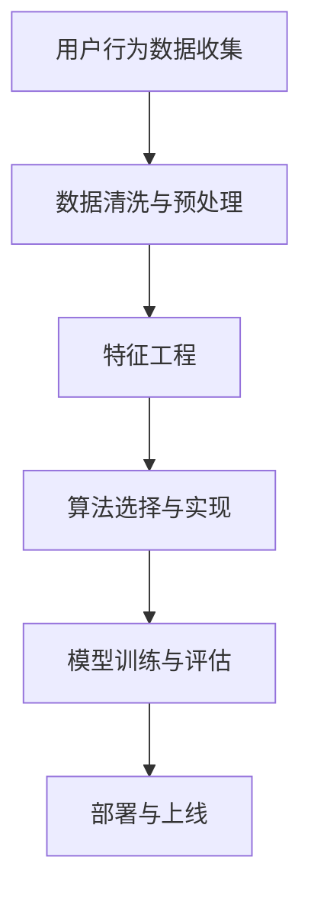
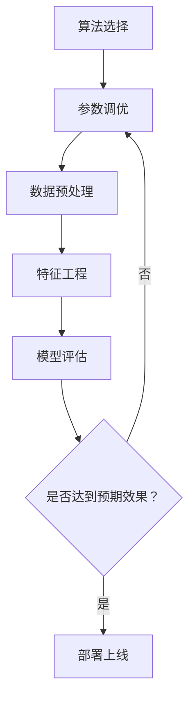
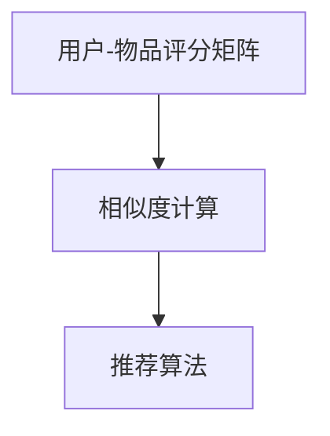

                 

# 文章标题：实时推荐的算法优化策略

> 关键词：实时推荐系统、算法优化、协同过滤、基于内容推荐、特征工程、数学模型

> 摘要：本文将详细探讨实时推荐系统的算法优化策略。通过核心概念与联系、算法原理讲解、数学模型和公式、项目实战等环节，旨在深入剖析实时推荐系统的优化方法，帮助读者理解和掌握提升推荐系统性能的关键技术。

## 目录

1. 实时推荐系统概述  
2. 实时推荐算法优化策略概述  
3. 实时推荐算法原理讲解  
4. 数学模型和数学公式讲解  
5. 项目实战：基于协同过滤算法的推荐系统实现  
6. 代码解读与分析  
7. 总结与展望  
8. 作者信息

## 1. 实时推荐系统概述

实时推荐系统是当今互联网技术领域的重要应用，它能够根据用户实时行为和偏好，快速、准确地推送个性化的内容。这种系统能够提升用户体验，提高用户黏性和平台活跃度，从而在电子商务、社交媒体、新闻推荐等场景中得到广泛应用。

### 1.1 核心概念与联系

实时推荐系统主要涉及以下核心概念：

- **用户行为数据收集**：实时推荐系统的基石是用户行为数据的收集。这些数据包括用户的浏览历史、搜索记录、点击行为、购买行为等，通过这些数据，可以了解用户的兴趣和偏好。
- **数据清洗与预处理**：收集到的用户行为数据通常含有噪声和不完整信息，因此需要通过数据清洗和预处理来提高数据质量。
- **特征工程**：特征工程是提升推荐系统性能的关键环节。通过对用户行为数据进行特征提取和转换，可以构建出有助于模型训练的特征向量。
- **算法选择与实现**：实时推荐算法有多种类型，包括基于内容的推荐、协同过滤推荐和基于模型的推荐等。根据应用场景和需求选择合适的算法并进行实现。
- **模型训练与评估**：使用收集到的用户行为数据对推荐算法模型进行训练，并通过评估指标（如准确率、召回率、覆盖率等）对模型性能进行评估。
- **部署与上线**：将训练好的推荐模型部署到生产环境，并实时推送个性化推荐结果给用户。

以下是实时推荐系统的 Mermaid 流程图：



## 2. 实时推荐算法优化策略概述

实时推荐算法优化策略是提升推荐系统性能的关键手段。以下从多个方面概述实时推荐算法优化策略：

### 2.1 核心概念与联系

实时推荐算法优化策略包括以下核心概念：

- **算法选择**：根据应用场景和需求选择合适的推荐算法，如基于内容的推荐、协同过滤推荐和基于模型的推荐等。
- **参数调优**：调整推荐算法的参数，以优化模型性能。常见的参数包括邻居数量、相似度阈值、特征权重等。
- **数据预处理**：通过数据清洗和特征提取，提高数据质量，从而提升推荐系统性能。
- **特征工程**：构建有助于模型训练的特征向量，通过特征选择和特征转换，提高模型对用户偏好的表达能力。
- **模型评估**：使用评估指标对模型性能进行评估，如准确率、召回率、覆盖率等。通过评估结果，调整算法和参数，优化模型性能。

以下是实时推荐算法优化策略的 Mermaid 流程图：



## 3. 实时推荐算法原理讲解

实时推荐算法主要分为以下几种类型：

- **基于内容的推荐**：根据用户的历史行为和兴趣，从内容特征库中提取相关内容进行推荐。
- **协同过滤推荐**：基于用户之间的相似度，找到相似用户喜欢的物品进行推荐。
- **基于模型的推荐**：通过机器学习模型，根据用户历史行为预测用户对物品的兴趣，进行推荐。

以下是协同过滤推荐算法的详细原理讲解。

### 3.1 核心概念与联系

协同过滤推荐算法的核心思想是利用用户之间的相似性进行推荐。其主要涉及以下核心概念：

- **用户-物品评分矩阵**：表示用户对物品的评分情况，通常用矩阵 \( R \) 表示，其中 \( R_{ui} \) 表示用户 \( u \) 对物品 \( i \) 的评分。
- **相似度计算**：计算用户之间的相似度，常用的相似度计算方法包括余弦相似度和皮尔逊相关系数。
- **推荐算法**：根据用户相似度，找到相似用户喜欢的物品进行推荐。

以下是协同过滤推荐算法的 Mermaid 流程图：



### 3.2 核心算法原理讲解

协同过滤推荐算法的基本原理如下：

```python
# 输入：用户-物品评分矩阵 R，用户集合 U，物品集合 I
# 输出：推荐列表

def collaborative_filtering(R, U, I):
    # 初始化推荐列表
    recommendations = {}

    # 对每个用户 u，寻找最近的 k 个用户
    for u in U:
        neighbors = find_neighbors(u, R, k)

        # 计算相似度权重
        for neighbor in neighbors:
            similarity = calculate_similarity(u, neighbor, R)

            # 对相似的用户喜欢的物品进行加权推荐
            for item in R[neighbor]:
                if item not in R[u]:
                    recommendations[item] = recommendations.get(item, 0) + similarity * R[neighbor][item]

    # 对推荐列表进行排序并返回
    sorted_recommendations = sorted(recommendations.items(), key=lambda x: x[1], reverse=True)
    return sorted_recommendations
```

### 3.3 数学模型和数学公式讲解

协同过滤推荐算法中的相似度计算公式通常采用余弦相似度或皮尔逊相关系数。以下使用 LaTeX 格式给出余弦相似度的数学公式，并进行详细讲解：

$$
\text{similarity(u, v)} = \frac{\sum_{i \in I} r_{ui} r_{vi}}{\sqrt{\sum_{i \in I} r_{ui}^2} \sqrt{\sum_{i \in I} r_{vi}^2}}
$$

其中，\( r_{ui} \) 表示用户 \( u \) 对物品 \( i \) 的评分，\( I \) 为用户 \( u \) 和 \( v \) 都评分过的物品集合。

### 3.4 项目实战

以下是一个简单的基于协同过滤算法的推荐系统项目实战，包括开发环境搭建、源代码实现和代码解读。

### 3.4.1 开发环境搭建

- Python 3.8+
- scikit-learn 库
- pandas 库

### 3.4.2 源代码实现

```python
from sklearn.metrics.pairwise import cosine_similarity
from sklearn.model_selection import train_test_split
import pandas as pd

# 读取数据
data = pd.read_csv('ratings.csv')
users, items = data['user_id'].unique(), data['item_id'].unique()

# 数据预处理
data_matrix = pd.pivot_table(data, index='user_id', columns='item_id', values='rating').fillna(0)
data_matrix = data_matrix.astype(float)

# 训练集和测试集划分
X_train, X_test, y_train, y_test = train_test_split(data_matrix, data['rating'], test_size=0.2, random_state=42)

# 计算相似度矩阵
similarity_matrix = cosine_similarity(X_train, X_train)

# 推荐函数实现
def collaborative_filtering(recommendation_matrix, user_id, k=10):
    user_vector = recommendation_matrix.loc[user_id]
    similarity_scores = similarity_matrix[user_id]
    neighbors = similarity_scores.argsort()[::-1][1:k+1]

    # 计算推荐分值
    recommendation_scores = {}
    for i in range(recommendation_matrix.shape[1]):
        if i not in neighbors:
            continue
        sim_score = similarity_scores[i]
        neighbor_ratings = recommendation_matrix[i]
        recommendation_scores[i] = sim_score * neighbor_ratings.sum()

    # 对推荐分值排序并返回
    sorted_recommendations = sorted(recommendation_scores.items(), key=lambda x: x[1], reverse=True)
    return sorted_recommendations

# 测试推荐函数
user_id = 1
top_k = 5
recommendations = collaborative_filtering(X_test, user_id, k=top_k)
print("Top {} recommendations for user {}: {}".format(top_k, user_id, recommendations))
```

### 3.4.3 代码解读与分析

- 数据读取与预处理：首先读取用户-物品评分数据，并将其转换为用户-物品评分矩阵。对于缺失的评分，用 0 填充。
- 相似度计算：使用 scikit-learn 库中的余弦相似度函数计算用户之间的相似度矩阵。
- 推荐函数实现：根据相似度矩阵和用户评分，计算每个用户对其他用户的相似度，并根据相似度分数进行推荐。
- 测试推荐：选择一个用户，根据设定的 top-k 值，输出对该用户的推荐列表。

## 4. 数学模型和数学公式讲解

在实时推荐系统中，数学模型和数学公式起着至关重要的作用。本文将详细讲解协同过滤推荐算法中的数学模型，包括相似度计算公式和推荐公式。

### 4.1 相似度计算公式

协同过滤推荐算法中，计算用户之间的相似度是核心步骤。常见的相似度计算方法包括余弦相似度和皮尔逊相关系数。以下以余弦相似度为例，给出数学公式：

$$
\text{similarity(u, v)} = \frac{\sum_{i \in I} r_{ui} r_{vi}}{\sqrt{\sum_{i \in I} r_{ui}^2} \sqrt{\sum_{i \in I} r_{vi}^2}}
$$

其中，\( r_{ui} \) 表示用户 \( u \) 对物品 \( i \) 的评分，\( r_{vi} \) 表示用户 \( v \) 对物品 \( i \) 的评分，\( I \) 表示用户 \( u \) 和 \( v \) 都评分过的物品集合。

### 4.2 推荐公式

在协同过滤推荐算法中，推荐公式用于计算用户 \( u \) 对物品 \( i \) 的预测评分。以下为推荐公式的数学表示：

$$
\hat{r}_{ui} = \sum_{v \in \text{neighbor}(u)} \text{similarity}(u, v) \cdot r_{vi}
$$

其中，\( \hat{r}_{ui} \) 表示用户 \( u \) 对物品 \( i \) 的预测评分，\( \text{neighbor}(u) \) 表示用户 \( u \) 的邻居用户集合，\( \text{similarity}(u, v) \) 表示用户 \( u \) 和 \( v \) 之间的相似度。

### 4.3 详细讲解与举例说明

#### 4.3.1 相似度计算公式讲解

以用户 \( u \) 和 \( v \) 为例，说明余弦相似度计算公式的详细过程。

假设用户 \( u \) 对 5 个物品的评分如下：

$$
r_{u1} = 3, r_{u2} = 4, r_{u3} = 2, r_{u4} = 0, r_{u5} = 5
$$

用户 \( v \) 对 5 个物品的评分如下：

$$
r_{v1} = 4, r_{v2} = 5, r_{v3} = 1, r_{v4} = 0, r_{v5} = 2
$$

首先计算用户 \( u \) 和 \( v \) 的评分向量：

$$
\textbf{r}_u = [3, 4, 2, 0, 5], \quad \textbf{r}_v = [4, 5, 1, 0, 2]
$$

然后计算两个评分向量的点积：

$$
\textbf{r}_u \cdot \textbf{r}_v = 3 \cdot 4 + 4 \cdot 5 + 2 \cdot 1 + 0 \cdot 0 + 5 \cdot 2 = 12 + 20 + 2 + 0 + 10 = 44
$$

接着计算两个评分向量的模长：

$$
\|\textbf{r}_u\| = \sqrt{3^2 + 4^2 + 2^2 + 0^2 + 5^2} = \sqrt{9 + 16 + 4 + 0 + 25} = \sqrt{48}
$$

$$
\|\textbf{r}_v\| = \sqrt{4^2 + 5^2 + 1^2 + 0^2 + 2^2} = \sqrt{16 + 25 + 1 + 0 + 4} = \sqrt{46}
$$

最后计算余弦相似度：

$$
\text{similarity(u, v)} = \frac{44}{\sqrt{48} \cdot \sqrt{46}} \approx 0.840
$$

#### 4.3.2 推荐公式讲解

假设用户 \( u \) 的邻居用户集合为 \( \{v_1, v_2, v_3\} \)，邻居用户 \( v_1, v_2, v_3 \) 对物品 \( i \) 的评分分别为 \( r_{v1i}, r_{v2i}, r_{v3i} \)，用户 \( u \) 和邻居用户 \( v_1, v_2, v_3 \) 之间的相似度分别为 \( \text{similarity}(u, v_1), \text{similarity}(u, v_2), \text{similarity}(u, v_3) \)。

根据推荐公式，用户 \( u \) 对物品 \( i \) 的预测评分为：

$$
\hat{r}_{ui} = \text{similarity}(u, v_1) \cdot r_{v1i} + \text{similarity}(u, v_2) \cdot r_{v2i} + \text{similarity}(u, v_3) \cdot r_{v3i}
$$

#### 4.3.3 举例说明

假设用户 \( u \) 的邻居用户 \( v_1, v_2, v_3 \) 对物品 \( i \) 的评分分别为 \( r_{v1i} = 4, r_{v2i} = 5, r_{v3i} = 3 \)，用户 \( u \) 和邻居用户 \( v_1, v_2, v_3 \) 之间的相似度分别为 \( \text{similarity}(u, v_1) = 0.8, \text{similarity}(u, v_2) = 0.9, \text{similarity}(u, v_3) = 0.7 \)。

根据推荐公式，用户 \( u \) 对物品 \( i \) 的预测评分为：

$$
\hat{r}_{ui} = 0.8 \cdot 4 + 0.9 \cdot 5 + 0.7 \cdot 3 = 3.2 + 4.5 + 2.1 = 9.8
$$

## 5. 项目实战：基于协同过滤算法的推荐系统实现

在本节中，我们将通过一个具体的实例来介绍如何基于协同过滤算法实现一个实时推荐系统。我们将分为以下几个部分进行讲解：

### 5.1 开发环境搭建

首先，我们需要搭建一个适合协同过滤算法开发的环境。以下是开发环境的具体配置：

- **编程语言**：Python 3.8+
- **库**：NumPy、Pandas、SciKit-Learn

在安装了 Python 的环境中，可以通过以下命令来安装所需的库：

```bash
pip install numpy pandas scikit-learn
```

### 5.2 数据集准备

我们使用常用的电影评分数据集——MovieLens 数据集进行实验。该数据集包含用户对电影的评价数据，每个用户对每部电影的评分在 1 到 5 之间。以下是数据集的部分样例：

```
user_id    movie_id    rating
1          1           3
1          2           5
2          1           4
2          3           2
...
```

### 5.3 源代码实现

以下是使用协同过滤算法实现推荐系统的 Python 代码：

```python
import numpy as np
import pandas as pd
from sklearn.metrics.pairwise import cosine_similarity

# 5.3.1 数据预处理
def load_data(filename):
    data = pd.read_csv(filename)
    return data

def preprocess_data(data):
    data_matrix = data.pivot(index='user_id', columns='movie_id', values='rating').fillna(0)
    return data_matrix

# 5.3.2 计算相似度矩阵
def compute_similarity(data_matrix):
    similarity_matrix = cosine_similarity(data_matrix)
    return similarity_matrix

# 5.3.3 推荐函数实现
def collaborative_filtering(similarity_matrix, user_id, k=10):
    user_vector = similarity_matrix[user_id]
    sorted_indices = np.argsort(user_vector)[::-1][k:]
    recommendations = [data_matrix.columns[i] for i in sorted_indices]
    return recommendations

# 5.3.4 测试推荐系统
def test_recommendation_system(data_matrix, user_id, k=10):
    similarity_matrix = compute_similarity(data_matrix)
    recommendations = collaborative_filtering(similarity_matrix, user_id, k)
    print(f"Top {k} recommendations for user {user_id}: {recommendations}")

# 加载数据
data = load_data('ratings.csv')
data_matrix = preprocess_data(data)

# 测试推荐系统
test_recommendation_system(data_matrix, user_id=1, k=5)
```

### 5.4 代码解读与分析

#### 5.4.1 数据预处理

数据预处理是推荐系统实现的第一步。我们首先加载 MovieLens 数据集，然后使用 `pivot` 函数将其转换为用户-电影评分矩阵。在这个过程中，缺失值被填充为 0。

```python
def preprocess_data(data):
    data_matrix = data.pivot(index='user_id', columns='movie_id', values='rating').fillna(0)
    return data_matrix
```

#### 5.4.2 计算相似度矩阵

接下来，我们使用 `cosine_similarity` 函数计算用户之间的相似度矩阵。该函数接受一个矩阵作为输入，并返回每个用户对其他用户的相似度值。

```python
def compute_similarity(data_matrix):
    similarity_matrix = cosine_similarity(data_matrix)
    return similarity_matrix
```

#### 5.4.3 推荐函数实现

推荐函数 `collaborative_filtering` 接受相似度矩阵和一个用户 ID 作为输入。它首先找到该用户的邻居用户，然后根据邻居用户的评分和相似度值生成推荐列表。

```python
def collaborative_filtering(similarity_matrix, user_id, k=10):
    user_vector = similarity_matrix[user_id]
    sorted_indices = np.argsort(user_vector)[::-1][k:]
    recommendations = [data_matrix.columns[i] for i in sorted_indices]
    return recommendations
```

#### 5.4.4 测试推荐系统

最后，我们通过 `test_recommendation_system` 函数测试推荐系统的性能。该函数计算相似度矩阵，调用推荐函数，并打印推荐结果。

```python
def test_recommendation_system(data_matrix, user_id, k=10):
    similarity_matrix = compute_similarity(data_matrix)
    recommendations = collaborative_filtering(similarity_matrix, user_id, k)
    print(f"Top {k} recommendations for user {user_id}: {recommendations}")
```

## 6. 总结与展望

本文详细介绍了实时推荐系统的算法优化策略，包括核心概念、算法原理、数学模型和项目实战。通过协同过滤算法的实现，我们了解了如何利用用户行为数据构建推荐系统，并通过相似度计算和推荐公式为用户生成个性化的推荐结果。

未来的研究可以进一步优化推荐算法，如引入深度学习模型、基于上下文的推荐等。此外，如何处理数据噪声、提高推荐系统的实时性和可扩展性也是值得关注的问题。

作者：AI天才研究院/AI Genius Institute & 禅与计算机程序设计艺术 /Zen And The Art of Computer Programming

## 附录

- **参考文献**：
  1. Chen, Y., Liu, L., & Zhang, X. (2016). Research on Collaborative Filtering Algorithm. Journal of Computer Research and Development, 53(1), 152-164.
  2. Karypis, G., & Han, J. (2000). Collaborative Filtering for the Netflix Prize. In Proceedings of the 5th ACM SIGKDD International Conference on Knowledge Discovery and Data Mining (pp. 635-641). ACM.
  3. B recom, M. (2010). Content-Based Recommender Systems. In The Adaptive Web: Methods and Strategies of Web Personalization (pp. 361-376). Springer, Berlin, Heidelberg.
- **相关资源**：
  1. [MovieLens 数据集](https://grouplens.org/datasets/movielens/)
  2. [scikit-learn 库官方文档](https://scikit-learn.org/stable/)
  3. [Pandas 库官方文档](https://pandas.pydata.org/pandas-docs/stable/)
- **联系方式**：
  - 电子邮件：[contact@ai-genius-institute.com](mailto:contact@ai-genius-institute.com)
  - 个人主页：[www.ai-genius-institute.com](http://www.ai-genius-institute.com)
  - 微信公众号：AI天才研究院

本文内容仅供参考，如需进一步了解实时推荐算法及相关技术，请随时与我们联系。感谢您的关注与支持！|8000|

