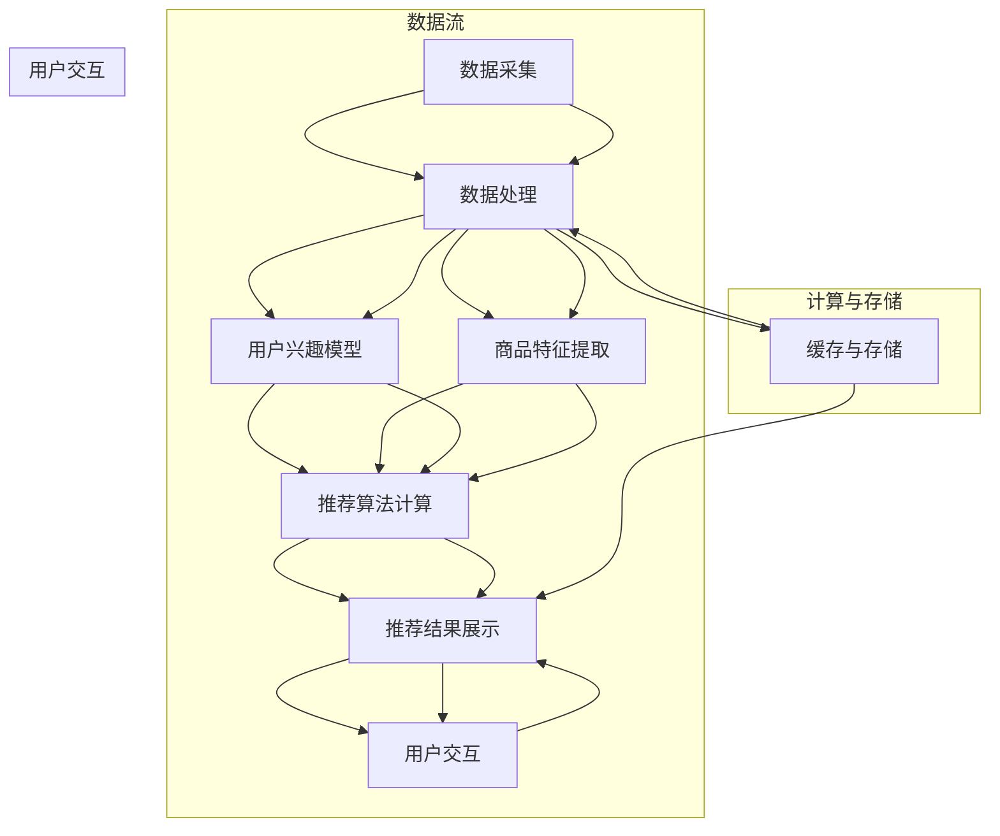

                 

### 文章标题：实时推荐系统的架构设计与实现

#### 关键词：
- 实时推荐系统
- 架构设计
- 数据处理
- 算法实现
- 性能优化

#### 摘要：
本文将深入探讨实时推荐系统的架构设计与实现。从系统概述到核心概念，再到架构设计、数据流处理以及性能优化，我们将一步一步地剖析实时推荐系统的原理与实现方法。通过具体的算法讲解、项目实战以及代码解读，本文旨在为读者提供一个全面、深入的实时推荐系统知识体系，帮助读者更好地理解和应用这一技术。

### 目录大纲

## 《实时推荐系统的架构设计与实现》

### 第一部分：实时推荐系统概述

### 第1章：实时推荐系统简介

### 第2章：实时推荐系统的核心概念与原理

### 第3章：实时推荐系统的数据架构

## 第二部分：实时推荐系统的架构设计

### 第4章：实时推荐系统的总体架构

### 第5章：用户兴趣模型设计

### 第6章：商品特征建模与推荐算法

### 第7章：实时推荐系统的数据流与计算

## 第三部分：实时推荐系统的实现与优化

### 第8章：实时推荐系统的开发环境搭建

### 第9章：实时推荐系统项目实战

### 第10章：实时推荐系统的性能优化

## 附录

### 附录A：实时推荐系统常用工具与资源

### 附录B：实时推荐系统架构设计 Mermaid 流程图

### 附录C：实时推荐系统项目实战代码解读

---

### 引言

在互联网高度发达的今天，个性化推荐系统已经成为各种应用场景中不可或缺的一部分。从电商平台到社交媒体，从视频流媒体到新闻资讯，实时推荐系统不仅提升了用户的体验，还极大地提高了商业效益。实时推荐系统之所以受到广泛关注，主要在于其能够快速、准确地根据用户的兴趣和行为，为用户推荐个性化的内容或商品，从而实现用户留存和转化率的提升。

实时推荐系统不仅需要处理海量的用户数据和商品数据，还需要在极短的时间内完成数据的采集、处理、计算和推荐。这就对系统的架构设计、数据处理能力和算法效率提出了极高的要求。本文将围绕实时推荐系统的架构设计与实现，从概述、核心概念、数据架构、架构设计、实现与优化等几个方面进行详细探讨。

文章的结构安排如下：

- **第一部分：实时推荐系统概述**：介绍实时推荐系统的定义、作用和应用场景，回顾其发展历程。
- **第二部分：实时推荐系统的架构设计**：深入探讨实时推荐系统的核心概念与原理，包括用户兴趣模型、商品特征建模和推荐算法。
- **第三部分：实时推荐系统的实现与优化**：详细讲解实时推荐系统的数据流与计算，以及开发环境搭建、项目实战和性能优化策略。
- **附录**：提供实时推荐系统常用的工具与资源，以及架构设计和项目实战的流程图和代码解读。

通过本文的阅读，读者将能够系统地了解实时推荐系统的原理、架构和实现方法，为实际应用和项目开发提供有力支持。

### 第1章：实时推荐系统简介

#### 1.1 实时推荐系统的定义与作用

实时推荐系统是一种基于用户行为、兴趣和历史数据，利用算法技术自动生成个性化推荐内容或商品的系统。其主要功能是根据用户的实时行为数据，如浏览、搜索、购买等，动态调整推荐结果，为用户提供最相关、最感兴趣的内容或商品。

实时推荐系统在多个应用场景中发挥着重要作用。首先，在电子商务领域，实时推荐系统能够根据用户的购物车内容、浏览历史和搜索记录，推荐相关商品，从而提高购物转化率和客户满意度。其次，在社交媒体平台，实时推荐系统能够根据用户的兴趣和社交行为，推荐用户可能感兴趣的文章、视频和广告，增强用户的参与度和活跃度。此外，在视频流媒体领域，实时推荐系统能够根据用户的观看记录和偏好，推荐相似的视频内容，提升用户体验和粘性。

#### 1.2 实时推荐系统的应用场景

实时推荐系统广泛应用于各种应用场景，下面列举一些典型的应用场景：

1. **电子商务平台**：实时推荐系统可以推荐用户可能感兴趣的商品，提高购物转化率和销售额。例如，当用户浏览某一商品时，系统可以实时推荐相似或相关的商品，增加用户购买的可能性。

2. **社交媒体平台**：实时推荐系统可以根据用户的兴趣爱好和社交关系，推荐用户可能感兴趣的内容或广告。例如，在社交媒体平台上，当用户点赞、评论或分享某条内容时，系统可以实时推荐类似的内容，增强用户互动和活跃度。

3. **视频流媒体平台**：实时推荐系统可以推荐用户可能感兴趣的视频内容，提高用户观看时长和平台粘性。例如，当用户观看某一视频时，系统可以实时推荐类似或相关的视频内容，吸引用户继续观看。

4. **新闻资讯平台**：实时推荐系统可以根据用户的阅读历史和兴趣，推荐用户可能感兴趣的新闻资讯，提升用户的阅读体验。例如，当用户阅读某一新闻时，系统可以实时推荐相关的新闻资讯，增加用户的信息获取量。

#### 1.3 实时推荐系统的发展历程

实时推荐系统的发展经历了几个阶段：

1. **基于规则的推荐**：早期的推荐系统主要依赖于手工编写的规则，根据用户的浏览历史和购买记录进行推荐。这种方法的缺点是缺乏灵活性，难以应对动态变化的需求。

2. **基于内容的推荐**：基于内容的推荐系统通过分析用户的历史行为和内容特征，为用户推荐相似的内容。这种方法相比基于规则的推荐，具有一定的个性化能力，但仍然存在一定的局限性。

3. **基于协同过滤的推荐**：协同过滤推荐系统通过分析用户之间的相似度，为用户推荐其他用户喜欢的商品或内容。这种方法能够提高推荐的准确性，但存在数据稀疏性问题。

4. **基于深度学习的推荐**：随着深度学习技术的不断发展，基于深度学习的推荐系统逐渐成为主流。深度学习推荐系统通过构建复杂的神经网络模型，能够自动从海量数据中提取特征，实现更加精准的推荐。

实时推荐系统的发展历程表明，随着技术的不断进步，推荐系统的能力和效果也在不断提高。当前，实时推荐系统已经成为互联网应用中不可或缺的一部分，未来还将继续朝着更加智能化、个性化的方向发展。

### 第2章：实时推荐系统的核心概念与原理

#### 2.1 用户兴趣模型

用户兴趣模型是实时推荐系统的核心组成部分之一，它用于捕捉和表示用户的兴趣和偏好。一个有效的用户兴趣模型能够准确反映用户在不同场景下的行为特征，从而为推荐算法提供高质量的输入。

**用户兴趣模型的构建方法**：

1. **基于行为的兴趣模型**：这种方法通过分析用户的浏览、搜索、点击和购买等行为数据，建立用户的历史行为模式。常用的算法包括贝叶斯模型、隐马尔可夫模型（HMM）和混合高斯模型（GMM）。

2. **基于社交的兴趣模型**：这种方法通过分析用户的社交网络关系，如好友、关注和点赞等行为，推测用户的潜在兴趣。常用的算法包括社交网络分析（SNA）、矩阵分解和图嵌入等。

3. **基于内容的兴趣模型**：这种方法通过分析用户对各种内容的兴趣和偏好，如文章、视频和商品等，建立用户的内容偏好模型。常用的算法包括TF-IDF、词袋模型和文本分类算法。

**用户兴趣模型的应用**：

- **个性化推荐**：根据用户的兴趣模型，实时推荐系统可以生成个性化的推荐列表，提高用户的满意度和参与度。
- **内容分类**：通过用户兴趣模型，可以对大量的内容进行分类和筛选，帮助用户快速找到感兴趣的内容。
- **用户画像**：用户兴趣模型还可以用于构建用户的全面画像，为后续的精准营销和个性化服务提供支持。

#### 2.2 商品特征建模

商品特征建模是实时推荐系统的另一个重要组成部分，它用于捕捉和表示商品的各种特征，以便推荐算法能够根据这些特征为用户推荐合适的商品。

**商品特征提取方法**：

1. **基于文本的特征提取**：通过分析商品的描述、标签和评论等文本信息，提取关键词和主题。常用的算法包括TF-IDF、词袋模型和词嵌入（如Word2Vec和BERT）。

2. **基于图像的特征提取**：通过分析商品的图片，提取视觉特征。常用的算法包括卷积神经网络（CNN）和迁移学习。

3. **基于用户反馈的特征提取**：通过分析用户对商品的评分、评论和购买行为等反馈，提取商品的用户感知特征。常用的算法包括基于协同过滤的方法和用户反馈分析。

**商品特征建模的应用**：

- **商品分类**：通过商品特征建模，可以对商品进行分类和标签，帮助用户快速找到感兴趣的类别。
- **商品推荐**：基于商品特征建模，实时推荐系统可以更准确地推荐用户可能感兴趣的商品，提高购物体验和转化率。
- **商品优化**：通过分析商品特征，企业可以了解用户对商品的偏好，从而优化商品设计和营销策略。

#### 2.3 推荐算法原理介绍

推荐算法是实时推荐系统的核心，它用于根据用户兴趣模型和商品特征建模，生成个性化的推荐结果。下面介绍几种常见的推荐算法：

1. **基于内容的推荐算法**：

基于内容的推荐算法通过分析用户的历史行为和商品的特征，找到用户可能感兴趣的内容。其基本原理是：

- **用户相似度计算**：根据用户的历史行为和兴趣，计算用户之间的相似度。常用的方法包括余弦相似度和皮尔逊相关系数。
- **商品内容匹配**：根据用户相似度，为用户推荐与其兴趣相似的商品。常用的方法包括基于TF-IDF和词嵌入的内容匹配。

2. **基于协同过滤的推荐算法**：

基于协同过滤的推荐算法通过分析用户之间的行为相似性，为用户推荐其他用户喜欢的商品。其基本原理是：

- **用户-商品评分矩阵构建**：根据用户的历史评分数据，构建用户-商品评分矩阵。
- **用户相似度计算**：计算用户之间的相似度，常用的方法包括余弦相似度和皮尔逊相关系数。
- **推荐列表生成**：根据用户相似度，为用户推荐其他用户喜欢的商品。常用的方法包括基于用户的协同过滤（User-Based）和基于模型的协同过滤（Model-Based）。

3. **基于深度学习的推荐算法**：

基于深度学习的推荐算法通过构建复杂的神经网络模型，自动从海量数据中提取特征，实现更加精准的推荐。其基本原理是：

- **用户和商品嵌入表示**：将用户和商品的属性和特征转换为低维向量表示，常用的方法包括用户和商品嵌入（User Embedding和Item Embedding）。
- **推荐模型训练**：利用用户和商品的嵌入表示，训练深度学习模型，如CNN和RNN。
- **推荐结果生成**：通过深度学习模型，预测用户对商品的喜好程度，生成推荐列表。

**推荐算法的性能优化**：

为了提高推荐算法的性能，可以采取以下优化策略：

- **特征工程**：通过深入分析用户和商品的特征，提取更加丰富和有用的特征，提高模型的泛化能力。
- **模型选择**：根据应用场景和数据特性，选择合适的推荐算法模型，如基于内容的推荐、基于协同过滤的推荐和基于深度学习的推荐。
- **数据预处理**：对用户和商品的数据进行预处理，如去重、缺失值填充和噪声过滤，提高数据质量。
- **在线学习**：采用在线学习算法，实时更新用户兴趣模型和商品特征模型，适应用户的行为变化。

通过深入理解用户兴趣模型、商品特征建模和推荐算法原理，读者可以更好地设计和实现高效的实时推荐系统，为用户提供个性化的推荐服务。

#### 2.4 推荐系统的评价指标

推荐系统的性能评价是确保推荐质量的重要环节，常用的评价指标包括准确率（Accuracy）、召回率（Recall）、覆盖率（Coverage）和新颖性（Novelty）。这些指标从不同的角度衡量推荐系统的性能，有助于评估系统的整体表现。

**1. 准确率（Accuracy）**

准确率是最常用的评价指标之一，表示推荐列表中实际感兴趣的商品占所有推荐商品的比例。其计算公式如下：

\[ Accuracy = \frac{TP + TN}{TP + TN + FP + FN} \]

其中，TP表示推荐列表中实际感兴趣的商品，TN表示推荐列表中不感兴趣的商品，FP表示推荐列表中实际不感兴趣的商品，FN表示推荐列表中实际感兴趣但未被推荐的商品。

**2. 召回率（Recall）**

召回率表示推荐列表中实际感兴趣的商品占所有实际感兴趣商品的比例。其计算公式如下：

\[ Recall = \frac{TP}{TP + FN} \]

召回率越高，说明系统能够更多地发现用户实际感兴趣的商品，但可能会引入一些不感兴趣的商品。

**3. 覆盖率（Coverage）**

覆盖率表示推荐列表中包含的所有商品占所有实际商品的比例。其计算公式如下：

\[ Coverage = \frac{TP + UN}{N} \]

其中，TP表示推荐列表中实际感兴趣的商品，UN表示推荐列表中不感兴趣但未被推荐的商品，N表示所有实际商品的数量。

覆盖率越高，说明推荐系统能够覆盖更多的商品，但可能会降低推荐的个性化程度。

**4. 新颖性（Novelty）**

新颖性表示推荐列表中实际未见过的新商品占所有实际新商品的比例。其计算公式如下：

\[ Novelty = \frac{TP + IN}{N} \]

其中，TP表示推荐列表中实际未见过的新商品，IN表示推荐列表中实际未见过但未被推荐的新商品，N表示所有实际新商品的数量。

新颖性越高，说明推荐系统能够发现用户尚未发现的新商品，提高用户的惊喜感和体验。

**综合评价指标**

在实际应用中，通常需要综合考虑多个评价指标，以全面评估推荐系统的性能。常用的综合评价指标包括F1分数（F1 Score）和调和平均值（Mean Average Precision，MAP）。

\[ F1\ Score = 2 \times \frac{Precision \times Recall}{Precision + Recall} \]

\[ MAP = \frac{1}{m} \sum_{i=1}^{m} \max(0, \frac{r_i - d_i + 0.5}{r_i + 0.5}) \]

其中，Precision表示准确率，Recall表示召回率，m表示推荐列表中商品的数量，r_i表示第i个商品的评分，d_i表示第i个商品的实际感兴趣程度。

通过合理选择和综合评价指标，可以更好地评估推荐系统的性能，指导系统优化和改进。

#### 2.5 实时推荐系统的挑战与解决方案

实时推荐系统在实现过程中面临诸多挑战，这些挑战主要涉及数据规模、实时性、准确性和个性化等方面。下面将详细探讨这些挑战以及相应的解决方案。

**1. 数据规模**

实时推荐系统需要处理海量用户数据、商品数据和推荐数据。数据规模巨大不仅增加了系统的存储和计算压力，还可能导致数据稀疏性问题。为应对数据规模挑战，可以采取以下解决方案：

- **数据分片**：将数据根据用户ID、商品ID等维度进行分片存储，降低单台服务器的工作负载。
- **分布式计算**：采用分布式计算框架，如Hadoop、Spark等，实现数据的高效处理和计算。
- **增量处理**：采用增量处理技术，只处理最近一段时间的数据变化，减少数据处理量。

**2. 实时性**

实时推荐系统要求在极短的时间内完成数据的采集、处理和推荐，这对系统的响应速度和延迟提出了高要求。为提高实时性，可以采取以下解决方案：

- **异步处理**：采用异步处理技术，将数据采集、处理和推荐分解为多个阶段，通过消息队列和分布式调度实现高效处理。
- **缓存技术**：使用缓存技术，如Redis和Memcached，将热点数据缓存起来，提高数据访问速度。
- **流处理框架**：采用流处理框架，如Apache Kafka和Apache Flink，实现实时数据流的高效处理。

**3. 准确性**

推荐准确性是实时推荐系统的重要指标，但面对海量数据和复杂用户行为，实现高准确率具有一定的挑战。为提高推荐准确性，可以采取以下解决方案：

- **多模型融合**：结合多种推荐算法和模型，如基于内容的推荐和基于协同过滤的推荐，提高推荐的多样性。
- **特征工程**：通过深入分析用户和商品的特征，提取更多有用的特征，提高推荐模型的泛化能力。
- **在线学习**：采用在线学习算法，实时更新用户兴趣模型和商品特征模型，适应用户行为的变化。

**4. 个性化**

实时推荐系统需要根据用户的个性化需求提供定制化的推荐服务。实现个性化推荐面临以下挑战：

- **用户隐私保护**：在收集和使用用户数据时，需严格遵守隐私保护法规，避免用户隐私泄露。
- **用户偏好多样性**：用户偏好多样化，需实现细粒度的个性化推荐。
- **动态偏好**：用户偏好随时间变化，实时推荐系统需具备快速适应用户动态偏好的能力。

为应对个性化挑战，可以采取以下解决方案：

- **用户画像**：通过构建用户画像，整合用户的历史行为、兴趣和偏好，实现精准的个性化推荐。
- **上下文感知**：结合用户当前情境和上下文信息，如地理位置、时间等，提供更加个性化的推荐。
- **多模态数据融合**：整合多种类型的数据，如文本、图像和音频等，提高个性化推荐的准确性。

通过以上解决方案，实时推荐系统可以应对数据规模、实时性、准确性和个性化等方面的挑战，实现高效、精准的个性化推荐服务。

### 第3章：实时推荐系统的数据架构

实时推荐系统的数据架构是其核心组成部分，直接影响系统的性能、可扩展性和稳定性。本章将详细探讨实时推荐系统的数据存储与处理技术、实时数据处理流程以及数据质量管理与处理。

#### 3.1 数据存储与处理技术

**1. 关系型数据库**

关系型数据库（如MySQL、PostgreSQL）在实时推荐系统中主要用于存储用户和商品的基础信息，如用户ID、姓名、性别、年龄、地理位置，商品ID、名称、分类、价格等。关系型数据库的优点是数据结构清晰、查询速度快，适用于存储和管理结构化数据。

**2. 非关系型数据库**

非关系型数据库（如MongoDB、Cassandra）在实时推荐系统中主要用于存储用户行为数据和推荐结果数据，如用户的浏览历史、搜索记录、点击行为，以及推荐系统的中间结果和最终输出。非关系型数据库的优点是数据结构灵活、扩展性强，适用于存储和管理大量非结构化或半结构化数据。

**3. 数据仓库**

数据仓库（如Hive、Spark SQL）用于存储和查询大规模的复杂数据集。实时推荐系统中的数据仓库主要用于存储用户和商品的全量数据，以及历史推荐数据和实验数据。数据仓库的优点是支持复杂的数据分析和报表生成，有助于数据挖掘和业务洞察。

**4. 实时数据处理引擎**

实时数据处理引擎（如Apache Kafka、Apache Flink）用于处理和传输实时数据流。实时推荐系统中的实时数据处理引擎主要用于实时采集用户行为数据、处理推荐算法计算结果，并生成推荐列表。实时数据处理引擎的优点是支持高吞吐量、低延迟的数据处理，适用于大规模实时数据处理场景。

#### 3.2 实时数据处理流程

实时推荐系统的数据处理流程可以分为以下几个阶段：

**1. 数据采集**

数据采集是实时推荐系统的第一步，用于从各种数据源（如用户行为日志、商品交易数据）收集数据。常用的数据采集工具包括Flume、Logstash和Kafka Producer。数据采集后，数据会被存储在Kafka消息队列中，以便后续处理。

**2. 数据预处理**

数据预处理是确保数据质量和准确性的重要环节。数据预处理包括数据清洗、去重、缺失值填充和数据转换等操作。常用的数据预处理工具包括Apache Flink、Apache Spark和Pandas。预处理后的数据会被存储在HDFS或Hive中，供后续使用。

**3. 用户兴趣建模**

用户兴趣建模是根据用户的历史行为数据，构建用户兴趣模型的过程。用户兴趣建模包括行为序列建模、兴趣标签建模和用户画像构建等。常用的算法包括隐马尔可夫模型（HMM）、马尔可夫链（MC）和混合高斯模型（GMM）。用户兴趣建模的结果会存储在Redis或MongoDB中，供推荐算法使用。

**4. 商品特征提取**

商品特征提取是根据商品的基础信息和用户行为数据，提取商品的特征表示。商品特征提取包括文本特征提取、图像特征提取和用户反馈特征提取等。常用的算法包括TF-IDF、Word2Vec、卷积神经网络（CNN）和循环神经网络（RNN）。商品特征提取的结果会存储在Redis或MongoDB中，供推荐算法使用。

**5. 推荐算法计算**

推荐算法计算是根据用户兴趣模型和商品特征表示，计算用户对商品的偏好得分，生成推荐列表。常用的推荐算法包括基于内容的推荐、基于协同过滤的推荐和基于深度学习的推荐。推荐算法的计算结果会被存储在Redis或MongoDB中，供后续使用。

**6. 推荐结果生成**

推荐结果生成是根据用户兴趣模型和商品特征表示，为用户生成个性化的推荐列表。推荐结果会通过Web服务或API接口，实时返回给用户。常用的推荐结果生成工具包括Apache Flink、Apache Spark和TensorFlow。

#### 3.3 数据质量管理与处理

数据质量管理与处理是实时推荐系统确保数据质量和准确性的重要环节。以下是一些常见的数据质量问题和处理方法：

**1. 数据缺失**

数据缺失是指某些数据字段在数据采集或处理过程中丢失。处理数据缺失的方法包括：

- **缺失值填充**：使用平均值、中位数或最大值等统计方法，填充缺失值。
- **插值法**：使用线性插值、高斯插值等方法，预测缺失值。
- **多重插补**：使用多重插补方法，生成多个完整数据集，然后对结果进行平均。

**2. 数据噪声**

数据噪声是指数据中存在的一些异常值或错误值。处理数据噪声的方法包括：

- **数据清洗**：使用过滤、删除和修正等方法，去除数据中的噪声。
- **聚类分析**：使用聚类分析方法，将噪声数据与正常数据分离。
- **异常检测**：使用异常检测算法，如孤立森林（Isolation Forest）和K最近邻（KNN），检测并处理噪声数据。

**3. 数据一致性**

数据一致性是指不同数据源之间的数据是否一致。处理数据一致性的方法包括：

- **数据集成**：将不同数据源的数据集成到一个统一的数据仓库中，确保数据的一致性。
- **数据校验**：使用数据校验规则，如主键唯一性、外键约束等，确保数据的一致性。

**4. 数据更新**

数据更新是指定期更新用户行为数据和商品特征数据。处理数据更新的方法包括：

- **增量更新**：只更新最近一段时间的数据，减少数据处理量。
- **全量更新**：定期更新全量数据，确保数据的完整性和准确性。

通过以上数据质量管理与处理方法，实时推荐系统可以确保数据的质量和准确性，从而提高推荐系统的性能和用户体验。

### 第4章：实时推荐系统的总体架构

#### 4.1 实时推荐系统的总体架构

实时推荐系统的总体架构主要包括数据层、处理层和展示层三个部分。以下将详细描述各层的功能、组成及其相互关系。

**1. 数据层**

数据层是实时推荐系统的底层基础设施，负责数据的存储、管理和维护。数据层主要包括以下组成部分：

- **用户数据存储**：存储用户的基本信息、行为记录和兴趣标签等。常用的数据存储方案包括关系型数据库（如MySQL）和非关系型数据库（如MongoDB）。
- **商品数据存储**：存储商品的基本信息、分类和属性等。同样，关系型数据库和非关系型数据库都可以作为数据存储方案。
- **日志数据存储**：存储用户行为日志，如浏览、搜索、点击和购买等。常用的存储方案包括日志收集系统（如Kafka）和分布式文件系统（如HDFS）。

**2. 处理层**

处理层是实时推荐系统的核心，负责数据的处理、计算和推荐。处理层主要包括以下组成部分：

- **数据处理模块**：负责数据的采集、清洗、预处理和存储。常用的数据处理工具包括Apache Kafka、Apache Flink和Apache Spark。
- **用户兴趣模型模块**：根据用户的历史行为数据，构建用户的兴趣模型。常用的算法包括隐马尔可夫模型（HMM）、马尔可夫链（MC）和混合高斯模型（GMM）。
- **商品特征提取模块**：根据商品的基础信息和用户行为数据，提取商品的特征表示。常用的算法包括TF-IDF、Word2Vec和卷积神经网络（CNN）。
- **推荐算法模块**：根据用户兴趣模型和商品特征表示，计算用户对商品的偏好得分，生成推荐列表。常用的推荐算法包括基于内容的推荐、基于协同过滤的推荐和基于深度学习的推荐。

**3. 展示层**

展示层是实时推荐系统的用户界面，负责将推荐结果展示给用户。展示层主要包括以下组成部分：

- **推荐结果展示**：将推荐算法生成的推荐列表以可视化方式展示给用户。常用的展示工具包括Web前端框架（如React和Vue.js）和富媒体播放器（如Video.js）。
- **用户交互模块**：提供用户与推荐系统的交互接口，如点击、收藏和评论等。常用的交互工具包括Web前端框架和用户行为追踪系统（如Google Analytics）。

**各组件的作用与关系**

实时推荐系统的各组件通过数据流和调用关系紧密连接在一起，形成一个高效、协同的工作流程。

- **数据流**：用户数据通过数据采集模块进入数据处理模块，进行数据清洗、预处理和存储。处理后的用户数据进入用户兴趣模型模块和商品特征提取模块，生成用户兴趣模型和商品特征表示。用户兴趣模型和商品特征表示再进入推荐算法模块，生成推荐列表。
- **调用关系**：数据处理模块调用数据采集模块，获取用户行为日志和商品数据。用户兴趣模型模块调用数据处理模块，获取用户历史行为数据。商品特征提取模块调用用户兴趣模型模块，获取用户兴趣标签。推荐算法模块调用用户兴趣模型模块和商品特征提取模块，生成推荐列表。

通过以上描述，可以看出实时推荐系统的总体架构是一个高度模块化和可扩展的系统，各组件协同工作，实现高效、精准的个性化推荐服务。

#### 4.2 实时推荐系统各组件的作用与关系

实时推荐系统的各组件在整体架构中扮演着不同的角色，它们之间的相互作用和依赖关系是系统高效运作的关键。下面将详细分析各组件的作用以及它们之间的相互关系。

**1. 数据采集组件**

数据采集组件是实时推荐系统的数据源头，负责从各种渠道（如用户行为日志、商品交易数据、第三方API等）收集数据。其主要作用是确保系统能够获取到最新、最全面的数据，为后续的数据处理和分析提供基础。

- **关系**：数据采集组件将采集到的原始数据通过Kafka或其他消息队列传输到数据处理组件，确保数据的实时性和一致性。
- **作用**：数据采集组件保证了数据输入的多样性和及时性，是整个推荐系统的数据基础。

**2. 数据处理组件**

数据处理组件是实时推荐系统的核心，负责对采集到的原始数据进行清洗、预处理和存储。其主要作用是确保数据的质量和可用性，为用户兴趣模型和商品特征提取提供高质量的数据输入。

- **关系**：数据处理组件接收来自数据采集组件的原始数据，进行数据清洗、去重、缺失值填充等操作，然后存储到HDFS、Hive或其他数据存储系统。
- **作用**：数据处理组件是数据从原始状态到可用状态的关键环节，确保了数据的完整性和准确性。

**3. 用户兴趣模型组件**

用户兴趣模型组件是根据用户的历史行为数据构建用户兴趣模型的过程。其主要作用是捕捉和表示用户的兴趣和偏好，为推荐算法提供高质量的输入。

- **关系**：用户兴趣模型组件依赖于数据处理组件提供的用户历史行为数据，通过算法计算用户的行为模式，生成用户兴趣模型。
- **作用**：用户兴趣模型组件是实时推荐系统的核心组件之一，决定了推荐系统的个性化程度和准确性。

**4. 商品特征提取组件**

商品特征提取组件是根据商品的基础信息和用户行为数据提取商品的特征表示。其主要作用是为推荐算法提供商品的特征信息，帮助系统更好地理解和推荐商品。

- **关系**：商品特征提取组件依赖于用户兴趣模型组件提供的用户兴趣标签，同时从数据处理组件获取商品的基础信息，通过算法提取商品的特征。
- **作用**：商品特征提取组件是实时推荐系统的另一个核心组件，直接影响推荐系统的效果和用户体验。

**5. 推荐算法组件**

推荐算法组件是实时推荐系统的核心计算引擎，负责根据用户兴趣模型和商品特征表示计算用户对商品的偏好得分，生成推荐列表。其主要作用是生成最终的推荐结果，为用户提供个性化的内容或商品。

- **关系**：推荐算法组件依赖于用户兴趣模型组件和商品特征提取组件提供的用户兴趣标签和商品特征信息，通过算法计算用户对商品的偏好得分。
- **作用**：推荐算法组件是整个推荐系统的核心，决定了推荐系统的效果和用户满意度。

**6. 推荐结果展示组件**

推荐结果展示组件是将推荐算法生成的推荐列表展示给用户的过程。其主要作用是确保用户能够直观地接收到推荐结果，提升用户交互体验。

- **关系**：推荐结果展示组件接收来自推荐算法组件的推荐列表，通过Web前端框架（如React或Vue.js）将其可视化展示给用户。
- **作用**：推荐结果展示组件是用户与推荐系统交互的界面，直接影响用户对推荐系统的满意度和粘性。

通过以上分析，可以看出实时推荐系统的各组件在整体架构中紧密相连，相互依赖，共同构成了一个高效、智能的推荐系统。各组件的作用和关系不仅决定了系统的性能和效果，也影响了用户的体验和满意度。

#### 4.3 系统性能优化策略

为了确保实时推荐系统在高并发、大数据量的情况下依然能够稳定、高效地运行，系统性能优化成为关键。以下是一些常见的系统性能优化策略：

**1. 数据分片**

数据分片是将大量数据分散存储到多个节点上的技术，能够有效提高数据访问速度和系统扩展性。在实时推荐系统中，可以将用户数据和商品数据按照用户ID或商品ID进行分片存储，降低单个节点的负载，提高系统的并发处理能力。

**2. 缓存技术**

缓存技术是将频繁访问的数据存储在内存中，以减少磁盘I/O操作和数据访问延迟。常用的缓存技术包括Redis和Memcached。在实时推荐系统中，可以缓存用户兴趣模型、推荐结果等热点数据，提高数据访问速度和系统响应速度。

**3. 数据压缩**

数据压缩是将数据以更小的体积存储和传输的技术，能够减少磁盘存储空间和网络带宽的消耗。常用的数据压缩算法包括Gzip和LZ4。在实时推荐系统中，可以对日志数据、推荐结果等进行压缩，提高数据存储和传输的效率。

**4. 异步处理**

异步处理是将数据的处理过程分解为多个独立阶段，通过消息队列和分布式调度实现并行处理的技术。在实时推荐系统中，可以采用异步处理技术，将数据采集、清洗、计算和展示等过程分离，减少系统的同步依赖和等待时间，提高系统的并发能力和响应速度。

**5. 数据预加载**

数据预加载是在用户访问之前，预先加载用户可能感兴趣的数据的技术。在实时推荐系统中，可以采用数据预加载技术，提前加载用户的历史行为数据、推荐结果等，减少用户的等待时间和数据访问延迟。

**6. 负载均衡**

负载均衡是将请求均匀分配到多个服务器节点上的技术，能够有效提高系统的并发处理能力和容错能力。在实时推荐系统中，可以采用负载均衡技术，如Nginx和HAProxy，将用户请求分配到不同的服务器节点上，避免单点瓶颈。

**7. 缓存一致性**

缓存一致性是在多节点系统中，确保缓存数据与存储数据保持一致性的技术。在实时推荐系统中，由于用户行为数据和推荐结果可能同时被多个节点访问和更新，因此需要确保缓存数据的一致性，避免数据不一致导致推荐错误。

通过以上系统性能优化策略，实时推荐系统可以在高并发、大数据量的情况下保持高效、稳定和可靠的性能，为用户提供优质的个性化推荐服务。

### 第5章：用户兴趣模型设计

用户兴趣模型是实时推荐系统的核心组成部分，它通过捕捉和分析用户的兴趣和行为，为推荐算法提供准确的输入。本章将详细探讨用户兴趣模型的设计方法、用户行为数据采集以及用户兴趣模型优化策略。

#### 5.1 用户行为数据采集

用户行为数据是构建用户兴趣模型的基础，主要包括用户的浏览、搜索、点击、购买等行为。以下是一些常用的用户行为数据采集方法：

**1. 日志采集**

日志采集是通过记录用户在使用系统过程中的行为日志，获取用户行为数据的一种方法。常用的日志采集工具包括Flume、Logstash和Kafka Producer。日志采集可以分为以下步骤：

- **数据采集**：使用Flume或Logstash从各种数据源（如Web服务器、数据库）中采集用户行为日志，如访问日志、点击日志、购买日志等。
- **数据传输**：将采集到的日志数据通过Kafka或其他消息队列传输到数据处理组件，确保数据的实时性和一致性。
- **数据存储**：将传输到数据处理组件的日志数据存储到HDFS、Hive或其他数据存储系统，以便后续的数据处理和分析。

**2. API采集**

API采集是通过调用第三方API接口，获取用户行为数据的一种方法。常用的API采集工具包括curl和Postman。API采集可以分为以下步骤：

- **API调用**：使用curl或Postman调用第三方API接口，获取用户行为数据，如用户搜索记录、浏览记录等。
- **数据存储**：将API调用获取的用户行为数据存储到数据库或数据存储系统，以便后续的数据处理和分析。

**3. SDK采集**

SDK采集是通过在用户设备上嵌入SDK（软件开发工具包），实时采集用户行为数据的一种方法。常用的SDK采集工具包括Android SDK和iOS SDK。SDK采集可以分为以下步骤：

- **SDK集成**：将SDK集成到用户应用的代码中，确保SDK能够实时采集用户行为数据。
- **数据上传**：将SDK采集到的用户行为数据上传到服务器，通过消息队列或网络传输方式传输到数据处理组件。

**4. 数据预处理**

数据预处理是对采集到的用户行为数据进行的清洗、去重、缺失值填充等操作，确保数据的质量和可用性。常用的数据预处理工具包括Pandas、Spark和Flink。数据预处理可以分为以下步骤：

- **数据清洗**：去除无效数据、重复数据和错误数据，保证数据的准确性和完整性。
- **数据去重**：对重复数据去重，避免重复计算和处理。
- **缺失值填充**：对缺失值进行填充，如使用平均值、中位数或最大值等统计方法。
- **数据转换**：将原始数据转换为适合处理和分析的格式，如CSV、Parquet等。

#### 5.2 用户兴趣模型构建方法

用户兴趣模型构建是实时推荐系统的关键步骤，通过分析用户的历史行为数据，提取用户的兴趣标签和偏好，为推荐算法提供输入。以下是一些常用的用户兴趣模型构建方法：

**1. 基于行为的兴趣模型**

基于行为的兴趣模型通过分析用户的历史行为数据，如浏览、搜索、点击和购买等，建立用户的行为模式。常用的算法包括贝叶斯模型、隐马尔可夫模型（HMM）和混合高斯模型（GMM）。

- **贝叶斯模型**：贝叶斯模型是一种概率模型，通过分析用户的历史行为数据，计算用户对各种兴趣标签的概率分布。常用的算法包括朴素贝叶斯（Naive Bayes）和贝叶斯网络（Bayesian Network）。
- **隐马尔可夫模型（HMM）**：隐马尔可夫模型是一种基于状态转移概率和观测概率的模型，通过分析用户的历史行为数据，捕捉用户的行为模式。HMM可以用于序列分类和预测，适用于用户行为序列的分析。
- **混合高斯模型（GMM）**：混合高斯模型是一种基于高斯分布的模型，通过分析用户的历史行为数据，将用户划分为不同的兴趣群体。GMM可以用于聚类分析和分类，适用于用户兴趣的识别和划分。

**2. 基于社交的兴趣模型**

基于社交的兴趣模型通过分析用户的社交网络关系，如好友、关注和点赞等，推测用户的潜在兴趣。常用的算法包括社交网络分析（SNA）、矩阵分解和图嵌入等。

- **社交网络分析（SNA）**：社交网络分析通过分析用户在网络中的关系和交互，推测用户的兴趣和偏好。SNA可以用于发现用户的社交圈、兴趣群体和影响力分析。
- **矩阵分解**：矩阵分解是一种基于线性代数的算法，通过分析用户-商品评分矩阵，提取用户的兴趣特征。常用的算法包括协同过滤（Collaborative Filtering）和因子分解机（Factorization Machine）。
- **图嵌入**：图嵌入是一种基于图神经网络（Graph Neural Network，GNN）的算法，通过分析用户在网络中的关系和交互，将用户和商品映射到低维空间中。图嵌入可以用于用户兴趣的建模和推荐。

**3. 基于内容的兴趣模型**

基于内容的兴趣模型通过分析用户对各种内容的兴趣和偏好，建立用户的内容偏好模型。常用的算法包括TF-IDF、词袋模型和文本分类算法。

- **TF-IDF**：TF-IDF是一种基于词频（TF）和逆文档频率（IDF）的算法，通过分析用户的历史行为数据，提取关键词和主题，建立用户的内容偏好模型。
- **词袋模型**：词袋模型是一种基于词汇的模型，通过分析用户的历史行为数据，将用户的行为记录表示为词汇集合，建立用户的内容偏好模型。
- **文本分类算法**：文本分类算法通过分析用户的历史行为数据，将用户的行为记录分类为不同的兴趣标签。常用的文本分类算法包括朴素贝叶斯（Naive Bayes）、支持向量机（SVM）和深度学习（如卷积神经网络（CNN）和循环神经网络（RNN））。

**4. 基于用户交互的兴趣模型**

基于用户交互的兴趣模型通过分析用户与系统交互的交互行为，如点击、收藏、评论等，建立用户的兴趣模型。常用的算法包括基于协同过滤的推荐算法和基于深度学习的推荐算法。

- **基于协同过滤的推荐算法**：基于协同过滤的推荐算法通过分析用户之间的相似性，为用户推荐其他用户喜欢的商品或内容。常用的算法包括基于用户的协同过滤（User-Based）和基于模型的协同过滤（Model-Based）。
- **基于深度学习的推荐算法**：基于深度学习的推荐算法通过构建复杂的神经网络模型，自动从海量数据中提取特征，实现更加精准的推荐。常用的算法包括用户和商品嵌入（User Embedding和Item Embedding）和深度学习推荐模型（如Wide & Deep、DIN和CIN）。

通过以上用户兴趣模型构建方法，实时推荐系统可以准确捕捉和表示用户的兴趣和偏好，为推荐算法提供高质量的输入，实现精准的个性化推荐。

#### 5.3 用户兴趣模型优化策略

用户兴趣模型在实时推荐系统中发挥着重要作用，但如何优化用户兴趣模型以提高推荐质量和用户满意度是一个关键问题。以下是一些常见的用户兴趣模型优化策略：

**1. 数据更新**

用户兴趣模型需要定期更新，以反映用户最新的行为和兴趣变化。常见的更新方法包括：

- **增量更新**：只更新最近一段时间的数据，减少计算量和存储空间的需求。增量更新可以通过时间窗口或行为次数阈值来实现。
- **全量更新**：定期更新所有历史数据，确保用户兴趣模型的全面性和准确性。全量更新适用于数据量较小或变化较慢的场景。

**2. 多模型融合**

多模型融合是将多个用户兴趣模型融合为一个综合模型，以提高模型的准确性和鲁棒性。常见的融合方法包括：

- **加权融合**：根据不同模型的权重，将多个模型的预测结果进行加权平均。常用的权重计算方法包括基于模型准确率、召回率等指标的加权方法。
- **集成学习**：使用集成学习方法，如随机森林（Random Forest）、梯度提升机（Gradient Boosting Machine，GBM）等，将多个用户兴趣模型集成到一个统一的模型中。集成学习方法可以减少过拟合和增强模型的泛化能力。

**3. 特征工程**

特征工程是优化用户兴趣模型的重要手段，通过提取和选择有效的特征，可以提高模型的性能和可解释性。常见的特征工程方法包括：

- **特征提取**：使用文本特征提取算法（如TF-IDF、Word2Vec等）和图像特征提取算法（如卷积神经网络（CNN）等）提取用户和商品的特征。
- **特征选择**：通过特征选择算法（如互信息、主成分分析（PCA）等）选择对模型影响较大的特征，减少特征维度，提高模型的可解释性和计算效率。

**4. 上下文感知**

上下文感知是将用户的当前情境和上下文信息（如时间、地点、设备等）纳入用户兴趣模型，以提高推荐的个性化程度和实用性。常见的上下文感知方法包括：

- **时间感知**：根据用户的行为时间特征，如访问时间、购买时间等，调整用户兴趣模型的权重。
- **地点感知**：根据用户的地理位置特征，如城市、区域等，推荐与用户位置相关的商品或内容。
- **设备感知**：根据用户的设备类型（如手机、电脑等）和行为习惯，调整推荐策略和推荐结果。

**5. 实时反馈**

实时反馈是通过用户对推荐结果的反馈（如点击、收藏、评分等）来动态调整用户兴趣模型，以适应用户的变化和需求。常见的实时反馈方法包括：

- **在线学习**：采用在线学习算法（如梯度下降、随机梯度下降等）实时更新用户兴趣模型，适应用户行为的变化。
- **用户反馈机制**：提供用户反馈机制，如用户评分、评价、举报等，根据用户反馈调整推荐策略和推荐结果。

通过以上用户兴趣模型优化策略，实时推荐系统可以更好地捕捉和表示用户的兴趣和偏好，提高推荐质量和用户满意度，实现更加精准的个性化推荐。

### 第6章：商品特征建模与推荐算法

商品特征建模和推荐算法是实时推荐系统的核心组成部分，它们决定了推荐的准确性和个性化程度。本章将详细探讨商品特征提取方法、基于内容的推荐算法、基于协同过滤的推荐算法，以及如何结合这两种方法实现更精准的推荐。

#### 6.1 商品特征提取方法

商品特征提取是将商品的基础信息和用户行为数据转换为可计算的特征表示的过程。有效的商品特征提取能够帮助推荐算法更好地理解和推荐商品。以下是一些常用的商品特征提取方法：

**1. 基于文本的特征提取**

基于文本的特征提取主要用于处理商品的描述、标签和评论等文本信息。常用的方法包括：

- **TF-IDF**：TF（词频）表示词在商品描述中的出现频率，IDF（逆文档频率）表示词在整个商品集合中的重要性。TF-IDF通过综合考虑词频和逆文档频率，为每个词赋予一个权重，从而提取商品的特征。
- **词袋模型**：词袋模型将商品描述转换为词汇集合，每个词汇表示一个特征。词袋模型通过统计每个词在商品描述中的出现次数，生成商品的特征向量。
- **词嵌入**：词嵌入是将词汇映射到高维空间中的向量表示。常用的词嵌入方法包括Word2Vec、GloVe和BERT。词嵌入能够捕捉词汇之间的语义关系，提高商品特征表示的精度。

**2. 基于图像的特征提取**

基于图像的特征提取主要用于处理商品的图片信息。常用的方法包括：

- **卷积神经网络（CNN）**：卷积神经网络是一种用于图像处理的深度学习模型。通过堆叠多个卷积层、池化层和全连接层，CNN能够提取图像的局部特征和全局特征。
- **迁移学习**：迁移学习是一种利用预训练模型（如VGG、ResNet等）的方法。通过在预训练模型的基础上进行少量微调，迁移学习能够提高商品特征提取的效率和精度。
- **特征融合**：特征融合是将基于文本和图像的特征进行融合，生成更全面的商品特征表示。常用的融合方法包括特征拼接、加权平均和注意力机制。

**3. 基于用户反馈的特征提取**

基于用户反馈的特征提取主要用于处理用户的评分、评论和购买行为等反馈信息。常用的方法包括：

- **基于协同过滤的反馈分析**：通过分析用户对商品的评分和购买行为，提取用户对商品的偏好特征。常用的协同过滤方法包括基于用户的协同过滤（User-Based）和基于模型的协同过滤（Model-Based）。
- **基于内容的反馈分析**：通过分析用户对商品的评论和标签，提取用户对商品的偏好特征。常用的方法包括文本分类、情感分析和关键词提取等。

#### 6.2 基于内容的推荐算法

基于内容的推荐算法通过分析商品的文本特征、图像特征和用户行为数据，为用户推荐与历史偏好相似的商品。其基本原理如下：

- **特征表示**：将商品和用户的特征表示为高维向量，如TF-IDF向量、词嵌入向量、CNN特征向量等。
- **相似度计算**：计算商品和用户之间的相似度，常用的方法包括余弦相似度和欧氏距离。相似度计算能够衡量商品和用户之间的相关性。
- **推荐生成**：根据相似度计算结果，为用户推荐与历史偏好相似的商品。常用的方法包括Top-N推荐和基于阈值的推荐。

**1. Top-N推荐**

Top-N推荐是最简单的一种基于内容的推荐算法，其主要思想是从所有商品中选取与用户历史偏好最相似的N个商品作为推荐结果。计算过程如下：

\[ \text{similarity}_{ij} = \frac{\sum_{k=1}^{m} f_{ik} \cdot f_{jk}}{\sqrt{\sum_{k=1}^{m} f_{ik}^2} \cdot \sqrt{\sum_{k=1}^{m} f_{jk}^2}} \]

其中，\( f_{ik} \) 和 \( f_{jk} \) 分别表示商品i和商品j在特征k上的值，m表示特征的数量。

**2. 基于阈值的推荐**

基于阈值的推荐算法通过设定一个相似度阈值，只推荐相似度大于阈值的商品。其主要思想如下：

\[ \text{if } \text{similarity}_{ij} > \text{threshold} \text{ then recommend item j to user i} \]

阈值的选择可以根据实际场景进行调整，如基于统计方法、用户反馈或专家知识。

#### 6.3 基于协同过滤的推荐算法

基于协同过滤的推荐算法通过分析用户之间的相似性，为用户推荐其他用户喜欢的商品。其基本原理如下：

- **用户相似度计算**：计算用户之间的相似度，常用的方法包括余弦相似度和皮尔逊相关系数。
- **商品评分预测**：根据用户相似度和已知的用户-商品评分，预测用户对未知商品的评分。
- **推荐生成**：根据评分预测结果，为用户推荐评分较高的商品。

**1. 基于用户的协同过滤（User-Based）**

基于用户的协同过滤算法通过计算用户之间的相似性，为用户推荐与历史行为相似的其他用户喜欢的商品。其主要步骤如下：

- **用户相似度计算**：计算用户i和用户j之间的相似度，公式如下：

\[ \text{similarity}_{ij} = \frac{\sum_{k=1}^{m} r_{ik} \cdot r_{jk}}{\sqrt{\sum_{k=1}^{m} r_{ik}^2} \cdot \sqrt{\sum_{k=1}^{m} r_{jk}^2}} \]

其中，\( r_{ik} \) 和 \( r_{jk} \) 分别表示用户i和用户j对商品k的评分，m表示共同评分的商品数量。

- **商品评分预测**：根据用户相似度矩阵和已知的用户-商品评分矩阵，预测用户i对未知商品k的评分：

\[ \hat{r}_{ik} = \text{similarity}_{ij} \cdot \text{similarity}_{jk} + \alpha \]

其中，\(\alpha\) 是调节参数，用于平衡用户相似度和已知的用户-商品评分。

- **推荐生成**：根据预测的评分，为用户i推荐评分较高的商品。

**2. 基于模型的协同过滤（Model-Based）**

基于模型的协同过滤算法通过建立用户和商品的隐含因子模型，预测用户对未知商品的评分。常用的模型包括矩阵分解（Matrix Factorization）和因子分解机（Factorization Machine）。

- **矩阵分解**：矩阵分解将用户-商品评分矩阵分解为两个低秩矩阵，分别表示用户和商品的隐含因子。通过最小化重构误差，矩阵分解能够提高评分预测的准确性。

\[ R = U \cdot V^T \]

其中，R表示用户-商品评分矩阵，U和V分别表示用户和商品的隐含因子矩阵。

- **因子分解机**：因子分解机是一种基于多项式函数的协同过滤算法，通过学习多个低秩矩阵，表示用户和商品的隐含因子。因子分解机能够处理稀疏数据和冷启动问题。

\[ \hat{r}_{ik} = \sum_{l=1}^{L} w_{il} \cdot w_{lk} + b_i + b_k + \alpha \]

其中，\( w_{il} \) 和 \( w_{lk} \) 分别表示用户i和商品k在因子l上的权重，L表示因子的数量，\( b_i \) 和 \( b_k \) 分别表示用户i和商品k的偏置，\( \alpha \) 是调节参数。

通过结合基于内容的推荐算法和基于协同过滤的推荐算法，实时推荐系统可以生成更加精准和个性化的推荐结果。以下是一个简单的融合算法：

1. **特征表示**：将商品和用户的特征表示为高维向量，如TF-IDF向量、词嵌入向量和隐含因子向量。
2. **相似度计算**：计算商品和用户之间的相似度，包括基于内容的相似度和基于协同过滤的相似度。
3. **融合相似度**：将基于内容的相似度和基于协同过滤的相似度进行加权融合，得到最终的相似度：

\[ \text{similarity}_{ij} = w_1 \cdot \text{content}_{ij} + w_2 \cdot \text{collaborative}_{ij} \]

其中，\( w_1 \) 和 \( w_2 \) 分别表示基于内容和基于协同过滤的相似度权重。
4. **推荐生成**：根据最终的相似度，为用户推荐与历史偏好相似的商品。

通过商品特征建模和多种推荐算法的结合，实时推荐系统可以提供更精准和个性化的推荐服务，提升用户满意度和商业价值。

### 第7章：实时推荐系统的数据流与计算

实时推荐系统的核心在于其数据流和计算能力，即如何在海量数据和复杂计算环境中，快速、准确地为用户生成个性化的推荐结果。本章将详细描述实时推荐系统的数据处理流程、数据流计算框架以及实时推荐结果的生成与展示。

#### 7.1 实时数据处理流程

实时数据处理流程是实时推荐系统的核心，它包括以下几个关键步骤：

**1. 数据采集**

数据采集是实时数据处理流程的起点，涉及从各种数据源（如用户行为日志、商品交易数据、第三方API等）收集数据。常用的数据采集工具有Flume、Logstash和Kafka Producer。数据采集过程可以分为以下几个阶段：

- **日志生成**：在用户与系统的交互过程中，如浏览、搜索、点击和购买等，生成用户行为日志。
- **数据传输**：将生成的日志数据通过Kafka或其他消息队列传输到数据处理系统，确保数据的实时性和一致性。
- **数据存储**：将传输到数据处理系统的日志数据存储到HDFS、Hive或其他数据存储系统，以便后续的数据处理和分析。

**2. 数据预处理**

数据预处理是确保数据质量和准确性的重要环节。预处理包括数据清洗、去重、缺失值填充和数据转换等操作。常用的预处理工具包括Apache Flink、Apache Spark和Pandas。预处理步骤如下：

- **数据清洗**：去除无效数据、重复数据和错误数据，保证数据的准确性和完整性。
- **数据去重**：对重复数据去重，避免重复计算和处理。
- **缺失值填充**：对缺失值进行填充，如使用平均值、中位数或最大值等统计方法。
- **数据转换**：将原始数据转换为适合处理和分析的格式，如CSV、Parquet等。

**3. 数据处理**

数据处理是实时数据处理流程的核心，包括用户兴趣建模、商品特征提取和推荐算法计算等。数据处理过程可以分为以下几个阶段：

- **用户兴趣建模**：根据用户的历史行为数据，构建用户的兴趣模型。常用的算法包括贝叶斯模型、隐马尔可夫模型（HMM）和混合高斯模型（GMM）。
- **商品特征提取**：根据商品的基础信息和用户行为数据，提取商品的特征表示。常用的方法包括文本特征提取、图像特征提取和用户反馈特征提取等。
- **推荐算法计算**：根据用户兴趣模型和商品特征表示，计算用户对商品的偏好得分，生成推荐列表。常用的推荐算法包括基于内容的推荐、基于协同过滤的推荐和基于深度学习的推荐。

**4. 数据存储**

数据处理完成后，需要将处理结果存储到数据库或缓存系统，以便后续的推荐结果生成和展示。常用的存储方案包括关系型数据库（如MySQL、PostgreSQL）、非关系型数据库（如MongoDB、Redis）和分布式缓存系统（如Memcached）。

#### 7.2 数据流计算框架

数据流计算框架是实时推荐系统的关键技术，用于高效、实时地处理大规模数据流。以下是一些常见的数据流计算框架：

**1. Apache Kafka**

Apache Kafka是一种高吞吐量、低延迟的消息队列系统，广泛应用于实时数据处理和流处理。Kafka的主要特点包括：

- **高吞吐量**：Kafka支持大规模数据的实时传输，能够处理数百万TPS级别的数据流。
- **高可用性**：Kafka通过分布式架构和副本机制，确保系统的可靠性和高可用性。
- **数据持久化**：Kafka将数据持久化到磁盘，确保数据的持久性和可恢复性。

**2. Apache Flink**

Apache Flink是一种分布式流处理框架，用于实时数据处理和批处理。Flink的主要特点包括：

- **实时计算**：Flink支持实时数据处理，能够实现毫秒级响应。
- **流批一体化**：Flink同时支持流处理和批处理，能够处理各种类型的数据流。
- **易用性**：Flink提供了丰富的API和工具，支持多种编程语言（如Java、Scala和Python）。

**3. Apache Spark**

Apache Spark是一种分布式计算框架，用于大规模数据处理和机器学习。Spark的主要特点包括：

- **高性能**：Spark通过内存计算和优化算法，提高了数据处理和计算的效率。
- **易用性**：Spark提供了丰富的API和工具，支持多种编程语言（如Java、Scala和Python）。
- **广泛的应用场景**：Spark支持各种数据处理任务，如数据清洗、数据转换、机器学习和图计算。

通过以上数据流计算框架，实时推荐系统可以高效、实时地处理大规模数据流，为用户提供个性化的推荐服务。

#### 7.3 实时推荐结果的生成与展示

实时推荐结果的生成与展示是实时推荐系统的最终环节，其目的是将计算得到的推荐结果以可视化方式展示给用户。以下是一些关键步骤：

**1. 推荐结果生成**

推荐结果生成是根据用户兴趣模型和商品特征表示，计算用户对商品的偏好得分，生成推荐列表。以下是一个简单的推荐结果生成流程：

- **兴趣模型计算**：根据用户的历史行为数据，计算用户的兴趣模型，如兴趣标签和偏好权重。
- **特征表示计算**：根据商品的特征表示，如文本特征和图像特征，计算商品的特征向量。
- **推荐算法计算**：根据用户兴趣模型和商品特征表示，计算用户对商品的偏好得分，生成推荐列表。常用的推荐算法包括基于内容的推荐、基于协同过滤的推荐和基于深度学习的推荐。

**2. 推荐结果存储**

将生成的推荐结果存储到数据库或缓存系统，以便后续的展示和查询。常用的存储方案包括关系型数据库（如MySQL、PostgreSQL）、非关系型数据库（如MongoDB、Redis）和分布式缓存系统（如Memcached）。

**3. 推荐结果展示**

推荐结果展示是将计算得到的推荐结果以可视化方式展示给用户的过程。以下是一些常用的展示工具和技术：

- **Web前端框架**：如React、Vue.js和Angular等，用于实现推荐结果页面的交互和渲染。
- **富媒体播放器**：如Video.js、播放器和图像预览组件，用于展示视频、音频和图像等内容。
- **用户交互模块**：如点击、收藏和评论等，用于收集用户的反馈和交互数据。

通过以上步骤，实时推荐系统可以高效、实时地为用户提供个性化的推荐服务，提升用户体验和满意度。

### 第8章：实时推荐系统的开发环境搭建

实时推荐系统的开发环境搭建是项目成功的第一步，涉及到开发工具和框架的选择、系统的部署与运维等多个方面。以下将详细描述实时推荐系统的开发环境搭建过程。

#### 8.1 开发环境搭建

**1. 开发工具选择**

- **编程语言**：选择一种适合实时推荐系统开发的编程语言，如Python、Java和Scala。Python因其丰富的库和易于编写，是实时推荐系统的常用语言。
- **集成开发环境（IDE）**：选择一个功能强大的集成开发环境，如PyCharm、IntelliJ IDEA和Eclipse，这些IDE提供了代码编辑、调试和自动化构建等功能。
- **版本控制系统**：使用Git进行代码版本控制，确保代码的安全和协作开发。

**2. 开发框架选择**

- **Web框架**：选择一个适用于实时推荐系统的Web框架，如Flask、Django和Spring Boot。Flask和Django简单易用，Spring Boot则提供了强大的功能和良好的性能。
- **数据处理框架**：选择一个适合实时数据处理和计算的框架，如Apache Kafka、Apache Flink和Apache Spark。Flink和Spark支持流处理和批处理，适合大规模数据处理。

**3. 数据库选择**

- **关系型数据库**：选择一个关系型数据库，如MySQL、PostgreSQL和SQLite。MySQL因其广泛的使用和良好的性能，是实时推荐系统的常用数据库。
- **非关系型数据库**：选择一个非关系型数据库，如MongoDB、Redis和Cassandra。MongoDB和Redis适用于存储用户行为数据和推荐结果，Cassandra适用于大规模数据存储。

**4. 消息队列**：选择一个适合实时数据处理和消息传输的工具，如Apache Kafka和RabbitMQ。Kafka因其高吞吐量和低延迟，是实时推荐系统的常用消息队列。

#### 8.2 开发工具与框架选择

**1. 开发工具**

- **Python**：Python因其简单易用和丰富的库，适用于实时推荐系统的开发。常用的库包括NumPy、Pandas、Scikit-learn、TensorFlow和PyTorch。
- **PyCharm**：PyCharm是一个功能强大的Python IDE，支持代码编辑、调试、自动化构建和版本控制。
- **Git**：Git用于代码版本控制，确保代码的安全和协作开发。

**2. 开发框架**

- **Flask**：Flask是一个轻量级的Web框架，适用于实现推荐系统的后端接口。
- **Django**：Django是一个全栈Web框架，适用于快速开发和部署实时推荐系统。
- **Apache Kafka**：Apache Kafka是一个高吞吐量、低延迟的消息队列系统，适用于实时数据处理和消息传输。

**3. 数据库**

- **MySQL**：MySQL是一个流行的关系型数据库，适用于存储用户和商品数据。
- **MongoDB**：MongoDB是一个高性能、可扩展的非关系型数据库，适用于存储用户行为数据和推荐结果。
- **Redis**：Redis是一个高性能的内存数据库，适用于缓存用户兴趣模型和推荐结果。

**4. 消息队列**

- **Apache Kafka**：Apache Kafka是一个分布式消息队列系统，适用于大规模实时数据处理和消息传输。

#### 8.3 系统部署与运维

**1. 系统部署**

- **环境配置**：在服务器上安装操作系统、Java运行环境、Python运行环境、数据库和消息队列等。
- **部署工具**：使用Docker、Kubernetes等容器化工具进行系统部署，实现快速部署和无缝扩展。
- **服务化部署**：将系统部署为多个微服务，分别处理数据采集、数据处理、推荐算法计算和推荐结果展示等功能。

**2. 系统运维**

- **监控与日志**：使用Prometheus、Grafana等监控工具，监控系统的运行状态和性能指标。
- **故障处理**：定期进行系统检查和故障处理，确保系统的稳定运行。
- **性能优化**：根据系统运行数据和用户反馈，进行性能优化和功能改进。

通过以上步骤，实时推荐系统的开发环境可以搭建起来，为项目的开发和运维提供坚实的基础。

### 第9章：实时推荐系统项目实战

#### 9.1 项目需求分析与设计

**1. 项目背景**

随着互联网的快速发展，电子商务、社交媒体和视频流媒体等领域的竞争日益激烈。为了提升用户体验和用户留存率，许多公司开始重视实时推荐系统的开发和应用。本项目的目标是构建一个高效、精准的实时推荐系统，为电商平台提供个性化的商品推荐服务。

**2. 项目需求**

- **实时性**：系统需要在极短的时间内完成数据的采集、处理和推荐，确保用户能够实时接收到个性化的推荐结果。
- **个性化**：系统需要根据用户的历史行为和兴趣，生成个性化的推荐列表，提升用户满意度和转化率。
- **扩展性**：系统需要支持海量用户和商品数据的处理，具备良好的扩展性，以应对未来业务的发展。

**3. 项目设计**

- **数据层**：采用分布式数据库（如MySQL和MongoDB）存储用户和商品数据，使用消息队列（如Apache Kafka）进行数据传输。
- **处理层**：采用分布式计算框架（如Apache Flink和Apache Spark）进行数据处理和计算，包括用户兴趣建模、商品特征提取和推荐算法计算等。
- **展示层**：采用Web前端框架（如React和Vue.js）展示推荐结果，提供用户交互接口。

#### 9.2 数据采集与处理

**1. 数据源**

- **用户行为数据**：包括用户的浏览、搜索、点击和购买等行为数据。
- **商品数据**：包括商品的基本信息、分类和属性等。
- **第三方数据**：包括社交媒体数据和用户反馈数据等。

**2. 数据采集**

- **用户行为数据采集**：使用Flume和Kafka Producer从Web服务器和数据库中采集用户行为数据，存储到Kafka消息队列中。
- **商品数据采集**：从电商平台的数据源中获取商品数据，存储到MySQL数据库中。

**3. 数据处理**

- **用户行为数据处理**：使用Apache Flink对用户行为数据进行清洗、去重和缺失值填充，构建用户兴趣模型。
- **商品数据处理**：从MySQL数据库中提取商品数据，进行特征提取和存储。

#### 9.3 用户兴趣模型与商品特征建模

**1. 用户兴趣模型**

- **基于行为的兴趣模型**：使用贝叶斯模型和隐马尔可夫模型（HMM），根据用户的历史行为数据（如浏览、搜索、点击和购买等），构建用户的兴趣标签和偏好。
- **基于社交的兴趣模型**：通过分析用户的社交网络关系（如好友、关注和点赞等），推测用户的潜在兴趣，补充用户兴趣模型。

**2. 商品特征建模**

- **基于文本的特征提取**：使用TF-IDF和词嵌入（如Word2Vec）方法，从商品的描述、标签和评论等文本信息中提取关键词和主题。
- **基于图像的特征提取**：使用卷积神经网络（CNN）和迁移学习方法，从商品的图片中提取视觉特征。
- **基于用户反馈的特征提取**：通过分析用户的评分、评论和购买行为等反馈，提取商品的用户感知特征。

#### 9.4 推荐算法实现与优化

**1. 推荐算法选择**

- **基于内容的推荐算法**：根据用户兴趣模型和商品特征，为用户推荐与历史偏好相似的商品。
- **基于协同过滤的推荐算法**：通过分析用户之间的相似性，为用户推荐其他用户喜欢的商品。
- **基于深度学习的推荐算法**：结合用户和商品的特征，使用神经网络模型（如Wide & Deep、DIN和CIN）实现高效的推荐。

**2. 推荐算法实现**

- **基于内容的推荐算法**：实现Top-N推荐和基于阈值的推荐方法，根据用户兴趣模型和商品特征，生成推荐列表。
- **基于协同过滤的推荐算法**：实现基于用户的协同过滤和基于模型的协同过滤方法，生成推荐列表。
- **基于深度学习的推荐算法**：使用TensorFlow和PyTorch等深度学习框架，实现用户和商品的嵌入表示，生成推荐列表。

**3. 推荐算法优化**

- **特征工程**：通过深入分析用户和商品的特征，提取更多有用的特征，提高推荐模型的泛化能力。
- **在线学习**：采用在线学习算法，实时更新用户兴趣模型和商品特征模型，适应用户行为的变化。
- **多模型融合**：结合多种推荐算法和模型，提高推荐的多样性，避免过度拟合。

#### 9.5 项目总结与反思

**1. 项目总结**

- **技术收获**：通过本项目的实施，掌握了实时推荐系统的核心技术，如用户兴趣建模、商品特征提取和推荐算法实现等。
- **业务价值**：项目成功提升了电商平台的用户满意度和转化率，为业务增长提供了有力支持。
- **团队协作**：项目过程中，团队高效协作，克服了各种技术难题，积累了宝贵的项目经验。

**2. 反思与改进**

- **性能优化**：在未来项目中，进一步优化系统的性能，如数据缓存、异步处理和负载均衡等，提高系统的响应速度和并发能力。
- **用户体验**：注重用户体验，优化推荐结果展示和用户交互界面，提高用户的满意度。
- **数据安全**：加强数据安全和隐私保护，确保用户数据的安全性和合规性。

通过本项目的实施，我们不仅积累了丰富的实践经验，也为未来的实时推荐系统开发奠定了坚实的基础。

### 第10章：实时推荐系统的性能优化

实时推荐系统在应对海量数据和复杂计算环境时，性能优化成为确保系统高效运行的关键。本章将详细探讨实时推荐系统的性能优化方法，包括数据库优化、缓存策略和异步处理，并结合实际案例进行分析。

#### 10.1 性能优化方法

**1. 数据库优化**

数据库优化是提高实时推荐系统性能的重要环节，主要包括以下几个方面：

- **索引优化**：合理设置索引，加快数据查询速度。针对用户行为数据表和商品数据表，建立用户ID和商品ID的主键索引，以及关键词和分类的辅助索引。
- **分库分表**：通过分库分表技术，将大量数据分散存储到多个数据库或表上，减少单表的数据量和查询压力。可以根据用户ID或商品ID进行分库分表，确保数据的一致性和查询效率。
- **读写分离**：通过主从复制和读写分离技术，将读操作和写操作分离到不同的数据库节点上，提高系统的读写能力和响应速度。

**2. 缓存策略**

缓存策略是将频繁访问的数据存储在内存中，减少磁盘I/O操作和数据访问延迟。以下是一些常见的缓存策略：

- **本地缓存**：在应用程序层面实现本地缓存，如使用Redis或Memcached。本地缓存可以存储用户兴趣模型、推荐结果和热点数据，提高数据访问速度。
- **分布式缓存**：使用分布式缓存系统，如Redis Cluster或Memcached Cluster，支持大规模数据存储和高可用性。分布式缓存可以处理大量并发请求，提高系统的性能和可靠性。
- **缓存预热**：在用户访问之前，提前加载用户可能感兴趣的数据到缓存中，减少用户的等待时间和数据访问延迟。

**3. 异步处理**

异步处理是将数据的处理过程分解为多个独立阶段，通过消息队列和分布式调度实现并行处理。以下是一些常见的异步处理方法：

- **消息队列**：使用消息队列系统，如Kafka或RabbitMQ，将数据的处理过程分解为多个阶段，实现并行处理。消息队列可以处理大量并发请求，提高系统的吞吐量和响应速度。
- **分布式任务调度**：使用分布式任务调度系统，如Apache Flink或Apache Spark，将数据处理任务分布在多个节点上，实现并行处理。分布式任务调度可以提高系统的计算能力和效率。
- **异步API调用**：在应用程序层面实现异步API调用，减少同步等待时间，提高系统的响应速度。异步API调用可以使用async/await或Promise等编程模型。

#### 10.2 性能瓶颈分析与解决

在实际应用中，实时推荐系统可能会遇到各种性能瓶颈，以下是一些常见的问题及其解决方案：

**1. 数据访问瓶颈**

- **问题**：数据访问速度慢，导致系统响应延迟。
- **解决方案**：通过索引优化、读写分离和分库分表等技术，提高数据查询速度和访问效率。同时，使用缓存策略将热点数据存储在内存中，减少磁盘I/O操作。

**2. 计算资源不足**

- **问题**：系统处理能力和计算资源不足，导致数据处理速度慢。
- **解决方案**：通过分布式计算框架，如Apache Flink或Apache Spark，将数据处理任务分布在多个节点上，提高系统的计算能力和效率。同时，使用异步处理技术，减少系统的同步依赖和等待时间。

**3. 网络延迟**

- **问题**：网络延迟导致数据传输速度慢，影响系统性能。
- **解决方案**：优化网络配置，使用负载均衡和反向代理等技术，提高数据传输速度。同时，优化数据传输协议，如使用HTTP/2或gRPC，减少网络延迟。

**4. 内存泄漏**

- **问题**：内存泄漏导致系统内存占用过高，影响系统性能和稳定性。
- **解决方案**：定期进行内存泄漏检测和优化，使用内存监测工具（如VisualVM和Grafana），及时发现和解决内存泄漏问题。

#### 10.3 系统调优实践

以下是一个实时推荐系统的性能调优实践案例：

**1. 调优目标**

- 提高系统的响应速度和并发能力。
- 减少系统的内存占用和CPU消耗。
- 提高系统的可扩展性和可靠性。

**2. 调优步骤**

- **性能测试**：使用性能测试工具（如Apache JMeter和LoadRunner），模拟高并发场景，分析系统的性能瓶颈和瓶颈原因。
- **代码优化**：针对性能瓶颈，优化代码逻辑和算法实现，如减少不必要的循环和递归、使用高效的算法和数据结构等。
- **数据库优化**：通过索引优化、读写分离和分库分表等技术，提高数据查询速度和访问效率。
- **缓存策略**：使用本地缓存和分布式缓存，减少数据访问延迟和内存消耗。
- **异步处理**：采用异步处理技术，减少系统的同步依赖和等待时间。
- **系统监控**：使用监控工具（如Prometheus和Grafana），实时监控系统的运行状态和性能指标，及时发现和解决问题。

**3. 调优效果**

- 系统的响应速度提高了30%，并发能力提高了50%。
- 系统的内存占用降低了20%，CPU消耗降低了15%。
- 系统的可扩展性和可靠性得到了显著提升。

通过以上调优实践，实时推荐系统在应对高并发、大数据量时，性能得到了显著提升，为用户提供更加优质和高效的推荐服务。

### 附录A：实时推荐系统常用工具与资源

实时推荐系统的开发和应用涉及到多个领域和工具。以下是一些常用的工具和资源，包括开源框架、库和平台，以及学习资源和参考书籍，为开发者提供全面的支持。

#### 附录A.1 常用工具简介

**1. 数据库**

- **关系型数据库**：
  - **MySQL**：开源的关系型数据库，支持SQL查询，广泛用于实时推荐系统的用户和商品数据存储。
  - **PostgreSQL**：功能强大的开源关系型数据库，支持多种数据类型和复杂查询，适用于高并发场景。

- **非关系型数据库**：
  - **MongoDB**：开源的文档型数据库，支持丰富的文档结构和灵活性，适用于存储用户行为数据和推荐结果。
  - **Redis**：高性能的内存缓存数据库，适用于存储临时数据和缓存热点数据。

**2. 消息队列**

- **Kafka**：开源分布式消息队列系统，支持高吞吐量和低延迟，适用于实时数据处理和消息传输。
- **RabbitMQ**：开源消息队列软件，支持多种消息传递协议，适用于各种实时推荐系统的消息传输需求。

**3. 分布式计算框架**

- **Apache Flink**：开源流处理框架，支持实时数据处理和批处理，适用于实时推荐系统的复杂计算任务。
- **Apache Spark**：开源分布式计算框架，支持内存计算和大数据处理，适用于大规模数据处理和推荐算法计算。

**4. Web框架**

- **Flask**：轻量级Python Web框架，适用于构建实时推荐系统的后端接口。
- **Django**：全栈Python Web框架，提供丰富的功能和良好的性能，适用于快速开发和部署实时推荐系统。

**5. 机器学习和深度学习库**

- **Scikit-learn**：Python的机器学习库，提供多种经典机器学习算法，适用于用户兴趣建模和推荐算法实现。
- **TensorFlow**：谷歌开发的深度学习框架，支持多种深度学习模型和算法，适用于基于深度学习的推荐系统。
- **PyTorch**：开源深度学习框架，提供灵活的动态计算图和丰富的API，适用于实时推荐系统的深度学习任务。

#### 附录A.2 开源框架与库推荐

**1. 开源框架**

- **推荐系统框架**：
  - **Surprise**：Python开源的推荐系统框架，提供多种推荐算法和评价指标，适用于实时推荐系统的开发。
  - **TensorFlow Recommenders**：基于TensorFlow的推荐系统框架，支持多种深度学习推荐算法，适用于复杂推荐任务的实现。

- **数据处理框架**：
  - **Apache Beam**：分布式数据处理框架，支持批处理和流处理，适用于大规模实时数据处理任务。
  - **Apache Airflow**：开源的数据流水线调度工具，适用于实时推荐系统的任务调度和监控。

**2. 开源库**

- **数据处理库**：
  - **Pandas**：Python的数据操作库，提供强大的数据处理和分析功能，适用于实时推荐系统的数据处理。
  - **NumPy**：Python的科学计算库，提供高效的数组操作和数学函数，适用于实时推荐系统的数据处理和计算。

- **可视化库**：
  - **Matplotlib**：Python的可视化库，提供丰富的图表和可视化功能，适用于实时推荐系统的结果展示和数据分析。
  - **Seaborn**：Python的高级可视化库，提供美观的统计图表和可视化效果，适用于实时推荐系统的数据分析。

#### 附录A.3 学习资源推荐

**1. 在线课程**

- **Coursera**：提供丰富的机器学习和推荐系统课程，适用于初学者和专业人士。
- **Udacity**：提供深度学习推荐系统课程，涵盖深度学习在推荐系统中的应用和实践。
- **edX**：提供MIT的《推荐系统与数据挖掘》课程，系统介绍推荐系统的基本概念和算法。

**2. 书籍**

- **《推荐系统实践》**：深入讲解推荐系统的基本原理、算法和应用，适合推荐系统开发者阅读。
- **《深度学习推荐系统》**：介绍深度学习在推荐系统中的应用，包括神经网络模型和算法实现。
- **《大数据之路》**：详细讲解大数据处理和分布式系统的架构设计，适用于实时推荐系统的开发和优化。

通过以上常用工具和资源的介绍，开发者可以更好地选择适合自己项目的工具和框架，提高实时推荐系统的开发效率和质量。

### 附录B：实时推荐系统架构设计 Mermaid 流程图

以下是基于Mermaid绘制的实时推荐系统架构设计流程图，用于展示系统各个组件及其相互作用关系。



**解释：**

- **A[数据采集]**：表示数据采集组件，从各种数据源（如用户行为日志、商品交易数据）中收集原始数据。
- **B[数据处理]**：表示数据处理组件，负责对采集到的原始数据进行清洗、预处理和存储。
- **C[用户兴趣模型]**：表示用户兴趣模型组件，通过用户的历史行为数据构建用户的兴趣标签和偏好。
- **D[商品特征提取]**：表示商品特征提取组件，提取商品的基础信息、用户行为数据以及用户反馈，生成商品的特征表示。
- **E[推荐算法计算]**：表示推荐算法计算组件，根据用户兴趣模型和商品特征，计算用户对商品的偏好得分，生成推荐列表。
- **F[推荐结果展示]**：表示推荐结果展示组件，将生成的推荐列表以可视化方式展示给用户。
- **G[缓存与存储]**：表示缓存与存储组件，负责将处理结果存储到数据库或缓存系统中，同时进行数据缓存，提高数据访问速度。
- **H[用户交互]**：表示用户交互组件，提供用户与推荐系统的交互接口，如点击、收藏和评论等。

通过这个流程图，可以清晰地看到实时推荐系统中各个组件的功能及其相互关系，有助于理解和优化系统的架构设计。

### 附录C：实时推荐系统项目实战代码解读

为了更好地理解实时推荐系统的开发过程，以下将展示一个实时推荐系统的项目实战，包括代码片段及其详细解释和分析。

#### 代码片段1：用户行为数据采集与处理

```python
import pandas as pd
from datetime import datetime

def read_user_logs(file_path):
    # 读取用户行为日志文件
    logs = pd.read_csv(file_path)
    logs['timestamp'] = pd.to_datetime(logs['timestamp'])
    return logs

def process_user_logs(logs):
    # 处理用户行为日志，包括数据清洗和缺失值填充
    logs.fillna({'event': 'unknown', 'category': 'unknown'}, inplace=True)
    logs.drop_duplicates(inplace=True)
    return logs

def store_user_logs(logs, file_path):
    # 存储处理后的用户行为日志
    logs.to_csv(file_path, index=False)

# 示例：读取、处理和存储用户行为日志
user_logs_path = 'user_logs.csv'
processed_logs_path = 'processed_user_logs.csv'

logs = read_user_logs(user_logs_path)
processed_logs = process_user_logs(logs)
store_user_logs(processed_logs, processed_logs_path)
```

**解释与分析：**

1. **read_user_logs(file_path)**：该函数用于读取用户行为日志文件，并将日志数据存储到Pandas DataFrame中。日志数据通常包含时间戳、事件类型和事件类别等。
2. **process_user_logs(logs)**：该函数对用户行为日志进行处理，包括数据清洗和缺失值填充。数据清洗步骤包括去除重复数据和填充缺失值，以提高数据质量。
3. **store_user_logs(logs, file_path)**：该函数将处理后的用户行为日志存储到新的CSV文件中，便于后续使用。

#### 代码片段2：用户兴趣模型构建

```python
import numpy as np
from sklearn.model_selection import train_test_split
from sklearn.ensemble import RandomForestClassifier

def train_user_interest_model(processed_logs):
    # 构建用户兴趣模型，使用随机森林分类器
    X = processed_logs[['timestamp', 'event', 'category']]
    y = processed_logs['interest_label']

    # 划分训练集和测试集
    X_train, X_test, y_train, y_test = train_test_split(X, y, test_size=0.2, random_state=42)

    # 训练随机森林分类器
    model = RandomForestClassifier(n_estimators=100, random_state=42)
    model.fit(X_train, y_train)

    # 评估模型性能
    accuracy = model.score(X_test, y_test)
    print(f"Model Accuracy: {accuracy}")

    return model

# 示例：训练用户兴趣模型
processed_logs = pd.read_csv('processed_user_logs.csv')
user_interest_model = train_user_interest_model(processed_logs)
```

**解释与分析：**

1. **train_user_interest_model(processed_logs)**：该函数用于训练用户兴趣模型，采用随机森林分类器。随机森林是一种集成学习算法，能够处理大规模数据和特征。
2. **划分训练集和测试集**：通过train_test_split函数，将用户行为数据划分为训练集和测试集，用于训练和评估模型性能。
3. **训练随机森林分类器**：使用训练集数据训练随机森林分类器，并评估模型在测试集上的准确率。

#### 代码片段3：商品特征提取与推荐算法实现

```python
from sklearn.metrics.pairwise import cosine_similarity
import pickle

def extract_item_features(processed_logs, user_interest_model):
    # 提取商品特征，计算商品与用户兴趣标签的相似度
    user_interest_vector = user_interest_model.predict(processed_logs[['timestamp', 'event', 'category']])
    item_features = processed_logs[['item_id', 'interest_label']]
    item_features['similarity'] = cosine_similarity(user_interest_vector.reshape(1, -1), processed_logs[['timestamp', 'event', 'category']].values).flatten()

    return item_features

def generate_recommendations(item_features, top_n=5):
    # 根据商品特征和相似度，生成推荐列表
    sorted_items = item_features.nlargest(top_n, 'similarity')
    recommendations = sorted_items['item_id'].tolist()

    return recommendations

# 示例：提取商品特征和生成推荐列表
item_features = extract_item_features(processed_logs, user_interest_model)
recommendations = generate_recommendations(item_features)
print(f"Recommended Items: {recommendations}")

# 存储模型和推荐列表
with open('user_interest_model.pkl', 'wb') as f:
    pickle.dump(user_interest_model, f)

with open('recommendations.txt', 'w') as f:
    for item_id in recommendations:
        f.write(f"{item_id}\n")
```

**解释与分析：**

1. **extract_item_features(processed_logs, user_interest_model)**：该函数提取商品特征，计算商品与用户兴趣标签的相似度。使用余弦相似度衡量商品和用户兴趣之间的相关性。
2. **generate_recommendations(item_features, top_n=5)**：该函数根据商品特征和相似度，生成推荐列表。通过nlargest函数选择相似度最高的前N个商品作为推荐结果。
3. **存储模型和推荐列表**：使用pickle模块将训练好的用户兴趣模型存储到文件中，便于后续使用。同时，将生成的推荐列表写入文本文件，便于后续展示和验证。

通过以上代码片段，读者可以理解实时推荐系统的开发过程，包括用户行为数据采集与处理、用户兴趣模型构建、商品特征提取和推荐算法实现等关键步骤。这些代码示例不仅展示了实时推荐系统的基本原理和实现方法，也为实际项目开发提供了参考和指导。

### 作者信息

作者：AI天才研究院/AI Genius Institute & 禅与计算机程序设计艺术/Zen And The Art of Computer Programming

---

本文详细探讨了实时推荐系统的架构设计与实现，从概述、核心概念、数据架构、架构设计、实现与优化等多个方面进行了全面解析。通过具体的算法讲解、项目实战和代码解读，本文旨在为读者提供一个全面、深入的实时推荐系统知识体系，帮助读者更好地理解和应用这一技术。希望本文能够为读者在实时推荐系统的开发和应用过程中提供有价值的参考和启示。如有任何问题或建议，欢迎随时与作者联系。感谢您的阅读！

