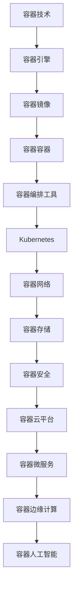
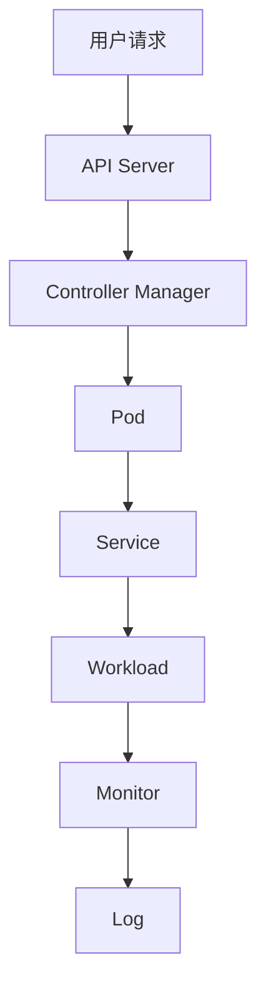
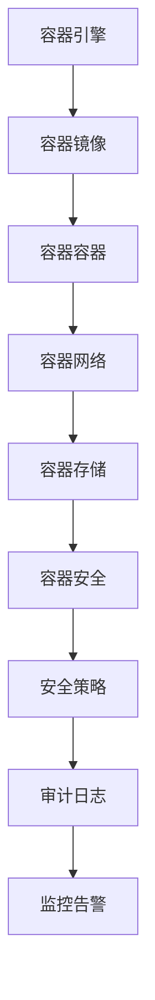
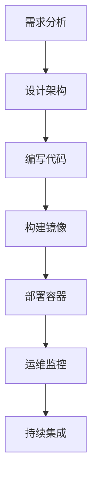
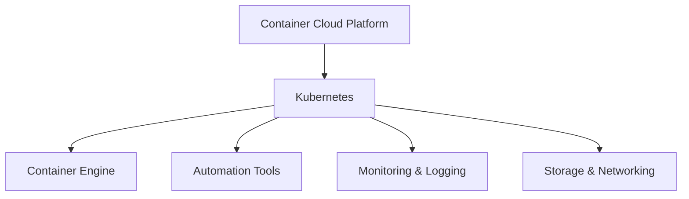

                 

# 容器技术：原理与代码实例讲解

> 关键词：容器技术，Docker，Kubernetes，容器编排，容器安全，微服务架构，容器化项目

> 摘要：本文深入探讨了容器技术的核心原理与实践，包括Docker和Kubernetes的详细解析，容器安全策略，微服务架构设计，以及容器化项目的实战案例。通过逻辑清晰、结构紧凑的讲解，让读者全面理解并掌握容器技术的应用和实践。

## 目录大纲

### 第一部分：容器技术基础

#### 第1章：容器简介与核心概念

1.1 容器的定义与特点

1.2 容器技术的发展历程

1.3 容器技术的核心概念

#### 第2章：Docker容器技术深入解析

2.1 Docker的基本使用

2.2 Dockerfile与自动化构建

2.3 Docker Compose

2.4 Docker网络

2.5 Docker存储

#### 第3章：Kubernetes容器编排与管理

3.1 Kubernetes简介

3.2 Kubernetes集群搭建

3.3 Kubernetes对象

3.4 Kubernetes编排与调度

3.5 Kubernetes网络与存储

#### 第4章：容器安全的防护与实践

4.1 容器安全的挑战与威胁

4.2 容器安全最佳实践

4.3 容器安全工具与应用

#### 第5章：容器化项目实战

5.1 容器化Web应用搭建

5.2 容器化数据库应用部署

5.3 容器化微服务架构设计

#### 第6章：容器云平台应用与实践

6.1 容器云平台概述

6.2 Kubernetes与容器云平台

6.3 容器云平台实战案例

#### 第7章：容器技术的未来发展与趋势

7.1 容器技术的最新发展

7.2 容器技术趋势分析

7.3 容器技术的未来发展预测

### 附录

A. 常用容器命令速查表

B. Docker与Kubernetes常用命令详解

C. 容器技术相关资源推荐

D. 容器技术 Mermaid 流程图

## 容器技术基础

### 第1章：容器简介与核心概念

容器技术的出现，为软件的开发、部署和运维带来了革命性的变化。本章将介绍容器的基本概念、特点，以及与传统虚拟化的区别。

### 1.1 容器的定义与特点

#### 容器的定义

容器（Container）是一种轻量级的、可执行的软件包，它封装了一个应用及其依赖项。容器提供了一个隔离的环境，使得应用可以在各种操作系统、硬件和云环境中一致运行。

#### 容器的特点

1. **轻量级**：容器共享宿主机的操作系统内核，无需额外的操作系统负载，因此比传统虚拟机更加轻量。
2. **可移植性**：容器可以将应用及其依赖项打包到一个独立的文件系统中，从而在不同的环境中轻松移植和部署。
3. **隔离性**：容器提供了资源隔离和命名空间隔离，确保应用之间相互独立，不会互相干扰。
4. **灵活性**：容器允许快速部署和回滚，支持动态扩展和缩减，提高了应用的可伸缩性。
5. **高效性**：容器通过共享宿主机的内核资源，减少了资源消耗，提高了系统效率。

#### 容器与传统虚拟化的区别

1. **资源占用**：容器共享宿主机的操作系统内核，而虚拟机则需要为每个虚拟机分配一个完整的操作系统实例。
2. **性能开销**：容器由于无需额外的操作系统开销，因此在性能上优于虚拟机。
3. **部署速度**：容器可以快速部署，而虚拟机的部署需要更长时间。

### 1.2 容器技术的发展历程

容器技术的发展可以追溯到20世纪90年代的操作系统虚拟化技术，如Chromium和cgroups。随着云计算和微服务架构的兴起，容器技术逐渐成熟并广泛应用。

1. **2000年代初**：Linux容器（LXC）的出现标志着容器技术的起步。
2. **2013年**：Docker项目诞生，推动了容器技术的快速普及。
3. **2015年**：Kubernetes开源，成为容器编排和管理的事实标准。
4. **至今**：容器技术继续发展，新的工具和平台不断涌现，如Kubernetes、Podman、containerd等。

### 1.3 容器技术的核心概念

容器技术涉及多个核心概念，以下将介绍这些概念：

#### 镜像

镜像（Image）是一个静态的、可执行的文件系统，包含了应用及其依赖项。Docker镜像是一种流行的容器镜像格式。

#### 容器引擎

容器引擎（Container Engine）是用于构建、运行和管理容器的软件。常见的容器引擎包括Docker、Podman、containerd等。

#### 容器编排

容器编排（Container Orchestration）是指自动管理容器集群的过程，包括容器的部署、扩展、监控和故障恢复。Kubernetes是目前最流行的容器编排工具。

#### 容器网络

容器网络（Container Networking）是指容器之间的通信和隔离机制。容器网络可以使用虚拟网络、桥接网络等方式实现。

#### 容器存储

容器存储（Container Storage）是指用于容器数据持久化的机制。常见的容器存储解决方案包括Docker卷（Volume）、持久卷（Persistent Volume）等。

### 第2章：Docker容器技术深入解析

Docker是最流行的容器引擎之一，本章将详细介绍Docker的基本使用、Dockerfile与自动化构建、Docker Compose、Docker网络和Docker存储等内容。

### 2.1 Docker的基本使用

Docker的基本使用包括安装与配置、镜像管理和容器管理。以下将分别介绍这些内容。

#### 2.1.1 Docker安装与配置

Docker可以在各种操作系统上安装，以下以Linux操作系统为例：

1. **安装Docker**：
   ```bash
   sudo apt-get update
   sudo apt-get install docker-ce docker-ce-cli containerd.io
   ```

2. **配置Docker**：
   ```bash
   sudo systemctl enable docker
   sudo systemctl start docker
   sudo usermod -aG docker $USER
   ```

#### 2.1.2 Docker镜像管理

Docker镜像管理包括拉取、删除和推送镜像。以下为示例命令：

1. **拉取镜像**：
   ```bash
   docker pull ubuntu:20.04
   ```

2. **删除镜像**：
   ```bash
   docker rmi ubuntu:20.04
   ```

3. **推送镜像**：
   ```bash
   docker login
   docker push my-own-image:latest
   ```

#### 2.1.3 Docker容器管理

Docker容器管理包括创建、启动、停止和删除容器。以下为示例命令：

1. **创建容器**：
   ```bash
   docker run -it ubuntu:20.04 /bin/bash
   ```

2. **启动容器**：
   ```bash
   docker start <container_id>
   ```

3. **停止容器**：
   ```bash
   docker stop <container_id>
   ```

4. **删除容器**：
   ```bash
   docker rm <container_id>
   ```

### 2.2 Dockerfile与自动化构建

Dockerfile是一个包含一系列指令的文本文件，用于定义如何构建Docker镜像。以下为Dockerfile的基本语法和构建与使用示例。

#### 2.2.1 Dockerfile的基本语法

Dockerfile的基本语法包括FROM、RUN、CMD、EXPOSE等指令，以下为示例：

1. **FROM**：指定基础镜像
   ```Dockerfile
   FROM ubuntu:20.04
   ```

2. **RUN**：执行命令
   ```Dockerfile
   RUN apt-get update && apt-get install -y nginx
   ```

3. **CMD**：容器启动时执行的命令
   ```Dockerfile
   CMD ["nginx", "-g", "daemon off;"]
   ```

4. **EXPOSE**：暴露端口
   ```Dockerfile
   EXPOSE 80
   ```

#### 2.2.2 Dockerfile的构建与使用

1. **构建镜像**：
   ```bash
   docker build -t my-nginx:latest .
   ```

2. **运行容器**：
   ```bash
   docker run -d -p 8080:80 my-nginx
   ```

#### 2.2.3 Dockerfile的优化技巧

1. **最小化镜像**：避免在Dockerfile中安装不必要的软件包，减少镜像的大小。
2. **多阶段构建**：使用多阶段构建可以减小最终镜像的尺寸，提高构建效率。

### 2.3 Docker Compose

Docker Compose是一个用于定义和运行多容器应用的工具。本章将介绍Docker Compose的基本概念、文件结构、命令使用等内容。

#### 2.3.1 Docker Compose的基本概念

Docker Compose基于Dockerfile和docker-compose.yml文件，定义了应用程序的容器和服务。以下为基本概念：

1. **项目（Project）**：一个Docker Compose项目包含多个容器和服务。
2. **服务（Service）**：一个服务代表一个容器，可以是一个应用实例或一个数据库实例。
3. **网络（Network）**：Docker Compose可以创建和管理容器网络。
4. **卷（Volume）**：Docker Compose可以创建和管理容器卷。

#### 2.3.2 Docker Compose的文件结构

Docker Compose的配置文件通常名为docker-compose.yml，以下为基本文件结构：

1. **version**：Docker Compose的版本。
2. **services**：定义服务及其配置，如容器名、镜像、端口映射等。
3. **networks**：定义网络及其配置。
4. **volumes**：定义卷及其配置。

#### 2.3.3 Docker Compose的命令使用

Docker Compose的基本命令包括up、down、start、stop、rm等。以下为示例：

1. **启动项目**：
   ```bash
   docker-compose up -d
   ```

2. **停止项目**：
   ```bash
   docker-compose down
   ```

3. **启动单个服务**：
   ```bash
   docker-compose start <service_name>
   ```

4. **停止单个服务**：
   ```bash
   docker-compose stop <service_name>
   ```

### 2.4 Docker网络

Docker网络（Container Networking）是容器之间通信和隔离的机制。本章将介绍Docker网络模式、容器网络配置和网络命名空间等内容。

#### 2.4.1 Docker网络模式

Docker支持多种网络模式，包括：

1. **桥接网络（Bridge）**：默认网络模式，容器通过虚拟网络桥连接到宿主机网络。
2. **主机网络（Host）**：容器直接使用宿主机的网络设备。
3. **自定义网络（Custom）**：用户自定义网络模式，可以定义多个容器网络。
4. **容器网络（Container）**：容器共享同一个网络命名空间，实现容器之间的直接通信。

#### 2.4.2 Docker容器网络配置

容器网络配置包括容器IP地址、端口映射和自定义网络等。以下为示例：

1. **容器IP地址**：
   ```bash
   docker run -it --rm ubuntu:20.04 /bin/bash
   ```

2. **端口映射**：
   ```bash
   docker run -d -p 8080:80 my-nginx
   ```

3. **自定义网络**：
   ```bash
   docker network create my-custom-network
   ```

#### 2.4.3 Docker网络命名空间

Docker网络命名空间（Network Namespace）用于隔离容器之间的网络通信。以下为示例：

1. **查看网络命名空间**：
   ```bash
   docker network ls
   ```

2. **进入网络命名空间**：
   ```bash
   docker exec -it <container_id> /bin/bash
   ```

### 2.5 Docker存储

Docker存储（Container Storage）用于容器数据持久化。本章将介绍Docker卷（Volume）、数据卷容器和容器持久化等内容。

#### 2.5.1 Docker卷（Volume）

Docker卷是用于容器数据持久化的机制，以下为示例：

1. **创建卷**：
   ```bash
   docker volume create my-volume
   ```

2. **查看卷**：
   ```bash
   docker volume ls
   ```

3. **使用卷**：
   ```bash
   docker run -d -v my-volume:/data ubuntu:20.04 /bin/sh -c "while true; do echo Hello from container; sleep 1; done"
   ```

#### 2.5.2 数据卷容器

数据卷容器是一种用于数据共享的容器，以下为示例：

1. **创建数据卷容器**：
   ```bash
   docker create --name data-container ubuntu:20.04 /bin/sh -c "while true; do echo Hello from data container; sleep 1; done"
   ```

2. **链接数据卷容器**：
   ```bash
   docker run --name web-container --volumes-from data-container -d ubuntu:20.04 nginx
   ```

#### 2.5.3 容器持久化

容器持久化是指将容器数据在容器删除后保存到卷中。以下为示例：

1. **持久化容器**：
   ```bash
   docker run -d -P --name web-container -v /webapp my-nginx
   ```

2. **查看持久化容器**：
   ```bash
   docker ps -a
   ```

### 第3章：Kubernetes容器编排与管理

Kubernetes（简称K8s）是最流行的容器编排工具之一，本章将介绍Kubernetes的核心组件、工作原理、集群搭建和对象等内容。

### 3.1 Kubernetes简介

Kubernetes是一个开源的容器编排平台，用于自动化部署、扩展和管理容器化应用程序。以下为Kubernetes的核心特点：

1. **自动化部署**：Kubernetes可以自动化部署应用程序，确保应用程序始终运行在正确的状态。
2. **水平扩展**：Kubernetes可以根据需求自动扩展应用程序的实例数量。
3. **服务发现与负载均衡**：Kubernetes提供了内置的服务发现和负载均衡机制，确保应用程序可以对外提供服务。
4. **自我修复**：Kubernetes可以自动检测并修复应用程序的故障，确保应用程序始终可用。
5. **易于扩展**：Kubernetes支持多种存储系统和网络插件，可以轻松扩展到大规模集群。

### 3.2 Kubernetes的核心组件

Kubernetes由多个核心组件组成，包括：

1. **API Server**：Kubernetes的入口点，负责接收和处理用户的API请求。
2. **Controller Manager**：Kubernetes的控制器，负责监控和管理集群中的资源。
3. **Scheduler**：Kubernetes的调度器，负责将应用程序部署到合适的节点上。
4. **Kubelet**：Kubernetes的工作节点组件，负责与API Server通信，确保容器正常运行。
5. **Kube-Proxy**：Kubernetes的网络代理，负责处理容器之间的网络流量。

### 3.3 Kubernetes的工作原理

Kubernetes的工作原理主要包括以下步骤：

1. **用户提交部署请求**：用户通过kubectl或其他工具向API Server提交部署请求。
2. **API Server处理请求**：API Server接收并处理用户的部署请求，生成相应的资源对象。
3. **Controller Manager处理请求**：Controller Manager负责监控和管理集群中的资源，确保资源对象的状态符合预期。
4. **Scheduler分配资源**：Scheduler根据资源需求，将应用程序部署到合适的节点上。
5. **Kubelet执行任务**：Kubelet接收并执行Scheduler的部署任务，确保容器正常运行。
6. **Kube-Proxy处理网络流量**：Kube-Proxy负责处理容器之间的网络流量，确保应用程序可以对外提供服务。

### 3.4 Kubernetes集群搭建

Kubernetes集群的搭建包括安装和配置Kubernetes组件。以下以Linux操作系统为例，介绍Kubernetes集群的搭建过程：

1. **安装Docker**：
   ```bash
   sudo apt-get update
   sudo apt-get install docker-ce docker-ce-cli containerd.io
   ```

2. **配置Docker**：
   ```bash
   sudo systemctl enable docker
   sudo systemctl start docker
   sudo usermod -aG docker $USER
   ```

3. **安装Kubernetes**：
   ```bash
   sudo apt-get update
   sudo apt-get install -y apt-transport-https ca-certificates curl
   sudo curl -s https://packages.cloud.google.com/apt/doc/apt-key.gpg | sudo apt-key add -
   sudo echo "deb https://apt.kubernetes.io/ kubernetes-xenial main" | sudo tee -a /etc/apt/sources.list.d/kubernetes.list
   sudo apt-get update
   sudo apt-get install -y kubelet kubeadm kubectl
   sudo systemctl enable kubelet
   sudo systemctl start kubelet
   ```

4. **初始化集群**：
   ```bash
   sudo kubeadm init --pod-network-cidr=10.244.0.0/16
   sudo mkdir -p $HOME/.kube
   sudo cp -i /etc/kubernetes/admin.conf $HOME/.kube/config
   sudo chown $(id -u):$(id -g) $HOME/.kube/config
   ```

5. **安装网络插件**：
   ```bash
   kubectl apply -f https://docs.projectcalico.org/manifests/calico.yaml
   ```

6. **验证集群状态**：
   ```bash
   kubectl get nodes
   kubectl get pods --all-namespaces
   ```

### 3.5 Kubernetes对象

Kubernetes对象（Kubernetes Object）是Kubernetes中的基本构建块，包括：

1. **Pod**：Pod是Kubernetes中最基本的调度单位，包含一个或多个容器。
2. **Service**：Service是用于暴露Pod的抽象层，提供负载均衡和发现机制。
3. **Deployment**：Deployment用于管理和部署应用程序的副本，提供滚动更新和回滚功能。
4. **Ingress**：Ingress用于管理集群中外部访问服务，提供基于HTTP的负载均衡。
5. **StatefulSet**：StatefulSet用于管理有状态应用程序的副本，提供稳定的网络标识和持久存储。

### 3.6 Kubernetes编排与调度

Kubernetes的编排与调度主要包括：

1. **调度策略**：Kubernetes的调度器根据资源需求和策略，将应用程序部署到合适的节点上。
2. **自动扩缩容**：Kubernetes可以根据负载自动调整应用程序的副本数量。
3. **故障转移与恢复**：Kubernetes可以自动检测并恢复应用程序的故障。

### 3.7 Kubernetes网络与存储

Kubernetes的网络与存储主要包括：

1. **网络策略**：Kubernetes提供了网络隔离和流量控制机制，确保容器之间的通信安全。
2. **存储类与持久卷**：Kubernetes提供了多种存储解决方案，包括本地存储、网络存储和云存储。

## 第4章：容器安全的防护与实践

随着容器技术的普及，容器安全成为了一个重要的议题。本章将介绍容器安全的挑战与威胁，以及容器安全的最佳实践。

### 4.1 容器安全的挑战与威胁

容器安全面临的挑战和威胁包括：

1. **镜像安全**：容器镜像可能包含恶意代码、已知漏洞或未知的恶意软件。
2. **容器逃逸**：攻击者可能利用容器逃逸技术，突破容器的隔离机制，获取宿主机的控制权限。
3. **权限提升**：容器中的应用程序可能具有比预期更高的权限，导致安全风险。
4. **网络攻击**：容器之间的网络通信可能成为攻击目标，导致数据泄露或网络瘫痪。
5. **配置错误**：容器配置错误可能导致安全漏洞，如开放未授权的端口、未加密的通信等。

### 4.2 容器安全最佳实践

为了确保容器安全，以下是一些最佳实践：

1. **使用可信镜像**：从可信来源获取容器镜像，如官方仓库或认证的第三方仓库。
2. **镜像扫描**：定期扫描容器镜像，检测已知漏洞和恶意软件。
3. **最小权限原则**：为容器中的应用程序分配最低必要权限，避免权限提升风险。
4. **网络隔离**：使用网络策略和隔离机制，限制容器之间的网络通信。
5. **加密通信**：使用加密协议和证书，确保容器之间的通信安全。
6. **日志审计**：记录容器操作日志，以便监控和审计容器行为。
7. **安全配置**：遵循容器安全最佳实践，确保容器配置安全。
8. **安全工具**：使用容器安全工具，如容器安全扫描器、安全代理等。

### 4.3 容器安全工具与应用

常见的容器安全工具包括：

1. **容器镜像扫描工具**：如Clair、Docker Bench for Security、Trivy等。
2. **容器安全防护工具**：如Docker Content Trust、AppArmor、SELinux等。
3. **容器安全审计工具**：如Aqua Security、Twistlock、Cascading等。

## 第5章：容器化项目实战

本章将介绍容器化Web应用搭建、容器化数据库应用部署和容器化微服务架构设计等内容，通过实际案例讲解容器化项目的构建和部署。

### 5.1 容器化Web应用搭建

容器化Web应用搭建主要包括以下步骤：

1. **编写应用代码**：编写Web应用程序的代码，如使用Python、Java或Node.js等。
2. **构建容器镜像**：使用Dockerfile构建应用程序的容器镜像。
3. **运行容器**：使用docker run命令运行容器，并映射端口。
4. **容器化部署**：将容器部署到Kubernetes集群中，使用Deployment管理容器副本。

以下为一个简单的Web应用容器化案例：

**步骤1：编写应用代码**

在本地计算机上编写一个简单的Python Web应用，代码如下：

```python
# app.py
from flask import Flask
app = Flask(__name__)

@app.route('/')
def hello():
    return 'Hello, World!'

if __name__ == '__main__':
    app.run(host='0.0.0.0', port=8080)
```

**步骤2：构建容器镜像**

创建一个名为Dockerfile的文件，内容如下：

```Dockerfile
# Dockerfile
FROM python:3.8-slim
WORKDIR /app
COPY . .
RUN pip install -r requirements.txt
CMD ["python", "app.py"]
```

执行以下命令构建容器镜像：

```bash
docker build -t my-web-app:latest .
```

**步骤3：运行容器**

使用以下命令运行容器，并映射端口：

```bash
docker run -d -p 8080:8080 my-web-app
```

**步骤4：容器化部署**

将容器部署到Kubernetes集群中，创建一个名为deployment.yml的文件，内容如下：

```yaml
# deployment.yml
apiVersion: apps/v1
kind: Deployment
metadata:
  name: web-app
spec:
  replicas: 1
  selector:
    matchLabels:
      app: web-app
  template:
    metadata:
      labels:
        app: web-app
    spec:
      containers:
      - name: web-app
        image: my-web-app:latest
        ports:
        - containerPort: 8080
```

执行以下命令部署容器：

```bash
kubectl apply -f deployment.yml
```

### 5.2 容器化数据库应用部署

容器化数据库应用部署主要包括以下步骤：

1. **选择数据库**：选择一个合适的数据库，如MySQL、PostgreSQL或MongoDB等。
2. **构建容器镜像**：使用Dockerfile构建数据库的容器镜像。
3. **运行容器**：使用docker run命令运行数据库容器，并配置数据持久化。
4. **容器化部署**：将数据库容器部署到Kubernetes集群中，使用StatefulSet管理数据库实例。

以下为一个简单的MySQL数据库容器化案例：

**步骤1：构建容器镜像**

创建一个名为Dockerfile的文件，内容如下：

```Dockerfile
# Dockerfile
FROM mysql:8.0
COPY initdb.sh /docker-entrypoint-initdb.d/
EXPOSE 3306
CMD ["docker-entrypoint.sh", "--character-set-server=utf8mb4", "--collation-server=utf8mb4_unicode_ci"]
```

创建一个名为initdb.sh的文件，内容如下：

```bash
# initdb.sh
#!/bin/sh
set -e

# Initialize database
mysqllep -uroot -e "CREATE DATABASE IF NOT EXISTS mydb CHARACTER SET utf8mb4 COLLATE utf8mb4_unicode_ci;"
```

执行以下命令构建容器镜像：

```bash
docker build -t my-mysql:latest .
```

**步骤2：运行容器**

使用以下命令运行容器，并配置数据持久化：

```bash
docker run -d -p 3306:3306 --name my-mysql -v my-mysql-data:/var/lib/mysql my-mysql
```

**步骤3：容器化部署**

将数据库容器部署到Kubernetes集群中，创建一个名为statefulset.yml的文件，内容如下：

```yaml
# statefulset.yml
apiVersion: apps/v1
kind: StatefulSet
metadata:
  name: mysql
spec:
  serviceName: "mysql"
  replicas: 1
  selector:
    matchLabels:
      app: mysql
  template:
    metadata:
      labels:
        app: mysql
    spec:
      containers:
      - name: mysql
        image: my-mysql:latest
        ports:
        - containerPort: 3306
        volumeMounts:
        - name: mysql-persistent-storage
          mountPath: /var/lib/mysql
  volumeClaimTemplates:
  - metadata:
      name: mysql-persistent-storage
    spec:
      accessModes: [ "ReadWriteOnce" ]
      resources:
        requests:
          storage: 1Gi
```

执行以下命令部署容器：

```bash
kubectl apply -f statefulset.yml
```

### 5.3 容器化微服务架构设计

容器化微服务架构设计主要包括以下步骤：

1. **设计微服务**：分析业务需求，将应用程序划分为独立的微服务。
2. **构建微服务容器镜像**：使用Dockerfile构建每个微服务的容器镜像。
3. **部署微服务容器**：将微服务容器部署到Kubernetes集群中，使用Service和Ingress实现服务发现和负载均衡。
4. **配置服务注册与发现**：使用服务注册与发现工具，如Consul或Eureka等，实现微服务之间的通信。

以下为一个简单的微服务容器化案例：

**步骤1：设计微服务**

假设有一个用户服务（User Service）和一个订单服务（Order Service），用户服务负责处理用户相关的功能，订单服务负责处理订单相关的功能。

**步骤2：构建微服务容器镜像**

创建一个名为Dockerfile的文件，内容如下：

```Dockerfile
# Dockerfile
FROM node:14
WORKDIR /app
COPY package*.json ./
RUN npm install
COPY . .
CMD [ "node", "index.js" ]
```

执行以下命令构建用户服务的容器镜像：

```bash
docker build -t user-service:latest .
```

执行以下命令构建订单服务的容器镜像：

```bash
docker build -t order-service:latest .
```

**步骤3：部署微服务容器**

将用户服务和订单服务容器部署到Kubernetes集群中，创建一个名为deployment.yml的文件，内容如下：

```yaml
# deployment.yml
apiVersion: apps/v1
kind: Deployment
metadata:
  name: user-service
spec:
  replicas: 1
  selector:
    matchLabels:
      app: user-service
  template:
    metadata:
      labels:
        app: user-service
    spec:
      containers:
      - name: user-service
        image: user-service:latest
        ports:
        - containerPort: 3000
---
apiVersion: apps/v1
kind: Deployment
metadata:
  name: order-service
spec:
  replicas: 1
  selector:
    matchLabels:
      app: order-service
  template:
    metadata:
      labels:
        app: order-service
    spec:
      containers:
      - name: order-service
        image: order-service:latest
        ports:
        - containerPort: 4000
```

执行以下命令部署容器：

```bash
kubectl apply -f deployment.yml
```

创建一个名为service.yml的文件，内容如下：

```yaml
# service.yml
apiVersion: v1
kind: Service
metadata:
  name: user-service
spec:
  selector:
    app: user-service
  ports:
  - name: http
    port: 80
    targetPort: 3000
  type: LoadBalancer
---
apiVersion: v1
kind: Service
metadata:
  name: order-service
spec:
  selector:
    app: order-service
  ports:
  - name: http
    port: 80
    targetPort: 4000
  type: LoadBalancer
```

执行以下命令部署服务：

```bash
kubectl apply -f service.yml
```

**步骤4：配置服务注册与发现**

使用Consul作为服务注册与发现工具，创建一个名为consul.yml的文件，内容如下：

```yaml
# consul.yml
apiVersion: v1
kind: Deployment
metadata:
  name: consul
spec:
  replicas: 1
  selector:
    matchLabels:
      app: consul
  template:
    metadata:
      labels:
        app: consul
    spec:
      containers:
      - name: consul
        image: consul:1.10.3
        ports:
        - containerPort: 8500
---
apiVersion: v1
kind: Service
metadata:
  name: consul
spec:
  selector:
    app: consul
  ports:
  - name: http
    port: 8500
    targetPort: 8500
  type: ClusterIP
```

执行以下命令部署Consul：

```bash
kubectl apply -f consul.yml
```

在Consul中注册服务：

```bash
consul register -service-name=user-service -service-address=user-service -service-port=3000
consul register -service-name=order-service -service-address=order-service -service-port=4000
```

## 第6章：容器云平台应用与实践

容器云平台（Container Cloud Platform）是利用容器技术构建的云计算平台，提供容器服务、自动化部署、弹性伸缩等功能。本章将介绍容器云平台的概念、Kubernetes与容器云平台的关系，以及容器云平台的实战案例。

### 6.1 容器云平台概述

容器云平台是指利用容器技术构建的云计算平台，提供容器服务、自动化部署、弹性伸缩等功能。容器云平台的特点包括：

1. **高可用性**：容器云平台通过分布式架构和故障转移机制，确保服务的持续可用。
2. **弹性伸缩**：容器云平台可以根据负载自动扩展或缩减容器实例，提高资源利用率。
3. **自动化部署**：容器云平台提供自动化部署和回滚机制，简化了应用程序的部署和运维。
4. **资源管理**：容器云平台提供资源管理功能，包括容器、网络、存储等资源的动态分配和释放。

### 6.2 Kubernetes与容器云平台

Kubernetes是容器云平台的核心组件，负责容器编排、调度和管理。Kubernetes与容器云平台的关系包括：

1. **Kubernetes集群**：容器云平台由一个或多个Kubernetes集群组成，每个集群包含多个节点，用于运行容器实例。
2. **Kubernetes服务**：容器云平台提供Kubernetes服务，包括API Server、Controller Manager、Scheduler等，负责容器编排和管理。
3. **Kubernetes插件**：容器云平台使用Kubernetes插件，如网络插件（如Calico）、存储插件（如Rook）等，提供丰富的功能。

### 6.3 容器云平台实战案例

以下是一个简单的容器云平台实战案例：

**步骤1：搭建Kubernetes集群**

使用Minikube或Kubeadm搭建一个Kubernetes集群，具体步骤参考第3章。

**步骤2：部署容器应用**

部署一个简单的Web应用，如Nginx。创建一个名为deployment.yml的文件，内容如下：

```yaml
# deployment.yml
apiVersion: apps/v1
kind: Deployment
metadata:
  name: web-app
spec:
  replicas: 3
  selector:
    matchLabels:
      app: web-app
  template:
    metadata:
      labels:
        app: web-app
    spec:
      containers:
      - name: web-app
        image: nginx:latest
        ports:
        - containerPort: 80
```

执行以下命令部署容器：

```bash
kubectl apply -f deployment.yml
```

**步骤3：扩展容器实例**

根据负载需求，扩展Web应用的容器实例数量。执行以下命令扩展容器实例：

```bash
kubectl scale deployment/web-app --replicas=5
```

**步骤4：监控容器状态**

使用Kubernetes监控工具（如Prometheus、Grafana）监控容器状态和性能，确保容器正常运行。

**步骤5：容器云平台运维**

使用容器云平台提供的运维工具（如Kubeadm、Helm）进行容器云平台的运维和管理，包括集群升级、节点维护等。

## 第7章：容器技术的未来发展与趋势

容器技术自问世以来，经历了快速的发展和广泛的应用。本章将探讨容器技术的最新发展、趋势分析以及未来发展的预测。

### 7.1 容器技术的最新发展

容器技术的最新发展包括以下几个方面：

1. **Kubernetes的成熟**：Kubernetes已成为容器编排和管理的事实标准，社区活跃度持续升高，功能不断完善。
2. **容器技术的创新**：容器运行时（如containerd、CRI-O）的创新，提高了容器技术的性能和可扩展性。
3. **服务网格技术**：服务网格（如Istio、Linkerd）的兴起，为容器化微服务提供了更丰富的功能，如流量管理、安全性等。
4. **容器云平台**：容器云平台（如Kubernetes、OpenShift、Terraform）的发展，为容器化应用提供了更高效的部署和管理方案。

### 7.2 容器技术趋势分析

容器技术的未来趋势分析包括以下几个方面：

1. **容器技术与云计算的融合**：容器技术将继续与云计算紧密结合，推动云计算服务的创新和优化。
2. **容器技术在边缘计算中的应用**：随着边缘计算的发展，容器技术将在边缘设备上得到更广泛的应用，提高边缘计算的性能和效率。
3. **容器技术在人工智能领域的拓展**：容器技术为人工智能应用提供了灵活的部署和扩展方案，将推动人工智能技术的发展和应用。

### 7.3 容器技术的未来发展预测

容器技术的未来发展预测包括以下几个方面：

1. **市场前景**：容器技术将继续保持快速增长，预计到2025年，容器市场规模将达到数百亿美元。
2. **产业生态**：容器技术的产业生态将不断完善，包括容器平台、工具、服务和培训等。
3. **工作方式的影响**：容器技术的普及将改变传统的软件开发和运维方式，推动DevOps文化的进一步发展。

## 附录

### 附录 A：常用容器命令速查表

| 命令                 | 说明                     | 示例                                   |
|----------------------|--------------------------|----------------------------------------|
| docker pull          | 拉取容器镜像             | docker pull ubuntu:20.04               |
| docker run           | 运行容器                 | docker run -d -p 8080:80 my-nginx       |
| docker ps            | 查看运行中的容器         | docker ps                               |
| docker stop          | 停止容器                 | docker stop <container_id>              |
| docker rm            | 删除容器                 | docker rm <container_id>                |
| docker exec          | 进入容器                 | docker exec -it <container_id> /bin/bash |
| docker build         | 构建容器镜像             | docker build -t my-image .              |
| docker image ls      | 列出本地容器镜像         | docker image ls                         |
| docker image rm      | 删除本地容器镜像         | docker image rm <image_id>              |
| docker login         | 登录Docker Hub            | docker login                           |
| docker push          | 推送容器镜像到Docker Hub | docker push my-own-image:latest         |
| docker network ls    | 列出所有网络             | docker network ls                       |
| docker network create | 创建网络                 | docker network create my-network         |
| docker volume ls     | 列出所有卷               | docker volume ls                        |
| docker volume create | 创建卷                   | docker volume create my-volume           |

### 附录 B：Docker与Kubernetes常用命令详解

#### Docker常用命令详解

| 命令                 | 说明                                                         | 示例                                                         |
|----------------------|--------------------------------------------------------------|--------------------------------------------------------------|
| docker pull          | 从Docker Hub或其他仓库拉取镜像                               | docker pull ubuntu:20.04                                      |
| docker build         | 使用Dockerfile构建容器镜像                                   | docker build -t my-image .                                     |
| docker run           | 运行一个新的容器实例                                         | docker run -d -p 8080:80 my-nginx                              |
| docker exec          | 进入一个正在运行的容器                                      | docker exec -it <container_id> /bin/bash                        |
| docker ps            | 列出当前所有正在运行的容器                                   | docker ps                                                      |
| docker stop          | 停止一个运行中的容器                                        | docker stop <container_id>                                      |
| docker rm            | 删除一个或多个容器                                          | docker rm <container_id>                                        |
| docker logs          | 获取容器日志                                                 | docker logs <container_id>                                      |
| docker cp            | 从容器中拷贝文件到宿主机或从宿主机拷贝文件到容器               | docker cp <container_id>:/path/to/file /path/to/file           |
| docker restart       | 重启一个或多个容器                                          | docker restart <container_id>                                   |
| docker pause         | 暂停一个或多个容器                                          | docker pause <container_id>                                     |
| docker unpause       | 恢复一个或多个容器的运行状态                                 | docker unpause <container_id>                                   |
| docker attach        | 连接到一个运行中的容器                                      | docker attach <container_id>                                    |
| docker port          | 查看容器暴露的端口                                           | docker port <container_id> <private_port>                       |
| docker events        | 查看容器的事件流                                             | docker events                                                   |
| docker inspect       | 查看容器的配置和状态详情                                     | docker inspect <container_id>                                   |

#### Kubernetes常用命令详解

| 命令                 | 说明                                                         | 示例                                                         |
|----------------------|--------------------------------------------------------------|--------------------------------------------------------------|
| kubectl get pods     | 查看当前所有或指定命名空间的Pod                             | kubectl get pods                                              |
| kubectl create       | 创建新的资源对象                                             | kubectl create -f <filename.yaml>                             |
| kubectl apply        | 应用于现有资源对象，更新其配置                               | kubectl apply -f <filename.yaml>                              |
| kubectl delete       | 删除资源对象                                                 | kubectl delete -f <filename.yaml>                              |
| kubectl describe     | 显示资源对象的详细信息                                       | kubectl describe pods <pod_name>                               |
| kubectl exec         | 在一个容器中执行命令                                         | kubectl exec <pod_name> -- <command>                          |
| kubectl logs         | 获取容器的日志                                               | kubectl logs <pod_name>                                       |
| kubectl port-forward | 将本地端口映射到Pod的一个端口                                 | kubectl port-forward <pod_name> <local_port>:<remote_port>    |
| kubectl proxy        | 启动Kubernetes API服务器代理，允许集群内部通信                | kubectl proxy --accept-hosts='^localhost$' &                   |
| kubectl scale        | 扩展或缩减Deployments、ReplicaSets和StatefulSets中的Pod数量 | kubectl scale deployment <deployment_name> --replicas=<num>   |
| kubectl expose       | 创建一个新的Service，将Pod暴露给外部网络                     | kubectl expose deployment <deployment_name> --type=LoadBalancer|
| kubectl rollout      | 管理部署的滚动更新                                           | kubectl rollout status deployment <deployment_name>            |

### 附录 C：容器技术相关资源推荐

1. **官方文档**：
   - Docker官方文档：https://docs.docker.com/
   - Kubernetes官方文档：https://kubernetes.io/docs/
2. **学习资料**：
   - 《Docker实战》：https://book.douban.com/subject/25945648/
   - 《Kubernetes权威指南》：https://book.douban.com/subject/35147178/
3. **社区与论坛**：
   - Docker社区：https://www.docker.com/community
   - Kubernetes社区：https://kubernetes.io/community/
4. **博客与文章**：
   - Docker官方博客：https://www.docker.com/blog/
   - Kubernetes官方博客：https://kubernetes.io/blog/
5. **工具与平台**：
   - Helm：https://helm.sh/
   - Kubectl插件：https://kubernetes.io/docs/tasks/extend-kubectl/kubectl-plugins/
6. **开源项目**：
   - Istio：https://istio.io/
   - Linkerd：https://linkerd.io/

## 附录 D：容器技术 Mermaid 流程图

### 附录 D.1 容器技术的整体架构



### 附录 D.2 Kubernetes工作原理



### 附录 D.3 容器安全架构



### 附录 D.4 容器化项目流程



## 作者信息

作者：AI天才研究院/AI Genius Institute & 禅与计算机程序设计艺术 /Zen And The Art of Computer Programming

## 文章标题：容器技术：原理与代码实例讲解

关键词：容器技术，Docker，Kubernetes，容器编排，容器安全，微服务架构，容器化项目

摘要：本文深入探讨了容器技术的核心原理与实践，包括Docker和Kubernetes的详细解析，容器安全策略，微服务架构设计，以及容器化项目的实战案例。通过逻辑清晰、结构紧凑的讲解，让读者全面理解并掌握容器技术的应用和实践。

### 第一部分：容器技术基础

#### 第1章：容器简介与核心概念

容器技术的出现，为软件的开发、部署和运维带来了革命性的变化。本章将介绍容器的基本概念、特点，以及与传统虚拟化的区别。

##### 1.1 容器的定义与特点

容器（Container）是一种轻量级的、可执行的软件包，它封装了一个应用及其依赖项。容器提供了一个隔离的环境，使得应用可以在各种操作系统、硬件和云环境中一致运行。

**容器特点**：

1. **轻量级**：容器共享宿主机的操作系统内核，无需额外的操作系统负载，因此比传统虚拟机更加轻量。
2. **可移植性**：容器可以将应用及其依赖项打包到一个独立的文件系统中，从而在不同的环境中轻松移植和部署。
3. **隔离性**：容器提供了资源隔离和命名空间隔离，确保应用之间相互独立，不会互相干扰。
4. **灵活性**：容器允许快速部署和回滚，支持动态扩展和缩减，提高了应用的可伸缩性。
5. **高效性**：容器通过共享宿主机的内核资源，减少了资源消耗，提高了系统效率。

**容器与传统虚拟化的区别**：

1. **资源占用**：容器共享宿主机的操作系统内核，而虚拟机则需要为每个虚拟机分配一个完整的操作系统实例。
2. **性能开销**：容器由于无需额外的操作系统开销，因此在性能上优于虚拟机。
3. **部署速度**：容器可以快速部署，而虚拟机的部署需要更长时间。

##### 1.2 容器技术的发展历程

容器技术的发展可以追溯到20世纪90年代的操作系统虚拟化技术，如Chromium和cgroups。随着云计算和微服务架构的兴起，容器技术逐渐成熟并广泛应用。

1. **2000年代初**：Linux容器（LXC）的出现标志着容器技术的起步。
2. **2013年**：Docker项目诞生，推动了容器技术的快速普及。
3. **2015年**：Kubernetes开源，成为容器编排和管理的事实标准。
4. **至今**：容器技术继续发展，新的工具和平台不断涌现，如Kubernetes、Podman、containerd等。

##### 1.3 容器技术的核心概念

容器技术涉及多个核心概念，以下将介绍这些概念：

**镜像**

镜像（Image）是一个静态的、可执行的文件系统，包含了应用及其依赖项。Docker镜像是一种流行的容器镜像格式。

**容器引擎**

容器引擎（Container Engine）是用于构建、运行和管理容器的软件。常见的容器引擎包括Docker、Podman、containerd等。

**容器编排**

容器编排（Container Orchestration）是指自动管理容器集群的过程，包括容器的部署、扩展、监控和故障恢复。Kubernetes是目前最流行的容器编排工具。

**容器网络**

容器网络（Container Networking）是指容器之间的通信和隔离机制。容器网络可以使用虚拟网络、桥接网络等方式实现。

**容器存储**

容器存储（Container Storage）是指用于容器数据持久化的机制。常见的容器存储解决方案包括Docker卷（Volume）、持久卷（Persistent Volume）等。

### 第二部分：Docker容器技术深入解析

#### 第2章：Docker容器技术深入解析

Docker是最流行的容器引擎之一，本章将详细介绍Docker的基本使用、Dockerfile与自动化构建、Docker Compose、Docker网络和Docker存储等内容。

##### 2.1 Docker的基本使用

Docker的基本使用包括安装与配置、镜像管理和容器管理。以下将分别介绍这些内容。

**2.1.1 Docker安装与配置**

Docker可以在各种操作系统上安装，以下以Linux操作系统为例：

1. **安装Docker**：
```bash
sudo apt-get update
sudo apt-get install docker-ce docker-ce-cli containerd.io
```

2. **配置Docker**：
```bash
sudo systemctl enable docker
sudo systemctl start docker
sudo usermod -aG docker $USER
```

**2.1.2 Docker镜像管理**

Docker镜像管理包括拉取、删除和推送镜像。以下为示例命令：

1. **拉取镜像**：
```bash
docker pull ubuntu:20.04
```

2. **删除镜像**：
```bash
docker rmi ubuntu:20.04
```

3. **推送镜像**：
```bash
docker login
docker push my-own-image:latest
```

**2.1.3 Docker容器管理**

Docker容器管理包括创建、启动、停止和删除容器。以下为示例命令：

1. **创建容器**：
```bash
docker run -it ubuntu:20.04 /bin/bash
```

2. **启动容器**：
```bash
docker start <container_id>
```

3. **停止容器**：
```bash
docker stop <container_id>
```

4. **删除容器**：
```bash
docker rm <container_id>
```

##### 2.2 Dockerfile与自动化构建

Dockerfile是一个包含一系列指令的文本文件，用于定义如何构建Docker镜像。以下为Dockerfile的基本语法和构建与使用示例。

**2.2.1 Dockerfile的基本语法**

Dockerfile的基本语法包括FROM、RUN、CMD、EXPOSE等指令，以下为示例：

1. **FROM**：指定基础镜像
   ```Dockerfile
   FROM ubuntu:20.04
   ```

2. **RUN**：执行命令
   ```Dockerfile
   RUN apt-get update && apt-get install -y nginx
   ```

3. **CMD**：容器启动时执行的命令
   ```Dockerfile
   CMD ["nginx", "-g", "daemon off;"]
   ```

4. **EXPOSE**：暴露端口
   ```Dockerfile
   EXPOSE 80
   ```

**2.2.2 Dockerfile的构建与使用**

1. **构建镜像**：
```bash
docker build -t my-nginx:latest .
```

2. **运行容器**：
```bash
docker run -d -p 8080:80 my-nginx
```

**2.2.3 Dockerfile的优化技巧**

1. **最小化镜像**：避免在Dockerfile中安装不必要的软件包，减少镜像的大小。
2. **多阶段构建**：使用多阶段构建可以减小最终镜像的尺寸，提高构建效率。

##### 2.3 Docker Compose

Docker Compose是一个用于定义和运行多容器应用的工具。本章将介绍Docker Compose的基本概念、文件结构、命令使用等内容。

**2.3.1 Docker Compose的基本概念**

Docker Compose基于Dockerfile和docker-compose.yml文件，定义了应用程序的容器和服务。以下为基本概念：

1. **项目（Project）**：一个Docker Compose项目包含多个容器和服务。
2. **服务（Service）**：一个服务代表一个容器，可以是一个应用实例或一个数据库实例。
3. **网络（Network）**：Docker Compose可以创建和管理容器网络。
4. **卷（Volume）**：Docker Compose可以创建和管理容器卷。

**2.3.2 Docker Compose的文件结构**

Docker Compose的配置文件通常名为docker-compose.yml，以下为基本文件结构：

1. **version**：Docker Compose的版本。
2. **services**：定义服务及其配置，如容器名、镜像、端口映射等。
3. **networks**：定义网络及其配置。
4. **volumes**：定义卷及其配置。

**2.3.3 Docker Compose的命令使用**

Docker Compose的基本命令包括up、down、start、stop、rm等。以下为示例：

1. **启动项目**：
```bash
docker-compose up -d
```

2. **停止项目**：
```bash
docker-compose down
```

3. **启动单个服务**：
```bash
docker-compose start <service_name>
```

4. **停止单个服务**：
```bash
docker-compose stop <service_name>
```

##### 2.4 Docker网络

Docker网络（Container Networking）是容器之间通信和隔离的机制。本章将介绍Docker网络模式、容器网络配置和网络命名空间等内容。

**2.4.1 Docker网络模式**

Docker支持多种网络模式，包括：

1. **桥接网络（Bridge）**：默认网络模式，容器通过虚拟网络桥连接到宿主机网络。
2. **主机网络（Host）**：容器直接使用宿主机的网络设备。
3. **自定义网络（Custom）**：用户自定义网络模式，可以定义多个容器网络。
4. **容器网络（Container）**：容器共享同一个网络命名空间，实现容器之间的直接通信。

**2.4.2 Docker容器网络配置**

容器网络配置包括容器IP地址、端口映射和自定义网络等。以下为示例：

1. **容器IP地址**：
```bash
docker run -it --rm ubuntu:20.04 /bin/bash
```

2. **端口映射**：
```bash
docker run -d -p 8080:80 my-nginx
```

3. **自定义网络**：
```bash
docker network create my-custom-network
```

**2.4.3 Docker网络命名空间**

Docker网络命名空间（Network Namespace）用于隔离容器之间的网络通信。以下为示例：

1. **查看网络命名空间**：
```bash
docker network ls
```

2. **进入网络命名空间**：
```bash
docker exec -it <container_id> /bin/bash
```

##### 2.5 Docker存储

Docker存储（Container Storage）用于容器数据持久化。本章将介绍Docker卷（Volume）、数据卷容器和容器持久化等内容。

**2.5.1 Docker卷（Volume）**

Docker卷是用于容器数据持久化的机制，以下为示例：

1. **创建卷**：
```bash
docker volume create my-volume
```

2. **查看卷**：
```bash
docker volume ls
```

3. **使用卷**：
```bash
docker run -d -v my-volume:/data ubuntu:20.04 /bin/sh -c "while true; do echo Hello from container; sleep 1; done"
```

**2.5.2 数据卷容器**

数据卷容器是一种用于数据共享的容器，以下为示例：

1. **创建数据卷容器**：
```bash
docker create --name data-container ubuntu:20.04 /bin/sh -c "while true; do echo Hello from data container; sleep 1; done"
```

2. **链接数据卷容器**：
```bash
docker run --name web-container --volumes-from data-container -d ubuntu:20.04 nginx
```

**2.5.3 容器持久化**

容器持久化是指将容器数据在容器删除后保存到卷中。以下为示例：

1. **持久化容器**：
```bash
docker run -d -P --name web-container -v /webapp my-nginx
```

2. **查看持久化容器**：
```bash
docker ps -a
```

### 第三部分：Kubernetes容器编排与管理

Kubernetes（简称K8s）是最流行的容器编排工具之一，本章将介绍Kubernetes的核心组件、工作原理、集群搭建和对象等内容。

#### 第3章：Kubernetes容器编排与管理

Kubernetes由多个核心组件组成，包括：

1. **API Server**：Kubernetes的入口点，负责接收和处理用户的API请求。
2. **Controller Manager**：Kubernetes的控制器，负责监控和管理集群中的资源。
3. **Scheduler**：Kubernetes的调度器，负责将应用程序部署到合适的节点上。
4. **Kubelet**：Kubernetes的工作节点组件，负责与API Server通信，确保容器正常运行。
5. **Kube-Proxy**：Kubernetes的网络代理，负责处理容器之间的网络流量。

##### 3.1 Kubernetes简介

Kubernetes是一个开源的容器编排平台，用于自动化部署、扩展和管理容器化应用程序。以下为Kubernetes的核心特点：

1. **自动化部署**：Kubernetes可以自动化部署应用程序，确保应用程序始终运行在正确的状态。
2. **水平扩展**：Kubernetes可以根据需求自动扩展应用程序的实例数量。
3. **服务发现与负载均衡**：Kubernetes提供了内置的服务发现和负载均衡机制，确保应用程序可以对外提供服务。
4. **自我修复**：Kubernetes可以自动检测并修复应用程序的故障，确保应用程序始终可用。
5. **易于扩展**：Kubernetes支持多种存储系统和网络插件，可以轻松扩展到大规模集群。

##### 3.2 Kubernetes的核心组件

Kubernetes由多个核心组件组成，包括：

1. **API Server**：API Server是Kubernetes的入口点，负责接收和处理用户的API请求。它提供了RESTful接口，允许用户通过kubectl或其他工具与Kubernetes集群进行交互。

2. **Controller Manager**：Controller Manager是Kubernetes的核心控制器，负责监控和管理集群中的资源。它包含多个控制器，如EndpointController、ReplicaController、ServiceAccountController等，分别负责处理不同类型的资源。

3. **Scheduler**：Scheduler是Kubernetes的调度器，负责将应用程序部署到合适的节点上。它根据节点资源需求和策略，选择最佳的节点进行部署。

4. **Kubelet**：Kubelet是运行在各个工作节点上的组件，负责与API Server通信，确保容器正常运行。它负责容器编排、资源监控、健康检查和日志记录等任务。

5. **Kube-Proxy**：Kube-Proxy是Kubernetes的网络代理，负责处理容器之间的网络流量。它实现了一个基于iptables的负载均衡器，确保容器可以互相通信。

##### 3.3 Kubernetes的工作原理

Kubernetes的工作原理主要包括以下步骤：

1. **用户提交部署请求**：用户通过kubectl或其他工具向API Server提交部署请求。

2. **API Server处理请求**：API Server接收并处理用户的部署请求，生成相应的资源对象（如Pod、Service等），并将这些对象存储在Etcd中。

3. **Controller Manager处理请求**：Controller Manager负责监控和管理集群中的资源。它通过轮询Etcd中的资源对象，检测资源对象的状态是否符合预期，并采取相应的行动。

4. **Scheduler分配资源**：Scheduler根据资源需求，将应用程序部署到合适的节点上。它考虑节点的资源使用情况、策略和约束条件，选择最佳的节点进行部署。

5. **Kubelet执行任务**：Kubelet接收并执行Scheduler的部署任务，确保容器正常运行。它负责启动容器、监控容器状态、更新容器镜像等。

6. **Kube-Proxy处理网络流量**：Kube-Proxy负责处理容器之间的网络流量。它通过iptables规则，实现容器之间的负载均衡和访问控制。

##### 3.4 Kubernetes集群搭建

Kubernetes集群的搭建包括安装和配置Kubernetes组件。以下以Linux操作系统为例，介绍Kubernetes集群的搭建过程：

1. **安装Docker**：
   ```bash
   sudo apt-get update
   sudo apt-get install docker-ce docker-ce-cli containerd.io
   ```

2. **配置Docker**：
   ```bash
   sudo systemctl enable docker
   sudo systemctl start docker
   sudo usermod -aG docker $USER
   ```

3. **安装Kubernetes**：
   ```bash
   sudo apt-get update
   sudo apt-get install -y apt-transport-https ca-certificates curl
   sudo curl -s https://packages.cloud.google.com/apt/doc/apt-key.gpg | sudo apt-key add -
   sudo echo "deb https://apt.kubernetes.io/ kubernetes-xenial main" | sudo tee -a /etc/apt/sources.list.d/kubernetes.list
   sudo apt-get update
   sudo apt-get install -y kubelet kubeadm kubectl
   sudo systemctl enable kubelet
   sudo systemctl start kubelet
   ```

4. **初始化集群**：
   ```bash
   sudo kubeadm init --pod-network-cidr=10.244.0.0/16
   sudo mkdir -p $HOME/.kube
   sudo cp -i /etc/kubernetes/admin.conf $HOME/.kube/config
   sudo chown $(id -u):$(id -g) $HOME/.kube/config
   ```

5. **安装网络插件**：
   ```bash
   kubectl apply -f https://docs.projectcalico.org/manifests/calico.yaml
   ```

6. **验证集群状态**：
   ```bash
   kubectl get nodes
   kubectl get pods --all-namespaces
   ```

##### 3.5 Kubernetes对象

Kubernetes对象（Kubernetes Object）是Kubernetes中的基本构建块，包括：

1. **Pod**：Pod是Kubernetes中最基本的调度单位，包含一个或多个容器。

2. **Service**：Service是用于暴露Pod的抽象层，提供负载均衡和发现机制。

3. **Deployment**：Deployment用于管理和部署应用程序的副本，提供滚动更新和回滚功能。

4. **Ingress**：Ingress用于管理集群中外部访问服务，提供基于HTTP的负载均衡。

5. **StatefulSet**：StatefulSet用于管理有状态应用程序的副本，提供稳定的网络标识和持久存储。

##### 3.6 Kubernetes编排与调度

Kubernetes的编排与调度主要包括：

1. **调度策略**：Kubernetes的调度器根据资源需求和策略，将应用程序部署到合适的节点上。

2. **自动扩缩容**：Kubernetes可以根据负载自动调整应用程序的副本数量。

3. **故障转移与恢复**：Kubernetes可以自动检测并恢复应用程序的故障，确保应用程序始终可用。

##### 3.7 Kubernetes网络与存储

Kubernetes的网络与存储主要包括：

1. **网络策略**：Kubernetes提供了网络隔离和流量控制机制，确保容器之间的通信安全。

2. **存储类与持久卷**：Kubernetes提供了多种存储解决方案，包括本地存储、网络存储和云存储。

### 第四部分：容器安全的防护与实践

随着容器技术的普及，容器安全成为了一个重要的议题。本章将介绍容器安全的挑战与威胁，以及容器安全的最佳实践。

#### 第4章：容器安全的防护与实践

容器安全面临的主要挑战与威胁包括：

1. **镜像安全**：容器镜像可能包含恶意代码、已知漏洞或未知的恶意软件。
2. **容器逃逸**：攻击者可能利用容器逃逸技术，突破容器的隔离机制，获取宿主机的控制权限。
3. **权限提升**：容器中的应用程序可能具有比预期更高的权限，导致安全风险。
4. **网络攻击**：容器之间的网络通信可能成为攻击目标，导致数据泄露或网络瘫痪。
5. **配置错误**：容器配置错误可能导致安全漏洞，如开放未授权的端口、未加密的通信等。

为了确保容器安全，以下是一些最佳实践：

1. **使用可信镜像**：从可信来源获取容器镜像，如官方仓库或认证的第三方仓库。
2. **镜像扫描**：定期扫描容器镜像，检测已知漏洞和恶意软件。
3. **最小权限原则**：为容器中的应用程序分配最低必要权限，避免权限提升风险。
4. **网络隔离**：使用网络策略和隔离机制，限制容器之间的网络通信。
5. **加密通信**：使用加密协议和证书，确保容器之间的通信安全。
6. **日志审计**：记录容器操作日志，以便监控和审计容器行为。
7. **安全配置**：遵循容器安全最佳实践，确保容器配置安全。
8. **安全工具**：使用容器安全工具，如容器安全扫描器、安全代理等。

以下为常见的容器安全工具：

1. **容器镜像扫描工具**：如Clair、Docker Bench for Security、Trivy等。
2. **容器安全防护工具**：如Docker Content Trust、AppArmor、SELinux等。
3. **容器安全审计工具**：如Aqua Security、Twistlock、Cascading等。

### 第5章：容器化项目实战

本章将介绍容器化Web应用搭建、容器化数据库应用部署和容器化微服务架构设计等内容，通过实际案例讲解容器化项目的构建和部署。

#### 第5章：容器化项目实战

容器化项目实战主要包括以下几个方面：

1. **容器化Web应用搭建**：通过构建容器镜像、部署容器和服务，实现Web应用的容器化。
2. **容器化数据库应用部署**：通过构建容器镜像、配置数据持久化，实现数据库应用的容器化。
3. **容器化微服务架构设计**：通过构建微服务容器镜像、部署服务注册与发现，实现微服务的容器化。

以下是具体的实战案例：

##### 5.1 容器化Web应用搭建

**步骤1：编写应用代码**

在本地计算机上编写一个简单的Python Web应用，代码如下：

```python
# app.py
from flask import Flask
app = Flask(__name__)

@app.route('/')
def hello():
    return 'Hello, World!'

if __name__ == '__main__':
    app.run(host='0.0.0.0', port=8080)
```

**步骤2：构建容器镜像**

创建一个名为Dockerfile的文件，内容如下：

```Dockerfile
# Dockerfile
FROM python:3.8-slim
WORKDIR /app
COPY . .
RUN pip install -r requirements.txt
CMD ["python", "app.py"]
```

执行以下命令构建容器镜像：

```bash
docker build -t my-web-app:latest .
```

**步骤3：部署容器**

使用以下命令部署容器，并映射端口：

```bash
docker run -d -p 8080:8080 my-web-app
```

**步骤4：容器化部署**

将容器部署到Kubernetes集群中，创建一个名为deployment.yml的文件，内容如下：

```yaml
# deployment.yml
apiVersion: apps/v1
kind: Deployment
metadata:
  name: web-app
spec:
  replicas: 1
  selector:
    matchLabels:
      app: web-app
  template:
    metadata:
      labels:
        app: web-app
    spec:
      containers:
      - name: web-app
        image: my-web-app:latest
        ports:
        - containerPort: 8080
```

执行以下命令部署容器：

```bash
kubectl apply -f deployment.yml
```

##### 5.2 容器化数据库应用部署

**步骤1：选择数据库**

选择一个合适的数据库，如MySQL、PostgreSQL或MongoDB等。

**步骤2：构建容器镜像**

创建一个名为Dockerfile的文件，内容如下：

```Dockerfile
# Dockerfile
FROM mysql:8.0
COPY initdb.sh /docker-entrypoint-initdb.d/
EXPOSE 3306
CMD ["docker-entrypoint.sh", "--character-set-server=utf8mb4", "--collation-server=utf8mb4_unicode_ci"]
```

创建一个名为initdb.sh的文件，内容如下：

```bash
# initdb.sh
#!/bin/sh
set -e

# Initialize database
mysqllep -uroot -e "CREATE DATABASE IF NOT EXISTS mydb CHARACTER SET utf8mb4 COLLATE utf8mb4_unicode_ci;"
```

执行以下命令构建容器镜像：

```bash
docker build -t my-mysql:latest .
```

**步骤3：部署容器**

使用以下命令部署容器，并配置数据持久化：

```bash
docker run -d -p 3306:3306 --name my-mysql -v my-mysql-data:/var/lib/mysql my-mysql
```

**步骤4：容器化部署**

将数据库容器部署到Kubernetes集群中，创建一个名为statefulset.yml的文件，内容如下：

```yaml
# statefulset.yml
apiVersion: apps/v1
kind: StatefulSet
metadata:
  name: mysql
spec:
  serviceName: "mysql"
  replicas: 1
  selector:
    matchLabels:
      app: mysql
  template:
    metadata:
      labels:
        app: mysql
    spec:
      containers:
      - name: mysql
        image: my-mysql:latest
        ports:
        - containerPort: 3306
        volumeMounts:
        - name: mysql-persistent-storage
          mountPath: /var/lib/mysql
  volumeClaimTemplates:
  - metadata:
      name: mysql-persistent-storage
    spec:
      accessModes: [ "ReadWriteOnce" ]
      resources:
        requests:
          storage: 1Gi
```

执行以下命令部署容器：

```bash
kubectl apply -f statefulset.yml
```

##### 5.3 容器化微服务架构设计

**步骤1：设计微服务**

分析业务需求，将应用程序划分为独立的微服务。例如，可以将一个电商平台划分为用户服务、订单服务、库存服务等。

**步骤2：构建微服务容器镜像**

为每个微服务构建容器镜像。以下以用户服务和订单服务为例：

1. **用户服务Dockerfile**

```Dockerfile
# Dockerfile
FROM node:14
WORKDIR /app
COPY package*.json ./
RUN npm install
COPY . .
CMD ["node", "index.js"]
```

2. **订单服务Dockerfile**

```Dockerfile
# Dockerfile
FROM node:14
WORKDIR /app
COPY package*.json ./
RUN npm install
COPY . .
CMD ["node", "index.js"]
```

执行以下命令分别构建用户服务和订单服务的容器镜像：

```bash
docker build -t user-service:latest .
docker build -t order-service:latest .
```

**步骤3：部署微服务容器**

将用户服务和订单服务容器部署到Kubernetes集群中，创建一个名为deployment.yml的文件，内容如下：

```yaml
# deployment.yml
apiVersion: apps/v1
kind: Deployment
metadata:
  name: user-service
spec:
  replicas: 1
  selector:
    matchLabels:
      app: user-service
  template:
    metadata:
      labels:
        app: user-service
    spec:
      containers:
      - name: user-service
        image: user-service:latest
        ports:
        - containerPort: 3000
---
apiVersion: apps/v1
kind: Deployment
metadata:
  name: order-service
spec:
  replicas: 1
  selector:
    matchLabels:
      app: order-service
  template:
    metadata:
      labels:
        app: order-service
    spec:
      containers:
      - name: order-service
        image: order-service:latest
        ports:
        - containerPort: 4000
```

执行以下命令部署容器：

```bash
kubectl apply -f deployment.yml
```

**步骤4：配置服务注册与发现**

使用Consul作为服务注册与发现工具，创建一个名为consul.yml的文件，内容如下：

```yaml
# consul.yml
apiVersion: v1
kind: Deployment
metadata:
  name: consul
spec:
  replicas: 1
  selector:
    matchLabels:
      app: consul
  template:
    metadata:
      labels:
        app: consul
    spec:
      containers:
      - name: consul
        image: consul:1.10.3
        ports:
        - containerPort: 8500
---
apiVersion: v1
kind: Service
metadata:
  name: consul
spec:
  selector:
    app: consul
  ports:
  - name: http
    port: 8500
    targetPort: 8500
  type: ClusterIP
```

执行以下命令部署Consul：

```bash
kubectl apply -f consul.yml
```

在Consul中注册服务：

```bash
consul register -service-name=user-service -service-address=user-service -service-port=3000
consul register -service-name=order-service -service-address=order-service -service-port=4000
```

### 第五部分：容器云平台应用与实践

容器云平台（Container Cloud Platform）是利用容器技术构建的云计算平台，提供容器服务、自动化部署、弹性伸缩等功能。本章将介绍容器云平台的概念、Kubernetes与容器云平台的关系，以及容器云平台的实战案例。

#### 第6章：容器云平台应用与实践

容器云平台是指利用容器技术构建的云计算平台，提供容器服务、自动化部署、弹性伸缩等功能。容器云平台的特点包括：

1. **高可用性**：容器云平台通过分布式架构和故障转移机制，确保服务的持续可用。
2. **弹性伸缩**：容器云平台可以根据负载自动扩展或缩减容器实例，提高资源利用率。
3. **自动化部署**：容器云平台提供自动化部署和回滚机制，简化了应用程序的部署和运维。
4. **资源管理**：容器云平台提供资源管理功能，包括容器、网络、存储等资源的动态分配和释放。

##### 6.1 容器云平台概述

容器云平台是云计算平台的一种，它利用容器技术实现了应用程序的容器化部署和管理。容器云平台的特点包括：

1. **高可用性**：容器云平台通过分布式架构和故障转移机制，确保服务的持续可用。
2. **弹性伸缩**：容器云平台可以根据负载自动扩展或缩减容器实例，提高资源利用率。
3. **自动化部署**：容器云平台提供自动化部署和回滚机制，简化了应用程序的部署和运维。
4. **资源管理**：容器云平台提供资源管理功能，包括容器、网络、存储等资源的动态分配和释放。

容器云平台通常由以下几个核心组件组成：

1. **容器引擎**：负责容器镜像的构建、运行和管理。常见的容器引擎包括Docker、Podman和containerd等。
2. **容器编排系统**：负责容器集群的管理和调度。常见的容器编排系统包括Kubernetes、OpenShift和Tectonic等。
3. **自动化工具**：负责自动化部署、扩容和回滚应用程序。常见的自动化工具有Helm、Kustomize和Kubescape等。
4. **监控和日志**：负责监控容器集群和应用程序的运行状态，并收集和存储日志。常见的监控和日志工具有Prometheus、Grafana和ELK（Elasticsearch、Logstash、Kibana）等。
5. **存储和网络**：负责存储和网络资源的动态分配和管理。常见的存储和网络解决方案包括NFS、Ceph、Calico和Flannel等。

##### 6.2 Kubernetes与容器云平台

Kubernetes是容器云平台的核心组件之一，它负责容器编排、调度和管理。Kubernetes与容器云平台的关系可以概括为：

1. **Kubernetes作为容器云平台的基础**：Kubernetes提供了一个开源的容器编排系统，可以用于构建和管理容器云平台。Kubernetes支持容器化应用程序的自动化部署、扩展和管理，是容器云平台的核心基础设施。
2. **容器云平台扩展Kubernetes功能**：容器云平台通常在Kubernetes的基础上，提供了更多的功能和服务，如自动化工具、监控和日志、存储和网络等。这些扩展功能使得容器云平台更加全面和易于使用。

以下是一个简单的Kubernetes与容器云平台的关系图：



##### 6.3 容器云平台实战案例

以下是一个简单的容器云平台实战案例，包括搭建Kubernetes集群、部署容器应用、监控和日志管理等内容。

**步骤1：搭建Kubernetes集群**

使用Minikube或Kubeadm搭建一个Kubernetes集群，具体步骤如下：

1. **安装Minikube**：
   ```bash
   minikube start --vm-driver=virtualbox
   ```

2. **初始化Kubernetes集群**：
   ```bash
   kubeadm init --pod-network-cidr=10.244.0.0/16
   ```

3. **配置kubectl**：
   ```bash
   mkdir -p $HOME/.kube
   sudo cp -i /etc/kubernetes/admin.conf $HOME/.kube/config
   sudo chown $(id -u):$(id -g) $HOME/.kube/config
   ```

**步骤2：部署容器应用**

部署一个简单的Web应用，如Nginx。创建一个名为deployment.yml的文件，内容如下：

```yaml
# deployment.yml
apiVersion: apps/v1
kind: Deployment
metadata:
  name: web-app
spec:
  replicas: 3
  selector:
    matchLabels:
      app: web-app
  template:
    metadata:
      labels:
        app: web-app
    spec:
      containers:
      - name: web-app
        image: nginx:latest
        ports:
        - containerPort: 80
```

执行以下命令部署容器：

```bash
kubectl apply -f deployment.yml
```

**步骤3：部署网络插件**

部署一个网络插件，如Calico，以便容器之间可以相互通信。创建一个名为calico.yml的文件，内容如下：

```yaml
# calico.yml
apiVersion: kube-controller-manager.config.k8s.io/v1
kind: KubeControllerManager
metadata:
  name: kube-controller-manager
spec:
  address: 0.0.0.0
  port: 0
  controllers:
    - name: route
      enabled: true
    - name: endpoint
      enabled: true
    - name: service
      enabled: true
    - name: clusterAutoscaler
      enabled: true
  certificateificates:
    - secretName: kube-controller-manager-certs
```

执行以下命令部署网络插件：

```bash
kubectl apply -f calico.yml
```

**步骤4：监控和日志管理**

部署一个监控工具，如Prometheus和Grafana，以便监控容器集群和应用程序的运行状态。创建一个名为prometheus.yml的文件，内容如下：

```yaml
# prometheus.yml
apiVersion: v1
kind: Service
metadata:
  name: prometheus
  labels:
    app: prometheus
spec:
  type: NodePort
  ports:
  - name: web
    port: 9090
    targetPort: 9090
    nodePort: 30000
  selector:
    app: prometheus
---
apiVersion: apps/v1
kind: Deployment
metadata:
  name: prometheus
  labels:
    app: prometheus
spec:
  replicas: 1
  selector:
    app: prometheus
  template:
    metadata:
      labels:
        app: prometheus
    spec:
      containers:
      - name: prometheus
        image: prom/prometheus:latest
        ports:
        - containerPort: 9090
```

执行以下命令部署Prometheus：

```bash
kubectl apply -f prometheus.yml
```

在Grafana中创建一个仪表板，以便可视化Prometheus收集的数据。

**步骤5：日志管理**

部署一个日志收集工具，如Fluentd和Elasticsearch，以便收集和存储容器日志。创建一个名为fluentd.yml的文件，内容如下：

```yaml
# fluentd.yml
apiVersion: v1
kind: Service
metadata:
  name: fluentd
  labels:
    app: fluentd
spec:
  type: NodePort
  ports:
  - name: fluentd
    port: 24224
    targetPort: 24224
    nodePort: 32000
  selector:
    app: fluentd
---
apiVersion: apps/v1
kind: Deployment
metadata:
  name: fluentd
  labels:
    app: fluentd
spec:
  replicas: 1
  selector:
    app: fluentd
  template:
    metadata:
      labels:
        app: fluentd
    spec:
      containers:
      - name: fluentd
        image: fluent/fluentd-kubernetes-executor:latest
        ports:
        - containerPort: 24224
```

执行以下命令部署Fluentd：

```bash
kubectl apply -f fluentd.yml
```

创建一个名为elasticsearch.yml的文件，内容如下：

```yaml
# elasticsearch.yml
apiVersion: apps/v1
kind: Deployment
metadata:
  name: elasticsearch
  labels:
    app: elasticsearch
spec:
  replicas: 1
  selector:
    app: elasticsearch
  template:
    metadata:
      labels:
        app: elasticsearch
    spec:
      containers:
      - name: elasticsearch
        image: docker.elastic.co/elasticsearch/elasticsearch:7.10.0
        ports:
        - containerPort: 9200
        - containerPort: 9300
        env:
        - name: discovery.type
          value: single-node
        - name: ES_JAVA_OPTS
          value: "-Xms512m -Xmx512m"
```

执行以下命令部署Elasticsearch：

```bash
kubectl apply -f elasticsearch.yml
```

在Kibana中创建一个仪表板，以便可视化Elasticsearch收集的日志数据。

##### 6.4 容器云平台的优势

容器云平台具有以下优势：

1. **高可用性**：容器云平台通过分布式架构和故障转移机制，确保服务的持续可用。
2. **弹性伸缩**：容器云平台可以根据负载自动扩展或缩减容器实例，提高资源利用率。
3. **自动化部署**：容器云平台提供自动化部署和回滚机制，简化了应用程序的部署和运维。
4. **资源管理**：容器云平台提供资源管理功能，包括容器、网络、存储等资源的动态分配和释放。
5. **跨云支持**：容器云平台支持跨云部署和管理，使得应用程序可以在不同的云环境中一致运行。
6. **安全性和合规性**：容器云平台提供了丰富的安全性和合规性功能，确保应用程序的安全和符合法规要求。

### 第六部分：容器技术的未来发展与趋势

容器技术在过去的几年中经历了飞速的发展，成为现代云计算和微服务架构的重要组成部分。本章将探讨容器技术的最新动态、趋势分析以及未来的发展方向。

#### 第7章：容器技术的未来发展与趋势

容器技术的快速发展得益于其轻量级、可移植性、隔离性和高效率的特点，使得容器技术在多个领域得到了广泛应用。以下是容器技术的一些最新动态和未来发展趋势：

##### 7.1 容器技术的最新动态

1. **Kubernetes的成熟**：Kubernetes作为容器编排和管理的领导者，其功能不断完善，社区活跃度持续升高。Kubernetes 1.23版本引入了多个新特性和改进，包括Kubernetes Native DNS、Windows容器支持等。

2. **服务网格技术的发展**：服务网格（如Istio、Linkerd）为容器化微服务提供了更丰富的功能，如流量管理、安全性、监控和分布式追踪等。服务网格技术正在逐渐成为容器生态系统中的关键组件。

3. **容器运行时的创新**：新的容器运行时（如containerd、CRI-O）不断涌现，提供了更好的性能和可扩展性。容器运行时的创新有助于提高容器技术的整体效率和可靠性。

4. **容器云平台的发展**：容器云平台（如OpenShift、Tectonic、Kubernetes Engine）不断扩展其功能，提供更全面的服务和解决方案。容器云平台的发展推动了容器技术在企业级应用中的普及。

##### 7.2 容器技术趋势分析

1. **容器技术与云计算的融合**：容器技术与云计算的深度融合，推动了容器云平台的发展。随着云计算服务的多样化和规模化，容器技术在云计算中的应用将更加广泛和深入。

2. **容器化微服务架构的普及**：容器化微服务架构已成为现代软件开发的主流模式。容器技术为微服务提供了高效的部署、扩展和管理方案，使得微服务架构更加灵活和可扩展。

3. **边缘计算的兴起**：随着物联网和5G技术的发展，边缘计算成为了一个重要趋势。容器技术将在边缘设备上得到更广泛的应用，提高边缘计算的性能和效率。

4. **自动化和智能化的进步**：容器技术的自动化和智能化水平不断提高，包括自动化部署、自动扩缩容、自动化监控和智能故障恢复等。这些进步将进一步提升容器技术的可用性和可靠性。

##### 7.3 容器技术的未来发展预测

1. **市场前景**：随着容器技术的普及和应用领域的扩展，容器技术的市场前景非常广阔。预计未来几年，容器技术的市场规模将继续快速增长。

2. **产业生态**：容器技术的产业生态将不断完善，包括容器平台、工具、服务和培训等。容器技术的产业链将更加丰富和成熟。

3. **工作方式的影响**：容器技术的普及将改变传统的软件开发和运维方式，推动DevOps文化的进一步发展。容器技术将促进软件开发和运维的协同，提高开发效率和系统稳定性。

### 第七部分：容器技术的未来展望

容器技术在现代云计算和微服务架构中扮演着越来越重要的角色。随着技术的不断演进和应用场景的不断拓展，容器技术在未来有着广阔的发展前景。

#### 7.1 容器技术的未来发展趋势

1. **更加普及和深入的应用**：容器技术在企业级应用中的普及率将进一步提高。容器化应用程序的部署和管理将变得更加简单和高效。

2. **容器云平台的成熟**：容器云平台将继续发展，提供更加全面和智能的容器服务。容器云平台将整合更多的服务和工具，为开发者提供一站式的解决方案。

3. **服务网格的深化**：服务网格技术将变得更加成熟和普及。服务网格将提供更丰富的功能，如流量管理、安全性和监控等，为容器化微服务提供更完善的支持。

4. **边缘计算的融合**：容器技术将在边缘计算中得到更广泛的应用。容器化应用程序和微服务将在边缘设备上运行，为物联网和5G应用提供更好的支持。

5. **自动化和智能化的提升**：容器技术的自动化和智能化水平将继续提升。自动化工具和智能调度器将帮助开发者更高效地管理容器集群，提高资源利用率和系统稳定性。

#### 7.2 容器技术的未来挑战和机遇

1. **安全性**：随着容器技术的普及，安全性成为一个重要的挑战。未来需要更多的研究和开发，以确保容器化应用程序的安全性和合规性。

2. **标准化**：容器技术的标准化工作将继续推进。标准化将有助于提高容器技术的互操作性和兼容性，推动容器技术的进一步发展。

3. **多租户和资源隔离**：随着容器技术的应用场景的不断扩展，多租户和资源隔离将成为一个重要的需求。容器技术需要提供更强大的多租户支持和资源隔离机制。

4. **可观测性和监控**：随着容器集群的规模不断扩大，可观测性和监控将成为一个重要的挑战。需要开发更高效和智能的监控工具，以实时监控容器集群的运行状态和性能。

5. **开源生态的扩展**：开源社区将继续在容器技术中发挥重要作用。未来将出现更多创新的开源项目和工具，推动容器技术的进一步发展。

#### 7.3 容器技术的未来前景

容器技术在未来的前景非常广阔。它将继续推动云计算、微服务架构和分布式系统的发展。以下是对容器技术未来前景的几点展望：

1. **更加普及的容器化应用**：容器化应用程序将变得更加普及，成为企业级应用的标配。容器化将简化应用程序的部署、扩展和管理，提高开发效率和系统稳定性。

2. **更高效的资源利用**：容器技术将进一步提高资源利用效率。通过自动化和智能化的调度和管理，容器技术将帮助企业和开发者更好地利用计算资源，降低成本。

3. **更灵活的架构设计**：容器技术将为开发者提供更灵活的架构设计。容器化微服务架构将使得系统更加模块化和可扩展，适应不断变化的需求。

4. **更强大的生态系统**：随着容器技术的普及，将出现更多的开源项目和商业解决方案。一个更加丰富和多样化的生态系统将推动容器技术的进一步发展。

5. **更广泛的应用场景**：容器技术将在更多领域得到应用。从云计算到边缘计算，从数据中心到物联网，容器技术将推动各个领域的创新和发展。

总的来说，容器技术在未来的发展前景非常广阔。它将继续推动云计算和分布式系统的革命，为企业和开发者带来更多的机遇和挑战。通过不断创新和优化，容器技术将为现代应用提供更高效、更灵活和更安全的解决方案。

