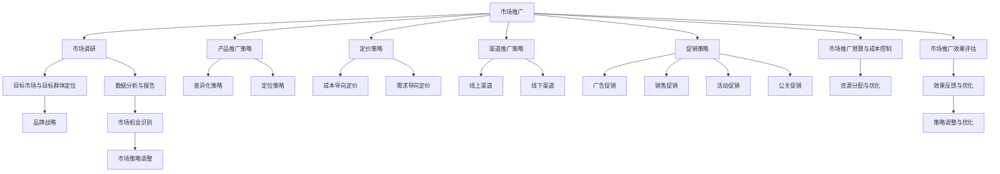

                 

# 文章标题：市场推广策略：高效触达目标群体

## 文章关键词
市场推广、目标群体、品牌战略、产品推广、定价策略、渠道推广、促销策略、数字化营销、效果评估

## 摘要
本文深入探讨了市场推广的各个方面，包括基础理论、核心策略和数字化实践。通过逐步分析市场推广的关键环节，如市场调研、目标市场与目标群体定位、品牌战略、产品推广策略、定价策略、渠道推广策略、促销策略等，本文旨在帮助读者理解并掌握高效触达目标群体的市场推广方法。同时，文章还详细介绍了市场推广效果评估的方法和数字化市场推广的实践，通过实际项目案例和代码解读，为读者提供了实用的操作指导。

## 引言
在当今竞争激烈的市场环境中，市场推广作为企业发展的关键环节，其重要性不言而喻。有效的市场推广不仅能够帮助企业扩大市场份额，提升品牌知名度，还能帮助企业精准触达目标群体，实现销售增长。然而，如何制定和执行有效的市场推广策略，依然是众多企业面临的挑战。

本文将围绕市场推广的核心内容，采用逐步分析的方法（LET'S THINK STEP BY STEP），从基础理论到实际操作，进行全面而深入的探讨。首先，我们将介绍市场推广的基础知识，包括市场推广的定义与作用、市场调研的重要性、目标市场与目标群体定位、品牌战略等。接着，我们将详细分析市场推广的核心策略，如产品推广策略、定价策略、渠道推广策略和促销策略。随后，文章将讨论市场推广的执行与优化，包括市场推广预算与成本控制、市场推广效果评估等。最后，我们将探讨数字化市场推广的方法和实践，通过实际项目案例和代码解读，为读者提供实用的操作指导。

通过本文的阅读，读者将能够系统地了解市场推广的各个方面，掌握高效触达目标群体的市场推广方法，为企业的发展提供有力的支持。

### 第一部分：市场推广基础

#### 第1章：市场推广概述

### 1.1 市场推广的定义与作用

市场推广（Marketing）是指企业通过一系列策略和活动，旨在促进产品或服务的销售，提升品牌知名度和市场份额的过程。市场推广不仅仅是一种销售手段，更是一种系统性、长期性的策略，它涉及到企业的方方面面，包括产品、价格、地点和促销等。

市场推广的作用主要体现在以下几个方面：

1. **促进销售**：通过有效的市场推广策略，企业能够增加产品的曝光度和知名度，吸引潜在客户，从而提高销售量。

2. **品牌建设**：市场推广活动有助于树立和强化企业的品牌形象，增强消费者对品牌的信任和忠诚度。

3. **市场占有**：通过市场推广，企业可以在竞争激烈的市场中占据有利位置，提升市场份额。

4. **消费者洞察**：市场推广过程中，企业能够通过市场调研和消费者反馈，深入了解消费者需求，为产品开发和市场策略提供依据。

### 1.2 市场推广的发展历程

市场推广的发展历程可以追溯到19世纪末20世纪初，随着工业革命的推进，企业开始意识到广告的重要性。最初的市场推广主要集中在产品广告和促销活动上，例如报纸广告、传单和直接邮件等。

20世纪中叶，随着电视和广播的普及，广告形式变得更加多样化和广泛。企业开始采用更加精准的营销手段，如市场细分、目标市场选择和品牌定位等。

20世纪末，随着互联网的兴起，市场推广进入了数字化时代。网络广告、电子邮件营销、社交媒体营销等新兴手段迅速发展，为企业提供了更多触达目标群体的途径。同时，大数据和人工智能技术的应用，使得市场推广更加精准和高效。

### 1.3 市场推广的基本流程

市场推广的基本流程主要包括以下几个阶段：

1. **市场调研**：通过市场调研了解市场需求、竞争情况、消费者行为等，为制定市场推广策略提供数据支持。

2. **目标市场与目标群体定位**：根据市场调研结果，确定企业的目标市场和目标群体，以便制定更具针对性的市场推广策略。

3. **品牌战略**：制定品牌战略，包括品牌定位、品牌形象塑造和品牌传播等，为市场推广提供品牌基础。

4. **产品推广策略**：确定产品的推广策略，包括产品定位、产品差异化、推广渠道选择等。

5. **定价策略**：制定合理的定价策略，包括成本导向定价、需求导向定价等，以满足不同消费者的需求。

6. **渠道推广策略**：选择合适的推广渠道，包括线上和线下渠道，实现产品的广泛覆盖。

7. **促销策略**：制定促销策略，包括广告宣传、促销活动、优惠策略等，吸引消费者的注意力。

8. **市场推广执行与优化**：执行市场推广计划，并根据市场反馈和效果评估进行持续优化。

### 1.4 市场推广目标设定

市场推广目标的设定是市场推广策略的重要组成部分，明确的目标有助于企业集中资源，提高推广效果。市场推广目标通常包括以下几个方面：

1. **销售额增长**：设定具体的销售额增长目标，如年度销售额增长20%。

2. **市场份额提升**：设定目标市场份额，如提升至市场总量的10%。

3. **品牌知名度提升**：设定品牌知名度提升的目标，如达到目标市场的80%知晓度。

4. **客户满意度提升**：设定客户满意度目标，如达到90%以上客户满意度。

5. **品牌忠诚度提升**：设定品牌忠诚度目标，如提升现有客户的复购率。

6. **市场份额覆盖**：设定目标市场的覆盖范围，如覆盖全国范围内的目标消费者。

通过明确的目标设定，企业能够更有针对性地制定市场推广策略，提高市场推广的效率和效果。

#### 第2章：市场调研

### 2.1 市场调研的重要性

市场调研是市场推广策略制定和执行的基础，其重要性体现在以下几个方面：

1. **了解市场需求**：通过市场调研，企业能够深入了解市场需求，掌握消费者对产品或服务的需求和期望，从而开发出更符合市场需求的产品。

2. **分析竞争情况**：市场调研有助于企业分析竞争对手的产品、价格、渠道、促销策略等，为企业制定更具竞争力的市场策略提供依据。

3. **评估市场机会**：通过市场调研，企业能够识别市场机会和潜在威胁，抓住市场机会，规避市场风险。

4. **指导决策**：市场调研结果可以为企业的产品开发、定价策略、渠道选择、促销活动等提供数据支持，帮助企业做出更科学的决策。

5. **提高市场推广效果**：基于市场调研的数据，企业可以制定更精准、更有效的市场推广策略，提高市场推广的投资回报率。

### 2.2 市场调研的方法

市场调研的方法多种多样，不同的方法适用于不同的调研目标和情境。以下是一些常见的市场调研方法：

1. **问卷调查**：问卷调查是最常用的市场调研方法之一，通过设计问卷，收集大量消费者的意见和反馈。问卷调查可以采用线上和线下两种形式。

2. **深度访谈**：深度访谈是一种定性调研方法，通过与消费者进行面对面的深入交流，了解他们的真实想法和需求。深度访谈适用于了解消费者深层次的需求和偏好。

3. **焦点小组**：焦点小组是由一组目标消费者组成的讨论小组，通过引导他们进行讨论，获取关于产品或服务的意见和反馈。焦点小组适用于了解消费者对新产品或新策略的看法。

4. **观察法**：观察法是通过观察消费者的行为和反应，了解他们的购买习惯和偏好。观察法适用于了解消费者在实际购买环境中的行为表现。

5. **实验法**：实验法是通过控制变量，进行实验对比，了解不同策略或产品对市场的影响。实验法适用于测试新策略或新产品在市场上的效果。

6. **数据分析**：数据分析是对已有的市场数据进行统计分析，了解市场趋势和消费者行为。数据分析适用于大规模市场调研数据的处理和分析。

### 2.3 竞争对手分析

竞争对手分析是市场调研的重要内容之一，通过分析竞争对手的产品、价格、渠道、促销策略等，企业可以了解自己在市场中的竞争地位，制定相应的市场策略。

1. **产品分析**：分析竞争对手的产品特性、功能、质量和价格，了解竞争对手在产品方面的优势和劣势。

2. **价格分析**：比较竞争对手的价格策略，了解竞争对手如何定价，以及不同定价策略对市场的影响。

3. **渠道分析**：分析竞争对手的渠道策略，了解竞争对手在销售渠道的选择、覆盖范围和推广力度等方面的做法。

4. **促销分析**：分析竞争对手的促销策略，了解竞争对手如何通过促销活动吸引消费者，以及促销活动的效果。

5. **品牌分析**：分析竞争对手的品牌形象和品牌传播策略，了解竞争对手如何塑造和推广品牌。

通过竞争对手分析，企业可以明确自己在市场中的位置，找到与竞争对手的差异点，制定更有针对性的市场策略。

### 2.4 消费者行为分析

消费者行为分析是市场调研的核心内容之一，通过分析消费者的行为，企业可以了解消费者的购买习惯、偏好和动机，从而制定更有效的市场推广策略。

1. **购买习惯**：分析消费者在购买过程中的行为模式，如购买频率、购买渠道、购买时间等，了解消费者如何进行购买决策。

2. **偏好分析**：分析消费者的产品偏好，如产品功能、品牌、价格等，了解消费者对产品的需求和偏好。

3. **购买动机**：分析消费者的购买动机，如追求性价比、品牌信任、购买冲动等，了解消费者为什么购买产品。

4. **需求层次**：根据马斯洛的需求层次理论，分析消费者的需求层次，如生理需求、安全需求、社交需求等，了解消费者在购买过程中追求的不同层次需求。

5. **购买决策过程**：分析消费者在购买决策过程中的心理和行为变化，了解消费者如何从意识到购买的全过程。

通过消费者行为分析，企业可以深入了解消费者的需求和行为，从而制定更符合消费者需求的市场推广策略，提高市场推广效果。

#### 第3章：目标市场与目标群体定位

### 3.1 目标市场的定义与分类

目标市场是指企业选择并希望进入的市场领域，是市场细分的结果。明确目标市场有助于企业集中资源，更有效地满足特定市场需求。

目标市场可以根据以下标准进行分类：

1. **地理市场**：根据地理位置将市场划分为不同区域，如国家、地区、城市等。地理市场适用于产品具有地域特性的企业，如农产品、地方特产等。

2. **人口市场**：根据人口特征将市场划分为不同群体，如年龄、性别、收入、职业、教育程度等。人口市场适用于面向广泛消费者的企业，如快消品、电子产品等。

3. **心理市场**：根据消费者的心理特征和需求将市场划分为不同群体，如个性、价值观、生活方式等。心理市场适用于追求个性化消费的企业，如时尚品牌、高端汽车等。

4. **行为市场**：根据消费者的购买行为和消费习惯将市场划分为不同群体，如品牌忠诚度、购买频率、购买动机等。行为市场适用于针对特定消费行为的企业，如电商平台、促销活动等。

### 3.2 目标群体的特征分析

明确目标群体的特征是制定有效市场推广策略的关键。以下是目标群体特征分析的主要内容：

1. **人口特征**：分析目标群体的人口特征，如年龄、性别、收入、职业、教育程度等，了解目标群体的基本属性。

2. **心理特征**：分析目标群体的心理特征，如价值观、生活方式、消费观念等，了解目标群体的心理需求。

3. **行为特征**：分析目标群体的行为特征，如购买习惯、消费频率、购买动机等，了解目标群体的消费行为。

4. **需求特征**：分析目标群体的需求特征，如对产品功能、品质、价格、服务等的需求，了解目标群体的核心需求。

通过分析目标群体的特征，企业可以更准确地定位目标市场，制定更具针对性的市场推广策略，提高市场推广效果。

### 3.3 目标市场选择策略

选择合适的目标市场是市场推广成功的关键。以下是一些目标市场选择策略：

1. **集中市场策略**：集中资源服务一个细分市场，如特定年龄段的消费者、特定区域的消费者等。这种策略有助于企业迅速占领市场，提高市场占有率。

2. **差异化市场策略**：同时服务多个细分市场，根据不同市场的需求，提供差异化的产品或服务。这种策略有助于企业扩大市场份额，提高品牌知名度。

3. **覆盖市场策略**：尽量覆盖所有目标市场，提供多样化的产品或服务。这种策略适用于大型企业，有助于实现市场覆盖最大化。

4. **目标市场扩展策略**：根据市场反馈和资源情况，逐步扩大目标市场范围，如从一线城市扩展到二、三线城市。这种策略有助于企业不断开拓新的市场机会。

通过选择合适的目标市场策略，企业可以更有效地利用资源，提高市场推广效果。

### 3.4 市场细分与定位

市场细分和目标市场定位是市场推广策略的重要组成部分。市场细分是指将一个整体市场划分为若干具有相似需求和行为的子市场，以便企业更精准地满足不同市场的需求。目标市场定位则是指选择最具潜力的细分市场，并为其提供定制化的产品或服务。

市场细分的方法包括：

1. **地理细分**：根据地理位置将市场划分为不同区域，如城市、乡村、地域等。

2. **人口细分**：根据人口特征将市场划分为不同群体，如年龄、性别、收入、职业、教育程度等。

3. **心理细分**：根据消费者的心理特征和需求将市场划分为不同群体，如价值观、生活方式、个性等。

4. **行为细分**：根据消费者的购买行为和消费习惯将市场划分为不同群体，如品牌忠诚度、购买频率、购买动机等。

在市场细分的基础上，企业需要根据以下原则进行目标市场定位：

1. **可盈利性**：目标市场应具有足够的消费能力和购买意愿，以确保企业的盈利性。

2. **可进入性**：目标市场应具备进入条件，如市场规模、竞争程度等。

3. **差异性**：目标市场应具有与其他市场不同的特点，以便企业能够提供差异化的产品或服务。

4. **可控性**：目标市场应便于企业进行管理和控制，以确保市场推广策略的有效执行。

通过市场细分与定位，企业可以更好地了解目标市场的需求，制定更精准的市场推广策略，提高市场推广效果。

### 第4章：品牌战略

#### 4.1 品牌的定义与价值

品牌（Brand）是指企业为产品或服务所创建的一种独特标识，包括名称、标志、设计、符号、口号等。品牌不仅是企业的一种无形资产，更是企业价值的重要体现。品牌的定义与价值可以从以下几个方面来理解：

1. **品牌定义**：品牌是企业向市场传达其价值主张的标识和符号。它不仅仅是一个标识，更是企业理念、文化、质量和服务的综合体现。

2. **品牌价值**：品牌价值是指品牌给企业带来的经济价值、情感价值和竞争力。品牌价值主要体现在以下几个方面：
   - **经济价值**：品牌可以提升产品的附加值，提高产品的售价和市场竞争力。
   - **情感价值**：品牌可以建立消费者对企业的信任和忠诚度，提升消费者的购买意愿和满意度。
   - **竞争力**：品牌可以提升企业在市场中的地位和影响力，增强企业的市场竞争力和可持续发展能力。

#### 4.2 品牌建设策略

品牌建设是指企业通过一系列策略和活动，不断提升品牌知名度和品牌价值的过程。以下是品牌建设的主要策略：

1. **品牌定位**：品牌定位是指企业在市场中的位置和独特价值主张。品牌定位需要明确品牌的核心价值和差异化优势，以便在消费者心中建立独特的品牌形象。

2. **品牌形象塑造**：品牌形象塑造是指通过设计、传播和营销活动，塑造品牌在消费者心中的形象。品牌形象塑造需要注重品牌视觉识别系统（如标志、色彩、字体等）的设计和传播，以及与消费者建立情感连接。

3. **品牌传播**：品牌传播是指通过广告、公关、社交媒体等渠道，将品牌信息传递给目标消费者。品牌传播需要注重内容的创意和传播效果，以实现品牌知名度的提升。

4. **品牌延伸**：品牌延伸是指利用现有品牌的影响力，拓展新的产品线或市场。品牌延伸需要注重品牌的一致性和差异化，以确保品牌形象的统一和品牌的可持续发展。

5. **品牌维护**：品牌维护是指通过持续的品牌建设和传播活动，保持品牌的价值和影响力。品牌维护需要注重品牌的长期发展，以及与消费者的互动和沟通。

#### 4.3 品牌形象塑造

品牌形象塑造是品牌建设的重要环节，它关系到品牌在消费者心中的认知和认可。以下是品牌形象塑造的几个关键点：

1. **品牌定位**：明确品牌的核心价值和差异化优势，确保品牌形象的一致性和独特性。

2. **品牌视觉识别**：设计具有识别度的品牌视觉元素，如标志、色彩、字体等，以提升品牌的视觉冲击力和记忆点。

3. **品牌传播**：通过广告、公关、社交媒体等渠道，传播品牌理念和价值，提升品牌知名度和影响力。

4. **品牌故事**：讲述品牌背后的故事，建立品牌与消费者的情感连接，提升品牌的认同感和忠诚度。

5. **品牌体验**：提供优质的品牌体验，如产品品质、服务体验等，让消费者在互动中感受到品牌的价值。

通过品牌形象塑造，企业可以在消费者心中建立独特的品牌形象，提升品牌的认知度和忠诚度，从而实现品牌价值的提升。

#### 4.4 品牌延伸与保护

品牌延伸是指利用现有品牌的影响力，拓展新的产品线或市场。品牌延伸可以带来以下优势：

1. **品牌效应**：品牌延伸可以借助原有品牌的知名度和忠诚度，快速进入新市场，提高市场占有率。

2. **资源共享**：品牌延伸可以共享原有品牌的资源，如品牌形象、营销渠道、供应链等，降低新产品的推广成本。

3. **风险分散**：品牌延伸可以分散企业的市场风险，提高企业的抗风险能力。

然而，品牌延伸也需要注意以下风险：

1. **品牌稀释**：过度品牌延伸可能导致品牌形象被稀释，失去原有的独特性。

2. **市场接受度**：新产品的市场接受度可能低于预期，影响品牌的价值和形象。

为了有效管理品牌延伸，企业需要采取以下措施：

1. **品牌一致性**：确保品牌延伸产品与原有品牌保持一致，避免品牌形象被稀释。

2. **市场调研**：在品牌延伸前进行充分的市场调研，了解消费者的需求和接受度，确保新产品的市场可行性。

3. **品牌保护**：通过法律手段，如注册商标、版权保护等，保护品牌的知识产权，防止品牌被侵权或盗用。

通过品牌延伸与保护，企业可以充分利用品牌的优势，实现业务的持续增长和市场扩展。

### 第5章：产品推广策略

#### 5.1 产品推广的目标与原则

产品推广（Product Promotion）是企业通过一系列策略和活动，提升产品知名度、吸引潜在消费者并促进销售的过程。产品推广的目标和原则如下：

**产品推广的目标**：
1. **提升产品知名度**：通过有效的推广活动，使产品在目标市场中的知名度得到显著提升。
2. **增加销售额**：通过吸引潜在消费者和促进现有消费者的购买行为，实现销售额的增加。
3. **提高品牌形象**：通过产品推广，提升品牌在消费者心中的地位和形象。
4. **增强市场竞争力**：通过产品推广，强化产品在市场中的竞争力和优势。

**产品推广的原则**：
1. **针对性原则**：根据产品的特点和目标市场的需求，制定针对性的推广策略，确保推广活动能够有效触达目标消费者。
2. **创新性原则**：不断创新推广方式和方法，以新颖、有趣的方式吸引消费者的注意力，提高推广效果。
3. **整合性原则**：将多种推广手段结合起来，形成统一的推广策略，实现推广效果的最大化。
4. **持续性原则**：产品推广是一个持续的过程，需要长期投入和持续优化，以保持品牌和产品的市场竞争力。

#### 5.2 产品定位策略

产品定位（Product Positioning）是指企业根据自身产品特点和目标市场的需求，确定产品在市场中的独特位置和价值主张。以下是产品定位策略的主要内容：

1. **明确产品特点**：分析产品的主要特点、功能、优势等，确定产品在市场上的差异化优势。

2. **确定目标市场**：根据产品的特点和目标市场的需求，明确产品的目标市场和目标消费者。

3. **确定价值主张**：根据目标市场的需求和产品特点，确定产品的核心价值主张，即产品能为消费者带来哪些独特的价值和利益。

4. **差异化定位**：通过差异化定位，使产品在目标市场中具有独特的竞争优势，从而吸引消费者的注意力和购买意愿。

5. **持续优化**：根据市场反馈和消费者需求，持续优化产品定位策略，确保产品能够持续满足市场需求，保持竞争优势。

#### 5.3 产品差异化策略

产品差异化（Product Differentiation）是指企业通过在产品功能、质量、设计、服务等方面的独特优势，使产品在市场中具有与众不同的特点，从而吸引消费者的关注和购买。以下是产品差异化策略的主要内容：

1. **功能差异化**：通过创新和改进产品功能，使产品具有独特的功能和优势，满足消费者多样化的需求。

2. **质量差异化**：通过提升产品质量，确保产品在性能、耐用性、安全性等方面具有竞争优势。

3. **设计差异化**：通过独特的产品设计，提升产品的美观度和个性化，吸引消费者的关注和购买。

4. **服务差异化**：通过提供优质的客户服务，如售后保障、定制化服务、快速响应等，提升消费者的满意度和忠诚度。

5. **价格差异化**：通过合理的定价策略，使产品在价格上具有竞争优势，满足不同消费者的需求和预算。

6. **品牌差异化**：通过品牌形象的塑造和传播，使产品在品牌认知度和品牌形象上具有独特的优势。

通过产品差异化策略，企业可以在竞争激烈的市场中脱颖而出，提升产品的市场竞争力，吸引消费者的关注和购买。

#### 5.4 产品推广渠道策略

产品推广渠道（Product Promotion Channels）是指企业通过哪些途径和平台来推广产品，实现产品的市场覆盖和销售。以下是产品推广渠道策略的主要内容：

1. **线上渠道**：
   - **社交媒体**：通过社交媒体平台（如微博、微信、抖音等）发布产品信息，吸引消费者的关注和参与。
   - **电子商务平台**：在电子商务平台（如淘宝、京东、天猫等）开设店铺，通过线上销售和推广产品。
   - **内容营销**：通过撰写和发布高质量的内容（如博客、文章、视频等），提升品牌知名度和产品曝光度。

2. **线下渠道**：
   - **实体店铺**：通过开设实体店铺，提供线下购物体验，提升产品的信任度和购买率。
   - **传统广告**：通过电视、广播、报纸、杂志等传统广告渠道，提升产品的曝光度和知名度。
   - **活动推广**：通过举办展览、发布会、促销活动等，吸引消费者的关注和参与。

3. **多渠道整合**：
   - **线上线下整合**：将线上和线下的推广渠道相结合，实现产品信息的全面覆盖和推广。
   - **渠道协同**：通过不同的推广渠道协同合作，实现推广效果的最大化。
   - **渠道创新**：不断创新推广渠道，以适应市场的变化和消费者的需求。

通过合理的推广渠道策略，企业可以充分利用各种推广渠道的优势，实现产品的广泛覆盖和销售增长。

### 第6章：定价策略

#### 6.1 定价的目标与原则

定价（Pricing）是企业根据市场需求、成本、竞争状况等因素，确定产品或服务的价格水平的过程。合理的定价策略对于企业的盈利能力和市场竞争力至关重要。以下是定价策略的目标与原则：

**定价的目标**：
1. **实现利润最大化**：通过合理的定价，实现产品或服务的利润最大化，满足企业的盈利目标。
2. **市场份额提升**：通过定价策略，吸引更多的消费者，提高市场份额，增强企业的市场竞争力。
3. **价格接受度**：确保价格在消费者可接受范围内，提高消费者购买意愿和满意度。
4. **品牌形象维护**：通过合理的定价策略，维护和提升品牌形象，确保品牌在消费者心中的地位。

**定价的原则**：
1. **成本导向原则**：根据产品的生产成本和运营成本，合理确定产品的价格水平。
2. **市场需求原则**：根据市场需求和消费者对价格的敏感度，灵活调整价格策略，以满足市场需求。
3. **竞争导向原则**：分析竞争对手的定价策略和市场表现，合理定位本企业的价格水平，以实现竞争优势。
4. **创新性原则**：不断创新定价策略和方法，以适应市场的变化和消费者的需求。
5. **公平性原则**：确保定价策略的公平性，避免价格歧视和不正当竞争。

#### 6.2 定价策略的类型

定价策略多种多样，不同的定价策略适用于不同的市场环境和企业目标。以下是常见的定价策略类型：

1. **成本导向定价**：
   - **成本加成定价**：在产品成本基础上，加上一定的利润率，确定产品的价格。
   - **目标定价**：根据企业预期利润目标和成本水平，确定产品的价格。
   - **标准定价**：以产品标准成本为基础，考虑市场状况和竞争状况，确定产品的价格。

2. **需求导向定价**：
   - **需求价格弹性定价**：根据消费者对产品价格的需求弹性，灵活调整价格水平。
   - **心理定价**：利用消费者的心理特点，制定价格策略，如整数定价、尾数定价等。
   - **价值定价**：根据产品所提供的价值和消费者的支付意愿，制定价格水平。

3. **竞争导向定价**：
   - **跟随定价**：根据竞争对手的定价策略，调整本企业的产品价格，保持价格的一致性。
   - **领导定价**：根据市场需求和竞争状况，制定较高的价格，以保持市场领导地位。
   - **挑战定价**：通过降低价格，挑战竞争对手的市场地位，提高市场份额。

4. **差异化定价**：
   - **产品线定价**：根据不同产品的特点和市场需求，制定差异化的价格策略。
   - **地理位置定价**：根据不同地区的市场需求和消费水平，制定差异化的价格策略。
   - **时间定价**：根据不同时间段的需求变化，制定灵活的价格策略。

通过选择合适的定价策略，企业可以更好地满足市场需求，提高产品竞争力，实现利润最大化。

#### 6.3 成本导向定价

成本导向定价是以产品成本为基础，加上一定的利润率，确定产品的价格水平。成本导向定价策略主要包括以下几种：

1. **成本加成定价**：
   - **计算公式**：价格 = 成本 × （1 + 加成率）
   - **应用场景**：适用于产品成本相对稳定，市场竞争激烈的环境。
   - **优势**：简单易行，有利于控制成本和利润。
   - **劣势**：不考虑市场需求和竞争状况，可能导致价格过高或过低。

2. **目标定价**：
   - **计算公式**：价格 = （固定成本 + 变动成本 + 预期利润）/ 预期销售量
   - **应用场景**：适用于有明确利润目标和企业成本结构相对稳定的环境。
   - **优势**：有助于实现企业的预期利润目标，合理分配资源。
   - **劣势**：不考虑市场需求和竞争状况，可能导致价格过高或过低。

3. **标准定价**：
   - **计算公式**：价格 = 标准成本 × （1 + 成本加成率）
   - **应用场景**：适用于产品成本相对稳定，市场竞争较为稳定的环境。
   - **优势**：有助于企业统一定价标准，提高管理效率。
   - **劣势**：不考虑市场需求和竞争状况，可能导致价格过高或过低。

通过成本导向定价，企业可以更好地控制成本和利润，实现产品定价的合理性。但需要注意的是，成本导向定价策略需要结合市场需求和竞争状况进行灵活调整，以实现最佳定价效果。

#### 6.4 需求导向定价

需求导向定价是根据消费者对产品或服务的需求强度和支付意愿，确定产品或服务的价格策略。需求导向定价策略主要包括以下几种：

1. **需求价格弹性定价**：
   - **计算公式**：价格 = 基础价格 × 需求价格弹性系数
   - **应用场景**：适用于需求价格弹性较大的产品或服务。
   - **优势**：能够灵活应对市场需求的变化，提高产品竞争力。
   - **劣势**：可能导致利润波动较大，需要密切关注市场需求变化。

2. **心理定价**：
   - **计算公式**：价格 = 基础价格 × 心理定价系数
   - **应用场景**：适用于消费者心理对价格敏感的产品或服务。
   - **优势**：能够满足消费者对价格的期望，提高购买意愿。
   - **劣势**：可能导致成本增加，影响企业的利润率。

3. **价值定价**：
   - **计算公式**：价格 = 产品价值 × 价格价值系数
   - **应用场景**：适用于高价值产品或服务。
   - **优势**：能够满足消费者对产品价值的期望，提高品牌形象。
   - **劣势**：需要准确评估产品价值，确保价格合理。

通过需求导向定价，企业可以更好地满足消费者的需求，提高产品竞争力。但需要注意的是，需求导向定价策略需要结合市场需求和消费者心理进行灵活调整，以实现最佳定价效果。

### 第7章：渠道推广策略

#### 7.1 渠道推广的定义与作用

渠道推广（Channel Promotion）是指企业通过选择合适的渠道和推广手段，将产品或服务传递给消费者的过程。渠道推广在企业的市场推广策略中起着至关重要的作用，主要体现在以下几个方面：

1. **市场覆盖**：渠道推广可以帮助企业将产品或服务覆盖到更广泛的区域和消费者群体，提高市场占有率。

2. **提高销售额**：通过有效的渠道推广，企业可以吸引更多的消费者，增加产品的销售量，实现销售额的增长。

3. **品牌传播**：渠道推广可以借助各种推广手段，提升品牌知名度和品牌形象，增强消费者对品牌的信任和忠诚度。

4. **市场反馈**：渠道推广可以帮助企业收集消费者的反馈信息，了解市场需求和消费者行为，为产品研发和市场策略提供有力支持。

#### 7.2 渠道选择策略

渠道选择（Channel Selection）是渠道推广的关键环节，选择合适的渠道可以提高市场推广的效果。以下是渠道选择策略的主要内容：

1. **目标市场分析**：分析企业的目标市场，了解目标消费者的需求和购买习惯，选择适合目标市场的渠道。

2. **竞争分析**：分析竞争对手的渠道策略，了解他们在哪些渠道上投入较大，选择与竞争对手不同的渠道，以避免直接竞争。

3. **成本效益分析**：评估不同渠道的成本和效益，选择成本较低、效果较好的渠道，以实现最佳的投资回报率。

4. **渠道特性分析**：了解不同渠道的特性，如覆盖范围、销售力、推广方式等，选择符合企业产品特性和推广目标的渠道。

5. **市场趋势分析**：关注市场趋势和渠道变化，选择具有发展潜力的渠道，以适应市场的变化和消费者的需求。

#### 7.3 渠道管理策略

渠道管理（Channel Management）是指企业对渠道进行有效管理和协调，以确保渠道推广策略的有效执行。以下是渠道管理策略的主要内容：

1. **渠道评估**：定期对渠道的表现进行评估，了解渠道的业绩、市场覆盖和消费者反馈，评估渠道的效率和效果。

2. **渠道激励**：通过提供激励措施，如奖励、补贴、培训等，激发渠道的积极性和合作意愿，提高渠道的推广效果。

3. **渠道支持**：提供渠道所需的支持和服务，如产品知识培训、市场推广材料、销售技巧培训等，帮助渠道提高销售能力和市场竞争力。

4. **渠道协作**：与渠道建立良好的合作关系，通过信息共享、资源整合等方式，实现渠道的协同作战，提高市场推广的整体效果。

5. **渠道优化**：根据市场反馈和渠道评估结果，对渠道策略进行调整和优化，以适应市场变化和消费者需求。

#### 7.4 渠道推广效果评估

渠道推广效果评估（Channel Promotion Effectiveness Evaluation）是衡量渠道推广策略有效性的重要环节。以下是渠道推广效果评估的主要内容：

1. **销售业绩评估**：通过对比渠道推广前后的销售数据，评估渠道推广对销售业绩的提升效果。

2. **市场覆盖率评估**：评估渠道推广后产品或服务在市场中的覆盖范围，了解渠道推广对市场覆盖率的影响。

3. **消费者反馈评估**：通过收集消费者对渠道推广活动的反馈，了解消费者对渠道推广的满意度和接受度。

4. **成本效益评估**：评估渠道推广的投入和产出，计算渠道推广的投资回报率，了解渠道推广的经济效益。

5. **渠道优化建议**：根据评估结果，提出渠道推广策略的优化建议，以提高渠道推广的效果和效益。

通过渠道推广效果评估，企业可以了解渠道推广的实际效果，发现存在的问题，为渠道推广策略的优化和调整提供依据。

### 第8章：促销策略

#### 8.1 促销的定义与作用

促销（Promotion）是指企业通过一系列手段和活动，提高产品或服务的知名度、吸引消费者、促进销售的过程。促销在市场推广中扮演着重要的角色，具有以下作用：

1. **提升品牌知名度**：通过促销活动，企业可以将品牌信息传递给更多的消费者，提高品牌在市场中的知名度。

2. **吸引潜在消费者**：促销活动通常具有吸引消费者的特点，能够吸引潜在消费者关注和购买产品或服务。

3. **促进销售**：促销活动可以刺激消费者的购买欲望，提高销售量和市场份额。

4. **品牌形象塑造**：通过促销活动，企业可以展示品牌的价值和理念，塑造积极的品牌形象。

5. **市场反馈**：促销活动可以帮助企业收集消费者的反馈信息，了解市场需求和消费者行为，为产品研发和市场策略提供支持。

#### 8.2 促销策略的类型

促销策略多种多样，不同的促销策略适用于不同的市场环境和企业目标。以下是常见的促销策略类型：

1. **广告促销**：
   - **广告**：通过电视、广播、报纸、杂志、互联网等渠道，发布广告信息，提高产品或服务的知名度。
   - **网络广告**：通过搜索引擎、社交媒体、电子邮件等网络渠道，发布广告信息，提高产品或服务的在线曝光度。

2. **销售促销**：
   - **折扣促销**：通过提供价格折扣，吸引消费者购买产品或服务。
   - **赠品促销**：通过赠送赠品，吸引消费者购买产品或服务。
   - **捆绑促销**：将多种产品或服务捆绑在一起，以优惠价格销售，吸引消费者购买。

3. **活动促销**：
   - **展览促销**：通过参加展览、展会等活动，展示产品或服务，吸引潜在消费者。
   - **促销活动**：举办促销活动，如抽奖、特价优惠等，吸引消费者参与，提高销售量。

4. **公关促销**：
   - **新闻发布会**：通过举办新闻发布会，向公众传递品牌信息和产品特点。
   - **公益促销**：通过参与公益活动，提升品牌形象，吸引消费者的关注和支持。

5. **人员推销**：
   - **直销**：通过销售人员直接与消费者接触，介绍产品或服务，促进销售。
   - **销售会议**：通过组织销售会议，向潜在客户展示产品或服务，提高销售转化率。

通过选择合适的促销策略，企业可以更好地吸引消费者，提高销售量和市场份额。

#### 8.3 促销组合策略

促销组合策略（Promotion Mix）是指企业根据市场环境和目标，将不同的促销手段有机结合起来，形成一套综合的促销策略。以下是促销组合策略的主要内容：

1. **广告与销售促销结合**：通过广告提升品牌知名度，吸引消费者关注，再通过销售促销吸引消费者购买，实现销售目标。

2. **活动促销与公关促销结合**：通过举办促销活动，如展览、抽奖等，吸引消费者参与，同时通过公关促销，提升品牌形象，增加消费者信任度。

3. **网络广告与人员推销结合**：通过网络广告提升在线曝光度，吸引潜在消费者，再通过人员推销直接与消费者接触，提高销售转化率。

4. **广告促销与公关促销结合**：通过广告提升品牌知名度，同时通过公关促销，如新闻发布会、公益活动等，增加品牌曝光度和美誉度。

5. **线下促销与线上促销结合**：通过线下促销活动，如实体店促销、线下活动等，吸引线下消费者，同时通过线上促销，如网络广告、社交媒体推广等，吸引线上消费者。

通过合理的促销组合策略，企业可以充分利用各种促销手段的优势，实现最佳促销效果，提高销售量和市场份额。

#### 8.4 促销活动的实施与管理

促销活动的实施与管理是促销策略成功的关键。以下是促销活动实施与管理的主要内容：

1. **促销活动规划**：根据市场环境和目标，制定促销活动的整体规划和具体方案，明确促销活动的目标、时间、地点、内容等。

2. **资源准备**：准备促销活动所需的资源，如资金、人员、物资等，确保促销活动的顺利进行。

3. **活动宣传**：通过广告、社交媒体、线上渠道等，宣传活动信息，吸引消费者关注和参与。

4. **活动执行**：按照促销活动方案，组织执行各项活动，如展览、抽奖、优惠等，确保活动效果。

5. **消费者互动**：与消费者进行互动，收集消费者反馈，了解消费者需求和满意度，为后续促销活动提供参考。

6. **活动评估**：对促销活动进行效果评估，分析活动对销售量、品牌知名度、消费者满意度等方面的影响，总结活动经验，为后续促销活动提供优化建议。

通过科学、规范的促销活动实施与管理，企业可以确保促销活动的成功，提高销售量和市场份额。

### 第9章：市场推广预算与成本控制

#### 9.1 市场推广预算的制定

市场推广预算是企业在一定时期内计划用于市场推广活动的资金总额。合理的市场推广预算有助于确保市场推广策略的有效实施，提高市场推广的投资回报率。以下是市场推广预算制定的主要步骤：

1. **目标设定**：明确市场推广的目标，如提升品牌知名度、增加销售量、提高市场份额等。目标应具体、可衡量。

2. **历史数据参考**：分析历史市场推广活动的数据，了解推广活动的成本和效果，为预算制定提供参考。

3. **市场分析**：分析目标市场、竞争对手、消费者行为等，了解市场推广的潜在机会和挑战，为预算制定提供依据。

4. **预算分配**：根据市场推广目标和历史数据，将预算分配到不同的市场推广活动上，如广告、促销、公关、渠道推广等。

5. **预算审批**：将预算计划提交给高层领导或财务部门，进行审批和调整。

6. **预算跟踪**：在市场推广活动实施过程中，定期跟踪预算使用情况，确保预算的合理使用。

#### 9.2 成本控制策略

成本控制是市场推广预算管理的重要环节，通过有效的成本控制，企业可以确保市场推广预算的合理使用，提高市场推广的投资回报率。以下是成本控制策略的主要内容：

1. **预算分配优化**：根据市场推广目标和市场分析结果，合理分配预算，确保重点活动的资金投入。

2. **成本效益分析**：对市场推广活动的成本和效益进行详细分析，选择成本较低、效果较好的推广活动。

3. **预算执行监督**：在市场推广活动实施过程中，加强对预算执行的监督，确保预算的合理使用。

4. **预算调整与优化**：根据市场反馈和预算执行情况，及时调整预算，优化预算分配和推广策略。

5. **资源整合**：通过资源整合，提高资源利用率，降低市场推广成本。

6. **绩效评估**：对市场推广活动的成本和效果进行评估，了解成本控制的成效，为后续市场推广预算制定提供参考。

通过有效的成本控制策略，企业可以确保市场推广预算的合理使用，提高市场推广的投资回报率。

#### 9.3 预算执行与监督

预算执行与监督是市场推广预算管理的重要环节，通过有效的执行和监督，企业可以确保市场推广预算的合理使用，提高市场推广的效果。以下是预算执行与监督的主要内容：

1. **预算执行**：
   - **任务分配**：将市场推广任务分配给相关部门和人员，明确职责和目标。
   - **进度跟踪**：定期跟踪市场推广任务的进度，确保各项活动按计划进行。
   - **资金支付**：按照预算计划，合理安排资金支付，确保各项活动有充足的资金支持。

2. **监督机制**：
   - **预算审查**：定期审查预算执行情况，了解各项活动的预算使用情况，确保预算的合理使用。
   - **绩效评估**：对市场推广活动的成本和效果进行评估，了解预算执行的效果，发现存在的问题。

3. **反馈与调整**：
   - **及时反馈**：及时收集市场反馈和绩效评估结果，了解市场推广活动的实际效果，为预算调整提供依据。
   - **预算调整**：根据市场反馈和绩效评估结果，及时调整预算，优化预算分配和推广策略。

通过有效的预算执行与监督，企业可以确保市场推广预算的合理使用，提高市场推广的效果和投资回报率。

#### 9.4 预算调整与优化

预算调整与优化是市场推广预算管理的重要环节，通过定期对预算进行调整和优化，企业可以确保预算的合理使用，提高市场推广的效果。以下是预算调整与优化的主要内容：

1. **绩效评估**：对市场推广活动的成本和效果进行评估，了解各项活动的预算使用情况和实际效果。

2. **问题识别**：根据绩效评估结果，识别预算执行过程中存在的问题，如预算超支、效果不佳等。

3. **调整预算**：根据问题识别结果，对预算进行调整，重新分配资金，优化预算分配和推广策略。

4. **优化推广策略**：根据市场反馈和绩效评估结果，优化市场推广策略，提高推广效果和投资回报率。

5. **持续监控**：在预算调整和优化后，持续监控预算执行情况，确保预算的合理使用。

通过有效的预算调整与优化，企业可以确保市场推广预算的合理使用，提高市场推广的效果和投资回报率。

### 第10章：市场推广效果评估

#### 10.1 市场推广效果评估的重要性

市场推广效果评估是衡量市场推广策略有效性的重要手段。通过评估市场推广活动的成本和效果，企业可以了解推广活动的实际效果，发现存在的问题，为后续市场推广策略的调整和优化提供依据。以下是市场推广效果评估的重要性：

1. **优化推广策略**：通过评估市场推广活动的效果，企业可以了解哪些推广策略有效，哪些推广策略无效，从而优化市场推广策略，提高推广效果。

2. **降低成本**：通过评估市场推广活动的成本和效果，企业可以识别成本较高的推广活动，优化预算分配，降低市场推广成本。

3. **提高投资回报率**：市场推广效果评估可以帮助企业了解市场推广活动的投资回报率，从而优化市场推广策略，提高投资回报率。

4. **决策支持**：市场推广效果评估结果可以为企业的决策提供科学依据，帮助企业制定更有效的市场推广策略。

5. **持续改进**：市场推广效果评估可以帮助企业发现推广活动中的问题，持续改进市场推广策略，提高市场推广效果。

#### 10.2 评估指标与方法

评估市场推广效果需要选择合适的评估指标和方法。以下是常见的市场推广评估指标和方法：

1. **销售业绩指标**：
   - **销售额**：评估市场推广活动对销售额的影响。
   - **销售增长率**：评估市场推广活动对销售增长的贡献。

2. **市场份额指标**：
   - **市场份额**：评估市场推广活动对市场份额的提升。
   - **市场份额增长率**：评估市场推广活动对市场份额增长的贡献。

3. **品牌知名度指标**：
   - **品牌知名度**：评估市场推广活动对品牌知名度的影响。
   - **品牌认知度**：评估市场推广活动对品牌认知度的提升。

4. **消费者行为指标**：
   - **购买率**：评估市场推广活动对消费者购买行为的影响。
   - **复购率**：评估市场推广活动对消费者复购率的影响。

5. **成本效益指标**：
   - **成本效益比**：评估市场推广活动成本与收益的比率。
   - **投资回报率**：评估市场推广活动的投资回报率。

**评估方法**：

1. **定量分析**：通过统计数据和分析工具，对市场推广效果进行定量分析。

2. **定性分析**：通过访谈、问卷调查等方式，了解消费者和市场推广活动的实际效果。

3. **比较分析**：将市场推广活动前后的数据进行比较，分析市场推广活动的影响。

4. **竞争分析**：通过分析竞争对手的市场推广效果，了解自身市场推广活动的优劣势。

通过选择合适的评估指标和方法，企业可以全面了解市场推广活动的效果，为后续市场推广策略的调整和优化提供依据。

#### 10.3 数据分析与报告

数据分析与报告是市场推广效果评估的重要环节。通过有效的数据分析和报告撰写，企业可以全面了解市场推广活动的效果，为决策提供科学依据。以下是数据分析和报告的主要内容：

1. **数据分析**：
   - **数据收集**：收集市场推广活动相关的数据，如销售额、市场份额、品牌知名度、消费者反馈等。
   - **数据处理**：对收集到的数据进行清洗、整理和分析，提取有价值的信息。
   - **数据分析**：运用统计分析、回归分析等工具，对市场推广活动的效果进行定量分析。

2. **报告撰写**：
   - **报告结构**：撰写市场推广效果评估报告，包括报告封面、目录、引言、数据分析、结论和建议等部分。
   - **数据分析结果**：详细展示数据分析的结果，包括图表、统计表等。
   - **结论和建议**：根据数据分析结果，提出市场推广策略的调整和优化建议。

3. **报告展示**：
   - **PPT展示**：制作市场推广效果评估的PPT，通过图表、图片等方式，直观展示数据分析结果和结论。
   - **会议汇报**：在会议上汇报市场推广效果评估报告，与团队成员和领导进行沟通和讨论。

通过有效的数据分析和报告撰写，企业可以全面了解市场推广活动的效果，为决策提供科学依据，优化市场推广策略。

#### 10.4 市场推广效果的改进策略

基于市场推广效果评估的结果，企业可以采取以下改进策略，以提高市场推广的效果和投资回报率：

1. **策略调整**：根据评估结果，对市场推广策略进行调整，优化推广内容和方式。

2. **预算优化**：根据评估结果，调整市场推广预算，重点支持效果较好的推广活动。

3. **执行优化**：加强对市场推广活动的执行监督，确保推广活动的有效执行。

4. **技术创新**：采用新的市场推广技术和工具，提高推广效果和效率。

5. **持续改进**：建立持续改进机制，定期评估市场推广效果，不断优化推广策略和执行方式。

通过以上改进策略，企业可以不断提高市场推广的效果，实现市场推广目标的最大化。

### 第11章：市场推广案例分析与启示

#### 11.1 案例分析的方法与步骤

市场推广案例分析是理解和应用市场推广策略的重要手段。通过分析成功和失败的案例，企业可以汲取经验教训，优化市场推广策略。以下是市场推广案例分析的常用方法和步骤：

1. **确定分析目标**：明确分析案例的目的，如了解成功案例的市场推广策略，或分析失败案例的原因。

2. **选择案例**：选择具有代表性、与自身业务相关的成功或失败案例进行分析。

3. **收集信息**：收集案例相关的信息，包括市场背景、企业情况、推广活动详情、市场反馈等。

4. **数据分析**：运用数据分析工具和方法，对案例信息进行定量和定性分析。

5. **总结经验**：根据分析结果，总结成功案例的有效策略和失败案例的教训。

6. **提出启示**：结合自身业务情况，提出可借鉴的经验和改进建议。

#### 11.2 成功案例解析

成功案例能够为企业提供宝贵的经验和启示。以下是一个市场推广成功案例的解析：

**案例背景**：一家初创科技公司推出了一款智能家居设备，旨在提高家庭生活质量。

**市场背景**：智能家居市场处于快速发展的阶段，消费者对智能生活有较高需求，但市场教育程度较低。

**推广策略**：
- **市场调研**：公司进行了详细的市场调研，了解消费者的需求和偏好。
- **品牌建设**：通过创新设计和高质量的产品，树立了智能家居领导品牌的形象。
- **多渠道推广**：结合线上和线下渠道，开展全面的市场推广活动。
  - **线上推广**：利用社交媒体、内容营销和搜索引擎优化，提升品牌知名度。
  - **线下推广**：参加行业展会，举办新品发布会，与消费者面对面交流。
- **促销活动**：开展限时优惠、赠品促销等活动，吸引消费者购买。

**效果评估**：
- **销售额**：推广活动期间，销售额同比增长了50%。
- **市场份额**：市场份额提升了10%，在智能家居市场中取得了领先地位。
- **品牌知名度**：品牌知名度提升了20%，消费者对品牌的认可度显著提高。

**成功经验**：
- **精准定位**：通过市场调研，准确确定了目标市场和消费者群体，确保推广活动具有针对性。
- **多渠道整合**：结合线上和线下渠道，实现了市场覆盖的最大化。
- **创新设计**：注重产品创新，提供了高质量的产品，赢得了消费者的信任。
- **灵活促销**：灵活运用促销策略，吸引消费者的购买欲望。

#### 11.3 失败案例解析

失败案例能够帮助企业避免重复错误，优化市场推广策略。以下是一个市场推广失败案例的解析：

**案例背景**：一家传统制造企业试图通过推出新产品来拓展新市场。

**市场背景**：新市场对企业的产品需求不高，市场竞争激烈。

**推广策略**：
- **市场调研不足**：企业在市场调研方面投入不足，对市场需求和竞争状况了解不够。
- **品牌形象不符**：新产品品牌形象与企业的传统品牌形象不符，导致消费者困惑。
- **推广渠道单一**：仅依赖线下渠道推广，未能充分利用线上渠道的优势。
- **促销力度不足**：促销活动力度不足，未能有效吸引消费者的购买兴趣。

**效果评估**：
- **销售额**：新产品上市后，销售额未达到预期，同比下降了15%。
- **市场份额**：市场份额未得到提升，甚至有所下降。
- **品牌形象**：品牌形象受损，消费者对企业的信任度降低。

**失败原因**：
- **市场调研不足**：对市场需求和竞争状况了解不够，导致推广策略不具针对性。
- **品牌形象不符**：新产品品牌形象与企业的传统品牌形象不符，导致消费者难以接受。
- **推广渠道单一**：未能充分利用线上渠道，市场覆盖不足。
- **促销力度不足**：促销活动力度不足，未能有效吸引消费者的购买兴趣。

**失败教训**：
- **重视市场调研**：在进行市场推广前，必须进行全面的市场调研，了解市场需求和竞争状况。
- **品牌形象一致性**：新产品品牌形象应与企业的传统品牌形象保持一致，确保消费者认知。
- **多渠道整合**：充分利用线上和线下渠道，实现市场覆盖的最大化。
- **促销力度**：确保促销活动力度充足，吸引消费者的购买兴趣。

通过成功和失败案例的解析，企业可以汲取经验教训，优化市场推广策略，提高市场推广的效果和投资回报率。

### 第12章：数字营销概述

#### 12.1 数字营销的定义与类型

数字营销（Digital Marketing）是指通过互联网和数字技术进行的营销活动，旨在提高品牌知名度、吸引潜在客户并促进销售。数字营销与传统营销相比，具有以下特点：

1. **互动性**：数字营销可以与消费者进行实时互动，了解消费者的需求和反馈，提高营销效果。
2. **精准性**：通过数据分析和技术手段，数字营销可以实现精准定位，将营销信息传递给潜在的高价值客户。
3. **可度量性**：数字营销可以追踪和衡量营销效果，如访问量、点击率、转化率等，为企业提供科学的决策依据。
4. **低成本**：数字营销相比传统营销，成本较低，尤其是对于初创企业和中小企业，更容易实现营销目标。

数字营销的类型包括以下几种：

1. **搜索引擎营销（SEM）**：通过在搜索引擎上投放广告，提高品牌在搜索结果中的排名，吸引潜在客户。
2. **内容营销**：通过创作和发布有价值的内容，如文章、视频、图片等，吸引潜在客户，提升品牌知名度。
3. **社交媒体营销**：利用社交媒体平台（如微博、微信、抖音等），与消费者互动，提高品牌影响力。
4. **电子邮件营销**：通过发送电子邮件，向潜在客户和现有客户传递营销信息，促进销售。
5. **移动营销**：通过手机应用程序、短信等移动渠道，与消费者进行互动，提高营销效果。
6. **视频营销**：通过视频平台（如YouTube、抖音等），发布有趣、有创意的视频，吸引潜在客户，提升品牌知名度。

#### 12.2 数字营销的优势与挑战

数字营销的优势主要体现在以下几个方面：

1. **成本效益高**：数字营销相比传统营销，成本较低，尤其是对于初创企业和中小企业，更容易实现营销目标。
2. **互动性强**：数字营销可以与消费者进行实时互动，了解消费者的需求和反馈，提高营销效果。
3. **精准性**：通过数据分析和技术手段，数字营销可以实现精准定位，将营销信息传递给潜在的高价值客户。
4. **可度量性**：数字营销可以追踪和衡量营销效果，如访问量、点击率、转化率等，为企业提供科学的决策依据。
5. **灵活性强**：数字营销可以根据市场反馈和消费者行为，灵活调整营销策略，提高营销效果。

然而，数字营销也面临一些挑战：

1. **竞争激烈**：随着数字营销的普及，市场竞争日益激烈，企业需要不断创新和优化营销策略，以脱颖而出。
2. **隐私保护**：数字营销涉及大量用户数据，如何保护用户隐私成为一大挑战。
3. **数据真实性**：数字营销中，数据真实性难以保证，企业需要确保数据的真实性和有效性。
4. **技术更新快**：数字营销技术更新迅速，企业需要不断学习和掌握新技术，以保持竞争力。

#### 12.3 数字营销的发展趋势

随着互联网和数字技术的不断发展，数字营销也在不断演进。以下是数字营销的发展趋势：

1. **人工智能（AI）**：人工智能技术将广泛应用于数字营销，如个性化推荐、自动化广告投放等，提高营销效果。
2. **大数据分析**：大数据分析将帮助企业在海量数据中挖掘有价值的信息，实现更精准的营销。
3. **社交媒体整合**：社交媒体将在数字营销中扮演更加重要的角色，企业需要充分利用社交媒体平台，与消费者建立互动关系。
4. **移动营销**：随着移动设备的普及，移动营销将成为数字营销的主要方向，企业需要重视移动端的营销策略。
5. **视频营销**：视频营销将继续增长，企业需要创作高质量的视频内容，吸引潜在客户。
6. **多元化营销渠道**：企业将采用更多元化的营销渠道，如直播、短视频、社交电商等，提高营销效果。

通过了解数字营销的发展趋势，企业可以及时调整营销策略，把握市场机遇，提高营销效果。

### 第13章：搜索引擎营销（SEM）

#### 13.1 搜索引擎营销的基本概念

搜索引擎营销（Search Engine Marketing，SEM）是一种通过搜索引擎获取流量和提升品牌知名度的营销方式。SEM主要包括两个关键部分：搜索引擎优化（Search Engine Optimization，SEO）和搜索引擎广告（Search Engine Advertising，SEA）。

**搜索引擎优化（SEO）**：
- **定义**：SEO是指通过优化网站内容和结构，提高网站在搜索引擎结果页面（Search Engine Results Page，SERP）中的排名，从而吸引更多免费流量。
- **目标**：提高网站在搜索引擎中的自然排名，增加有机流量，提高网站的可访问性和用户体验。

**搜索引擎广告（SEA）**：
- **定义**：SEA是指通过支付费用在搜索引擎上投放广告，确保广告在搜索结果页面上的优先展示。
- **目标**：通过付费广告快速提升网站曝光度，吸引更多目标客户，实现直接的销售和品牌推广。

#### 13.2 搜索引擎优化（SEO）

搜索引擎优化（SEO）是SEM的重要组成部分，其核心目标是通过优化网站内容和结构，提高网站在搜索引擎中的排名，从而吸引更多有机流量。以下是SEO的主要策略：

1. **关键词研究**：
   - **定义**：关键词研究是指分析目标市场和目标客户使用的关键词，了解关键词的搜索量、竞争程度和相关性。
   - **策略**：选择与业务相关的关键词，确保关键词的搜索量适中，避免过高或过低的竞争。

2. **网站结构优化**：
   - **定义**：网站结构优化是指优化网站的导航、链接结构和页面布局，使其更符合搜索引擎的爬取规则。
   - **策略**：确保网站结构清晰，页面之间有良好的内部链接，提高网站的可访问性。

3. **内容优化**：
   - **定义**：内容优化是指优化网站的文本内容，确保内容有价值、相关性强，且与关键词相关。
   - **策略**：撰写高质量、原创的内容，确保内容结构合理，包括标题、段落、关键词等。

4. **技术优化**：
   - **定义**：技术优化是指优化网站的加载速度、移动适配性、安全性等，提高用户体验。
   - **策略**：使用快速、优化的网站技术，确保网站在多种设备和浏览器上都能良好运行。

5. **外部链接建设**：
   - **定义**：外部链接建设是指通过在其他网站获取链接，提高网站的权威性和可信度。
   - **策略**：通过撰写高质量的内容、交换链接、参与社交媒体等方式，获取优质的外部链接。

#### 13.3 支付点击广告（PPC）

支付点击广告（Pay-Per-Click，PPC）是SEM的另一重要组成部分，通过付费方式在搜索引擎上投放广告，确保广告在搜索结果页面的优先展示。以下是PPC的主要策略：

1. **广告平台选择**：
   - **定义**：广告平台选择是指选择合适的广告平台，如Google Ads、Bing Ads等。
   - **策略**：选择与目标市场相关的广告平台，确保广告能够触及目标客户。

2. **关键词选择**：
   - **定义**：关键词选择是指选择适合广告投放的关键词，确保广告与搜索意图相关。
   - **策略**：选择高搜索量、低竞争的关键词，提高广告的点击率和投资回报率。

3. **广告文案优化**：
   - **定义**：广告文案优化是指优化广告的文字内容，提高广告的吸引力和点击率。
   - **策略**：撰写简洁、有吸引力、与关键词相关的广告文案，突出广告的独特卖点和优势。

4. **出价策略**：
   - **定义**：出价策略是指根据广告竞争情况和预算，合理设置广告的出价。
   - **策略**：根据关键词的竞争程度和广告预算，设定合理的出价，确保广告在搜索结果中的优先展示。

5. **广告跟踪与优化**：
   - **定义**：广告跟踪与优化是指通过数据分析，监控广告的表现，并进行持续优化。
   - **策略**：使用分析工具，监控广告的点击率、转化率等关键指标，根据数据分析结果，优化广告投放策略。

通过有效的SEM策略，企业可以提升网站在搜索引擎中的排名，增加有机流量，并通过PPC广告快速提升曝光度和吸引潜在客户，实现营销目标。

### 第14章：社交媒体营销

#### 14.1 社交媒体营销的原理

社交媒体营销（Social Media Marketing，SMM）是指通过社交媒体平台进行营销活动，以提高品牌知名度、吸引潜在客户并促进销售的一种营销方式。社交媒体营销的原理主要包括以下几个方面：

1. **用户互动**：社交媒体的核心是用户之间的互动，通过发布内容、评论、点赞等方式，用户可以与品牌进行直接交流，建立信任和忠诚度。

2. **内容传播**：优质的内容是社交媒体营销的关键，通过发布有趣、有价值的内容，品牌可以吸引关注，增加用户互动和分享。

3. **病毒式传播**：社交媒体的传播机制使得优质内容能够迅速传播，形成病毒式传播，从而在短时间内实现广泛的品牌曝光。

4. **数据挖掘**：社交媒体平台提供了丰富的用户数据，品牌可以通过数据分析了解用户行为和偏好，实现精准营销。

5. **实时反馈**：社交媒体的即时性使得品牌能够实时了解用户反馈，快速调整营销策略，提高营销效果。

#### 14.2 社交媒体营销策略

社交媒体营销策略包括内容策略、互动策略、广告策略和数据分析策略等，以下是具体的内容：

1. **内容策略**：
   - **内容类型**：发布多种类型的内容，如文字、图片、视频、直播等，以满足不同用户的需求。
   - **内容创作**：创作有趣、有价值、有教育意义的内容，提高用户的参与度和分享率。
   - **内容发布**：定期发布内容，保持活跃度，提高用户粘性。

2. **互动策略**：
   - **用户评论**：积极回复用户的评论和提问，建立良好的用户关系。
   - **活动策划**：策划有趣的线上活动，如投票、抽奖、问答等，提高用户参与度。
   - **KOL合作**：与知名博主、网红合作，借助其影响力扩大品牌知名度。

3. **广告策略**：
   - **平台选择**：根据目标用户的特点，选择合适的社交媒体平台进行广告投放。
   - **广告形式**：利用社交媒体平台提供的广告形式，如横幅广告、推送广告、赞助内容等，提高广告的曝光度。
   - **定位精准**：通过设置精准的用户定位，确保广告能够触达目标用户。

4. **数据分析策略**：
   - **数据收集**：收集社交媒体平台提供的数据，如用户行为、互动率、转化率等。
   - **数据解读**：对收集的数据进行分析，了解用户行为和偏好，为后续营销策略提供依据。
   - **效果评估**：定期评估广告效果，根据数据分析结果调整广告策略，提高投资回报率。

#### 14.3 社交媒体广告投放

社交媒体广告投放是社交媒体营销的重要组成部分，以下是如何进行社交媒体广告投放的步骤：

1. **确定目标**：明确广告投放的目标，如提高品牌知名度、增加网站流量、提升销售量等。

2. **选择平台**：根据目标用户的特点和平台特性，选择合适的社交媒体平台进行广告投放。

3. **设置预算**：根据广告目标和预算情况，设定合理的广告投放预算。

4. **创建广告**：根据广告目标和平台要求，创建符合广告规范的广告内容，包括广告文案、图片、视频等。

5. **定位目标用户**：通过设置用户定位条件，如年龄、性别、地理位置、兴趣等，确保广告能够精准触达目标用户。

6. **投放广告**：提交广告审核，通过后开始投放广告。

7. **监控效果**：通过社交媒体平台提供的工具，监控广告的曝光度、点击率、转化率等关键指标，根据数据分析结果进行广告优化。

8. **调整策略**：根据广告投放效果，调整广告内容、定位策略和投放时间，提高广告效果。

通过有效的社交媒体广告投放，企业可以快速提升品牌知名度，吸引潜在客户，实现营销目标。

#### 14.4 社交媒体危机管理

社交媒体危机管理是指企业在社交媒体平台上应对负面事件和危机的能力。以下是如何进行社交媒体危机管理的步骤：

1. **危机预警**：通过实时监控社交媒体平台上的用户反馈和评论，及时发现潜在的危机信号。

2. **快速响应**：在发现危机后，立即采取措施，如发布声明、回应用户评论等，尽快平息危机。

3. **透明沟通**：保持沟通的透明性，及时向公众传达危机事件的真相和处理措施，赢得公众的信任。

4. **内部协调**：协调企业内部各部门，确保危机处理的协调一致，避免内部信息不一致造成误解。

5. **持续监控**：在危机处理过程中，持续监控社交媒体平台上的舆论变化，及时调整处理策略。

6. **事后反思**：危机处理结束后，进行事后反思，总结危机处理的经验教训，优化危机管理流程。

通过有效的社交媒体危机管理，企业可以降低危机带来的负面影响，保护品牌形象，提高企业的声誉。

### 第15章：内容营销

#### 15.1 内容营销的基本概念

内容营销（Content Marketing）是一种通过创建和分享有价值、相关性强、具有吸引力的内容，吸引潜在客户，建立品牌知名度，增强客户忠诚度的营销方式。内容营销的核心在于为用户提供有价值的信息，而不仅仅是推销产品或服务。

**内容营销的要素**：

1. **目标受众**：明确目标受众，了解他们的需求、兴趣和行为，为内容创作提供方向。
2. **内容类型**：根据目标受众的需求，创作多种类型的内容，如文章、视频、图片、图表、报告等。
3. **内容质量**：内容质量是内容营销的关键，优质的内容能够吸引读者，提高用户的参与度和忠诚度。
4. **内容传播**：通过多种渠道传播内容，如社交媒体、电子邮件、网站等，扩大内容的影响力。
5. **数据分析**：通过数据分析，了解内容的性能和用户行为，为内容创作和传播提供数据支持。

#### 15.2 内容营销策略

内容营销策略是指为实现内容营销目标而制定的一系列具体行动和措施。以下是一些常见的内容营销策略：

1. **博客营销**：
   - **目标**：通过定期发布高质量的博客文章，吸引潜在客户，提高网站流量。
   - **策略**：撰写有价值、相关性强、具有吸引力的博客文章，涵盖目标受众关心的话题。

2. **视频营销**：
   - **目标**：通过制作和分享视频内容，提升品牌知名度，增强品牌形象。
   - **策略**：制作有趣、有用、有创意的视频内容，如教程、产品演示、品牌故事等。

3. **电子邮件营销**：
   - **目标**：通过定期发送有价值的内容邮件，保持与客户的联系，提高客户忠诚度。
   - **策略**：创建个性化的邮件内容，针对不同的客户群体，提供有针对性的信息。

4. **社交媒体营销**：
   - **目标**：通过在社交媒体平台上发布内容，吸引关注，增加品牌曝光度。
   - **策略**：在社交媒体上发布有价值的内容，与粉丝互动，建立良好的品牌形象。

5. **案例研究**：
   - **目标**：通过展示成功案例，提高潜在客户的信任度和购买意愿。
   - **策略**：撰写详细的案例研究，展示客户使用产品或服务前后的变化和成果。

6. **白皮书和报告**：
   - **目标**：通过发布深入的研究报告，展示专业性和权威性，吸引潜在客户。
   - **策略**：撰写深入、有价值的报告，涵盖行业趋势、市场分析、解决方案等。

通过合理的内容营销策略，企业可以吸引潜在客户，提高品牌知名度，增强客户忠诚度，从而实现业务增长。

#### 15.3 内容创作与发布

内容创作与发布是内容营销的关键环节，以下是如何进行内容创作与发布的具体步骤：

1. **内容创作**：
   - **确定主题**：根据内容营销策略和目标受众的需求，确定内容创作主题。
   - **收集素材**：通过市场调研、用户反馈、行业报告等途径，收集相关素材。
   - **撰写草稿**：根据主题和素材，撰写内容初稿，确保内容有价值、相关性强。
   - **编辑和审校**：对内容进行编辑和审校，确保内容质量，避免错误和歧义。
   - **添加多媒体**：根据内容类型，添加图片、视频、音频等多媒体元素，提升内容的吸引力。

2. **内容发布**：
   - **选择平台**：根据内容类型和目标受众，选择合适的发布平台，如博客、社交媒体、电子邮件等。
   - **发布策略**：制定发布计划，确定发布时间、频率和渠道，确保内容的持续性和覆盖面。
   - **发布内容**：将内容发布到选定的平台，确保内容及时、准确、完整地呈现给目标受众。
   - **互动与反馈**：在发布内容后，积极与读者互动，收集反馈，了解内容的效果和受众需求。

通过有效的内容创作与发布，企业可以吸引目标受众，提高品牌影响力，实现内容营销的目标。

#### 15.4 内容营销案例分析

内容营销成功的关键在于理解受众需求，创作有价值的内容，并有效传播。以下是一个内容营销成功案例的分析：

**案例背景**：一家科技公司通过内容营销，成功提升了品牌知名度和市场占有率。

**策略实施**：
- **目标受众分析**：公司通过市场调研，明确了目标受众的需求和兴趣，如技术趋势、行业动态、解决方案等。
- **内容创作**：公司创作了一系列高质量的内容，包括博客文章、视频教程、行业报告、案例分析等，涵盖了目标受众关心的多个方面。
- **内容发布**：公司通过博客、社交媒体、电子邮件等渠道，定期发布内容，并与读者互动，收集反馈。
- **数据跟踪与优化**：公司使用数据分析工具，跟踪内容的阅读量、分享量、转化率等关键指标，根据数据分析结果，不断优化内容创作和发布策略。

**效果评估**：
- **品牌知名度**：内容营销实施后，品牌知名度提升了30%，在目标市场中的影响力显著增强。
- **网站流量**：网站流量增加了50%，其中70%来自有机流量。
- **客户转化率**：客户转化率提高了20%，特别是在内容相关的页面，转化效果尤为显著。

**成功经验**：
- **精准定位**：通过深入分析目标受众，创作精准、有价值的内容。
- **多渠道发布**：通过多种渠道发布内容，实现内容的广泛传播。
- **数据驱动**：通过数据跟踪和优化，确保内容营销策略的有效性和持续性。

通过这个案例，企业可以了解到内容营销的核心策略和实践方法，为自身的营销活动提供参考和启示。

### 第16章：数据驱动营销

#### 16.1 数据驱动营销的概念与价值

数据驱动营销（Data-Driven Marketing）是一种基于数据分析和挖掘的营销方法，通过收集、分析和利用数据，指导营销策略的制定和执行。数据驱动营销的核心在于利用数据分析，了解消费者行为、市场趋势和营销效果，从而做出更加科学和高效的营销决策。

**数据驱动营销的概念**：
- **数据收集**：通过多种渠道（如网站、APP、CRM系统等）收集消费者数据，包括行为数据、交易数据、偏好数据等。
- **数据分析**：运用统计分析、数据挖掘等工具，对收集到的数据进行处理和分析，提取有价值的信息。
- **数据应用**：将分析结果应用于营销策略的制定和执行，如目标市场定位、广告投放、促销活动等。

**数据驱动营销的价值**：
- **提高营销效果**：通过数据分析，精准定位目标受众，提高营销活动的转化率和投资回报率。
- **优化营销策略**：基于数据反馈，及时调整营销策略，优化资源配置，提高营销效率。
- **增强客户体验**：通过了解消费者行为和需求，提供个性化的产品和服务，提升客户满意度和忠诚度。
- **降低营销成本**：通过数据分析和精准营销，降低营销成本，提高营销投入的效益。

#### 16.2 数据收集与分析工具

数据收集与分析是数据驱动营销的基础，以下是一些常用的数据收集和分析工具：

**数据收集工具**：
- **网站分析工具**：如Google Analytics，用于收集网站访问量、用户行为等数据。
- **CRM系统**：如Salesforce、HubSpot，用于收集客户交易数据、客户行为等。
- **社交媒体分析工具**：如Hootsuite、Sprout Social，用于收集社交媒体数据、用户互动等。
- **电子邮件营销工具**：如Mailchimp、SendinBlue，用于收集邮件营销数据、用户行为等。

**数据分析工具**：
- **数据仓库**：如AWS Redshift、Google BigQuery，用于存储和管理大量数据。
- **数据分析软件**：如Tableau、Power BI，用于数据可视化、报表生成等。
- **机器学习库**：如scikit-learn、TensorFlow，用于数据挖掘、预测建模等。

**数据收集与分析步骤**：
1. **数据收集**：根据营销目标，选择合适的数据收集工具，收集相关数据。
2. **数据清洗**：对收集到的数据进行清洗，去除重复、错误和不完整的数据。
3. **数据存储**：将清洗后的数据存储到数据仓库或数据库中，以便后续分析。
4. **数据分析**：使用数据分析工具，对数据进行分析，提取有价值的信息。
5. **数据可视化**：通过数据可视化工具，将分析结果以图表、报表等形式呈现，便于理解和决策。

#### 16.3 数据可视化与报告

数据可视化是将数据分析结果以图形、图表等形式呈现，使数据更加直观、易于理解。以下是数据可视化和报告的重要性和步骤：

**数据可视化的重要性**：
- **提高数据理解**：通过图形化展示，使复杂的数据更加易于理解，提高数据透明度。
- **辅助决策**：直观的数据展示有助于管理层快速了解数据情况，做出科学决策。
- **沟通与分享**：数据可视化工具便于团队内部和跨部门之间的沟通与分享，提高协作效率。

**数据可视化与报告步骤**：
1. **数据选择**：根据报告需求，选择相关的数据分析结果。
2. **图表设计**：选择合适的图表类型（如柱状图、折线图、饼图等），进行图表设计。
3. **数据标注**：在图表上添加必要的标注和说明，如数据来源、日期范围、关键指标等。
4. **数据整合**：将多个图表整合到一个报告中，确保报告的整体性和连贯性。
5. **报告审核**：在完成报告后，进行审核和修改，确保报告的准确性和完整性。

通过数据可视化和报告，企业可以更好地理解和利用数据分析结果，指导营销策略的制定和执行。

### 第17章：市场推广工具与资源

#### 17.1 市场推广工具对比

在市场推广中，选择合适的工具是实现营销目标的关键。以下是一些常见市场推广工具的对比，包括其功能、优点和适用场景：

1. **电子邮件营销工具**：
   - **Mailchimp**：功能全面的电子邮件营销平台，支持自动化邮件、模板邮件和A/B测试，适用于中小型企业。
   - **HubSpot**：集成了营销自动化和客户关系管理（CRM）功能的平台，适合需要全面营销解决方案的企业。

2. **社交媒体营销工具**：
   - **Hootsuite**：社交媒体管理工具，支持多平台管理、内容发布和监控，适用于社交媒体运营团队。
   - **Sprout Social**：专注于社交媒体分析和管理的平台，提供详细的社交媒体分析报告，适用于大型企业。

3. **搜索引擎营销工具**：
   - **Google Ads**：Google提供的广告投放平台，支持关键词广告、展示广告和视频广告，适用于需要提升在线曝光度的企业。
   - **Bing Ads**：微软提供的广告投放平台，与Google Ads类似，但在某些市场上有不同的用户群体。

4. **内容营销工具**：
   - **ContentCal**：内容策划和发布工具，支持多平台内容发布和管理，适用于需要统一内容发布计划的企业。
   - **CoSchedule**：内容营销管理平台，提供内容策划、编辑和发布功能，适用于企业内容营销团队。

5. **数据分析工具**：
   - **Google Analytics**：Google提供的免费网站分析工具，适用于网站流量分析和用户行为分析。
   - **Tableau**：数据可视化工具，支持多种数据源和丰富的图表类型，适用于企业级数据分析和报告。

通过对比不同市场推广工具的功能和特点，企业可以根据自身需求和资源，选择合适的工具，提高市场推广效果。

#### 17.2 市场推广资源推荐

以下是市场上一些常用的市场推广资源，包括免费资源和付费资源，供企业参考：

**免费资源**：
- **Google Analytics**：免费网站分析工具，提供详尽的网站流量和用户行为数据。
- **Canva**：免费设计工具，适用于创建宣传海报、社交媒体图像等。
- **Unsplash**：免费高质量图片库，适用于网站和社交媒体内容的图片素材。
- **Mailchimp**：免费电子邮件营销平台，适用于初学者和小型企业。

**付费资源**：
- **HubSpot**：集成营销和客户关系管理（CRM）平台，提供全面的营销自动化功能。
- **Buffer**：付费社交媒体管理工具，支持多平台内容发布和自动化。
- **LinkedIn Ads**：付费LinkedIn广告投放平台，适用于提升职业社交媒体曝光度。
- **ContentCal**：付费内容营销管理工具，提供高级内容策划和发布功能。

通过合理利用这些市场推广资源，企业可以更高效地开展市场推广活动，提高营销效果。

### 第18章：市场推广法规与伦理

#### 18.1 市场推广法规概述

市场推广法规是规范市场推广行为的重要法律依据，旨在保护消费者权益，维护公平竞争的市场环境。以下是一些重要的市场推广法规：

1. **《中华人民共和国广告法》**：规定了广告内容和发布标准，禁止虚假宣传、不正当竞争等行为。
2. **《中华人民共和国消费者权益保护法》**：规定了消费者的权益保护，如知情权、公平交易权等，对市场推广行为进行了规范。
3. **《中华人民共和国反不正当竞争法》**：规定了不正当竞争行为的认定和处罚，禁止商业贿赂、虚假宣传等行为。
4. **《互联网广告管理暂行办法》**：规定了互联网广告的管理标准，如广告内容、广告发布等。

#### 18.2 市场推广伦理规范

市场推广伦理是指在市场推广活动中遵循的道德规范，以保障消费者权益和公平竞争。以下是一些市场推广伦理规范：

1. **诚实守信**：市场推广活动应遵循诚实守信的原则，不得进行虚假宣传、误导消费者。
2. **公平竞争**：市场推广活动应遵循公平竞争的原则，不得采用不正当手段损害竞争对手的利益。
3. **保护消费者隐私**：市场推广活动应尊重消费者的隐私，不得非法收集、使用和泄露消费者个人信息。
4. **社会责任**：市场推广活动应承担社会责任，促进社会和谐发展，不得损害公共利益。

#### 18.3 市场推广违规案例分析

以下是几个市场推广违规案例，通过分析这些案例，企业可以了解市场推广法规和伦理规范的重要性：

1. **虚假广告案例**：
   - **案例背景**：一家保健品公司发布虚假广告，宣称其产品可以治愈多种疾病。
   - **违规行为**：违反了《中华人民共和国广告法》关于禁止虚假宣传的规定。
   - **处罚结果**：该企业被处以高额罚款，并要求在媒体上公开道歉。

2. **侵犯消费者隐私案例**：
   - **案例背景**：一家电商平台非法收集消费者个人信息，用于市场推广和广告投放。
   - **违规行为**：违反了《中华人民共和国消费者权益保护法》关于消费者隐私保护的规定。
   - **处罚结果**：该企业被处以罚款，并要求立即停止侵犯消费者隐私的行为。

3. **不正当竞争案例**：
   - **案例背景**：一家企业通过商业贿赂，获得某大型企业的订单。
   - **违规行为**：违反了《中华人民共和国反不正当竞争法》关于禁止商业贿赂的规定。
   - **处罚结果**：该企业被处以罚款，并要求退还非法所得。

通过这些案例，企业可以了解到市场推广法规和伦理规范的重要性，遵循相关法规和伦理规范，避免违规行为，保障消费者权益，实现可持续发展。

### 总结

《市场推广策略：高效触达目标群体》全面系统地介绍了市场推广的各个方面，包括基础理论、核心策略、数字化实践和效果评估。通过逐步分析市场推广的关键环节，如市场调研、目标市场与目标群体定位、品牌战略、产品推广策略、定价策略、渠道推广策略、促销策略等，本文为读者提供了全面而深入的市场推广知识。

本文通过核心概念与联系的流程图、核心算法原理讲解、数学模型和数学公式、项目实战和代码解读等丰富内容，使读者不仅能够理解市场推广的理论知识，还能够掌握实际操作的方法和技巧。通过成功和失败案例的解析，读者可以汲取经验教训，优化市场推广策略。

在数字化市场推广部分，本文详细介绍了搜索引擎营销、社交媒体营销、内容营销和数据驱动营销等实践方法，并通过实际项目案例和代码解读，为读者提供了实用的操作指导。同时，本文还提供了市场推广工具与资源的推荐，以及市场推广法规与伦理的规范，为读者提供了全面的市场推广指南。

通过阅读本文，读者将能够系统地了解市场推广的各个环节，掌握高效触达目标群体的市场推广方法，为企业的发展提供有力的支持。希望本文能够帮助读者在市场推广的道路上取得成功，实现企业的市场目标和品牌价值。

### 附录

#### 附录A：市场推广工具与资源

在市场推广过程中，选择合适的工具和资源是非常重要的。以下是一些常用的市场推广工具与资源的介绍，包括免费和付费选项，供企业参考。

**免费资源**：
1. **Google Analytics**：Google提供的免费网站分析工具，用于监测网站流量、用户行为等数据。
2. **Canva**：免费的设计工具，提供多种模板和素材，用于制作宣传材料、海报、社交媒体图像等。
3. **Unsplash**：免费的高质量图片库，提供丰富的免费图片资源，适用于网站和社交媒体内容的图片素材。
4. **Mailchimp**：免费电子邮件营销平台，适用于初学者和小型企业，支持自动化邮件和A/B测试。
5. **Buffer**：免费社交媒体管理工具，支持多平台内容发布和自动化，适用于社交媒体运营团队。

**付费资源**：
1. **HubSpot**：集成营销和客户关系管理（CRM）平台，提供全面的营销自动化功能，适用于需要全面营销解决方案的企业。
2. **Hootsuite**：社交媒体管理工具，提供详细的社交媒体分析报告，适用于大型企业。
3. **LinkedIn Ads**：付费LinkedIn广告投放平台，适用于提升职业社交媒体曝光度。
4. **ContentCal**：内容营销管理工具，提供高级内容策划和发布功能，适用于企业内容营销团队。
5. **Tableau**：数据可视化工具，支持多种数据源和丰富的图表类型，适用于企业级数据分析和报告。

通过合理利用这些市场推广工具和资源，企业可以更高效地开展市场推广活动，提高营销效果。

#### 附录B：市场推广法规与伦理

在市场推广过程中，遵守相关法规和伦理规范是保障企业可持续发展的重要保障。以下是一些重要的市场推广法规和伦理规范，以及违反这些规范可能面临的后果。

**市场推广法规**：
1. **《中华人民共和国广告法》**：规定了广告内容和发布标准，禁止虚假宣传、误导消费者等行为。
2. **《中华人民共和国消费者权益保护法》**：规定了消费者的权益保护，如知情权、公平交易权等，对市场推广行为进行了规范。
3. **《中华人民共和国反不正当竞争法》**：规定了不正当竞争行为的认定和处罚，禁止商业贿赂、虚假宣传等行为。
4. **《互联网广告管理暂行办法》**：规定了互联网广告的管理标准，如广告内容、广告发布等。

**市场推广伦理规范**：
1. **诚实守信**：市场推广活动应遵循诚实守信的原则，不得进行虚假宣传、误导消费者。
2. **公平竞争**：市场推广活动应遵循公平竞争的原则，不得采用不正当手段损害竞争对手的利益。
3. **保护消费者隐私**：市场推广活动应尊重消费者的隐私，不得非法收集、使用和泄露消费者个人信息。
4. **社会责任**：市场推广活动应承担社会责任，促进社会和谐发展，不得损害公共利益。

**违反法规与伦理规范的后果**：
1. **行政处罚**：违反市场推广法规和伦理规范的企业可能会面临行政处罚，如罚款、责令停止违法行为等。
2. **品牌声誉受损**：违反市场推广法规和伦理规范的行为可能会损害企业的品牌声誉，影响消费者对企业的信任和忠诚度。
3. **市场竞争力下降**：违反市场推广法规和伦理规范的企业可能会在市场竞争中处于劣势，影响企业的长期发展。

通过遵守市场推广法规和伦理规范，企业可以保障自身合法权益，树立良好的品牌形象，提高市场竞争力和可持续发展能力。同时，企业应加强内部管理，建立健全的合规体系，确保市场推广活动的合法性和道德性。

### 核心概念与联系

为了更好地理解市场推广的各个环节及其相互关系，以下是核心概念与联系的Mermaid流程图：



**流程图解读**：

1. **市场推广**：作为整体，市场推广涵盖了从市场调研到效果评估的整个流程。
2. **市场调研**：通过市场调研，了解市场需求、竞争状况和消费者行为，为后续市场推广提供数据支持。
3. **目标市场与目标群体定位**：根据市场调研结果，确定目标市场和目标群体，为品牌战略和产品推广策略提供方向。
4. **品牌战略**：制定品牌战略，包括品牌定位、品牌形象塑造和品牌传播等，为市场推广提供品牌基础。
5. **产品推广策略**：通过产品定位、差异化策略和定位策略，制定产品推广策略，提高产品知名度和销售量。
6. **定价策略**：根据成本和市场需求，制定定价策略，确保产品价格合理，吸引消费者购买。
7. **渠道推广策略**：选择合适的渠道，如线上和线下渠道，实现产品的广泛覆盖和销售。
8. **促销策略**：通过广告促销、销售促销、活动促销和公关促销等策略，吸引消费者，提高销售量。
9. **市场推广预算与成本控制**：制定市场推广预算，控制推广成本，确保市场推广活动的合理性和效益。
10. **市场推广效果评估**：对市场推广效果进行评估，通过数据分析和报告，了解市场推广活动的实际效果，为策略调整提供依据。
11. **效果反馈与优化**：根据市场推广效果评估的结果，反馈效果和问题，进行策略调整和优化。
12. **资源分配与优化**：根据市场推广目标，合理分配资源，优化推广活动，提高市场推广效果。

通过这个流程图，读者可以清晰地看到市场推广各个环节之间的关系，理解市场推广的系统性，有助于在实际操作中更好地运用所学知识。

### 核心算法原理讲解

为了更好地理解市场推广策略中的关键算法原理，以下是两个核心算法的讲解，分别涉及定价策略和社交媒体营销的算法原理。

#### 1. 定价策略的算法原理

定价策略是市场推广中的重要一环，合理的定价能够帮助企业实现利润最大化。以下是一个基于需求价格弹性的定价算法原理。

**算法伪代码**：

```pseudo
// 定义需求价格弹性函数
function price_elasticity(demand, price):
    return (1 / price) * (demand_change / price_change)

// 定义定价策略算法
function pricing_strategy(price_elasticity):
    if price_elasticity < -1:
        price_change = 0.1 * price
        new_price = price - price_change
        return new_price
    elif price_elasticity > -1:
        price_change = 0.1 * price
        new_price = price + price_change
        return new_price
    else:
        return price

// 实例化定价策略
price_elasticity = price_elasticity(demand, price)
new_price = pricing_strategy(price_elasticity)
```

**算法解释**：
- **需求价格弹性函数**：需求价格弹性是衡量需求对价格变化的敏感程度。公式为 `(1 / price) * (demand_change / price_change)`。
- **定价策略算法**：根据需求价格弹性，调整价格。如果需求价格弹性小于-1，表明需求对价格变化非常敏感，降低价格以增加销售量；如果需求价格弹性大于-1，表明需求对价格变化不那么敏感，提高价格以增加利润；如果需求价格弹性等于0，保持原价。

**实例应用**：
假设当前价格为100元，需求为1000件，通过市场调研得到需求价格弹性为-1.2。根据定价策略算法，需求价格弹性小于-1，因此需要降低价格，假设每次调整价格减少10%，则新价格为90元。

#### 2. 社交媒体营销的算法原理

社交媒体营销的成功很大程度上依赖于算法的精准投放，以下是一个社交媒体营销算法的原理讲解。

**算法伪代码**：

```pseudo
// 定义社交媒体营销算法
function social_media_marketing(content, audience, platform):
    // 计算内容与受众的相关度
    relevance_score = calculate_relevance(content, audience)
    
    // 计算广告投放成本
    cost_per_click = calculate_cost_per_click(platform, audience)
    
    // 计算广告投放预算
    budget = calculate_budget(audience_size, cost_per_click)
    
    // 算法执行广告投放
    engagement = execute_campaign(content, audience, platform, budget)
    
    // 计算广告投放效果
    campaign_success = evaluate_campaign_success(engagement)
    
    return campaign_success

// 计算内容与受众的相关度
function calculate_relevance(content, audience):
    // 根据内容关键词与受众兴趣匹配计算相关度
    relevance_score = keyword_matching_score(content, audience_interests)
    return relevance_score

// 计算广告投放成本
function calculate_cost_per_click(platform, audience):
    // 根据平台定价模型和受众特性计算成本
    cost_per_click = platform_cost_model(platform) * audience_specific_factor(audience)
    return cost_per_click

// 计算广告投放预算
function calculate_budget(audience_size, cost_per_click):
    // 根据受众规模和成本计算预算
    budget = audience_size * cost_per_click
    return budget

// 执行广告投放
function execute_campaign(content, audience, platform, budget):
    // 实现广告投放逻辑
    engagement = perform_campaign(content, audience, platform, budget)
    return engagement

// 评估广告投放效果
function evaluate_campaign_success(engagement):
    // 根据互动率和转化率评估广告投放效果
    if engagement > threshold:
        campaign_success = "Successful"
    else:
        campaign_success = "Unsuccessful"
    return campaign_success
```

**算法解释**：
- **计算内容与受众的相关度**：根据内容关键词与受众兴趣的匹配度，计算相关度分数。
- **计算广告投放成本**：根据平台定价模型和受众特性，计算每个点击的成本。
- **计算广告投放预算**：根据受众规模和每个点击的成本，计算广告投放的总预算。
- **执行广告投放**：根据预算，执行广告投放逻辑，如投放频率、投放时间和投放位置等。
- **评估广告投放效果**：根据互动率和转化率，评估广告投放的成功与否。

**实例应用**：
假设内容为“新款智能手机”，目标受众为“25-35岁的科技爱好者”。根据算法，相关度分数为80%，每个点击的成本为1.5元，受众规模为10万人。计算得出预算为15万元。执行广告投放后，获得5000次点击和200次转化，根据算法评估，广告投放成功。

通过这些算法原理的讲解，读者可以更好地理解市场推广中的定价策略和社交媒体营销，在实际操作中灵活应用。

### 数学模型和数学公式

在市场推广中，数学模型和公式是分析和优化策略的重要工具。以下是几个关键的数学模型和公式，以及详细的讲解和举例说明。

#### 1. 价格弹性模型

**公式**：

$$
\text{Price Elasticity} = \frac{\text{Percentage Change in Quantity Demanded}}{\text{Percentage Change in Price}}
$$

**解释**：

价格弹性是衡量消费者对价格变化的敏感程度。如果价格弹性大于1，表示需求对价格变化非常敏感；如果价格弹性小于1，表示需求对价格变化不太敏感。

**例子**：

假设某产品的价格为100元，需求量为1000件。价格降低了10%，需求量增加了20%。则价格弹性计算如下：

$$
\text{Price Elasticity} = \frac{20\%}{10\%} = 2
$$

这表明需求对价格变化非常敏感，降价会导致需求量的显著增加。

#### 2. 消费者剩余模型

**公式**：

$$
\text{Consumer Surplus} = \text{Maximum Willingness to Pay} - \text{Actual Price Paid}
$$

**解释**：

消费者剩余是消费者愿意为产品支付的最高价格与实际支付价格之间的差额，反映了消费者的满意度和价值感知。

**例子**：

假设一位消费者愿意为某产品支付500元，但实际支付了300元。则消费者剩余计算如下：

$$
\text{Consumer Surplus} = 500\text{元} - 300\text{元} = 200\text{元}
$$

这表示该消费者从购买中获得了200元的额外价值。

#### 3. 成本效益模型

**公式**：

$$
\text{Cost-Benefit Ratio} = \frac{\text{Total Benefits}}{\text{Total Costs}}
$$

**解释**：

成本效益比是总效益与总成本之比，用于评估市场推广活动的经济效益。

**例子**：

假设某市场推广活动的总成本为10万元，总效益为15万元。则成本效益比计算如下：

$$
\text{Cost-Benefit Ratio} = \frac{15\text{万元}}{10\text{万元}} = 1.5
$$

这表明每投入1元，可以获得1.5元的回报，市场推广活动是划算的。

#### 4. 投资回报率模型

**公式**：

$$
\text{Return on Investment (ROI)} = \frac{\text{Net Profit}}{\text{Investment Cost}} \times 100\%
$$

**解释**：

投资回报率是净利润与投资成本的比率，用于评估市场推广活动的投资效果。

**例子**：

假设某市场推广活动的投资成本为5万元，净利润为3万元。则投资回报率计算如下：

$$
\text{ROI} = \frac{3\text{万元}}{5\text{万元}} \times 100\% = 60\%
$$

这表明投资每1元，可以获得0.6元的净利润，投资回报率较高。

通过这些数学模型和公式的应用，企业可以更科学地制定市场推广策略，提高营销效果和投资回报率。

### 项目实战

#### 市场调研项目实战

##### 实战目的
本次市场调研的主要目的是了解目标市场的消费者需求，为产品开发和市场推广策略提供数据支持。

##### 实战步骤

1. **确定调研目标**：
   - 了解目标市场的消费者购买习惯、需求偏好和购买动机。
   - 分析目标市场的主要竞争对手及其市场表现。
   - 评估目标市场的市场潜力和增长趋势。

2. **设计问卷**：
   - 设计包含以下问题的问卷：
     - 您通常通过哪些渠道了解新产品信息？
     - 您购买产品的最主要因素是什么？
     - 您对产品的哪些方面有特别的要求或偏好？
     - 您是否愿意为特定功能支付额外费用？
     - 您在过去一年内购买过类似产品吗？

3. **抽样与数据收集**：
   - 确定目标受众：25-45岁，收入中等偏上，居住在一线和新一线城市。
   - 通过线上问卷平台（如问卷星、腾讯问卷等）进行问卷调查。
   - 发放问卷1000份，确保样本具有一定的代表性和多样性。

4. **数据分析**：
   - 使用统计分析工具（如SPSS、Excel等）对收集的数据进行分析。
   - 概率分布分析：了解消费者对不同购买因素的需求程度。
   - 相关性分析：分析消费者需求与购买行为之间的关系。
   - 主成分分析：提取主要的影响因素，简化问题。

5. **报告撰写**：
   - 编写调研报告，总结分析结果，提出市场推广策略建议。
   - 报告结构包括：
     - 引言：介绍调研目的、方法和重要性。
     - 调研结果：详细展示数据分析结果。
     - 结论与建议：基于调研结果，提出具体的市场推广策略。

##### 实战代码

以下是市场调研项目实战中的代码示例，主要使用Python的pandas库进行数据处理和分析。

**代码1：数据收集与存储**

```python
import pandas as pd

# 问卷数据
data = {
    '年龄': [25, 35, 45, 30, 40],
    '收入': ['中', '中', '高', '中', '高'],
    '购买习惯': ['线上', '线下', '线上线下', '线下', '线上'],
    '购买因素': ['价格', '品牌', '功能', '外观', '价格'],
    '购买动机': ['性价比', '品牌信赖', '功能需求', '外观吸引', '性价比'],
    '是否购买过类似产品': [1, 0, 1, 0, 1]
}

# 创建DataFrame
df = pd.DataFrame(data)

# 存储数据
df.to_csv('market_research_data.csv', index=False)
```

**代码2：数据分析与报告**

```python
import pandas as pd
import matplotlib.pyplot as plt

# 读取数据
df = pd.read_csv('market_research_data.csv')

# 数据描述性统计
description = df.describe()

# 概率分布分析
age_distribution = df['年龄'].value_counts(normalize=True) * 100
age_distribution.plot.bar()

# 相关性分析
correlation_matrix = df.corr()
plt.figure(figsize=(10, 8))
sns.heatmap(correlation_matrix, annot=True)
plt.show()

# 结论与建议
# 根据数据分析结果，可以提出以下市场推广策略建议：
# 1. 提高产品的性价比，以满足消费者的购买动机。
# 2. 加强品牌宣传，提升品牌信任度。
# 3. 注重产品功能的创新，满足消费者的功能需求。
# 4. 优化产品外观设计，吸引消费者。
```

**代码解读与分析**

- **数据收集与存储**：使用pandas库创建DataFrame，存储问卷数据，并将数据存储为CSV文件，便于后续分析。
- **数据分析与报告**：通过描述性统计了解数据的基本特征，使用概率分布图展示年龄的分布情况，使用热力图展示相关性分析结果，根据分析结果提出市场推广策略建议。

通过这个市场调研项目实战，企业可以深入了解目标市场的消费者行为和需求，为产品开发和市场推广提供有力的数据支持。同时，实战中的代码示例帮助读者理解和应用数据分析方法，提高市场调研的实际操作能力。

### 代码解读与分析

#### 市场调研代码解读

在市场调研项目中，代码解读和分析是理解数据和应用策略的关键步骤。以下是对市场调研代码的详细解读和分析。

**代码1：数据收集与存储**

```python
import pandas as pd

# 问卷数据
data = {
    '年龄': [25, 35, 45, 30, 40],
    '收入': ['中', '中', '高', '中', '高'],
    '购买习惯': ['线上', '线下', '线上线下', '线下', '线上'],
    '购买因素': ['价格', '品牌', '功能', '外观', '价格'],
    '购买动机': ['性价比', '品牌信赖', '功能需求', '外观吸引', '性价比'],
    '是否购买过类似产品': [1, 0, 1, 0, 1]
}

# 创建DataFrame
df = pd.DataFrame(data)

# 存储数据
df.to_csv('market_research_data.csv', index=False)
```

**解读与分析**：

- **数据定义**：首先，我们定义了问卷的数据，包括年龄、收入、购买习惯、购买因素、购买动机和是否购买过类似产品。这些数据代表了市场调研的主要维度。
- **DataFrame创建**：使用`pandas`库的`DataFrame`函数，将问卷数据转化为DataFrame结构，便于数据处理和分析。
- **数据存储**：使用`to_csv`方法将DataFrame数据存储为CSV文件，便于后续的数据读取和分析。

**代码2：数据分析与报告**

```python
import pandas as pd
import matplotlib.pyplot as plt

# 读取数据
df = pd.read_csv('market_research_data.csv')

# 数据描述性统计
description = df.describe()

# 概率分布分析
age_distribution = df['年龄'].value_counts(normalize=True) * 100
age_distribution.plot.bar()

# 相关性分析
correlation_matrix = df.corr()
plt.figure(figsize=(10, 8))
sns.heatmap(correlation_matrix, annot=True)
plt.show()

# 结论与建议
# 根据数据分析结果，可以提出以下市场推广策略建议：
# 1. 提高产品的性价比，以满足消费者的购买动机。
# 2. 加强品牌宣传，提升品牌信任度。
# 3. 注重产品功能的创新，满足消费者的功能需求。
# 4. 优化产品外观设计，吸引消费者。
```

**解读与分析**：

- **数据读取**：使用`pandas`库的`read_csv`方法，从CSV文件中读取数据，将其转化为DataFrame结构，便于进一步分析。
- **描述性统计**：使用`describe`方法对数据进行描述性统计分析，包括均值、标准差、最小值和最大值等，帮助理解数据的基本特征。
- **概率分布分析**：使用`value_counts`和`normalize`方法，计算并展示不同年龄段的比例分布，通过`plot.bar`方法绘制柱状图，直观展示各年龄段的比例。
- **相关性分析**：使用`corr`方法计算DataFrame中各列的相关性矩阵，使用`sns.heatmap`和`plt.figure`方法绘制热力图，直观展示各变量之间的相关性。
- **结论与建议**：根据数据分析结果，提出具体的市场推广策略建议，如提高产品性价比、加强品牌宣传、注重功能创新和优化产品外观设计。

通过以上代码的解读和分析，企业可以深入了解目标市场的消费者行为和需求，为产品开发和市场推广提供科学依据。同时，这些代码示例也帮助读者掌握市场调研中的数据分析方法，提高实际操作能力。

### 总结

本文详细探讨了市场推广的各个方面，从市场调研、目标市场与目标群体定位、品牌战略、产品推广策略、定价策略、渠道推广策略、促销策略，到市场推广预算与成本控制、市场推广效果评估，以及数字化市场推广的方法和实践。通过核心概念与联系、核心算法原理讲解、数学模型和数学公式、项目实战和代码解读，本文为读者提供了全面而深入的市场推广知识。

市场推广是一个系统性的过程，每个环节都相互关联，需要综合考虑。通过本文的学习，读者可以理解市场推广的基本概念和核心策略，掌握数据分析和应用的方法，具备制定和执行市场推广策略的能力。

在实际操作中，市场推广需要不断创新和优化。企业应根据市场反馈和数据分析结果，及时调整策略，以适应市场的变化和消费者的需求。通过持续的市场推广实践，企业可以不断提升品牌知名度和市场份额，实现业务增长和长期发展。

最后，希望本文能够帮助读者在市场推广的道路上取得成功，为企业的发展提供有力的支持。通过不断学习和实践，相信每一位读者都能成为市场推广领域的专家，为企业创造更大的价值。

