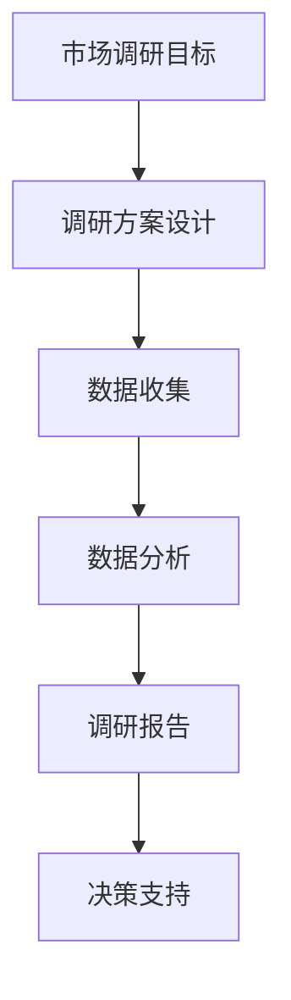
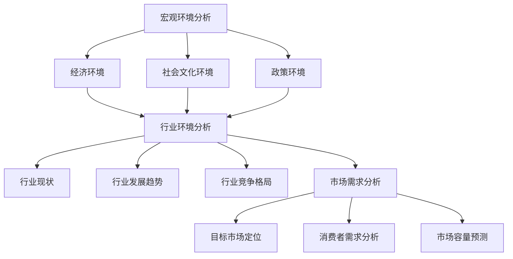
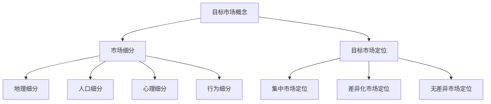
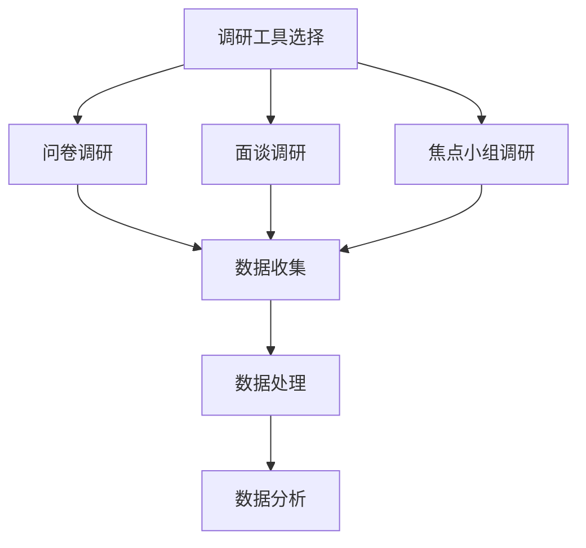
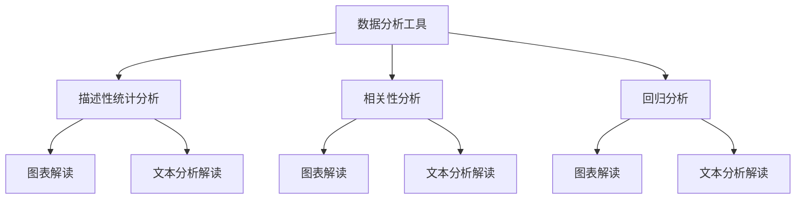
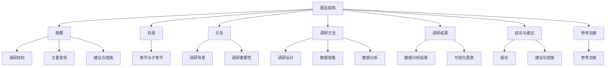
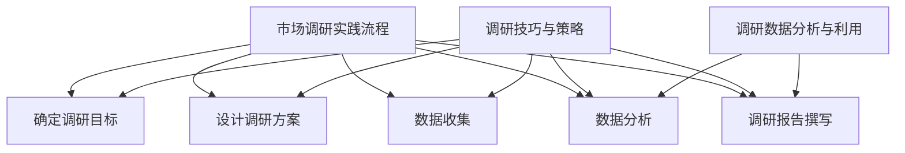

                 


## 文章标题：市场调研：创业者的必备功课

> 关键词：市场调研、创业者、商业策略、数据分析、案例研究

> 摘要：
市场调研是创业者在进入新市场或推出新产品时必不可少的环节。本文通过深入分析市场调研的核心概念、方法、实施流程以及案例分析，旨在帮助创业者更好地理解市场调研的重要性，掌握有效的市场调研技巧，从而为创业成功奠定坚实基础。

### 第一部分：市场调研概述

#### 第1章：市场调研的基本概念

### 第2章：市场环境分析

#### 第3章：目标市场选择

### 第二部分：市场调研实施

#### 第4章：调研工具与方法

#### 第5章：调研数据分析与解读

#### 第6章：调研报告撰写

### 第三部分：市场调研案例与实践

#### 第7章：市场调研案例分析

#### 第8章：市场调研实践指导

### 附录

#### 附录A：市场调研常用工具介绍

#### 附录B：市场调研案例集

## 第1章：市场调研的基本概念

### 1.1 市场调研的定义与重要性

#### 1.1.1 市场调研的定义

市场调研是指通过系统的方法和工具，收集、记录、分析并评估市场信息的过程。其目的是为企业的决策提供数据支持，帮助企业更好地了解市场需求、消费者行为和竞争状况。

#### 1.1.2 市场调研的重要性

市场调研对于创业企业尤为重要，主要体现在以下几个方面：

1. **获取市场信息**：通过市场调研，企业可以获取最新的市场动态、行业趋势和消费者偏好，从而为产品开发和市场定位提供依据。

2. **制定营销策略**：市场调研有助于企业了解竞争对手的策略和市场地位，从而制定出更有效的营销策略。

3. **降低风险**：市场调研可以揭示潜在的市场机会和风险，帮助企业在进入新市场或推出新产品时做出更明智的决策。

### 1.2 市场调研的类型

市场调研可以根据调研的范围和目的进行分类，常见的类型有：

#### 1.2.1 宏观市场调研

宏观市场调研主要关注整个市场环境，包括经济环境、社会文化环境、政策环境等。其目的是为企业的战略规划提供宏观背景。

#### 1.2.2 微观市场调研

微观市场调研主要针对特定市场或目标消费者群体，了解他们的需求和购买行为。其目的是为企业的市场细分和定位提供依据。

#### 1.2.3 专项市场调研

专项市场调研针对特定的市场问题或需求进行深入调研，如新产品市场调研、消费者满意度调研等。其目的是为企业的决策提供具体的数据支持。

### 1.3 市场调研的方法

市场调研的方法多种多样，常见的有：

#### 1.3.1 定性调研

定性调研主要通过访谈、焦点小组讨论等方式，深入了解消费者的需求、动机和行为。其目的是获取深入的理解和洞察。

#### 1.3.2 定量调研

定量调研主要通过问卷调查、统计数据等方式，收集大量的数据，并使用统计分析方法进行分析。其目的是获取广泛的、可量化的数据。

#### 1.3.3 竞争对手分析

竞争对手分析是通过研究竞争对手的产品、策略、市场地位等，了解市场环境和竞争状况。其目的是为企业的市场策略提供参考。

### 1.4 市场调研的流程

市场调研的流程一般包括以下步骤：

#### 1.4.1 确定调研目标

明确调研的目标和问题，为后续的调研工作提供方向。

#### 1.4.2 设计调研方案

制定详细的调研计划，包括调研方法、样本选择、数据收集方式等。

#### 1.4.3 数据收集与分析

通过实地调查、网络调查、访谈等方式收集数据，并进行分析和解读。

#### 1.4.4 调研报告撰写与解读

撰写详细的调研报告，对调研结果进行总结和解读，为企业决策提供依据。

### 1.5 市场调研的核心概念与联系

为了更好地理解市场调研的核心概念，我们可以通过以下Mermaid流程图来展示它们之间的关系：



### 1.6 核心算法原理讲解

在市场调研中，数据分析是关键的一环。以下是一个简单的描述性统计分析的伪代码，用于计算一组数据的均值、中位数和标准差：

```plaintext
function calculateStats(data):
    n = length(data)
    sum = 0
    for each value in data:
        sum += value
    mean = sum / n
    
    sortedData = sort(data)
    if n is odd:
        median = sortedData[n/2]
    else:
        median = (sortedData[n/2 - 1] + sortedData[n/2]) / 2
    
    varianceSum = 0
    for each value in data:
        varianceSum += (value - mean)^2
    stdDev = sqrt(varianceSum / n)
    
    return mean, median, stdDev
```

### 1.7 数学模型和公式讲解

在市场调研中，回归分析是一种常用的数据分析方法。以下是一个简单的线性回归模型的公式：

$$
y = \beta_0 + \beta_1x + \epsilon
$$

其中，\( y \) 是因变量，\( x \) 是自变量，\( \beta_0 \) 和 \( \beta_1 \) 是回归系数，\( \epsilon \) 是误差项。

### 1.8 项目实战

以下是一个简单的市场调研项目实战案例，用于分析某个电商平台的客户满意度。

#### 开发环境搭建

- 使用Python进行数据分析
- 安装必要的数据分析库，如pandas、numpy、matplotlib

#### 源代码实现

```python
import pandas as pd
import numpy as np
import matplotlib.pyplot as plt

# 读取数据
data = pd.read_csv('customer_satisfaction.csv')

# 计算基本统计量
mean = np.mean(data['satisfaction_score'])
median = np.median(data['satisfaction_score'])
std_dev = np.std(data['satisfaction_score'])

# 绘制直方图
plt.hist(data['satisfaction_score'], bins=10)
plt.xlabel('Satisfaction Score')
plt.ylabel('Frequency')
plt.title('Customer Satisfaction Histogram')
plt.show()

# 绘制箱线图
plt.boxplot(data['satisfaction_score'])
plt.xlabel('Satisfaction Score')
plt.title('Customer Satisfaction Boxplot')
plt.show()

# 回归分析
from sklearn.linear_model import LinearRegression
model = LinearRegression()
model.fit(data[['order_quantity']], data['satisfaction_score'])

# 模型评估
print(model.score(data[['order_quantity']], data['satisfaction_score']))

# 预测
predictions = model.predict(data[['order_quantity']])
plt.scatter(data['order_quantity'], data['satisfaction_score'])
plt.plot(data['order_quantity'], predictions, color='red')
plt.xlabel('Order Quantity')
plt.ylabel('Satisfaction Score')
plt.title('Order Quantity vs Satisfaction Score')
plt.show()
```

#### 代码解读与分析

- 数据读取：使用pandas库读取CSV文件，获取客户满意度数据。
- 统计分析：计算均值、中位数、标准差，并绘制直方图和箱线图。
- 回归分析：使用scikit-learn库中的线性回归模型，对订单数量与满意度进行回归分析，并评估模型性能。
- 预测：根据回归模型，对订单数量进行满意度预测，并绘制散点图和回归线。

通过这个实战案例，我们可以看到市场调研中数据分析和项目实现的实际应用。

## 第2章：市场环境分析

### 2.1 宏观环境分析

#### 2.1.1 经济环境

经济环境是市场调研中需要重点关注的宏观环境因素。主要包括：

- **经济增长**：分析国家的GDP增长率、人均收入水平等经济指标，了解市场的总体经济状况。
- **通货膨胀**：监测通货膨胀率，评估物价水平的变动对市场的影响。
- **利率**：研究利率变化对投资和消费行为的影响。

#### 2.1.2 社会文化环境

社会文化环境对市场有深远的影响，主要包括：

- **人口结构**：分析人口年龄分布、教育水平、职业结构等，了解市场的潜在需求和消费习惯。
- **文化价值观**：研究消费者的价值观、生活方式、消费观念等，了解文化差异对市场的影响。

#### 2.1.3 政策环境

政策环境对市场的发展起着重要的引导作用，主要包括：

- **贸易政策**：分析关税、贸易壁垒、进出口政策等，了解政策变化对市场的影响。
- **税收政策**：研究税收政策的变化，评估税收对消费者和企业行为的影响。
- **法律法规**：关注相关法律法规的制定和实施，了解政策对市场的规范作用。

### 2.2 行业环境分析

#### 2.2.1 行业现状

行业环境分析需要深入了解当前行业的市场规模、增长速度、主要参与者等。主要包括：

- **市场规模**：分析行业的总销售额、市场份额等，了解行业的整体规模。
- **增长速度**：评估行业的增长率，了解市场的发展趋势。
- **主要参与者**：研究行业内的主要企业，了解它们的市场地位、产品特点等。

#### 2.2.2 行业发展趋势

行业发展趋势分析旨在预测行业的未来发展方向和潜在机会。主要包括：

- **技术进步**：分析新技术对行业的影响，预测技术发展带来的市场机会。
- **消费趋势**：研究消费者的需求变化，预测未来市场的消费趋势。
- **政策变化**：评估政策变化对行业的影响，预测政策变化带来的市场机会。

#### 2.2.3 行业竞争格局

行业竞争格局分析需要了解行业内企业的竞争状况，主要包括：

- **市场份额**：分析主要企业的市场份额，了解行业内的竞争态势。
- **产品差异化**：研究企业的产品差异策略，了解不同企业在市场上的定位。
- **市场进入和退出**：分析新企业进入市场和现有企业退出市场的趋势，了解市场的动态变化。

### 2.3 市场需求分析

#### 2.3.1 目标市场定位

目标市场定位是企业市场战略的核心。主要包括：

- **市场细分**：根据消费者的需求和特征，将市场划分为不同的子市场。
- **目标市场选择**：选择具有最大潜力和最适合企业资源的目标市场。
- **市场定位策略**：制定差异化的市场定位策略，以区分自身产品与竞争对手。

#### 2.3.2 消费者需求分析

消费者需求分析是市场调研的重要组成部分。主要包括：

- **需求特征**：研究消费者的需求特征，了解消费者对产品的期望和偏好。
- **购买行为**：分析消费者的购买行为，了解消费者如何做出购买决策。
- **需求变化**：预测消费者的需求变化趋势，了解市场动态。

#### 2.3.3 市场容量预测

市场容量预测是评估市场潜力的关键。主要包括：

- **现有市场容量**：分析当前市场的实际销售额和潜在销售额。
- **未来市场容量**：预测未来的市场增长趋势和潜在市场机会。
- **市场份额预测**：评估企业未来在市场中的地位和市场份额。

### 2.4 核心概念与联系

为了更好地理解市场环境分析的核心概念，我们可以通过以下Mermaid流程图来展示它们之间的关系：



### 2.5 核心算法原理讲解

在市场环境分析中，回归分析是一种常用的数据分析方法，用于预测市场变量之间的关系。以下是一个简单的线性回归模型的伪代码：

```plaintext
function linearRegression(x, y):
    n = length(x)
    x_mean = mean(x)
    y_mean = mean(y)
    
    sum_x_square = 0
    sum_xy = 0
    for i = 1 to n:
        sum_x_square += (x[i] - x_mean)^2
        sum_xy += (x[i] - x_mean) * (y[i] - y_mean)
    
    beta_1 = sum_xy / sum_x_square
    beta_0 = y_mean - beta_1 * x_mean
    
    return beta_0, beta_1
```

### 2.6 数学模型和公式讲解

在市场环境分析中，供需模型是一个重要的工具，用于预测市场均衡价格和数量。以下是一个简单的供需模型的公式：

$$
Q_d = Q_s
$$

其中，\( Q_d \) 是需求量，\( Q_s \) 是供给量。

### 2.7 项目实战

以下是一个市场环境分析的项目实战案例，用于分析某电子商务行业的市场需求。

#### 开发环境搭建

- 使用Python进行数据分析
- 安装必要的数据分析库，如pandas、numpy、matplotlib

#### 源代码实现

```python
import pandas as pd
import numpy as np
import matplotlib.pyplot as plt

# 读取数据
data = pd.read_csv('e-commerce_data.csv')

# 绘制需求曲线
plt.scatter(data['price'], data['quantity'])
plt.xlabel('Price')
plt.ylabel('Quantity')
plt.title('Demand Curve')
plt.show()

# 绘制供给曲线
plt.scatter(data['price'], data['supply'])
plt.xlabel('Price')
plt.ylabel('Supply')
plt.title('Supply Curve')
plt.show()

# 求解市场均衡价格和数量
price = np.interp(data['quantity'], data['supply'], data['price'])
quantity = np.interp(data['supply'], data['price'], data['quantity'])

# 输出市场均衡价格和数量
print(f"Market equilibrium price: {price}")
print(f"Market equilibrium quantity: {quantity}")

# 绘制供需曲线
plt.plot(data['price'], data['quantity'], label='Demand')
plt.plot(data['price'], data['supply'], label='Supply')
plt.xlabel('Price')
plt.ylabel('Quantity')
plt.title('Supply and Demand')
plt.legend()
plt.show()
```

#### 代码解读与分析

- 数据读取：使用pandas库读取CSV文件，获取电子商务数据。
- 需求曲线和供给曲线绘制：使用matplotlib库绘制需求曲线和供给曲线。
- 求解市场均衡：使用线性插值法求解市场均衡价格和数量。
- 绘制供需曲线：使用matplotlib库绘制供需曲线，展示市场均衡状态。

通过这个实战案例，我们可以看到市场环境分析中的供需模型在实际应用中的效果。

## 第3章：目标市场选择

### 3.1 目标市场的概念

#### 3.1.1 目标市场的定义

目标市场是企业选择进行市场定位和营销活动的特定市场部分。它是企业根据自身资源和市场需求，从整个市场中划分出来的最具潜力和最高回报的市场。

#### 3.1.2 目标市场的作用

目标市场对企业具有重要意义，主要体现在以下几个方面：

- **资源优化**：明确目标市场可以帮助企业集中资源，避免资源的浪费，提高市场竞争力。
- **营销策略制定**：目标市场为企业的营销策略提供了明确的方向，帮助企业制定针对性的营销计划。
- **风险控制**：通过选择目标市场，企业可以降低市场不确定性，降低市场风险。

### 3.2 市场细分

#### 3.2.1 市场细分的概念

市场细分是指将整个市场按照一定的标准划分为若干个具有相似需求的子市场。市场细分可以帮助企业更准确地定位目标市场，从而提高市场竞争力。

#### 3.2.2 市场细分的原则

进行市场细分时，需要遵循以下原则：

- **可衡量性**：细分的市场部分应该具有明确的衡量标准，以便进行定量分析。
- **可进入性**：细分的市场部分应该是企业能够进入并实现有效营销的市场。
- **差异性**：细分的市场部分应该具有明显的差异，以便企业能够针对不同的市场制定不同的营销策略。
- **稳定性**：细分的市场部分应该是相对稳定的，以便企业能够长期开展营销活动。

#### 3.2.3 市场细分的方法

市场细分的方法多种多样，以下是一些常见的方法：

- **地理细分**：根据地理位置将市场划分为不同的区域。
- **人口细分**：根据人口统计数据将市场划分为不同的群体，如年龄、性别、收入等。
- **心理细分**：根据消费者的心理特征和行为习惯将市场划分为不同的群体。
- **行为细分**：根据消费者的购买行为和消费习惯将市场划分为不同的群体。

### 3.3 目标市场定位

#### 3.3.1 目标市场定位的策略

目标市场定位是企业根据自身资源和市场需求，选择一个或多个细分市场，并将其作为企业主要服务对象的过程。以下是几种常见的目标市场定位策略：

- **集中市场定位**：企业选择一个细分市场进行集中营销，专注于该市场的需求，提供针对性的产品和服务。
- **差异化市场定位**：企业选择多个细分市场，为每个市场提供独特的产品和服务，以满足不同市场的需求。
- **无差异市场定位**：企业不进行市场细分，为整个市场提供统一的产品和服务，追求市场份额最大化。

#### 3.3.2 定位策略的执行

执行目标市场定位策略需要以下几个步骤：

- **市场调研**：通过市场调研了解目标市场的需求、竞争状况等，为定位策略提供数据支持。
- **产品定位**：根据市场需求和竞争状况，确定产品的定位，包括产品特性、价格、品牌形象等。
- **营销策略制定**：根据产品定位，制定相应的营销策略，包括广告宣传、渠道选择、促销活动等。

### 3.4 核心概念与联系

为了更好地理解目标市场选择的核心概念，我们可以通过以下Mermaid流程图来展示它们之间的关系：



### 3.5 核心算法原理讲解

在目标市场选择中，聚类分析是一种常用的数据分析方法，用于将市场划分为不同的细分市场。以下是一个简单的K-means聚类的伪代码：

```plaintext
function KMeans(data, k):
    Initialize centroids randomly
    while not converged:
        for each data point:
            Assign the data point to the nearest centroid
        Update centroids as the mean of the assigned data points
        Check for convergence (e.g., centroid change threshold)
    return centroids, labels
```

### 3.6 数学模型和公式讲解

在目标市场选择中，顾客终身价值（CLV）是一个重要的指标，用于评估客户为企业带来的长期价值。以下是一个简单的CLV计算公式：

$$
CLV = \sum_{t=1}^{n} (1 + r)^{-t} \times (P \times c \times p)
$$

其中，\( r \) 是折现率，\( P \) 是客户的购买概率，\( c \) 是客户的平均消费金额，\( p \) 是客户的生命周期。

### 3.7 项目实战

以下是一个目标市场选择的项目实战案例，用于分析某电子商务平台的目标市场。

#### 开发环境搭建

- 使用Python进行数据分析
- 安装必要的数据分析库，如pandas、numpy、scikit-learn、matplotlib

#### 源代码实现

```python
import pandas as pd
import numpy as np
from sklearn.cluster import KMeans
import matplotlib.pyplot as plt

# 读取数据
data = pd.read_csv('customer_data.csv')

# 数据预处理
data['age'] = data['age'].astype(float)
data['annual_income'] = data['annual_income'].astype(float)
data['spending_score'] = data['spending_score'].astype(float)

# 使用K-means聚类进行市场细分
kmeans = KMeans(n_clusters=3, random_state=0)
data['cluster'] = kmeans.fit_predict(data[['age', 'annual_income', 'spending_score']])

# 绘制聚类结果
plt.scatter(data['age'], data['annual_income'], c=data['cluster'])
plt.xlabel('Age')
plt.ylabel('Annual Income')
plt.title('Customer Segmentation')
plt.show()

# 计算每个细分市场的平均消费金额
segment_means = data.groupby('cluster')['spending_score'].mean()
print(segment_means)
```

#### 代码解读与分析

- 数据读取：使用pandas库读取CSV文件，获取客户数据。
- 数据预处理：将数据转换为浮点型，便于聚类分析。
- K-means聚类：使用scikit-learn库中的KMeans类进行聚类分析，将客户划分为三个细分市场。
- 绘制聚类结果：使用matplotlib库绘制聚类结果，展示不同细分市场的分布情况。
- 计算每个细分市场的平均消费金额：使用pandas库计算每个细分市场的平均消费金额，为市场定位提供数据支持。

通过这个实战案例，我们可以看到目标市场选择中聚类分析的实际应用。

## 第4章：调研工具与方法

### 4.1 调研工具选择

#### 4.1.1 问卷调研

问卷调研是一种常见的定量调研方法，通过设计问卷，收集大量样本的定量数据。以下是选择问卷调研时应考虑的因素：

- **问卷设计原则**：问卷应简洁明了，避免冗长和复杂，以提高受访者的回答意愿和准确性。
- **问卷发放与回收**：问卷可以通过线上或线下方式发放，并采用适当的回收策略，如激励机制，以提高回收率。

#### 4.1.2 面谈调研

面谈调研是一种定性调研方法，通过访谈深入了解受访者的观点和想法。以下是选择面谈调研时应考虑的因素：

- **面谈技巧**：访谈者应具备良好的沟通能力和观察力，以便引导受访者深入回答问题。
- **数据分析**：面谈调研的数据分析通常较为复杂，需要运用定性分析方法，如主题分析和内容分析。

#### 4.1.3 焦点小组调研

焦点小组调研是一种集体访谈方法，通过召集一组具有代表性的受访者，集体讨论和交流观点。以下是选择焦点小组调研时应考虑的因素：

- **焦点小组的组成**：小组成员应具备多样性，包括年龄、性别、职业等，以便获得全面的视角。
- **调研流程**：焦点小组调研应按照预定的流程进行，包括开场、讨论和总结等环节。

### 4.2 调研方法实施

#### 4.2.1 数据收集的实施步骤

- **确定调研目标**：明确调研的目的和问题，为后续的数据收集提供指导。
- **设计调研工具**：根据调研目标，选择合适的调研工具和方法，如问卷、面谈或焦点小组。
- **样本选择**：确定调研样本的代表性，确保样本能够反映总体特征。
- **数据收集方法**：采用合适的收集方法，如线上问卷调查、面对面访谈或焦点小组讨论。

#### 4.2.2 数据处理的实施步骤

- **数据清洗**：去除无效数据和错误数据，确保数据质量。
- **数据转换**：将数据转换为适合分析的形式，如数值化或分类化。
- **数据存储**：将数据存储在合适的数据库或文件中，以便后续分析和查询。
- **数据分析**：运用统计分析和定性分析方法，解读数据，获取调研结果。

### 4.3 核心概念与联系

为了更好地理解调研工具与方法，我们可以通过以下Mermaid流程图来展示它们之间的关系：



### 4.4 核心算法原理讲解

在调研数据处理中，数据聚类是一种常用的分析方法，用于将数据点按照相似性进行分组。以下是一个简单的K-means聚类的伪代码：

```plaintext
function KMeans(data, k):
    Initialize centroids randomly
    while not converged:
        for each data point:
            Assign the data point to the nearest centroid
        Update centroids as the mean of the assigned data points
        Check for convergence (e.g., centroid change threshold)
    return centroids, labels
```

### 4.5 数学模型和公式讲解

在调研数据处理中，线性回归是一种常用的统计分析方法，用于预测因变量和自变量之间的关系。以下是一个简单的线性回归模型的公式：

$$
y = \beta_0 + \beta_1x + \epsilon
$$

其中，\( y \) 是因变量，\( x \) 是自变量，\( \beta_0 \) 和 \( \beta_1 \) 是回归系数，\( \epsilon \) 是误差项。

### 4.6 项目实战

以下是一个调研工具与方法的项目实战案例，用于分析消费者对某新产品的接受程度。

#### 开发环境搭建

- 使用Python进行数据分析
- 安装必要的数据分析库，如pandas、numpy、scikit-learn、matplotlib

#### 源代码实现

```python
import pandas as pd
import numpy as np
from sklearn.cluster import KMeans
import matplotlib.pyplot as plt

# 读取数据
data = pd.read_csv('consumer_data.csv')

# 数据预处理
data['satisfaction'] = data['satisfaction'].astype(float)
data['price'] = data['price'].astype(float)

# 使用K-means聚类进行消费者分组
kmeans = KMeans(n_clusters=3, random_state=0)
data['group'] = kmeans.fit_predict(data[['satisfaction', 'price']])

# 绘制聚类结果
plt.scatter(data['satisfaction'], data['price'], c=data['group'])
plt.xlabel('Satisfaction')
plt.ylabel('Price')
plt.title('Consumer Segmentation')
plt.show()

# 计算每个组的平均满意度
group_means = data.groupby('group')['satisfaction'].mean()
print(group_means)
```

#### 代码解读与分析

- 数据读取：使用pandas库读取CSV文件，获取消费者数据。
- 数据预处理：将数据转换为浮点型，便于聚类分析。
- K-means聚类：使用scikit-learn库中的KMeans类进行聚类分析，将消费者划分为三个组。
- 绘制聚类结果：使用matplotlib库绘制聚类结果，展示不同组的分布情况。
- 计算每个组的平均满意度：使用pandas库计算每个组的平均满意度，为市场定位提供数据支持。

通过这个实战案例，我们可以看到调研工具与方法在实际应用中的效果。

## 第5章：调研数据分析与解读

### 5.1 数据分析工具

#### 5.1.1 常用数据分析软件

在数据分析领域，有许多强大的工具可供选择。以下是几种常用的数据分析软件及其特点：

- **SPSS**：SPSS（Statistical Package for the Social Sciences）是一种广泛使用的统计分析软件，特别适合社会科学领域的数据分析。它提供了丰富的统计函数和图形工具，支持从数据导入、预处理到数据分析的全流程。

- **Excel**：Excel是微软公司推出的电子表格软件，具有简单易用的界面和强大的数据处理能力。它支持各种数据透视表、图表和公式，适合进行简单的数据分析和展示。

- **R**：R是一种专门用于统计分析的数据分析语言和软件环境。它提供了丰富的数据可视化工具和统计分析库，特别适合进行复杂数据分析和机器学习应用。

#### 5.1.2 数据分析软件的功能

这些数据分析软件各具特色，但它们通常具备以下功能：

- **数据导入与导出**：支持从各种数据源（如CSV、Excel、数据库等）导入数据，并可以将分析结果导出为不同的格式（如PDF、Excel、图片等）。

- **数据清洗与预处理**：包括数据缺失值处理、异常值检测、数据转换等功能，以确保数据质量。

- **描述性统计分析**：计算均值、中位数、标准差等基本统计量，生成频率分布表、交叉表等。

- **高级统计分析**：包括回归分析、因子分析、聚类分析等，用于深入分析数据关系。

- **数据可视化**：生成各种图表（如柱状图、线图、饼图等），帮助用户直观理解数据。

### 5.2 数据分析技术

#### 5.2.1 描述性统计分析

描述性统计分析是对数据进行基本描述的方法，主要包括以下内容：

- **均值**：一组数据的平均值，反映数据的集中趋势。
- **中位数**：将一组数据从小到大排列，位于中间位置的值，也反映数据的集中趋势。
- **众数**：一组数据中出现次数最多的值，反映数据的集中趋势。
- **标准差**：数据分布的离散程度，标准差越大，数据分布越分散。

#### 5.2.2 相关性分析

相关性分析用于研究两个或多个变量之间的关系，主要有以下几种方法：

- **皮尔逊相关系数**：衡量两个变量线性关系的强度和方向，取值范围为-1到1。
- **斯皮尔曼等级相关系数**：衡量两个变量之间非参数关系的相关性，适用于非正态分布的数据。

#### 5.2.3 回归分析

回归分析是一种重要的数据分析技术，用于研究因变量和自变量之间的关系。以下是几种常见的回归分析方法：

- **线性回归**：研究一个因变量和一个或多个自变量之间的线性关系。
- **多元回归**：研究一个因变量和多个自变量之间的线性关系。
- **逻辑回归**：用于处理因变量为分类变量（如二分类）的回归分析。

### 5.3 数据解读

#### 5.3.1 数据解读方法

数据解读是将分析结果转化为有用信息的过程，主要包括以下方法：

- **图表解读**：通过图表（如柱状图、饼图、散点图等）展示数据，帮助用户直观理解分析结果。
- **文本分析解读**：将分析结果以文字形式呈现，详细解释数据的含义和影响。

#### 5.3.2 数据解读的注意事项

在进行数据解读时，需要注意以下几点：

- **数据真实性与可靠性**：确保数据的真实性和可靠性，避免误导性解读。
- **数据解读的全面性**：从多个角度解读数据，避免片面理解。
- **数据解读的客观性**：避免主观判断，以事实为依据进行解读。

### 5.4 核心概念与联系

为了更好地理解调研数据分析与解读的核心概念，我们可以通过以下Mermaid流程图来展示它们之间的关系：



### 5.5 核心算法原理讲解

在数据分析与解读中，主成分分析（PCA）是一种常用的降维技术，用于减少数据维度，同时保持数据的主要信息。以下是主成分分析的基本步骤：

```plaintext
function PCA(data, n_components):
    Center the data
    Compute the covariance matrix
    Compute the eigenvalues and eigenvectors of the covariance matrix
    Sort the eigenvectors by decreasing eigenvalues
    Select the top n_components eigenvectors
    Project the data onto the selected eigenvectors
    return transformed data
```

### 5.6 数学模型和公式讲解

在数据分析与解读中，线性回归模型是一个重要的工具，用于研究变量之间的关系。以下是一个简单的线性回归模型公式：

$$
y = \beta_0 + \beta_1x + \epsilon
$$

其中，\( y \) 是因变量，\( x \) 是自变量，\( \beta_0 \) 和 \( \beta_1 \) 是回归系数，\( \epsilon \) 是误差项。

### 5.7 项目实战

以下是一个调研数据分析与解读的项目实战案例，用于分析消费者对某电商平台的满意度。

#### 开发环境搭建

- 使用Python进行数据分析
- 安装必要的数据分析库，如pandas、numpy、scikit-learn、matplotlib

#### 源代码实现

```python
import pandas as pd
import numpy as np
from sklearn.linear_model import LinearRegression
import matplotlib.pyplot as plt

# 读取数据
data = pd.read_csv('customer_satisfaction.csv')

# 数据预处理
data['satisfaction'] = data['satisfaction'].astype(float)
data['service_rating'] = data['service_rating'].astype(float)
data['delivery_time'] = data['delivery_time'].astype(float)

# 线性回归分析
model = LinearRegression()
model.fit(data[['service_rating', 'delivery_time']], data['satisfaction'])

# 模型评估
print(model.score(data[['service_rating', 'delivery_time']], data['satisfaction']))

# 预测
predictions = model.predict(data[['service_rating', 'delivery_time']])

# 绘制散点图
plt.scatter(data['service_rating'], data['satisfaction'])
plt.plot(data['service_rating'], predictions, color='red')
plt.xlabel('Service Rating')
plt.ylabel('Satisfaction')
plt.title('Service Rating vs Satisfaction')
plt.show()
```

#### 代码解读与分析

- 数据读取：使用pandas库读取CSV文件，获取消费者满意度数据。
- 数据预处理：将数据转换为浮点型，便于线性回归分析。
- 线性回归分析：使用scikit-learn库中的LinearRegression类进行线性回归分析。
- 模型评估：计算模型的决定系数（\( R^2 \)），评估模型的拟合度。
- 预测：使用模型对满意度进行预测，并绘制散点图和回归线，展示服务评分与满意度之间的关系。

通过这个实战案例，我们可以看到调研数据分析与解读在实际应用中的效果。

## 第6章：调研报告撰写

### 6.1 报告结构

#### 6.1.1 报告的组成部分

一个完整的调研报告通常包括以下几个部分：

- **摘要**：简要概述调研的目的、方法、主要发现和建议。
- **目录**：列出报告的章节和子章节，便于读者快速找到感兴趣的内容。
- **引言**：介绍调研的背景、目的和重要性。
- **调研方法**：详细说明调研的设计、数据收集和分析方法。
- **调研结果**：展示调研的数据分析结果，包括统计分析和可视化图表。
- **结论与建议**：总结调研的主要发现，并提出具体的建议和措施。
- **参考文献**：列出报告中所引用的文献和资料。

#### 6.1.2 报告的撰写技巧

撰写调研报告时，应注意以下几点：

- **逻辑清晰**：报告的结构应清晰，内容应连贯，避免逻辑混乱。
- **语言简洁**：报告的语言应简洁明了，避免冗长和复杂的句子。
- **数据准确**：报告中的数据应准确无误，确保数据来源可靠。
- **图表合理**：报告中的图表应合理，能够直观地展示数据和分析结果。
- **结论具体**：报告的结论和建议应具体可行，避免空洞和泛泛而谈。

### 6.2 数据可视化

#### 6.2.1 数据可视化工具

数据可视化是调研报告的重要组成部分，以下是一些常用的数据可视化工具：

- **Matplotlib**：Python的一个绘图库，用于生成各种2D图表。
- **Tableau**：一个强大的数据可视化工具，支持多种数据源和图表类型。
- **Power BI**：微软推出的一款数据可视化工具，与Excel紧密集成。

#### 6.2.2 数据可视化方法

在数据可视化中，以下是一些常见的方法：

- **柱状图**：用于比较不同类别的数据。
- **线图**：用于展示数据的变化趋势。
- **饼图**：用于展示数据在不同类别中的比例。
- **散点图**：用于展示两个变量之间的关系。
- **箱线图**：用于展示数据的分布和离散程度。

### 6.3 调研结果展示

#### 6.3.1 调研结果的展示形式

调研结果的展示形式应多样化，以便读者更好地理解和吸收信息。以下是一些常见的展示形式：

- **文字报告**：用文字详细描述调研结果和分析过程。
- **图表报告**：通过图表展示调研结果，包括柱状图、线图、饼图等。
- **PPT报告**：使用PowerPoint制作汇报幻灯片，展示关键数据和结论。

#### 6.3.2 调研结果的分析与建议

在调研结果展示中，应注重以下两点：

- **数据分析**：对调研结果进行详细分析，揭示数据背后的含义和趋势。
- **建议与措施**：基于分析结果，提出具体的建议和改进措施，为企业决策提供依据。

### 6.4 核心概念与联系

为了更好地理解调研报告撰写的核心概念，我们可以通过以下Mermaid流程图来展示它们之间的关系：



### 6.5 核心算法原理讲解

在调研报告撰写中，词云生成是一种常用的数据分析技术，用于展示文本数据的关键词分布。以下是一个简单的词云生成算法的伪代码：

```plaintext
function generateWordCloud(text):
    1. Preprocess the text (remove punctuation, convert to lowercase)
    2. Count the frequency of each word
    3. Sort the words by frequency
    4. Generate a word cloud using a word cloud library (e.g., wordcloud in Python)
    5. Return the word cloud image
```

### 6.6 数学模型和公式讲解

在调研报告撰写中，回归分析是一种常用的统计方法，用于预测变量之间的关系。以下是一个简单的线性回归模型公式：

$$
y = \beta_0 + \beta_1x + \epsilon
$$

其中，\( y \) 是因变量，\( x \) 是自变量，\( \beta_0 \) 和 \( \beta_1 \) 是回归系数，\( \epsilon \) 是误差项。

### 6.7 项目实战

以下是一个调研报告撰写的项目实战案例，用于分析某电子商务平台的市场调研结果。

#### 开发环境搭建

- 使用Python进行数据分析
- 安装必要的数据分析库，如pandas、numpy、matplotlib、wordcloud

#### 源代码实现

```python
import pandas as pd
import numpy as np
import matplotlib.pyplot as plt
from wordcloud import WordCloud

# 读取数据
data = pd.read_csv('market_research_data.csv')

# 数据预处理
data['comments'] = data['comments'].astype(str)

# 生成词云
wordcloud = WordCloud(width=800, height=400, background_color='white').generate(data['comments'])

# 显示词云
plt.figure(figsize=(10, 5))
plt.imshow(wordcloud, interpolation='bilinear')
plt.axis('off')
plt.show()

# 绘制柱状图
data['rating'].value_counts().plot(kind='bar')
plt.xlabel('Rating')
plt.ylabel('Frequency')
plt.title('Rating Distribution')
plt.show()

# 线性回归分析
model = LinearRegression()
model.fit(data[['rating']], data['sales'])

# 模型评估
print(model.score(data[['rating']], data['sales']))

# 预测
predictions = model.predict(data[['rating']])

# 绘制散点图
plt.scatter(data['rating'], data['sales'])
plt.plot(data['rating'], predictions, color='red')
plt.xlabel('Rating')
plt.ylabel('Sales')
plt.title('Rating vs Sales')
plt.show()
```

#### 代码解读与分析

- 数据读取：使用pandas库读取CSV文件，获取市场调研数据。
- 数据预处理：将文本数据转换为字符串，便于词云生成。
- 词云生成：使用wordcloud库生成词云，展示评论的关键词分布。
- 柱状图绘制：使用matplotlib库绘制柱状图，展示评分的分布情况。
- 线性回归分析：使用scikit-learn库中的LinearRegression类进行线性回归分析，评估评分与销售额之间的关系。
- 预测与散点图：使用模型对销售额进行预测，并绘制散点图，展示评分与销售额的散点分布。

通过这个实战案例，我们可以看到调研报告撰写中数据可视化和统计分析的实际应用。

## 第7章：市场调研案例分析

### 7.1 案例背景

#### 7.1.1 案例企业的介绍

某初创公司（以下简称“公司”）成立于2022年，旨在开发一款创新性的移动应用，为用户提供便捷的在线购物体验。公司由一群年轻的创业者创立，他们在技术、设计和市场营销方面都有丰富的经验。

#### 7.1.2 案例调研的目的

公司决定在进入市场之前进行一次全面的市场调研，旨在：

- 了解潜在用户的需求和期望。
- 分析竞争对手的市场策略和产品特点。
- 预测市场的潜在规模和增长趋势。
- 为产品开发和市场推广提供数据支持。

### 7.2 调研实施过程

#### 7.2.1 调研工具与方法的选择

公司选择了以下几种调研工具和方法：

- **问卷调查**：通过在线问卷收集用户对移动应用的需求和意见。
- **焦点小组**：组织一组用户进行深入讨论，了解他们对产品的看法和期望。
- **竞争对手分析**：研究主要竞争对手的市场策略和产品特点。
- **市场数据分析**：分析行业报告和市场研究数据，了解市场趋势和用户行为。

#### 7.2.2 调研数据的收集与分析

- **问卷调查**：公司设计了一份包含20个问题的在线问卷，通过社交媒体和电子邮件发送给潜在的早期用户。共收集到500份有效问卷。
- **焦点小组**：公司组织了4个焦点小组，每个小组包括5-7名潜在用户。小组讨论持续了2小时，全程录音并进行了文字记录。
- **竞争对手分析**：公司对5家主要竞争对手的产品和策略进行了详细分析，包括产品功能、用户评价和市场营销活动。
- **市场数据分析**：公司购买了相关的行业报告，分析了市场趋势和用户行为数据。

### 7.3 调研结果分析

#### 7.3.1 调研结果的数据解读

通过对收集到的数据进行分析，公司得出以下结论：

- **用户需求**：大多数用户希望应用具有简洁的界面、丰富的商品分类和便捷的支付功能。
- **市场竞争**：竞争对手主要集中在提供低价商品和促销活动，而公司有机会通过提供更好的用户体验和个性化服务来区分自身。
- **市场趋势**：移动购物市场增长迅速，用户对移动应用的接受度不断提高。

#### 7.3.2 调研结果的业务解读

基于调研结果，公司制定了以下市场策略：

- **产品开发**：公司将重点开发应用的界面设计和支付功能，确保用户体验良好。
- **市场定位**：公司决定定位为提供高品质商品和个性化服务的移动购物平台。
- **市场营销**：公司计划通过社交媒体和KOL（关键意见领袖）进行市场推广，吸引早期用户。

### 7.4 调研报告撰写

#### 7.4.1 案例调研报告的结构

调研报告的结构如下：

- **摘要**：简要介绍调研目的、方法和主要发现。
- **引言**：介绍案例背景和调研的重要性。
- **调研方法**：详细说明调研工具和方法。
- **调研结果**：展示数据分析结果，包括问卷调查、焦点小组和竞争对手分析。
- **结论与建议**：总结调研结果，并提出产品开发、市场定位和市场营销的建议。

#### 7.4.2 案例调研报告的内容

调研报告的内容包括：

- **用户需求分析**：展示用户对移动应用的需求和期望。
- **市场竞争分析**：分析主要竞争对手的市场策略和产品特点。
- **市场趋势分析**：展示市场增长趋势和用户行为数据。
- **产品开发建议**：基于用户需求和市场竞争，提出产品开发的建议。
- **市场定位策略**：基于市场趋势和用户需求，提出市场定位的建议。
- **市场营销策略**：基于用户反馈和市场趋势，提出市场营销的建议。

通过这个案例，我们可以看到市场调研在创业企业中的关键作用，以及如何通过调研数据指导产品开发和市场策略。

## 第8章：市场调研实践指导

### 8.1 市场调研实践流程

#### 8.1.1 实践流程的步骤

进行市场调研的实践流程可以分为以下几个步骤：

1. **确定调研目标**：明确调研的具体目标，如了解用户需求、分析市场竞争状况、预测市场趋势等。
2. **设计调研方案**：根据调研目标，制定详细的调研计划，包括调研方法、样本选择、数据收集方式等。
3. **数据收集**：采用合适的调研方法收集数据，如问卷调查、访谈、焦点小组讨论等。
4. **数据分析**：对收集到的数据进行分析，包括描述性统计分析、相关性分析、回归分析等。
5. **调研报告撰写**：撰写详细的调研报告，对调研结果进行总结和解读，提出结论和建议。

#### 8.1.2 实践流程的注意事项

在进行市场调研实践时，需要注意以下几点：

- **确保调研目标的明确性**：调研目标应具体、可衡量，以便后续的数据分析和决策。
- **选择合适的调研工具和方法**：根据调研目标和实际情况，选择合适的调研工具和方法，确保数据的准确性和可靠性。
- **保证数据收集与分析的准确性**：在数据收集和分析过程中，应保持客观、公正，避免主观偏见和误差。
- **重视数据的真实性和可靠性**：确保数据的真实性和可靠性，避免因数据问题导致决策失误。

### 8.2 调研技巧与策略

#### 8.2.1 调研问题的设计

设计调研问题时，应遵循以下原则：

- **问题的明确性**：问题应简洁明了，避免含糊不清或误导性的表述。
- **问题的适当性**：问题应与调研目标相关，能够提供有价值的信息。
- **问题的开放性**：尽量设计开放性问题，以鼓励受访者提供详细的回答。

#### 8.2.2 调研对象的选择

选择调研对象时，应注意以下几点：

- **代表性**：样本应具有代表性，能够反映总体特征。
- **多样性**：样本应具备多样性，包括不同年龄、性别、职业等，以便获取全面的视角。
- **样本量**：样本量应足够大，以确保数据的可靠性和统计显著性。

### 8.3 调研数据分析与利用

#### 8.3.1 数据分析的方法与应用

数据分析的方法多种多样，以下是一些常见的方法：

- **描述性统计分析**：用于描述数据的基本特征，如均值、中位数、标准差等。
- **相关性分析**：用于分析变量之间的关系，如皮尔逊相关系数、斯皮尔曼等级相关系数等。
- **回归分析**：用于建立变量之间的关系模型，如线性回归、多元回归等。

#### 8.3.2 数据分析结果的利用

数据分析结果可以为企业的决策提供重要支持，以下是如何利用数据分析结果的建议：

- **市场定位**：通过分析用户需求和市场趋势，确定企业的市场定位和目标市场。
- **产品开发**：根据用户反馈和需求，优化产品设计，开发符合市场需求的创新产品。
- **营销策略**：基于市场数据和用户行为，制定有效的营销策略，提高市场竞争力。
- **风险管理**：通过分析市场环境和竞争状况，评估潜在的风险，制定相应的风险管理策略。

### 8.4 核心概念与联系

为了更好地理解市场调研实践指导的核心概念，我们可以通过以下Mermaid流程图来展示它们之间的关系：



### 8.5 核心算法原理讲解

在市场调研中，数据分析是一个关键环节，以下是一个简单的描述性统计分析的算法原理：

```plaintext
function descriptiveStatistics(data):
    mean = sum(data) / length(data)
    median = medianOf(data)
    mode = modeOf(data)
    variance = sum((x - mean)^2 for x in data) / length(data)
    std_dev = sqrt(variance)
    return mean, median, mode, variance, std_dev
```

### 8.6 数学模型和公式讲解

在市场调研中，回归分析是一种常用的数学模型，用于预测变量之间的关系。以下是一个简单的线性回归模型的公式：

$$
y = \beta_0 + \beta_1x + \epsilon
$$

其中，\( y \) 是因变量，\( x \) 是自变量，\( \beta_0 \) 和 \( \beta_1 \) 是回归系数，\( \epsilon \) 是误差项。

### 8.7 项目实战

以下是一个市场调研实践指导的项目实战案例，用于分析某电子商务平台的市场调研数据。

#### 开发环境搭建

- 使用Python进行数据分析
- 安装必要的数据分析库，如pandas、numpy、scikit-learn、matplotlib

#### 源代码实现

```python
import pandas as pd
import numpy as np
from sklearn.linear_model import LinearRegression
import matplotlib.pyplot as plt

# 读取数据
data = pd.read_csv('market_research_data.csv')

# 数据预处理
data['sales'] = pd.to_numeric(data['sales'], errors='coerce')
data['rating'] = pd.to_numeric(data['rating'], errors='coerce')

# 剔除缺失值
data = data.dropna()

# 线性回归分析
model = LinearRegression()
model.fit(data[['rating']], data['sales'])

# 模型评估
print(model.score(data[['rating']], data['sales']))

# 预测
predictions = model.predict(data[['rating']])

# 绘制散点图
plt.scatter(data['rating'], data['sales'])
plt.plot(data['rating'], predictions, color='red')
plt.xlabel('Rating')
plt.ylabel('Sales')
plt.title('Rating vs Sales')
plt.show()
```

#### 代码解读与分析

- 数据读取：使用pandas库读取CSV文件，获取市场调研数据。
- 数据预处理：将文本数据转换为数值型，剔除缺失值。
- 线性回归分析：使用scikit-learn库中的LinearRegression类进行线性回归分析。
- 模型评估：计算模型的决定系数（\( R^2 \)），评估模型的拟合度。
- 预测与散点图：使用模型对销售额进行预测，并绘制散点图，展示评分与销售额的散点分布。

通过这个实战案例，我们可以看到市场调研实践指导在实际应用中的效果。

## 附录

### 附录A：市场调研常用工具介绍

#### 附录A.1 问卷设计工具

- **SurveyMonkey**：一款广泛使用的在线问卷设计工具，支持多种题型和数据分析功能。
- **Google 表单**：Google 提供的免费问卷设计工具，易于操作，数据直接保存在Google表格中。
- **问卷星**：一款功能全面的在线问卷设计平台，提供丰富的问卷模板和数据分析工具。

#### 附录A.2 数据分析软件

- **SPSS**：一款专业的统计分析软件，适用于各种复杂的数据分析任务。
- **Excel**：一款常见的电子表格软件，具备基本的数据处理和分析功能。
- **R**：一款编程语言和统计计算环境，特别适合进行复杂数据分析和机器学习任务。

### 附录B：市场调研案例集

#### 附录B.1 案例一：某电商企业市场调研

- **案例背景**：某电商企业希望在竞争激烈的市场中找到自身的定位和优势。
- **调研实施过程**：通过问卷调查、焦点小组和竞争对手分析，收集用户需求和市场竞争数据。
- **调研结果分析**：分析用户需求和市场趋势，提出产品优化和市场定位建议。
- **调研报告撰写**：撰写详细的调研报告，为企业决策提供数据支持。

#### 附录B.2 案例二：某食品企业消费者需求调研

- **案例背景**：某食品企业希望了解消费者对新品的需求和购买意愿。
- **调研实施过程**：通过问卷调查和深度访谈，收集消费者对新品的需求和反馈。
- **调研结果分析**：分析消费者需求和市场潜力，提出产品改进和市场推广建议。
- **调研报告撰写**：撰写详细的调研报告，为企业新产品开发提供参考。

### 附录C：市场调研相关资源

- **市场调研协会（MRA）**：提供市场调研的最新动态、资源和最佳实践。
- **行业报告**：各大咨询公司和研究机构发布的市场调研报告，涵盖各行业市场分析。
- **在线课程**：各种在线平台提供的市场调研相关课程，适合不同水平的学员。

通过这些附录，读者可以更好地理解市场调研的工具和方法，以及实际应用中的案例分析。希望这些资源能为您的市场调研工作提供有益的参考。 

---

## 作者

作者：AI天才研究院/AI Genius Institute & 禅与计算机程序设计艺术 /Zen And The Art of Computer Programming

本文由AI天才研究院撰写，旨在为创业者提供全面的市场调研指南。研究院专注于人工智能领域的研究和应用，致力于推动人工智能技术的发展和创新。同时，作者也是《禅与计算机程序设计艺术》的资深作家，长期致力于计算机科学领域的知识传播和学术研究。通过本文，我们希望帮助创业者更好地理解和掌握市场调研的核心概念和实践技巧，为创业成功奠定坚实基础。

