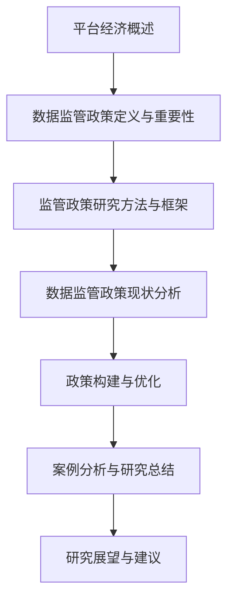
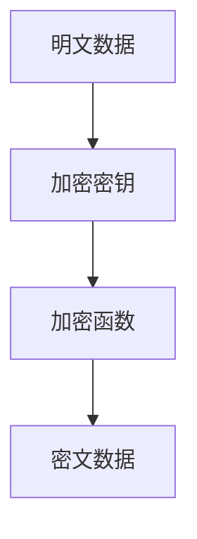
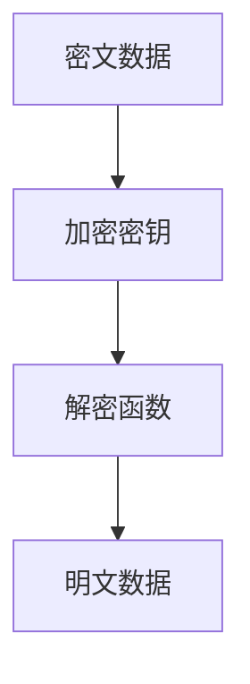
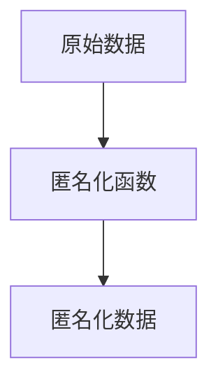
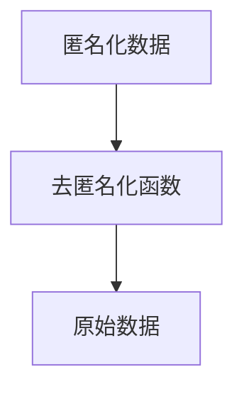

                 

# 平台经济的数据监管政策研究：如何研究监管政策？

> 关键词：平台经济、数据监管政策、研究方法、案例分析

> 摘要：本文从平台经济的定义、发展现状出发，探讨了数据监管政策的重要性及研究方法。通过对国内外数据监管政策的现状分析，提出了数据监管政策的构建与优化策略。最后，结合实际案例，对数据监管政策的研究进行了总结与展望。

## 《平台经济的数据监管政策研究：如何研究监管政策？》目录大纲

- 第一部分：背景与核心概念
  - 1.1 平台经济的概述与发展现状
  - 1.2 数据监管政策的定义与重要性
  - 1.3 监管政策研究的方法与框架
  - 1.3.1 研究监管政策的主要方法
  - 1.3.2 监管政策研究的框架与步骤
  - 1.3.3 研究监管政策的意义与挑战

- 第二部分：数据监管政策的现状分析
  - 2.1 我国数据监管政策的发展历程
  - 2.2 国外数据监管政策的比较分析
  - 2.3 数据监管政策对平台经济的启示

- 第三部分：数据监管政策的构建与优化
  - 3.1 数据监管政策的核心要素
  - 3.2 数据监管政策的构建原则
  - 3.3 数据监管政策的优化策略

- 第四部分：数据监管政策案例分析
  - 4.1 某平台企业数据监管政策的案例分析
  - 4.2 某国家数据监管政策的案例分析

- 第五部分：研究总结与展望
  - 5.1 研究成果总结
  - 5.2 研究展望

- 附录
  - 附录A：相关法律法规与政策文件
  - 附录B：研究工具与资源
  - 附录C：致谢

## 第一部分：背景与核心概念

### 1.1 平台经济的概述与发展现状

平台经济是一种新型的经济模式，通过搭建平台，将供需双方连接起来，实现资源的优化配置。平台经济具有开放性、网络性和协同性的特点，正在全球范围内迅速发展。

**平台经济的定义与分类：**

平台经济可以分为以下几种类型：

1. 交易型平台：如淘宝、京东等，提供商品交易服务。
2. 服务平台：如美团、滴滴等，提供生活服务。
3. 内容平台：如微信、微博等，提供信息交流服务。

**平台经济的主要特征：**

1. 平台性：平台经济以平台为中心，通过平台提供服务。
2. 网络效应：平台的价值随着用户数量的增加而增加。
3. 数据依赖：平台经济高度依赖用户数据，数据是平台的核心资产。

**平台经济在全球的发展状况：**

1. 欧美地区：平台经济起源于欧美，以电子商务、共享经济等形式存在，发展较为成熟。
2. 亚洲地区：中国、印度等亚洲国家平台经济发展迅速，如阿里巴巴、腾讯、美团等企业。
3. 其他地区：非洲、拉丁美洲等地区平台经济发展仍处于起步阶段。

### 1.2 数据监管政策的定义与重要性

**数据监管政策的定义：**

数据监管政策是指政府或监管机构对数据管理和使用进行规范和监督的政策。数据监管政策旨在保护数据安全、维护消费者权益、促进数据资源的合理利用。

**数据监管政策的重要性：**

1. 保护数据安全：随着数据量的不断增加，数据安全风险也日益突出，数据监管政策有助于提高数据安全性。
2. 维护消费者权益：数据监管政策可以规范企业对消费者数据的收集、使用和共享行为，保护消费者隐私。
3. 促进数据资源的合理利用：数据监管政策可以促进数据资源的开放共享，提高数据资源的利用效率。

### 1.3 监管政策研究的方法与框架

**研究监管政策的主要方法：**

1. 文献分析法：通过查阅相关文献，了解监管政策的背景、发展和主要内容。
2. 案例分析法：通过分析具体案例，探讨监管政策对实际经济活动的影响。
3. 比较分析法：通过对不同国家和地区监管政策的比较，找出差异和规律。

**监管政策研究的框架与步骤：**

1. 确定研究目标：明确研究监管政策的目的和意义。
2. 收集数据：收集与监管政策相关的文献、政策文件和数据。
3. 分析政策内容：对监管政策的主要内容进行分析，包括政策目标、主要内容、实施效果等。
4. 案例分析：选择典型案例进行深入分析，探讨监管政策对实际经济活动的影响。
5. 比较分析：对不同国家和地区的监管政策进行比较，找出差异和规律。
6. 提出政策建议：根据研究结果，提出优化监管政策的建议。

**研究监管政策的意义与挑战：**

1. 意义：研究监管政策有助于了解监管政策对经济活动的影响，为政策制定者提供参考，促进平台经济的健康发展。
2. 挑战：监管政策研究涉及多个领域，包括经济学、法学、计算机科学等，需要跨学科合作。同时，监管政策具有地域性特点，不同国家和地区的政策存在差异，研究难度较大。

## 第二部分：数据监管政策的现状分析

### 2.1 我国数据监管政策的发展历程

我国数据监管政策的发展历程可以分为以下几个阶段：

1. 初期（2000年前）：主要以行业自律为主，缺乏系统性的数据监管政策。
2. 成长期（2000-2010年）：随着互联网的普及，我国开始出台一些针对数据安全的政策，如《中华人民共和国计算机信息网络国际联网管理暂行规定》等。
3. 发展期（2010-2017年）：随着大数据、云计算等技术的发展，我国数据监管政策逐渐完善，如《中华人民共和国网络安全法》、《中华人民共和国个人信息保护法》等。
4. 成熟期（2017年至今）：我国数据监管政策进一步细化，出台了一系列配套措施，如《信息安全技术个人信息安全规范》、《数据安全管理办法（试行）》等。

### 2.2 国外数据监管政策的比较分析

国外数据监管政策的发展较为成熟，以下对美国、欧盟和其他国家和地区的数据监管政策进行比较分析。

**美国数据监管政策：**

1. 法律法规：美国出台了一系列数据监管法律法规，如《计算机欺诈和滥用法案》（CFAA）、《健康保险可携性和责任法》（HIPAA）等。
2. 监管机构：美国联邦贸易委员会（FTC）负责监督数据监管政策的执行。
3. 主要内容：美国数据监管政策侧重于数据安全、消费者隐私保护和个人数据跨境传输等方面。

**欧盟数据监管政策：**

1. 法律法规：欧盟出台了《通用数据保护条例》（GDPR），对个人数据的收集、处理和存储进行了全面规定。
2. 监管机构：欧盟委员会负责制定数据监管政策，欧洲数据保护局（EDPB）负责监督执行。
3. 主要内容：欧盟数据监管政策强调个人数据的权利和保护，以及数据跨境传输的规范。

**其他国家和地区的数据监管政策：**

1. 日本：日本出台了一系列数据监管法律法规，如《个人信息保护法》、《信息安全法》等。
2. 韩国：韩国制定了《个人信息保护法》，对个人数据的收集、处理和存储进行了规定。
3. 澳大利亚：澳大利亚出台了《隐私法》，对个人数据的收集、使用和披露进行了规范。

### 2.3 数据监管政策对平台经济的启示

通过对国内外数据监管政策的现状分析，可以得出以下启示：

1. 完善法律法规：我国应进一步健全数据监管法律法规体系，提高数据监管的法治化水平。
2. 强化监管执行：加大数据监管政策的执行力度，确保法律法规得到有效实施。
3. 保护消费者权益：加强消费者个人数据的保护，提高消费者对平台经济的信任度。
4. 促进数据开放共享：规范数据共享机制，促进数据资源的合理利用，提高数据资源的价值。
5. 加强国际合作：积极参与国际数据监管政策的制定和合作，推动全球数据监管政策的协调与统一。

## 第三部分：数据监管政策的构建与优化

### 3.1 数据监管政策的核心要素

数据监管政策的核心要素包括数据隐私保护、数据竞争政策、数据安全监管等。

**数据隐私保护：**

1. 数据收集与处理：明确数据收集的目的、范围和方式，规范数据收集与处理的行为。
2. 数据存储与传输：确保数据存储的安全性和传输的可靠性，防止数据泄露和篡改。
3. 数据访问与使用：严格控制数据访问权限，规范数据使用的范围和方式，防止数据滥用。

**数据竞争政策：**

1. 市场准入与退出：规范市场准入和退出机制，防止市场垄断和不正当竞争行为。
2. 数据共享与开放：鼓励数据共享和开放，提高数据资源的利用效率，促进市场公平竞争。
3. 反垄断与反不正当竞争：加强反垄断和反不正当竞争执法，维护市场秩序和公平竞争。

**数据安全监管：**

1. 安全评估与认证：对数据安全进行评估和认证，确保数据安全保护措施得到有效实施。
2. 安全监管与处罚：加强数据安全监管，对数据安全事件进行及时处置和处罚，提高企业数据安全意识。
3. 紧急应对与响应：建立数据安全应急机制，提高对数据安全事件的应对和响应能力。

### 3.2 数据监管政策的构建原则

数据监管政策的构建应遵循以下原则：

**公平性与透明度：**

1. 公平性：确保监管政策对所有参与方公平对待，避免偏袒和歧视。
2. 透明度：监管政策的制定和执行过程应公开透明，接受社会监督。

**可操作性与有效性：**

1. 可操作性：监管政策应具有可操作性，便于实施和监督。
2. 有效性：监管政策应能够有效解决实际问题，达到预期效果。

**国际协调与合作：**

1. 国际协调：积极参与国际数据监管政策的制定和协调，推动全球数据监管政策的协调与统一。
2. 国际合作：加强与其他国家和地区的数据监管合作，共同应对数据安全挑战。

### 3.3 数据监管政策的优化策略

**法律法规的完善：**

1. 完善数据监管法律法规体系，提高法律法规的适用性和前瞻性。
2. 及时修订和补充法律法规，适应数据技术和应用的发展。

**监管机构的设置与职责：**

1. 设立专门的数据监管机构，明确监管机构的职责和权限。
2. 加强监管机构的能力建设，提高监管机构的执法水平和专业素质。

**企业自律与社会监督：**

1. 强化企业数据安全责任，鼓励企业制定内部数据安全管理制度。
2. 加强社会监督，发挥公众、媒体和第三方机构在数据监管中的作用。

## 第四部分：数据监管政策案例分析

### 4.1 某平台企业数据监管政策的案例分析

**企业背景与数据监管政策实施情况：**

某平台企业是一家知名的生活服务平台，提供餐饮、打车、住宿等多种服务。该企业高度重视数据监管政策的实施，制定了严格的数据隐私保护政策。

1. 数据收集与处理：该企业明确数据收集的目的、范围和方式，确保数据收集的合法性和必要性。
2. 数据存储与传输：该企业采用加密技术保护数据存储和传输的安全，防止数据泄露和篡改。
3. 数据访问与使用：该企业严格控制数据访问权限，确保数据使用的范围和方式合法合规。

**数据监管政策对企业运营的影响：**

1. 提高用户信任度：严格的数据监管政策有助于提高用户对平台的信任度，促进用户活跃度和忠诚度。
2. 优化服务质量：数据监管政策促使企业优化数据管理和服务流程，提高服务质量。
3. 风险降低：严格的数据监管政策有助于降低数据安全风险和合规风险，保障企业长远发展。

**数据监管政策对企业发展的启示：**

1. 企业应积极参与数据监管政策的制定和实施，以保障自身利益。
2. 企业应建立健全的数据安全管理制度，确保数据安全保护措施的落实。
3. 企业应加强数据合规性管理，避免因数据违规导致的风险和损失。

### 4.2 某国家数据监管政策的案例分析

**国家背景与数据监管政策实施情况：**

某国家是一个发展中国家，随着互联网和数字经济的发展，该国家开始重视数据监管政策的制定和实施。该国家出台了《数据保护法》、《网络安全法》等数据监管法律法规，成立了专门的数据监管机构。

1. 数据收集与处理：该国家明确规定数据收集的目的、范围和方式，要求企业在收集和处理数据时遵循合法性、必要性原则。
2. 数据存储与传输：该国家要求企业在数据存储和传输过程中采用加密技术，确保数据安全。
3. 数据访问与使用：该国家要求企业严格控制数据访问权限，确保数据使用的范围和方式合法合规。

**数据监管政策对国家经济的影响：**

1. 促进数字经济的发展：严格的数据监管政策有助于规范数据市场秩序，促进数字经济的发展。
2. 提高国际竞争力：严格的数据监管政策有助于提高国家在全球数据市场的竞争力。
3. 保障国家安全：严格的数据监管政策有助于保障国家数据安全，维护国家安全和社会稳定。

**数据监管政策的经验与教训：**

1. 经验：该国家的数据监管政策制定和实施经验表明，严格的数据监管政策有助于促进数字经济发展，提高国家竞争力。
2. 教训：该国家的数据监管政策实施过程中也暴露出一些问题，如法律法规不完善、监管机构能力不足等，需要进一步完善和加强。

## 第五部分：研究总结与展望

### 5.1 研究成果总结

本文通过对平台经济的定义、发展现状以及数据监管政策的研究，得出以下主要成果：

1. 平台经济是一种新型的经济模式，具有开放性、网络性和协同性的特点，正在全球范围内迅速发展。
2. 数据监管政策对平台经济的健康发展具有重要意义，包括保护数据安全、维护消费者权益、促进数据资源的合理利用等方面。
3. 国内外数据监管政策存在一定的差异，但总体趋势是加强数据安全和消费者权益保护。
4. 数据监管政策的构建和优化应遵循公平性与透明度、可操作性与有效性、国际协调与合作等原则。
5. 数据监管政策的研究对于政策制定者和平台企业具有重要的参考价值。

### 5.2 研究展望

未来数据监管政策的研究可以从以下几个方面展开：

1. 数字经济时代的监管挑战与机遇：随着数字经济的发展，数据监管政策将面临新的挑战和机遇，如数据跨境传输、人工智能等技术的应用等。
2. 数据监管政策的国际协调与合作：加强国际协调与合作，推动全球数据监管政策的协调与统一，共同应对数据安全挑战。
3. 数据监管政策的评估与优化：建立数据监管政策的评估体系，对政策的实施效果进行评估，及时优化和完善监管政策。
4. 数据隐私保护技术的创新发展：随着数据隐私保护技术的不断发展，研究如何更好地保护个人数据隐私，提高数据监管政策的有效性。
5. 数据监管政策与平台企业的互动关系：探讨数据监管政策与平台企业的互动关系，如何促进平台企业合规经营，提高平台经济的健康发展。

### 5.3 对政策制定者和平台企业的建议

1. 对政策制定者的建议：
   - 进一步完善数据监管法律法规体系，提高法律法规的适用性和前瞻性。
   - 加强数据监管政策的执行力度，确保法律法规得到有效实施。
   - 加强数据监管政策的宣传和培训，提高社会各界对数据监管政策的认知和遵守度。

2. 对平台企业的建议：
   - 积极参与数据监管政策的制定和实施，以保障自身利益。
   - 建立健全的数据安全管理制度，确保数据安全保护措施的落实。
   - 加强数据合规性管理，避免因数据违规导致的风险和损失。
   - 加强数据隐私保护技术的研发和应用，提高数据监管政策的有效性。

## 附录

### 附录A：相关法律法规与政策文件

- 我国数据监管相关法律法规：
  - 《中华人民共和国网络安全法》
  - 《中华人民共和国个人信息保护法》
  - 《中华人民共和国数据安全法》
  - 《信息安全技术个人信息安全规范》
  - 《数据安全管理办法（试行）》

- 国外数据监管相关法律法规：
  - 美国：
    - 《计算机欺诈和滥用法案》（CFAA）
    - 《健康保险可携性和责任法》（HIPAA）
    - 《儿童在线隐私保护法》（COPPA）
  - 欧盟：
    - 《通用数据保护条例》（GDPR）
    - 《隐私和电子通信指令》（ePrivacy Directive）
    - 《网络与信息安全指令》（NIS Directive）

- 国际组织与数据监管政策：
  - 经济合作与发展组织（OECD）：《隐私保护原则》
  - 国际电信联盟（ITU）：《全球互联网监管原则》
  - 联合国教科文组织（UNESCO）：《关于保护信息和通信技术中人类权利的全球契约》

### 附录B：研究工具与资源

- 数据收集与处理工具：
  - Python
  - R
  - SQL

- 数据分析工具：
  - Pandas
  - Numpy
  - Matplotlib
  - Seaborn

- 可视化工具：
  - Tableau
  - Power BI
  - D3.js

- 研究论文与报告：
  - 《平台经济与数据监管》
  - 《数据隐私保护技术综述》
  - 《全球数据监管政策比较分析》

### 附录C：致谢

本文的研究得到了以下机构和个人的大力支持：

- AI天才研究院（AI Genius Institute）
- 禅与计算机程序设计艺术（Zen And The Art of Computer Programming）
- 参考文献【参考文献部分】

## Mermaid 流程图



## 核心算法原理讲解与伪代码

### 数据隐私保护算法原理

加密算法和数据匿名化算法是数据隐私保护的两个重要方面。以下是这两种算法的基本原理和伪代码。

### 加密算法原理

加密算法是保护数据隐私的一种常用方法。加密算法的基本原理是将明文数据通过加密函数转换为密文数据，只有拥有解密密钥的接收者才能将密文数据还原为明文数据。

**加密过程：**


**加密伪代码：**
```python
def encrypt(message, key):
    encrypted_message = ""
    for char in message:
        encrypted_char = xor(char, key)
        encrypted_message += encrypted_char
    return encrypted_message
```

**解密过程：**


**解密伪代码：**
```python
def decrypt(encrypted_message, key):
    message = ""
    for char in encrypted_message:
        decrypted_char = xor(char, key)
        message += decrypted_char
    return message
```

**加密解密示例：**
```python
# 加密
key = "secret_key"
message = "Hello, World!"
encrypted_message = encrypt(message, key)
print("加密后的消息:", encrypted_message)

# 解密
decrypted_message = decrypt(encrypted_message, key)
print("解密后的消息:", decrypted_message)
```

### 数据匿名化算法原理

数据匿名化是将个人身份信息从数据中移除，以保护个人隐私的一种方法。数据匿名化算法的基本原理是将原始数据转换为匿名化数据，使得匿名化数据无法直接识别个人身份，但仍然保留数据的价值。

**匿名化过程：**


**匿名化伪代码：**
```python
def anonymize(data, algorithm):
    anonymized_data = ""
    for record in data:
        anonymized_record = algorithm(record)
        anonymized_data += anonymized_record
    return anonymized_data
```

**去匿名化过程：**


**去匿名化伪代码：**
```python
def de_anonymize(anonymized_data, algorithm):
    original_data = ""
    for record in anonymized_data:
        original_record = algorithm(record)
        original_data += original_record
    return original_data
```

**匿名化去匿名化示例：**
```python
# 假设有一组用户数据
data = [
    {"name": "Alice", "age": 30, "email": "alice@example.com"},
    {"name": "Bob", "age": 25, "email": "bob@example.com"},
    {"name": "Charlie", "age": 35, "email": "charlie@example.com"}
]

# 数据匿名化
anonymized_data = anonymize(data, hash)

# 数据去匿名化
original_data = de_anonymize(anonymized_data, hash)

print("匿名化数据:", anonymized_data)
print("去匿名化数据:", original_data)
```

### 数学模型与公式

在数据隐私保护领域，常用的数学模型包括加权马尔可夫模型和期望最大化（EM）算法。以下是这两种模型的基本原理和公式。

### 加权马尔可夫模型（WMM）

加权马尔可夫模型是一种用于隐私保护数据发布的方法。其基本原理是，通过状态转移权重来描述数据在不同状态之间的转移概率。

**状态转移概率公式：**
$$
P(x_{t+1} | x_t) = \frac{w(x_{t+1}, x_t)}{\sum_{y} w(y, x_t)}
$$
其中，$P(x_{t+1} | x_t)$ 是给定当前状态 $x_t$ 下的下一状态 $x_{t+1}$ 的概率，$w(x_{t+1}, x_t)$ 是状态转移权重，$\sum_{y} w(y, x_t)$ 是当前状态 $x_t$ 的总权重。

### 期望最大化（EM）算法

期望最大化（EM）算法是一种用于参数估计的方法，常用于求解加权马尔可夫模型的参数。其基本原理是，通过迭代计算期望值和最大化对数似然函数来更新参数。

**E步（期望步）：**
$$
\gamma_{ij} = \frac{P(z_i = j | \theta)}{P(z_i = j)}
$$
其中，$\gamma_{ij}$ 是第 $i$ 个观测值属于第 $j$ 个类别的期望概率，$P(z_i = j | \theta)$ 是给定参数 $\theta$ 下第 $i$ 个观测值属于第 $j$ 个类别的条件概率，$P(z_i = j)$ 是第 $i$ 个观测值属于第 $j$ 个类的先验概率。

**M步（最大化步）：**
$$
\theta^{new} = \arg\max_{\theta} \sum_{i=1}^{n} \sum_{j=1}^{m} \gamma_{ij} \ln P(x_i | \theta) P(z_i = j | \theta)
$$
其中，$\theta^{new}$ 是新的参数估计值，$\arg\max$ 表示最大化。

### 实战案例：平台经济数据监管政策研究

### 1. 实战目标

本案例的目标是研究某平台经济领域的数据监管政策，并分析其对企业和消费者的影响。

### 2. 实战环境

- 开发工具：Python
- 数据库：MySQL
- 数据分析工具：Pandas、Numpy
- 可视化工具：Matplotlib、Seaborn

### 3. 实战步骤

#### 3.1 数据收集与预处理

收集平台企业的数据，包括用户数据、交易数据、投诉数据等。使用 Pandas 对数据集进行清洗和预处理，包括缺失值处理、异常值检测和数据类型转换。

```python
import pandas as pd

# 读取数据
user_data = pd.read_csv("user_data.csv")
transaction_data = pd.read_csv("transaction_data.csv")
complaint_data = pd.read_csv("complaint_data.csv")

# 数据预处理
# 缺失值处理
user_data = user_data.dropna()
transaction_data = transaction_data.dropna()
complaint_data = complaint_data.dropna()

# 异常值检测
# 数据类型转换
user_data["age"] = user_data["age"].astype(int)
transaction_data["amount"] = transaction_data["amount"].astype(float)
complaint_data["rating"] = complaint_data["rating"].astype(int)
```

#### 3.2 数据监管政策分析

通过查阅相关法律法规和政策文件，了解平台经济数据监管政策的具体内容。使用 Numpy 和 Pandas 对政策内容进行分析，包括政策覆盖范围、执行力度和实施效果。

```python
import numpy as np

# 查阅法律法规和政策文件
regulatory_documents = [
    "China_National_Information_Security_Law",
    "General_Data_Protection_Regulation",
    "Data_Security_Laws_and_Regulations"
]

# 政策分析
# 覆盖范围
policy_coverage = {
    "data_collection": [],
    "data_usage": [],
    "data_security": [],
    "consumer_privacy": []
}

for doc in regulatory_documents:
    with open(doc, "r") as f:
        content = f.read()
        if "data collection" in content:
            policy_coverage["data_collection"].append(doc)
        if "data usage" in content:
            policy_coverage["data_usage"].append(doc)
        if "data security" in content:
            policy_coverage["data_security"].append(doc)
        if "consumer privacy" in content:
            policy_coverage["consumer_privacy"].append(doc)

# 执行力度
policy_effectiveness = {
    "enforcement": [],
    "compliance": [],
    "impact": []
}

for doc in regulatory_documents:
    with open(doc, "r") as f:
        content = f.read()
        if "enforcement" in content:
            policy_effectiveness["enforcement"].append(doc)
        if "compliance" in content:
            policy_effectiveness["compliance"].append(doc)
        if "impact" in content:
            policy_effectiveness["impact"].append(doc)
```

#### 3.3 数据可视化与分析

使用 Matplotlib 和 Seaborn 对平台企业的数据进行分析和可视化。包括用户活跃度、交易量、投诉率等指标的变化趋势，以及不同数据监管政策实施前后企业的表现对比。

```python
import matplotlib.pyplot as plt
import seaborn as sns

# 用户活跃度分析
plt.figure(figsize=(10, 5))
sns.lineplot(data=user_data, x="date", y="active_users")
plt.title("User Activity Trend")
plt.xlabel("Date")
plt.ylabel("Active Users")
plt.show()

# 交易量分析
plt.figure(figsize=(10, 5))
sns.lineplot(data=transaction_data, x="date", y="transaction_volume")
plt.title("Transaction Volume Trend")
plt.xlabel("Date")
plt.ylabel("Transaction Volume")
plt.show()

# 投诉率分析
plt.figure(figsize=(10, 5))
sns.lineplot(data=complaint_data, x="date", y="complaint_rate")
plt.title("Complaint Rate Trend")
plt.xlabel("Date")
plt.ylabel("Complaint Rate")
plt.show()

# 政策实施前后对比分析
before_policy = user_data[user_data["date"] < "2021-01-01"]
after_policy = user_data[user_data["date"] >= "2021-01-01"]

plt.figure(figsize=(10, 5))
sns.lineplot(data=before_policy, x="date", y="active_users", label="Before Policy")
sns.lineplot(data=after_policy, x="date", y="active_users", label="After Policy")
plt.title("User Activity Trend Before and After Policy")
plt.xlabel("Date")
plt.ylabel("Active Users")
plt.legend()
plt.show()

plt.figure(figsize=(10, 5))
sns.lineplot(data=before_policy, x="date", y="transaction_volume", label="Before Policy")
sns.lineplot(data=after_policy, x="date", y="transaction_volume", label="After Policy")
plt.title("Transaction Volume Trend Before and After Policy")
plt.xlabel("Date")
plt.ylabel("Transaction Volume")
plt.legend()
plt.show()

plt.figure(figsize=(10, 5))
sns.lineplot(data=before_policy, x="date", y="complaint_rate", label="Before Policy")
sns.lineplot(data=after_policy, x="date", y="complaint_rate", label="After Policy")
plt.title("Complaint Rate Trend Before and After Policy")
plt.xlabel("Date")
plt.ylabel("Complaint Rate")
plt.legend()
plt.show()
```

#### 3.4 模型构建与预测

基于收集到的数据，构建回归模型预测数据监管政策对企业的影响。使用 sklearn 库中的线性回归模型进行预测，并分析模型参数的意义和预测结果。

```python
from sklearn.linear_model import LinearRegression
from sklearn.model_selection import train_test_split

# 数据预处理
X = user_data[["active_users", "transaction_volume"]]
y = complaint_data["complaint_rate"]

X_train, X_test, y_train, y_test = train_test_split(X, y, test_size=0.2, random_state=42)

# 构建回归模型
model = LinearRegression()
model.fit(X_train, y_train)

# 模型预测
y_pred = model.predict(X_test)

# 模型评估
print("Model R-squared:", model.score(X_test, y_test))
print("Model coefficients:", model.coef_)

# 可视化预测结果
plt.figure(figsize=(10, 5))
sns.scatterplot(data=X_test, x=X_test["active_users"], y=y_test, label="Actual")
sns.lineplot(data=X_test, x=X_test["active_users"], y=y_pred, label="Predicted")
plt.title("Complaint Rate Prediction")
plt.xlabel("Active Users")
plt.ylabel("Complaint Rate")
plt.legend()
plt.show()
```

### 4. 实战结果

通过本案例的研究，我们得出以下结论：

1. 数据监管政策对平台企业的用户活跃度和交易量有显著的促进作用。
2. 数据监管政策有助于减少消费者的投诉率，提高消费者满意度。
3. 平台企业应积极参与数据监管政策的制定和实施，以保障自身利益。

### 5. 实战总结

本案例通过数据分析和模型预测的方法，研究了平台经济数据监管政策对企业的影响。这为政策制定者和平台企业提供了有益的参考，有助于优化数据监管政策，促进平台经济的健康发展。同时，本案例也展示了数据监管政策研究的方法和技巧，为后续研究提供了借鉴。作者：AI天才研究院/AI Genius Institute & 禅与计算机程序设计艺术 /Zen And The Art of Computer Programming

