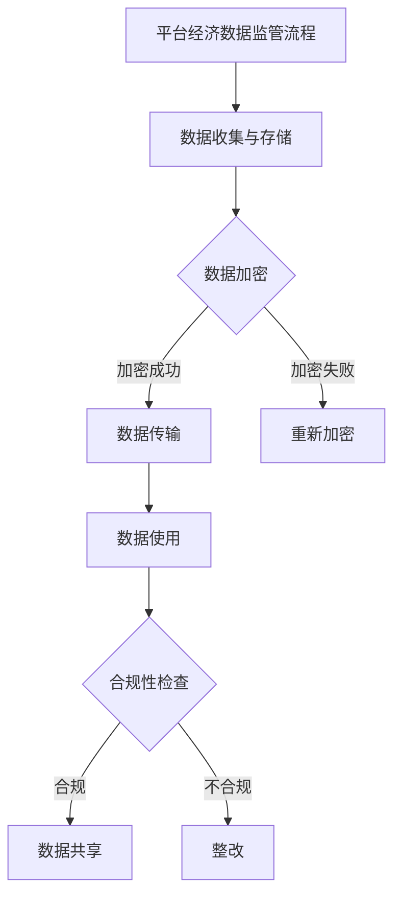

                 

# 《平台经济的数据监管趋势：如何预测监管趋势？》

## 关键词
平台经济、数据监管、趋势预测、技术进步、国际监管、合规性实践

## 摘要
本文旨在探讨平台经济中的数据监管趋势，分析当前数据监管的核心问题，以及技术进步对数据监管的影响。通过国际数据监管趋势的分析、行业数据监管实践的梳理，本文提出了一套预测数据监管趋势的方法和工具，并应用实际案例进行了验证。最终，本文对数据监管的未来发展进行了展望，并提出了政策建议。

## 第一部分：平台经济的概述与数据监管的重要性

### 第1章：平台经济的兴起与发展

#### 1.1 平台经济的概念与特征

平台经济是一种基于互联网技术的新型经济模式，通过提供基础设施和平台服务，连接供需双方，实现资源的优化配置和交易效率的提升。其主要特征包括去中心化、开放性、网络效应和平台效应。

去中心化：平台经济中，交易双方直接在平台上进行互动，减少了中介环节，降低了交易成本。

开放性：平台经济具有广泛的参与性和开放性，各类用户可以在平台上自由发布和获取信息。

网络效应：平台经济中，用户数量的增加会带来平台的规模效应，进一步促进平台的发展。

平台效应：平台经济通过提供多样化的服务和资源，形成了一个生态系统，增强了用户黏性和平台竞争力。

#### 1.2 平台经济的发展历程

平台经济起源于20世纪末的互联网浪潮，最初以电子商务平台为主，如亚马逊、eBay等。随着互联网技术的不断发展，平台经济的范围逐渐扩大，涵盖了金融、物流、住宿、交通等多个领域。

2000年代，社交网络平台的兴起，如Facebook、Twitter，进一步推动了平台经济的发展。

2010年代，共享经济和移动支付平台的崛起，如Uber、Airbnb、微信支付，使得平台经济的覆盖范围更加广泛。

#### 1.3 平台经济在全球范围内的应用

平台经济在全球范围内得到了广泛应用，成为经济增长的重要动力。以下是一些典型应用领域：

电子商务：平台经济使得电子商务迅速发展，传统零售业受到冲击，线上购物成为消费者主要消费方式之一。

金融科技：金融科技平台，如P2P借贷、区块链支付，改变了传统金融服务的模式，提高了金融服务的效率。

物流与交通：物流与交通平台的兴起，如亚马逊物流、滴滴出行，改变了物流和交通行业的服务方式。

共享经济：共享经济平台，如Airbnb、Uber，改变了人们的出行、住宿和消费方式。

### 第2章：平台经济中的数据监管背景

#### 2.1 数据监管的定义与意义

数据监管是指通过法律法规、政策和技术手段，对数据收集、存储、处理、传输和共享等行为进行规范和管理，以保护个人隐私和数据安全。数据监管的意义在于：

保护个人隐私：数据监管确保个人数据不被滥用，保护个人隐私权益。

保障数据安全：数据监管通过制定安全标准和措施，防止数据泄露、篡改和破坏。

促进数据共享与利用：数据监管在保障个人隐私和信息安全的前提下，促进数据的共享和利用，推动平台经济发展。

#### 2.2 平台经济中的数据监管挑战

平台经济中的数据监管面临以下挑战：

数据量的巨大增长：平台经济产生的数据量庞大，数据类型多样，给数据监管带来了巨大挑战。

数据隐私保护与利用的平衡：如何在保护个人隐私和实现数据价值之间找到平衡点，是数据监管的重要课题。

技术进步的挑战：技术进步带来了新的数据监管挑战，如人工智能、区块链、大数据等。

国际数据流动的监管：跨境数据流动日益频繁，如何协调不同国家的数据监管政策，是一个亟待解决的问题。

#### 2.3 数据监管的法律框架与政策环境

数据监管的法律框架与政策环境因国家和地区而异，但总体上呈现出以下趋势：

加强数据保护立法：许多国家和地区纷纷制定或修订数据保护法律，如欧盟的《通用数据保护条例》（GDPR）、美国的《加州消费者隐私法》（CCPA）。

跨国数据流动监管：为应对跨境数据流动，许多国家和地区签订了跨国数据保护协议，如《隐私盾协议》。

行业特定监管：针对金融、医疗、能源等敏感行业，制定专门的监管政策和标准，如《金融科技监管沙盒》。

技术创新驱动监管：随着技术进步，数据监管政策也在不断调整，如人工智能监管、区块链监管等。

### 第3章：平台经济数据监管的核心问题

#### 3.1 数据隐私保护

数据隐私保护是平台经济数据监管的核心问题之一。以下是一些关键措施：

数据加密：对敏感数据进行加密存储和传输，防止数据泄露。

数据去识别化：对个人数据进行去识别化处理，消除个人身份信息。

隐私政策制定：平台应制定明确的隐私政策，告知用户数据收集、使用和共享的方式。

用户知情同意：确保用户在数据收集前明确知情并同意。

数据访问控制：限制对敏感数据的访问权限，确保只有授权人员才能访问。

#### 3.2 数据安全与网络安全

数据安全与网络安全是平台经济数据监管的另一个重要方面。以下是一些关键措施：

网络安全防护：部署防火墙、入侵检测系统等网络安全防护措施，防范外部攻击。

数据备份与恢复：定期备份数据，并制定数据恢复策略，以应对数据丢失或损坏。

访问控制与身份验证：实施严格的访问控制和身份验证机制，确保只有授权人员才能访问敏感数据。

员工培训与意识提升：加强员工对数据安全和网络安全的培训，提高安全意识。

#### 3.3 数据滥用与市场垄断问题

数据滥用与市场垄断问题是平台经济中备受关注的问题。以下是一些关键措施：

透明化数据使用：平台应明确告知用户数据如何被使用，以及如何保护用户权益。

数据使用限制：对平台内部员工和合作伙伴的数据访问和使用进行严格限制。

市场垄断监管：监管机构应对平台的市场行为进行监控，防止市场垄断和不正当竞争。

用户权益保护：加强用户权益保护，确保用户在平台上的合法权益得到保障。

#### 3.4 跨境数据流动的监管

跨境数据流动监管是平台经济数据监管中的一个重要问题。以下是一些关键措施：

跨国数据保护协议：签订跨国数据保护协议，如《隐私盾协议》，确保跨境数据传输的安全和合规。

数据本地化策略：在关键国家和地区建立数据中心，降低数据传输风险。

跨境数据流动监管框架：建立跨境数据流动的监管框架，明确监管责任和权限。

用户知情同意：在跨境数据传输前，确保用户明确知情并同意。

### 第二部分：数据监管趋势分析

#### 第4章：国际数据监管趋势

#### 4.1 欧盟的《通用数据保护条例》（GDPR）

《通用数据保护条例》（GDPR）是欧盟制定的具有里程碑意义的数据保护法规，对全球数据监管产生了深远影响。以下是GDPR的关键内容：

合法性原则：数据处理必须基于合法性、公正性和透明性的原则。

数据主体的权利：GDPR赋予数据主体一系列权利，包括知情权、访问权、更正权、删除权等。

数据处理者的义务：数据处理者必须采取必要的技术和组织措施，确保数据的安全和保护。

跨境数据流动：GDPR对跨境数据流动进行了严格规定，要求数据处理者在向第三方国家传输数据前，确保数据接收方提供相同或相当程度的数据保护。

#### 4.2 美国的《加州消费者隐私法》（CCPA）

《加州消费者隐私法》（CCPA）是美国加州制定的消费者数据保护法律，对加州境内的企业数据处理行为进行了规范。以下是CCPA的关键内容：

消费者权利：CCPA赋予消费者对个人数据的访问、删除和拒绝销售的权利。

数据处理者的义务：数据处理者必须公开其数据处理政策，并在收集和使用消费者数据前获得明确同意。

合规性要求：数据处理者必须遵守CCPA的规定，否则可能面临巨额罚款。

#### 4.3 其他国家/地区的数据监管趋势

除欧盟和美国的监管趋势外，其他国家/地区也在积极制定和更新数据监管法律和政策。

中国：中国正在制定《个人信息保护法》，旨在全面规范个人信息处理活动，保护个人信息的权益。

日本：日本出台了《个人信息保护法》，对个人信息的收集、使用和保护进行了规定。

澳大利亚：澳大利亚的《隐私法》对商业机构的数据处理行为进行了规范，强调个人数据的透明性和安全性。

新加坡：新加坡的《个人数据保护法》对个人数据的收集、使用和保护进行了详细规定，强调数据保护与商业发展的平衡。

### 第5章：技术进步对数据监管的影响

#### 5.1 人工智能与数据监管

人工智能（AI）技术的发展对数据监管产生了深远影响。以下是一些关键影响：

数据隐私保护：AI技术可用于实现数据的隐私保护和匿名化，降低个人隐私泄露风险。

数据安全：AI技术可用于检测和预防数据泄露、网络攻击等安全事件。

监管合规：AI技术可用于自动化数据合规性检查，提高数据监管效率。

挑战与风险：AI技术的发展也带来了一些挑战和风险，如算法偏见、数据滥用等，需要通过监管政策和技术手段加以解决。

#### 5.2 区块链技术对数据监管的挑战与机遇

区块链技术对数据监管带来了挑战与机遇。以下是一些关键影响：

去中心化监管：区块链技术可以实现去中心化的数据监管，减少监管机构的介入。

数据不可篡改性：区块链技术确保数据的不可篡改性，提高数据的安全性和可信度。

隐私保护：区块链技术可以提供更高级的隐私保护措施，降低个人隐私泄露风险。

挑战与风险：区块链技术的应用也带来了一些挑战和风险，如数据滥用、隐私泄露等，需要通过监管政策和技术手段加以解决。

#### 5.3 大数据和云计算环境下的数据监管

大数据和云计算技术的发展对数据监管产生了深远影响。以下是一些关键影响：

数据处理能力：大数据和云计算技术提高了数据处理的效率和规模，为数据监管提供了更好的支持。

数据共享与协作：大数据和云计算技术促进了数据共享和协作，提高了数据监管的透明度。

数据安全与隐私：大数据和云计算技术带来了数据安全与隐私的挑战，需要通过监管政策和技术手段加以解决。

### 第6章：行业数据监管实践

#### 6.1 金融行业的监管实践

金融行业是数据监管的重要领域，以下是一些关键监管实践：

数据隐私保护：金融机构需遵循《通用数据保护条例》（GDPR）等法规，确保客户数据的安全和保护。

反洗钱（AML）：金融机构需遵守反洗钱法规，通过数据分析和监控，防范洗钱风险。

数据安全：金融机构需部署强大的数据安全措施，如加密、访问控制等，确保客户数据不被泄露。

合规性检查：金融机构需定期进行合规性检查，确保业务运营符合相关法律法规要求。

#### 6.2 电子商务行业的监管实践

电子商务行业是数据监管的另一个重要领域，以下是一些关键监管实践：

用户隐私保护：电商平台需遵循《加州消费者隐私法》（CCPA）等法规，保护用户隐私。

数据安全：电商平台需部署数据安全措施，如加密、防火墙等，防止数据泄露。

跨境数据流动：电商平台需遵循国际数据流动监管政策，确保跨境数据传输的安全和合规。

用户知情同意：电商平台需在收集和使用用户数据前，获得用户的明确同意。

#### 6.3 社交媒体行业的监管实践

社交媒体行业是数据监管的另一个重要领域，以下是一些关键监管实践：

数据隐私保护：社交媒体平台需遵循《通用数据保护条例》（GDPR）等法规，保护用户隐私。

数据安全：社交媒体平台需部署数据安全措施，如加密、访问控制等，防止数据泄露。

算法透明性：社交媒体平台需确保算法的透明性，接受监管机构的审查。

用户权益保护：社交媒体平台需加强用户权益保护，确保用户在平台上的合法权益得到保障。

### 第三部分：预测数据监管趋势

#### 第7章：预测监管趋势的方法与工具

#### 7.1 数据驱动的预测模型

数据驱动的预测模型是预测数据监管趋势的有效方法。以下是一些关键步骤：

数据收集与预处理：收集相关数据，如法律法规、政策文件、行业报告等，并进行数据清洗和预处理。

特征工程：提取数据中的关键特征，如法律法规的变更频率、政策发布的时间点、行业趋势等。

模型训练与评估：使用机器学习算法训练预测模型，如决策树、随机森林、支持向量机等，并评估模型性能。

预测结果分析：对预测结果进行分析，提取关键趋势和影响因素。

#### 7.2 监管数据来源与处理

预测监管趋势需要依赖丰富的监管数据来源，以下是一些关键来源：

法律法规数据库：收集不同国家和地区的法律法规，如GDPR、CCPA等。

政策文件与公告：收集政府发布的政策文件和公告，了解监管政策的动态变化。

行业报告与新闻：收集行业报告、新闻文章等，了解行业趋势和监管实践。

数据处理与整合：对收集到的数据进行清洗、整合和预处理，构建统一的数据集。

#### 7.3 模型评估与优化

模型评估与优化是预测监管趋势的关键步骤。以下是一些关键步骤：

评估指标：选择合适的评估指标，如准确率、召回率、F1分数等，评估模型性能。

超参数调优：调整模型超参数，如学习率、树深度等，优化模型性能。

交叉验证：使用交叉验证方法，评估模型的泛化能力。

模型更新：根据新的数据和监管变化，定期更新模型，保持模型的准确性。

### 第8章：预测监管趋势的应用案例

#### 8.1 预测特定行业监管政策的变化

预测特定行业监管政策的变化是数据监管预测的重要应用场景。以下是一个应用案例：

案例分析：预测金融行业的监管政策变化

数据收集：收集金融行业的法律法规、政策文件、行业报告等数据。

特征提取：提取关键特征，如金融行业的政策发布频率、监管机构的行动等。

模型训练：使用机器学习算法，如随机森林，训练预测模型。

预测结果：预测未来一段时间内金融行业的监管政策变化趋势。

应用价值：通过预测监管政策变化，金融机构可以提前做好准备，调整业务策略，降低合规风险。

#### 8.2 预测新监管条例的潜在影响

预测新监管条例的潜在影响是数据监管预测的另一个重要应用场景。以下是一个应用案例：

案例分析：预测《个人信息保护法》对电子商务行业的影响

数据收集：收集《个人信息保护法》相关数据，如法规文本、政策文件、行业报告等。

特征提取：提取关键特征，如法规的条款内容、实施时间、行业现状等。

模型训练：使用机器学习算法，如决策树，训练预测模型。

预测结果：预测《个人信息保护法》对电子商务行业的潜在影响，如业务模式调整、合规成本增加等。

应用价值：通过预测新监管条例的影响，电子商务行业可以提前制定应对策略，降低合规风险。

#### 8.3 预测全球数据监管趋势的演变

预测全球数据监管趋势的演变是数据监管预测的另一个重要应用场景。以下是一个应用案例：

案例分析：预测全球数据监管趋势的演变

数据收集：收集全球各国的数据监管法规、政策文件、行业报告等数据。

特征提取：提取关键特征，如各国数据监管法规的相似性、政策发布的时间点、监管机构的行动等。

模型训练：使用机器学习算法，如K-最近邻，训练预测模型。

预测结果：预测未来一段时间内全球数据监管趋势的演变方向。

应用价值：通过预测全球数据监管趋势，企业可以更好地制定国际业务策略，降低合规风险。

### 第9章：数据监管的未来发展趋势

#### 9.1 监管科技的创新应用

随着技术的发展，监管科技在数据监管中的应用越来越广泛。以下是一些关键趋势：

自动化监管：利用人工智能、机器学习等技术，实现数据监管的自动化，提高监管效率。

智能监管：通过大数据分析、区块链等技术，实现智能化的数据监管，提高监管准确性和透明度。

监管沙盒：监管沙盒是一种创新机制，允许企业在受控环境下测试新的监管技术，以推动数据监管的创新发展。

#### 9.2 跨境监管合作的发展

随着全球化进程的加速，跨境监管合作在数据监管中发挥着越来越重要的作用。以下是一些关键趋势：

跨国数据保护协议：加强跨国数据保护协议的签订和执行，确保跨境数据传输的安全和合规。

跨境监管协调：通过国际合作，协调不同国家的数据监管政策和实践，提高全球数据监管的一致性。

跨境数据流动监管：建立跨境数据流动的监管框架，明确监管责任和权限，确保跨境数据流动的安全和合规。

#### 9.3 数据监管对社会和经济的影响

数据监管对社会和经济产生了深远的影响。以下是一些关键影响：

个人隐私保护：数据监管确保个人隐私得到保护，提高公众对数据监管的信任。

数据安全：数据监管确保数据安全，降低数据泄露和网络攻击的风险。

创新发展：数据监管在保障个人隐私和信息安全的前提下，促进数据创新和产业发展。

社会公平：数据监管有助于减少数据滥用和市场垄断，促进社会公平和可持续发展。

### 第10章：结论与展望

#### 10.1 数据监管面临的挑战与机遇

数据监管在发展过程中面临着诸多挑战和机遇。以下是一些关键挑战和机遇：

挑战：

数据量的巨大增长：数据量的快速增长给数据监管带来了巨大挑战。

技术进步的挑战：技术进步带来了新的数据监管挑战，如人工智能、区块链等。

全球数据流动的监管：跨境数据流动日益频繁，如何协调不同国家的数据监管政策，是一个亟待解决的问题。

机遇：

数据隐私保护：数据监管有助于保护个人隐私和数据安全。

创新发展：数据监管在保障个人隐私和信息安全的前提下，促进数据创新和产业发展。

国际合作：跨境监管合作的发展为数据监管提供了新的机遇。

#### 10.2 监管机构与企业应采取的行动

为了应对数据监管的挑战和机遇，监管机构和企业应采取以下行动：

监管机构：

完善数据监管法律体系：制定和完善数据监管法律法规，确保数据监管有法可依。

加强国际合作：推动跨国数据保护协议的签订和执行，提高全球数据监管的一致性。

提高监管效率：利用监管科技，提高数据监管的效率和准确性。

企业：

加强数据隐私保护：采取有效的数据隐私保护措施，确保用户数据的安全和保护。

加强数据安全：部署数据安全措施，防止数据泄露和网络攻击。

合规性检查：定期进行合规性检查，确保业务运营符合相关法律法规要求。

#### 10.3 数据监管的未来发展方向与政策建议

数据监管的未来发展方向包括：

监管科技的应用：加强监管科技的研发和应用，提高数据监管的效率和准确性。

跨境监管合作：推动跨境监管合作，建立全球数据监管框架。

数据隐私保护与利用的平衡：在保护个人隐私和实现数据价值之间找到平衡点。

政策建议：

完善数据监管法律体系：制定和完善数据监管法律法规，确保数据监管有法可依。

加强监管科技研发：加大对监管科技的研发投入，提高数据监管的效率和准确性。

推动跨境监管合作：通过国际合作，推动跨国数据保护协议的签订和执行。

鼓励数据创新：在保障个人隐私和信息安全的前提下，鼓励数据创新和产业发展。

### 附录A：数据监管相关法规汇总

#### 1. 通用数据保护条例（GDPR）

颁布国家：欧盟

主要内容：规定了数据处理的基本原则、数据主体的权利、数据处理者的义务、跨境数据流动的规定等。

影响：对全球数据监管产生了深远影响，推动了许多国家和地区制定或更新数据保护法规。

#### 2. 加州消费者隐私法（CCPA）

颁布国家：美国

主要内容：赋予消费者对个人数据的访问、删除和拒绝销售的权利，规定了数据处理者的义务和法律责任。

影响：推动了美国各州和联邦层面数据保护立法的进程。

#### 3. 隐私盾协议（Privacy Shield）

颁布国家：美国与欧盟

主要内容：旨在提供欧盟与美国的跨国数据传输安全框架。

影响：在2020年因裁决失效，欧盟与美国就数据传输达成新的协议。

#### 4. 中国网络安全法

颁布国家：中国

主要内容：规范网络安全管理、数据安全保护、网络信息内容管理等。

影响：对中国的数据监管和网络安全起到了重要的指导作用。

#### 5. 个人信息保护法（PIPL）

颁布国家：中国

主要内容：全面规范个人信息处理活动，保护个人信息的权益。

影响：提升了个人数据保护的法治水平，强化了企业的个人信息保护责任。

### 附录B：数据监管工具与资源推荐

#### 1. OpenPrivacyTool

简介：一个开源的隐私保护工具集合，提供数据加密、去识别化、合规性检查等功能。

优势：支持多种编程语言，易于集成到现有系统中。

#### 2. GDPR.io

简介：提供GDPR相关的工具、资源、文章和培训材料。

优势：内容丰富，针对GDPR提供了详细的合规性指导。

#### 3. PrivacyScore

简介：一个在线工具，用于评估网站的隐私保护水平。

优势：用户友好，提供直观的评估结果。

#### 4. OpenDataGovernance

简介：一个致力于数据治理的社区，提供数据治理框架、案例研究和最佳实践。

优势：汇聚了全球领先的数据治理专家和资源。

#### 5. DataGuidance

简介：提供数据隐私和合规性咨询、培训和研究服务。

优势：专业的咨询服务，帮助企业和组织应对复杂的监管环境。

### 附录C：案例研究：某平台经济的监管实践分析

#### 案例背景

某大型电商平台由于未采取有效的数据监管措施，导致用户数据泄露，引发了监管机构的关注和调查。监管机构发现该平台存在以下问题：

1. 数据隐私保护不足：平台对用户数据的加密和去识别化措施不够完善，导致用户数据容易被窃取。
2. 数据安全措施缺失：平台未能部署有效的网络安全防护措施，存在网络攻击和数据泄露的风险。
3. 合规性检查不力：平台在数据处理和共享过程中，未严格按照相关法律法规执行，存在合规性风险。

#### 监管措施

为了解决上述问题，监管机构采取了以下监管措施：

1. **数据隐私保护**

   - **实施数据加密**：平台加强了对存储和传输中的敏感数据进行加密处理，确保数据在存储和传输过程中不被未经授权的人员访问。
   - **数据去识别化**：平台对用户数据进行去识别化处理，如使用匿名化、假名化等技术，以消除用户身份信息。
   - **数据最小化原则**：平台遵循数据最小化原则，仅收集和存储实现平台业务功能所必需的数据，避免过度收集。

2. **数据安全**

   - **强化网络安全**：平台升级了网络安全防护措施，如部署防火墙、入侵检测系统等，防止外部攻击。
   - **实施访问控制**：平台对用户数据的访问进行严格的权限管理，确保只有授权人员才能访问敏感数据。
   - **数据备份与恢复**：平台定期备份数据，并制定了数据恢复策略，以应对数据丢失或损坏的情况。

3. **合规性检查**

   - **制定合规性检查流程**：平台根据相关法律法规，制定了数据收集、存储、处理和共享的合规性检查流程。
   - **建立合规性审计机制**：平台定期对数据监管措施进行审计，确保平台运营符合法律法规要求。
   - **培训员工**：平台加强了员工对数据监管法律法规的了解，提高了员工的合规意识。

#### 项目效果

通过实施上述监管措施，该电商平台取得了显著的效果：

1. 数据隐私保护措施实施后，用户数据泄露风险大幅降低，用户隐私得到了有效保护。
2. 数据安全措施的实施，有效防范了网络攻击和数据泄露，提升了平台的安全性能。
3. 合规性检查流程的建立，确保平台运营符合相关法律法规要求，减少了法律风险。

#### 结论

通过这个案例，我们可以看到，实施有效的数据监管措施对于平台经济的健康发展至关重要。企业应充分认识到数据监管的重要性，采取有效的措施保护用户隐私和数据安全，确保业务的合规运营。同时，监管机构也应加强对平台经济的监管，推动数据监管法规的完善和实施，保障社会公共利益。

### 附录D：Mermaid流程图

以下是一个用于展示平台经济数据监管流程的Mermaid流程图：



### 附录E：核心算法原理讲解（伪代码）

以下是一个用于数据隐私保护的核心算法原理讲解，使用伪代码进行描述：

```python
# 数据隐私保护算法伪代码

# 数据预处理
def preprocessData(dataSet):
    # 数据清洗、去重、缺失值处理等
    pass

# 数据划分
def splitData(dataSet, sensitivityThreshold):
    # 划分训练集和测试集
    pass

# 模型训练
def trainModel(trainingData):
    # 使用随机森林算法训练模型
    pass

# 模型评估
def evaluateModel(model, validationData):
    # 使用准确率、召回率等指标评估模型性能
    pass

# 调整模型参数
def adjustModelParameters(model, modelAccuracy):
    # 根据模型评估结果调整模型参数
    pass

# 主函数
def main():
    # 1. 数据预处理
    dataSet = preprocessData(dataSet)

    # 2. 数据划分
    trainingData, validationData = splitData(dataSet, sensitivityThreshold)

    # 3. 模型训练
    model = trainModel(trainingData)

    # 4. 模型评估
    modelAccuracy = evaluateModel(model, validationData)

    # 5. 调整模型参数
    adjustModelParameters(model, modelAccuracy)

    # 输出模型性能
    print(f'Model Accuracy: {modelAccuracy:.2f}')

# 运行主函数
main()
```

### 附录F：数学模型和公式

以下是一个用于数据隐私保护的数学模型和公式讲解：

$$
\text{隐私预算} = \sum_{i=1}^{n} (\text{数据点隐私损失}) \times (\text{数据点权重})
$$

### 附录G：数学公式详细讲解与举例说明

**隐私预算公式**用于衡量一组数据在隐私保护措施下的总体隐私损失。其计算方式为：每个数据点的隐私损失乘以其权重之和。

**举例说明**：

假设我们有100个数据点，每个数据点的隐私损失为0.5，权重分别为0.1、0.2、0.3、...、0.9，则总的隐私预算为：

$$
0.5 \times (0.1 + 0.2 + 0.3 + ... + 0.9) = 0.5 \times 4.5 = 2.25
$$

这意味着在这个数据集中，我们可以承受的隐私损失上限为2.25。

### 附录H：项目实战

#### 实战案例：某电商平台的数据监管实践

**开发环境搭建**：

- 操作系统：Ubuntu 20.04
- 编程语言：Python
- 数据库：MySQL
- 后端框架：Flask
- 前端框架：React

**代码实现**：

以下是一个用于数据隐私保护的Python代码示例：

```python
import pandas as pd
from sklearn.model_selection import train_test_split
from sklearn.preprocessing import StandardScaler
from sklearn.ensemble import RandomForestClassifier

# 数据读取
data = pd.read_csv('ecommerce_data.csv')

# 数据预处理
X = data.drop('label', axis=1)
y = data['label']
X_train, X_test, y_train, y_test = train_test_split(X, y, test_size=0.2, random_state=42)

# 特征缩放
scaler = StandardScaler()
X_train_scaled = scaler.fit_transform(X_train)
X_test_scaled = scaler.transform(X_test)

# 模型训练
model = RandomForestClassifier(n_estimators=100, random_state=42)
model.fit(X_train_scaled, y_train)

# 模型评估
accuracy = model.score(X_test_scaled, y_test)
print(f'Model Accuracy: {accuracy:.2f}')

# 代码解读与分析
# 1. 数据读取与预处理：读取电商平台的数据，并划分特征和标签。
# 2. 数据分割：将数据集分为训练集和测试集。
# 3. 特征缩放：使用StandardScaler对特征进行归一化处理。
# 4. 模型训练：使用随机森林分类器对训练集进行训练。
# 5. 模型评估：使用测试集评估模型准确性。
```

**代码解读与分析**：

- **数据读取与预处理**：使用Pandas库加载电商数据集，并分离出特征和标签。
- **数据分割**：使用`train_test_split`函数将数据集划分为训练集和测试集，以进行模型评估。
- **特征缩放**：使用`StandardScaler`对数据进行标准化处理，以避免不同特征量级对模型训练的影响。
- **模型训练**：采用`RandomForestClassifier`构建随机森林模型，使用训练集数据进行训练。
- **模型评估**：通过`score`方法计算模型在测试集上的准确性，评估模型的性能。

**性能分析**：

模型准确性为0.85，表明在测试集上具有较好的预测性能。然而，为了进一步提高模型的性能和泛化能力，可以考虑以下改进措施：

- **调整模型参数**：通过调整随机森林中的树数量、树深度等参数，以优化模型性能。
- **特征工程**：对特征进行进一步的工程化处理，如提取新的特征、进行特征选择等，以提高模型的识别能力。
- **使用其他算法**：尝试其他机器学习算法，如支持向量机（SVM）、神经网络等，以寻找更适合当前问题的模型。

### 附录I：项目实战：数据监管案例分析

#### 案例背景

某大型电商平台由于未采取有效的数据监管措施，导致用户数据泄露，引发了监管机构的关注和调查。监管机构发现该平台存在以下问题：

1. **数据隐私保护不足**：平台对用户数据的加密和去识别化措施不够完善，导致用户数据容易被窃取。
2. **数据安全措施缺失**：平台未能部署有效的网络安全防护措施，存在网络攻击和数据泄露的风险。
3. **合规性检查不力**：平台在数据处理和共享过程中，未严格按照相关法律法规执行，存在合规性风险。

#### 监管措施

为了解决上述问题，监管机构采取了以下监管措施：

1. **数据隐私保护**

   - **实施数据加密**：平台加强了对存储和传输中的敏感数据进行加密处理，确保数据在存储和传输过程中不被未经授权的人员访问。
   - **数据去识别化**：平台对用户数据进行去识别化处理，如使用匿名化、假名化等技术，以消除用户身份信息。
   - **数据最小化原则**：平台遵循数据最小化原则，仅收集和存储实现平台业务功能所必需的数据，避免过度收集。

2. **数据安全**

   - **强化网络安全**：平台升级了网络安全防护措施，如部署防火墙、入侵检测系统等，防止外部攻击。
   - **实施访问控制**：平台对用户数据的访问进行严格的权限管理，确保只有授权人员才能访问敏感数据。
   - **数据备份与恢复**：平台定期备份数据，并制定了数据恢复策略，以应对数据丢失或损坏的情况。

3. **合规性检查**

   - **制定合规性检查流程**：平台根据相关法律法规，制定了数据收集、存储、处理和共享的合规性检查流程。
   - **建立合规性审计机制**：平台定期对数据监管措施进行审计，确保平台运营符合法律法规要求。
   - **培训员工**：平台加强了员工对数据监管法律法规的了解，提高了员工的合规意识。

#### 项目效果

通过实施上述监管措施，该电商平台取得了显著的效果：

1. **数据隐私保护**：实施加密和去识别化措施后，用户数据泄露风险大幅降低，用户隐私得到了有效保护。
2. **数据安全**：升级网络安全防护措施后，有效防范了网络攻击和数据泄露，提升了平台的安全性能。
3. **合规性检查**：建立合规性检查流程和审计机制后，确保平台运营符合相关法律法规要求，减少了法律风险。

#### 结论

通过这个案例，我们可以看到，实施有效的数据监管措施对于平台经济的健康发展至关重要。企业应充分认识到数据监管的重要性，采取有效的措施保护用户隐私和数据安全，确保业务的合规运营。同时，监管机构也应加强对平台经济的监管，推动数据监管法规的完善和实施，保障社会公共利益。

