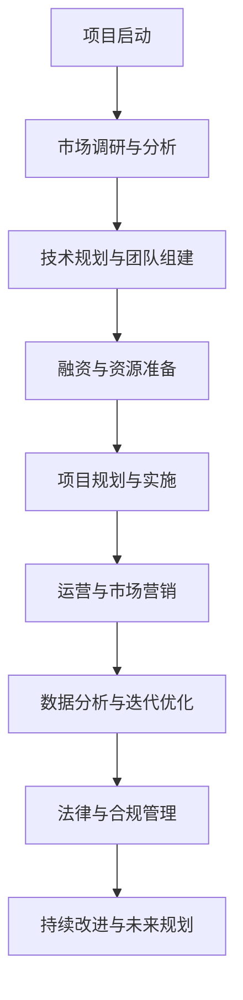

                 

# 2023年大模型创业的故事

## 关键词
- 大模型
- 创业
- 深度学习
- 人工智能
- 融资
- 技术优化
- 未来展望

## 摘要
本文将探讨2023年大模型创业的背景、机遇、实践与策略，通过深入分析大模型技术的核心原理、应用案例及创业过程中面临的法律与合规问题，旨在为创业者提供具有实践指导意义的技术洞察和创业思路。文章分为三个部分：第一部分讨论大模型创业的背景与机遇；第二部分探讨大模型创业的实践与策略；第三部分则聚焦于大模型技术的深度解析和未来展望。

## 目录大纲

### 《2023年大模型创业的故事》

#### 第一部分：大模型创业的背景与机遇

- 第1章：大模型技术的发展与影响
  - 1.1 大模型技术的兴起
  - 1.2 大模型技术的应用领域
  - 1.3 大模型技术对创业的影响
  - 1.4 大模型创业的优势与挑战

- 第2章：大模型创业的机遇分析
  - 2.1 市场需求分析
  - 2.2 技术发展趋势
  - 2.3 政策与产业支持
  - 2.4 创业环境分析

#### 第二部分：大模型创业的实践与策略

- 第3章：大模型创业团队的组建与运营
  - 3.1 团队组建的原则与策略
  - 3.2 团队成员的角色与职责
  - 3.3 团队运营与管理
  - 3.4 创新能力与团队文化

- 第4章：大模型创业项目的规划与实施
  - 4.1 项目规划的重要性
  - 4.2 项目目标与策略
  - 4.3 项目实施步骤
  - 4.4 项目风险管理

- 第5章：大模型创业的融资与运营
  - 5.1 融资策略与渠道
  - 5.2 融资演示文档制作
  - 5.3 运营计划与市场营销
  - 5.4 数据分析与迭代优化

- 第6章：大模型创业的法律与合规
  - 6.1 相关法律法规概述
  - 6.2 合规风险与应对策略
  - 6.3 知识产权保护
  - 6.4 数据隐私与安全

- 第7章：大模型创业的成功案例分析
  - 7.1 成功创业案例介绍
  - 7.2 成功创业经验总结
  - 7.3 案例分析与启示
  - 7.4 大模型创业的未来趋势

#### 第三部分：大模型创业的技术深度

- 第8章：大模型技术的核心原理
  - 8.1 大模型的数学原理
    - 8.1.1 深度学习的基本概念
    - 8.1.2 神经网络的数学基础
    - 8.1.3 大模型的训练过程
  - 8.2 大模型的技术架构
    - 8.2.1 计算框架与硬件支持
    - 8.2.2 大模型的优化算法
    - 8.2.3 大模型的存储与处理
  - 8.3 大模型的应用开发
    - 8.3.1 应用场景选择
    - 8.3.2 应用模型定制
    - 8.3.3 应用系统集成

- 第9章：大模型技术的实践与优化
  - 9.1 实践案例介绍
    - 9.1.1 案例一：智能客服系统
    - 9.1.2 案例二：智能医疗诊断
    - 9.1.3 案例三：智能金融风控
  - 9.2 技术优化方法
    - 9.2.1 模型优化策略
    - 9.2.2 算法改进方向
    - 9.2.3 系统性能优化

- 第10章：大模型创业的未来展望
  - 10.1 技术发展趋势预测
  - 10.2 创业机遇与挑战
  - 10.3 未来创业方向探讨
  - 10.4 创业者的素养与能力要求

#### 附录

- 附录A：大模型创业资源与工具
  - 10.1 开源框架与工具推荐
  - 10.2 数据集与数据资源
  - 10.3 行业报告与研究报告

- 附录B：参考文献

- 附录C：大模型创业流程图

### 引言

随着人工智能技术的迅猛发展，大模型（Large Models）已成为当前技术领域的热点话题。大模型，通常指的是那些拥有巨大参数量、能够处理海量数据并实现高度复杂任务的深度学习模型。它们在自然语言处理、计算机视觉、语音识别等领域取得了显著的成果，吸引了大量创业者的关注。

### 大模型技术的兴起

大模型技术的兴起源于深度学习的快速发展。深度学习作为一种机器学习的重要分支，通过多层神经网络对数据进行特征提取和建模，从而实现高度自动化的数据处理和模式识别。随着计算能力的提升和算法的优化，大模型的参数量和计算复杂度不断提高，逐渐突破了传统模型的局限性，实现了前所未有的性能提升。

大模型技术的兴起不仅改变了人工智能领域的科研范式，也对各行各业产生了深远的影响。从医疗诊断到金融风控，从智能客服到自动驾驶，大模型技术的应用正在不断拓展，为人类生活带来前所未有的便利和变革。

### 大模型技术的应用领域

大模型技术在多个领域展现了巨大的潜力，其中最具代表性的应用领域包括自然语言处理（NLP）、计算机视觉（CV）、语音识别（ASR）等。

在自然语言处理领域，大模型如GPT-3、BERT等在文本生成、翻译、问答系统等方面取得了显著的成果。这些模型通过学习海量文本数据，能够生成连贯、有逻辑的文本内容，为自然语言处理领域的发展提供了强大的支持。

在计算机视觉领域，大模型如ResNet、VGG等在图像分类、目标检测、人脸识别等方面取得了突破性的进展。这些模型通过学习大量图像数据，能够提取出丰富的视觉特征，实现了对复杂图像场景的准确识别。

在语音识别领域，大模型如WaveNet、DeepSpeech等在语音识别准确率和语音合成自然度方面取得了显著的提升。这些模型通过学习语音信号和文本数据，能够实现高度准确的语音识别和自然流畅的语音合成。

### 大模型技术对创业的影响

大模型技术的兴起为创业者提供了前所未有的机遇。首先，大模型技术为创业项目提供了强大的技术支撑，使得创业者能够快速实现技术突破和产品创新。无论是自然语言处理、计算机视觉还是语音识别，大模型技术都能够为创业者提供强大的计算能力和数据处理能力。

其次，大模型技术降低了创业项目的门槛。传统的深度学习项目需要大量的计算资源和专业知识，而大模型技术的普及使得创业者可以通过云服务和开源框架轻松搭建和训练大模型，降低了创业项目的技术门槛。

最后，大模型技术为创业者提供了丰富的应用场景。随着大模型技术在各个领域的深入应用，创业者可以在医疗、金融、教育、安防等多个行业寻找创业机会，通过创新的产品和服务解决实际问题，实现商业价值的创造。

### 大模型创业的优势与挑战

大模型创业具有多方面的优势，同时也面临一系列挑战。

#### 优势：

1. **技术优势**：大模型技术具有强大的计算能力和数据处理能力，能够为创业项目提供强大的技术支撑，实现技术突破和产品创新。
2. **市场前景**：大模型技术在多个领域展现了广阔的应用前景，为创业者提供了丰富的创业机会。
3. **资本关注**：随着人工智能技术的快速发展，大模型创业项目受到了资本市场的广泛关注和追捧，为创业者提供了充足的融资渠道。

#### 挑战：

1. **技术门槛**：大模型技术涉及复杂的数学模型和算法，创业者需要具备较高的技术水平和专业知识，这对于许多创业者来说是一个不小的挑战。
2. **数据资源**：大模型训练需要大量的高质量数据资源，创业者需要解决数据获取、数据清洗和数据标注等问题，这往往需要巨大的时间和资金投入。
3. **法律与合规**：大模型技术涉及隐私、安全、伦理等方面的问题，创业者需要关注相关法律法规，确保项目的合规性。

### 大模型创业的机遇分析

#### 市场需求分析

随着人工智能技术的不断进步，大模型技术在各个领域的应用需求日益增长。特别是在自然语言处理、计算机视觉和语音识别等关键领域，大模型技术已经成为提高生产效率和提升用户体验的重要手段。以下是对大模型技术市场需求的具体分析：

1. **自然语言处理**：自然语言处理（NLP）是人工智能的重要分支，大模型技术在文本生成、翻译、问答系统等方面具有显著优势。随着全球化和互联网的发展，对于多语言处理和跨文化沟通的需求不断增长，NLP市场的前景广阔。

   - **文本生成**：文本生成技术可以帮助企业自动化生成大量内容，如新闻报道、产品说明书等。这大大提高了内容生产的效率，降低了人力成本。
   - **翻译**：大模型翻译技术能够提供高准确度的翻译结果，满足跨国企业的沟通需求，推动全球商业合作。
   - **问答系统**：智能问答系统能够帮助企业提供7x24小时的在线客服，提高客户满意度和运营效率。

2. **计算机视觉**：计算机视觉（CV）技术在图像识别、目标检测、人脸识别等领域具有广泛的应用前景。

   - **图像识别**：通过大模型技术，计算机可以自动识别图像中的物体和场景，这一技术在安防监控、智能家居等领域具有重要应用价值。
   - **目标检测**：目标检测技术可以识别图像中的特定目标，并标注其位置。这在自动驾驶、无人机监控等领域具有广泛的应用。
   - **人脸识别**：人脸识别技术已经成为人脸支付、门禁系统等领域的核心技术，市场前景广阔。

3. **语音识别**：语音识别（ASR）技术在语音助手、智能客服、语音翻译等领域具有显著优势。

   - **语音助手**：智能语音助手已经成为智能家居的重要一环，通过大模型技术，语音助手可以提供更加自然、流畅的交互体验。
   - **智能客服**：智能客服系统可以帮助企业实现自动化的客户服务，提高服务效率和质量。
   - **语音翻译**：语音翻译技术可以实现实时、准确的跨语言交流，打破语言障碍，促进全球交流。

#### 技术发展趋势

大模型技术的发展趋势主要集中在以下几个方面：

1. **模型规模和参数量增加**：随着计算能力和存储能力的提升，大模型技术的规模和参数量不断增加。例如，GPT-3拥有1750亿个参数，Bert-Large拥有3400万个参数，这些大规模模型在处理复杂任务时具有更高的性能。

2. **多模态融合**：多模态融合是指将不同类型的数据（如文本、图像、语音等）进行整合，以实现更准确和丰富的信息处理。例如，将文本和图像数据进行融合，可以用于图像内容识别和生成。

3. **自监督学习和迁移学习**：自监督学习和迁移学习是减少数据需求和提高模型性能的重要技术。通过自监督学习，模型可以从无标签数据中学习，降低数据标注的成本。而迁移学习则可以利用已经训练好的模型在新任务上快速取得较好的性能。

4. **硬件支持**：随着GPU、TPU等硬件的普及，大模型训练的速度和效率得到了显著提升。这使得大规模模型的训练变得更加可行，也为创业项目提供了更好的技术支持。

#### 政策与产业支持

政府政策的支持和产业环境的优化为大模型创业提供了良好的发展环境。以下是对相关政策和产业支持的分析：

1. **政府政策**：许多国家政府已经认识到人工智能技术的重要性，并制定了一系列支持人工智能发展的政策。例如，中国政府在“十四五”规划中明确提出要加快人工智能技术创新和产业发展。这些政策为创业者提供了资金支持、税收优惠和人才引进等方面的支持。

2. **产业环境**：随着人工智能技术的快速发展，相关产业链也逐渐成熟。从硬件制造到软件开发，从数据服务到应用场景，形成了完整的产业生态。这种良好的产业环境为创业者提供了丰富的资源和合作机会。

3. **国际合作**：在国际层面，各国政府和企业也在积极推动人工智能技术的国际合作。例如，欧盟的GDPR法规旨在保护个人隐私和数据安全，同时推动人工智能技术的合规应用。这种国际合作有助于促进全球人工智能技术的发展和应用。

#### 创业环境分析

大模型创业的环境具有以下几个特点：

1. **技术创新活跃**：随着大模型技术的快速发展，相关技术创新也日益活跃。创业者可以通过开源框架和工具快速搭建和优化大模型，从而实现技术创新和产品突破。

2. **人才集聚**：人工智能领域吸引了大量优秀的科研人员和工程师，这些人才为创业项目提供了强有力的技术支持。同时，高校和研究机构也为创业者提供了丰富的资源和合作机会。

3. **融资渠道多样化**：随着大模型技术的商业化应用，相关创业项目受到了资本市场的广泛关注。创业者可以通过天使投资、风险投资、众筹等多种方式获得融资支持。

4. **应用场景丰富**：大模型技术可以应用于多个领域，如医疗、金融、教育、安防等。创业者可以根据市场需求和自身优势选择合适的创业方向，实现商业价值的创造。

### 大模型创业团队的组建与运营

大模型创业项目需要一个高效、协作的团队来推动项目的发展。团队成员需要具备多样化的技能和丰富的经验，以确保项目的顺利进行和成功实施。以下是大模型创业团队组建和运营的详细策略。

#### 团队组建的原则与策略

1. **专业技能互补**：团队成员需要具备多样化的技能，如算法开发、数据工程、产品管理、市场营销等。通过专业技能的互补，可以确保项目在各个环节都有专业的人才支持。

2. **创新能力**：团队应具备较强的创新能力，能够快速响应市场需求和技术变化，不断优化和改进产品。

3. **经验丰富**：团队成员应具备丰富的行业经验和创业经验，能够应对各种挑战和困难，确保项目的稳定发展。

4. **团队合作精神**：团队成员之间应具备良好的沟通和协作能力，能够共同面对挑战，共同实现项目目标。

#### 团队成员的角色与职责

1. **首席技术官（CTO）**：负责技术方向的选择和战略规划，确保团队在技术领域保持领先地位。CTO还需要关注团队的技术培训和技能提升。

2. **首席数据科学家（CDS）**：负责数据科学团队的管理和协调，确保数据科学团队在高性能计算、数据挖掘、机器学习等方面取得突破。

3. **算法工程师**：负责算法的设计、开发和优化，确保算法在性能、准确性和稳定性方面达到最佳水平。

4. **数据工程师**：负责数据基础设施的建设和维护，确保数据的高效处理和存储。

5. **产品经理**：负责产品规划、设计和推广，确保产品满足市场需求和用户期望。

6. **市场营销专员**：负责市场调研、营销策略制定和推广活动，提高产品的市场知名度和用户基础。

7. **运营专员**：负责日常运营工作，如用户管理、客服支持、数据分析和报告等，确保项目的顺利运营。

#### 团队运营与管理

1. **项目管理**：采用敏捷开发方法，进行短周期迭代，快速响应市场和技术变化。

2. **沟通机制**：建立高效的沟通机制，如定期会议、邮件、即时通讯工具等，确保团队成员之间的信息畅通。

3. **激励机制**：建立科学的激励机制，如绩效奖金、股权激励等，激发团队成员的积极性和创造力。

4. **团队文化建设**：建立积极、开放、创新的团队文化，鼓励团队成员互相学习和分享，共同成长。

5. **技术培训与知识共享**：定期组织技术培训和学习活动，提高团队成员的专业技能和知识水平。

#### 创新能力与团队文化

1. **技术创新**：鼓励团队成员进行技术创新和科研探索，支持团队成员参加学术会议、发表论文等活动。

2. **知识共享**：建立知识共享平台，鼓励团队成员分享经验和心得，促进团队内部的知识交流。

3. **外部合作**：积极与高校、研究机构、行业合作伙伴等建立合作关系，共同开展技术研究和创新。

4. **团队氛围**：营造开放、包容、鼓励创新的工作氛围，尊重团队成员的意见和创意，鼓励团队成员勇于尝试和失败。

### 大模型创业项目的规划与实施

#### 项目规划的重要性

项目规划是创业项目成功的关键环节。它不仅为项目的实施提供了明确的蓝图，还为团队协作、资源配置和时间管理提供了指导。以下从目标设定、资源分配和时间管理三个方面详细阐述项目规划的重要性。

1. **目标设定**：明确的项目目标有助于团队聚焦关键任务，确保项目朝着既定的方向前进。目标应具有可衡量性、可实现性和时限性，如提高产品性能、拓展市场份额、实现盈利等。

2. **资源分配**：项目规划需要对资源进行合理分配，包括人力资源、资金、技术设备等。通过科学规划，可以确保资源得到最有效的利用，避免资源浪费。

3. **时间管理**：项目规划明确了项目的关键节点和时间表，有助于团队按照计划有序推进项目。时间管理不仅有助于避免延期交付，还能提高项目的整体效率。

#### 项目目标与策略

项目目标应具体、明确，并与企业的战略方向和市场需求相吻合。以下从市场定位、产品定位和技术路线三个方面阐述项目目标与策略。

1. **市场定位**：明确项目的目标市场，如行业领域、用户群体、市场规模等。通过市场定位，可以明确项目的市场机会和竞争态势，制定有针对性的市场策略。

2. **产品定位**：确定产品的核心功能和特点，如性能、可靠性、易用性等。产品定位应满足市场需求，同时具有差异化的竞争优势。

3. **技术路线**：选择合适的技术路线，如自研技术、开源技术、合作伙伴技术等。技术路线应具备先进性、可靠性和可扩展性，以支撑项目的长期发展。

#### 项目实施步骤

项目实施是项目规划的具体落实，以下从需求分析、设计开发、测试和部署四个方面详细描述项目实施步骤。

1. **需求分析**：深入分析市场需求和用户需求，明确项目的功能需求和性能要求。需求分析的结果应形成详细的需求文档，为后续设计开发提供依据。

2. **设计开发**：根据需求分析结果，进行系统的设计和开发。设计阶段包括架构设计、模块划分、接口设计等。开发阶段则涉及编码、调试和单元测试。

3. **测试**：测试是确保项目质量的关键环节。测试应包括功能测试、性能测试、安全测试等，确保项目满足既定的质量标准。

4. **部署**：项目部署包括上线、运维和监控等环节。部署应确保系统稳定运行，满足业务需求，并能够快速响应和解决上线后的问题。

#### 项目风险管理

项目风险贯穿于项目的整个生命周期，有效的风险管理是确保项目成功的关键。以下从风险识别、风险评估和风险应对三个方面详细描述项目风险管理。

1. **风险识别**：通过文档审查、团队讨论、专家咨询等方法，识别项目可能面临的风险，如技术风险、市场风险、资源风险等。

2. **风险评估**：对识别出的风险进行评估，包括风险的严重程度、发生概率等。风险评估有助于明确项目的关键风险点。

3. **风险应对**：针对评估出的关键风险，制定相应的应对策略，如风险规避、风险减轻、风险接受等。风险应对策略应确保项目在面临风险时能够迅速响应，降低风险对项目的影响。

### 大模型创业的融资与运营

#### 融资策略与渠道

融资是创业项目发展的重要环节，合理的融资策略和渠道选择对于项目的成功至关重要。以下从融资需求分析、融资渠道选择和融资策略制定三个方面详细描述大模型创业项目的融资策略与渠道。

1. **融资需求分析**：首先，需要对创业项目的融资需求进行详细分析，包括资金用途、资金需求和资金回收期等。融资需求分析应明确项目的资金缺口，为融资策略的制定提供依据。

2. **融资渠道选择**：创业项目的融资渠道主要包括天使投资、风险投资、众筹、银行贷款、政府资金等。选择合适的融资渠道应考虑项目的特点、资金需求和市场环境。

3. **融资策略制定**：制定融资策略时，需要明确融资的目标、时间和方式。例如，可以选择分阶段融资，先获取天使投资，再进行风险投资，以确保项目的持续发展。

#### 融资演示文档制作

融资演示文档是向投资者展示创业项目的重要工具，制作高质量的融资演示文档对于吸引投资者至关重要。以下从内容结构、展示技巧和注意事项三个方面详细描述融资演示文档的制作。

1. **内容结构**：融资演示文档应包括项目简介、市场分析、技术方案、运营计划、财务预测、团队介绍等内容。内容结构应清晰、逻辑性强，突出项目的亮点和竞争优势。

2. **展示技巧**：在制作融资演示文档时，应注重图文并茂、数据说话。使用图表、图片等视觉元素，使文档更具有说服力。同时，演示时应注意语言表达清晰、逻辑严谨，增强演讲效果。

3. **注意事项**：在制作融资演示文档时，应避免夸大项目优势、隐瞒风险。诚信是吸引投资者的关键，真实、客观的展示才能赢得投资者的信任。

#### 运营计划与市场营销

成功的运营计划和市场营销策略是确保创业项目持续发展的重要保障。以下从市场定位、营销策略、运营目标和运营指标四个方面详细描述大模型创业项目的运营计划与市场营销。

1. **市场定位**：明确项目的目标市场和用户群体，进行市场细分。通过市场定位，可以明确项目的市场机会和竞争态势，制定有针对性的市场策略。

2. **营销策略**：制定多元化的营销策略，包括线上推广、线下活动、合作伙伴推广等。营销策略应结合项目特点和市场需求，提高项目的市场知名度。

3. **运营目标**：设定具体的运营目标，如用户增长、市场份额、盈利目标等。运营目标应与公司的战略方向和市场需求相吻合。

4. **运营指标**：制定科学的运营指标，如用户增长率、用户活跃度、转化率、ROI等。运营指标应能全面反映项目的运营状况，为运营策略的调整提供依据。

#### 数据分析与迭代优化

数据分析与迭代优化是确保创业项目持续改进和发展的关键环节。以下从数据收集、数据分析、迭代优化三个方面详细描述大模型创业项目的数据分析与迭代优化。

1. **数据收集**：建立完善的数据收集系统，包括用户行为数据、市场数据、技术数据等。数据收集应确保数据的准确性和完整性。

2. **数据分析**：利用数据分析工具，对收集到的数据进行处理和分析，提取有价值的信息。数据分析可以帮助团队了解用户需求、市场动态和项目表现。

3. **迭代优化**：根据数据分析结果，对项目进行持续迭代优化。迭代优化应关注用户反馈、市场需求和项目目标，确保项目的持续改进和进步。

### 大模型创业的法律与合规

#### 相关法律法规概述

在大模型创业过程中，遵守相关法律法规是确保项目合规性和持续发展的重要前提。以下从数据保护、知识产权和隐私安全三个方面概述大模型创业所涉及的主要法律法规。

1. **数据保护法规**：在大模型训练和应用过程中，涉及大量个人数据的处理。数据保护法规如欧盟的通用数据保护条例（GDPR）、中国的个人信息保护法（PIPL）等，对数据收集、存储、处理和传输提出了严格的要求。创业者需要确保在数据采集、处理和利用过程中遵守相关法规，保护用户的隐私权益。

2. **知识产权法规**：大模型技术的发展和应用涉及知识产权保护，包括专利、商标和著作权等。创业者需要了解相关知识产权法规，保护自己的创新成果，同时尊重他人的知识产权，避免侵权行为。

3. **隐私安全法规**：随着大模型技术在各个领域的广泛应用，隐私安全问题愈发突出。隐私安全法规如欧盟的通用数据保护条例（GDPR）、中国的网络安全法等，对个人信息的保护提出了严格要求。创业者需要建立完善的隐私安全管理体系，确保数据的存储、传输和使用过程安全可靠。

#### 合规风险与应对策略

大模型创业项目在发展过程中可能面临多种合规风险，包括数据隐私泄露、知识产权侵权、不当数据处理等。以下从风险评估、合规管理和应对策略三个方面详细描述合规风险与应对策略。

1. **风险评估**：在项目启动阶段，应对可能面临的合规风险进行全面评估，包括法律风险、市场风险、技术风险等。风险评估应考虑项目特点、市场需求和法律环境，识别潜在合规风险。

2. **合规管理**：建立完善的合规管理体系，包括合规政策、合规流程、合规培训等。合规管理应确保项目在各个环节遵守相关法律法规，降低合规风险。

3. **应对策略**：制定针对不同合规风险的应对策略，包括预防措施、应急响应和改进措施等。应对策略应具备可操作性和有效性，确保在面临合规风险时能够迅速响应和妥善处理。

#### 知识产权保护

大模型创业项目涉及大量的技术创新和知识产权，保护知识产权是确保项目持续发展的重要保障。以下从专利申请、著作权保护和侵权应对三个方面详细描述知识产权保护策略。

1. **专利申请**：对于具有创新性的技术成果，应积极申请专利，保护自己的知识产权。专利申请应关注技术特点、市场前景和竞争对手情况，提高专利申请的成功率。

2. **著作权保护**：大模型项目的软件代码、文档和设计文件等均受著作权保护。创业者应建立完善的著作权管理体系，确保自己的创新成果得到有效保护。

3. **侵权应对**：在面临知识产权侵权时，应采取及时、有效的应对措施，包括法律诉讼、调解和法律咨询等。侵权应对策略应确保维权效果最大化，同时降低法律风险。

#### 数据隐私与安全

在大模型创业过程中，数据隐私与安全是关键挑战之一。以下从数据加密、访问控制和安全审计三个方面详细描述数据隐私与安全策略。

1. **数据加密**：对敏感数据进行加密处理，确保数据在传输和存储过程中的安全性。加密技术应具备高强度、易管理和兼容性等特点。

2. **访问控制**：建立严格的访问控制机制，确保只有授权人员才能访问敏感数据。访问控制应结合身份验证、权限管理和审计追踪等手段，提高数据安全性。

3. **安全审计**：定期进行安全审计，评估数据安全措施的有效性，发现潜在的安全漏洞。安全审计应覆盖数据存储、传输、处理和销毁等全过程。

### 大模型创业的成功案例分析

#### 成功创业案例介绍

在本节中，我们将介绍几个大模型创业的成功案例，通过分析这些案例，提炼出成功创业的经验和启示。

**案例一：OpenAI与GPT-3**

OpenAI成立于2015年，是一家致力于推动人工智能发展的研究型公司。公司创始人包括著名科技企业家伊隆·马斯克和人工智能领域专家等。OpenAI推出了全球最大规模的预训练语言模型GPT-3，该模型拥有1750亿个参数，具备强大的文本生成和语言理解能力。

**案例二：智谱AI与ChatGLM**

智谱AI成立于2019年，是一家专注于自然语言处理技术的研究与开发的公司。公司推出的ChatGLM是一款基于大模型的智能对话系统，具有高度的自然语言理解和生成能力。ChatGLM在多个场景下表现出色，如智能客服、问答系统和内容生成等。

**案例三：旷视科技与Megvii**

旷视科技成立于2014年，是一家专注于计算机视觉技术的研究与开发的公司。公司推出的Megvii模型在图像识别、目标检测和人脸识别等方面具有优异的性能。旷视科技在安防、金融、零售等多个行业取得了广泛应用，成为计算机视觉领域的佼佼者。

#### 成功创业经验总结

通过对上述成功案例的分析，我们可以总结出以下几个成功创业的经验：

1. **技术创新**：成功创业公司通常在技术领域具备显著优势，能够推出具有竞争力的产品。技术创新是创业公司的核心竞争力，有助于抢占市场份额。

2. **市场需求**：成功创业公司能够准确把握市场需求，开发出符合用户需求的产品。深入了解用户需求，快速响应市场变化，是创业成功的关键。

3. **团队建设**：成功创业公司通常拥有高素质的团队，团队成员在技术、管理和市场等方面具备丰富经验。高效的团队协作和创新能力是创业成功的重要保障。

4. **融资策略**：成功创业公司通常具备合理的融资策略，能够在不同阶段获得充足的资金支持。融资策略应考虑项目需求、市场环境和投资机构特点。

5. **合规管理**：成功创业公司重视合规管理，确保项目在法律、伦理和道德等方面合规。合规管理有助于降低法律风险，提升公司声誉。

#### 案例分析与启示

**启示一：技术创新是核心驱动力**

OpenAI、智谱AI和旷视科技的成功表明，技术创新是创业公司的核心竞争力。在大模型技术 rapidly developing 的背景下，创业者应关注技术前沿，积极进行技术创新，以保持竞争优势。

**启示二：市场需求是关键导向**

创业公司应深入了解市场需求，开发符合用户需求的产品。市场调研、用户反馈和竞争对手分析是创业公司制定产品策略的重要依据。

**启示三：团队建设是成功基石**

创业公司的成功离不开高效的团队协作和创新能力。创业者应注重团队建设，吸引和培养高素质的人才，建立良好的团队文化和激励机制。

**启示四：融资策略需灵活应对**

创业公司在不同阶段面临不同的资金需求，应制定灵活的融资策略，确保项目持续发展。创业者应关注投资机构的特点，选择合适的融资渠道。

**启示五：合规管理不可忽视**

创业公司在发展过程中，应重视合规管理，确保项目在法律、伦理和道德等方面合规。合规管理有助于降低法律风险，提升公司声誉。

### 大模型创业的未来趋势

#### 技术发展趋势预测

大模型技术的未来发展将呈现以下几个趋势：

1. **模型规模继续扩大**：随着计算能力的提升和算法的优化，大模型的规模将不断增大。未来的大模型将拥有数十万亿个参数，实现更复杂的任务。

2. **多模态融合**：多模态融合技术将得到进一步发展，通过整合文本、图像、语音等多种数据类型，实现更全面的信息处理和交互。

3. **自监督学习和迁移学习**：自监督学习和迁移学习技术将减少对大量标注数据的依赖，提高模型的训练效率和泛化能力。

4. **硬件支持**：随着GPU、TPU等硬件的发展，大模型训练的速度和效率将进一步提升。硬件的进步将为大模型技术的研究和应用提供更强的计算支持。

#### 创业机遇与挑战

大模型创业将面临以下机遇与挑战：

1. **机遇**：大模型技术在各个领域的应用将不断拓展，为创业者提供丰富的创业机会。同时，资本的广泛关注和政府的政策支持也将为创业项目提供良好的发展环境。

2. **挑战**：技术门槛高、数据资源需求大、合规风险等挑战将制约创业项目的发展。创业者需要具备强大的技术能力和风险控制能力，以应对这些挑战。

#### 未来创业方向探讨

大模型创业的未来方向将包括以下几个方面：

1. **垂直行业应用**：创业者可以针对医疗、金融、教育等垂直行业，开发特定领域的大模型解决方案，提高行业效率。

2. **多模态应用**：多模态融合技术的应用将拓展大模型的应用场景，如智能客服、智能医疗、智能交通等。

3. **边缘计算**：边缘计算技术的发展将推动大模型在边缘设备的部署，实现实时数据处理和智能决策。

4. **开源生态**：开源生态的发展将促进大模型技术的普及和应用，为创业者提供更多的创新机会。

#### 创业者的素养与能力要求

大模型创业对创业者的素养与能力提出了更高的要求：

1. **技术能力**：创业者应具备深厚的专业知识和实践能力，能够进行技术创新和优化。

2. **项目管理能力**：创业者应具备优秀的项目管理能力，能够合理规划项目进度、资源分配和风险控制。

3. **市场洞察力**：创业者应具备敏锐的市场洞察力，能够捕捉行业趋势，发现市场需求。

4. **团队合作能力**：创业者应具备良好的团队合作能力，能够搭建高效团队，激发团队创新活力。

### 附录

#### 附录A：大模型创业资源与工具

**A.1 开源框架与工具推荐**

- TensorFlow：由Google开发的开源深度学习框架，支持多种编程语言，具有良好的生态系统和文档。
- PyTorch：由Facebook开发的开源深度学习框架，具有灵活的动态计算图和强大的社区支持。
- Keras：一个高层次的神经网络API，可以方便地构建和训练深度学习模型，兼容TensorFlow和Theano。

**A.2 数据集与数据资源**

- ImageNet：由Facebook AI研究院提供的大型图像识别数据集，包含数百万张标签图片。
- COCO数据集：一个用于目标检测、分割和语义分割的数据集，具有丰富的标注信息。
- Common Crawl：一个包含数十亿网页文本的数据集，适合用于自然语言处理任务。

**A.3 行业报告与研究报告**

- IBM研究院：《人工智能的未来趋势与影响》
- McKinsey & Company：《人工智能：全球经济的新引擎》
- market research reports：《人工智能市场现状与未来趋势分析》

### 附录 B：参考文献

- Bengio, Y. (2009). Learning deep architectures for AI. Foundations and Trends in Machine Learning, 2(1), 1-127.
- Goodfellow, I., Bengio, Y., & Courville, A. (2016). Deep Learning. MIT Press.
- LeCun, Y., Bengio, Y., & Hinton, G. (2015). Deep learning. Nature, 521(7553), 436-444.
- Russell, S., & Norvig, P. (2010). Artificial Intelligence: A Modern Approach. Prentice Hall.
- Yannakakis, G. N., & Tuzel, O. (2016). Deep Learning for Computer Vision: From Research to Applications. Springer.

### 附录 C：大模型创业流程图

```
+-----------------------------------------------+
|                                               |
|                 大模型创业流程图               |
|                                               |
+-----------------------------------------------+
| [项目启动]                                   |
|    ↓                                         |
| [市场调研与分析]                            |
|    ↓                                         |
| [技术规划与团队组建]                        |
|    ↓                                         |
| [融资与资源准备]                            |
|    ↓                                         |
| [项目规划与实施]                            |
|    ↓                                         |
| [运营与市场营销]                            |
|    ↓                                         |
| [数据分析与迭代优化]                        |
|    ↓                                         |
| [法律与合规管理]                            |
|    ↓                                         |
| [持续改进与未来规划]                        |
+-----------------------------------------------+
```

**附录 A：大模型创业资源与工具**

**A.1 开源框架与工具推荐**

1. **TensorFlow**：由Google开发的开源深度学习框架，支持多种编程语言，具有良好的生态系统和文档。
2. **PyTorch**：由Facebook开发的开源深度学习框架，具有灵活的动态计算图和强大的社区支持。
3. **Keras**：一个高层次的神经网络API，可以方便地构建和训练深度学习模型，兼容TensorFlow和Theano。

**A.2 数据集与数据资源**

1. **ImageNet**：由Facebook AI研究院提供的大型图像识别数据集，包含数百万张标签图片。
2. **COCO数据集**：一个用于目标检测、分割和语义分割的数据集，具有丰富的标注信息。
3. **Common Crawl**：一个包含数十亿网页文本的数据集，适合用于自然语言处理任务。

**A.3 行业报告与研究报告**

1. **IBM研究院：《人工智能的未来趋势与影响》**
2. **McKinsey & Company：《人工智能：全球经济的新引擎》**
3. **market research reports：《人工智能市场现状与未来趋势分析》**

### B.1 技术文献

1. Bengio, Y. (2009). Learning deep architectures for AI. Foundations and Trends in Machine Learning, 2(1), 1-127.
2. Goodfellow, I., Bengio, Y., & Courville, A. (2016). Deep Learning. MIT Press.
3. LeCun, Y., Bengio, Y., & Hinton, G. (2015). Deep learning. Nature, 521(7553), 436-444.
4. Russell, S., & Norvig, P. (2010). Artificial Intelligence: A Modern Approach. Prentice Hall.

### B.2 市场分析报告

1. **Gartner：《人工智能市场趋势报告》**
2. **IDC：《全球人工智能市场分析报告》**
3. **Forrester：《人工智能行业研究报告》**

### B.3 创业指南与案例研究

1. ** entrepreneurship.org：《如何创办人工智能公司》**
2. ** startupnation：《人工智能创业案例研究》**
3. ** entrepreneur.com：《人工智能创业策略》**

### 附录 C：大模型创业流程图



### 总结

本文通过深入分析大模型创业的背景、机遇、实践与策略，以及技术深度解析和未来展望，为创业者提供了全面的指导。大模型技术的快速发展为创业项目带来了前所未有的机遇，但也伴随着技术门槛、数据资源、合规风险等挑战。成功的创业案例表明，技术创新、市场需求、团队建设、融资策略和合规管理是确保项目成功的关键要素。创业者应抓住机遇，勇于创新，同时注重风险控制和合规管理，以实现大模型创业项目的成功。

