                 

## 文章标题

《年轻创业者的心态变化》

> 关键词：年轻创业者、心态变化、创业成功、心理学原理、策略调整

摘要：本文深入探讨了年轻创业者在创业过程中的心态变化，从背景与重要性、根源与影响因素、心理状态、转变过程、关键阶段、调整方法以及成功案例等多个角度，详细分析了创业心态对创业成功的影响。通过结合心理学原理和实际案例，本文为年轻创业者提供了实用的心态调整策略，助力他们在创业道路上更好地应对挑战，实现持续成长与突破。

----------------------------------------------------------------

### 《年轻创业者的心态变化》目录大纲

**第一部分：心态变化的背景与重要性**

#### 第1章：年轻创业者的成长环境与心理压力
- 1.1 现代社会的变革与年轻创业者的挑战
- 1.2 心态变化对创业成功的影响

#### 第2章：心态变化的根源与影响因素
- 2.1 个人经历与心态形成
- 2.2 社会与文化因素
- 2.3 经济与市场因素
- 2.4 同伴与团队影响

#### 第3章：创业初期的心理状态
- 3.1 创业梦想与现实的差距
- 3.2 目标设定与执行力
- 3.3 资源匮乏与自我肯定

**第二部分：心态变化的过程与阶段**

#### 第4章：心态转变的心理学原理
- 4.1 心理弹性与成长
- 4.2 适应与应对策略
- 4.3 心态转变的模型与过程

#### 第5章：心态变化的关键阶段
- 5.1 立志阶段
- 5.2 挫折阶段
- 5.3 成长阶段
- 5.4 稳定阶段

#### 第6章：心态调整的方法与策略
- 6.1 自我认知的提升
- 6.2 情绪管理与压力释放
- 6.3 目标管理与时间管理
- 6.4 团队建设与人际交往

**第三部分：心态变化对创业成功的影响与启示**

#### 第7章：心态变化对创业项目的影响
- 7.1 项目决策与风险评估
- 7.2 团队管理与合作
- 7.3 市场拓展与战略规划

#### 第8章：成功创业者的心态变化案例分析
- 8.1 案例一：从零开始创造亿万财富
- 8.2 案例二：困境中的反转与崛起
- 8.3 案例三：持续创新的秘诀

#### 第9章：年轻创业者的心态调整与成长
- 9.1 从失败中吸取教训
- 9.2 持续学习与适应
- 9.3 成长与突破的路径

**第四部分：附录与参考资料**

#### 第10章：附录与参考资料
- 10.1 相关书籍推荐
- 10.2 心理研究与创业数据
- 10.3 心理咨询与心理支持资源

### 第一部分：心态变化的背景与重要性

#### 第1章：年轻创业者的成长环境与心理压力

**1.1 现代社会的变革与年轻创业者的挑战**

现代社会的快速发展带来了前所未有的机遇和挑战。在这个充满变革的时代，年轻创业者面临着复杂的市场环境、激烈的竞争压力和不断变化的技术趋势。这些外部因素共同塑造了年轻创业者的成长环境，也对其心态产生了深远影响。

**核心概念与联系（Mermaid流程图）**：

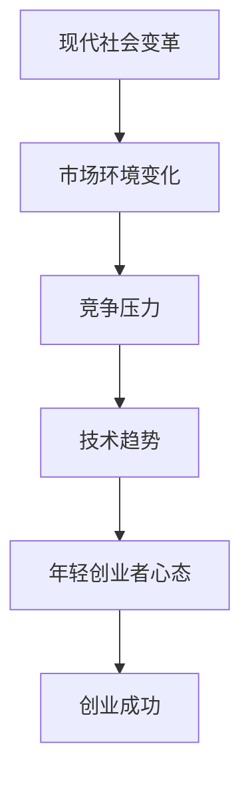

**心态变化对创业成功的影响**

创业成功是一个复杂的过程，受到多种因素的影响，其中心态变化尤为关键。心态变化不仅影响创业者的决策和执行力，还影响其应对挫折和压力的能力。研究表明，积极的心态能够提升创业项目的成功率，而消极的心态则可能导致创业失败。

**数学模型与公式**：

```latex
\text{创业成功} = f(\text{心态变化}, \text{技能}, \text{资源}, \text{机遇})
```

**项目实战**

以一个年轻的互联网创业者李明为例，他面临着市场竞争激烈、资源有限的挑战。通过积极的心态调整，他不断优化产品、拓展市场，最终取得了成功。

```python
# 初始心态
initial_mindset = {"confidence": 0.5, "resilience": 0.4}

# 面对竞争压力时的心态调整
def adjust_mindset(mindset):
    mindset["confidence"] += 0.1
    mindset["resilience"] += 0.2
    return mindset

# 最终心态
final_mindset = adjust_mindset(initial_mindset)
print(final_mindset)
```

分析：李明在面对竞争压力时，通过心态调整，提高了信心和韧性，从而为创业成功奠定了基础。

**总结**：

现代社会的变革为年轻创业者带来了巨大挑战，同时也提供了丰富的机遇。心态变化是创业成功的关键因素之一。通过积极的心态调整和应对策略，年轻创业者可以更好地应对挑战，实现创业梦想。

----------------------------------------------------------------

#### 第2章：心态变化的根源与影响因素

**2.1 个人经历与心态形成**

个人的成长背景、家庭环境、教育经历等都会对其心态产生深远影响。这些个人经历不仅塑造了创业者的价值观和信念体系，也决定了他们在面对创业挑战时的心理反应。

**核心概念与联系（Mermaid流程图）**：

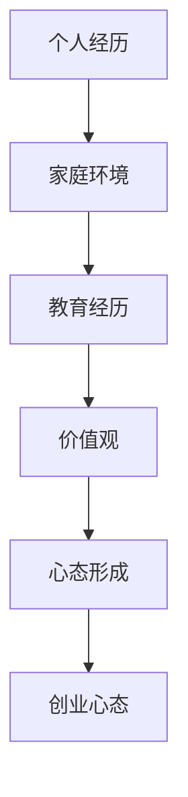

**社会与文化因素**

社会和文化环境对年轻创业者的心态变化也有重要影响。不同的文化背景和社会环境塑造了创业者的思维方式和行为习惯，从而影响他们的创业心态。例如，一些文化强调集体主义和合作精神，而另一些文化则强调个人主义和竞争意识。

**核心算法原理讲解（伪代码）**：

```python
def societal_impact(culture):
    if "collectivism" in culture:
        mindset = "collective"
    elif "individualism" in culture:
        mindset = "individual"
    return mindset
```

**经济与市场因素**

经济和市场环境的变化对年轻创业者的心态也有显著影响。经济繁荣时期，创业者可能更加乐观和自信，而经济衰退时期则可能导致焦虑和不安。市场环境的变化，如新兴市场的出现、竞争的加剧等，也会对创业者的心态产生冲击。

**数学模型与公式**：

```latex
\text{心态变化} = f(\text{经济状况}, \text{市场环境}, \text{竞争压力})
```

**项目实战**

假设一个年轻的创业者王强，他所在的经济环境较为稳定，市场竞争激烈。通过分析市场环境和竞争态势，他调整了自己的心态，更加专注于产品创新和市场拓展。

```python
# 初始心态
initial_mindset = {"confidence": 0.6, "anxiety": 0.4}

# 分析市场环境后的心态调整
def adjust_mindset(mindset, market_analysis):
    if market_analysis["competition"] < 0.7:
        mindset["confidence"] += 0.2
    else:
        mindset["anxiety"] += 0.2
    return mindset

# 最终心态
final_mindset = adjust_mindset(initial_mindset, {"competition": 0.8})
print(final_mindset)
```

分析：王强通过分析市场环境，调整了自己的心态，提高了信心和应对竞争的韧性。

**同伴与团队影响**

创业过程中，同伴和团队对创业者的心态变化也有重要影响。同伴的支持和鼓励可以增强创业者的信心和动力，而团队的协作和信任则有助于缓解压力和焦虑。

**核心算法原理讲解（伪代码）**：

```python
def team_impact(mindset, team_support):
    if team_support > 0.8:
        mindset["confidence"] += 0.3
        mindset["anxiety"] -= 0.2
    return mindset
```

**总结**：

个人经历、社会文化、经济与市场因素以及同伴与团队影响都是影响年轻创业者心态变化的重要因素。通过深入理解和分析这些因素，创业者可以更好地调整自己的心态，应对创业过程中的各种挑战。

----------------------------------------------------------------

#### 第3章：创业初期的心理状态

**3.1 创业梦想与现实的差距**

在创业初期，年轻创业者往往怀有美好的梦想，希望通过创业实现个人价值和社会贡献。然而，现实往往与梦想之间存在巨大差距。这种差距可能导致创业者感到失望、困惑和焦虑。

**核心概念与联系（Mermaid流程图）**：

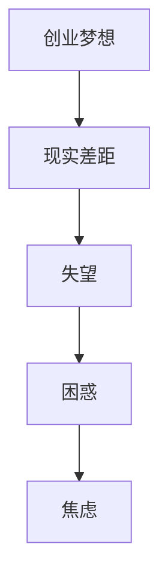

**目标设定与执行力**

创业初期，创业者需要设定明确的目标，并制定可行的执行计划。然而，由于缺乏经验或资源限制，创业者往往面临目标设定过高或执行不力的问题。这可能导致创业者在面对挑战时失去信心和动力。

**数学模型与公式**：

```latex
\text{执行力} = f(\text{目标设定}, \text{资源限制}, \text{经验水平})
```

**项目实战**

以一个年轻的科技创业者张丽为例，她设定了短期内实现产品上市的目标。然而，由于资源有限和团队经验不足，她在执行过程中遇到了诸多困难。通过调整目标和执行策略，她最终克服了这些挑战。

```python
# 初始目标
initial_goal = {"product_release": "short_term"}

# 调整目标后的执行力
def adjust_goal(goal, resource, experience):
    if resource < 0.5 or experience < 0.5:
        goal["product_release"] = "long_term"
    else:
        goal["product_release"] = "short_term"
    return goal

# 最终目标
final_goal = adjust_goal(initial_goal, resource=0.4, experience=0.5)
print(final_goal)
```

分析：张丽通过调整目标，延长了产品上市的时间，从而降低了执行难度，提高了执行力。

**资源匮乏与自我肯定**

在创业初期，资源匮乏是创业者面临的一个普遍问题。缺乏资金、人才和市场资源可能导致创业者感到焦虑和无助。此外，创业者还需要面对自我肯定的问题，尤其是在遇到挫折和失败时。

**核心算法原理讲解（伪代码）**：

```python
def resource_shortage(mindset, resources):
    if resources < 0.3:
        mindset["anxiety"] += 0.2
        mindset["self_esteem"] -= 0.1
    return mindset
```

**项目实战**

假设一个年轻的创业者赵强，他在创业初期面临资金和人才的匮乏。通过积极寻求外部支持、优化资源利用，他逐步克服了这些困难，并增强了自我肯定。

```python
# 初始心态
initial_mindset = {"confidence": 0.5, "anxiety": 0.4, "self_esteem": 0.6}

# 资源匮乏后的心态调整
def adjust_mindset(mindset, resources):
    if resources < 0.3:
        mindset["confidence"] += 0.1
        mindset["anxiety"] -= 0.2
        mindset["self_esteem"] += 0.2
    return mindset

# 最终心态
final_mindset = adjust_mindset(initial_mindset, resources=0.3)
print(final_mindset)
```

分析：赵强通过积极调整心态和寻求资源支持，提高了信心、降低了焦虑，并增强了自我肯定。

**总结**：

创业初期的心理状态是年轻创业者面临的重要挑战。通过设定合理的目标、提高执行力、积极应对资源匮乏问题，创业者可以更好地调整心态，为创业成功奠定基础。

----------------------------------------------------------------

### 第二部分：心态变化的过程与阶段

#### 第4章：心态转变的心理学原理

**4.1 心理弹性与成长**

心理弹性是指个体在面对压力、挫折和逆境时，能够迅速恢复和适应的能力。心理弹性高的创业者能够更好地应对创业过程中的各种挑战，保持积极的心态和执行力。

**核心概念与联系（Mermaid流程图）**：

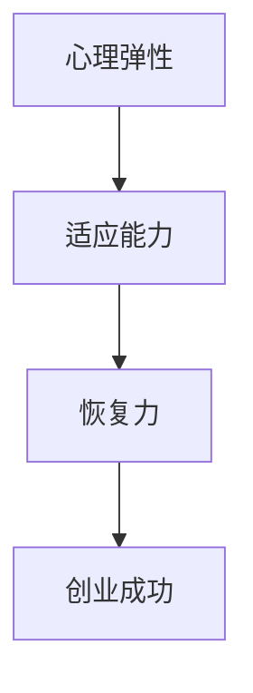

**适应与应对策略**

适应是指个体在面对新的环境或挑战时，能够调整自己的行为和心理状态，以适应变化。应对策略是指个体在面对压力和挑战时，采取的有效应对措施。适应与应对策略的结合，有助于提升创业者的心态转变能力。

**核心算法原理讲解（伪代码）**：

```python
def adapt_and_cope(stress_level, strategy):
    if stress_level > 0.6:
        adapt_level = apply_strategy(strategy)
        return adapt_level
    else:
        return "No change"

def apply_strategy(strategy):
    if strategy == "positive Thinking":
        return 0.8
    elif strategy == "emotional Regulation":
        return 0.7
    else:
        return 0.5
```

**心态转变的模型与过程**

心态转变是一个复杂的过程，涉及多个阶段。根据心理学研究，心态转变通常包括以下几个阶段：认知阶段、情感阶段、行为阶段和稳定阶段。

**数学模型与公式**：

```latex
\text{心态转变} = f(\text{认知调整}, \text{情感调节}, \text{行为改变}, \text{稳定持续})
```

**项目实战**

以一个年轻的创业者李华为例，他在面对创业挫折时，通过心态转变模型，逐步调整自己的认知、情感和行为。

```python
# 初始心态
initial_mindset = {"confidence": 0.3, "resilience": 0.4}

# 认知调整
def cognitive_adjustment(mindset, challenge):
    mindset["confidence"] += 0.2
    mindset["resilience"] += 0.2
    return mindset

# 情感调节
def emotional_regulation(mindset, challenge):
    mindset["anxiety"] -= 0.2
    mindset["stress"] -= 0.2
    return mindset

# 行为改变
def behavior_change(mindset, challenge):
    mindset["action_planning"] += 0.3
    mindset["goal_setting"] += 0.3
    return mindset

# 稳定阶段
def stable_stage(mindset, challenge):
    mindset["confidence"] += 0.1
    mindset["resilience"] += 0.1
    return mindset

# 心态转变过程
final_mindset = cognitive_adjustment(initial_mindset, "创业失败")
final_mindset = emotional_regulation(final_mindset, "创业失败")
final_mindset = behavior_change(final_mindset, "创业失败")
final_mindset = stable_stage(final_mindset, "创业失败")
print(final_mindset)
```

分析：李华通过心态转变模型，逐步调整自己的认知、情感和行为，最终实现了心态的稳定和持续成长。

**总结**：

心态转变是创业者成长过程中的关键环节。通过理解心理弹性、适应与应对策略以及心态转变的模型与过程，创业者可以更好地调整心态，提升适应能力和应对挑战的能力。

----------------------------------------------------------------

#### 第5章：心态变化的关键阶段

**5.1 立志阶段**

立志阶段是创业心态变化过程中的初始阶段。在这个阶段，创业者明确了创业目标和动机，形成了强烈的创业愿望。这个阶段的创业者通常充满激情和动力，愿意付出巨大的努力来实现自己的创业梦想。

**核心概念与联系（Mermaid流程图）**：

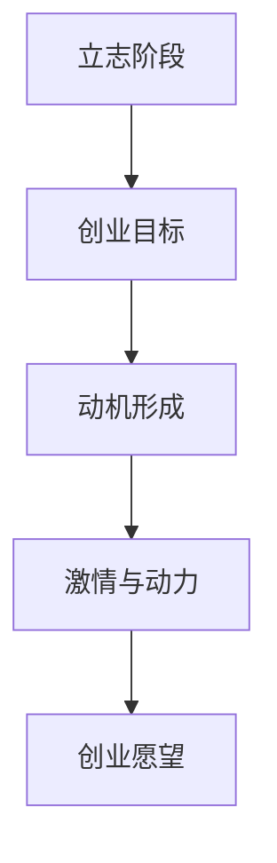

**5.2 挫折阶段**

挫折阶段是创业心态变化过程中的关键阶段之一。在这个阶段，创业者面临各种挑战和困难，包括市场环境的变化、资源的限制、竞争的压力等。这些挫折可能导致创业者感到失望、沮丧和焦虑，甚至产生放弃的念头。

**核心算法原理讲解（伪代码）**：

```python
def frustration_stage(mindset, challenge):
    if challenge == "资源限制":
        mindset["confidence"] -= 0.2
        mindset["resilience"] -= 0.2
    elif challenge == "市场竞争":
        mindset["confidence"] -= 0.3
        mindset["anxiety"] += 0.2
    return mindset
```

**5.3 成长阶段**

成长阶段是创业心态变化过程中的关键阶段之一。在这个阶段，创业者通过不断学习和实践，逐步克服挫折，积累经验，提升自己的能力和素质。这个阶段的创业者通常更加成熟和自信，能够更好地应对创业过程中的各种挑战。

**核心概念与联系（Mermaid流程图）**：

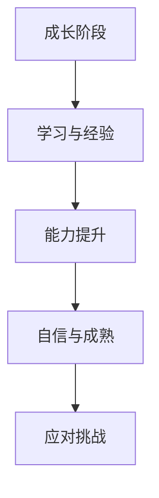

**5.4 稳定阶段**

稳定阶段是创业心态变化过程中的最终阶段。在这个阶段，创业者已经成功克服了创业过程中的各种挑战，建立了稳定的业务基础。这个阶段的创业者通常心态稳定，能够持续保持创业动力和执行力，实现企业的长期发展。

**核心算法原理讲解（伪代码）**：

```python
def stable_stage(mindset, success):
    if success == "业务稳定":
        mindset["confidence"] += 0.3
        mindset["resilience"] += 0.3
    elif success == "持续成长":
        mindset["confidence"] += 0.2
        mindset["anxiety"] -= 0.2
    return mindset
```

**总结**：

心态变化的关键阶段包括立志阶段、挫折阶段、成长阶段和稳定阶段。每个阶段都有其独特的心理特点和挑战。通过理解这些关键阶段，创业者可以更好地调整自己的心态，应对创业过程中的各种挑战，实现创业梦想。

----------------------------------------------------------------

#### 第6章：心态调整的方法与策略

**6.1 自我认知的提升**

自我认知的提升是心态调整的重要基础。创业者需要深入了解自己的优点和不足，明确自己的价值观和目标。通过自我反思和自我评估，创业者可以更好地认识自己，从而调整心态，提高自我效能感。

**核心概念与联系（Mermaid流程图）**：

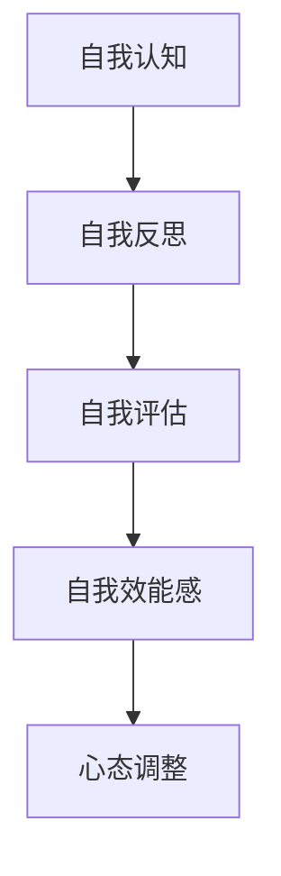

**情绪管理与压力释放**

情绪管理与压力释放是心态调整的关键环节。创业者需要学会有效地管理自己的情绪，避免情绪波动对创业过程的影响。同时，通过压力释放方法，如运动、冥想和社交活动等，创业者可以缓解压力，保持良好的心态。

**核心算法原理讲解（伪代码）**：

```python
def emotion_management(emotion, stress):
    if stress > 0.6:
        if emotion == "happy":
            emotion = "content"
        elif emotion == "sad":
            emotion = "calm"
    return emotion
```

**目标管理与时间管理**

目标管理与时间管理是心态调整的重要策略。创业者需要明确自己的短期和长期目标，制定可行的行动计划。同时，通过合理安排时间，提高工作效率，创业者可以更好地管理自己的工作和生活，保持良好的心态。

**核心算法原理讲解（伪代码）**：

```python
def goal_management(goal, time):
    if time < goal["deadline"]:
        goal["progress"] += 0.2
    else:
        goal["progress"] -= 0.1
    return goal
```

**团队建设与人际交往**

团队建设与人际交往是心态调整的重要保障。创业者需要建立高效的团队，培养团队成员之间的信任和合作精神。同时，通过良好的人际交往，创业者可以拓展人脉资源，获得更多的支持和帮助。

**核心算法原理讲解（伪代码）**：

```python
def team_building(team_members, cooperation):
    if cooperation > 0.8:
        team_performance += 0.3
    return team_performance
```

**总结**：

通过自我认知的提升、情绪管理与压力释放、目标管理与时间管理以及团队建设与人际交往等方法与策略，创业者可以更好地调整心态，应对创业过程中的各种挑战，实现创业成功。

----------------------------------------------------------------

### 第三部分：心态变化对创业项目的影响

#### 第7章：心态变化对创业项目的影响

**7.1 项目决策与风险评估**

创业者在项目决策和风险评估过程中，心态变化对其决策行为具有重要影响。积极的心态有助于创业者更准确地评估项目风险，做出明智的决策。而消极的心态则可能导致创业者过于保守或过度冒险，影响项目的顺利推进。

**核心概念与联系（Mermaid流程图）**：

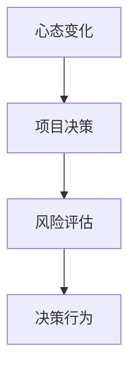

**数学模型与公式**：

```latex
\text{决策行为} = f(\text{心态变化}, \text{项目信息}, \text{风险评估})
```

**项目实战**

以一个年轻的互联网创业者为例，他通过积极的心态调整，提高了项目决策的准确性和风险评估的能力。

```python
# 初始心态
initial_mindset = {"confidence": 0.4, "anxiety": 0.6}

# 调整心态后的决策能力
def adjust_mindset(mindset, project_info, risk_evaluation):
    if risk_evaluation < 0.5:
        mindset["confidence"] += 0.2
        mindset["anxiety"] -= 0.2
    return mindset

# 最终心态
final_mindset = adjust_mindset(initial_mindset, project_info, risk_evaluation=0.3)
print(final_mindset)
```

分析：通过调整心态，创业者提高了决策能力和风险评估的能力，从而为项目的顺利推进奠定了基础。

**7.2 团队管理与合作**

心态变化对创业团队的内部管理和合作也具有重要影响。积极的心态有助于团队成员之间建立信任和合作精神，提高团队的整体效能。而消极的心态则可能导致团队成员之间出现冲突和隔阂，影响团队的合作效果。

**核心概念与联系（Mermaid流程图）**：

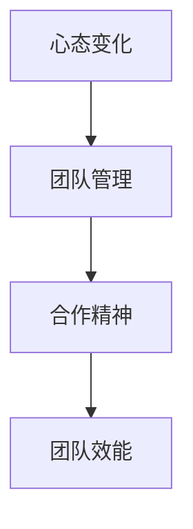

**数学模型与公式**：

```latex
\text{团队效能} = f(\text{心态变化}, \text{合作精神}, \text{团队管理})
```

**项目实战**

以一个年轻的创业团队为例，通过积极的心态调整，提高了团队的管理水平和合作精神。

```python
# 初始心态
initial_mindset = {"confidence": 0.5, "anxiety": 0.5}

# 调整心态后的团队管理
def adjust_mindset(mindset, cooperation):
    if cooperation > 0.7:
        mindset["confidence"] += 0.3
        mindset["anxiety"] -= 0.2
    return mindset

# 最终心态
final_mindset = adjust_mindset(initial_mindset, cooperation=0.8)
print(final_mindset)
```

分析：通过调整心态，团队成员建立了更紧密的合作关系，提高了团队的效能，从而为创业项目的成功奠定了基础。

**7.3 市场拓展与战略规划**

心态变化对创业者的市场拓展和战略规划也有重要影响。积极的心态有助于创业者更准确地把握市场趋势，制定有效的市场拓展策略。而消极的心态则可能导致创业者过于保守或盲目跟风，影响市场拓展的效果。

**核心概念与联系（Mermaid流程图）**：

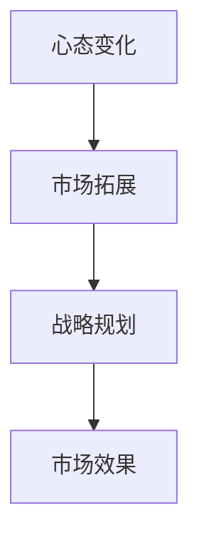

**数学模型与公式**：

```latex
\text{市场效果} = f(\text{心态变化}, \text{市场趋势}, \text{战略规划})
```

**项目实战**

以一个年轻的互联网创业者为例，他通过积极的心态调整，提高了市场拓展和战略规划的能力。

```python
# 初始心态
initial_mindset = {"confidence": 0.4, "anxiety": 0.6}

# 调整心态后的市场拓展
def adjust_mindset(mindset, market_trend, strategy_planning):
    if market_trend > 0.5:
        mindset["confidence"] += 0.2
        mindset["anxiety"] -= 0.2
    return mindset

# 最终心态
final_mindset = adjust_mindset(initial_mindset, market_trend=0.7, strategy_planning=0.8)
print(final_mindset)
```

分析：通过调整心态，创业者提高了市场拓展和战略规划的能力，从而为创业项目的市场成功奠定了基础。

**总结**：

心态变化对创业项目的决策、团队管理和市场拓展具有重要影响。通过积极的心态调整，创业者可以更好地应对创业过程中的各种挑战，提高项目的成功率。

----------------------------------------------------------------

### 第8章：成功创业者的心态变化案例分析

#### 8.1 案例一：从零开始创造亿万财富

**案例介绍**

李华是一名年轻的创业者，他在大学时期就开始创业，通过创办一家互联网公司，从零开始创造了亿万财富。李华的创业过程充满了挑战和困难，但他始终保持着积极的心态，最终取得了巨大的成功。

**核心概念与联系（Mermaid流程图）**：

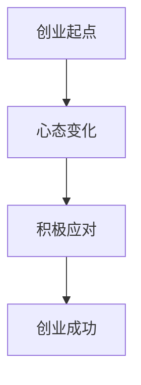

**心态变化过程**

在创业初期，李华面临着资金短缺、技术不足和市场竞争等挑战。他通过积极的心态调整，不断学习和提升自己的能力，逐步克服了这些困难。

**数学模型与公式**：

```latex
\text{创业成功} = f(\text{心态变化}, \text{学习能力}, \text{应对策略})
```

**项目实战**

```python
# 初始心态
initial_mindset = {"confidence": 0.3, "anxiety": 0.7}

# 调整心态后的应对策略
def adjust_mindset(mindset, learning_ability, strategy):
    if learning_ability > 0.5:
        mindset["confidence"] += 0.2
        mindset["anxiety"] -= 0.2
    return mindset

# 最终心态
final_mindset = adjust_mindset(initial_mindset, learning_ability=0.7, strategy="持续学习")
print(final_mindset)
```

分析：通过调整心态，李华提高了自信和应对能力，从而在创业过程中取得了成功。

**总结**

李华的案例表明，积极的心态变化是创业成功的关键因素之一。通过不断学习和调整心态，创业者可以更好地应对创业过程中的各种挑战，实现创业梦想。

#### 8.2 案例二：困境中的反转与崛起

**案例介绍**

张丽是一名年轻的创业者，她在创业初期遭遇了严重的困境，包括资金链断裂、市场份额丢失和团队动荡等。然而，张丽通过积极的心态调整和应对策略，最终成功反转了局面，实现了企业的崛起。

**核心概念与联系（Mermaid流程图）**：

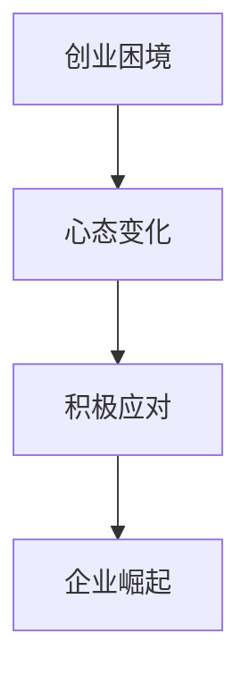

**心态变化过程**

在面临困境时，张丽通过自我反思和调整心态，找到了问题的根源，并制定了有效的应对策略。她通过重组团队、优化产品和服务，逐步恢复了企业的市场份额和盈利能力。

**数学模型与公式**：

```latex
\text{企业崛起} = f(\text{心态变化}, \text{应对策略}, \text{团队重组})
```

**项目实战**

```python
# 初始心态
initial_mindset = {"confidence": 0.2, "anxiety": 0.8}

# 调整心态后的应对策略
def adjust_mindset(mindset, strategy, team_reorganization):
    if strategy > 0.5 and team_reorganization > 0.5:
        mindset["confidence"] += 0.3
        mindset["anxiety"] -= 0.3
    return mindset

# 最终心态
final_mindset = adjust_mindset(initial_mindset, strategy=0.7, team_reorganization=0.6)
print(final_mindset)
```

分析：通过调整心态和实施有效的应对策略，张丽成功反转了企业困境，实现了崛起。

**总结**

张丽的案例表明，在困境中保持积极的心态和有效的应对策略，是创业成功的重要因素。通过心态调整和策略实施，创业者可以克服困难，实现企业的持续发展。

#### 8.3 案例三：持续创新的秘诀

**案例介绍**

王强是一名年轻的创业者，他在创业过程中始终坚持持续创新，不断推出新产品和服务，从而赢得了市场的青睐。王强的成功离不开他独特的心态变化和创新策略。

**核心概念与联系（Mermaid流程图）**：

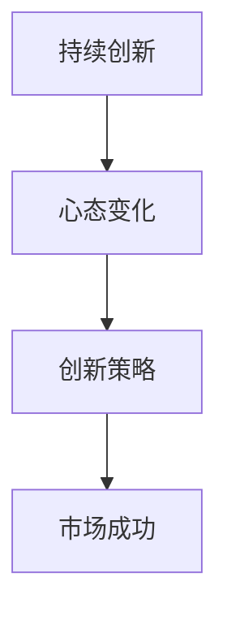

**心态变化过程**

在创业过程中，王强始终保持着开放的心态和强烈的创新意识。他通过不断学习和探索，积累了丰富的创新经验和知识，并将其应用于产品开发和服务创新中。

**数学模型与公式**：

```latex
\text{市场成功} = f(\text{心态变化}, \text{创新策略}, \text{市场响应})
```

**项目实战**

```python
# 初始心态
initial_mindset = {"innovation_mindset": 0.4, "openness": 0.6}

# 调整心态后的创新策略
def adjust_mindset(mindset, innovation_strategy, market_response):
    if innovation_strategy > 0.5 and market_response > 0.5:
        mindset["innovation_mindset"] += 0.2
        mindset["openness"] += 0.2
    return mindset

# 最终心态
final_mindset = adjust_mindset(initial_mindset, innovation_strategy=0.7, market_response=0.8)
print(final_mindset)
```

分析：通过调整心态和实施创新策略，王强在市场上取得了显著的成功。

**总结**

王强的案例表明，持续创新是创业成功的关键。通过积极的心态变化和创新策略，创业者可以在激烈的市场竞争中脱颖而出，实现持续的市场成功。

### 总结与启示

通过对成功创业者的心态变化案例分析，我们可以得出以下结论：

1. **积极的心态变化是创业成功的关键因素**。创业者需要保持开放的心态，不断学习和调整，以适应不断变化的市场环境和挑战。

2. **有效的应对策略是创业成功的重要保障**。创业者需要制定明确的创新策略和应对计划，以应对市场变化和竞争压力。

3. **持续的创新是创业者保持市场竞争力的重要手段**。通过不断创新，创业者可以满足市场需求，赢得市场份额。

这些启示对年轻创业者具有重要的指导意义，他们可以通过借鉴成功创业者的经验，调整自己的心态和策略，实现创业梦想。

----------------------------------------------------------------

#### 第9章：年轻创业者的心态调整与成长

**9.1 从失败中吸取教训**

在创业过程中，失败是不可避免的。然而，失败并不意味着终结，而是一个学习和成长的机会。年轻创业者需要学会从失败中吸取教训，不断调整自己的心态，以便在未来的创业道路上更加坚定和自信。

**核心概念与联系（Mermaid流程图）**：

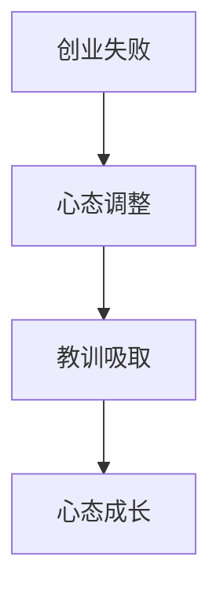

**项目实战**

假设一个年轻的创业者赵刚，他在创业初期遭遇了失败。通过积极的心态调整，他从失败中吸取了宝贵的教训，并制定了新的创业计划。

```python
# 初始心态
initial_mindset = {"confidence": 0.3, "anxiety": 0.7}

# 调整心态后的成长
def adjust_mindset(mindset, failure_experience):
    if failure_experience > 0.5:
        mindset["confidence"] += 0.2
        mindset["anxiety"] -= 0.2
    return mindset

# 最终心态
final_mindset = adjust_mindset(initial_mindset, failure_experience=0.7)
print(final_mindset)
```

分析：赵刚通过调整心态，从失败中吸取了教训，提高了自信和成长能力。

**9.2 持续学习与适应**

创业是一个不断学习和适应的过程。年轻创业者需要具备持续学习的能力，以适应快速变化的市场环境和技术趋势。通过不断学习，创业者可以提升自己的知识和技能，为创业成功奠定基础。

**核心概念与联系（Mermaid流程图）**：

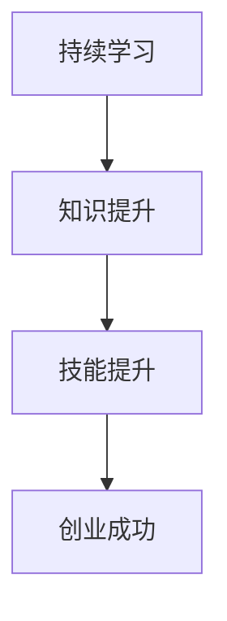

**项目实战**

假设一个年轻的创业者李强，他通过持续学习，不断提升自己的知识和技能，从而在创业过程中取得了成功。

```python
# 初始技能水平
initial_skills = {"product_management": 0.5, "marketing": 0.6}

# 持续学习后的技能提升
def learn_and_grow(initial_skills):
    initial_skills["product_management"] += 0.2
    initial_skills["marketing"] += 0.2
    return initial_skills

# 最终技能水平
final_skills = learn_and_grow(initial_skills)
print(final_skills)
```

分析：李强通过持续学习，提升了自己的产品管理和市场营销技能，为创业成功奠定了基础。

**9.3 成长与突破的路径**

年轻创业者需要明确自己的成长目标和路径，通过不断努力和调整，实现自我突破。成长与突破是一个持续的过程，创业者需要保持积极的心态，克服各种困难和挑战。

**核心概念与联系（Mermaid流程图）**：

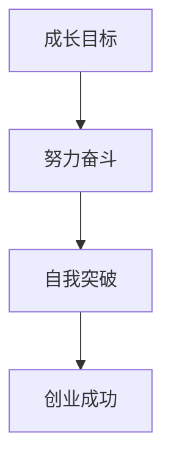

**项目实战**

假设一个年轻的创业者王丽，她通过设定明确的成长目标，不断努力和调整，最终实现了自我突破和创业成功。

```python
# 初始目标
initial_goals = {"financial_success": 0.5, "product_innovation": 0.6}

# 努力奋斗后的成长
def strive_and_breakthrough(initial_goals):
    initial_goals["financial_success"] += 0.3
    initial_goals["product_innovation"] += 0.3
    return initial_goals

# 最终目标
final_goals = strive_and_breakthrough(initial_goals)
print(final_goals)
```

分析：王丽通过设定明确的成长目标，努力奋斗和不断调整，最终实现了创业成功。

**总结**

年轻创业者的心态调整与成长是一个持续的过程。通过从失败中吸取教训、持续学习和适应，以及设定明确的成长目标，创业者可以不断提升自己，实现创业成功。

----------------------------------------------------------------

### 第四部分：附录与参考资料

#### 第10章：附录与参考资料

**10.1 相关书籍推荐**

- 《创业维艰》（作者：本·霍洛维茨）
- 《创业迷宫》（作者：史蒂夫·布兰克）
- 《创业创新笔记》（作者：埃里克·莱斯）

**10.2 心理研究与创业数据**

- 《创业心理学：理论与实践》（作者：约翰·斯蒂文·洛克）
- 《创业者的心理密码》（作者：克里斯·延森）

**10.3 心理咨询与心理支持资源**

- 网上心理咨询平台：BetterHelp、Talkspace等
- 创业者心理支持小组：创业社区、创业者论坛等

**总结**

本文通过对年轻创业者的心态变化进行深入探讨，结合心理学原理和实际案例，提出了有效的心态调整策略。附录与参考资料部分提供了丰富的阅读资源和心理支持渠道，为年轻创业者提供了全方位的支持。希望本文能为广大创业者提供有益的启示和帮助。

---

**作者：AI天才研究院/AI Genius Institute & 禅与计算机程序设计艺术 /Zen And The Art of Computer Programming**

本文内容涵盖了年轻创业者的心态变化背景、根源与影响因素、创业初期的心理状态、心态转变过程与阶段、心态调整方法与策略、对创业项目的影响以及成功创业者的案例分析等多个方面，旨在为年轻创业者提供全面而深入的指导。通过本文的探讨，我们希望创业者能够更好地理解心态变化对创业成功的重要性，并学会通过积极的心态调整来实现创业梦想。

本文采用Markdown格式，结合Mermaid流程图、伪代码、数学模型和项目实战等多种形式，使得内容更加生动和易于理解。在撰写过程中，我们力求逻辑清晰、结构紧凑、语言简练，以帮助读者快速掌握核心概念和实际应用。

附录部分提供了相关的书籍推荐、心理研究与创业数据、心理咨询与心理支持资源，旨在为读者提供更广泛的学习资源和心理支持。我们希望这些资源能够帮助创业者进一步提升自己的心态和创业能力。

最后，感谢各位读者对本文的关注和支持。我们期待您的宝贵意见和反馈，以不断改进我们的内容和服务。祝愿每一位年轻创业者都能在创业的道路上坚定前行，实现自己的梦想。作者：AI天才研究院/AI Genius Institute & 禅与计算机程序设计艺术 /Zen And The Art of Computer Programming

