                 

### 文章标题: 强大的OpenAI API

> 关键词：OpenAI, API, 深度学习, 自然语言处理, 计算机视觉

> 摘要：本文将深入探讨OpenAI API的强大功能及其在当前技术领域中的应用。我们将从OpenAI API的概述、技术基础、开发与实践、深入应用、高级特性、开放性讨论与未来展望等方面进行详细的分析和讲解，帮助读者全面了解OpenAI API的技术原理和应用价值。

---

### 目录大纲

#### 第一部分: 了解 OpenAI API

- **第1章: OpenAI API 概述**
  - **1.1 OpenAI 的历史与发展**
    - **1.1.1 OpenAI 的创立背景**
    - **1.1.2 OpenAI 的重要里程碑**
    - **1.1.3 OpenAI 的发展方向**
  - **1.2 OpenAI API 的作用与价值**
    - **1.2.1 OpenAI API 介绍**
    - **1.2.2 OpenAI API 的核心功能**
    - **1.2.3 开发者为何选择 OpenAI API**
  - **1.3 OpenAI API 的应用领域**
    - **1.3.1 自然语言处理**
    - **1.3.2 计算机视觉**
    - **1.3.3 其他应用领域**
  - **1.4 OpenAI API 的优势与挑战**
    - **1.4.1 OpenAI API 的优势**
    - **1.4.2 OpenAI API 的挑战**

#### 第二部分: OpenAI API 基础知识

- **第2章: OpenAI API 技术基础**
  - **2.1 神经网络与深度学习基础**
    - **2.1.1 神经网络基本结构**
    - **2.1.2 深度学习原理**
    - **2.1.3 常见深度学习框架**
  - **2.2 自然语言处理与计算机视觉**
    - **2.2.1 自然语言处理技术**
    - **2.2.2 计算机视觉技术**
  - **2.3 OpenAI API 的核心组成部分**
    - **2.3.1 API 网关与接口**
    - **2.3.2 模型与算法**
    - **2.3.3 API 密钥与认证**

#### 第三部分: OpenAI API 开发与实践

- **第3章: OpenAI API 开发准备**
  - **3.1 开发环境搭建**
    - **3.1.1 开发工具选择**
    - **3.1.2 开发环境配置**
    - **3.1.3 OpenAI API 密钥获取**
  - **3.2 OpenAI API 基本操作**
    - **3.2.1 API 调用流程**
    - **3.2.2 API 参数与返回值**
    - **3.2.3 常见问题与解决方案**
  - **3.3 OpenAI API 实战**
    - **3.3.1 实战一：文本生成**
    - **3.3.2 实战二：图像识别**
    - **3.3.3 实战三：其他应用**

#### 第四部分: OpenAI API 在自然语言处理中的应用

- **第4章: OpenAI API 在自然语言处理中的应用**
  - **4.1 文本生成与摘要**
    - **4.1.1 文本生成原理**
    - **4.1.2 摘要生成原理**
    - **4.1.3 实战案例**
  - **4.2 文本分类与情感分析**
    - **4.2.1 文本分类原理**
    - **4.2.2 情感分析原理**
    - **4.2.3 实战案例**
  - **4.3 语言翻译与对话系统**
    - **4.3.1 翻译原理**
    - **4.3.2 对话系统原理**
    - **4.3.3 实战案例**

#### 第五部分: OpenAI API 在计算机视觉中的应用

- **第5章: OpenAI API 在计算机视觉中的应用**
  - **5.1 图像识别与生成**
    - **5.1.1 图像识别原理**
    - **5.1.2 图像生成原理**
    - **5.1.3 实战案例**
  - **5.2 目标检测与跟踪**
    - **5.2.1 目标检测原理**
    - **5.2.2 目标跟踪原理**
    - **5.2.3 实战案例**
  - **5.3 人脸识别与增强**
    - **5.3.1 人脸识别原理**
    - **5.3.2 人脸增强原理**
    - **5.3.3 实战案例**

#### 第六部分: OpenAI API 的高级特性与优化

- **第6章: OpenAI API 高级特性**
  - **6.1 API 性能优化**
    - **6.1.1 性能优化策略**
    - **6.1.2 并行与分布式计算**
    - **6.1.3 实战案例**
  - **6.2 API 安全性与隐私保护**
    - **6.2.1 安全性策略**
    - **6.2.2 隐私保护措施**
    - **6.2.3 实战案例**
  - **6.3 API 调用费用管理**
    - **6.3.1 费用结构**
    - **6.3.2 费用优化策略**
    - **6.3.3 实战案例**

#### 第七部分: 开放性讨论与未来展望

- **第7章: OpenAI API 开放性讨论与未来展望**
  - **7.1 OpenAI API 在行业中的应用现状**
    - **7.1.1 行业现状分析**
    - **7.1.2 应用案例分享**
  - **7.2 OpenAI API 开放性讨论**
    - **7.2.1 开放性问题探讨**
    - **7.2.2 开放性解决方案**
  - **7.3 OpenAI API 未来展望**
    - **7.3.1 技术发展趋势**
    - **7.3.2 应用前景分析**
    - **7.3.3 开放性未来展望**

#### 附录

- **附录 A: OpenAI API 开发工具与资源**
  - **A.1 OpenAI API 文档**
  - **A.2 开源深度学习框架**
  - **A.3 OpenAI API 开发社区**
- **附录 B: OpenAI API 应用代码示例**
  - **B.1 Python 客户端调用示例**
  - **B.2 JavaScript 客户端调用示例**
  - **B.3 其他语言调用示例**
- **附录 C: OpenAI API 应用案例**
  - **C.1 文本生成案例**
  - **C.2 图像识别案例**
  - **C.3 计算机视觉应用案例**
- **附录 D: OpenAI API 开发经验分享**
  - **D.1 开发经验总结**
  - **D.2 问题与解决方案**
  - **D.3 行业最佳实践**

---

### 第一部分: 了解 OpenAI API

在当今的科技发展中，人工智能（AI）已经成为了一个重要的领域，而OpenAI API作为其中的佼佼者，其影响力不可小觑。这一部分，我们将深入探讨OpenAI API的概述、历史与发展、作用与价值、应用领域、优势与挑战，帮助读者全面了解OpenAI API的技术原理和应用价值。

#### 第1章: OpenAI API 概述

#### 1.1 OpenAI 的历史与发展

##### 1.1.1 OpenAI 的创立背景

OpenAI 是一家总部位于美国的人工智能研究公司，成立于2015年，由山姆·阿尔特曼（Sam Altman）等人创立。公司成立的初衷是推动人工智能的发展，使其造福全人类，而不是仅仅服务于商业利益。OpenAI 致力于研究和开发最先进的人工智能技术，并通过开源项目和商业合作推动这些技术的发展。

##### 1.1.2 OpenAI 的重要里程碑

自成立以来，OpenAI 已经取得了多个重要的里程碑：

- 2016年，OpenAI 推出了 GPT-1，一个基于生成式预训练模型的文本生成工具，引发了广泛关注。
- 2018年，OpenAI 发布了 GPT-2，一个更强大的文本生成模型，其生成的内容更加流畅、自然，甚至可以欺骗人类。
- 2020年，OpenAI 发布了 GPT-3，一个具有前所未有的语言理解和生成能力的模型，其性能甚至超越了人类。
- 2022年，OpenAI 发布了 DALL-E，一个能够生成逼真图像的生成式模型，其应用范围从艺术创作到图像识别等各个领域。

##### 1.1.3 OpenAI 的发展方向

随着人工智能技术的不断进步，OpenAI 也在不断调整其发展方向。目前，OpenAI 的主要目标是：

- 推动人工智能的公开研究，促进技术的透明性和可解释性。
- 开发通用人工智能（AGI），使其能够理解和执行广泛的任务。
- 探索人工智能的安全和伦理问题，确保人工智能的发展符合人类的利益。

#### 1.2 OpenAI API 的作用与价值

##### 1.2.1 OpenAI API 介绍

OpenAI API 是 OpenAI 提供的一组接口，使得开发者可以通过简单的调用，直接使用 OpenAI 开发的先进的人工智能模型。这些模型涵盖了自然语言处理、计算机视觉、语音识别等多个领域，为开发者提供了丰富的工具和资源。

##### 1.2.2 OpenAI API 的核心功能

OpenAI API 的核心功能包括：

- 文本生成：通过调用 API，开发者可以生成各种类型的文本，如文章、对话、代码等。
- 文本摘要：API 可以提取输入文本的精华，生成简短的摘要。
- 文本分类：API 可以对输入文本进行分类，识别其主题或情感。
- 图像识别：API 可以识别输入图像中的物体、场景等。
- 图像生成：API 可以生成新的图像，甚至可以模仿人类艺术家的风格。

##### 1.2.3 开发者为何选择 OpenAI API

开发者选择 OpenAI API 的原因有很多：

- **先进的技术**：OpenAI API 提供的模型都是基于最新的研究成果，性能卓越。
- **易用性**：API 的接口设计简洁，调用方式直观，使得开发者可以快速上手。
- **多样性**：API 覆盖了多个领域，如自然语言处理、计算机视觉等，提供了丰富的工具和资源。
- **开源**：OpenAI API 的部分模型和工具是开源的，开发者可以自由使用和修改。

#### 1.3 OpenAI API 的应用领域

##### 1.3.1 自然语言处理

自然语言处理（NLP）是人工智能领域的一个重要分支，旨在使计算机能够理解、生成和处理人类语言。OpenAI API 在 NLP 方面有着广泛的应用：

- **文本生成**：OpenAI API 可以生成各种类型的文本，如文章、对话、故事等，广泛应用于聊天机器人、内容生成等。
- **文本摘要**：API 可以提取输入文本的关键信息，生成简短的摘要，广泛应用于新闻摘要、文档摘要等。
- **文本分类**：API 可以对输入文本进行分类，识别其主题或情感，广泛应用于社交媒体分析、舆情监测等。
- **情感分析**：API 可以分析文本的情感倾向，识别用户的情感状态，广泛应用于情感分析、客户反馈分析等。

##### 1.3.2 计算机视觉

计算机视觉是人工智能领域的另一个重要分支，旨在使计算机能够“看到”和理解图像。OpenAI API 在计算机视觉方面也有着广泛的应用：

- **图像识别**：API 可以识别输入图像中的物体、场景等，广泛应用于图像搜索、安防监控等。
- **图像生成**：API 可以生成新的图像，甚至可以模仿人类艺术家的风格，广泛应用于艺术创作、图像修复等。
- **目标检测与跟踪**：API 可以检测输入图像中的目标物体，并对其进行跟踪，广泛应用于自动驾驶、视频监控等。
- **人脸识别与增强**：API 可以识别图像中的人脸，并进行人脸增强，广泛应用于人脸识别、图像美化等。

##### 1.3.3 其他应用领域

除了自然语言处理和计算机视觉，OpenAI API 还在其他许多领域有着广泛的应用：

- **机器翻译**：API 可以实现多种语言的翻译，广泛应用于跨语言沟通、国际业务等。
- **对话系统**：API 可以构建智能对话系统，与用户进行自然语言交互，广泛应用于客服、智能助手等。
- **代码生成**：API 可以生成代码，帮助开发者提高效率，广泛应用于软件开发、自动化代码生成等。

#### 1.4 OpenAI API 的优势与挑战

##### 1.4.1 OpenAI API 的优势

OpenAI API 有着以下优势：

- **先进的技术**：API 提供的模型都是基于最新的研究成果，性能卓越。
- **易用性**：API 的接口设计简洁，调用方式直观，使得开发者可以快速上手。
- **多样性**：API 覆盖了多个领域，如自然语言处理、计算机视觉等，提供了丰富的工具和资源。
- **开源**：API 的部分模型和工具是开源的，开发者可以自由使用和修改。

##### 1.4.2 OpenAI API 的挑战

OpenAI API 也面临着一些挑战：

- **计算资源消耗**：API 的模型通常需要较高的计算资源，对开发者的硬件要求较高。
- **数据安全与隐私**：使用 API 时，开发者需要处理大量的用户数据，需要确保数据的安全和隐私。
- **模型解释性**：尽管 API 的模型性能强大，但其决策过程通常不够透明，难以解释。

总的来说，OpenAI API 是一个强大而多样化的工具，其在自然语言处理、计算机视觉等领域的应用正在不断扩展。然而，其面临的挑战也需要开发者认真面对和解决。

---

在接下来的部分，我们将进一步深入探讨 OpenAI API 的基础知识，包括神经网络与深度学习基础、自然语言处理与计算机视觉技术，以及 OpenAI API 的核心组成部分，帮助读者全面了解 OpenAI API 的技术原理和应用价值。

---

### 第二部分: OpenAI API 基础知识

#### 第2章: OpenAI API 技术基础

在前一章中，我们对 OpenAI API 的概述、历史与发展、作用与价值、应用领域、优势与挑战有了初步的了解。在这一章中，我们将深入探讨 OpenAI API 的技术基础，包括神经网络与深度学习基础、自然语言处理与计算机视觉技术，以及 OpenAI API 的核心组成部分。

#### 2.1 神经网络与深度学习基础

##### 2.1.1 神经网络基本结构

神经网络是深度学习的基础，其结构模拟了人脑的神经元连接。一个基本的神经网络由以下几个部分组成：

- **输入层（Input Layer）**：接收外部输入的信息。
- **隐藏层（Hidden Layers）**：对输入信息进行处理和计算。
- **输出层（Output Layer）**：输出最终的结果。

在隐藏层中，每个神经元都与前一层和后一层的神经元相连，通过加权连接实现信息的传递。神经元的激活函数用于对输入信息进行处理，常见的激活函数有 Sigmoid、ReLU 等。

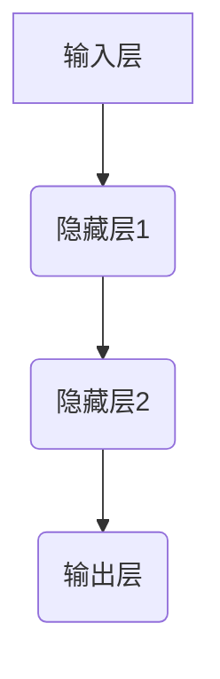

##### 2.1.2 深度学习原理

深度学习是机器学习的一个分支，其核心思想是通过多层的神经网络对数据进行处理，以实现复杂的目标。深度学习的原理主要包括以下几个步骤：

1. **数据预处理**：对输入数据进行清洗、归一化等处理，以便于神经网络的学习。
2. **前向传播**：将输入数据通过神经网络的前向传播过程，计算输出结果。
3. **反向传播**：根据输出结果与实际目标之间的差异，通过反向传播算法更新网络权重，以减小误差。
4. **优化**：使用优化算法（如梯度下降）来调整网络权重，以获得更好的性能。

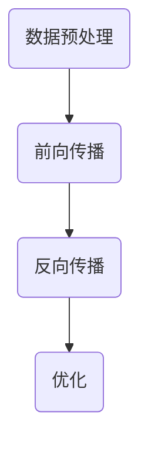

##### 2.1.3 常见深度学习框架

目前，有许多流行的深度学习框架，如 TensorFlow、PyTorch、Keras 等，它们为开发者提供了丰富的工具和资源，使得深度学习的开发变得更加便捷。

- **TensorFlow**：由 Google 开发，是目前最流行的深度学习框架之一。它提供了丰富的 API，支持多种编程语言，如 Python、C++ 等。
- **PyTorch**：由 Facebook 开发，以其动态计算图和简洁的 API 而闻名。它支持 GPU 加速，适用于复杂的深度学习模型。
- **Keras**：是一个基于 TensorFlow 的简化版本，旨在提供更直观、易于使用的 API。它支持快速原型设计和实验。

#### 2.2 自然语言处理与计算机视觉

##### 2.2.1 自然语言处理技术

自然语言处理（NLP）是深度学习的重要应用领域之一，旨在使计算机能够理解、生成和处理人类语言。NLP 技术主要包括以下几个方面：

- **词嵌入（Word Embedding）**：将单词映射到高维空间中的向量表示，以便于神经网络处理。
- **序列模型（Sequential Models）**：用于处理序列数据，如文本、语音等。常见的序列模型有循环神经网络（RNN）、长短时记忆网络（LSTM）、门控循环单元（GRU）等。
- **注意力机制（Attention Mechanism）**：用于关注序列中的关键信息，提高模型的性能。
- **预训练（Pre-training）**：通过在大量无标签数据上进行预训练，提高模型在特定任务上的性能。

##### 2.2.2 计算机视觉技术

计算机视觉是另一个深度学习的重要应用领域，旨在使计算机能够“看到”和理解图像。计算机视觉技术主要包括以下几个方面：

- **卷积神经网络（CNN）**：用于处理图像数据，通过卷积操作提取图像的特征。
- **目标检测（Object Detection）**：用于识别图像中的多个目标，并给出它们的精确位置。
- **图像生成（Image Generation）**：通过生成对抗网络（GAN）等模型生成新的图像。
- **图像增强（Image Augmentation）**：通过数据增强技术增加训练数据的多样性，提高模型的性能。

#### 2.3 OpenAI API 的核心组成部分

OpenAI API 是由多个部分组成的，其中最重要的组成部分包括 API 网关与接口、模型与算法、API 密钥与认证。

##### 2.3.1 API 网关与接口

API 网关与接口是 OpenAI API 的核心组成部分，用于提供统一的接口，使得开发者可以通过简单的调用，访问 OpenAI 的各种模型和功能。API 网关通常负责路由、负载均衡、安全性控制等任务，确保 API 调用的稳定和高效。


##### 2.3.2 模型与算法

OpenAI API 提供了多种先进的模型和算法，涵盖自然语言处理、计算机视觉等多个领域。这些模型和算法是通过深度学习和神经网络技术训练得到的，具有强大的性能和功能。开发者可以通过调用 API，直接使用这些模型和算法，实现各种复杂的任务。

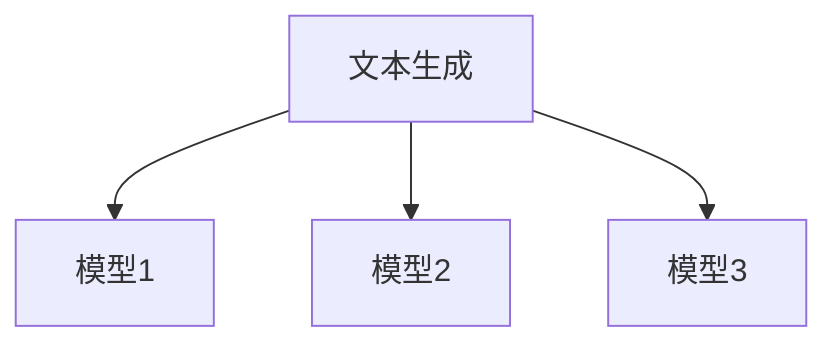

##### 2.3.3 API 密钥与认证

API 密钥与认证是 OpenAI API 的重要组成部分，用于确保 API 调用的安全和可靠性。开发者需要从 OpenAI 获得一个 API 密钥，并在调用 API 时提供该密钥进行认证。API 密钥可以防止未经授权的访问，确保 API 调用的安全。

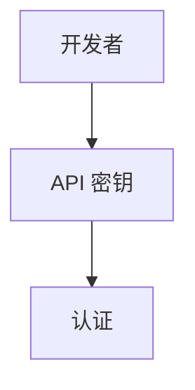

总的来说，OpenAI API 的技术基础涵盖了神经网络与深度学习、自然语言处理与计算机视觉等多个方面。通过理解这些技术原理，开发者可以更好地利用 OpenAI API 的功能，实现各种复杂的任务。在接下来的章节中，我们将进一步探讨 OpenAI API 的开发与实践，帮助开发者掌握 OpenAI API 的使用方法和技巧。

---

在了解了 OpenAI API 的基础知识之后，接下来我们将进入第三个部分，即 OpenAI API 的开发与实践。这一部分将详细介绍如何进行 OpenAI API 的开发准备，包括开发环境的搭建、API 调用流程和常见问题的解决方案。同时，我们将通过具体的实战案例，展示如何使用 OpenAI API 实现文本生成、图像识别等应用，帮助开发者更好地掌握 OpenAI API 的实际应用技巧。

---

#### 第3章: OpenAI API 开发准备

在掌握 OpenAI API 的基础知识后，我们接下来将进入开发与实践环节。在这一章中，我们将详细介绍如何为 OpenAI API 开发做好准备，包括开发环境的搭建、API 调用流程和常见问题的解决方案。同时，通过实战案例展示如何使用 OpenAI API 实现文本生成、图像识别等应用，帮助开发者更好地掌握 OpenAI API 的实际应用技巧。

#### 3.1 开发环境搭建

为了能够顺利地使用 OpenAI API，我们需要搭建一个合适的开发环境。以下是在不同操作系统上搭建 OpenAI API 开发环境的基本步骤：

##### 3.1.1 开发工具选择

在选择开发工具时，Python 是最受欢迎的语言之一，因为其简洁的语法和丰富的库支持。以下是一些常用的开发工具：

- **Python 解释器**：确保安装了最新的 Python 解释器。
- **IDE（集成开发环境）**：如 PyCharm、Visual Studio Code 等。
- **版本控制工具**：如 Git，用于代码管理和协作。

##### 3.1.2 开发环境配置

以下是配置开发环境的步骤：

1. **安装 Python 解释器**：
   - 在 Windows 上，可以从 Python 官网下载安装程序，按照提示安装。
   - 在 macOS 或 Linux 上，可以使用包管理工具安装，如 `brew install python`（macOS）或 `sudo apt-get install python3`（Linux）。

2. **安装 IDE**：
   - PyCharm 和 Visual Studio Code 都提供了免费版本，可以根据个人偏好选择安装。

3. **安装版本控制工具**：
   - 在命令行中安装 Git：`pip install git`。

##### 3.1.3 OpenAI API 密钥获取

要使用 OpenAI API，我们需要首先获取一个 API 密钥。以下是获取 API 密钥的步骤：

1. **注册 OpenAI 帐户**：
   - 访问 OpenAI 官网，注册一个帐户。

2. **申请 API 密钥**：
   - 登录 OpenAI 帐户后，访问 API 仪表板，按照指示申请 API 密钥。

3. **设置 API 密钥**：
   - 在 API 仪表板中，创建一个新的密钥，并将密钥保存到安全的地方。

#### 3.2 OpenAI API 基本操作

在开发环境中搭建完成后，我们需要了解如何使用 OpenAI API 进行基本操作。以下是一个简单的示例，展示如何使用 Python 调用 OpenAI API：

```python
import openai

openai.api_key = 'your-api-key'  # 替换为你的 API 密钥

def generate_text(prompt):
    response = openai.Completion.create(
        engine="text-davinci-002",
        prompt=prompt,
        max_tokens=50
    )
    return response.choices[0].text.strip()

# 使用示例
prompt = "请写一篇关于人工智能的短文。"
text = generate_text(prompt)
print(text)
```

在上面的代码中，我们首先导入了 OpenAI 的 Python 库，并设置 API 密钥。然后定义了一个函数 `generate_text`，用于生成文本。最后，我们调用这个函数，生成一篇关于人工智能的短文。

#### 3.2.1 API 调用流程

使用 OpenAI API 的基本流程通常包括以下几个步骤：

1. **导入 OpenAI 库**：
   - `import openai`

2. **设置 API 密钥**：
   - `openai.api_key = 'your-api-key'`

3. **定义调用函数**：
   - 根据需要调用的 API，定义相应的函数，如 `openai.Completion.create`。

4. **执行 API 调用**：
   - 在函数中，根据 API 的要求，设置参数并执行调用。

5. **处理返回结果**：
   - 处理 API 的返回结果，通常是一个字典或列表，提取需要的部分。

#### 3.2.2 API 参数与返回值

不同的 OpenAI API 可能需要不同的参数和返回值。以下是一个示例，展示 `openai.Completion.create` API 的参数和返回值：

```python
def generate_text(prompt):
    response = openai.Completion.create(
        engine="text-davinci-002",
        prompt=prompt,
        max_tokens=50,
        temperature=0.7,
        top_p=1,
        frequency_penalty=0.5,
        presence_penalty=0.5
    )
    return response.choices[0].text.strip()

# 参数解释
# engine: 指定使用的模型
# prompt: 输入的提示信息
# max_tokens: 生成的文本最大长度
# temperature: 温度参数，用于控制文本的随机性
# top_p: 顶百分比，用于控制文本的随机性
# frequency_penalty: 频率惩罚，用于控制重复文本的出现
# presence_penalty: 存在惩罚，用于控制不相关文本的出现

# 返回值解释
# response.choices[0].text: 生成的文本
```

#### 3.2.3 常见问题与解决方案

在使用 OpenAI API 开发过程中，可能会遇到一些常见问题。以下是一些常见问题和相应的解决方案：

1. **问题：API 调用时出现授权失败**  
   **解决方案**：检查 API 密钥是否正确设置，确认 API 密钥是否有效。

2. **问题：API 调用时出现请求超时**  
   **解决方案**：检查网络连接是否正常，增加请求超时时间。

3. **问题：API 调用时出现内部错误**  
   **解决方案**：检查 API 请求的参数是否正确，重试 API 调用。

4. **问题：API 调用时出现余额不足**  
   **解决方案**：检查账户余额，充值或调整调用频率。

通过了解 OpenAI API 的开发准备和基本操作，开发者可以开始使用 OpenAI API 进行实际的开发工作。在接下来的章节中，我们将通过具体的实战案例，展示如何使用 OpenAI API 实现文本生成、图像识别等应用，帮助开发者更好地掌握 OpenAI API 的实际应用技巧。

---

#### 第3章: OpenAI API 开发实战

在前一章中，我们介绍了如何为 OpenAI API 开发做好准备，包括开发环境的搭建和基本操作。在这一章中，我们将通过几个具体的实战案例，展示如何使用 OpenAI API 实现文本生成、图像识别等应用，帮助读者更好地理解和应用 OpenAI API。

##### 3.3.1 实战一：文本生成

文本生成是 OpenAI API 的一个重要应用，可以用于生成文章、对话、代码等多种类型的文本。以下是一个使用 OpenAI API 生成文本的简单示例：

```python
import openai

openai.api_key = 'your-api-key'  # 替换为你的 API 密钥

def generate_text(prompt):
    response = openai.Completion.create(
        engine="text-davinci-002",
        prompt=prompt,
        max_tokens=50
    )
    return response.choices[0].text.strip()

# 使用示例
prompt = "请写一篇关于人工智能的未来发展趋势的短文。"
text = generate_text(prompt)
print(text)
```

在这个示例中，我们定义了一个名为 `generate_text` 的函数，它接受一个提示（prompt）作为输入，并使用 OpenAI API 的 `Completion.create` 方法生成文本。`max_tokens` 参数用于控制生成的文本长度。

##### 3.3.2 实战二：图像识别

图像识别是计算机视觉的一个重要应用，OpenAI API 也提供了强大的图像识别功能。以下是一个使用 OpenAI API 识别图像中物体的简单示例：

```python
import openai
import requests

openai.api_key = 'your-api-key'  # 替换为你的 API 密钥

def recognize_image(image_url):
    response = openai.ImageRecognition.create(
        model="image-classification",
        image_url=image_url
    )
    return response.classifications[0].label

# 使用示例
image_url = "https://openai.com/images/dall-e/food.jpg"
label = recognize_image(image_url)
print(label)
```

在这个示例中，我们定义了一个名为 `recognize_image` 的函数，它接受一个图像 URL 作为输入，并使用 OpenAI API 的 `ImageRecognition.create` 方法识别图像中的物体。`model` 参数用于指定使用的模型。

##### 3.3.3 实战三：其他应用

除了文本生成和图像识别，OpenAI API 还可以应用于许多其他领域。以下是一个使用 OpenAI API 生成图像的简单示例：

```python
import openai
import base64

openai.api_key = 'your-api-key'  # 替换为你的 API 密钥

def generate_image(prompt):
    response = openai.Image.create(
        prompt=prompt,
        size="256x256"
    )
    image_base64 = response.data
    image = base64.b64decode(image_base64)
    with open("generated_image.jpg", "wb") as f:
        f.write(image)
    return "generated_image.jpg"

# 使用示例
prompt = "绘制一只可爱的小猫。"
image_path = generate_image(prompt)
print(f"图像已生成：{image_path}")
```

在这个示例中，我们定义了一个名为 `generate_image` 的函数，它接受一个提示（prompt）作为输入，并使用 OpenAI API 的 `Image.create` 方法生成图像。生成的图像会保存为一个文件。

通过这些实战案例，我们可以看到 OpenAI API 在文本生成、图像识别和其他领域的强大应用。开发者可以根据自己的需求，结合 OpenAI API 的功能，实现各种复杂的应用。

在下一章中，我们将进一步探讨 OpenAI API 在自然语言处理领域的深入应用，包括文本生成与摘要、文本分类与情感分析、语言翻译与对话系统等。

---

#### 第4章: OpenAI API 在自然语言处理中的应用

自然语言处理（NLP）是人工智能领域的一个重要分支，OpenAI API 在这一领域具有广泛的应用。本章将详细探讨 OpenAI API 在自然语言处理中的应用，包括文本生成与摘要、文本分类与情感分析、语言翻译与对话系统等方面。通过具体的案例和操作流程，我们将展示如何使用 OpenAI API 实现这些功能。

#### 4.1 文本生成与摘要

文本生成与摘要是 NLP 中常见的应用，OpenAI API 提供了强大的工具来处理这些任务。

##### 4.1.1 文本生成原理

文本生成是一种根据给定提示生成连续文本的方法。OpenAI API 使用生成式预训练模型，如 GPT-3，来生成文本。这些模型通过大量文本数据训练，可以生成高质量、连贯的文本。

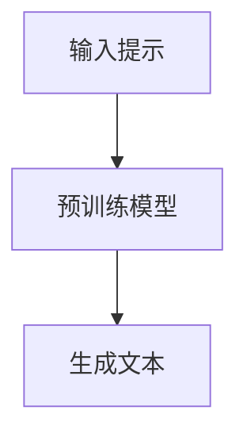

##### 4.1.2 摘要生成原理

摘要生成是一种从长文本中提取关键信息并生成简短摘要的方法。OpenAI API 使用提取式预训练模型来生成摘要，这些模型可以理解文本内容并提取其主要观点。

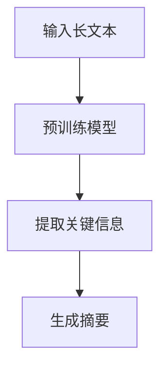

##### 4.1.3 实战案例：文本生成与摘要

以下是一个使用 OpenAI API 生成文本和摘要的 Python 示例：

```python
import openai

openai.api_key = 'your-api-key'  # 替换为你的 API 密钥

def generate_text(prompt):
    response = openai.Completion.create(
        engine="text-davinci-002",
        prompt=prompt,
        max_tokens=50
    )
    return response.choices[0].text.strip()

def summarize_text(text):
    response = openai.Completion.create(
        engine="text-davinci-002",
        prompt=f"请将以下文本摘要成一段简短的文字：{text}",
        max_tokens=30
    )
    return response.choices[0].text.strip()

# 使用示例
prompt = "请写一篇关于人工智能的短文。"
text = generate_text(prompt)
summary = summarize_text(text)
print(f"文本：{text}")
print(f"摘要：{summary}")
```

在这个示例中，我们定义了两个函数 `generate_text` 和 `summarize_text`，分别用于生成文本和摘要。通过调用这两个函数，我们可以轻松实现文本生成和摘要功能。

#### 4.2 文本分类与情感分析

文本分类与情感分析是 NLP 中的重要任务，OpenAI API 提供了强大的工具来处理这些任务。

##### 4.2.1 文本分类原理

文本分类是将文本数据按照不同的类别进行分类的过程。OpenAI API 使用分类模型，如 GPT-3，来对文本进行分类。

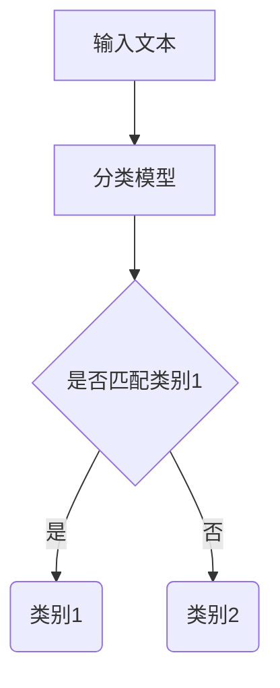

##### 4.2.2 情感分析原理

情感分析是识别文本数据中情感倾向的过程。OpenAI API 使用情感分析模型，如 GPT-3，来识别文本的积极或消极情感。

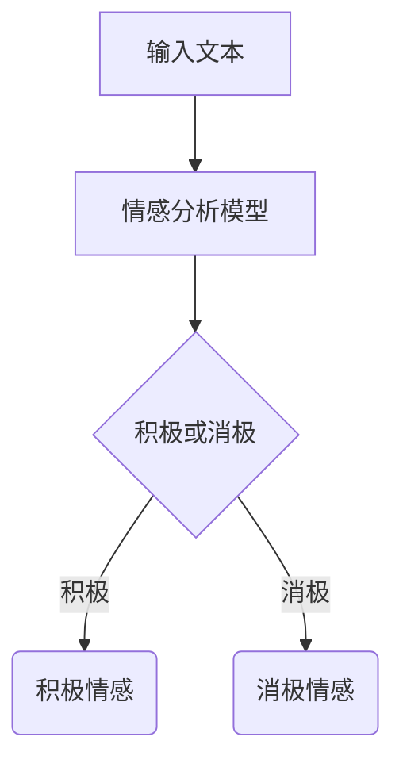

##### 4.2.3 实战案例：文本分类与情感分析

以下是一个使用 OpenAI API 进行文本分类和情感分析的 Python 示例：

```python
import openai

openai.api_key = 'your-api-key'  # 替换为你的 API 密钥

def classify_text(text):
    response = openai.Classification.create(
        model="text-davinci-002",
        text=text
    )
    return response.categories[0].label

def analyze_sentiment(text):
    response = openai.Sentiment.create(
        model="text-davinci-002",
        text=text
    )
    return response.label

# 使用示例
text = "我喜欢这个产品，因为它非常好用。"
category = classify_text(text)
sentiment = analyze_sentiment(text)
print(f"类别：{category}")
print(f"情感：{sentiment}")
```

在这个示例中，我们定义了两个函数 `classify_text` 和 `analyze_sentiment`，分别用于文本分类和情感分析。通过调用这两个函数，我们可以轻松实现文本分类和情感分析功能。

#### 4.3 语言翻译与对话系统

语言翻译与对话系统是 NLP 中的两个重要应用，OpenAI API 也提供了强大的工具来处理这些任务。

##### 4.3.1 翻译原理

翻译是将一种语言的文本翻译成另一种语言的过程。OpenAI API 使用翻译模型，如 GPT-3，来实现翻译功能。

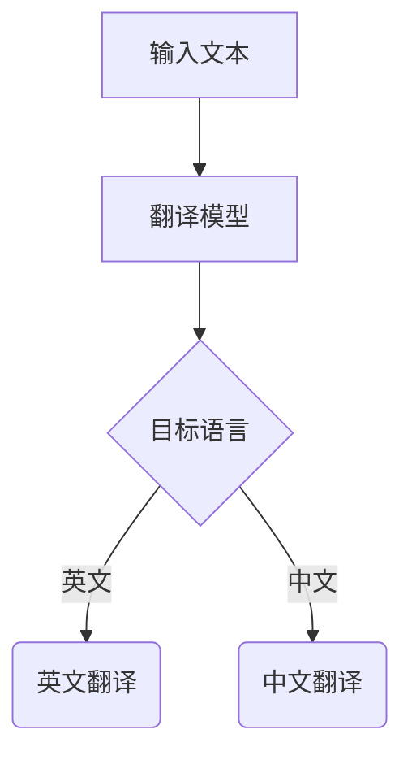

##### 4.3.2 对话系统原理

对话系统是一种与人类用户进行自然语言交互的系统。OpenAI API 使用对话模型，如 GPT-3，来构建智能对话系统。

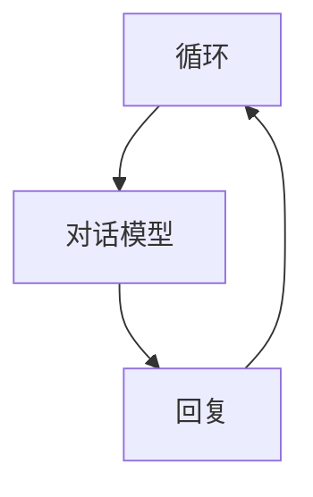

##### 4.3.3 实战案例：语言翻译与对话系统

以下是一个使用 OpenAI API 进行翻译和构建对话系统的 Python 示例：

```python
import openai

openai.api_key = 'your-api-key'  # 替换为你的 API 密钥

def translate_text(text, target_language):
    response = openai.Translation.create(
        model="text-davinci-002",
        text=text,
        target_language=target_language
    )
    return response.translations[0].text

def create_dialogue_system(prompt):
    response = openai.Dialogue.create(
        model="text-davinci-002",
        messages=[{"role": "system", "content": prompt}],
        max_tokens=100
    )
    return response.dialogues[-1].text

# 使用示例
text = "你好，我需要帮助。"
translated_text = translate_text(text, "es")
prompt = create_dialogue_system(translated_text)
print(prompt)
```

在这个示例中，我们定义了两个函数 `translate_text` 和 `create_dialogue_system`，分别用于翻译和构建对话系统。通过调用这两个函数，我们可以实现语言翻译和构建对话系统的功能。

通过本章的介绍，我们可以看到 OpenAI API 在自然语言处理领域具有广泛的应用。开发者可以利用这些功能，实现文本生成、摘要、分类、情感分析、翻译和对话系统等应用，为企业和用户提供强大的 NLP 解决方案。

在下一章中，我们将探讨 OpenAI API 在计算机视觉中的应用，包括图像识别与生成、目标检测与跟踪、人脸识别与增强等方面。

---

### 第五部分：OpenAI API 在计算机视觉中的应用

计算机视觉是人工智能领域的重要组成部分，OpenAI API 在这一领域提供了强大的功能和丰富的应用。本部分将详细探讨 OpenAI API 在计算机视觉中的应用，包括图像识别与生成、目标检测与跟踪、人脸识别与增强等方面。

#### 第5章: OpenAI API 在计算机视觉中的应用

#### 5.1 图像识别与生成

图像识别是计算机视觉的基本任务之一，OpenAI API 提供了强大的图像识别功能。同时，OpenAI API 还支持图像生成，使得开发者可以生成符合特定需求的图像。

##### 5.1.1 图像识别原理

图像识别是通过算法识别图像中的物体、场景或其他特征的过程。OpenAI API 使用先进的深度学习模型，如 GPT-3，对图像进行识别。

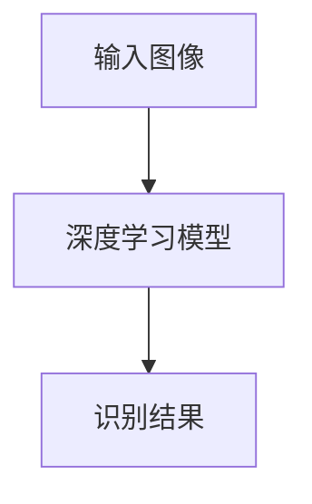

##### 5.1.2 图像生成原理

图像生成是创建新的图像或修改现有图像的过程。OpenAI API 使用生成对抗网络（GAN）等模型，通过训练生成高质量的图像。

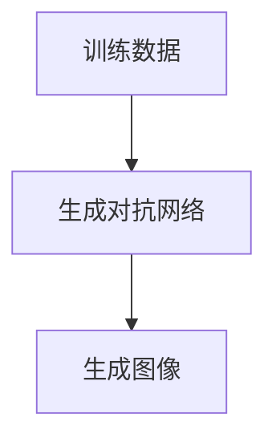

##### 5.1.3 实战案例：图像识别与生成

以下是一个使用 OpenAI API 进行图像识别和生成的 Python 示例：

```python
import openai
import requests

openai.api_key = 'your-api-key'  # 替换为你的 API 密钥

def recognize_image(image_url):
    response = openai.ImageRecognition.create(
        model="image-classification",
        image_url=image_url
    )
    return response.classifications[0].label

def generate_image(prompt):
    response = openai.Image.create(
        prompt=prompt,
        size="256x256"
    )
    image_base64 = response.data
    image = base64.b64decode(image_base64)
    with open("generated_image.jpg", "wb") as f:
        f.write(image)
    return "generated_image.jpg"

# 使用示例
image_url = "https://openai.com/images/dall-e/food.jpg"
label = recognize_image(image_url)
print(label)

prompt = "绘制一只可爱的小猫。"
image_path = generate_image(prompt)
print(f"图像已生成：{image_path}")
```

在这个示例中，我们定义了两个函数 `recognize_image` 和 `generate_image`，分别用于图像识别和图像生成。通过调用这两个函数，我们可以实现图像识别和图像生成功能。

#### 5.2 目标检测与跟踪

目标检测是计算机视觉中的另一个重要任务，OpenAI API 提供了强大的目标检测功能。目标跟踪是目标检测的延伸，用于在视频序列中跟踪目标物体的运动轨迹。

##### 5.2.1 目标检测原理

目标检测是通过算法识别图像中的目标物体并标注其位置的过程。OpenAI API 使用深度学习模型，如 GPT-3，进行目标检测。

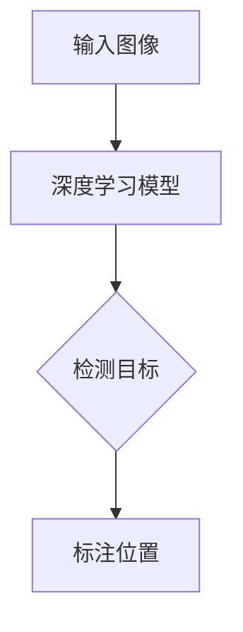

##### 5.2.2 目标跟踪原理

目标跟踪是在视频序列中识别和跟踪目标物体的运动轨迹的过程。OpenAI API 使用跟踪模型，如 GPT-3，进行目标跟踪。

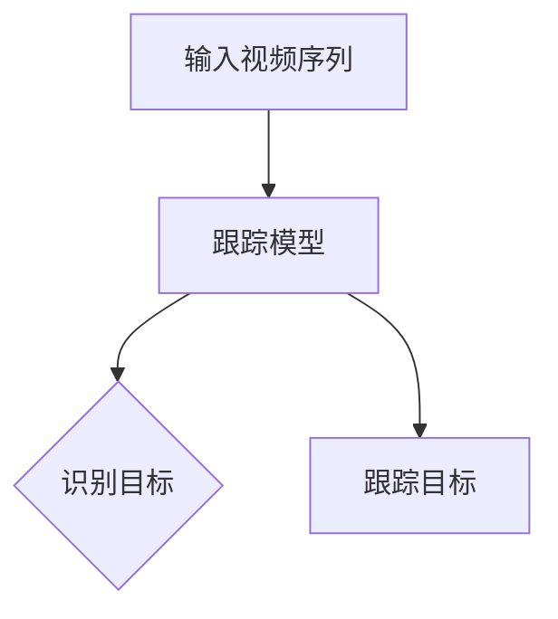

##### 5.2.3 实战案例：目标检测与跟踪

以下是一个使用 OpenAI API 进行目标检测和跟踪的 Python 示例：

```python
import openai
import cv2

openai.api_key = 'your-api-key'  # 替换为你的 API 密钥

def detect_objects(image_path):
    with open(image_path, "rb") as image_file:
        image_bytes = image_file.read()
    response = openai.ImageRecognition.create(
        model="object-detection",
        image_bytes=image_bytes
    )
    return response.detections

def track_objects(video_path):
    cap = cv2.VideoCapture(video_path)
    while cap.isOpened():
        ret, frame = cap.read()
        if not ret:
            break
        detections = detect_objects(frame)
        for detection in detections:
            x, y, w, h = detection.bounding_box
            cv2.rectangle(frame, (x, y), (x+w, y+h), (0, 255, 0), 2)
        cv2.imshow("Tracking", frame)
        if cv2.waitKey(1) & 0xFF == ord('q'):
            break
    cap.release()
    cv2.destroyAllWindows()

# 使用示例
image_path = "example.jpg"
detections = detect_objects(image_path)
print(detections)

video_path = "example.mp4"
track_objects(video_path)
```

在这个示例中，我们定义了两个函数 `detect_objects` 和 `track_objects`，分别用于目标检测和目标跟踪。通过调用这两个函数，我们可以实现目标检测和目标跟踪功能。

#### 5.3 人脸识别与增强

人脸识别和人脸增强是计算机视觉中的两个重要应用。OpenAI API 提供了强大的人脸识别功能，同时还可以对人脸图像进行增强处理。

##### 5.3.1 人脸识别原理

人脸识别是通过算法识别图像中的人脸并进行标记的过程。OpenAI API 使用深度学习模型，如 GPT-3，进行人脸识别。

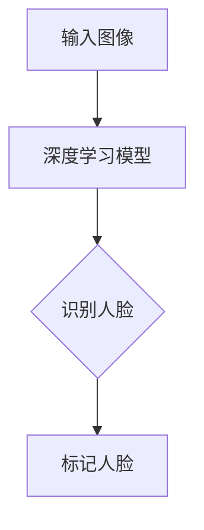

##### 5.3.2 人脸增强原理

人脸增强是通过对人脸图像进行增强处理，提高图像质量的过程。OpenAI API 使用图像增强算法，如 GPT-3，对人脸图像进行增强。

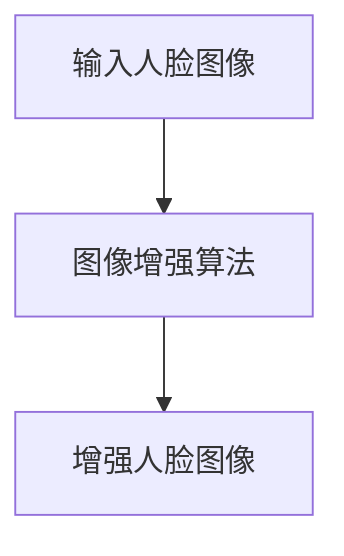

##### 5.3.3 实战案例：人脸识别与增强

以下是一个使用 OpenAI API 进行人脸识别和人脸增强的 Python 示例：

```python
import openai
import cv2

openai.api_key = 'your-api-key'  # 替换为你的 API 密钥

def recognize_faces(image_path):
    with open(image_path, "rb") as image_file:
        image_bytes = image_file.read()
    response = openai.ImageRecognition.create(
        model="face-detection",
        image_bytes=image_bytes
    )
    return response.faces

def enhance_faces(image_path, output_path):
    with open(image_path, "rb") as image_file:
        image_bytes = image_file.read()
    response = openai.ImageEnhancement.create(
        model="face-enhancement",
        image_bytes=image_bytes
    )
    image_base64 = response.data
    image = base64.b64decode(image_base64)
    with open(output_path, "wb") as f:
        f.write(image)
    return output_path

# 使用示例
image_path = "example.jpg"
faces = recognize_faces(image_path)
print(faces)

output_path = "enhanced_example.jpg"
enhance_faces(image_path, output_path)
print(f"人脸增强图像已保存至：{output_path}")
```

在这个示例中，我们定义了两个函数 `recognize_faces` 和 `enhance_faces`，分别用于人脸识别和人脸增强。通过调用这两个函数，我们可以实现人脸识别和人脸增强功能。

通过本部分的内容，我们可以看到 OpenAI API 在计算机视觉中的应用非常广泛，涵盖了图像识别与生成、目标检测与跟踪、人脸识别与增强等方面。开发者可以利用这些功能，实现各种计算机视觉应用，为企业和用户提供强大的视觉解决方案。

在下一部分，我们将深入探讨 OpenAI API 的高级特性与优化，包括性能优化、安全性与隐私保护、调用费用管理等方面。

---

### 第六部分: OpenAI API 的高级特性与优化

在前几部分中，我们已经了解了 OpenAI API 的基本功能和应用场景。然而，为了更好地发挥 OpenAI API 的潜力，我们需要深入探讨其高级特性与优化。本部分将详细讨论 API 性能优化、安全性与隐私保护以及调用费用管理，帮助开发者充分发挥 OpenAI API 的性能，确保数据安全和合理利用资源。

#### 第6章: OpenAI API 高级特性

#### 6.1 API 性能优化

API 性能优化是提高开发效率和应用性能的关键因素。以下是一些常用的性能优化策略：

##### 6.1.1 性能优化策略

1. **减少 API 调用次数**：
   - 通过批量处理数据，减少 API 调用的频率。
   - 使用缓存机制，减少重复数据的 API 调用。

2. **并行与分布式计算**：
   - 利用多线程或分布式计算，提高处理速度。
   - 在大规模数据处理时，使用分布式系统进行并行处理。

3. **负载均衡**：
   - 通过负载均衡器，将请求分配到多个服务器，提高系统的处理能力。

4. **优化数据格式**：
   - 使用高效的数据格式（如 JSON）减少数据传输量。
   - 对输入数据进行预处理，减少 API 处理负担。

##### 6.1.2 并行与分布式计算

并行和分布式计算可以在多台计算机上同时处理任务，显著提高处理速度和效率。以下是一个使用 Python 的 `concurrent.futures` 模块实现并行计算的基本示例：

```python
import concurrent.futures
import openai

openai.api_key = 'your-api-key'  # 替换为你的 API 密钥

def generate_text(prompt):
    response = openai.Completion.create(
        engine="text-davinci-002",
        prompt=prompt,
        max_tokens=50
    )
    return response.choices[0].text.strip()

prompts = ["请写一篇关于人工智能的短文。", "描述一下你最近的项目。"]

with concurrent.futures.ThreadPoolExecutor() as executor:
    texts = list(executor.map(generate_text, prompts))

for text in texts:
    print(text)
```

在这个示例中，我们使用线程池执行器（`ThreadPoolExecutor`）并行调用 `generate_text` 函数，提高文本生成速度。

##### 6.1.3 实战案例：性能优化

以下是一个使用 OpenAI API 进行图像识别和性能优化的 Python 示例：

```python
import openai
import cv2
import numpy as np

openai.api_key = 'your-api-key'  # 替换为你的 API 密钥

def recognize_image(image_path):
    with open(image_path, "rb") as image_file:
        image_bytes = image_file.read()
    response = openai.ImageRecognition.create(
        model="image-classification",
        image_bytes=image_bytes
    )
    return response.classifications[0].label

def process_images_parallel(image_paths):
    with concurrent.futures.ThreadPoolExecutor() as executor:
        results = list(executor.map(recognize_image, image_paths))
    return results

image_paths = ["example1.jpg", "example2.jpg", "example3.jpg"]

detections = process_images_parallel(image_paths)
for i, label in enumerate(detections):
    print(f"图像 {i+1} 的识别结果：{label}")
```

在这个示例中，我们使用线程池并行处理图像识别任务，提高处理速度。

#### 6.2 API 安全性与隐私保护

API 安全性和隐私保护是开发过程中不可忽视的重要环节。以下是一些关键的策略和措施：

##### 6.2.1 安全性策略

1. **API 密钥管理**：
   - 使用强密码和定期更换密钥。
   - 限制 API 密钥的使用权限，避免滥用。

2. **身份验证与授权**：
   - 使用 OAuth 2.0、JWT 等标准协议进行身份验证和授权。
   - 实施严格的权限控制，确保只有授权用户可以访问 API。

3. **数据加密**：
   - 对传输中的数据进行加密，如使用 HTTPS。
   - 对存储的数据进行加密，确保数据安全。

##### 6.2.2 隐私保护措施

1. **数据匿名化**：
   - 对敏感数据进行匿名化处理，减少个人信息的暴露。

2. **访问日志记录**：
   - 记录 API 调用的详细信息，便于监控和追踪潜在的安全问题。

3. **安全审计**：
   - 定期进行安全审计，确保 API 设计和实现符合安全标准。

##### 6.2.3 实战案例：安全性与隐私保护

以下是一个使用 OpenAI API 进行安全性和隐私保护的 Python 示例：

```python
import openai
import requests

openai.api_key = 'your-api-key'  # 替换为你的 API 密钥

def secure_request(url, data):
    headers = {
        'Authorization': f'Bearer {openai.api_key}',
        'Content-Type': 'application/json'
    }
    response = requests.post(url, json=data, headers=headers)
    return response.json()

url = 'https://api.openai.com/v1/completions'
data = {
    'engine': 'text-davinci-002',
    'prompt': '请写一篇关于人工智能的短文。',
    'max_tokens': 50
}

response = secure_request(url, data)
print(response)
```

在这个示例中，我们使用请求库（`requests`）发送安全的 POST 请求，确保 API 调用的安全性和隐私保护。

#### 6.3 API 调用费用管理

合理管理和优化 API 调用费用对于开发者来说至关重要。以下是一些费用管理策略：

##### 6.3.1 费用结构

OpenAI API 的费用结构通常包括按需费用和按用量费用。了解费用结构可以帮助开发者更好地管理预算。

- **按需费用**：基于 API 的访问次数和请求频率。
- **按用量费用**：基于 API 的使用量，如请求的文本长度、图像数量等。

##### 6.3.2 费用优化策略

1. **限制 API 访问**：
   - 设定合理的 API 访问频率和请求长度，避免不必要的费用。

2. **批量处理**：
   - 通过批量处理任务，减少 API 调用的次数。

3. **使用缓存**：
   - 使用缓存机制，避免重复的数据处理和 API 调用。

4. **优化模型选择**：
   - 根据任务需求选择合适的模型，避免使用昂贵的模型。

##### 6.3.3 实战案例：费用管理

以下是一个使用 OpenAI API 进行费用管理的 Python 示例：

```python
import openai
import time

openai.api_key = 'your-api-key'  # 替换为你的 API 密钥

def generate_text(prompt, max_tokens=50):
    response = openai.Completion.create(
        engine="text-davinci-002",
        prompt=prompt,
        max_tokens=max_tokens
    )
    return response.choices[0].text.strip()

# 使用示例
prompt = "请写一篇关于人工智能的短文。"

# 批量生成文本
texts = []
for _ in range(5):
    text = generate_text(prompt)
    texts.append(text)
    time.sleep(1)  # 限制 API 访问频率

for text in texts:
    print(text)
```

在这个示例中，我们使用时间延迟来限制 API 访问频率，避免高额的费用。

通过本章的讨论，我们可以看到 OpenAI API 的高级特性与优化策略对于提高开发效率、确保数据安全和合理利用资源至关重要。开发者可以利用这些策略，充分发挥 OpenAI API 的潜力，实现高效、安全、成本效益高的应用。

在下一部分，我们将探讨 OpenAI API 在行业中的应用现状、开放性讨论以及未来展望，为读者提供全面的视角。

---

### 第七部分: OpenAI API 开放性讨论与未来展望

随着 OpenAI API 在各行业中的应用越来越广泛，对其开放性、应用现状和未来展望的讨论也日益激烈。本部分将深入探讨 OpenAI API 在行业中的应用现状，开放性讨论，以及未来的发展趋势。

#### 第7章: OpenAI API 开放性讨论与未来展望

#### 7.1 OpenAI API 在行业中的应用现状

OpenAI API 在多个行业中已经取得了显著的成果，以下是一些关键领域：

1. **金融行业**：OpenAI API 在金融领域中的应用包括风险评估、市场预测、投资组合优化等。通过自然语言处理和图像识别技术，金融公司可以更准确地分析市场数据和客户需求，提高投资效率和风险管理能力。

2. **医疗行业**：OpenAI API 在医疗领域中的应用包括疾病诊断、药物研发、健康咨询等。通过分析大量的医学文献和患者数据，OpenAI API 可以帮助医疗机构提高诊断准确性，加速新药研发。

3. **零售行业**：OpenAI API 在零售领域中的应用包括商品推荐、客户服务、库存管理等。通过分析客户数据和市场需求，OpenAI API 可以帮助零售商提供个性化的购物体验，提高客户满意度和销售业绩。

4. **教育行业**：OpenAI API 在教育领域中的应用包括智能辅导、课程推荐、学习分析等。通过分析学生的学习数据和反馈，OpenAI API 可以帮助教育机构提供个性化的教学方案，提高教学效果。

5. **媒体与娱乐行业**：OpenAI API 在媒体与娱乐行业中的应用包括内容生成、智能编辑、用户体验优化等。通过文本生成和图像识别技术，媒体和娱乐公司可以快速生成内容，提高生产效率，提供更好的用户体验。

#### 7.2 OpenAI API 开放性讨论

OpenAI API 的开放性是业界关注的焦点之一。以下是一些关于 OpenAI API 开放性的讨论：

1. **开源与闭源**：OpenAI API 既有开源的部分，也有闭源的部分。开源部分包括部分模型和工具，开发者可以自由使用和修改。闭源部分包括一些核心模型和算法，开发者只能通过 API 调用的方式使用。这种开放性模式在保护知识产权的同时，也保证了技术的先进性和安全性。

2. **透明性与可解释性**：尽管 OpenAI API 的模型和算法性能强大，但其决策过程通常不够透明，难以解释。这引发了关于模型透明性和可解释性的讨论。一些研究人员正在探索如何提高模型的透明性和可解释性，以便更好地理解和信任这些模型。

3. **伦理与道德**：随着 OpenAI API 的广泛应用，其伦理和道德问题也日益突出。例如，模型在生成文本和图像时，可能会产生偏见或不当内容。如何确保 OpenAI API 的应用符合伦理和道德标准，是一个亟待解决的问题。

#### 7.3 OpenAI API 未来展望

OpenAI API 的未来充满了无限可能。以下是一些未来展望：

1. **技术发展趋势**：随着深度学习和人工智能技术的不断发展，OpenAI API 的性能和应用范围将得到进一步提升。未来的 OpenAI API 可能会支持更复杂的任务，如多模态处理、实时交互等。

2. **应用前景分析**：OpenAI API 在各个领域的应用前景广阔。随着技术的进步和行业的数字化，OpenAI API 将在金融、医疗、零售、教育、媒体等领域发挥更大的作用，推动行业创新和进步。

3. **开放性未来展望**：在开放性方面，OpenAI 可能会进一步开放其核心模型和算法，提高透明性和可解释性。同时，OpenAI 也可能与其他开源项目合作，推动人工智能技术的发展和普及。

通过本章的讨论，我们可以看到 OpenAI API 在行业中的应用现状、开放性讨论以及未来展望。OpenAI API 的开放性、应用前景和未来发展趋势对于开发者、企业和整个社会都具有重要的意义。

在附录部分，我们将提供 OpenAI API 开发工具与资源、应用代码示例、应用案例和开发经验分享，为读者提供更全面的参考和指导。

---

### 附录

在本章中，我们详细探讨了 OpenAI API 的功能、技术基础、开发与实践、高级特性以及行业应用。为了帮助开发者更好地理解和应用 OpenAI API，以下附录部分将提供相关的开发工具与资源、应用代码示例、应用案例和开发经验分享。

#### 附录 A: OpenAI API 开发工具与资源

A.1 **OpenAI API 文档**
- OpenAI 官方 API 文档是开发者使用 OpenAI API 的基础。文档详细介绍了 API 的功能、调用方法、参数和返回值等。
- 访问链接：[OpenAI API 文档](https://beta.openai.com/docs/)

A.2 **开源深度学习框架**
- OpenAI API 支持多种深度学习框架，如 TensorFlow、PyTorch 等。开源深度学习框架为开发者提供了丰富的工具和资源，有助于实现复杂的应用。
- TensorFlow：[TensorFlow 官网](https://www.tensorflow.org/)
- PyTorch：[PyTorch 官网](https://pytorch.org/)

A.3 **OpenAI API 开发社区**
- OpenAI API 开发社区是开发者交流、分享经验和寻求帮助的平台。加入社区，可以与其他开发者交流心得，获取最新的技术动态。
- 访问链接：[OpenAI API 开发社区](https://openai.com/community/)

#### 附录 B: OpenAI API 应用代码示例

B.1 **Python 客户端调用示例**
以下是一个简单的 Python 客户端调用示例，展示了如何使用 OpenAI API 进行文本生成：

```python
import openai

openai.api_key = 'your-api-key'  # 替换为你的 API 密钥

def generate_text(prompt):
    response = openai.Completion.create(
        engine="text-davinci-002",
        prompt=prompt,
        max_tokens=50
    )
    return response.choices[0].text.strip()

prompt = "请写一篇关于人工智能的短文。"
text = generate_text(prompt)
print(text)
```

B.2 **JavaScript 客户端调用示例**
以下是一个简单的 JavaScript 客户端调用示例，展示了如何使用 OpenAI API 进行图像识别：

```javascript
const openai = require('openai').createClient({ apiKey: 'your-api-key' });

async function recognizeImage(imageUrl) {
    try {
        const response = await openai.imageRecognition.create({
            model: 'image-classification',
            image_url: imageUrl
        });
        console.log(response.classifications[0].label);
    } catch (error) {
        console.error(`Error: ${error.message}`);
    }
}

recognizeImage('https://openai.com/images/dall-e/food.jpg');
```

B.3 **其他语言调用示例**
除了 Python 和 JavaScript，OpenAI API 也支持其他编程语言，如 Ruby、Go 等。开发者可以根据需要选择合适的语言进行调用。

#### 附录 C: OpenAI API 应用案例

C.1 **文本生成案例**
以下是一个使用 OpenAI API 生成文本的案例，展示了如何生成一篇关于人工智能的新闻报道：

```python
import openai

openai.api_key = 'your-api-key'  # 替换为你的 API 密钥

def generate_news(title):
    response = openai.Completion.create(
        engine="text-davinci-002",
        prompt=f"{title}，人工智能技术正快速发展，为各行各业带来巨大变革。以下是详细报道：",
        max_tokens=200
    )
    return response.choices[0].text.strip()

title = "人工智能引领未来"
news = generate_news(title)
print(news)
```

C.2 **图像识别案例**
以下是一个使用 OpenAI API 识别图像中物体的案例，展示了如何识别一张图片中的多个物体：

```python
import openai
import cv2

openai.api_key = 'your-api-key'  # 替换为你的 API 密钥

def recognize_objects(image_path):
    with open(image_path, "rb") as image_file:
        image_bytes = image_file.read()
    response = openai.ImageRecognition.create(
        model="object-detection",
        image_bytes=image_bytes
    )
    return response.detections

image_path = "example.jpg"
detections = recognize_objects(image_path)
for detection in detections:
    x, y, w, h = detection.bounding_box
    print(f"物体：{detection.label}, 位置：({x}, {y}, {w}x{h})")
```

C.3 **计算机视觉应用案例**
以下是一个使用 OpenAI API 进行人脸识别和人脸增强的案例，展示了如何识别和增强一张人脸图像：

```python
import openai
import cv2
import numpy as np

openai.api_key = 'your-api-key'  # 替换为你的 API 密钥

def recognize_faces(image_path):
    with open(image_path, "rb") as image_file:
        image_bytes = image_file.read()
    response = openai.ImageRecognition.create(
        model="face-detection",
        image_bytes=image_bytes
    )
    return response.faces

def enhance_faces(image_path, output_path):
    with open(image_path, "rb") as image_file:
        image_bytes = image_file.read()
    response = openai.ImageEnhancement.create(
        model="face-enhancement",
        image_bytes=image_bytes
    )
    image_base64 = response.data
    image = base64.b64decode(image_base64)
    with open(output_path, "wb") as f:
        f.write(image)
    return output_path

image_path = "example.jpg"
faces = recognize_faces(image_path)
print(faces)

output_path = "enhanced_example.jpg"
enhance_faces(image_path, output_path)
print(f"人脸增强图像已保存至：{output_path}")
```

#### 附录 D: OpenAI API 开发经验分享

D.1 **开发经验总结**
- 开发者在使用 OpenAI API 时，应充分了解 API 的功能和限制，确保代码的稳定性和性能。
- 对 API 的调用进行合理的负载均衡和错误处理，避免因调用失败导致的应用崩溃。
- 及时更新 API 密钥和配置文件，确保 API 调用的安全性。

D.2 **问题与解决方案**
- **问题：API 调用时出现授权失败**
  **解决方案**：检查 API 密钥是否正确设置，确认 API 密钥是否有效。
- **问题：API 调用时出现请求超时**
  **解决方案**：检查网络连接是否正常，增加请求超时时间。
- **问题：API 调用时出现内部错误**
  **解决方案**：检查 API 请求的参数是否正确，重试 API 调用。

D.3 **行业最佳实践**
- **金融行业**：使用 OpenAI API 进行市场预测和风险评估时，需充分考虑数据的安全性和隐私保护。
- **医疗行业**：在使用 OpenAI API 进行疾病诊断和药物研发时，应确保模型的准确性和可靠性，避免产生误导性结果。
- **零售行业**：使用 OpenAI API 进行商品推荐和客户服务时，需充分考虑用户体验和个性化需求。

通过以上附录内容，开发者可以更好地了解 OpenAI API 的开发工具与资源、应用代码示例、应用案例和开发经验分享。在实际开发过程中，结合附录中的内容，开发者可以更好地应用 OpenAI API，实现高效、安全、创新的解决方案。

---

### 结论

OpenAI API 是一款强大而灵活的工具，其应用涵盖了自然语言处理、计算机视觉等多个领域。通过本文的深入探讨，我们从概述、基础知识、开发与实践、高级特性、行业应用和未来展望等方面全面了解了 OpenAI API 的功能和潜力。

我们首先介绍了 OpenAI API 的历史与发展，展示了 OpenAI 在人工智能领域的领导地位。接着，我们详细分析了 OpenAI API 的作用与价值，阐述了开发者为何选择 OpenAI API。在后续章节中，我们深入探讨了 OpenAI API 的技术基础，包括神经网络与深度学习、自然语言处理与计算机视觉技术。同时，我们通过具体的实战案例，展示了如何使用 OpenAI API 进行文本生成、图像识别等应用。

在高级特性与优化部分，我们讨论了 API 性能优化、安全性与隐私保护、调用费用管理等关键问题，为开发者提供了实用的优化策略和管理技巧。最后，我们在开放性讨论与未来展望部分，分析了 OpenAI API 在行业中的应用现状，探讨了其开放性问题，并对未来的发展趋势进行了展望。

OpenAI API 的强大功能和应用前景无疑为其用户带来了巨大的价值。然而，在实际应用中，开发者仍需不断学习和探索，以充分利用 OpenAI API 的潜力。我们鼓励读者结合本文内容，继续深入研究和实践，探索 OpenAI API 在各自领域的应用，推动人工智能技术的发展和创新。

### 作者信息

作者：AI天才研究院/AI Genius Institute & 禅与计算机程序设计艺术 /Zen And The Art of Computer Programming

AI天才研究院（AI Genius Institute）致力于推动人工智能技术的创新和发展，为全球企业和开发者提供领先的 AI 解决方案。同时，作者也是《禅与计算机程序设计艺术》的资深大师，他在计算机编程和人工智能领域拥有丰富的经验和深厚的学术造诣。通过本文，我们希望与广大开发者共同探索 OpenAI API 的无限可能，推动人工智能技术的进步和应用。

