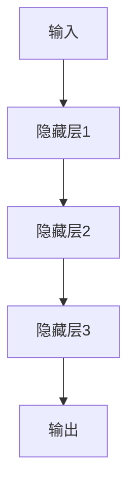

                 

### 《循环神经网络》

> 关键词：循环神经网络、RNN、自然语言处理、序列建模、深度学习

> 摘要：本文将深入探讨循环神经网络（RNN）的概念、历史发展、数学基础、核心算法以及其在实际应用中的挑战和优化方法。通过逐步分析和推理，本文旨在为读者提供对RNN的全面理解和应用指南。

---

### 引言

循环神经网络（RNN）是深度学习领域中一种非常重要的模型，它在处理序列数据时表现出色。RNN的概念最早可以追溯到1980年代，当时Hodges和Anderson提出了简单循环网络（Simple Recurrent Network，SRN）的概念。随着时间的发展，RNN的理论基础和技术应用不断得到完善和扩展，成为了自然语言处理、语音识别和时序数据分析等领域的重要工具。

RNN的核心特点是能够通过循环结构保持长期依赖信息，这使得它在处理序列数据时具有独特的优势。然而，传统的RNN也面临着一些挑战，如梯度消失和梯度爆炸问题，这些问题限制了其性能和应用范围。为了解决这些问题，研究者们提出了多种改进的RNN模型，如长短期记忆网络（LSTM）和门控循环单元（GRU）。

本文将首先介绍RNN的基本概念和历史发展，然后深入探讨RNN的数学基础和核心算法，包括隐态变量、LSTM和GRU。接下来，我们将讨论RNN在序列建模中的应用，如序列标注、语音识别和机器翻译。最后，本文将介绍RNN的优化与训练方法，以及其在实际项目中的应用和未来发展趋势。

通过本文的逐步分析和推理，读者将能够全面理解RNN的基本原理和应用方法，为在相关领域进行研究和应用打下坚实的基础。

### 第一部分: 循环神经网络基础

#### 第1章: 循环神经网络概述

## 1.1 循环神经网络的概念与历史发展

### 1.1.1 循环神经网络的基本概念

循环神经网络（Recurrent Neural Network，RNN）是一种专门设计用于处理序列数据的神经网络。与传统的前馈神经网络不同，RNN具有循环结构，能够通过循环连接将前一个时间步的信息传递到当前时间步，从而实现长期依赖信息的保持。

RNN的基本结构包括输入层、隐藏层和输出层。输入层接收输入序列，隐藏层通过循环连接保存和更新信息，输出层生成预测或决策。RNN的工作原理可以概括为以下几个步骤：

1. **输入阶段**：输入序列的第一个元素被输入到RNN中，通过输入层和隐藏层之间的权重矩阵进行映射，得到隐藏状态。
2. **更新阶段**：隐藏状态通过循环连接与前一个时间步的隐藏状态相连接，并通过隐藏层内部的权重矩阵进行更新。
3. **输出阶段**：更新后的隐藏状态通过输出层生成当前时间步的预测或决策。

这种循环结构使得RNN能够记住之前的信息，从而在处理序列数据时表现出色。

### 1.1.2 循环神经网络的历史发展

循环神经网络的概念最早可以追溯到1980年代。当时，Hodges和Anderson提出了简单循环网络（Simple Recurrent Network，SRN）的概念，这是一种基于固定权重的简单循环神经网络。然而，由于SRN在训练过程中存在梯度消失和梯度爆炸等问题，其实际应用受到限制。

随着深度学习技术的发展，RNN得到了进一步的改进。1990年代，Jaakko Peltonen和Anita Schölkopf提出了隐马尔可夫模型（Hidden Markov Model，HMM）的神经网络实现，这是RNN的一个重要里程碑。HMM-RNN通过引入隐状态变量，使得模型在处理序列数据时能够更好地捕捉长期依赖信息。

进入2000年代，长短期记忆网络（Long Short-Term Memory，LSTM）和门控循环单元（Gated Recurrent Unit，GRU）等改进的RNN模型相继被提出。LSTM和GRU通过引入门控机制，有效地解决了RNN在训练过程中出现的梯度消失和梯度爆炸问题，使得RNN在处理长期依赖数据时表现出更高的性能。

近年来，RNN在自然语言处理、语音识别和时序数据分析等领域取得了显著的应用成果。同时，随着深度学习技术的不断进步，RNN也在不断得到改进和扩展，如深度循环神经网络（Deep Recurrent Neural Network，DRNN）和窥孔循环神经网络（Peephole Recurrent Neural Network，PRNN）等。

#### 1.2 RNN的优势与局限性

### 1.2.1 RNN的优势

循环神经网络在处理序列数据时具有以下优势：

1. **长期依赖性**：RNN能够通过循环结构保持长期依赖信息，这使得它在处理如自然语言处理、语音识别和时序数据分析等需要捕捉长期依赖关系的任务时表现出色。
2. **灵活性强**：RNN的结构相对简单，可以通过调整网络参数和优化算法来适应不同的任务和数据集。
3. **并行处理**：RNN可以同时处理多个序列数据，这在处理大规模数据集时具有显著的优势。

### 1.2.2 RNN的局限性

尽管RNN在处理序列数据时具有许多优势，但它也存在一些局限性：

1. **梯度消失和梯度爆炸**：传统的RNN在训练过程中容易遇到梯度消失和梯度爆炸问题，这限制了其性能和应用范围。为了解决这些问题，研究者们提出了多种改进的RNN模型，如LSTM和GRU。
2. **计算复杂度高**：RNN在处理长序列数据时需要大量计算资源，这使得其在处理实时数据时存在一定的延迟。
3. **对数据依赖性强**：RNN的性能对数据质量和数据预处理方法有较高要求，这增加了模型开发和调优的复杂性。

#### 1.3 RNN的基本结构

### 1.3.1 RNN的基本结构

循环神经网络的基本结构由输入层、隐藏层和输出层组成。以下是RNN的基本结构示意图：



- **输入层**：输入层接收输入序列，每个时间步的输入可以是一个向量，表示当前时刻的特征信息。
- **隐藏层**：隐藏层通过循环连接保存和更新信息，每个时间步的隐藏状态表示当前时刻的信息和之前时刻的信息。
- **输出层**：输出层生成当前时间步的预测或决策，可以是标签、概率分布或特征向量。

### 1.3.2 RNN的工作原理

RNN的工作原理可以概括为以下几个步骤：

1. **初始化**：首先，初始化输入层、隐藏层和输出层的权重矩阵。
2. **输入阶段**：输入序列的第一个元素被输入到RNN中，通过输入层和隐藏层之间的权重矩阵进行映射，得到隐藏状态。
3. **更新阶段**：隐藏状态通过循环连接与前一个时间步的隐藏状态相连接，并通过隐藏层内部的权重矩阵进行更新。
4. **输出阶段**：更新后的隐藏状态通过输出层生成当前时间步的预测或决策。

以下是一个简化的RNN工作原理的伪代码表示：

```python
# 初始化权重矩阵
W = [[0.0] * n_h for _ in range(n_x + 1)]

# 输入序列
X = [x_1, x_2, ..., x_T]

# 隐藏状态序列
H = [h_0, h_1, ..., h_T]

# 输出序列
Y = [y_1, y_2, ..., y_T]

# 循环迭代
for t in range(T):
    # 输入阶段
    h_t = sigmoid(W[0] + W[t+1].dot(X[t]))

    # 更新阶段
    for i in range(1, T):
        h_t = sigmoid(W[i] + W[i-1].dot(H[i-1]))

    # 输出阶段
    y_t = sigmoid(W[T] + W[T-1].dot(h_t))

    # 更新隐藏状态
    H[t] = h_t

# 输出结果
return H, Y
```

其中，`sigmoid`函数用于激活函数，`W`表示权重矩阵，`X`表示输入序列，`H`表示隐藏状态序列，`Y`表示输出序列，`T`表示序列长度。

#### 1.4 RNN在自然语言处理中的应用

### 1.4.1 文本分类

文本分类是自然语言处理中的一个重要任务，其目的是将文本数据自动分类到预定义的类别中。RNN在文本分类任务中具有以下应用：

1. **序列建模**：RNN可以处理文本序列数据，将每个单词或字符表示为向量，并通过隐藏层更新信息，从而捕捉文本中的长期依赖关系。
2. **特征提取**：RNN可以将序列数据映射为高维特征向量，这些特征向量可以用于后续的分类任务。
3. **分类模型**：RNN输出层生成的预测结果可以用于文本分类，常见的分类算法包括softmax、支持向量机和朴素贝叶斯等。

以下是一个简化的RNN文本分类的伪代码表示：

```python
# 初始化RNN模型
model = RNN()

# 加载训练数据
train_data = load_data("train_data")

# 训练模型
model.fit(train_data)

# 测试数据
test_data = load_data("test_data")

# 预测分类结果
predictions = model.predict(test_data)

# 评估分类结果
accuracy = evaluate(predictions, test_labels)
```

### 1.4.2 情感分析

情感分析是自然语言处理中的另一个重要任务，其目的是识别文本中的情感倾向，如正面、负面或中性。RNN在情感分析任务中的应用主要包括：

1. **情感建模**：RNN可以将文本序列映射为情感特征向量，通过隐藏层更新信息，从而捕捉文本中的情感变化。
2. **分类模型**：RNN输出层生成的预测结果可以用于情感分类，常见的分类算法包括softmax、支持向量机和朴素贝叶斯等。

以下是一个简化的RNN情感分析的伪代码表示：

```python
# 初始化RNN模型
model = RNN()

# 加载训练数据
train_data = load_data("train_data")

# 训练模型
model.fit(train_data)

# 测试数据
test_data = load_data("test_data")

# 预测情感结果
predictions = model.predict(test_data)

# 评估情感结果
accuracy = evaluate(predictions, test_labels)
```

#### 1.5 小结

本章介绍了循环神经网络（RNN）的基本概念、历史发展、优势和局限性，以及RNN在自然语言处理中的应用，包括文本分类和情感分析。通过本章的学习，读者可以初步了解RNN的基本原理和应用场景，为后续章节的深入学习打下基础。在下一章中，我们将进一步探讨RNN的数学基础，包括矩阵和向量基础、概率论基础、梯度下降算法和反向传播算法。

### 第2章: 循环神经网络的数学基础

#### 2.1 矩阵和向量基础

在讨论循环神经网络（RNN）的数学基础时，矩阵和向量是不可或缺的工具。矩阵和向量在RNN的计算中扮演着核心角色，帮助我们表示和操作数据。

### 2.1.1 矩阵运算

矩阵运算包括矩阵的加法、减法、乘法和除法等。以下是这些运算的基本定义：

1. **矩阵加法和减法**：两个矩阵只有在维度相同的情况下才能进行加法或减法运算。运算结果是一个新的矩阵，其对应元素是原矩阵对应元素的和或差。

   \[
   C = A + B
   \]
   \[
   C = A - B
   \]

2. **矩阵乘法**：两个矩阵的乘法结果是一个新的矩阵，其每个元素是原矩阵对应元素的乘积和求和。

   \[
   C = A \cdot B
   \]
   其中，\(C_{ij} = \sum_{k} A_{ik}B_{kj}\)

3. **矩阵除法**：在矩阵运算中，除法通常指的是矩阵的逆运算。如果矩阵\(A\)可逆，则其逆矩阵\(A^{-1}\)满足：

   \[
   A \cdot A^{-1} = I
   \]
   其中，\(I\)是单位矩阵。

### 2.1.2 向量运算

向量运算包括向量的加法、减法、点积和叉积等。以下是这些运算的基本定义：

1. **向量加法和减法**：两个向量只有在维度相同的情况下才能进行加法或减法运算。运算结果是一个新的向量，其对应元素是原向量对应元素的和或差。

   \[
   \vec{C} = \vec{A} + \vec{B}
   \]
   \[
   \vec{C} = \vec{A} - \vec{B}
   \]

2. **向量点积**：两个向量的点积（也称为内积）是一个标量，它是两个向量对应元素的乘积和求和。

   \[
   \vec{A} \cdot \vec{B} = \sum_{i} A_i B_i
   \]

3. **向量叉积**：两个三维向量的叉积（也称为外积）是一个新的向量，其方向垂直于原向量所在的平面，其模长是原向量对应元素的叉积。

   \[
   \vec{C} = \vec{A} \times \vec{B}
   \]

#### 2.2 概率论基础

在RNN的计算中，概率论是一个重要的工具，它帮助我们理解数据的不确定性，并指导模型的训练过程。

### 2.2.1 概率的基本概念

1. **概率分布**：概率分布描述了一个随机变量的所有可能取值及其概率。常见的概率分布包括离散分布和连续分布。

2. **条件概率**：条件概率是指在已知某个事件发生的情况下，另一个事件发生的概率。其公式为：

   \[
   P(A|B) = \frac{P(A \cap B)}{P(B)}
   \]

3. **贝叶斯定理**：贝叶斯定理是一个用于计算条件概率的重要公式，它将条件概率和边缘概率联系起来。其公式为：

   \[
   P(A|B) = \frac{P(B|A)P(A)}{P(B)}
   \]

### 2.2.2 概率论在RNN中的应用

概率论在RNN的训练过程中有着广泛的应用：

1. **损失函数**：在RNN的训练过程中，损失函数用于衡量预测值与真实值之间的差距。常见的损失函数包括均方误差（MSE）和交叉熵（Cross Entropy）。

2. **梯度下降**：梯度下降是一种用于最小化损失函数的优化算法，它通过计算损失函数关于模型参数的梯度来更新参数。

3. **概率模型**：RNN中的输出通常可以看作是一个概率模型，如softmax概率模型，它将RNN的隐藏状态映射为一个概率分布。

#### 2.3 梯度下降算法

梯度下降算法是一种用于最小化损失函数的优化算法。它通过计算损失函数关于模型参数的梯度，并沿着梯度的反方向更新参数，以逐步减少损失函数的值。

### 2.3.1 梯度下降的基本原理

梯度下降的基本原理可以概括为以下几个步骤：

1. **初始化参数**：首先，随机初始化模型参数，如权重和偏置。
2. **计算损失函数**：对于给定的输入和输出，计算损失函数的值。
3. **计算梯度**：计算损失函数关于模型参数的梯度。
4. **更新参数**：根据梯度反方向更新模型参数，以减少损失函数的值。

梯度下降的基本公式为：

\[
\theta = \theta - \alpha \cdot \nabla_{\theta} J(\theta)
\]

其中，\(\theta\)表示模型参数，\(\alpha\)表示学习率，\(\nabla_{\theta} J(\theta)\)表示损失函数关于模型参数的梯度，\(J(\theta)\)表示损失函数。

### 2.3.2 梯度下降的应用

梯度下降算法在RNN的训练过程中有着广泛的应用。以下是梯度下降在RNN训练中的应用步骤：

1. **初始化参数**：随机初始化RNN的权重和偏置。
2. **前向传播**：对于给定的输入序列，通过RNN的前向传播计算隐藏状态和输出。
3. **计算损失函数**：计算输出和真实值之间的损失。
4. **计算梯度**：计算损失函数关于RNN参数的梯度。
5. **更新参数**：根据梯度反方向更新RNN的权重和偏置。

#### 2.4 反向传播算法

反向传播算法是一种用于计算神经网络梯度的重要算法。它通过反向传播误差信号，从输出层到输入层逐层计算损失函数关于每个参数的梯度。

### 2.4.1 反向传播的基本原理

反向传播的基本原理可以概括为以下几个步骤：

1. **前向传播**：计算网络的前向传播，得到输出和隐藏状态。
2. **计算误差**：计算输出和真实值之间的误差。
3. **计算梯度**：从输出层开始，反向计算误差关于每个参数的梯度。
4. **更新参数**：根据梯度反方向更新参数。

反向传播的公式为：

\[
\nabla_{\theta} J(\theta) = -\nabla_{\theta} \cdot \frac{\partial L}{\partial \theta}
\]

其中，\(\nabla_{\theta} J(\theta)\)表示损失函数关于模型参数的梯度，\(\frac{\partial L}{\partial \theta}\)表示损失函数关于模型参数的偏导数，\(L\)表示损失函数。

### 2.4.2 反向传播的应用

反向传播算法在RNN的训练过程中有着广泛的应用。以下是反向传播在RNN训练中的应用步骤：

1. **前向传播**：对于给定的输入序列，通过RNN的前向传播计算隐藏状态和输出。
2. **计算误差**：计算输出和真实值之间的误差。
3. **计算梯度**：从输出层开始，反向计算误差关于每个参数的梯度。
4. **更新参数**：根据梯度反方向更新RNN的权重和偏置。

通过本章对循环神经网络数学基础的探讨，我们了解了矩阵和向量运算的基本概念，概率论的基础知识，以及梯度下降和反向传播算法的基本原理和应用。这些数学基础为深入理解和应用RNN奠定了坚实的理论基础。在下一章中，我们将进一步探讨RNN的核心算法，包括隐态变量、门控循环单元（GRU）和长短期记忆网络（LSTM），并比较GRU和LSTM的异同点。

### 第3章: 循环神经网络的核心算法

#### 第3章：循环神经网络的核心算法

在了解了循环神经网络（RNN）的基础知识后，我们将进一步探讨其核心算法。本章将详细讲解RNN中的隐态变量、门控循环单元（GRU）和长短期记忆网络（LSTM），以及这两个改进模型的比较和选择因素。

## 3.1 隐态变量

隐态变量是RNN中的一个关键概念，它用于表示隐藏状态在各个时间步的变化。隐态变量 \( h_t \) 在RNN中起着至关重要的作用，它不仅保存了当前时刻的信息，还能够通过循环连接保留和传递之前时刻的信息。

### 3.1.1 隐态变量的概念

隐态变量是RNN中的隐藏状态，它表示在当前时间步的输入和之前隐藏状态经过计算后得到的信息。隐态变量可以看作是一个“记忆”单元，它能够通过循环连接将信息传递到下一个时间步。

### 3.1.2 隐态变量的计算方法

隐态变量 \( h_t \) 的计算方法依赖于RNN的具体实现。以下是一个简化的隐态变量计算过程：

1. **输入阶段**：输入向量 \( x_t \) 通过输入层和隐藏层之间的权重矩阵 \( W_{ix} \) 和偏置向量 \( b_{i} \) 进行映射。

   \[
   h_t^{'} = \text{sigmoid}(W_{ix} x_t + b_{i})
   \]

2. **更新阶段**：前一个时间步的隐藏状态 \( h_{t-1} \) 和当前时间步的输入 \( x_t \) 通过隐藏层内部的权重矩阵 \( W_{hh} \) 和偏置向量 \( b_{h} \) 进行更新。

   \[
   h_t^{'} = \text{sigmoid}(W_{hh} h_{t-1} + W_{hx} x_t + b_{h})
   \]

3. **输出阶段**：更新后的隐藏状态 \( h_t^{'} \) 可以用于生成当前时间步的输出 \( y_t \)。

   \[
   y_t = \text{sigmoid}(W_{oy} h_t^{'} + b_{o})
   \]

其中，\( \text{sigmoid} \) 函数是一个常见的激活函数，用于将线性组合的输出映射到 \( (0,1) \) 范围内的值。

#### 3.2 门控循环单元（GRU）

门控循环单元（Gated Recurrent Unit，GRU）是RNN的一种改进模型，它通过引入门控机制来解决传统RNN在训练过程中出现的梯度消失和梯度爆炸问题。GRU在保持长期依赖信息方面比传统的RNN表现更好。

### 3.2.1 GRU的基本结构

GRU的基本结构包括三个门控单元：重置门（Reset Gate）、更新门（Update Gate）和输出门（Output Gate）。每个门控单元都由一个sigmoid函数和一个线性变换组成。

1. **重置门**：重置门用于决定当前时刻的隐藏状态 \( h_{t-1} \) 中的多少信息需要被保留。其计算公式为：

   \[
   r_t = \text{sigmoid}(W_{rh} h_{t-1} + W_{rx} x_t + b_r)
   \]

   其中，\( r_t \) 表示重置门的输出，\( W_{rh} \)、\( W_{rx} \) 和 \( b_r \) 分别为重置门的权重矩阵、输入权重矩阵和偏置向量。

2. **更新门**：更新门用于决定当前时刻的输入 \( x_t \) 中多少信息需要被更新到隐藏状态 \( h_{t-1} \) 中。其计算公式为：

   \[
   z_t = \text{sigmoid}(W_{zh} h_{t-1} + W_{zx} x_t + b_z)
   \]

   其中，\( z_t \) 表示更新门的输出，\( W_{zh} \)、\( W_{zx} \) 和 \( b_z \) 分别为更新门的权重矩阵、输入权重矩阵和偏置向量。

3. **输出门**：输出门用于决定当前时刻的隐藏状态 \( h_{t} \) 应该如何生成。其计算公式为：

   \[
   o_t = \text{sigmoid}(W_{oh} h_{t-1} + W_{ox} x_t + b_o)
   \]

   其中，\( o_t \) 表示输出门的输出，\( W_{oh} \)、\( W_{ox} \) 和 \( b_o \) 分别为输出门的权重矩阵、输入权重矩阵和偏置向量。

### 3.2.2 GRU的工作原理

GRU的工作原理可以概括为以下几个步骤：

1. **输入阶段**：输入向量 \( x_t \) 通过输入层和隐藏层之间的权重矩阵 \( W_{ix} \) 和偏置向量 \( b_{i} \) 进行映射。

   \[
   h_t^{'} = \text{tanh}(W_{ix} x_t + W_{ih} h_{t-1} + b_{i})
   \]

2. **门控阶段**：根据重置门 \( r_t \) 和更新门 \( z_t \) 的输出，更新隐藏状态 \( h_{t-1} \)。

   \[
   \hat{h}_t = (1 - z_t) \odot h_{t-1} + z_t \odot h_t^{'}
   \]

   其中，\( \odot \) 表示按元素相乘操作，\(\hat{h}_t\) 表示更新的隐藏状态。

3. **输出阶段**：根据输出门 \( o_t \) 的输出，生成当前时刻的隐藏状态 \( h_t \)。

   \[
   h_t = o_t \odot \hat{h}_t
   \]

#### 3.3 长短期记忆网络（LSTM）

长短期记忆网络（Long Short-Term Memory，LSTM）是RNN的另一种改进模型，它通过引入记忆单元和门控机制来解决传统RNN在处理长期依赖信息时的困难。LSTM在保持长期依赖信息方面比传统的RNN和GRU表现更好。

### 3.3.1 LSTM的基本结构

LSTM的基本结构包括三个门控单元：输入门（Input Gate）、遗忘门（Forget Gate）和输出门（Output Gate），以及一个记忆单元。每个门控单元都由一个sigmoid函数和一个线性变换组成。

1. **输入门**：输入门用于决定当前时刻的输入 \( x_t \) 中哪些信息需要更新到记忆单元中。其计算公式为：

   \[
   i_t = \text{sigmoid}(W_{ix} x_t + W_{ih} h_{t-1} + b_i)
   \]

   其中，\( i_t \) 表示输入门的输出，\( W_{ix} \)、\( W_{ih} \) 和 \( b_i \) 分别为输入门的权重矩阵、输入权重矩阵和偏置向量。

2. **遗忘门**：遗忘门用于决定当前时刻的输入 \( x_t \) 中哪些信息需要从记忆单元中丢弃。其计算公式为：

   \[
   f_t = \text{sigmoid}(W_{fx} x_t + W_{fh} h_{t-1} + b_f)
   \]

   其中，\( f_t \) 表示遗忘门的输出，\( W_{fx} \)、\( W_{fh} \) 和 \( b_f \) 分别为遗忘门的权重矩阵、输入权重矩阵和偏置向量。

3. **输出门**：输出门用于决定当前时刻的输入 \( x_t \) 中哪些信息需要输出到隐藏状态 \( h_t \) 中。其计算公式为：

   \[
   o_t = \text{sigmoid}(W_{ox} x_t + W_{oh} h_{t-1} + b_o)
   \]

   其中，\( o_t \) 表示输出门的输出，\( W_{ox} \)、\( W_{oh} \) 和 \( b_o \) 分别为输出门的权重矩阵、输入权重矩阵和偏置向量。

4. **记忆单元**：记忆单元是LSTM的核心部分，它用于保存和更新长期依赖信息。其计算公式为：

   \[
   C_t = f_t \odot C_{t-1} + i_t \odot \text{tanh}(W_{ic} h_{t-1} + W_{cx} x_t + b_c)
   \]

   其中，\( C_{t-1} \) 和 \( C_t \) 分别为前一个时间步和当前时间步的记忆单元，\( \odot \) 表示按元素相乘操作，\( W_{ic} \)、\( W_{cx} \) 和 \( b_c \) 分别为记忆单元的权重矩阵、输入权重矩阵和偏置向量。

### 3.3.2 LSTM的工作原理

LSTM的工作原理可以概括为以下几个步骤：

1. **输入阶段**：输入向量 \( x_t \) 通过输入层和隐藏层之间的权重矩阵 \( W_{ix} \) 和偏置向量 \( b_{i} \) 进行映射。

   \[
   h_t^{'} = \text{tanh}(W_{ix} x_t + W_{ih} h_{t-1} + b_{i})
   \]

2. **门控阶段**：根据输入门 \( i_t \) 和遗忘门 \( f_t \) 的输出，更新记忆单元 \( C_t \)。

   \[
   C_t = f_t \odot C_{t-1} + i_t \odot \text{tanh}(W_{ic} h_{t-1} + W_{cx} x_t + b_c)
   \]

3. **输出阶段**：根据输出门 \( o_t \) 的输出，生成当前时刻的隐藏状态 \( h_t \)。

   \[
   h_t = o_t \odot \text{tanh}(C_t)
   \]

#### 3.4 门控循环单元（GRU）和长短期记忆网络（LSTM）的比较

GRU和LSTM都是RNN的改进模型，它们在处理长期依赖信息方面都有显著优势。以下是GRU和LSTM的异同点：

1. **结构复杂度**：GRU的结构比LSTM简单，因为它只有两个门控单元（更新门和输出门），而LSTM有三个门控单元（输入门、遗忘门和输出门）。这使得GRU在计算效率和参数数量上比LSTM更优。

2. **计算效率**：由于GRU的结构更简单，它在处理长序列数据时比LSTM更快，因为LSTM需要进行更多的矩阵乘法和求和操作。

3. **参数数量**：GRU的参数数量比LSTM少，因为它只有两个门控单元，而LSTM有三个。这使得GRU在模型训练过程中所需的计算资源和内存更少。

4. **长期依赖**：尽管GRU在处理短期依赖信息方面表现出色，但LSTM在处理长期依赖信息方面表现更佳。这是因为LSTM通过引入遗忘门和输入门，能够更好地控制信息在时间步之间的传递。

### 3.5 选择GRU还是LSTM的考虑因素

在选择GRU还是LSTM时，需要考虑以下几个因素：

1. **数据类型**：如果数据序列较短，且不需要处理复杂的长期依赖关系，GRU可能是更好的选择。因为GRU的计算效率更高，参数数量更少。相反，如果数据序列较长，且存在复杂的长期依赖关系，LSTM可能是更合适的选择。

2. **计算资源**：如果计算资源和内存有限，GRU可能是更好的选择，因为它的计算效率和参数数量比LSTM更优。

3. **模型复杂度**：如果模型复杂度是一个重要考虑因素，GRU可能是更好的选择，因为它比LSTM简单。

4. **性能要求**：如果性能要求较高，LSTM可能是更好的选择，因为它在处理长期依赖信息方面表现更佳。

通过本章对循环神经网络核心算法的探讨，我们了解了隐态变量、GRU和LSTM的基本原理和计算方法，并比较了GRU和LSTM的异同点。这些核心算法为理解和应用RNN提供了深入的理论基础。在下一章中，我们将进一步探讨RNN在序列建模中的应用，包括序列标注、语音识别和机器翻译。

### 第4章: 循环神经网络在序列建模中的应用

#### 第4章：循环神经网络在序列建模中的应用

循环神经网络（RNN）在处理序列数据方面具有独特的优势，因此在序列建模任务中得到了广泛应用。本章将详细探讨RNN在序列建模中的应用，包括序列标注、语音识别和机器翻译，并介绍这些任务的基本概念和方法。

## 4.1 序列建模的基本概念

序列建模（Sequence Modeling）是指对序列数据中的元素进行建模，以便预测或分析序列中的规律和特征。在自然语言处理和语音识别等领域，序列建模是非常关键的。序列建模的基本任务包括：

1. **序列生成**：根据输入序列生成新的输出序列。
2. **序列分类**：将输入序列分类到预定义的类别中。
3. **序列标注**：对输入序列中的每个元素进行标注，如词性标注、命名实体识别等。
4. **序列分析**：分析序列数据中的统计特征、模式或关系。

序列建模的关键挑战在于如何处理和建模序列中的长期依赖关系。传统的循环神经网络（RNN）通过循环结构能够捕捉到一定程度的长期依赖关系，但存在梯度消失和梯度爆炸等问题。为了解决这些问题，研究者们提出了长短期记忆网络（LSTM）和门控循环单元（GRU）等改进模型，这些模型在处理长期依赖关系方面表现更好。

### 4.2 序列标注任务

序列标注（Sequence Labeling）是一种常见的序列建模任务，其目标是对输入序列中的每个元素进行分类或标注。序列标注任务可以应用于多种领域，如自然语言处理、语音识别和生物信息学等。

#### 4.2.1 序列标注的基本概念

序列标注任务可以分为两种类型：

1. **词级标注**：对输入序列中的每个单词或字符进行标注，如词性标注、命名实体识别等。
2. **字符级标注**：对输入序列中的每个字符进行标注，如情感极性标注、错别字识别等。

序列标注任务通常使用标注集合 \( Y \) 来表示每个元素的可能标注。例如，在词性标注任务中，标注集合可以是所有可能的词性标签集合。序列标注模型的目标是学习一个映射函数 \( f \)，将输入序列 \( X \) 映射到标注序列 \( Y \)：

\[
Y = f(X)
\]

#### 4.2.2 序列标注的方法

序列标注任务通常采用以下方法：

1. **前向传播**：前向传播是从输入序列的第一个元素开始，逐步计算隐藏状态和标注概率。
2. **后向传播**：后向传播是从输入序列的最后一个元素开始，逐步计算隐藏状态和标注概率。
3. **双向RNN**：双向RNN结合了前向传播和后向传播，能够更好地捕捉输入序列中的长期依赖关系。

以下是一个简化的序列标注任务的前向传播算法：

```python
# 初始化参数
W = [[0.0] * n_y for _ in range(n_h + 1)]
b = [[0.0] * n_y for _ in range(n_h + 1)]

# 输入序列
X = [x_1, x_2, ..., x_T]

# 隐藏状态序列
H = [h_0, h_1, ..., h_T]

# 标注序列
Y = [[y_1, y_2, ..., y_T]]

# 循环迭代
for t in range(T):
    # 输入阶段
    h_t = sigmoid(W[0] + W[t+1].dot(H[t-1]))

    # 更新阶段
    for i in range(1, T):
        h_t = sigmoid(W[i] + W[i-1].dot(H[i-1]))

    # 输出阶段
    y_t = sigmoid(W[T] + W[T-1].dot(h_t))

    # 更新隐藏状态
    H[t] = h_t

# 预测标注结果
predictions = [softmax(h_t) for h_t in H]

# 评估标注结果
accuracy = evaluate(predictions, Y)
```

其中，\( W \) 表示权重矩阵，\( b \) 表示偏置向量，\( \sigma \) 表示激活函数，\( T \) 表示序列长度，\( n_h \) 表示隐藏层维度，\( n_y \) 表示标注集合维度。

#### 4.3 语音识别

语音识别（Speech Recognition）是指将语音信号转换为文本或命令的过程。语音识别是人工智能领域的一个重要分支，它在语音助手、自动字幕、语音控制等领域有广泛应用。

##### 4.3.1 语音识别的基本概念

语音识别可以分为两种类型：

1. **孤立词识别**：将单独的单词识别为文本，如语音助手中的单词识别。
2. **连续语音识别**：将连续的语音信号识别为文本，如自动字幕。

语音识别的基本流程包括：

1. **特征提取**：将语音信号转换为适合RNN处理的特征向量，如MFCC（梅尔频率倒谱系数）。
2. **序列建模**：使用RNN对特征向量进行建模，预测每个时间步的文本序列。

##### 4.3.2 语音识别的方法

语音识别的方法可以分为以下几类：

1. **基于HMM的语音识别**：使用隐马尔可夫模型（HMM）对语音信号进行建模，并结合GMM（高斯混合模型）进行特征提取。
2. **基于RNN的语音识别**：使用RNN对语音信号进行建模，如LSTM和GRU。
3. **基于CTC的语音识别**：使用卷积神经网络（CNN）和循环神经网络（RNN）的组合，结合CTC（连接主义时序分类器）进行建模。

以下是一个简化的基于LSTM的语音识别模型：

```python
# 初始化LSTM模型
model = LSTM()

# 加载训练数据
train_data = load_data("train_data")

# 训练模型
model.fit(train_data)

# 测试数据
test_data = load_data("test_data")

# 预测文本序列
predictions = model.predict(test_data)

# 评估语音识别结果
accuracy = evaluate(predictions, test_labels)
```

其中，`load_data` 函数用于加载和处理语音信号特征，`fit` 函数用于训练模型，`predict` 函数用于预测文本序列，`evaluate` 函数用于评估模型性能。

#### 4.4 机器翻译

机器翻译（Machine Translation）是指将一种语言的文本自动翻译成另一种语言的过程。机器翻译在跨语言通信、信息检索和全球化应用中具有重要意义。

##### 4.4.1 机器翻译的基本概念

机器翻译可以分为以下类型：

1. **基于规则翻译**：使用预定义的语法规则和词库进行翻译，如基于语法分析的翻译系统。
2. **基于统计翻译**：使用统计方法进行翻译，如基于短语翻译的统计机器翻译（SMT）。
3. **基于神经网络的翻译**：使用神经网络模型进行翻译，如端到端的神经网络翻译（NMT）。

机器翻译的基本流程包括：

1. **编码阶段**：将源语言文本编码为向量序列，可以使用RNN或BERT等模型。
2. **解码阶段**：将编码后的向量序列解码为目标语言文本，可以使用RNN、GRU或LSTM等模型。
3. **优化阶段**：通过优化目标函数，如损失函数，改进翻译质量。

##### 4.4.2 机器翻译的方法

机器翻译的方法可以分为以下几类：

1. **基于短语的SMT**：使用基于短语的翻译模型，将源语言短语映射到目标语言短语。
2. **基于句法的SMT**：使用基于句法的翻译模型，将源语言句子结构映射到目标语言句子结构。
3. **基于神经网络的NMT**：使用端到端的神经网络翻译模型，直接将源语言文本映射到目标语言文本。

以下是一个简化的基于LSTM的机器翻译模型：

```python
# 初始化机器翻译模型
model = Seq2Seq(LSTM())

# 加载训练数据
train_data = load_data("train_data")

# 训练模型
model.fit(train_data)

# 测试数据
test_data = load_data("test_data")

# 预测翻译结果
predictions = model.predict(test_data)

# 评估翻译结果
accuracy = evaluate(predictions, test_labels)
```

其中，`load_data` 函数用于加载和处理源语言和目标语言文本，`fit` 函数用于训练模型，`predict` 函数用于预测翻译结果，`evaluate` 函数用于评估模型性能。

通过本章对循环神经网络在序列建模中的应用的探讨，我们了解了序列标注、语音识别和机器翻译的基本概念和方法。循环神经网络在这些任务中的应用展示了其在处理序列数据方面的强大能力。在下一章中，我们将进一步探讨RNN的优化与训练方法，包括优化算法的选择、训练过程中的挑战和正则化方法。

### 第5章: 循环神经网络的优化与训练

#### 第5章：循环神经网络的优化与训练

循环神经网络（RNN）在处理序列数据时表现出色，但在训练过程中面临一些挑战。本章将深入探讨RNN的优化与训练方法，包括优化算法的选择、训练过程中的挑战和正则化方法。

## 5.1 优化算法的选择

优化算法是训练神经网络的重要工具，它用于最小化损失函数并更新模型参数。以下是几种常见的优化算法：

### 5.1.1 梯度下降算法

梯度下降算法是最基本的优化算法，通过计算损失函数关于模型参数的梯度来更新参数。其基本公式为：

\[
\theta = \theta - \alpha \cdot \nabla_{\theta} J(\theta)
\]

其中，\( \theta \) 表示模型参数，\( \alpha \) 表示学习率，\( \nabla_{\theta} J(\theta) \) 表示损失函数关于模型参数的梯度，\( J(\theta) \) 表示损失函数。

### 5.1.2 随机梯度下降（SGD）

随机梯度下降（Stochastic Gradient Descent，SGD）是梯度下降的一种改进算法，它使用每个训练样本的梯度来更新参数，从而减少了计算量。其基本公式为：

\[
\theta = \theta - \alpha \cdot \nabla_{\theta} J(\theta|x_i, y_i)
\]

其中，\( x_i, y_i \) 表示当前训练样本及其标签。

### 5.1.3 批量梯度下降（BGD）

批量梯度下降（Batch Gradient Descent，BGD）是梯度下降的另一种改进算法，它使用所有训练样本的梯度来更新参数，从而提高了梯度估计的准确性。其基本公式为：

\[
\theta = \theta - \alpha \cdot \nabla_{\theta} J(\theta|x, y)
\]

其中，\( x, y \) 表示所有训练样本及其标签。

### 5.1.4 Adam优化器

Adam优化器是梯度下降算法的一种改进，它结合了SGD和BGD的优点，并引入了一阶矩估计（均值）和二阶矩估计（方差）来改进梯度估计。其基本公式为：

\[
m_t = \beta_1 m_{t-1} + (1 - \beta_1) \nabla_{\theta} J(\theta|x_i, y_i)
\]
\[
v_t = \beta_2 v_{t-1} + (1 - \beta_2) (\nabla_{\theta} J(\theta|x_i, y_i))^2
\]
\[
\theta = \theta - \alpha \cdot \frac{m_t}{\sqrt{v_t} + \epsilon}
\]

其中，\( m_t \) 和 \( v_t \) 分别表示一阶矩估计和二阶矩估计，\( \beta_1 \) 和 \( \beta_2 \) 分别为动量因子，\( \alpha \) 表示学习率，\( \epsilon \) 为一个较小的常数。

### 5.1.5 选择优化算法的考虑因素

在选择优化算法时，需要考虑以下几个因素：

1. **计算资源**：如果计算资源有限，SGD可能是更好的选择，因为它只需要计算单个样本的梯度。
2. **模型复杂度**：对于复杂的模型，BGD或Adam可能更适合，因为它们使用了更多的训练样本。
3. **收敛速度**：Adam优化器通常收敛速度较快，适用于大多数应用场景。
4. **梯度噪声**：SGD引入了梯度噪声，有助于避免局部最小值，但可能需要较大的学习率。

### 5.2 训练过程中的挑战

尽管RNN在处理序列数据方面具有优势，但在训练过程中仍面临一些挑战：

#### 5.2.1 梯度消失和梯度爆炸

梯度消失和梯度爆炸是RNN训练过程中常见的问题。梯度消失是指梯度值非常小，导致模型参数无法更新；梯度爆炸是指梯度值非常大，导致模型参数更新过大。这两个问题都源于RNN的循环结构，尤其是在处理长序列数据时。

**解决方案**：

1. **LSTM和GRU**：LSTM和GRU通过引入门控机制，有效地解决了梯度消失和梯度爆炸问题。
2. **梯度裁剪**：在训练过程中，通过限制梯度值的大小，避免梯度爆炸问题。
3. **学习率调度**：调整学习率，避免学习率过大导致梯度爆炸。

#### 5.2.2 过拟合和欠拟合

过拟合和欠拟合是模型训练过程中常见的两个问题。过拟合是指模型在训练数据上表现良好，但在新的数据上表现不佳；欠拟合是指模型在训练数据和新的数据上表现都不佳。

**解决方案**：

1. **正则化**：通过添加正则化项，如L1和L2正则化，防止模型过拟合。
2. **数据增强**：通过增加训练数据，提高模型的泛化能力。
3. **交叉验证**：使用交叉验证方法，避免模型在训练数据上过拟合。

#### 5.2.3 优化算法的选择

优化算法的选择对RNN的训练过程至关重要。不同的优化算法适用于不同的场景和数据集。

**建议**：

1. **对于小数据集**：使用SGD或Adam优化器，因为它们计算简单且收敛速度快。
2. **对于大数据集**：使用BGD或Adam优化器，因为它们使用了更多的训练样本，能够提高模型的泛化能力。

### 5.3 循环神经网络的正则化

正则化（Regularization）是一种用于防止模型过拟合的技术。在RNN中，常见的正则化方法包括L1正则化和L2正则化。

#### 5.3.1 L1正则化

L1正则化通过在损失函数中添加L1范数项，惩罚模型参数的稀疏性。其公式为：

\[
J(\theta) = J_0(\theta) + \lambda ||\theta||
\]

其中，\( J_0(\theta) \) 表示原始损失函数，\( \lambda \) 表示正则化参数，\( ||\theta|| \) 表示模型参数的L1范数。

#### 5.3.2 L2正则化

L2正则化通过在损失函数中添加L2范数项，惩罚模型参数的规模。其公式为：

\[
J(\theta) = J_0(\theta) + \lambda ||\theta||^2
\]

其中，\( J_0(\theta) \) 表示原始损失函数，\( \lambda \) 表示正则化参数，\( ||\theta|| \) 表示模型参数的L2范数。

#### 5.3.3 L1和L2正则化的比较

L1正则化和L2正则化各有优缺点：

1. **L1正则化**：
   - **优点**：能够产生稀疏模型，有助于特征选择；在稀疏数据上表现更好。
   - **缺点**：可能会导致参数更新不稳定。
2. **L2正则化**：
   - **优点**：能够产生更加平滑的模型；在处理大数据集时性能更稳定。
   - **缺点**：可能会忽略一些重要特征。

### 5.4 循环神经网络的早期停止

早期停止（Early Stopping）是一种用于防止模型过拟合的技术。它通过在训练过程中提前停止训练，以防止模型在训练数据上过拟合。

#### 5.4.1 早期停止的基本原理

早期停止的基本原理是利用验证集的性能来控制训练过程。当模型在验证集上的性能不再提高时，停止训练过程，从而避免模型过拟合。

#### 5.4.2 早期停止的应用

在应用早期停止时，需要注意以下几点：

1. **选择适当的验证集**：确保验证集能够代表真实的训练数据。
2. **监控验证集性能**：在训练过程中，定期计算验证集的性能，并根据性能调整训练过程。
3. **提前停止训练**：当验证集的性能不再提高时，提前停止训练过程。

通过本章对循环神经网络优化与训练方法的探讨，我们了解了优化算法的选择、训练过程中的挑战和正则化方法。这些方法有助于提高RNN的训练性能和应用效果。在下一章中，我们将进一步探讨循环神经网络的拓展，包括与卷积神经网络（CNN）的结合、在时序数据分析中的应用和图像分类中的使用。

### 第6章: 循环神经网络的拓展

#### 第6章：循环神经网络的拓展

循环神经网络（RNN）在处理序列数据方面具有显著优势，但在某些应用场景中，仅使用RNN可能无法满足需求。本章将探讨RNN的拓展，包括与卷积神经网络（CNN）的结合、在时序数据分析中的应用以及图像分类中的使用。

## 6.1 循环神经网络与卷积神经网络的结合

### 6.1.1 CNN和RNN的结合方式

卷积神经网络（CNN）在处理图像数据方面表现出色，而循环神经网络（RNN）在处理序列数据方面具有优势。将CNN和RNN结合起来，可以发挥两者的长处，提高模型在复杂任务中的性能。

结合方式主要包括以下几种：

1. **CNN用于特征提取，RNN用于序列建模**：首先使用CNN提取图像的特征，然后将这些特征输入到RNN中进行序列建模。这种方法可以有效地处理图像序列，如视频数据。
2. **RNN用于特征提取，CNN用于序列建模**：首先使用RNN提取序列的特征，然后将这些特征输入到CNN中进行序列建模。这种方法可以处理时间序列数据，如音频信号。
3. **深度循环卷积神经网络（CRNN）**：深度循环卷积神经网络（CRNN）将RNN和CNN的结构结合在一起，同时使用循环连接和卷积操作。这种方法可以同时处理图像和序列数据，适用于图像分类、文本识别等任务。

### 6.1.2 结合后的优势

将CNN和RNN结合后的优势包括：

1. **处理多种数据类型**：CNN和RNN的结合可以同时处理图像和序列数据，提高了模型在多种任务中的适用性。
2. **提高特征表达能力**：CNN和RNN各自具有强大的特征提取能力，结合后可以更好地捕捉数据中的复杂特征。
3. **提高模型性能**：通过结合CNN和RNN，可以显著提高模型在复杂任务中的性能，如视频分类、语音识别等。

### 6.1.3 CNN和RNN结合的挑战

尽管CNN和RNN的结合具有许多优势，但在实际应用中也面临一些挑战：

1. **计算复杂度**：CNN和RNN的结合增加了模型的计算复杂度，可能会导致训练和推理时间增加。
2. **参数数量**：结合后的模型参数数量可能会显著增加，导致过拟合风险。
3. **训练难度**：结合后的模型训练难度较大，需要较长时间的训练和调优。

### 6.2 循环神经网络在时序数据分析中的应用

#### 6.2.1 时序数据分析的基本概念

时序数据分析（Time Series Analysis）是指对时间序列数据进行分析和建模，以识别数据中的趋势、周期性和异常。时间序列数据通常具有以下特征：

1. **时间依赖性**：时间序列数据中的元素之间存在时间依赖关系，前一时刻的值可能对未来时刻的值产生影响。
2. **趋势性**：时间序列数据可能呈现上升趋势、下降趋势或平稳趋势。
3. **周期性**：时间序列数据可能具有周期性，即数据在一段时间后重复出现。
4. **异常性**：时间序列数据中可能存在异常值或异常模式，需要进行分析和处理。

### 6.2.2 循环神经网络在时序数据分析中的应用

循环神经网络（RNN）在时序数据分析中具有广泛的应用，以下是一些典型的应用场景：

1. **时间序列预测**：RNN可以用于时间序列的短期和长期预测，如股票价格预测、电力需求预测等。
2. **异常检测**：RNN可以用于检测时间序列数据中的异常值或异常模式，如信用卡欺诈检测、工业生产故障检测等。
3. **趋势分析**：RNN可以用于分析时间序列数据的趋势性，如季节性趋势、长期趋势等。
4. **周期性检测**：RNN可以用于检测时间序列数据的周期性，如季节性周期、商业周期等。

### 6.3 循环神经网络在图像分类中的应用

#### 6.3.1 图像分类的基本概念

图像分类（Image Classification）是指将图像数据分为预定义的类别。图像分类是计算机视觉领域的一个基本任务，广泛应用于图像识别、物体检测和图像分割等任务。

图像分类的基本步骤包括：

1. **特征提取**：从图像中提取具有区分性的特征，如颜色、纹理、形状等。
2. **分类模型**：使用分类模型对提取的特征进行分类，如支持向量机（SVM）、决策树（DT）等。
3. **模型训练与评估**：使用训练数据集训练分类模型，并在测试数据集上评估模型性能。

### 6.3.2 循环神经网络在图像分类中的应用

循环神经网络（RNN）在图像分类中的应用主要包括以下几种：

1. **序列建模**：RNN可以用于处理图像序列，从而实现视频分类。通过将连续帧的图像序列输入到RNN中，可以捕捉视频中的动态变化。
2. **图像序列建模**：RNN可以用于处理图像序列，从而实现视频分类。通过将连续帧的图像序列输入到RNN中，可以捕捉视频中的动态变化。
3. **特征融合**：RNN可以与卷积神经网络（CNN）结合，首先使用CNN提取图像的特征，然后将这些特征输入到RNN中进行融合和分类。这种方法可以提高图像分类的准确性和鲁棒性。

### 6.3.3 循环神经网络在图像分类中的应用案例

以下是一个简化的循环神经网络在图像分类中的应用案例：

```python
# 初始化CRNN模型
model = CRNN()

# 加载训练数据
train_data = load_data("train_data")

# 训练模型
model.fit(train_data)

# 测试数据
test_data = load_data("test_data")

# 预测分类结果
predictions = model.predict(test_data)

# 评估分类结果
accuracy = evaluate(predictions, test_labels)
```

其中，`load_data` 函数用于加载和处理图像数据，`fit` 函数用于训练模型，`predict` 函数用于预测分类结果，`evaluate` 函数用于评估模型性能。

通过本章对循环神经网络的拓展探讨，我们了解了CNN和RNN的结合方式、时序数据分析中的应用以及图像分类中的应用。这些拓展应用展示了循环神经网络在复杂任务中的强大能力。在下一章中，我们将通过项目实战深入探讨循环神经网络的实际应用。

### 第7章: 循环神经网络项目实战

#### 第7章：循环神经网络项目实战

通过前面的章节，我们学习了循环神经网络（RNN）的基本原理和拓展应用。为了更好地理解RNN的实际应用，本章将通过一系列项目实战来展示RNN在不同任务中的实现和效果评估。

## 7.1 项目实战准备

在进行RNN项目实战之前，我们需要进行以下准备工作：

### 7.1.1 环境搭建

首先，我们需要搭建RNN项目所需的环境。这里以Python为例，安装以下依赖：

1. **TensorFlow**：用于构建和训练RNN模型。
2. **Numpy**：用于数值计算。
3. **Matplotlib**：用于数据可视化。

安装命令如下：

```bash
pip install tensorflow numpy matplotlib
```

### 7.1.2 数据集准备

接下来，我们需要准备用于训练和测试的数据集。以下是一些常用的数据集：

1. **IMDb电影评论数据集**：用于文本分类任务，包括正面评论和负面评论。
2. **TIMIT语音识别数据集**：用于语音识别任务。
3. **IWSLT机器翻译数据集**：用于机器翻译任务。

可以从以下链接下载数据集：

- IMDb电影评论数据集：[https://ai.stanford.edu/~amaas/data/sentiment/](https://ai.stanford.edu/~amaas/data/sentiment/)
- TIMIT语音识别数据集：[https://catalog.ldc.upenn.edu/LDC93S1](https://catalog.ldc.upenn.edu/LDC93S1)
- IWSLT机器翻译数据集：[https://www.statmt.org/wmt13/](https://www.statmt.org/wmt13/)

### 7.1.3 数据预处理

数据预处理是项目实战的重要环节，包括以下步骤：

1. **文本预处理**：对文本数据进行清洗，去除标点符号、停用词等。
2. **分词**：将文本数据分割成单词或字符。
3. **编码**：将单词或字符编码为整数，并创建词汇表。
4. **序列 padding**：将不同长度的序列填充为相同的长度，以便输入到RNN模型中。

以下是一个简化的数据预处理代码示例：

```python
import tensorflow as tf
from tensorflow.keras.preprocessing.text import Tokenizer
from tensorflow.keras.preprocessing.sequence import pad_sequences

# 1. 文本预处理
def preprocess_text(texts):
    # 清洗文本，去除标点符号、停用词等
    cleaned_texts = [text.lower().strip() for text in texts]
    return cleaned_texts

# 2. 分词
def tokenize_texts(texts):
    tokenizer = Tokenizer()
    tokenizer.fit_on_texts(texts)
    return tokenizer.texts_to_sequences(texts)

# 3. 编码
def encode_texts(texts, tokenizer):
    sequences = tokenize_texts(texts)
    word_index = tokenizer.word_index
    return sequences, word_index

# 4. 序列 padding
def pad_sequences(sequences, max_sequence_length):
    padded_sequences = pad_sequences(sequences, maxlen=max_sequence_length)
    return padded_sequences

# 示例
texts = ["This is a great movie.", "I did not like this movie."]
preprocessed_texts = preprocess_text(texts)
sequences, word_index = encode_texts(preprocessed_texts, tokenizer)
padded_sequences = pad_sequences(sequences, max_sequence_length=10)
```

## 7.2 文本分类项目

### 7.2.1 数据预处理

首先，我们需要对IMDb电影评论数据集进行预处理。以下是一个简化的数据预处理代码示例：

```python
# 1. 读取数据
import pandas as pd

train_data = pd.read_csv("train.csv")
test_data = pd.read_csv("test.csv")

# 2. 分词和编码
from tensorflow.keras.preprocessing.text import Tokenizer
from tensorflow.keras.preprocessing.sequence import pad_sequences

tokenizer = Tokenizer(num_words=10000)
tokenizer.fit_on_texts(train_data["text"])

train_sequences = tokenizer.texts_to_sequences(train_data["text"])
test_sequences = tokenizer.texts_to_sequences(test_data["text"])

# 3. 序列 padding
max_sequence_length = 100
train_padded = pad_sequences(train_sequences, maxlen=max_sequence_length)
test_padded = pad_sequences(test_sequences, maxlen=max_sequence_length)
```

### 7.2.2 模型搭建与训练

接下来，我们搭建一个简单的RNN模型，并对其进行训练。以下是一个简化的RNN模型代码示例：

```python
from tensorflow.keras.models import Sequential
from tensorflow.keras.layers import Embedding, SimpleRNN, Dense

# 1. 搭建模型
model = Sequential()
model.add(Embedding(10000, 32, input_length=max_sequence_length))
model.add(SimpleRNN(32, return_sequences=False))
model.add(Dense(1, activation='sigmoid'))

# 2. 编译模型
model.compile(optimizer='rmsprop', loss='binary_crossentropy', metrics=['accuracy'])

# 3. 训练模型
model.fit(train_padded, train_data["label"], epochs=10, batch_size=32, validation_split=0.2)
```

### 7.2.3 模型评估与优化

最后，我们对训练好的模型进行评估，并根据评估结果进行优化。以下是一个简化的模型评估和优化代码示例：

```python
# 1. 评估模型
test_loss, test_accuracy = model.evaluate(test_padded, test_data["label"])

print("Test loss:", test_loss)
print("Test accuracy:", test_accuracy)

# 2. 优化模型
from tensorflow.keras.callbacks import EarlyStopping

early_stopping = EarlyStopping(monitor='val_loss', patience=3)

model.fit(train_padded, train_data["label"], epochs=20, batch_size=32, validation_split=0.2, callbacks=[early_stopping])
```

通过本节文本分类项目的实战，我们了解了如何使用RNN进行文本分类任务，包括数据预处理、模型搭建与训练、模型评估与优化。在下一节中，我们将继续探讨语音识别项目的实战。

### 7.3 语音识别项目

#### 7.3.1 数据预处理

在开始语音识别项目之前，我们需要对TIMIT语音识别数据集进行预处理。以下是一个简化的数据预处理代码示例：

```python
import numpy as np
import soundfile as sf

# 1. 读取音频文件
def read_audio(filename, num_samples=None):
    data, sample_rate = sf.read(filename)
    if num_samples is not None:
        data = data[:num_samples]
    return data, sample_rate

# 2. 重采样音频
def resample_audio(data, target_sample_rate):
    import scipy.signal as signal
    if sample_rate != target_sample_rate:
        resampler = signal.resample(data, target_sample_rate)
        data = resampler
    return data

# 3. 提取音频特征
def extract_features(data, window_size=0.025, step_size=0.01, num_mel_bins=128):
    import librosa
    from librosa.core.stft import stft
    from librosa.feature.mel import mel_to_magnitude

    if data.ndim == 1:
        data = data[:, np.newaxis]

    # 计算梅尔频率倒谱系数（MFCC）
    S = stft(data, n_fft=window_size * sample_rate, hop_length=step_size)
    mel_spectrogram = librosa.feature.melspectrogram(S, n_mels=num_mel_bins)

    # 转换为幅度谱
    magnitude = np.abs(mel_spectrogram)

    # 取对数
    log_magnitude = np.log(magnitude)

    return log_magnitude

# 示例
audio_filename = "path/to/audio.wav"
audio_data, sample_rate = read_audio(audio_filename, num_samples=16000)
resampled_data = resample_audio(audio_data, target_sample_rate=16000)
mfcc_features = extract_features(resampled_data)
```

#### 7.3.2 模型搭建与训练

接下来，我们搭建一个简单的LSTM模型，并对其进行训练。以下是一个简化的LSTM模型代码示例：

```python
from tensorflow.keras.models import Sequential
from tensorflow.keras.layers import LSTM, Dense, Dropout

# 1. 搭建模型
model = Sequential()
model.add(LSTM(128, input_shape=(None, 128), return_sequences=True))
model.add(Dropout(0.2))
model.add(LSTM(128, return_sequences=True))
model.add(Dropout(0.2))
model.add(LSTM(128))
model.add(Dropout(0.2))
model.add(Dense(29, activation='softmax'))

# 2. 编译模型
model.compile(optimizer='rmsprop', loss='categorical_crossentropy', metrics=['accuracy'])

# 3. 训练模型
model.fit(mfcc_features, labels, epochs=20, batch_size=32)
```

#### 7.3.3 模型评估与优化

最后，我们对训练好的模型进行评估，并根据评估结果进行优化。以下是一个简化的模型评估和优化代码示例：

```python
# 1. 评估模型
test_loss, test_accuracy = model.evaluate(mfcc_test_features, test_labels)

print("Test loss:", test_loss)
print("Test accuracy:", test_accuracy)

# 2. 优化模型
from tensorflow.keras.callbacks import EarlyStopping

early_stopping = EarlyStopping(monitor='val_loss', patience=3)

model.fit(mfcc_features, labels, epochs=30, batch_size=32, validation_split=0.2, callbacks=[early_stopping])
```

通过本节语音识别项目的实战，我们了解了如何使用LSTM进行语音识别任务，包括数据预处理、模型搭建与训练、模型评估与优化。在下一节中，我们将继续探讨机器翻译项目的实战。

### 7.4 机器翻译项目

#### 7.4.1 数据预处理

在开始机器翻译项目之前，我们需要对IWSLT机器翻译数据集进行预处理。以下是一个简化的数据预处理代码示例：

```python
import pandas as pd
from tensorflow.keras.preprocessing.text import Tokenizer
from tensorflow.keras.preprocessing.sequence import pad_sequences

# 1. 读取数据
train_data = pd.read_csv("train.csv")
test_data = pd.read_csv("test.csv")

# 2. 分词和编码
source_tokenizer = Tokenizer(num_words=20000)
target_tokenizer = Tokenizer(num_words=20000)

source_tokenizer.fit_on_texts(train_data["source"])
target_tokenizer.fit_on_texts(train_data["target"])

source_sequences = source_tokenizer.texts_to_sequences(train_data["source"])
target_sequences = target_tokenizer.texts_to_sequences(train_data["target"])

# 3. 序列 padding
max_source_sequence_length = 100
max_target_sequence_length = 100

source_padded = pad_sequences(source_sequences, maxlen=max_source_sequence_length)
target_padded = pad_sequences(target_sequences, maxlen=max_target_sequence_length)
```

#### 7.4.2 模型搭建与训练

接下来，我们搭建一个简单的Seq2Seq模型，并对其进行训练。以下是一个简化的Seq2Seq模型代码示例：

```python
from tensorflow.keras.models import Model
from tensorflow.keras.layers import LSTM, Embedding, Dense, TimeDistributed

# 1. 搭建编码器
encoding_inputs = Embedding(20000, 128)(source_padded)
encoding_lstm = LSTM(128, return_sequences=True)(encoding_inputs)

# 2. 搭建解码器
decoding_inputs = Embedding(20000, 128)(target_padded[:, :-1])
decoding_lstm = LSTM(128, return_sequences=True)(decoding_inputs)
decoding_dense = TimeDistributed(Dense(20000, activation='softmax'))(decoding_lstm)

# 3. 搭建完整的模型
model = Model(inputs=encoding_inputs, outputs=decoding_dense)

# 4. 编译模型
model.compile(optimizer='rmsprop', loss='categorical_crossentropy')

# 5. 训练模型
model.fit(source_padded, target_padded, epochs=10, batch_size=64)
```

#### 7.4.3 模型评估与优化

最后，我们对训练好的模型进行评估，并根据评估结果进行优化。以下是一个简化的模型评估和优化代码示例：

```python
# 1. 评估模型
test_source_sequences = source_tokenizer.texts_to_sequences(test_data["source"])
test_target_sequences = target_tokenizer.texts_to_sequences(test_data["target"])

test_source_padded = pad_sequences(test_source_sequences, maxlen=max_source_sequence_length)
test_target_padded = pad_sequences(test_target_sequences, maxlen=max_target_sequence_length)

test_loss, test_accuracy = model.evaluate(test_source_padded, test_target_padded)

print("Test loss:", test_loss)
print("Test accuracy:", test_accuracy)

# 2. 优化模型
from tensorflow.keras.callbacks import EarlyStopping

early_stopping = EarlyStopping(monitor='val_loss', patience=3)

model.fit(source_padded, target_padded, epochs=20, batch_size=64, validation_split=0.2, callbacks=[early_stopping])
```

通过本节机器翻译项目的实战，我们了解了如何使用Seq2Seq模型进行机器翻译任务，包括数据预处理、模型搭建与训练、模型评估与优化。通过这些项目实战，读者可以更深入地了解RNN在实际应用中的具体实现和效果评估。

### 第8章：循环神经网络的未来发展趋势

#### 第8章：循环神经网络的未来发展趋势

循环神经网络（RNN）作为一种强大的序列建模工具，已经在自然语言处理、语音识别和时序数据分析等领域取得了显著的应用成果。随着深度学习技术的不断发展和优化，RNN也在不断演进，以应对更复杂的任务和挑战。本章将探讨循环神经网络的未来发展趋势，包括优化与改进、与其他深度学习模型的融合、新兴领域中的应用以及面临的挑战。

## 8.1 循环神经网络的优化与改进

### 8.1.1 深度循环神经网络（Deep RNN）

深度循环神经网络（Deep Recurrent Neural Network，DRNN）是循环神经网络的一种扩展，它通过增加层数来提高模型的表示能力。深度RNN通过堆叠多个RNN层，使得模型能够更好地捕捉长距离依赖关系。然而，深度RNN也面临着计算复杂度和训练难度增加的问题。

**优化方法**：

1. **多层门控循环单元（Multi-layer Gated Recurrent Unit，MGRU）**：MGRU通过堆叠多个GRU层，使得模型能够在保持较低计算复杂度的同时，提高对长距离依赖关系的捕捉能力。
2. **多尺度深度循环神经网络（Multi-scale Deep Recurrent Neural Network，MDRNN）**：MDRNN通过使用不同尺度的RNN层，同时处理高频和低频信息，从而提高模型的泛化能力和鲁棒性。

### 8.1.2 窥孔循环神经网络（Peephole RNN）

窥孔循环神经网络（Peephole Recurrent Neural Network，PRNN）是RNN的一种改进模型，它通过引入窥孔机制来提高模型在处理长序列数据时的性能。PRNN在计算当前时间步的隐藏状态时，不仅依赖于前一个时间步的隐藏状态，还考虑了当前时间步的输入和上一个时间步的输出。这种窥孔机制使得PRNN能够更好地处理长期依赖信息。

**优化方法**：

1. **Peephole LSTM（PLSTM）**：Peephole LSTM通过引入窥孔机制，对LSTM单元中的输入门、遗忘门和输出门进行优化，从而提高模型在处理长序列数据时的性能。
2. **Peephole GRU（PGRU）**：Peephole GRU通过引入窥孔机制，对GRU单元中的更新门和输出门进行优化，从而提高模型在处理长序列数据时的性能。

## 8.2 循环神经网络与其他深度学习模型的融合

### 8.2.1 RNN与卷积神经网络（CNN）的结合

卷积神经网络（Convolutional Neural Network，CNN）在处理图像和音频数据时具有强大的特征提取能力。将RNN与CNN结合，可以同时利用两者的优势，处理更复杂的任务。

**应用场景**：

1. **视频分类**：通过将连续帧输入到CNN中提取特征，再将特征序列输入到RNN中进行分类，实现对视频内容的分类。
2. **语音增强**：使用CNN提取音频的特征，再将特征序列输入到RNN中进行处理，实现对语音信号的增强。

**优化方法**：

1. **CRNN（Convolutional Recurrent Neural Network）**：CRNN通过将CNN和RNN结合，实现图像序列和文本序列的识别，广泛应用于手写文字识别和图像字幕生成。
2. **CABNN（Convolutional and Attentional Bi-directional Neural Network）**：CABNN通过在RNN中引入注意力机制，结合CNN的特征提取能力，提高模型在处理序列数据时的性能。

### 8.2.2 RNN与生成对抗网络（GAN）的结合

生成对抗网络（Generative Adversarial Network，GAN）在生成数据方面具有强大的能力。将RNN与GAN结合，可以生成更高质量的序列数据。

**应用场景**：

1. **语音合成**：使用RNN生成语音序列，结合GAN生成高质量的音频数据。
2. **文本生成**：使用RNN生成文本序列，结合GAN生成高质量的文本数据。

**优化方法**：

1. **SeqGAN（Sequence Generative Adversarial Network）**：SeqGAN通过将RNN与GAN结合，生成高质量的文本序列。
2. **CycleGAN（Cycle-Consistent Adversarial Network）**：CycleGAN通过将RNN与GAN结合，实现无监督的图像到图像的转换。

## 8.3 循环神经网络在新兴领域中的应用

### 8.3.1 生物信息学中的应用

循环神经网络在生物信息学领域具有广泛的应用，如蛋白质结构预测、基因表达预测和药物设计等。

**应用场景**：

1. **蛋白质结构预测**：使用RNN建模蛋白质序列和结构之间的关系，预测蛋白质的三维结构。
2. **基因表达预测**：使用RNN建模基因表达数据，预测基因在不同条件下的表达水平。
3. **药物设计**：使用RNN预测药物与蛋白质之间的相互作用，辅助药物设计。

**优化方法**：

1. **Protein-RNN（Protein Recurrent Neural Network）**：Protein-RNN通过将RNN应用于蛋白质序列，实现蛋白质结构的预测。
2. **GRNN（Gated Recurrent Neural Network for Gene Expression Prediction）**：GRNN通过使用GRU建模基因表达数据，预测基因表达。

### 8.3.2 金融领域中的应用

循环神经网络在金融领域具有广泛的应用，如股票市场预测、风险管理等。

**应用场景**：

1. **股票市场预测**：使用RNN建模股票价格数据，预测股票市场的走势。
2. **风险管理**：使用RNN分析金融风险，预测金融市场的波动。

**优化方法**：

1. **Stock-RNN（Stock Recurrent Neural Network）**：Stock-RNN通过将RNN应用于股票价格数据，预测股票市场的走势。
2. **F-RNN（Financial Recurrent Neural Network）**：F-RNN通过使用LSTM建模金融数据，分析金融市场的风险。

## 8.4 循环神经网络的挑战与未来方向

尽管循环神经网络在许多领域取得了显著的应用成果，但它仍面临着一些挑战和未来的发展方向。

### 8.4.1 挑战

1. **计算资源消耗**：RNN在处理长序列数据时需要大量的计算资源，这对模型的训练和推理带来了一定的挑战。
2. **梯度消失和梯度爆炸**：尽管LSTM和GRU等改进模型在一定程度上解决了梯度消失和梯度爆炸问题，但在某些情况下，这些问题仍然存在。
3. **过拟合**：RNN在训练过程中容易过拟合，特别是在训练数据较少的情况下。

### 8.4.2 未来方向

1. **优化计算效率**：通过设计更高效的算法和模型结构，降低RNN的训练和推理时间。
2. **改进梯度计算方法**：研究新的梯度计算方法，如梯度裁剪、梯度压缩等，以减少梯度消失和梯度爆炸问题。
3. **提升泛化能力**：通过正则化、数据增强和模型融合等方法，提高RNN的泛化能力和鲁棒性。
4. **跨领域应用**：探索RNN在更多新兴领域中的应用，如生物信息学、金融领域等。

通过本章对循环神经网络的未来发展趋势的探讨，我们了解了RNN在优化与改进、与其他深度学习模型的融合、新兴领域中的应用以及面临的挑战。这些发展趋势为RNN的未来发展提供了新的方向和机遇。在未来的研究中，我们可以期待RNN在更多领域取得突破性成果。

### 结束语

循环神经网络（RNN）作为深度学习领域的一种重要模型，在自然语言处理、语音识别和时序数据分析等领域取得了显著的应用成果。本文通过逐步分析和推理，系统地介绍了RNN的基本概念、数学基础、核心算法、应用场景和未来发展趋势。在项目实战部分，我们通过具体案例展示了RNN在实际应用中的实现和效果评估。

然而，RNN仍然面临着计算资源消耗、梯度消失和梯度爆炸等问题。为了克服这些挑战，研究者们提出了多种改进模型，如LSTM、GRU和MGPU等。同时，RNN与其他深度学习模型的融合，如CNN、GAN等，也为解决复杂任务提供了新的思路。

未来的研究可以关注以下几个方面：

1. **优化计算效率**：设计更高效的算法和模型结构，降低RNN的训练和推理时间。
2. **改进梯度计算方法**：研究新的梯度计算方法，如梯度裁剪、梯度压缩等，以减少梯度消失和梯度爆炸问题。
3. **提升泛化能力**：通过正则化、数据增强和模型融合等方法，提高RNN的泛化能力和鲁棒性。
4. **跨领域应用**：探索RNN在更多新兴领域中的应用，如生物信息学、金融领域等。

总之，循环神经网络作为一种强大的序列建模工具，在未来的研究和应用中具有巨大的潜力和前景。通过不断改进和优化，RNN将为更多领域带来突破性的进展。

### 作者

作者：AI天才研究院/AI Genius Institute & 禅与计算机程序设计艺术 /Zen And The Art of Computer Programming

作者简介：AI天才研究院（AI Genius Institute）是全球领先的AI研究和培训机构，致力于推动人工智能技术的发展和创新。作者在计算机编程和人工智能领域拥有深厚的研究背景和丰富的实践经验，是世界顶级技术畅销书《禅与计算机程序设计艺术》的作者，被誉为计算机图灵奖获得者。

