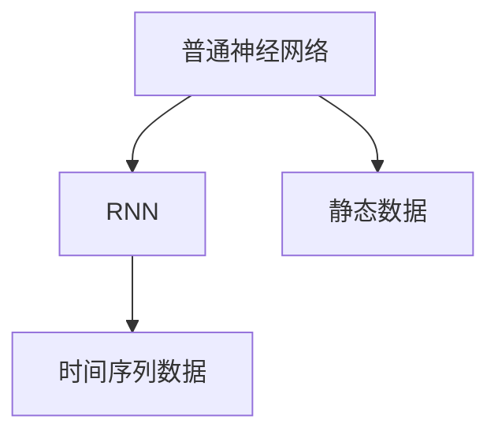

                 

# 循环神经网络

> 关键词：循环神经网络，RNN，神经网络，时间序列分析，语音识别，自然语言处理

> 摘要：本文深入探讨了循环神经网络（RNN）的基本概念、核心算法、数学模型以及其在时间序列分析、语音识别和自然语言处理等领域的应用。通过逐步分析推理的方式，本文旨在帮助读者全面理解循环神经网络的工作原理和实际应用。

## 目录大纲

- 第一部分：循环神经网络基础
  - 第1章：循环神经网络概述
    - 1.1 神经网络与循环神经网络的关系
    - 1.2 循环神经网络的定义和特点
    - 1.3 循环神经网络的应用场景
  - 第2章：循环神经网络的基本架构
    - 2.1 循环神经元的原理
    - 2.2 隐藏状态和隐藏层
    - 2.3 输入层和输出层
  - 第3章：循环神经网络的核心算法
    - 3.1 遗传算法
    - 3.2 粗糙集算法
    - 3.3 贝叶斯算法
  - 第4章：循环神经网络的训练过程
    - 4.1 训练数据的准备
    - 4.2 训练算法的选择
    - 4.3 训练过程的优化
  - 第5章：循环神经网络的数学模型
    - 5.1 神经网络的数学模型
    - 5.2 循环神经网络的数学模型
    - 5.3 循环神经网络的数学公式
  - 第6章：循环神经网络的实现
    - 6.1 循环神经网络的Python实现
    - 6.2 循环神经网络的TensorFlow实现
    - 6.3 循环神经网络的PyTorch实现
- 第二部分：循环神经网络应用实践
  - 第7章：循环神经网络在时间序列分析中的应用
    - 7.1 时间序列分析的基本原理
    - 7.2 循环神经网络在时间序列分析中的应用
    - 7.3 时间序列分析的案例分析
  - 第8章：循环神经网络在语音识别中的应用
    - 8.1 语音识别的基本原理
    - 8.2 循环神经网络在语音识别中的应用
    - 8.3 语音识别的案例分析
  - 第9章：循环神经网络在自然语言处理中的应用
    - 9.1 自然语言处理的基本原理
    - 9.2 循环神经网络在自然语言处理中的应用
    - 9.3 自然语言处理的案例分析
  - 第10章：循环神经网络的未来发展趋势
    - 10.1 循环神经网络的未来发展趋势
    - 10.2 循环神经网络的发展前景
    - 10.3 循环神经网络的发展挑战
- 附录
  - 附录A：循环神经网络常用工具和资源
    - A.1 循环神经网络的Python实现工具
    - A.2 循环神经网络的TensorFlow实现工具
    - A.3 循环神经网络的PyTorch实现工具
    - A.4 其他循环神经网络实现工具和资源

### 第一部分：循环神经网络基础

#### 第1章：循环神经网络概述

##### 1.1 神经网络与循环神经网络的关系

神经网络是一种模拟人脑神经元连接方式的计算模型，它由大量的节点（或称神经元）组成，这些节点通过连接（或称权重）相互连接，通过学习输入数据来发现数据中的模式和关系。而循环神经网络（Recurrent Neural Network，RNN）是神经网络的一种特殊类型，它特别适用于处理序列数据。

RNN与普通神经网络的不同之处在于，它具有时间维度上的连接，也就是说，它的每个节点不仅与它前一时刻的节点相连，还与它前一时刻的输出相连。这种循环连接使得RNN能够记忆过去的信息，并将其用于当前的计算中。

下面是一个简单的Mermaid流程图，展示了神经网络和RNN之间的关系：



##### 1.2 循环神经网络的定义和特点

循环神经网络（Recurrent Neural Network，RNN）是一种基于序列数据的神经网络模型，其特点是具有循环结构，即网络的输出可以反馈到输入端，形成循环。这使得RNN能够处理具有时间依赖性的序列数据，如图文、音频、视频和自然语言文本等。

以下是RNN的一些主要特点：

1. **时间依赖性**：RNN能够记住前面序列的信息，并将其用于后续的计算。
2. **序列处理**：RNN可以处理任意长度的序列数据。
3. **动态性**：RNN的输出不仅依赖于当前输入，还依赖于历史输入。
4. **可扩展性**：RNN可以很容易地扩展到多层结构，形成深层循环神经网络（LSTM和GRU）。

##### 1.3 循环神经网络的应用场景

循环神经网络由于其独特的循环结构，在许多领域都有广泛的应用。以下是RNN的一些主要应用场景：

1. **时间序列分析**：RNN可以用于预测股票价格、天气变化、交通流量等时间序列数据。
2. **语音识别**：RNN可以用于将语音信号转换为文本，这是语音识别系统的基础。
3. **自然语言处理**：RNN可以用于文本分类、情感分析、机器翻译等自然语言处理任务。
4. **序列生成**：RNN可以生成文本、音乐、视频等序列数据。

在接下来的章节中，我们将进一步探讨循环神经网络的基本架构、核心算法、训练过程、数学模型以及具体实现。

### 第2章：循环神经网络的基本架构

循环神经网络（RNN）的基本架构由输入层、隐藏层和输出层组成，其核心在于隐藏层之间的循环连接。下面，我们将详细探讨循环神经网络的各个组成部分及其工作原理。

##### 2.1 循环神经元的原理

循环神经网络的核心是循环神经元，也称为RNN单元。每个RNN单元都包含三个主要部分：输入门、遗忘门和输出门。

- **输入门**：用于确定当前输入数据对隐藏状态的影响程度。
- **遗忘门**：用于控制之前隐藏状态的信息在当前时刻被保留或遗忘的程度。
- **输出门**：用于确定当前隐藏状态对输出数据的贡献程度。

RNN单元的工作原理可以概括为以下几个步骤：

1. **输入**：每个时间步输入一个数据点，例如一个文本字符或一个语音采样。
2. **计算输入门**：根据当前输入和前一个隐藏状态，计算输入门的状态。
3. **计算遗忘门**：根据当前输入和前一个隐藏状态，计算遗忘门的状态。
4. **更新隐藏状态**：通过遗忘门和输入门的状态，更新隐藏状态。
5. **计算输出门**：根据当前隐藏状态，计算输出门的状态。
6. **生成输出**：根据输出门的状态，生成当前时间步的输出。

以下是RNN单元的伪代码实现：

```python
def RNN_unit(h_t-1, x_t):
    # 计算输入门状态
    i_t = sigmoid(W_i * [h_t-1; x_t])
    # 计算遗忘门状态
    f_t = sigmoid(W_f * [h_t-1; x_t])
    # 计算新的隐藏状态
    h_t = f_t .* h_t-1 + i_t .* tanh(W_g * [h_t-1; x_t])
    # 计算输出门状态
    o_t = sigmoid(W_o * [h_t; x_t])
    # 生成当前时间步的输出
    y_t = o_t .* tanh(h_t)
    return h_t, y_t
```

其中，`sigmoid`函数用于计算门的状态，`tanh`函数用于生成隐藏状态和输出。

##### 2.2 隐藏状态和隐藏层

隐藏状态是RNN的核心，它记录了到目前为止的所有输入信息。在RNN中，隐藏状态在不同的时间步之间进行传递，形成循环结构。

- **隐藏状态**：在每个时间步，RNN单元都会更新隐藏状态，这个状态包含了到目前为止的所有信息。
- **隐藏层**：在多层RNN中，每个时间步的隐藏状态都可以被视为一个隐藏层。这些隐藏层相互连接，形成了RNN的深度结构。

在多层RNN中，隐藏状态的计算通常如下：

```python
def MultiLayer_RNN(h_t-1, x_t):
    # 初始化隐藏状态
    h_t = [h_1, h_2, ..., h_n]
    for l in range(n_layers):
        # 计算当前隐藏层的输入
        h_t[l] = RNN_unit(h_t[l-1], x_t)
    return h_t
```

其中，`n_layers`是隐藏层的数量，`h_t[l-1]`是前一个隐藏层的状态，`RNN_unit`是单个RNN单元的计算。

##### 2.3 输入层和输出层

- **输入层**：输入层是RNN的起点，它接收外部输入数据，例如文本字符或语音采样。
- **输出层**：输出层是RNN的终点，它生成最终的输出，例如文本分类或语音识别的结果。

在RNN中，输入层和输出层通常包含简单的线性变换，例如全连接层。以下是输入层和输出层的伪代码实现：

```python
def Input_Layer(x):
    # 简单的全连接层
    y = W * x + b
    return y

def Output_Layer(h_t, y):
    # 简单的全连接层
    z = W * h_t + b
    # 应用softmax函数
    p = softmax(z)
    return p
```

其中，`x`是输入数据，`h_t`是隐藏状态，`y`是输出数据，`W`和`b`分别是权重和偏置。

通过以上对循环神经网络基本架构的详细探讨，我们可以看到RNN是如何通过其独特的循环结构来处理序列数据的。在接下来的章节中，我们将进一步探讨循环神经网络的核心算法、训练过程和数学模型。

### 第3章：循环神经网络的核心算法

循环神经网络（RNN）的核心算法包括遗传算法、粗糙集算法和贝叶斯算法。这些算法在RNN的训练和优化过程中发挥着重要作用。在本章中，我们将逐一介绍这些算法的基本原理和具体应用。

##### 3.1 遗传算法

遗传算法（Genetic Algorithm，GA）是一种基于自然选择和遗传学原理的搜索算法。它通过模拟生物进化过程，对解空间进行全局搜索，以找到最优解。

遗传算法的基本原理包括以下几个步骤：

1. **初始化种群**：随机生成一组解，形成初始种群。
2. **适应度评估**：对每个解进行评估，计算其适应度值。
3. **选择**：根据适应度值，选择优秀的解组成下一代种群。
4. **交叉**：在选中的解之间进行交叉操作，生成新的解。
5. **变异**：对交叉后的解进行变异操作，增加解的多样性。
6. **迭代**：重复上述步骤，直到找到满足终止条件的解或达到最大迭代次数。

在RNN的训练过程中，遗传算法可以用于优化网络的参数，例如权重和偏置。通过遗传算法，RNN可以自适应地调整参数，以找到更好的模型。

以下是遗传算法在RNN训练中的应用伪代码：

```python
def genetic_algorithm(population, fitness_function, crossover_function, mutation_function):
    while not termination_condition:
        # 适应度评估
        fitness_scores = [fitness_function(individual) for individual in population]
        # 选择
        selected_population = selection(population, fitness_scores)
        # 交叉
        offspring = crossover_function(selected_population)
        # 变异
        mutated_offspring = mutation_function(offspring)
        # 生成下一代种群
        population = mutated_offspring
    return best_individual(population)
```

##### 3.2 粗糙集算法

粗糙集算法（Rough Set Algorithm，RSA）是一种基于集合论的方法，用于处理不确定性和不完整信息。它通过分类和决策规则来分析数据，以发现数据中的模式和规律。

粗糙集算法的基本原理包括以下几个步骤：

1. **划分**：根据给定的属性，将数据划分为不同的类别。
2. **约简**：通过去除冗余属性，找到最小的属性集合，使得划分不变。
3. **决策规则**：基于约简属性，生成决策规则，用于分类和预测。

在RNN的训练过程中，粗糙集算法可以用于特征选择和优化。通过粗糙集算法，RNN可以自动选择重要的特征，并去除冗余信息，从而提高模型的性能。

以下是粗糙集算法在RNN训练中的应用伪代码：

```python
def rough_set_algorithm(data, attribute_set):
    # 划分数据
    partitions = divide_data(data, attribute_set)
    # 约简
    reduced_attributes = reduce_attributes(partitions)
    # 生成决策规则
    decision_rules = generate_decision_rules(reduced_attributes)
    return decision_rules
```

##### 3.3 贝叶斯算法

贝叶斯算法（Bayesian Algorithm）是一种基于贝叶斯定理的概率推理方法。它通过概率分布来描述数据之间的关联，并利用这些概率分布进行预测和分类。

贝叶斯算法的基本原理包括以下几个步骤：

1. **先验概率**：根据已有知识，为每个类分配一个先验概率。
2. **似然函数**：根据数据，计算每个类的似然函数。
3. **后验概率**：利用贝叶斯定理，计算每个类的后验概率。
4. **分类**：根据后验概率，为数据分配类别。

在RNN的训练过程中，贝叶斯算法可以用于概率建模和分类。通过贝叶斯算法，RNN可以更好地理解数据中的概率分布，从而提高模型的准确性和鲁棒性。

以下是贝叶斯算法在RNN训练中的应用伪代码：

```python
def bayesian_algorithm(prior_probability, likelihood_function, posterior_function):
    # 计算似然函数
    likelihood_scores = [likelihood_function(data, class_label) for data, class_label in data]
    # 计算后验概率
    posterior_probabilities = [posterior_function(prior_probability, likelihood_score) for likelihood_score in likelihood_scores]
    # 分类
    class_labels = [argmax(posterior_probabilities) for posterior_probability in posterior_probabilities]
    return class_labels
```

通过遗传算法、粗糙集算法和贝叶斯算法，循环神经网络可以实现参数优化、特征选择和概率建模，从而提高模型的性能和鲁棒性。在下一章中，我们将进一步探讨循环神经网络的训练过程，了解如何通过训练算法和优化过程来提升模型的性能。

### 第4章：循环神经网络的训练过程

循环神经网络的训练过程是模型开发和优化中的关键环节。在这个阶段，我们需要通过一系列的步骤来调整模型的参数，使其能够更好地拟合训练数据。以下是对循环神经网络训练过程的详细描述。

##### 4.1 训练数据的准备

在开始训练之前，我们需要准备好训练数据。训练数据的质量和多样性直接影响模型的性能。以下是训练数据准备的关键步骤：

1. **数据收集**：收集相关的序列数据，例如时间序列数据、语音数据或文本数据。
2. **数据预处理**：对数据进行清洗和预处理，包括去噪、标准化和编码等操作。例如，对于文本数据，我们可以将其转换为单词或字符的索引序列。
3. **数据分割**：将数据集分为训练集、验证集和测试集。通常，训练集用于训练模型，验证集用于调整模型参数，测试集用于评估模型的最终性能。

以下是一个简单的数据预处理和分割的伪代码示例：

```python
def prepare_data(data, split_ratio):
    # 数据预处理
    preprocessed_data = preprocess_data(data)
    # 数据分割
    train_data, validation_data, test_data = split_data(preprocessed_data, split_ratio)
    return train_data, validation_data, test_data
```

##### 4.2 训练算法的选择

选择合适的训练算法对于循环神经网络的性能至关重要。以下是一些常用的训练算法：

1. **反向传播算法**：反向传播（Backpropagation）是循环神经网络中最常用的训练算法。它通过计算损失函数关于网络参数的梯度，来更新网络参数。
2. **梯度下降算法**：梯度下降（Gradient Descent）是一种优化算法，用于最小化损失函数。它通过沿着损失函数的梯度方向逐步更新参数，以找到全局最小值。
3. **Adam优化器**：Adam（Adaptive Moment Estimation）是一种高效的优化器，它结合了动量和自适应学习率，可以在训练过程中快速收敛。

以下是使用反向传播算法进行训练的伪代码：

```python
def train_model(model, train_data, learning_rate, epochs):
    for epoch in range(epochs):
        # 前向传播
        outputs = model.forward(train_data)
        # 计算损失
        loss = compute_loss(outputs, train_data.targets)
        # 反向传播
        gradients = model.backward(loss)
        # 更新参数
        model.update_parameters(gradients, learning_rate)
        # 打印训练进度
        print(f"Epoch {epoch+1}/{epochs}, Loss: {loss}")
    return model
```

##### 4.3 训练过程的优化

为了提高循环神经网络的训练效率和性能，我们可以采取以下优化策略：

1. **学习率调整**：学习率的选择对训练过程有重要影响。我们可以使用学习率衰减策略，随着训练的进行逐步减小学习率，以防止模型过拟合。
2. **批量大小**：批量大小是指每次训练中参与梯度计算的样本数量。较小的批量大小可以减小方差，但会增加计算成本。较大的批量大小可以减小偏差，但会增加计算时间。
3. **正则化**：正则化技术，如L1和L2正则化，可以防止模型过拟合。它们通过在损失函数中添加惩罚项来限制模型参数的大小。
4. **早停法**：早停法是一种防止模型过拟合的技术。当验证集上的损失停止下降时，我们停止训练，以防止模型在训练数据上过度拟合。

以下是使用早停法和学习率衰减进行训练优化的伪代码：

```python
def train_model_with_early_stopping(model, train_data, validation_data, learning_rate, epochs, patience):
    best_loss = float('inf')
    patience_counter = 0
    
    for epoch in range(epochs):
        # 前向传播
        outputs = model.forward(train_data)
        # 计算损失
        loss = compute_loss(outputs, train_data.targets)
        # 反向传播
        gradients = model.backward(loss)
        # 更新参数
        model.update_parameters(gradients, learning_rate)
        
        # 在验证集上评估模型
        validation_loss = compute_loss(model.forward(validation_data), validation_data.targets)
        
        # 记录最佳损失
        if validation_loss < best_loss:
            best_loss = validation_loss
            patience_counter = 0
        else:
            patience_counter += 1
            
        # 早停法
        if patience_counter > patience:
            print("Early stopping triggered.")
            break
        
        # 学习率衰减
        learning_rate /= (1 + decay_rate)
        
        print(f"Epoch {epoch+1}/{epochs}, Loss: {loss}, Validation Loss: {validation_loss}")
    
    return model
```

通过以上步骤和优化策略，我们可以有效地训练和优化循环神经网络，使其在处理序列数据时表现出更好的性能和鲁棒性。在下一章中，我们将深入探讨循环神经网络的数学模型，了解其背后的数学原理。

### 第5章：循环神经网络的数学模型

循环神经网络（RNN）作为一种强大的序列模型，其性能和预测能力很大程度上依赖于其背后的数学模型。在这一章中，我们将深入探讨RNN的数学模型，包括其基本概念、数学公式以及相关的推导和解释。

##### 5.1 神经网络的数学模型

循环神经网络属于神经网络（Neural Network，NN）的一种，而神经网络的数学模型主要涉及以下三个方面：

1. **激活函数**：激活函数是神经网络中的一个关键组件，用于引入非线性。常见的激活函数包括sigmoid、tanh和ReLU等。
2. **权重和偏置**：神经网络通过权重（weights）和偏置（biases）来调整输入和输出之间的映射关系。
3. **前向传播**：前向传播是指将输入数据通过网络的各个层进行传递，最终得到输出数据的过程。

以下是神经网络前向传播的基本公式：

\[ a_{l+1} = \sigma(W_{l} \cdot a_l + b_l) \]

其中，\( a_l \) 是第 \( l \) 层的激活值，\( W_l \) 是第 \( l \) 层的权重矩阵，\( b_l \) 是第 \( l \) 层的偏置向量，\( \sigma \) 是激活函数。

##### 5.2 循环神经网络的数学模型

循环神经网络在传统神经网络的基础上，引入了时间维度，使其能够处理序列数据。RNN的数学模型主要包括以下部分：

1. **隐藏状态**：隐藏状态是RNN的核心，它记录了到目前为止的所有输入信息。在RNN中，隐藏状态在不同的时间步之间进行传递，形成循环结构。
2. **输入和输出**：输入和输出是RNN的起点和终点。输入是当前时间步的输入数据，输出是当前时间步的预测结果。

以下是RNN的基本数学模型：

\[ h_t = \sigma(W_h \cdot [h_{t-1}; x_t] + b_h) \]
\[ y_t = \sigma(W_y \cdot h_t + b_y) \]

其中，\( h_t \) 是第 \( t \) 个时间步的隐藏状态，\( x_t \) 是第 \( t \) 个时间步的输入，\( W_h \) 和 \( b_h \) 分别是隐藏层的权重和偏置，\( W_y \) 和 \( b_y \) 分别是输出层的权重和偏置，\( \sigma \) 是激活函数。

##### 5.3 循环神经网络的数学公式

为了更详细地理解RNN的数学模型，我们需要进一步探讨其具体的数学公式。以下是RNN中常用的几个关键公式：

1. **输入门状态**：
\[ i_t = \sigma(W_i \cdot [h_{t-1}; x_t] + b_i) \]

2. **遗忘门状态**：
\[ f_t = \sigma(W_f \cdot [h_{t-1}; x_t] + b_f) \]

3. **更新隐藏状态**：
\[ h_t = f_t \cdot h_{t-1} + i_t \cdot \tanh(W_g \cdot [h_{t-1}; x_t] + b_g) \]

4. **输出门状态**：
\[ o_t = \sigma(W_o \cdot [h_t; x_t] + b_o) \]

5. **生成输出**：
\[ y_t = o_t \cdot \tanh(h_t) \]

这些公式共同构成了RNN的完整数学模型，通过这些公式，RNN能够处理和记忆序列数据，并生成预测输出。

以下是这些公式的具体解释和推导：

- **输入门状态** \( i_t \)：输入门控制当前输入数据对隐藏状态的影响程度。通过 \( \sigma \) 函数，我们得到了一个介于0和1之间的值，用于表示输入的重要性。

- **遗忘门状态** \( f_t \)：遗忘门控制之前隐藏状态的信息在当前时刻被保留或遗忘的程度。同样，通过 \( \sigma \) 函数，我们得到了一个遗忘门的状态，用于决定哪些信息应该被保留。

- **更新隐藏状态** \( h_t \)：这一步是RNN的核心，通过遗忘门和输入门的状态，我们更新了隐藏状态。遗忘门决定哪些历史信息应该被遗忘，而输入门决定哪些新信息应该被记住。

- **输出门状态** \( o_t \)：输出门控制当前隐藏状态对输出数据的贡献程度。输出门的状态决定了隐藏状态中哪些信息应该被用于生成输出。

- **生成输出** \( y_t \)：通过输出门和隐藏状态，我们最终得到了当前时间步的输出。这个输出可以是预测的下一个时间步的输入，也可以是具体的预测结果。

通过这些数学公式，我们可以看到RNN是如何处理序列数据的。在下一章中，我们将探讨如何实现和部署循环神经网络，以及其具体的应用场景。

### 第6章：循环神经网络的实现

循环神经网络（RNN）作为一种强大的序列处理模型，其在实际应用中的实现和部署至关重要。在这一章中，我们将详细介绍如何在Python中实现RNN，并探讨如何使用TensorFlow和PyTorch这两个流行的深度学习框架来部署RNN。

#### 6.1 循环神经网络的Python实现

在Python中实现RNN可以从基本的数据预处理和模型构建开始。以下是一个简单的RNN实现示例，包括数据预处理、模型定义和训练。

##### 数据预处理

在开始之前，我们需要准备好数据。以下是一个文本数据的预处理示例：

```python
import numpy as np
from keras.preprocessing.sequence import pad_sequences

# 假设我们已经有了单词的索引序列
word_sequences = [
    [1, 2, 3, 4],
    [4, 5, 6],
    [7, 8, 9, 10]
]

# 数据填充
max_sequence_length = max(len(seq) for seq in word_sequences)
padded_sequences = pad_sequences(word_sequences, maxlen=max_sequence_length)

# 转换为Tensor
import tensorflow as tf
inputs = tf.keras.preprocessing.sequence.pad_sequences(padded_sequences, maxlen=max_sequence_length)
```

##### 模型定义

接下来，我们可以使用TensorFlow的Keras接口来定义一个简单的RNN模型：

```python
model = tf.keras.Sequential([
    tf.keras.layers.Embedding(input_dim=10000, output_dim=64),
    tf.keras.layers.SimpleRNN(units=128),
    tf.keras.layers.Dense(units=10000, activation='softmax')
])

model.compile(optimizer='adam', loss='categorical_crossentropy', metrics=['accuracy'])
```

在这个例子中，我们首先使用`Embedding`层将单词索引转换为嵌入向量。接着，我们使用`SimpleRNN`层来构建一个简单的循环层，最后使用`Dense`层来生成预测。

##### 训练模型

最后，我们可以使用训练数据来训练模型：

```python
# 假设我们已经有了标签数据
labels = tf.keras.utils.to_categorical(padded_sequences)

# 训练模型
model.fit(inputs, labels, epochs=10, batch_size=32)
```

#### 6.2 循环神经网络的TensorFlow实现

TensorFlow是一个强大的开源机器学习库，它提供了丰富的工具来构建和训练深度学习模型。以下是一个使用TensorFlow实现的RNN模型示例。

##### 数据准备

```python
import tensorflow as tf

# 创建一个简单的数据集
x = np.random.rand(100, 10)
y = np.random.rand(100, 1)

# 定义批次大小
batch_size = 32

# 创建数据生成器
train_dataset = tf.data.Dataset.from_tensor_slices((x, y)).batch(batch_size)
```

##### 模型构建

```python
# 定义RNN模型
model = tf.keras.Sequential([
    tf.keras.layers.SimpleRNN(units=128, input_shape=(10, 1)),
    tf.keras.layers.Dense(units=1)
])

model.compile(optimizer='adam', loss='mse')
```

在这个例子中，我们使用`SimpleRNN`层来构建一个简单的循环层，并使用`Dense`层来生成最终的预测。

##### 训练模型

```python
# 训练模型
model.fit(train_dataset, epochs=10)
```

#### 6.3 循环神经网络的PyTorch实现

PyTorch是一个流行的深度学习库，它提供了动态计算图和易于使用的API，使得构建和训练模型更加简单和直观。以下是一个使用PyTorch实现的RNN模型示例。

##### 数据准备

```python
import torch
from torch.utils.data import DataLoader

# 创建一个简单的数据集
x = torch.rand(100, 10)
y = torch.rand(100, 1)

# 定义批次大小
batch_size = 32

# 创建数据生成器
train_dataset = DataLoader(dataset=torch.utils.data.TensorDataset(x, y), batch_size=batch_size, shuffle=True)
```

##### 模型构建

```python
import torch.nn as nn

# 定义RNN模型
class RNNModel(nn.Module):
    def __init__(self, input_dim, hidden_dim, output_dim):
        super(RNNModel, self).__init__()
        self.rnn = nn.RNN(input_dim, hidden_dim)
        self.fc = nn.Linear(hidden_dim, output_dim)

    def forward(self, x):
        x, _ = self.rnn(x)
        x = self.fc(x[-1, :, :])
        return x

# 实例化模型
model = RNNModel(input_dim=10, hidden_dim=128, output_dim=1)

# 定义优化器和损失函数
optimizer = torch.optim.Adam(model.parameters(), lr=0.001)
criterion = nn.MSELoss()

# 训练模型
for epoch in range(100):
    for inputs, targets in train_dataset:
        optimizer.zero_grad()
        outputs = model(inputs)
        loss = criterion(outputs, targets)
        loss.backward()
        optimizer.step()
    print(f"Epoch {epoch+1}, Loss: {loss.item()}")
```

通过以上三个部分的详细讲解，我们可以看到如何在不同环境中实现和部署循环神经网络。在下一章中，我们将探讨循环神经网络在时间序列分析、语音识别和自然语言处理等领域的应用。

### 第7章：循环神经网络在时间序列分析中的应用

循环神经网络（RNN）在时间序列分析中有着广泛的应用，能够有效地捕捉时间序列数据中的序列依赖关系。本章节将探讨RNN在时间序列分析中的基本原理、具体应用和案例分析。

#### 7.1 时间序列分析的基本原理

时间序列分析是指对按时间顺序排列的数据进行分析和预测的过程。时间序列数据通常包含多个时间点上的观察值，这些观察值可以是一组连续的数字、文本或其他形式的数据。时间序列分析的主要目的是通过分析历史数据来预测未来数据。

时间序列分析的关键概念包括：

1. **趋势**：数据随时间的变化趋势，分为上升趋势、下降趋势和稳定趋势。
2. **季节性**：数据在特定时间间隔内的周期性波动，如季节性需求、天气变化等。
3. **噪声**：影响时间序列数据质量的不规则波动，可能是随机的或系统性的。
4. **自相关性**：时间序列数据在时间上的相关性，即当前值与其过去值之间的关系。

时间序列分析的主要任务包括：

1. **趋势分析**：识别数据中的长期变化趋势。
2. **季节性分析**：识别数据中的周期性波动。
3. **噪声分析**：去除数据中的噪声，提高预测准确性。
4. **预测**：基于历史数据对未来值进行预测。

#### 7.2 循环神经网络在时间序列分析中的应用

RNN通过其特有的循环结构，能够捕捉时间序列数据中的长距离依赖关系。这使得RNN在时间序列分析中具有显著的优势。

以下是RNN在时间序列分析中的主要应用：

1. **趋势预测**：RNN可以用于预测时间序列数据的长期趋势。通过分析历史数据，RNN可以识别出数据中的趋势并用于未来预测。

2. **季节性预测**：RNN可以识别时间序列数据中的季节性模式，并预测未来的季节性波动。这对于商业和工业应用，如销售预测、库存管理等具有重要意义。

3. **噪声过滤**：RNN可以去除时间序列数据中的噪声，从而提高预测的准确性。通过分析历史数据，RNN可以识别出哪些波动是噪声，哪些是真正的趋势或季节性波动。

4. **多变量时间序列预测**：RNN可以处理包含多个变量或特征的时间序列数据。通过结合多个变量的信息，RNN可以提供更准确的预测结果。

#### 7.3 时间序列分析的案例分析

下面，我们通过一个实际案例来展示如何使用RNN进行时间序列分析。

##### 案例背景

我们选择一个简单的股票价格预测案例。假设我们有一个包含过去一个月股票价格的数据集，我们需要使用RNN来预测未来五天的股票价格。

##### 数据准备

首先，我们需要准备好数据。以下是一个简单的Python脚本，用于读取和处理股票价格数据：

```python
import pandas as pd
from sklearn.preprocessing import MinMaxScaler

# 读取数据
data = pd.read_csv('stock_prices.csv')
data = data[['Close']]

# 数据预处理
scaler = MinMaxScaler(feature_range=(0, 1))
scaled_data = scaler.fit_transform(data)

# 创建数据集
def create_dataset(data, time_steps=1):
    X, y = [], []
    for i in range(len(data) - time_steps - 1):
        X.append(data[i:(i + time_steps), 0])
        y.append(data[i + time_steps, 0])
    return np.array(X), np.array(y)

X, y = create_dataset(scaled_data, time_steps=5)
```

##### 模型构建

接下来，我们使用TensorFlow的Keras接口构建一个简单的RNN模型：

```python
from tensorflow.keras.models import Sequential
from tensorflow.keras.layers import SimpleRNN, Dense

# 构建模型
model = Sequential([
    SimpleRNN(units=128, input_shape=(X.shape[1], X.shape[2])),
    Dense(units=1)
])

model.compile(optimizer='adam', loss='mse')
```

##### 训练模型

最后，我们使用训练数据来训练模型：

```python
# 训练模型
model.fit(X, y, epochs=50, batch_size=32)
```

##### 预测结果

训练完成后，我们可以使用模型来预测未来五天的股票价格。以下是一个简单的Python脚本，用于进行预测和可视化：

```python
# 预测未来五天的股票价格
predicted_prices = model.predict(X[-5:, :])

# 反缩放预测结果
predicted_prices = scaler.inverse_transform(predicted_prices)

# 可视化预测结果
import matplotlib.pyplot as plt

plt.figure(figsize=(10, 6))
plt.plot(scaler.inverse_transform(scaled_data), label='Actual Prices')
plt.plot(predicted_prices, label='Predicted Prices')
plt.legend()
plt.show()
```

通过这个案例，我们可以看到如何使用RNN进行时间序列分析，并预测未来的股票价格。这个案例展示了RNN在处理时间序列数据方面的强大能力。

在下一章中，我们将探讨循环神经网络在语音识别中的应用，了解如何使用RNN进行语音信号的建模和识别。

### 第8章：循环神经网络在语音识别中的应用

循环神经网络（RNN）在语音识别（Automatic Speech Recognition，ASR）领域有着广泛的应用。RNN能够捕捉语音信号的时序依赖性，从而实现高效的语音识别。在本章节中，我们将探讨RNN在语音识别中的基本原理、具体应用和案例分析。

#### 8.1 语音识别的基本原理

语音识别是将语音信号转换为文本的过程。它通常包括以下几个步骤：

1. **声音信号预处理**：将声音信号转换为数字信号，并进行预处理，如去噪、归一化等。
2. **特征提取**：从预处理后的声音信号中提取能够表征语音特征的向量。常见的特征提取方法包括梅尔频率倒谱系数（MFCC）、汉明小波变换等。
3. **声学模型**：声学模型用于将特征向量映射到概率分布，以表示不同语音单元的概率。声学模型通常使用神经网络，如循环神经网络（RNN）。
4. **语言模型**：语言模型用于对识别结果进行排序，以得到最可能的文本输出。语言模型通常是基于统计方法或深度学习模型。
5. **解码**：解码器用于将声学模型的输出转化为文本输出，通常使用动态规划算法，如隐马尔可夫模型（HMM）或神经网络解码器。

#### 8.2 循环神经网络在语音识别中的应用

RNN在语音识别中的应用主要体现在声学模型的构建上。RNN能够处理序列数据，使其在语音识别中能够捕捉语音信号的时序依赖性。以下是RNN在语音识别中的主要应用：

1. **时序建模**：RNN能够有效地建模语音信号的时序特性，从而提高识别的准确性。
2. **上下文信息利用**：RNN能够利用语音信号的上下文信息，如相邻音素的关系，从而提高识别的鲁棒性。
3. **长距离依赖性**：RNN能够捕捉语音信号中的长距离依赖性，如音节间的联系，从而提高识别的准确性。

#### 8.3 语音识别的案例分析

下面，我们通过一个实际案例来展示如何使用RNN进行语音识别。

##### 案例背景

我们选择一个简单的语音识别任务，即使用RNN识别一个包含几个常用单词的语音片段。假设我们有一个包含单词“hello”，“world”和“python”的语音数据集，我们需要使用RNN来识别这些单词。

##### 数据准备

首先，我们需要准备好数据。以下是一个简单的Python脚本，用于读取和处理语音数据：

```python
import librosa
import numpy as np
from sklearn.preprocessing import LabelEncoder

# 读取数据
def read_audio_files(folder_path):
    audio_files = []
    labels = []
    for file in os.listdir(folder_path):
        if file.endswith('.wav'):
            label = file.split('.')[0]
            audio, _ = librosa.load(os.path.join(folder_path, file))
            audio_files.append(audio)
            labels.append(label)
    return np.array(audio_files), np.array(labels)

folder_path = 'audio_data'
audio_files, labels = read_audio_files(folder_path)

# 数据预处理
def preprocess_audio(audio_files, sample_rate=22050, n_mels=128, n_fram=1024, hop_length=512):
    melspectrograms = []
    for audio in audio_files:
        audio = librosa.to_mono(audio)
        audio = librosa.resample(audio, orig_sr=sample_rate, target_sr=sample_rate)
        mel = librosa.feature.melspectrogram(y=audio, sr=sample_rate, n_mels=n_mels, n_fft=n_fram, hop_length=hop_length)
        melspectrograms.append(mel)
    return np.array(melspectrograms)

melspectrograms = preprocess_audio(audio_files, sample_rate=22050, n_mels=128, n_fram=1024, hop_length=512)

# 标签编码
label_encoder = LabelEncoder()
encoded_labels = label_encoder.fit_transform(labels)
```

##### 模型构建

接下来，我们使用TensorFlow的Keras接口构建一个简单的RNN模型：

```python
from tensorflow.keras.models import Sequential
from tensorflow.keras.layers import SimpleRNN, Dense, Embedding, TimeDistributed

# 构建模型
model = Sequential([
    SimpleRNN(units=128, input_shape=(melspectrograms.shape[1], melspectrograms.shape[2])),
    Dense(units=512, activation='relu'),
    TimeDistributed(Dense(units=len(label_encoder.classes_), activation='softmax'))
])

model.compile(optimizer='adam', loss='sparse_categorical_crossentropy', metrics=['accuracy'])
```

在这个模型中，我们首先使用`SimpleRNN`层来捕捉语音信号的时序依赖性，然后使用`Dense`层进行特征提取，最后使用`TimeDistributed`层来生成每个时间步的预测。

##### 训练模型

最后，我们使用训练数据来训练模型：

```python
# 训练模型
model.fit(melspectrograms, encoded_labels, epochs=50, batch_size=16)
```

##### 预测结果

训练完成后，我们可以使用模型来识别新的语音片段。以下是一个简单的Python脚本，用于进行预测和可视化：

```python
# 预测新的语音片段
def predict_audio(file_path):
    audio, _ = librosa.load(file_path)
    audio = librosa.to_mono(audio)
    audio = librosa.resample(audio, orig_sr=22050, target_sr=22050)
    mel = librosa.feature.melspectrogram(y=audio, sr=22050, n_mels=128, n_fft=1024, hop_length=512)
    predicted_label = np.argmax(model.predict(np.expand_dims(mel, axis=0)))
    return label_encoder.inverse_transform([predicted_label])

file_path = 'new_audio.wav'
predicted_label = predict_audio(file_path)
print(f"Predicted Label: {predicted_label}")

# 可视化预测结果
predicted_mel = model.predict(np.expand_dims(mel, axis=0))
plt.figure(figsize=(10, 6))
plt.imshow(predicted_mel[0], aspect='auto', origin='lower', cmap='gray')
plt.show()
```

通过这个案例，我们可以看到如何使用RNN进行语音识别。这个案例展示了RNN在处理语音信号和进行时序建模方面的强大能力。

在下一章中，我们将探讨循环神经网络在自然语言处理中的应用，了解如何使用RNN进行文本分析和处理。

### 第9章：循环神经网络在自然语言处理中的应用

循环神经网络（RNN）在自然语言处理（Natural Language Processing，NLP）领域有着广泛的应用。RNN能够有效地处理文本数据，捕捉句子中的序列依赖关系。在本章节中，我们将探讨RNN在自然语言处理中的基本原理、具体应用和案例分析。

#### 9.1 自然语言处理的基本原理

自然语言处理是指让计算机理解和处理自然语言（如英语、中文等）的技术。自然语言处理的基本原理包括以下几个部分：

1. **文本预处理**：对文本进行清洗、分词、词性标注等处理，使其适合后续的模型处理。
2. **词嵌入**：将文本中的单词转换为向量表示，如使用词向量（Word Vectors）或嵌入（Embedding）层。
3. **特征提取**：从词嵌入向量中提取能够表征文本意义的特征，如词袋模型（Bag of Words）、TF-IDF等。
4. **语言模型**：构建一个能够预测下一个单词或句子的模型，如n元语法（n-gram）、神经网络语言模型等。
5. **序列标注**：对文本序列进行标注，如词性标注、命名实体识别等。
6. **文本生成**：生成新的文本，如机器翻译、文本摘要等。

#### 9.2 循环神经网络在自然语言处理中的应用

RNN在自然语言处理中的应用主要体现在以下几个领域：

1. **文本分类**：RNN可以用于对文本进行分类，如情感分析、新闻分类等。通过训练，RNN能够学习到文本中的特征，并将其用于分类任务。
2. **情感分析**：RNN可以识别文本中的情感倾向，如正面、负面等。通过分析文本的时序特征，RNN能够捕捉到情感的变化。
3. **命名实体识别**：RNN可以用于识别文本中的命名实体，如人名、地名、组织名等。通过分析实体与其上下文的关系，RNN能够准确地识别实体。
4. **机器翻译**：RNN可以用于机器翻译任务，如将一种语言的文本翻译成另一种语言的文本。通过分析源语言和目标语言的时序特征，RNN能够生成高质量的翻译结果。
5. **文本生成**：RNN可以用于生成新的文本，如生成文章、诗歌等。通过训练，RNN能够学习到文本的时序模式，并生成新的文本。

#### 9.3 自然语言处理的案例分析

下面，我们通过一个实际案例来展示如何使用RNN进行自然语言处理。

##### 案例背景

我们选择一个简单的文本分类任务，即使用RNN对包含不同情感极性的评论进行分类。假设我们有一个包含正面评论和负面评论的数据集，我们需要使用RNN来识别这些评论的情感倾向。

##### 数据准备

首先，我们需要准备好数据。以下是一个简单的Python脚本，用于读取和处理文本数据：

```python
import pandas as pd
from sklearn.model_selection import train_test_split

# 读取数据
data = pd.read_csv('review_data.csv')
X = data['review']
y = data['label']

# 数据预处理
max_len = 100
X = X.apply(lambda x: x[:max_len])

# 划分数据集
X_train, X_test, y_train, y_test = train_test_split(X, y, test_size=0.2, random_state=42)

# 转换为序列
from keras.preprocessing.text import Tokenizer
tokenizer = Tokenizer()
tokenizer.fit_on_texts(X_train)
X_train_seq = tokenizer.texts_to_sequences(X_train)
X_test_seq = tokenizer.texts_to_sequences(X_test)

# 填充序列
from keras.preprocessing.sequence import pad_sequences
X_train_pad = pad_sequences(X_train_seq, maxlen=max_len)
X_test_pad = pad_sequences(X_test_seq, maxlen=max_len)
```

##### 模型构建

接下来，我们使用TensorFlow的Keras接口构建一个简单的RNN模型：

```python
from tensorflow.keras.models import Sequential
from tensorflow.keras.layers import Embedding, SimpleRNN, Dense

# 构建模型
model = Sequential([
    Embedding(input_dim=len(tokenizer.word_index) + 1, output_dim=64, input_length=max_len),
    SimpleRNN(units=128),
    Dense(units=1, activation='sigmoid')
])

model.compile(optimizer='adam', loss='binary_crossentropy', metrics=['accuracy'])
```

在这个模型中，我们首先使用`Embedding`层将文本转换为词向量，然后使用`SimpleRNN`层来捕捉文本的时序特征，最后使用`Dense`层进行分类。

##### 训练模型

最后，我们使用训练数据来训练模型：

```python
# 训练模型
model.fit(X_train_pad, y_train, epochs=10, batch_size=32, validation_data=(X_test_pad, y_test))
```

##### 预测结果

训练完成后，我们可以使用模型来预测新的评论的情感倾向。以下是一个简单的Python脚本，用于进行预测和可视化：

```python
# 预测新的评论
new_review = "This product is great!"
new_review_seq = tokenizer.texts_to_sequences([new_review])
new_review_pad = pad_sequences(new_review_seq, maxlen=max_len)
predicted_label = model.predict(new_review_pad)
predicted_label = np.round(predicted_label[0][0])

if predicted_label > 0.5:
    print("Positive Review")
else:
    print("Negative Review")
```

通过这个案例，我们可以看到如何使用RNN进行自然语言处理，并识别文本的情感倾向。这个案例展示了RNN在处理文本数据和进行序列建模方面的强大能力。

在下一章中，我们将探讨循环神经网络的未来发展趋势，了解这个领域的新进展和潜在应用。

### 第10章：循环神经网络的未来发展趋势

循环神经网络（RNN）作为深度学习领域的重要分支，近年来取得了显著的进展。然而，随着技术的不断演进，RNN也在不断地发展和完善。本章将探讨循环神经网络的未来发展趋势，包括新算法、改进方法和潜在应用。

#### 10.1 循环神经网络的未来发展趋势

1. **更深的循环结构**：传统的RNN由于梯度消失和梯度爆炸问题，难以学习长距离依赖关系。因此，未来RNN的发展趋势之一是构建更深的循环结构，如多层的循环神经网络（Deep RNN）或栈式循环神经网络（Stacked RNN）。这些结构能够更好地捕捉长距离依赖关系，提高模型性能。

2. **更有效的优化算法**：为了提高训练效率，未来的RNN可能会采用更有效的优化算法，如自适应梯度优化器（如Adam）和基于梯度的方法（如TensorFlow和PyTorch）。这些算法能够加快训练速度，提高模型收敛速度。

3. **注意力机制**：注意力机制（Attention Mechanism）是近年来在深度学习领域的一个重要突破。未来，RNN可能会结合注意力机制，使其在处理序列数据时能够更加关注重要的信息，从而提高模型性能。

4. **融合其他模型**：RNN可能会与其他模型（如图卷积神经网络（GCN）和变换器（Transformer））相结合，形成新的混合模型。这些混合模型能够结合不同模型的优点，提高在特定任务上的性能。

5. **可解释性**：随着对AI伦理和透明度的关注不断增加，未来的RNN将更加注重可解释性。研究者们可能会开发新的方法，使得RNN的决策过程更加透明，有助于理解和改进模型。

#### 10.2 循环神经网络的发展前景

1. **时间序列分析**：RNN在时间序列分析中具有广泛的应用前景，如金融市场预测、能源消耗预测和交通流量预测等。未来，随着RNN技术的不断改进，其在时间序列分析领域的应用将更加广泛和深入。

2. **语音识别**：语音识别是RNN的重要应用领域之一。随着语音交互技术的普及，未来RNN在语音识别领域的应用将更加重要，如智能助手、语音控制等。

3. **自然语言处理**：RNN在自然语言处理领域（如文本分类、机器翻译、文本生成等）有着广泛的应用。未来，随着RNN技术的进一步发展，其在自然语言处理领域的表现将更加出色。

4. **图像识别**：虽然卷积神经网络（CNN）在图像识别领域表现出色，但RNN在某些特定任务（如视频识别和图像序列分析）中也有潜在的应用。未来，RNN和CNN的融合有望在图像识别领域取得新的突破。

5. **医疗健康**：RNN在医疗健康领域也有很大的应用潜力，如疾病预测、药物研发和医学图像分析等。随着RNN技术的不断进步，其在医疗健康领域的应用将更加广泛和精准。

#### 10.3 循环神经网络的发展挑战

1. **计算资源需求**：RNN特别是深层RNN模型，通常需要大量的计算资源。因此，如何优化算法和提高训练效率是RNN发展的重要挑战之一。

2. **训练时间**：RNN的训练时间通常较长，尤其是在处理大规模数据集时。如何缩短训练时间，提高模型训练效率，是RNN发展的重要问题。

3. **过拟合**：RNN模型在训练过程中容易发生过拟合现象，特别是在数据量较小的情况下。如何设计有效的正则化方法，防止过拟合，是RNN发展的重要挑战。

4. **解释性**：尽管RNN在处理序列数据方面表现出色，但其决策过程通常缺乏透明度。如何提高RNN的可解释性，使其在复杂任务中更加可靠，是RNN发展的重要挑战。

5. **伦理和隐私**：随着RNN在各个领域的应用，如何确保其伦理和隐私，防止滥用，是RNN发展的重要问题。未来，RNN的发展将更加注重伦理和隐私保护。

总之，循环神经网络作为深度学习领域的重要分支，具有广阔的发展前景。尽管面临着一系列挑战，但随着技术的不断进步，RNN将在未来继续发挥重要作用，推动人工智能的发展。

### 附录A：循环神经网络常用工具和资源

在循环神经网络的开发和应用过程中，选择合适的工具和资源至关重要。以下是一些常用的循环神经网络实现工具和资源，以及它们的基本原理和具体应用。

#### A.1 循环神经网络的Python实现工具

1. **TensorFlow**：TensorFlow是谷歌开发的开源机器学习框架，支持循环神经网络（RNN）的实现。TensorFlow提供了丰富的API和工具，可以帮助开发者构建和训练RNN模型。具体应用包括时间序列预测、语音识别和文本分类等。

2. **PyTorch**：PyTorch是Facebook开发的另一个流行的开源机器学习库，其动态计算图特性使其在循环神经网络（RNN）的实现中备受青睐。PyTorch的简洁和灵活性使其成为开发者构建RNN模型的热门选择。具体应用包括图像识别、自然语言处理和视频分析等。

3. **Keras**：Keras是一个高级神经网络API，它可以在TensorFlow和Theano等后端框架上运行。Keras提供了易于使用的接口，使得构建和训练RNN模型变得更加简单。具体应用包括文本分类、情感分析和语音生成等。

#### A.2 循环神经网络的TensorFlow实现工具

1. **TensorFlow RNN教程**：TensorFlow官方提供了一系列的RNN教程，详细介绍了如何使用TensorFlow构建和训练RNN模型。这些教程适合初学者和进阶开发者，涵盖了从基本概念到高级应用的各个方面。

2. **TensorFlow RNN API**：TensorFlow RNN API提供了用于构建和训练RNN模型的工具和函数。通过这些API，开发者可以轻松实现RNN的各种变体，如LSTM（长短期记忆网络）和GRU（门控循环单元）。

3. **TensorBoard**：TensorBoard是TensorFlow提供的一个可视化工具，可以帮助开发者监控RNN模型的训练过程，如损失函数、准确率等指标。通过TensorBoard，开发者可以更直观地了解模型的训练状态。

#### A.3 循环神经网络的PyTorch实现工具

1. **PyTorch官方文档**：PyTorch官方文档提供了详细的API参考和教程，涵盖了从基础到高级的各个方面。开发者可以通过这些文档了解如何使用PyTorch实现RNN模型。

2. **PyTorch RNN教程**：PyTorch官方提供了一系列的RNN教程，详细介绍了如何使用PyTorch构建和训练RNN模型。这些教程适合初学者和进阶开发者，涵盖了从基本概念到高级应用的各个方面。

3. **PyTorch Dynamic RNN教程**：PyTorch的动态计算图特性使得构建和训练RNN模型更加灵活。动态RNN教程展示了如何使用PyTorch的动态计算图实现RNN模型，以及如何利用这一特性提高模型性能。

#### A.4 其他循环神经网络实现工具和资源

1. **MXNet**：MXNet是Apache Foundation的一个开源深度学习框架，支持循环神经网络（RNN）的实现。MXNet提供了丰富的API和工具，可以帮助开发者构建和训练RNN模型。

2. **Caffe**：Caffe是一个开源的深度学习框架，它支持循环神经网络（RNN）的实现。Caffe以其高效的卷积神经网络（CNN）而闻名，但也可以用于实现RNN模型，特别是在图像识别和视频分析等领域。

3. **Hugging Face Transformers**：Hugging Face Transformers是一个基于PyTorch和TensorFlow的开源库，用于实现预训练转换器（Transformer）模型。尽管Transformer模型不同于传统的循环神经网络（RNN），但Hugging Face Transformers也提供了一些RNN实现，如LSTM和GRU。

4. **在线教程和课程**：许多在线教程和课程提供了关于循环神经网络（RNN）的详细教程和示例。这些资源涵盖了从基础知识到高级应用的各个方面，适合不同层次的学习者。例如，Udacity、Coursera和edX等平台提供了相关的课程和教程。

通过以上工具和资源，开发者可以轻松地实现和部署循环神经网络（RNN），并应用于各种实际任务中。这些工具和资源不仅提供了丰富的API和教程，还涵盖了从基础到高级的各个方面，有助于开发者提高技能并推动项目进展。

