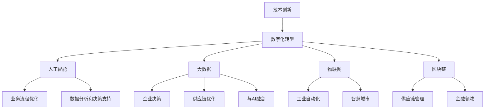

                 

# 文章标题: 技术创新与数字化转型的结合

> 关键词：技术创新，数字化转型，人工智能，大数据，物联网，区块链

> 摘要：本文深入探讨了技术创新与数字化转型的结合，分析了技术创新的背景与趋势，数字化转型的概念与框架，以及技术创新与数字化转型之间的相互关系。通过探讨人工智能、大数据、物联网和区块链等核心技术，结合实际案例，探讨了技术创新在数字化转型中的实践与未来展望。

### 第一部分：技术创新概述

#### 第1章：技术创新的背景与趋势

##### 1.1 技术创新的定义与分类

技术创新是指通过引入新知识、新技术、新产品或新服务，从而改进或颠覆现有市场或业务模式的过程。技术创新可以大致分为以下几类：

1. **渐进式创新**：通过不断改进现有技术或产品来提高其性能、降低成本或增加功能。
2. **突破性创新**：引入全新的技术或产品，颠覆现有的市场格局。
3. **颠覆性创新**：通过技术创新，彻底改变现有的商业模式、市场规则或用户行为。

##### 1.2 当前技术创新的主要趋势

当前，技术创新呈现出以下几个主要趋势：

1. **数字化技术的广泛应用**：包括人工智能、大数据、云计算、物联网等。
2. **可持续发展的技术创新**：如新能源技术、环保技术等。
3. **生物技术与医疗技术的融合**：生物技术在医疗、农业等领域的应用日益广泛。
4. **智能制造与工业4.0**：通过物联网、大数据等技术实现制造业的智能化、自动化。

##### 1.3 技术创新对社会和经济的影响

技术创新对社会和经济的影响是深远而广泛的：

1. **经济增长**：技术创新可以带动生产力提高，推动经济增长。
2. **就业结构变化**：新技术可能会替代某些传统职业，同时也创造新的就业机会。
3. **社会进步**：技术创新提高了人们的生活质量，改善了社会福祉。

#### 第2章：数字化转型的概念与框架

##### 2.1 数字化转型的定义

数字化转型是指利用数字技术对业务模式、流程和组织进行全方位的改造和优化，以实现更高的效率和更卓越的业绩。

##### 2.2 数字化转型的关键要素

数字化转型包括以下几个关键要素：

1. **技术基础设施**：包括云计算、大数据、物联网等。
2. **数据驱动决策**：通过数据分析来指导业务决策。
3. **用户体验**：以用户为中心，优化产品和服务。
4. **文化变革**：数字化转型需要企业文化、组织结构和员工行为的变革。

##### 2.3 数字化转型的实施步骤

数字化转型的实施一般包括以下步骤：

1. **评估与规划**：评估企业的数字化转型需求和潜力，制定详细的转型计划。
2. **技术选型与投资**：选择合适的技术，进行投资和部署。
3. **文化变革与人才培养**：推动企业文化的变革，培养适应数字化转型的员工。
4. **持续改进与优化**：数字化转型是一个持续的过程，需要不断进行改进和优化。

#### 第3章：技术创新与数字化转型的关系

##### 3.1 技术创新推动数字化转型

技术创新是数字化转型的核心驱动力，没有技术创新，数字化转型就无从谈起。技术创新可以提供新的技术手段，推动业务流程的数字化、智能化，提高企业的竞争力和效率。

##### 3.2 数字化转型促进技术创新

数字化转型不仅需要技术创新，而且会推动技术创新。在数字化转型过程中，企业会遇到新的业务需求和技术挑战，这会激发技术创新。同时，数字化转型的实施也会为技术创新提供更多的应用场景和测试机会。

##### 3.3 技术创新与数字化转型的协同效应

技术创新与数字化转型的结合会产生协同效应，推动企业和行业的快速发展。技术创新为数字化转型提供了工具和方法，而数字化转型则为技术创新提供了应用场景和需求。

### 第二部分：核心技术探讨

#### 第4章：人工智能在数字化转型中的应用

##### 4.1 人工智能的基础知识

人工智能（AI）是模仿、延伸和扩展人类智能的科学和工程。它包括机器学习、深度学习、自然语言处理等多个领域。人工智能的基础知识包括：

- **机器学习**：机器学习是一种使计算机系统能够从数据中学习的方法。
- **深度学习**：深度学习是机器学习的一种，通过模拟人脑神经网络进行学习。
- **自然语言处理**：自然语言处理是使计算机能够理解、生成和处理人类语言的技术。

##### 4.2 人工智能在业务流程优化中的应用

人工智能可以通过以下方式优化业务流程：

- **自动化决策**：利用机器学习和深度学习技术，实现自动化决策。
- **预测分析**：利用预测模型，预测未来的业务趋势和需求。
- **智能客服**：利用自然语言处理技术，实现智能客服系统。

##### 4.3 人工智能在数据分析和决策支持中的应用

人工智能在数据分析和决策支持中的应用包括：

- **数据挖掘**：利用机器学习和深度学习技术，从大量数据中提取有价值的信息。
- **推荐系统**：利用协同过滤、基于内容的推荐等技术，为用户提供个性化的推荐。
- **优化算法**：利用优化算法，为企业的决策提供最优解。

#### 第5章：大数据技术在数字化转型中的作用

##### 5.1 大数据的基本概念

大数据（Big Data）是指无法用传统数据处理工具在合理时间内进行存储、管理和分析的数据集合。大数据的基本特征包括：

- **数据量大**：大数据的数据量通常非常大，远远超出了传统数据库的处理能力。
- **多样性**：大数据的来源多种多样，包括结构化数据、半结构化数据和非结构化数据。
- **实时性**：大数据的处理和分析要求具有实时性或近实时性。

##### 5.2 大数据技术在企业决策中的应用

大数据技术在企业决策中的应用包括：

- **市场分析**：通过大数据分析，帮助企业了解市场趋势和用户需求。
- **风险预测**：利用大数据分析技术，预测潜在的风险和机会。
- **供应链优化**：通过大数据分析，优化供应链，提高供应链的效率。

##### 5.3 大数据技术与人工智能的融合

大数据技术与人工智能的融合可以实现以下目标：

- **智能化决策**：通过大数据和人工智能技术，实现更智能化的决策支持。
- **个性化服务**：通过大数据和人工智能技术，提供个性化的产品和服务。
- **智能运维**：通过大数据和人工智能技术，实现智能化的运维管理。

#### 第6章：物联网在数字化转型中的应用

##### 6.1 物联网的基本概念

物联网（Internet of Things，IoT）是指将各种物品通过传感器、网络等技术连接起来，实现信息的交换和通信。物联网的基本概念包括：

- **传感器**：物联网的核心组件，用于采集物理世界的数据。
- **通信协议**：物联网中的物品需要通过通信协议进行数据传输。
- **平台**：物联网的中间件，用于处理和存储物联网数据。

##### 6.2 物联网在工业自动化中的应用

物联网在工业自动化中的应用包括：

- **设备监控**：通过物联网技术，实时监控工业设备的运行状态。
- **远程控制**：通过物联网技术，实现工业设备的远程控制。
- **故障预测**：通过物联网技术，预测工业设备的故障，实现预防性维护。

##### 6.3 物联网在智慧城市中的应用

物联网在智慧城市中的应用包括：

- **智能交通**：通过物联网技术，实现智能交通管理，提高交通效率。
- **智能照明**：通过物联网技术，实现智能照明系统，节约能源。
- **环境监测**：通过物联网技术，实时监测环境数据，保护环境。

#### 第7章：区块链技术在数字化转型中的应用

##### 7.1 区块链的基本原理

区块链（Blockchain）是一种分布式数据库技术，通过密码学确保数据的不可篡改和可追溯性。区块链的基本原理包括：

- **去中心化**：区块链的数据存储在多个节点上，没有中心化的控制。
- **加密技术**：区块链使用加密技术确保数据的隐私和安全。
- **共识机制**：区块链通过共识机制确保数据的合法性和一致性。

##### 7.2 区块链在供应链管理中的应用

区块链在供应链管理中的应用包括：

- **透明性**：通过区块链技术，实现供应链的全程透明，提高供应链的效率。
- **追踪与溯源**：通过区块链技术，实现对产品的全程追踪与溯源，确保产品的质量和安全。
- **智能合约**：通过区块链技术，实现智能合约的自动执行，降低交易成本。

##### 7.3 区块链在金融领域的应用

区块链在金融领域的应用包括：

- **支付系统**：通过区块链技术，实现快速、安全的跨境支付。
- **证券交易**：通过区块链技术，提高证券交易的透明度和效率。
- **去中心化金融**：通过区块链技术，实现去中心化的金融交易，降低交易成本。

### 第三部分：案例分析与实践

#### 第8章：企业数字化转型案例研究

##### 8.1 案例背景

某大型制造企业在面临市场竞争加剧和成本压力增大的背景下，决定进行数字化转型，以提升企业的竞争力和运营效率。

##### 8.2 转型策略

企业的数字化转型策略主要包括以下几个方面：

- **技术选型与投资**：选择适合企业需求的数字技术，如人工智能、大数据、物联网等，并进行相应的投资。
- **组织变革**：调整组织结构，建立跨部门的工作团队，推动数字化转型的实施。
- **人才培养**：培养员工的数字化技能，提升员工的数字化素养。
- **文化变革**：推动企业文化的变革，鼓励创新和协作。

##### 8.3 成功因素与挑战

数字化转型的成功因素包括：

- **领导层的支持**：领导层对数字化转型的重视和支持是关键。
- **技术创新**：持续的技术创新是推动数字化转型的重要动力。
- **文化变革**：企业文化的变革是数字化转型成功的重要保障。

数字化转型的挑战包括：

- **技术复杂性**：数字化技术的复杂性增加了转型的难度。
- **组织变革**：组织变革的难度和复杂性是企业面临的主要挑战。
- **人才短缺**：数字化技能的人才短缺是企业面临的一个重要问题。

#### 第9章：技术创新在数字化转型中的实践

##### 9.1 技术创新项目规划

技术创新项目规划包括以下几个方面：

- **需求分析**：明确数字化转型的需求和目标。
- **技术评估**：评估适合企业需求的技术方案。
- **项目计划**：制定详细的项目计划，包括时间表、预算和资源分配。

##### 9.2 技术创新项目实施

技术创新项目实施包括以下几个方面：

- **技术选型**：选择合适的技术方案。
- **技术开发**：进行技术开发，实现技术方案。
- **测试与优化**：对技术开发成果进行测试和优化，确保系统的稳定性和性能。

##### 9.3 技术创新项目评估

技术创新项目评估包括以下几个方面：

- **效果评估**：评估技术创新项目的实际效果，包括业务效益、运营效率等。
- **成本效益分析**：对技术创新项目的成本和效益进行详细分析。
- **改进建议**：根据评估结果，提出改进建议，优化技术创新项目。

#### 第10章：数字化转型未来展望

##### 10.1 未来数字化转型的趋势

未来数字化转型的趋势包括：

- **人工智能的深入应用**：人工智能将更广泛地应用于业务流程、数据分析和决策支持。
- **物联网的普及**：物联网将在更多的领域得到应用，实现万物互联。
- **区块链的变革性影响**：区块链将在金融、供应链等多个领域产生深远影响。
- **数据驱动的决策**：数据将成为企业决策的重要依据。

##### 10.2 技术创新对数字化转型的潜在影响

技术创新对数字化转型的潜在影响包括：

- **提升效率**：技术创新将大大提升企业的运营效率，降低成本。
- **创造新机会**：技术创新将为企业创造新的业务机会和市场空间。
- **重塑行业格局**：技术创新将重塑行业的竞争格局，推动行业的转型升级。

##### 10.3 企业应对数字化转型的策略

企业应对数字化转型的策略包括：

- **积极拥抱技术创新**：积极引入和应用新技术，提升企业的竞争力。
- **培养数字化人才**：培养具有数字化技能的人才，支持数字化转型的实施。
- **建立数字化文化**：推动企业文化的变革，鼓励创新和协作。
- **持续改进和优化**：持续进行数字化改进和优化，确保数字化转型的成功。

### 附录

#### 附录A：数字化转型与技术创新常用工具与资源

##### A.1 数字化转型工具

- **云计算平台**：如Amazon Web Services（AWS）、Microsoft Azure、Google Cloud等。
- **大数据处理平台**：如Hadoop、Spark、Flink等。
- **人工智能框架**：如TensorFlow、PyTorch、Scikit-learn等。
- **物联网平台**：如IoT Hub、 ThingsBoard、Xively等。
- **区块链平台**：如Ethereum、Hyperledger Fabric等。

##### A.2 技术创新工具

- **版本控制工具**：如Git、Subversion等。
- **开发工具**：如Visual Studio、Eclipse、IntelliJ IDEA等。
- **测试工具**：如JUnit、Selenium、JMeter等。
- **项目管理工具**：如JIRA、Trello、Asana等。

##### A.3 相关资源链接

- **数字化转型资源**：[数字化转型研究中心](https://www.digitaltransformationcenter.com/)
- **技术创新资源**：[AI研究中心](https://ai研究中心.com/)、[大数据研究中心](https://bigdata研究中心.com/)
- **在线课程与教程**：[Coursera](https://www.coursera.org/)、[edX](https://www.edx.org/)、[Udacity](https://www.udacity.com/)

### 作者

- **作者**：AI天才研究院/AI Genius Institute & 禅与计算机程序设计艺术 /Zen And The Art of Computer Programming

---

**附录：核心概念与联系（Mermaid流程图）**



**附录：核心算法原理讲解（伪代码）**

```python
# 伪代码：机器学习算法——决策树
def decision_tree(data, target_variable):
    if is_pruning(data):
        return majority_vote(data, target_variable)
    else:
        best_attribute = find_best_attribute(data, target_variable)
        left_data = split_data(data, best_attribute, "left")
        right_data = split_data(data, best_attribute, "right")
        tree = {
            "attribute": best_attribute,
            "left": decision_tree(left_data, target_variable),
            "right": decision_tree(right_data, target_variable)
        }
        return tree

def is_pruning(data):
    # 判断是否进行剪枝
    return False

def majority_vote(data, target_variable):
    # 多数投票法
    return max_count_class(data, target_variable)

def find_best_attribute(data, target_variable):
    # 寻找最佳属性
    return best_attribute

def split_data(data, attribute, side):
    # 根据属性分割数据
    return split_data
```

**附录：数学模型和公式 & 详细讲解 & 举例说明（LaTeX格式）**

```latex
\documentclass{article}
\usepackage{amsmath}
\begin{document}

\section{数学模型和公式讲解}

本文将涉及以下数学模型和公式：

\subsection{线性回归模型}

线性回归模型的一般形式为：
$$
Y = \beta_0 + \beta_1X + \epsilon
$$
其中，$Y$ 是因变量，$X$ 是自变量，$\beta_0$ 和 $\beta_1$ 是模型的参数，$\epsilon$ 是误差项。

\subsection{决策树模型}

决策树模型的构建过程可以通过以下递归算法实现：
$$
T = \begin{cases}
    \text{split}(A) & \text{if } A \text{ is not pure} \\
    \text{leaf} & \text{if } A \text{ is pure}
\end{cases}
$$
其中，$A$ 是数据集，$\text{split}(A)$ 表示对数据集 $A$ 进行划分，$\text{leaf}$ 表示叶节点。

\section{举例说明}

假设我们有一个线性回归模型，其中 $Y$ 表示房价，$X$ 表示面积。我们通过以下数据训练模型：

\begin{align*}
    \text{数据集} &= \{ (1000, 2000), (1500, 2500), (2000, 3000) \} \\
    \text{目标} &= Y = \beta_0 + \beta_1X
\end{align*}

通过最小二乘法，我们可以计算出模型的参数：
$$
\beta_0 = \bar{Y} - \beta_1\bar{X}
$$

其中，$\bar{Y}$ 和 $\bar{X}$ 分别是 $Y$ 和 $X$ 的平均值。假设我们计算得到 $\bar{Y} = 2500$ 和 $\bar{X} = 1500$，则可以计算出 $\beta_0 = 1000$ 和 $\beta_1 = 1$。

因此，模型的预测公式为：
$$
Y = 1000 + X
$$

\end{document}
```

**附录：代码实际案例和详细解释说明**

#### 开发环境搭建

1. 安装Python环境：确保Python版本不低于3.6。
2. 安装必要的库：使用pip安装以下库：numpy、pandas、scikit-learn。

```bash
pip install numpy pandas scikit-learn
```

#### 源代码实现

```python
import numpy as np
import pandas as pd
from sklearn.model_selection import train_test_split
from sklearn.tree import DecisionTreeRegressor

# 加载数据集
data = pd.read_csv('data.csv')  # 假设数据集已经处理为CSV格式
X = data[['area']]  # 特征
y = data['price']   # 目标变量

# 数据集划分
X_train, X_test, y_train, y_test = train_test_split(X, y, test_size=0.2, random_state=42)

# 建立决策树模型
model = DecisionTreeRegressor(max_depth=3)
model.fit(X_train, y_train)

# 预测
y_pred = model.predict(X_test)

# 评估模型
from sklearn.metrics import mean_squared_error
mse = mean_squared_error(y_test, y_pred)
print(f'Mean Squared Error: {mse}')
```

#### 代码解读与分析

1. **数据加载**：使用pandas读取CSV格式的数据集。数据集应包括“area”和“price”两列，分别表示面积和房价。
2. **数据集划分**：使用train_test_split函数将数据集划分为训练集和测试集，测试集占比20%。
3. **模型建立**：使用DecisionTreeRegressor创建决策树模型，设置最大深度为3。
4. **模型训练**：使用fit函数对模型进行训练。
5. **模型预测**：使用predict函数对测试集进行预测。
6. **模型评估**：使用mean_squared_error函数计算均方误差，评估模型的性能。

通过上述代码，我们可以实现一个简单的决策树回归模型，用于预测房价。这个案例展示了从数据准备到模型训练和评估的完整流程。在实际应用中，我们还需要进行更深入的数据预处理、特征工程和模型调参等工作，以提高模型的预测性能。

