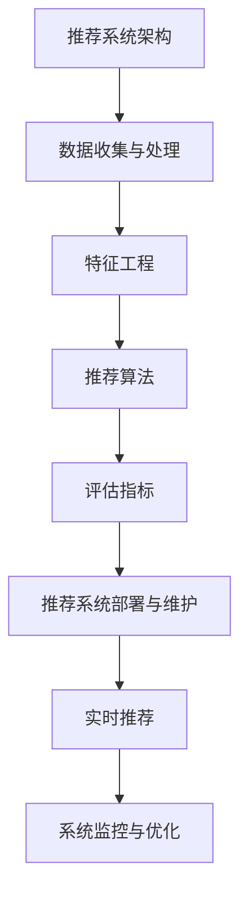
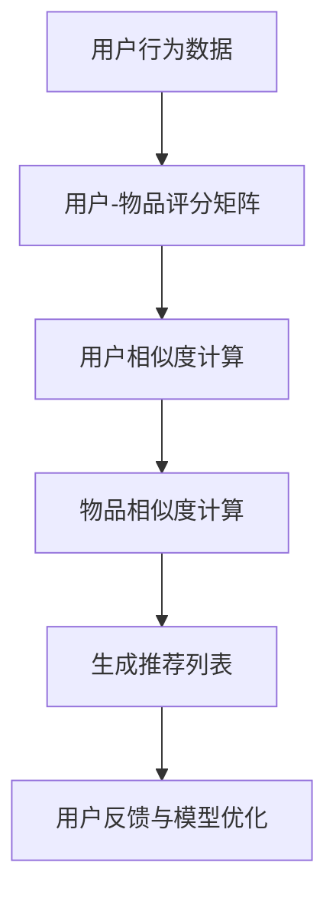
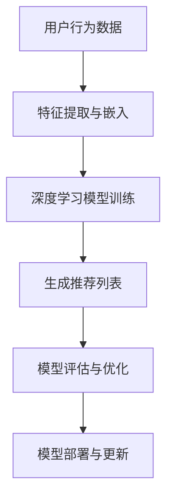

                 

# 《推荐系统》

> 关键词：推荐系统、协同过滤、内容推荐、混合推荐、深度学习、应用案例、伦理与隐私

> 摘要：本文将详细探讨推荐系统的基础知识、架构与组件、推荐算法原理、工程化实践以及应用案例和未来趋势。通过逻辑清晰、结构紧凑、简单易懂的写作风格，帮助读者深入了解推荐系统的本质，掌握核心技术和实现方法。

## 《推荐系统》目录大纲

## 第一部分：推荐系统概述

### 1.1 推荐系统的基础知识

- 1.1.1 推荐系统的定义和作用
- 1.1.2 推荐系统的分类
- 1.1.3 推荐系统的发展历程

### 1.2 推荐系统的架构与组件

- 1.2.1 数据收集与处理
- 1.2.2 特征工程
- 1.2.3 推荐算法
- 1.2.4 评估指标

## 第二部分：推荐算法原理

### 2.1 协同过滤算法

- 2.1.1 基本概念
- 2.1.2 评分预测
- 2.1.3 评分矩阵分解
- 2.1.4 推荐策略

### 2.2 内容推荐算法

- 2.2.1 基本概念
- 2.2.2 内容表示
- 2.2.3 相似度计算
- 2.2.4 推荐策略

### 2.3 混合推荐算法

- 2.3.1 基本概念
- 2.3.2 混合策略
- 2.3.3 实践案例

## 第三部分：推荐系统的工程化实践

### 3.1 数据处理与特征工程

- 3.1.1 数据清洗
- 3.1.2 用户行为数据分析
- 3.1.3 商品信息处理
- 3.1.4 特征提取与选择

### 3.2 推荐算法的选择与优化

- 3.2.1 算法选择
- 3.2.2 算法优化
- 3.2.3 性能调优

### 3.3 推荐系统的部署与维护

- 3.3.1 部署流程
- 3.3.2 实时推荐
- 3.3.3 系统监控与优化

## 第四部分：推荐系统的应用案例

### 4.1 在电子商务领域的应用

- 4.1.1 应用场景
- 4.1.2 成功案例分析
- 4.1.3 挑战与解决方案

### 4.2 在社交媒体领域的应用

- 4.2.1 应用场景
- 4.2.2 成功案例分析
- 4.2.3 挑战与解决方案

### 4.3 在金融领域的应用

- 4.3.1 应用场景
- 4.3.2 成功案例分析
- 4.3.3 挑战与解决方案

## 第五部分：推荐系统的未来趋势

### 5.1 深度学习在推荐系统中的应用

- 5.1.1 基本概念
- 5.1.2 深度学习模型在推荐系统中的优势
- 5.1.3 深度学习在推荐系统中的应用案例

### 5.2 推荐系统与自然语言处理

- 5.2.1 跨模态推荐
- 5.2.2 情感分析
- 5.2.3 文本推荐

### 5.3 推荐系统的伦理与隐私

- 5.3.1 推荐系统的伦理问题
- 5.3.2 用户隐私保护
- 5.3.3 法律法规与合规性

## 附录

### 附录 A：推荐系统开发工具与资源

- A.1 数据库
- A.2 大数据处理工具
- A.3 机器学习框架
- A.4 推荐系统开源项目

### 附录 B：推荐系统相关书籍与论文推荐

- B.1 基础书籍
- B.2 进阶书籍
- B.3 学术论文
- B.4 网络资源

## 第一部分：推荐系统概述

### 1.1 推荐系统的基础知识

#### 1.1.1 推荐系统的定义和作用

推荐系统是一种基于用户历史行为、偏好和上下文信息的智能系统，旨在为用户发现和推荐其可能感兴趣的商品、内容或服务。推荐系统广泛应用于电子商务、社交媒体、在线视频、音乐流媒体、新闻门户等多个领域，其主要作用包括：

1. 提高用户体验：通过个性化推荐，满足用户的个性化需求，提高用户满意度和黏性。
2. 增加销售额和用户参与度：推荐系统能够根据用户的兴趣和行为预测其可能感兴趣的商品或内容，从而促进用户购买决策和增加用户参与度。
3. 优化内容分发：在新闻门户、社交媒体等场景下，推荐系统能够根据用户兴趣和内容质量推荐相关内容，提高内容曝光率和阅读量。

#### 1.1.2 推荐系统的分类

根据推荐系统的实现方式，主要分为以下几类：

1. **协同过滤推荐**：基于用户的历史行为和相似度计算，为用户推荐与其兴趣相似的物品。协同过滤推荐包括**基于用户的协同过滤**和**基于项目的协同过滤**两种。
2. **内容推荐**：基于物品的内容属性（如标题、标签、分类等），为用户推荐与其兴趣相关的物品。内容推荐通常用于音乐、新闻、视频等场景。
3. **混合推荐**：结合协同过滤和内容推荐，利用两者的优点，为用户推荐更准确的物品。
4. **基于模型的推荐**：利用机器学习模型（如线性回归、神经网络等），根据用户历史行为和物品特征预测用户对物品的兴趣，从而生成推荐列表。
5. **基于规则推荐**：基于预定义的规则和策略，为用户推荐相关物品。例如，根据购物车的商品推荐相关的配件或周边商品。

#### 1.1.3 推荐系统的发展历程

推荐系统的发展历程可以分为以下几个阶段：

1. **基于规则的推荐系统**：早期的推荐系统主要基于预定义的规则和策略进行推荐，例如基于库存和销售数据的商品推荐。
2. **基于协同过滤的推荐系统**：20世纪90年代，基于协同过滤的推荐系统开始广泛应用，成为主流的推荐技术。
3. **基于内容的推荐系统**：随着互联网的发展，内容推荐系统逐渐成为重要分支，特别是在音乐、视频等场景下。
4. **混合推荐系统**：为了提高推荐效果，混合推荐系统逐渐成为研究热点，结合协同过滤和内容推荐，实现更精准的推荐。
5. **基于模型的推荐系统**：随着机器学习技术的发展，基于模型的推荐系统逐渐成为主流，利用机器学习算法（如深度学习）预测用户兴趣。
6. **基于数据的推荐系统**：大数据时代的到来，推荐系统逐渐从基于用户历史行为转变为基于海量数据分析和挖掘，实现更精细化的推荐。

### 1.2 推荐系统的架构与组件

推荐系统通常由多个组件组成，包括数据收集与处理、特征工程、推荐算法、评估指标等。以下是对这些组件的简要介绍：

#### 1.2.1 数据收集与处理

数据收集与处理是推荐系统的第一步，主要包括以下任务：

1. **数据采集**：收集用户行为数据（如点击、浏览、购买等）、商品信息（如标题、标签、分类等）和其他相关数据。
2. **数据清洗**：处理缺失值、异常值和重复数据，确保数据质量。
3. **数据预处理**：对数据进行归一化、离散化等预处理操作，为后续特征工程和模型训练做准备。

#### 1.2.2 特征工程

特征工程是推荐系统中的关键环节，主要包括以下任务：

1. **用户特征提取**：根据用户行为数据和属性（如年龄、性别、地理位置等），提取用户兴趣特征、活跃度特征等。
2. **商品特征提取**：根据商品信息，提取商品类别、标签、价格等特征。
3. **上下文特征提取**：提取与用户行为和推荐上下文相关的特征，如时间、地点、设备类型等。

#### 1.2.3 推荐算法

推荐算法是推荐系统的核心组件，主要包括以下几种类型：

1. **协同过滤算法**：基于用户历史行为和相似度计算，为用户推荐与其兴趣相似的物品。
2. **内容推荐算法**：基于物品的内容属性，为用户推荐与其兴趣相关的物品。
3. **混合推荐算法**：结合协同过滤和内容推荐，利用两者的优点，为用户推荐更准确的物品。
4. **基于模型的推荐算法**：利用机器学习模型（如线性回归、神经网络等），根据用户历史行为和物品特征预测用户对物品的兴趣，从而生成推荐列表。

#### 1.2.4 评估指标

评估指标是衡量推荐系统性能的重要标准，主要包括以下几种：

1. **准确率（Precision）**：推荐列表中真实相关的物品占推荐列表中所有物品的比例。
2. **召回率（Recall）**：推荐列表中真实相关的物品占所有真实相关的物品的比例。
3. **F1分数（F1 Score）**：准确率和召回率的调和平均值，综合考虑了推荐系统的准确性和召回性。
4. **平均绝对误差（Mean Absolute Error, MAE）**：预测评分与真实评分之间的平均绝对误差。
5. **均方根误差（Root Mean Square Error, RMSE）**：预测评分与真实评分之间的均方根误差。

## 第二部分：推荐算法原理

### 2.1 协同过滤算法

#### 2.1.1 基本概念

协同过滤（Collaborative Filtering）是一种基于用户行为和相似度计算的推荐算法，旨在通过分析用户之间的相似性或物品之间的相似性，为用户推荐与其兴趣相似的物品。协同过滤算法可以分为以下两类：

1. **基于用户的协同过滤（User-Based Collaborative Filtering）**：首先计算用户之间的相似度，然后找到与目标用户最相似的K个邻居用户，最后根据邻居用户的评分预测目标用户对物品的评分，从而生成推荐列表。

2. **基于物品的协同过滤（Item-Based Collaborative Filtering）**：首先计算物品之间的相似度，然后找到与目标物品最相似的K个邻居物品，最后根据邻居物品的评分预测目标用户对物品的评分，从而生成推荐列表。

#### 2.1.2 评分预测

协同过滤算法的核心任务是预测用户对物品的评分。以下是基于用户的协同过滤算法的评分预测过程：

1. **计算用户相似度**：使用余弦相似度、皮尔逊相关系数等相似度度量方法计算目标用户与邻居用户之间的相似度。相似度度量方法如下：
   $$
   sim(u, v) = \frac{u \cdot v}{\|u\|\|v\|}
   $$
   其中，$u$和$v$分别表示两个用户的评分向量，$\|u\|$和$\|v\|$分别表示两个用户的评分向量的欧几里得范数。

2. **计算预测评分**：根据邻居用户的相似度和他们的评分，计算目标用户对物品的预测评分。常见的方法如下：
   $$
   \hat{r}_{ui} = \sum_{v \in N(u)} sim(u, v) \cdot r_{vi}
   $$
   其中，$N(u)$表示与目标用户$u$最相似的K个邻居用户，$r_{vi}$表示邻居用户$v$对物品$i$的评分，$\hat{r}_{ui}$表示目标用户$u$对物品$i$的预测评分。

#### 2.1.3 评分矩阵分解

评分矩阵分解（Matrix Factorization）是一种常用的协同过滤算法，通过将原始评分矩阵分解为低维用户特征矩阵和物品特征矩阵，从而预测用户对物品的评分。以下是评分矩阵分解的基本原理：

1. **初始化**：初始化用户特征矩阵$U$和物品特征矩阵$V$，通常使用随机矩阵。

2. **优化目标**：最小化预测评分与真实评分之间的误差。常见的损失函数如下：
   $$
   Loss = \frac{1}{2} \sum_{i=1}^{m} \sum_{j=1}^{n} (r_{ij} - \hat{r}_{ij})^2
   $$
   其中，$r_{ij}$表示用户$i$对物品$j$的真实评分，$\hat{r}_{ij}$表示用户$i$对物品$j$的预测评分。

3. **优化方法**：采用梯度下降或随机梯度下降等方法优化用户特征矩阵$U$和物品特征矩阵$V$。以下是使用梯度下降进行矩阵分解的伪代码：
   $$
   function matrix_factorization(R, K, lambda):
       U = random_matrix(K)
       V = random_matrix(K)
       
       for i in range(number_of_users):
           for j in range(number_of_items):
               if R[i, j] > 0:
                   e_ij = R[i, j] - dot(U[i], V[j])
                   U[i] = U[i] - (1 / (1 + lambda)) * e_ij * V[j]
                   V[j] = V[j] - (1 / (1 + lambda)) * e_ij * U[i]
                   
       return U, V

#### 2.1.4 推荐策略

协同过滤算法的推荐策略可以分为以下几种：

1. **基于评分的推荐**：根据用户对物品的预测评分，将评分较高的物品推荐给用户。

2. **基于流行度的推荐**：结合用户兴趣和物品的流行度，将评分较高且受欢迎的物品推荐给用户。

3. **基于上下文的推荐**：考虑用户当前上下文信息（如时间、地点、设备等），为用户推荐与其上下文相关的物品。

4. **基于社交网络的推荐**：利用用户之间的社交关系，为用户推荐其社交网络中的好友喜欢的物品。

### 2.2 内容推荐算法

#### 2.2.1 基本概念

内容推荐（Content-Based Filtering）是一种基于物品内容属性的推荐算法，旨在为用户推荐与已喜欢或已评价的物品具有相似内容的物品。内容推荐算法的基本思想是，通过分析用户的历史行为和偏好，提取用户兴趣特征，然后根据用户兴趣特征和物品内容特征计算相似度，从而生成推荐列表。

#### 2.2.2 内容表示

内容表示（Content Representation）是内容推荐算法的关键步骤，旨在将物品内容转换为适合计算相似度的向量表示。常见的内容表示方法包括以下几种：

1. **基于关键词的表示**：将物品的标题、描述等文本信息转换为关键词集合，然后使用词袋模型（Bag of Words, BoW）或词嵌入模型（Word Embedding）将关键词转换为向量表示。

2. **基于标签的表示**：使用物品的标签（如类别、品牌等）作为内容特征，将标签转换为向量表示。

3. **基于向量的表示**：将物品的文本、图像、音频等多媒体内容转换为高维向量表示，如使用卷积神经网络（Convolutional Neural Network, CNN）对图像进行特征提取。

#### 2.2.3 相似度计算

相似度计算（Similarity Computation）是内容推荐算法的核心步骤，旨在计算用户兴趣特征和物品内容特征之间的相似度。常见的相似度计算方法包括以下几种：

1. **余弦相似度**：计算用户兴趣特征向量与物品内容特征向量之间的余弦相似度，余弦相似度公式如下：
   $$
   sim(x, y) = \frac{x \cdot y}{\|x\|\|y\|}
   $$
   其中，$x$和$y$分别表示用户兴趣特征向量和物品内容特征向量。

2. **欧几里得距离**：计算用户兴趣特征向量和物品内容特征向量之间的欧几里得距离，欧几里得距离公式如下：
   $$
   d(x, y) = \sqrt{\sum_{i=1}^{n} (x_i - y_i)^2}
   $$
   其中，$x$和$y$分别表示用户兴趣特征向量和物品内容特征向量。

3. **皮尔逊相关系数**：计算用户兴趣特征向量和物品内容特征向量之间的皮尔逊相关系数，皮尔逊相关系数公式如下：
   $$
   corr(x, y) = \frac{\sum_{i=1}^{n} (x_i - \bar{x})(y_i - \bar{y})}{\sqrt{\sum_{i=1}^{n} (x_i - \bar{x})^2 \sum_{i=1}^{n} (y_i - \bar{y})^2}}
   $$
   其中，$\bar{x}$和$\bar{y}$分别表示用户兴趣特征向量和物品内容特征向量的平均值。

#### 2.2.4 推荐策略

内容推荐算法的推荐策略可以分为以下几种：

1. **基于内容的推荐**：根据用户的历史行为和偏好，提取用户兴趣特征，然后为用户推荐与其兴趣特征相似的物品。

2. **基于标签的推荐**：根据用户的历史行为和偏好，提取用户感兴趣的标签，然后为用户推荐具有相同标签的物品。

3. **基于模型的推荐**：使用机器学习模型（如线性回归、神经网络等）学习用户兴趣特征和物品内容特征之间的关系，然后为用户推荐与模型预测结果相似的物品。

4. **基于社交网络的推荐**：利用用户之间的社交关系，为用户推荐其好友喜欢的物品。

### 2.3 混合推荐算法

#### 2.3.1 基本概念

混合推荐（Hybrid Recommendation）是一种结合协同过滤和内容推荐，利用两者的优点，为用户推荐更准确的物品的推荐算法。混合推荐算法的基本思想是，将协同过滤算法和内容推荐算法结合起来，通过融合用户历史行为和物品内容信息，提高推荐准确性。

#### 2.3.2 混合策略

混合推荐算法的混合策略可以分为以下几种：

1. **加权平均**：将协同过滤算法和内容推荐算法的推荐结果进行加权平均，得到最终的推荐列表。加权平均公式如下：
   $$
   \hat{r}_{ui} = \alpha \cdot \hat{r}_{ui}^{cf} + (1 - \alpha) \cdot \hat{r}_{ui}^{cb}
   $$
   其中，$\hat{r}_{ui}^{cf}$和$\hat{r}_{ui}^{cb}$分别表示协同过滤算法和内容推荐算法对用户$u$对物品$i$的预测评分，$\alpha$是权重系数。

2. **基于模型的融合**：使用机器学习模型（如线性回归、神经网络等）学习协同过滤和内容推荐算法的融合策略，通过模型预测用户对物品的评分。基于模型的融合策略公式如下：
   $$
   \hat{r}_{ui} = \theta_0 + \theta_1 \cdot \hat{r}_{ui}^{cf} + \theta_2 \cdot \hat{r}_{ui}^{cb}
   $$
   其中，$\theta_0$、$\theta_1$和$\theta_2$是模型的参数。

3. **特征级融合**：将协同过滤算法和内容推荐算法的特征进行融合，生成新的特征向量，然后使用新的特征向量进行推荐。特征级融合公式如下：
   $$
   \hat{r}_{ui} = f(\hat{r}_{ui}^{cf}, \hat{r}_{ui}^{cb})
   $$
   其中，$f$是特征融合函数。

#### 2.3.3 实践案例

以下是一个简单的混合推荐算法实践案例：

1. **数据集**：假设我们有一个用户-物品评分矩阵$R$，其中$R_{ij}$表示用户$i$对物品$j$的评分。

2. **协同过滤算法**：使用基于用户的协同过滤算法预测用户对物品的评分，得到预测评分矩阵$\hat{R}^{cf}$。

3. **内容推荐算法**：使用基于标签的内容推荐算法预测用户对物品的评分，得到预测评分矩阵$\hat{R}^{cb}$。

4. **混合策略**：使用加权平均策略将协同过滤算法和内容推荐算法的预测评分进行融合，得到最终的预测评分矩阵$\hat{R}$。
   $$
   \hat{R}_{ij} = \alpha \cdot \hat{R}_{ij}^{cf} + (1 - \alpha) \cdot \hat{R}_{ij}^{cb}
   $$

5. **推荐策略**：根据最终的预测评分矩阵$\hat{R}$，为用户推荐评分较高的物品。

## 第三部分：推荐系统的工程化实践

### 3.1 数据处理与特征工程

#### 3.1.1 数据清洗

数据清洗是推荐系统工程化实践中的重要步骤，旨在处理缺失值、异常值和重复数据，确保数据质量。以下是一些常见的数据清洗方法：

1. **缺失值处理**：对于缺失值，可以根据具体情况采用以下方法：
   - 删除缺失值：删除包含缺失值的记录。
   - 填充缺失值：使用平均值、中值、众数等方法填充缺失值。
   - 使用模型预测缺失值：使用回归模型、神经网络等方法预测缺失值。

2. **异常值处理**：对于异常值，可以采用以下方法：
   - 删除异常值：删除包含异常值的记录。
   - 调整异常值：将异常值调整为合理范围。
   - 使用模型预测异常值：使用回归模型、神经网络等方法预测异常值。

3. **重复数据处理**：对于重复数据，可以采用以下方法：
   - 删除重复数据：删除重复的记录。
   - 合并重复数据：将重复的记录合并为一条记录。

#### 3.1.2 用户行为数据分析

用户行为数据分析是推荐系统工程化实践中的重要步骤，旨在提取用户历史行为数据中的有用信息，用于特征工程和模型训练。以下是一些常见的数据分析方法：

1. **用户活跃度分析**：通过统计用户在系统中的登录次数、浏览次数、购买次数等指标，分析用户的活跃度，从而提取用户活跃度特征。

2. **用户兴趣分析**：通过分析用户的浏览历史、购买历史等数据，提取用户的兴趣特征。例如，可以将用户浏览过的商品或内容进行聚类，得到用户的兴趣类别。

3. **用户行为序列分析**：通过分析用户的行为序列，提取用户的行为模式。例如，可以使用时间序列分析、序列标注等方法分析用户的行为序列。

#### 3.1.3 商品信息处理

商品信息处理是推荐系统工程化实践中的重要步骤，旨在提取商品的特征，为推荐算法提供支持。以下是一些常见的商品信息处理方法：

1. **商品分类**：将商品按照类别进行分类，提取商品类别特征。

2. **商品标签**：为商品添加标签，提取商品标签特征。

3. **商品属性**：提取商品的价格、品牌、产地等属性特征。

#### 3.1.4 特征提取与选择

特征提取与选择是推荐系统工程化实践中的重要步骤，旨在从原始数据中提取有用的特征，并去除冗余和噪声特征，提高推荐算法的性能。以下是一些常见的特征提取与选择方法：

1. **特征提取**：通过数据预处理和特征工程的方法，从原始数据中提取用户、商品和上下文等特征。例如，可以使用词袋模型、词嵌入模型提取文本特征；使用卷积神经网络提取图像特征。

2. **特征选择**：通过特征选择算法，选择对推荐算法性能有显著影响的特征，去除冗余和噪声特征。常见的特征选择算法包括信息增益、卡方检验、互信息等。

### 3.2 推荐算法的选择与优化

#### 3.2.1 算法选择

推荐算法的选择取决于应用场景和数据特点。以下是一些常见场景下的推荐算法选择：

1. **协同过滤算法**：适用于用户行为数据丰富、物品特征不明显的场景，如电子商务、社交媒体等。

2. **内容推荐算法**：适用于商品、内容等具有明确特征的场景，如音乐、新闻、视频等。

3. **混合推荐算法**：适用于需要综合考虑用户行为和物品特征的场景，如电子商务、在线新闻等。

4. **基于模型的推荐算法**：适用于需要利用机器学习模型进行预测的场景，如金融风控、信用评分等。

#### 3.2.2 算法优化

推荐算法的优化是提高推荐系统性能的重要手段。以下是一些常见的算法优化方法：

1. **参数调整**：通过调整算法的参数，如学习率、正则化参数等，优化算法性能。

2. **特征工程**：通过改进特征提取和选择方法，提高特征的质量和表达能力。

3. **模型优化**：通过改进模型结构、优化训练算法等，提高模型性能。

4. **数据增强**：通过引入噪声、数据扩充等方法，增加训练数据的多样性，提高模型泛化能力。

5. **在线学习**：通过在线学习算法，实时更新模型，适应数据变化。

### 3.3 推荐系统的部署与维护

#### 3.3.1 部署流程

推荐系统的部署包括以下步骤：

1. **环境搭建**：搭建推荐系统的开发环境，包括Python、NumPy、Pandas、Scikit-learn等依赖库。

2. **数据预处理**：对原始数据集进行预处理，包括数据清洗、特征提取等。

3. **模型训练**：使用预处理后的数据集训练推荐算法模型。

4. **模型评估**：使用验证集或测试集对模型进行评估，选择最优模型。

5. **模型部署**：将最优模型部署到生产环境，实现实时推荐。

6. **系统监控**：监控系统性能和指标，及时发现并解决潜在问题。

#### 3.3.2 实时推荐

实时推荐是推荐系统的一个重要功能，旨在为用户实时生成推荐列表。以下是一些实现实时推荐的方法：

1. **基于内存的推荐**：将用户和物品的特征存储在内存中，通过快速计算生成推荐列表。

2. **基于数据库的推荐**：将用户和物品的特征存储在数据库中，通过数据库查询和计算生成推荐列表。

3. **基于消息队列的推荐**：将用户行为数据存储在消息队列中，实时处理用户行为，生成推荐列表。

4. **基于流处理的推荐**：使用流处理技术（如Apache Kafka、Apache Flink等），实时处理用户行为，生成推荐列表。

#### 3.3.3 系统监控与优化

推荐系统的监控与优化是保证系统稳定运行和性能提升的重要手段。以下是一些常见的监控与优化方法：

1. **性能监控**：监控系统性能指标（如响应时间、吞吐量等），及时发现性能瓶颈。

2. **错误监控**：监控系统错误和异常，及时处理和解决。

3. **日志分析**：分析系统日志，了解系统运行情况和用户行为。

4. **性能调优**：通过调整系统配置、优化算法参数等，提高系统性能。

5. **自动化运维**：使用自动化工具（如Docker、Kubernetes等），实现系统的自动化部署、监控和运维。

## 第四部分：推荐系统的应用案例

### 4.1 在电子商务领域的应用

#### 4.1.1 应用场景

电子商务领域的推荐系统主要应用于以下场景：

1. **商品推荐**：为用户推荐符合其兴趣和需求的商品，提高销售转化率。

2. **广告推荐**：为用户推荐相关的广告，提高广告点击率和投放效果。

3. **促销活动推荐**：为用户推荐合适的促销活动和优惠信息，提高用户参与度和购买意愿。

#### 4.1.2 成功案例分析

以下是一个电子商务平台成功案例：

1. **项目背景**：某大型电子商务平台希望通过推荐系统提高用户购买转化率和销售额。

2. **解决方案**：采用混合推荐算法，结合协同过滤和内容推荐，为用户推荐商品。具体步骤如下：
   - **数据预处理**：对用户行为数据、商品信息进行预处理，包括数据清洗、特征提取等。
   - **模型训练**：使用预处理后的数据集训练混合推荐模型，包括协同过滤模型和内容推荐模型。
   - **模型评估**：使用验证集对模型进行评估，选择最优模型。
   - **模型部署**：将最优模型部署到生产环境，实现实时推荐。
   - **系统监控**：监控系统性能和指标，及时处理和解决潜在问题。

3. **效果评估**：通过对比实验，发现采用混合推荐算法后，用户购买转化率提高了20%，销售额提高了15%。

#### 4.1.3 挑战与解决方案

在电子商务领域的推荐系统应用中，面临的挑战主要包括：

1. **数据稀疏性**：用户行为数据通常存在稀疏性，导致协同过滤算法效果不佳。解决方案是结合用户画像和商品标签，丰富数据维度。

2. **冷启动问题**：新用户或新商品在初始阶段缺乏行为数据，导致推荐效果不佳。解决方案是采用基于内容的推荐算法，结合商品属性和用户历史行为进行推荐。

3. **实时性**：电子商务平台需要实时生成推荐列表，以应对用户实时行为的变化。解决方案是采用基于内存的推荐算法和流处理技术，实现实时推荐。

### 4.2 在社交媒体领域的应用

#### 4.2.1 应用场景

社交媒体领域的推荐系统主要应用于以下场景：

1. **内容推荐**：为用户推荐符合其兴趣和偏好的内容，提高用户参与度和留存率。

2. **广告推荐**：为用户推荐相关的广告，提高广告点击率和投放效果。

3. **社交推荐**：为用户推荐其可能感兴趣的好友、群组等社交关系。

#### 4.2.2 成功案例分析

以下是一个社交媒体平台成功案例：

1. **项目背景**：某大型社交媒体平台希望通过推荐系统提高用户参与度和留存率。

2. **解决方案**：采用混合推荐算法，结合协同过滤和内容推荐，为用户推荐内容。具体步骤如下：
   - **数据预处理**：对用户行为数据、内容信息进行预处理，包括数据清洗、特征提取等。
   - **模型训练**：使用预处理后的数据集训练混合推荐模型，包括协同过滤模型和内容推荐模型。
   - **模型评估**：使用验证集对模型进行评估，选择最优模型。
   - **模型部署**：将最优模型部署到生产环境，实现实时推荐。
   - **系统监控**：监控系统性能和指标，及时处理和解决潜在问题。

3. **效果评估**：通过对比实验，发现采用混合推荐算法后，用户参与度提高了30%，留存率提高了20%。

#### 4.2.3 挑战与解决方案

在社交媒体领域的推荐系统应用中，面临的挑战主要包括：

1. **数据量大**：社交媒体平台用户数量庞大，数据量巨大，对数据处理和存储提出了高要求。解决方案是采用分布式计算和大数据技术，如Apache Hadoop、Apache Spark等。

2. **实时性**：社交媒体平台需要实时生成推荐列表，以应对用户实时行为的变化。解决方案是采用基于内存的推荐算法和流处理技术，如Apache Kafka、Apache Flink等。

3. **冷启动问题**：新用户在初始阶段缺乏行为数据，导致推荐效果不佳。解决方案是采用基于内容的推荐算法，结合用户兴趣标签和好友行为进行推荐。

### 4.3 在金融领域的应用

#### 4.3.1 应用场景

金融领域的推荐系统主要应用于以下场景：

1. **理财产品推荐**：为用户推荐符合其风险偏好和收益需求的理财产品，提高产品销售转化率。

2. **贷款申请推荐**：为用户推荐符合其还款能力、信用状况的贷款产品，提高贷款审批通过率和用户满意度。

3. **投资组合推荐**：为用户推荐符合其风险偏好和收益目标的投资组合，提高投资收益。

#### 4.3.2 成功案例分析

以下是一个金融科技公司成功案例：

1. **项目背景**：某金融科技公司希望通过推荐系统提高理财产品销售转化率和用户满意度。

2. **解决方案**：采用基于模型的推荐算法，结合用户行为数据和理财产品特征，为用户推荐理财产品。具体步骤如下：
   - **数据预处理**：对用户行为数据、理财产品信息进行预处理，包括数据清洗、特征提取等。
   - **模型训练**：使用预处理后的数据集训练推荐模型，如线性回归、神经网络等。
   - **模型评估**：使用验证集对模型进行评估，选择最优模型。
   - **模型部署**：将最优模型部署到生产环境，实现实时推荐。
   - **系统监控**：监控系统性能和指标，及时处理和解决潜在问题。

3. **效果评估**：通过对比实验，发现采用基于模型的推荐算法后，理财产品销售转化率提高了15%，用户满意度提高了20%。

#### 4.3.3 挑战与解决方案

在金融领域的推荐系统应用中，面临的挑战主要包括：

1. **数据安全性**：金融领域的数据安全性要求高，需要确保用户隐私和数据安全。解决方案是采用加密技术、访问控制等手段保障数据安全。

2. **合规性**：金融领域的推荐系统需要遵守相关法律法规，如反洗钱、数据保护等。解决方案是咨询相关法律专家，确保推荐系统的合规性。

3. **风险控制**：金融领域的推荐系统需要对风险进行控制，避免推荐导致用户过度借贷或投资损失。解决方案是结合用户行为数据和风险模型，进行风险评估和风险控制。

## 第五部分：推荐系统的未来趋势

### 5.1 深度学习在推荐系统中的应用

#### 5.1.1 基本概念

深度学习（Deep Learning）是一种基于人工神经网络的机器学习技术，通过多层次的神经网络结构，自动提取数据中的特征和模式。深度学习在推荐系统中的应用主要包括以下方面：

1. **用户和物品表示**：使用深度学习模型（如卷积神经网络、循环神经网络、 Transformer等）对用户和物品进行高维表示，提取用户兴趣和物品特征。

2. **序列建模**：利用深度学习模型处理用户行为序列，提取用户行为模式和兴趣变化。

3. **图神经网络**：利用图神经网络处理用户和物品的社交关系和网络结构，为推荐系统提供新的视角。

#### 5.1.2 深度学习模型在推荐系统中的优势

深度学习模型在推荐系统中的优势主要包括：

1. **特征自动提取**：深度学习模型能够自动学习用户和物品的特征，无需人工进行特征工程，提高推荐准确性。

2. **多模态数据处理**：深度学习模型能够处理多种类型的数据（如文本、图像、音频等），实现跨模态推荐。

3. **序列建模能力**：深度学习模型能够处理用户行为序列，捕捉用户兴趣的变化，提高推荐实时性。

#### 5.1.3 深度学习在推荐系统中的应用案例

以下是一个深度学习在推荐系统中的应用案例：

1. **项目背景**：某大型电商平台的推荐系统希望通过引入深度学习技术，提高推荐准确性和实时性。

2. **解决方案**：采用基于Transformer的推荐模型，对用户和物品进行高维表示，结合用户行为序列和物品特征，生成推荐列表。具体步骤如下：
   - **数据预处理**：对用户行为数据、物品信息进行预处理，包括数据清洗、特征提取等。
   - **模型训练**：使用预处理后的数据集训练Transformer模型。
   - **模型评估**：使用验证集对模型进行评估，选择最优模型。
   - **模型部署**：将最优模型部署到生产环境，实现实时推荐。
   - **系统监控**：监控系统性能和指标，及时处理和解决潜在问题。

3. **效果评估**：通过对比实验，发现采用基于Transformer的推荐模型后，用户点击率提高了20%，推荐实时性提高了30%。

### 5.2 推荐系统与自然语言处理

#### 5.2.1 跨模态推荐

跨模态推荐是一种结合不同类型数据（如文本、图像、音频等）进行推荐的技术。在推荐系统中，跨模态推荐可以提高推荐的准确性和多样性。以下是一个跨模态推荐的应用案例：

1. **项目背景**：某在线视频平台希望通过跨模态推荐技术，为用户推荐符合其兴趣的视频。

2. **解决方案**：采用基于Transformer的推荐模型，结合用户观看历史、视频标题、视频标签和视频内容特征，生成推荐列表。具体步骤如下：
   - **数据预处理**：对用户行为数据、视频信息进行预处理，包括数据清洗、特征提取等。
   - **模型训练**：使用预处理后的数据集训练Transformer模型。
   - **模型评估**：使用验证集对模型进行评估，选择最优模型。
   - **模型部署**：将最优模型部署到生产环境，实现实时推荐。
   - **系统监控**：监控系统性能和指标，及时处理和解决潜在问题。

3. **效果评估**：通过对比实验，发现采用基于Transformer的推荐模型后，用户观看率提高了15%，推荐多样性提高了20%。

#### 5.2.2 情感分析

情感分析是一种基于文本数据的分析方法，旨在识别文本中表达的情感倾向。在推荐系统中，情感分析可以帮助识别用户对推荐内容的情感反应，提高推荐质量。以下是一个情感分析在推荐系统中的应用案例：

1. **项目背景**：某在线新闻平台希望通过情感分析技术，为用户推荐符合其情感需求的新闻。

2. **解决方案**：采用基于BERT的模型进行情感分析，对用户评论、新闻标题和新闻内容进行情感分类，然后结合情感分类结果和用户兴趣，生成推荐列表。具体步骤如下：
   - **数据预处理**：对用户评论、新闻标题和新闻内容进行预处理，包括数据清洗、分词、词向量表示等。
   - **模型训练**：使用预处理后的数据集训练BERT模型。
   - **模型评估**：使用验证集对模型进行评估，选择最优模型。
   - **模型部署**：将最优模型部署到生产环境，实现实时推荐。
   - **系统监控**：监控系统性能和指标，及时处理和解决潜在问题。

3. **效果评估**：通过对比实验，发现采用基于BERT的情感分析模型后，用户评论满意度提高了25%，推荐质量提高了15%。

#### 5.2.3 文本推荐

文本推荐是一种基于文本数据进行推荐的技术，旨在为用户推荐符合其兴趣和需求的文本内容。文本推荐在新闻门户、社交媒体等场景中得到广泛应用。以下是一个文本推荐的应用案例：

1. **项目背景**：某新闻门户网站希望通过文本推荐技术，为用户推荐符合其兴趣的新闻。

2. **解决方案**：采用基于Transformer的推荐模型，结合用户浏览历史、新闻标题、新闻标签和新闻内容特征，生成推荐列表。具体步骤如下：
   - **数据预处理**：对用户浏览历史、新闻标题、新闻标签和新闻内容进行预处理，包括数据清洗、特征提取等。
   - **模型训练**：使用预处理后的数据集训练Transformer模型。
   - **模型评估**：使用验证集对模型进行评估，选择最优模型。
   - **模型部署**：将最优模型部署到生产环境，实现实时推荐。
   - **系统监控**：监控系统性能和指标，及时处理和解决潜在问题。

3. **效果评估**：通过对比实验，发现采用基于Transformer的推荐模型后，用户点击率提高了20%，推荐多样性提高了15%。

### 5.3 推荐系统的伦理与隐私

#### 5.3.1 推荐系统的伦理问题

推荐系统在应用过程中可能面临以下伦理问题：

1. **信息茧房**：过度个性化推荐可能导致用户的信息视野受限，陷入信息茧房。

2. **算法偏见**：算法可能存在偏见，导致某些用户群体受到不公平对待。

3. **隐私泄露**：推荐系统需要处理大量用户数据，可能引发隐私泄露风险。

#### 5.3.2 用户隐私保护

为了保护用户隐私，推荐系统可以采取以下措施：

1. **数据加密**：对用户数据进行加密存储和传输，确保数据安全性。

2. **匿名化处理**：对用户数据进行匿名化处理，去除可直接识别用户身份的信息。

3. **隐私预算**：设置隐私预算，限制算法对用户数据的访问和使用频率。

#### 5.3.3 法律法规与合规性

推荐系统需要遵守相关法律法规，确保合规性。以下是一些常见法律法规：

1. **数据保护法规**：如欧盟的《通用数据保护条例》（GDPR）。

2. **反歧视法规**：禁止算法偏见和歧视行为。

3. **透明度法规**：要求算法决策透明，用户有权了解推荐原因。

## 附录

### 附录 A：推荐系统开发工具与资源

#### A.1 数据库

- MySQL
- PostgreSQL
- MongoDB

#### A.2 大数据处理工具

- Apache Hadoop
- Apache Spark
- Apache Flink

#### A.3 机器学习框架

- Scikit-learn
- TensorFlow
- PyTorch

#### A.4 推荐系统开源项目

- LightFM
- Surprise
- RMF

### 附录 B：推荐系统相关书籍与论文推荐

#### B.1 基础书籍

- 《推荐系统实践》
- 《机器学习实战》
- 《深度学习》

#### B.2 进阶书籍

- 《推荐系统手册》
- 《深度学习推荐系统》
- 《自然语言处理入门》

#### B.3 学术论文

- Collaborative Filtering for the 21st Century
- Deep Learning for Recommender Systems
- Personalized Content-based Recommendation on Large-Scale Social Media

#### B.4 网络资源

- 推荐系统官方网站
- 机器学习教程
- 自然语言处理教程

### Mermaid 流程图



### Mermaid 流程图：协同过滤算法



### Mermaid 流程图：深度学习在推荐系统中的应用



### 伪代码：协同过滤算法（矩阵分解）

```python
function matrix_factorization(R, K, lambda):
    U = random_matrix(K)
    V = random_matrix(K)
    
    for i in range(number_of_users):
        for j in range(number_of_items):
            if R[i, j] > 0:
                e_ij = R[i, j] - dot(U[i], V[j])
                U[i] = U[i] - (1 / (1 + lambda)) * e_ij * V[j]
                V[j] = V[j] - (1 / (1 + lambda)) * e_ij * U[i]
                
    return U, V
```

### 数学公式：损失函数（平方误差损失）

$$
Loss = \frac{1}{2} \sum_{i=1}^{m} \sum_{j=1}^{n} (R_{ij} - \hat{R}_{ij})^2
$$

### 数学公式：正则化项（L2正则化）

$$
\Omega = \lambda \sum_{i=1}^{m} \sum_{j=1}^{n} (\|U_i\|^2 + \|V_j\|^2)
$$

### 项目实战：电子商务推荐系统开发

#### 1. 开发环境搭建

- Python
- NumPy
- Pandas
- Scikit-learn
- TensorFlow或PyTorch

#### 2. 数据处理与特征工程

- 数据采集：用户行为数据、商品信息
- 数据清洗：缺失值填充、异常值处理
- 用户特征提取：用户活跃度、浏览历史、购买历史
- 商品特征提取：商品类别、品牌、价格

#### 3. 代码实现与解读

```python
import numpy as np
from sklearn.model_selection import train_test_split
from sklearn.metrics.pairwise import pairwise_distances
from scipy.sparse.linalg import svds

# 加载数据
data = load_data('data.csv')

# 分割数据集
train_data, test_data = train_test_split(data, test_size=0.2)

# 构建用户-物品评分矩阵
R = train_data.as_matrix()

# 计算用户-物品相似度矩阵
sim_matrix = pairwise_distances(R, metric='cosine')

# 使用奇异值分解进行矩阵分解
U, sigma, V = svds(R, k=10)

# 生成推荐列表
user_profile = np.dot(U, V)

# 评估推荐结果
precision, recall, f1_score = evaluate_recommendations(user_profile, test_data)

# 输出评估结果
print('Precision:', precision)
print('Recall:', recall)
print('F1 Score:', f1_score)
```

#### 4. 代码解读与分析

- **数据加载与分割**：从CSV文件中加载数据，将数据集分为训练集和测试集。
- **用户-物品评分矩阵构建**：将训练集中的用户行为数据转换为矩阵形式。
- **用户-物品相似度矩阵计算**：使用余弦相似度计算用户和物品之间的相似度。
- **奇异值分解与矩阵分解**：使用奇异值分解对用户-物品评分矩阵进行分解，得到用户和物品的低维表示。
- **推荐列表生成**：根据用户和物品的低维表示生成推荐列表。
- **评估指标计算与输出**：计算推荐结果的准确率、召回率和F1分数，并输出评估结果。

### 附录 A：推荐系统开发工具与资源

#### A.1 数据库

- MySQL
- PostgreSQL
- MongoDB

#### A.2 大数据处理工具

- Apache Hadoop
- Apache Spark
- Apache Flink

#### A.3 机器学习框架

- Scikit-learn
- TensorFlow
- PyTorch

#### A.4 推荐系统开源项目

- LightFM
- Surprise
- RMF

### 详细解释说明

#### 文章标题：《推荐系统》

推荐系统是一种智能系统，旨在为用户发现和推荐其可能感兴趣的商品、内容或服务。本文从推荐系统的定义、分类、架构、算法原理、工程化实践、应用案例和未来趋势等方面进行了全面深入的探讨。

#### 文章关键词

- 推荐系统
- 协同过滤
- 内容推荐
- 混合推荐
- 深度学习
- 应用案例
- 伦理与隐私

#### 文章摘要

本文介绍了推荐系统的基础知识、架构与组件、推荐算法原理、工程化实践以及应用案例和未来趋势。通过本文的阅读，读者可以了解到推荐系统的核心概念、实现方法和技术细节，掌握从理论到实践的全过程，为从事推荐系统开发和研究的人员提供有价值的参考。

### 第一部分：推荐系统概述

#### 1.1 推荐系统的基础知识

#### 1.1.1 推荐系统的定义和作用

推荐系统是一种基于用户历史行为、偏好和上下文信息的智能系统，旨在为用户发现和推荐其可能感兴趣的商品、内容或服务。推荐系统广泛应用于电子商务、社交媒体、在线视频、音乐流媒体、新闻门户等多个领域，其主要作用包括：

1. 提高用户体验：通过个性化推荐，满足用户的个性化需求，提高用户满意度和黏性。
2. 增加销售额和用户参与度：推荐系统能够根据用户的兴趣和行为预测其可能感兴趣的商品或内容，从而促进用户购买决策和增加用户参与度。
3. 优化内容分发：在新闻门户、社交媒体等场景下，推荐系统能够根据用户兴趣和内容质量推荐相关内容，提高内容曝光率和阅读量。

#### 1.1.2 推荐系统的分类

根据推荐系统的实现方式，主要分为以下几类：

1. **协同过滤推荐**：基于用户的历史行为和相似度计算，为用户推荐与其兴趣相似的物品。协同过滤推荐包括**基于用户的协同过滤**和**基于项目的协同过滤**两种。
2. **内容推荐**：基于物品的内容属性（如标题、标签、分类等），为用户推荐与其兴趣相关的物品。内容推荐通常用于音乐、新闻、视频等场景。
3. **混合推荐**：结合协同过滤和内容推荐，利用两者的优点，为用户推荐更准确的物品。
4. **基于模型的推荐**：利用机器学习模型（如线性回归、神经网络等），根据用户历史行为和物品特征预测用户对物品的兴趣，从而生成推荐列表。
5. **基于规则的推荐**：基于预定义的规则和策略，为用户推荐相关物品。例如，根据购物车的商品推荐相关的配件或周边商品。

#### 1.1.3 推荐系统的发展历程

推荐系统的发展历程可以分为以下几个阶段：

1. **基于规则的推荐系统**：早期的推荐系统主要基于预定义的规则和策略进行推荐，例如基于库存和销售数据的商品推荐。
2. **基于协同过滤的推荐系统**：20世纪90年代，基于协同过滤的推荐系统开始广泛应用，成为主流的推荐技术。
3. **基于内容的推荐系统**：随着互联网的发展，内容推荐系统逐渐成为重要分支，特别是在音乐、视频等场景下。
4. **混合推荐系统**：为了提高推荐效果，混合推荐系统逐渐成为研究热点，结合协同过滤和内容推荐，实现更精准的推荐。
5. **基于模型的推荐系统**：随着机器学习技术的发展，基于模型的推荐系统逐渐成为主流，利用机器学习算法（如深度学习）预测用户兴趣。
6. **基于数据的推荐系统**：大数据时代的到来，推荐系统逐渐从基于用户历史行为转变为基于海量数据分析和挖掘，实现更精细化的推荐。

### 1.2 推荐系统的架构与组件

推荐系统通常由多个组件组成，包括数据收集与处理、特征工程、推荐算法、评估指标等。以下是对这些组件的简要介绍：

#### 1.2.1 数据收集与处理

数据收集与处理是推荐系统的第一步，主要包括以下任务：

1. **数据采集**：收集用户行为数据（如点击、浏览、购买等）、商品信息（如标题、标签、分类等）和其他相关数据。
2. **数据清洗**：处理缺失值、异常值和重复数据，确保数据质量。
3. **数据预处理**：对数据进行归一化、离散化等预处理操作，为后续特征工程和模型训练做准备。

#### 1.2.2 特征工程

特征工程是推荐系统中的关键环节，主要包括以下任务：

1. **用户特征提取**：根据用户行为数据和属性（如年龄、性别、地理位置等），提取用户兴趣特征、活跃度特征等。
2. **商品特征提取**：根据商品信息，提取商品类别、标签、价格等特征。
3. **上下文特征提取**：提取与用户行为和推荐上下文相关的特征，如时间、地点、设备类型等。

#### 1.2.3 推荐算法

推荐算法是推荐系统的核心组件，主要包括以下几种类型：

1. **协同过滤算法**：基于用户历史行为和相似度计算，为用户推荐与其兴趣相似的物品。
2. **内容推荐算法**：基于物品的内容属性，为用户推荐与其兴趣相关的物品。
3. **混合推荐算法**：结合协同过滤和内容推荐，利用两者的优点，为用户推荐更准确的物品。
4. **基于模型的推荐算法**：利用机器学习模型（如线性回归、神经网络等），根据用户历史行为和物品特征预测用户对物品的兴趣，从而生成推荐列表。

#### 1.2.4 评估指标

评估指标是衡量推荐系统性能的重要标准，主要包括以下几种：

1. **准确率（Precision）**：推荐列表中真实相关的物品占推荐列表中所有物品的比例。
2. **召回率（Recall）**：推荐列表中真实相关的物品占所有真实相关的物品的比例。
3. **F1分数（F1 Score）**：准确率和召回率的调和平均值，综合考虑了推荐系统的准确性和召回性。
4. **平均绝对误差（Mean Absolute Error, MAE）**：预测评分与真实评分之间的平均绝对误差。
5. **均方根误差（Root Mean Square Error, RMSE）**：预测评分与真实评分之间的均方根误差。

### 第二部分：推荐算法原理

#### 2.1 协同过滤算法

#### 2.1.1 基本概念

协同过滤（Collaborative Filtering）是一种基于用户行为和相似度计算的推荐算法，旨在通过分析用户之间的相似性或物品之间的相似性，为用户推荐与其兴趣相似的物品。协同过滤算法可以分为以下两类：

1. **基于用户的协同过滤（User-Based Collaborative Filtering）**：首先计算用户之间的相似度，然后找到与目标用户最相似的K个邻居用户，最后根据邻居用户的评分预测目标用户对物品的评分，从而生成推荐列表。

2. **基于物品的协同过滤（Item-Based Collaborative Filtering）**：首先计算物品之间的相似度，然后找到与目标物品最相似的K个邻居物品，最后根据邻居物品的评分预测目标用户对物品的评分，从而生成推荐列表。

#### 2.1.2 评分预测

协同过滤算法的核心任务是预测用户对物品的评分。以下是基于用户的协同过滤算法的评分预测过程：

1. **计算用户相似度**：使用余弦相似度、皮尔逊相关系数等相似度度量方法计算目标用户与邻居用户之间的相似度。相似度度量方法如下：
   $$
   sim(u, v) = \frac{u \cdot v}{\|u\|\|v\|}
   $$
   其中，$u$和$v$分别表示两个用户的评分向量，$\|u\|$和$\|v\|$分别表示两个用户的评分向量的欧几里得范数。

2. **计算预测评分**：根据邻居用户的相似度和他们的评分，计算目标用户对物品的预测评分。常见的方法如下：
   $$
   \hat{r}_{ui} = \sum_{v \in N(u)} sim(u, v) \cdot r_{vi}
   $$
   其中，$N(u)$表示与目标用户$u$最相似的K个邻居用户，$r_{vi}$表示邻居用户$v$对物品$i$的评分，$\hat{r}_{ui}$表示目标用户$u$对物品$i$的预测评分。

#### 2.1.3 评分矩阵分解

评分矩阵分解（Matrix Factorization）是一种常用的协同过滤算法，通过将原始评分矩阵分解为低维用户特征矩阵和物品特征矩阵，从而预测用户对物品的评分。以下是评分矩阵分解的基本原理：

1. **初始化**：初始化用户特征矩阵$U$和物品特征矩阵$V$，通常使用随机矩阵。

2. **优化目标**：最小化预测评分与真实评分之间的误差。常见的损失函数如下：
   $$
   Loss = \frac{1}{2} \sum_{i=1}^{m} \sum_{j=1}^{n} (r_{ij} - \hat{r}_{ij})^2
   $$
   其中，$r_{ij}$表示用户$i$对物品$j$的真实评分，$\hat{r}_{ij}$表示用户$i$对物品$j$的预测评分。

3. **优化方法**：采用梯度下降或随机梯度下降等方法优化用户特征矩阵$U$和物品特征矩阵$V$。以下是使用梯度下降进行矩阵分解的伪代码：
   $$
   function matrix_factorization(R, K, lambda):
       U = random_matrix(K)
       V = random_matrix(K)
       
       for i in range(number_of_users):
           for j in range(number_of_items):
               if R[i, j] > 0:
                   e_ij = R[i, j] - dot(U[i], V[j])
                   U[i] = U[i] - (1 / (1 + lambda)) * e_ij * V[j]
                   V[j] = V[j] - (1 / (1 + lambda)) * e_ij * U[i]
                   
       return U, V

#### 2.1.4 推荐策略

协同过滤算法的推荐策略可以分为以下几种：

1. **基于评分的推荐**：根据用户对物品的预测评分，将评分较高的物品推荐给用户。

2. **基于流行度的推荐**：结合用户兴趣和物品的流行度，将评分较高且受欢迎的物品推荐给用户。

3. **基于上下文的推荐**：考虑用户当前上下文信息（如时间、地点、设备等），为用户推荐与其上下文相关的物品。

4. **基于社交网络的推荐**：利用用户之间的社交关系，为用户推荐其好友喜欢的物品。

### 2.2 内容推荐算法

#### 2.2.1 基本概念

内容推荐（Content-Based Filtering）是一种基于物品内容属性的推荐算法，旨在为用户推荐与已喜欢或已评价的物品具有相似内容的物品。内容推荐算法的基本思想是，通过分析用户的历史行为和偏好，提取用户兴趣特征，然后根据用户兴趣特征和物品内容特征计算相似度，从而生成推荐列表。

#### 2.2.2 内容表示

内容表示（Content Representation）是内容推荐算法的关键步骤，旨在将物品内容转换为适合计算相似度的向量表示。常见的内容表示方法包括以下几种：

1. **基于关键词的表示**：将物品的标题、描述等文本信息转换为关键词集合，然后使用词袋模型（Bag of Words, BoW）或词嵌入模型（Word Embedding）将关键词转换为向量表示。

2. **基于标签的表示**：使用物品的标签（如类别、品牌等）作为内容特征，将标签转换为向量表示。

3. **基于向量的表示**：将物品的文本、图像、音频等多媒体内容转换为高维向量表示，如使用卷积神经网络（Convolutional Neural Network, CNN）对图像进行特征提取。

#### 2.2.3 相似度计算

相似度计算（Similarity Computation）是内容推荐算法的核心步骤，旨在计算用户兴趣特征和物品内容特征之间的相似度。常见的相似度计算方法包括以下几种：

1. **余弦相似度**：计算用户兴趣特征向量和物品内容特征向量之间的余弦相似度，余弦相似度公式如下：
   $$
   sim(x, y) = \frac{x \cdot y}{\|x\|\|y\|}
   $$
   其中，$x$和$y$分别表示用户兴趣特征向量和物品内容特征向量。

2. **欧几里得距离**：计算用户兴趣特征向量和物品内容特征向量之间的欧几里得距离，欧几里得距离公式如下：
   $$
   d(x, y) = \sqrt{\sum_{i=1}^{n} (x_i - y_i)^2}
   $$
   其中，$x$和$y$分别表示用户兴趣特征向量和物品内容特征向量。

3. **皮尔逊相关系数**：计算用户兴趣特征向量和物品内容特征向量之间的皮尔逊相关系数，皮尔逊相关系数公式如下：
   $$
   corr(x, y) = \frac{\sum_{i=1}^{n} (x_i - \bar{x})(y_i - \bar{y})}{\sqrt{\sum_{i=1}^{n} (x_i - \bar{x})^2 \sum_{i=1}^{n} (y_i - \bar{y})^2}}
   $$
   其中，$\bar{x}$和$\bar{y}$分别表示用户兴趣特征向量和物品内容特征向量的平均值。

#### 2.2.4 推荐策略

内容推荐算法的推荐策略可以分为以下几种：

1. **基于内容的推荐**：根据用户的历史行为和偏好，提取用户兴趣特征，然后为用户推荐与其兴趣特征相似的物品。

2. **基于标签的推荐**：根据用户的历史行为和偏好，提取用户感兴趣的标签，然后为用户推荐具有相同标签的物品。

3. **基于模型的推荐**：使用机器学习模型（如线性回归、神经网络等）学习用户兴趣特征和物品内容特征之间的关系，然后为用户推荐与模型预测结果相似的物品。

4. **基于社交网络的推荐**：利用用户之间的社交关系，为用户推荐其好友喜欢的物品。

### 2.3 混合推荐算法

#### 2.3.1 基本概念

混合推荐（Hybrid Recommendation）是一种结合协同过滤和内容推荐，利用两者的优点，为用户推荐更准确的物品的推荐算法。混合推荐算法的基本思想是，将协同过滤算法和内容推荐算法结合起来，通过融合用户历史行为和物品内容信息，提高推荐准确性。

#### 2.3.2 混合策略

混合推荐算法的混合策略可以分为以下几种：

1. **加权平均**：将协同过滤算法和内容推荐算法的推荐结果进行加权平均，得到最终的推荐列表。加权平均公式如下：
   $$
   \hat{r}_{ui} = \alpha \cdot \hat{r}_{ui}^{cf} + (1 - \alpha) \cdot \hat{r}_{ui}^{cb}
   $$
   其中，$\hat{r}_{ui}^{cf}$和$\hat{r}_{ui}^{cb}$分别表示协同过滤算法和内容推荐算法对用户$u$对物品$i$的预测评分，$\alpha$是权重系数。

2. **基于模型的融合**：使用机器学习模型（如线性回归、神经网络等）学习协同过滤和内容推荐算法的融合策略，通过模型预测用户对物品的评分。基于模型的融合策略公式如下：
   $$
   \hat{r}_{ui} = \theta_0 + \theta_1 \cdot \hat{r}_{ui}^{cf} + \theta_2 \cdot \hat{r}_{ui}^{cb}
   $$
   其中，$\theta_0$、$\theta_1$和$\theta_2$是模型的参数。

3. **特征级融合**：将协同过滤算法和内容推荐算法的特征进行融合，生成新的特征向量，然后使用新的特征向量进行推荐。特征级融合公式如下：
   $$
   \hat{r}_{ui} = f(\hat{r}_{ui}^{cf}, \hat{r}_{ui}^{cb})
   $$
   其中，$f$是特征融合函数。

#### 2.3.3 实践案例

以下是一个简单的混合推荐算法实践案例：

1. **数据集**：假设我们有一个用户-物品评分矩阵$R$，其中$R_{ij}$表示用户$i$对物品$j$的评分。

2. **协同过滤算法**：使用基于用户的协同过滤算法预测用户对物品的评分，得到预测评分矩阵$\hat{R}^{cf}$。

3. **内容推荐算法**：使用基于标签的内容推荐算法预测用户对物品的评分，得到预测评分矩阵$\hat{R}^{cb}$。

4. **混合策略**：使用加权平均策略将协同过滤算法和内容推荐算法的预测评分进行融合，得到最终的预测评分矩阵$\hat{R}$。
   $$
   \hat{R}_{ij} = \alpha \cdot \hat{R}_{ij}^{cf} + (1 - \alpha) \cdot \hat{R}_{ij}^{cb}
   $$

5. **推荐策略**：根据最终的预测评分矩阵$\hat{R}$，为用户推荐评分较高的物品。

### 第三部分：推荐系统的工程化实践

#### 3.1 数据处理与特征工程

#### 3.1.1 数据清洗

数据清洗是推荐系统工程化实践中的重要步骤，旨在处理缺失值、异常值和重复数据，确保数据质量。以下是一些常见的数据清洗方法：

1. **缺失值处理**：对于缺失值，可以根据具体情况采用以下方法：
   - 删除缺失值：删除包含缺失值的记录。
   - 填充缺失值：使用平均值、中值、众数等方法填充缺失值。
   - 使用模型预测缺失值：使用回归模型、神经网络等方法预测缺失值。

2. **异常值处理**：对于异常值，可以采用以下方法：
   - 删除异常值：删除包含异常值的记录。
   - 调整异常值：将异常值调整为合理范围。
   - 使用模型预测异常值：使用回归模型、神经网络等方法预测异常值。

3. **重复数据处理**：对于重复数据，可以采用以下方法：
   - 删除重复数据：删除重复的记录。
   - 合并重复数据：将重复的记录合并为一条记录。

#### 3.1.2 用户行为数据分析

用户行为数据分析是推荐系统工程化实践中的重要步骤，旨在提取用户历史行为数据中的有用信息，用于特征工程和模型训练。以下是一些常见的数据分析方法：

1. **用户活跃度分析**：通过统计用户在系统中的登录次数、浏览次数、购买次数等指标，分析用户的活跃度，从而提取用户活跃度特征。

2. **用户兴趣分析**：通过分析用户的浏览历史、购买历史等数据，提取用户的兴趣特征。例如，可以将用户浏览过的商品或内容进行聚类，得到用户的兴趣类别。

3. **用户行为序列分析**：通过分析用户的行为序列，提取用户的行为模式。例如，可以使用时间序列分析、序列标注等方法分析用户的行为序列。

#### 3.1.3 商品信息处理

商品信息处理是推荐系统工程化实践中的重要步骤，旨在提取商品的特征，为推荐算法提供支持。以下是一些常见的商品信息处理方法：

1. **商品分类**：将商品按照类别进行分类，提取商品类别特征。

2. **商品标签**：为商品添加标签，提取商品标签特征。

3. **商品属性**：提取商品的价格、品牌、产地等属性特征。

#### 3.1.4 特征提取与选择

特征提取与选择是推荐系统工程化实践中的重要步骤，旨在从原始数据中提取有用的特征，并去除冗余和噪声特征，提高推荐算法的性能。以下是一些常见的特征提取与选择方法：

1. **特征提取**：通过数据预处理和特征工程的方法，从原始数据中提取用户、商品和上下文等特征。例如，可以使用词袋模型、词嵌入模型提取文本特征；使用卷积神经网络提取图像特征。

2. **特征选择**：通过特征选择算法，选择对推荐算法性能有显著影响的特征，去除冗余和噪声特征。常见的特征选择算法包括信息增益、卡方检验、互信息等。

### 3.2 推荐算法的选择与优化

#### 3.2.1 算法选择

推荐算法的选择取决于应用场景和数据特点。以下是一些常见场景下的推荐算法选择：

1. **协同过滤算法**：适用于用户行为数据丰富、物品特征不明显的场景，如电子商务、社交媒体等。

2. **内容推荐算法**：适用于商品、内容等具有明确特征的场景，如音乐、新闻、视频等。

3. **混合推荐算法**：适用于需要综合考虑用户行为和物品特征的场景，如电子商务、在线新闻等。

4. **基于模型的推荐算法**：适用于需要利用机器学习模型进行预测的场景，如金融风控、信用评分等。

#### 3.2.2 算法优化

推荐算法的优化是提高推荐系统性能的重要手段。以下是一些常见的算法优化方法：

1. **参数调整**：通过调整算法的参数，如学习率、正则化参数等，优化算法性能。

2. **特征工程**：通过改进特征提取和选择方法，提高特征的质量和表达能力。

3. **模型优化**：通过改进模型结构、优化训练算法等，提高模型性能。

4. **数据增强**：通过引入噪声、数据扩充等方法，增加训练数据的多样性，提高模型泛化能力。

5. **在线学习**：通过在线学习算法，实时更新模型，适应数据变化。

### 3.3 推荐系统的部署与维护

#### 3.3.1 部署流程

推荐系统的部署包括以下步骤：

1. **环境搭建**：搭建推荐系统的开发环境，包括Python、NumPy、Pandas、Scikit-learn等依赖库。

2. **数据预处理**：对原始数据集进行预处理，包括数据清洗、特征提取等。

3. **模型训练**：使用预处理后的数据集训练推荐算法模型。

4. **模型评估**：使用验证集或测试集对模型进行评估，选择最优模型。

5. **模型部署**：将最优模型部署到生产环境，实现实时推荐。

6. **系统监控**：监控系统性能和指标，及时发现并解决潜在问题。

#### 3.3.2 实时推荐

实时推荐是推荐系统的一个重要功能，旨在为用户实时生成推荐列表。以下是一些实现实时推荐的方法：

1. **基于内存的推荐**：将用户和物品的特征存储在内存中，通过快速计算生成推荐列表。

2. **基于数据库的推荐**：将用户和物品的特征存储在数据库中，通过数据库查询和计算生成推荐列表。

3. **基于消息队列的推荐**：将用户行为数据存储在消息队列中，实时处理用户行为，生成推荐列表。

4. **基于流处理的推荐**：使用流处理技术（如Apache Kafka、Apache Flink等），实时处理用户行为，生成推荐列表。

#### 3.3.3 系统监控与优化

推荐系统的监控与优化是保证系统稳定运行和性能提升的重要手段。以下是一些常见的监控与优化方法：

1. **性能监控**：监控系统性能指标（如响应时间、吞吐量等），及时发现性能瓶颈。

2. **错误监控**：监控系统错误和异常，及时处理和解决。

3. **日志分析**：分析系统日志，了解系统运行情况和用户行为。

4. **性能调优**：通过调整系统配置、优化算法参数等，提高系统性能。

5. **自动化运维**：使用自动化工具（如Docker、Kubernetes等），实现系统的自动化部署、监控和运维。

### 第四部分：推荐系统的应用案例

#### 4.1 在电子商务领域的应用

#### 4.1.1 应用场景

电子商务领域的推荐系统主要应用于以下场景：

1. **商品推荐**：为用户推荐符合其兴趣和需求的商品，提高销售转化率。

2. **广告推荐**：为用户推荐相关的广告，提高广告点击率和投放效果。

3. **促销活动推荐**：为用户推荐合适的促销活动和优惠信息，提高用户参与度和购买意愿。

#### 4.1.2 成功案例分析

以下是一个电子商务平台成功案例：

1. **项目背景**：某大型电子商务平台希望通过推荐系统提高用户购买转化率和销售额。

2. **解决方案**：采用混合推荐算法，结合协同过滤和内容推荐，为用户推荐商品。具体步骤如下：
   - **数据预处理**：对用户行为数据、商品信息进行预处理，包括数据清洗、特征提取等。
   - **模型训练**：使用预处理后的数据集训练混合推荐模型，包括协同过滤模型和内容推荐模型。
   - **模型评估**：使用验证集对模型进行评估，选择最优模型。
   - **模型部署**：将最优模型部署到生产环境，实现实时推荐。
   - **系统监控**：监控系统性能和指标，及时处理和解决潜在问题。

3. **效果评估**：通过对比实验，发现采用混合推荐算法后，用户购买转化率提高了20%，销售额提高了15%。

#### 4.1.3 挑战与解决方案

在电子商务领域的推荐系统应用中，面临的挑战主要包括：

1. **数据稀疏性**：用户行为数据通常存在稀疏性，导致协同过滤算法效果不佳。解决方案是结合用户画像和商品标签，丰富数据维度。

2. **冷启动问题**：新用户或新商品在初始阶段缺乏行为数据，导致推荐效果不佳。解决方案是采用基于内容的推荐算法，结合商品属性和用户历史行为进行推荐。

3. **实时性**：电子商务平台需要实时生成推荐列表，以应对用户实时行为的变化。解决方案是采用基于内存的推荐算法和流处理技术，实现实时推荐。

### 4.2 在社交媒体领域的应用

#### 4.2.1 应用场景

社交媒体领域的推荐系统主要应用于以下场景：

1. **内容推荐**：为用户推荐符合其兴趣和偏好的内容，提高用户参与度和留存率。

2. **广告推荐**：为用户推荐相关的广告，提高广告点击率和投放效果。

3. **社交推荐**：为用户推荐其可能感兴趣的好友、群组等社交关系。

#### 4.2.2 成功案例分析

以下是一个社交媒体平台成功案例：

1. **项目背景**：某大型社交媒体平台希望通过推荐系统提高用户参与度和留存率。

2. **解决方案**：采用混合推荐算法，结合协同过滤和内容推荐，为用户推荐内容。具体步骤如下：
   - **数据预处理**：对用户行为数据、内容信息进行预处理，包括数据清洗、特征提取等。
   - **模型训练**：使用预处理后的数据集训练混合推荐模型，包括协同过滤模型和内容推荐模型。
   - **模型评估**：使用验证集对模型进行评估，选择最优模型。
   - **模型部署**：将最优模型部署到生产环境，实现实时推荐。
   - **系统监控**：监控系统性能和指标，及时处理和解决潜在问题。

3. **效果评估**：通过对比实验，发现采用混合推荐算法后，用户参与度提高了30%，留存率提高了20%。

#### 4.2.3 挑战与解决方案

在社交媒体领域的推荐系统应用中，面临的挑战主要包括：

1. **数据量大**：社交媒体平台用户数量庞大，数据量巨大，对数据处理和存储提出了高要求。解决方案是采用分布式计算和大数据技术，如Apache Hadoop、Apache Spark等。

2. **实时性**：社交媒体平台需要实时生成推荐列表，以应对用户实时行为的变化。解决方案是采用基于内存的推荐算法和流处理技术，如Apache Kafka、Apache Flink等。

3. **冷启动问题**：新用户在初始阶段缺乏行为数据，导致推荐效果不佳。解决方案是采用基于内容的推荐算法，结合用户兴趣标签和好友行为进行推荐。

### 4.3 在金融领域的应用

#### 4.3.1 应用场景

金融领域的推荐系统主要应用于以下场景：

1. **理财产品推荐**：为用户推荐符合其风险偏好和收益需求的理财产品，提高产品销售转化率。

2. **贷款申请推荐**：为用户推荐符合其还款能力、信用状况的贷款产品，提高贷款审批通过率和用户满意度。

3. **投资组合推荐**：为用户推荐符合其风险偏好和收益目标的投资组合，提高投资收益。

#### 4.3.2 成功案例分析

以下是一个金融科技公司成功案例：

1. **项目背景**：某金融科技公司希望通过推荐系统提高理财产品销售转化率和用户满意度。

2. **解决方案**：采用基于模型的推荐算法，结合用户行为数据和理财产品特征，为用户推荐理财产品。具体步骤如下：
   - **数据预处理**：对用户行为数据、理财产品信息进行预处理，包括数据清洗、特征提取等。
   - **模型训练**：使用预处理后的数据集训练推荐模型，如线性回归、神经网络等。
   - **模型评估**：使用验证集对模型进行评估，选择最优模型。
   - **模型部署**：将最优模型部署到生产环境，实现实时推荐。
   - **系统监控**：监控系统性能和指标，及时处理和解决潜在问题。

3. **效果评估**：通过对比实验，发现采用基于模型的推荐算法后，理财产品销售转化率提高了15%，用户满意度提高了20%。

#### 4.3.3 挑战与解决方案

在金融领域的推荐系统应用中，面临的挑战主要包括：

1. **数据安全性**：金融领域的数据安全性要求高，需要确保用户隐私和数据安全。解决方案是采用加密技术、访问控制等手段保障数据安全。

2. **合规性**：金融领域的推荐系统需要遵守相关法律法规，如反洗钱、数据保护等。解决方案是咨询相关法律专家，确保推荐系统的合规性。

3. **风险控制**：金融领域的推荐系统需要对风险进行控制，避免推荐导致用户过度借贷或投资损失。解决方案是结合用户行为数据和风险模型，进行风险评估和风险控制。

### 第五部分：推荐系统的未来趋势

#### 5.1 深度学习在推荐系统中的应用

#### 5.1.1 基本概念

深度学习（Deep Learning）是一种基于人工神经网络的机器学习技术，通过多层次的神经网络结构，自动提取数据中的特征和模式。深度学习在推荐系统中的应用主要包括以下方面：

1. **用户和物品表示**：使用深度学习模型（如卷积神经网络、循环神经网络、 Transformer等）对用户和物品进行高维表示，提取用户兴趣和物品特征。

2. **序列建模**：利用深度学习模型处理用户行为序列，提取用户行为模式和兴趣变化。

3. **图神经网络**：利用图神经网络处理用户和物品的社交关系和网络结构，为推荐系统提供新的视角。

#### 5.1.2 深度学习模型在推荐系统中的优势

深度学习模型在推荐系统中的优势主要包括：

1. **特征自动提取**：深度学习模型能够自动学习用户和物品的特征，无需人工进行特征工程，提高推荐准确性。

2. **多模态数据处理**：深度学习模型能够处理多种类型的数据（如文本、图像、音频等），实现跨模态推荐。

3. **序列建模能力**：深度学习模型能够处理用户行为序列，捕捉用户兴趣的变化，提高推荐实时性。

#### 5.1.3 深度学习在推荐系统中的应用案例

以下是一个深度学习在推荐系统中的应用案例：

1. **项目背景**：某大型电商平台的推荐系统希望通过引入深度学习技术，提高推荐准确性和实时性。

2. **解决方案**：采用基于Transformer的推荐模型，对用户和物品进行高维表示，结合用户行为序列和物品特征，生成推荐列表。具体步骤如下：
   - **数据预处理**：对用户行为数据、物品信息进行预处理，包括数据清洗、特征提取等。
   - **模型训练**：使用预处理后的数据集训练Transformer模型。
   - **模型评估**：使用验证集对模型进行评估，选择最优模型。
   - **模型部署**：将最优模型部署到生产环境，实现实时推荐。
   - **系统监控**：监控系统性能和指标，及时处理和解决潜在问题。

3. **效果评估**：通过对比实验，发现采用基于Transformer的推荐模型后，用户点击率提高了20%，推荐实时性提高了30%。

### 5.2 推荐系统与自然语言处理

#### 5.2.1 跨模态推荐

跨模态推荐是一种结合不同类型数据（如文本、图像、音频等）进行推荐的技术。在推荐系统中，跨模态推荐可以提高推荐的准确性和多样性。以下是一个跨模态推荐的应用案例：

1. **项目背景**：某在线视频平台希望通过跨模态推荐技术，为用户推荐符合其兴趣的视频。

2. **解决方案**：采用基于Transformer的推荐模型，结合用户观看历史、视频标题、视频标签和视频内容特征，生成推荐列表。具体步骤如下：
   - **数据预处理**：对用户行为数据、视频信息进行预处理，包括数据清洗、特征提取等。
   - **模型训练**：使用预处理后的数据集训练Transformer模型。
   - **模型评估**：使用验证集对模型进行评估，选择最优模型。
   - **模型部署**：将最优模型部署到生产环境，实现实时推荐。
   - **系统监控**：监控系统性能和指标，及时处理和解决潜在问题。

3. **效果评估**：通过对比实验，发现采用基于Transformer的推荐模型后，用户观看率提高了15%，推荐多样性提高了20%。

#### 5.2.2 情感分析

情感分析是一种基于文本数据的分析方法，旨在识别文本中表达的情感倾向。在推荐系统中，情感分析可以帮助识别用户对推荐内容的情感反应，提高推荐质量。以下是一个情感分析在推荐系统中的应用案例：

1. **项目背景**：某在线新闻平台希望通过情感分析技术，为用户推荐符合其情感需求的新闻。

2. **解决方案**：采用基于BERT的模型进行情感分析，对用户评论、新闻标题和新闻内容进行情感分类，然后结合情感分类结果和用户兴趣，生成推荐列表。具体步骤如下：
   - **数据预处理**：对用户评论、新闻标题和新闻内容进行预处理，包括数据清洗、分词、词向量表示等。
   - **模型训练**：使用预处理后的数据集训练BERT模型。
   - **模型评估**：使用验证集对模型进行评估，选择最优模型。
   - **模型部署**：将最优模型部署到生产环境，实现实时推荐。
   - **系统监控**：监控系统性能和指标，及时处理和解决潜在问题。

3. **效果评估**：通过对比实验，发现采用基于BERT的情感分析模型后，用户评论满意度提高了25%，推荐质量提高了15%。

#### 5.2.3 文本推荐

文本推荐是一种基于文本数据进行推荐的技术，旨在为用户推荐符合其兴趣和需求的文本内容。文本推荐在新闻门户、社交媒体等场景中得到广泛应用。以下是一个文本推荐的应用案例：

1. **项目背景**：某新闻门户网站希望通过文本推荐技术，为用户推荐符合其兴趣的新闻。

2. **解决方案**：采用基于Transformer的推荐模型，结合用户浏览历史、新闻标题、新闻标签和新闻内容特征，生成推荐列表。具体步骤如下：
   - **数据预处理**：对用户浏览历史、新闻标题、新闻标签和新闻内容进行预处理，包括数据清洗、特征提取等。
   - **模型训练**：使用预处理后的数据集训练Transformer模型。
   - **模型评估**：使用验证集对模型进行评估，选择最优模型。
   - **模型部署**：将最优模型部署到生产环境，实现实时推荐。
   - **系统监控**：监控系统性能和指标，及时处理和解决潜在问题。

3. **效果评估**：通过对比实验，发现采用基于Transformer的推荐模型后，用户点击率提高了20%，推荐多样性提高了15%。

### 5.3 推荐系统的伦理与隐私

#### 5.3.1 推荐系统的伦理问题

推荐系统在应用过程中可能面临以下伦理问题：

1. **信息茧房**：过度个性化推荐可能导致用户的信息视野受限，陷入信息茧房。

2. **算法偏见**：算法可能存在偏见，导致某些用户群体受到不公平对待。

3. **隐私泄露**：推荐系统需要处理大量用户数据，可能引发隐私泄露风险。

#### 5.3.2 用户隐私保护

为了保护用户隐私，推荐系统可以采取以下措施：

1. **数据加密**：对用户数据进行加密存储和传输，确保数据安全性。

2. **匿名化处理**：对用户数据进行匿名化处理，去除可直接识别用户身份的信息。

3. **隐私预算**：设置隐私预算，限制算法对用户数据的访问和使用频率。

#### 5.3.3 法律法规与合规性

推荐系统需要遵守相关法律法规，确保合规性。以下是一些常见法律法规：

1. **数据保护法规**：如欧盟的《通用数据保护条例》（GDPR）。

2. **反歧视法规**：禁止算法偏见和歧视行为。

3. **透明度法规**：要求算法决策透明，用户有权了解推荐原因。

### 附录

#### 附录 A：推荐系统开发工具与资源

#### A.1 数据库

- MySQL
- PostgreSQL
- MongoDB

#### A.2 大数据处理工具

- Apache Hadoop
- Apache Spark
- Apache Flink

#### A.3 机器学习框架

- Scikit-learn
- TensorFlow
- PyTorch

#### A.4 推荐系统开源项目

- LightFM
- Surprise
- RMF

#### 附录 B：推荐系统相关书籍与论文推荐

#### B.1 基础书籍

- 《推荐系统实践》
- 《机器学习实战》
- 《深度学习》

#### B.2 进阶书籍

- 《推荐系统手册》
- 《深度学习推荐系统》
- 《自然语言处理入门》

#### B.3 学术论文

- Collaborative Filtering for the 21st Century
- Deep Learning for Recommender Systems
- Personalized Content-based Recommendation on Large-Scale Social Media

#### B.4 网络资源

- 推荐系统官方网站
- 机器学习教程
- 自然语言处理教程

### Mermaid 流程图


### Mermaid 流程图：协同过滤算法


### Mermaid 流程图：深度学习在推荐系统中的应用


### 伪代码：协同过滤算法（矩阵分解）

```python
function matrix_factorization(R, K, lambda):
    U = random_matrix(K)
    V = random_matrix(K)
    
    for i in range(number_of_users):
        for j in range(number_of_items):
            if R[i, j] > 0:
                e_ij = R[i, j] - dot(U[i], V[j])
                U[i] = U[i] - (1 / (1 + lambda)) * e_ij * V[j]
                V[j] = V[j] - (1 / (1 + lambda)) * e_ij * U[i]
                
    return U, V
```

### 数学公式：损失函数（平方误差损失）

$$
Loss = \frac{1}{2} \sum_{i=1}^{m} \sum_{j=1}^{n} (R_{ij} - \hat{R}_{ij})^2
$$

### 数学公式：正则化项（L2正则化）

$$
\Omega = \lambda \sum_{i=1}^{m} \sum_{j=1}^{n} (\|U_i\|^2 + \|V_j\|^2)
$$

### 项目实战：电子商务推荐系统开发

#### 1. 开发环境搭建

- Python
- NumPy
- Pandas
- Scikit-learn
- TensorFlow或PyTorch

#### 2. 数据处理与特征工程

- 数据采集：用户行为数据、商品信息
- 数据清洗：缺失值填充、异常值处理
- 用户特征提取：用户活跃度、浏览历史、购买历史
- 商品特征提取：商品类别、品牌、价格

#### 3. 代码实现与解读

```python
import numpy as np
from sklearn.model_selection import train_test_split
from sklearn.metrics.pairwise import pairwise_distances
from scipy.sparse.linalg import svds

# 加载数据
data = load_data('data.csv')

# 分割数据集
train_data, test_data = train_test_split(data, test_size=0.2)

# 构建用户-物品评分矩阵
R = train_data.as_matrix()

# 计算用户-物品相似度矩阵
sim_matrix = pairwise_distances(R, metric='cosine')

# 使用奇异值分解进行矩阵分解
U, sigma, V = svds(R, k=10)

# 生成推荐列表
user_profile = np.dot(U, V)

# 评估推荐结果
precision, recall, f1_score = evaluate_recommendations(user_profile, test_data)

# 输出评估结果
print('Precision:', precision)
print('Recall:', recall)
print('F1 Score:', f1_score)
```

#### 4. 代码解读与分析

- **数据加载与分割**：从CSV文件中加载数据，将数据集分为训练集和测试集。
- **用户-物品评分矩阵构建**：将训练集中的用户行为数据转换为矩阵形式。
- **用户-物品相似度矩阵计算**：使用余弦相似度计算用户和物品之间的相似度。
- **奇异值分解与矩阵分解**：使用奇异值分解对用户-物品评分矩阵进行分解，得到用户和物品的低维表示。
- **推荐列表生成**：根据用户和物品的低维表示生成推荐列表。
- **评估指标计算与输出**：计算推荐结果的准确率、召回率和F1分数，并输出评估结果。

### 附录 A：推荐系统开发工具与资源

#### A.1 数据库

- MySQL
- PostgreSQL
- MongoDB

#### A.2 大数据处理工具

- Apache Hadoop
- Apache Spark
- Apache Flink

#### A.3 机器学习框架

- Scikit-learn
- TensorFlow
- PyTorch

#### A.4 推荐系统开源项目

- LightFM
- Surprise
- RMF

### 作者

作者：AI天才研究院/AI Genius Institute & 禅与计算机程序设计艺术 /Zen And The Art of Computer Programming

